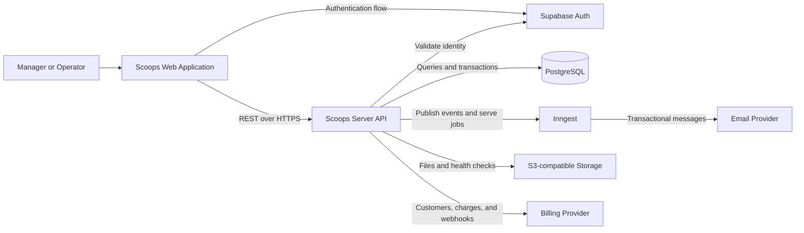
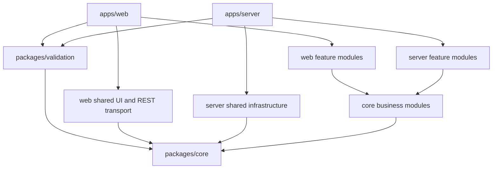
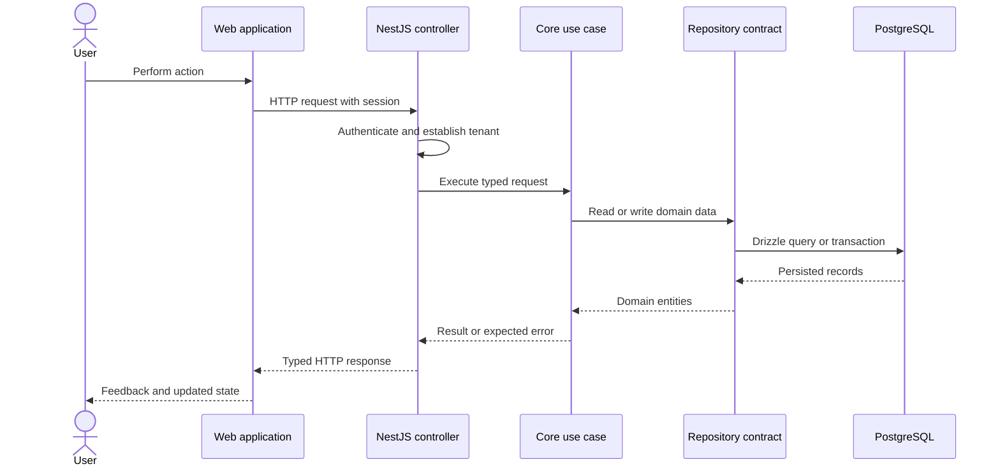
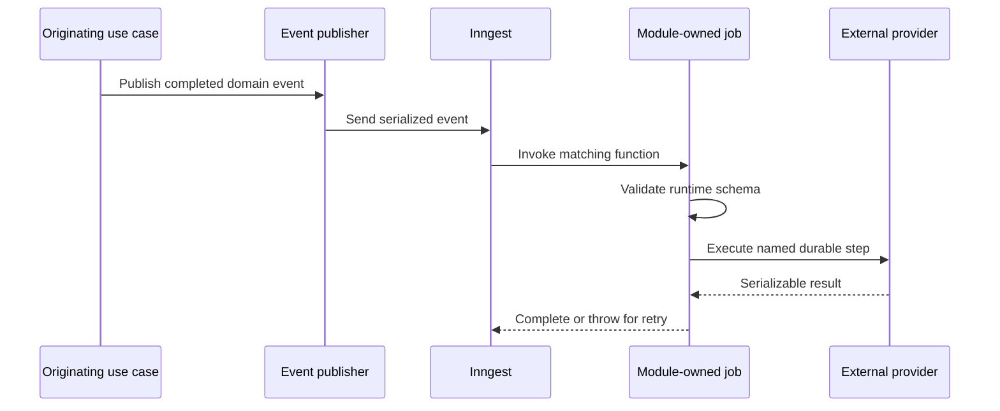

# Scoops Architecture

This document describes the system-level architecture of Scoops: the runtime
components, dependency direction, application layers, data and integration
boundaries, and the constraints that must remain true as the product evolves.

Business ownership belongs in [`modules.md`](modules.md). Product behavior belongs
in the module PRDs. Source organization and implementation conventions belong in
[`rules.md`](rules.md).

## 1. Purpose and scope

Scoops is a multi-tenant SaaS for ice cream and açaí shops. It supports the
administrative and operational lifecycle of an establishment, including identity,
commercial access, catalog and inventory, production, point of sale, and
communication.

The architecture uses a modular monolith rather than independently deployed
business services. Business modules are isolated in source and contracts while
sharing one backend process and one PostgreSQL database. This keeps transactions,
local development, and operational deployment simple without sacrificing clear
ownership boundaries.

The primary architectural goals are:

- strict isolation of each establishment's data and operations;
- one authoritative backend for business and authorization decisions;
- infrastructure-independent domain rules;
- atomic and auditable critical operations;
- explicit module and provider boundaries;
- durable asynchronous processing for side effects and cross-module reactions;
- accessible, responsive, and observable user workflows;
- an evolutionary path that does not require premature distributed services.

## 2. Architectural invariants

The following constraints apply across every module and feature:

1. **The backend is authoritative.** The web application may provide immediate
   validation and adapt its UI, but it cannot authorize an action, establish a
   price, confirm stock, or finalize a business operation by itself.
2. **Every tenant-owned operation is scoped to an establishment.** A resource ID
   alone is insufficient when the operation also requires establishment
   ownership.
3. **Domain code has no framework dependency.** Core entities, events, contracts,
   and use cases do not import React, NestJS, Drizzle, Supabase, Inngest, or an
   external provider SDK.
4. **Modules own their data and behavior.** One module cannot import another
   module's database models, repositories, or internal implementation.
5. **Critical writes are atomic.** A business operation that changes several
   records succeeds as one transaction or leaves no partial result.
6. **External providers are replaceable adapters.** Provider-specific payloads,
   errors, credentials, and SDK types do not leak into core contracts.
7. **Events describe completed facts.** Their names and payloads are stable,
   serializable, and safe to retry.
8. **Operational history is preserved.** Records that explain sales, stock,
   production, billing, or access decisions must not be silently rewritten when
   current configuration changes.

## 3. System context



The web application is the user-facing experience. The server coordinates use
cases and is the only component allowed to access business data directly. The
domain core defines the meaning of operations, while the shared Validation package
defines reusable runtime schemas at application boundaries. Infrastructure services
provide identity, persistence, durable execution, storage, billing, and communication.

## 4. Runtime and deployment units

Scoops has two independently deployable applications and two shared source
packages:

| Unit | Runtime | Responsibility |
| --- | --- | --- |
| `apps/web` | Node.js/Nitro plus browser JavaScript | Server rendering, routing, UI composition, client state, and calls to the server API. |
| `apps/server` | Node.js/NestJS | REST API, authorization, use-case orchestration, persistence, messaging endpoint, and provider integrations. |
| `packages/core` | Imported TypeScript package | Domain entities, structures, errors, events, contracts, and use cases shared by the applications. |
| `packages/validation` | Imported TypeScript package | Zod schemas for browser forms, REST input, route search, environment configuration, and event payloads. |

Neither `packages/core` nor `packages/validation` has a network boundary.
PostgreSQL, Supabase, MinIO, Mailpit, and Inngest run as local supporting
containers; production may use managed equivalents without changing application
boundaries.

## 5. Technology decisions

| Area | Technology | Status | Architectural role |
| --- | --- | --- | --- |
| Language | TypeScript | Current | Shared language across applications and core contracts. |
| Monorepo | pnpm and Turborepo | Current | Workspace dependency management and coordinated tasks. |
| Web | React and TanStack Start | Current | Isomorphic rendering and application composition. |
| Form state and validation | React Hook Form and Zod | Current | Browser form state, typed input validation, accessible field errors, and submit orchestration. |
| Routing | TanStack Router | Current | Typed file-based routes, navigation, and route lifecycle. |
| Web build/runtime | Vite and Nitro | Current | Development, client/SSR builds, and production Node server. |
| Styling | Tailwind CSS and design tokens | Current | Responsive UI and reusable visual foundations. |
| Server | NestJS | Current | Dependency composition, HTTP adapter, modules, and lifecycle. |
| API contract | REST and OpenAPI/Swagger | Current | Browser-to-server operations and discoverable HTTP documentation. |
| Domain | `@scoops/core` | Current | Framework-independent business model and contracts. |
| Runtime validation | `@scoops/validation` and Zod | Current | Shared syntactic schemas for forms, transport inputs, route search, environment and event boundaries. |
| Persistence | PostgreSQL and Drizzle ORM | Current | Transactional data, repositories, and schema evolution. |
| Identity | Supabase Auth | Foundation current | External identity and session lifecycle. |
| Messaging | Inngest | Current foundation | Event-triggered jobs, retries, steps, and observability. |
| Object storage | S3-compatible storage/MinIO | Current foundation | File storage behind server-owned adapters. |
| Billing | Asaas | Planned | Subscription customers, charges, and billing webhooks. |
| Email | Resend and React Email | Planned | Transactional delivery and message composition. |
| Quality | TypeScript, Biome, Vitest, Playwright | Current | Static checks and automated validation at several boundaries. |

## 6. Repository and dependency architecture



Features may use shared infrastructure, but shared directories cannot import
feature jobs, controllers, repositories, or policy. Root composition modules are
the only places that combine independent feature and infrastructure
registrations. Ownership is defined in [`modules.md`](modules.md).

## 7. Layer responsibilities

| Layer | Primary location | Owns | Must not own |
| --- | --- | --- | --- |
| Presentation | `apps/web/src/ui`, `apps/web/src/routes` | User interaction, view state, accessibility, navigation, and feedback. | Authoritative permissions or business invariants. |
| Web application adapters | `apps/web/src/rest`, contexts and hooks | HTTP transport, service factories, browser-safe configuration, and application state wiring. | Database access or server credentials. |
| Server application | NestJS controllers and feature modules | HTTP translation, dependency wiring, use-case invocation, and application composition. | Duplicated domain decisions. |
| Domain/application core | `packages/core/src` | Entities, structures, errors, events, contracts, and business use cases. | Framework, database, HTTP, environment, or SDK concerns. |
| Runtime validation | `packages/validation/src` | Reusable Zod schemas, schema composition, syntactic refinement and inferred boundary types. | Authorization, tenant ownership, persistence checks or business decisions. |
| Persistence | `apps/server/src/<module>/database` | Drizzle models, mappers, repositories, and transactional persistence. | Product policy beyond persistence semantics. |
| Shared infrastructure | `apps/server/src/shared` | Database client, environment, time, REST errors, messaging transport, and other reusable adapters. | Feature-specific behavior. |
| External adapters | Owning server module or shared provision boundary | SDK calls and translation to core contracts. | Provider types leaking into core or unrelated modules. |

## 8. Web application architecture

The web application follows a feature-first UI structure:

```text
apps/web/src/
├── constants/        browser environment and route constants
├── rest/             HTTP transport and service adapters
├── routes/           thin TanStack Router route declarations
└── ui/
    ├── <module>/     module-owned pages, widgets, and application hooks
    └── shared/       reusable contexts, hooks, layouts, styles, and components
```

Key constraints:

- routes remain thin and delegate rendering to module-owned pages;
- `RootLayout` composes global providers such as React Query and REST context;
- Axios owns transport while feature services map operations to server routes;
- one boundary validates browser-safe `VITE_` configuration;
- credentials and direct PostgreSQL access never enter the browser bundle;
- generated route metadata is regenerated, never manually edited;
- SSR and hydration produce equivalent user-visible state.

### Form state and browser validation

Every user-submitted form in `apps/web/src/ui` uses React Hook Form as its local
form-state boundary and a Zod schema from `@scoops/validation` through
`zodResolver`. `packages/validation` keeps every schema in its own module and
is the runtime-validation boundary for forms, REST payloads, route search,
environment configuration, and event data. It may depend on `@scoops/core` to
derive enum schemas from core structures; core must never depend on it.

The form hook owns registration, default values, reset behavior, validation
errors, and submit handling; widgets remain responsible for labels, controls,
`aria-invalid`, error descriptions, and pending-state presentation.

Browser validation is a usability boundary, not an authorization or business
rule boundary. Form handlers pass validated input to the existing web action or
REST adapter, while the NestJS and core layers independently validate,
authorize, and enforce the authoritative operation. Server failures are shown
through the established field or toast feedback without attempting to duplicate
server decisions in a Zod schema.

The UI may optimistically represent an operation only when it can reconcile with
the authoritative server result and expose failure recovery. Security must never
depend on a hidden button or client-side route guard.

## 9. Server application architecture

The server is a NestJS modular monolith. `AppModule` is the application
composition root and combines shared infrastructure with Identity, Billing, MRP,
PDV, and Communication modules.

Feature modules follow this conceptual structure as capabilities are added:

```text
apps/server/src/<module>/
├── constants/        dependency-injection tokens
├── database/         module-owned persistence adapters
├── decorators/       module route grouping where applicable
├── messaging/        module-owned asynchronous jobs
├── rest/             controllers and HTTP DTOs where applicable
└── <module>.module.ts
```

The server boundary performs the following sequence:

1. receive and validate framework input;
2. establish authenticated identity and tenant context;
3. resolve repository and provider dependencies;
4. invoke the owning core use case;
5. commit persistence changes atomically;
6. publish required business events;
7. translate the result or expected error into the transport response.

NestJS modules own registration, not business meaning. Controllers remain thin
HTTP adapters. Repositories implement core contracts. Shared providers expose
small technical capabilities such as environment access or current time.

## 10. Core package architecture

`@scoops/core` is the framework-independent domain boundary shared by both apps.
Its explicit subpaths expose:

- **entities** represent independently identifiable domain records;
- **structures** represent values, requests, filters, and configuration;
- **errors** describe expected application failures without HTTP status codes;
- **events** expose a stable `_NAME` and serializable business-fact payload;
- **interfaces** define repository and provider capabilities implemented by
  application infrastructure;
- **use cases** enforce business rules and coordinate contracts for one action.

Core remains deterministic under mocked contracts and time. It never reads the
environment, opens connections, performs HTTP requests, or creates SDK clients.

## 11. HTTP and synchronous request flow

The public application API is RESTful and documented through Swagger at `/docs`.
Controllers expose one application action per class, convert HTTP input to a core
request, invoke the use case, and return its result.



The shared REST boundary translates expected domain errors. Unknown errors return
a generic response without stack traces, queries, credentials, or provider
payloads. APIs remain compatible with deployed web versions; breaking changes
need an explicit migration or versioning strategy.

## 12. Identity, tenancy, and authorization

Supabase Auth owns external identity and session issuance. Scoops owns local user
status, profile, establishment membership, and business authorization.

Authentication and authorization are separate checks:

1. **Authentication:** verify that the request carries a valid provider-issued
   identity.
2. **Local access:** load the corresponding Scoops user and reject inactive,
   pending, or otherwise unavailable access.
3. **Authorization:** verify that the user's profile can perform the requested
   action.
4. **Tenant scope:** verify that every affected resource belongs to the user's
   establishment.

The web application may hide unavailable actions for clarity, but the server
repeats all four checks for protected operations.

Tenant isolation is currently enforced by server use cases and repositories.
Row-Level Security for business tables is not part of the initial architecture.
Consequently, repository methods and queries must receive enough context to
prevent a resource from being accessed by ID outside its establishment.

Service-role keys, database credentials, signing keys, and provider secrets are
server-only. CORS limits browser origins but is not an authorization mechanism.

## 13. Persistence and consistency

PostgreSQL is the system of record for Scoops business data. The server accesses
it through Drizzle ORM; the web application never connects directly.

Persistence is organized by module:

- each business module owns its models, mappers, repositories, and seed behavior;
- one shared barrel exposes owned models to Drizzle and migrations;
- core repository interfaces define behavior without query-builder details;
- concrete repositories map persisted rows into domain entities;
- migrations are reviewed, versioned, and applied before dependent code.

Transactions are required when one business action changes multiple records that
must remain consistent. Examples include recording production with stock
movement, registering an order with inventory consumption, or applying a billing
state transition with its audit record.

Historical records preserve the values that explain an operation when it
occurred. Orders do not change when products, prices, combos, or channels are
edited later; the same applies to billing acceptances, stock movements, and
access audits.

Destructive maintenance, schema push, and seed operations are environment-bound
tooling actions and never part of normal production request handling.

## 14. Events and asynchronous processing

Business events allow one module or external side effect to react to a fact
without moving ownership of that fact. Event classes live in the owning core
module and expose a stable `_NAME`, for example
`identity/user-registration-attempt.created`.

The server uses the event class `_NAME` when defining an Inngest trigger. It does
not duplicate event names as infrastructure string literals.



`AppModule` owns the single `InngestModule.forRoot({ client, functions })`
registration. Shared messaging owns the client and `/api/inngest` transport.
Feature modules own their jobs and explicit function registries.

Asynchronous handlers must:

- validate external event data at runtime;
- use stable function and step identifiers;
- perform side effects inside durable steps;
- be idempotent or use an idempotency key;
- throw retryable failures instead of silently acknowledging incomplete work;
- avoid secrets and unnecessary personal data in event payloads;
- delegate business decisions to the owning core use case.

When persistence and event publication must be atomic, the implementation needs
a transactional publication strategy, such as an outbox processed after commit.
Publishing directly after a database commit does not by itself guarantee delivery
if the process fails between those operations.

## 15. External integrations and files

Every provider is wrapped by an adapter owned by the module that uses it, unless
the technical capability is intentionally shared by several modules.

| Integration | Owning boundary | Core-facing capability |
| --- | --- | --- |
| Supabase Auth | Identity | Authentication and identity operations. |
| Asaas | Billing | Customer, subscription, charge, and webhook operations. |
| Resend/React Email | Communication | Transactional message delivery and composition. |
| MinIO/S3 | Shared provision or owning module | Object storage without provider-specific types. |
| Inngest | Shared messaging plus feature jobs | Event publication and durable function execution. |

Adapters translate provider responses and errors into core contracts. Webhooks
require signature verification, runtime validation, deduplication, and an
idempotent application operation. Provider outages must not corrupt local state;
timeouts, retries, fallback, and operator visibility are explicit.

PostgreSQL stores file metadata and ownership; S3-compatible storage holds binary
content behind a server adapter. The server validates tenant ownership, type,
size, and operation. Immutable records need stable references and retention, so
deleting a current entity cannot remove files still required by history.

## 16. Error handling and observability

Operational visibility is required at each boundary:

- HTTP requests need status, latency, route, and correlation context;
- database operations need failure and saturation visibility without logging
  sensitive query values;
- asynchronous jobs need function, event, attempt, step, and terminal status;
- provider calls need dependency name, duration, outcome, and safe error class;
- business-critical transitions need auditable domain records where required by
  the owning PRD.

The server health endpoint checks PostgreSQL, Supabase, and S3-compatible storage;
Swagger exposes the HTTP surface.

Structured logs, correlation IDs, metrics, tracing, alerting, and dashboards are
evolution requirements. Never hide their absence by discarding errors. Telemetry
excludes credentials, tokens, full financial identifiers, and unnecessary PII.

## 17. Quality strategy

Validation occurs at the narrowest boundary that can prove the behavior:

| Boundary | Primary verification |
| --- | --- |
| Core use case | Deterministic unit test with mocked contracts. |
| Repository and mapper | Database integration test against isolated PostgreSQL. |
| REST controller | HTTP integration test with real application wiring and controlled providers. |
| Messaging job | Event schema, durable steps, retries, and mocked external adapter. |
| Web widget or hook | Vitest and Testing Library. |
| User workflow | Playwright against the required running services. |
| Build boundary | Type checks, Biome, and production builds for affected workspaces. |

Tests preserve production dependency boundaries. Fixtures that override auth or
infrastructure prove isolation, not full application composition. Priority flows
are authentication, onboarding, authorization, subscription access, inventory,
production, order registration, and transactional communication.

## 18. Performance and resilience

Scale the modular monolith vertically and through stateless web/server replicas
before extracting services. Measure impact before adding caches, queues, or
replicas. In particular:

- paginate unbounded collections and avoid loading complete histories;
- index tenant, status, date, and lookup fields used by critical queries;
- avoid N+1 repository and provider calls;
- enforce timeouts on external operations;
- use Inngest concurrency, retry, rate-limit, and idempotency controls for
  asynchronous work;
- keep processes stateless outside database, object storage, and messaging;
- degrade noncritical integrations without accepting an invalid core operation;
- extract a service only when measured scaling, isolation, release cadence, or
  ownership needs outweigh network and consistency complexity.

## 19. Environment and delivery architecture

Local development uses Docker Compose for PostgreSQL, Supabase services, Mailpit,
MinIO, and Inngest. The web and server normally run as local pnpm processes.

Environment configuration is separated by boundary:

- the root `.env` configures Docker Compose;
- `apps/server/.env` contains server and provider configuration;
- `apps/web/.env` contains browser-safe `VITE_` variables only.

Production and staging use managed secrets. Migrations run before dependent code;
deployments support health verification and rollback or forward repair.

Automated CI/CD is a planned operational capability; the repository's current
automation status and valid local commands are documented in
[`tooling.md`](tooling.md).

## 20. Architectural evolution

Evolution follows these rules:

- add a capability to the module that owns its business lifecycle;
- prefer extending an existing contract over importing another module's internals;
- introduce a provider only behind an explicit adapter;
- document a new cross-module event before depending on it;
- update migrations, contracts, PRDs, and tests together;
- distinguish current from planned capabilities;
- record decisions that change an invariant, provider boundary, consistency
  model, or deployment topology.

## 21. Related documents

- [Business Modules](./modules.md)
- [Product Requirements](./prds/)
- [Repository Rules](./rules.md)
- [Design System](./design.md)
- [Tooling](./tooling.md)
- [Validation Package Rules](./rules/validation-package-rules.md)
- [Messaging Layer Rules](./rules/messaging-layer-rules.md)
- [Database Layer Rules](./rules/database-layer-rules.md)
- [REST Layer Rules](./rules/rest-layer-rules.md)
- [UI Layer Rules](./rules/ui-layer-rules.md)
