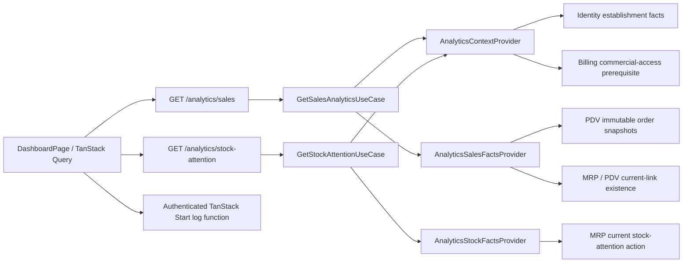

# Operational Analytics Dashboard

## 1. Context and scope

### Objective and source

Implement GitHub Issue [#40](https://github.com/rafinel/scoops/issues/40) as a complete, design-backed Manager Dashboard. A Manager must be able to understand recent establishment sales, estimated gross margin, product and channel leaders, cancellations and the most urgent current stock constraint within the Analytics PRD's 30-second usability target. This is a **complete** Spec because the outcome crosses Core, Identity, PDV, MRP, Server, Database and Web boundaries and requires a migration.

### Current behavior and product gap

The authenticated root route renders only the application shell. Dashboard navigation is visible to both profiles, but no Analytics module, API, aggregation, chart, coverage disclosure or stock-attention surface exists. Orders preserve commercial snapshots but not registration-time component costs or exact allocated net sales. Establishments have no persisted business timezone even though Identity PRQ-11 requires it. MRP can calculate individual stock and recipe facts but exposes no establishment-wide attention projection. Billing Core defines commercial-access types, but the server has no authoritative subscription persistence/provider; this is a hard prerequisite rather than Analytics-owned work.

### Scope and product alignment

| Area                 | In scope                                                                                                                     | Out of scope                                                                                     |
| -------------------- | ---------------------------------------------------------------------------------------------------------------------------- | ------------------------------------------------------------------------------------------------ |
| Dashboard audience   | Manager-only root dashboard for one active establishment with full commercial access                                         | Operator access, cross-establishment or consolidated views                                       |
| Periods              | Today, previous 7, 30 and 90 local calendar days; default 30; equal immediately preceding comparison; explicit bounds        | Custom dates, periods over 90 days, viewer/device timezone                                       |
| Sales                | Net sales, valid orders, average ticket, cancellations, comparison deltas and exact reconciled evolution buckets             | Accounting revenue, payment reconciliation, cash flow, tax or net profit                         |
| Margin               | Registration-time estimated COGS, estimated gross margin and explicit coverage detail; missing cost remains unknown          | Retrospective reconstruction from current cost, stock valuation                                  |
| Rankings             | Top five products by allocated net sales or quantity; all channels including No channel                                      | Pagination, exports, secondary reports, brand/size top-level ranking                             |
| Stock                | At most five current MRP-classified zero, below-ideal or limited-production items                                            | Historical stock reporting, forecasting, goals or automatic replenishment                        |
| Refresh and recovery | Open, five-minute stale focus and manual refresh; independent sales and stock boundaries                                     | Realtime streaming, polling or background push                                                   |
| Instrumentation      | Privacy-safe structured logs without product-measurement persistence                                                         | Telemetry table, product-measurement retention or customer/order payload logging                 |
| Foundations          | Identity business timezone; PDV immutable cost/allocation snapshots; MRP attention facts; Analytics-owned provider contracts | Billing subscription/trial implementation, Asaas integration or global commercial-access rollout |

| Source requirement            | Delivery              | Notes                                                                                                                                             |
| ----------------------------- | --------------------- | ------------------------------------------------------------------------------------------------------------------------------------------------- |
| Analytics PRQ-01              | full                  | Manager access, establishment timezone and presets are implemented end to end.                                                                    |
| Analytics PRQ-02              | full                  | Summary, comparisons and cancellation restatement/activity are included.                                                                          |
| Analytics PRQ-03              | full                  | Margin, unknown cost, coverage and detail disclosure are included.                                                                                |
| Analytics PRQ-04              | full                  | Exact evolution buckets, empty buckets and accessible table are included.                                                                         |
| Analytics PRQ-05              | full                  | Product ranking is top five in either selected sort mode.                                                                                         |
| Analytics PRQ-06              | full                  | Every valid order belongs to one reconciled channel or No channel group.                                                                          |
| Analytics PRQ-07              | full                  | Current stock attention is independent of the selected sales period.                                                                              |
| Analytics PRQ-08              | full                  | Navigation, refresh, stale, empty, error, loading, responsive and drill-down behavior is included.                                                |
| Analytics PRQ-09              | full                  | Required observations are emitted as privacy-safe structured logs; no Analytics telemetry rows are stored.                                        |
| Identity PRQ-11               | partial               | Delivers the establishment timezone and its Manager settings/audit behavior; establishment-name behavior remains unchanged.                       |
| PDV PRQ-08 and PRQ-09         | partial               | Delivers registration-time cost capture, completeness and exact sales allocation needed by Analytics; unrelated order behavior remains unchanged. |
| MRP PRQ-03, PRQ-06 and PRQ-09 | partial               | Delivers current cost and stock-attention facts consumed by PDV and Analytics; owning MRP rules remain authoritative.                             |
| Billing PRQ-02 and PRQ-05     | deferred prerequisite | Billing must provide authoritative full/restricted/none access. Missing access data must never be interpreted as full access.                     |

### Product decisions and assumptions

- Establishment timezone is authoritative. Existing and new establishments default to `America/Sao_Paulo`; Managers may select a supported Brazilian IANA timezone. Stored timestamps remain UTC instants.
- The 90-day chart uses establishment-local Monday–Sunday calendar weeks; the first and last buckets are clipped to the exact interval.
- Product ranking returns at most five rows in both Net Sales and Quantity modes.
- Sales and stock use separate request and recovery boundaries. Data becomes stale after five minutes.
- Initial loading uses layout-matched skeletons for every data-bearing dashboard region. Sales and stock skeletons resolve independently; cached content remains visible during refresh.
- Recharts is the approved chart library. The exact-value table action is visible at every viewport.
- Cost-coverage detail and timezone settings follow the accepted visual assumptions in [the design manifest](./design/manifest.md).
- Analytics Core owns its actor, access, sales, stock and service contracts. Cross-module adapters may translate Identity, Billing, PDV and MRP facts into those types; Analytics Core does not import feature types from those modules.
- Billing availability is a fail-closed prerequisite. This Spec does not invent a legacy-full-access fallback or implement subscription lifecycle behavior.

## 2. Implementation Contract

### Functional requirements

| ID      | PRQ/source coverage                                     | Required behavior                                                                                                                                                                                                                                                                                                                                                                                                                                                                                                                                                                                                                                                                                                                                                                                 |
| ------- | ------------------------------------------------------- | ------------------------------------------------------------------------------------------------------------------------------------------------------------------------------------------------------------------------------------------------------------------------------------------------------------------------------------------------------------------------------------------------------------------------------------------------------------------------------------------------------------------------------------------------------------------------------------------------------------------------------------------------------------------------------------------------------------------------------------------------------------------------------------------------- |
| `FR-01` | Analytics PRQ-01; Billing PRQ-05                        | Only an authenticated Manager of the active tenant with an active establishment and authoritative `full` commercial access can see or request Analytics. Operators lack the navigation item and receive no Analytics data. Missing or non-full commercial access fails closed.                                                                                                                                                                                                                                                                                                                                                                                                                                                                                                                    |
| `FR-02` | Analytics PRQ-01                                        | The dashboard defaults to the previous 30 local calendar days and offers Today, 7, 30 and 90 days. The server derives selected and equal preceding comparison intervals from the persisted establishment timezone and returns timezone, inclusive local dates and exclusive UTC bounds explicitly.                                                                                                                                                                                                                                                                                                                                                                                                                                                                                                |
| `FR-03` | Analytics PRQ-02                                        | Summary reports eligible currently registered orders by registration instant: net sales, valid-order count and average ticket. Each metric shows absolute and percentage comparison; zero comparison base yields No comparison basis and equal nonzero values yield neutral `0.0%`. No eligible orders yields unavailable average ticket.                                                                                                                                                                                                                                                                                                                                                                                                                                                         |
| `FR-04` | Analytics PRQ-02; PDV PRQ-15                            | A canceled order is excluded from its original selected/comparison period even when canceled later. Cancellation activity separately reports count and snapshotted order value by `canceledAt` inside the selected interval, including orders registered before it.                                                                                                                                                                                                                                                                                                                                                                                                                                                                                                                               |
| `FR-05` | Analytics PRQ-03; PDV PRQ-08–PRQ-09; MRP PRQ-06, PRQ-09 | New orders atomically preserve every required component's registration-time operating cost or explicit unknown state. Eligible covered net sales, historical COGS, estimated gross margin and coverage reconcile from immutable snapshots; missing cost is not zero and never blocks registration.                                                                                                                                                                                                                                                                                                                                                                                                                                                                                                |
| `FR-06` | Analytics PRQ-03                                        | Coverage detail exposes covered net sales, covered COGS, estimated margin, uncovered net sales and affected product snapshots. Existing products link to their current cost surface; deleted products remain readable without an actionable link. Copy states that the estimate is not accounting or net profit.                                                                                                                                                                                                                                                                                                                                                                                                                                                                                  |
| `FR-07` | Analytics PRQ-04                                        | Sales evolution returns every bucket, including zero buckets: Today hourly, 7/30 daily and 90 days in clipped Monday–Sunday weeks. Bar net-sales and line order-count totals exactly reconcile with the selected summary and are available in a semantic table.                                                                                                                                                                                                                                                                                                                                                                                                                                                                                                                                   |
| `FR-08` | Analytics PRQ-05                                        | Product performance groups immutable product snapshots, attributes paid accompaniment revenue and cost to the parent Portion, and returns the top five by selected Net Sales or Quantity order. Net-sales allocations use pre-Combo values and deterministic cent residual assignment so lines equal order totals. Each row reports margin/coverage and links only an existing product.                                                                                                                                                                                                                                                                                                                                                                                                           |
| `FR-09` | Analytics PRQ-06                                        | Channel performance assigns every valid order to its immutable channel snapshot or No channel; reports net sales, share, count and average ticket; sorts descending by net sales with deterministic ties; and reconciles exactly to summary totals. Existing channels link to Sales Channels; deleted channels remain snapshot-only.                                                                                                                                                                                                                                                                                                                                                                                                                                                              |
| `FR-10` | Analytics PRQ-07; MRP PRQ-03, PRQ-06                    | Stock attention is a current, period-independent list of at most five MRP-owned facts ordered zero stock, below ideal, then limited production, with deterministic severity ties. Rows show the authoritative quantity/capacity message and link to the current stock or recipe surface.                                                                                                                                                                                                                                                                                                                                                                                                                                                                                                          |
| `FR-11` | Analytics PRQ-08                                        | Opening the route fetches both boundaries. During first load, every data-bearing sales region—four KPIs, cancellations, evolution chart, products and channels—and the independent stock-attention region renders a responsive, final-shape skeleton while the header and period controls remain visible. Each source exposes one accessible loading status; decorative skeleton pieces are hidden from assistive technology, reduced motion disables shimmer, and cached refreshes retain real content instead of reverting to skeletons. Returning focus refetches a boundary after five minutes stale; manual refresh refetches both. A refreshing failure preserves prior content and labels it stale; first-load failure offers targeted retry. One source never erases or blocks the other. |
| `FR-12` | Analytics PRQ-08                                        | No valid orders provides a New sale CTA; zero cost coverage keeps sales visible and offers Review costs; no stock attention confirms the healthy current state. Drill-downs carry the selected period where the destination supports it and never create a second report.                                                                                                                                                                                                                                                                                                                                                                                                                                                                                                                         |
| `FR-13` | Analytics PRQ-08; Design                                | Desktop, 390px and 320px layouts follow the saved design bundle, approved deviations and Scoops tokens. The route, selectors, dialogs, table disclosure, focus order, status announcements and chart alternative meet WCAG 2.2 AA and work by keyboard without horizontal document scrolling.                                                                                                                                                                                                                                                                                                                                                                                                                                                                                                     |
| `FR-14` | Identity PRQ-11                                         | Shop Settings displays and lets a Manager change the establishment business timezone using readable Brazilian labels backed by IANA values. Changes are audited with previous/new value, actor and instant; Operators cannot read or mutate the setting.                                                                                                                                                                                                                                                                                                                                                                                                                                                                                                                                          |
| `FR-15` | Analytics PRQ-09                                        | Dashboard visits, period changes, focus/manual refreshes, drill-downs, missing coverage, source failures, stale presentation and reconciliation failures emit bounded structured events containing tenant ID, event name, timestamp and enumerated context only. Logging failures never block the user flow and no product-measurement rows are persisted.                                                                                                                                                                                                                                                                                                                                                                                                                                        |

### Acceptance criteria

| ID      | FR coverage      | Requirement                              | Given                                                                                                                                   | When                                                               | Then                                                                                                                                                                                                                                                                                                                                                                                           | Expected evidence                                                                                                 |
| ------- | ---------------- | ---------------------------------------- | --------------------------------------------------------------------------------------------------------------------------------------- | ------------------------------------------------------------------ | ---------------------------------------------------------------------------------------------------------------------------------------------------------------------------------------------------------------------------------------------------------------------------------------------------------------------------------------------------------------------------------------------- | ----------------------------------------------------------------------------------------------------------------- |
| `AC-01` | `FR-01`          | Role, tenant and commercial access       | Manager, Operator, cross-tenant IDs, active/inactive establishments and full/restricted/missing Billing fixtures                        | The route and both endpoints are requested                         | Only the active, full-access Manager's tenant data is returned; every other case is hidden or rejected without existence leakage                                                                                                                                                                                                                                                               | Analytics use-case/controller tests; route boundary test; `MV-01`, `MV-06`                                        |
| `AC-02` | `FR-02`          | Period boundaries                        | Fixed `DatetimeProvider` around local midnight and month/week boundaries                                                                  | Each preset is selected                                            | Returned UTC bounds, local labels and equal comparison duration match the establishment timezone; default is 30 days                                                                                                                                                                                                                                                                           | `GetSalesAnalyticsUseCase` tests; controller test                                                                 |
| `AC-03` | `FR-03`, `FR-04` | Summary and cancellation semantics       | Registered and later-canceled orders across selected/comparison/cancellation boundaries, including more than one 500-order source batch | Sales Analytics is calculated                                      | Summary, deltas, no-basis cases and cancellation activity match exact fixtures; canceled orders are removed from original periods; no batch is truncated or counted twice                                                                                                                                                                                                                      | Core tests; HTTP/database integration fixture; `MV-01`                                                            |
| `AC-04` | `FR-05`, `FR-08` | Atomic immutable cost/allocation capture | Portion, Resale, accompaniment and Combo orders with known, zero, missing and foreign-tenant cost references                            | Registration commits, replays or fails                             | One committed/replayed order has deterministic line allocations and component snapshots; missing is null/unknown; foreign-tenant references fail; failures persist neither order nor stock/outbox/cost changes; later MRP edits do not change history                                                                                                                                          | Register-order and MRP stock-action Core tests; PDV HTTP integration tests; migrated database assertions; `MV-05` |
| `AC-05` | `FR-05`, `FR-06` | Margin coverage                          | Mixed covered/uncovered valid lines including deleted products                                                                          | Dashboard and coverage dialog load                                 | Covered sales, COGS, margin, uncovered value, coverage percentage and affected products reconcile; zero coverage is unavailable, not zero margin; only current products link                                                                                                                                                                                                                   | Analytics tests; dialog/widget tests; `MV-05`                                                                     |
| `AC-06` | `FR-07`          | Evolution reconciliation                 | Fixed Today, 7, 30 and 90-day fixtures with empty buckets                                                                               | Chart result is rendered and table opened                          | Bucket count/bounds are correct, empty buckets are present, bar/line totals equal summary, and table exposes exact values semantically                                                                                                                                                                                                                                                         | Analytics tests; chart widget test; `MV-01`–`MV-03`                                                               |
| `AC-07` | `FR-08`          | Product ranking                          | More than five products, ties, paid accompaniments, Combos and deleted products across source batches                                   | Sort mode changes                                                  | Exactly the deterministic top five for the selected mode appears; attribution/allocation is exact; deleted rows have no link; current-product resolution is deduplicated and batch-scoped without N+1 reads                                                                                                                                                                                    | Analytics Core/HTTP integration and product widget tests; `MV-01`, `MV-03`                                        |
| `AC-08` | `FR-09`          | Channel reconciliation                   | Active, deleted and absent channel snapshots                                                                                            | Channel performance loads                                          | All valid orders appear exactly once, shares and averages are correct, totals reconcile and only current channels link                                                                                                                                                                                                                                                                         | Analytics and channel widget tests; `MV-01`                                                                       |
| `AC-09` | `FR-10`          | Current stock priorities                 | Zero, below-ideal, limited-production, normal and tied MRP fixtures spanning multiple bulk pages                                        | Stock attention loads under any period                             | MRP classifications remain authoritative, ordering is deterministic, at most five rows appear, bulk query count is page-bounded without N+1 reads and period changes do not refetch solely because of period                                                                                                                                                                                   | MRP/Analytics Core tests; HTTP integration query observation; stock widget test; `MV-01`, `MV-04`                 |
| `AC-10` | `FR-11`          | Independent refresh and recovery         | Success, first-load failure and prior-success refresh-failure per source                                                                | Open, focus after five minutes, manual refresh and retry occur     | Fetch triggers are correct, prior content survives as stale, targeted retries recover, and the unaffected source remains usable                                                                                                                                                                                                                                                                | Page/hook tests; route boundary test; `MV-04`, `MV-06`                                                            |
| `AC-11` | `FR-12`          | Empty and unavailable states             | No orders, zero cost coverage and no stock attention fixtures                                                                           | Dashboard renders                                                  | Approved copy and CTAs appear, destinations are correct, and states remain distinct                                                                                                                                                                                                                                                                                                            | State/widget tests; `MV-05`, `MV-07`                                                                              |
| `AC-12` | `FR-12`, `FR-13` | Drill-down and keyboard behavior         | Populated Manager dashboard                                                                                                             | Manager navigates periods, table, dialog and row links by keyboard | Focus is visible and ordered; dialog traps/returns focus; final URLs preserve supported period context; no hidden interaction is pointer-only                                                                                                                                                                                                                                                  | Widget tests; `MV-01`, `MV-05`                                                                                    |
| `AC-13` | `FR-13`          | Responsive design fidelity               | Saved populated references                                                                                                              | Route renders at 1481px, 390px and 320px                           | Required hierarchy/order/tokens match the manifest, approved deviations appear, labels do not collide and no horizontal document overflow occurs                                                                                                                                                                                                                                               | Fresh screenshots; `MV-01`–`MV-03`                                                                                |
| `AC-14` | `FR-11`, `FR-13` | Accessible state fidelity                | Independent sales/stock loading, error, stale and empty fixtures                                                                        | Each state renders and loading resolves or refreshes               | Initial sales loading reserves the final KPI/cancellation/chart/product/channel geometry; initial stock loading reserves its final card geometry; one source may resolve while the other stays skeletonized; each source announces one loading status without announcing decorative pieces; reduced motion disables shimmer; cached refreshes keep content; retry/CTA behavior matches `T1jMu` | State/widget tests; route test; state screenshots; `MV-04`, `MV-07`                                               |
| `AC-15` | `FR-14`          | Timezone settings and audit              | Manager and Operator fixtures; supported/invalid timezones                                                                              | Settings are read or changed                                       | Default/current timezone is displayed; valid Manager change persists and audits; invalid input is rejected; Operator is forbidden; Analytics next request uses the changed zone                                                                                                                                                                                                                | Identity use-case/controller/widget/route tests; migration assertion; `MV-08`                                     |
| `AC-16` | `FR-15`          | Privacy-safe measurement                 | Each required interaction and failure fixture                                                                                           | Event occurs and logger succeeds or fails                          | One bounded structured event is attempted with no customer/order body; failure is swallowed after safe diagnostic handling; no telemetry table write exists                                                                                                                                                                                                                                    | Server-function and Analytics tests; log inspection in `MV-01`, `MV-04`–`MV-06`                                   |
| `AC-17` | `FR-01`–`FR-15`  | Usability target                         | Representative populated Manager fixture                                                                                                | Manager opens Dashboard                                            | Net sales, product leader, channel leader and highest-priority stock item can be identified within 30 seconds without hidden navigation                                                                                                                                                                                                                                                        | `MV-01` timed observation                                                                                         |

### Cross-cutting restrictions

| Concern             | Contract                                                                                                                                                                                                                                                         |
| ------------------- | ---------------------------------------------------------------------------------------------------------------------------------------------------------------------------------------------------------------------------------------------------------------- |
| Historical truth    | Never reconstruct historical COGS from current MRP values. Pre-migration orders receive deterministic commercial allocation but unknown cost coverage.                                                                                                           |
| Exact money         | New allocation and historical COGS totals are integer cents within JavaScript safe-integer bounds. Precise nullable component unit costs retain six-decimal input precision. Percentages are derived after integer aggregation.                                  |
| Temporal semantics  | Persist every event timestamp as a timezone-aware UTC instant. The server alone derives local period boundaries from the establishment IANA timezone; the browser renders returned local dates/labels and must not reinterpret them through the device timezone. |
| Tenant isolation    | Every database query is establishment-qualified before aggregation or existence checks; IDs from another tenant are indistinguishable from absent records.                                                                                                       |
| Source ownership    | PDV owns order/commercial/cancellation snapshots; MRP owns current cost, stock and production classification; Identity owns establishment timezone; Billing owns commercial access; Analytics only aggregates mapped facts.                                      |
| Failure isolation   | Sales-provider and stock-provider failures translate independently. Structured logging is best-effort and cannot alter endpoint or navigation outcomes.                                                                                                          |
| Secrets and privacy | No provider secrets, customer data, full order contents, free-text reasons or component-level sale payloads enter structured measurement logs.                                                                                                                   |

### Design Contract

The complete file-backed reference is [design/manifest.md](./design/manifest.md). Required populated comparisons are `1481 × 1232`, `390 × 2222` and `320 × 2222`; the state library is `1481 × 1254`. The implementation must reproduce the hierarchy and responsive ordering, add the accepted desktop table action, use the corrected 320px KPI/ranking composition and implement the accepted cost-coverage and timezone-dialog assumptions. Runtime content may vary, but state, spacing relationships, typography hierarchy, semantics and token roles may not drift. All fresh screenshots belong in the future `evaluation.md` evidence, not in this Spec.

## 3. Technical Contract

### Current technical state

| Evidence                                                                                       | Current responsibility                                 | Gap                                                                                                                                                                        |
| ---------------------------------------------------------------------------------------------- | ------------------------------------------------------ | -------------------------------------------------------------------------------------------------------------------------------------------------------------------------- |
| `apps/web/src/routes/index.tsx` and `AuthenticatedRoute`                                       | Protect and render the root AppLayout outlet           | No Manager middleware or Dashboard page                                                                                                                                    |
| `apps/web/src/constants/sidebar-items.ts`                                                      | Builds profile-filtered navigation                     | Dashboard has no Manager restriction                                                                                                                                       |
| `packages/core/src/pdv/domain/entities/order.ts` and `order-line.ts`                           | Preserve order and line commercial snapshots           | No allocated-net-sales cents or component-cost completeness                                                                                                                |
| `RegisterOrderUseCase` with legacy executor-bound MRP dependency factory                       | Atomically validates catalog and consumes stock        | MRP costs are absent; the factory passes Drizzle infrastructure across module boundaries and keeps inventory orchestration in server provision instead of MRP Core actions |
| `DrizzleOrdersRepository` and PDV order models                                                 | Persist and hydrate immutable order graphs             | No analytics-range read or cost-component model/index                                                                                                                      |
| MRP product, stock and recipe repositories/use cases                                           | Own current balances, ideal targets, cost and capacity | No establishment-wide deterministic attention action                                                                                                                       |
| Identity `Establishment`, settings use cases and Shop Settings page                            | Own establishment identity/name                        | PRD-required timezone is absent from domain, database, REST and UI                                                                                                         |
| Billing Core `BillingAccess` / `GetBillingAccessUseCase`; empty server `BillingDatabaseModule` | Defines access semantics only                          | No Billing-owned authoritative access registration is exported at runtime; Analytics integration is blocked until Billing PRQ-02/05 lands                                  |
| `RestContextValue` and provider                                                                | Compose Identity, MRP, PDV and Communication services  | No Analytics service                                                                                                                                                       |
| `apps/web/package.json`                                                                        | React/TanStack/shadcn client dependencies              | No chart library                                                                                                                                                           |

### Solution and runtime flow

Analytics exposes two read actions. Each controller maps the authenticated Account into `AnalyticsActor`; `GetSalesAnalyticsUseCase` or `GetStockAttentionUseCase` asks the Analytics-owned context provider for active-establishment, timezone and full-commercial-access facts before touching a source. The server composition adapter is the only boundary allowed to translate Identity and Billing types into `AnalyticsAccessContext`; absence or non-full Billing access raises authorization failure.

The sales action derives selected/comparison UTC intervals from the persisted IANA timezone and shared `DatetimeProvider`, then asks an Analytics-owned sales-facts provider to visit bounded batches from one establishment-qualified PDV snapshot covering registrations and selected cancellation activity. The provider keeps its database transaction open while it invokes the use case's batch consumer, and the adapter maps PDV orders and current MRP/product/channel existence into Analytics-owned facts. The use case performs integer-cent aggregation, bucket filling, comparison, coverage and rankings; any reconciliation mismatch is logged and returned as a safe service failure rather than inconsistent totals.

Order registration remains one PDV database transaction. `DrizzlePdvDatabase.run` establishes `DatabaseTransactionContext`; independently injected catalog/cost adapters enter exported `MrpDatabase.run`, while stock adapters only map PDV requests into MRP-owned consume/restore actions whose use cases enter the same database contract. `DrizzleMrpDatabase` reuses the active transaction without exposing an executor through Core or a feature database scope. PDV deterministically allocates final order cents across lines and persists each nullable component cost and historical extended COGS; MRP owns stock validation, balances, stock transactions and alerts; order/stock/outbox facts still commit atomically with idempotent replay. Existing orders are backfilled only with commercial allocation; their costs remain unknown.

The stock action obtains MRP-classified current facts through a separate adapter and slices the deterministic list to five. Sales and stock responses, errors, refreshes and query caches are independent. TanStack Query uses a five-minute `staleTime`, focus refetch and retained prior success. Pure UI interactions use a validated authenticated TanStack Start server function to emit non-persistent structured logs; API-side quality and provider events are logged at their owning server boundary. Logging is fire-and-forget with no retry or user-visible failure.



### Cross-boundary contracts

| Boundary                      | Producer                                                | Consumer                                                | Canonical contract                              | Mapping/guarantees                                                                                                                                                                                                         | Failure ownership                                                                  |
| ----------------------------- | ------------------------------------------------------- | ------------------------------------------------------- | ----------------------------------------------- | -------------------------------------------------------------------------------------------------------------------------------------------------------------------------------------------------------------------------- | ---------------------------------------------------------------------------------- |
| Session to Analytics          | Nest `CurrentAccount` decorator                         | Analytics controllers                                   | `AnalyticsActor`                                | Controller copies only actor/tenant/profile values; no Identity type crosses into Analytics Core                                                                                                                           | Authentication guard/controller                                                    |
| Identity/Billing to Analytics | `IdentityBillingAnalyticsContextProvider`               | Both Analytics use cases                                | `AnalyticsAccessContext`                        | Adapter consumes the prerequisite's authoritative Billing `BillingAccess`, translates it and Identity facts into Analytics-owned fields, and never exposes source types; missing Billing fact is never full                | Adapter translates unavailable; use case owns authorization                        |
| PDV/MRP to sales aggregation  | `PdvAnalyticsSalesFactsProvider.forEachBatch`           | `GetSalesAnalyticsUseCase` batch consumer               | `readonly AnalyticsSalesFact[]` per callback    | One tenant-qualified repeatable PDV order snapshot remains open across callbacks; immutable cents/cost facts plus separately sampled optional current links in batches of at most 500                                      | Adapter/provider unavailable; use case reconciliation failure                      |
| MRP to stock aggregation      | `MrpAnalyticsStockFactsProvider`                        | `GetStockAttentionUseCase`                              | `AnalyticsStockFact[]`                          | MRP classification/order is preserved; Analytics caps five                                                                                                                                                                 | MRP action/adapter                                                                 |
| PDV to MRP stock mutation     | Shared `MrpStockConsumer` / `MrpStockRestorer` adapters | `ConsumeOrderStockUseCase` / `RestoreOrderStockUseCase` | MRP-owned order stock structures                | Shared adapters only map PDV-owned requests/results and delegate; MRP actions own inventory validation, mutation, transaction records and alerts inside `MrpDatabase.run`, which reuses the active PDV transaction context | MRP actions own conflicts/skips; outer PDV action owns order-level rollback/result |
| HTTP sales                    | `GetSalesAnalyticsController`                           | `AnalyticsService.getSales`                             | `SalesAnalytics` / `analyticsPeriodQuerySchema` | Dates serialize as ISO instants plus local `YYYY-MM-DD`; cents remain integer JSON numbers                                                                                                                                 | Zod/controller/global translator/web service                                       |
| HTTP stock                    | `GetStockAttentionController`                           | `AnalyticsService.getStockAttention`                    | `StockAttention`                                | Current fact only; no period query                                                                                                                                                                                         | Controller/global translator/web service                                           |
| UI interaction log            | Analytics widgets                                       | `logAnalyticsInteraction` server function               | Enumerated `analyticsInteractionSchema`         | Authenticated Manager, bounded enum context, no persistence, no retries                                                                                                                                                    | Server function swallows logger failure after safe diagnostic                      |

### packages/core — Domain

| Declaration                                                                               | Kind             | Ownership/identity                             | Contract summary                                                       | Related declarations                              | Consumers                                  |
| ----------------------------------------------------------------------------------------- | ---------------- | ---------------------------------------------- | ---------------------------------------------------------------------- | ------------------------------------------------- | ------------------------------------------ |
| `AnalyticsActor`                                                                          | Structure        | Analytics-owned, identity-free request context | Minimal authenticated actor copy                                       | —                                                 | Analytics use cases/controllers            |
| `AnalyticsPeriod`, `AnalyticsInterval`                                                    | Structures       | Analytics-owned time vocabulary                | Preset and explicit local/UTC bounds                                   | `SalesAnalytics`                                  | Sales use case/REST/UI                     |
| `AnalyticsAccessContext`                                                                  | Structure        | Analytics-owned mapped access fact             | Active, full-access tenant and timezone                                | `AnalyticsActor`                                  | Both Analytics use cases                   |
| `AnalyticsSalesFact`                                                                      | Structure        | Analytics-owned immutable source fact          | One mapped order with line/cost/current-link facts                     | `OrderCostComponentSnapshot` mapping              | Sales use case/provider                    |
| `SalesAnalytics`                                                                          | Structure        | Analytics-owned projection                     | Complete selected/comparison summary and dashboard sections            | period/facts                                      | REST/UI                                    |
| `AnalyticsStockFact`, `StockAttention`                                                    | Structures       | Analytics-owned current projection             | MRP-classified source fact and capped result                           | —                                                 | Stock use case/REST/UI                     |
| `OrderCostComponentSnapshot`                                                              | Structure        | PDV-owned immutable value                      | One registration-time required cost component                          | `OrderLine`                                       | registration/persistence/Analytics adapter |
| `OrderLine`                                                                               | Structure        | PDV-owned immutable line                       | Existing line plus allocated net sales and cost coverage               | cost components                                   | order, mapper, Analytics adapter           |
| `Establishment`, `EstablishmentSettings`                                                  | Entity/Structure | Identity establishment                         | Existing fields plus authoritative timezone                            | `EstablishmentTimezone`                           | Identity use cases/REST/UI/context adapter |
| `OrderStockConsumption`, `OrderStockRestorationRequest`, `OrderStockRestoration` | Structures       | MRP-owned stock-mutation boundary vocabulary   | Tenant-qualified order sale/cancellation facts and restoration outcome | MRP product, balance, transaction and alert rules | MRP stock actions/shared PDV adapters      |
| `StockAttentionSourceFact`                                                             | Structure        | MRP-owned persistence fact                     | Raw current balance, ideal target and recipe-input availability        | product/stock/recipe facts                        | MRP bulk repository/action                 |
| `StockAttentionFact`                                                                   | Structure        | MRP-owned current fact                         | Authoritative attention classification and severity                    | product/stock/recipe facts                        | MRP action/Analytics adapter               |

| Path                                                                             | Change | Declaration                                 | Domain role/schema                                                    | Invariants/transitions                                                                                 | Errors/events                                          | Exports/consumers                         |
| -------------------------------------------------------------------------------- | ------ | ------------------------------------------- | --------------------------------------------------------------------- | ------------------------------------------------------------------------------------------------------ | ------------------------------------------------------ | ----------------------------------------- |
| `packages/core/src/analytics/domain/structures/analytics-actor.ts`               | Create | `AnalyticsActor` Structure                  | Minimal actor fields below                                            | Profile is Analytics-local `manager`/`operator`; controller is mapper                                  | —                                                      | Analytics structures barrel               |
| `packages/core/src/analytics/domain/structures/analytics-period.ts`              | Create | `AnalyticsPeriod` Structure                 | Preset schema below                                                   | Exact supported presets                                                                                | Invalid preset is boundary validation                  | Analytics structures barrel               |
| `packages/core/src/analytics/domain/structures/analytics-interval.ts`            | Create | `AnalyticsInterval` Structure               | Explicit local/UTC interval schema below                              | `endAt` exclusive; local dates inclusive                                                               | Invalid persisted timezone is unavailable              | Analytics structures barrel               |
| `packages/core/src/analytics/domain/structures/analytics-access-context.ts`      | Create | `AnalyticsAccessContext` Structure          | Access schema below                                                   | Full access only when all booleans true and timezone valid                                             | `AuthorizationError`, `ServiceUnavailableError`        | Analytics structures barrel               |
| `packages/core/src/analytics/domain/structures/analytics-sales-fact.ts`          | Create | `AnalyticsSalesFact` Structure              | Source schema below                                                   | One tenant; integer cents; missing cost is null; snapshots immutable                                   | Provider failure                                       | Analytics provider/use case               |
| `packages/core/src/analytics/domain/structures/sales-analytics.ts`               | Create | `SalesAnalytics` Structure                  | Projection schema below                                               | Exact reconciliation across summary/buckets/products/channels; comparisons deterministic               | Service failure on reconciliation                      | REST/UI                                   |
| `packages/core/src/analytics/domain/structures/analytics-stock-fact.ts`          | Create | `AnalyticsStockFact` Structure              | Current attention item below                                          | Source priority retained                                                                               | Provider failure                                       | Stock result/use case                     |
| `packages/core/src/analytics/domain/structures/stock-attention.ts`               | Create | `StockAttention` Structure                  | Current result below                                                  | Result length `0..5`                                                                                   | Provider failure                                       | REST/UI                                   |
| `packages/core/src/analytics/domain/structures/index.ts`                         | Create | Analytics structure exports                 | Public barrel                                                         | Exposes every Analytics structure                                                                      | —                                                      | Package subpath                           |
| `packages/core/src/pdv/domain/structures/order-cost-component-snapshot.ts`       | Create | `OrderCostComponentSnapshot` Structure      | Cost schema below                                                     | Required component always present; unknown uses both nullable cost fields; explicit zero remains zero  | Conflict on invalid persisted pairing                  | PDV barrel/registration/mapper            |
| `packages/core/src/pdv/domain/structures/order-line.ts`                          | Modify | `OrderLine` Structure                       | Complete resulting schema below                                       | Allocated cents nonnegative; COGS null iff any component unknown; allocation reconciles at order scope | Registration conflict                                  | Existing consumers plus Analytics adapter |
| `packages/core/src/pdv/domain/structures/index.ts`                               | Modify | PDV structure exports                       | Export new cost structure                                             | No duplicate declarations                                                                              | —                                                      | PDV consumers                             |
| `packages/core/src/identity/domain/structures/establishment-timezone.ts`         | Create | `EstablishmentTimezone` Structure           | Supported IANA values below                                           | Default `America/Sao_Paulo`; values are canonical Brazilian IANA zones                                 | Validation rejects unsupported values                  | Identity barrel/validation                |
| `packages/core/src/identity/domain/structures/establishment-audit-action.ts`     | Modify | `EstablishmentAuditAction` Structure        | Add `EstablishmentTimezoneChanged`                                    | Stable existing value retained                                                                         | —                                                      | Audit model/use case                      |
| `packages/core/src/identity/domain/structures/establishment-settings.ts`         | Modify | `EstablishmentSettings` Structure           | Complete schema below                                                 | Timezone always present                                                                                | —                                                      | Identity REST/UI/context adapter          |
| `packages/core/src/identity/domain/structures/index.ts`                          | Modify | Identity structure exports                  | Export timezone                                                       | —                                                                                                      | —                                                      | Consumers                                 |
| `packages/core/src/identity/domain/entities/establishment.ts`                    | Modify | `Establishment` Entity                      | Complete entity below; remove co-located input exports                | Identity state includes supported timezone                                                             | Existing Identity errors/events/audit                  | Input structures/repositories/use cases   |
| `packages/core/src/identity/domain/entities/establishment-create.ts`             | Create | `EstablishmentCreate` Structure             | Complete creation shape below                                         | Creating use case supplies the default timezone                                                        | Existing Identity creation errors/events               | Repository/registration action            |
| `packages/core/src/identity/domain/entities/establishment-update.ts`             | Create | `EstablishmentUpdate` Structure             | Complete partial replacement shape below                              | Supported timezone only                                                                                | Existing Identity mutation errors/events               | Repository/settings actions               |
| `packages/core/src/identity/domain/entities/index.ts`                            | Modify | Entity exports                              | Export each establishment declaration from its own file               | Preserve package import surface                                                                        | —                                                      | Identity consumers                        |
| `packages/core/src/identity/domain/entities/fakers/establishment-faker.ts`       | Modify | `EstablishmentFaker`                        | Default timezone fixture                                              | Generates complete entity                                                                              | —                                                      | Core tests                                |
| `packages/core/src/mrp/domain/structures/order-stock-consumption.ts`         | Create | `OrderStockConsumption` Structure        | Tenant/order/performer/instant plus consumption targets defined below | All identifiers tenant-scoped; quantities positive; source labels optional                             | Conflict on unavailable or changed stock configuration | MRP consume action/shared adapter         |
| `packages/core/src/mrp/domain/structures/order-stock-restoration-request.ts` | Create | `OrderStockRestorationRequest` Structure | Tenant/order/performer/instant plus restoration targets defined below | Targets preserve order snapshots; quantities positive                                                  | Missing current product/brand becomes skipped result   | MRP restore action/shared adapter         |
| `packages/core/src/mrp/domain/structures/order-stock-restoration.ts`         | Create | `OrderStockRestoration` Structure        | One restored/skipped target result defined below                      | Snapshot labels preserved; exact target quantity                                                       | —                                                      | MRP restore action/shared adapter         |
| `packages/core/src/mrp/domain/structures/stock-attention-source-fact.ts`     | Create | `StockAttentionSourceFact` Structure     | Raw batched persistence fact defined below                            | No attention classification or severity                                                                | —                                                      | MRP repository/use case                   |
| `packages/core/src/mrp/domain/structures/stock-attention-fact.ts`            | Create | `StockAttentionFact` Structure           | Schema below                                                          | MRP owns kind/severity/link target; one current product                                                | —                                                      | MRP use case/adapter                      |
| `packages/core/src/mrp/domain/structures/index.ts`                               | Modify | MRP structure exports                       | Export stock-action and attention structures                          | —                                                                                                      | —                                                      | Consumers                                 |

```ts
// packages/core/src/analytics/domain/structures/analytics-actor.ts
export type AnalyticsActor = {
  readonly userId: string;
  readonly establishmentId: string;
  readonly profile: "manager" | "operator";
};
```

**Schema — `AnalyticsActor`**

| Field             | Type                      | Required | Validation  | Description                              |
| ----------------- | ------------------------- | -------- | ----------- | ---------------------------------------- |
| `userId`          | `string`                  | Yes      | UUID        | Authenticated user identifier            |
| `establishmentId` | `string`                  | Yes      | UUID        | Tenant boundary                          |
| `profile`         | `'manager' \| 'operator'` | Yes      | Exact union | Analytics-local authorization vocabulary |

```ts
// packages/core/src/analytics/domain/structures/analytics-period.ts
export type AnalyticsPeriod =
  | "today"
  | "last-7-days"
  | "last-30-days"
  | "last-90-days";
```

```ts
// packages/core/src/analytics/domain/structures/analytics-interval.ts
export type AnalyticsInterval = {
  readonly timeZone: string;
  readonly localStartDate: string;
  readonly localEndDate: string;
  readonly startAt: Date;
  readonly endAt: Date;
};
```

**Schema — `AnalyticsPeriod`**

| Field | Type        | Required | Validation         | Description                |
| ----- | ----------- | -------- | ------------------ | -------------------------- |
| value | union above | Yes      | Four exact presets | Requested reporting preset |

**Schema — `AnalyticsInterval`**

| Field            | Type     | Required | Validation                         | Description                |
| ---------------- | -------- | -------- | ---------------------------------- | -------------------------- |
| `timeZone`       | `string` | Yes      | Supported establishment IANA value | Boundary timezone          |
| `localStartDate` | `string` | Yes      | `YYYY-MM-DD`                       | Inclusive local start date |
| `localEndDate`   | `string` | Yes      | `YYYY-MM-DD`                       | Inclusive local end date   |
| `startAt`        | `Date`   | Yes      | Valid instant                      | Inclusive UTC instant      |
| `endAt`          | `Date`   | Yes      | Valid instant; after start         | Exclusive UTC instant      |

```ts
// packages/core/src/analytics/domain/structures/analytics-access-context.ts
export type AnalyticsAccessContext = {
  readonly establishmentId: string;
  readonly establishmentIsActive: boolean;
  readonly commercialAccess: "full" | "restricted" | "none";
  readonly timeZone: string;
};
```

**Schema — `AnalyticsAccessContext`**

| Field                   | Type        | Required | Validation                   | Description                                |
| ----------------------- | ----------- | -------- | ---------------------------- | ------------------------------------------ |
| `establishmentId`       | `string`    | Yes      | Equals actor tenant          | Resolved tenant                            |
| `establishmentIsActive` | `boolean`   | Yes      | —                            | Identity-owned active state                |
| `commercialAccess`      | union above | Yes      | Analytics-local mapped value | Billing-owned access translated by adapter |
| `timeZone`              | `string`    | Yes      | Supported IANA value         | Identity-owned business timezone           |

```ts
// packages/core/src/analytics/domain/structures/analytics-sales-fact.ts
export type AnalyticsSalesFact = {
  readonly orderId: string;
  readonly registeredAt: Date;
  readonly status: "registered" | "canceled";
  readonly canceledAt: Date | null;
  readonly totalCents: number;
  readonly channel: {
    readonly snapshotId: string | null;
    readonly name: string;
    readonly currentId: string | null;
  };
  readonly lines: readonly {
    readonly productSnapshotId: string;
    readonly productName: string;
    readonly currentProductId: string | null;
    readonly quantity: number;
    readonly allocatedNetSalesCents: number;
    readonly cogsCents: number | null;
  }[];
};
```

**Schema — `AnalyticsSalesFact`**

| Field          | Type                         | Required | Validation                                        | Description                                                         |
| -------------- | ---------------------------- | -------- | ------------------------------------------------- | ------------------------------------------------------------------- |
| `orderId`      | `string`                     | Yes      | UUID                                              | Source order identity for deduplication only                        |
| `registeredAt` | `Date`                       | Yes      | Valid instant                                     | Original registration instant                                       |
| `status`       | union                        | Yes      | Registered/canceled                               | Current lifecycle used for restatement                              |
| `canceledAt`   | `Date \| null`               | Yes      | Required for canceled; null otherwise             | Cancellation activity instant                                       |
| `totalCents`   | `number`                     | Yes      | Safe nonnegative integer                          | Snapshotted order total                                             |
| `channel`      | inline object                | Yes      | Name nonblank; IDs UUID/null                      | Immutable label plus optional current link                          |
| `lines`        | readonly inline object array | Yes      | At least one; line allocations sum to order total | Product snapshot, quantity, allocation and nullable historical COGS |

```ts
// packages/core/src/analytics/domain/structures/sales-analytics.ts
export type SalesAnalytics = {
  readonly period: AnalyticsPeriod;
  readonly selected: AnalyticsInterval;
  readonly comparison: AnalyticsInterval;
  readonly updatedAt: Date;
  readonly summary: {
    readonly netSalesCents: number;
    readonly validOrders: number;
    readonly averageTicketCents: number | null;
    readonly comparison: Record<
      "netSales" | "validOrders" | "averageTicket",
      { readonly absolute: number; readonly percentage: number | null }
    >;
  };
  readonly margin: {
    readonly coveredNetSalesCents: number;
    readonly cogsCents: number;
    readonly grossMarginCents: number | null;
    readonly grossMarginPercentage: number | null;
    readonly coveragePercentage: number;
    readonly uncoveredNetSalesCents: number;
    readonly affectedProducts: readonly {
      readonly name: string;
      readonly currentProductId: string | null;
    }[];
  };
  readonly cancellations: {
    readonly count: number;
    readonly valueCents: number;
  };
  readonly evolution: readonly {
    readonly key: string;
    readonly label: string;
    readonly startAt: Date;
    readonly endAt: Date;
    readonly netSalesCents: number;
    readonly validOrders: number;
  }[];
  readonly products: {
    readonly byNetSales: readonly {
      readonly productSnapshotId: string;
      readonly name: string;
      readonly currentProductId: string | null;
      readonly netSalesCents: number;
      readonly quantity: number;
      readonly cogsCents: number;
      readonly marginPercentage: number | null;
      readonly coveragePercentage: number;
    }[];
    readonly byQuantity: readonly {
      readonly productSnapshotId: string;
      readonly name: string;
      readonly currentProductId: string | null;
      readonly netSalesCents: number;
      readonly quantity: number;
      readonly cogsCents: number;
      readonly marginPercentage: number | null;
      readonly coveragePercentage: number;
    }[];
  };
  readonly channels: readonly {
    readonly snapshotId: string | null;
    readonly name: string;
    readonly currentId: string | null;
    readonly netSalesCents: number;
    readonly sharePercentage: number;
    readonly validOrders: number;
    readonly averageTicketCents: number;
  }[];
};
```

**Schema — `SalesAnalytics`**

| Field                    | Type                                   | Required | Validation                                      | Description                                                                  |
| ------------------------ | -------------------------------------- | -------- | ----------------------------------------------- | ---------------------------------------------------------------------------- |
| `period`                 | `AnalyticsPeriod`                      | Yes      | —                                               | Selected preset                                                              |
| `selected`, `comparison` | `AnalyticsInterval`                    | Yes      | Equal local duration, adjacent                  | Explicit report bounds                                                       |
| `updatedAt`              | `Date`                                 | Yes      | `DatetimeProvider` instant                      | Successful calculation time                                                  |
| `summary`                | inline object                          | Yes      | Safe cents/counts; nullable average             | Selected KPIs and comparison deltas                                          |
| `margin`                 | inline object                          | Yes      | Coverage `0..100`; margin null when unavailable | Covered/uncovered cost disclosure                                            |
| `cancellations`          | inline object                          | Yes      | Nonnegative count/cents                         | Cancellation activity in selected interval                                   |
| `evolution`              | readonly array                         | Yes      | Ordered, contiguous, includes empty buckets     | Exact chart/table series                                                     |
| `products`               | inline object with two readonly arrays | Yes      | Each list length `0..5`; deterministic rank     | Precomputed top five by net sales and by quantity for local toggle switching |
| `channels`               | readonly array                         | Yes      | Every selected valid order once                 | Channel projection                                                           |

```ts
// packages/core/src/analytics/domain/structures/analytics-stock-fact.ts
export type AnalyticsStockFact = {
  readonly productId: string;
  readonly productName: string;
  readonly kind: "zero-stock" | "below-ideal" | "limited-production";
  readonly severity: number;
  readonly availableQuantity: number;
  readonly idealQuantity: number | null;
  readonly maximumProducibleQuantity: number | null;
  readonly destination: "stock" | "recipe";
};
```

```ts
// packages/core/src/analytics/domain/structures/stock-attention.ts
export type StockAttention = {
  readonly updatedAt: Date;
  readonly items: readonly AnalyticsStockFact[];
};
```

**Schema — `AnalyticsStockFact`**

| Field                       | Type                  | Required | Validation                         | Description                       |
| --------------------------- | --------------------- | -------- | ---------------------------------- | --------------------------------- |
| `productId`, `productName`  | `string`              | Yes      | UUID; nonblank name                | Current MRP product link/label    |
| `kind`                      | union above           | Yes      | Exact MRP classification           | Attention priority class          |
| `severity`                  | `number`              | Yes      | Finite, nonnegative                | MRP-owned deterministic tie value |
| `availableQuantity`         | `number`              | Yes      | Finite                             | Current total balance             |
| `idealQuantity`             | `number \| null`      | Yes      | Positive when below ideal          | Current target                    |
| `maximumProducibleQuantity` | `number \| null`      | Yes      | Nonnegative for limited production | Current capacity                  |
| `destination`               | `'stock' \| 'recipe'` | Yes      | Matches kind                       | Drill-down surface                |

**Schema — `StockAttention`**

| Field       | Type                            | Required | Validation                            | Description                |
| ----------- | ------------------------------- | -------- | ------------------------------------- | -------------------------- |
| `updatedAt` | `Date`                          | Yes      | `DatetimeProvider` instant            | Successful source time     |
| `items`     | `readonly AnalyticsStockFact[]` | Yes      | Length `0..5`, source order preserved | Dashboard attention result |

```ts
// packages/core/src/pdv/domain/structures/order-cost-component-snapshot.ts
export type OrderCostComponentSnapshot = {
  readonly kind:
    | "portion-base"
    | "resale-product"
    | "resale-brand"
    | "accompaniment";
  readonly productId: string;
  readonly brandId?: string;
  readonly accompanimentId?: string;
  readonly quantity: number;
  readonly unitCost: number | null;
  readonly extendedCostCents: number | null;
};
```

**Schema — `OrderCostComponentSnapshot`**

| Field               | Type             | Required    | Validation                                        | Description                                         |
| ------------------- | ---------------- | ----------- | ------------------------------------------------- | --------------------------------------------------- |
| `kind`              | union above      | Yes         | Exact component kind                              | Cost source classification                          |
| `productId`         | `string`         | Yes         | UUID                                              | MRP product at registration                         |
| `brandId`           | `string`         | Conditional | UUID; resale-brand source only                    | MRP brand at registration                           |
| `accompanimentId`   | `string`         | Conditional | UUID; accompaniment only                          | Sold accompaniment reference                        |
| `quantity`          | `number`         | Yes         | Positive, max three decimals                      | Total required component quantity for the sold line |
| `unitCost`          | `number \| null` | Yes         | Nonnegative, max six decimals                     | Registration-time cost; null is unknown             |
| `extendedCostCents` | `number \| null` | Yes         | Safe nonnegative integer; null iff unit cost null | Deterministically rounded historical component COGS |

```ts
// packages/core/src/pdv/domain/structures/order-line.ts
export type OrderLine = {
  readonly product: ProductSnapshot;
  readonly brand?: BrandSnapshot;
  readonly size?: ProductSizeSnapshot;
  readonly accompaniments: readonly AccompanimentSnapshot[];
  readonly quantity: number;
  readonly baseUnitPrice: number;
  readonly finalUnitPrice: number;
  readonly subtotal: number;
  readonly allocatedNetSalesCents: number;
  readonly costComponents: readonly OrderCostComponentSnapshot[];
  readonly cogsCents: number | null;
  readonly consumptions: readonly StockConsumption[];
};
```

**Schema — `OrderLine`**

| Field                                         | Type                                    | Required | Validation                                             | Description                                                                |
| --------------------------------------------- | --------------------------------------- | -------- | ------------------------------------------------------ | -------------------------------------------------------------------------- |
| `product`                                     | `ProductSnapshot`                       | Yes      | Existing contract                                      | Immutable parent product                                                   |
| `brand`                                       | `BrandSnapshot`                         | No       | Existing contract                                      | Resale brand snapshot                                                      |
| `size`                                        | `ProductSizeSnapshot`                   | No       | Existing contract                                      | Portion size snapshot                                                      |
| `accompaniments`                              | readonly `AccompanimentSnapshot[]`      | Yes      | Existing contract                                      | Immutable paid accompaniment details                                       |
| `quantity`                                    | `number`                                | Yes      | Existing positive integer                              | Sold quantity                                                              |
| `baseUnitPrice`, `finalUnitPrice`, `subtotal` | `number`                                | Yes      | Existing two-decimal money rules                       | Existing commercial values                                                 |
| `allocatedNetSalesCents`                      | `number`                                | Yes      | Safe nonnegative integer                               | Final order value attributed to line, including proportional Combo savings |
| `costComponents`                              | readonly `OrderCostComponentSnapshot[]` | Yes      | Every required component exactly once per source       | Immutable cost completeness                                                |
| `cogsCents`                                   | `number \| null`                        | Yes      | Sum of extended component cents or null if any unknown | Historical line COGS                                                       |
| `consumptions`                                | readonly `StockConsumption[]`           | Yes      | Existing contract                                      | Stock mutation facts                                                       |

```ts
// packages/core/src/identity/domain/structures/establishment-timezone.ts
export const EstablishmentTimezone = {
  Noronha: "America/Noronha",
  Belem: "America/Belem",
  Fortaleza: "America/Fortaleza",
  Recife: "America/Recife",
  Araguaina: "America/Araguaina",
  Maceio: "America/Maceio",
  Bahia: "America/Bahia",
  SaoPaulo: "America/Sao_Paulo",
  CampoGrande: "America/Campo_Grande",
  Cuiaba: "America/Cuiaba",
  Santarem: "America/Santarem",
  PortoVelho: "America/Porto_Velho",
  BoaVista: "America/Boa_Vista",
  Manaus: "America/Manaus",
  Eirunepe: "America/Eirunepe",
  RioBranco: "America/Rio_Branco",
} as const;
export type EstablishmentTimezone =
  (typeof EstablishmentTimezone)[keyof typeof EstablishmentTimezone];
```

**Schema — `EstablishmentTimezone`**

| Field | Type                     | Required | Validation      | Description                                 |
| ----- | ------------------------ | -------- | --------------- | ------------------------------------------- |
| value | union of constants above | Yes      | Exact allowlist | Supported Brazilian IANA reporting timezone |

```ts
// packages/core/src/identity/domain/structures/establishment-audit-action.ts
export const EstablishmentAuditAction = {
  EstablishmentNameChanged: "establishment-name-changed",
  EstablishmentTimezoneChanged: "establishment-timezone-changed",
} as const;
export type EstablishmentAuditAction =
  (typeof EstablishmentAuditAction)[keyof typeof EstablishmentAuditAction];
```

**Schema — `EstablishmentAuditAction`**

| Field | Type                     | Required | Validation                                                   | Description                        |
| ----- | ------------------------ | -------- | ------------------------------------------------------------ | ---------------------------------- |
| value | union of constants above | Yes      | Existing name-change value plus stable timezone-change value | Establishment audit classification |

```ts
// packages/core/src/identity/domain/entities/establishment.ts
export type Establishment = Entity & {
  name: string;
  status: EstablishmentStatus;
  timeZone: EstablishmentTimezone;
  createdAt: Date;
  updatedAt: Date;
  activatedAt?: Date;
};
```

```ts
// packages/core/src/identity/domain/entities/establishment-create.ts
export type EstablishmentCreate = Pick<
  Establishment,
  "id" | "name" | "status" | "timeZone" | "createdAt" | "updatedAt"
>;
```

```ts
// packages/core/src/identity/domain/entities/establishment-update.ts
export type EstablishmentUpdate = Partial<
  Pick<
    Establishment,
    "name" | "status" | "timeZone" | "updatedAt" | "activatedAt"
  >
>;
```

**Schema — `Establishment`**

| Field                    | Type                    | Required | Validation                                      | Description            |
| ------------------------ | ----------------------- | -------- | ----------------------------------------------- | ---------------------- |
| `id`                     | `string`                | Yes      | Existing Entity UUID                            | Establishment identity |
| `name`                   | `string`                | Yes      | Existing nonblank rules                         | Display name           |
| `status`                 | `EstablishmentStatus`   | Yes      | Existing enum                                   | Lifecycle state        |
| `timeZone`               | `EstablishmentTimezone` | Yes      | Supported allowlist; default on create/backfill | Business timezone      |
| `createdAt`, `updatedAt` | `Date`                  | Yes      | Valid instants                                  | Audit timestamps       |
| `activatedAt`            | `Date`                  | No       | Valid instant                                   | Activation timestamp   |

**Schema — `EstablishmentCreate`**

| Field                    | Type                    | Required | Validation                                             | Description                |
| ------------------------ | ----------------------- | -------- | ------------------------------------------------------ | -------------------------- |
| `id`                     | `string`                | Yes      | UUID                                                   | New establishment identity |
| `name`                   | `string`                | Yes      | Existing nonblank rules                                | Initial display name       |
| `status`                 | `EstablishmentStatus`   | Yes      | Existing enum                                          | Initial lifecycle state    |
| `timeZone`               | `EstablishmentTimezone` | Yes      | Defaults to `America/Sao_Paulo` at the creating action | Initial business timezone  |
| `createdAt`, `updatedAt` | `Date`                  | Yes      | Valid instants                                         | Creation timestamps        |

**Schema — `EstablishmentUpdate`**

| Field         | Type                    | Required | Validation              | Description                   |
| ------------- | ----------------------- | -------- | ----------------------- | ----------------------------- |
| `name`        | `string`                | No       | Existing nonblank rules | Replacement display name      |
| `status`      | `EstablishmentStatus`   | No       | Existing enum           | Lifecycle replacement         |
| `timeZone`    | `EstablishmentTimezone` | No       | Supported allowlist     | Business-timezone replacement |
| `updatedAt`   | `Date`                  | No       | Valid instant           | Mutation timestamp            |
| `activatedAt` | `Date`                  | No       | Valid instant           | Activation timestamp          |

```ts
// packages/core/src/identity/domain/structures/establishment-settings.ts
export type EstablishmentSettings = {
  establishment: {
    id: string;
    name: string;
    status: EstablishmentStatus;
    timeZone: EstablishmentTimezone;
    createdAt: Date;
    updatedAt: Date;
  };
  responsibleManager: { id: string; name: string };
};
```

**Schema — `EstablishmentSettings`**

| Field                | Type          | Required | Validation                                | Description                        |
| -------------------- | ------------- | -------- | ----------------------------------------- | ---------------------------------- |
| `establishment`      | inline object | Yes      | Existing fields plus supported `timeZone` | Current tenant settings            |
| `responsibleManager` | inline object | Yes      | Existing ID/name rules                    | Requesting Manager display context |

```ts
// packages/core/src/mrp/domain/structures/order-stock-consumption.ts
export type OrderStockConsumption = {
  readonly establishmentId: string;
  readonly orderId: string;
  readonly performedBy: string;
  readonly performedByName: string;
  readonly occurredAt: Date;
  readonly consumptions: readonly {
    readonly productId: string;
    readonly productName?: string;
    readonly accompanimentId?: string;
    readonly brandId?: string;
    readonly brandName?: string;
    readonly quantity: number;
  }[];
};
```

**Schema — `OrderStockConsumption`**

| Field                                       | Type                         | Required | Validation                                 | Description                                |
| ------------------------------------------- | ---------------------------- | -------- | ------------------------------------------ | ------------------------------------------ |
| `establishmentId`, `orderId`, `performedBy` | `string`                     | Yes      | UUID                                       | Tenant, source order and performer         |
| `performedByName`                           | `string`                     | Yes      | Nonblank snapshot                          | Stock-transaction performer label          |
| `occurredAt`                                | `Date`                       | Yes      | Valid instant                              | Sale stock-transaction instant             |
| `consumptions`                              | readonly inline object array | Yes      | Existing order maximum; stable input order | MRP mutation targets                       |
| `consumptions[].productId`                  | `string`                     | Yes      | UUID; same tenant                          | MRP product target                         |
| `consumptions[].productName`, `brandName`   | `string`                     | No       | Nonblank snapshot when supplied            | Historical indirect-target labels          |
| `consumptions[].accompanimentId`, `brandId` | `string`                     | No       | UUID                                       | Sold accompaniment/source brand references |
| `consumptions[].quantity`                   | `number`                     | Yes      | Positive, existing stock precision         | Quantity to consume                        |

```ts
// packages/core/src/mrp/domain/structures/order-stock-restoration-request.ts
export type OrderStockRestorationRequest = {
  readonly establishmentId: string;
  readonly orderId: string;
  readonly performedBy: string;
  readonly performedByName: string;
  readonly occurredAt: Date;
  readonly targets: readonly {
    readonly productId: string;
    readonly productName: string;
    readonly brandId?: string;
    readonly brandName?: string;
    readonly quantity: number;
  }[];
};
```

**Schema — `OrderStockRestorationRequest`**

| Field                                       | Type                         | Required                            | Validation                                 | Description                            |
| ------------------------------------------- | ---------------------------- | ----------------------------------- | ------------------------------------------ | -------------------------------------- |
| `establishmentId`, `orderId`, `performedBy` | `string`                     | Yes                                 | UUID                                       | Tenant, canceled order and performer   |
| `performedByName`                           | `string`                     | Yes                                 | Nonblank snapshot                          | Stock-transaction performer label      |
| `occurredAt`                                | `Date`                       | Yes                                 | Valid instant                              | Cancellation stock-transaction instant |
| `targets`                                   | readonly inline object array | Yes                                 | Existing order maximum; stable input order | Snapshot targets to restore            |
| `targets[].productId`, `brandId`            | `string`                     | Product required; brand optional    | UUID; same-tenant resolution               | Current MRP lookup keys                |
| `targets[].productName`, `brandName`        | `string`                     | Product required; brand conditional | Nonblank snapshots                         | Historical transaction/result labels   |
| `targets[].quantity`                        | `number`                     | Yes                                 | Positive, existing stock precision         | Quantity to restore                    |

```ts
// packages/core/src/mrp/domain/structures/order-stock-restoration.ts
export type OrderStockRestoration = {
  readonly productId: string;
  readonly productName: string;
  readonly brandId?: string;
  readonly brandName?: string;
  readonly quantity: number;
  readonly outcome: "restored" | "skipped";
};
```

**Schema — `OrderStockRestoration`**

| Field                      | Type     | Required                            | Validation                         | Description                               |
| -------------------------- | -------- | ----------------------------------- | ---------------------------------- | ----------------------------------------- |
| `productId`, `brandId`     | `string` | Product required; brand optional    | UUID                               | Requested current target identity         |
| `productName`, `brandName` | `string` | Product required; brand conditional | Nonblank snapshots                 | Preserved order labels                    |
| `quantity`                 | `number` | Yes                                 | Positive, existing stock precision | Requested restoration quantity            |
| `outcome`                  | union    | Yes                                 | `restored` or `skipped`            | Missing/deleted current source is skipped |

```ts
// packages/core/src/mrp/domain/structures/stock-attention-source-fact.ts
export type StockAttentionSourceFact = {
  readonly establishmentId: string;
  readonly productId: string;
  readonly productName: string;
  readonly categories: readonly ProductCategory[];
  readonly availableQuantity: number;
  readonly idealQuantity: number | null;
  readonly recipe: {
    readonly yieldQuantity: number;
    readonly ingredients: readonly {
      readonly requiredQuantity: number;
      readonly availableQuantity: number;
    }[];
  } | null;
};
```

**Schema — `StockAttentionSourceFact`**

| Field                          | Type                         | Required    | Validation                                            | Description                                                                      |
| ------------------------------ | ---------------------------- | ----------- | ----------------------------------------------------- | -------------------------------------------------------------------------------- |
| `establishmentId`, `productId` | `string`                     | Yes         | UUID                                                  | Tenant and current product                                                       |
| `productName`                  | `string`                     | Yes         | Nonblank                                              | Current display name                                                             |
| `categories`                   | readonly `ProductCategory[]` | Yes         | Existing MRP values                                   | Product behavior needed by classification                                        |
| `availableQuantity`            | `number`                     | Yes         | Finite                                                | Aggregate current product balance                                                |
| `idealQuantity`                | `number \| null`             | Yes         | Positive or null                                      | Current configured target                                                        |
| `recipe`                       | inline object or null        | Yes         | Positive yield; complete ingredient list              | Raw capacity inputs for manufacturable products                                  |
| `recipe.ingredients[]`         | inline object                | Conditional | Positive required quantity; finite available quantity | Current ingredient capacity input, already constrained to the same establishment |

```ts
// packages/core/src/mrp/domain/structures/stock-attention-fact.ts
export type StockAttentionFact = {
  readonly establishmentId: string;
  readonly productId: string;
  readonly productName: string;
  readonly kind: "zero-stock" | "below-ideal" | "limited-production";
  readonly severity: number;
  readonly availableQuantity: number;
  readonly idealQuantity?: number;
  readonly maximumProducibleQuantity?: number;
  readonly destination: "stock" | "recipe";
};
```

**Schema — `StockAttentionFact`**

| Field                          | Type        | Required    | Validation                                        | Description                |
| ------------------------------ | ----------- | ----------- | ------------------------------------------------- | -------------------------- |
| `establishmentId`, `productId` | `string`    | Yes         | UUID                                              | Tenant and current product |
| `productName`                  | `string`    | Yes         | Nonblank snapshot of current name                 | Row label                  |
| `kind`                         | union above | Yes         | MRP rule                                          | Priority classification    |
| `severity`                     | `number`    | Yes         | Nonnegative; higher means more urgent within kind | Deterministic tie input    |
| `availableQuantity`            | `number`    | Yes         | Finite                                            | Current total balance      |
| `idealQuantity`                | `number`    | Conditional | Positive for below-ideal                          | Current target             |
| `maximumProducibleQuantity`    | `number`    | Conditional | Nonnegative for limited-production                | Current recipe capacity    |
| `destination`                  | union       | Yes         | Stock for balance conditions; recipe for capacity | Owning MRP drill-down      |

### packages/core — Use cases

| Use case                             | Actor/trigger             | Input/output                                | Direct collaborators                                                                                      | Consistency boundary                                                                                                                   | Failures/side effects                                                                                                       |
| ------------------------------------ | ------------------------- | ------------------------------------------- | --------------------------------------------------------------------------------------------------------- | -------------------------------------------------------------------------------------------------------------------------------------- | --------------------------------------------------------------------------------------------------------------------------- |
| `GetSalesAnalyticsUseCase`           | Manager                   | actor + period → `SalesAnalytics`           | context and streaming sales-facts ports plus shared `DatetimeProvider`                                     | One resolved tenant; one repeatable source snapshot streamed in batches; deterministic bounded aggregation                             | authorization/unavailable/reconciliation; quality logs through port adapter                                                 |
| `GetStockAttentionUseCase`           | Manager                   | actor → `StockAttention`                    | context and stock-facts ports plus shared `DatetimeProvider`                                               | One resolved tenant and current source read                                                                                            | authorization/unavailable                                                                                                   |
| `ChangeEstablishmentTimezoneUseCase` | Manager                   | Account + timezone → settings               | Identity database and datetime provider                                                                   | Atomic establishment replace plus audit row                                                                                            | authorization/not found/conflict; no external side effect                                                                   |
| `RegisterIceCreamShopUseCase`        | Existing onboarding actor | Existing request/result                     | Identity database and datetime provider                                                                   | Existing transaction now supplies the authoritative timezone default                                                                   | Existing onboarding effects remain unchanged                                                                                |
| `RegisterOrderUseCase`               | Manager/Operator          | existing request → result                   | PDV database plus independently injected sales-catalog, order-cost, stock-provider, clock and token ports | Existing idempotent PDV transaction establishes shared context; MRP-backed ports reuse it for cost/stock; order/outbox commit together | Unknown cost allowed; persistence failure rolls back all                                                                    |
| `CancelOrderUseCase`                 | Manager                   | existing request → canceled order           | PDV database plus independently injected stock-provider and clock ports                                   | Existing PDV transaction establishes shared context; MRP restoration reuses it                                                         | Existing cancellation failures/rollback                                                                                     |
| `ConsumeOrderStockUseCase`           | System/PDV adapter        | `OrderStockConsumption` → void           | MRP database repositories and stock-alert action                                                          | MRP transaction establishes or reuses the active shared database context; sorted locks and one owning retry boundary                   | MRP validates product/brand/stock-control state, mutates balances/transactions and publishes alerts; conflict rolls back    |
| `RestoreOrderStockUseCase`           | System/PDV adapter        | `OrderStockRestorationRequest` → results | MRP database product/brand/balance/transaction repositories                                               | Same shared transaction behavior with deterministic target processing                                                                  | MRP restores available current targets, records cancellation transactions and returns skipped snapshots for removed sources |
| `ListStockAttentionUseCase`          | System/Analytics adapter  | establishment ID → facts                    | MRP database with bulk attention-facts repository                                                         | One tenant-qualified transaction snapshot across cursor batches; bounded top-five accumulator                                          | unavailable/inconsistent current fact                                                                                       |

| Path                                                                                        | Change | Declaration/signature                                                                           | Input/output/errors                                                                                                        | Authorization/consistency                                                                                                                                               | Side effects/dependencies                                                                                                                   | Consumers/tests                                         |
| ------------------------------------------------------------------------------------------- | ------ | ----------------------------------------------------------------------------------------------- | -------------------------------------------------------------------------------------------------------------------------- | ----------------------------------------------------------------------------------------------------------------------------------------------------------------------- | ------------------------------------------------------------------------------------------------------------------------------------------- | ------------------------------------------------------- |
| `packages/core/src/analytics/use-cases/get-sales-analytics-use-case.ts`                     | Create | `GetSalesAnalyticsUseCase.execute({actor, period})`                                             | `SalesAnalytics`; authorization/service errors                                                                             | Manager, active, full access; exact range and reconciliation                                                                                                            | Reads Analytics ports and shared `DatetimeProvider`; no persistence                                                                                  | Sales controller; direct tests                          |
| `packages/core/src/analytics/use-cases/tests/get-sales-analytics-use-case.test.ts`          | Create | Core unit suite                                                                                 | All period, comparison, cancellation, margin, bucket, product/channel and failure branches                                 | Fixed shared datetime provider and cross-tenant rejection                                                                                                               | Observable result/errors                                                                                                                    | `AC-01`–`AC-08`, `AC-16`                                |
| `packages/core/src/analytics/use-cases/get-stock-attention-use-case.ts`                     | Create | `GetStockAttentionUseCase.execute({actor})`                                                     | `StockAttention`; authorization/service errors                                                                             | Same access gate; current tenant only                                                                                                                                   | Reads source and shared `DatetimeProvider`; caps five                                                                                                | Stock controller; direct tests                          |
| `packages/core/src/analytics/use-cases/tests/get-stock-attention-use-case.test.ts`          | Create | Core unit suite                                                                                 | Access, mapping, priority preservation, cap and failures                                                                   | Fixed facts                                                                                                                                                             | Observable result/errors                                                                                                                    | `AC-01`, `AC-09`                                        |
| `packages/core/src/analytics/use-cases/index.ts`                                            | Create | Analytics action exports                                                                        | —                                                                                                                          | —                                                                                                                                                                       | —                                                                                                                                           | Package subpath                                         |
| `packages/core/src/identity/use-cases/change-establishment-timezone-use-case.ts`            | Create | `ChangeEstablishmentTimezoneUseCase.execute({actor,timeZone})`                                  | Updated settings or Identity errors                                                                                        | Manager and own tenant; database transaction                                                                                                                            | Replace + audit at same instant                                                                                                             | Identity controller; direct tests                       |
| `packages/core/src/identity/use-cases/tests/change-establishment-timezone-use-case.test.ts` | Create | Core unit suite                                                                                 | Manager success, Operator, missing tenant, invalid/no-op/concurrent replace                                                | Fixed clock/database                                                                                                                                                    | Entity/audit assertions                                                                                                                     | `AC-15`                                                 |
| `packages/core/src/identity/use-cases/get-establishment-settings-use-case.ts`               | Modify | Existing action                                                                                 | Include timezone                                                                                                           | Existing Manager/tenant rules                                                                                                                                           | Read only                                                                                                                                   | Existing tests/controller                               |
| `packages/core/src/identity/use-cases/tests/get-establishment-settings-use-case.test.ts`    | Modify | Existing suite                                                                                  | Assert timezone                                                                                                            | Existing boundary                                                                                                                                                       | Result assertion                                                                                                                            | `AC-15`                                                 |
| `packages/core/src/identity/use-cases/register-ice-cream-shop-use-case.ts`                  | Modify | Existing onboarding action                                                                      | Supply `America/Sao_Paulo` in `EstablishmentCreate`                                                                        | Existing actor/transaction rules                                                                                                                                        | Existing creation side effects                                                                                                              | Existing controller; direct test                        |
| `packages/core/src/identity/use-cases/tests/register-ice-cream-shop-use-case.test.ts`       | Modify | Existing direct suite                                                                           | Assert new establishment timezone default                                                                                  | Existing fixture boundaries                                                                                                                                             | Created entity/event remain coherent                                                                                                        | `AC-15`                                                 |
| `packages/core/src/identity/use-cases/index.ts`                                             | Modify | Export timezone action                                                                          | —                                                                                                                          | —                                                                                                                                                                       | —                                                                                                                                           | Server                                                  |
| `packages/core/src/pdv/use-cases/register-order-use-case.ts`                                | Modify | Existing `execute`; constructor receives catalog/cost/stock ports separately from `PdvDatabase` | Existing result plus populated line cost/allocation snapshots                                                              | Existing actor/tenant/idempotency; ports are called inside one database callback without entering the database scope                                                    | Resolve MRP costs before add; shared server transaction context keeps cost, stock, order and outbox atomic                                  | Existing controller/test                                |
| `packages/core/src/pdv/use-cases/tests/register-order-use-case.test.ts`                     | Modify | Existing suite                                                                                  | Known/zero/missing/foreign-tenant cost, Combo residual, accompaniment attribution, replay and rollback                     | Mock independently injected ports; database scope contains repositories/events only                                                                                     | Observable result and unchanged failure state                                                                                               | `AC-04`                                                 |
| `packages/core/src/pdv/use-cases/cancel-order-use-case.ts`                                  | Modify | Constructor receives `StockRestorer` independently from `PdvDatabase`                           | Existing cancellation result/errors                                                                                        | Restorer is called inside the database callback, not read from its scope                                                                                                | Shared server transaction context preserves cancellation/restoration atomicity                                                              | Existing controller/test                                |
| `packages/core/src/pdv/use-cases/tests/cancel-order-use-case.test.ts`                       | Modify | Existing direct suite                                                                           | Move restorer mock out of database scope; preserve success/failure/rollback cases                                          | Repository-only database scope                                                                                                                                          | Observable result/errors                                                                                                                    | Registration-boundary refactor regression               |
| `packages/core/src/mrp/use-cases/consume-order-stock-use-case.ts`                           | Create | `ConsumeOrderStockUseCase.execute(OrderStockConsumption)`                                    | Void or existing typed conflict                                                                                            | System request is explicitly tenant-bearing; locks products in sorted order inside `MrpDatabase.run`                                                                    | Owns product/brand/stock-control validation, balance/transaction mutation and stock-alert publication moved from the legacy server factory  | Shared adapter; direct tests                            |
| `packages/core/src/mrp/use-cases/tests/consume-order-stock-use-case.test.ts`                | Create | Core unit suite                                                                                 | Single/by-brand success, tenant/product/brand/configuration conflict, deterministic locks, alerts and rollback propagation | Mock MRP database only                                                                                                                                                  | Observable repositories/events/result                                                                                                       | MRP ownership regression; `AC-04` integration companion |
| `packages/core/src/mrp/use-cases/restore-order-stock-use-case.ts`                           | Create | `RestoreOrderStockUseCase.execute(OrderStockRestorationRequest)`                             | `readonly OrderStockRestoration[]`                                                                                      | System request is explicitly tenant-bearing; locks products in sorted order inside `MrpDatabase.run`                                                                    | Owns current-target lookup, balance restoration, cancellation transactions and skipped result behavior moved from the legacy server factory | Shared adapter; direct tests                            |
| `packages/core/src/mrp/use-cases/tests/restore-order-stock-use-case.test.ts`                | Create | Core unit suite                                                                                 | Single/by-brand restored and missing/deleted product/brand skipped; deterministic locks and rollback propagation           | Mock MRP database only                                                                                                                                                  | Observable repositories/results                                                                                                             | MRP ownership regression                                |
| `packages/core/src/mrp/use-cases/list-stock-attention-use-case.ts`                          | Create | `ListStockAttentionUseCase.execute({establishmentId})`                                          | `StockAttentionFact[]`                                                                                                  | System read constrained to tenant; one MRP database transaction spans stable cursor batches; classification/severity stays in MRP; accumulator keeps only the best five | Reads bulk raw facts; no N+1 calls                                                                                                          | Analytics provision adapter; direct tests               |
| `packages/core/src/mrp/use-cases/tests/list-stock-attention-use-case.test.ts`               | Create | Core unit suite                                                                                 | zero/below-ideal/capacity/ties/normal/deleted, multi-batch and tenant branches                                             | Fixed bulk repository pages                                                                                                                                             | Ordered current facts and bounded result                                                                                                    | `AC-09`                                                 |
| `packages/core/src/mrp/use-cases/index.ts`                                                  | Modify | Export stock-mutation and attention actions                                                     | —                                                                                                                          | —                                                                                                                                                                       | —                                                                                                                                           | MRP provision/Analytics adapter                         |

### packages/core — Interfaces

| Contract                      | Kind/owner           | Capability                                   | Implementers                                                         | Consumers      | Guarantees/failures                                                                                |
| ----------------------------- | -------------------- | -------------------------------------------- | -------------------------------------------------------------------- | -------------- | -------------------------------------------------------------------------------------------------- |
| `AnalyticsContextProvider`    | Provider / Analytics | Resolve access/timezone facts                | Identity/Billing composition adapter                                 | Both actions   | Tenant equality, fail closed, source unavailable                                                   |
| `AnalyticsSalesFactsProvider` | Provider / Analytics | Visit mapped order/current-link fact batches | PDV/MRP composition adapter                                          | Sales action   | One consistent tenant order snapshot remains open during callbacks; bounded batches; no truncation |
| `AnalyticsStockFactsProvider` | Provider / Analytics | Load mapped MRP attention facts              | MRP composition adapter                                              | Stock action   | Current tenant facts in source order                                                               |
| `DatetimeProvider`            | Shared provider      | Current instant                              | existing shared server datetime provider                              | Both actions   | One replaceable deterministic time contract shared across modules                                  |
| `AnalyticsService`            | Service / Analytics  | Browser-facing reads                         | Web REST service                                                     | Query hooks    | Typed RestResponses                                                                                |
| `OrderCostProvider`           | Provider / PDV       | Resolve transaction-time component costs     | Shared cross-module adapter over exported MRP transaction capability | Register order | Establishment-qualified; every required component present; unknown explicit                        |

| Path                                                                       | Change | Contract/signature                                                                                                                                                            | Capability semantics                                                                                                                                   | Guarantees/failures                                                                                                                                                                                                              | Implementers/consumers                                              | Exports          |
| -------------------------------------------------------------------------- | ------ | ----------------------------------------------------------------------------------------------------------------------------------------------------------------------------- | ------------------------------------------------------------------------------------------------------------------------------------------------------ | -------------------------------------------------------------------------------------------------------------------------------------------------------------------------------------------------------------------------------- | ------------------------------------------------------------------- | ---------------- |
| `packages/core/src/analytics/interfaces/analytics-context-provider.ts`     | Create | `resolve(actor): Promise<AnalyticsAccessContext>`                                                                                                                             | Translate authoritative access/timezone                                                                                                                | No permissive fallback                                                                                                                                                                                                           | Server adapter / actions                                            | Analytics barrel |
| `packages/core/src/analytics/interfaces/analytics-sales-facts-provider.ts` | Create | `forEachBatch(input, consume: (facts: readonly AnalyticsSalesFact[]) => Promise<void>): Promise<void>`                                                                        | Visit selected+comparison registrations and selected cancellation activity in batches of at most 500                                                   | Provider invokes every callback inside one tenant-qualified repeatable PDV order transaction; each order once; no total truncation; current-link existence cannot affect totals                                                  | Server adapter / sales action                                       | Analytics barrel |
| `packages/core/src/analytics/interfaces/analytics-stock-facts-provider.ts` | Create | `list(establishmentId): Promise<readonly AnalyticsStockFact[]>`                                                                                                               | Fetch current classified facts                                                                                                                         | Source order retained                                                                                                                                                                                                            | Server adapter / stock action                                       | Analytics barrel |
| `packages/core/src/analytics/interfaces/analytics-service.ts`              | Create | `getSales(period)`, `getStockAttention()`                                                                                                                                     | Browser transport abstraction                                                                                                                          | Preserves RestResponse failures                                                                                                                                                                                                  | Web service / hooks                                                 | Analytics barrel |
| `packages/core/src/analytics/interfaces/index.ts`                          | Create | Interface exports                                                                                                                                                             | —                                                                                                                                                      | —                                                                                                                                                                                                                                | Package consumers                                                   | Package subpath  |
| `packages/core/src/pdv/interfaces/order-cost-provider.ts`                  | Create | `resolve({establishmentId, lines}): Promise<readonly resolved-cost-line[]>`                                                                                                   | Registration-time MRP facts using only PDV-owned request/result types                                                                                  | Tenant is mandatory; bounded line/component references; complete component list and nullable costs                                                                                                                               | Shared MRP adapter / registration                                   | PDV barrel       |
| `packages/core/src/pdv/interfaces/orders-repository.ts`                    | Modify | `findActivityBatch({establishmentId,registrationStartAt,registrationEndAt,cancellationStartAt,cancellationEndAt,cursor,limit}): Promise<{orders,nextCursor}>`                 | Persisted selection by registration range OR cancellation-activity range                                                                               | Establishment-qualified; SQL-deduplicated; descending keyset on `(activitySortAt,id)`, where `activitySortAt` is `registeredAt` when the registration predicate matches and otherwise `canceledAt`; batch limit; each order once | Drizzle repository / sales-facts adapter                            | Existing barrel  |
| `packages/core/src/pdv/interfaces/pdv-database.ts`                         | Modify | Remove catalog/stock infrastructure participants from `PdvDatabaseRepositories`; retain repositories/events and add `readSnapshot(operation)` over order/channel repositories | Core never carries infrastructure participants or transaction executors in a feature database scope; Analytics pages one repeatable read-only snapshot | Registration ports are independently injected; read snapshot has no transparent callback replay                                                                                                                                  | Drizzle database / registration, cancellation and Analytics actions | Existing barrel  |
| `packages/core/src/pdv/interfaces/index.ts`                                | Modify | Export cost provider                                                                                                                                                          | —                                                                                                                                                      | —                                                                                                                                                                                                                                | Consumers                                                           | PDV subpath      |
| `packages/core/src/mrp/interfaces/stock-attention-facts-repository.ts`     | Create | `listBatch({establishmentId,cursor,limit}): Promise<{items,nextCursor}>`                                                                                                      | Load raw product, aggregate balance, ideal target and recipe/ingredient availability facts                                                             | Tenant-qualified stable keyset cursor; no classification/severity; no per-product reads                                                                                                                                          | Drizzle repository / MRP action                                     | MRP barrel       |
| `packages/core/src/mrp/interfaces/products-repository.ts`                  | Modify | Add `findManyByIds(establishmentId, productIds)`                                                                                                                              | Resolve current products for a bounded deduplicated ID batch                                                                                           | Tenant-qualified; max provider batch size                                                                                                                                                                                        | Drizzle repository / sales-facts adapter                            | Existing barrel  |
| `packages/core/src/mrp/interfaces/mrp-database.ts`                         | Modify | Add `stockAttentionFactsRepository` and `readSnapshot(operation)` over that repository                                                                                        | Make bulk source facts available to MRP action in one repeatable read-only snapshot                                                                    | Read callback has no transparent replay                                                                                                                                                                                          | Drizzle database / MRP action                                       | Existing barrel  |
| `packages/core/src/mrp/interfaces/index.ts`                                | Modify | Export bulk repository contract                                                                                                                                               | —                                                                                                                                                      | —                                                                                                                                                                                                                                | MRP/server                                                          | MRP subpath      |
| `packages/core/src/identity/interfaces/establishments-repository.ts`       | Modify | Import split `EstablishmentCreate` and `EstablishmentUpdate` declarations                                                                                                     | Preserve existing repository signatures                                                                                                                | One exported type per source file                                                                                                                                                                                                | Identity implementations/use cases                                  | Existing barrel  |
| `packages/core/src/identity/interfaces/identity-service.ts`                | Modify | Add `changeEstablishmentTimezone(timeZone)`                                                                                                                                   | Browser-facing Identity mutation                                                                                                                       | Typed settings result                                                                                                                                                                                                            | Web service                                                         | Existing barrel  |
| `packages/core/package.json`                                               | Modify | Add Analytics exports/import alias                                                                                                                                            | Expose domain/structures, interfaces and use cases                                                                                                     | No feature dependency into Analytics                                                                                                                                                                                             | Core/web/server                                                     | Package exports  |
| `packages/core/tsconfig.json`                                              | Modify | Add `#analytics/*`                                                                                                                                                            | Internal Core alias                                                                                                                                    | Resolves only Analytics source                                                                                                                                                                                                   | Core compiler                                                       | —                |

The PDV-owned cost request is complete and tenant-bearing; the shared adapter may import MRP source types internally, but neither the signature nor its result exposes them:

```ts
export interface OrderCostProvider {
  resolve(request: {
    readonly establishmentId: string;
    readonly lines: OrderPreview["lines"];
  }): Promise<
    readonly {
      readonly linePosition: number;
      readonly components: readonly OrderCostComponentSnapshot[];
    }[]
  >;
}
```

`lines` retains the existing registration maximum of 50. Every `productId`, `brandId`, recipe, ingredient and accompaniment lookup uses `request.establishmentId`; a source identifier that belongs only to another establishment is treated as unavailable/conflicting, never as a globally valid UUID.

### packages/validation — Validation

| Schema                        | Concern/owner | Shape responsibility           | Composes/derives from          | Boundary consumers       | Error/type contract                   |
| ----------------------------- | ------------- | ------------------------------ | ------------------------------ | ------------------------ | ------------------------------------- |
| `analyticsPeriodQuerySchema`  | Analytics     | One period query               | AnalyticsPeriod literals       | Sales controller/service | `AnalyticsPeriodQuery` and 422 issues |
| `establishmentTimezoneSchema` | Identity      | Supported IANA value           | `EstablishmentTimezone` values | Identity controller/form | inferred timezone value               |
| `shopTimezoneFormSchema`      | Web/Identity  | Timezone dialog form           | `establishmentTimezoneSchema`  | Shop Settings            | localized field issue                 |
| `analyticsInteractionSchema`  | Analytics/Web | Bounded structured interaction | event/context enums            | TanStack server function | no free text or data payload          |

| Path                                                                 | Change | Schema/declaration                                   | Fields/refinements                                                                   | Composition/ownership           | Consumers                 | Export/tests                             |
| -------------------------------------------------------------------- | ------ | ---------------------------------------------------- | ------------------------------------------------------------------------------------ | ------------------------------- | ------------------------- | ---------------------------------------- |
| `packages/validation/src/analytics/analytics-period-query-schema.ts` | Create | `analyticsPeriodQuerySchema`, `AnalyticsPeriodQuery` | `period` defaults last-30-days; exact enum                                           | Syntax only                     | Controller/web service    | Root barrel; indirect through boundaries |
| `packages/validation/src/analytics/analytics-interaction-schema.ts`  | Create | `analyticsInteractionSchema`                         | enumerated event and optional period/target/source; strict object and bounded values | Syntax/privacy envelope only    | Web server function       | Root barrel; indirect                    |
| `packages/validation/src/identity/establishment-timezone-schema.ts`  | Create | `establishmentTimezoneSchema`                        | Core values only                                                                     | Syntax only                     | Controller and web schema | Root barrel; indirect                    |
| `packages/validation/src/web/shop-timezone-form-schema.ts`           | Create | `shopTimezoneFormSchema`                             | required timezone with localized message                                             | Web form only                   | Shop Settings hook        | Root barrel; indirect                    |
| `packages/validation/src/index.ts`                                   | Modify | Root exports                                         | Export all schemas/types                                                             | Single public validation barrel | Server/web                | Existing package export                  |

### apps/server — REST

| Operation                                | Server entry                                   | Core action/contract       | Web consumer                                  | Security/tenant source                                            | Compatibility/error owner                |
| ---------------------------------------- | ---------------------------------------------- | -------------------------- | --------------------------------------------- | ----------------------------------------------------------------- | ---------------------------------------- |
| `GET /analytics/sales?period=`           | `GetSalesAnalyticsController.handle`           | `GetSalesAnalyticsUseCase` | `AnalyticsService.getSales`                   | Session Account mapped to AnalyticsActor; use-case access context | Query schema, DTO, global error handler  |
| `GET /analytics/stock-attention`         | `GetStockAttentionController.handle`           | `GetStockAttentionUseCase` | `AnalyticsService.getStockAttention`          | Same                                                              | DTO/global error handler                 |
| `PATCH /establishments/current/timezone` | `ChangeEstablishmentTimezoneController.handle` | Identity timezone action   | `IdentityService.changeEstablishmentTimezone` | Current Manager Account                                           | Shared schema, DTO, global error handler |

| Path                                                                                               | Change | Declaration/operation                   | Boundary/security                                                                                                                                                                | Request/response/errors                                                                                          | Effects/consumers                   | Registration/examples           |
| -------------------------------------------------------------------------------------------------- | ------ | --------------------------------------- | -------------------------------------------------------------------------------------------------------------------------------------------------------------------------------- | ---------------------------------------------------------------------------------------------------------------- | ----------------------------------- | ------------------------------- |
| `apps/server/src/analytics/decorators/analytics-controller.ts`                                     | Create | `AnalyticsController` decorator         | Authentication guard and `/analytics` prefix                                                                                                                                     | —                                                                                                                | Controller metadata                 | Analytics module                |
| `apps/server/src/analytics/rest/controllers/get-sales-analytics.controller.ts`                     | Create | `GET sales`                             | Authenticated Manager decorator plus use-case fail-closed access                                                                                                                 | Validated period; serialized result; 401/403/422/503                                                             | Read only; web query                | Analytics module/Swagger        |
| `apps/server/src/analytics/rest/controllers/tests/get-sales-analytics.controller.test.ts`          | Create | HTTP integration suite                  | Supertest through real Analytics/PDV/MRP/Identity modules, repositories, mappers and PostgreSQL; only the unavailable external Billing access registration is locally controlled | Method/path/query, auth, serialization, batching, source persistence and errors                                  | Direct required test                | `AC-01`–`AC-08`                 |
| `apps/server/src/analytics/rest/controllers/get-stock-attention.controller.ts`                     | Create | `GET stock-attention`                   | Same                                                                                                                                                                             | Serialized result; 401/403/503                                                                                   | Read only; web query                | Analytics module/Swagger        |
| `apps/server/src/analytics/rest/controllers/tests/get-stock-attention.controller.test.ts`          | Create | HTTP integration suite                  | Supertest through real Analytics/MRP/Identity wiring and PostgreSQL; only the unavailable external Billing access registration is locally controlled                             | Method/path, auth, bulk-source result, serialization and errors                                                  | Direct required test                | `AC-01`, `AC-09`                |
| `apps/server/src/analytics/rest/controllers/index.ts`                                              | Create | Controller exports                      | —                                                                                                                                                                                | —                                                                                                                | —                                   | Module                          |
| `apps/server/src/analytics/rest/dtos/sales-analytics-response.dto.ts`                              | Create | `SalesAnalyticsResponseDto`             | No authorization                                                                                                                                                                 | Root sales projection; composes nested DTO classes                                                               | Swagger/serializer                  | DTO barrel                      |
| `apps/server/src/analytics/rest/dtos/analytics-interval-response.dto.ts`                           | Create | `AnalyticsIntervalResponseDto`          | No authorization                                                                                                                                                                 | IANA timezone, local dates and ISO bounds                                                                        | Root DTO                            | DTO barrel                      |
| `apps/server/src/analytics/rest/dtos/analytics-comparison-response.dto.ts`                         | Create | `AnalyticsComparisonResponseDto`        | No authorization                                                                                                                                                                 | Absolute and nullable percentage                                                                                 | Summary DTO                         | DTO barrel                      |
| `apps/server/src/analytics/rest/dtos/analytics-summary-response.dto.ts`                            | Create | `AnalyticsSummaryResponseDto`           | No authorization                                                                                                                                                                 | Integer cents/counts and metric comparisons                                                                      | Root DTO                            | DTO barrel                      |
| `apps/server/src/analytics/rest/dtos/analytics-affected-product-response.dto.ts`                   | Create | `AnalyticsAffectedProductResponseDto`   | No authorization                                                                                                                                                                 | Snapshot name and nullable current link                                                                          | Margin DTO                          | DTO barrel                      |
| `apps/server/src/analytics/rest/dtos/analytics-margin-response.dto.ts`                             | Create | `AnalyticsMarginResponseDto`            | No authorization                                                                                                                                                                 | Covered/uncovered cents, nullable margin and affected products                                                   | Root DTO                            | DTO barrel                      |
| `apps/server/src/analytics/rest/dtos/analytics-cancellations-response.dto.ts`                      | Create | `AnalyticsCancellationsResponseDto`     | No authorization                                                                                                                                                                 | Count and integer value cents                                                                                    | Root DTO                            | DTO barrel                      |
| `apps/server/src/analytics/rest/dtos/analytics-evolution-bucket-response.dto.ts`                   | Create | `AnalyticsEvolutionBucketResponseDto`   | No authorization                                                                                                                                                                 | Bucket identity, ISO bounds, sales/count                                                                         | Root DTO                            | DTO barrel                      |
| `apps/server/src/analytics/rest/dtos/analytics-product-response.dto.ts`                            | Create | `AnalyticsProductResponseDto`           | No authorization                                                                                                                                                                 | One ranking row                                                                                                  | Products DTO                        | DTO barrel                      |
| `apps/server/src/analytics/rest/dtos/analytics-products-response.dto.ts`                           | Create | `AnalyticsProductsResponseDto`          | No authorization                                                                                                                                                                 | Net-sales and quantity top-five arrays                                                                           | Root DTO                            | DTO barrel                      |
| `apps/server/src/analytics/rest/dtos/analytics-channel-response.dto.ts`                            | Create | `AnalyticsChannelResponseDto`           | No authorization                                                                                                                                                                 | One channel row                                                                                                  | Root DTO                            | DTO barrel                      |
| `apps/server/src/analytics/rest/dtos/stock-attention-response.dto.ts`                              | Create | `StockAttentionResponseDto`             | No authorization                                                                                                                                                                 | Root current result                                                                                              | Swagger/serializer                  | DTO barrel                      |
| `apps/server/src/analytics/rest/dtos/stock-attention-item-response.dto.ts`                         | Create | `StockAttentionItemResponseDto`         | No authorization                                                                                                                                                                 | One current attention fact                                                                                       | Root stock DTO                      | DTO barrel                      |
| `apps/server/src/analytics/rest/dtos/index.ts`                                                     | Create | DTO exports                             | —                                                                                                                                                                                | —                                                                                                                | —                                   | Controllers                     |
| `apps/server/src/analytics/fixtures/analytics-module-fixture.ts`                                   | Create | `AnalyticsModuleFixture.register`       | Composes `RestFixture` with real source modules/repositories/seed helpers                                                                                                        | Owns Analytics-specific setup and deterministic Billing prerequisite control only; no Analytics port mocks       | Controller suites                   | Test-only excluded source       |
| `apps/server/rest-client/analytics/analytics.rest`                                                 | Create | Both Analytics routes                   | Session cookie variable; Manager examples                                                                                                                                        | Default/all presets and stock; no secrets                                                                        | Manual parity                       | One route-group file            |
| `apps/server/src/identity/rest/controllers/change-establishment-timezone.controller.ts`            | Create | `PATCH current/timezone`                | Authenticated Manager                                                                                                                                                            | `{timeZone}`; 200/401/403/404/409/422                                                                            | Atomic Identity action              | Identity module/Swagger         |
| `apps/server/src/identity/rest/controllers/tests/change-establishment-timezone.controller.test.ts` | Create | HTTP integration suite                  | Supertest with `IdentityModuleFixture`, real Identity database/repository/mapper and PostgreSQL                                                                                  | Validation/security/result/error statuses and persisted establishment/audit change                               | Direct required test                | `AC-15`                         |
| `apps/server/src/identity/fixtures/identity-module-fixture.ts`                                     | Modify | Identity fixture helpers                | Seed/read establishment timezone and audit records through real repositories                                                                                                     | Reuse `RestFixture`; no duplicate database lifecycle                                                             | Identity controller suites          | Test-only excluded source       |
| `apps/server/src/identity/rest/controllers/index.ts`                                               | Modify | Export controller                       | —                                                                                                                                                                                | —                                                                                                                | —                                   | Identity module                 |
| `apps/server/src/identity/rest/dtos/establishment-settings-response.dto.ts`                        | Modify | Existing DTO                            | —                                                                                                                                                                                | Add timezone enum/property                                                                                       | Identity clients                    | Swagger                         |
| `apps/server/rest-client/identity/establishments.rest`                                             | Modify | Add timezone request                    | Session cookie; valid/invalid examples                                                                                                                                           | Match route/body                                                                                                 | Manual parity                       | Identity route group            |
| `apps/server/src/pdv/rest/controllers/register-order.controller.ts`                                | Modify | Existing registration route constructor | Inject `PdvDatabase`, catalog, cost, stock-provider, clock and token separately; construct updated use case                                                                      | No executor/provider is obtained from database scope                                                             | Existing response behavior          | PDV module/controller test      |
| `apps/server/src/pdv/rest/controllers/cancel-order.controller.ts`                                  | Modify | Existing cancellation route constructor | Inject `PdvDatabase`, stock-provider and clock separately; construct updated use case                                                                                            | Provider participates through active transaction context                                                         | Existing response behavior          | PDV module/controller test      |
| `apps/server/src/pdv/rest/controllers/tests/register-order.controller.test.ts`                     | Modify | Existing HTTP integration suite         | Real PDV/MRP transaction wiring and PostgreSQL                                                                                                                                   | Assert known/zero/missing cost round-trip, foreign-tenant rejection and rollback of order/stock/outbox/cost rows | Direct required controller test     | `AC-04`                         |
| `apps/server/src/pdv/rest/controllers/tests/cancel-order.controller.test.ts`                       | Modify | Existing HTTP integration suite         | Real independently injected MRP stock-provider, shared transaction context and PostgreSQL                                                                                        | Preserve cancellation/restoration success and prove cancellation, stock and outbox rollback together on failure  | Direct architecture-regression test | Transaction-boundary regression |
| `apps/server/src/pdv/fixtures/pdv-module-fixture.ts`                                               | Modify | PDV fixture helpers                     | Seed/read cost sources, order lines and component rows and force adapter failures through real repositories                                                                      | Existing `RestFixture` lifecycle                                                                                 | Register/cancel controller suites   | Test-only excluded source       |

### apps/server — Provision

| Capability                | Core contract                                                                     | Adapter                                                 | Runtime/provider                                                                                                                                                                    | Registration                                    | Consumers                                       |
| ------------------------- | --------------------------------------------------------------------------------- | ------------------------------------------------------- | ----------------------------------------------------------------------------------------------------------------------------------------------------------------------------------- | ----------------------------------------------- | ----------------------------------------------- |
| Analytics access context  | `AnalyticsContextProvider`                                                        | `IdentityBillingAnalyticsContextProvider`               | Identity repository + Billing-owned authoritative access registration supplied by the Billing prerequisite                                                                          | Analytics provision module                      | Both actions                                    |
| Sales facts               | `AnalyticsSalesFactsProvider`                                                     | `PdvAnalyticsSalesFactsProvider`                        | PDV orders plus current MRP/PDV existence reads                                                                                                                                     | Analytics provision module                      | Sales action                                    |
| Stock facts               | `AnalyticsStockFactsProvider`                                                     | `MrpAnalyticsStockFactsProvider`                        | `ListStockAttentionUseCase`                                                                                                                                                         | Analytics provision module                      | Stock action                                    |
| Business time             | shared `DatetimeProvider`                                                         | existing server `DatetimeProvider`                      | one shared implementation; Analytics composition aliases the configured token without wrapping it                                                                                  | Shared ProvisionModule / Analytics alias        | Both actions                                    |
| Registration dependencies | PDV `SalesCatalogProvider`, `OrderCostProvider`, `StockConsumer`, `StockRestorer` | Four independently injected shared translation adapters | Catalog/cost adapters use exported `MrpDatabase`; stock adapters delegate to exported MRP-owned stock actions; all MRP database work reuses the active `DatabaseTransactionContext` | Focused PDV order-registration provision module | Register/cancel/preview actions and controllers |

| Path                                                                                                 | Change | Adapter/signature                                                            | Contract mapping/config                                                                                                                                                                                                                                                       | Failure/retry/secret boundary                                                                                                                                                                            | Lifecycle/registration                                              | Consumers/tests                                 |
| ---------------------------------------------------------------------------------------------------- | ------ | ---------------------------------------------------------------------------- | ----------------------------------------------------------------------------------------------------------------------------------------------------------------------------------------------------------------------------------------------------------------------------- | -------------------------------------------------------------------------------------------------------------------------------------------------------------------------------------------------------- | ------------------------------------------------------------------- | ----------------------------------------------- |
| `apps/server/src/shared/provision/analytics/identity-billing-analytics-context-provider.ts`          | Create | Implements Analytics context port                                            | Resolves the establishment and maps the Billing-owned authoritative access result into `AnalyticsAccessContext`; Billing repository and policy evaluation stay behind the prerequisite's exported registration                                                                | No retries; absent registration/fact or provider failure becomes unavailable, non-full access becomes authorization failure, and no source type escapes                                                  | Request-safe singleton using exported source registrations          | Actions; indirect via controller/use-case tests |
| `apps/server/src/shared/provision/analytics/pdv-analytics-sales-facts-provider.ts`                   | Create | Implements sales-facts port                                                  | Opens `PdvDatabase.readSnapshot`, visits `findActivityBatch` pages, resolves deduplicated current product IDs in chunks of at most 500 with MRP `findManyByIds` and channels once with PDV `findMany`, maps only to Analytics facts and invokes the consumer before advancing | Repeatable read-only PDV snapshot, order batch size 500, no callback replay and no N+1; current-link checks cannot change monetary totals                                                                | Registered only for AnalyticsModule                                 | Sales action; indirect                          |
| `apps/server/src/shared/provision/analytics/mrp-analytics-stock-facts-provider.ts`                   | Create | Implements stock-facts port                                                  | Maps `StockAttentionFact` to Analytics-owned type                                                                                                                                                                                                                          | No retry; safe unavailable                                                                                                                                                                               | Registered only for AnalyticsModule                                 | Stock action; indirect                          |
| `apps/server/src/shared/provision/analytics/analytics-provision.module.ts`                           | Create | `AnalyticsProvisionModule`                                                   | Imports exported Identity, Billing, PDV, MRP and shared datetime registrations; binds the three Analytics-owned ports and aliases the configured shared `DatetimeProvider` token without a wrapper implementation                                                            | Billing prerequisite must expose authoritative access as a Billing-owned runtime registration; this module must not read Billing repositories, evaluate Billing policy or register a permissive fallback | Imported by AnalyticsModule; not global ProvisionModule             | Analytics module                                |
| `apps/server/src/mrp/provision/pdv/transaction-bound-sales-catalog-provider.ts`                      | Remove | Existing cross-module adapter                                                | Replaced by shared-provision adapter                                                                                                                                                                                                                                          | No compatibility export remains                                                                                                                                                                          | Removal follows consumer rewiring                                   | —                                               |
| `apps/server/src/mrp/provision/pdv/transaction-bound-order-registration-dependencies-factory.ts`     | Remove | Existing cross-module executor factory and inline stock-rule implementations | Stock mutation rules move into MRP Core actions; shared adapters replace only cross-module translation                                                                                                                                                                        | Concrete repositories/executors remain behind `MrpDatabase`; no inventory rule moves to shared provision                                                                                                 | Removal follows consumer rewiring                                   | —                                               |
| `apps/server/src/mrp/provision/mrp-provision.module.ts`                                              | Modify | MRP-owned stock-action registrations                                         | Import `MrpDatabaseModule`; construct and export `ConsumeOrderStockUseCase` and `RestoreOrderStockUseCase` behind narrow MRP tokens                                                                                                                                           | Replaces executor factory without exporting repositories or executors                                                                                                                                    | Existing MRP feature module and focused shared PDV provision module | Shared stock adapters; indirect                 |
| `apps/server/src/mrp/constants/mrp-providers.ts`                                                     | Modify | `MRP_PROVIDERS.consumeOrderStock`, `MRP_PROVIDERS.restoreOrderStock`         | Replace legacy `orderRegistrationDependencies` token with two narrow MRP action registrations                                                                                                                                                                                 | Stable tokens expose behavior, not transaction machinery                                                                                                                                                 | MRP/shared provision                                                | Constants barrel                                |
| `apps/server/src/pdv/provision/mrp/mrp-sales-catalog-provider.ts`                                    | Remove | Existing PDV-local cross-module adapter                                      | Replaced by shared-provision adapter                                                                                                                                                                                                                                          | No compatibility export remains                                                                                                                                                                          | Removal follows consumer rewiring                                   | —                                               |
| `apps/server/src/pdv/provision/mrp/index.ts`                                                         | Remove | Existing adapter barrel                                                      | Replaced by focused shared module                                                                                                                                                                                                                                             | No dangling export                                                                                                                                                                                       | Removal follows module rewiring                                     | —                                               |
| `apps/server/src/pdv/provision/index.ts`                                                             | Modify | PDV provision exports                                                        | Remove old MRP adapter barrel export; retain PDV module export                                                                                                                                                                                                                | No cross-module implementation exported from PDV                                                                                                                                                         | Compile-time                                                        | PDV module                                      |
| `apps/server/src/shared/provision/pdv-order-registration/mrp-sales-catalog-provider.ts`              | Create | Implements PDV `SalesCatalogProvider`                                        | Calls exported `MrpDatabase.run`; maps MRP source facts into PDV-owned catalog types                                                                                                                                                                                          | Establishment-qualified and no N+1; nested call reuses active context, standalone preview starts its own MRP transaction                                                                                 | Independently injected singleton                                    | Preview/register actions; indirect              |
| `apps/server/src/shared/provision/pdv-order-registration/mrp-order-cost-provider.ts`                 | Create | Implements PDV `OrderCostProvider`                                           | Calls exported `MrpDatabase.run`; maps Portion recipe, Resale product/brand and accompaniment costs into PDV-owned results                                                                                                                                                    | Request establishment ID is mandatory; unknown cost remains null; foreign-tenant references conflict; active context is reused                                                                           | Independently injected singleton                                    | Register action; indirect                       |
| `apps/server/src/shared/provision/pdv-order-registration/mrp-stock-provider.ts`                       | Create | Implements PDV `StockProvider`                                               | Maps PDV consumption/restoration requests into the corresponding MRP requests and delegates to the injected MRP actions                                                                                                                                   | Contains no inventory validation, repository/event orchestration or retry; MRP failures propagate so the outer PDV transaction rolls back                                                               | Independently injected singleton                                    | Register/cancel actions; indirect              |
| `apps/server/src/shared/provision/pdv-order-registration/pdv-order-registration-provision.module.ts` | Create | Focused shared provision module                                              | Imports `MrpDatabaseModule` for catalog/cost reads and `MrpProvisionModule` for stock actions; binds and exports the three PDV provider tokens to shared adapters                                                                                             | No concrete repository, executor, transaction factory or MRP business rule crosses the module boundary                                                                                                   | Imported/re-exported by PDV provision module                        | PDV controllers                                 |
| `apps/server/src/pdv/constants/pdv-providers.ts`                                                     | Modify | Complete independent provider tokens                                         | Retain catalog and add order-cost/stock-provider tokens; remove any factory dependency                                                                                                                                                                      | Stable singleton adapter tokens                                                                                                                                                                          | Shared provision/PDV controllers                                    | Existing constants barrel                       |
| `apps/server/src/pdv/provision/pdv-provision.module.ts`                                              | Modify | PDV provision composition                                                    | Import/re-export focused order-registration module and retain preview-token binding                                                                                                                                                                                           | No MRP repository or adapter implementation import                                                                                                                                                       | Existing lifecycle                                                  | PDV controllers                                 |

### apps/server — Database

| Persistence capability            | Domain owner | Core contract                        | Models/types                                 | Mapper                      | Repository/transaction owner                                     |
| --------------------------------- | ------------ | ------------------------------------ | -------------------------------------------- | --------------------------- | ---------------------------------------------------------------- |
| Establishment timezone            | Identity     | `EstablishmentsRepository`           | establishment/audit models and Drizzle types | establishment/audit mappers | Drizzle Identity database transaction                            |
| Order allocations/cost components | PDV          | `OrdersRepository` / PDV database    | order-line and cost-component models/types   | `DrizzleOrderMapper`        | `DrizzleOrdersRepository` inside PDV transaction                 |
| Analytics activity stream         | PDV source   | `OrdersRepository.findActivityBatch` | Existing order graph plus new costs          | Existing mapper             | Stable keyset batches within one repeatable transaction snapshot |
| Stock-attention source facts      | MRP          | `StockAttentionFactsRepository`      | Product/balance/recipe/ingredient joins      | Source-fact mapper          | Drizzle MRP repository in stable cursor batches                  |

| Path                                                                                            | Change   | Declaration/operation                                                  | Schema/mapping                                                                                                                                                                                                                                     | Integrity/query contract                                                                                                                                                                                             | Migration/transaction                                       | Registration/consumers                         |
| ----------------------------------------------------------------------------------------------- | -------- | ---------------------------------------------------------------------- | -------------------------------------------------------------------------------------------------------------------------------------------------------------------------------------------------------------------------------------------------- | -------------------------------------------------------------------------------------------------------------------------------------------------------------------------------------------------------------------- | ----------------------------------------------------------- | ---------------------------------------------- |
| `apps/server/src/identity/database/drizzle/models/establishment-model.ts`                       | Modify   | `establishmentModel.timeZone`                                          | Text, nonnull, default Sao Paulo                                                                                                                                                                                                                   | Allowlisted domain mapping                                                                                                                                                                                           | Migration backfills default                                 | Schema barrel/repository                       |
| `apps/server/src/identity/database/drizzle/models/establishment-audit-action-model.ts`          | Modify   | Audit enum                                                             | Add timezone-changed value                                                                                                                                                                                                                         | Existing values retained                                                                                                                                                                                             | Enum alteration generated                                   | Audit repository                               |
| `apps/server/src/identity/database/drizzle/types/entities/drizzle-establishment.ts`             | Modify   | Drizzle type                                                           | Derived timezone column                                                                                                                                                                                                                            | Matches model                                                                                                                                                                                                        | —                                                           | Mapper/repository                              |
| `apps/server/src/identity/database/drizzle/mappers/drizzle-establishment-mapper.ts`             | Modify   | Mapper                                                                 | Read/write timezone                                                                                                                                                                                                                                | Reject invalid persisted value                                                                                                                                                                                       | —                                                           | Repository                                     |
| `apps/server/src/identity/database/drizzle/repositories/drizzle-establishments-repository.ts`   | Modify   | add/replace mapping                                                    | Persist timezone                                                                                                                                                                                                                                   | Tenant-qualified existing semantics                                                                                                                                                                                  | Identity transaction                                        | Identity use cases                             |
| `apps/server/src/identity/database/identity-seeder.ts`                                          | Modify   | Seed establishments                                                    | Explicit/default timezone                                                                                                                                                                                                                          | Deterministic local fixtures                                                                                                                                                                                         | No destructive implicit reset                               | Validation fixtures                            |
| `apps/server/src/shared/database/seed.ts`                                                       | Modify   | Local seed establishment                                               | Supply explicit `America/Sao_Paulo`                                                                                                                                                                                                                | Deterministic runtime seed remains type-complete                                                                                                                                                                     | Existing seed transaction                                   | Local validation                               |
| `apps/server/src/pdv/database/drizzle/models/order-line-model.ts`                               | Modify   | Add allocated/cogs columns                                             | `numeric(18,0)` cents; cogs nullable                                                                                                                                                                                                               | Nonnegative checks; allocation queried by order                                                                                                                                                                      | Backfill commercial allocation, costs null                  | Mapper/repository                              |
| `apps/server/src/pdv/database/drizzle/models/order-model.ts`                                    | Modify   | Add cancellation activity index                                        | Existing columns only                                                                                                                                                                                                                              | `(establishment_id, canceled_at, id)` partial index for nonnull cancellations; existing registration index remains                                                                                                   | Generated with migration                                    | Activity stream                                |
| `apps/server/src/pdv/database/drizzle/models/order-line-cost-component-model.ts`                | Create   | `orderLineCostComponentModel`                                          | Table defined below                                                                                                                                                                                                                                | Unique position per line; nullable cost pairing                                                                                                                                                                      | Created by migration; written atomically                    | Schema barrel/repository                       |
| `apps/server/src/pdv/database/drizzle/models/index.ts`                                          | Modify   | Model exports                                                          | Export cost table                                                                                                                                                                                                                                  | —                                                                                                                                                                                                                    | —                                                           | Shared schema                                  |
| `apps/server/src/pdv/database/drizzle/types/entities/order-line-cost-component.ts`              | Create   | `DrizzleOrderLineCostComponent`                                        | Infer select model                                                                                                                                                                                                                                 | Matches table                                                                                                                                                                                                        | —                                                           | Mapper/repository                              |
| `apps/server/src/pdv/database/drizzle/types/entities/order-line.ts`                             | Modify   | Existing inferred types                                                | Include allocation/cogs and cost rows                                                                                                                                                                                                              | —                                                                                                                                                                                                                    | —                                                           | Mapper/repository                              |
| `apps/server/src/pdv/database/drizzle/types/entities/index.ts`                                  | Modify   | Type exports                                                           | Export cost type                                                                                                                                                                                                                                   | —                                                                                                                                                                                                                    | —                                                           | Mapper                                         |
| `apps/server/src/pdv/database/drizzle/mappers/drizzle-order-mapper.ts`                          | Modify   | Order graph mapper                                                     | Round-trip cents, null cost and ordered components                                                                                                                                                                                                 | Reject mismatched null pairs/duplicate positions                                                                                                                                                                     | —                                                           | Repository                                     |
| `apps/server/src/pdv/database/drizzle/repositories/drizzle-orders-repository.ts`                | Modify   | add/hydrate/findActivityBatch                                          | Batch-write components; union registration/cancellation candidate IDs, deduplicate in SQL, keyset page, then batch-hydrate graphs                                                                                                                  | Always tenant-qualified; limit 500; stable cursor; no `inArray` beyond one batch                                                                                                                                     | Uses supplied PDV executor and caller's repeatable snapshot | Registration/Analytics adapter                 |
| `apps/server/src/pdv/database/drizzle/repositories/drizzle-pdv-database.ts`                     | Modify   | Repository-only write scope and `readSnapshot`                         | Inject `DatabaseTransactionContext`; `run` establishes/reuses it and constructs only PDV repositories plus events; `readSnapshot` constructs order/channel repositories on a repeatable-read, read-only transaction                                | Independently injected MRP-backed ports discover the active transaction through nested `MrpDatabase.run`; existing serializable retry remains for the owning write callback, while read callbacks are never replayed | Existing transaction composer                               | Register/cancel actions and Analytics provider |
| `apps/server/src/pdv/database/pdv-database.module.ts`                                           | Modify   | PDV database wiring                                                    | Remove `MrpProvisionModule` import; retain only database providers/repository tokens/shared database infrastructure                                                                                                                                | No catalog/cost/stock infrastructure participant in database scope                                                                                                                                                   | Existing lifecycle                                          | PDV module                                     |
| `apps/server/src/mrp/database/drizzle/mappers/drizzle-stock-attention-source-fact-mapper.ts`    | Create   | Source-fact mapper                                                     | Assemble raw aggregate balance and recipe/ingredient availability into MRP-owned source type                                                                                                                                                       | No classification or severity                                                                                                                                                                                        | —                                                           | Bulk repository                                |
| `apps/server/src/mrp/database/drizzle/repositories/drizzle-stock-attention-facts-repository.ts` | Create   | Implements bulk attention-facts repository                             | Establishment-qualified joined/aggregated cursor query                                                                                                                                                                                             | Limit 500; stable product-ID cursor; no per-product reads                                                                                                                                                            | Existing MRP database executor                              | MRP action                                     |
| `apps/server/src/mrp/database/drizzle/repositories/drizzle-products-repository.ts`              | Modify   | Add `findManyByIds`                                                    | One establishment-qualified `IN` query for at most 500 deduplicated IDs                                                                                                                                                                            | Returns current matching products only                                                                                                                                                                               | Existing executor                                           | Analytics link mapper                          |
| `apps/server/src/mrp/database/drizzle/repositories/drizzle-mrp-database.ts`                     | Modify   | Shared-context write scope plus bulk `readSnapshot`                    | Inject `DatabaseTransactionContext`; `run` reuses an active PDV transaction or establishes its own and constructs MRP repositories/events on that executor; `readSnapshot` constructs the bulk repository on a repeatable-read, read-only executor | Nested registration/cancellation calls share the owning commit and retry boundary without executor exposure; read callback is never replayed                                                                         | MRP database                                                | Shared PDV adapters/MRP action                 |
| `apps/server/src/mrp/database/drizzle/repositories/index.ts`                                    | Modify   | Repository exports                                                     | Export new implementation                                                                                                                                                                                                                          | —                                                                                                                                                                                                                    | —                                                           | MRP database module                            |
| `apps/server/src/mrp/database/mrp-database.module.ts`                                           | Modify   | Bulk repository registration/export                                    | Bind source repository token and updated MRP database                                                                                                                                                                                              | Existing lifecycle                                                                                                                                                                                                   | MRP action/Analytics provision                              | MRP module                                     |
| `apps/server/src/mrp/constants/mrp-repositories.ts`                                             | Modify   | Add `stockAttentionFacts` token                                        | Bind MRP-owned bulk repository                                                                                                                                                                                                                     | No consumer-specific token                                                                                                                                                                                           | Database module                                             | MRP action                                     |
| `apps/server/src/shared/database/drizzle/schema.ts`                                             | Modify   | Schema root                                                            | Export new table/changed models                                                                                                                                                                                                                    | Single Drizzle source                                                                                                                                                                                                | Generator input                                             | Migration/tooling                              |
| `apps/server/src/shared/database/drizzle/migrations/0025_special_famine.sql`                   | Generate | Drizzle-generated migration plus explicit reviewed SQL amendment phase | Generated DDL is amended only in this SQL for staged nullability, deterministic allocation backfill, reconciliation abort and final constraints; never infer historical costs                                                                      | Drizzle generated the next `0025` migration with tag `0025_special_famine` from the current `0024` journal; preserve this generator-owned tag before the reviewed SQL amendment                                                 | Apply transactionally                                       | Deployment                                     |
| `apps/server/src/shared/database/drizzle/migrations/meta/0025_snapshot.json`                    | Generate | Drizzle snapshot                                                       | Generated schema state                                                                                                                                                                                                                             | Never hand edit                                                                                                                                                                                                      | Same command                                                | Drizzle journal                                |
| `apps/server/src/shared/database/drizzle/migrations/meta/_journal.json`                         | Generate | Migration journal entry                                                | `0025_special_famine`                                                                                                                                                                                                                              | Preserve ordering                                                                                                                                                                                                    | Same command                                                | Drizzle runner                                 |

#### Table `establishments` — resulting change

**Columns**

| Column      | Type   | Nullable | Default             | Description                                                                                |
| ----------- | ------ | -------- | ------------------- | ------------------------------------------------------------------------------------------ |
| `time_zone` | `text` | No       | `America/Sao_Paulo` | Authoritative supported IANA timezone; existing rows backfilled before nonnull enforcement |

**Indexes**

| Index name            | Columns | Type | Purpose                      |
| --------------------- | ------- | ---- | ---------------------------- |
| Existing indexes only | —       | —    | Timezone is not a lookup key |

**Constraints**

| Constraint                       | Type  | Definition                                         | Purpose                              |
| -------------------------------- | ----- | -------------------------------------------------- | ------------------------------------ |
| `establishments_time_zone_check` | Check | Value belongs to `EstablishmentTimezone` allowlist | Prevent invalid reporting boundaries |

#### Table `orders` — resulting index change

| Index name                                   | Columns                                                                       | Type           | Purpose                                                                                      |
| -------------------------------------------- | ----------------------------------------------------------------------------- | -------------- | -------------------------------------------------------------------------------------------- |
| `pdv_orders_establishment_canceled_page_idx` | `establishment_id, canceled_at desc, id desc` where `canceled_at is not null` | Partial B-tree | Tenant-qualified keyset selection of cancellation activity without scanning unrelated orders |

#### Table `order_lines` — resulting changes

**Columns**

| Column                      | Type            | Nullable | Default             | Description                                      |
| --------------------------- | --------------- | -------- | ------------------- | ------------------------------------------------ |
| `allocated_net_sales_cents` | `numeric(18,0)` | No       | none after backfill | Exact final order cents attributed to line       |
| `cogs_cents`                | `numeric(18,0)` | Yes      | null                | Historical line COGS; null means incomplete cost |

**Indexes**

| Index name                  | Columns | Type | Purpose                                                                  |
| --------------------------- | ------- | ---- | ------------------------------------------------------------------------ |
| Existing order-line indexes | —       | —    | Analytics reads lines through selected orders; no standalone cents index |

**Constraints**

| Constraint                                        | Type  | Definition           | Purpose                            |
| ------------------------------------------------- | ----- | -------------------- | ---------------------------------- |
| `pdv_order_lines_allocated_net_sales_nonnegative` | Check | allocation >= 0      | Preserve exact monetary invariant  |
| `pdv_order_lines_cogs_nonnegative`                | Check | cogs is null or >= 0 | Preserve unknown versus valid zero |

#### Table `order_line_cost_components`

**Columns**

| Column                | Type            | Nullable | Default | Description                                         |
| --------------------- | --------------- | -------- | ------- | --------------------------------------------------- |
| `id`                  | `uuid`          | No       | —       | Component row identity                              |
| `order_line_id`       | `uuid`          | No       | —       | Owning immutable order line                         |
| `position`            | `integer`       | No       | —       | Stable component order within line                  |
| `kind`                | `text`          | No       | —       | Portion base, resale product/brand or accompaniment |
| `product_id`          | `uuid`          | No       | —       | MRP product identifier at registration              |
| `brand_id`            | `uuid`          | Yes      | null    | Brand source when applicable                        |
| `accompaniment_id`    | `uuid`          | Yes      | null    | Accompaniment link when applicable                  |
| `quantity`            | `numeric(18,3)` | No       | —       | Total required quantity for sold line               |
| `unit_cost`           | `numeric(18,6)` | Yes      | null    | Registration-time unit cost; null is unknown        |
| `extended_cost_cents` | `numeric(18,0)` | Yes      | null    | Rounded historical cost; null iff unit cost unknown |

**Indexes**

| Index name                                        | Columns                   | Type   | Purpose                                                    |
| ------------------------------------------------- | ------------------------- | ------ | ---------------------------------------------------------- |
| `pdv_order_line_cost_components_line_position_uq` | `order_line_id, position` | Unique | Stable one-time component ordering                         |
| `pdv_order_line_cost_components_product_idx`      | `product_id`              | B-tree | Trace affected cost sources without weakening tenant joins |

**Constraints**

| Constraint                                            | Type  | Definition                                                                            | Purpose                               |
| ----------------------------------------------------- | ----- | ------------------------------------------------------------------------------------- | ------------------------------------- |
| Primary key                                           | PK    | `id`                                                                                  | Row identity                          |
| Line foreign key                                      | FK    | `order_line_id → order_lines.id` with cascade matching immutable graph cleanup policy | Preserve graph integrity              |
| `pdv_order_line_cost_components_position_nonnegative` | Check | position >= 0                                                                         | Deterministic ordering                |
| `pdv_order_line_cost_components_quantity_positive`    | Check | quantity > 0                                                                          | Required sold component               |
| `pdv_order_line_cost_components_cost_pair`            | Check | unit and extended cost are both null or both nonnull/nonnegative                      | Preserve explicit unknown versus zero |
| `pdv_order_line_cost_components_kind_shape`           | Check | brand/accompaniment nullable fields match kind                                        | Prevent ambiguous source identity     |

**Cross-database notes:** PostgreSQL `numeric` values are mapped explicitly to safe JavaScript numbers and validated before use. All instants remain `timestamp with time zone`; local period dates are projections, not stored order dates. Migration backfill calculates line allocations only from preserved order/discount snapshots, assigns deterministic residual cents by stable line position, leaves all historical `cogs_cents` null and creates no guessed component rows.

**Migration delivery:** Run the generator from the completed Drizzle models and verify that the current journal produces `0025_special_famine.sql`, `meta/0025_snapshot.json` and the corresponding journal entry; the actual generated tag is recorded in this ledger before continuing. Keep snapshot/journal files generator-owned. Review and then amend only the generated SQL with the required data-migration sequence: add allocation/cost/timezone fields as nullable, backfill timezone and commercial allocations in stable order, abort on any per-order reconciliation mismatch, enforce final nonnull/check constraints, and create the component table/indexes. Never substitute current prices/costs. Re-run schema/diff inspection after the amendment, apply through the documented Drizzle command and verify forward behavior against a populated local database without deleting volumes; rollback evidence uses a disposable test database because Drizzle does not generate a down migration.

### apps/server — Composition

| Composition boundary     | Kind/scope      | Imports/dependencies             | Provides/exports                              | Consumers                                 | Lifecycle/order                                         |
| ------------------------ | --------------- | -------------------------------- | --------------------------------------------- | ----------------------------------------- | ------------------------------------------------------- |
| `AnalyticsModule`        | Feature module  | Analytics provision/controllers  | Two controllers                               | AppModule                                 | Requires Billing provider registration before bootstrap |
| Identity/Pdv/Mrp modules | Feature modules | New controllers/providers/models | Existing exports plus new source capabilities | Analytics provision and current consumers | Existing bootstrap order preserved                      |
| Core package exports     | Public exports  | Analytics source barrels         | Analytics subpaths/alias                      | Server/web                                | Compile-time only                                       |

| Path                                                         | Change | Declaration           | Wiring/configuration                                    | Lifecycle/order                              | Connected contracts          | Generation/consumers |
| ------------------------------------------------------------ | ------ | --------------------- | ------------------------------------------------------- | -------------------------------------------- | ---------------------------- | -------------------- |
| `apps/server/src/analytics/analytics.module.ts`              | Create | `AnalyticsModule`     | Imports AnalyticsProvisionModule; registers controllers | Bootstrap fails if hard Billing token absent | Analytics ports/actions/REST | AppModule            |
| `apps/server/src/analytics/constants/analytics-providers.ts` | Create | `ANALYTICS_PROVIDERS` | Tokens for three Analytics-owned ports plus the shared datetime alias | Stable singleton tokens                      | Provision/controllers        | Constants barrel     |
| `apps/server/src/analytics/constants/index.ts`               | Create | Export tokens         | —                                                       | —                                            | —                            | Module/provision     |
| `apps/server/src/identity/identity.module.ts`                | Modify | IdentityModule        | Register timezone controller                            | Existing lifecycle                           | Identity action/database     | AppModule            |
| `apps/server/src/app.module.ts`                              | Modify | AppModule             | Import AnalyticsModule                                  | After source modules/provider availability   | Feature graph                | Nest bootstrap       |

### apps/web — REST

| Path                                                                  | Change | Declaration/operation                                                            | Boundary/security                                 | Request/response/errors                                            | Effects/consumers | Registration/examples |
| --------------------------------------------------------------------- | ------ | -------------------------------------------------------------------------------- | ------------------------------------------------- | ------------------------------------------------------------------ | ----------------- | --------------------- |
| `apps/web/src/rest/services/analytics-service.ts`                     | Create | `AnalyticsService(restClient)` with `getSales(period)` and `getStockAttention()` | Browser credentials through existing Axios client | Maps ISO dates to Analytics structures and preserves status/errors | Query hooks       | RestContext           |
| `apps/web/src/rest/mappers/analytics/sales-analytics-mapper.ts`       | Create | `SalesAnalyticsMapper`                                                           | Transport only                                    | Converts every ISO instant; preserves cents/nulls                  | Service           | Mapper barrel         |
| `apps/web/src/rest/mappers/analytics/stock-attention-mapper.ts`       | Create | `StockAttentionMapper`                                                           | Transport only                                    | Converts `updatedAt`; preserves current facts                      | Service           | Mapper barrel         |
| `apps/web/src/rest/mappers/analytics/index.ts`                        | Create | Mapper exports                                                                   | —                                                 | —                                                                  | —                 | Service               |
| `apps/web/src/rest/services/identity-service.ts`                      | Modify | Add timezone service method                                                      | Existing credentials                              | PATCH and settings mapper                                          | Shop action hook  | RestContext           |
| `apps/web/src/rest/mappers/identity/establishment-settings-mapper.ts` | Modify | Existing mapper                                                                  | Transport only                                    | Map timezone                                                       | Identity service  | Existing barrel       |

### apps/web — UI

| Widget                   | Kind      | Parent/entry           | Direct children                                                                                                                                                                  | Public contract                                                                  | Behavior owner              |
| ------------------------ | --------- | ---------------------- | -------------------------------------------------------------------------------------------------------------------------------------------------------------------------------- | -------------------------------------------------------------------------------- | --------------------------- |
| `DashboardPage`          | Page      | `/` route              | `DashboardPeriodControl`, `DashboardSummary`, `DashboardSalesStatus`, `SalesEvolution`, `ProductPerformance`, `ChannelPerformance`, `StockAttentionWidget`, `CostCoverageDialog` | No props; route workflow                                                         | `useDashboardPage`          |
| `DashboardPeriodControl` | Component | `DashboardPage`        | —                                                                                                                                                                                | period, intervals, refresh state/callbacks                                       | `useDashboardPeriodControl` |
| `DashboardSummary`       | Component | `DashboardPage`        | —                                                                                                                                                                                | summary, margin and coverage-open callback                                       | Pure renderer               |
| `DashboardSalesStatus`   | Component | `DashboardPage`        | Shared `Skeleton` primitives                                                                                                                                                     | source-level loading/error/stale/empty state, layout-matched skeletons and retry | Pure renderer               |
| `SalesEvolution`         | Component | `DashboardPage`        | —                                                                                                                                                                                | buckets and accessible table disclosure                                          | `useSalesEvolution`         |
| `ProductPerformance`     | Component | `DashboardPage`        | —                                                                                                                                                                                | products, sort mode and navigation callbacks                                     | `useProductPerformance`     |
| `ChannelPerformance`     | Component | `DashboardPage`        | —                                                                                                                                                                                | channels and navigation callback                                                 | Pure renderer               |
| `StockAttentionWidget`   | Component | `DashboardPage`        | `StockAttentionStatus`                                                                                                                                                           | items, refresh state and retry                                                   | Pure renderer               |
| `StockAttentionStatus`   | Component | `StockAttentionWidget` | Shared `Skeleton` primitives                                                                                                                                                     | loading/error/empty/stale presentation and final-shape stock skeleton            | Pure renderer               |
| `CostCoverageDialog`     | Component | `DashboardPage`        | —                                                                                                                                                                                | open state, coverage detail and close/navigation callbacks                       | `useCostCoverageDialog`     |
| `ShopSettingsPage`       | Page      | `/shop-settings`       | Existing content plus timezone dialog                                                                                                                                            | Existing public contract                                                         | `useShopSettingsPage`       |

**Expected widget file tree — Analytics**

```text
apps/web/src/ui/analytics/widgets/pages/dashboard-page/
├── index.tsx
├── use-dashboard-page.ts
├── tests/
│   ├── dashboard-page.test.tsx
│   └── use-dashboard-page.test.ts
├── dashboard-period-control/
│   ├── index.tsx
│   ├── use-dashboard-period-control.ts
│   └── tests/
│       ├── dashboard-period-control.test.tsx
│       └── use-dashboard-period-control.test.ts
├── dashboard-summary/
│   ├── index.tsx
│   └── tests/dashboard-summary.test.tsx
├── dashboard-sales-status/
│   ├── index.tsx
│   └── tests/dashboard-sales-status.test.tsx
├── sales-evolution/
│   ├── index.tsx
│   ├── use-sales-evolution.ts
│   └── tests/
│       ├── sales-evolution.test.tsx
│       └── use-sales-evolution.test.ts
├── product-performance/
│   ├── index.tsx
│   ├── use-product-performance.ts
│   └── tests/
│       ├── product-performance.test.tsx
│       └── use-product-performance.test.ts
├── channel-performance/
│   ├── index.tsx
│   └── tests/channel-performance.test.tsx
├── stock-attention/
│   ├── index.tsx
│   ├── tests/stock-attention.test.tsx
│   └── stock-attention-status/
│       ├── index.tsx
│       └── tests/stock-attention-status.test.tsx
└── cost-coverage-dialog/
    ├── index.tsx
    ├── use-cost-coverage-dialog.ts
    └── tests/
        ├── cost-coverage-dialog.test.tsx
        └── use-cost-coverage-dialog.test.ts
```

**Expected widget file tree — Identity extension**

```text
apps/web/src/ui/identity/widgets/pages/shop-settings-page/
├── index.tsx
├── use-shop-settings-page.ts
├── tests/
│   ├── shop-settings-page.test.tsx
│   └── use-shop-settings-page.test.ts
└── timezone-dialog/
    ├── index.tsx
    ├── use-timezone-dialog.ts
    └── tests/
        ├── timezone-dialog.test.tsx
        └── use-timezone-dialog.test.ts
```

| Path                                                                                                                                  | Change   | Declaration/surface                       | Widget/role                                                | State/actions contract                                                                                                                                              | Async/failure contract                                                                                                | Design/responsive/accessibility               | Dependencies/tests                           |
| ------------------------------------------------------------------------------------------------------------------------------------- | -------- | ----------------------------------------- | ---------------------------------------------------------- | ------------------------------------------------------------------------------------------------------------------------------------------------------------------- | --------------------------------------------------------------------------------------------------------------------- | --------------------------------------------- | -------------------------------------------- |
| `apps/web/src/routes/index.tsx`                                                                                                       | Remove   | Legacy root route                         | Duplicates authenticated shell outside the pathless layout | Remove only after the authenticated index route is added                                                                                                            | Existing unavailable/auth behavior moves to parent layout                                                             | No widget logic                               | Generated tree/Analytics route test          |
| `apps/web/src/routes/_authenticated/index.tsx`                                                                                        | Create   | Authenticated root index route            | Thin child of `_authenticated/route.tsx`                   | Existing `requireManagerMiddleware`; renders `DashboardPage` inside `AuthenticatedRoute`/AppLayout outlet                                                           | Parent owns auth/unavailable state; Manager guard owns role denial                                                    | No widget logic                               | DashboardPage/Analytics route test           |
| `apps/web/src/routeTree.gen.ts`                                                                                                       | Generate | TanStack route tree                       | Generated composition artifact                             | Reflect root input                                                                                                                                                  | —                                                                                                                     | Never hand edit                               | `pnpm --filter web generate-routes`          |
| `apps/web/src/constants/sidebar-items.ts`                                                                                             | Modify   | Dashboard nav item                        | Navigation constant                                        | Restrict to Manager                                                                                                                                                 | —                                                                                                                     | Existing responsive navigation                | AppLayout test                               |
| `apps/web/src/ui/analytics/hooks/use-sales-analytics-query.ts`                                                                        | Create   | Sales query hook                          | Non-widget data owner                                      | Period-keyed query; five-minute stale; focus/manual/refetch; previous content                                                                                       | No retry; exposes first-load/stale/refresh errors independently                                                       | Hydration-safe stable initial period          | Dashboard hook; indirect test through widget |
| `apps/web/src/ui/analytics/hooks/use-stock-attention-query.ts`                                                                        | Create   | Stock query hook                          | Non-widget data owner                                      | Period-independent key; five-minute stale and focus/manual refresh                                                                                                  | No retry; independent prior data                                                                                      | —                                             | Dashboard hook; indirect                     |
| `apps/web/src/server/analytics/log-analytics-interaction.ts`                                                                          | Create   | `logAnalyticsInteraction` server function | Server-only structured-log boundary                        | Validates enum input and Manager session; emits safe JSON                                                                                                           | Caller does not await for UI completion; no retry/persistence                                                         | No client secret                              | Direct test under server tests               |
| `apps/web/src/server/analytics/tests/log-analytics-interaction.test.ts`                                                               | Create   | Server-function test                      | Allowed server boundary                                    | Valid/invalid/auth/failure cases                                                                                                                                    | Proves no throw to caller and bounded logger payload                                                                  | —                                             | `AC-16`                                      |
| `apps/web/src/ui/analytics/widgets/pages/dashboard-page/index.tsx`                                                                    | Create   | `DashboardPage`                           | Page                                                       | Composes exact hierarchy and dialogs                                                                                                                                | Chooses source-specific status without erasing peer                                                                   | Manifest all frames; semantic main/sections   | Page test                                    |
| `apps/web/src/ui/analytics/widgets/pages/dashboard-page/use-dashboard-page.ts`                                                        | Create   | `useDashboardPage`                        | Page behavior                                              | Owns selected period, both queries, refresh, dialog and drill-down logging/navigation                                                                               | Parallel fetch; retained data; targeted retry                                                                         | Deterministic focus order data                | Hook test                                    |
| `apps/web/src/ui/analytics/widgets/pages/dashboard-page/tests/dashboard-page.test.tsx`                                                | Create   | Page component suite                      | Widget direct test                                         | Populated/empty/independent source and mixed loading/resolved compositions                                                                                          | Visible results/recovery; one source may remain skeletonized while its peer resolves                                  | DOM hierarchy/labels                          | `AC-06`–`AC-14`                              |
| `apps/web/src/ui/analytics/widgets/pages/dashboard-page/tests/use-dashboard-page.test.ts`                                             | Create   | Page hook suite                           | Widget hook direct test                                    | query/period/refresh/drilldown orchestration                                                                                                                        | stale and failure independence                                                                                        | —                                             | `AC-10`, `AC-12`, `AC-16`                    |
| `apps/web/src/ui/analytics/widgets/pages/dashboard-page/dashboard-period-control/index.tsx`                                           | Create   | `DashboardPeriodControl`                  | Component                                                  | Desktop pills; narrow selector; explicit bounds; refresh                                                                                                            | Disabled/announced refresh state                                                                                      | Keyboard/select semantics                     | Component test                               |
| `apps/web/src/ui/analytics/widgets/pages/dashboard-page/dashboard-period-control/use-dashboard-period-control.ts`                     | Create   | Hook                                      | Component behavior                                         | Responsive control state and callbacks                                                                                                                              | No data fetch ownership                                                                                               | Focus/selection                               | Hook test                                    |
| `apps/web/src/ui/analytics/widgets/pages/dashboard-page/dashboard-period-control/tests/dashboard-period-control.test.tsx`             | Create   | Component test                            | Visible controls                                           | selected/disabled/labels                                                                                                                                            | —                                                                                                                     | Desktop/narrow semantics                      | `AC-02`, `AC-12`                             |
| `apps/web/src/ui/analytics/widgets/pages/dashboard-page/dashboard-period-control/tests/use-dashboard-period-control.test.ts`          | Create   | Hook test                                 | Behavior                                                   | selection and callback transitions                                                                                                                                  | —                                                                                                                     | —                                             | `AC-02`                                      |
| `apps/web/src/ui/analytics/widgets/pages/dashboard-page/dashboard-summary/index.tsx`                                                  | Create   | `DashboardSummary`                        | Component                                                  | KPIs, deltas, cancellation and coverage action                                                                                                                      | Unavailable values explicit                                                                                           | 4-up/2×2; corrected 320 label                 | Component test                               |
| `apps/web/src/ui/analytics/widgets/pages/dashboard-page/dashboard-summary/tests/dashboard-summary.test.tsx`                           | Create   | Component test                            | Summary                                                    | comparison/no-basis/margin/cancel states                                                                                                                            | —                                                                                                                     | Semantic headings/action                      | `AC-03`, `AC-05`, `AC-13`                    |
| `apps/web/src/ui/analytics/widgets/pages/dashboard-page/dashboard-sales-status/index.tsx`                                             | Create   | `DashboardSalesStatus`                    | Component                                                  | On first load composes final-shape skeleton regions for four KPIs, cancellation, chart, products and channels; also owns error/stale/no-orders states and retry/CTA | One source-level loading status; skeleton pieces `aria-hidden`; reduced-motion-safe; cached refresh preserves content | State library/live regions                    | Component test                               |
| `apps/web/src/ui/analytics/widgets/pages/dashboard-page/dashboard-sales-status/tests/dashboard-sales-status.test.tsx`                 | Create   | Component test                            | State boundary                                             | All sales states plus every required skeleton region and responsive geometry                                                                                        | One loading announcement, decorative pieces hidden, no skeleton during retained-data refresh, retry/CTA callbacks     | State semantics                               | `AC-10`, `AC-11`, `AC-14`                    |
| `apps/web/src/ui/analytics/widgets/pages/dashboard-page/sales-evolution/index.tsx`                                                    | Create   | `SalesEvolution`                          | Component                                                  | Recharts bars/line, legend, table action/table                                                                                                                      | No internal fetching                                                                                                  | Accessible summary/table; reduced motion      | Component test                               |
| `apps/web/src/ui/analytics/widgets/pages/dashboard-page/sales-evolution/use-sales-evolution.ts`                                       | Create   | Hook                                      | Component behavior                                         | Table disclosure and compact labels                                                                                                                                 | —                                                                                                                     | Focus returns on close/collapse               | Hook test                                    |
| `apps/web/src/ui/analytics/widgets/pages/dashboard-page/sales-evolution/tests/sales-evolution.test.tsx`                               | Create   | Component test                            | Chart/table                                                | empty buckets and exact table                                                                                                                                       | —                                                                                                                     | Role/name/keyboard                            | `AC-06`, `AC-12`                             |
| `apps/web/src/ui/analytics/widgets/pages/dashboard-page/sales-evolution/tests/use-sales-evolution.test.ts`                            | Create   | Hook test                                 | Disclosure state                                           | open/close/focus                                                                                                                                                    | —                                                                                                                     | —                                             | `AC-12`                                      |
| `apps/web/src/ui/analytics/widgets/pages/dashboard-page/product-performance/index.tsx`                                                | Create   | `ProductPerformance`                      | Component                                                  | Top-five list and toggle                                                                                                                                            | No fetch                                                                                                              | Responsive rows/current links                 | Component test                               |
| `apps/web/src/ui/analytics/widgets/pages/dashboard-page/product-performance/use-product-performance.ts`                               | Create   | Hook                                      | Component behavior                                         | Local sort mode and drilldown callback                                                                                                                              | No refetch; selects between server-returned `byNetSales` and `byQuantity` top-five lists                              | Keyboard toggle                               | Hook test                                    |
| `apps/web/src/ui/analytics/widgets/pages/dashboard-page/product-performance/tests/product-performance.test.tsx`                       | Create   | Component test                            | Ranking                                                    | five/ties/missing margin/deleted link                                                                                                                               | —                                                                                                                     | Narrow layout                                 | `AC-07`                                      |
| `apps/web/src/ui/analytics/widgets/pages/dashboard-page/product-performance/tests/use-product-performance.test.ts`                    | Create   | Hook test                                 | Toggle                                                     | selected mode/callback                                                                                                                                              | —                                                                                                                     | —                                             | `AC-07`                                      |
| `apps/web/src/ui/analytics/widgets/pages/dashboard-page/channel-performance/index.tsx`                                                | Create   | `ChannelPerformance`                      | Component                                                  | Reconciled rows and links                                                                                                                                           | No fetch                                                                                                              | Accessible progress semantics/text            | Component test                               |
| `apps/web/src/ui/analytics/widgets/pages/dashboard-page/channel-performance/tests/channel-performance.test.tsx`                       | Create   | Component test                            | Channels                                                   | No channel/current/deleted/share                                                                                                                                    | —                                                                                                                     | Text not color-only                           | `AC-08`                                      |
| `apps/web/src/ui/analytics/widgets/pages/dashboard-page/stock-attention/index.tsx`                                                    | Create   | `StockAttentionWidget`                    | Component                                                  | Current list and target links                                                                                                                                       | Delegates status and retry                                                                                            | Desktop side card/narrow early order          | Component test                               |
| `apps/web/src/ui/analytics/widgets/pages/dashboard-page/stock-attention/tests/stock-attention.test.tsx`                               | Create   | Component test                            | Stock list                                                 | priorities/max five/links                                                                                                                                           | —                                                                                                                     | Semantic list                                 | `AC-09`, `AC-13`                             |
| `apps/web/src/ui/analytics/widgets/pages/dashboard-page/stock-attention/stock-attention-status/index.tsx`                             | Create   | `StockAttentionStatus`                    | Component                                                  | On first load renders a final-shape stock-card skeleton; also owns error/stale/healthy states                                                                       | Independent source-level loading status; pieces `aria-hidden`; reduced-motion-safe; targeted retry                    | State library/live region                     | Component test                               |
| `apps/web/src/ui/analytics/widgets/pages/dashboard-page/stock-attention/stock-attention-status/tests/stock-attention-status.test.tsx` | Create   | Component test                            | States                                                     | All source states plus stock skeleton geometry                                                                                                                      | One loading announcement, decorative pieces hidden, no skeleton during retained-data refresh, retry callback          | Semantics                                     | `AC-10`, `AC-11`, `AC-14`                    |
| `apps/web/src/ui/analytics/widgets/pages/dashboard-page/cost-coverage-dialog/index.tsx`                                               | Create   | `CostCoverageDialog`                      | Component                                                  | Coverage totals/products/current links                                                                                                                              | No fetch                                                                                                              | Accepted dialog assumption; focus trap/scroll | Component test                               |
| `apps/web/src/ui/analytics/widgets/pages/dashboard-page/cost-coverage-dialog/use-cost-coverage-dialog.ts`                             | Create   | Hook                                      | Component behavior                                         | Open/close/navigation/focus return                                                                                                                                  | —                                                                                                                     | Keyboard/Escape                               | Hook test                                    |
| `apps/web/src/ui/analytics/widgets/pages/dashboard-page/cost-coverage-dialog/tests/cost-coverage-dialog.test.tsx`                     | Create   | Component test                            | Detail                                                     | values/links/deleted/copy                                                                                                                                           | —                                                                                                                     | Dialog semantics                              | `AC-05`, `AC-12`                             |
| `apps/web/src/ui/analytics/widgets/pages/dashboard-page/cost-coverage-dialog/tests/use-cost-coverage-dialog.test.ts`                  | Create   | Hook test                                 | Dialog state                                               | focus/navigation                                                                                                                                                    | —                                                                                                                     | —                                             | `AC-12`                                      |
| `apps/web/src/ui/identity/hooks/use-change-establishment-timezone-action.ts`                                                          | Create   | Timezone action hook                      | Non-widget async owner                                     | Calls service, invalidates establishment settings                                                                                                                   | Preserves typed error                                                                                                 | —                                             | Shop Settings; indirect                      |
| `apps/web/src/ui/identity/widgets/pages/shop-settings-page/index.tsx`                                                                 | Modify   | `ShopSettingsPage`                        | Page                                                       | Add timezone row/dialog composition                                                                                                                                 | Existing page states                                                                                                  | Accepted responsive assumption                | Existing page test                           |
| `apps/web/src/ui/identity/widgets/pages/shop-settings-page/use-shop-settings-page.ts`                                                 | Modify   | Existing hook                             | Page behavior                                              | Compose timezone dialog/action state                                                                                                                                | Preserve existing name behavior                                                                                       | Announcement/focus                            | Existing hook test                           |
| `apps/web/src/ui/identity/widgets/pages/shop-settings-page/tests/shop-settings-page.test.tsx`                                         | Modify   | Existing component test                   | Settings page                                              | Timezone row/dialog plus name regression                                                                                                                            | Error/success                                                                                                         | Desktop/320                                   | `AC-15`                                      |
| `apps/web/src/ui/identity/widgets/pages/shop-settings-page/tests/use-shop-settings-page.test.ts`                                      | Modify   | Existing hook test                        | Page behavior                                              | Timezone composition plus name regression                                                                                                                           | Error/success                                                                                                         | Focus/announcement                            | `AC-15`                                      |
| `apps/web/src/ui/identity/widgets/pages/shop-settings-page/timezone-dialog/index.tsx`                                                 | Create   | `TimezoneDialog`                          | Component                                                  | Readable select and save/cancel                                                                                                                                     | Pending/error                                                                                                         | 320-safe dialog                               | Component test                               |
| `apps/web/src/ui/identity/widgets/pages/shop-settings-page/timezone-dialog/use-timezone-dialog.ts`                                    | Create   | Hook                                      | Component behavior                                         | Form/reset/submit/focus                                                                                                                                             | Action error retained                                                                                                 | Keyboard/focus return                         | Hook test                                    |
| `apps/web/src/ui/identity/widgets/pages/shop-settings-page/timezone-dialog/tests/timezone-dialog.test.tsx`                            | Create   | Component test                            | Dialog                                                     | options/validation/pending/success                                                                                                                                  | Error feedback                                                                                                        | Semantics                                     | `AC-15`                                      |
| `apps/web/src/ui/identity/widgets/pages/shop-settings-page/timezone-dialog/tests/use-timezone-dialog.test.ts`                         | Create   | Hook test                                 | Form behavior                                              | reset/submit/error                                                                                                                                                  | —                                                                                                                     | focus                                         | `AC-15`                                      |
| `apps/web/src/ui/shared/contexts/rest-context/types/rest-context-value.ts`                                                            | Modify   | `RestContextValue`                        | Non-widget context type                                    | Add Analytics service                                                                                                                                               | —                                                                                                                     | —                                             | Provider                                     |
| `apps/web/src/ui/shared/contexts/rest-context/use-rest-context-provider.ts`                                                           | Modify   | Provider hook                             | Non-widget composition                                     | Construct `AnalyticsService(restClient)` directly with the existing services; no new `useMemo`                                                                      | —                                                                                                                     | SSR-safe no browser read                      | RootLayout                                   |
| `apps/web/src/ui/shared/widgets/layouts/app-layout/tests/app-layout.test.tsx`                                                         | Modify   | Existing layout test                      | Navigation                                                 | Dashboard absent for Operator/present for Manager                                                                                                                   | —                                                                                                                     | Accessible nav                                | `AC-01`                                      |

### apps/web — Composition

| Path                                                  | Change   | Declaration                       | Wiring/configuration                                                                       | Lifecycle/order                                                     | Connected contracts       | Generation/consumers             |
| ----------------------------------------------------- | -------- | --------------------------------- | ------------------------------------------------------------------------------------------ | ------------------------------------------------------------------- | ------------------------- | -------------------------------- |
| `apps/web/package.json`                               | Modify   | Web dependencies                  | Add `recharts` through pnpm                                                                | Compatible with React 19; ResizeObserver-supported browser baseline | SalesEvolution            | `pnpm --filter web add recharts` |
| `pnpm-lock.yaml`                                      | Generate | Workspace lock                    | Generated dependency graph                                                                 | Never hand edit                                                     | Recharts transitive graph | pnpm                             |
| `apps/web/tests/identity/index.test.ts`               | Remove   | Existing root browser boundary    | Migrated to Analytics ownership while preserving anonymous/unavailable regression coverage | No duplicate suite remains under Identity                           | Root route                | Destination below                |
| `apps/web/tests/analytics/dashboard-page.test.ts`     | Create   | Root Playwright boundary          | Manager dashboard fixtures plus migrated anonymous/Operator/unavailable checks             | Mocked transport only, not real integration proof                   | Authenticated root route  | `AC-01`, `AC-10`, `AC-13`        |
| `apps/web/tests/fixtures/analytics-module-fixture.ts` | Create   | Analytics transport fixture       | Own sales/stock success/loading/empty/error/stale payloads and handlers                    | No PDV/MRP fixture owns Analytics endpoints                         | Analytics route suite     | Test-only                        |
| `apps/web/tests/identity/shop-settings.index.test.ts` | Remove   | Existing Shop Settings browser suite | Replaced by semantic page-named suite                                                   | No duplicate route suite remains                                   | Identity route            | Destination below                |
| `apps/web/tests/identity/shop-settings-page.test.ts`  | Create   | Shop Settings Playwright boundary | Timezone GET/PATCH fixtures and 320 flow                                                   | Mocked transport only                                               | Identity route            | `AC-15`                          |
| `apps/web/tests/fixtures/identity-data-fixtures.ts`   | Modify   | Identity fixture data             | Include timezone                                                                           | Test-only deterministic data                                        | Route suites              | —                                |

### Technical Decisions

| Decision                 | Chosen approach                                                                                                                                                       | Alternative considered                                                              | Reason                                                                                                                                                       | Accepted trade-off                                                                |
| ------------------------ | --------------------------------------------------------------------------------------------------------------------------------------------------------------------- | ----------------------------------------------------------------------------------- | ------------------------------------------------------------------------------------------------------------------------------------------------------------ | --------------------------------------------------------------------------------- |
| Read model               | Bounded on-demand source aggregation                                                                                                                                  | Analytics-owned asynchronous projection                                             | Maximum range is 90 days and cancellations must restate immediately                                                                                          | Query cost is paid per refresh; indexes and bounded facts are required            |
| API boundaries           | Separate sales and stock endpoints                                                                                                                                    | Combined dashboard payload                                                          | Matches independent refresh/failure ownership                                                                                                                | Two requests per opening/manual refresh                                           |
| Module contracts         | Analytics-owned duplicated boundary types mapped in server provision                                                                                                  | Analytics importing Identity/Billing/PDV/MRP types                                  | Preserves module ownership requested by the user                                                                                                             | Explicit mapping code                                                             |
| Commercial access        | Hard Billing provider prerequisite, fail closed                                                                                                                       | Missing means full or Analytics-owned subscription logic                            | Preserves Billing authority and Issue #40 security                                                                                                           | Analytics implementation/conclusion depends on separate Billing delivery          |
| Cross-module transaction | Existing `DatabaseTransactionContext` with independently injected PDV ports whose read adapters or delegated MRP-owned stock actions enter exported `MrpDatabase.run` | Executor factories or catalog/stock providers embedded in `PdvDatabaseRepositories` | Preserves Core port independence and MRP business-rule ownership while both databases reuse one owning transaction without exposing infrastructure executors | PDV/MRP Drizzle databases must consistently establish or reuse the shared context |
| Money                    | Integer cents for allocation/COGS totals plus nullable precise unit cost                                                                                              | Repository-wide Decimal refactor or floating aggregation                            | Exact reconciliation without unrelated financial rewrite                                                                                                     | Conversion at new snapshot/transport boundaries                                   |
| Chart                    | Recharts responsive composed chart plus semantic table                                                                                                                | Custom SVG                                                                          | Approved library reduces responsive/interaction burden                                                                                                       | New dependency and SVG still requires explicit accessible alternative             |
| Refresh                  | Five-minute stale cache with focus refetch                                                                                                                            | Streaming/polling                                                                   | Meets PRD without realtime complexity                                                                                                                        | Up to five minutes old until focus/manual refresh                                 |
| Measurement              | Non-persistent structured logs                                                                                                                                        | Analytics telemetry table                                                           | User explicitly removed product-measurement records                                                                                                          | Retention/queryability depends on deployment log infrastructure                   |

## 4. Validation Contract

Actual results, screenshots, logs and findings are recorded in `evaluation.md` when implementation begins.

### Test file structure

| Test file                                                                                          | Test type        | Target                            | Coverage goal                                                                                                                        |
| -------------------------------------------------------------------------------------------------- | ---------------- | --------------------------------- | ------------------------------------------------------------------------------------------------------------------------------------ |
| `packages/core/src/analytics/use-cases/tests/get-sales-analytics-use-case.test.ts`                 | Unit             | Sales aggregation action          | Access, periods, cancellation, exact money, margin, buckets and rankings                                                             |
| `packages/core/src/analytics/use-cases/tests/get-stock-attention-use-case.test.ts`                 | Unit             | Stock action                      | Access, source ordering, cap and failure                                                                                             |
| `packages/core/src/identity/use-cases/tests/change-establishment-timezone-use-case.test.ts`        | Unit             | Timezone mutation                 | Authorization, audit and transaction                                                                                                 |
| `packages/core/src/identity/use-cases/tests/get-establishment-settings-use-case.test.ts`           | Unit             | Settings read                     | Timezone response regression                                                                                                         |
| `packages/core/src/identity/use-cases/tests/register-ice-cream-shop-use-case.test.ts`              | Unit             | Establishment creation            | Authoritative São Paulo timezone default                                                                                             |
| `packages/core/src/pdv/use-cases/tests/register-order-use-case.test.ts`                            | Unit             | Order registration                | Cost snapshots, allocation, missing cost, idempotency and rollback                                                                   |
| `packages/core/src/pdv/use-cases/tests/cancel-order-use-case.test.ts`                              | Unit             | Order cancellation                | Independently injected restoration port plus existing success, failure and rollback semantics                                        |
| `packages/core/src/mrp/use-cases/tests/consume-order-stock-use-case.test.ts`                       | Unit             | MRP order-stock consumption       | MRP-owned product/brand/configuration validation, balance/transaction mutation, alert publication, ordering and conflict propagation |
| `packages/core/src/mrp/use-cases/tests/restore-order-stock-use-case.test.ts`                       | Unit             | MRP order-stock restoration       | MRP-owned current-target resolution, restored/skipped results, balance/transaction mutation, ordering and failure propagation        |
| `packages/core/src/mrp/use-cases/tests/list-stock-attention-use-case.test.ts`                      | Unit             | MRP attention classification      | Source-owned priority/severity and tenant scope                                                                                      |
| `apps/server/src/analytics/rest/controllers/tests/get-sales-analytics.controller.test.ts`          | HTTP integration | Sales REST entry                  | Real Nest/PDV/MRP/Identity/PostgreSQL path, query, mapping, batching and statuses                                                    |
| `apps/server/src/analytics/rest/controllers/tests/get-stock-attention.controller.test.ts`          | HTTP integration | Stock REST entry                  | Real Nest/MRP/Identity/PostgreSQL path, bulk facts and statuses                                                                      |
| `apps/server/src/identity/rest/controllers/tests/change-establishment-timezone.controller.test.ts` | HTTP integration | Timezone REST entry               | Real Nest/Identity/PostgreSQL path, schema, authorization and persisted audit                                                        |
| `apps/server/src/pdv/rest/controllers/tests/register-order.controller.test.ts`                     | HTTP integration | Order registration REST entry     | Persisted cost components, tenant scope and atomic rollback                                                                          |
| `apps/server/src/pdv/rest/controllers/tests/cancel-order.controller.test.ts`                       | HTTP integration | Order cancellation REST entry     | Independently injected MRP restorer joins the active PDV transaction; cancellation, stock and outbox commit or roll back together    |
| Analytics widget tests declared in the UI tree                                                     | Component/hook   | Smallest owning widget            | Rendering, interactions, states, accessibility and orchestration                                                                     |
| `apps/web/src/server/analytics/tests/log-analytics-interaction.test.ts`                            | Server boundary  | Structured logger server function | Authentication, bounded payload, no persistence and non-interference                                                                 |
| `apps/web/tests/analytics/dashboard-page.test.ts`                                                   | Route/Playwright | Root route                        | Manager Dashboard composition and auth boundary with mocked transport                                                                |
| `apps/web/tests/identity/shop-settings-page.test.ts`                                                | Route/Playwright | Shop Settings                     | Timezone interaction with mocked transport                                                                                           |

Database models/repositories/mappers, server provision adapters, web REST services, web query/action hooks, fixtures, barrels and generated files are **indirect** or **excluded** under `test-integrity.config.mjs`; they must not receive file-local direct tests. Their behavior is exercised through the required Core/controller/widget/server/route boundaries and manual real-service scenarios.

### Test cases by file

| Test file                                    | Test case                            | Description                                                                                | Assertions                                                                                                                                                                 |
| -------------------------------------------- | ------------------------------------ | ------------------------------------------------------------------------------------------ | -------------------------------------------------------------------------------------------------------------------------------------------------------------------------- |
| Sales use-case test                          | rejects unavailable actors           | Operator, inactive, restricted, none and missing access                                    | Authorization/unavailable error before provider data is exposed                                                                                                            |
| Sales use-case test                          | derives every period                 | Fixed instants around local boundaries                                                     | Explicit selected/comparison UTC and local dates, Monday weekly buckets                                                                                                    |
| Sales use-case test                          | restates cancellation                | Registration and cancellation in different periods                                         | Canceled order excluded from original summary; activity counted by cancellation time                                                                                       |
| Sales use-case test                          | reconciles exact values              | Combo residual, accompaniment and mixed costs                                              | Integer totals equal order/summary/bucket/product/channel; missing cost excluded only from margin                                                                          |
| Sales use-case test                          | ranks products/channels              | More than five products and snapshot variants                                              | Deterministic top five; channel/no-channel completeness; current links optional                                                                                            |
| Stock/MRP tests                              | classifies current attention         | Zero, low, limited capacity, normal and ties                                               | MRP kind/severity order; Analytics cap five and timestamp                                                                                                                  |
| Register-order test                          | captures immutable costs             | Known, explicit zero and unknown components                                                | Correct component rows/result; later provider change does not affect stored order                                                                                          |
| Register-order test                          | allocates Combo cents                | Residual-cent order and replay                                                             | Stable allocation equals order total; identical idempotent replay                                                                                                          |
| Register-order test                          | rolls back registration              | Cost/stock/order persistence failure                                                       | No order, stock change or outbox fact survives                                                                                                                             |
| MRP consume-order-stock test                 | owns sale inventory rules            | Single/by-brand, invalid product/brand/configuration, sorted targets and alert transitions | Correct balances/transactions/events; conflicts propagate from one MRP database callback                                                                                   |
| MRP restore-order-stock test                 | owns cancellation inventory rules    | Current and deleted product/brand targets, sorted targets and repository failure           | Correct restored/skipped results and transactions; failures propagate from one MRP database callback                                                                       |
| Cancel-order Core/controller tests           | restores through an independent port | Successful and failing MRP restoration with a repository-only PDV database scope           | Existing cancellation result remains; success commits cancellation/stock/outbox and failure leaves all three unchanged in PostgreSQL                                       |
| Timezone Core/controller tests               | changes timezone                     | Manager valid/no-op/invalid/Operator cases                                                 | Entity and audit pairing, status/result, tenant isolation                                                                                                                  |
| Establishment registration Core test         | creates establishment                | Existing onboarding fixture without a user-supplied timezone                               | Persisted entity receives `America/Sao_Paulo`; existing activation/event behavior is unchanged                                                                             |
| Analytics controller integration tests       | exercises transport and persistence  | valid/invalid query, real source rows, multiple batches and use-case errors                | Exact status, ISO/cents/null serialization, tenant scope, repository mapping and no truncation                                                                             |
| Register-order controller integration test   | commits or rejects cost snapshot     | known/zero/missing and foreign-tenant component fixtures                                   | Persisted round-trip plus atomic order/stock/outbox/cost rollback                                                                                                          |
| Page/widget tests                            | renders and recovers                 | populated, independent loading/resolution, empty, first-failure and stale fixtures         | Every final-shape skeleton region, one status per source, hidden decorative pieces, reduced-motion behavior, targeted retry, peer-source preservation and accessible names |
| Chart/product tests                          | discloses exact data                 | narrow labels, table and mode toggle                                                       | Semantic rows, keyboard actions, five ranks and no visual-only meaning                                                                                                     |
| Log server-function test                     | emits bounded event                  | allowed/disallowed inputs and logger failure                                               | Auth required, strict payload, no sensitive values, user flow not failed                                                                                                   |
| Analytics root/Identity Settings route tests | protects and composes                | Manager/Operator/anonymous plus module-owned mocked data                                   | URL, navigation visibility, controls, PATCH body and 320 overflow                                                                                                          |

### Acceptance coverage

| Acceptance | Automated boundary                                                               | Manual scenario          | Evidence target                                       |
| ---------- | -------------------------------------------------------------------------------- | ------------------------ | ----------------------------------------------------- |
| `AC-01`    | Analytics Core/controllers, AppLayout and root route tests                       | `MV-01`, `MV-06`         | Evaluation authorization table/network log            |
| `AC-02`    | Sales Core/controller tests                                                      | `MV-01`                  | Evaluation period-boundary table                      |
| `AC-03`    | Sales Core test                                                                  | `MV-01`                  | Evaluation summary/reconciliation record              |
| `AC-04`    | Register-order/MRP stock-action Core tests; server-backed PDV persistence checks | `MV-05`                  | Evaluation database snapshot evidence                 |
| `AC-05`    | Sales Core and coverage-dialog tests                                             | `MV-05`                  | Open-dialog screenshots and calculations              |
| `AC-06`    | Sales Core and evolution widget tests                                            | `MV-01`–`MV-03`          | Chart/table screenshots and DOM table                 |
| `AC-07`    | Sales Core and product widget tests                                              | `MV-01`, `MV-03`         | Ranking/toggle evidence                               |
| `AC-08`    | Sales Core and channel widget tests                                              | `MV-01`                  | Channel reconciliation evidence                       |
| `AC-09`    | MRP/Analytics Core and stock widget tests                                        | `MV-01`, `MV-04`         | Source request/count/order evidence                   |
| `AC-10`    | Dashboard page/hook and route tests                                              | `MV-04`, `MV-06`         | Network/visible stale-recovery evidence               |
| `AC-11`    | State/widget tests                                                               | `MV-05`, `MV-07`         | Empty-state screenshots/URLs                          |
| `AC-12`    | Interaction/widget tests                                                         | `MV-01`, `MV-05`         | Keyboard/focus/final URL evidence                     |
| `AC-13`    | Widget/route assertions                                                          | `MV-01`–`MV-03`          | Fresh viewport screenshots and overflow measurements  |
| `AC-14`    | Status/widget tests                                                              | `MV-04`–`MV-07`          | State captures, live-region and reduced-motion checks |
| `AC-15`    | Identity Core/controller/widget/route tests                                      | `MV-08`                  | Settings screenshots, request and audit row           |
| `AC-16`    | Analytics Core/server-function tests                                             | `MV-01`, `MV-04`–`MV-06` | Sanitized structured-log samples                      |
| `AC-17`    | — usability is manual                                                            | `MV-01`                  | Timed observation                                     |

### Manual scenarios

**`MV-01` — Populated Manager dashboard and 30-second comprehension (`AC-01`–`AC-03`, `AC-06`–`AC-10`, `AC-12`, `AC-13`, `AC-16`, `AC-17`)**

1. Verify PostgreSQL, server `http://localhost:3336` and web `http://localhost:4000` health; ensure Manager seed/auth state exists without resetting shared data implicitly.
2. Seed or create server-backed registered/canceled orders, known cost snapshots, channels and current stock facts for one establishment; record expected integer totals.
3. Sign in as Manager, open `/` at 1481px and start the usability timer after content begins rendering.
4. Confirm default 30 days, explicit comparison bounds, KPIs, cancellation activity, chart, top-five product, channels and current highest-priority stock item; stop when all four target insights are identified.
5. Open the visible data table by keyboard, switch product mode and follow order/product/channel/stock drill-downs; verify final URLs and supported period query context.
6. Inspect sales/stock network requests, exact response reconciliation, console messages, failed requests and sanitized structured logs.
7. Capture a fresh 1481px screenshot and compare with `design/R1X3j.png`; close dialogs and leave fixture data documented for cleanup.

**`MV-02` — 390px responsive dashboard (`AC-06`, `AC-13`)**

1. Reuse the populated Manager fixture and set viewport to 390px.
2. Open `/`, operate the consolidated period selector and refresh using keyboard.
3. Verify KPI 2×2 layout, Stock before Chart, visible table action, complete ranking/channels and no horizontal document scrolling.
4. Inspect DOM reading order, focus, console/network failures and capture a fresh comparison to `design/m88n4.png`.

**`MV-03` — 320px minimum layout (`AC-06`, `AC-07`, `AC-13`)**

1. Set viewport to 320px and open the populated route.
2. Verify the margin label/value never overlap, ranking heading is complete, the full-width toggle operates by keyboard and all rows remain readable.
3. Assert document scroll width does not exceed viewport, inspect console/network failures and capture a fresh comparison to corrected `design/cmnYV.png`.

**`MV-04` — Independent source failure, stale focus and recovery (`AC-09`, `AC-10`, `AC-14`, `AC-16`)**

1. Delay both first-load responses at 1481px. Confirm the header and period controls remain visible; sales shows final-shape KPI, cancellation, chart, product and channel skeletons; stock shows its independent final-shape skeleton; each source announces loading once and decorative pieces are hidden from assistive technology.
2. Resolve sales while stock remains pending, then resolve stock. Verify each skeleton is replaced independently without page reflow; repeat one narrow capture and confirm reduced-motion mode disables shimmer.
3. Start with successful sales and stock responses, then make only stock fail; confirm sales stays usable and targeted stock retry matches `T1jMu`.
4. Restore stock, make sales fail after cached success, advance/wait beyond five minutes and return browser focus.
5. Confirm prior sales remains visible as stale without returning to skeletons, stock remains current, only expected requests occur and targeted recovery clears the warning.
6. Inspect live regions, logs, console and failed requests; capture desktop and one narrow loading/state screenshot.

**`MV-05` — Missing cost and immutable history (`AC-04`, `AC-05`, `AC-11`, `AC-12`)**

1. Register one real order whose required component cost is missing and another with complete/explicit-zero costs.
2. Change current MRP costs after registration and reload Dashboard.
3. Verify sales include both orders, historical covered COGS does not change, coverage excludes only incomplete sales and zero cost remains known.
4. Open coverage detail by keyboard; verify totals, explanatory copy, existing/deleted product link behavior, focus trap/Escape/return and 1481px/320px screenshots.
5. Verify persisted allocation/component values and no current-cost reconstruction.

**`MV-06` — Authorization, tenant isolation and commercial prerequisite (`AC-01`, `AC-10`, `AC-16`)**

1. Request `/` and both Analytics endpoints anonymously, as Operator, as another tenant's Manager and with inactive/restricted/missing access fixtures.
2. Confirm redirect/403/503 behavior as applicable, Dashboard navigation absence for Operator, no cross-tenant labels or counts and no permissive missing-access result.
3. Inspect response bodies, logs and failed requests for absence of leaked IDs/data.

**`MV-07` — Empty sales and healthy stock states (`AC-11`, `AC-14`)**

1. Use a Manager establishment with no valid orders and no current stock-attention items.
2. Confirm distinct no-orders and healthy-stock messages, New sale destination, unavailable average/margin behavior and zero coverage.
3. Exercise CTAs by keyboard and capture the resulting state against `T1jMu`.

**`MV-08` — Establishment timezone management (`AC-02`, `AC-15`)**

1. Open `/shop-settings` as Manager at 1481px, verify the current readable timezone/IANA value, and open Change timezone by keyboard.
2. Select another supported Brazilian timezone, save, verify the PATCH body, success announcement, persisted audit previous/new/actor/instant and focus return.
3. Open `/`; with a fixed boundary fixture verify Analytics uses the changed timezone.
4. Repeat the read/change layout at 320px, assert no overflow, inspect console/network failures and capture fresh Settings screenshots.
5. Confirm Operator cannot see/read/change the setting; restore the fixture timezone after evidence capture.

### Validation commands

| Command                                                                                                                                                   | Purpose/coverage                                                                                                |
| --------------------------------------------------------------------------------------------------------------------------------------------------------- | --------------------------------------------------------------------------------------------------------------- |
| `pnpm check:test-integrity`                                                                                                                               | Enforce required/allowed/indirect/excluded test ownership and placement                                         |
| `pnpm check:spec-implementation -- documentation/features/analytics/dashboard-page/spec.md`                                                              | Verify every contracted Create/Modify/Remove/Generate path and implementation delta after Builders finish       |
| `pnpm check:architecture`                                                                                                                                 | Validate Core, Validation, Server and Web dependency direction                                                  |
| `pnpm check:complexity`                                                                                                                                   | Enforce repository complexity baselines                                                                         |
| `pnpm check:code`                                                                                                                                         | Biome correctness for all affected workspaces                                                                   |
| `pnpm check:types`                                                                                                                                        | TypeScript contract validation for all affected workspaces                                                      |
| `pnpm --filter @scoops/core test:coverage`                                                                                                                | Core Analytics, Identity, PDV and MRP use-case coverage                                                         |
| `pnpm --filter server test:coverage`                                                                                                                      | Controller and server boundary coverage                                                                         |
| `pnpm --filter web test:coverage`                                                                                                                         | Widget, server-function and permitted Web boundary coverage                                                     |
| `pnpm --filter web generate-routes && git diff --exit-code -- apps/web/src/routeTree.gen.ts`                                                              | Regenerate and verify the TanStack route artifact from route inputs                                             |
| `pnpm --filter web test:integration`                                                                                                                      | Committed mocked-transport Playwright route suite; not real server-backed proof                                 |
| `pnpm --filter web check:playwright`                                                                                                                      | Validate Playwright CLI environment before manual scenarios                                                     |
| `pnpm --filter server db:migration:generate --name analytics-dashboard`                                                                                   | Generate the contracted migration and metadata from models                                                      |
| `pnpm --filter server db:migration:apply`                                                                                                                 | Apply migration to the target local database after inspection                                                   |
| `find documentation/features/analytics/dashboard-page/design -maxdepth 1 -type f -printf '%f %s bytes\\n' \| sort && file documentation/features/analytics/dashboard-page/design/*.png` | Verify design-bundle presence, size, format and dimensions                                                      |
| REST-client parity inspection for `apps/server/rest-client/analytics/analytics.rest` and `identity/establishments.rest`                                   | Confirm every controller operation appears exactly once with matching method/path/query/body and no credentials |

Builder exits require all applicable commands to pass, every `MV-*` to be executed with the Playwright CLI against required healthy services, fresh screenshots to be visually inspected, and console/failed-network/persistence/log evidence to be classified in `evaluation.md`. Processes started for validation must be stopped; shared Docker services remain running.

## 5. Documentation alignment and revision history

### Governing documents

| Document                                              | Authority for                                                   | State     | Required change/confirmation                                                                                              |
| ----------------------------------------------------- | --------------------------------------------------------------- | --------- | ------------------------------------------------------------------------------------------------------------------------- |
| `documentation/prds/analytics.md`                     | Dashboard outcomes, actors, facts, journeys and exclusions      | confirmed | Consumed PRQ-01–PRQ-09 without changing requirement delivery checkboxes                                                   |
| `documentation/prds/identity.md`                      | Establishment timezone ownership and settings                   | confirmed | PRQ-11 already requires the included foundation                                                                           |
| `documentation/prds/pdv.md`                           | Cost capture, immutable snapshots, allocation and cancellations | confirmed | PRQ-08/PRQ-09 already require the included source facts                                                                   |
| `documentation/prds/mrp.md`                           | Current costs, stock classification and production capacity     | confirmed | PRQ-03/PRQ-06/PRQ-09 already provide the included facts                                                                   |
| `documentation/prds/billing.md`                       | Trial/subscription and commercial access                        | confirmed | PRQ-02/PRQ-05 remain a hard external prerequisite; no Analytics fallback                                                  |
| `documentation/architecture.md`                       | Layering, transactions and dependency direction                 | confirmed | Analytics is added through existing Core/adapter/composition boundaries                                                   |
| `documentation/modules.md`                            | Analytics, Identity, Billing, PDV and MRP ownership             | confirmed | Cross-module types are translated only in server provision                                                                |
| `documentation/design.md`                             | Tokens, responsive and accessibility behavior                   | confirmed | Manifest maps Pencil values to existing primitives                                                                        |
| `documentation/tooling.md`                            | pnpm, migration, test and Playwright commands                   | confirmed | Commands use repository scripts and filters                                                                               |
| `documentation/features/analytics/dashboard-page/design/manifest.md` | File-backed visual contract                                     | changed   | Four verified PNGs plus accepted component-level skeleton/dialog/table/settings assumptions and corrected 320px reference |

### Rule Pack

| Rule                                               | Applies to                                                                                      | Evaluated revision |
| -------------------------------------------------- | ----------------------------------------------------------------------------------------------- | ------------------ |
| `documentation/rules/code-conventions-rules.md`    | All changed TypeScript and naming                                                               | `fc8104c`          |
| `documentation/rules/core-package-rules.md`        | Analytics/Identity/PDV/MRP domain, interfaces and use cases                                     | `fc8104c`          |
| `documentation/rules/use-case-testing-rules.md`    | Required Core direct tests                                                                      | `fc8104c`          |
| `documentation/rules/validation-package-rules.md`  | Shared Analytics/Identity/Web schemas                                                           | `fc8104c`          |
| `documentation/rules/rest-layer-rules.md`          | Analytics and Identity controllers/services/examples                                            | `fc8104c`          |
| `documentation/rules/controllers-testing-rules.md` | Required controller tests                                                                       | `fc8104c`          |
| `documentation/rules/database-layer-rules.md`      | Drizzle models, repositories, migration and mapping                                             | `fc8104c`          |
| `documentation/rules/provision-layer-rules.md`     | Cross-module Analytics adapters, MRP-owned action registrations and shared translation adapters | `fc8104c`          |
| `documentation/rules/ui-layer-rules.md`            | Dashboard and Settings widgets/hooks/states                                                     | `fc8104c`          |
| `documentation/rules/web-app-routing-rules.md`     | Root route, role middleware and generated tree                                                  | `fc8104c`          |
| `documentation/rules/widget-testing-rules.md`      | Widget/component/hook tests and file tree                                                       | `fc8104c`          |

### Revision history

| Revision | Date         | Material change                                                                                                                                    | Reason                                              |
| -------- | ------------ | -------------------------------------------------------------------------------------------------------------------------------------------------- | --------------------------------------------------- |
| `1`      | `2026-09-13` | Created complete Analytics Dashboard product, technical, design and validation contract; corrected the 320px Pencil reference                      | GitHub Issue #40 and confirmed clarification ledger |
| `2`      | `2026-09-13` | Required layout-matched skeleton loading for every sales data region and the independent stock region, with accessible and reduced-motion behavior | User-requested Dashboard loading refinement         |
| `3`      | `2026-09-13` | Corrected stale feature-root references in validation, design-bundle verification and governing-document paths | Repository path correction before Plan creation |
| `4`      | `2026-09-16` | Replaced the duplicate Analytics clock contract and pass-through adapter with the existing shared `DatetimeProvider` contract and implementation | User-approved technical boundary correction aligned with the Provision Rule |
