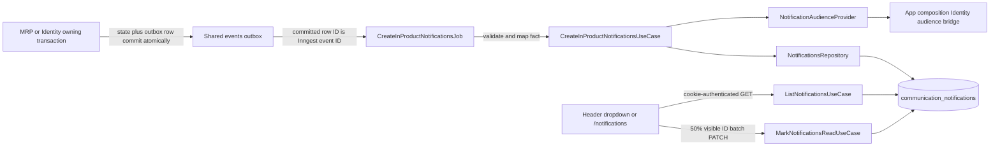

# In-product notification center

## 1. Context and scope

### Objective and source

This complete-mode Spec delivers GitHub Issue
[`rafinel/scoops#30`](https://github.com/rafinel/scoops/issues/30): Managers and
Operators receive relevant stock and access-impact notifications inside Scoops and consult a
private, permanent history from the Header. Complete mode is required because the delivery crosses
MRP and Identity source transactions, transactional outbox events, Communication persistence and
recipient selection, authenticated REST, generated routing, two design-backed surfaces, and
security, concurrency, migration, retry, responsive, and accessibility boundaries.

The governing product contract is Communication REQ-01, REQ-02, REQ-04 through REQ-09, with MRP
REQ-03 and Identity REQ-05, REQ-07, and REQ-08 as authoritative fact dependencies. The user
approved amendments to Communication REQ-01/REQ-04 and MRP REQ-03 before this Spec was authored.
At authoring time those requirements were left unchecked; conclusion updates only the
requirements whose complete current outcomes are delivered.

### Current behavior and product gap

- Communication currently owns email structures, email providers, and three Identity email jobs;
  it has no in-product entity, repository, REST route, or web UI.
- The authenticated Header renders a non-functional bell button. No `/notifications` route or
  Communication web service exists.
- Identity already publishes invitation-accepted, profile-changed, inactivated, and reactivated
  events, but the payloads omit the affected user's display-name snapshot and two publishers enqueue
  after their state transaction rather than through the active transactional outbox context.
- MRP persists stock balances and transactions, but does not publish the authoritative product-total
  threshold transition required by the amended MRP REQ-03. The existing `StockAdjustedEvent` is not
  published and does not represent initial stock, production, PDV consumption, product-total state,
  or transition suppression.
- Product rows already support tenant-qualified `FOR UPDATE` reads. This is the established lock
  boundary needed to serialize product-level before/after stock classification without adding a
  second stock-state store.
- The shared outbox already makes `Broker.publish` atomic when called inside a module transaction,
  and publishes the committed row to Inngest using the row ID as the external event ID.

### Scope and product alignment

| Area | In scope | Out of scope |
| --- | --- | --- |
| Stock facts | Product-total transitions into below ideal or non-positive zero stock after product registration, brand registration, manual adjustment, production, PDV sale consumption, and recovery-aware later crossings | Repeating an alert while the product remains in the same alert state; stock-transaction event delivery; alerts caused only by editing ideal stock |
| Identity facts | Invitation acceptance after activation, promotion, demotion, inactivation, and reactivation | Onboarding confirmation, email-change confirmation, invitation creation/correction/resend/expiry/cancellation, password recovery, and establishment-exclusion in-product rows |
| Recipients | Active establishment Managers and Operators for stock; active Managers except the new user for user-added; affected user plus active Managers for profile/status events; immutable deduped recipient snapshot | Preferences, recipient editing, broadcast administration, future users seeing historical events |
| Communication persistence | Immutable per-recipient notification content, source idempotency, individual read timestamp, permanent history, tenant/user cursor retrieval | Deletion, retention limits, archival, delivery-attempt UI, read/unread filter |
| Web experience | Header dropdown, unread indication, `/notifications`, browser-local date sections, 7/30/90/all periods, 20-row progressive loading, automatic visibility reads, loading/empty/error/retry/responsive/accessibility states | Sidebar entry, custom date range, row actions/navigation, notification settings, SMS, WhatsApp, push |
| Adjacent channels | Existing email behavior remains compatible with enriched Identity event payloads | New or changed email templates/providers, Billing notifications, Billing behavior |

| Source requirement | Delivery | Notes |
| --- | --- | --- |
| Communication REQ-01 | `partial` | Delivers the in-product channel and recipient rules for the scoped stock and Identity facts; other channels/message types remain separate work. |
| Communication REQ-02 | `full` | Delivers the below-ideal and zero-stock in-product message slice from authoritative MRP facts. |
| Communication REQ-04 | `partial` | Delivers scoped Identity in-product messages and payload compatibility; email implementation remains excluded. |
| Communication REQ-05 | `partial` | Delivers clear Brazilian Portuguese in-product titles, context, and times for scoped messages. |
| Communication REQ-06 | `full` | Delivers private Header and full-page permanent history, period filtering, date organization, and progressive loading. |
| Communication REQ-07 | `full` | Delivers per-user automatic read state on 50% visibility. |
| Communication REQ-08 | `partial` | Delivers transactional initiation and durable asynchronous continuation for scoped source facts. |
| Communication REQ-09 | `full` | Delivers durable snapshot content for all scoped in-product messages. |
| MRP REQ-03 | `partial` | Adds authoritative product-total threshold facts without claiming the entire inventory requirement. |
| Identity REQ-05 | `partial` | Consumes the existing post-acceptance activation fact; invitation communication remains email-only. |
| Identity REQ-07 | `partial` | Consumes committed promotion/demotion facts for in-product delivery. |
| Identity REQ-08 | `partial` | Consumes committed inactivation/reactivation facts and preserves the inactive recipient's row. |

### Product decisions and accepted assumptions

| Concern | Confirmed contract |
| --- | --- |
| Stock state | `zero` means total quantity `<= 0`, regardless of ideal target; `below-ideal` means `0 < total < idealStock`; otherwise `normal`. By-brand totals sum every brand balance. |
| Downward transition | Creation in an alert state emits. Later `normal → below-ideal`, `normal → zero`, and `below-ideal → zero` emit. `zero → below-ideal`, `zero → normal`, and `below-ideal → normal` are recovery only and do not emit; recovery permits the next downward crossing. |
| Source action completion | A source action commits only if its required event row is durably inserted through the active transaction. Inngest delivery and Communication materialization continue asynchronously. |
| Recipient time | Active audience membership is resolved when the durable Communication job handles the committed fact. Once materialized, recipient rows never change because of later profile/status changes. |
| Inactive target | Inactivation includes the affected user even though that user is no longer in the active audience. The row is inaccessible while the account is inactive and reappears after reactivation. |
| Dropdown | Shows the newest three notifications across permanent history. Fetched rows remain unread while the panel is closed. |
| Full-page loading | Loads 20 notifications per cursor page. `Ver mais` appends; it is disabled while loading and disappears when no cursor remains. |
| Periods | `Últimos 7 dias`, `Últimos 30 dias` (default), `Últimos 90 dias`, and `Todo o período`; inclusive local-day bounds are converted to ISO instants by the browser. |
| Date sections | Group by the authenticated browser's local calendar. Today's heading is `HOJE`; every earlier heading is a localized full date, with each row retaining a localized relative or date-time label. |
| Back control | Use the shared `BackLink` style: a compact, borderless, transparent link with a purple `chevron-left` and `Voltar` label; when browser history is available, return to the previous page, otherwise navigate to the authenticated home route `/`. |
| Missing frames | The user accepted design-system-derived loading, no-history, filtered-empty, recoverable error, retry, and `390 × 844` behavior without supplemental Pencil frames. |
| Reference divergence | Billing, invitation-sent, and NFS-e examples are visual exemplars only. The page uses per-date headings instead of the reference's coarse `ANTERIORES` group. |

## 2. Implementation Contract

### Functional requirements

| ID | REQ/source coverage | Required behavior |
| --- | --- | --- |
| `RF-01` | MRP REQ-03; Issue stock acceptance | MRP must lock each affected product in deterministic product-ID order, capture the committed-operation before and after product-total quantities, classify them by the approved state table, and publish one `ProductStockAlertStateEnteredEvent` per product only for an emitting transition. Product registration has no prior state and emits when its final initial total is alerting. |
| `RF-02` | Communication REQ-08; MRP REQ-03; Identity REQ-05/07/08 | Product/brand registration, manual adjustment, production, PDV registration/cancellation stock work, invitation acceptance, profile change, inactivation, and reactivation must enqueue any required authoritative event while their owning database transaction is active. A broker insertion failure rolls back the originating mutation; no-op Identity transitions publish nothing. |
| `RF-03` | Communication REQ-01/02/04 | Communication must validate each external event, map it to one Communication-owned fact, resolve the approved audience from Identity's authoritative directory, explicitly include an inactivated target where required, exclude the newly activated user from user-added recipients, deduplicate user IDs, and create no row for an excluded event type. |
| `RF-04` | Communication REQ-02/04/05/09 | Each notification stores a Brazilian Portuguese title and complete context snapshot. Stock content identifies product, available quantity, unit, and ideal quantity when below ideal; Identity content identifies the affected user's captured name and exact activation/profile/status change. The two stock states remain distinguishable without color. |
| `RF-05` | Communication REQ-08/09 | Notification materialization is retry-safe: at most one immutable row exists for a source event ID, notification kind, and recipient. A duplicate delivery returns the existing logical outcome without rewriting title, message, occurrence time, recipient, or read state. History has no retention job or user deletion operation. |
| `RF-06` | Communication REQ-06/09 | An authenticated Manager or Operator can retrieve only rows whose `establishmentId` and `recipientUserId` both match server-derived account context. Results are ordered by `occurredAt DESC, id DESC`, use a bounded stable cursor, include current unread count, and accept optional inclusive occurrence bounds. |
| `RF-07` | Communication REQ-07 | An authenticated user may mark 1–50 notification IDs read. The server updates only matching tenant-and-recipient unread rows with one captured timestamp, ignores duplicates/already-read/foreign IDs without disclosing their existence, and returns only IDs changed or already owned and read for idempotent client reconciliation. |
| `RF-08` | Communication REQ-06/07; Issue Header acceptance | The Header bell exposes an accessible unread indicator and opens a viewport-contained dropdown with the newest three rows. The panel closes through its close button, Escape, outside interaction, or footer navigation and restores focus to the bell. `Ver todas as notificações` navigates to `/notifications`. |
| `RF-09` | Communication REQ-07 | A notification is submitted for read reconciliation only after at least 50% of its row intersects the open dropdown or page viewport. Newly visible IDs are batched, submitted once per local visibility cycle, and reconciled without optimistic cross-user state. Off-screen, unmounted, or closed-dropdown rows remain unread. |
| `RF-10` | Communication REQ-06/09; Issue full-page acceptance | `/notifications` uses the authenticated shell, shared history-aware `BackLink`, page heading/subtitle, default 30-day period, browser-local date groups, and 20-row cursor pages. `Ver mais` appends without duplicate/skipped rows under concurrent arrivals. Changing period updates route search, resets accumulated pages, and fetches the new inclusive local-day interval. |
| `RF-11` | Communication REQ-06/09 | Dropdown and page distinguish initial loading, no history, period-filtered empty, populated, first-page failure, next-page failure, retrying, and exhausted history. A next-page failure preserves prior rows and the selected period; retry resumes the failed boundary. |
| `RF-12` | Communication REQ-06/07; Issue accessibility acceptance | Both surfaces work for Manager and Operator at desktop and `390 × 844`, avoid horizontal overflow, preserve visible focus and semantic heading/list/status relationships, support keyboard-only open/filter/load/close/navigation, announce recoverable status changes, and honor reduced motion. |
| `RF-13` | Issue exclusions; Communication REQ-01/03/04/06 | The in-product type registry and UI must contain only the seven scoped kinds. Billing and email-only Identity events must neither materialize rows nor appear in dropdown/page fixtures except as explicitly excluded design-reference examples. No read filter, custom dates, preferences, row actions, deletion, retention, or delivery-monitoring surface may be inferred. |

### Acceptance criteria

| ID | RF coverage | Requirement | Given | When | Then | Expected evidence |
| --- | --- | --- | --- | --- | --- | --- |
| `CA-01` | `RF-01`, `RF-02` | Product creation and stock transitions publish atomically | A single- or by-brand product and an active source transaction | Registration or a committed mutation ends in an emitting state | Exactly one complete MRP event is in the same commit; rollback removes balance/transaction/event together | Core MRP use-case tests; affected server controller tests; `MV-03` |
| `CA-02` | `RF-01` | Recovery and unchanged alert states suppress repeats | A product has an established before state | A mutation remains low/zero or recovers upward, followed optionally by another downward crossing | Remaining/recovery emits nothing; a later downward crossing emits once; by-brand uses summed total | `publish-product-stock-alert-use-case.test.ts`; registration/adjustment/production/order controller coverage |
| `CA-03` | `RF-02`, `RF-03` | Identity facts start only after authoritative transitions | Pending/active/inactive users and a Manager actor | Acceptance, promotion/demotion, inactivation/reactivation, or a no-op occurs | Changed state and enriched event commit atomically; user-added exists only after activation; no-op emits nothing | Identity use-case and controller tests; `MV-04` |
| `CA-04` | `RF-03`, `RF-05`, `RF-13` | Event routing is validated, scoped, and idempotent | Valid scoped events, duplicate IDs, malformed events, Billing events, and email-only Identity events | Inngest processes or rejects them | Scoped events produce deduped rows; malformed data retries/fails safely; excluded events have no in-product trigger | Communication job test; outbox event-validation test |
| `CA-05` | `RF-03`, `RF-04` | Recipient matrices and content are exact | Active Managers/Operators, affected users, and a second tenant exist | Each scoped stock/Identity fact is materialized | Only approved recipients receive one row; titles/body snapshots contain required context in pt-BR; no second-tenant row exists | `create-in-product-notifications-use-case.test.ts`; Communication job test |
| `CA-06` | `RF-05`, `RF-06` | Permanent cursor history is stable | More than 20 same-user rows include tied timestamps and a newer row arrives between requests | The user requests first and next pages | Ordering uses time+ID, no row repeats/skips, next cursor is deterministic, and no retention/deletion path exists | `list-notifications-use-case.test.ts`; list controller test; `MV-02` |
| `CA-07` | `RF-06`, `RF-07` | Server isolation protects rows and read state | Two users in one establishment and one user in another have distinguishable rows | Each lists or submits mixed notification IDs | Each sees only own rows; foreign IDs reveal nothing and cannot change; invalid bounds/body fail with `422` | List/read controller tests; REST-client parity; `MV-05` |
| `CA-08` | `RF-07`, `RF-09` | Visibility read mutation is thresholded and idempotent | Visible, sub-50%-visible, off-screen, and closed-panel unread rows | Intersection changes and duplicate batches occur | Only 50%-visible rows are batched; owned rows become read once; unread count/query state reconciles | Notification-list widget/hook tests; read controller test; route test |
| `CA-09` | `RF-08`, `RF-09`, `RF-12` | Header dropdown follows behavior and design | Authenticated Manager and Operator sessions | Bell is opened, navigated by keyboard, dismissed each supported way, and footer selected | Three newest rows, correct states, accessible indicator, focus restoration, visibility reads, and `/notifications` navigation match the manifest | Dropdown/AppLayout widget tests; `MV-01`; fresh desktop/narrow screenshots |
| `CA-10` | `RF-08`, `RF-11`, `RF-12` | Dropdown handles loading, empty, and recovery | Delayed, empty, failed-then-successful list responses | The panel opens and retry is used | Accepted assumed states render within viewport and remain dismissible without stale or foreign content | Dropdown widget and route tests; `MV-01` |
| `CA-11` | `RF-10`, `RF-11`, `RF-12` | Full page renders all lifecycle states | Authenticated sessions and populated/empty/failing responses | `/notifications` loads at desktop and narrow viewport | Page/design hierarchy, no-history, loading, error/retry, focus, and no-overflow behavior satisfy the manifest | Page widget test; route test; `MV-02`; fresh screenshots |
| `CA-12` | `RF-06`, `RF-10`, `RF-11` | Period/date/load-more behavior is browser-local and reset-safe | Rows span today and earlier local dates with more than 20 results | User changes 30→7→90→all and uses `Ver mais` | URL search, ISO bounds, per-date headings, page reset, appended stable results, disabled loading, next-page recovery, and exhausted state are correct | Page hook/widget test; route test; `MV-02` |
| `CA-13` | `RF-09`, `RF-12` | Accessibility works across both surfaces | Keyboard-only user, reduced-motion setting, and `390 × 844` viewport | User opens, traverses, reads, filters, loads, closes, and navigates | Named controls, semantic lists/statuses, visible focus, focus return, no clipping/overflow, and no required motion are present | Widget tests; route test; `MV-01`, `MV-02` |
| `CA-14` | `RF-13` | Excluded sources remain absent | Billing and email-only Identity events exist in the event registry/design examples | The in-product job registry and UI fixtures are inspected/exercised | No trigger, kind, persisted row, filter, row, or test fixture promotes excluded scope | Composition/job tests; route assertions; Spec path audit |

### Cross-cutting restrictions

| Concern | Contract |
| --- | --- |
| Authentication | Browser cookies remain `HttpOnly`; web services add no token/header. Server account and establishment come only from the global authenticated request context. |
| Authorization | Both active profiles are allowed. Pending/inactive users fail the existing authentication resolution before Communication controllers execute. |
| Tenancy | Every list/read repository predicate includes both establishment and recipient IDs. Audience lookup is establishment-scoped. Client IDs never establish tenant or recipient scope. |
| Event privacy | Source events carry only identifiers and content snapshots needed for notification materialization; no password, token, session, provider, or delivery-attempt data is allowed. |
| Transactions | Origin events publish inside owning transactions. Inngest/provider work stays outside those transactions. Notification batch insertion is one atomic repository operation with conflict-ignore idempotency. |
| Concurrency | Every changed stock path locks unique product rows in ascending ID order before capturing totals or mutating balances. Cursor ordering uses immutable occurrence time plus notification ID. |
| Time | Source modules capture one occurrence instant per action. Communication captures one creation/read instant per use-case execution. Browser-local period bounds are explicit ISO query values. |
| Numbers | Stock quantities remain finite domain numbers and preserve the product-unit snapshot. UI uses shared quantity formatting and never recomputes alert classification. |
| Permanence | No feature endpoint, job, preference, or UI deletes notification history. Seeder cleanup remains a local/test reset mechanism, not product retention. |

### Design Contract

The authoritative frame inventory, visual analysis, accepted assumptions, deliberate reference
divergences, and runtime screenshot targets are in
[`design/manifest.md`](./design/manifest.md). The bundle contains two valid, visually inspected PNG
references:

- `n5xnGg` / `NotificationDropdown`: one populated desktop dropdown reference;
- `K3Vu9o` / `Tela de notificações`: one populated `1560 × 1020` page reference.

Implementation must map all visual values to existing tokens and primitives documented in
`documentation/design.md`. No supplemental Pencil frame blocks implementation because the user
explicitly accepted the manifest's loading, empty, filtered-empty, error/retry, and `390 × 844`
assumptions. Fresh Playwright CLI screenshots are required at each material UI checkpoint and must
not reuse these exports as evidence. Saved implementation captures belong to the ignored
Playwright `apps/web/test-results/communication/` output and are referenced from the Evaluation
ledger by artifact path.

## 3. Technical Contract

### Current technical state

| Evidence | Current responsibility | Gap |
| --- | --- | --- |
| `packages/core/src/communication/**` | Email message/delivery structures, one provider interface, errors | No in-product vocabulary, actions, ports, or browser service contract |
| Identity event/use-case paths | Existing invitation-accepted/profile/status facts and Broker handoff | Missing `userName`; profile/reactivation publication occurs after transaction; no Communication consumer |
| `StockAdjustedEvent` and MRP stock use cases | Manual-adjustment-shaped unused event; balance/ledger updates across MRP and PDV integration | No product-total transition fact, creation/production/PDV coverage, suppression, or atomic outbox initiation |
| `ProductsRepository.findByIdForUpdate` | Existing tenant-qualified product row lock | Not consistently used before stock mutation/evaluation |
| Shared outbox/Inngest | Transaction-aware durable enqueue, committed-row publisher, stable external event ID, retries | Scoped event schemas/job registrations are absent |
| `apps/server/src/communication` | Email provision and jobs | No database, seeder, recipient bridge, in-product job, REST controllers, or module wiring |
| `AppLayout` and route constants | Authenticated shell and inert bell | No dropdown, unread state, Communication service/query hooks, or `/notifications` route |
| Pencil nodes `n5xnGg`, `K3Vu9o` | Populated desktop visual references | Excluded sample content and no lifecycle/narrow frames; handled by confirmed manifest assumptions |

### Solution and runtime flow

MRP owns threshold classification and event completeness. Every stock-changing transaction first
locks all unique affected products in ascending ID order, records each product's total, performs all
balance/ledger work, records final totals, and invokes `PublishProductStockAlertUseCase` before
commit. The use case applies the approved transition table and calls `Broker.publish` only for an
emitting final state. Identity similarly publishes enriched facts while its transition transaction
is active. A failed outbox insert therefore rolls back the source action.

The committed outbox row is published to Inngest with its row ID. One Communication job validates
the event according to its event-name-specific schema, maps it and the event ID to an
`InProductNotificationFact`, and runs `CreateInProductNotificationsUseCase` in one durable step.
The use case resolves active users through `NotificationAudienceProvider`, applies Communication's
recipient matrix, renders immutable pt-BR title/body snapshots, and inserts all per-recipient rows
with conflict-ignore idempotency. The app-composition bridge is the only runtime boundary that sees
both the Communication audience port and Identity `UsersRepository`; neither feature imports the
other feature's server implementation.

Authenticated REST controllers construct list/read use cases with server-derived `Account`. The web
service maps ISO dates to domain dates. TanStack Query uses separate keys for establishment,
surface, bounds, and limit; the page uses `useInfiniteQuery` with an explicit initial cursor and
server `nextCursor`. A period-key change creates a new page sequence. `NotificationList` observes
rows only while its surface is open/mounted and batches 50%-visible IDs through the read action.



### Runtime boundary contracts

| Boundary | Producer | Consumer | Canonical contract | Mapping/guarantees | Failure ownership |
| --- | --- | --- | --- | --- | --- |
| MRP stock fact | `PublishProductStockAlertUseCase` | `CreateInProductNotificationsJob` | `ProductStockAlertStateEnteredEvent` and validation schema | Complete snapshots; ISO date on transport; outbox event ID supplies source idempotency | MRP transaction owns enqueue failure; Inngest owns delivery retry; Communication owns validation/materialization |
| Identity facts | Four Identity transition use cases | `CreateInProductNotificationsJob` | Existing event classes enriched with `userName` and four strict schemas | Event names unchanged; additive payload is synchronized across publishers, validators, and existing consumers | Identity transaction owns enqueue failure; job rejects malformed payload and retries |
| Audience lookup | Communication create use case | App-composition provider over `UsersRepository.findManyActiveByEstablishment` | `NotificationAudienceProvider` / `NotificationAudienceMember` | Tenant-qualified active users only; Composition maps the Identity profile to Communication's local audience literals; Communication filters/deduplicates | Provider/repository failure fails the durable step for retry |
| Notification persistence | Three Communication use cases | `DrizzleNotificationsRepository` | `NotificationsRepository`, `Notification`, `NotificationPage` | Conflict-ignore on source/kind/recipient; tenant+recipient predicates; time+ID cursor | Repository errors propagate to Inngest retry or REST error translation |
| `GET /notifications` | `ListNotificationsController` | `CommunicationService.listNotifications` | `notificationListQuerySchema`, `NotificationPageResponseDto` | ISO query dates; ISO response dates mapped to `Date`; account supplies tenant/user | Zod pipe owns `422`; authentication owns `401`; unexpected persistence failure is server error |
| `PATCH /notifications/read` | `MarkNotificationsReadController` | `CommunicationService.markNotificationsRead` | `markNotificationsReadSchema`, `NotificationReadResponseDto` | 1–50 UUIDs; duplicate normalization; neutral handling of foreign IDs | Zod pipe owns `422`; authentication owns `401`; mutation failure preserves query state for retry |
| Visibility/read cache | `NotificationList` / read action | REST and TanStack caches | 50% `IntersectionObserver` threshold and Communication query-key prefix | Only mounted/open rows enqueue; successful IDs/read count reconcile then invalidate active Communication queries | Widget retains rows and retries a later visibility cycle after failure; no cross-user optimistic state |

### `packages/core` — Domain

| Declaration | Kind | Ownership/identity | Contract summary | Related declarations | Consumers |
| --- | --- | --- | --- | --- | --- |
| `Notification` | Entity | Communication; UUID row identity | Immutable per-recipient message plus mutable individual `readAt` | `NotificationKind` | Repository, use cases, REST DTO/mapper, web widgets |
| `NotificationCreate` | Structure | Communication; identity-free persistence input | Complete notification row before repository-assigned UUID identity | `NotificationKind` | Create use case, repository, faker/seeder |
| `NotificationKind` | Structure | Communication; identity-free closed vocabulary | Seven supported in-product message kinds | `InProductNotificationFact` | Event mapper, persistence enum, icon/content rendering |
| `NotificationAudienceMember` | Structure | Communication-owned identity-free projection | Minimum active-member snapshot needed for recipient policy without importing Identity vocabulary | Literal `manager`/`operator` profile value | Audience port, create use case, composition provider |
| `InProductNotificationFact` | Structure | Communication; source-event snapshot without independent identity | Discriminated union consumed by materialization | `NotificationKind`; MRP/Identity events | Inngest job and create use case |
| `NotificationCursor` | Structure | Communication; identity-free position | Stable `(occurredAt,id)` continuation boundary | `NotificationListParams`, `NotificationPage` | Repository, REST, web service/query |
| `NotificationListParams` | Structure | Communication; identity-free query | Tenant/recipient-qualified cursor and optional period bounds | `NotificationCursor` | List use case/repository |
| `NotificationPage` | Structure | Communication; identity-free result projection | Ordered items, next cursor, and current recipient unread count | `Notification`, `NotificationCursor` | REST/web/query/widgets |
| `ProductStockAlertState` | Structure | MRP; identity-free classification | `normal`, `below-ideal`, or `zero` authoritative product-total state | `ProductStockAlertStateEnteredEvent` | MRP publisher use case |
| `ProductStockAlertStateEnteredEvent` | Event | MRP fact; stable event name | Snapshot of an emitting committed product-total state | `ProductStockAlertState` | Outbox validator and Communication job |
| Four existing Identity user events | Event | Identity facts; existing stable names | Add affected-user display-name snapshot without changing event meaning | Existing Identity profile/status structures | Outbox validator, existing consumers, Communication job |

| Path | Change | Declaration | Domain role/schema | Invariants/transitions | Errors/events | Exports/consumers |
| --- | --- | --- | --- | --- | --- | --- |
| `packages/core/package.json` | Modify | Communication subpath exports | Export Communication entities/fakers and use cases in the same form as other modules | No source-path or provider leakage | — | Web/server consumers |
| `packages/core/src/communication/domain/entities/notification.ts` | Create | `Notification` Entity | Canonical persisted notification schema below | Identity, source, content, kind, recipient, and occurrence are immutable after insert; only `readAt` may move once from absent to a timestamp | — | Communication entity barrel |
| `packages/core/src/communication/domain/entities/index.ts` | Create | Public entity barrel | Export `Notification` only | Explicit `.ts` internal export | — | Package subpath |
| `packages/core/src/communication/domain/entities/fakers/notification-faker.ts` | Create | `NotificationFaker` | Test-data faker using deterministic overrides and valid defaults | Test helper only; never runtime | — | Core/server/web tests |
| `packages/core/src/communication/domain/entities/fakers/index.ts` | Create | Faker barrel | Export `NotificationFaker` | Test-only package subpath | — | Tests |
| `packages/core/src/communication/domain/structures/notification-kind.ts` | Create | `NotificationKind` Structure | Closed seven-value const/type schema below | No Billing or email-only kind may be added by this delivery | — | Structure barrel |
| `packages/core/src/communication/domain/structures/notification-create.ts` | Create | `NotificationCreate` Structure | Complete pre-identity persistence input schema below | Same field invariants as `Notification`; repository assigns `id` | — | Structure barrel, repository/use case/faker |
| `packages/core/src/communication/domain/structures/notification-audience-member.ts` | Create | `NotificationAudienceMember` Structure | Active Identity directory projection below | Provider guarantees active membership; Communication still applies profile/event policy | — | Structure barrel |
| `packages/core/src/communication/domain/structures/in-product-notification-fact.ts` | Create | `InProductNotificationFact` Structure | Complete discriminated source snapshot below | Kind-specific required fields; source event ID and occurrence immutable; no secrets | — | Structure barrel, create use case/job |
| `packages/core/src/communication/domain/structures/notification-cursor.ts` | Create | `NotificationCursor` Structure | Stable continuation schema below | Both fields required together; key is exclusive | — | Structure barrel |
| `packages/core/src/communication/domain/structures/notification-list-params.ts` | Create | `NotificationListParams` Structure | Tenant/user/bounds/limit schema below | Limit 1–50; `from <= to`; cursor remains inside same tenant/user/filter key | Named `BadRequestError` from use case for invalid semantic bounds/limit | Structure barrel |
| `packages/core/src/communication/domain/structures/notification-page.ts` | Create | `NotificationPage` Structure | Result schema below | Items retain repository order; next cursor points after final item; unread count covers all own history, not only page | — | Structure barrel |
| `packages/core/src/communication/domain/structures/index.ts` | Modify | Communication structure barrel | Export all existing email and new notification structures | Keep package-local explicit exports | — | Core package subpath |
| `packages/core/src/mrp/domain/structures/product-stock-alert-state.ts` | Create | `ProductStockAlertState` Structure | Closed state vocabulary below | `zero` dominates ideal comparison; `below-ideal` requires positive total and configured higher ideal | — | MRP structure barrel |
| `packages/core/src/mrp/domain/structures/index.ts` | Modify | MRP structure barrel | Export `ProductStockAlertState` | No duplicate enum owner | — | Event/use cases/validation |
| `packages/core/src/mrp/domain/events/product-stock-alert-state-entered-event.ts` | Create | `ProductStockAlertStateEnteredEvent` | `_NAME = 'mrp/product.stock-alert-state-entered'`; payload schema below | Payload is complete, serializable, snapshot-based, and only carries alert states | Emits after an approved committed-operation transition | MRP event barrel, validators/job |
| `packages/core/src/mrp/domain/events/index.ts` | Modify | MRP event barrel | Export new event; retain existing events | Consumers import `_NAME`, never duplicate literal | — | Server/validation |
| `packages/core/src/identity/domain/events/user-invitation-accepted-event.ts` | Modify | `UserInvitationAcceptedEvent` | Add required `userName: User['name']` | Name captured from activated user in same transaction | Existing `_NAME` unchanged | Identity/Communication |
| `packages/core/src/identity/domain/events/user-profile-updated-event.ts` | Modify | `UserProfileUpdatedEvent` | Add required `userName: User['name']` | Previous/current profile and name describe one committed target | Existing `_NAME` unchanged | Identity/Communication |
| `packages/core/src/identity/domain/events/user-inactivated-event.ts` | Modify | `UserInactivatedEvent` | Add required `userName: User['name']` | Status is inactive and name is pre/post-stable snapshot | Existing `_NAME` unchanged | Identity/Communication |
| `packages/core/src/identity/domain/events/user-reactivated-event.ts` | Modify | `UserReactivatedEvent` | Add required `userName: User['name']` | Status is active and profile/name are current snapshot | Existing `_NAME` unchanged | Identity/Communication |

```ts
// packages/core/src/communication/domain/entities/notification.ts
export type Notification = Entity & {
  readonly sourceEventId: string
  readonly establishmentId: string
  readonly recipientUserId: string
  readonly kind: NotificationKind
  readonly title: string
  readonly message: string
  readonly occurredAt: Date
  readonly createdAt: Date
  readonly readAt?: Date
}
```

**Schema — `Notification`**

| Field | Type | Required | Validation | Description |
| --- | --- | --- | --- | --- |
| `id` | `string` | Yes | UUID | Per-recipient notification identity |
| `sourceEventId` | `string` | Yes | Trimmed, non-blank, max 255 | Stable outbox/Inngest source ID |
| `establishmentId` | `string` | Yes | UUID | Tenant snapshot |
| `recipientUserId` | `string` | Yes | UUID | Intended Identity user |
| `kind` | `NotificationKind` | Yes | Closed scoped vocabulary | Semantic presentation/content kind |
| `title` | `string` | Yes | Trimmed, 1–120 characters | Stored pt-BR title snapshot |
| `message` | `string` | Yes | Trimmed, 1–500 characters | Stored pt-BR context snapshot |
| `occurredAt` | `Date` | Yes | Valid instant | Originating business occurrence |
| `createdAt` | `Date` | Yes | Valid instant | Communication materialization time |
| `readAt` | `Date` | No | Valid instant when present; never precedes `createdAt` | Recipient's first persisted visibility time |

**Schema — `NotificationCreate`**

```ts
// packages/core/src/communication/domain/structures/notification-create.ts
export type NotificationCreate = Omit<Notification, 'id'>
```

| Field | Type | Required | Validation | Description |
| --- | --- | --- | --- | --- |
| `sourceEventId` | `string` | Yes | Trimmed, non-blank, max 255 | Stable outbox/Inngest source ID |
| `establishmentId` | `string` | Yes | UUID | Tenant snapshot |
| `recipientUserId` | `string` | Yes | UUID | Intended Identity user |
| `kind` | `NotificationKind` | Yes | Closed scoped vocabulary | Semantic presentation/content kind |
| `title` | `string` | Yes | Trimmed, 1–120 characters | Stored pt-BR title snapshot |
| `message` | `string` | Yes | Trimmed, 1–500 characters | Stored pt-BR context snapshot |
| `occurredAt` | `Date` | Yes | Valid instant | Originating business occurrence |
| `createdAt` | `Date` | Yes | Valid instant | Communication materialization time |
| `readAt` | `Date` | No | Valid instant when present; never precedes `createdAt` | Recipient's first persisted visibility time |

The repository assigns the UUID identity on insertion, so callers cannot supply or reuse a row ID.

```ts
// packages/core/src/communication/domain/structures/notification-kind.ts
export const NotificationKind = {
  StockBelowIdeal: 'stock-below-ideal',
  StockZero: 'stock-zero',
  UserAdded: 'user-added',
  UserPromoted: 'user-promoted',
  UserDemoted: 'user-demoted',
  UserInactivated: 'user-inactivated',
  UserReactivated: 'user-reactivated',
} as const

export type NotificationKind =
  (typeof NotificationKind)[keyof typeof NotificationKind]
```

**Schema — `NotificationKind`**

| Field | Type | Required | Validation | Description |
| --- | --- | --- | --- | --- |
| value | string literal union | Yes | Exactly the seven constants above | Stored and rendered semantic kind |

```ts
// packages/core/src/communication/domain/structures/notification-audience-member.ts
export type NotificationAudienceMember = {
  readonly userId: string
  readonly profile: 'manager' | 'operator'
}
```

**Schema — `NotificationAudienceMember`**

| Field | Type | Required | Validation | Description |
| --- | --- | --- | --- | --- |
| `userId` | `string` | Yes | UUID | Active Identity user candidate |
| `profile` | `'manager' \| 'operator'` | Yes | Exact Communication audience literals | Current active profile used by recipient policy; Composition maps Identity values |

```ts
// packages/core/src/communication/domain/structures/in-product-notification-fact.ts
type FactBase = {
  readonly sourceEventId: string
  readonly establishmentId: string
  readonly occurredAt: Date
}

export type InProductNotificationFact =
  | (FactBase & {
      readonly kind: typeof NotificationKind.StockBelowIdeal
      readonly productId: string
      readonly productName: string
      readonly unit: ProductUnit
      readonly availableQuantity: number
      readonly idealQuantity: number
    })
  | (FactBase & {
      readonly kind: typeof NotificationKind.StockZero
      readonly productId: string
      readonly productName: string
      readonly unit: ProductUnit
      readonly availableQuantity: number
      readonly idealQuantity?: number
    })
  | (FactBase & {
      readonly kind:
        | typeof NotificationKind.UserAdded
        | typeof NotificationKind.UserPromoted
        | typeof NotificationKind.UserDemoted
        | typeof NotificationKind.UserInactivated
        | typeof NotificationKind.UserReactivated
      readonly affectedUserId: string
      readonly affectedUserName: string
    })
```

**Schema — `InProductNotificationFact`**

| Field | Type | Required | Validation | Description |
| --- | --- | --- | --- | --- |
| `sourceEventId` | `string` | Yes | Trimmed non-blank, max 255 | Durable event identity used for materialization idempotency |
| `establishmentId` | `string` | Yes | UUID | Originating tenant |
| `occurredAt` | `Date` | Yes | Valid instant | Source occurrence |
| `kind` | `NotificationKind` | Yes | One of the seven variants | Union discriminator |
| `productId` | `string` | Conditional | UUID; stock variants only | Affected MRP product |
| `productName` | `string` | Conditional | Non-blank; stock variants only | Product snapshot |
| `unit` | `ProductUnit` | Conditional | MRP closed unit; stock variants only | Product-unit snapshot |
| `availableQuantity` | `number` | Conditional | Finite; stock variants only; non-positive for zero and positive for below ideal | Final product-total quantity |
| `idealQuantity` | `number` | Conditional | Finite/non-negative; required and greater than available for below ideal; optional for zero | Ideal-stock snapshot |
| `affectedUserId` | `string` | Conditional | UUID; Identity variants only | Changed user |
| `affectedUserName` | `string` | Conditional | Trimmed non-blank; Identity variants only | Changed-user display snapshot |

```ts
// packages/core/src/communication/domain/structures/notification-cursor.ts
export type NotificationCursor = {
  readonly occurredAt: Date
  readonly id: string
}
```

**Schema — `NotificationCursor`**

| Field | Type | Required | Validation | Description |
| --- | --- | --- | --- | --- |
| `occurredAt` | `Date` | Yes | Valid instant | Exclusive primary sort position |
| `id` | `string` | Yes | UUID | Exclusive tie-break position |

```ts
// packages/core/src/communication/domain/structures/notification-list-params.ts
export type NotificationListParams = {
  readonly establishmentId: string
  readonly recipientUserId: string
  readonly limit: number
  readonly occurredFrom?: Date
  readonly occurredTo?: Date
  readonly cursor?: NotificationCursor
}
```

**Schema — `NotificationListParams`**

| Field | Type | Required | Validation | Description |
| --- | --- | --- | --- | --- |
| `establishmentId` | `string` | Yes | UUID from server account | Tenant predicate |
| `recipientUserId` | `string` | Yes | UUID from server account | Recipient predicate |
| `limit` | `number` | Yes | Integer 1–50 | Requested row count |
| `occurredFrom` | `Date` | No | Valid instant, not after `occurredTo` | Inclusive lower period bound |
| `occurredTo` | `Date` | No | Valid instant, not before `occurredFrom` | Inclusive upper period bound |
| `cursor` | `NotificationCursor` | No | Complete cursor pair | Exclusive continuation position |

```ts
// packages/core/src/communication/domain/structures/notification-page.ts
export type NotificationPage = {
  readonly items: readonly Notification[]
  readonly nextCursor?: NotificationCursor
  readonly unreadCount: number
}
```

**Schema — `NotificationPage`**

| Field | Type | Required | Validation | Description |
| --- | --- | --- | --- | --- |
| `items` | `readonly Notification[]` | Yes | At most requested limit, ordered newest first | Current cursor page |
| `nextCursor` | `NotificationCursor` | No | Present only when another row exists | Continuation after final returned row |
| `unreadCount` | `number` | Yes | Integer `>= 0` | Count of all unread rows for same tenant/recipient |

```ts
// packages/core/src/mrp/domain/structures/product-stock-alert-state.ts
export const ProductStockAlertState = {
  Normal: 'normal',
  BelowIdeal: 'below-ideal',
  Zero: 'zero',
} as const

export type ProductStockAlertState =
  (typeof ProductStockAlertState)[keyof typeof ProductStockAlertState]
```

**Schema — `ProductStockAlertState`**

| Field | Type | Required | Validation | Description |
| --- | --- | --- | --- | --- |
| value | `'normal' \| 'below-ideal' \| 'zero'` | Yes | Closed MRP vocabulary | Authoritative product-total alert classification |

`ProductStockAlertStateEnteredEvent.payload` is the canonical transport-independent event shape:

| Field | Type | Required | Validation | Description |
| --- | --- | --- | --- | --- |
| `establishmentId` | `string` | Yes | UUID | Owning tenant |
| `productId` | `string` | Yes | UUID | Locked product |
| `productName` | `string` | Yes | Non-blank snapshot | Product label at occurrence |
| `unit` | `ProductUnit` | Yes | MRP closed unit | Product unit at occurrence |
| `state` | `Exclude<ProductStockAlertState, 'normal'>` | Yes | `below-ideal \| zero` | Entered alert state |
| `availableQuantity` | `number` | Yes | Finite; state-compatible | Final product-total quantity |
| `idealQuantity` | `number` | No | Finite/non-negative; required for below ideal | Ideal-stock snapshot when applicable |
| `occurredAt` | `Date` | Yes | Valid instant | Owning action's single timestamp |

### `packages/core` — Use cases

| Use case | Actor/trigger | Input/output | Direct collaborators | Consistency boundary | Failures/side effects |
| --- | --- | --- | --- | --- | --- |
| `CreateInProductNotificationsUseCase` | Validated external source fact | `{ fact } → void` | `NotificationsRepository`, `NotificationAudienceProvider`, `DatetimeProvider` | Resolve one audience snapshot, deduplicate, then one idempotent batch insert | Directory/store failures propagate for Inngest retry; no external side effect |
| `ListNotificationsUseCase` | Active Manager or Operator | `{ actor, limit, bounds?, cursor? } → NotificationPage` | `NotificationsRepository` | Server actor supplies tenant/recipient; validates bounds/limit before one read | `AuthorizationError`, `BadRequestError` |
| `MarkNotificationsReadUseCase` | Active Manager or Operator | `{ actor, notificationIds } → readonly string[]` | `NotificationsRepository`, `DatetimeProvider` | Deduplicates 1–50 IDs and applies one captured read time under tenant+recipient predicate | `AuthorizationError`, `BadRequestError`; persistence mutation only |
| `PublishProductStockAlertUseCase` | MRP source action inside active transaction | Product snapshot, optional prior quantity, final quantity, occurrence → `void` | `Broker` | Pure state/transition decision followed by at most one transactional enqueue | Invalid impossible state is rejected; emitting transition publishes `ProductStockAlertStateEnteredEvent` |
| Existing MRP mutation use cases | Manager action or PDV source fact | Existing inputs/results | Existing MRP database plus `Broker` and stock-alert publisher | Product locks/totals, stock writes, ledger, and event enqueue share one transaction | Existing failures retained; enqueue failure rolls back |
| Existing Identity transition use cases | Invitee or Manager | Existing inputs/results | Existing Identity database, providers, `Broker` | State/audit/session work and enriched event enqueue share one transaction | Existing failures retained; no-op publishes nothing; enqueue failure rolls back |

| Path | Change | Declaration/signature | Input/output/errors | Authorization/consistency | Side effects/dependencies | Consumers/tests |
| --- | --- | --- | --- | --- | --- | --- |
| `packages/core/src/communication/use-cases/create-in-product-notifications-use-case.ts` | Create | `CreateInProductNotificationsUseCase.execute({ fact }): Promise<void>` | Complete `InProductNotificationFact`; propagates dependency failures | Resolves one active audience, applies matrix/dedup, includes inactive target only for inactivation | Captures `createdAt` once; creates exact title/message snapshots; calls `addMany` once | Inngest job; direct unit test |
| `packages/core/src/communication/use-cases/tests/create-in-product-notifications-use-case.test.ts` | Create | Unit suite | Seven kinds, recipient matrices, duplicate Manager target, inactive target, second tenant, exact content, dependency failures | Verifies no policy is delegated to event/job/UI | Observable created rows and zero writes for invalid/excluded impossible inputs | Required direct test |
| `packages/core/src/communication/use-cases/list-notifications-use-case.ts` | Create | `ListNotificationsUseCase.execute(request): Promise<NotificationPage>` | Actor plus limit/bounds/cursor; `AuthorizationError`/`BadRequestError` | Allows only Manager/Operator; derives tenant/recipient; validates 1–50 and ordered bounds | One repository page read | REST controller; direct unit test |
| `packages/core/src/communication/use-cases/tests/list-notifications-use-case.test.ts` | Create | Unit suite | Roles, invalid limits/bounds, actor scope, cursor forwarding, deterministic page | Asserts client cannot override tenant/user | Observable page and named errors | Required direct test |
| `packages/core/src/communication/use-cases/mark-notifications-read-use-case.ts` | Create | `MarkNotificationsReadUseCase.execute(request): Promise<readonly string[]>` | Actor plus IDs; `AuthorizationError`/`BadRequestError` | Allows Manager/Operator; trims duplicates; requires 1–50 UUID-shaped IDs at reusable schema boundary and non-empty here | Captures one `readAt`; one repository mutation | REST controller; direct unit test |
| `packages/core/src/communication/use-cases/tests/mark-notifications-read-use-case.test.ts` | Create | Unit suite | Role access, empty/oversized sets, dedup, one clock value, neutral repository result/failure | Asserts tenant+recipient derivation | Observable returned IDs/read timestamp | Required direct test |
| `packages/core/src/communication/use-cases/index.ts` | Create | Communication use-case barrel | Export three use cases | No implementation leakage | — | Core package subpath |
| `packages/core/src/mrp/use-cases/publish-product-stock-alert-use-case.ts` | Create | `PublishProductStockAlertUseCase.execute({ product, previousQuantity?, availableQuantity, occurredAt }): Promise<void>` | Product snapshot and totals; no transport types | Applies zero dominance and downward-only transition table; validates finite values | Publishes one complete MRP event or none | MRP/PDV mutation orchestration; direct unit test |
| `packages/core/src/mrp/use-cases/tests/publish-product-stock-alert-use-case.test.ts` | Create | Unit suite | Creation, all nine prior/final combinations, absent ideal, non-positive values, event snapshot | Exhaustive transition decision | Exact event or no publish | Required direct test |
| `packages/core/src/mrp/use-cases/register-product-use-case.ts` | Modify | `RegisterProductUseCase.execute` | Existing contract unchanged | Final initial total evaluated once after all single/by-brand balances; no prior state | Enqueue only the required stock-alert event inside the transaction; retain the existing post-commit `ProductCreatedEvent` behavior | Existing direct test/controller |
| `packages/core/src/mrp/use-cases/tests/register-product-use-case.test.ts` | Modify | Unit suite | Zero/low/normal single and summed by-brand registration; broker failure | Source write/event atomic orchestration contract | Exact alert/product events and no normal alert | Required direct test |
| `packages/core/src/mrp/use-cases/register-product-brand-use-case.ts` | Modify | `RegisterProductBrandUseCase.execute` | Existing contract unchanged | Tenant `findByIdForUpdate`; total before brand creation and after initial balance | Enqueue only the required stock-alert event inside the transaction; retain the existing post-commit sales-config publication behavior | Existing direct test/controller |
| `packages/core/src/mrp/use-cases/tests/register-product-brand-use-case.test.ts` | Modify | Unit suite | Lock, summed totals, normal→low/zero, recovery/no-repeat, broker failure | Verifies final total not target-brand balance | Exact events and rollback-facing failure propagation | Required direct test |
| `packages/core/src/mrp/use-cases/adjust-product-stock-use-case.ts` | Modify | `AdjustProductStockUseCase.execute` | Existing contract unchanged | Lock product; total before/after manual entry/write-off in one transaction | Inject required Broker; ledger and optional alert enqueue commit together | Existing direct test/controller |
| `packages/core/src/mrp/use-cases/tests/adjust-product-stock-use-case.test.ts` | Modify | Unit suite | Single/by-brand totals, threshold crossings, recovery, unchanged states, broker failure | Verifies lock precedes total/write | Exact event/no-event and existing balance/ledger result | Required direct test |
| `packages/core/src/mrp/use-cases/register-production-use-case.ts` | Modify | `RegisterProductionUseCase.execute` | Existing contract unchanged | Resolve unique output/ingredient products, lock sorted IDs before stock writes, snapshot totals, evaluate each final total once | Inject Broker; production, all ledger rows, and all alert rows commit together | Existing direct test/controller |
| `packages/core/src/mrp/use-cases/tests/register-production-use-case.test.ts` | Modify | Unit suite | Sorted locks, repeated ingredient aggregation, ingredient low/zero, output recovery, multi-event/broker failure | No intermediate uncommitted alert | Exact per-product final event set | Required direct test |
| `packages/core/src/identity/use-cases/accept-user-invitation-use-case.ts` | Modify | `AcceptUserInvitationUseCase.execute` | Existing contract unchanged | Add `userName`; already publishes inside transaction after activation/audit | Enriched event remains same transaction | Existing direct test/controller |
| `packages/core/src/identity/use-cases/tests/accept-user-invitation-use-case.test.ts` | Modify | Unit suite | Affected-name payload and broker rollback propagation | User-added fact only after active replacement | Exact enriched event | Required direct test |
| `packages/core/src/identity/use-cases/change-user-profile-use-case.ts` | Modify | `ChangeUserProfileUseCase.execute` | Existing contract unchanged | Add `userName`; move publish inside database callback after state/audit and before commit; no-op unchanged | Mandatory outbox enqueue; event only on real change | Existing direct test/controller |
| `packages/core/src/identity/use-cases/tests/change-user-profile-use-case.test.ts` | Modify | Unit suite | Promotion/demotion name payload, in-transaction publish, broker failure, no-op | Existing auth/concurrency preserved | Exact enriched event/no-event | Required direct test |
| `packages/core/src/identity/use-cases/inactivate-user-use-case.ts` | Modify | `InactivateUserUseCase.execute` | Existing contract unchanged | Add `userName`; existing in-transaction publication retained; no-op unchanged | Session removal/state/audit/event remain one transaction | Existing direct test/controller |
| `packages/core/src/identity/use-cases/tests/inactivate-user-use-case.test.ts` | Modify | Unit suite | Name payload, broker failure, no-op | Existing last-Manager/self/tenant behavior retained | Exact enriched event/no-event | Required direct test |
| `packages/core/src/identity/use-cases/reactivate-user-use-case.ts` | Modify | `ReactivateUserUseCase.execute` | Existing contract unchanged | Add `userName`; move publication into transaction after state/audit and before commit; no-op unchanged | Mandatory outbox enqueue | Existing direct test/controller |
| `packages/core/src/identity/use-cases/tests/reactivate-user-use-case.test.ts` | Modify | Unit suite | Name payload, in-transaction publish, broker failure, no-op | Existing tenant/transition behavior retained | Exact enriched event/no-event | Required direct test |

`CreateInProductNotificationsUseCase` owns these exact stored content templates; presentation may
format the stored occurrence time separately but must not reconstruct the body from live entities:

| Kind | Title | Stored message template |
| --- | --- | --- |
| `stock-below-ideal` | `Estoque abaixo do ideal` | `<produto> está com <disponível> <unidade> disponíveis. Ideal: <ideal> <unidade>.` using shared quantity precision rules |
| `stock-zero` | `Estoque zerado` | `<produto> está sem estoque disponível.` |
| `user-added` | `Novo usuário adicionado` | `<nome> agora faz parte do estabelecimento.` |
| `user-promoted` | `Usuário promovido` | `<nome> agora possui o perfil Gerente.` |
| `user-demoted` | `Usuário alterado para Operador` | `<nome> agora possui o perfil Operador.` |
| `user-inactivated` | `Usuário inativado` | `O acesso de <nome> foi inativado.` |
| `user-reactivated` | `Usuário reativado` | `O acesso de <nome> foi reativado.` |

### `packages/core` — Interfaces

| Contract | Kind/owner | Capability | Implementers | Consumers | Guarantees/failures |
| --- | --- | --- | --- | --- | --- |
| `NotificationsRepository` | Repository / Communication | Idempotent batch create, stable private page, tenant-private read update, seed reset | `DrizzleNotificationsRepository` | Three Communication use cases and seeder | Exact tenant+recipient predicates; immutable snapshots; storage failures propagate |
| `NotificationAudienceProvider` | Provider / Communication | List current active audience candidates for one establishment | `IdentityNotificationAudienceProvider` in app composition | Create use case | Identity remains source of active/profile facts; failure is retryable |
| `CommunicationService` | REST service / Communication | Browser list and mark-read operations | Web `CommunicationService` factory | Communication query/action hooks | Cookie transport, `RestResponse`, date mapping, no auth headers |
| `UsersRepository` | Repository / Identity | Existing user persistence plus active establishment audience read | `DrizzleUsersRepository` | Identity use cases/seeder and composition bridge | New method returns only active users in one tenant, deterministic ID order |

| Path | Change | Contract/signature | Capability semantics | Guarantees/failures | Implementers/consumers | Exports |
| --- | --- | --- | --- | --- | --- | --- |
| `packages/core/src/communication/interfaces/notifications-repository.ts` | Create | `addMany(inputs: readonly NotificationCreate[]): Promise<void>`; `findPage(input: NotificationListParams): Promise<NotificationPage>`; `markRead(input: { establishmentId; recipientUserId; notificationIds; readAt }): Promise<readonly string[]>`; `removeAll(): Promise<void>` | Generic persistence operations only; no message or recipient business policy | Batch conflict-ignore; stable cursor; neutral foreign IDs; monotonic read time | Drizzle adapter/use cases/seeder | Interface barrel |
| `packages/core/src/communication/interfaces/notification-audience-provider.ts` | Create | `findManyActiveByEstablishment(establishmentId: string): Promise<readonly NotificationAudienceMember[]>` | Minimum cross-module active audience projection | One tenant; current active users only; deterministic ID order | Composition provider/create use case | Interface barrel |
| `packages/core/src/communication/interfaces/communication-service.ts` | Create | `listNotifications(input: Omit<NotificationListParams,'establishmentId' &#124; 'recipientUserId'>): Promise<RestResponse<NotificationPage>>`; `markNotificationsRead(notificationIds: readonly string[]): Promise<RestResponse<readonly string[]>>` | Browser-facing REST capability | Preserves transport failures; no caller-supplied tenant/user | Web adapter/hooks | Interface barrel |
| `packages/core/src/communication/interfaces/index.ts` | Modify | Communication interface barrel | Export existing email and three new contracts | Explicit package exports | Server/web | Core subpath |
| `packages/core/src/identity/interfaces/users-repository.ts` | Modify | Add `findManyActiveByEstablishment(establishmentId): Promise<readonly User[]>` | Identity-owned active-directory query | Tenant-qualified, `status=active`, ID ascending; no Communication policy | Drizzle users repo/composition bridge | Identity interface barrel already exports file |

### `packages/validation` — Validation

| Schema | Concern/owner | Shape responsibility | Composes/derives from | Boundary consumers | Error/type contract |
| --- | --- | --- | --- | --- | --- |
| `productStockAlertStateEnteredEventSchema` | MRP event transport | Strict serialized stock-fact payload and cross-field state quantities | MRP `ProductStockAlertState`, `ProductUnit` | Outbox validator, Communication job trigger | Zod issues; inferred serialized payload |
| Four Identity event schemas | Communication-consumed Identity transport | Strict additive payload parity for each unchanged event name | Identity `UserProfile`, `UserStatus` | Outbox validator, Communication job triggers | Zod issues; ISO timestamp remains string until job mapping |
| `notificationListQuerySchema` | Communication REST query | Optional complete cursor pair, optional ordered occurrence bounds, bounded limit | UUID, ISO instant, number primitives | Server list controller | Parsed dates/numbers; `422` through `ZodValidationPipe` |
| `markNotificationsReadSchema` | Communication REST body | Non-empty deduplicated UUID list, max 50 | UUID primitive | Server read controller and web request shape | Parsed ID array; `422` on invalid body |
| `notificationsSearchSchema` | Web route search | Closed period URL state with resilient default | Four approved period literals | `/notifications` route/page | `{ period }`, invalid input normalizes to `last-30-days` |

| Path | Change | Schema/declaration | Fields/refinements | Composition/ownership | Consumers | Export/tests |
| --- | --- | --- | --- | --- | --- | --- |
| `packages/validation/src/mrp/product-stock-alert-state-entered-event-schema.ts` | Create | `productStockAlertStateEnteredEventSchema` | UUID establishment/product; trimmed product name; `ProductUnit`; alert-only state; finite available; optional non-negative ideal; ISO `occurredAt`; below-ideal requires positive available and higher ideal, zero requires non-positive available | MRP event transport only; no recipient/message policy | Outbox validator/job | Root barrel; exercised through publisher/job/outbox tests |
| `packages/validation/src/communication/user-invitation-accepted-event-schema.ts` | Create | `userInvitationAcceptedEventSchema` | Existing IDs/email/profile/ISO occurrence plus required trimmed `userName` | Parity with existing Identity event | Outbox validator/job | Root barrel; event/job tests |
| `packages/validation/src/communication/user-profile-updated-event-schema.ts` | Create | `userProfileUpdatedEventSchema` | User/establishment/actor UUIDs; email; required `userName`; previous/current profiles; ISO `updatedAt`; profiles must differ | Parity with Identity event; business transition still owned by use case | Outbox validator/job | Root barrel; event/job tests |
| `packages/validation/src/communication/user-inactivated-event-schema.ts` | Create | `userInactivatedEventSchema` | IDs/email/name/actor; previous `active`; current `inactive`; ISO update | Strict transport parity | Outbox validator/job | Root barrel; event/job tests |
| `packages/validation/src/communication/user-reactivated-event-schema.ts` | Create | `userReactivatedEventSchema` | IDs/email/name/actor/profile; previous `inactive`; current `active`; ISO update | Strict transport parity | Outbox validator/job | Root barrel; event/job tests |
| `packages/validation/src/communication/notification-list-query-schema.ts` | Create | `notificationListQuerySchema`, `NotificationListQuery` | `limit` defaults 20 and is 1–50; optional ISO-to-Date `occurredFrom/occurredTo`; optional ISO-to-Date `cursorOccurredAt` plus UUID `cursorId`; bounds and cursor pairs validated | Syntactic HTTP boundary; no actor fields | List controller | Root barrel; controller/route tests |
| `packages/validation/src/communication/mark-notifications-read-schema.ts` | Create | `markNotificationsReadSchema`, `MarkNotificationsReadInput` | Strict object; `notificationIds` array of UUIDs, min 1/max 50, transformed to first-occurrence unique order | Syntactic body only; ownership remains core/repository | Read controller/web service | Root barrel; controller/widget/route tests |
| `packages/validation/src/web/notifications-search-schema.ts` | Create | `notificationsSearchSchema`, `NotificationsSearch` | `period` catches invalid/missing values as `last-30-days`; approved literals only | Route URL state | Notifications route/page | Root barrel; page/route tests |
| `packages/validation/src/index.ts` | Modify | Root validation barrel | Export seven schemas and three inferred input/search types | Single public package API | Server/web | Architecture/type checks; indirect behavioral coverage |

### `apps/server` — Database

| Persistence capability | Domain owner | Core contract | Models/types | Mapper | Repository/transaction owner |
| --- | --- | --- | --- | --- | --- |
| Notification history | Communication / `Notification` | `NotificationsRepository` | `notificationModel`, `notificationKindModel`, `DrizzleNotification` | `DrizzleNotificationMapper` | `DrizzleNotificationsRepository`; source creation is an idempotent batch statement and read mutation is one atomic update |
| Active recipient directory | Identity / `User` | `UsersRepository.findManyActiveByEstablishment` | Existing `userModel` / `DrizzleUser` | Existing `DrizzleUserMapper` | Existing `DrizzleUsersRepository` read operation |

| Path | Change | Declaration/operation | Schema/mapping | Integrity/query contract | Migration/transaction | Registration/consumers |
| --- | --- | --- | --- | --- | --- | --- |
| `apps/server/src/communication/constants/communication-repositories.ts` | Create | `COMMUNICATION_REPOSITORIES.notifications` Symbol | Repository token only | No string/literal duplication | — | Database module/controllers/jobs/seeder |
| `apps/server/src/communication/constants/index.ts` | Create | Constants barrel | Export provider and repository token objects | Existing direct import remains compatible; new code uses barrel | — | Communication layers/composition |
| `apps/server/src/communication/database/drizzle/models/notification-kind-model.ts` | Create | `notificationKindModel` | PostgreSQL enum matching `NotificationKind` | Closed seven values only | Generated additive enum | Notification model/schema barrel |
| `apps/server/src/communication/database/drizzle/models/notification-model.ts` | Create | `notificationModel` | `communication_notifications` table defined below | Unique source/kind/recipient; private cursor/unread indexes; non-blank content checks | New additive table; no backfill | Types/repository/shared schema |
| `apps/server/src/communication/database/drizzle/models/index.ts` | Create | Model barrel | Export kind/table models | Drizzle schema source | — | Shared schema/repository |
| `apps/server/src/communication/database/drizzle/types/entities/drizzle-notification.ts` | Create | `DrizzleNotification` | `InferSelectModel<typeof notificationModel>` | Persistence-only nullable `readAt` | — | Mapper |
| `apps/server/src/communication/database/drizzle/types/entities/index.ts` | Create | Entity-type barrel | Export `DrizzleNotification` | No Core leak | — | Database types barrel |
| `apps/server/src/communication/database/drizzle/types/index.ts` | Create | Database-types barrel | Export entity types | No runtime behavior | — | Mapper/repository |
| `apps/server/src/communication/database/drizzle/mappers/drizzle-notification-mapper.ts` | Create | `DrizzleNotificationMapper.toDomain` | Maps nullable `readAt` to optional and enum/date/number fields without live lookups | Preserves stored snapshots exactly | — | Repository |
| `apps/server/src/communication/database/drizzle/mappers/index.ts` | Create | Mapper barrel | Export notification mapper | — | — | Repository |
| `apps/server/src/communication/database/drizzle/repositories/drizzle-notifications-repository.ts` | Create | `DrizzleNotificationsRepository` | Maps `NotificationCreate` to inserts and rows to domain | `addMany` uses conflict-ignore on unique key; `findPage` uses tenant+recipient+bounds and lexicographic exclusive cursor with `limit+1`; unread count uses same tenant/user; `markRead` uses `readAt = coalesce(readAt,input)` and returns every matching owned ID; `removeAll` for seeding | Uses injected transaction-capable Drizzle executor; no business policy | Repository barrel/database module/use cases |
| `apps/server/src/communication/database/drizzle/repositories/index.ts` | Create | Repository barrel | Export adapter | — | — | Database module |
| `apps/server/src/communication/database/communication-database.module.ts` | Create | `CommunicationDatabaseModule` | Imports shared database; registers repository and seeder; binds Symbol with `useExisting` | Exports token and seeder, never concrete adapter | Singleton client/transaction context inherited | Communication root/messaging/controllers/seed |
| `apps/server/src/communication/database/communication-seeder.ts` | Create | `CommunicationSeeder`, `CommunicationSeed` | `clear()` delegates `removeAll`; `run({ notifications? })` delegates `addMany` | Optional development/test data only | Not application bootstrap | Shared seed/controller fixtures |
| `apps/server/src/communication/database/index.ts` | Create | Database barrel | Export module/seeder | — | — | Composition/tests |
| `apps/server/src/identity/database/drizzle/repositories/drizzle-users-repository.ts` | Modify | `findManyActiveByEstablishment` | Existing user mapper | `establishment_id = input AND status = active`, ordered `id ASC`; no Communication policy | Read participates in caller's normal repository executor | Composition audience provider |
| `apps/server/src/shared/database/drizzle/schema.ts` | Modify | Shared schema barrel | Export Communication models | No model redefinition | Authoritative Drizzle generator input | Migration tooling/client |
| `apps/server/src/shared/database/drizzle/migrations/0021_notification-center.sql` | Generate | Drizzle migration | Adds enum/table/indexes/constraints below | Additive; no existing-row rewrite | Generate with `pnpm --filter server db:migration:generate -- --name notification-center`; apply transactionally before new server code | Deployment/database |
| `apps/server/src/shared/database/drizzle/migrations/meta/0021_snapshot.json` | Generate | Drizzle schema snapshot | Generated from shared schema | Must match migration/table contract | Same generator; never hand-edit | Future migration generation |
| `apps/server/src/shared/database/drizzle/migrations/meta/_journal.json` | Generate | Drizzle migration journal entry | Registers migration 0021 | Preserve sequence and prior entries | Same generator; never hand-edit | Migration runner |
| `apps/server/src/shared/database/seed.ts` | Modify | Central seed orchestration | Resolve `CommunicationSeeder`; clear Communication before Identity/MRP/PDV data and run after Identity users exist; include scoped sample notifications for both seed accounts spanning period/date/load-more states | Seed only scoped kinds and deterministic source IDs/content/timestamps; no Billing fixture | Development/staging explicit seed command only | Manual full-stack validation |

#### Table — `communication_notifications`

**Columns**

| Column | Type | Nullable | Default | Description |
| --- | --- | --- | --- | --- |
| `id` | `uuid` | No | `gen_random_uuid()` | Per-recipient notification primary key |
| `source_event_id` | `text` | No | — | Stable outbox/Inngest source event ID |
| `establishment_id` | `uuid` | No | — | Tenant snapshot; intentionally no cross-module FK |
| `recipient_user_id` | `uuid` | No | — | Intended Identity user snapshot; intentionally no cross-module FK |
| `kind` | `communication_notification_kind` | No | — | Seven-value semantic kind |
| `title` | `text` | No | — | Immutable pt-BR title |
| `message` | `text` | No | — | Immutable pt-BR context |
| `occurred_at` | `timestamp with time zone` | No | — | Source occurrence instant |
| `created_at` | `timestamp with time zone` | No | — | Communication materialization instant |
| `read_at` | `timestamp with time zone` | Yes | — | First recipient visibility instant |

**Indexes**

| Index name | Columns | Type | Purpose |
| --- | --- | --- | --- |
| `communication_notifications_source_recipient_kind_unique` | `source_event_id, recipient_user_id, kind` | Unique B-tree | Retry-safe materialization per source/kind/recipient |
| `communication_notifications_private_page_idx` | `establishment_id, recipient_user_id, occurred_at DESC, id DESC` | B-tree | Tenant/private stable cursor retrieval |
| `communication_notifications_private_unread_idx` | `establishment_id, recipient_user_id, occurred_at DESC, id DESC` where `read_at IS NULL` | Partial B-tree | Header unread count and own unread reconciliation |

**Constraints**

| Constraint | Type | Definition | Purpose |
| --- | --- | --- | --- |
| `communication_notifications_pkey` | Primary key | `id` | Row identity |
| `communication_notifications_source_event_non_blank` | Check | `char_length(btrim(source_event_id)) BETWEEN 1 AND 255` | Valid idempotency source |
| `communication_notifications_title_non_blank` | Check | `char_length(btrim(title)) BETWEEN 1 AND 120` | Durable clear title |
| `communication_notifications_message_non_blank` | Check | `char_length(btrim(message)) BETWEEN 1 AND 500` | Durable clear content |
| `communication_notifications_read_after_create` | Check | `read_at IS NULL OR read_at >= created_at` | Monotonic read lifecycle |

**Cross-database notes.** PostgreSQL enum, partial index, `timestamptz`, tuple ordering, and
`gen_random_uuid()` are intentional because PostgreSQL 17 is the repository's approved database.
Cross-module foreign keys are deliberately omitted, matching MRP/PDV tenant snapshot tables and
avoiding a Communication model import of Identity implementation. Server-derived tenant/user
predicates and event/audience contracts are the security boundary. Establishment deletion cleanup
is outside this Issue; orphaned rows are inaccessible without an active account and must not create
a retention endpoint or cross-module cascade in this delivery.

**Migration delivery.** Generate exactly
`apps/server/src/shared/database/drizzle/migrations/0021_notification-center.sql` and its 0021
snapshot/journal entry from the shared schema. The migration is additive, needs no backfill, must run
before application instances reference the table/enum, and may deploy with old instances because no
existing schema is changed. Rollback is deployment-managed; implementation must not handwrite or
delete prior migration history.

### `apps/server` — Provision

| Capability | Core contract | Adapter | Runtime/provider | Registration | Consumers |
| --- | --- | --- | --- | --- | --- |
| Active notification audience | `NotificationAudienceProvider` | `IdentityNotificationAudienceProvider` | Identity `UsersRepository` supplied only at application composition | `NotificationAudienceCompositionModule` binds `COMMUNICATION_PROVIDERS.notificationAudience` | Communication create use case inside Inngest job |

| Path | Change | Adapter/signature | Contract mapping/config | Failure/retry/secret boundary | Lifecycle/registration | Consumers/tests |
| --- | --- | --- | --- | --- | --- | --- |
| `apps/server/src/composition/communication-identity/identity-notification-audience-provider.ts` | Create | `IdentityNotificationAudienceProvider implements NotificationAudienceProvider` | Maps `UsersRepository.findManyActiveByEstablishment` users to `{ userId, profile }` only | No provider/network/secrets; database error propagates to Inngest retry; no cache or policy | Singleton provider constructed by composition module | Communication job through token; core use-case/job tests, no direct provision test |

### `apps/server` — REST

| Operation | Server entry | Core action/contract | Web consumer | Security/tenant source | Compatibility/error owner |
| --- | --- | --- | --- | --- | --- |
| `GET /notifications` | `ListNotificationsController.handle` | `ListNotificationsUseCase` / `NotificationPage` | `CommunicationService.listNotifications` | Existing global authentication guard populates request `Account`; no profile restriction beyond active Manager/Operator | Shared Zod pipe, DTO, global error filter, web date mapper |
| `PATCH /notifications/read` | `MarkNotificationsReadController.handle` | `MarkNotificationsReadUseCase` / returned owned IDs | `CommunicationService.markNotificationsRead` | Existing authenticated request account; body contains IDs only | Shared Zod pipe, DTO, global error filter |

| Path | Change | Declaration/operation | Boundary/security | Request/response/errors | Effects/consumers | Registration/examples |
| --- | --- | --- | --- | --- | --- | --- |
| `apps/server/src/communication/decorators/notifications-controller.ts` | Create | `NotificationsController()` | Composes Nest `Controller('notifications')` and Swagger `ApiTags('Notification')` only | No authentication/profile policy or handler behavior | Shared route-group metadata for both controllers | Communication decorator barrel/controllers |
| `apps/server/src/communication/decorators/index.ts` | Create | Decorator barrel | Exports `NotificationsController` through the owning module path | — | No cross-feature re-export | Controllers |
| `apps/server/src/communication/rest/controllers/list-notifications.controller.ts` | Create | `ListNotificationsController`; `GET /notifications` | Reads `account` from authenticated Express request; never accepts tenant/user query values | Parses `notificationListQuerySchema`; maps cursor pair; returns `NotificationPageResponseDto`; `200/401/422/500` | Constructs/invokes list use case with repository token | `NotificationsController()` route group; Communication module |
| `apps/server/src/communication/rest/controllers/tests/list-notifications.controller.test.ts` | Create | HTTP integration suite | Real auth fixture, Drizzle repository/mapper, two users/two tenants | Valid default/bounded/filter/cursor requests; malformed pair/bounds/limit; anonymous | Verifies private order, unread count, tie cursor, no leakage | Required one-test-file-per-controller boundary |
| `apps/server/src/communication/rest/controllers/mark-notifications-read.controller.ts` | Create | `MarkNotificationsReadController`; `PATCH /notifications/read` | Same authenticated request boundary; no actor fields in body | Parses strict `{ notificationIds }`; returns `NotificationReadResponseDto`; `200/401/422/500` | Constructs/invokes read use case with one clock and repository | `NotificationsController()` route group; Communication module |
| `apps/server/src/communication/rest/controllers/tests/mark-notifications-read.controller.test.ts` | Create | HTTP integration suite | Real auth fixture/database with own/same-tenant-other/foreign rows | Owned mixed IDs, duplicate retry, already read, empty/oversized/invalid, anonymous | Verifies persisted own `readAt`, unchanged foreign/read timestamp, neutral response | Required one-test-file-per-controller boundary |
| `apps/server/src/communication/rest/controllers/index.ts` | Create | Controller barrel | Export exactly two controllers | — | Module | — |
| `apps/server/src/communication/rest/dtos/notification-response.dto.ts` | Create | `NotificationResponseDto`, `NotificationCursorResponseDto`, `NotificationPageResponseDto`, `NotificationReadResponseDto` | Swagger/JSON serialization only | Dates serialize ISO; optional fields omitted; page contains items/nextCursor/unreadCount; read response contains `notificationIds` | REST/web mapper | DTO barrel/controllers |
| `apps/server/src/communication/rest/dtos/index.ts` | Create | DTO barrel | Export response DTOs | — | Controllers | — |
| `apps/server/src/communication/fixtures/communication-module-fixture.ts` | Modify | `CommunicationModuleFixture` | Test-only composition of Identity auth, audience bridge, Communication database/module, and shared Inngest with overridable broker | Extends the existing fixture with notification seed/reset and Communication controller dependencies without changing its shared test lifecycle | Controller tests only | Excluded fixture source; no direct test |
| `apps/server/rest-client/communication/notifications.rest` | Create | Notification route-group examples | `@baseUrl = http://localhost:3336`; cookie-authenticated examples without committed credentials | Named requests for default/bounded/cursor/all-period GET and valid/invalid PATCH bodies | Manual transport parity | Exactly one example per controller operation plus representative variants |

### `apps/server` — Messaging

| Event | Publisher | Trigger/consumer | Payload authority | Durable steps/side effects | Registration/reliability |
| --- | --- | --- | --- | --- | --- |
| `ProductStockAlertStateEnteredEvent` | MRP stock publisher inside transaction | `CreateInProductNotificationsJob` | MRP event plus strict validation schema | `create-in-product-notifications` maps event ID/fact and atomically inserts recipient rows | One function trigger; five retries; per-establishment concurrency 1; DB uniqueness handles replay |
| `UserInvitationAcceptedEvent` | Identity invitation acceptance inside transaction | Same job | Identity event/schema | User-added fact; target excluded from active Managers | Same function/reliability |
| `UserProfileUpdatedEvent` | Identity profile change inside transaction | Same job | Identity event/schema | Maps previous/current profile to promoted/demoted fact | Same function/reliability |
| `UserInactivatedEvent` | Identity inactivation inside transaction | Same job | Identity event/schema | Includes affected inactive target plus active Managers | Same function/reliability |
| `UserReactivatedEvent` | Identity reactivation inside transaction | Same job | Identity event/schema | Includes affected target plus active Managers | Same function/reliability |

| Path | Change | Declaration | Event/trigger/payload | Reliability/steps | Lifecycle/registration | Producers/consumers |
| --- | --- | --- | --- | --- | --- | --- |
| `apps/server/src/communication/messaging/inngest/jobs/create-in-product-notifications-job.ts` | Create | `CreateInProductNotificationsJob` and five typed event triggers | Uses each event class `_NAME` and matching Zod schema; requires `event.id`; event-name branch maps complete fact and ISO time to `Date` | Function ID `communication/create-in-product-notifications`; `retries: 5`; concurrency limit 1 keyed by `event.data.establishmentId`; one stable step `create-in-product-notifications`; use case/store idempotency | Injectable `InngestJob`; no second endpoint | Five source events → create use case |
| `apps/server/src/communication/messaging/inngest/jobs/create-in-product-notifications-job.test.ts` | Create | Job integration/unit boundary | Exercises five trigger mappings, promotion/demotion branch, malformed payload, missing event ID, duplicate execution, audience/store failure | Observable persisted/captured fact and propagated retry failures, not only mock calls | Direct test allowed for job | Test Inngest harness/core fakes |
| `apps/server/src/communication/messaging/inngest/jobs/index.ts` | Modify | Job barrel | Export new job and triggers needed by tests/composition | Keep existing email exports | — | Messaging module/AppModule |
| `apps/server/src/communication/messaging/communication-messaging.module.ts` | Modify | `CommunicationMessagingModule` | Import Communication database, shared messaging/provision; provide/export new job with existing email jobs | Audience token is supplied by global app composition; no direct Identity module import | Feature owns job lifecycle | Communication root/AppModule |
| `apps/server/src/shared/messaging/outbox/event-validation.ts` | Create | Typed event registry | Register five schemas under event class name-compatible literals; retain known/existing names and excluded Billing/email events | Reject malformed outbox insertion before commit | Shared broker boundary | All five publishers |
| `apps/server/src/shared/messaging/outbox/tests/event-validation.test.ts` | Create | Event-validation suite | Valid/minimally malformed payload per newly typed name; unknown/non-object/serialization cases retained or added | Proves additive event payloads are accepted and incomplete facts rejected | Direct outbox test allowed | Shared broker contract |

### `apps/server` — Composition

| Composition boundary | Kind/scope | Imports/dependencies | Provides/exports | Consumers | Lifecycle/order |
| --- | --- | --- | --- | --- | --- |
| `NotificationAudienceCompositionModule` | Global cross-feature app composition | Identity database token/module, Communication provider contract/token, composition adapter | `COMMUNICATION_PROVIDERS.notificationAudience` | Communication job | Imported once by `AppModule`; provider exists before job execution |
| `CommunicationDatabaseModule` | Feature database module | Shared database, repository, seeder | Notifications repository token/seeder | Communication root, REST, messaging, seed | Singleton application lifecycle |
| `CommunicationModule` | Feature root | Database, provision, messaging; REST controllers | Feature runtime | App root | No feature implementation import into another feature |
| `AppModule` | Application root/Inngest registry | All feature modules, audience composition, exported jobs | One server graph and one `/api/inngest` function set | Nest bootstrap | Audience composition imported before Communication; job registered exactly once |

| Path | Change | Declaration | Wiring/configuration | Lifecycle/order | Connected contracts | Generation/consumers |
| --- | --- | --- | --- | --- | --- | --- |
| `apps/server/src/composition/communication-identity/notification-audience-composition.module.ts` | Create | `NotificationAudienceCompositionModule` | `@Global`; imports `IdentityDatabaseModule`; provides `IdentityNotificationAudienceProvider`; binds/exports Communication audience Symbol with `useExisting` | Singleton app composition; no reverse feature import | Identity users token → Communication audience port | AppModule/Communication job |
| `apps/server/src/communication/constants/communication-providers.ts` | Modify | `COMMUNICATION_PROVIDERS` | Add Symbol `notificationAudience`; retain `email` | Single token identity | Composition module/job | Constants barrel |
| `apps/server/src/communication/communication.module.ts` | Modify | `CommunicationModule` | Import database, provision, messaging; register two REST controllers | Feature root does not directly register jobs/providers owned by layers | Communication contracts | AppModule |
| `apps/server/src/app.module.ts` | Modify | `AppModule` | Import `NotificationAudienceCompositionModule`; include `CreateInProductNotificationsJob` in `InngestModule.forRoot.functions` | Exactly one provider/exported job and function registration; existing recovery gating unchanged | Identity/Communication bridge and Inngest job | Nest bootstrap |

### `apps/server` — Provision

The core MRP use-case rows own product-registration, brand-registration, adjustment, and production
behavior. The remaining server-side stock source is PDV's explicit transaction-bound MRP adapter.

| Path | Change | Declaration/signature | Contract mapping/config | Failure/retry boundary | Lifecycle/registration | Consumers/tests |
| --- | --- | --- | --- | --- | --- | --- |
| `apps/server/src/mrp/provision/pdv/transaction-bound-order-registration-dependencies-factory.ts` | Modify | Factory plus `TransactionBoundStockConsumer`/`TransactionBoundStockRestorer` | Inject `Broker`; lock sorted unique product IDs, snapshot totals, process complete sale/restoration, then invoke MRP stock-alert publisher once per product with order occurrence time | Runs inside PDV database transaction and shared transaction context; enqueue failure rolls back order/stock/ledger; restoration updates recovery state but emits no upward alert | Existing MRP provision token/factory | PDV register/cancel use cases and controller tests; no direct provision test |
| `apps/server/src/mrp/provision/mrp-provision.module.ts` | Modify | `MrpProvisionModule` | Import shared messaging and supply Broker to transaction-bound factory while retaining existing exports | Singleton provider; no broker in database scope | MRP provision token | PDV database module/factory |

### `apps/server` — REST

| Path | Change | Declaration/signature | Contract mapping/config | Failure/retry boundary | Lifecycle/registration | Consumers/tests |
| --- | --- | --- | --- | --- | --- | --- |
| `apps/server/src/mrp/rest/controllers/tests/register-product.controller.test.ts` | Modify | Existing HTTP integration suite | Add zero/low/normal initial product cases and broker failure | Assert product, balances, and required stock-alert outbox row commit/rollback together while existing product event behavior remains compatible | Real transaction/outbox evidence | Product registration boundary |
| `apps/server/src/mrp/rest/controllers/tests/register-product-brand.controller.test.ts` | Modify | Existing HTTP integration suite | Add aggregate crossing/recovery cases and broker failure | Assert brand, balances, and required alert row are atomic while existing sales-config behavior remains compatible | Real transaction/outbox evidence | Brand registration boundary |
| `apps/server/src/mrp/rest/controllers/tests/adjust-product-stock.controller.test.ts` | Modify | Existing HTTP integration suite | Add downward, repeat, recovery, and later-crossing cases | Assert balance, ledger, and alert outbox rows match the transition table atomically | Real transaction/outbox evidence | Manual adjustment boundary |
| `apps/server/src/mrp/rest/controllers/tests/register-production.controller.test.ts` | Modify | Existing HTTP integration suite | Add sorted multi-product and repeated-ingredient threshold cases plus broker failure | Assert production, all balance/ledger changes, and alert row set commit/rollback together | Real transaction/outbox evidence | Production boundary |
| `apps/server/src/pdv/rest/controllers/tests/register-order.controller.test.ts` | Modify | Existing HTTP integration suite | Add stock threshold source cases for aggregate same-product consumptions and multiple products | Assert order, balances, ledger, and outbox events commit/rollback together | Real transaction + Inngest broker/outbox evidence | Indirect adapter proof through controller |
| `apps/server/src/pdv/rest/controllers/tests/cancel-order.controller.test.ts` | Modify | Existing HTTP integration suite | Add upward restoration/no-alert and recovery-followed-by-later-sale coverage where practical | Assert cancellation/restoration commit and no recovery notification event | Real transaction boundary | Indirect adapter proof through controller |

### `apps/server` — REST

| Path | Change | Declaration/operation | Contract mapping | Integrity/query contract | Transaction | Consumers/tests |
| --- | --- | --- | --- | --- | --- | --- |
| `apps/server/src/identity/rest/controllers/tests/accept-user-invitation.controller.test.ts` | Modify | Existing HTTP integration suite | Assert enriched invitation-accepted outbox payload only after active state | User/name/tenant snapshot and no pre-acceptance row | Activation/audit/outbox atomic | Identity/Communication integration evidence |
| `apps/server/src/identity/rest/controllers/tests/change-user-profile.controller.test.ts` | Modify | Existing HTTP integration suite | Assert promotion/demotion enriched outbox rows and broker failure rollback | Existing role/tenant/concurrent last-Manager behavior preserved | Profile/audit/outbox atomic | Identity/Communication integration evidence |
| `apps/server/src/identity/rest/controllers/tests/change-user-status.controller.test.ts` | Modify | Existing HTTP integration suite | Assert inactivation/reactivation enriched rows, no-op suppression, and broker rollback | Existing self/last-Manager/tenant behavior preserved | Status/audit/session/outbox atomic | Identity/Communication integration evidence |

### `apps/web` — REST

| Path | Change | Declaration/ownership | Behavior and data flow | State/accessibility contract | Tests/consumers |
| --- | --- | --- | --- | --- | --- |
| `apps/web/src/rest/mappers/communication/notification-page-mapper.ts` | Create | `NotificationPageMapper` | Converts notification, cursor, and optional read timestamps from JSON strings to Core `Date` values | Does not infer content from live product/user state | Communication service |
| `apps/web/src/rest/mappers/communication/index.ts` | Create | Mapper barrel | Exports mapper and JSON boundary types | — | REST service |
| `apps/web/src/rest/services/communication-service.ts` | Create | `createCommunicationService(restClient)` | Implements Core `CommunicationService`; serializes bounds/cursor and uses cookie transport for GET/PATCH | Preserves `RestResponse` errors; no user/tenant parameters | Query/action hooks |

### `apps/web` — Composition

| Path | Change | Declaration/ownership | Behavior and data flow | State/accessibility contract | Tests/consumers |
| --- | --- | --- | --- | --- | --- |
| `apps/web/src/constants/routes.ts` | Modify | Add `notifications: '/notifications'` | Typed destination for footer and back/page navigation | No literal route duplication | Router, dropdown, notifications back-button fallback |
| `apps/web/src/ui/shared/contexts/rest-context/types/rest-context-value.ts` | Modify | Add `communicationService` | Makes one composed service available through existing context | Existing providers remain unchanged | Communication hooks |
| `apps/web/src/ui/shared/contexts/rest-context/use-rest-context-provider.ts` | Modify | Compose memoized Communication service | Uses the existing shared REST client | No new credentials or global requests | Rest context |
| `apps/web/src/routes/_authenticated/notifications/index.tsx` | Create | TanStack route | Validates search with `notificationsSearchSchema`; renders `NotificationsPage` | Authenticated parent owns access redirect | Generated route tree |
| `apps/web/src/routeTree.gen.ts` | Generate | Router output | Adds `/notifications` route | Generate through existing router tooling; never hand-edit | App router |
| `apps/web/tests/fixtures/communication-module-fixture.ts` | Create | Playwright transport fixture | Intercepts only Notification endpoints with per-user pages, delays, failures, read persistence, and request capture | Explicit mock evidence only; cannot satisfy server-backed manual scenarios | Route suite |
| `apps/web/tests/playwright.ts` | Modify | Fixture composition | Exposes Communication fixture with existing Identity/MRP/PDV fixtures | Reset isolation preserved | Playwright tests |

### `apps/web` — UI

| Path | Change | Declaration/ownership | Behavior and data flow | State/accessibility contract | Tests/consumers |
| --- | --- | --- | --- | --- | --- |
| `apps/web/src/ui/communication/hooks/communication-query-keys.ts` | Create | Query-key factory | `all`, `recent`, and period/bounds list keys; read success invalidates the Communication prefix | Period changes create isolated infinite-query sequences | Hooks |
| `apps/web/src/ui/communication/hooks/use-recent-notifications-query.ts` | Create | Dropdown query hook | Requests newest three with no occurrence bounds; exposes first-page lifecycle and unread count | Fetching does not mark read | Dropdown |
| `apps/web/src/ui/communication/hooks/use-notifications-query.ts` | Create | Page infinite-query hook | Uses `initialPageParam: undefined`, passes the server cursor, and derives `getNextPageParam` from `nextCursor` | Bound changes reset pages by query key; pages flatten with ID dedupe as a defensive guard | Page |
| `apps/web/src/ui/communication/hooks/use-mark-notifications-read-action.ts` | Create | Read mutation hook | Sends batches of at most 50; on success invalidates Communication queries so server unread state wins | No optimistic ownership assumptions; retry remains idempotent | Notification list |
| `apps/web/src/ui/shared/widgets/layouts/app-layout/index.tsx` | Modify | Header composition | Replace inert bell button with `NotificationDropdown`; leave search/user menu/layout contracts intact | Bell remains a named icon button and fits narrow header | App shell |
| `apps/web/src/ui/shared/widgets/layouts/app-layout/tests/app-layout.test.tsx` | Modify | Existing widget suite | Asserts notification component placement without duplicating dropdown behavior | Existing active-navigation tests retained | Direct layout coverage |
| `apps/web/src/ui/communication/widgets/components/notification-dropdown/index.tsx` | Create | `NotificationDropdown` Component widget | Owns bell, unread dot/count accessible text, anchored panel, newest-three lifecycle, close control, and footer route | Viewport-contained; close/outside/Escape/footer restore or transfer focus correctly; Observer enabled only while open | AppLayout |
| `apps/web/src/ui/communication/widgets/components/notification-dropdown/use-notification-dropdown.ts` | Create | Behavior hook | Open state, trigger/panel refs, recent query, dismiss listeners, footer navigation | Avoids duplicate global listeners; captures prior trigger for focus restoration | Dropdown component |
| `apps/web/src/ui/communication/widgets/components/notification-dropdown/tests/notification-dropdown.test.tsx` | Create | Widget suite | Populated/loading/empty/error/retry/unread/footer rendering and narrow containment | Named controls and semantic status assertions | Required direct widget test |
| `apps/web/src/ui/communication/widgets/components/notification-dropdown/tests/use-notification-dropdown.test.ts` | Create | Hook suite | Toggle, Escape, outside interaction, close focus, footer transition | Listener cleanup and query state | Required direct behavior-hook test |
| `apps/web/src/ui/communication/widgets/components/notification-list/index.tsx` | Create | `NotificationList` Component widget | Groups ordered rows by browser-local date, renders headings/list/rows, and registers visibility | `HOJE` for today; localized full date otherwise; no resorting across server order | Dropdown/page |
| `apps/web/src/ui/communication/widgets/components/notification-list/use-notification-list.ts` | Create | Behavior hook | `IntersectionObserver` threshold `0.5`, local pending/seen sets, microtask batch, browser-local grouping | Disabled when dropdown closed; unregisters removed rows; batches max 50 | Notification list |
| `apps/web/src/ui/communication/widgets/components/notification-list/tests/notification-list.test.tsx` | Create | Widget suite | Exact date groups, titles/messages/times, read/unread semantics, empty omission | Color-independent stock distinction and semantic list | Required direct widget test |
| `apps/web/src/ui/communication/widgets/components/notification-list/tests/use-notification-list.test.ts` | Create | Hook suite | 49%/50%, closed/open, duplicate intersections, unmount, batching, mutation failure/retry | Polyfilled Observer with deterministic entries | Required direct behavior-hook test |
| `apps/web/src/ui/communication/widgets/components/notification-row/index.tsx` | Create | Pure `NotificationRow` Component widget | Renders stored title/message, localized occurrence label, kind icon, and unread semantic marker | No row action; ref target covers full row; distinguishable text/icon | Notification list |
| `apps/web/src/ui/communication/widgets/components/notification-row/tests/notification-row.test.tsx` | Create | Widget suite | Seven scoped kinds, read/unread and timestamp output | No excluded labels/actions | Required direct widget test |
| `apps/web/src/ui/communication/widgets/components/notification-list-state/index.tsx` | Create | Pure lifecycle-state Component widget | Renders skeleton, no history, filtered empty, first/next-page error, retrying | Uses `status`/`alert`, named retry, stable dimensions, no spinner-only meaning | Dropdown/page; covered by parent tests |
| `apps/web/src/ui/communication/widgets/components/notification-period-filter/index.tsx` | Create | Pure Component widget | Native/select-system control for four approved labels and route-search callback | Labelled control, keyboard native behavior | Page; covered by page tests |
| `apps/web/src/ui/communication/widgets/pages/notifications-page/index.tsx` | Create | `NotificationsPage` Page widget | Composes the history-aware shared `BackLink`, title/subtitle, period filter, list/state, and `Ver mais` | Responsive single column matching saved page frame; live load/error status | Authenticated route |
| `apps/web/src/ui/communication/widgets/pages/notifications-page/use-notifications-page.ts` | Create | Behavior hook | Converts selected browser-local inclusive days to UTC instants, drives route search/query, flattens pages, and owns load-more state | Defers bound construction until browser mount; all-period omits bounds | Page |
| `apps/web/src/ui/communication/widgets/pages/notifications-page/tests/notifications-page.test.tsx` | Create | Widget suite | Design hierarchy, all lifecycle states, history-aware back button, four periods, groups/load-more | Desktop/narrow semantics and no excluded content | Required direct page-widget test |
| `apps/web/src/ui/communication/widgets/pages/notifications-page/tests/use-notifications-page.test.ts` | Create | Hook suite | DST/local-day bounds, 30-day default, 7/90/all reset, cursor append/error/retry/exhaustion | Fake clock/time zone and duplicate-ID defense | Required direct behavior-hook test |
| `apps/web/tests/routes/communication/notifications.index.test.tsx` | Create | Playwright route suite | Dropdown and page populated/lifecycle/period/load-more/visibility/navigation scenarios | Desktop, `390 × 844`, keyboard, URL/request/read assertions, console failure check | Mocked browser regression evidence |

### Widget hierarchy and expected implementation tree

```text
AppLayout
└── NotificationDropdown
    ├── NotificationListState
    └── NotificationList
        └── NotificationRow

NotificationsPage
├── BackLink (existing shared primitive)
├── NotificationPeriodFilter
├── NotificationListState
└── NotificationList
    └── NotificationRow
```

```text
documentation/features/communication/notification-center/
├── design/
│   ├── K3Vu9o.png
│   ├── manifest.md
│   └── n5xnGg.png
├── evaluation.md                         # created by implement-spec
├── plan.md                               # created by create-plan
└── spec.md
packages/core/src/communication/
├── domain/
│   ├── entities/{notification.ts,fakers/{notification-faker.ts,index.ts},index.ts}
│   └── structures/{in-product-notification-fact.ts,notification-audience-member.ts,notification-create.ts,notification-cursor.ts,notification-kind.ts,notification-list-params.ts,notification-page.ts,index.ts}
├── interfaces/{communication-service.ts,notification-audience-provider.ts,notifications-repository.ts,index.ts}
└── use-cases/{create-in-product-notifications-use-case.ts,list-notifications-use-case.ts,mark-notifications-read-use-case.ts,index.ts,tests/*.test.ts}
packages/core/src/mrp/
├── domain/events/{product-stock-alert-state-entered-event.ts,index.ts}
├── domain/structures/{product-stock-alert-state.ts,index.ts}
└── use-cases/{publish-product-stock-alert-use-case.ts,tests/publish-product-stock-alert-use-case.test.ts}
packages/validation/src/
├── communication/{mark-notifications-read-schema.ts,notification-list-query-schema.ts,user-*-event-schema.ts}
├── mrp/product-stock-alert-state-entered-event-schema.ts
├── web/notifications-search-schema.ts
└── index.ts
apps/server/src/communication/
├── communication.module.ts
├── constants/{communication-providers.ts,communication-repositories.ts,index.ts}
├── database/{communication-database.module.ts,communication-seeder.ts,index.ts,drizzle/{mappers,repositories,models,types}/...}
├── decorators/{notifications-controller.ts,index.ts}
├── fixtures/communication-module-fixture.ts
├── messaging/inngest/jobs/{create-in-product-notifications-job.ts,create-in-product-notifications-job.test.ts,index.ts}
└── rest/{controllers/{list-notifications.controller.ts,mark-notifications-read.controller.ts,tests/*.test.ts,index.ts},dtos/{notification-response.dto.ts,index.ts}}
apps/server/src/composition/communication-identity/{identity-notification-audience-provider.ts,notification-audience-composition.module.ts}
apps/server/rest-client/communication/notifications.rest
apps/web/src/routes/_authenticated/notifications/index.tsx
apps/web/src/ui/communication/
├── hooks/{communication-query-keys.ts,use-mark-notifications-read-action.ts,use-notifications-query.ts,use-recent-notifications-query.ts}
└── widgets/
    ├── components/{notification-dropdown,notification-list,notification-list-state,notification-period-filter,notification-row}/...
    └── pages/notifications-page/...
apps/web/tests/{fixtures/communication-module-fixture.ts,routes/communication/notifications.index.test.tsx}
```

The path tables above are authoritative when the compact tree uses braces, wildcards, or ellipses.
Every changed Core use case retains a direct colocated test; every new controller has exactly one
controller test file; every behavior hook has its own direct hook test. Query/action hooks remain
thin TanStack adapters and are covered through their owning widget/route tests.

### Technical decisions and rejected alternatives

| Decision | Selected approach | Rejected alternative and reason |
| --- | --- | --- |
| Read model | One immutable notification row per recipient | A shared message plus recipient/read join adds two-table lifecycle and complicates private cursor reads without a current fan-out scale need. |
| Audience boundary | Communication port implemented in application composition over Identity's repository | Communication importing Identity implementation violates module ownership; copying users into Communication creates stale authorization data. |
| Stock transition | Lock product, compare before/after product totals, emit only entered alert states | Persisting a separate alert-state flag can drift from balances; raw stock-transaction events cannot classify product-total transitions or creation. |
| Ordering | Explicit `(occurredAt, id)` descending cursor | Offset pagination can skip/repeat rows when newer notifications arrive between requests. |
| Retry safety | Inngest source event ID plus unique source/kind/recipient constraint | Job-run IDs or timestamps are unstable across retries and would duplicate permanent history. |
| Job topology | One typed five-trigger Communication job | Five near-identical jobs duplicate validation, retry, audience, and registration behavior. |
| Date grouping | Browser-local day bounds and headings | A server-fixed time zone contradicts the approved user-visible date grouping; custom establishment zones are outside current account data. |
| Cross-module references | UUID snapshots without database foreign keys | Communication importing Identity schema/cascades would couple persistence ownership; server-derived account predicates remain mandatory. |
| Read observation | Shared list hook with 50% `IntersectionObserver` threshold | Marking fetched rows read violates visibility; per-row requests create avoidable request storms. |

## 4. Validation Contract

### Automated evidence

| Evidence ID | Command or test target | Required proof | Acceptance coverage |
| --- | --- | --- | --- |
| `EV-01` | `pnpm check:test-integrity` | New production files and modified use cases/controllers/widgets obey direct-test and integrity policy | `CA-01`–`CA-14` |
| `EV-02` | `pnpm --filter @scoops/core test:coverage` | Communication entity/use cases plus MRP transition and Identity event behavior pass with thresholds preserved | `CA-01`–`CA-08` |
| `EV-03` | `pnpm --filter server test:coverage` | Real Drizzle/controller isolation, source transaction/outbox behavior, job routing, validation, and retry pass | `CA-01`–`CA-08`, `CA-14` |
| `EV-04` | `pnpm --filter web test:coverage` | Dropdown/page widgets and behavior hooks pass across visibility, periods, lifecycle, keyboard, and responsive contracts | `CA-08`–`CA-14` |
| `EV-05` | `pnpm --filter web test:integration tests/routes/communication/notifications.index.test.tsx` | Committed Playwright CLI route suite proves browser behavior with explicit transport mocks | `CA-08`–`CA-14` |
| `EV-06` | `pnpm check:types && pnpm check:code && pnpm check:architecture` | Workspace types, formatting/lint, dependency boundaries, exports, and generated route references pass | All |
| `EV-07` | Generate the migration, then run the repository migration command against the disposable/local database and inspect Drizzle metadata | Enum/table/constraints/indexes are generated, additive, and executable in order | `CA-04`–`CA-07` |

Coverage must not lower configured package thresholds. Tests assert final public effects and real
transaction boundaries; they must not reach private members, use production-code test branches, or
present mocked browser transport as authenticated server integration evidence.

### Manual full-stack and visual evidence

Before `MV-*`, inspect `docker compose ps`; verify PostgreSQL, server `http://localhost:3336`, web
`http://localhost:4000`, and the local Inngest service used by the repository. Seed explicitly with
`pnpm --filter server db:seed` only if the local Manager and Operator accounts are absent, then run
`pnpm --filter web test:auth:setup`. Start server and web dev processes in persistent terminals and
wait for Nest bootstrap and web compilation. Use Playwright CLI only, accessible roles/names, and
record final URL, relevant requests/responses or persisted database state, console messages, failed
network requests, viewport, and fresh screenshot paths in `evaluation.md`.

| Scenario | Procedure and required assertions | Evidence artifact | Acceptance coverage |
| --- | --- | --- | --- |
| `MV-01` | Sign in as Manager, open the Header bell by keyboard, verify newest three/unread indicator; expose one row below and at the 50% threshold; close via Escape, outside interaction, and close control with focus restoration; retry a recoverable response; follow the footer. Repeat the essential open/read path as Operator and at `390 × 844`. | Fresh desktop and narrow dropdown screenshots compared with `design/n5xnGg.png`; request/read-state and console log | `CA-08`–`CA-10`, `CA-13` |
| `MV-02` | Visit `/notifications`; verify default 30-day URL/search, per-local-date headings, history-aware Back component to the previous page with `/` fallback, 20-row first page, `Ver mais`, stable append, 7/90/all resets, loading/no-history/filtered-empty/error-next-page retry/exhaustion, keyboard flow, and no horizontal overflow at desktop and `390 × 844`. | Fresh desktop and narrow page screenshots compared with `design/K3Vu9o.png`; list request/cursor/read-state and console log | `CA-06`, `CA-11`–`CA-13` |
| `MV-03` | Through real authenticated server-backed MRP/PDV flows, create an initially alerting product, cross normal→low→zero, remain zero, recover, and cross again; include by-brand aggregate and sale consumption. Inspect balances, ledgers, outbox IDs, and resulting Manager/Operator notifications. Force a broker insertion failure in automated evidence, not by corrupting shared local services. | API/UI observations plus targeted database/outbox queries recorded without secrets | `CA-01`, `CA-02`, `CA-05` |
| `MV-04` | Accept an invitation, promote/demote, inactivate/reactivate through real authenticated flows. Verify approved recipient sets, inactive-row inaccessibility and post-reactivation visibility, exact snapshot names, and no notification for a no-op or invitation creation. | API/UI observations and persisted recipient rows | `CA-03`–`CA-05` |
| `MV-05` | With Manager, Operator, same-tenant second user, and second tenant, request histories and submit mixed read IDs. Verify private rows/unread counts, neutral foreign-ID responses, unchanged foreign timestamps, `401`, and representative `422` inputs. | REST responses plus persisted read timestamps | `CA-07` |

For visual comparison, the dropdown's exported PNG includes a 31px shadow margin beyond its native
403×381 node; compare component geometry to the native frame and shadow to the full export. The page
reference is 1560×1020. Accepted assumed states are validated against existing design tokens rather
than pixel-matched to nonexistent Pencil frames. Stop server/web processes started for validation;
leave shared Docker services running unless the implementation task explicitly requests teardown.

### Test file structure

| Test file | Test type | Target | Coverage goal |
| --- | --- | --- | --- |
| `packages/core/src/communication/use-cases/tests/create-in-product-notifications-use-case.test.ts` | Unit | `CreateInProductNotificationsUseCase` | Seven mappings, exact recipients/content, dedupe, time, dependency failure |
| `packages/core/src/communication/use-cases/tests/list-notifications-use-case.test.ts` | Unit | `ListNotificationsUseCase` | Role/tenant derivation, bounds, cursor, limits, repository result/failure |
| `packages/core/src/communication/use-cases/tests/mark-notifications-read-use-case.test.ts` | Unit | `MarkNotificationsReadUseCase` | Role/tenant derivation, ID limits/dedupe, one clock, neutral result/failure |
| `packages/core/src/mrp/use-cases/tests/publish-product-stock-alert-use-case.test.ts` | Unit | Stock alert publisher | Creation and exhaustive state transition table |
| `packages/core/src/mrp/use-cases/tests/register-product-use-case.test.ts` | Unit | Product registration | Final initial total and transactional alert failure |
| `packages/core/src/mrp/use-cases/tests/register-product-brand-use-case.test.ts` | Unit | Brand registration | Locked aggregate before/after and alert failure |
| `packages/core/src/mrp/use-cases/tests/adjust-product-stock-use-case.test.ts` | Unit | Manual stock mutation | Single/by-brand crossing, suppression, and failure |
| `packages/core/src/mrp/use-cases/tests/register-production-use-case.test.ts` | Unit | Production mutation | Sorted locks, aggregate final totals, multi-product alerts |
| `packages/core/src/identity/use-cases/tests/accept-user-invitation-use-case.test.ts` | Unit | Invitation acceptance | Enriched committed event and failure rollback signal |
| `packages/core/src/identity/use-cases/tests/change-user-profile-use-case.test.ts` | Unit | Profile transition | Promotion/demotion event, no-op, transactional failure |
| `packages/core/src/identity/use-cases/tests/inactivate-user-use-case.test.ts` | Unit | Inactivation | Enriched event, no-op, session/state/audit failure behavior |
| `packages/core/src/identity/use-cases/tests/reactivate-user-use-case.test.ts` | Unit | Reactivation | Enriched event, no-op, transactional failure |
| `apps/server/src/communication/messaging/inngest/jobs/create-in-product-notifications-job.test.ts` | Job integration/unit | Five-trigger job | Validation/mapping, event-ID idempotency, retry failures |
| `apps/server/src/shared/messaging/outbox/tests/event-validation.test.ts` | Unit | Outbox schema registry | Five complete payloads accepted; malformed payloads rejected |
| `apps/server/src/communication/rest/controllers/tests/list-notifications.controller.test.ts` | HTTP integration | GET controller/repository | Auth, private stable cursor page, bounds, unread, `422` |
| `apps/server/src/communication/rest/controllers/tests/mark-notifications-read.controller.test.ts` | HTTP integration | PATCH controller/repository | Auth, neutral foreign IDs, idempotency, persisted timestamp, `422` |
| `apps/server/src/mrp/rest/controllers/tests/register-product.controller.test.ts` | HTTP integration | Product source transaction | Initial alert outbox commit/rollback |
| `apps/server/src/mrp/rest/controllers/tests/register-product-brand.controller.test.ts` | HTTP integration | Brand source transaction | Aggregate crossing outbox commit/rollback |
| `apps/server/src/mrp/rest/controllers/tests/adjust-product-stock.controller.test.ts` | HTTP integration | Adjustment source transaction | Threshold/no-repeat/recovery event persistence |
| `apps/server/src/mrp/rest/controllers/tests/register-production.controller.test.ts` | HTTP integration | Production source transaction | Multi-product stock/ledger/outbox atomicity |
| `apps/server/src/pdv/rest/controllers/tests/register-order.controller.test.ts` | HTTP integration | Sale stock consumer | Aggregate consumption alerts and rollback |
| `apps/server/src/pdv/rest/controllers/tests/cancel-order.controller.test.ts` | HTTP integration | Cancellation stock restorer | Recovery updates without upward alert |
| `apps/server/src/identity/rest/controllers/tests/accept-user-invitation.controller.test.ts` | HTTP integration | Acceptance source transaction | Activation/audit/enriched outbox atomicity |
| `apps/server/src/identity/rest/controllers/tests/change-user-profile.controller.test.ts` | HTTP integration | Profile source transaction | Transition/audit/enriched outbox atomicity |
| `apps/server/src/identity/rest/controllers/tests/change-user-status.controller.test.ts` | HTTP integration | Status source transaction | Inactivate/reactivate/session/audit/outbox atomicity |
| `apps/web/src/ui/shared/widgets/layouts/app-layout/tests/app-layout.test.tsx` | Component | `AppLayout` | Header integration while existing shell behavior remains |
| `apps/web/src/ui/communication/widgets/components/notification-dropdown/tests/notification-dropdown.test.tsx` | Component | `NotificationDropdown` | Design content and loading/empty/error/unread/footer states |
| `apps/web/src/ui/communication/widgets/components/notification-dropdown/tests/use-notification-dropdown.test.ts` | Hook | Dropdown behavior | Toggle/dismiss/focus/listener lifecycle |
| `apps/web/src/ui/communication/widgets/components/notification-list/tests/notification-list.test.tsx` | Component | `NotificationList` | Local date groups, rows, semantics |
| `apps/web/src/ui/communication/widgets/components/notification-list/tests/use-notification-list.test.ts` | Hook | Visibility/grouping behavior | 50% threshold, closed/off-screen suppression, batching/retry |
| `apps/web/src/ui/communication/widgets/components/notification-row/tests/notification-row.test.tsx` | Component | `NotificationRow` | Seven kinds, exact stored content, read semantics |
| `apps/web/src/ui/communication/widgets/pages/notifications-page/tests/notifications-page.test.tsx` | Component | `NotificationsPage` | Design hierarchy, lifecycle states, periods, load-more |
| `apps/web/src/ui/communication/widgets/pages/notifications-page/tests/use-notifications-page.test.ts` | Hook | Page behavior | Local bounds, reset, infinite cursor/retry/exhaustion |
| `apps/web/tests/routes/communication/notifications.index.test.tsx` | Playwright route | Header and `/notifications` | Mocked browser desktop/narrow/keyboard/network/URL/read regressions |

### Test cases by file

| Test file | Test case | Description | Assertions |
| --- | --- | --- | --- |
| `packages/core/src/communication/use-cases/tests/create-in-product-notifications-use-case.test.ts` | `materializes scoped facts` | Exercise every fact and audience edge | Exact immutable rows, approved deduped IDs/content; failures write nothing |
| `packages/core/src/communication/use-cases/tests/list-notifications-use-case.test.ts` | `lists private history` | Exercise roles, actor scope, bounds/cursor/limit | Exact repository request/result or named error |
| `packages/core/src/communication/use-cases/tests/mark-notifications-read-use-case.test.ts` | `marks owned IDs` | Exercise authorization, limits, duplicates and clock | One tenant/user mutation and exact neutral result |
| `packages/core/src/mrp/use-cases/tests/publish-product-stock-alert-use-case.test.ts` | `publishes entered alert states` | Creation plus all prior/final combinations | Exact event payload or no publication |
| `packages/core/src/mrp/use-cases/tests/register-product-use-case.test.ts` | `enqueues initial alert atomically` | Register zero/low/normal products | Final aggregate event only; broker failure rejects action |
| `packages/core/src/mrp/use-cases/tests/register-product-brand-use-case.test.ts` | `evaluates brand aggregate` | Add brand across normal/alert/recovery totals | Lock and exact final-total event/no-event |
| `packages/core/src/mrp/use-cases/tests/adjust-product-stock-use-case.test.ts` | `evaluates manual mutation` | Entry/write-off across states | Ledger/balance result plus exact event/no-event |
| `packages/core/src/mrp/use-cases/tests/register-production-use-case.test.ts` | `evaluates final production totals` | Repeated ingredients and multiple products | Sorted locks, one event per final product state, failure propagation |
| `packages/core/src/identity/use-cases/tests/accept-user-invitation-use-case.test.ts` | `publishes activated user snapshot` | Accept pending invitation and fail broker | Name-bearing event after activation; failure rejects transaction callback |
| `packages/core/src/identity/use-cases/tests/change-user-profile-use-case.test.ts` | `publishes real profile transition` | Promote/demote/no-op/failure | Exact name/profiles event only on change; failure rejects transaction |
| `packages/core/src/identity/use-cases/tests/inactivate-user-use-case.test.ts` | `publishes inactivation snapshot` | Change/no-op/failure | Exact name/status event; existing guard/session effects preserved |
| `packages/core/src/identity/use-cases/tests/reactivate-user-use-case.test.ts` | `publishes reactivation snapshot` | Change/no-op/failure | Exact name/status/profile event only on change; failure rejects transaction |
| `apps/server/src/communication/messaging/inngest/jobs/create-in-product-notifications-job.test.ts` | `routes five typed events` | Valid, malformed, duplicate-ID and failed dependency runs | Correct fact/store, no duplicate row, retryable error propagation |
| `apps/server/src/shared/messaging/outbox/tests/event-validation.test.ts` | `validates notification source events` | Complete/incomplete payloads and unknown values | Registry accepts only schema-valid serializable facts |
| `apps/server/src/communication/rest/controllers/tests/list-notifications.controller.test.ts` | `returns stable own page` | Anonymous/invalid/private/tied-cursor requests | Status/DTO/order/unread/count and zero cross-user/tenant leakage |
| `apps/server/src/communication/rest/controllers/tests/mark-notifications-read.controller.test.ts` | `updates only owned rows` | Mixed own/foreign/already-read/invalid IDs | Neutral response, first timestamp retained, foreign rows unchanged |
| `apps/server/src/mrp/rest/controllers/tests/register-product.controller.test.ts` | `commits product and initial fact together` | Alerting/normal registration and broker failure | Product, balances and outbox all commit or all roll back |
| `apps/server/src/mrp/rest/controllers/tests/register-product-brand.controller.test.ts` | `commits brand aggregate fact` | Crossing/recovery and broker failure | Brand/balance/outbox atomic; existing sales-config behavior retained |
| `apps/server/src/mrp/rest/controllers/tests/adjust-product-stock.controller.test.ts` | `commits adjustment transition fact` | Downward/repeat/recovery sequence | Balance/ledger/outbox state matches transition table |
| `apps/server/src/mrp/rest/controllers/tests/register-production.controller.test.ts` | `commits production facts` | Multi-product threshold changes and broker failure | Production, every ledger/balance and event are atomic |
| `apps/server/src/pdv/rest/controllers/tests/register-order.controller.test.ts` | `commits consumption facts` | Aggregated lines and multiple products | Order/stock/ledger/event atomicity and exact final events |
| `apps/server/src/pdv/rest/controllers/tests/cancel-order.controller.test.ts` | `restores without upward fact` | Cancel alerting sale | Order/stock restore commits and emits no recovery alert |
| `apps/server/src/identity/rest/controllers/tests/accept-user-invitation.controller.test.ts` | `commits activation fact` | Real acceptance and forced broker failure | User/audit/outbox atomicity and enriched payload |
| `apps/server/src/identity/rest/controllers/tests/change-user-profile.controller.test.ts` | `commits profile fact` | Promote/demote/no-op/failure | State/audit/outbox atomicity, existing tenant/last-Manager rules |
| `apps/server/src/identity/rest/controllers/tests/change-user-status.controller.test.ts` | `commits status fact` | Inactivate/reactivate/no-op/failure | State/session/audit/outbox atomicity and enriched payload |
| `apps/web/src/ui/shared/widgets/layouts/app-layout/tests/app-layout.test.tsx` | `places notification control` | Render authenticated shell | Dropdown trigger appears once; existing shell/nav stays intact |
| `apps/web/src/ui/communication/widgets/components/notification-dropdown/tests/notification-dropdown.test.tsx` | `renders and recovers every panel state` | Populate/delay/empty/fail/retry | Three rows/max, unread semantics, named close/footer/status, no excluded rows |
| `apps/web/src/ui/communication/widgets/components/notification-dropdown/tests/use-notification-dropdown.test.ts` | `dismisses and restores focus` | Toggle then Escape/outside/close/footer | State, focus target, navigation intent, cleaned listeners |
| `apps/web/src/ui/communication/widgets/components/notification-list/tests/notification-list.test.tsx` | `groups local dates` | Today/prior ordered rows | Exact headings/order/content/time/read semantics |
| `apps/web/src/ui/communication/widgets/components/notification-list/tests/use-notification-list.test.ts` | `marks only visible rows` | Emit 49/50/100% intersections open/closed | Exact batched IDs, no duplicates/off-screen read, retry remains possible |
| `apps/web/src/ui/communication/widgets/components/notification-row/tests/notification-row.test.tsx` | `renders scoped stored rows` | Render all kinds/read states | Title/body/time/icon/status accessible without live lookups or color-only meaning |
| `apps/web/src/ui/communication/widgets/pages/notifications-page/tests/notifications-page.test.tsx` | `renders page lifecycle` | Loading/populated/empty/error/next-error/exhausted | Back/title/filter/groups/button/status and preserved rows |
| `apps/web/src/ui/communication/widgets/pages/notifications-page/tests/use-notifications-page.test.ts` | `drives local cursor periods` | Fake local dates/DST and cursor responses | Correct inclusive ISO bounds, reset keys, append/retry/exhaustion |
| `apps/web/tests/routes/communication/notifications.index.test.tsx` | `operates dropdown and page` | Authenticated mocked desktop/narrow keyboard journeys | Visible state, URL/request/read payload/focus/no overflow and clean console/network |

### Acceptance-to-evidence coverage

| Acceptance | Automated boundary | Manual scenario | Evidence target |
| --- | --- | --- | --- |
| `CA-01` | Core MRP use-case and four MRP/PDV controller suites | `MV-03` | `EV-02`, `EV-03`, source/outbox record |
| `CA-02` | Publisher plus mutation/controller suites | `MV-03` | Transition matrix and persisted event record |
| `CA-03` | Four Identity use-case and three controller suites | `MV-04` | Identity state/audit/outbox record |
| `CA-04` | Event-validation and Communication job suites | `MV-03`, `MV-04` | Typed trigger/idempotency record |
| `CA-05` | Communication create use case and job | `MV-03`, `MV-04` | Recipient/content database record |
| `CA-06` | List use case/controller and page hook | `MV-02` | Cursor requests and page screenshot |
| `CA-07` | List/read use cases/controllers | `MV-05` | REST/database isolation record |
| `CA-08` | Read controller, notification-list hook, route suite | `MV-01`, `MV-02` | Intersection request/read-state record |
| `CA-09` | Dropdown hook/widget, AppLayout, route suite | `MV-01` | Dropdown screenshots and focus/URL record |
| `CA-10` | Dropdown widget and route suite | `MV-01` | Lifecycle/retry record |
| `CA-11` | Page widget/hook and route suite | `MV-02` | Page lifecycle screenshots/requests |
| `CA-12` | Page widget/hook and route suite | `MV-02` | URL/bounds/cursor/date-group record |
| `CA-13` | All Communication widget/hook and route suites | `MV-01`, `MV-02` | Keyboard/narrow/focus/overflow record |
| `CA-14` | Job registry and UI route assertions | `MV-03`, `MV-04` | Exclusion audit |

### Executable manual scenarios

`MV-01` starts at `/` as seeded Manager at desktop, then repeats the essential path as Operator
and at `390 × 844`: (1) focus and activate `Notificações`; (2) inspect panel and network response;
(3) drive synthetic scroll until rows cross below and at 50%, then verify PATCH/persisted read state;
(4) dismiss separately with Escape, outside interaction, and `Fechar notificações`, checking focus;
(5) exercise failure/retry; (6) activate `Ver todas as notificações` and verify `/notifications`.
Capture the fresh `VIS-01-desktop` and `VIS-02-narrow` screenshots and compare to `n5xnGg.png`.

`MV-02` starts at `/notifications` as seeded Manager at 1560×1020 and then 390×844: (1) verify
30-day URL/search and first request; (2) inspect HOJE/prior local-date sections and visible-read PATCH;
(3) activate `Ver mais` and verify cursor append; (4) select 7, 90, and all periods and verify URL,
bounds, and reset; (5) exercise loading, both empty states, first/next failure, retry, and exhaustion;
(6) traverse all controls by keyboard and use the existing `Voltar` component to return to the previous page, falling back to `/` when no browser history is available.
Record DOM/focus/overflow/console/network checks and fresh `VIS-03-desktop`/`VIS-04-narrow`
screenshots compared to `K3Vu9o.png`.

`MV-03` starts with real Manager/Operator sessions and seeded stock: (1) create zero, low, and normal
products; (2) use manual, production, and PDV sale mutations for normal→low→zero/repeat/recovery/new
crossing, including a by-brand product; (3) wait for Inngest completion; (4) verify exact recipient
rows/content and balance/ledger/outbox IDs in persisted state. `MV-04` similarly performs invitation
acceptance, promotion, demotion, inactivation, reactivation, and a no-op, then verifies recipient
snapshots and inactive/post-reactivation visibility. `MV-05` submits list/read requests from own,
same-tenant-other, and foreign-tenant sessions plus anonymous and invalid requests, verifying final
status, neutral response, and unchanged foreign rows. Each scenario records failed requests and
console output and redacts cookies/credentials.

### Commands

| Command | Purpose/coverage |
| --- | --- |
| `pnpm check:test-integrity` | Test placement and direct/indirect/excluded-source policy |
| `pnpm --filter @scoops/core test:coverage` | Core Communication, MRP, and Identity contracts |
| `pnpm --filter server test:coverage` | Database, REST, messaging, composition, and source transactions |
| `pnpm --filter web test:coverage` | Widget and hook behavior with configured thresholds |
| `pnpm --filter web test:integration tests/routes/communication/notifications.index.test.tsx` | Focused committed Playwright CLI route suite |
| `pnpm check:types` | Workspace TypeScript and generated-route compatibility |
| `pnpm check:code` | Formatting/lint/static policy |
| `pnpm check:architecture` | Package/layer dependency directions |
| `pnpm --filter server db:migration:generate -- --name notification-center` | Generate the contracted additive Drizzle migration and metadata |

All results are recorded in `evaluation.md`, which is created at implementation
kickoff. REST parity additionally verifies that
`apps/server/rest-client/communication/notifications.rest` exists and represents GET and PATCH
exactly once as named operations with current query/body shapes and no credentials.

### Evaluation ledger contract

`implement-spec` creates `evaluation.md` with one row per `EV-*` and `MV-*`: command/scenario,
timestamp, environment/viewport, result, relevant output or persisted-state summary, screenshot or
artifact path, console/network classification, and covered CA IDs. Every CA must map to passing
evidence before conclusion. Any design divergence, unavailable environment, flaky retry, skipped
scenario, or accepted limitation remains explicit and blocks a clean verdict until resolved or
approved through the active Spec amendment workflow.

## 5. Documentation alignment and revision history

| Document | Authority for | State | Required change/confirmation |
| --- | --- | --- | --- |
| `documentation/prds/communication.md` | Notification outcomes, actors, channels, recipients, history/read experience | `changed` | REQ-01 now defines recipient matrices/retained rows; REQ-04 separates scoped in-product facts from email-only events. Both remain unchecked. |
| `documentation/prds/mrp.md` | Product-total stock states and authoritative facts | `changed` | REQ-03 now defines creation/mutation transitions, payload, and transactional outbox initiation; it remains unchecked. |
| `documentation/prds/identity.md` | Invitation activation, profile, and status outcomes | `confirmed` | Existing outcomes remain authoritative; only event snapshots/timing are integrated. |
| `documentation/architecture.md` | Modular monolith, Core, REST, outbox, runtime boundaries | `confirmed` | Existing architecture is preserved; no amendment required. |
| `documentation/modules.md` | Communication/MRP/Identity/PDV ownership | `confirmed` | Facts stay with source modules; recipient policy/history stay in Communication; cross-feature adapter stays in Composition. |
| `documentation/design.md` | Tokens, Pencil authority, responsive/accessibility and widget structure | `confirmed` | Saved frames and accepted missing-state assumptions are indexed by `design/manifest.md`. |
| `documentation/tooling.md` | pnpm, Drizzle, Vitest, Playwright CLI and quality commands | `confirmed` | Existing tools and commands apply; no dependency/tooling amendment required. |

| Rule | Applies to | Evaluated revision |
| --- | --- | --- |
| `documentation/rules.md` | Dynamic selection and all affected paths | `5787ea4b2eb38e85610d82282d58052d2c42632d` |
| `documentation/rules/core-package-rules.md` | Communication/MRP/Identity domain, interfaces and use cases | `5787ea4b2eb38e85610d82282d58052d2c42632d` |
| `documentation/rules/use-case-testing-rules.md` | Direct tests for created/modified use cases | `5787ea4b2eb38e85610d82282d58052d2c42632d` |
| `documentation/rules/validation-package-rules.md` | Event, REST-query/body, and route-search schemas | `5787ea4b2eb38e85610d82282d58052d2c42632d` |
| `documentation/rules/server-app-layer-rules.md` | Feature modules, Composition, security, migration and generated wiring | `5787ea4b2eb38e85610d82282d58052d2c42632d` |
| `documentation/rules/database-layer-rules.md` | Notification persistence, Drizzle schema, migration, repository, seed | `5787ea4b2eb38e85610d82282d58052d2c42632d` |
| `documentation/rules/rest-layer-rules.md` | Notification controllers, DTOs, web service and `.rest` parity | `5787ea4b2eb38e85610d82282d58052d2c42632d` |
| `documentation/rules/controllers-testing-rules.md` | One direct HTTP integration suite per new controller and changed source controllers | `5787ea4b2eb38e85610d82282d58052d2c42632d` |
| `documentation/rules/provision-layer-rules.md` | Audience adapter and transaction-bound stock adapter | `5787ea4b2eb38e85610d82282d58052d2c42632d` |
| `documentation/rules/messaging-layer-rules.md` | Event validation, shared outbox and Inngest job | `5787ea4b2eb38e85610d82282d58052d2c42632d` |
| `documentation/rules/ui-layer-rules.md` | REST context, query/action hooks and widget boundaries | `5787ea4b2eb38e85610d82282d58052d2c42632d` |
| `documentation/rules/widget-testing-rules.md` | Component and behavior-hook tests | `5787ea4b2eb38e85610d82282d58052d2c42632d` |
| `documentation/rules/web-app-routing-rules.md` | Authenticated route, search validation and generated tree | `5787ea4b2eb38e85610d82282d58052d2c42632d` |
| `documentation/rules/code-conventions-rules.md` | Naming, barrels, imports and static checks | `5787ea4b2eb38e85610d82282d58052d2c42632d` |

| Revision | Date | Material change | Reason |
| --- | --- | --- | --- |
| `1` | `2026-09-05` | Created the complete cross-module, persistent, design-backed notification-center Contract and amended its governing PRDs first. | Issue #30 plus explicit approval of recipients, stock creation/transition semantics, periods, per-date grouping, shared Back component, 50% visibility reads, and missing visual states. |
| `2` | `2026-09-05` | Corrected mechanical baseline classifications for the already-tracked Communication fixture and new outbox validation registry. | Path-conformance review; product behavior and implementation contracts unchanged. |
| `3` | `2026-09-06` | Changed the notifications page `Voltar` control to use browser history when available, retaining the authenticated home route as a fallback. | Explicit product correction: returning from notifications should restore the previous page rather than always navigating to the dashboard. |
| `4` | `2026-09-06` | Standardized page-level back controls on the shared borderless purple `BackLink` treatment with a `chevron-left`, including Notifications, Combo Discounts, and order-not-found recovery. | Explicit visual correction: all back buttons should use the supplied compact `Voltar` style. |
