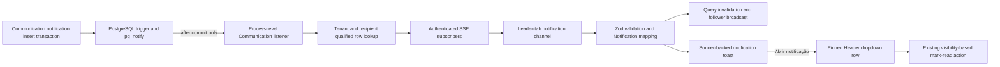

# 1. Context and scope

## Objective and source

Deliver Issue [#35](https://github.com/rafinel/scoops/issues/35) in `complete` mode:
authenticated Managers and Operators receive a responsive, accessible toast for each new
recipient-specific in-product notification committed during the active visible session. The toast
is an ephemeral alert over the permanent Communication-owned notification history.

## Current behavior and product gap

Communication already persists tenant- and recipient-scoped notifications, exposes list and
mark-read REST operations, renders a three-item Header dropdown and full history page, and marks
rows read through visibility observation. The Web root already mounts Sonner once. No browser
realtime transport, committed-notification subscription, tab election, realtime payload schema or
notification-specific custom toast exists, so new records appear only after query refetch.

## Scope and product alignment

| Area | In scope | Out of scope |
| --- | --- | --- |
| Delivery | Ephemeral SSE alert for every newly committed in-product notification addressed to the connected Manager or Operator | Replay, acknowledgement persistence, push, email-only, SMS, WhatsApp or delivery-monitoring UI |
| Session | Existing cookie authentication, tenant/recipient filtering, one elected visible-tab connection and cache invalidation across tabs | New credentials, session tokens in URLs, durable device registration |
| Toast | Exact title/context, semantic icon/tint, dismiss/open controls, 5-second active timer, pause, stacking, deduplication and accessibility | Timestamp, progress bar, arbitrary actions, read toggle or preferences |
| Dropdown/history | Open and expose the selected notification; retain existing visibility-based individual read behavior and permanent history | Redesign, permanent page-size change, read filter or retention change |

| Source requirement | Delivery | Notes |
| --- | --- | --- |
| `PRQ-01` | partial | Consumes existing supported in-product channel and recipient selection; does not add channels or recipient rules |
| `PRQ-05` | partial | Reuses persisted pt-BR title and contextual message; does not change message composition |
| `PRQ-06` | partial | Delivers its realtime-toast capability; existing dropdown/history capabilities remain unchanged |
| `PRQ-07` | partial | Preserves toast-unread and dropdown-visibility read semantics |
| `PRQ-09` | partial | Preserves durable history and clear stored content; toast remains ephemeral |

## Product decisions and assumptions

- A toast is delivered only for a notification inserted after the current live connection is
  established. Offline, hidden-tab and reconnect gaps are never replayed.
- Selecting `Abrir notificação` opens the Header dropdown and exposes that exact notification,
  temporarily pinned above its ordinary newest-three result when necessary.
- At most three toasts are visible; newest is visually first and overflow waits FIFO. A persisted
  notification ID is shown once per authenticated browser session.
- Missing narrow, stacked, focus, long-copy and semantic Pencil states are accepted design-system
  assumptions documented in [`design/manifest.md`](./design/manifest.md).
- `nfjNn` is the authoritative toast component. `n5xnGg` is only the destination dropdown.

# 2. Implementation Contract

## Functional requirements

| ID | PRQ/source coverage | Required behavior |
| --- | --- | --- |
| `FR-01` | `PRQ-01`, `PRQ-06`, Issue outcome | A connected authenticated Manager or Operator receives only newly committed in-product notifications addressed to their current user and establishment without refreshing |
| `FR-02` | `PRQ-06`, Issue offline/reconnection scope | Delivery is ephemeral: connection, listener or hidden/offline gaps remain recoverable through history and are not replayed as toasts |
| `FR-03` | `PRQ-05`, `PRQ-06`, `PRQ-09` | Each valid unique notification renders its persisted pt-BR title/message and kind-specific shared icon/tint in the finalized toast treatment |
| `FR-04` | `PRQ-06`, Issue burst/dedup scope | The active visible leader tab shows no duplicate per notification ID, no overwrite, at most three simultaneous toasts, and FIFO overflow |
| `FR-05` | `PRQ-06`, `PRQ-07` | Dismissal, timeout or passive display does not mark read; selection opens the dropdown and exposes the exact notification, whose existing visibility flow alone marks it read |
| `FR-06` | `PRQ-06` Experience | Toast arrival is non-blocking, politely announced, responsive and focus-safe; active dismissal time is 5 seconds and pauses during hover or focus-within |
| `FR-07` | `PRQ-06`, Issue session scope | One elected browser tab owns the stream; authenticated lifecycle, leadership, visibility and connectivity changes start/stop delivery and synchronize cache invalidation safely |
| `FR-08` | `PRQ-06`, Issue failure scope | Stream, payload and backpressure failures reveal no sensitive details, produce no technical failure UI, and leave permanent history usable |

## Acceptance criteria

| ID | FR coverage | Requirement | Given | When | Then | Expected evidence |
| --- | --- | --- | --- | --- | --- | --- |
| `AC-01` | `FR-01`, `FR-07` | Authorized live arrival | A Manager or Operator is authenticated, visible and leader | A recipient-specific notification transaction commits | One version-1 `notification.created` event reaches that user and a toast appears without refresh | Server controller/integration tests; widget test; `MV-01` |
| `AC-02` | `FR-01`, `FR-08` | Isolation and eligibility | Other users, establishments, unauthenticated sessions or ineligible profiles are connected/requesting | A notification commits or stream opens | No foreign payload is emitted; invalid streams are rejected or closed safely | Server controller tests; `MV-03` |
| `AC-03` | `FR-02`, `FR-07` | No replay | The tab was hidden/offline or listener/stream disconnected | It becomes visible/online or reconnects | Missed records remain in history/cache but no missed toast is queued or replayed | Widget/browser tests; `MV-02` |
| `AC-04` | `FR-03`, `FR-04` | Burst and deduplication | More than three unique events plus a duplicate ID arrive | The leader processes them | Three are visible newest-first, unique overflow displays FIFO, and duplicate ID never creates another toast | Widget tests; `MV-01` |
| `AC-05` | `FR-05` | Exact dropdown exposure/read | A toast notification is outside the ordinary newest three | The user selects `Abrir notificação` | Dropdown opens with it pinned and visible; only existing visibility/read success clears the pin/read state, while close ends pinning | Dropdown/shell widget tests; `MV-01` |
| `AC-06` | `FR-03` | Shared presentation | Each supported `NotificationKind` is rendered | A row or toast requests presentation | Both consume one typed mapping composed from named reusable semantic style constants; icon/tint do not drift | Row/toast tests |
| `AC-07` | `FR-05`, `FR-06` | Timer and controls | A toast is active | It is hovered, focused, resumed, timed out, opened, closed or receives Escape while focused | Exactly 5 seconds of active time elapses; sibling controls perform only their named action and focus is not stolen | Toast hook/widget tests; `MV-01` |
| `AC-08` | `FR-03`, `FR-06` | Accessible content | A toast arrives with ordinary or long content | Assistive technology and keyboard inspect it | One polite announcement contains full title/message; title clamps to two lines, message to three; icons are decorative and controls have pt-BR names | Widget tests; `MV-01` |
| `AC-09` | `FR-03`, `FR-04`, `FR-06` | Responsive fidelity | Single, stacked, focused and long-copy states render | Tested at `1560 × 1020` and `390 × 844` | Toasts match `nfjNn`, remain within viewport without overflow, and preserve focus visibility/reduced motion | `MV-01`; fresh visual evidence |
| `AC-10` | `FR-05`, `FR-07` | Cache consistency | Leader and follower tabs have notification queries | A valid live event arrives | Communication queries invalidate before toast presentation; followers receive only an invalidation signal; paginated caches are not optimistically rewritten | Shell widget tests; `MV-02` |
| `AC-11` | `FR-02`, `FR-07`, `FR-08` | Lifecycle recovery | Leadership, auth, account/establishment, visibility, connectivity or stream state changes | The relevant transition occurs | Resources clean up, retries follow `1/2/5/10/30s` capped jitter, cache refreshes where required, and no stale-user delivery occurs | NotificationShell consumer/controller tests; `MV-02` |
| `AC-12` | `FR-01`, `FR-08` | Commit, rollback and capacity | Insert transactions, process listener, SSE queues and connection caps are exercised | Commit, rollback, listener reconnect, sixth stream or queue overflow occurs | Only commit wakes delivery; one listener exists per process; no gap replay; sixth stream gets `429`; overflow closes safely at 100 queued items | Server integration/controller tests; `MV-03` |

## Cross-cutting restrictions

| Concern | Contract |
| --- | --- |
| Security | Existing `HttpOnly` credentialed cookie only; no URL token; server filters and reauthorizes before every emission; client also discards mismatched identity |
| Reliability | Database history is durable; toast delivery is explicitly ephemeral; PostgreSQL notification is a post-commit wake-up, not a second source of truth |
| Privacy | Logs and errors omit cookie, message content and foreign tenant facts; browser receives only its authorized notification |
| UI | Existing single Sonner mount, design tokens, Lucide icons and notification dropdown/read behavior remain authoritative |
| Compatibility | Unsupported payload versions and malformed events are discarded; missing cross-tab APIs degrade to duplicate toasts rather than suppressing delivery |

## Design Contract

The binding inventory is [`design/manifest.md`](./design/manifest.md): two saved references,
five accepted supplemental runtime states and exact desktop/narrow viewports. Runtime validation
must capture single, three-stack, focused and long-copy states plus semantic spot checks for stock
below ideal, zero stock and one Identity notification. No additional Pencil frame blocks delivery.

# 3. Technical Contract

## Current technical state

| Evidence | Current responsibility | Gap |
| --- | --- | --- |
| `Notification`, `NotificationsRepository`, `DrizzleNotificationsRepository` | Durable recipient-specific entity, list/read persistence and deduplicated batch insertion | No committed-row subscription or scoped lookup-by-ID capability |
| `ListNotificationsController`, `MarkNotificationsReadController`, `notifications.rest` | Authenticated REST history and read operations | No SSE operation, stream lifecycle or capacity contract |
| `DrizzleClient.listen`, outbox listener pattern | One Postgres.js listener connection with reconnect and cleanup | Its single-listener constraint cannot be reused concurrently; Communication needs its own process listener client/owner |
| `useRecentNotificationsQuery`, `NotificationDropdown`, `NotificationList` | Three recent rows, unread count, external history navigation and visibility reads | Dropdown state is private and cannot expose a toast-selected record |
| `notifications/index.ts`, `RootLayout` | Shared Sonner wrapper and one top-right `Toaster` | No typed custom notification toast, focus-paused active timer or notification content widget |

## Solution and runtime flow



The insertion trigger publishes only `{notificationId, recipientUserId, establishmentId}`; rollback
publishes nothing. A singleton Communication subscriber uses a dedicated Postgres.js listener and
loads the committed row through a scoped query. `StreamNotificationsUseCase` owns actor validation,
per-event current-session/eligibility checks, recipient/tenant filtering, per-user subscription
capacity and the bounded delivery queue. The REST controller only adapts the authenticated request,
disconnect signal and SSE writer to that action. REST emits the complete canonical DTO in a
versioned envelope, writes comment heartbeats every 20 seconds and releases the use-case
subscription on disconnect. No replay cursor is consumed.

The elected visible online tab subscribes to the shared notification channel, which creates the
native credentialed `EventSource` through the Web Provision client. The channel validates/maps the envelope,
invalidates Communication queries, broadcasts cache
invalidation, deduplicates the ID and presents the toast. Web Locks plus `BroadcastChannel` own the
primary election path; a renewable expiring `localStorage` lease is fallback. Reconnect uses jittered
1, 2, 5, 10 and capped 30-second delays indefinitely while eligible. Auth, account/establishment,
leadership or unmount ends the connection immediately.

| Boundary | Producer | Consumer | Canonical contract | Mapping/guarantees | Failure ownership |
| --- | --- | --- | --- | --- | --- |
| PostgreSQL notification | Insert trigger | `PostgresNotificationRealtimeSubscriber` | Small versionless wake-up with three UUIDs | Transactional, no rollback signal, no replay | Subscriber validates payload and scoped row |
| Core subscription | Server Database adapter | `StreamNotificationsUseCase` | `NotificationRealtimeSubscriber.subscribe` | Complete `Notification`, process singleton | Adapter reports safe lifecycle failure |
| SSE | `StreamNotificationsController` | Web realtime channel | `notification.created`, `{version: 1, notification}` | Canonical DTO, ISO dates, cookie auth, heartbeat | Controller closes; channel retries/discards |
| Notification realtime hook | Notification channel and native EventSource client | Notification shell | `useNotificationRealtime` | Validated domain `Notification`, internal subscribe/unsubscribe | Hook and channel contain browser errors |
| Cross-tab | Leader shell | Followers | Versioned cache-invalidation message | No notification content or cache serialization | Shell ignores malformed/foreign messages |

## packages/core — Interfaces

| Contract | Kind/owner | Capability | Implementers | Consumers | Guarantees/failures |
| --- | --- | --- | --- | --- | --- |
| `NotificationRealtimeSubscriber` | Communication service port | Subscribe/unsubscribe to newly committed recipient-specific `Notification` values | Server Postgres adapter | `StreamNotificationsUseCase` | No replay; callback only after scoped row resolution |

| Path | Change | Contract/signature | Capability semantics | Guarantees/failures | Implementers/consumers | Exports |
| --- | --- | --- | --- | --- | --- | --- |
| `packages/core/src/communication/interfaces/notification-realtime-subscriber.ts` | Create | `NotificationRealtimeSubscriber.subscribe(listener): Promise<() => Promise<void>>` | Server committed-notification stream | Ephemeral, complete domain values, cleanup | Postgres adapter/use case | Communication interfaces barrel |
| `packages/core/src/communication/interfaces/notifications-repository.ts` | Modify | `findByIdForRecipient(input): Promise<Notification | null>` | Scoped committed-row lookup | Requires notification, recipient and establishment IDs | Realtime subscriber | Existing barrel |
| `packages/core/src/communication/interfaces/index.ts` | Modify | Public exports | Expose both new ports | No declarations in barrel | Server/Web | Package subpath |

## packages/core — Use cases

| Use case | Actor/trigger | Input/output | Direct collaborators | Consistency boundary | Failures/side effects |
| --- | --- | --- | --- | --- | --- |
| `StreamNotificationsUseCase` | Authenticated Manager or Operator opening a stream | Actor, infrastructure-neutral current-session callback, notification sink and cancellation signal; returns cleanup | `NotificationRealtimeSubscriber`, `NotificationAudienceProvider` | Recipient and establishment equality; five live subscriptions per actor/process; 100-item queue | Closes on lost session/eligibility, cancellation or overflow; no replay/persistence |

| Path | Change | Declaration/signature | Input/output/errors | Authorization/consistency | Side effects/dependencies | Consumers/tests |
| --- | --- | --- | --- | --- | --- | --- |
| `packages/core/src/communication/use-cases/stream-notifications-use-case.ts` | Create | `StreamNotificationsUseCase.execute(request): Promise<() => Promise<void>>` | Infrastructure-neutral actor/session-check/sink/cancel request; authorization/capacity failures | Validate Manager/Operator at open; before each candidate require current session, active audience membership and exact user/tenant; enforce five streams and queue 100 | Subscribe once to realtime port, serialize sink calls, unsubscribe/clear counter on every terminal path | SSE controller; required unit test |
| `packages/core/src/communication/use-cases/tests/stream-notifications-use-case.test.ts` | Create | Use-case suite | Success plus named authorization/capacity/overflow failures | Actor/profile/tenant/recipient/session/audience branches | Subscription, queue ordering and cleanup effects | `AC-01`, `AC-02`, `AC-11`, `AC-12` |
| `packages/core/src/communication/use-cases/index.ts` | Modify | Use-case export | Barrel only | — | — | Server controller |

## packages/validation — Validation

| Schema | Concern/owner | Shape responsibility | Composes/derives from | Boundary consumers | Error/type contract |
| --- | --- | --- | --- | --- | --- |
| `notificationRealtimeEventSchema` | Communication transport | Version-1 envelope and serialized notification | Core `NotificationKind`, UUID/date-time primitives | Web notification channel; server parity tests | Inferred payload; invalid/version-mismatched events discarded |

| Path | Change | Schema/declaration | Fields/refinements | Composition/ownership | Consumers | Export/tests |
| --- | --- | --- | --- | --- | --- | --- |
| `packages/validation/src/communication/notification-realtime-event-schema.ts` | Create | `notificationRealtimeEventSchema`, inferred type | strict `version: 1`; notification IDs, kind, nonblank bounded title/message, ISO dates, optional nullable read date | Syntax only; no auth/tenant business decisions | Web channel and server tests | Root export; schema-focused coverage through consumers |
| `packages/validation/src/index.ts` | Modify | Re-export | Explicit `.ts` source export | Stable package boundary | Web/Server | Validation root |

## apps/server — Database

| Persistence capability | Domain owner | Core contract | Models/types | Mapper | Repository/transaction owner |
| --- | --- | --- | --- | --- | --- |
| Notification realtime wake-up | Communication | `NotificationRealtimeSubscriber`, scoped method on `NotificationsRepository` | Existing `notificationModel`; trigger migration only | Existing `DrizzleNotificationMapper` | `PostgresNotificationRealtimeSubscriber`; insert transaction owns wake-up |

| Path | Change | Declaration/operation | Schema/mapping | Integrity/query contract | Migration/transaction | Registration/consumers |
| --- | --- | --- | --- | --- | --- | --- |
| `apps/server/src/communication/database/drizzle/repositories/drizzle-notifications-repository.ts` | Modify | `findByIdForRecipient` | Existing mapper | Equality on all three IDs; returns null on mismatch | Reads committed state | Realtime subscriber |
| `apps/server/src/communication/database/drizzle/subscribers/postgres-notification-realtime-subscriber.ts` | Create | `PostgresNotificationRealtimeSubscriber` | Parse small wake-up; load domain entity | One listener/process; fan-out callbacks; safe diagnostics | No gap replay; reconnect future-only; shutdown cleanup | Token binding/`StreamNotificationsUseCase` |
| `apps/server/src/communication/database/drizzle/subscribers/index.ts` | Create | Subscriber export | Barrel only | — | — | Database module |
| `apps/server/src/communication/database/communication-database.module.ts` | Modify | Provider/token binding | Bind concrete subscriber to Core port | Singleton lifecycle | Bootstrap/shutdown | Exports realtime token |
| `apps/server/src/shared/database/drizzle/drizzle-client.ts` | Modify | `DrizzleClient.listen` listener registry | Support one dedicated Postgres.js listener per channel instead of one global listener | Reject duplicate registration for the same channel; preserve outbox listener behavior | Clean up every registered listener on module shutdown | Outbox and Communication subscribers |
| `apps/server/src/shared/database/drizzle/migrations/0024_notification_realtime.sql` | Generate | Custom notification insert trigger/function | Existing table unchanged; custom SQL adds transactional `pg_notify('scoops_notifications', json)` | Payload has notification/user/establishment UUIDs | Generate empty artifact with the installed Drizzle CLI `--custom --name notification_realtime`, then fill the generated SQL; rollback emits nothing | Applied by migration runner; `0024` is the verified next journal index at Spec revision 1 |
| `apps/server/src/shared/database/drizzle/migrations/meta/_journal.json` | Generate | Migration journal entry | Derived metadata | Ordered after `0023` | Same generator | Drizzle Kit |

### Data model — `notifications`

The migration adds only a trigger/function; it does not alter columns, indexes or constraints.

| Column | Type | Nullable | Default | Description |
| --- | --- | --- | --- | --- |
| `id` | `uuid` | No | random UUID | Notification identity and wake-up lookup key |
| `source_event_id` | `text` | No | — | Originating event identity |
| `establishment_id` | `uuid` | No | — | Tenant scope |
| `recipient_user_id` | `uuid` | No | — | Recipient scope |
| `kind` | `communication_notification_kind` | No | — | Supported notification kind |
| `title` | `text` | No | — | Objective pt-BR title, 1–120 trimmed characters |
| `message` | `text` | No | — | Context, 1–500 trimmed characters |
| `occurred_at` | `timestamptz` | No | — | Originating fact time |
| `created_at` | `timestamptz` | No | — | Persisted notification time |
| `read_at` | `timestamptz` | Yes | `null` | Individual visibility-read time |

| Index name | Columns | Type | Purpose |
| --- | --- | --- | --- |
| `notifications_pkey` | `id` | Primary key | Direct realtime lookup |
| `communication_notifications_source_recipient_kind_unique` | `source_event_id`, `recipient_user_id`, `kind` | Unique | Persisted deduplication |
| `communication_notifications_private_page_idx` | `establishment_id`, `recipient_user_id`, `occurred_at desc`, `id desc` | B-tree | Private history paging |
| `communication_notifications_private_unread_idx` | Same, where `read_at is null` | Partial B-tree | Private unread queries |

| Constraint | Type | Definition | Purpose |
| --- | --- | --- | --- |
| Existing notification checks | Check | Nonblank bounded source/title/message; read time not before create | Preserve current data integrity |
| Realtime trigger | After-insert trigger | Calls the generated function once per inserted row | Transaction-coupled ephemeral wake-up after commit |

**Cross-database notes:** this delivery intentionally requires PostgreSQL `LISTEN/NOTIFY`; it
does not claim portability to another database. Payload size remains well below PostgreSQL limits.

**Migration delivery:** run
`pnpm --filter server exec drizzle-kit generate --custom --name notification_realtime` while `0024`
remains the next journal index. Drizzle creates the empty custom SQL and journal entry but no schema
snapshot; implementation fills only that generated SQL artifact. The migration must be
forward-compatible, require no backfill or table lock beyond trigger installation, preserve existing
rows and validate commit/rollback behavior through the consuming controller/application boundary.

## apps/server — REST

| Operation | Server entry | Core action/contract | Web consumer | Security/tenant source | Compatibility/error owner |
| --- | --- | --- | --- | --- | --- |
| `GET /notifications/stream` | `StreamNotificationsController.handle` | `StreamNotificationsUseCase` | Notification channel | Existing current account/session cookie; controller adapts session verification callback | Use case owns policy; REST owns framing/transport errors; channel owns payload schema |

| Path | Change | Declaration/operation | Boundary/security | Request/response/errors | Effects/consumers | Registration/examples |
| --- | --- | --- | --- | --- | --- | --- |
| `apps/server/src/communication/rest/controllers/stream-notifications.controller.ts` | Create | `StreamNotificationsController`, `GET stream` | Extract current account/session request and disconnect; construct one `StreamNotificationsUseCase`; adapt current-session verification and event sink | `text/event-stream`; named version-1 event; 20s comment heartbeat; `401/403/429/500` translations | No policy/persistence decisions; delegates subscription, capacity and queue to use case; invokes cleanup on disconnect | Notifications decorator/module/Swagger |
| `apps/server/src/communication/rest/streams/notification-stream.ts` | Create | `NotificationStream` transport adapter | Express response framing only | Writes headers, `notification.created` version-1 DTO events and comment heartbeats; observes backpressure/disconnect | No auth, tenant, capacity or subscription policy | Controller; covered by controller integration test |
| `apps/server/src/communication/rest/controllers/tests/stream-notifications.controller.test.ts` | Create | HTTP integration suite | Real auth/database/module wiring | Framing, auth, isolation, heartbeat, `429`, cleanup | Commit/rollback trigger and complete DTO proof | Test fixture |
| `apps/server/src/communication/rest/controllers/index.ts` | Modify | Controller export | Barrel only | — | Module | Public server boundary |
| `apps/server/src/communication/rest/dtos/notification-response.dto.ts` | Modify | `NotificationResponseDto` | Canonical notification response fields | Notification JSON shape | REST controllers and realtime event DTO | DTO barrel |
| `apps/server/src/communication/rest/dtos/notification-cursor-response.dto.ts` | Create | `NotificationCursorResponseDto` | Cursor timestamp and ID | Cursor JSON shape | Notification page DTO | DTO barrel |
| `apps/server/src/communication/rest/dtos/notification-page-response.dto.ts` | Create | `NotificationPageResponseDto` | Items, optional cursor and unread count | Paginated notification JSON shape | List notifications controller | DTO barrel |
| `apps/server/src/communication/rest/dtos/notification-read-response.dto.ts` | Create | `NotificationReadResponseDto` | Read notification IDs | Read-response JSON shape | Mark notifications read controller | DTO barrel |
| `apps/server/src/communication/rest/dtos/notification-realtime-event-response.dto.ts` | Create | `NotificationRealtimeEventResponseDto` reusing `NotificationResponseDto.from` | No alternate notification shape | `{version: 1, notification}` | SSE serializer | DTO barrel/controller |
| `apps/server/src/communication/rest/dtos/index.ts` | Modify | DTO export | Barrel only | — | Controller | Public server boundary |
| `apps/server/rest-client/communication/notifications.rest` | Modify | Stream example plus existing complete group | Cookie header; no secrets | `GET /notifications/stream`, event-stream accept header | Manual connection example | Base `http://localhost:3336`; all list/read/stream routes represented once |

## apps/server — Composition

| Composition boundary | Kind/scope | Imports/dependencies | Provides/exports | Consumers | Lifecycle/order |
| --- | --- | --- | --- | --- | --- |
| `CommunicationModule` | Feature module | Database subscriber and stream controller | Registered stream route | Application root | Database listener available before stream; shutdown cleanup |
| `COMMUNICATION_PROVIDERS` | Feature tokens | Core realtime port | Stable symbol | Database module/stream use case construction | Singleton |

| Path | Change | Declaration | Wiring/configuration | Lifecycle/order | Connected contracts | Generation/consumers |
| --- | --- | --- | --- | --- | --- | --- |
| `apps/server/src/communication/constants/communication-providers.ts` | Modify | `COMMUNICATION_PROVIDERS.notificationRealtime` | New Symbol token | Stable runtime identity | Core subscriber/DB adapter/use case construction | Constants barrel |
| `apps/server/src/communication/communication.module.ts` | Modify | `CommunicationModule` | Register `StreamNotificationsController` | Module bootstrap/shutdown | REST plus Database | App root |

## apps/web — Provision

| Capability | Core contract | Adapter | Runtime | Registration | Consumers |
| --- | --- | --- | --- | --- | --- |
| Realtime notification subscription | `Notification` | `notification-realtime-client` | Native credentialed `EventSource` owned by `useNotificationRealtime` | `useNotificationRealtime` | Notification shell |

| Path | Change | Adapter/signature | Contract mapping/config | Failure/retry/secret boundary | Lifecycle/registration | Consumers/tests |
| --- | --- | --- | --- | --- | --- | --- |
| `apps/web/src/provision/communication/event-source/notification-realtime-client.ts` | Create | Native client constructor | Builds `${BROWSER_ENV.scoopsServerRestUrl}/notifications/stream`; `withCredentials: true` | No headers/token; connection construction only | One instance per elected leader | Notification realtime hook; verified through shell consumer |

## apps/web — UI

| Widget | Kind | Parent/entry | Direct children | Public contract | Behavior owner |
| --- | --- | --- | --- | --- | --- |
| `AppLayout` notification scope | Layout composition | `AppLayout` | Existing application shell | Owns the notification context provider boundary; `NotificationDropdown` remains rendered in the Header as a context consumer; invokes `useNotificationRealtime` | `useNotificationShellProvider` and `useNotificationRealtime` |
| `NotificationToast` | Component | Shared Sonner custom renderer | — | Notification, open and dismiss callbacks | `useNotificationToast` |
| `NotificationDropdown` | Component | `AppLayout` Header, inside the notification context provider | Existing list/state widgets | Existing props; consumes shell open/selected state | `useNotificationDropdown` |
| `NotificationRow` | Component | Existing lists and pinned dropdown entry | — | Existing props | Pure renderer/shared presentation |

### Expected widget file trees

```text
apps/web/src/ui/communication/contexts/notification-shell-context/
├── index.tsx
├── types/
│   ├── index.ts
│   └── notification-shell-context-value.ts
├── use-notification-shell-provider.ts
└── tests/
    └── use-notification-shell-provider.test.ts
```

```text
apps/web/src/ui/communication/hooks/
└── use-notification-shell-context.ts
```

```text
apps/web/src/ui/communication/hooks/
└── use-notification-realtime.ts
```

```text
apps/web/src/ui/communication/widgets/components/notification-toast/
├── index.tsx
├── use-notification-toast.ts
└── tests/
    ├── notification-toast.test.tsx
    └── use-notification-toast.test.ts
```

```text
apps/web/src/ui/communication/widgets/components/notification-dropdown/
├── index.tsx
├── use-notification-dropdown.ts
└── tests/
    ├── notification-dropdown.test.tsx
    └── use-notification-dropdown.test.ts
```

```text
apps/web/src/ui/communication/widgets/components/notification-row/
├── index.tsx
└── tests/
    └── notification-row.test.tsx
```

| Path | Change | Declaration/surface | Widget/role | State/actions contract | Async/failure contract | Design/responsive/accessibility | Dependencies/tests |
| --- | --- | --- | --- | --- | --- | --- | --- | --- |
| `apps/web/src/ui/communication/contexts/notification-shell-context/index.tsx` | Create | `NotificationShellContext` and `NotificationShellContextProvider` | Feature context | Explicit open/select/dismiss contracts | No transport ownership | — | AppLayout notification context provider; feature hook |
| `apps/web/src/ui/communication/contexts/notification-shell-context/types/notification-shell-context-value.ts` | Create | `NotificationShellContextValue` | Context value type | Explicit open/select/dismiss contracts | — | — | Context entry point; feature hook |
| `apps/web/src/ui/communication/hooks/use-notification-shell-context.ts` | Create | Required and optional context consumer hooks | Feature hook | Validates the provider boundary; exposes shell state/actions | Throws `AppError` when required context is absent | — | Dropdown; context entry point |
| `apps/web/src/ui/communication/contexts/notification-shell-context/use-notification-shell-provider.ts` | Create | `useNotificationShellProvider` | Context provider hook | Web Lock election, BroadcastChannel/localStorage fallback, visible-three/FIFO queue, session dedup, selected pin | Query invalidation precedes presentation; follower invalidation; cleanup/retry states | Reduced motion delegated; no focus theft | Provider-hook test under context boundary |
| `apps/web/src/ui/communication/hooks/use-notification-realtime.ts` | Create | `useNotificationRealtime` | Notification realtime hook | High-level enabled/callback contract; no transport controls exposed | Hook owns EventSource lifecycle, parsing, validation, mapping, retry, fan-out and cleanup; no replay; safe discard | — | Exercised through the notification context consumer and browser route suite |
| `apps/web/src/ui/communication/contexts/notification-shell-context/tests/use-notification-shell-provider.test.ts` | Create | Provider-hook suite | Context test | Election/fallback, queue, dedup, selection, invalidation | Cross-tab/lifecycle failures | — | `AC-03`–`AC-05`, `AC-10`, `AC-11` |
| `apps/web/src/ui/communication/widgets/components/notification-toast/index.tsx` | Create | `NotificationToast`, props | Component | Sibling open/close controls; clamped content | Dismiss callback only | `nfjNn`; polite status; pt-BR names; responsive | Pure render test/hook |
| `apps/web/src/ui/communication/widgets/components/notification-toast/use-notification-toast.ts` | Create | Timer controller | Component hook | 5,000ms remaining active time; hover/focus pause; Escape | Cleanup timers; idempotent dismiss | Keyboard/focus behavior | Hook test |
| `apps/web/src/ui/communication/widgets/components/notification-toast/tests/notification-toast.test.tsx` | Create | Renderer suite | Widget test | Content/controls/kinds | — | Semantics/clamping/focus | `AC-06`–`AC-09` |
| `apps/web/src/ui/communication/widgets/components/notification-toast/tests/use-notification-toast.test.ts` | Create | Timer suite | Widget hook test | Active-time state matrix | Fake timers/cleanup | Focus/hover/Escape | `AC-07` |
| `apps/web/src/ui/communication/constants/notification-presentation.ts` | Create | `NOTIFICATION_PRESENTATION` | Non-widget constant | Exhaustive `NotificationKind` map reused by row/toast | — | Existing tokens/Lucide names only | Row/toast tests |
| `apps/web/src/ui/communication/constants/notification-semantic-styles.ts` | Create | `NOTIFICATION_SEMANTIC_STYLES` | Non-widget constant | Named semantic styles reused by presentation | — | Existing tokens/Lucide names only | Row/toast tests |
| `apps/web/src/ui/communication/widgets/components/notification-row/index.tsx` | Modify | `NotificationRow` | Component | Consume shared presentation map | Existing read display unchanged | Existing row design | Existing test |
| `apps/web/src/ui/communication/widgets/components/notification-row/tests/notification-row.test.tsx` | Modify | Row suite | Widget test | Exhaustive shared kind presentation | — | Existing semantics | `AC-06` |
| `apps/web/src/ui/communication/widgets/components/notification-dropdown/index.tsx` | Modify | `NotificationDropdown` | Component | Consume shell state; render selected pin at top without duplicate | Preserve loading/error/history behavior | `n5xnGg`; existing narrow behavior | Existing tests |
| `apps/web/src/ui/communication/widgets/components/notification-dropdown/use-notification-dropdown.ts` | Modify | Dropdown controller | Component hook | External open/select; clear after visible read success or close | Refetch authoritative recent list; retain unread on failure | Existing focus restoration | Existing hook test |
| `apps/web/src/ui/communication/widgets/components/notification-dropdown/tests/notification-dropdown.test.tsx` | Modify | Dropdown renderer suite | Widget test | Pinned/ordinary/no-duplicate rendering | Existing states | Existing semantics | `AC-05`, `AC-10` |
| `apps/web/src/ui/communication/widgets/components/notification-dropdown/tests/use-notification-dropdown.test.ts` | Modify | Dropdown hook suite | Widget hook test | External open/pin/read/close lifecycle | Read/refetch failure | Focus restoration | `AC-05`, `AC-10` |
| `apps/web/src/ui/shared/notifications/index.ts` | Modify | `showNotificationToast` | Shared Sonner boundary | Typed custom renderer registration; duration infinite; stable ID/dismiss | SSR guard; no direct feature Sonner call | Existing root position/stack | Tested through Notification shell/toast |

## apps/web — Composition

| Composition boundary | Kind/scope | Imports/dependencies | Provides/exports | Consumers | Lifecycle/order |
| --- | --- | --- | --- | --- | --- |
| `AppLayout` | Authenticated application layout | Notification context provider, dropdown, current auth | One stable live-notification scope | All authenticated routes | Starts after authenticated mount; stops on unmount |
| `RootLayout` | Application root | Existing Sonner mount | One toaster | All toasts | No duplicate mount |

| Path | Change | Declaration | Wiring/configuration | Lifecycle/order | Connected contracts | Generation/consumers |
| --- | --- | --- | --- | --- | --- | --- |
| `apps/web/src/ui/shared/widgets/layouts/app-layout/index.tsx` | Modify | `AppLayout` | Compose `NotificationShellContextProvider`, `useNotificationShellProvider` and `useNotificationRealtime` directly around the existing shell markup; continue rendering `NotificationDropdown` in the Header as a context consumer | One realtime hook mount across route navigation | Auth, notification context, realtime hook, dropdown | Authenticated route |
| `apps/web/src/ui/shared/widgets/layouts/app-layout/tests/app-layout.test.tsx` | Modify | Layout suite | Verify one notification-context/dropdown composition | Stable across children | Shared/feature boundary | `AC-07`, `AC-11` |
| `apps/web/src/ui/shared/widgets/layouts/root-layout/index.tsx` | Modify | Existing `Toaster` configuration | `visibleToasts={3}`, expanded hover behavior and accessible label while preserving one mount | Application lifetime | Shared notification wrapper | Root route |
| `apps/web/tests/communication/notification-toast.test.tsx` | Create | Mocked-transport browser route suite | Authenticated shell and SSE fixture | Arrival/open/dropdown/reconnect/non-replay | Desktop/narrow/keyboard/DOM checks | `AC-01`, `AC-03`–`AC-11` |

## Technical Decisions

| Decision | Chosen approach | Alternative considered | Reason | Accepted trade-off |
| --- | --- | --- | --- | --- |
| Realtime transport | Authenticated SSE | WebSocket or polling | One-way, lower protocol/operational complexity and no polling delay | Long-lived HTTP connection |
| Multi-instance wake-up | Transactional PostgreSQL trigger plus process listener | Local emitter, Redis, Inngest | Commit-safe and uses required infrastructure | PostgreSQL-specific migration/listener |
| Reliability | Future-only ephemeral delivery | Durable replay/cursors | Product forbids replay and history is durable | Toast may be missed during gaps |
| Cross-tab | Web Locks/BroadcastChannel with localStorage fallback; leader alone connects | Every tab connects | Avoid duplicate user alerts and reduce streams | Browser coordination complexity; degraded duplicate fallback |
| Browser adapter | Native credentialed EventSource | Fetch parser or dependency | Cookie auth needs no custom headers | Realtime hook owns custom capped retry by closing/recreating |
| Toast runtime | Existing Sonner portal with Communication-owned timer/content | New toast stack or Sonner timer only | Reuses app boundary while guaranteeing focus pause | Additional widget timer state |
| Exact selection | Temporary dropdown pin | Ordinary newest-three/open page | Meets explicit exact-notification choice without redesign | Short-lived exceptional row composition |

# 4. Validation Contract

## Testing strategy

| Test file | Test type | Target | Coverage goal |
| --- | --- | --- | --- |
| `apps/server/src/communication/rest/controllers/tests/stream-notifications.controller.test.ts` | Controller integration | SSE route, real auth/database/trigger/subscriber | Commit-only delivery, security, framing, lifecycle and limits |
| `apps/web/src/ui/communication/contexts/notification-shell-context/tests/use-notification-shell-provider.test.ts` | Context provider hook | Election, cross-tab, queue and selection | Complete public shell state/action matrix |
| `apps/web/src/ui/communication/widgets/components/notification-toast/tests/notification-toast.test.tsx` | Component | Toast renderer | Content, kinds, semantics and controls |
| `apps/web/src/ui/communication/widgets/components/notification-toast/tests/use-notification-toast.test.ts` | Widget hook | Active-time controller | Hover/focus pause, resume, timeout, Escape and cleanup |
| Existing dropdown/row/layout tests named in UI Contract | Component/hook | Modified consumers | Pin/read, shared styles and composition regression |
| `apps/web/tests/communication/notification-toast.test.tsx` | Route/browser integration | Authenticated application shell with mocked transport | URL-stable realtime UI, dropdown, reconnect, keyboard and responsive behavior |

| Test file | Test case | Description | Assertions |
| --- | --- | --- | --- |
| Server SSE test | Authorized commit | Insert one addressed notification and observe stream | Named/versioned complete event once, correct IDs/dates/content |
| Server SSE test | Isolation/revalidation | Insert foreign tenant/user; invalidate current account | No foreign data; stream closes/rejects safely |
| Server SSE test | Transaction/lifecycle limits | Rollback, heartbeat, six streams, overflow/disconnect | No rollback event; comment heartbeat; `429`; listener/counter cleanup |
| Notification shell consumer test | Eligibility and delivery boundary | Toggle auth, leader, visibility, online and notification delivery through the shell consumer | Exact shell/channel activation transitions, no replay queue and user-visible delivery |
| Shell test | Tab and burst matrix | Primary/fallback election, duplicate plus >3 events | One leader, follower invalidation, unique newest-three and FIFO overflow |
| Shell/dropdown test | Exact selection | Select an event outside recent three | Opens, pins once, marks only on visibility, clears per accepted lifecycle |
| Toast tests | Interaction/accessibility | Timer, hover/focus, keyboard, long content and all kinds | 5 active seconds, sibling actions, polite full announcement, clamps/styles |
| Browser route test | User-visible lifecycle | Receive, dismiss, select and reconnect at desktop/narrow | Visible result, no refresh/read-on-toast/replay/overflow; console/network clean |

## Acceptance coverage

| Acceptance | Automated boundary | Manual scenario | Evidence target |
| --- | --- | --- | --- |
| `AC-01`, `AC-02`, `AC-12` | Server SSE controller integration | `MV-03` | `evaluation.md` server/runtime evidence |
| `AC-03`, `AC-10`, `AC-11` | NotificationShell consumer tests and route browser suite | `MV-02` | Lifecycle/network/console evidence |
| `AC-04`–`AC-10` | Toast, shell, dropdown, row and route tests | `MV-01` | Behavioral and fresh visual evidence |

## Manual scenarios

### `MV-01` — Realtime toast, exact dropdown and visual/accessibility behavior

**Maps:** `AC-01`, `AC-04`–`AC-10`. **Services:** healthy PostgreSQL, Server
`http://localhost:3336`, Web `http://localhost:4000`; seeded Manager. **References:**
`design/nfjNn.png`, `design/n5xnGg.png`.

1. At `1560 × 1020`, authenticate as Manager, start on a non-notification route and verify no
   console errors or failed requests.
2. Commit stock-below-ideal, zero-stock and Identity notifications for that account; verify arrival
   without refresh, semantic styles, no read mutation and three-toast newest-first containment.
3. Add a duplicate delivery and a fourth unique notification; verify no duplicate/overwrite and
   FIFO promotion after dismissal/timeout.
4. Hover and keyboard-focus a toast beyond five seconds, then resume; verify remaining active-time
   dismissal, visible focus, polite announcement and no arrival focus theft.
5. Select a notification outside the ordinary recent three; verify the Header dropdown exposes the
   exact pinned row, final URL is unchanged, and only row visibility produces the read request/state.
6. Repeat single, stack, focus and long-copy states at `390 × 844`; verify no horizontal overflow,
   reduced-motion behavior and accessible close/open names.
7. Capture fresh `EV-TOAST-DESKTOP`, `EV-TOAST-NARROW`, `EV-TOAST-STACK`,
   `EV-TOAST-FOCUS-LONG` and `EV-DROPDOWN-SELECTION` screenshots in ignored Playwright output;
   compare with the manifest and record console/network results in `evaluation.md`.

### `MV-02` — Leadership, hidden/offline and reconnect non-replay

**Maps:** `AC-03`, `AC-10`, `AC-11`. **Preconditions:** same services/account; two authenticated
tabs at `1560 × 1020`.

1. Verify only one tab owns `/notifications/stream`; commit one notification and confirm exactly one
   toast while both tabs eventually refresh notification state.
2. Hide the leader or set it offline, commit another notification, restore visibility/connectivity
   and verify history contains it without any replayed toast.
3. Close the leader, verify leadership transfer and one fresh future-only stream, then commit a new
   notification and verify one toast in the successor.
4. Inspect final stream/list requests, DOM, focus, console and failed requests; record evidence and
   close the extra tab.

### `MV-03` — Real authenticated isolation, commit and capacity

**Maps:** `AC-01`, `AC-02`, `AC-12`. **Preconditions:** real seeded Manager and Operator in one
establishment plus distinguishable foreign account/establishment fixtures.

1. Connect the Manager and Operator streams; create addressed and foreign notifications through the
   real committed persistence flow and verify each connection receives only its records.
2. Roll back a controlled notification insert and verify no SSE event or history row.
3. Invalidate one authenticated account and verify its next candidate event closes rather than
   leaks; verify unauthenticated stream rejection.
4. Exercise the per-user connection limit and controlled queue overflow; verify `429`, safe closure,
   future-only reconnect and intact history.
5. Record response framing, heartbeat, database/history state, console/server diagnostics and clean
   up created fixtures without resetting shared volumes.

## Commands

| Command | Purpose/coverage |
| --- | --- |
| `pnpm --filter @scoops/core check:code && pnpm --filter @scoops/core check:types && pnpm --filter @scoops/core test:coverage` | Core interfaces and affected coverage policy |
| `pnpm --filter @scoops/validation check:code && pnpm --filter @scoops/validation check:types` | Realtime payload schema |
| `pnpm --filter server check:code && pnpm --filter server check:types && pnpm --filter server test:coverage` | Server database/REST/composition and controller integration |
| `pnpm --filter web check:code && pnpm --filter web check:types && pnpm --filter web test:coverage` | Web Provision consumers and UI widgets |
| `pnpm check:architecture && pnpm check:test-integrity && pnpm check:complexity` | Dependency, test-placement and complexity gates |
| `pnpm --filter web test:integration -- tests/communication/notification-toast.test.tsx` | Committed mocked-transport browser suite |
| `pnpm --filter server exec drizzle-kit generate --custom --name notification_realtime` | Generate the next custom trigger-only SQL artifact and journal entry; no snapshot |
| `pnpm check:spec-implementation -- documentation/features/communication/notification-toast/spec.md` | Contracted path/classification gate at implementation completion |

REST-client parity must verify `apps/server/rest-client/communication/notifications.rest` exists,
contains every list/read/stream operation once and matches current method, path, cookie and event
contract. Actual results and screenshot paths belong in [`evaluation.md`](./evaluation.md).

# 5. Documentation alignment and revision history

| Document | Authority for | State | Required change/confirmation |
| --- | --- | --- | --- |
| `documentation/prds/communication.md` | Realtime toast outcome, read semantics and design references | changed | PRQ-06/07 returned to unchecked; corrected `nfjNn` toast and `n5xnGg` dropdown references |
| `documentation/architecture.md` | Module boundaries, dependency direction, auth and PostgreSQL runtime | confirmed | Communication remains owner; cookie auth and infrastructure direction preserved |
| `documentation/modules.md` | Communication ownership | confirmed | Originating modules publish facts; Communication persists/delivers notifications |
| `documentation/design.md` | Tokens, Lucide icons, accessibility and responsive treatment | confirmed | Existing semantic/card/focus system reused |
| `documentation/tooling.md` | pnpm, generation, tests and runtime validation | confirmed | Declared commands use existing workspace scripts |
| `documentation/features/communication/notification-toast/design/manifest.md` | Saved visual references and accepted supplemental states | changed | Two verified PNGs and runtime coverage recorded |

| Rule | Applies to | Evaluated revision |
| --- | --- | --- |
| `AGENTS.md` | Repository, Pencil, Playwright and SDD workflow | worktree at 2026-09-09 |
| `documentation/sdd.md` | Artifact lifecycle and authority preflight | worktree at 2026-09-09 |
| `documentation/rules/code-conventions-rules.md` | All TypeScript declarations | worktree at 2026-09-09 |
| `documentation/rules/core-package-rules.md` | Realtime ports/repository method | worktree at 2026-09-09 |
| `documentation/rules/validation-package-rules.md` | SSE payload schema | worktree at 2026-09-09 |
| `documentation/rules/database-layer-rules.md` | Subscriber, lookup and migration | worktree at 2026-09-09 |
| `documentation/rules/rest-layer-rules.md` | SSE route, DTO and REST example | worktree at 2026-09-09 |
| `documentation/rules/controllers-testing-rules.md` | SSE integration tests | worktree at 2026-09-09 |
| `documentation/rules/provision-layer-rules.md` | EventSource client/channel | worktree at 2026-09-11 |
| `documentation/rules/ui-layer-rules.md` | Shell, dropdown, toast and shared Sonner boundary | worktree at 2026-09-09 |
| `documentation/rules/widget-testing-rules.md` | Widget and consumer-boundary testing | worktree at 2026-09-09 |

| Revision | Date | Material change | Reason |
| --- | --- | --- | --- |
| `1` | `2026-09-09` | Complete product, design, realtime, persistence, REST, Web and validation Contract created | Issue #35 and confirmed Q1–Q51 decision tree |
| `2` | `2026-09-11` | Replaced the Core/browser provider contract with a direct shared Web notification channel | The channel is the subscription boundary and owns EventSource lifecycle, validation, retry, fan-out and cleanup; no product behavior changed |
| `3` | `2026-09-11` | Added notification-scoped `useNotificationRealtime` as the only UI-facing realtime API | The hook owns React subscription lifecycle while the internal channel owns transport behavior; no channel or transport controls leak to consumers |
| `4` | `2026-09-11` | Removed the dedicated realtime-hook test from the validation contract | Realtime hook behavior is verified through the NotificationShell consumer and browser route coverage; transport details remain private |
| `5` | `2026-09-11` | Moved the complete notification transport implementation into `useNotificationRealtime` and removed the channel file | The hook is the sole notification realtime boundary; the provision client remains only as the EventSource construction dependency and no channel abstraction remains |
| `6` | `2026-09-11` | Renamed and relocated `useNotificationShell` to `useNotificationShellProvider`, colocated its provider-hook test, and documented the React Context organization rule | Context-owned provider construction and behavior now follow the feature context directory pattern |
| `7` | `2026-09-11` | Removed the one-file `notification-shell` layout wrapper and moved its context/realtime composition directly into `AppLayout` | The stable application layout owns the notification scope without a redundant feature layout boundary |
