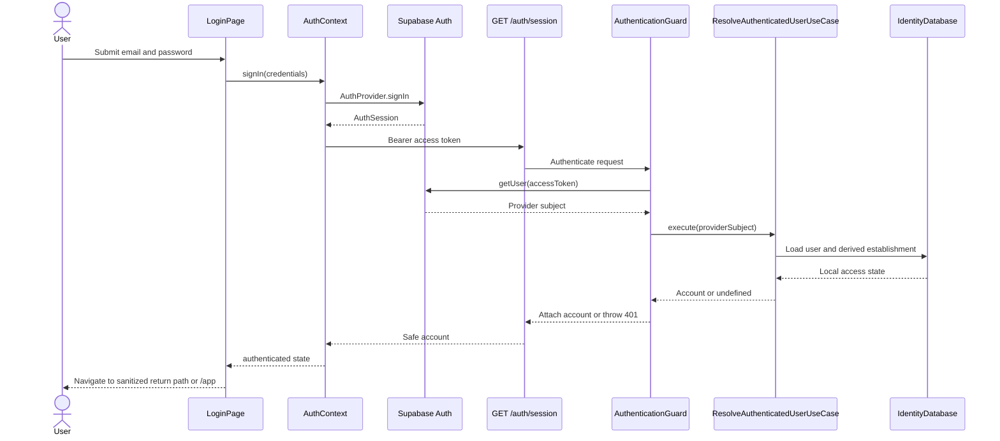
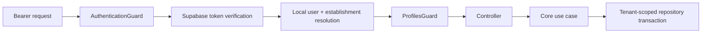
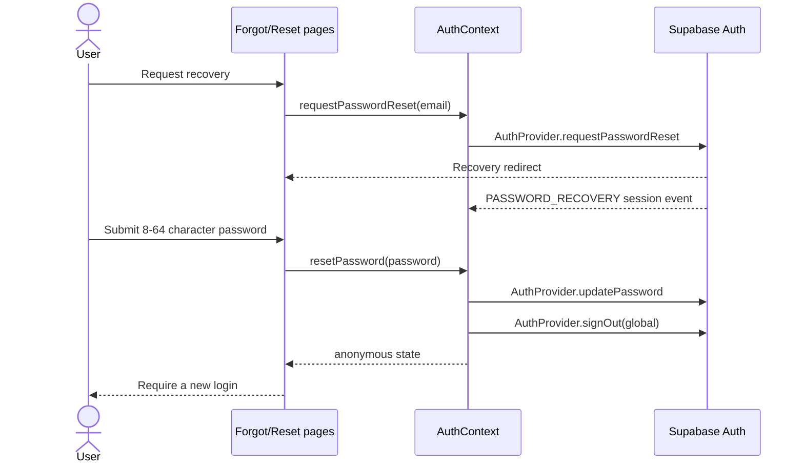

# Authentication and authorization foundation

## Context

This Spec defines the first complete authentication and authorization boundary for
Scoops. Supabase Auth owns credentials, external identity and provider sessions. Scoops
remains authoritative for the local user status, establishment status, fixed profile,
tenant membership and permission to execute business operations.

The delivery is a full-mode Spec because it crosses core contracts, a third-party
provider, NestJS guards and request context, module persistence, REST, TanStack Router,
React state, responsive UI and browser integration tests.

The direct request is tracked by
[`rafinel/scoops#1`](https://github.com/rafinel/scoops/issues/1). Product behavior is
traced to [`documentation/prds/identity.md`](../../../../prds/identity.md), especially
REQ-02, REQ-03, REQ-04, REQ-07 and REQ-13.

`documentation/sdd.md`, requested by the create-spec workflow, does not exist in the
repository at revision 16. This Spec therefore follows the available repository Rules,
Architecture, module ownership, Identity PRD and Tooling documents.

## Scope

### In scope

- email/password login through Supabase Auth;
- provider session restoration before protected content renders;
- current-device logout;
- password recovery request and reset through a valid recovery session;
- provider-independent auth structures and contracts in `packages/core`;
- local access resolution for active users of active establishments;
- fixed `manager` and `operator` authorization;
- authenticated NestJS request context and reusable auth/profile metadata;
- establishment-scoped repository access and a server-side tenant boundary;
- complete Drizzle adapters for the existing Identity database scope, including
  registration-attempt persistence required by `IdentityDatabase` composition but no
  onboarding/invitation endpoint;
- a Manager-only profile update operation that prevents self-change and protects the
  last active Manager, without adding its management screen;
- `/login`, `/forgot-password`, `/reset-password` and `/access-denied` routes;
- one protected `/app` landing and application shell, auth-loading and session-expired
  states;
- Bearer token injection in the shared web REST transport;
- controller integration tests and browser integration tests for the critical paths.

### Out of scope

- public sign-up, establishment onboarding and email confirmation;
- invitations and team-management screens;
- promotion, demotion, inactivation or reactivation UI;
- administrative audit and notifications;
- billing access policy;
- social, passwordless or multi-factor authentication;
- custom login throttling, a custom inactivity timer or a custom maximum-session timer;
- profiles or per-user permission exceptions beyond `manager` and `operator`;
- Row-Level Security for business tables;
- product pages owned by MRP, PDV, Billing or Communication;
- profile-dependent web navigation until protected routes with different profile grants
  exist in their owning modules.

## Product alignment and explicit slice boundary

This foundation implements a subset of the final Identity PRD; it does not weaken the
remaining product requirements.

| PRD requirement | Delivered here | Remains pending |
| --- | --- | --- |
| REQ-02 Authentication and Session | email/password, active local access, neutral failures, multiple devices, current-device logout, session restoration | exact five-attempt/15-minute lock, 30-minute inactivity, seven-day maximum duration and preservation of unfinished form work |
| REQ-03 Password and Access Recovery | recovery-only password change, neutral request response, valid recovery session, 8–64 character UI validation, global provider sign-out after reset | exact one-hour link policy, immediate invalidation of already-issued access tokens and application-owned limits of three messages per 24 hours and two minutes between sends |
| REQ-04 Profiles and Authorization | fixed profiles, server enforcement, direct-access protection, tenant scope, self-change and last-Manager protection | management screens and authorization coverage of future module operations |
| REQ-07 Promotion and Demotion | Manager-only backend profile change, self-change protection and last-active-Manager protection | promotion/demotion UI, audit record and affected-user notification; this Spec does not complete REQ-07 |
| REQ-13 Navigation, States and Quality | auth/access-denied/session states, protected shell, responsive and accessible auth routes | states belonging to onboarding, invitations, audit and later module flows |

Supabase configuration may provide baseline rate limiting and session expiry, but that
provider behavior is not accepted as evidence for the exact pending PRD limits.

## Contract

### Functional requirements

- **RF-01 — Provider-independent auth contract.** Core must expose `AuthCredentials`,
  `AuthSession`, `AuthStateChange`, `AuthStateChangeListener`, `AuthUser`, an
  authenticated local `Account` entity, and `AuthProvider` without importing
  Supabase, React, NestJS, Drizzle or HTTP types. Core must also expose a narrow
  server-side identity-verification contract so the Nest adapter does not implement the
  browser session lifecycle contract.
- **RF-02 — Local access resolution.** For every protected API request, the server must
  verify the provider token, resolve the local user by the provider subject, resolve the
  user's establishment and accept only an active user in an active establishment. The
  initial subject lookup is a narrow bootstrap exception: it may return only the local
  access membership/account for that globally unique subject and must not expose an
  arbitrary tenant resource.
- **RF-03 — Neutral authentication.** Login and recovery UI must not disclose whether an
  email exists or whether rejection was caused by provider credentials, a missing local
  user, a pending/inactive user or an unavailable establishment.
- **RF-04 — Authenticated request context.** A successful server authentication must
  expose only the local account `id`, `establishmentId`, `profile` and safe identity fields to
  downstream guards/controllers; client-supplied identity or establishment identifiers
  must never establish this context.
- **RF-05 — Fixed profile authorization.** Manager-only server operations must reject an
  Operator even when called directly. Operators may access only operations explicitly
  declared for both profiles. Web navigation is an experience boundary and cannot be the
  security boundary.
- **RF-06 — Tenant isolation.** Every tenant-owned repository lookup or mutation in this
  delivery after the access bootstrap must include the authenticated `establishmentId`;
  a valid resource ID from a different establishment must not be readable or mutable.
- **RF-07 — Profile update invariants.** The Manager-only profile update operation must
  reject self-promotion/self-demotion, must reject cross-establishment targets and must
  reject demotion of the last active Manager. A successful update takes effect on the
  next protected request because local profile is resolved per request. Concurrent
  demotions must serialize or conflict atomically so they cannot leave an establishment
  without an active Manager.
- **RF-08 — Session lifecycle.** The web app must restore the provider session after
  reload, validate local access through the server, subscribe to auth state changes and
  keep protected content hidden while resolution is pending. Invalid, expired or locally
  rejected sessions must lead to login with a session-expired or access-unavailable
  message as applicable.
- **RF-09 — Current-device logout.** Logout must call Supabase with local scope, clear the
  current browser's application auth state, preserve other device sessions and return to
  login.
- **RF-10 — Password recovery and reset.** Recovery request must always show the same
  accepted response. The reset route must require a valid Supabase recovery session,
  accept a password from 8 to 64 characters, update it through the provider, perform a
  global provider sign-out and require a new login.
- **RF-11 — Protected routing.** Public auth routes must remain
  reachable without a session. Protected routes must use the shared client route
  middleware before rendering and the shared React auth gate backed by `AuthContext` for
  lifecycle changes after render; the concrete `/app` route must be available to both
  active profiles and must not be server-rendered from browser-only session state.
  `/access-denied` is delivered as the canonical destination for later
  profile-restricted routes, while profile-restricted web navigation is not claimed until
  such a product route exists.
- **RF-12 — Secret boundary.** The browser may receive only the Supabase URL and a
  browser-safe anon/publishable key. Service-role keys, JWT signing secrets, database
  credentials, raw access tokens in logs and provider error payloads must remain outside
  browser-visible output and committed files.

### Acceptance criteria

- **CA-01 — RF-01**
  - **Given:** core auth contracts.
  - **When:** core tests and typecheck run.
  - **Then:** contracts stay provider/framework independent and map provider data into
    Scoops structures.
  - **Expected evidence:** core unit tests and typecheck.
- **CA-02 — RF-02**
  - **Given:** no token or an invalid token.
  - **When:** a protected endpoint is called.
  - **Then:** the API returns `401` without reading protected business data.
  - **Expected evidence:** controller integration test through HTTP.
- **CA-03 — RF-02, RF-03**
  - **Given:** a valid provider session without an active local user or active
    establishment.
  - **When:** login completion or a protected request resolves local access.
  - **Then:** access returns the same `401 Authentication required` response and no local
    status disclosure.
  - **Expected evidence:** core unit tests, controller integration test and browser test.
- **CA-04 — RF-02, RF-04**
  - **Given:** two establishments and a globally unique provider subject.
  - **When:** access bootstrap resolves that subject.
  - **Then:** only the matching safe account is returned and no arbitrary tenant
    resource can be selected or exposed.
  - **Expected evidence:** core unit test and controller integration test.
- **CA-05 — RF-04**
  - **Given:** a valid active Manager or Operator.
  - **When:** a protected request is accepted.
  - **Then:** downstream code receives the server-derived user, establishment and profile
    context.
  - **Expected evidence:** controller integration test.
- **CA-06 — RF-05**
  - **Given:** an authenticated Operator.
  - **When:** a Manager-only endpoint is called directly.
  - **Then:** the API returns `403`, regardless of UI visibility.
  - **Expected evidence:** controller integration test through HTTP.
- **CA-07 — RF-06**
  - **Given:** an active user and a resource/target owned by another establishment.
  - **When:** the operation is attempted with a valid token.
  - **Then:** the operation returns `404`, exposes no cross-tenant data and makes no
    mutation.
  - **Expected evidence:** core unit test and controller integration test.
- **CA-08 — RF-07**
  - **Given:** a Manager targets themself, another establishment, or the last active
    Manager.
  - **When:** profile change is requested.
  - **Then:** the operation is rejected and the persisted profile is unchanged.
  - **Expected evidence:** core unit tests and controller integration tests.
- **CA-09 — RF-07**
  - **Given:** two concurrent requests would each demote one of the establishment's two
    active Managers.
  - **When:** both transactions execute.
  - **Then:** at most one commits; the other receives `409` and at least one active
    Manager remains persisted.
  - **Expected evidence:** concurrent controller integration test with persisted-state
    assertion through the real application wiring.
- **CA-10 — RF-07**
  - **Given:** a Manager updates another same-establishment user without violating the
    last-Manager rule.
  - **When:** profile change is requested.
  - **Then:** the new fixed profile is persisted and used by subsequent authorization.
  - **Expected evidence:** core unit test and controller integration test.
- **CA-11 — RF-08**
  - **Given:** a valid stored provider session and active local access.
  - **When:** the browser reloads `/app`.
  - **Then:** SSR emits only the stable pending shell, client hydration resolves auth
    without mismatch or protected-content flash, and `/app` renders.
  - **Expected evidence:** widget tests, Playwright and console inspection.
- **CA-12 — RF-08, RF-11**
  - **Given:** no session or an expired session.
  - **When:** `/app` is opened directly.
  - **Then:** client-side auth resolution redirects to login with no protected content or
    serialized account in the server response.
  - **Expected evidence:** Playwright plus HTML, console and network inspection.
- **CA-13 — RF-09**
  - **Given:** two provider sessions for the same user.
  - **When:** one browser selects `Exit this device`.
  - **Then:** only that local session ends and the browser returns to login.
  - **Expected evidence:** provider adapter test and browser integration test.
- **CA-14 — RF-10**
  - **Given:** any syntactically valid email.
  - **When:** recovery is requested.
  - **Then:** the same confirmation is shown whether or not the account exists.
  - **Expected evidence:** widget/provider test and browser test.
- **CA-15 — RF-10**
  - **Given:** an invalid, expired or already-used recovery session.
  - **When:** `/reset-password` is opened or submitted.
  - **Then:** no password is changed and the user is guided to request a new link.
  - **Expected evidence:** provider adapter test and browser test.
- **CA-16 — RF-10**
  - **Given:** a valid recovery session and valid new password.
  - **When:** reset completes.
  - **Then:** the password is updated, global sign-out is requested and a new login is
    required.
  - **Expected evidence:** provider adapter test and browser test.
- **CA-17 — RF-12**
  - **Given:** production builds and browser requests.
  - **When:** bundles, logs and network payloads are inspected.
  - **Then:** no service-role key, signing secret, database credential or token log is
    present.
  - **Expected evidence:** build, browser network inspection and source scan.
- **CA-18 — RF-08, RF-12**
  - **Given:** a valid provider session while `/auth/session` is temporarily unavailable.
  - **When:** initial restoration, route validation or manual retry receives `503` or an
    unexpected transport failure.
  - **Then:** the provider session is preserved, protected content remains hidden and a
    retryable unavailable state is shown; local sign-out occurs only for `401`.
  - **Expected evidence:** auth-context test and browser integration test.

## Current state

- Core already defines `User`, `Establishment`, fixed `UserProfile`, `UserStatus`,
  `EstablishmentStatus` and repository interfaces. The module contract states that the
  local user ID is the provider subject.
- Identity persistence registration is empty: there are no Identity Drizzle models,
  mappers or repository implementations in the server.
- The server has no authentication provider, guard, authenticated request context or
  protected Identity controller.
- The web app has only `/`, no auth dependency, no auth context and no route middleware.
  `AxiosRestClient` can set a Bearer token but does not obtain it from a session accessor.
- `RootLayout` already composes shared providers and is the natural stable boundary for
  auth and REST composition.
- The repository runs a local Supabase stack, but browser/server auth keys are not yet
  represented in application environment schemas/examples.

## Technical solution

### Core

1. Add one auth structure per file under Identity structures and export them from the
   existing barrel. `AuthUser.id` is the documented external-identity exception to the
   structures identity rule.
2. Add `AuthProvider` under Identity interfaces following the web provider pattern in
   `/home/petros/projects/hms/apps/web/src/provision/auth/supabase/supabase-auth-provider.ts`:
   sign in, current session, current user, auth-state subscription, scoped sign-out,
   password recovery request and password update. Public sign-up remains excluded by this
   feature's product scope. Provider errors are translated before leaving the adapter.
3. Add an authenticated `Account` entity containing the local user identity and
   establishment scope required by application boundaries; do not expose the provider
   token in that entity.
4. Implement `ResolveAuthenticatedUserUseCase` to load user and establishment and reject
   unavailable local access. Implement `ChangeUserProfileUseCase` for the self-change,
   tenant and last-active-Manager rules. Business rules must not be placed in policy
   objects, entities, guards or repositories.
5. Add one narrowly scoped authentication bootstrap query,
   `findByProviderSubject`, that returns the local `User` needed to derive the
   establishment lookup and build the safe account. It must not accept a
   tenant/resource selector or return unrelated tenant data. All repository operations
   after this bootstrap take `establishmentId` explicitly.
6. Execute every Identity database operation through the single `IdentityDatabase.run`
   transaction API. Its Drizzle implementation always uses serializable isolation. The
   profile count/check/write sequence is one atomic unit; a serialization loser is retried
   inside that boundary or translated to `ConflictError`.
7. Add deterministic use-case tests, including transaction/conflict behavior, and a Core
   `test` script with the dependencies required by the repository testing rules.

### Server

1. Add a feature-owned Identity provision module and Supabase adapter. It verifies each
   Bearer token with the provider and returns only the external subject required by the
   core resolution use case. It implements a narrow server-side identity-verification
   contract distinct from the browser `AuthProvider`; provider SDK types stay inside this
   adapter.
2. Add module-owned Drizzle models, row types, mappers, repositories, seeder wiring and a
   generated migration for establishments, users and the already-contracted registration
   attempts required to compose `IdentityDatabase`. Register repository tokens with
   `useExisting`; re-export owned models from the shared schema barrel. The authentication
   bootstrap uses one subject-keyed lookup followed by its derived establishment lookup;
   normal reads remain tenant-scoped. No registration-attempt endpoint is added.
3. Add one global authentication guard registered at application composition. Public
   endpoints use explicit public metadata. Health, Swagger and the Inngest transport
   remain public at this auth layer and retain their own applicable protections.
4. Parse `Authorization: Bearer <token>` strictly, verify it, execute local access
   resolution, and attach a typed authenticated account to the request. Missing or
   invalid authentication returns `401`; a valid authenticated account without the
   required profile returns `403`.
5. Add reusable profile metadata/guard for `manager` and `operator`. Register authorization
   after authentication so role checks consume only the server-derived account.
6. Add `GET /auth/session` as the protected session bootstrap endpoint and
   `PATCH /users/:userId/profile` as the representative Manager-only operation. The latter
   passes the authenticated actor and establishment to the core use case; it never trusts
   an establishment from the body or route.
7. Implement the profile change through the same `IdentityDatabase.run` boundary used by
   all Identity operations. Map a serialization loser to `409` and verify the invariant
   against persisted state with concurrent HTTP requests.
8. Add Swagger responses, stable error DTO mapping, REST client examples and controller
   integration tests with real Nest/Drizzle wiring. Provider verification may use a
   controlled adapter double because the external Auth service is the test boundary; the
   database and authorization path remain real.
9. Validate `SUPABASE_URL` and a server-safe public/anon verification key through
   `EnvProvider`. Never require or expose the service-role key for request authentication.

There are no integration tests whose direct subject is a repository, mapper, Drizzle
model, transaction adapter or database. Persistence and concurrency are verified only as
effects observed through controller integration tests. This feature adds no server job,
so no job integration test applies.

#### REST contracts

`GET /auth/session` has no request body. On success it returns:

```ts
type AccountResponse = {
  id: string
  establishmentId: string
  name: string
  email: string
  profile: UserProfile
}
```

`PATCH /users/:userId/profile` receives exactly:

```ts
type ChangeUserProfileRequest = {
  profile: UserProfile
}
```

On success it returns the updated safe `User` projection (`id`, `establishmentId`,
`name`, `email`, `profile`, `status`, optional `lastAccessAt`, `createdAt`, `updatedAt`).
Neither contract returns a provider session or token.

| Condition | HTTP status | Stable public title/behavior |
| --- | --- | --- |
| missing, malformed or provider-invalid token | `401` | Nest `UnauthorizedException` with `error: Authentication required`; standard `ErrorResponseDto` |
| valid provider subject without active local user or active establishment | `401` | the exact same Nest exception as invalid authentication; no local-state distinction |
| authentication provider unavailable | `503` | Nest `ServiceUnavailableException` with `error: Authentication service unavailable`; retryable generic message |
| Operator calls profile update | `403` | Nest `ForbiddenException` with `error: Access denied`; no target lookup occurs |
| profile body is outside the fixed enum | `422` | Nest `UnprocessableEntityException` with `error: Invalid request` |
| target is absent or belongs to another establishment | `404` | Core `NotFoundError('User not found')`; existing title `Erro de Não Encontrado` |
| actor targets themself | `409` | Core `ProfileChangeNotAllowedError`; inherited title `Erro de Conflito` |
| demotion would remove the last active Manager | `409` | the same Core conflict response as self-change |
| concurrent demotion loses serialization/conditional write | `409` | Core `ConflictError('Profile change conflict')`; persisted invariant is preserved |

### Web

1. Add `@supabase/supabase-js` only to workspaces that use it and validate
   `VITE_SUPABASE_URL` plus a browser-safe `VITE_SUPABASE_ANON_KEY` (or the provider's
   publishable-key equivalent) in the browser environment boundary.
2. Implement the Supabase client and `SupabaseAuthProvider` under
   `apps/web/src/provision/auth/supabase`. It maps `signInWithPassword`, `getSession`,
   `onAuthStateChange`, `resetPasswordForEmail`, `updateUser` and scoped `signOut` to the
   core contract.
3. Add one React `AuthContext` as the browser authentication state owner. Its provider
   receives the web `AuthProvider` and `IdentityService`, restores the provider session in
   an effect, validates local access through `/auth/session`, subscribes to provider
   events and exposes `resolving/authenticated/anonymous/expired/denied` states. No
   external `AuthStore` is introduced.
4. Make the shared REST transport obtain the latest access token through a session
   accessor for every request; module services do not assemble auth headers. A token must
   not be frozen at context construction because refresh events can replace it.
5. Keep `apps/web/src/router.tsx` and the root route free of authentication state; Router
   Context does not carry the provider, session or account. A shared module-level web
   auth composition exposes the same provider/Identity service instances to React Context
   and route middleware without introducing a store.
6. Add canonical paths and thin route files for `/login`, `/forgot-password`,
   `/reset-password`, `/access-denied` and `/app`. Place `/app` under one pathless
   protected layout with `ssr: false`. This disables its server loader/component render;
   the server emits only the stable non-sensitive pending shell.
   Regenerate `routeTree.gen.ts`; never edit it manually.
7. In client `beforeLoad`, `require-auth-middleware.ts` uses the shared provider and
   Identity service directly to reject absent or locally invalid access before rendering.
   The pathless route then renders an `AuthenticatedRoute` React gate: `resolving` renders
   the pending shell, `authenticated` renders `AppLayout` plus `Outlet`, and rejected
   identity failures remain redirected, while service failures render a retryable
   unavailable state. Neither boundary uses Router Context authentication state.
8. `AuthContextProvider` renders the same stable `resolving` state on its server and first
   client render. It exposes an account only after provider restoration and
   `GET /auth/session` finish, preventing hydration drift and protected-content flash.
9. Keep route guards as UI/navigation controls. All REST authorization remains enforced by
   the NestJS boundary.
10. Implement accessible auth pages with labeled controls, visible focus, announced errors,
   loading-disabled submission, password-manager-friendly attributes and layouts usable
   from 320 px. Reuse design tokens; do not introduce parallel hardcoded values.
11. The `/app` landing and shell are available to both profiles. Do not add placeholder
   MRP/PDV or Manager-only routes merely to manufacture a navigation difference. When an
   owning module adds a differently authorized route, it must add the profile map,
   navigation filtering and `/access-denied` browser coverage in that delivery.

## Implementation blueprint

The imperative wording and section placement distinguish existing paths to modify from
paths to create; no parenthetical new-file marker is used. Generated Drizzle migration
metadata and `routeTree.gen.ts` are changed only by their canonical commands.

### Existing implementation references

- **Identity entities and repository contracts**
  (`packages/core/src/identity/domain/entities`,
  `packages/core/src/identity/interfaces`) — source of the current user, establishment,
  registration-attempt and database-scope shapes.
- **Transactional core pattern**
  (`packages/core/src/billing/use-cases/change-payment-method-use-case.ts`) — reference
  for executing repository work through a module database boundary.
- **Tenant validation pattern**
  (`packages/core/src/mrp/use-cases/update-product-use-case.ts`) — reference for returning
  not-found when a resource does not belong to the establishment.
- **Controller grouping**
  (`apps/server/src/identity/decorators/users-controller.ts`) — reference for route-group
  decorators and Swagger tags.
- **HTTP error envelope**
  (`apps/server/src/shared/rest/filters/global-error-handler.ts`,
  `apps/server/src/shared/rest/dtos/error-response.dto.ts`) — canonical error response
  shape and core/Nest error translation.
- **Controller integration fixture**
  (`apps/server/src/shared/rest/tests/rest-fixture.ts`) — test entry point that composes
  Nest with the real Drizzle/database path.
- **Router and route declaration**
  (`apps/web/src/router.tsx`, `apps/web/src/routes/__root.tsx`,
  `apps/web/src/routes/index.tsx`) — current TanStack Start router factory, root shell and
  thin-route pattern.
- **Application provider composition**
  (`apps/web/src/ui/shared/widgets/layouts/root-layout/index.tsx`) — location where Auth
  and REST providers must be ordered.
- **REST transport and context**
  (`apps/web/src/rest/axios/axios-rest-client.ts`,
  `apps/web/src/ui/shared/contexts/rest-context`) — current shared transport factory and
  React dependency boundary.
- **Browser route test**
  (`apps/web/tests/routes/identity/index.test.tsx`) — current Playwright placement and
  route-test naming convention.
- **HMS web Supabase auth provider reference**
  (`/home/petros/projects/hms/apps/web/src/provision/auth/supabase/supabase-auth-provider.ts`)
  — requested reference for the `SupabaseAuthProvider(client = supabaseClient)` factory,
  Core mapping, provider-error translation and auth-state subscription shape; Scoops
  excludes `signUp` and adds scoped sign-out because those product boundaries differ.

### Pencil visual references

The following Desktop frames in `design/onoreo.pen` are the visual source for the auth UI.
Node IDs are stable references for implementation inspection and final UI evidence; they
do not replace Scoops design tokens, reusable components, responsive rules or accessibility
requirements.

| Pencil Node ID | Frame | Feature surface | Required UI validation |
| --- | --- | --- | --- |
| `mA3b4` | Identity / Entrar — Desktop | `/login` | form hierarchy, labels, actions, loading/error placement and desktop composition |
| `JMFTA` | Identity / Recuperar acesso — Desktop | `/forgot-password` initial state | email field, primary action, back navigation and neutral recovery copy |
| `TCmT1` | Identity / Verificar e-mail — Desktop | recovery-request accepted state | confirmation hierarchy, neutral disclosure and next-step action |
| `wxfmd` | Identity / Definir nova senha — Desktop | `/reset-password` with valid recovery session | password fields, requirements, submission state and action hierarchy |
| `fmVfn` | Identity / Senha redefinida com sucesso — Desktop | successful password-reset state | success feedback and return-to-login action |
| `FvrFp` | Identity / Link de recuperação inválido ou expirado — Desktop | invalid/expired recovery state | error hierarchy and request-new-link recovery action |
| `RZ6Ql` | Identity / Conta ainda não confirmada — Desktop | visual reference for unavailable/denied account feedback | tone, hierarchy and safe recovery action only; account-confirmation behavior remains out of scope |

Before implementing each mapped surface, inspect the referenced node and the reusable
Pencil components/variables it uses. Map those values to the existing Scoops design tokens
and components rather than copying hardcoded colors, dimensions, typography, radii or
shadows.

### Core file plan

#### New domain structures

Create the following under `packages/core/src/identity/domain/structures/` and export
them through the existing `index.ts` barrel:

- `auth-credentials.ts`

  - `AuthCredentials = { identifier: string; password: string }`; login UI maps its email
    field to `identifier`, matching the referenced HMS provider contract.
- `auth-user.ts`

  - `AuthUser = { id: string; email: string }`;
  - `id` is the documented external-provider identity exception for a structure.
- `auth-session.ts`

  - `AuthSession = { accessToken: string; refreshToken?: string; expiresAt?: number;
    sessionId?: string; user: AuthUser }`;
  - `expiresAt` uses Unix seconds to match the provider token/session boundary.
- `auth-state-change.ts`

  - `AuthStateChange = 'INITIAL_SESSION' | 'SIGNED_IN' | 'SIGNED_OUT' |
    'PASSWORD_RECOVERY' | 'TOKEN_REFRESHED' | 'USER_UPDATED'`, preserving the event
    vocabulary exposed by Supabase and used in the referenced HMS adapter.
- `auth-state-change-listener.ts`

  - `AuthStateChangeListener = (event: AuthStateChange, session: AuthSession | null) =>
    void`.

#### New domain entity

Create `packages/core/src/identity/domain/entities/account.ts` and export it through the
existing entities barrel:

```ts
type Account = Entity & {
  readonly establishmentId: string
  readonly name: string
  readonly email: string
  readonly profile: UserProfile
}
```

- `Account.id` is the local user ID and therefore the Supabase provider subject under the
  existing Identity ownership rule;
- the entity represents the active local account available to application boundaries
  after provider and local-access validation;
- it is derived from the persisted `User` plus its validated active establishment and
  does not introduce a separate `accounts` table or repository;
- it contains no access token, refresh token, provider metadata, user status or
  establishment status.

#### New Identity domain errors

Create `packages/core/src/shared/domain/errors/authorization-error.ts`, export it through
the existing shared errors barrel, and define:

```ts
class AuthorizationError extends AppError {
  constructor(message: string) {
    super(message, 'Erro de Autorização')
  }
}
```

This shared base represents a rejected authentication/authorization decision that maps to
HTTP `401`; it contains no HTTP or NestJS dependency.

Create `packages/core/src/identity/domain/errors/` with one class per file and an
`index.ts` declarations-only barrel:

- `invalid-credentials-error.ts` — `InvalidCredentialsError extends AuthorizationError`
  with the neutral message `Identifier or password is invalid`; the web Supabase adapter
  uses it only for provider `invalid_credentials`/equivalent login failures;
- `profile-change-not-allowed-error.ts` — `ProfileChangeNotAllowedError extends
  ConflictError` with the stable message `Profile change not allowed`; the profile use
  case uses it for self-change and last-active-Manager rejection.

Add `./identity/domain/errors` to `packages/core/package.json`. Missing/inactive local
accounts deliberately do not receive distinguishable domain errors: resolution returns
`undefined` and the HTTP boundary emits the same neutral `401`. Provider unavailability
remains a server infrastructure error, while malformed input and missing authorization
remain HTTP-boundary exceptions.

#### New provider and REST contracts

Create the following under `packages/core/src/identity/interfaces/` and export them
through the existing barrel:

```ts
interface AuthProvider {
  signIn(credentials: AuthCredentials): Promise<AuthSession>
  getSession(accessToken?: string): Promise<AuthSession | null>
  getUser(accessToken?: string): Promise<AuthUser | null>
  onAuthStateChange(listener: AuthStateChangeListener): () => void
  signOut(scope: 'local' | 'global'): Promise<void>
  requestPasswordReset(email: string, redirectTo: string): Promise<void>
  updatePassword(password: string): Promise<void>
}
```

- `auth-provider.ts` — browser session lifecycle contract implemented by
  the web Supabase adapter.

```ts
interface AuthIdentityProvider {
  verifyAccessToken(accessToken: string): Promise<AuthUser | undefined>
}
```

- `auth-identity-provider.ts` — server token-verification contract;
  invalid/expired tokens return `undefined`, while provider unavailability throws a
  translated application error.

```ts
interface IdentityService {
  getAccount(): Promise<RestResponse<Account>>
}
```

- `identity-service.ts` — web-to-server REST contract used by the auth
  context. The Manager-only profile endpoint does not enter this service until a web
  screen consumes it.

#### Use cases

- `packages/core/src/identity/use-cases/resolve-authenticated-user-use-case.ts`

  - **Dependencies:** `IdentityDatabase`;
  - **Request:** `{ providerSubject: string }`;
  - **Response:** `Account | undefined`;
  - **Algorithm:** inside `database.run`:
    1. load the user through `findByProviderSubject(providerSubject)`;
    2. return `undefined` when the user is absent or not `active`;
    3. load the establishment only through the `establishmentId` obtained from that user;
    4. return `undefined` when the establishment is absent or not `active`;
    5. return the safe account projection.
  - it does not accept an establishment ID from transport input and does not reveal which
    local check failed.
- `packages/core/src/identity/use-cases/change-user-profile-use-case.ts`

  - **Dependencies:** `IdentityDatabase`, `DatetimeProvider`;
  - **Request:**

    ```ts
    type Request = {
      actor: Account
      userId: string
      profile: UserProfile
    }
    ```

  - **Response:** `User`;
  - capture `const updatedAt = datetimeProvider.now()` once before entering
    `database.run`, so a serialization retry reuses the same business timestamp and the
    transaction callback remains repository-only;
  - **Algorithm:** inside `database.run`:
    1. reject `actor.id === userId` with `ProfileChangeNotAllowedError`;
    2. load the target through `findByIdInEstablishment(actor.establishmentId, userId)`;
    3. return `NotFoundError` for absent or cross-tenant targets;
    4. return the unchanged user when the requested profile already matches;
    5. before demoting an active Manager, call
       `countActiveManagers(actor.establishmentId)` and reject a count of one with
       `ProfileChangeNotAllowedError`;
    6. persist `profile` and the captured `updatedAt` through the scoped
       `replace` method;
    7. let the transaction boundary retry or translate PostgreSQL serialization failure.

Create `packages/core/src/identity/use-cases/index.ts` and add the
`./identity/use-cases` subpath to `packages/core/package.json`.

#### Repository and database contract changes

- Modify `packages/core/src/identity/interfaces/establishments-repository.ts`:

  ```ts
  addMany(inputs: EstablishmentCreate[]): Promise<Establishment[]>
  removeAll(): Promise<void>
  ```

- Modify `packages/core/src/identity/interfaces/registration-attempts-repository.ts`:

  ```ts
  addMany(inputs: UserRegistrationAttemptCreate[]): Promise<UserRegistrationAttempt[]>
  removeAll(): Promise<void>
  ```

- Modify `packages/core/src/identity/interfaces/users-repository.ts`:

  ```ts
  addMany(inputs: UserCreate[]): Promise<User[]>
  findByProviderSubject(providerSubject: string): Promise<User | undefined>
  findByIdInEstablishment(
    establishmentId: string,
    userId: string,
  ): Promise<User | undefined>
  countActiveManagers(establishmentId: string): Promise<number>
  replace(
    establishmentId: string,
    userId: string,
    changes: UserUpdate,
  ): Promise<User>
  removeAll(): Promise<void>
  ```

  `findByProviderSubject` is the only unscoped lookup and is reserved for authentication
  bootstrap. `findByEmail` and `findMany` remain for later Identity flows.
- Modify `packages/core/src/identity/interfaces/identity-database.ts`:

  ```ts
  run<Result>(
    operation: (scope: IdentityDatabaseScope) => Promise<Result>,
  ): Promise<Result>
  ```

  `run` is the only Identity transaction operation. Isolation and retry configuration
  remain internal to the server adapter. Because `run` may replay once after PostgreSQL
  `40001`, deterministic inputs such as `datetimeProvider.now()` must be captured exactly
  once before entering it. The replayable callback may perform only repository work
  through `IdentityDatabaseScope` and cannot call a provider. Messages, remote mutations
  and other external side effects occur only after `run` resolves successfully.

#### Core validation files

- `packages/core/src/identity/use-cases/tests/resolve-authenticated-user-use-case.test.ts` —
  active success, missing user, pending/inactive user, missing/inactive
  establishment and subject-derived establishment lookup.
- `packages/core/src/identity/use-cases/tests/change-user-profile-use-case.test.ts` —
  success, idempotent same profile, self-change, cross-tenant target,
  last active Manager and execution through the single database transaction API.
- `packages/core/src/identity/domain/entities/fakers/user-faker.ts` and
  `establishment-faker.ts` — valid defaults with partial overrides.
- `packages/core/src/identity/domain/entities/fakers/account-faker.ts` — valid active
  `Account` defaults with partial overrides for actor/account use-case tests.
- `packages/core/src/identity/domain/entities/fakers/index.ts` — required
  declarations-only faker barrel used by Core tests.
- `packages/core/package.json` — add the Core `test` script and only the development
  dependencies used by Core tests.
- `pnpm-lock.yaml` — update through pnpm for the Core test dependencies.

### Server file plan

#### Provider boundary

- `apps/server/src/identity/constants/identity-providers.ts`

  - add `IDENTITY_PROVIDERS.authIdentity` as a `Symbol` token;
  - export it through `constants/index.ts`.
- `apps/server/src/identity/provision/supabase/supabase-auth-identity-provider.ts`

  - implements `AuthIdentityProvider`;
  - constructs a server Supabase client with `persistSession`, `autoRefreshToken` and
    `detectSessionInUrl` disabled;
  - `verifyAccessToken(accessToken)` delegates to `auth.getUser(accessToken)`;
  - maps invalid/expired auth responses to `undefined` and provider/network failures to a
    provider-unavailable application error without leaking the Supabase payload.
- `packages/core/src/identity/domain/errors/authentication-provider-unavailable-error.ts`

  - Core Identity typed error emitted only for provider/network availability failures;
  - the authentication guard catches this type and translates it to Nest's stable
    `ServiceUnavailableException`; no provider SDK error crosses the adapter boundary.
- `apps/server/src/identity/provision/identity-provision.module.ts`

  - imports shared `ProvisionModule` for `EnvProvider`;
  - registers the concrete provider and binds `IDENTITY_PROVIDERS.authIdentity` with
    `useExisting`;
  - exports the token, not the concrete class.
- Modify `apps/server/src/shared/provision/env/env-provider.ts` and
  `apps/server/.env.example`:
  - add required `SUPABASE_ANON_KEY`;
  - keep `SUPABASE_SERVICE_ROLE_KEY` and the JWT secret outside application configuration.
- Modify `apps/server/package.json` and `pnpm-lock.yaml` to add
  `@supabase/supabase-js` to the server workspace.

#### Authentication and authorization REST boundary

- `apps/server/src/shared/rest/decorators/public-route.ts`

  - exports a symbol metadata key plus a no-argument `PublicRoute()` wrapper around
    `SetMetadata(key, true)`;
  - used by health and Inngest controllers so a global default-authenticated guard does
    not make shared infrastructure import Identity.
- Modify `apps/server/src/shared/rest/controllers/check-health.controller.ts` and
  `apps/server/src/shared/messaging/inngest/inngest-controller.ts` to apply
  `@PublicRoute()`.
- `apps/server/src/identity/decorators/auth-controller.ts`

  - groups `Controller('auth')` with the `Authentication` Swagger tag.
- `apps/server/src/identity/decorators/required-profiles.ts`

  - `RequiredProfiles = Reflector.createDecorator<UserProfile[]>()`.
- `apps/server/src/identity/decorators/current-account.ts`

  - parameter decorator returning the account previously attached to the HTTP request.
- Export all decorators from the existing Identity decorator barrel.
- `apps/server/src/identity/rest/types/authenticated-request.ts`

  - extends Express `Request` with `account: Account`.
- `apps/server/src/identity/rest/guards/authentication.guard.ts`

  - **Dependencies:** `Reflector`, `AuthIdentityProvider`, `IdentityDatabase`;
  - instantiates `ResolveAuthenticatedUserUseCase` once in the constructor;
  - bypasses only handlers/classes carrying `PublicRoute` metadata;
  - accepts exactly one non-empty `Bearer` token;
  - verifies the provider subject, resolves local access, attaches `request.account`;
  - throws `UnauthorizedException({ error: 'Authentication required', message:
    'Authentication required.' })` for all invalid/local-unavailable cases;
  - maps only `AuthenticationProviderUnavailableError` to
    `ServiceUnavailableException({ error: 'Authentication service unavailable',
    message: 'Try again later.' })`; unexpected errors continue to the global `500`
    handler.
- `apps/server/src/identity/rest/guards/profiles.guard.ts`

  - **Dependency:** `Reflector`;
  - allows routes without profile metadata after authentication;
  - checks `request.account.profile` against `RequiredProfiles` and throws
    `ForbiddenException({ error: 'Access denied', message: 'Access denied.' })` before
    the controller or target repository executes.
- Register both guards with `APP_GUARD` in authentication-then-profile order from
  `IdentityModule`.

#### Controllers, schemas and DTOs

- `apps/server/src/identity/rest/controllers/get-auth-session.controller.ts`

  - **Route:** `GET /auth/session`;
  - **Input:** `@CurrentAccount()` only;
  - **Output:** `AccountResponseDto` with status `200`;
  - **Errors:** `401` and `503` documented with `ErrorResponseDto`.
- `apps/server/src/identity/rest/controllers/change-user-profile.controller.ts`

  - **Route:** `PATCH /users/:userId/profile`;
  - **Metadata:** `RequiredProfiles([UserProfile.Manager])`;
  - **Dependencies:** `IdentityDatabase`, `DatetimeProvider`;
  - derives its TypeScript body from `ChangeUserProfileUseCase['execute']`, omitting
    `actor` and `userId`;
  - executes the use case with the account from `CurrentAccount` and semantic route
    parameter `userId`;
  - documents `200`, `401`, `403`, `404`, `409`, `422` and `503`.
- `apps/server/src/identity/rest/schemas/change-user-profile-schema.ts`

  - imports the runtime `UserProfile` object from Core and declares a strict Zod object
    with only
    `profile: z.enum([UserProfile.Manager, UserProfile.Operator])`;
  - rejects unknown keys so actor, establishment and status cannot enter through the body.
- Every Zod enum introduced by this feature must reference the corresponding runtime Core
  domain structure instead of duplicating string literals. Apply the same pattern to
  `UserStatus`, `EstablishmentStatus`, `RegistrationAttemptStatus` and
  `RegistrationAttemptType` whenever one of those fields enters a schema. Do not create a
  schema for an out-of-scope field merely to exercise this rule.
- `apps/server/src/shared/rest/pipes/zod-validation.pipe.ts`

  - receives a `ZodType`, returns parsed data, and maps validation failure to the stable
    `UnprocessableEntityException({ error: 'Invalid request', message: 'Invalid
    request.' })` without exposing raw Zod internals.
- Modify `apps/server/src/shared/rest/filters/global-error-handler.ts` to classify Core
  errors with `instanceof NotFoundError`, `AuthorizationError`, `BadRequestError`,
  `ConflictError` and `AppError`, in that order, instead of comparing constructor names.
  `AuthorizationError` maps to `401`; this keeps shared REST independent of Identity while
  correctly mapping `InvalidCredentialsError` to `401` and
  `ProfileChangeNotAllowedError` to `409`.
- `apps/server/src/identity/rest/dtos/account-response.dto.ts` and
  `user-response.dto.ts` — Swagger response declarations matching the
  existing core projections; they contain no provider session/token.
- Add controller/schema/DTO barrels only for directories used as public module boundaries.
- `apps/server/rest-client/identity/auth.rest` and `users.rest` — cover
  session bootstrap and profile change with Bearer headers and representative payloads.

#### Persistence

Create these module-owned declarations under
`apps/server/src/identity/database/drizzle/`:

- `models/establishment-status-model.ts`, `user-status-model.ts`,
  `user-profile-model.ts`, `registration-attempt-status-model.ts` and
  `registration-attempt-type-model.ts` — PostgreSQL enums using the
  existing Core constant values.
- `models/establishment-model.ts` — `establishments` table:

  - UUID primary key;
  - required `name`, `status`, `createdAt`, `updatedAt`;
  - nullable `activatedAt`.
- `models/user-model.ts` — `users` table:

  - UUID primary key equal to the Supabase subject;
  - required establishment foreign key, name, email, profile, status and timestamps;
  - nullable `lastAccessAt`;
  - cascading removal only when the owning establishment is deleted;
  - unique case-insensitive index on `lower(email)`;
  - indexes on `(establishmentId, status)` and `(establishmentId, profile, status)`.
- `models/user-registration-attempt-model.ts` — persistence for the
  already-existing entity/contract so `IdentityDatabaseScope` is fully composable; no
  route or product flow consumes it in this feature.
- `types/entities/drizzle-establishment.ts`, `drizzle-user.ts` and
  `drizzle-user-registration-attempt.ts` — `InferSelectModel` aliases.
- `mappers/drizzle-establishment-mapper.ts`, `drizzle-user-mapper.ts` and
  `drizzle-user-registration-attempt-mapper.ts` — `toDomain` conversion,
  including database `null` to domain `undefined`.
- `repositories/drizzle-establishments-repository.ts`,
  `drizzle-users-repository.ts` and `drizzle-registration-attempts-repository.ts`
  — implement the current Core repository contracts plus the scoped user
  changes defined above; each also implements one-query `addMany` and `removeAll` for the
  module seeder, and an empty `addMany([])` returns without querying.
- `models/index.ts`, `mappers/index.ts`, `repositories/index.ts`,
  `types/entities/index.ts`, `types/index.ts` and `drizzle/index.ts` —
  declarations-only barrels required at each exposed database directory boundary.
- `drizzle-identity-database.ts` — implements `IdentityDatabase`:

  - `run` is the only transaction method and calls `database.transaction(callback, {
    isolationLevel: 'serializable', accessMode: 'read write' })`;
  - PostgreSQL `40001` is retried once; a repeated conflict becomes `ConflictError`;
  - no Drizzle transaction type leaves the server layer.

##### Files to create

- `apps/server/src/identity/database/identity-seeder.ts`:

  ```ts
  type IdentitySeed = {
    establishments: EstablishmentCreate[]
    users: UserCreate[]
    registrationAttempts: UserRegistrationAttemptCreate[]
  }

  clear(): Promise<void>
  run(seed: IdentitySeed): Promise<void>
  ```

  - injects all three repository interfaces through their existing Symbol tokens;
  - `clear()` calls `registrationAttempts.removeAll()`, then `users.removeAll()`, then
    `establishments.removeAll()` to respect foreign keys;
  - `run()` calls the corresponding `addMany` methods in establishment, user,
    registration-attempt order;
  - supplied user IDs must already be provider subjects; the seeder never creates or
    stores Supabase credentials.
- `apps/server/src/shared/database/seed-env.ts` — seed-process-only Zod
  schema allowing execution only for `SCOOPS_SERVER_APP_MODE=dev|stg`; it does not
  enter the runtime `EnvProvider`.
- `apps/server/src/shared/database/seed.ts` — creates a Nest application
  context, resets only the two fixed local/staging Supabase Auth users through the
  server-only service-role key, verifies their fixed seed password and UUID subjects,
  obtains `IdentitySeeder`, builds valid Identity creation records with their hardcoded
  provider subjects, calls `clear()` then `run()`, and closes the context in a `finally`
  block.

##### Files to modify

- `apps/server/src/identity/database/identity-database.module.ts` — register concrete
  repositories/database, bind all existing `IDENTITY_REPOSITORIES` tokens with
  `useExisting`, and export tokens plus `IdentitySeeder`;
- `apps/server/src/shared/database/drizzle/schema.ts` — re-export Identity models;
- `apps/server/package.json` — add `db:seed` for the seed entry point; this command is
  explicit and is never part of application bootstrap or production startup.
- `apps/server/.env.example` — no seed subject or password variables; the fixed seed
  identity configuration remains in the dev/staging-only seed entry point, while the
  server-only `SUPABASE_SERVICE_ROLE_KEY` is provided through the main `EnvProvider`.

##### Files to generate

- `apps/server/src/shared/database/drizzle/migrations/<generated>_identity_auth_foundation.sql`
  plus generated Drizzle metadata — enums, tables, foreign keys,
  constraints and indexes above; no RLS or grants because the server is the only business
  data boundary in the current architecture.

There are no repository, mapper, model, migration or database-adapter test files. Their
behavior is observed only through controller integration tests with real Nest/Drizzle
wiring.

#### Server module and integration-test wiring

- Modify `apps/server/src/identity/identity.module.ts` to import Identity database and
  provision modules, register both controllers, and register/export the global guards.
- `apps/server/src/identity/fixtures/identity-module-fixture.ts`

  - composes `RestFixture.register`;
  - overrides only `IDENTITY_PROVIDERS.authIdentity` with a controlled external-provider
    double;
  - seeds establishments/users through the module seeder or repository tokens;
  - exposes reset/close through the shared fixture rather than duplicating Testcontainers.
- `apps/server/src/identity/rest/controllers/tests/get-auth-session.controller.test.ts` —
  missing/invalid token, inactive local user/establishment, active
  account and provider unavailable.
- `apps/server/src/identity/rest/controllers/tests/change-user-profile.controller.test.ts`
  — Operator `403`, cross-tenant `404`, self/last-Manager `409`, success and
  concurrent two-Manager demotion with persisted invariant assertion.

### Web file plan

#### Supabase adapter and browser configuration

- `apps/web/src/provision/auth/supabase/supabase-client.ts`

  - exports one configured `supabaseClient` singleton from the validated public URL/key,
    matching the referenced HMS provision shape;
  - enables the provider's browser persistence/refresh behavior;
  - contains no service-role key or server secret.
- `apps/web/src/provision/auth/supabase/supabase-auth-provider.ts`

  - `SupabaseAuthProvider(client: SupabaseClient = supabaseClient): AuthProvider`;
  - maps `signInWithPassword`, `getSession`, `onAuthStateChange`,
    `resetPasswordForEmail`, `updateUser` and scoped `signOut`;
  - exposes `getUser(accessToken?)` and maps Supabase `Session`/`User` to Core
    `AuthSession`/`AuthUser` through private functions;
  - returns `null` for a missing session/user and forwards the complete Core
    `AuthStateChange` union through `onAuthStateChange`;
  - translates invalid login credentials to `InvalidCredentialsError`, other known client
    auth codes to Core `BadRequestError`/`ConflictError`, and every other provider failure
    to a neutral `AppError`, without returning SDK errors to UI.
- `apps/web/src/provision/auth/auth-composition.ts`

  - creates and exports exactly one `AUTH_PROVIDER = SupabaseAuthProvider()`;
  - creates a private Axios REST client whose session accessor calls
    `AUTH_PROVIDER.getSession()` and exports one `AUTH_IDENTITY_SERVICE` built over it;
  - is imported by `AuthContextProvider` and `require-auth-middleware`; it contains no
    mutable auth state and is not an `AuthStore`.
- Modify `apps/web/src/constants/browser-env.ts` and `apps/web/.env.example` with
  `VITE_SUPABASE_URL` and `VITE_SUPABASE_ANON_KEY`.
- Modify `apps/web/package.json` and `pnpm-lock.yaml` to add
  `@supabase/supabase-js` to the web workspace.

#### Identity REST service and dynamic authorization header

- `apps/web/src/rest/services/identity-service.ts`

  ```ts
  export const IdentityService = (restClient: RestClient): IdentityRestService => ({
    getAccount() {
      return restClient.get<Account>('/auth/session')
    },
  })
  ```

- Modify `apps/web/src/rest/axios/axios-rest-client.ts` so the factory accepts an optional
  asynchronous session accessor and resolves the latest access token for each request.
  The token is applied to that request only; it is not frozen in Axios defaults.
- Modify `apps/web/src/rest/axios/utils/request.ts` or add one colocated utility to merge
  `Authorization: Bearer <token>` into request headers without logging the token.
- Keep `RestClient.setAuthorization` for the existing public contract, but application auth
  composition must use the accessor path so refreshed tokens take effect automatically.

#### React Auth Context

- `apps/web/src/ui/shared/contexts/auth-context/index.tsx`

  - exports `AuthContext` and `AuthContextProvider`;
  - imports `AUTH_PROVIDER` and `AUTH_IDENTITY_SERVICE` from the stateless composition
    module, passes both to `useAuthContextProvider`, and renders no auth UI itself.
- `apps/web/src/ui/shared/contexts/auth-context/use-auth-context-provider.ts`

  - owns React `session`, `account`, `status` and `isPasswordRecovery` state;
  - owns `authGenerationRef`, a monotonically increasing operation version; every
    restore, sign-in, provider event and local-access validation captures its generation
    and may commit React state only while still mounted and while that generation remains
    current;
  - begins as `resolving` for SSR and the first client render;
  - in `useEffect`, calls `authProvider.getSession()`, validates candidate sessions through
    `identityService.getAccount()`, and subscribes once through
    `authProvider.onAuthStateChange()`;
  - the provider listener does not await Supabase work inside its callback; it schedules
    local-access validation and returns immediately, avoiding an auth callback deadlock;
  - revalidates local access on initial, sign-in and token-refresh events, clears state on
    sign-out, and unsubscribes on unmount;
  - when provider authentication succeeds but local access returns `401`, calls
    `authProvider.signOut('local')` before publishing `denied`, so an unusable candidate
    session is not restored repeatedly;
  - classifies local validation failures by HTTP status: only `401` invalidates the
    candidate and signs out locally; `503` and unexpected transport/server failures retain
    `session`, clear `account`, publish `unavailable` and expose
    `retryLocalAccess()`;
  - exposes memoized `signIn`, `signOut`, recovery, reset and `getSession` callbacks that
    delegate provider operations and update React state only after each operation settles;
    normal `signOut()` increments the generation before clearing local state and calling
    provider `signOut('local')`, while successful password reset does the same before
    `signOut('global')`; unmount also increments the generation. Therefore an older async
    validation cannot republish `authenticated` after sign-out or unmount.
- `apps/web/src/ui/shared/contexts/auth-context/types/auth-context-value.ts`:

  ```ts
  type AuthStatus =
    | 'resolving'
    | 'authenticated'
    | 'anonymous'
    | 'expired'
    | 'denied'
    | 'unavailable'

  type AuthContextValue = {
    status: AuthStatus
    session: AuthSession | null
    account: Account | null
    isPasswordRecovery: boolean
    getSession(): Promise<AuthSession | null>
    signIn(credentials: AuthCredentials): Promise<void>
    signOut(): Promise<void>
    requestPasswordReset(email: string): Promise<void>
    resetPassword(password: string): Promise<void>
    retryLocalAccess(): Promise<void>
  }
  ```

- `apps/web/src/ui/shared/contexts/auth-context/types/index.ts` —
  declarations-only type barrel matching the existing shared-context convention.
- `apps/web/src/ui/shared/hooks/use-auth-context.ts` — validates provider
  presence and exposes the typed value.
- Modify `apps/web/src/ui/shared/widgets/layouts/root-layout/index.tsx` provider order:

  ```text
  QueryClientProvider
  └── AuthContextProvider (single React auth owner)
      └── RestContextProvider (session accessor from AuthContext)
          └── HTML shell and route content
  ```
- Modify `apps/web/src/ui/shared/contexts/rest-context/use-rest-context-provider.ts` so
  the shared application client receives `getSession` from AuthContext.
- `apps/web/src/middlewares/sanitize-return-to.ts`

  - `sanitizeReturnTo(value: unknown): string | undefined` accepts only a string beginning
    with one `/`, rejects protocol-relative `//`, absolute URLs, control characters and
    the login path itself, and returns `undefined` for every malformed value.
- `apps/web/src/middlewares/auth-route-unavailable-error.ts`

  - exports a marker error with no provider payload, token or local-user detail, used only
    to select the protected route's retryable `errorComponent`.
- `apps/web/src/middlewares/require-auth-middleware.ts`

  - calls `AUTH_PROVIDER.getSession()` and redirects to `ROUTES.login` when absent;
  - calls `AUTH_IDENTITY_SERVICE.getAccount()` with the current dynamic
    Bearer token; on `401`, calls `AUTH_PROVIDER.signOut('local')` and redirects with the
    same neutral behavior;
  - on `503` or an unexpected transport/server failure, throws a typed
    `AuthRouteUnavailableError` without clearing the provider session; the pathless
    route's error component then keeps the outlet hidden and offers retry;
  - includes only `sanitizeReturnTo(location.pathname + location.search)` in the login
    search object and returns no session, account or auth state on success;
  - runs only in the `_authenticated` route's client `beforeLoad` because that route has
    `ssr: false`; it does not consume React Context or Router Context auth state.
- `apps/web/src/ui/identity/widgets/layouts/authenticated-route/index.tsx`

  - consumes `AuthContext` and owns the client-side protected-route decision;
  - renders the stable pending shell for `resolving`, `AppLayout` with `Outlet` for
    `authenticated`, a non-sensitive retry state wired to `retryLocalAccess` for
    `unavailable`, and `<Navigate>` to `/login` for identity-rejected states;
  - sanitizes the current relative location before adding it as the return search value;
  - never authorizes REST operations; the server guard remains authoritative.
- `apps/web/src/ui/identity/widgets/states/auth-route-unavailable-state/index.tsx`

  - route `errorComponent` for `AuthRouteUnavailableError` with a non-sensitive message
    and retry action that resets/invalidates the current match;
  - renders no `Outlet` and never signs out or clears the provider session.

#### Routes and page widgets

Create thin route files:

- `apps/web/src/routes/login/index.tsx` — `/login` → `LoginPage` and:

  ```ts
  type LoginSearch = { returnTo?: string }

  validateSearch(search: Record<string, unknown>): LoginSearch {
    return { returnTo: sanitizeReturnTo(search.returnTo) }
  }
  ```

  Missing, repeated, non-string, absolute, protocol-relative, control-character and
  self-referential values normalize to `undefined`; `LoginPage` navigates to
  `search.returnTo ?? ROUTES.app` after successful local validation.
- `apps/web/src/routes/forgot-password/index.tsx` —
  `/forgot-password` → `ForgotPasswordPage`;
- `apps/web/src/routes/reset-password/index.tsx` —
  `/reset-password` → `ResetPasswordPage`;
- `apps/web/src/routes/access-denied/index.tsx` — `/access-denied` →
  `AccessDeniedPage`;
- `apps/web/src/routes/_authenticated/route.tsx` — pathless layout with
  `ssr: false`, `beforeLoad: requireAuthMiddleware` and
  `component: AuthenticatedRoute`; declares `AuthRouteUnavailableState` as its
  `errorComponent` so middleware availability failures cannot render protected children;
- `apps/web/src/routes/_authenticated/app/index.tsx` — `/app` →
  `AuthenticatedHomePage`.

Add all paths to `apps/web/src/constants/routes.ts`; run route generation rather than
editing `routeTree.gen.ts`.

Create feature UI under `apps/web/src/ui/identity/widgets/`:

```text
layouts/
└── auth-layout/
    └── index.tsx
pages/
├── login-page/
│   ├── index.tsx
│   └── use-login-page.ts
├── forgot-password-page/
│   ├── index.tsx
│   └── use-forgot-password-page.ts
├── reset-password-page/
│   ├── index.tsx
│   └── use-reset-password-page.ts
├── access-denied-page/
│   └── index.tsx
└── authenticated-home-page/
    └── index.tsx
```

- `AuthLayout` owns brand, centered card and responsive 320 px shell.
- `LoginPage` owns email/password values, neutral failure, pending state, recovery link
  and sanitized post-login return navigation.
- `ForgotPasswordPage` owns email input and always renders the same accepted state after a
  syntactically valid request.
- `ResetPasswordPage` renders password/confirmation only for a recovery snapshot; it
  renders an expired/invalid-link recovery action otherwise.
- `AccessDeniedPage` is a static semantic state with a safe return action.
- `AuthenticatedHomePage` renders only safe account fields needed by the shell.

Create feature action hooks under `apps/web/src/ui/identity/hooks/`:

- `use-login-action.ts`, `use-logout-action.ts`,
  `use-request-password-recovery-action.ts`, `use-reset-password-action.ts`
  — consume AuthContext, expose domain-named mutations plus pending/error
  state, and keep provider APIs out of pages.

Modify `apps/web/src/ui/shared/widgets/layouts/app-layout/`:

- add `use-app-layout.ts` to read account and logout action;
- add `user-menu/index.tsx` with name/profile and
  `Exit this device`;
- keep role-specific module navigation absent until real protected module routes exist.

#### Web behavior coverage files

- `apps/web/src/provision/auth/supabase/tests/supabase-auth-provider.test.ts` — mocked
  `SupabaseClient` coverage for mapping, null session/user,
  provider-error translation, state-change unsubscribe and local/global sign-out scopes.
- Add component/hook tests beside each stateful page and auth context under their
  `tests/` directories; the auth-context tests inject an `AuthProvider` mock directly and
  cover restoration, local rejection, refresh, recovery, cleanup and a deferred local
  validation resolving after sign-out without republishing authenticated state; they also
  prove `401` signs out locally while `503`/transport failure preserves the session and
  supports retry.
- Add route integration files under `apps/web/tests/routes/identity/` for login,
  forgot-password, reset-password, access-denied and the protected app route; login tests
  cover valid relative return, absent value, repeated/non-string value, absolute URL,
  protocol-relative URL, control characters and self-reference.
- Browser tests may mock transport for deterministic UI state, but the final evaluation
  distinguishes them from the real local Supabase/server flow.

### Technical decisions and trade-offs

1. **Supabase session plus local account.** A provider session alone never grants Scoops
   access. Every protected API request resolves the current local user and establishment.
   This adds one local lookup path per request but makes status/profile changes effective
   without trusting stale provider metadata.
2. **HMS-style web AuthProvider plus narrow server verifier.** The web factory implements
   the complete browser lifecycle contract and is consumed directly by `AuthContext`.
   The server retains a separate minimal token-verification contract because it does not
   own browser session state.
3. **AuthContext is the only browser auth state owner.** No external store and no auth
   value in Router Context are introduced. Stateless route middleware uses the same
   provider/service composition to reject access before render; the client-only React
   gate consumes `AuthContext` for lifecycle transitions after render.
4. **Client-only protected subtree.** The provider session is browser-persisted, so the
   pathless authenticated layout uses `ssr: false`. Public auth pages remain SSR-capable;
   protected HTML/account data is never serialized by the server in this slice.
5. **Global authentication with explicit public metadata.** Secure-by-default global
   guards reduce missed endpoint protection. The public marker lives in shared REST so
   health/Inngest do not depend on the Identity feature module.
6. **Server profile guard plus Core invariants.** The profile guard rejects Operator calls
   before target lookup. Self-change, tenant ownership and last-Manager invariants remain
   in the Core use case because they are business decisions, not transport concerns.
7. **One serializable Identity transaction API.** Core exposes only
   `IdentityDatabase.run`; its Drizzle adapter always uses the documented PostgreSQL
   `serializable` isolation. A bounded retry preserves invariants under concurrency
   without exposing database types or a second transaction method to Core.
8. **No RLS in this slice.** Current Architecture assigns tenant isolation to server use
   cases/repositories. Adding RLS would introduce a second authorization system without a
   repository-wide session/claim strategy.
9. **Dynamic token lookup in REST transport.** Resolving the token per request prevents a
   refreshed session from leaving Axios with a stale default header. Tokens are never
   logged or returned in the local-account DTO.
10. **No profile-management UI.** The Manager endpoint exists to make the authorization
    foundation and profile invariants real; the user-management experience, audit and
    notification remain a later REQ-07 slice.

### Runtime flows

#### Login and local access



#### Protected REST request



#### Password recovery



### Files removed

No file is removed. `apps/web/src/routeTree.gen.ts` and Drizzle migration metadata are
regenerated, not edited manually.

### Open technical questions

None. The implementation must amend this Spec before choosing a different session
storage model, authorization boundary, route surface or transaction strategy.

### Development identity bootstrap prerequisite

Before real local browser validation, `SUPABASE_SERVICE_ROLE_KEY` must be available to
the server process in `dev` or `stg`. `apps/server/src/shared/database/seed.ts` resets
only the two fixed seed users used by the command: Manager subject
`3d2396d2-b747-45cb-bb4a-89b25ed6b457`, Operator subject
`6fe71e88-eedc-44f8-aae5-3439b5495e8f`, and the local seed password `123456`. It then
verifies both email/password credentials and UUID subjects through the browser-safe
Supabase Auth endpoint before it clears or writes application data. It accepts no seed
identity environment variables; the service-role key is read from the main server
`EnvProvider`, is never exposed to the web app, and is restricted to local/staging seed
execution. This fixed credential must not be reused in production.

### Provider limitations accepted for this slice

- Supabase `signOut({ scope: 'local' })` ends only the current provider session and keeps
  other device sessions.
- Password reset is followed by global sign-out. Supabase documents that already-issued
  access tokens can remain valid until their `exp` claim even after session revocation.
  The current browser must still become anonymous immediately. Exact immediate revocation
  of every previously issued JWT would require an additional server denylist/session
  version and is not claimed by this Spec.
- The web may use the provider session to establish a candidate identity, but only
  `GET /auth/session` establishes application access and the local profile.

## Validation plan

Validation follows `documentation/tooling.md` and the rules selected for Core, use cases,
REST, controllers, database, provision, UI, routing and widgets.

1. Regenerate tracked outputs:
   - `pnpm --filter server db:migration:generate`
   - `pnpm --filter web generate-routes`
2. Format and static checks:
   - `pnpm format`
   - `pnpm --filter @scoops/core check:code`
   - `pnpm --filter @scoops/core check:types`
   - `pnpm --filter server check:code`
   - `pnpm --filter server check:types`
   - `pnpm --filter web check:code`
   - `pnpm --filter web check:types`
3. Automated behavior:
   - `pnpm --filter @scoops/core test`
   - `pnpm --filter server test`
   - `pnpm --filter web test`
   - focused `pnpm --filter web test:integration tests/routes/identity/...`
4. Real browser validation with required local services:
   - inspect Pencil nodes `mA3b4`, `JMFTA`, `TCmT1`, `wxfmd`, `fmVfn`, `FvrFp` and
     `RZ6Ql` before validating their mapped UI state;
   - for every mapped node, capture a Pencil screenshot and run a layout-problem inspection
     for clipping, overlap and overflow; record the Node ID and result in `evaluation.md`;
   - compare the running Desktop UI against its mapped Pencil node for information
     hierarchy, component choice, typography, spacing, color, states and copy—not by
     pixel-diffing or introducing hardcoded design values;
   - create the two temporary users in local Supabase Auth, export only their UUID
     subjects to the seed process, run `pnpm --filter server db:seed`, and keep test
     passwords outside tracked files and application logs;
   - verify Docker/Supabase, server and web health before navigation;
   - exercise login, reload restoration, current-device logout, recovery/reset,
     unauthenticated redirects and `/app` access with both Manager and Operator;
   - exercise Manager/Operator differences through direct real server requests to the
     representative Manager-only endpoint;
   - inspect the final URL, accessible output, REST/Auth requests, console messages and
     failed network requests;
   - repeat at a narrow viewport and exercise a keyboard-only path; because the referenced
     Pencil nodes are Desktop frames, narrow behavior is validated from Scoops responsive
     and accessibility rules rather than inferred from an absent mobile artboard;
   - stop application processes started for validation while leaving shared Docker
     services running.
5. Final CI-equivalent boundary:
   - `pnpm --filter server build`
   - `pnpm --filter web build`
   - `pnpm build`

Provider-mocked Playwright tests prove the route/UI contract only. Final evidence for a
real authenticated integration must include the local Supabase, real server and real web
flow; it must not be inferred from mocks.

## Evaluation

Implementation and final judgment evidence must be written to
[`evaluation.md`](./evaluation.md). This Spec records the intended Contract only and must
not duplicate final test logs or Judge Implementation findings.

## Documentation alignment

- No product rule is changed in revision 16; pending PRD limits and incomplete REQ-07
  outcomes remain explicitly pending.
- `documentation/architecture.md` already assigns external identity/session issuance to
  Supabase and local status, tenancy and authorization to Scoops.
- `documentation/modules.md` already assigns authentication, users, establishments and
  access to Identity.
- If implementation changes a product rule or the provider/session ownership boundary,
  update the Identity PRD or Architecture in the same change before accepting the
  amendment.

## Premises and resolved questions

- The direct request is traceable to GitHub Issue #1 and the local Identity PRD; no Jira
  ticket was supplied, so none is invented.
- Exact rate/session limits absent from the issue remain valid future PRD requirements.
- `User.id` equals the authentication provider subject, as declared by module ownership.
- The profile update API is included because the requested foundation explicitly requires
  self-change and last-active-Manager protection; its UI remains out of scope.
- `/app` is the only protected product route introduced here and accepts both profiles;
  profile-dependent navigation is deferred rather than demonstrated with placeholder
  routes outside their owning modules.
- A `plan.md` is recommended before implementation because the delivery spans three
  workspaces, migrations, provider integration and browser validation.
- There are no unresolved material questions blocking `open` after Judge Spec acceptance.

## Amendments

### Revision 17 — 2026-08-12

- made password visibility controls part of the implemented auth-page interaction,
  using the shared Lucide `Icon` widget with accessible state and keyboard behavior;
- amended the dev/staging seed contract so `db:seed` resets only the two fixed Supabase
  Auth users through the server-only `SUPABASE_SERVICE_ROLE_KEY` from `EnvProvider`,
  while keeping seed execution restricted to `dev` and `stg`;
- clarified that the service-role key is never used by the browser or request-auth
  verification path;
- added final evidence for the corrected serialization-conflict mapping, improved
  identity route selectors/assertions, the 33 Web unit tests, 8 route integration tests,
  full build, seed execution and Browser-use CDP password-eye validation.

### Revision 16 — 2026-08-11

- added `design/onoreo.pen` as the read-only visual source for the authentication UI;
- mapped Pencil Node IDs `mA3b4`, `JMFTA`, `TCmT1`, `wxfmd`, `fmVfn`, `FvrFp` and
  `RZ6Ql` to their corresponding routes and UI states;
- required per-node Pencil screenshot and layout-problem inspection plus real-browser UI
  comparison, with Node IDs recorded in `evaluation.md`;
- kept responsive, accessibility and token/component conformance governed by Scoops rules;
  `RZ6Ql` is a presentation reference only and does not add account confirmation to scope.

### Revision 15 — 2026-08-11

- improved Markdown list readability without changing the Contract or implementation
  scope;
- added visual separation between file entries and their nested responsibilities;
- standardized high-signal nested labels such as **Dependencies**, **Request**,
  **Response**, **Algorithm**, **Route**, **Input**, **Output**, **Errors** and
  **Metadata**;
- promoted persistence action labels to **Files to create**, **Files to modify** and
  **Files to generate** subheadings and normalized multiline file descriptions.

### Revision 14 — 2026-08-11

- replaced duplicated profile literals in the Zod schema with
  `UserProfile.Manager` and `UserProfile.Operator` from the Core runtime domain structure;
- required every Zod enum in this feature to derive its values from the corresponding
  Core runtime structure, including user, establishment and registration-attempt enums
  when those fields are actually introduced;
- typed the documented account response and profile-change request with `UserProfile` as
  the single fixed-profile source.

### Revision 13 — 2026-08-11

- added the infrastructure-independent shared Core `AuthorizationError` base as explicitly
  requested;
- changed `InvalidCredentialsError` to extend `AuthorizationError` instead of
  `BadRequestError`;
- mapped `AuthorizationError` subclasses to HTTP `401` through the shared REST error
  handler's base-class `instanceof` classification.

### Revision 12 — 2026-08-11

- added explicit Identity domain errors for invalid credentials and forbidden profile
  changes, while keeping inactive-account neutrality and infrastructure/HTTP failures at
  their owning boundaries;
- changed the shared REST error classifier to base-class `instanceof` checks so domain
  subclasses inherit the existing `400`/`409` mappings without a shared-to-Identity
  dependency;
- captured the profile-update timestamp before the retryable transaction callback and
  added `account-faker.ts`, resolving the revision 11 Judge findings.

### Revision 11 — 2026-08-11

- removed the separate serializable-specific transaction method as explicitly requested;
- standardized all Identity operations on the single `IdentityDatabase.run` contract;
- defined the Drizzle implementation of `run` as always serializable with one bounded
  retry for PostgreSQL `40001`, preserving the concurrent last-Manager invariant without
  a second transaction type.

### Revision 10 — 2026-08-11

- changed `Account` from an Identity structure to a Core domain entity as explicitly
  requested;
- moved its planned declaration to `packages/core/src/identity/domain/entities/account.ts`
  and defined it as `Entity & { establishmentId; name; email; profile }`;
- standardized the account identity as `Account.id`, updating the REST response and
  self-change comparison from `userId` to `id`;
- clarified that the entity is derived from the persisted `User` and validated
  establishment but does not create an `accounts` table or separate repository.

### Revision 9 — 2026-08-11

- renamed the server-derived local identity projection from `AuthenticatedPrincipal` to
  `Account` as explicitly requested;
- propagated the terminology through `account.ts`, `AccountResponseDto`,
  `CurrentAccount`, `request.account`, `IdentityService.getAccount()`, `AuthContext.account`
  and runtime-flow descriptions;
- clarified that `Account` is a safe validated application projection, not a Supabase
  session/user and not a separate persisted entity.

### Revision 8 — 2026-08-11

- removed the parenthetical new-file annotations from the technical inventory as
  explicitly requested; paths and implementation scope remain unchanged.

### Revision 7 — 2026-08-11

- replaced the proposed external `AuthStore` and Router Context authentication state with
  one React `AuthContext`, following the explicitly requested HMS web pattern;
- made `SupabaseAuthProvider(client = supabaseClient)` the stable web adapter consumed
  directly by `useAuthContextProvider`, with session restoration and provider-event
  subscription owned by React state/effects;
- aligned Core auth names and shapes with the HMS adapter (`identifier`, `refreshToken`,
  `getUser`, `onAuthStateChange`, `requestPasswordReset` and nullable sessions) while
  preserving Scoops-specific local/global sign-out and excluding public sign-up;
- retained the repository-required client `beforeLoad` middleware, but made it consume the
  same stateless provider/service composition directly; the `AuthenticatedRoute` React
  gate handles post-render lifecycle changes and Router Context remains free of auth;
- retained the narrow server token-verification provider; the HMS server provider was not
  adopted because the user clarified that the intended reference is the HMS web adapter.
- added monotonic generation control for asynchronous auth work and a typed, sanitized
  `/login?returnTo=` contract so stale validation and open-redirect races are closed.
- kept middleware stateless with no account in route context and distinguished identity
  rejection (`401`, local sign-out) from service unavailability (`503`/transport failure,
  preserved provider session plus retry UI).

### Revision 6 — 2026-08-11

- expanded the technical blueprint with real implementation references, exact new and
  modified file paths, TypeScript contract signatures and per-layer responsibilities;
- specified the Core use-case algorithms, repository scope and serializable transaction
  contract for the last-active-Manager invariant;
- detailed the NestJS provider, global authentication/profile guards, request context,
  controllers, schemas, DTOs and public-route metadata;
- detailed all Identity Drizzle models, mappers, repositories, database composition,
  generated migration location and registration-attempt persistence required by the
  existing database scope;
- introduced one browser `AuthStore` as the shared source for Router Context and React
  `AuthContext`, including restoration, token refresh, local-account validation and
  dynamic REST authorization behavior;
- mapped the TanStack routes, UI widget tree, runtime login/protected-request/recovery
  flows, technical trade-offs and explicitly confirmed that no file is removed;
- preserved the repository's test taxonomy: server integration coverage is attached only
  to controllers in this feature, with persistence observed through real controller
  wiring and no standalone database integration suite.
- completed Judge remediation by specifying repository bulk/reset contracts and seeder
  order, client/server AuthStore factories, exact Nest/Core error translation, required
  barrels and a safe local provider-subject bootstrap for real browser validation.

### Revision 5 — 2026-08-11

- standardized server integration evidence as controller integration tests through HTTP;
- removed the implication of standalone database integration tests;
- clarified that persistence and concurrency are exercised indirectly through real
  controller wiring and that no job integration test applies.

### Revision 4 — 2026-08-11

- converted all acceptance criteria from a table to a structured list while preserving
  every CA/RF relationship and expected evidence.

### Revision 3 — 2026-08-11

- removed the empty `jira_tickets` field;
- registered GitHub Issue #1 in `source.ref` and the `issue` frontmatter field;
- added the local Identity PRD to the `prd` frontmatter field and completed the contextual
  REQ-07 reference.

### Revision 2 — 2026-08-11

- narrowed the subject-based identity bootstrap and made all subsequent operations
  explicitly tenant-scoped;
- required transactional/serializable protection and concurrent evidence for the last
  active Manager invariant;
- selected a client-only `ssr: false` protected route model backed by one router-context
  auth store and explicit router invalidation;
- introduced `/app` as the concrete protected route for both profiles and deferred
  profile-dependent navigation until an owning module supplies a real restricted route;
- fixed REST request/response shapes and the public status matrix;
- added explicit REQ-07 partial-delivery traceability.
