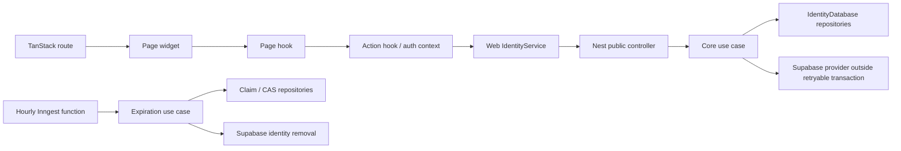

# Ice cream shop onboarding

## Context

This complete-mode Spec delivers
[`rafinel/scoops#3`](https://github.com/rafinel/scoops/issues/3) and Identity PRD
REQ-01: a public flow that creates one ice cream shop and its first Manager,
keeps both inaccessible while email confirmation is pending, and activates both
together after provider confirmation. It includes pending-email correction,
confirmation resend, the immutable seven-day deadline, automatic expiration and
the complete responsive UI state machine.

Complete mode applies because the feature crosses Core rules, Supabase Auth,
serializable PostgreSQL transactions, a generated migration, public REST,
Inngest, TanStack routes, authentication-session races and accessibility at 320
px. The product source is a GitHub Issue because this repository does not use
Jira or Confluence.

`documentation/sdd.md` does not exist. The available authority is the root and
web `AGENTS.md`, the rule router and selected rules, Architecture, module
ownership, Identity PRD, Design System, Tooling, Issue #3, the implemented
authentication foundation and current source/configuration.

## Scope

### In scope

- public registration of one pending establishment and exactly one pending first
  Manager from establishment name, Manager name, email and password;
- fixed `manager` profile assignment and global case-insensitive email uniqueness;
- Supabase signup confirmation delivered through the configured SMTP service;
- a safe pending snapshot and opaque continuation token for status, resend and
  correction after reload;
- correction of only the pending email after proof of the registered password;
- invalidation of the prior confirmation path and a new message after correction;
- confirmation resend without changing the original deadline;
- provider-verified confirmation plus one atomic local activation transaction;
- logical expiration at the exact original deadline and durable physical cleanup;
- blocking pending, expired and partially reconciled identities from `/app` and
  protected APIs;
- `/onboarding` and `/onboarding/confirm` with initial, validation, submitting,
  pending, correcting, resent, expired, provider-error and success states;
- Core use-case tests, server controller/job integration tests, widget tests,
  browser integration tests with mocked transport, and a real local
  Supabase/Mailpit/server/browser flow.

### Out of scope

- invitations, team management, promotion, demotion, inactivation or reactivation;
- billing, subscription or trial activation;
- login throttling, inactivity, maximum-session rules or password recovery changes;
- social login, passwordless login, two-factor authentication or custom profiles;
- public user creation without a new establishment or valid invitation;
- a general authentication-email redesign;
- Row-Level Security or browser access to business tables;
- transactional outbox infrastructure;
- Pencil states other than the four normative desktop frames mapped by this Spec;
  design-only details in those frames do not add routes, business actions or backend
  behavior beyond Issue #3, Identity REQ-01 and the functional requirements below.

## Product alignment

| Product source | Delivered by this Spec | Explicitly deferred |
| --- | --- | --- |
| Identity PRD REQ-01 | complete establishment/first-Manager onboarding, pending access, joint activation, pending-email correction, correction cancellation, new confirmation, immutable seven-day deadline, cleanup, 320 px responsiveness and accessibility | optional commercial subscription integration |
| GitHub Issue #3 | all listed Core, server, web and validation outcomes | its stated out-of-scope invitation/team, billing, session-policy, 2FA and broad email-template work |
| Authentication foundation Issue #1 | reuses provider session validation, active local access checks, `AuthLayout`, auth context and protected route middleware | does not reopen the completed foundation except for the confirmation-callback race described here |

This delivery completes only REQ-01. It must not be represented as completing
Identity invitation, team-management, audit or later access-lifecycle requirements.

## Contract

### Functional requirements

- **RF-01 — Valid public input.** The public operation accepts a trimmed non-empty
  establishment name, trimmed non-empty Manager name, normalized syntactically valid
  email and password of 8–64 characters. The web confirmation field must match before
  submission; server schemas and Core remain authoritative.
- **RF-02 — Inseparable and unique registration.** A public user can be created only
  as the first Manager of a new establishment. Email is globally unique ignoring case
  across active and pending users. Duplicate, malformed and provider-rejected email
  outcomes must not disclose whether the address belongs to an active user, pending
  onboarding or provider-only identity.
- **RF-03 — Pending creation.** A successful registration creates one pending
  establishment, one pending `manager` user whose ID equals the Supabase subject, and
  one pending `establishment-onboarding` registration attempt linked to that user.
  `expiresAt` is captured once as `createdAt + 7 days` in UTC.
- **RF-04 — Credential and secret boundary.** The password may exist only in the
  input, the registration/correction request in transit and transient server memory
  needed to call Supabase. It must never be returned, persisted, logged, published,
  cached, rendered or placed in continuation state. Production transport requires
  HTTPS; server-only provider credentials never cross into Core or the browser.
- **RF-05 — Safe continuation.** Registration returns a high-entropy continuation
  token once. Only its SHA-256 hash is persisted. Status, resend and correction require
  that token and derive the attempt, user and establishment server-side; none accepts a
  client-selected user or establishment ID. Invalid tokens return the same neutral
  not-found response.
- **RF-06 — Pending state and resend.** The safe pending snapshot contains the
  establishment name, Manager name, current email and original expiry. Resend asks
  Supabase to send a signup confirmation to the current email and preserves all local
  creation/deadline timestamps. Provider rate-limit errors are actionable without
  changing local state.
- **RF-07 — Email correction.** Correction accepts only the continuation token, new
  email and registered password. The provider adapter must distinguish a correct
  password on an unconfirmed Supabase user through `email_not_confirmed`; other
  credential outcomes are neutral. Invalid/unavailable email, wrong password or a
  provider failure leaves all prior local values unchanged. Success creates a new
  unconfirmed provider subject for the replacement email with the supplied password,
  transactionally replaces the pending local user/attempt subject and email, rotates
  the application confirmation nonce, sends a new link and preserves the original
  deadline. Cancel makes no request or mutation. Another correction returns `409` while
  a superseded provider subject awaits cleanup.
- **RF-08 — Previous-link invalidation.** A correction is successful only after the
  replacement provider subject exists and the local transaction points exclusively to
  it. The latest confirmation nonce hash is required at activation. The old subject and
  nonce cannot resolve the local attempt even if its provider callback is replayed.
  Old-subject deletion follows commit; transient failure is retained as cleanup work,
  blocks another correction and cannot restore local access.
- **RF-09 — Joint, idempotent confirmation.** `/onboarding/confirm` requires both a
  Supabase-verified bearer subject/email and the current raw confirmation nonce from
  the allowed redirect URL. One serializable transaction rechecks pending status,
  subject, normalized email, nonce hash and deadline, then activates establishment and
  user and marks the attempt confirmed using one captured timestamp. A retry returns
  the already-confirmed result without duplicate transitions.
- **RF-10 — Pending and expired access block.** Existing protected access continues
  to accept only active users of active establishments. A provider session for a
  pending, expired, missing or inconsistent local identity cannot render protected
  content or call protected APIs. The confirmation route temporarily preserves its
  provider session only for finalization, promotes it to the newly activated local
  account, and navigates directly to the authenticated `/app` route without a second
  login.
- **RF-11 — Exact expiration and cleanup.** Status, resend, correction and confirmation
  reject an attempt at `now >= expiresAt`, even before cleanup runs. An Identity-owned
  hourly Inngest job atomically claims due or previously failed expired attempts with a
  renewable 15-minute cleanup lease identified by an immutable claim token, removes
  current/superseded Supabase identities,
  then removes pending establishments (cascading users/attempts). Cleanup is ordered,
  bounded, concurrency-safe, retryable and idempotent; expired email becomes reusable
  after a successful cleanup pass.
  Any attempt status may be claimed solely to remove `supersededProviderSubject`; that
  cleanup never mutates a confirmed active user or establishment.
- **RF-12 — Provider/database failure consistency.** Provider calls and database
  callbacks are never mixed inside the replayable transaction. Registration deletes a
  newly created provider identity if local creation fails. Correction deletes the new
  provider subject if local replacement fails; after commit, failed deletion of the old
  subject remains explicit retryable cleanup while that subject has no local user.
  Cleanup persists `expired` plus its lease before provider deletion. Any uncertain
  state remains locally inaccessible.
- **RF-13 — Public REST boundary.** Public routes expose only register, status, resend,
  correct-email and confirm actions. Zod validates bounded request bodies; server-owned
  timestamps, status, profile, user ID and establishment ID are excluded. Expected
  domain errors map through the existing global error shape; provider unavailability
  maps to `503` without provider payloads.
- **RF-14 — Responsive accessible UI.** The state machine uses existing Scoops tokens,
  `AuthLayout`, semantic controls and Portuguese copy. It works without horizontal
  scrolling at 320 px, exposes labels/instructions, visible focus and textual errors,
  announces asynchronous status, focuses email when correction opens, restores focus
  to the correction trigger on cancel, and is fully keyboard operable.
- **RF-15 — Stable client state and callback race control.** Page-local reducer state is
  the single UI source of truth; only the continuation token and safe pending snapshot
  are stored in `sessionStorage`. Generation guards prevent stale status/resend/correct
  responses from overwriting newer state or navigation. The auth context recognizes a
  signup-confirmation redirect and suppresses normal local-access rejection until the
  confirmation page completes, fails or leaves through SPA navigation. Browser reload
  preserves the marker. Redirect classification occurs synchronously before Supabase
  client construction so `detectSessionInUrl` cannot consume the hash first.
- **RF-16 — Pencil-backed visual contract.** The four mapped frames in
  `design/onoreo.pen` are the normative desktop visual states for the onboarding UI.
  Implementation must preserve their hierarchy, Portuguese copy, Lucide icon intent,
  Manrope typography, 620/820 split at the 1440 × 1024 reference viewport and semantic
  color roles by mapping Pencil variables and instances onto existing Scoops tokens and
  components. It must not copy raw design hex values or create parallel tokens. At
  narrower viewports the responsive and accessibility behavior in RF-14 takes priority
  over fixed desktop geometry.

### Acceptance criteria

- **CA-01 — RF-01, RF-02**
  - **Given:** valid establishment/Manager data and an available email.
  - **When:** registration is submitted.
  - **Then:** it succeeds; malformed or case-insensitive duplicate email receives the
    same actionable unavailable-address class without account-state disclosure.
  - **Expected evidence:** `register-ice-cream-shop-use-case.test.ts`,
    `register-ice-cream-shop.controller.test.ts`, and onboarding page widget tests.
- **CA-02 — RF-02, RF-03**
  - **Given:** a valid new registration.
  - **When:** its controller returns `201`.
  - **Then:** exactly one pending establishment, pending Manager and linked pending
    onboarding attempt are persisted; no standalone public user exists.
  - **Expected evidence:** Core use-case test and persisted assertions through the
    register controller integration test.
- **CA-03 — RF-03, RF-05**
  - **Given:** successful registration.
  - **When:** its response and persistence are inspected.
  - **Then:** the raw continuation token appears only in the response/session storage,
    only its hash is persisted, and the expiry equals the captured time plus seven days.
  - **Expected evidence:** Core use-case test, controller integration test and browser
    storage/network inspection.
- **CA-04 — RF-04**
  - **Given:** registration or correction succeeds or fails.
  - **When:** responses, persistence, logs, events, storage, DOM and bundles are inspected.
  - **Then:** the password exists only in the intentional request and transient provider
    call memory; no password or service-role credential is retained or returned.
  - **Expected evidence:** provider/controller tests, source scan and real browser
    network/storage/DOM inspection.
- **CA-05 — RF-05, RF-06**
  - **Given:** a valid unexpired continuation token.
  - **When:** status or resend is requested.
  - **Then:** the safe snapshot/current email is returned, resend produces a message,
    and `createdAt`/`expiresAt` do not change.
  - **Expected evidence:** get/resend use-case tests, one controller integration test per
    action and Mailpit-backed browser validation.
- **CA-06 — RF-05, RF-13**
  - **Given:** forged tokens, oversized bodies or client-supplied tenant identifiers.
  - **When:** public routes are called.
  - **Then:** validation or neutral not-found is returned and no other tenant record is
    read or mutated.
  - **Expected evidence:** controller integration tests through HTTP.
- **CA-07 — RF-07**
  - **Given:** correction mode opens.
  - **When:** the user edits or cancels.
  - **Then:** only email/password are accepted, other values remain filled, focus moves
    to email, and cancel restores pending state/focus without a request.
  - **Expected evidence:** onboarding page/hook widget tests and 320 px keyboard browser
    validation.
- **CA-08 — RF-02, RF-07**
  - **Given:** invalid/unavailable replacement email or wrong registered password.
  - **When:** correction is submitted.
  - **Then:** previous provider/local email, attempt and deadline remain unchanged and
    the response reveals no account category.
  - **Expected evidence:** correction use-case test, provider adapter test and correction
    controller integration test.
- **CA-09 — RF-07, RF-08**
  - **Given:** valid replacement email and password.
  - **When:** correction succeeds.
  - **Then:** a new provider subject/local user and attempt use the normalized email,
    expiry is unchanged, a new link is delivered, and the previous subject/link cannot
    correlate to or activate the local onboarding.
  - **Expected evidence:** Core/provider/controller tests and real Mailpit/Supabase
    browser flow exercising both links.
- **CA-20 — RF-07, RF-08, RF-11**
  - **Given:** one correction committed but superseded-subject cleanup has not completed.
  - **When:** another correction is submitted or a stale cleanup worker finishes.
  - **Then:** the correction returns `409`; cleanup compare-and-set cannot clear a newer
    claim/subject, and correction becomes available only after exact-subject cleanup.
  - **Expected evidence:** correction use-case test and concurrent cleanup job/controller
    integration tests with lease expiry.
- **CA-10 — RF-09**
  - **Given:** a current unexpired link and provider-verified subject/email.
  - **When:** confirmation completes.
  - **Then:** establishment, user and attempt transition atomically with one timestamp;
    the callback provider session is promoted to authenticated local access and the user
    reaches `/app` without submitting credentials again.
  - **Expected evidence:** confirmation use-case test, persisted controller integration,
    auth-context/page widget tests and real browser flow.
- **CA-11 — RF-09**
  - **Given:** two confirmation requests race or one is retried.
  - **When:** both reach the serializable database boundary.
  - **Then:** one transition commits, the other resolves idempotently or as a translated
    conflict, and no partial/duplicate activation exists.
  - **Expected evidence:** concurrent confirmation controller integration test and Core
    interaction assertions.
- **CA-12 — RF-10, RF-15**
  - **Given:** stored pending continuation state, a normal pending provider session, or
    a confirmation callback session.
  - **When:** `/onboarding`, `/app` or `/onboarding/confirm` loads/reloads across SSR and
    hydration.
  - **Then:** `/app` remains blocked without protected-content flash, while callback
    state is not signed out before finalization, onboarding restores only after mount,
    server/client markup matches, and callback state is cleared afterward.
  - **Expected evidence:** auth-context and onboarding hook tests, both mocked browser
    integration suites with console assertions, and real browser DOM/URL/network checks.
- **CA-13 — RF-11**
  - **Given:** `now` equals or exceeds the original deadline after any resend/correction.
  - **When:** status, resend, correction or confirmation executes.
  - **Then:** it returns expired behavior immediately and performs no activation/update.
  - **Expected evidence:** deterministic tests for all affected use cases and controller
    error assertions.
- **CA-14 — RF-11**
  - **Given:** due attempts including an already-expired, already-removed or transiently
    provider-failing attempt.
  - **When:** the hourly cleanup job runs/retries.
  - **Then:** one worker claims each item, cleanup is bounded/idempotent, successful
    records are removed, failures become reclaimable after lease release/expiry, and
    cleaned email can register again.
  - **Expected evidence:** expiration use-case test and
    `expire-ice-cream-shop-onboardings-job.test.ts` with persisted assertions.
- **CA-21 — RF-11**
  - **Given:** two workers, an expired lease and a newly reclaimed item.
  - **When:** the stale and current workers complete/release cleanup out of order.
  - **Then:** claim-token compare-and-set prevents the stale worker from clearing the
    current lease or subject; only the current claimant can finalize it.
  - **Expected evidence:** concurrent expiration job integration test with persisted
    claim/subject assertions.
- **CA-22 — RF-08, RF-09, RF-11**
  - **Given:** correction committed, old-subject deletion failed, and the replacement
    onboarding confirmed before the cleanup lease became stale.
  - **When:** a later cleanup pass reclaims the confirmed attempt.
  - **Then:** it deletes/CAS-clears only the superseded subject and lease; the confirmed
    attempt, active replacement user and active establishment remain unchanged.
  - **Expected evidence:** expiration job integration test with provider calls and
    persisted active-state assertions.
- **CA-23 — RF-11**
  - **Given:** a due attempt is claimed/marked expired while it also contains a
    superseded provider subject.
  - **When:** two cleanup workers overlap during provider deletion.
  - **Then:** the first worker retains its claim token/lease while deleting both
    subjects and removing the establishment; the second cannot reclaim/process it until
    the first releases on failure or the row disappears on success.
  - **Expected evidence:** concurrent expiration job integration test with delayed
    provider deletion and persisted lease/removal assertions.
- **CA-15 — RF-12**
  - **Given:** provider registration succeeds but local creation conflicts/fails.
  - **When:** compensation runs.
  - **Then:** the new provider identity is removed; compensation failure never grants
    local access and is surfaced as provider unavailability.
  - **Expected evidence:** registration use-case dependency assertions and controller
    provider-failure integration test.
- **CA-16 — RF-12**
  - **Given:** replacement provider signup succeeds but local user replacement fails,
    or old-subject deletion fails after commit.
  - **When:** compensation runs.
  - **Then:** pre-commit failure deletes the replacement subject and keeps the old local
    path; post-commit deletion failure retains cleanup metadata while the superseded
    subject has no local access.
  - **Expected evidence:** correction use-case tests and provider/controller failure-path
    tests.
- **CA-17 — RF-13**
  - **Given:** every expected domain/provider outcome.
  - **When:** each public controller is exercised.
  - **Then:** method/path/body/status/Swagger DTO and stable error payload match the
    documented REST contract without provider internals.
  - **Expected evidence:** one server controller integration test per controller and
    synchronized `registration-attempts.rest` examples.
- **CA-18 — RF-14**
  - **Given:** every loading, invalid, pending, correcting, resent, expired, provider
    error and success state.
  - **When:** rendered at 320 px and desktop with keyboard/assistive semantics.
  - **Then:** content is understandable, controls are reachable, focus/announcements are
    correct, state is not color-only and no horizontal overflow occurs.
  - **Expected evidence:** widget tests, mocked Playwright route coverage and real
    Browser-use accessibility-tree/DOM validation.
- **CA-19 — RF-15**
  - **Given:** a status/resend/correction request resolves after a newer action,
    navigation or unmount.
  - **When:** its promise settles.
  - **Then:** generation checks discard it and it cannot overwrite the current UI,
    continuation state or auth state.
  - **Expected evidence:** onboarding hook tests with controlled promises.
- **CA-24 — RF-14, RF-16**
  - **Given:** the implemented form, pending-confirmation, confirmed-success and
    unavailable-link states at the 1440 × 1024 design viewport.
  - **When:** each route/state is compared with its mapped Pencil frame and also
    exercised at 320 px with keyboard and assistive semantics.
  - **Then:** desktop composition, content, icons, visual hierarchy and semantic token
    roles match the reference without clipping, overlap or horizontal overflow; the
    narrow layout remains operable and understandable without reproducing fixed desktop
    geometry.
  - **Expected evidence:** one Pencil screenshot and one Pencil layout-problem inspection
    per mapped Node ID, plus Browser-use screenshots, accessibility tree, DOM overflow,
    URL, network, console and keyboard findings recorded in `evaluation.md`.

## Current state

- Core already has `Establishment`, `User`, `UserRegistrationAttempt`, fixed
  profiles/statuses, registration-attempt events, repository contracts and
  `IdentityDatabase.run`. No onboarding structures, errors, provider contract or use
  cases exist.
- `DrizzleIdentityDatabase.run` already uses `serializable`, retries SQLSTATE `40001`
  or `40P01` once and translates a repeated conflict to `ConflictError`. Its callback
  must remain repository-only because it can replay.
- Existing tables persist pending establishments/users/attempts. `users.email` has a
  global `lower(email)` unique index. Registration attempts have `tokenHash` and
  `expiresAt`, but no `userId`, confirmation nonce hash, unique token index or expiry
  scan index.
- `SupabaseAuthIdentityProvider` uses `@supabase/supabase-js` `^2.112.3` only to verify
  access tokens. `IdentityProvisionModule` already has a provider token and the server
  environment already requires anon and service-role keys.
- Installed `@supabase/auth-js` 2.112.3 supports `signUp`, `resend` and admin
  `deleteUser`; GoTrue checks the password before returning `email_not_confirmed`.
  Because current docs do not guarantee token invalidation after in-place email update,
  this Spec deterministically replaces the pending provider subject instead.
- Local GoTrue currently sets `GOTRUE_MAILER_AUTOCONFIRM: "true"` and allows only the
  web origin. This conflicts with REQ-01 until auto-confirm is disabled and
  `/onboarding/confirm` is allow-listed. Its default confirmation OTP expiry is 24
  hours; Scoops' seven-day deadline is independent and server-authoritative.
- Identity exposes only auth-session/profile-change controllers. The global
  `AuthenticationGuard` skips `@PublicRoute`; it rejects pending local accounts on
  protected routes. No pending-subject guard or onboarding REST service methods exist.
- Inngest is composed once in `AppModule`, but `InngestOptions.functions` accepts only
  prebuilt functions. The placeholder Communication job has no injected dependencies.
  Cleanup needs a DI-compatible job resolution without moving the root composition.
- Web has a singleton Supabase provider, auth context with generation protection,
  `AuthLayout`, REST transport/session injection and auth routes. On a signup callback,
  its normal auth event path would resolve local access, receive `401` for the pending
  user and sign out before onboarding confirmation can finish.
- `ROUTES` and generated route metadata do not contain onboarding. The auth header's
  “Criar conta” is not an interactive link.
- `design/onoreo.pen` contains four user-selected 1440 × 1024 desktop frames for this
  feature. They use semantic document variables and `font-body = Manrope`; the frames
  reuse `XJAAn` (form field) and `j81wx` (primary button) where applicable. Pencil
  inspection on 2026-08-13 found all four frames visually intact with no visible
  clipping, collapse or overflow. Implementation validation must repeat screenshot and
  layout inspection because the collaborative design may change.

## Technical solution

### End-to-end registration flow

1. Web validates the confirmation field and calls the public register REST action.
2. `RegisterIceCreamShopUseCase` captures time once, normalizes input, issues one
   continuation token and confirmation nonce, prechecks email, then calls the narrow
   Supabase onboarding provider outside a transaction.
3. Supabase `signUp({ email, password, options: { emailRedirectTo } })` creates an
   unconfirmed subject and sends the email. The redirect includes only the raw,
   single-purpose confirmation nonce; the continuation token never enters a URL.
4. One serializable callback rechecks uniqueness and inserts the pending establishment,
   Manager and linked attempt. A local failure triggers provider identity deletion.
5. Web stores the continuation token plus safe snapshot in `sessionStorage`, clears
   password fields and renders pending confirmation.

### Correction and resend flow

1. Status/resend/correction hash the continuation token through
   `OnboardingTokenProvider` and resolve the pending attempt without tenant input.
2. Every action captures `now` once and rejects `now >= expiresAt` before side effects.
3. Resend calls `auth.resend({ type: 'signup', email, options: { emailRedirectTo } })`
   with the existing confirmation nonce/deadline.
4. Correction verifies the password using a non-persisting Supabase client. Only
   `email_not_confirmed` proves correct credentials for the pending subject.
5. After Core validates the replacement email, the adapter signs up a replacement
   unconfirmed subject with the supplied password and new confirmation redirect. One
   serializable transaction rechecks state, inserts the replacement pending user,
   updates attempt `userId`/email/nonce, records the old subject with a preissued cleanup
   claim token/`cleanupClaimedAt`, and removes the old local user. A failed transaction
   deletes the replacement provider subject. After commit, old provider deletion clears
   subject/claim only by exact claim-token/subject CAS; failure leaves the lease for the
   reconciliation job while the old subject has no local access.

### Confirmation flow

1. Supabase consumes its email token and redirects to the allow-listed confirmation
   route with a provider session plus application confirmation nonce.
2. Auth context marks this redirect before initial session resolution, preserves the
   session, and does not run normal active-account resolution.
3. The web service posts the nonce with the provider bearer session. A dedicated
   pending-auth guard verifies the token but intentionally does not require an active
   local account.
4. `ConfirmIceCreamShopOnboardingUseCase` matches subject, verified normalized email,
   nonce hash, pending status and deadline, then activates all local records in one
   serializable callback.
5. Web clears onboarding/session state, signs out the temporary session and navigates
   to `/login` with success feedback.

### Expiration flow

1. An hourly Inngest cron issues one UUID claim token and invokes
   `ExpireIceCreamShopOnboardingsUseCase` with batch size 100, one captured timestamp,
   `staleBefore = now - 15 minutes`, and the claim token.
2. `claimForCleanup` runs in one serializable callback. Every candidate must first have
   `cleanupClaimedAt IS NULL OR cleanupClaimedAt < staleBefore`. Within that lease
   predicate it selects, ordered by `expiresAt` then `id`: any-status rows with a
   superseded provider subject; pending rows due at the cutoff; and expired rows. It
   uses `FOR UPDATE SKIP LOCKED`, sets `cleanupClaimedAt=now`, marks only due pending
   rows `expired`, writes the immutable input claim token and returns at most 100 claims.
3. Processing branches on the claimed status before clearing anything. For a confirmed
   or non-due pending claim, delete only `supersededProviderSubject`, then CAS-clear that
   exact subject and lease using attempt ID/claim token/subject; processing ends without
   touching the current user/establishment. For an expired claim, retain the claim token
   and lease while deleting both current and superseded provider subjects and removing
   the establishment; success atomically removes the attempt by cascade, so no lease
   clear occurs. On any expired-branch failure, a transaction clears only the matching
   claim token/lease; if release fails, the 15-minute timeout makes it reclaimable.
   Concurrent workers therefore cannot process a live expired claim together.
4. Interactive operations still enforce the deadline synchronously, so an hourly job
   cannot extend access.

## Implementation blueprint

### Implementation map by application and technical layer

This section is the implementation directory. It organizes the declarations below by
deployable application and layer; the later exact-contract sections remain authoritative
for algorithms, status mapping, transactions and runtime behavior. Paths marked for
creation are also listed under **Files to create**; existing paths appear under **Files
to modify**.

#### `packages/core` — Identity domain and application rules

##### Domain structures and errors

- **Location:** `packages/core/src/identity/domain/structures/` and
  `packages/core/src/identity/domain/errors/`.
- **Types:** create `IceCreamShopOnboardingInput`,
  `PendingIceCreamShopOnboarding` and `IceCreamShopOnboardingRegistration` with the
  exact properties in **Exact Core declarations**.
- **Entity change:** extend `UserRegistrationAttempt` with linked user,
  confirmation-correlation, superseded-provider-subject and cleanup-lease fields; raw
  continuation/confirmation tokens never enter the entity.
- **Errors:** create `OnboardingEmailUnavailableError`, `OnboardingExpiredError` and
  `InvalidOnboardingCredentialsError`; add shared `TooManyRequestsError` and
  `ServiceUnavailableError` only for cross-module transport-safe failure categories.
- **Exports:** update the relevant structure, error, faker and shared-error barrels.

##### Provider and repository contracts

- **Location:** `packages/core/src/identity/interfaces/`.
- **Provider types:** create `OnboardingIdentityProvider`, `OnboardingTokenProvider` and
  `OnboardingIdentifierProvider`; their exact method signatures are defined below and
  contain no Supabase, Node or Nest types.
- **Persistence contracts:** extend `EstablishmentsRepository`, `UsersRepository` and
  `RegistrationAttemptsRepository` with removal, lookup, claim and compare-and-set
  methods. `IdentityDatabase.run` remains the only transaction abstraction.
- **Web/server contract:** extend `IdentityService` with the five onboarding operations
  defined in **Web state and routing decisions**; responses retain the existing
  `RestResponse` boundary.

##### Use cases

- **Location:** `packages/core/src/identity/use-cases/`.
- **Classes:** create `RegisterIceCreamShopUseCase`,
  `GetIceCreamShopOnboardingUseCase`, `ResendIceCreamShopConfirmationUseCase`,
  `CorrectIceCreamShopOnboardingEmailUseCase`, `ConfirmIceCreamShopOnboardingUseCase`
  and `ExpireIceCreamShopOnboardingsUseCase`.
- **Dependencies:** inject only `IdentityDatabase`, `DatetimeProvider` and the narrow
  onboarding provider/token/identifier contracts required by each constructor listed
  below.
- **Input/output:** expose only the exact `execute(...)` signatures below. Capture time,
  generated identifiers and tokens before retryable database callbacks; callbacks do
  repository work only and provider side effects remain outside them.
- **Test support:** add `UserRegistrationAttemptFaker` and export it for deterministic
  use-case fixtures.

#### `apps/server` — transport, infrastructure and runtime composition

##### Provision providers

- **Location:** `apps/server/src/identity/provision/`.
- **Classes:** create `SupabaseOnboardingIdentityProvider`,
  `NodeOnboardingTokenProvider` and `NodeOnboardingIdentifierProvider` implementing the
  Core contracts.
- **Dependencies:** the Supabase adapter receives environment-backed anon/service-role
  clients; Node adapters use `node:crypto`. No provider SDK object crosses into Core.
- **Registration:** add `IDENTITY_PROVIDERS.onboardingIdentity`,
  `onboardingToken` and `onboardingIdentifier` and bind them in
  `IdentityProvisionModule`.
- **Errors:** translate provider 429 and outage/unknown outcomes into the transport-safe
  application errors described below.

##### Database model, mapper, repositories and migration

- **Location:** `apps/server/src/identity/database/drizzle/` and generated migration
  paths under `apps/server/src/shared/database/drizzle/migrations/`.
- **Model/type:** add the five onboarding columns and exact indexes from **Exact
  persistence and migration contract** to `user-registration-attempt-model.ts` and
  `DrizzleUserRegistrationAttempt`.
- **Mapper:** extend `DrizzleUserRegistrationAttemptMapper` bidirectionally for every
  new nullable/required field without supplying invented defaults.
- **Repositories:** implement linked-user lookups, establishment/user removal,
  `FOR UPDATE SKIP LOCKED` batch claims and claim-token/subject compare-and-set clears in
  the existing Drizzle repositories.
- **Migration:** generate through the repository command, then amend only for the staged
  backfill/assertion/FK/index sequence specified below. There are no browser grants or
  RLS changes because business tables remain server-only.

##### REST schemas, DTOs, guard and controllers

- **Location:** `apps/server/src/identity/rest/` and
  `apps/server/src/identity/decorators/`.
- **Schemas:** create five strict Zod schemas with the exact bounded fields below;
  profile, IDs, timestamps, status, redirect URL and verified provider identity remain
  server-controlled.
- **DTOs:** create `PendingIceCreamShopOnboardingResponseDto` and
  `IceCreamShopOnboardingRegistrationResponseDto` and export them from the DTO barrel.
  The pending DTO declares `expiresAt: string` with Swagger `format: 'date-time'` and
  maps the Core `Date` with `toISOString()`; registration nests that DTO. Controllers
  never rely on JSON's implicit `Date` conversion.
- **Guard/context:** create `PendingAuthenticationGuard`, `CurrentAuthUser` and
  `PendingAuthenticatedRequest` so confirmation can consume a verified temporary
  Supabase session without requiring an active local user.
- **Controllers:** create one controller per register/status/resend/correct/confirm
  action. Each constructor manually assembles exactly one use case from injected
  repositories/providers, derives the callback base URL from server environment and
  exposes the method/path/body/status contract below.
- **Error mapping:** extend `GlobalErrorHandler` for shared 429/503 subclasses before its
  generic `AppError` branch; do not catch provider errors in controllers.

##### Messaging and composition

- **Location:** `apps/server/src/identity/messaging/` and
  `apps/server/src/shared/messaging/inngest/`.
- **Class:** create `ExpireIceCreamShopOnboardingsJob`; its `.function` is an hourly
  Inngest function that creates one claim token and calls the expiration use case with a
  batch of 100.
- **Module:** create `IdentityMessagingModule`; it owns the job and imports the Identity
  database/provision dependencies.
- **Shared composition:** allow `InngestOptions.functions` to receive either a built
  function or injectable job class and resolve classes through `ModuleRef` in the
  existing controller. `AppModule` keeps the single `InngestModule.forRoot` call.

#### `apps/web` — adapters, state ownership, routes and UI widgets

##### Provision, REST service and persistence adapter

- **REST service:** extend `apps/web/src/rest/services/identity-service.ts` with the
  five Core `IdentityService` methods. Each method maps one operation to the exact REST
  contract and uses the existing injected `RestClient`.
- **Auth provision:** update `supabase-client.ts`, `supabase-auth-provider.ts` and
  `auth-composition.ts` to classify the signup callback before Supabase consumes the
  URL, preserve the temporary callback session and expose completion cleanup.
- **Session adapter:** create
  `apps/web/src/ui/identity/storage/onboarding-session-storage.ts` with
  `load(): StoredOnboardingSession | undefined`,
  `save(value: StoredOnboardingSession): void` and `clear(): void`; it validates a
  versioned `{ continuationToken, onboarding }` object and never stores passwords or
  confirmation tokens.

  The domain keeps `expiresAt: Date`; JSON and storage use an ISO-8601 string and are
  mapped explicitly:

  ```ts
  type PendingIceCreamShopOnboardingJson = Omit<
    PendingIceCreamShopOnboarding,
    'expiresAt'
  > & { expiresAt: string }

  type StoredOnboardingSession = {
    version: 1
    continuationToken: string
    onboarding: PendingIceCreamShopOnboarding
  }

  type StoredOnboardingSessionJson = Omit<
    StoredOnboardingSession,
    'onboarding'
  > & { onboarding: PendingIceCreamShopOnboardingJson }

  function mapPendingOnboarding(
    response: PendingIceCreamShopOnboardingJson,
  ): PendingIceCreamShopOnboarding

  load(): StoredOnboardingSession | undefined
  save(value: StoredOnboardingSession): void
  clear(): void
  ```

  `IdentityService` uses `PendingIceCreamShopOnboardingJson` only as its private HTTP
  response type and `mapPendingOnboarding` for register/status/resend/correct results.
  The mapper accepts only a syntactically valid ISO datetime with an offset and a finite
  parsed instant; malformed transport becomes the existing unexpected-response failure.
  Storage `save` writes `expiresAt.toISOString()`. `load` strictly validates version,
  token shape, bounded strings and ISO datetime, constructs a new `Date`, and clears/
  returns `undefined` on parse or validation failure. No component receives a stringly
  typed expiry.

##### Application action hooks and shared auth context

- **Action hooks:** create the five `use<Name>Action` hooks under
  `apps/web/src/ui/identity/hooks/`. Each obtains `identityService` from the REST
  context, wraps one service call, converts `RestResponse` through shared
  `HTTP_STATUS_CODE`, and returns domain-named data/status/error/operation values. They
  own request lifecycle only, never page state or navigation.

  Their public controller shapes follow the existing `useLoginAction` convention:

  ```ts
  useRegisterIceCreamShopAction(): {
    error: Error | null
    isPending: boolean
    registerIceCreamShop(input: IceCreamShopOnboardingInput):
      Promise<IceCreamShopOnboardingRegistration>
  }

  useGetIceCreamShopOnboardingAction(): {
    error: Error | null
    isPending: boolean
    getIceCreamShopOnboarding(continuationToken: string):
      Promise<PendingIceCreamShopOnboarding>
  }

  useResendIceCreamShopConfirmationAction(): {
    error: Error | null
    isPending: boolean
    resendIceCreamShopConfirmation(continuationToken: string):
      Promise<PendingIceCreamShopOnboarding>
  }

  useCorrectIceCreamShopOnboardingEmailAction(): {
    error: Error | null
    isPending: boolean
    correctIceCreamShopOnboardingEmail(input: {
      continuationToken: string
      email: string
      password: string
    }): Promise<PendingIceCreamShopOnboarding>
  }

  useConfirmIceCreamShopOnboardingAction(): {
    error: Error | null
    isPending: boolean
    confirmIceCreamShopOnboarding(confirmationToken: string): Promise<void>
  }
  ```
- **Auth context:** extend `AuthContextValue` and `useAuthContextProvider` with
  `isOnboardingConfirmation`, `activateOnboardingConfirmation()` and
  `completeOnboardingConfirmation()` exactly as declared below. The context owns
  temporary provider-session lifecycle, not onboarding form state.
- **Page state:** no store and no feature context are created. `useOnboardingPage` and
  `useOnboardingConfirmationPage` are the only owners of page state, effects, refs,
  action orchestration, navigation and handlers. Nested widgets receive data and
  callbacks only through exported prop types.

##### Shared onboarding UI widgets

- **`OnboardingProgress`** —
  `apps/web/src/ui/identity/widgets/components/onboarding-progress/index.tsx`.

  **Props:**

  ```ts
  export type OnboardingStep = 'registration' | 'confirmation' | 'completed'

  export type OnboardingProgressProps = {
    currentStep: OnboardingStep
    trailingLabel: string
    tone?: 'default' | 'danger'
  }
  ```

  **State/hook:** pure renderer; no local state and no hook.

  **Responsibility:** render the accessible “N de 3” label, trailing state and three
  semantic progress segments used by all four Pencil frames. It uses text as well as
  color and exposes the current step through `aria-current='step'`.

- **`OnboardingDetailList`** —
  `apps/web/src/ui/identity/widgets/components/onboarding-detail-list/index.tsx`.

  **Props:**

  ```ts
  export type OnboardingDetailItem = {
    eyebrow: string
    icon: IconName
    label: string
    status?: string
    tone: 'primary' | 'success' | 'warning' | 'danger'
  }

  export type OnboardingDetailListProps = {
    items: readonly OnboardingDetailItem[]
  }
  ```

  **State/hook:** pure renderer; no local state and no hook.

  **Responsibility:** render the establishment/access/recovery rows shared by pending,
  success and unavailable-link states without embedding business-state decisions.

- **`OnboardingRecoveryPanel`** —
  `apps/web/src/ui/identity/widgets/components/onboarding-recovery-panel/index.tsx`.

  **Props:**

  ```ts
  export type OnboardingRecoveryState =
    | 'expired-continuation'
    | 'invalid-confirmation-link'
    | 'provider-unavailable'

  export type OnboardingRecoveryAction = {
    kind: 'primary' | 'secondary' | 'link'
    label: string
    onSelect: () => void
  }

  export type OnboardingRecoveryPanelProps = {
    actions: readonly OnboardingRecoveryAction[]
    description: string
    details: readonly OnboardingDetailItem[]
    isBusy: boolean
    progressTrailingLabel: string
    state: OnboardingRecoveryState
    title: string
  }
  ```

  **State/hook:** pure renderer; no hook. It composes `OnboardingProgress` and
  `OnboardingDetailList` to render expired, invalid, used and provider-unavailable
  recovery from the complete presentation contract supplied by a page hook; it does not
  infer copy, details or available actions from the state marker. Both pages consume it,
  so it lives at feature-component level.

  `useOnboardingPage` returns `recoveryPanelProps` for `expired-continuation` and owns
  `handleResend`, `handleRestart` and `handleEnterApp`. It makes resend primary only when a
  validated continuation token exists; otherwise restart is primary. The confirmation
  hook returns `recoveryPanelProps` for `invalid-confirmation-link` or
  `provider-unavailable` and owns `handleRetryConfirmation`, `handleResend`,
  `handleRestart` and `handleEnterApp`; retry is offered only for a transient provider
  failure with a still-valid provider session/token, and resend only with validated
  continuation state. Each hook prepares the exact title, description, progress label,
  detail items, action labels/order and callbacks before rendering.

##### `/onboarding` page widget

- **View:** `OnboardingPage` in
  `apps/web/src/ui/identity/widgets/pages/onboarding-page/index.tsx`.
- **Props:** none; the route renders it directly.
- **Hook:** `useOnboardingPage()` in the colocated `use-onboarding-page.ts`.
- **Hook state:** one discriminated reducer covering `form`, `restoring`, `submitting`,
  `pending`, `correcting`, `resending`, `expired` and `error`; form values include
  establishment name, Manager name, email, password and password confirmation, while
  correction values include replacement email and current password. The hook owns
  validation, generation guards, storage restoration, focus refs and every `handle*`
  callback.
- **Composition:** selects one internal content widget and passes `visual` to the
  existing `AuthLayout`; it contains no form logic or locally declared nested React
  component. `restoring` renders an accessible busy status without stale form content;
  `form`/`submitting`/registration `error` render `OnboardingRegistrationForm`;
  `pending`/`resending`/`correcting` render `OnboardingPendingConfirmation`; and
  `expired` renders the shared `OnboardingRecoveryPanel`.

- **`OnboardingRegistrationForm`** —
  `onboarding-page/onboarding-registration-form/index.tsx`.

  **Props:**

  ```ts
  export type OnboardingRegistrationValues = {
    establishmentName: string
    managerName: string
    email: string
    password: string
    passwordConfirmation: string
  }

  export type OnboardingRegistrationFormProps = {
    errors: Partial<Record<keyof OnboardingRegistrationValues, string>>
    errorMessage?: string
    isPasswordVisible: boolean
    isSubmitting: boolean
    values: OnboardingRegistrationValues
    onChange: (field: keyof OnboardingRegistrationValues, value: string) => void
    onSubmit: (event: FormEvent<HTMLFormElement>) => void
    onTogglePasswordVisibility: () => void
  }
  ```

  **State/hook:** pure controlled form; no hook. Use semantic labels, autocomplete,
  field-level `aria-describedby`, summary `role='alert'`, disabled/busy submit state and
  the shared `Icon` wrapper. This widget is the implementation surface for `ZVD15`.

- **`OnboardingPendingConfirmation`** —
  `onboarding-page/onboarding-pending-confirmation/index.tsx`.

  **Props:**

  ```ts
  type OnboardingPendingConfirmationBaseProps = {
    correctionTriggerRef: RefObject<HTMLButtonElement | null>
    errorMessage?: string
    feedbackMessage?: string
    isResending: boolean
    onboarding: PendingIceCreamShopOnboarding
    onOpenCorrection: () => void
    onResend: () => void
  }

  export type OnboardingPendingConfirmationProps =
    OnboardingPendingConfirmationBaseProps & (
      | {
          isCorrecting: false
          correctionFormProps?: never
        }
      | {
          isCorrecting: true
          correctionFormProps: OnboardingEmailCorrectionFormProps
        }
    )
  ```

  **State/hook:** pure renderer; no hook. It composes `OnboardingProgress`,
  `OnboardingDetailList` and the correction widget, announces resend feedback with a
  polite live region, and owns the visible pending/resending/resent shell for `t67NUw`.

- **`OnboardingEmailCorrectionForm`** —
  `onboarding-page/onboarding-pending-confirmation/onboarding-email-correction-form/index.tsx`.

  **Props:**

  ```ts
  export type OnboardingEmailCorrectionFormProps = {
    emailInputRef: RefObject<HTMLInputElement | null>
    email: string
    errorMessage?: string
    isPasswordVisible: boolean
    isSubmitting: boolean
    password: string
    onCancel: () => void
    onEmailChange: (email: string) => void
    onPasswordChange: (password: string) => void
    onSubmit: (event: FormEvent<HTMLFormElement>) => void
    onTogglePasswordVisibility: () => void
  }
  ```

  **State/hook:** pure controlled form; no hook. The page hook supplies the email input
  ref and focus-return behavior through its handlers/effect; cancel is `type='button'`
  and makes no request.

##### `/onboarding/confirm` page widget

- **View:** `OnboardingConfirmationPage` in
  `apps/web/src/ui/identity/widgets/pages/onboarding-confirmation-page/index.tsx`.
- **Props:** `OnboardingConfirmationPageProps = { confirmationToken?: string }`; the
  route passes only its validated search value.
- **Hook:** `useOnboardingConfirmationPage(props)` in the colocated
  `use-onboarding-confirmation-page.ts`.
- **Hook state:** one discriminated state covering `confirming`, `success`,
  `unavailable` and `provider-error`; it owns callback-session readiness, one guarded
  confirmation request, stored onboarding snapshot lookup, resend/restart/login
  navigation and cleanup on SPA departure versus document reload.
- **Composition:** renders an accessible busy status while `confirming`,
  `OnboardingConfirmationSuccess` for `success`, and the shared
  `OnboardingRecoveryPanel` for `unavailable`/`provider-error`, all inside `AuthLayout`.
  It does not read `window.location`, call Supabase or declare local nested components.

- **`OnboardingConfirmationSuccess`** —
  `onboarding-confirmation-page/onboarding-confirmation-success/index.tsx`.

  **Props:**

  ```ts
  export type OnboardingConfirmationSuccessProps = {
    onboarding?: PendingIceCreamShopOnboarding
    onEnterApp: () => void
  }
  ```

  **State/hook:** pure renderer; no hook. It renders step 3, active establishment and
  Manager details when the safe stored snapshot exists, generic non-leaking success
  copy when the callback occurred in another browser, and the login action. This widget
  implements `f9xhLm`; the example shop name in Pencil is dynamic copy, not a required
  persisted browser value.

The shared `OnboardingRecoveryPanel` is the visible implementation of `r8AIM` on this
route; on `/onboarding`, the same widget represents an expired continuation without
claiming that the callback URL itself failed.

##### Auth layout, visual variants and icon boundary

- **`AuthLayout`:** extend `AuthLayoutProps` with an optional typed header action
  (`prompt`, `label`, `route`) so login/onboarding links use `Anchor`; preserve the
  responsive 620 px left panel and hide/collapse the right visual panel according to
  existing breakpoint behavior.

  ```ts
  export type AuthLayoutHeaderAction = {
    label: string
    prompt: string
    route: RouteName
  }

  export type AuthLayoutProps = PropsWithChildren<{
    headerAction?: AuthLayoutHeaderAction
    visual?: AuthVisualLayoutVariant
  }>
  ```

  Onboarding uses “Já tem uma conta? / Entrar”; login uses “Ainda não tem uma
  sorveteria? / Criar conta”. The existing unused `eyebrow` prop is removed rather than
  preserved as a second header API. When `headerAction` is omitted, `AuthLayout`
  preserves backward compatibility by using the existing login-family prompt with a
  functional `Anchor` to `ROUTES.onboarding`; when `visual` is omitted it remains
  `login`. Existing forgot-password, reset-password and unavailable-auth consumers need
  no call-site modification.
- **`AuthVisualLayout`:** rename the existing layout widget from `AuthVisual` and move
  it from `auth-visual/` to
  `apps/web/src/ui/identity/widgets/layouts/auth-visual-layout/index.tsx`, so every
  layout widget name and directory ends in `-layout`. Rename `AuthVisualVariant` to
  `AuthVisualLayoutVariant`, rename `AuthVisualProps` to `AuthVisualLayoutProps`, and
  extend the variant with `onboarding-create`,
  `onboarding-pending`, `onboarding-success` and `onboarding-unavailable`. Map their
  badge, headline, illustration cards and semantic tones to Pencil nodes `ZVD15`,
  `t67NUw`, `f9xhLm` and `r8AIM` while reusing the existing configuration-driven
  renderer and repository tokens.

  ```ts
  export type AuthVisualLayoutProps = {
    variant: AuthVisualLayoutVariant
  }
  ```

  `AuthVisualLayout` consumes this widget-specific prop type, satisfying the same naming
  invariant as the component and directory.
- **`Icon`:** add only missing semantic names required by these widgets to `IconName`
  and the internal Lucide map (`badge-check`, `circle-check`, `info`, `route`,
  `triangle-alert`, `user-check`, `user-plus`). UI widgets import `Icon`/`IconName`,
  never Lucide components directly.

The page hooks select visual variants deterministically:

| Route | Page state | `AuthVisualLayoutVariant` |
| --- | --- | --- |
| `/onboarding` | `form`, `restoring`, `submitting`, registration `error` | `onboarding-create` |
| `/onboarding` | `pending`, `correcting`, `resending` | `onboarding-pending` |
| `/onboarding` | `expired` | `onboarding-unavailable` |
| `/onboarding/confirm` | `confirming` | `onboarding-pending` |
| `/onboarding/confirm` | `success` | `onboarding-success` |
| `/onboarding/confirm` | `unavailable`, `provider-error` | `onboarding-unavailable` |

Loading/error variants keep the last semantically correct illustration while text,
live-region and action state in the left panel convey the actual status; visual state is
never the only error signal.

##### Widget directory tree

```text
apps/web/src/ui/identity/widgets/
├── components/
│   ├── onboarding-detail-list/
│   │   └── index.tsx
│   ├── onboarding-progress/
│   │   └── index.tsx
│   └── onboarding-recovery-panel/
│       └── index.tsx
├── layouts/
│   ├── auth-layout/
│   │   └── index.tsx
│   └── auth-visual-layout/
│       └── index.tsx
└── pages/
    ├── onboarding-page/
    │   ├── index.tsx
    │   ├── use-onboarding-page.ts
    │   ├── onboarding-registration-form/
    │   │   └── index.tsx
    │   └── onboarding-pending-confirmation/
    │       ├── index.tsx
    │       └── onboarding-email-correction-form/
    │           └── index.tsx
    └── onboarding-confirmation-page/
        ├── index.tsx
        ├── use-onboarding-confirmation-page.ts
        └── onboarding-confirmation-success/
            └── index.tsx
```

The page `index.tsx` files are composition/rendering boundaries. All behavior remains in
their page hooks; every child above is a separate exported widget with its named props
type, satisfying the repository rule against local nested components.

##### Routes and generated metadata

- **Route files:** create `apps/web/src/routes/onboarding/index.tsx` and
  `apps/web/src/routes/onboarding/confirm.tsx`. Both remain thin; the confirmation route
  validates only `{ confirmationToken?: string }`, opts out of SSR and passes that value
  to its page widget.
- **Canonical navigation:** add `onboarding` and `onboardingConfirm` to `ROUTES`; all
  runtime navigation uses `Anchor`, `useNavigation` or canonical paths.
- **Generated output:** regenerate `apps/web/src/routeTree.gen.ts`; never edit it
  manually.

##### Cross-application flow



The only web/server feature transport is REST. Inngest is an internal server scheduling
boundary; the browser does not publish or consume onboarding events.

### Exact Core declarations

- `IceCreamShopOnboardingInput`:

  ```ts
  export type IceCreamShopOnboardingInput = {
    establishmentName: string
    managerName: string
    email: string
    password: string
  }
  ```

- `PendingIceCreamShopOnboarding`:

  ```ts
  export type PendingIceCreamShopOnboarding = {
    establishmentName: string
    managerName: string
    email: string
    expiresAt: Date
  }
  ```

- `IceCreamShopOnboardingRegistration`:

  ```ts
  export type IceCreamShopOnboardingRegistration = {
    continuationToken: string
    onboarding: PendingIceCreamShopOnboarding
  }
  ```

- `OnboardingTokenProvider`:

  ```ts
  export interface OnboardingTokenProvider {
    issue(): { token: string; hash: string }
    hash(token: string): string
  }
  ```

- `OnboardingIdentifierProvider`:

  ```ts
  export interface OnboardingIdentifierProvider {
    generate(): string
  }
  ```

- `OnboardingIdentityProvider`:

  ```ts
  export interface OnboardingIdentityProvider {
    registerPendingIdentity(input: {
      email: string
      password: string
      confirmationRedirectTo: string
    }): Promise<{ providerSubject: string } | undefined>
    verifyPendingPassword(input: { email: string; password: string }): Promise<boolean>
    resendConfirmation(input: {
      email: string
      confirmationRedirectTo: string
    }): Promise<void>
    registerReplacementIdentity(input: {
      currentEmail: string
      email: string
      password: string
      confirmationRedirectTo: string
    }): Promise<{ providerSubject: string } | undefined>
    removeIdentity(providerSubject: string): Promise<void>
  }
  ```

- `UserRegistrationAttempt` gains required `userId: string`, optional
  `confirmationTokenHash?: string`, optional `supersededProviderSubject?: string`,
  optional `cleanupClaimToken?: string`, and optional `cleanupClaimedAt?: Date`;
  `tokenHash` remains the continuation-token hash. Creation/update types are updated
  without exposing raw tokens.
- Repository changes:

  ```ts
  interface EstablishmentsRepository {
    remove(establishmentId: string): Promise<void>
  }

  interface RegistrationAttemptsRepository {
    findPendingByTokenHash(tokenHash: string): Promise<UserRegistrationAttempt | undefined>
    findByUserId(userId: string): Promise<UserRegistrationAttempt | undefined>
    claimForCleanup(input: {
      cutoff: Date
      staleBefore: Date
      claimedAt: Date
      claimToken: string
      limit: number
    }): Promise<UserRegistrationAttempt[]>
    clearCleanupClaim(input: {
      attemptId: string
      claimToken: string
      updatedAt: Date
    }): Promise<boolean>
    clearSupersededProviderSubject(input: {
      attemptId: string
      claimToken: string
      supersededProviderSubject: string
      updatedAt: Date
    }): Promise<boolean>
  }

  interface UsersRepository {
    remove(establishmentId: string, userId: string): Promise<void>
  }
  ```

- Use-case public signatures:

  ```ts
  RegisterIceCreamShopUseCase.execute(
    request: IceCreamShopOnboardingInput & { confirmationRedirectBaseUrl: string },
  ): Promise<IceCreamShopOnboardingRegistration>

  GetIceCreamShopOnboardingUseCase.execute(
    request: { continuationToken: string },
  ): Promise<PendingIceCreamShopOnboarding>

  ResendIceCreamShopConfirmationUseCase.execute(
    request: { continuationToken: string; confirmationRedirectBaseUrl: string },
  ): Promise<PendingIceCreamShopOnboarding>

  CorrectIceCreamShopOnboardingEmailUseCase.execute(
    request: {
      continuationToken: string
      email: string
      password: string
      confirmationRedirectBaseUrl: string
    },
  ): Promise<PendingIceCreamShopOnboarding>

  ConfirmIceCreamShopOnboardingUseCase.execute(
    request: { providerSubject: string; verifiedEmail: string; confirmationToken: string },
  ): Promise<void>

  ExpireIceCreamShopOnboardingsUseCase.execute(
    request: { limit: number; claimToken: string },
  ): Promise<{ expired: number; removed: number; failed: number }>
  ```

- Use-case constructors are fixed as follows; every time/identifier/token is captured
  before a replayable database callback:

  ```ts
  new RegisterIceCreamShopUseCase(
    database,
    datetimeProvider,
    onboardingTokenProvider,
    onboardingIdentifierProvider,
    onboardingIdentityProvider,
  )
  new GetIceCreamShopOnboardingUseCase(
    database,
    datetimeProvider,
    onboardingTokenProvider,
  )
  new ResendIceCreamShopConfirmationUseCase(
    database,
    datetimeProvider,
    onboardingTokenProvider,
    onboardingIdentityProvider,
  )
  new CorrectIceCreamShopOnboardingEmailUseCase(
    database,
    datetimeProvider,
    onboardingTokenProvider,
    onboardingIdentifierProvider,
    onboardingIdentityProvider,
  )
  new ConfirmIceCreamShopOnboardingUseCase(
    database,
    datetimeProvider,
    onboardingTokenProvider,
  )
  new ExpireIceCreamShopOnboardingsUseCase(
    database,
    datetimeProvider,
    onboardingIdentityProvider,
  )
  ```

  `RegisterIceCreamShopUseCase` calls `generate()` twice for establishment/attempt IDs;
  the provider subject is the user ID. Correction receives its replacement subject from
  `registerReplacementIdentity`, adds a new pending user with existing business fields,
  rewires the attempt and removes the old local user inside one transaction.

- Named Identity errors: `OnboardingEmailUnavailableError extends ConflictError`,
  `OnboardingExpiredError extends BadRequestError`, and
  `InvalidOnboardingCredentialsError extends AuthorizationError`. Invalid continuation
  or confirmation correlation uses neutral `NotFoundError`.

### Exact persistence and migration contract

- `user_registration_attempts` keeps existing columns and adds:

  ```ts
  userId: uuid('user_id').notNull().references(() => userModel.id, {
    onDelete: 'restrict',
  })
  confirmationTokenHash: text('confirmation_token_hash')
  supersededProviderSubject: uuid('superseded_provider_subject')
  cleanupClaimToken: uuid('cleanup_claim_token')
  cleanupClaimedAt: timestamp('cleanup_claimed_at', {
    withTimezone: true,
    mode: 'date',
  })
  ```

- Model indexes are exactly: unique `registration_attempts_user_unique_idx` on
  `userId`; unique `registration_attempts_token_hash_unique_idx` on `tokenHash`; unique
  partial `registration_attempts_confirmation_hash_unique_idx` on non-null
  `confirmationTokenHash`; `registration_attempts_status_expires_idx` on
  `(status, expiresAt)`; and `registration_attempts_cleanup_idx` on
  `(cleanupClaimedAt, expiresAt)` for rows where status is pending/expired or a
  superseded subject exists. `claimForCleanup` applies the null/stale lease predicate to
  the entire OR candidate group, never to only one branch.
- The generated migration is reviewed/amended to add `user_id` nullable first,
  backfill it from the unique user matching both `establishment_id` and
  `lower(user_registration_attempts.email)`, then run a `DO` assertion that no null,
  ambiguous match, duplicate `token_hash` or duplicate resolved user remains. Only then
  does it set `user_id NOT NULL`, add the restrictive FK and indexes. If the assertion
  fails, migration aborts without partial schema application; no row is guessed or
  deleted. Controller fixtures seed matching users/attempts and job tests assert the new
  indexes/constraints indirectly through concurrent HTTP/job persistence behavior.
- New columns except `userId` are nullable for existing confirmed/cancelled/expired
  history. New onboarding writes require confirmation hash while pending. State
  transitions clear claim fields only through compare-and-set repository methods.

### Exact REST contract

- **Register** — `POST /registration-attempts/onboarding`

  **Request:** establishment name, Manager name, email, password.

  **Response:** `201` `IceCreamShopOnboardingRegistration`; `409`, `422`, `429`, `503`.

- **Status** — `POST /registration-attempts/onboarding/status`

  **Request:** continuation token.

  **Response:** `200` safe pending snapshot; `400` expired, `404` invalid token, `422`.

- **Resend** — `POST /registration-attempts/onboarding/resend`

  **Request:** continuation token.

  **Response:** `202` safe pending snapshot; `400`, `404`, `422`, `429`, `503`.

- **Correct email** — `PATCH /registration-attempts/onboarding/email`

  **Request:** continuation token, replacement email, current password.

  **Response:** `200` safe pending snapshot; `400`, `401`, `404`, `409`, `422`, `429`,
  `503`.

- **Confirm** — `POST /registration-attempts/onboarding/confirm`

  **Request:** `{ confirmationToken: string }` plus verified Supabase Bearer token.

  **Response:** `204`; `400` expired/stale, `401` invalid provider token, `404` no
  correlated attempt, `409` repeated serialization conflict, `422` malformed token,
  `503` provider outage.

Zod schemas use these exact transport constraints before Core normalization:

- establishment and Manager names: `z.string().trim().min(1).max(120)`;
- email: `z.string().trim().toLowerCase().email().max(254)`;
- password: `z.string().min(8).max(64)` without trimming;
- continuation/confirmation token: `z.string().regex(/^[A-Za-z0-9_-]{43}$/)`;
- every object uses `.strict()` and the existing `ZodValidationPipe`, whose invalid-body
  response is `422`. Core trims names/lowercases email again as an invariant.

All request schemas omit IDs, profile, status, timestamps and redirect URLs. Controllers
derive `confirmationRedirectBaseUrl` from `EnvProvider.SCOOPS_WEB_APP_URL`, derive the
provider subject/email from the pending-auth guard, manually instantiate one use case in
the constructor, and document every status with Swagger DTOs.

Provider transport errors have an explicit global path:

- add shared Core `ServiceUnavailableError` and `TooManyRequestsError` subclasses of
  `AppError`;
- change `AuthenticationProviderUnavailableError` to extend
  `ServiceUnavailableError` and add Core Identity
  `OnboardingConfirmationRateLimitedError extends TooManyRequestsError`;
- update `GlobalErrorHandler` to map `ServiceUnavailableError` to `503` and
  `TooManyRequestsError` to `429` before its generic `AppError` branch;
- the Supabase adapter maps `over_email_send_rate_limit`/HTTP 429 only to the rate-limit
  error and maps transport/5xx/unknown SDK failures to provider unavailable; controllers
  do not catch/rewrite them;
- controller tests assert the stable `ErrorResponseDto` shape; Swagger lists `422` for
  every body, `429` for register/resend/correction, and `503` only for
  register/resend/correction/confirm because status is database-only.

### Provider and runtime decisions

- `SupabaseOnboardingIdentityProvider` owns an anon non-persisting client for signup,
  password proof and resend, plus a service-role non-persisting client for user
  deletion. `user_already_exists`, obfuscated signup users with no
  identity and email collisions map to unavailable email; `email_not_confirmed` after a
  password grant maps to `true`; `invalid_credentials` maps to `false`; rate limits and
  5xx errors map to transport-safe exceptions.
- `registerReplacementIdentity` first proves the current email/password, then calls the
  same signup path for the new email/password and returns the replacement subject. It
  never updates the old subject in place, so link invalidation does not depend on
  undocumented GoTrue token rotation.
- `NodeOnboardingTokenProvider` uses 32 random bytes encoded base64url and SHA-256
  hex hashes via `node:crypto`. `timingSafeEqual` is used when direct comparisons are
  required; repository lookup uses the fixed hash.
- `NodeOnboardingIdentifierProvider.generate()` delegates to `node:crypto.randomUUID()`;
  it is registered under `IDENTITY_PROVIDERS.onboardingIdentifier` alongside
  `onboardingIdentity` and `onboardingToken`.
- `docker-compose.yaml` sets `GOTRUE_MAILER_AUTOCONFIRM: "false"`, keeps SMTP pointed at
  Mailpit and includes `${ONBOARDING_CONFIRM_URL}` in `GOTRUE_URI_ALLOW_LIST` alongside
  the site URL. `.env.example` defines
  `ONBOARDING_CONFIRM_URL=http://127.0.0.1:3000/onboarding/confirm`.
- The application seven-day deadline is not delegated to `GOTRUE_MAILER_OTP_EXP`; a
  provider token may expire earlier and the UI then offers resend while the local
  attempt remains inside its original deadline.
- `PendingAuthenticationGuard` is combined with `@PublicRoute()` only on confirmation.
  It parses the Bearer header, calls `AuthIdentityProvider.verifyAccessToken`, stores an
  `AuthUser` on `PendingAuthenticatedRequest`, and never resolves an active account.
- `InngestOptions.functions` becomes a union of concrete `InngestFunction.Like` and
  injectable `Type<InngestJob>`. `InngestController` lazily resolves job classes through
  `ModuleRef` with `strict: false`, reads `.function`, then builds the single serve
  handler. `AppModule` retains the only
  `InngestModule.forRoot({ client, functions })` call and adds the Identity job class to
  that list. `IdentityMessagingModule` imports `IdentityDatabaseModule`,
  `IdentityProvisionModule` and `ProvisionModule`, provides/exports
  `ExpireIceCreamShopOnboardingsJob`; `IdentityModule` imports and exports the messaging
  module so `ModuleRef.get(..., { strict: false })` can resolve the class from the root.
  The job injects `OnboardingIdentifierProvider` to issue its claim token and passes it
  to the expiration use case; no UUID/time is generated inside a transaction callback.

### Web state and routing decisions

The Pencil mapping below is normative only for the listed visual state. Dynamic values
such as establishment name and email come from application state; example strings in a
frame are not fixtures or new product rules.

| Pencil file | Node ID | Frame/state | Feature surface | Required UI validation |
| --- | --- | --- | --- | --- |
| `design/onoreo.pen` | `ZVD15` | `Identity / Criar sorveteria — Desktop` (1440 × 1024) | `/onboarding`, initial/form and validation/submitting variants | Compare the 620 px form panel, 820 px visual panel, progress step 1, four Pencil fields plus the required password-confirmation control and create action; Pencil screenshot + layout-problem inspection; Browser-use at 1440 × 1024 and 320 px |
| `design/onoreo.pen` | `t67NUw` | `Identity / Confirmar e-mail — Desktop` (1440 × 1024) | `/onboarding`, pending/resending/resent/correcting shell | Compare progress step 2, target email, guidance, resend/correction actions and pending illustration; Pencil screenshot + layout-problem inspection; Browser-use at 1440 × 1024 and 320 px |
| `design/onoreo.pen` | `f9xhLm` | `Identity / Cadastro concluído — Desktop` (1440 × 1024) | `/onboarding/confirm`, successful confirmation | Compare progress step 3, active establishment/Manager summary, login action and success illustration; Pencil screenshot + layout-problem inspection; Browser-use at 1440 × 1024 and 320 px |
| `design/onoreo.pen` | `r8AIM` | `Identity / Link de confirmação indisponível — Desktop` (1440 × 1024) | `/onboarding/confirm`, missing/malformed/invalid/used/expired provider link recovery | Compare danger-state progress, recovery choices, resend/restart actions and unavailable-link illustration; Pencil screenshot + layout-problem inspection; Browser-use at 1440 × 1024 and 320 px |

Implementation maps `XJAAn` instances to existing form-field primitives/patterns,
`j81wx` instances to the existing primary button primitive, Pencil Lucide icon names to
the installed Lucide React package, and every Pencil semantic variable to the closest
existing token documented by `documentation/design.md`. Where a Pencil value and an
existing token differ, preserve the semantic role and document the comparison rather
than hardcoding the Pencil value. Shared brand/progress/split-panel structures should be
factored inside the onboarding widgets; these references do not authorize a new global
design system.

`ZVD15` supplies establishment name, Manager name, email and password. RF-01 additionally
requires password confirmation, so implementation adds a fifth control immediately
after password, using the same `XJAAn`-mapped field styling and the existing responsive
flow. This is an intentional functional/accessibility adaptation: it must be included in
Pencil/browser comparison findings and may increase vertical content/scrolling on narrow
viewports without changing the desktop split or other design semantics.

- Extend Core `IdentityService` exactly as follows; every method returns the existing
  `RestResponse` boundary:

  ```ts
  registerIceCreamShop(
    request: IceCreamShopOnboardingInput,
  ): Promise<RestResponse<IceCreamShopOnboardingRegistration>>
  getIceCreamShopOnboarding(
    request: { continuationToken: string },
  ): Promise<RestResponse<PendingIceCreamShopOnboarding>>
  resendIceCreamShopConfirmation(
    request: { continuationToken: string },
  ): Promise<RestResponse<PendingIceCreamShopOnboarding>>
  correctIceCreamShopOnboardingEmail(
    request: { continuationToken: string; email: string; password: string },
  ): Promise<RestResponse<PendingIceCreamShopOnboarding>>
  confirmIceCreamShopOnboarding(
    request: { confirmationToken: string },
  ): Promise<RestResponse<void>>
  ```

  The web factory maps these to the five method/path/body contracts through its injected
  `RestClient`; confirmation uses the existing session accessor for the Bearer token.
- `ROUTES.onboarding` is `/onboarding` and `ROUTES.onboardingConfirm` is
  `/onboarding/confirm`. Both routes are client-auth public routes; the confirmation
  route declares `ssr: false` because it consumes provider hash/session state.
- `routes/onboarding/confirm.tsx` validates search to only
  `{ confirmationToken?: string }`; a present token must match base64url
  `/^[A-Za-z0-9_-]{43}$/`. Missing/malformed input renders stale-link state and is never
  forwarded to REST.
- `OnboardingPage` owns one `useOnboardingPage` reducer with states `form`,
  `restoring`, `submitting`, `pending`, `correcting`, `resending`, `expired`, `error`.
  It does not add a global store/context.
- Page hooks consume the five `use<Name>Action` application hooks listed in the file
  inventory; each action hook obtains `IdentityService` through the existing REST
  context, calls exactly one service method, translates `RestResponse` success/error,
  and owns no page reducer or Supabase access. Focused hook tests assert method/payload,
  422/429/503 mapping and no stale shared state.
- `onboarding-session-storage.ts` is the only persistence adapter. It stores a versioned
  object `{ continuationToken, onboarding }`, validates it before use and clears it on
  confirmation/expiration. Password and confirmation nonce are never stored there.
- `useOnboardingPage` increments a generation ref for every async action and on unmount;
  only the latest generation may commit reducer or storage state.
- Auth context declarations are exact:

  ```ts
  type AuthContextValue = {
    // Existing members stay unchanged.
    isOnboardingConfirmation: boolean
    activateOnboardingConfirmation(): Promise<boolean>
    completeOnboardingConfirmation(): Promise<void>
  }

  useAuthContextProvider(
    authProvider: AuthProvider,
    identityService: IdentityService,
    resolveInitialRedirect: () =>
      | 'none'
      | 'password-recovery'
      | 'onboarding-confirmation',
  ): AuthContextValue
  ```

- SSR/hydration restoration is deterministic. Server and first client render start with
  `status='resolving'`, `isOnboardingConfirmation=false`, and onboarding state `form`;
  no browser API is read during render. In the auth mount effect,
  `resolveInitialRedirect()` runs before subscription/session restoration and initializes
  refs/state. In the onboarding mount effect, validated session storage is loaded,
  generation increments, `restoring` renders, REST revalidates status, then
  pending/expired/form commits. Post-mount reads preserve identical hydration markup.
- `supabase-client.ts` captures raw hash/search and computes `INITIAL_AUTH_REDIRECT_KIND`
  synchronously before calling `createClient`; only afterward may
  `detectSessionInUrl: true` consume the hash. It checks `type=signup` plus the bounded
  query token and writes an existing-style session marker. For that marker, auth restoration
  stores the provider session but skips `getAccount`/local rejection.
  `activateOnboardingConfirmation` clears the marker, preserves the provider session,
  validates the newly activated local account and publishes authenticated state before
  the confirmation page navigates to `/app`. It returns `false` when no usable session
  or local account can be established. `completeOnboardingConfirmation` remains the
  cancellation path: it increments generation, clears marker/session/account
  synchronously and signs out locally; late events cannot overwrite it. Invalid or
  expired callbacks clear the marker before resend/restart.
- Confirmation-page route departure distinguishes SPA navigation from document reload:
  a `beforeunload` listener sets `isDocumentUnloadingRef=true`; effect cleanup always
  increments generation but clears the marker/session only when that flag is false.
  Thus SPA navigation ends suppression immediately, while reload preserves the marker
  for the new document's synchronous classifier. Tests cover SPA departure, reload,
  invalid callback, successful completion and late auth events.
- `OnboardingConfirmationPage` reads the validated search token from the route, obtains
  the provider session through auth context, calls confirm, clears onboarding markers,
  promotes the provider session through `activateOnboardingConfirmation()` and
  automatically navigates to `/app`. The visible success action remains a safe retry
  fallback if navigation is interrupted; it never requires a second credential login.
  Expired/provider-invalid/stale-link states offer resend or restart without leaking
  another account.
- The existing `AuthLayout` “Criar conta” text becomes an `Anchor` to onboarding; login
  remains accessible from onboarding. All UI uses existing tokens/components.

### Existing references

- The user-attached legacy create-Spec prompt governs the added organization by
  application/layer, per-file dependency/input/output descriptions, widget props/state/
  hook/view/tree detail and cross-application flow. This Spec intentionally retains the
  repository's Drizzle migration path, TanStack Start route taxonomy and required test/
  validation plan instead of copying that prompt's Supabase migration, Next.js/Hono or
  “no automated tests” assumptions.

- `packages/core/src/identity/use-cases/change-user-profile-use-case.ts` governs one
  use-case class per business action and serializable `IdentityDatabase.run` usage.
- `apps/server/src/identity/database/drizzle/drizzle-identity-database.ts` governs retry,
  isolation and repository-only callbacks.
- `apps/server/src/identity/rest/controllers/change-user-profile.controller.ts` governs
  controller dependency injection/manual use-case construction and Swagger responses.
- `apps/server/src/identity/fixtures/identity-module-fixture.ts` and existing controller
  tests govern real Nest/Drizzle integration with a provider-boundary test double.
- `apps/server/src/communication/messaging/inngest/jobs/send-invitation-email-job.ts`
  governs job shape, `eventType`/Zod usage where an event applies, and `.function`.
- `apps/web/src/ui/identity/widgets/pages/login-page` and `AuthLayout` govern auth-page
  composition, fields, errors, focus and token use.
- `apps/web/src/ui/shared/contexts/auth-context/use-auth-context-provider.ts` governs
  generation-based stale async protection and provider/local session reconciliation.
- `apps/web/src/provision/auth/supabase/supabase-client.ts` governs safe detection and
  session-storage markers for provider redirect flows.
- `apps/web/src/routes/login/index.tsx`, route constants and Identity Playwright suites
  govern thin routes, canonical navigation and browser integration taxonomy.

### Files to create

- `packages/core/src/identity/domain/structures/ice-cream-shop-onboarding-input.ts`
- `packages/core/src/identity/domain/structures/pending-ice-cream-shop-onboarding.ts`
- `packages/core/src/identity/domain/structures/ice-cream-shop-onboarding-registration.ts`
- `packages/core/src/identity/domain/errors/onboarding-email-unavailable-error.ts`
- `packages/core/src/identity/domain/errors/onboarding-expired-error.ts`
- `packages/core/src/identity/domain/errors/invalid-onboarding-credentials-error.ts`
- `packages/core/src/identity/interfaces/onboarding-identity-provider.ts`
- `packages/core/src/identity/interfaces/onboarding-token-provider.ts`
- `packages/core/src/identity/interfaces/onboarding-identifier-provider.ts`
- `packages/core/src/identity/domain/entities/fakers/user-registration-attempt-faker.ts`
- `packages/core/src/shared/domain/errors/service-unavailable-error.ts`
- `packages/core/src/shared/domain/errors/too-many-requests-error.ts`
- `packages/core/src/identity/use-cases/register-ice-cream-shop-use-case.ts`
- `packages/core/src/identity/use-cases/get-ice-cream-shop-onboarding-use-case.ts`
- `packages/core/src/identity/use-cases/resend-ice-cream-shop-confirmation-use-case.ts`
- `packages/core/src/identity/use-cases/correct-ice-cream-shop-onboarding-email-use-case.ts`
- `packages/core/src/identity/use-cases/confirm-ice-cream-shop-onboarding-use-case.ts`
- `packages/core/src/identity/use-cases/expire-ice-cream-shop-onboardings-use-case.ts`
- `packages/core/src/identity/use-cases/tests/register-ice-cream-shop-use-case.test.ts`
- `packages/core/src/identity/use-cases/tests/get-ice-cream-shop-onboarding-use-case.test.ts`
- `packages/core/src/identity/use-cases/tests/resend-ice-cream-shop-confirmation-use-case.test.ts`
- `packages/core/src/identity/use-cases/tests/correct-ice-cream-shop-onboarding-email-use-case.test.ts`
- `packages/core/src/identity/use-cases/tests/confirm-ice-cream-shop-onboarding-use-case.test.ts`
- `packages/core/src/identity/use-cases/tests/expire-ice-cream-shop-onboardings-use-case.test.ts`
- `apps/server/src/identity/provision/supabase/supabase-onboarding-identity-provider.ts`
- `apps/server/src/identity/provision/token/node-onboarding-token-provider.ts`
- `apps/server/src/identity/provision/identifier/node-onboarding-identifier-provider.ts`
- `packages/core/src/identity/domain/errors/onboarding-confirmation-rate-limited-error.ts`
- `apps/server/src/identity/provision/supabase/tests/supabase-onboarding-identity-provider.test.ts`
- `apps/server/src/identity/provision/token/tests/node-onboarding-token-provider.test.ts`
- `apps/server/src/identity/provision/identifier/tests/node-onboarding-identifier-provider.test.ts`
- `apps/server/src/identity/fixtures/test-onboarding-identity-provider.ts`
- `apps/server/src/identity/rest/controllers/register-ice-cream-shop.controller.ts`
- `apps/server/src/identity/rest/controllers/get-ice-cream-shop-onboarding.controller.ts`
- `apps/server/src/identity/rest/controllers/resend-ice-cream-shop-confirmation.controller.ts`
- `apps/server/src/identity/rest/controllers/correct-ice-cream-shop-onboarding-email.controller.ts`
- `apps/server/src/identity/rest/controllers/confirm-ice-cream-shop-onboarding.controller.ts`
- `apps/server/src/identity/rest/controllers/tests/register-ice-cream-shop.controller.test.ts`
- `apps/server/src/identity/rest/controllers/tests/get-ice-cream-shop-onboarding.controller.test.ts`
- `apps/server/src/identity/rest/controllers/tests/resend-ice-cream-shop-confirmation.controller.test.ts`
- `apps/server/src/identity/rest/controllers/tests/correct-ice-cream-shop-onboarding-email.controller.test.ts`
- `apps/server/src/identity/rest/controllers/tests/confirm-ice-cream-shop-onboarding.controller.test.ts`
- `apps/server/src/identity/rest/schemas/register-ice-cream-shop-schema.ts`
- `apps/server/src/identity/rest/schemas/get-ice-cream-shop-onboarding-schema.ts`
- `apps/server/src/identity/rest/schemas/resend-ice-cream-shop-confirmation-schema.ts`
- `apps/server/src/identity/rest/schemas/correct-ice-cream-shop-onboarding-email-schema.ts`
- `apps/server/src/identity/rest/schemas/confirm-ice-cream-shop-onboarding-schema.ts`
- `apps/server/src/identity/rest/schemas/index.ts`
- `apps/server/src/identity/rest/dtos/pending-ice-cream-shop-onboarding-response.dto.ts`
- `apps/server/src/identity/rest/dtos/ice-cream-shop-onboarding-registration-response.dto.ts`
- `apps/server/src/identity/rest/guards/pending-authentication.guard.ts`
- `apps/server/src/identity/decorators/current-auth-user.ts`
- `apps/server/src/identity/rest/types/pending-authenticated-request.ts`
- `apps/server/src/identity/messaging/identity-messaging.module.ts`
- `apps/server/src/identity/messaging/inngest/jobs/expire-ice-cream-shop-onboardings-job.ts`
- `apps/server/src/identity/messaging/inngest/jobs/index.ts`
- `apps/server/src/identity/messaging/inngest/jobs/tests/expire-ice-cream-shop-onboardings-job.test.ts`
- `apps/server/src/shared/messaging/inngest/tests/inngest-controller.test.ts`
- `apps/server/rest-client/identity/registration-attempts.rest`.
- `apps/web/src/ui/identity/widgets/pages/onboarding-page/index.tsx`
- `apps/web/src/ui/identity/widgets/pages/onboarding-page/use-onboarding-page.ts`
- `apps/web/src/ui/identity/widgets/pages/onboarding-page/onboarding-registration-form/index.tsx`
- `apps/web/src/ui/identity/widgets/pages/onboarding-page/onboarding-pending-confirmation/index.tsx`
- `apps/web/src/ui/identity/widgets/pages/onboarding-page/onboarding-pending-confirmation/onboarding-email-correction-form/index.tsx`
- `apps/web/src/ui/identity/widgets/pages/onboarding-page/tests/onboarding-page.test.tsx`
- `apps/web/src/ui/identity/widgets/pages/onboarding-page/tests/use-onboarding-page.test.tsx`
- `apps/web/src/ui/identity/widgets/pages/onboarding-confirmation-page/index.tsx`
- `apps/web/src/ui/identity/widgets/pages/onboarding-confirmation-page/use-onboarding-confirmation-page.ts`
- `apps/web/src/ui/identity/widgets/pages/onboarding-confirmation-page/onboarding-confirmation-success/index.tsx`
- `apps/web/src/ui/identity/widgets/pages/onboarding-confirmation-page/tests/onboarding-confirmation-page.test.tsx`
- `apps/web/src/ui/identity/widgets/pages/onboarding-confirmation-page/tests/use-onboarding-confirmation-page.test.tsx`
- `apps/web/src/ui/identity/widgets/components/onboarding-progress/index.tsx`
- `apps/web/src/ui/identity/widgets/components/onboarding-detail-list/index.tsx`
- `apps/web/src/ui/identity/widgets/components/onboarding-recovery-panel/index.tsx`
- `apps/web/src/ui/identity/widgets/layouts/auth-visual-layout/index.tsx`
- `apps/web/src/ui/identity/storage/onboarding-session-storage.ts`
- `apps/web/src/ui/identity/storage/tests/onboarding-session-storage.test.ts`
- `apps/web/src/ui/identity/hooks/use-register-ice-cream-shop-action.ts`
- `apps/web/src/ui/identity/hooks/use-get-ice-cream-shop-onboarding-action.ts`
- `apps/web/src/ui/identity/hooks/use-resend-ice-cream-shop-confirmation-action.ts`
- `apps/web/src/ui/identity/hooks/use-correct-ice-cream-shop-onboarding-email-action.ts`
- `apps/web/src/ui/identity/hooks/use-confirm-ice-cream-shop-onboarding-action.ts`
- `apps/web/src/ui/identity/hooks/tests/use-register-ice-cream-shop-action.test.ts`
- `apps/web/src/ui/identity/hooks/tests/use-get-ice-cream-shop-onboarding-action.test.ts`
- `apps/web/src/ui/identity/hooks/tests/use-resend-ice-cream-shop-confirmation-action.test.ts`
- `apps/web/src/ui/identity/hooks/tests/use-correct-ice-cream-shop-onboarding-email-action.test.ts`
- `apps/web/src/ui/identity/hooks/tests/use-confirm-ice-cream-shop-onboarding-action.test.ts`
- `apps/web/src/routes/onboarding/index.tsx`
- `apps/web/src/routes/onboarding/confirm.tsx`
- `apps/web/tests/routes/identity/onboarding.index.test.ts`
- `apps/web/tests/routes/identity/onboarding.confirm.test.ts`

### Files to modify

- `packages/core/src/identity/domain/structures/index.ts`,
  `packages/core/src/identity/domain/errors/index.ts`,
  `packages/core/src/identity/interfaces/index.ts`, and
  `packages/core/src/identity/use-cases/index.ts`.
- `packages/core/src/identity/domain/entities/user-registration-attempt.ts` and
  `packages/core/src/identity/domain/entities/fakers/index.ts`.
- `packages/core/src/shared/domain/errors/index.ts`.
- `packages/core/src/identity/interfaces/establishments-repository.ts`,
  `packages/core/src/identity/interfaces/registration-attempts-repository.ts`,
  `packages/core/src/identity/interfaces/users-repository.ts`, and
  `packages/core/src/identity/interfaces/identity-service.ts`.
- `apps/server/src/identity/database/drizzle/models/user-registration-attempt-model.ts`,
  `apps/server/src/identity/database/drizzle/types/entities/drizzle-user-registration-attempt.ts`,
  `apps/server/src/identity/database/drizzle/mappers/drizzle-user-registration-attempt-mapper.ts`,
  `apps/server/src/identity/database/drizzle/repositories/drizzle-registration-attempts-repository.ts`,
  and
  `apps/server/src/identity/database/drizzle/repositories/drizzle-establishments-repository.ts`.
- `apps/server/src/identity/database/drizzle/repositories/drizzle-users-repository.ts`
  for establishment-scoped pending-user removal.
- `apps/server/src/identity/database/identity-seeder.ts` and
  `apps/server/src/identity/fixtures/identity-module-fixture.ts` for linked attempt test
  data and provider overrides.
- `apps/server/src/identity/constants/identity-providers.ts`,
  `apps/server/src/identity/provision/identity-provision.module.ts`, and
  `apps/server/src/identity/identity.module.ts`.
- `packages/core/src/identity/domain/errors/authentication-provider-unavailable-error.ts`
  and `packages/core/src/identity/domain/errors/index.ts`.
- `apps/server/src/identity/rest/controllers/index.ts`,
  `apps/server/src/identity/rest/dtos/index.ts`, and
  `apps/server/src/identity/decorators/index.ts`.
- `apps/server/src/identity/fixtures/test-auth-identity-provider.ts` to model pending
  verified subjects for confirmation controller tests.
- `apps/server/src/shared/messaging/inngest/inngest-options.ts`,
  `apps/server/src/shared/messaging/inngest/inngest-controller.ts` for mixed
  prebuilt/injectable job resolution.
- `apps/server/src/shared/rest/filters/global-error-handler.ts` for 429/503 mapping.
- `documentation/rules/rest-layer-rules.md` to document
  `TooManyRequestsError -> 429` and `ServiceUnavailableError -> 503` before the existing
  “other AppError -> 500” fallback.
- `apps/server/src/app.module.ts`, preserving the single root Inngest registration.
- `docker-compose.yaml` and root `.env.example` for callback/runtime configuration;
  existing `SCOOPS_WEB_APP_URL` remains the server-controlled redirect base, so no new
  server environment key is added.
- `apps/web/src/rest/services/identity-service.ts` and
  `packages/core/src/identity/interfaces/identity-service.ts` for the shared
  `IdentityService` contract.
- `apps/web/src/constants/routes.ts`,
  `apps/web/src/provision/auth/supabase/supabase-client.ts`,
  `apps/web/src/provision/auth/supabase/supabase-auth-provider.ts`, and
  `apps/web/src/provision/auth/auth-composition.ts`.
- `apps/web/src/ui/shared/contexts/auth-context/index.tsx`,
  `apps/web/src/ui/shared/contexts/auth-context/use-auth-context-provider.ts`,
  `apps/web/src/ui/shared/contexts/auth-context/types/auth-context-value.ts`,
  `apps/web/src/ui/shared/contexts/auth-context/types/index.ts`, and
  `apps/web/src/ui/shared/contexts/auth-context/tests/auth-context.test.tsx`.
- `apps/web/src/ui/identity/widgets/layouts/auth-layout/index.tsx` imports and renders
  `AuthVisualLayout`/`AuthVisualLayoutVariant` from the renamed layout path.
- `apps/web/src/ui/shared/widgets/components/icon/types/icon-name.ts` and
  `apps/web/src/ui/shared/widgets/components/icon/lucide-icon/icons.ts` for the missing
  semantic onboarding icon names and their internal Lucide mapping.
- `documentation/prds/identity.md` only if implementation research changes a business
  rule; otherwise confirm it unchanged in evaluation.

### Files to generate

- `apps/server/src/shared/database/drizzle/migrations/0001_ice-cream-shop-onboarding.sql`
- `apps/server/src/shared/database/drizzle/migrations/meta/0001_snapshot.json`
- `apps/server/src/shared/database/drizzle/migrations/meta/_journal.json` (existing
  generated metadata modified only by the migration generator)

All three are produced/updated with
`pnpm --filter server db:migration:generate --name ice-cream-shop-onboarding`.
- `apps/web/src/routeTree.gen.ts` through `pnpm --filter web generate-routes`.

### Files to remove

- `apps/web/src/ui/identity/widgets/layouts/auth-visual/index.tsx` is removed after its
  implementation moves to
  `apps/web/src/ui/identity/widgets/layouts/auth-visual-layout/index.tsx`; this is a
  path/declaration rename, not removal of the visual layout behavior.

### Open technical questions

None. The deterministic provider strategy is replacement-subject signup, local
transactional rewiring, and post-commit deletion/cleanup of the superseded subject. It
does not depend on undocumented in-place GoTrue token invalidation.

## Validation plan

### Generation and static validation

Run in this order after implementation:

```bash
docker compose config
pnpm --filter server db:migration:generate --name ice-cream-shop-onboarding
pnpm --filter web generate-routes
pnpm --filter @scoops/core format
pnpm --filter @scoops/core check:code
pnpm --filter @scoops/core check:types
pnpm --filter @scoops/core test
pnpm --filter server format
pnpm --filter server check:code
pnpm --filter server check:types
pnpm --filter server test
pnpm --filter web format
pnpm --filter web check:code
pnpm --filter web check:types
pnpm --filter web test
```

Before controller/manual full-stack validation against the developer database, apply the
generated migration locally and recreate only the auth container so changed GoTrue
configuration takes effect:

```bash
pnpm --filter server db:migration:apply
docker compose up -d --force-recreate supabase-auth
docker compose exec supabase-auth sh -lc 'test "$GOTRUE_MAILER_AUTOCONFIRM" = false'
```

Inspect `docker compose config` to confirm the resolved `GOTRUE_URI_ALLOW_LIST` contains
both the site URL and exact onboarding callback before sending any email. Migration
application targets only the configured local development database; do not apply it to
shared/staging/production from this workflow.

Run focused browser integration with mocked transport:

```bash
pnpm --filter web test:integration tests/routes/identity/onboarding.index.test.ts
pnpm --filter web test:integration tests/routes/identity/onboarding.confirm.test.ts
```

These Playwright suites prove actual routes, UI-to-REST requests and visible states but
are not evidence of provider/server integration. After lower boundaries pass, run the
complete `pnpm --filter web test:integration`, then final CI builds:

```bash
pnpm --filter server build
pnpm --filter web build
```

### Real manual browser validation

Use the repository `browser-use` CDP workflow against real local services.

1. Inspect the resolved auth environment and `docker compose ps`; verify Supabase
   `http://127.0.0.1:54321`, server health
   `http://127.0.0.1:3333/health`, web `http://127.0.0.1:3000` and Mailpit
   `http://127.0.0.1:54324`. Start server/web in persistent sessions and wait for Nest
   bootstrap/Vite readiness.
2. Register on `/onboarding` at desktop width. Verify `POST`, safe response/session
   storage, pending database rows, Mailpit message and blocked `/app` before opening it.
   Use exactly 1440 × 1024 for the comparison with Pencil node `ZVD15`.
3. Exercise duplicate/invalid email, resend/rate limit, correction cancel, wrong password,
   unavailable replacement, successful correction, old/new Mailpit links and original
   deadline preservation. Inspect provider and local persisted effects.
4. Open the old link and prove provider/local rejection; open the newest link and prove
   atomic activation, temporary callback-session preservation, local sign-out and final
   `/login` URL.
   Compare pending with `t67NUw`, success with `f9xhLm` and unavailable-link recovery
   with `r8AIM`, each at exactly 1440 × 1024.
5. Advance deterministic application time in integration coverage beyond the original
   deadline after resend/correction. Run the Inngest cleanup function, verify provider
   deletion, cascading local deletion and subsequent email reuse.
6. Repeat the complete interactive path at 320 px using keyboard only. Inspect fresh
   accessibility snapshots after each state change, focus order/return, live regions,
   DOM overflow, final URLs, theme, console messages and failed network requests.
7. Inspect request/response bodies, browser storage, DOM, server logs, events and
   production bundles. The password is expected only in the intentional local HTTP
   request during loopback validation and transient server memory; deployed transport
   requires HTTPS. No response or retained state may contain it.
8. Stop server/web processes started for validation; leave shared Docker services
   running.

For every row in the Pencil mapping, first refresh the Pencil editor state/schema, then
capture the mapped node screenshot and run the available layout-problem inspection for
clipping, overlap and collapsed bounds. In the browser, capture the corresponding real
route/state and record visual comparison, accessibility tree, DOM dimensions/overflow,
final URL, relevant request/response, console output and keyboard path. Mocked routes
may support state coverage but cannot replace real server-backed evidence.

## Evaluation

Implementation and final judgment evidence belongs in
[`evaluation.md`](evaluation.md). It is mandatory after implementation and records
executed commands, migration review, controller/job persistence evidence, provider
sensors, browser routes/viewports, accessibility/DOM/network/console findings and any
remaining risks. For each Pencil row it must additionally record Pencil file, Node ID,
frame name, design viewport, implemented route/state, Pencil screenshot result,
layout-problem result, browser comparison result and remaining visual findings. This
Spec contains intent, not claimed implementation evidence.

## Documentation alignment

- `documentation/prds/identity.md` remains authoritative for REQ-01 and currently needs
  no business-rule amendment. Update it in implementation only if an approved product
  rule changes.
- `documentation/architecture.md` is confirmed: Identity owns onboarding, Core remains
  provider-independent, the server is authoritative, local activation is atomic,
  provider side effects stay outside retryable transactions and protected access uses
  local status.
- `documentation/modules.md` is confirmed: no onboarding lifecycle moves into Billing,
  Communication or shared infrastructure. Shared Inngest changes are technical
  composition only.
- `documentation/design.md` remains authoritative for reusable tokens, responsive and
  accessibility rules; the four mapped `design/onoreo.pen` nodes are the normative
  desktop state references. Semantic repository tokens win over duplicating raw Pencil
  values, while material visual differences must be documented in `evaluation.md`.
- `documentation/tooling.md` supplies all pnpm, migration, route generation, browser and
  build commands used by this Spec.
- `documentation/rules/rest-layer-rules.md` must be updated with the explicit shared
  `429` and `503` subclasses so repository rules and `GlobalErrorHandler` remain aligned.
- Revision 4 changes source classification, Contract presentation and technical
  blueprint but does not weaken Issue #3 or Identity REQ-01.
- Revision 5 resolves the updated Judge's implementation blockers without changing
  product scope: deterministic replacement-subject correction, leased cleanup,
  identifier generation, explicit 429/503 mapping, full client/hydration contracts,
  exact file classification, messaging ownership and migration application.
- Revision 6 adds compare-and-set cleanup/concurrency, exact validation/status mapping,
  synchronous redirect capture and SPA/reload lifecycle, required action hooks, REST
  rule alignment, and a safe model/index/backfill migration contract.
- Revision 7 makes superseded-subject cleanup status-independent and applies the live
  lease predicate to every cleanup candidate, including confirmation-before-cleanup.
- Revision 8 keeps the lease for an expired claim that also has a superseded subject
  until complete provider/local deletion succeeds or the matching claim is released.
- Revision 9 adds the user-supplied Pencil nodes as normative desktop references,
  without expanding functional scope, and adds exact mapping plus visual
  validation/evaluation evidence requirements.
- Revision 10 reorganizes implementation guidance by package/application and technical
  layer, adds a cross-application flow, and makes the web widget tree, props, state
  ownership, visual variants and icon boundary explicit. It adopts the useful structure
  of the attached prompt while preserving Scoops-specific architecture and validation.
- Revision 11 enforces the user-specified layout naming invariant by renaming
  `AuthVisual`/`auth-visual` to `AuthVisualLayout`/`auth-visual-layout` throughout the
  blueprint and inventories.

## Premises and resolved questions

- Source classification is `issue`, not `direct-request`; GitHub Issue #3 is the actual
  traceable source.
- Seven days means the exact UTC instant `createdAt + 7 * 24 hours`, captured by the
  server. Resend/correction never rewrite it.
- Supabase owns credentials and email proof; Scoops owns pending/active local access and
  therefore requires both provider proof and its latest confirmation nonce.
- Provider OTP lifetime may be shorter than seven days. An expired provider link does
  not extend or end onboarding; resend remains possible only inside the original local
  deadline.
- A continuation token proves access to the pending-flow controls; correction additionally
  requires the registered password. Resend does not require password because the PRD and
  Issue do not require it.
- Confirmed attempts may remain for Identity history. Only unconfirmed onboarding is
  destructively expired.
- Physical cleanup is hourly/retryable, while logical expiration is exact and synchronous.
- Local loopback browser validation may use HTTP; production authentication transport is
  HTTPS.
- The user's update to `documentation/prompts/create-spec-prompt.md` is unrelated source
  work and remains untouched by this Spec rerun.
- The user supplied Pencil Node IDs `ZVD15`, `t67NUw`, `f9xhLm` and `r8AIM`. Inspection
  resolves them respectively to create-shop, confirm-email, completed-registration and
  unavailable-confirmation-link desktop frames in `design/onoreo.pen`; these references
  are direct-request design evidence layered onto the Issue source rather than a
  replacement for Issue #3 traceability.
- The attached prompt is a structural reference, not repository authority. Its
  app/layer and UI-widget organization is adopted; its incompatible Next.js, Hono,
  Supabase-migration and no-tests assumptions are not.
- Layout widget declarations and their kebab-case directories end in `Layout` and
  `-layout`, respectively. For this feature the applicable names are `AuthLayout` /
  `auth-layout` and `AuthVisualLayout` / `auth-visual-layout`.

## Amendments

| Revision | Date | Change | Reason |
| --- | --- | --- | --- |
| 1 | 2026-08-13 | Initial complete Spec for Issue #3 and Identity REQ-01 | Define the feature contract |
| 2 | 2026-08-13 | Added GoTrue confirmation runtime scope and corrected password-in-transit validation | Address first Judge blockers |
| 3 | 2026-08-13 | Clarified transient request memory and loopback HTTP; opened the accepted Spec | Incorporate first Judge guidance |
| 4 | 2026-08-13 | Reclassified the source as an Issue; added product alignment, list acceptance criteria, exact declarations, runtime flows, references and file inventory; returned to draft | Rerun the materially updated create-spec workflow |
| 5 | 2026-08-13 | Fixed provider replacement, cleanup leasing, identifier/constructor DI, REST errors, web restoration, inventory, messaging ownership and migration application | Address all blocking findings from the updated Spec Judge |
| 6 | 2026-08-13 | Added cleanup CAS/repeated-correction controls, exact 422/429 contracts, redirect lifecycle, action hooks, rule alignment and migration/backfill details | Address all blockers from the second updated judgment |
| 7 | 2026-08-13 | Made superseded-subject cleanup valid after confirmation and required null/stale leases for every candidate branch | Address the final cleanup-query findings from the third judgment |
| 8 | 2026-08-13 | Split non-due/confirmed versus expired cleanup so expired claims retain their lease through full deletion | Address the final branch-order finding from the fourth judgment |
| 9 | 2026-08-13 | Mapped four supplied Pencil desktop nodes to onboarding routes/states and added token/component mapping plus visual validation evidence | Make the implementation target explicit after the user supplied the design references |
| 10 | 2026-08-13 | Added an app/layer implementation directory with exact web widget contracts, hierarchy, state ownership, visual variants, icons and cross-app flow | Apply the user-attached implementation-section structure and remove UI implementation ambiguity |
| 11 | 2026-08-13 | Renamed the visual layout declaration and directory to `AuthVisualLayout` and `auth-visual-layout` | Ensure every layout widget name ends with `-layout` |
| 12 | 2026-08-13 | Changed successful email confirmation to promote the callback session and redirect directly to authenticated `/app`; retained sign-out for restart/cancellation | Match the requested no-second-login onboarding completion flow |
