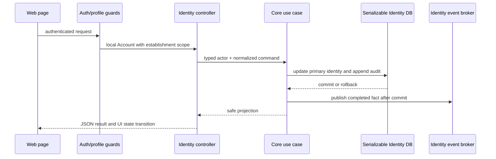

# 1. Context and scope

## Objective

Implement the authenticated identity surfaces for a Manager or Operator to
consult their own account, correct only their own name, and end the current
device session. Implement the Manager-only ice cream shop settings surface for
consulting and renaming the current establishment. Name changes must remain
establishment-scoped, auditable, atomic, and compatible with historical
snapshots.

This is a complete-mode Spec derived from [GitHub Issue #6](https://github.com/rafinel/scoops/issues/6), the current Identity PRD, and the inspected
Pencil compositions. It is intentionally `draft` while the required design
screenshots are not materialized in the shared workspace; the blocking details
are recorded in `design/manifest.md`.

## Current state and gap

The repository already has an authenticated `GET /auth/session` projection,
Manager-only correction of another user's name, local Supabase sign-out,
establishment persistence, and immutable user audit records. It does not yet
have a self-name use case and REST operation, a current-establishment settings
projection and rename operation, establishment-name audit records, protected
account/shop-settings routes, or the corresponding responsive page widgets and
navigation entry points.

The existing Manager correction contract remains unchanged. This feature adds a
separate self-name contract so that allowing a user to edit their own name does
not weaken the existing rule that only a Manager may correct another user.

## Product authority and scope

| Authority | Applicable statements | Contract consequence |
| --- | --- | --- |
| Issue #6 | My Account for Manager and Operator; Manager-only current shop rename; local session exit; immutable audit; tenant isolation; loading/error/accessibility/responsive states | Implement the end-to-end Core, Server, Web, database, and browser slice described here |
| Identity PRD REQ-09 | Users can change their own name; email/profile are immutable in this page; no direct password control; exit only this device | Account form exposes only name; account data and password affordances remain read-only/absent; reuse local provider sign-out |
| Identity PRD REQ-10 | Manager-only immutable audit with actor, affected identity/establishment, before/after values, and São Paulo display time | Persist audit facts in the owning Identity boundary; serialize timestamps and format them in São Paulo at presentation time |
| Identity PRD REQ-11 | Managers can consult/change the current shop name; duplicate names are allowed; historical identity is preserved; Operators have no access | Derive establishment scope from the authenticated account; do not add a uniqueness constraint; do not expose deletion/logo mutation |
| Identity PRD REQ-12 | Customer-initiated exclusion/deletion is removed from the product | Do not implement the deletion danger zone, delete endpoint, delete use case, or delete test path shown in the Pencil frame |
| Identity PRD REQ-13 | Role visibility, state coverage, 320px layout, WCAG 2.2 AA, Manrope, neutral/purple tokens, Lucide | Add protected routes, explicit role enforcement, keyboard/focus/error behavior, and token-based responsive UI |

## In scope

- `/account` for authenticated Managers and Operators.
- Self-name correction with trimming, non-empty validation, success and
  request-failure recovery.
- Read-only email, profile, and linked-establishment identity.
- Current-device sign-out through the existing local Supabase session scope.
- `/shop-settings` for Managers only, with current establishment name display and
  rename.
- Duplicate establishment names, with no uniqueness rule.
- Immutable user and establishment name-change audit facts, including actor,
  affected identity/establishment, previous value, new value, and persisted
  timestamp.
- Tenant and role enforcement in Core and Server; hidden navigation is only a
  presentation convenience.
- Desktop compositions adapted to narrow viewports, loading, success,
  validation, request-error, unauthorized, and session-expired states.

## Out of scope

User-management workflows from Issue #5, invitations, profile changes, email
changes, password/recovery UI, custom permissions, multi-establishment access,
two-factor authentication, establishment deletion, subscription or lifecycle
changes, logo upload, and unrelated MRP, PDV, Billing, or Communication
behavior.

## Assumptions and resolved decisions

- The canonical protected routes are `/account` and `/shop-settings`; they avoid
  user-supplied IDs and derive the current account/establishment from the
  authenticated request.
- `Account` gains the current `establishmentName` so the existing session
  projection can render the linked shop without a second account lookup.
- Shop settings returns safe display metadata needed by the supplied composition:
  current name, status, creation date, and the authenticated Manager's display
  name as the responsible Manager. It does not return credentials, provider
  subjects, session internals, audit secrets, or logo/deletion controls.
- A submitted name is normalized by trimming in the Core use case. Empty input
  is rejected. A normalized value equal to the current value is a successful
  no-op with no audit record or update event.
- Timestamps are persisted as timezone-aware instants and displayed in
  `America/Sao_Paulo`, as required by the PRD. The API uses the repository's
  existing JSON date convention.
- The current Supabase `signOut({ scope: 'local' })` behavior is the product
  contract for “Leave this device”; no new provider capability is needed.

## Design status

The Pencil source and nodes were inspected through the Pencil workflow. The
source contains two relevant desktop compositions plus the existing `Ih9Qc`
name-correction dialog state; all three PNG artifacts were exported through the
WSL UNC shared path and verified in the feature-local design directory. See
[design/manifest.md](./design/manifest.md).

# 2. Implementation Contract

## Functional requirements

### RF-01 — Account identity visibility

An authenticated Manager or Operator can open `/account` and see their current
name, active email, profile, and linked establishment. The account response is
the server-authoritative projection; client state must not invent or persist a
different identity.

### RF-02 — Self-name correction

An authenticated user can submit only their own display name. Core trims the
input and rejects the empty result. A successful changed value is persisted and
returned immediately; a failed request leaves the previously displayed value in
the form and exposes a retryable error. The existing Manager-only
other-user-correction operation is not broadened.

### RF-03 — Immutable account data and password boundary

Email and profile are visibly read-only and are not submitted by the account
mutation. The page contains no password-change control and no password or
recovery content in a response, event, or audit record.

### RF-04 — Current-device session exit

“Leave this device” calls the existing local sign-out path, ends only the
current device session, clears local authenticated state, and routes to the
login page. The page explains the resulting navigation. No global sign-out
scope is introduced.

### RF-05 — Manager-only shop settings

A Manager can open `/shop-settings` and see the current establishment identity
projection, including the current name and safe metadata. A Manager can submit a
trimmed non-empty replacement name. Duplicate names are accepted. The operation
always targets the authenticated account's establishment.

An Operator must not see the shop-settings navigation entry, must be rejected by
the route guard on direct navigation, and must receive a server authorization
failure for a direct API request.

### RF-06 — Immutable audit and history preservation

Each changed self-name and establishment-name mutation appends an immutable
audit fact in the same serializable transaction as the primary update. The fact
records the establishment, affected user or establishment snapshot, actor
identity/type/name, action, previous value, new value, and timestamp. Failed
transactions persist neither the update nor its audit record. Existing
historical snapshots remain unchanged.

### RF-07 — Authentication and tenant invariants

The Server authentication guard resolves the local account and establishment;
Core use cases re-check actor profile and scope. No request body, URL parameter,
or client-provided establishment ID may select another tenant. The Server
remains authoritative even when a navigation item is hidden.

### RF-08 — State, accessibility, and responsive behavior

The pages expose loading, success, field-validation, request-error, unauthorized,
and session-expired behavior where relevant. Save controls expose pending state,
successful changes are announced, failed changes preserve recoverable input, and
focus moves to the relevant error or success feedback without trapping the user.
All controls have accessible names and visible focus. The layout remains usable
at 320px without horizontal scrolling and preserves contrast, touch targets, and
reduced-motion behavior from the shared UI rules.

### RF-09 — Explicitly excluded dangerous mutations

No delete establishment endpoint, use case, UI danger zone, logo upload, or
related acceptance path is created by this feature. The shop-settings visual
composition is adapted to the current PRD rather than reproducing those
out-of-scope controls.

## Acceptance criteria

| ID | Acceptance statement | Evidence required | Covers |
| --- | --- | --- | --- |
| CA-01 | Manager and Operator can open `/account` and see name, email, profile, and linked establishment. | Route test with authenticated role fixtures; visible assertions; API response assertion. | RF-01, RF-07 |
| CA-02 | Each role can submit a changed own name; whitespace is trimmed; empty input is rejected; success shows the new value. | Core unit cases; controller request/response cases; widget and route tests for success/validation. | RF-02, RF-08 |
| CA-03 | A failed self-name request preserves the old displayed value, announces recovery feedback, and can be retried. | Hook/widget failure test asserting retained value and retry; route transport assertion. | RF-02, RF-08 |
| CA-04 | Email and profile are read-only, no password control appears, and no secret/recovery fields are returned. | Component/route accessibility assertions; controller response shape assertion. | RF-03 |
| CA-05 | “Leave this device” uses local scope, ends the current session, and routes to login without claiming to revoke other devices. | Auth action test asserting provider scope; browser route assertion after sign-out. | RF-04 |
| CA-06 | Manager can open `/shop-settings`, see the current identity projection, and save a non-empty replacement; duplicate names succeed. | Core, controller, persistence, and route tests; persisted-name assertion. | RF-05 |
| CA-07 | Operator has no shop-settings navigation entry; direct route and direct API request are rejected by authorization. | Middleware/route test plus authenticated server integration request returning 403. | RF-05, RF-07 |
| CA-08 | Changed user and establishment names each create an immutable audit record with actor, affected snapshot, previous/new values, and a São Paulo-displayable timestamp; historical snapshots remain unchanged. | Core transaction tests, database integration test, and audit-row assertions. | RF-06 |
| CA-09 | A failed or concurrent mutation cannot leave a primary update without its audit fact or cross-tenant write. | Serializable transaction/failure tests; same-establishment and foreign-establishment integration cases. | RF-06, RF-07 |
| CA-10 | Loading, pending, unauthorized, session-expired, validation, request-error, and recovery states are covered without unhandled console or network errors. | Focused widget/hook/route tests plus browser console/network inspection in MV-05. | RF-07, RF-08 |
| CA-11 | Both pages preserve the supplied desktop hierarchy and shared tokens, adapt at 320px without horizontal scrolling, and provide keyboard/focus/label/announcement behavior. | Pencil comparison using the manifest, responsive Playwright CLI checks, and accessibility assertions. | RF-08 |
| CA-12 | No delete or logo mutation UI/API/core path is introduced. | Source review and negative route/API test. | RF-09 |

## Design contract

The implementation maps the existing reusable Sidebar and Header compositions to
the app shell and uses the documented Manrope, semantic neutral/purple, border,
radius, and focus tokens. The My Account page retains the two-column desktop
relationship between personal identity and current-device session; the shop page
retains the identity card hierarchy and Manager context. Existing shared UI
components are preferred over new primitives.

The shop frame's deletion card and logo controls are an explicitly documented
visual deviation because the current PRD removes customer-initiated deletion and
does not include logo management. The shop page may show read-only safe metadata
where that supports the composition, but the only mutation is establishment
name. A later product clarification adds the Manager-only `Sorveteria` sidebar
link to the shared protected shell. This is represented by the supplemental
reference in `design/manifest.md`; the original page screenshots remain historical
references and are not overwritten.

## Non-goals and implementation boundaries

- Do not modify the existing Manager correction semantics.
- Do not use the client account or establishment ID as an authorization source.
- Do not put audit writes in a separate best-effort request.
- Do not send auth provider subjects, tokens, password, recovery, or session
  internals through the new REST responses.
- Do not add a new authentication provider or global session invalidation flow.

# 3. Technical Contract

## Existing contract to preserve

| Boundary | Current responsibility | Required preservation |
| --- | --- | --- |
| Core Account and auth-session use case | Represents the authenticated local user and resolves the active establishment | Add `establishmentName` to the safe projection without exposing provider/session internals |
| Core user correction and user audit | Manager corrects another user's name and records user audit facts | Keep the Manager-only/non-self rule and existing audit action intact |
| Core establishment repository | Stores establishment identity and updates | Use it only through the new Manager-guarded use cases; no global repository access from Web |
| Server auth/profile guards | Resolve local account and enforce Manager profile | Reuse guards for both routes; Core re-checks critical authorization |
| Web auth context and Supabase provider | Owns authenticated state and local sign-out | Add account refresh after self-name success; reuse `scope: 'local'` for exit |
| App shell and generated route tree | Owns protected layout, navigation, and route generation | Add canonical links and regenerate route metadata; never edit generated output manually |

## Runtime flow



Provider sign-out is the exception to the mutation flow: the existing Web auth
context invokes the provider's local scope and then clears local state. It does
not call the Server name/settings operations.

## Cross-boundary data contracts

| Contract | Shape and invariant |
| --- | --- |
| `Account` | Existing account fields plus `establishmentName: string`; no provider subject, token, session metadata, password, or recovery data. |
| `EstablishmentSettings` | `establishment: { id, name, status, createdAt, updatedAt }` plus `responsibleManager: { id, name }` copied from the authenticated Manager actor; all IDs and dates are server-authoritative; no logo/delete capability. |
| Self-name command | `{ name: string }`; Core trims and rejects empty input; actor comes from the authenticated request, never the body. |
| Establishment-name command | `{ name: string }`; Core trims and rejects empty input; establishment comes from `actor.establishmentId`; duplicate names are valid. |
| User name audit | Existing `UserAuditRecord` shape with `action: UserNameChanged`, affected user snapshot, actor snapshot, previous/new values, and `occurredAt`. |
| Establishment name audit | New `EstablishmentAuditRecord` shape with `action: EstablishmentNameChanged`, affected establishment name snapshot, actor snapshot, previous/new values, and `occurredAt`. |
| Date serialization | REST uses the repository's existing ISO JSON date mapping; display formatting for audit dates uses `America/Sao_Paulo`. |

## Technical decisions

| Decision | Choice | Reason and rejected alternative |
| --- | --- | --- |
| Audit ownership | Add a separate establishment audit stream/table. | Keeps `UserAuditRecord` user-targeted and avoids nullable dual-target records; widening the user table would blur affected-user versus affected-establishment semantics. |
| Current-resource routes | `GET /auth/session`, `PATCH /auth/session/name`, `GET /establishments/current`, `PATCH /establishments/current/name`. | No client-selected IDs or cross-tenant ambiguity; the current session endpoint is already the account projection. A generic `/users/:id/name` is retained only for Manager correction of another user. |
| Web URLs | `/account` and `/shop-settings`. | Clear product names, no collision with existing `/users` and `/subscription`, and direct mapping to the two supplied compositions. |
| Shop summary | Return safe name/status/created/updated data and the authenticated Manager's display name; omit logo. | Supports the inspected identity composition without an additional manager-selection rule or storage/product boundary. |
| Session exit | Reuse the existing provider local sign-out scope. | It already matches “this device”; adding server-side global revocation would expand scope and require a new contract. |

## Layer contracts and affected paths

### Domain

| Change | Path | Contract |
| --- | --- | --- |
| Modify | `packages/core/src/identity/domain/entities/account.ts` | Add `establishmentName` to the safe authenticated account projection. |
| Modify | `packages/core/src/identity/domain/entities/fakers/account-faker.ts` | Supply the new account projection field in Core tests and fixtures. |
| Create | `packages/core/src/identity/domain/structures/establishment-audit-action.ts` | Define `EstablishmentNameChanged` using the repository's event/action naming conventions. |
| Create | `packages/core/src/identity/domain/entities/establishment-audit-record.ts` | Define immutable establishment audit snapshots with actor and timestamp fields. |
| Create | `packages/core/src/identity/domain/entities/establishment-audit-record-create.ts` | Define the insert contract without persistence-only concerns. |
| Create | `packages/core/src/identity/domain/structures/establishment-settings.ts` | Define the safe shop-settings projection returned by both read and mutation use cases. |
| Modify | `packages/core/src/identity/domain/events/establishment-updated-event.ts` | Preserve `_NAME`; add actor, previous name, new name, and update timestamp payload required for a completed fact. |
| Modify | `packages/core/src/identity/domain/entities/index.ts` | Export new audit entity types. |
| Modify | `packages/core/src/identity/domain/structures/index.ts` | Export `EstablishmentAuditAction` and `EstablishmentSettings`. |

### Interfaces

| Change | Path | Contract |
| --- | --- | --- |
| Create | `packages/core/src/identity/interfaces/establishment-audit-records-repository.ts` | Add atomic `add`, `addMany`, `findManyByEstablishment`, and cleanup methods matching the existing repository style. |
| Modify | `packages/core/src/identity/interfaces/identity-database.ts` | Include the establishment-audit repository in the transaction scope. |
| Modify | `packages/core/src/identity/interfaces/identity-service.ts` | Expose self-name, current-establishment settings read, and current-establishment name mutation contracts to application adapters. |
| Modify | `packages/core/src/identity/interfaces/index.ts` | Export the new repository and updated contracts. |

### Use cases

| Change | Path | Contract |
| --- | --- | --- |
| Create | `packages/core/src/identity/use-cases/change-own-user-name-use-case.ts` | Accept `{ actor: Account; name: string }`; trim/reject empty; permit any authenticated active profile; update only the actor's user; append a `UserNameChanged` audit in the same serializable transaction; publish the existing user-updated fact after commit; return the updated safe `Account`. |
| Create | `packages/core/src/identity/use-cases/get-establishment-settings-use-case.ts` | Accept `{ actor: Account }`; require Manager; resolve only `actor.establishmentId`; return the safe settings projection. |
| Create | `packages/core/src/identity/use-cases/change-establishment-name-use-case.ts` | Accept `{ actor: Account; name: string }`; require Manager; trim/reject empty; allow duplicates; update the current establishment and append the establishment audit atomically; publish the completed establishment event after commit; return updated settings. |
| Modify | `packages/core/src/identity/use-cases/resolve-authenticated-user-use-case.ts` | Populate `Account.establishmentName` from the resolved establishment. |
| Modify | `packages/core/src/identity/use-cases/index.ts` | Export the three new use cases. |
| Create | `packages/core/src/identity/use-cases/tests/change-own-user-name-use-case.test.ts` | Cover Manager/Operator self-edit, trim/empty, same-value no-op, audit snapshot, tenant scope, and atomic failure. |
| Create | `packages/core/src/identity/use-cases/tests/get-establishment-settings-use-case.test.ts` | Cover Manager read, Operator rejection, current-establishment scope, and safe projection. |
| Create | `packages/core/src/identity/use-cases/tests/change-establishment-name-use-case.test.ts` | Cover Manager-only mutation, trim/empty, duplicate names, audit, history, tenant scope, event-after-commit, and rollback. |

### REST

| Change | Path | Contract |
| --- | --- | --- |
| Create | `apps/server/src/identity/rest/controllers/change-own-user-name.controller.ts` | `PATCH /auth/session/name`; authenticated active user; validate `{ name }`; invoke self-name use case; return the safe Account projection. |
| Create | `apps/server/src/identity/rest/controllers/get-establishment-settings.controller.ts` | `GET /establishments/current`; authenticated Manager; return `EstablishmentSettings`. |
| Create | `apps/server/src/identity/rest/controllers/change-establishment-name.controller.ts` | `PATCH /establishments/current/name`; authenticated Manager; validate `{ name }`; return updated `EstablishmentSettings`. |
| Modify | `apps/server/src/identity/rest/controllers/get-auth-session.controller.ts` | Return the expanded Account projection without provider/session internals. |
| Create | `apps/server/src/identity/rest/dtos/establishment-settings-response.dto.ts` | Safe response DTO for establishment summary and responsible Manager display data. |
| Modify | `apps/server/src/identity/rest/dtos/account-response.dto.ts` | Document `establishmentName` in the authenticated account response. |
| Modify | `apps/server/src/identity/rest/dtos/index.ts` | Export the new response DTO. |
| Create | `apps/server/src/identity/rest/schemas/change-identity-name-schema.ts` | Validate the shared name request body at the REST boundary. |
| Modify | `apps/server/src/identity/rest/controllers/index.ts` | Export/register the three new controllers. |
| Modify | `apps/server/src/identity/fixtures/identity-module-fixture.ts` | Extend authenticated Manager/Operator fixtures with the linked establishment name and settings data. |
| Create | `apps/server/src/identity/rest/controllers/tests/change-own-user-name.controller.test.ts` | Assert auth actor mapping, body validation, success response, and mapped domain errors. |
| Create | `apps/server/src/identity/rest/controllers/tests/get-establishment-settings.controller.test.ts` | Assert Manager authorization, current scope, response shape, and forbidden mapping. |
| Create | `apps/server/src/identity/rest/controllers/tests/change-establishment-name.controller.test.ts` | Assert Manager authorization, duplicate-name acceptance, validation, response, and error mapping. |
| Modify | `apps/server/src/identity/rest/controllers/tests/get-auth-session.controller.test.ts` | Assert `establishmentName` is returned and sensitive provider fields remain absent. |

### Provision

| Change | Path | Contract |
| --- | --- | --- |
| Reuse | `apps/web/src/provision/auth/supabase/supabase-auth-provider.ts` | `signOut({ scope: 'local' })` remains the only provider mutation; no credentials or recovery content enters Identity REST. |

### Messaging

| Change | Path | Contract |
| --- | --- | --- |
| Reuse | Existing Identity event broker composition | Publish the existing user-updated event for self-name changes and the extended establishment-updated event for shop-name changes only after the database transaction commits. |
| No change | `apps/server/src/identity/messaging/identity-messaging.module.ts` | Keep Identity messaging composition and event serialization in the existing module; no new job is required by this feature. |

### Database

| Change | Path | Contract |
| --- | --- | --- |
| Create | `apps/server/src/identity/database/drizzle/models/establishment-audit-action-model.ts` | Drizzle enum model for `establishment-name-changed`. |
| Create | `apps/server/src/identity/database/drizzle/models/establishment-audit-record-model.ts` | Table model for immutable establishment audit facts with establishment cascade and occurred/action indexes. |
| Create | `apps/server/src/identity/database/drizzle/types/entities/drizzle-establishment-audit-record.ts` | Insert/select types for the new model. |
| Create | `apps/server/src/identity/database/drizzle/mappers/drizzle-establishment-audit-record-mapper.ts` | Map the Drizzle row to and from the Core establishment audit entity. |
| Create | `apps/server/src/identity/database/drizzle/repositories/drizzle-establishment-audit-records-repository.ts` | Map the Core repository contract to Drizzle inserts and establishment-scoped reads. |
| Modify | `apps/server/src/identity/database/drizzle/models/index.ts` | Export the new model and enum. |
| Modify | `apps/server/src/identity/database/drizzle/mappers/index.ts` | Export the new mapper. |
| Modify | `apps/server/src/identity/database/drizzle/repositories/index.ts` | Export the new repository. |
| Modify | `apps/server/src/identity/database/drizzle/types/entities/index.ts` | Export the new persistence type. |
| Modify | `apps/server/src/identity/database/drizzle/drizzle-identity-database.ts` | Construct the new repository inside the existing serializable transaction scope. |
| Modify | `apps/server/src/shared/database/drizzle/schema.ts` | Include the new table and enum in the Drizzle schema. |
| Generate | `apps/server/src/shared/database/drizzle/migrations/0003_establishment_name_audit.sql` | Generate the next migration after `0002_rare_unus.sql`; the generated SQL must be equivalent to the exact body below. |
| Generate | `apps/server/src/shared/database/drizzle/migrations/meta/0003_snapshot.json` | Generate the schema snapshot alongside the migration. |
| Modify | `apps/server/src/shared/database/drizzle/migrations/meta/_journal.json` | Register the generated migration through Drizzle tooling. |

Required migration body:

```sql
CREATE TYPE "public"."establishment_audit_action" AS ENUM('establishment-name-changed');
--> statement-breakpoint
CREATE TABLE "establishment_audit_records" (
	"id" uuid PRIMARY KEY NOT NULL,
	"establishment_id" uuid NOT NULL,
	"affected_establishment_name" text NOT NULL,
	"actor_type" "user_audit_actor_type" NOT NULL,
	"actor_user_id" uuid,
	"actor_name" text NOT NULL,
	"action" "establishment_audit_action" NOT NULL,
	"previous_value" text,
	"new_value" text,
	"occurred_at" timestamp with time zone NOT NULL
);
--> statement-breakpoint
ALTER TABLE "establishment_audit_records" ADD CONSTRAINT "establishment_audit_records_establishment_id_establishments_id_fk" FOREIGN KEY ("establishment_id") REFERENCES "public"."establishments"("id") ON DELETE cascade ON UPDATE no action;
--> statement-breakpoint
CREATE INDEX "establishment_audit_records_establishment_occurred_idx" ON "establishment_audit_records" USING btree ("establishment_id","occurred_at");
--> statement-breakpoint
CREATE INDEX "establishment_audit_records_action_occurred_idx" ON "establishment_audit_records" USING btree ("action","occurred_at");
```

### Composition

| Change | Path | Contract |
| --- | --- | --- |
| Modify | `apps/server/src/identity/identity.module.ts` | Register the three controllers while retaining the existing global authentication/profile guards and module boundary. |
| Modify | `apps/server/src/identity/database/identity-database.module.ts` | Keep the Core `IdentityDatabase` binding backed by the expanded Drizzle transaction scope. |
| No change | `apps/server/src/app.module.ts` | Keep the single root Inngest composition point; no new job is required by this feature. |

### Web REST adapter

| Change | Path | Contract |
| --- | --- | --- |
| Modify | `apps/web/src/rest/services/identity-service.ts` | Add `changeOwnUserName`, `getEstablishmentSettings`, and `changeEstablishmentName`; use the exact methods/paths above and return typed safe projections. |
| Create | `apps/web/src/rest/services/tests/identity-service-profile-settings.test.ts` | Assert HTTP method/path/body mapping, response mapping, and transport-error preservation. |

### Web UI and application composition

| Change | Path | Contract |
| --- | --- | --- |
| Modify | `apps/web/src/constants/routes.ts` | Add canonical `/account` and `/shop-settings` route constants. |
| Create | `apps/web/src/routes/_authenticated/account/index.tsx` | Protected route entry for Managers and Operators; compose the My Account page. |
| Create | `apps/web/src/routes/_authenticated/shop-settings/index.tsx` | Protected Manager route entry; compose the shop-settings page and preserve direct-route denial. |
| Generate | `apps/web/src/routeTree.gen.ts` | Regenerate through `pnpm --filter web generate-routes`; never hand-edit. |
| Modify | `apps/web/src/ui/shared/contexts/auth-context/types/auth-context-value.ts` | Add a typed account-refresh capability used after successful self-name mutation. |
| Modify | `apps/web/src/ui/shared/contexts/auth-context/use-auth-context-provider.ts` | Refresh the server-authoritative account projection and retain existing local sign-out behavior. |
| Modify | `apps/web/src/ui/shared/contexts/auth-context/tests/auth-context.test.tsx` | Cover refresh success/failure and local sign-out scope. |
| Create | `apps/web/src/ui/identity/hooks/use-change-own-user-name-action.ts` | Own self-name mutation pending/success/error/retry state and trigger account refresh only after success. |
| Create | `apps/web/src/ui/identity/hooks/use-establishment-settings-query.ts` | Own shop-settings loading, unauthorized, session-expired, and retry state. |
| Create | `apps/web/src/ui/identity/hooks/use-change-establishment-name-action.ts` | Own shop-name mutation pending/success/error/retry state and preserve failed input. |
| Modify | `apps/web/src/ui/identity/hooks/identity-query-keys.ts` | Add stable current-establishment settings query keys if the existing query pattern requires them. |
| Create | `apps/web/src/ui/identity/hooks/tests/profile-settings-actions.test.ts` | Cover action-level request mapping, pending, success, failure, retry, and account refresh behavior. |
| Create | `apps/web/src/ui/identity/widgets/pages/my-account-page/index.tsx` | Render the supplied account composition using the existing card, form, badge, button, input, and alert primitives; name is editable, email/profile are read-only, and only current-device exit is available. |
| Create | `apps/web/src/ui/identity/widgets/pages/my-account-page/use-my-account-page.ts` | Coordinate account projection, name form, save feedback, focus/announcement targets, and session-expiry recovery. |
| Create | `apps/web/src/ui/identity/widgets/pages/ice-cream-shop-settings-page/index.tsx` | Render the supplied shop identity composition with current name mutation and safe metadata; omit logo/deletion actions. |
| Create | `apps/web/src/ui/identity/widgets/pages/ice-cream-shop-settings-page/use-ice-cream-shop-settings-page.ts` | Coordinate settings query, name form, retry/error/success state, and focus/announcement targets. |
| Modify | `apps/web/src/ui/shared/widgets/layouts/app-layout/index.tsx` | Add Manager-only Shop Settings navigation and keep Account reachable through the user menu. |
| Modify | `apps/web/src/ui/shared/widgets/layouts/app-layout/user-menu/index.tsx` | Add the accessible My Account link while retaining current-device logout and pending/error behavior. |
| Create | `apps/web/src/ui/identity/widgets/pages/my-account-page/tests/my-account-page.test.tsx` | Cover loading, success, validation, request error/retry, read-only fields, logout, focus, labels, and announcements. |
| Create | `apps/web/src/ui/identity/widgets/pages/my-account-page/tests/use-my-account-page.test.ts` | Cover page-hook state transitions and session-expiry recovery. |
| Create | `apps/web/src/ui/identity/widgets/pages/ice-cream-shop-settings-page/tests/ice-cream-shop-settings-page.test.tsx` | Cover loading, Manager success, duplicate name, validation, request error/retry, unauthorized/session expiry, and responsive-safe composition. |
| Create | `apps/web/src/ui/identity/widgets/pages/ice-cream-shop-settings-page/tests/use-ice-cream-shop-settings-page.test.ts` | Cover query/mutation hook state transitions and retry behavior. |

### Web route and Playwright CLI validation

| Change | Path | Contract |
| --- | --- | --- |
| Create | `apps/web/tests/routes/identity/account.index.test.ts` | Authenticate Manager and Operator; assert canonical navigation, account fields, mutation mapping, read-only controls, local logout redirect, and keyboard path. |
| Create | `apps/web/tests/routes/identity/shop-settings.index.test.ts` | Authenticate Manager and Operator; assert Manager visibility, Operator denial, GET/PATCH transport, duplicate acceptance, persisted visible result, error recovery, and 320px no-scroll behavior. |
| Modify | `apps/web/tests/fixtures/identity-data-fixtures.ts` | Add account/settings projections and two-establishment data needed for route and tenant assertions. |
| Modify | `apps/web/tests/fixtures/identity-module-fixture.ts` | Add authenticated Manager/Operator route fixtures and mutation transport setup. |

## Composition rules

- Keep user-name and establishment-name business decisions in `packages/core`.
- Keep REST DTOs, guard wiring, response/error mapping, and persistence in
  `apps/server`.
- Keep form state, navigation, focus, announcements, and responsive rendering
  in `apps/web`; do not replicate authorization rules only in navigation.
- Use existing aliases (`@/` in Server and Web, `#identity/*` in Core) and the
  existing semantic UI tokens/components.
- Keep audit writes and primary writes inside the same
  `IdentityDatabase.run(...)` transaction. Publish messages only after commit.
- Use the existing generated-route command and do not edit the generated route
  tree directly.

# 4. Validation Contract

## Automated validation

| Boundary | Required command or test | Evidence |
| --- | --- | --- |
| Core formatting/types | `pnpm --filter @scoops/core check:code` and `pnpm --filter @scoops/core check:types` | Clean output for changed Core files. |
| Core behavior | `pnpm --filter @scoops/core test -- src/identity/use-cases/tests/change-own-user-name-use-case.test.ts src/identity/use-cases/tests/get-establishment-settings-use-case.test.ts src/identity/use-cases/tests/change-establishment-name-use-case.test.ts` | All self-name, Manager, trim, duplicate, tenant, audit, event-after-commit, and rollback cases pass. |
| Server formatting/types | `pnpm --filter server check:code`, `pnpm --filter server check:types`, and `pnpm --filter server build` | Clean lint/type/build output. |
| Server behavior | `pnpm --filter server test -- src/identity/rest/controllers/tests/change-own-user-name.controller.test.ts src/identity/rest/controllers/tests/get-establishment-settings.controller.test.ts src/identity/rest/controllers/tests/change-establishment-name.controller.test.ts` | Controller, auth, validation, response/error, and transport cases pass. |
| Database migration | `pnpm --filter server db:migration:generate`; inspect the generated SQL against the contract; apply with `pnpm --filter server db:migration:apply` in the local database environment | Migration is forward-only, idempotent through Drizzle bookkeeping, tenant-scoped, indexed, and has no destructive operation. |
| Web route generation | `pnpm --filter web generate-routes` | Generated route tree includes both protected routes and remains generated-only. |
| Web formatting/types/build | `pnpm --filter web check:code`, `pnpm --filter web check:types`, and `pnpm --filter web build` | Clean UI and route validation. |
| Web unit/widget behavior | `pnpm --filter web test -- src/ui/identity/widgets/pages/my-account-page/tests/my-account-page.test.tsx src/ui/identity/widgets/pages/my-account-page/tests/use-my-account-page.test.ts src/ui/identity/widgets/pages/ice-cream-shop-settings-page/tests/ice-cream-shop-settings-page.test.tsx src/ui/identity/widgets/pages/ice-cream-shop-settings-page/tests/use-ice-cream-shop-settings-page.test.ts src/ui/shared/contexts/auth-context/tests/auth-context.test.tsx` | State, accessibility, retry, role, and session behavior pass. |
| Web route behavior | `pnpm --filter web test:integration -- tests/routes/identity/account.index.test.ts tests/routes/identity/shop-settings.index.test.ts` | Real route/middleware behavior, request mapping, final URLs, and visible outcomes pass; mocks are not presented as proof of full backend persistence. |
| Workspace regression | `pnpm build` and the affected workspace test commands | No unrelated workspace contract regresses. |

## Manual validation scenarios

These scenarios are evidence requirements for implementation, not claimed results
of this authoring task. Start only the services required by each scenario; use
the repository's existing browser fixture/accounts rather than inventing
credentials.

| ID | Setup and viewport | Actions | Assertions |
| --- | --- | --- | --- |
| MV-01 | Authenticated Manager; desktop `1481 × 1050`; web, server, and required local services healthy | Open `/account`, inspect accessibility tree, edit name, save, reload | Shell matches `BRpGr`, server response and visible account agree, success is announced, email/profile remain read-only, no password/delete control appears, console has no blocking errors. |
| MV-02 | Authenticated Operator; viewport `320 × 800` | Open `/account`, navigate controls by keyboard, submit valid/invalid name, trigger local logout | No horizontal scroll; focus is visible and sensible; invalid input retains recovery; success announces; logout ends current session and lands on login. |
| MV-03 | Authenticated Manager; desktop `1551 × 1050`, then `320 × 800` | Open `/shop-settings`, rename to a value already used by another establishment, reload | Shell and identity card match `m7W867` within the PRD deviation; duplicate succeeds; persisted name remains after reload; no logo/delete action exists; no horizontal scroll. |
| MV-04 | Authenticated Operator; normal desktop | Inspect navigation, open `/shop-settings` directly, issue the same API request through the browser session | Navigation is hidden, direct route is denied, API returns authorization failure, no unauthorized data is rendered. |
| MV-05 | Authenticated account with controlled request failure/session expiry | Fail each read/save request, retry, then expire the session during a page interaction | Loading/pending/error/recovery states are understandable; previous input is retained on failure; session-expired state routes/recoveries correctly; inspect console and failed network requests. |
| MV-06 | Two establishments and two authenticated roles in the local integration environment | Attempt same-establishment and foreign-establishment name mutations; inspect database audit rows | Only the authenticated establishment changes; duplicate names are accepted; audit rows contain actor/affected/previous/new/timestamp; a failed transaction leaves neither partial update nor orphan audit. |

## Evidence integrity gate

Before changing this Spec from `draft` to `open`, verify both design references
in the manifest exist under the feature-local `design/` directory, are valid
non-empty PNGs, have dimensions `1481 × 1050` and `1551 × 1050`, and correspond
to the inspected default states. After implementation, add a concise
`evaluation.md` with executed commands, manual scenario results, and any
pre-existing failures; do not record unexecuted checks as passed.

# 5. Documentation alignment and revision history

## Documentation alignment

| Document | Alignment recorded |
| --- | --- |
| `documentation/prds/identity.md` | Authority for self-name, immutable email/profile, local session exit, Manager-only shop rename, audit, role visibility, WCAG, and removal of deletion. The working-tree PRD edits were read and are not overwritten by this Spec. |
| `documentation/architecture.md` | Core remains framework-independent; Server is authoritative; tenant writes are scoped and atomic; events publish completed facts after commit. |
| `documentation/modules.md` | Identity owns accounts, users, establishments, sessions, and audit; no business rule moves into shared infrastructure. |
| `documentation/design.md` | Use Manrope, semantic neutral/purple tokens, existing components, Lucide icons, responsive/focus/contrast/reduced-motion rules. |
| `documentation/tooling.md` | Use pnpm workspace filters, generated-route command, Drizzle migration tooling, and proportional Core/Server/Web/Playwright CLI validation. |
| `documentation/features/identity/features/profile-and-ice-cream-settings/design/manifest.md` | Records inspected Pencil nodes, reusable components/tokens, responsive expectations, allowed PRD-driven deviations, and the blocked screenshot evidence. |

## Rule pack applied

| Rule | Application |
| --- | --- |
| `documentation/rules/code-conventions-rules.md` | Naming, imports, module boundaries, and error/result conventions. |
| `documentation/rules/core-package-rules.md` | Framework-independent entities, interfaces, use cases, events, and dependency direction. |
| `documentation/rules/use-case-testing-rules.md` | Core scenario matrix, transaction behavior, and failure/authorization coverage. |
| `documentation/rules/rest-layer-rules.md` | Thin controllers, DTO validation, guard usage, response mapping, and status/error semantics. |
| `documentation/rules/controllers-testing-rules.md` | Controller transport/auth/error tests. |
| `documentation/rules/database-layer-rules.md` | Repository ownership, migration safety, indexes, transaction scope, and historical snapshots. |
| `documentation/rules/provision-layer-rules.md` | Reuse provider boundaries; no credentials or session internals cross the REST contract. |
| `documentation/rules/ui-layer-rules.md` | Page/widget state ownership, accessibility, responsive behavior, and design tokens. |
| `documentation/rules/web-app-routing-rules.md` | Protected route/middleware composition, canonical links, and generated route tree. |
| `documentation/rules/widget-testing-rules.md` | Real owning hooks, state coverage, keyboard/focus behavior, and recovery assertions. |

## Revision history

| Revision | Date | Status | Change |
| --- | --- | --- | --- |
| 1 | 2026-08-16 | `draft` | Created the implementation contract for Issue #6, resolved route/audit/session decisions, recorded the PRD-driven deletion/logo deviation, and blocked promotion until Pencil screenshot artifacts are available in the shared workspace. |
| 2 | 2026-08-16 | `open` | Exported `BRpGr` and `m7W867` through the WSL UNC shared path, verified their dimensions and image format, and satisfied the design evidence gate. |
| 3 | 2026-08-16 | `open` | Added and exported the existing `Ih9Qc` My Account name-correction dialog state to the design manifest. |
