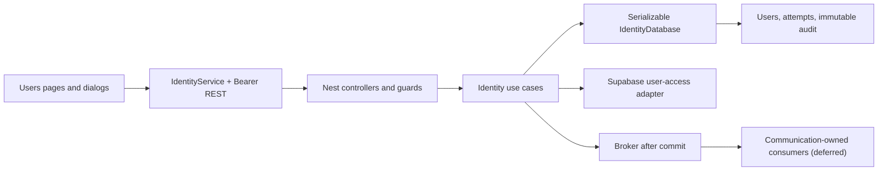

# Identity user management

## Closure

Spec revision 2 is completed. The implementation was accepted by the final read-only
Implementation Judge, the current PR head passed Core, Server and Web CI plus Vercel
preview checks, and the detailed evidence is recorded in
[`evaluation.md`](./evaluation.md). Delivery is published in
[PR #7](https://github.com/rafinel/scoops/pull/7); it has not been merged or deployed.

## Context

This complete-mode Spec delivers
[`rafinel/scoops#5`](https://github.com/rafinel/scoops/issues/5): a Manager-only,
tenant-safe workflow to invite, find, inspect, correct, promote, demote, inactivate and
reactivate users while preserving administrative authorship and history. Complete mode
applies because the delivery crosses Core business rules, serializable persistence,
Supabase Auth, REST authorization, domain events, TanStack routes, a multi-state React UI,
generated route metadata and responsive/accessibility risk.

The product contract is Identity PRD REQ-05 through REQ-10 and the Users/navigation slice
of REQ-13. Communication PRD REQ-04 owns email/message composition after Identity emits
the relevant facts. The issue deliberately excludes Communication delivery
implementation; this Spec therefore requires stable events and successful broker handoff,
not Communication templates, notification storage or the notification center.

The available authority is the root and web `AGENTS.md`, the selected repository Rules,
Architecture, module ownership, Identity and Communication PRDs, Design System, Tooling,
Issue #5, the completed auth/onboarding features, current source and the mapped Pencil
nodes. The current workflow authority is
[`documentation/sdd.md`](../../../sdd.md).

Two current limitations are material:

- Supabase Admin can invite an email, resend provider email and globally sign out only
  when given a target JWT. It has no user-ID-only API that immediately invalidates all
  already-issued JWTs. Scoops therefore makes local `inactive` status authoritative on
  every protected request. Existing provider JWTs may remain cryptographically valid
  until expiry but cannot authorize Scoops after the local commit.
- direct broker publication is the repository's MVP messaging boundary. Identity commits
  state/audit atomically, then publishes. A broker failure is returned and observable but
  cannot roll the committed transition back. Transactional outbox work is deferred and
  Communication PRD REQ-08 is not claimed complete by this issue.

## Scope

### In scope

- paginated Manager-only user listing with tenant scope, name/email search, profile/status
  filters, last access and distinct loading/error/empty/no-results states;
- tenant-scoped details and audit timeline for pending, active Operator, active Manager and
  inactive users;
- invitation creation, correction, resend, seven-day expiry, cancellation and acceptance
  with invitee-owned password creation;
- case-insensitive global email uniqueness across active, inactive and pending users;
- promotion/demotion, self-change rejection and concurrent last-active-Manager protection;
- inactivation/reactivation, immediate local access rejection and preservation of identity,
  profile, email and history;
- Manager correction of another user's name while historical snapshots remain immutable;
- immutable Identity audit records for registration, resend, cancellation, activation,
  profile, status and Manager-performed name changes;
- stable Identity events and broker handoff for invitation and affected-user notifications;
- `/users`, `/users/$userId` and `/invitation/accept` UI routes, profile-driven shell
  navigation and generated route metadata;
- Core unit, server controller integration, web component/hook, mocked-transport browser
  integration and real local full-stack validation.

### Out of scope

- onboarding, login/session policy, password recovery and My Account self-service editing;
- establishment settings/deletion, Billing behavior or custom profiles/permissions;
- Communication templates, delivery jobs, notification persistence or notification-center
  UI; only Identity event publication and composition registration are included;
- instant cryptographic invalidation of already-issued Supabase access JWTs, which the
  provider cannot perform by target user ID;
- a transactional outbox or exactly-once event delivery;
- editing active-user email or allowing a Manager to set another user's password;
- an establishment-wide audit explorer; this slice exposes the affected user's timeline;
- mobile Pencil frames. Desktop Pencil frames are normative visual references, while the
  implemented UI must independently satisfy the 320 px contract.

## Product alignment

| Product source | Delivered by this Spec | Explicitly deferred |
| --- | --- | --- |
| Identity REQ-05 | invitation, pending correction, resend/rotation, cancellation, expiry and activation with selected fixed profile | communication-template implementation |
| Identity REQ-06 | tenant-only listing/detail, search, filters, status/profile/last access, pagination and history | establishment-wide audit search |
| Identity REQ-07 | promotion/demotion, immediate local authorization, self-change and last-Manager protection, event handoff | exactly-once notification delivery |
| Identity REQ-08 | inactivation/reactivation, reserved email, preserved profile/history and immediate server rejection | provider-side invalidation of unexpired target JWTs |
| Identity REQ-09 | Manager correction of another user's name and immutable historical snapshots | My Account self-editing |
| Identity REQ-10 | immutable records for this feature's administrative actions with São Paulo display | password-recovery audit, owned by the recovery slice |
| Identity REQ-13 | Manager navigation/route/API protection, required states, 320 px and WCAG 2.2 AA behavior | unrelated Identity routes/states |

## Contract

### Functional requirements

- **RF-01 — Authoritative Manager and tenant boundary.** Every list, detail, audit and
  mutation route must derive actor and establishment from authenticated server context,
  require `manager`, return neutral `404` for another establishment's target or the
  authenticated Manager's own management record, and never trust client-supplied
  actor/establishment/profile/status fields. The web route guard and hidden actions are
  experience boundaries only.
- **RF-02 — List and detail.** `ListUsersUseCase` returns deterministic name/ID-ordered
  pagination for one establishment with bounded `page`/`pageSize`, trimmed search and
  optional fixed profile/status filters, excluding the authenticated Manager. The same
  account cannot be loaded through `GetUserDetailsUseCase`. For other users, the detail
  use case returns the user and newest-first immutable audit records. Search/filter changes
  reset page to 1 and the URL is the single source of truth for list query state.
- **RF-03 — Invitation creation.** A Manager supplies trimmed name, normalized email and
  `manager|operator`. The operation captures time/IDs/nonces before replayable work,
  rejects a user or active attempt with the same email ignoring case, creates the provider
  invite outside the transaction, then transactionally creates one pending local user,
  one `user-invitation` attempt expiring in seven days and one `user_registered` audit.
  If local commit fails, the newly created provider identity is removed.
- **RF-04 — Invitation correction and resend.** Only a pending unexpired invitation can
  be corrected. Name/profile update locally. Email correction updates the existing
  Supabase pending subject through Admin `updateUserById`, preserving `User.id` and every
  audit lookup key; it must never replace the provider subject. Resend rotates an
  application confirmation nonce, calls provider resend with the new redirect and sets
  `expiresAt = now + 7 days`. The prior local nonce is rejected even if an old provider
  link still establishes a provider session. Each successful resend writes one audit
  record; provider failure leaves the current nonce/deadline unchanged.
- **RF-05 — Cancellation and expiry.** Cancellation is limited to pending invitations,
  invalidates/removes the provider identity, atomically writes `invitation_cancelled` and
  removes the local pending user/attempt while retaining the audit until establishment
  deletion. Logical expiry applies at `now >= expiresAt` before background cleanup. The
  existing expiration job is extended to clean user invitations safely and idempotently;
  successful cleanup releases the email.
- **RF-06 — Invitation acceptance.** `/invitation/accept` requires the current
  app-owned nonce, a Supabase invite session whose subject/email matches the pending
  attempt, and an 8–64 character password entered only by the invitee. The browser updates
  the provider password, then the server atomically rechecks nonce/status/expiry, activates
  the existing local user, confirms the attempt and appends `user_activated`. A used link
  is idempotent only for the same activated subject; stale/expired links expose recovery
  guidance without local data leakage.
- **RF-07 — Profile change.** `ChangeUserProfileUseCase` is refined to require a Manager
  actor, reject self-change, missing/cross-tenant/inactive/pending targets, and demotion of
  the last active Manager. One serializable transaction changes profile and appends a
  before/after audit. Concurrent demotions serialize or one returns `409`. Authorization
  changes on the next protected request. A committed change publishes
  `UserProfileUpdatedEvent` after commit.
- **RF-08 — Inactivation and reactivation.** `InactivateUserUseCase` rejects self,
  pending targets and the last active Manager, then atomically sets `inactive` and
  appends audit. All subsequent protected requests reject the target immediately because
  local status is resolved per request. `ReactivateUserUseCase` restores the same account
  and current profile without password mutation and rejects pending targets. Inactive
  email remains reserved. `inactive→inactive` inactivation and `active→active`
  reactivation return the unchanged user with `200`, publish nothing and append no audit;
  all other invalid transitions return `409`. Events publish only after commit.
- **RF-09 — Name correction.** A Manager may correct another pending, active or inactive
  user's trimmed non-empty name but not their own name in this feature. One transaction
  updates current `User.name` and appends before/after snapshots. Existing audit actor and
  affected-name snapshots never change.
- **RF-10 — Immutable audit.** `UserAuditRecord` owns a generated ID, establishment,
  affected user ID/name snapshot, optional actor user ID, actor name/type snapshot,
  action, optional previous/new value and occurrence time. Records are append-only: the
  repository exposes add/find/removeAll only, has no replace/remove-one, and no FK to a
  removable pending user. Secrets, provider tokens, links and passwords are prohibited.
  API timestamps remain ISO UTC; web presentation uses `America/Sao_Paulo`.
- **RF-11 — Events and side-effect boundary.** Identity emits stable Core event classes
  for invitation created/resent/cancelled/accepted, profile updated, user inactivated,
  reactivated and name updated. Payloads contain recipient IDs/email only when required,
  before/after facts and occurred-at time, never tokens/passwords. Use cases call the
  shared `Broker` only after successful commit and never inside retryable database work.
- **RF-12 — REST contract.** The server exposes the routes below with strict Zod input,
  Swagger response/error documentation and the global error envelope. UUID route params,
  bounded strings and list query defaults are validated. Duplicate/invariant/concurrency
  errors map to `409`; malformed input to `422`; missing/cross-tenant to `404`; provider
  unavailability to `503`; accepted cancellation to `204`.
- **RF-13 — Web state ownership and race control.** `UsersPage` and `UserDetailsPage`
  each use one colocated owning hook. Feature query/action hooks hide React Query generic
  names. Query keys include URL filters or `userId`; successful mutations invalidate list
  and detail keys. Dialog state belongs to the owning page hook, confirmations disable
  while pending, visible errors retain user input, and request generations/cancellation
  prevent an older list/detail response from replacing newer navigation/filter state.
- **RF-14 — Responsive accessible Pencil implementation.** The UI maps named Pencil
  frames to existing Scoops tokens/components, Manrope and Lucide; it does not copy raw
  values. At 320 px, list rows become cards prioritizing name/profile/status without
  horizontal scrolling. Menus, filters, pagination, forms and dialogs are keyboard
  operable; dialogs trap/restore focus; asynchronous/form errors are announced; status and
  destructive meaning do not rely on color/hover; targets meet WCAG 2.2 AA sizing/focus.

### Public HTTP surface

| Method and route | Core action | Success |
| --- | --- | --- |
| `GET /users?search=&profile=&status=&page=1&pageSize=20` | `ListUsersUseCase` | `200 PaginationResponse<UserSummary>` |
| `GET /users/:userId` | `GetUserDetailsUseCase` | `200 UserDetails` |
| `POST /users/invitations` | `InviteUserUseCase` | `201 UserDetails` |
| `PATCH /users/:userId/invitation` | `CorrectUserInvitationUseCase` | `200 UserDetails` |
| `POST /users/:userId/invitation/resend` | `ResendUserInvitationUseCase` | `200 UserDetails` |
| `DELETE /users/:userId/invitation` | `CancelUserInvitationUseCase` | `204` |
| `POST /registration-attempts/invitation/accept` | `AcceptUserInvitationUseCase` | `204` |
| `PATCH /users/:userId/profile` | `ChangeUserProfileUseCase` | `200 UserDetails` |
| `PATCH /users/:userId/status` | `InactivateUserUseCase` or `ReactivateUserUseCase` selected by strict `status` | `200 UserDetails` |
| `PATCH /users/:userId/name` | `CorrectUserNameUseCase` | `200 UserDetails` |

### Exact Core contracts

The following public shapes are normative. Each exported type lives in its own file and is
re-exported through the owning barrel.

```ts
type UserSummary = Pick<
  User,
  | 'id'
  | 'name'
  | 'email'
  | 'profile'
  | 'status'
  | 'lastAccessAt'
  | 'createdAt'
>

type UserDetails = {
  user: User
  auditRecords: readonly UserAuditRecord[]
}

const UserAuditAction = {
  UserRegistered: 'user-registered',
  InvitationResent: 'invitation-resent',
  InvitationCancelled: 'invitation-cancelled',
  UserActivated: 'user-activated',
  ProfileChanged: 'profile-changed',
  UserInactivated: 'user-inactivated',
  UserReactivated: 'user-reactivated',
  UserNameChanged: 'user-name-changed',
} as const

const UserAuditActorType = { User: 'user', System: 'system' } as const

type UserAuditRecord = Entity & {
  establishmentId: string
  affectedUserId: string
  affectedUserName: string
  actorType: UserAuditActorType
  actorUserId?: string
  actorName: string
  action: UserAuditAction
  previousValue?: string
  newValue?: string
  occurredAt: Date
}

type UserAuditRecordCreate = UserAuditRecord
```

`actorName` is the immutable user-name snapshot or the literal `System`; `actorUserId` is
required for `actorType: 'user'` and absent for `system`. Audit user IDs intentionally have
no FK to `users`, but email correction preserves the same `User.id`, so registration and
later timeline records share one lookup key.

Audit values are normative strings from the Core runtime objects, never localized labels:

| Action | Actor snapshot | `previousValue` | `newValue` |
| --- | --- | --- | --- |
| `user-registered` | inviting Manager, `User` | absent | invited profile (`manager|operator`) |
| `invitation-resent` | acting Manager, `User` | prior `expiresAt.toISOString()` | new `expiresAt.toISOString()` |
| `invitation-cancelled` | acting Manager, `User` | `pending` | `cancelled` |
| `user-activated` | invitee, `User`, using the corrected current name | `pending` | `active` |
| `profile-changed` | acting Manager, `User` | prior profile | new profile |
| `user-inactivated` | acting Manager, `User` | `active` | `inactive` |
| `user-reactivated` | acting Manager, `User` | `inactive` | `active` |
| `user-name-changed` | acting Manager, `User` | prior name | new name |

All rows snapshot `affectedUserName` after name normalization; name-change rows use the new
name there while preserving the prior name in `previousValue`. No scoped action is
system-authored. `System` remains in the model for existing/future job-authored Identity
audit without inventing an expiration audit that REQ-10 does not require.

```ts
interface UserAuditRecordsRepository {
  add(input: UserAuditRecordCreate): Promise<UserAuditRecord>
  addMany(inputs: UserAuditRecordCreate[]): Promise<UserAuditRecord[]>
  findManyByUser(input: {
    establishmentId: string
    affectedUserId: string
  }): Promise<UserAuditRecord[]>
  removeAll(): Promise<void>
}

type InvitationOperation = 'correct-email' | 'resend' | 'cancel' | 'accept' | 'expire'

interface RegistrationAttemptsRepository {
  // existing methods remain
  claimInvitationOperation(input: {
    attemptId: string
    expectedRevision: number
    operation: InvitationOperation
    operationToken: string
    claimedAt: Date
    staleBefore: Date
    pendingEmail?: string
    pendingTokenHash?: string
    pendingExpiresAt?: Date
  }): Promise<UserRegistrationAttempt | undefined>
  finalizeInvitationOperation(input: {
    attemptId: string
    operationToken: string
    changes: UserRegistrationAttemptUpdate
  }): Promise<UserRegistrationAttempt | undefined>
  clearInvitationOperation(input: {
    attemptId: string
    operationToken: string
    updatedAt: Date
  }): Promise<boolean>
}

interface UserAccessIdentityProvider {
  inviteIdentity(input: {
    email: string
    invitationRedirectTo: string
  }): Promise<{ providerSubject: string } | undefined>
  correctPendingIdentityEmail(input: {
    providerSubject: string
    email: string
  }): Promise<void>
  resendInvitation(input: {
    email: string
    invitationRedirectTo: string
  }): Promise<void>
  getIdentityEmail(providerSubject: string): Promise<string | undefined>
  removeIdentity(providerSubject: string): Promise<void>
}
```

`UserRegistrationAttempt` adds `revision: number`, optional `operation`,
`operationToken`, `operationClaimedAt`, `pendingEmail`, `pendingTokenHash` and
`pendingExpiresAt`. A claim atomically requires `pending`, matching revision and no
non-stale operation; ordinary `correct-email|resend|cancel|accept` claims additionally
require `now < expiresAt`, while `expire` requires `now >= expiresAt`. It increments
revision. Finalize/clear require the opaque operation token. These are persistence
coordination fields, never REST output.

Use-case requests and responses are exact:

```ts
class ListUsersUseCase implements UseCase<{
  actor: Account
  search?: string
  profile?: UserProfile
  status?: UserStatus
  page: number
  pageSize: number
}, PaginationResponse<UserSummary>>

class GetUserDetailsUseCase implements UseCase<{
  actor: Account
  userId: string
}, UserDetails>

class InviteUserUseCase implements UseCase<{
  actor: Account
  name: string
  email: string
  profile: UserProfile
  invitationRedirectBaseUrl: string
}, UserDetails>

class CorrectUserInvitationUseCase implements UseCase<{
  actor: Account
  userId: string
  name: string
  email: string
  profile: UserProfile
}, UserDetails>

class ResendUserInvitationUseCase implements UseCase<{
  actor: Account
  userId: string
  invitationRedirectBaseUrl: string
}, UserDetails>

class CancelUserInvitationUseCase implements UseCase<{
  actor: Account
  userId: string
}, void>

class AcceptUserInvitationUseCase implements UseCase<{
  authUser: AuthUser
  confirmationToken: string
}, void>

class ChangeUserProfileUseCase implements UseCase<{
  actor: Account
  userId: string
  profile: UserProfile
}, UserDetails>

class InactivateUserUseCase implements UseCase<{
  actor: Account
  userId: string
}, UserDetails>

class ReactivateUserUseCase implements UseCase<{
  actor: Account
  userId: string
}, UserDetails>

class CorrectUserNameUseCase implements UseCase<{
  actor: Account
  userId: string
  name: string
}, UserDetails>
```

The status controller maps only `status: 'inactive'` to `InactivateUserUseCase` and
`status: 'active'` to `ReactivateUserUseCase`; `pending` is invalid transport input.
`AcceptUserInvitationUseCase` does not receive the password: the browser's existing
`AuthProvider.updatePassword(password)` owns that provider call before server confirmation.

```ts
interface IdentityService {
  // existing methods remain
  listUsers(input: Omit<UsersListParams, 'establishmentId'>):
    Promise<RestResponse<PaginationResponse<UserSummary>>>
  getUserDetails(userId: string): Promise<RestResponse<UserDetails>>
  inviteUser(input: { name: string; email: string; profile: UserProfile }):
    Promise<RestResponse<UserDetails>>
  correctUserInvitation(userId: string, input: {
    name: string; email: string; profile: UserProfile
  }): Promise<RestResponse<UserDetails>>
  resendUserInvitation(userId: string): Promise<RestResponse<UserDetails>>
  cancelUserInvitation(userId: string): Promise<RestResponse<void>>
  acceptUserInvitation(input: { confirmationToken: string }): Promise<RestResponse<void>>
  changeUserProfile(userId: string, profile: UserProfile):
    Promise<RestResponse<UserDetails>>
  changeUserStatus(userId: string, status: Extract<UserStatus, 'active' | 'inactive'>):
    Promise<RestResponse<UserDetails>>
  correctUserName(userId: string, name: string): Promise<RestResponse<UserDetails>>
}
```

Event class names, literal `_NAME` values and payloads are normative:

```ts
class UserInvitedEvent extends Event<{
  userId: string; establishmentId: string; email: string
  profile: UserProfile; actorUserId: string; occurredAt: Date
}> { static readonly _NAME = 'identity/user.invited' }

class UserInvitationResentEvent extends Event<{
  userId: string; establishmentId: string; email: string
  actorUserId: string; occurredAt: Date
}> { static readonly _NAME = 'identity/user.invitation-resent' }

class UserInvitationCancelledEvent extends Event<{
  userId: string; establishmentId: string
  actorUserId: string; occurredAt: Date
}> { static readonly _NAME = 'identity/user.invitation-cancelled' }

class UserInvitationAcceptedEvent extends Event<{
  userId: string; establishmentId: string; email: string
  profile: UserProfile; occurredAt: Date
}> { static readonly _NAME = 'identity/user.invitation-accepted' }

class UserProfileUpdatedEvent extends Event<{
  userId: string; establishmentId: string; email: string; actorUserId: string
  previousProfile: UserProfile; profile: UserProfile; updatedAt: Date
}> { static readonly _NAME = 'identity/user.profile-updated' }

class UserInactivatedEvent extends Event<{
  userId: string; establishmentId: string; email: string; actorUserId: string
  previousStatus: UserStatus; status: UserStatus; updatedAt: Date
}> { static readonly _NAME = 'identity/user.inactivated' }

class UserReactivatedEvent extends Event<{
  userId: string; establishmentId: string; email: string; actorUserId: string
  previousStatus: UserStatus; status: UserStatus
  profile: UserProfile; updatedAt: Date
}> { static readonly _NAME = 'identity/user.reactivated' }

class UserUpdatedEvent extends Event<{
  userId: string; establishmentId: string; actorUserId: string
  previousName: string; name: string; updatedAt: Date
}> { static readonly _NAME = 'identity/user.updated' }
```

Invitation acceptance emits only `UserInvitationAcceptedEvent`, not a duplicate
`UserActivatedEvent`; the latter remains the onboarding activation fact. No event contains
a nonce, redirect URL, password, provider response or audit record object. Every event that
requires Communication email carries the affected user's normalized email snapshot, so a
consumer never reads Identity repositories to reconstruct recipient data.

Known control-flow errors are `UserInvitationEmailUnavailableError extends
ConflictError`, `UserInvitationNotAllowedError extends ConflictError`,
`UserInvitationExpiredError extends BadRequestError`, `UserStatusChangeNotAllowedError
extends ConflictError`, `UserNameChangeNotAllowedError extends ConflictError`,
`UserInvitationRateLimitedError extends TooManyRequestsError` and
`AuthenticationProviderUnavailableError extends ServiceUnavailableError` under Core
Identity errors. Raw Supabase errors never cross the adapter. Missing and cross-tenant
targets continue to use neutral `NotFoundError`.

### Acceptance criteria

- **CA-01 — RF-01, RF-02**
  - **Given:** Manager and Operator accounts in two establishments.
  - **When:** list/detail routes and direct cross-tenant IDs are requested.
  - **Then:** the Manager sees only their tenant; Operator receives `403`; cross-tenant
    target returns `404` without data or mutation.
  - **Expected evidence:** `list-users-use-case.test.ts`,
    `get-user-details-use-case.test.ts`, `list-users.controller.test.ts`,
    `get-user-details.controller.test.ts` and `users.index.test.ts`.
- **CA-02 — RF-02, RF-13**
  - **Given:** distinguishable users and URL search/filter/page values.
  - **When:** filters, search and pagination change or clear.
  - **Then:** request query, URL, deterministic rows, result count, reset-to-page-1 and
    empty/no-results/error/retry states stay synchronized.
  - **Expected evidence:** `users-page.test.tsx`, `use-users-page.test.ts` and
    `users.index.test.ts` with stateful mocked transport.
- **CA-03 — RF-03, RF-10**
  - **Given:** valid invite input with an available email.
  - **When:** a Manager invites a user.
  - **Then:** one pending user/attempt and registration audit commit, the selected profile
    appears in list/detail, and provider/local failures compensate without orphan access.
  - **Expected evidence:** `invite-user-use-case.test.ts`,
    `invite-user.controller.test.ts`, `users-page.test.tsx` and
    `supabase-user-access-identity-provider.test.ts`.
- **CA-04 — RF-03, RF-12**
  - **Given:** duplicate email with different case, malformed/unknown fields or a
    client-selected tenant/actor/status.
  - **When:** invitation is submitted.
  - **Then:** request is rejected with `409` or `422`, no account state leaks and no
    provider/local record is created.
  - **Expected evidence:** `invite-user-use-case.test.ts` and
    `invite-user.controller.test.ts` through HTTP.
- **CA-05 — RF-04, RF-05**
  - **Given:** a pending invitation.
  - **When:** it is corrected, resent or cancelled.
  - **Then:** only valid transitions commit; resend rotates nonce/restarts seven days,
    old links fail, cancellation removes access/releases email and all successes append
    immutable audit.
  - **Expected evidence:** `correct-user-invitation-use-case.test.ts`,
    `resend-user-invitation-use-case.test.ts`, `cancel-user-invitation-use-case.test.ts`,
    `correct-user-invitation.controller.test.ts`,
    `resend-user-invitation.controller.test.ts`,
    `cancel-user-invitation.controller.test.ts`, `user-details-page.test.tsx` and
    `users.$userId.test.ts`.
- **CA-06 — RF-05**
  - **Given:** an invitation at or after expiry and a retrying cleanup job.
  - **When:** acceptance/resend/correction or cleanup runs.
  - **Then:** actions reject immediately; cleanup is idempotent and eventually removes
    provider/local pending identity without affecting active users.
  - **Expected evidence:** `correct-user-invitation-use-case.test.ts`,
    `resend-user-invitation-use-case.test.ts`, `accept-user-invitation-use-case.test.ts`,
    modified `expire-ice-cream-shop-onboardings-use-case.test.ts`, new
    `expire-ice-cream-shop-onboardings-job.test.ts`, and persisted assertions in
    `accept-user-invitation.controller.test.ts`.
- **CA-07 — RF-06**
  - **Given:** valid, expired, stale and used invite callbacks.
  - **When:** the invitee creates a password and confirms.
  - **Then:** only the current matching session/nonce activates once; errors give recovery
    guidance; password/token never appears in response, audit, events, logs or storage.
  - **Expected evidence:** `accept-user-invitation-use-case.test.ts`,
    `accept-user-invitation.controller.test.ts`, `invitation.accept.test.ts`,
    `supabase-user-access-identity-provider.test.ts` and real Supabase/Mailpit browser
    inspection.
- **CA-08 — RF-07**
  - **Given:** valid promotion/demotion, self-change, inactive/pending/cross-tenant target,
    last Manager and two concurrent demotions.
  - **When:** profile change is requested.
  - **Then:** only valid change commits with before/after audit/event; concurrency leaves
    at least one active Manager and one request returns `409` when required.
  - **Expected evidence:** modified `change-user-profile-use-case.test.ts` and
    `change-user-profile.controller.test.ts`, `user-details-page.test.tsx`,
    `use-user-details-page.test.ts` and `users.$userId.test.ts`.
- **CA-09 — RF-08**
  - **Given:** active Operator/Manager, self, last Manager and inactive user.
  - **When:** inactivation/reactivation is requested.
  - **Then:** valid transition preserves account/profile/history; the inactivated target's
    next API request is `401`; prohibited transitions do not mutate; audit/event occurs once.
  - **Expected evidence:** `inactivate-user-use-case.test.ts`,
    `reactivate-user-use-case.test.ts`, `change-user-status.controller.test.ts`,
    `user-details-page.test.tsx`, `use-user-details-page.test.ts`,
    `users.$userId.test.ts` and a real two-session server-backed flow.
- **CA-10 — RF-09, RF-10**
  - **Given:** a user with prior audit entries.
  - **When:** a Manager corrects the name.
  - **Then:** current name changes, new audit has before/after values, earlier snapshots and
    authorship remain byte-for-byte unchanged, and self-edit is rejected here.
  - **Expected evidence:** `correct-user-name-use-case.test.ts`, controller persisted
    assertions in `correct-user-name.controller.test.ts`, `user-details-page.test.tsx`,
    `use-user-details-page.test.ts` and `users.$userId.test.ts`.
- **CA-11 — RF-10, RF-12**
  - **Given:** detail history containing every scoped action.
  - **When:** fetched and rendered.
  - **Then:** newest-first action, affected user, responsible user/system, São Paulo time
    and before/after values are accessible, with no secret fields and no Operator access.
  - **Expected evidence:** `get-user-details-use-case.test.ts`,
    `get-user-details.controller.test.ts` and `user-audit-timeline` renderer coverage
    through `user-details-page.test.tsx`.
- **CA-12 — RF-11**
  - **Given:** committed and rejected transitions plus a failing broker.
  - **When:** use cases finish.
  - **Then:** rejected/no-op transitions publish nothing; committed transitions publish
    exactly one typed event after commit; broker failure is surfaced and logged safely.
  - **Expected evidence:** `invite-user-use-case.test.ts`,
    `resend-user-invitation-use-case.test.ts`, `cancel-user-invitation-use-case.test.ts`,
    `accept-user-invitation-use-case.test.ts`,
    `change-user-profile-use-case.test.ts`, `inactivate-user-use-case.test.ts`,
    `reactivate-user-use-case.test.ts`, `correct-user-name-use-case.test.ts` with mocked
    `Broker`, plus `change-user-profile.controller.test.ts` with an `InngestBroker` failure
    override.
- **CA-13 — RF-13, RF-14**
  - **Given:** each pending/active Operator/active Manager/inactive state.
  - **When:** Manager opens list/detail, menus and dialogs using keyboard at desktop/320 px.
  - **Then:** exact action matrix, focus lifecycle, pending/validation/error/success state,
    touch targets and no-horizontal-scroll contract hold.
  - **Expected evidence:** `users-page.test.tsx`, `use-users-page.test.ts`,
    `user-details-page.test.tsx`, `use-user-details-page.test.ts`,
    `users.index.test.ts`, `users.$userId.test.ts`, `invitation.accept.test.ts`, plus manual
    accessibility/viewport inspection recorded in `evaluation.md`.
- **CA-14 — RF-01, RF-14**
  - **Given:** authenticated Manager and Operator opening direct Users URLs.
  - **When:** route middleware and shell navigation resolve.
  - **Then:** Manager sees Users navigation and final page; Operator sees no shortcut and
    is redirected to `/access-denied`; no protected flash, hydration warning, failed
    request or console error occurs.
  - **Expected evidence:**
    `apps/web/src/ui/shared/widgets/layouts/app-layout/tests/app-layout.test.tsx`,
    `apps/web/tests/routes/identity/users.index.test.ts`,
    `apps/web/tests/routes/identity/users.$userId.test.ts`, final URL/network/console
    inspection and real local Playwright CLI validation.

## Current state

- `User`, `UserRegistrationAttempt`, fixed profiles/statuses, `UsersListParams`,
  case-insensitive email lookup, paginated tenant filtering and serializable
  `IdentityDatabase.run` already exist.
- `ChangeUserProfileUseCase`, `PATCH /users/:userId/profile` and concurrent controller
  coverage already implement the foundational self/tenant/last-Manager rule, but they do
  not audit or publish.
- user/attempt tables and generated migrations exist; no audit table/entity/repository
  exists. The attempt type already contains `UserInvitation`.
- auth guards resolve the local user on each protected request, so `inactive` becomes an
  immediate Scoops authorization boundary. `PendingAuthenticationGuard` already supports
  provider-verified pending callbacks.
- `SupabaseOnboardingIdentityProvider` demonstrates server-only anon/service clients,
  compensation and neutral provider errors. No user-invitation/session-management provider
  exists.
- the Core events for created/activated/profile/inactivated/reactivated/updated exist but
  their payloads and current use cases do not yet satisfy this audit/event contract.
- the web has REST/auth contexts, React Query, a thin authenticated route and minimal
  `AppLayout`; it has no Users routes/pages/sidebar configuration or identity management
  service methods.
- Tooling/Playwright/AGENTS target web port `4000`, while `apps/web/package.json` currently
  starts Vite on `4000`. Implementation must keep the web `dev` script on
  `vite dev --port 4000`; Playwright and documentation already express the chosen canonical
  port and require no edit.
- some UI/testing rule examples still use legacy HMS collaborator terminology that does
  not exist in Scoops. Their structural conventions apply, but implementation must use
  `Account`, `UserProfile`, Scoops route names and actual source paths.

## Technical solution

1. Web routes authenticate/authorize and send URL-derived list or user-ID requests through
   `IdentityService` with the current Bearer session.
2. Controllers validate transport, inject server-derived `Account`, and invoke one Core
   use case per action.
3. Core enforces profile, self, state, tenant and last-Manager invariants. Multi-record
   mutations run in the existing serializable `IdentityDatabase` transaction and append
   audit in the same callback.
4. Provider work occurs before/after, never inside, a replayable callback. App-owned nonce
   hashes bind provider callbacks to the current invitation generation.
5. After commit, typed Identity events cross the shared broker to Communication-owned
   future consumers. UI invalidates query keys and renders authoritative server state.



## Implementation blueprint

### Implementation map by application and technical layer

#### `packages/core`

##### Domain entities, structures, errors and events

- **Location:** `packages/core/src/identity/domain/entities/user-audit-record.ts`,
  `domain/structures/user-audit-action.ts`, `user-audit-actor-type.ts`,
  `user-summary.ts`, `user-details.ts`, and existing barrels.
- **Declarations:** `UserAuditRecord`, `UserAuditRecordCreate`, `UserAuditAction`,
  `UserAuditActorType`, `UserSummary`, `UserDetails`; extend the existing User event
  classes and add invitation-specific event classes with stable `_NAME` values.
- **Input/output:** snapshots are strings/IDs/dates only; `UserDetails` combines current
  `User` and `readonly UserAuditRecord[]`; `UserSummary` omits audit/provider data.
- **Responsibility:** represent state/facts only; no business methods. Add
  `UserAuditRecordFaker` for Core tests.

##### Repository/provider/service contracts

- **Location:** `packages/core/src/identity/interfaces/users-repository.ts`,
  `registration-attempts-repository.ts`, `identity-database.ts`,
  `identity-service.ts`, plus new `user-audit-records-repository.ts` and
  `user-access-identity-provider.ts`.
- **Declarations:** `UserAuditRecordsRepository.add/addMany/findManyByUser/removeAll`;
  `IdentityDatabaseScope.userAuditRecordsRepository`; `UserAccessIdentityProvider` with
  `inviteIdentity`, `resendInvitation`, `removeIdentity`; extend `IdentityService` with the
  ten HTTP operations in Public HTTP surface.
- **Provider shapes:** invite/resend receive normalized email plus a server-built redirect;
  invite returns `{ providerSubject }`; remove is idempotent. Provider contracts never
  expose Supabase types or service credentials.

##### Use cases

- **Location:** one `*-use-case.ts` and matching `use-cases/tests/*.test.ts` for
  `ListUsersUseCase`, `GetUserDetailsUseCase`, `InviteUserUseCase`,
  `CorrectUserInvitationUseCase`, `ResendUserInvitationUseCase`,
  `CancelUserInvitationUseCase`, `AcceptUserInvitationUseCase`,
  `InactivateUserUseCase`, `ReactivateUserUseCase`, `CorrectUserNameUseCase`; modify
  `ChangeUserProfileUseCase` and invitation cleanup use case.
- **Dependencies:** `IdentityDatabase`, `DatetimeProvider`, existing identifier/token
  providers, `UserAccessIdentityProvider`, and `Broker` only where applicable.
- **Algorithm:** capture deterministic inputs once; authorize actor/state; perform provider
  preparation outside transaction; recheck all mutable invariants in transaction; mutate
  and append audit; compensate provider on transaction failure; publish typed event after
  commit. No provider/broker call is allowed inside `IdentityDatabase.run`.

Invitation algorithms are action-specific:

1. **Invite:** preflight global email availability; create app IDs/token and call
   `inviteIdentity`; in one transaction recheck email, insert pending user/attempt revision
   0 and registration audit. On commit failure, idempotently `removeIdentity`; a failed
   compensation returns `503` and logs the provider subject only as structured internal
   correlation, never in the client response.
2. **Correct name/profile only:** claim `correct-email` is unnecessary when normalized
   email is unchanged. One serializable transaction rechecks attempt revision/status/
   expiry, updates user/attempt name/profile, increments revision and returns details. No
   invitation notification or audit action is added because the PRD audit list has no
   pending-correction action; later registration/activation snapshots use corrected data.
3. **Correct email:** transactionally claim `correct-email` with `pendingEmail` and a
   15-minute lease, blocking accept/resend/cancel/expiry. Call
   `correctPendingIdentityEmail` on the same subject. Finalize by matching operation token,
   updating user/attempt email, clearing claim and incrementing revision. If provider fails,
   clear claim. If provider succeeds but finalization conflicts/transiently fails, retain
   the claim and pending email; the expiration job retries finalization after verifying the
   same subject/email through an added provider `getIdentityEmail(providerSubject)` method.
   It never replaces the subject or audit key. Acceptance requires local email to equal the
   provider-verified email, so an incomplete correction cannot activate.
4. **Resend:** claim `resend` with the next token hash/expiry and 15-minute lease, then call
   provider resend using the raw token only in transient memory. Finalize the pending hash/
   expiry and append audit by operation token. If send fails, clear the claim. If send
   succeeds but finalize fails, the sent link is intentionally unusable and the old current
   nonce remains valid; cleanup clears the stale claim and a later resend can retry. No
   audit/event is emitted for the failed finalization.
5. **Cancel:** claim `cancel`, which makes acceptance/resend/correction return `409`; call
   idempotent provider removal; finalize in one transaction by appending cancellation audit
   then removing attempt/user. If provider removal fails, clear claim. If removal succeeds
   but finalization fails, keep the claim and let cleanup finish local cancellation; the
   deleted provider identity prevents activation.
6. **Accept:** browser updates password, then server transactionally claims `accept` only
   when provider subject/email, nonce hash, pending state and deadline match. The same
   transaction activates user, confirms/clears attempt operation and appends activation
   audit. It publishes after commit. A competing cancel/resend/correction/expire already
   holding the claim yields `409`; a second call after confirmation by the same subject is
   `204` with no duplicate audit/event.
7. **Expire:** the existing cleanup claim query branches by attempt type. For
   `establishment-onboarding`, retain whole-establishment cleanup. For `user-invitation`,
   claim `expire`, remove only the pending provider identity, append a system-authored
   expiration-neutral cleanup record only if a future PRD adds it (none in this Spec), then
   remove attempt/user. It must never delete the establishment. Active/confirmed users are
   excluded. Stale operation recovery follows rules 3–5 before expiry cleanup.

`claimInvitationOperation` is the single concurrency arbiter. All action controller tests
include at least resend-vs-cancel, accept-vs-cancel and expire-vs-accept pairs; exactly one
transition may finalize and persisted status/audit must agree with the winner.

#### `apps/server`

##### Supabase provision and composition

- **Location:** new
  `apps/server/src/identity/provision/supabase/supabase-user-access-identity-provider.ts`,
  provider errors/tests, `identity-provision.module.ts`, `identity-providers.ts`.
- **Declarations:** `SupabaseUserAccessIdentityProvider implements
  UserAccessIdentityProvider`, bound through `IDENTITY_PROVIDERS.userAccessIdentity`.
- **Algorithm:** service-role client calls Admin invite/delete APIs; resending an existing
  pending invitation calls Admin `inviteUserByEmail` again, while the allowed redirect is
  the app URL plus app nonce. Map collision/rate-limit/unavailable errors into known Scoops
  errors. Service role never enters browser/Core/log output.
- **Declarations:** add `getIdentityEmail(providerSubject: string): Promise<string |
  undefined>` to `UserAccessIdentityProvider` solely for stale email-correction
  reconciliation; implement correction with Admin `updateUserById(providerSubject,
  { email })`, preserving the subject. Provider tests are
  `apps/server/src/identity/provision/supabase/tests/supabase-user-access-identity-provider.test.ts`.
- **Limitation:** do not invent a user-ID global-signout API. Local status is authoritative;
  provider access JWTs can remain valid until expiry.

##### Database model, mapper, repository and migration

- **Location:** new audit action/actor enum models, `user-audit-record-model.ts`, Drizzle
  type/mapper/repository and barrels; modify `DrizzleIdentityDatabase`, database module,
  tokens, seeder, shared schema; generate the next migration and metadata.
- **Declarations:** `userAuditRecordModel`; `DrizzleUserAuditRecordMapper`;
  `DrizzleUserAuditRecordsRepository implements UserAuditRecordsRepository`;
  `IDENTITY_REPOSITORIES.userAuditRecords`.
- **Persistence:** UUID primary key; establishment FK cascade; affected/actor user IDs are
  non-FK snapshots so cancellation/history remain valid; action/actor enums; before/after
  nullable text; timezone-aware `occurredAt`; indexes on
  `(establishment_id, affected_user_id, occurred_at desc)` and action/time.
- **Transactions/concurrency:** retain serializable/read-write and one retry. The audit and
  state transition share one transaction. Email uniqueness remains database-enforced;
  conflicts translate to `ConflictError`.

##### REST schemas, DTOs, controllers and fixtures

- **Location:** one controller and controller test per Public HTTP action under existing
  Identity REST paths; list/detail/invitation/status/name schemas; summary/details/audit
  DTOs; update `identity.module.ts`, controller barrel, `IdentityModuleFixture`, test
  provider and `apps/server/rest-client/identity/users.rest`.
- **Declarations:** controller names mirror use cases; list query defaults
  `page=1,pageSize=20`, maximum `pageSize=100`; strict bodies exclude actor/tenant fields.
  Invitation acceptance uses `@PublicRoute()`, `PendingAuthenticationGuard` and
  `@CurrentAuthUser()` like onboarding confirmation.
- **Integration:** Manager operations use `@UsersController()` and
  `@RequiredProfiles([UserProfile.Manager])`; each controller documents success plus
  `401/403/404/409/422/429/503` as applicable.

The one-action/one-controller inventory is fixed:

| Controller source | Class | Matching integration test |
| --- | --- | --- |
| `rest/controllers/list-users.controller.ts` | `ListUsersController` | `rest/controllers/tests/list-users.controller.test.ts` |
| `rest/controllers/get-user-details.controller.ts` | `GetUserDetailsController` | `rest/controllers/tests/get-user-details.controller.test.ts` |
| `rest/controllers/invite-user.controller.ts` | `InviteUserController` | `rest/controllers/tests/invite-user.controller.test.ts` |
| `rest/controllers/correct-user-invitation.controller.ts` | `CorrectUserInvitationController` | `rest/controllers/tests/correct-user-invitation.controller.test.ts` |
| `rest/controllers/resend-user-invitation.controller.ts` | `ResendUserInvitationController` | `rest/controllers/tests/resend-user-invitation.controller.test.ts` |
| `rest/controllers/cancel-user-invitation.controller.ts` | `CancelUserInvitationController` | `rest/controllers/tests/cancel-user-invitation.controller.test.ts` |
| `rest/controllers/accept-user-invitation.controller.ts` | `AcceptUserInvitationController` | `rest/controllers/tests/accept-user-invitation.controller.test.ts` |
| existing `rest/controllers/change-user-profile.controller.ts` | `ChangeUserProfileController` | existing `rest/controllers/tests/change-user-profile.controller.test.ts` |
| `rest/controllers/change-user-status.controller.ts` | `ChangeUserStatusController` | `rest/controllers/tests/change-user-status.controller.test.ts` |
| `rest/controllers/correct-user-name.controller.ts` | `CorrectUserNameController` | `rest/controllers/tests/correct-user-name.controller.test.ts` |

Schemas are exactly `list-users-schema.ts`, `invite-user-schema.ts`,
`correct-user-invitation-schema.ts`, `accept-user-invitation-schema.ts`,
`change-user-status-schema.ts`, and `correct-user-name-schema.ts`; the existing profile
schema remains. DTOs are `user-summary-response.dto.ts`, `user-audit-record-response.dto.ts`,
`user-details-response.dto.ts` and `users-page-response.dto.ts`. UUID param validation uses
one shared Identity `user-id-schema.ts` consumed by every `:userId` controller.

##### Messaging and root composition

- **Location:** Core Identity event barrels and affected use cases/controllers only.
- **Declarations:** controllers inject `InngestBroker` as Core `Broker` and pass it to use
  cases. Events use class `_NAME`; no duplicated literals.
- **Restriction:** Issue #5 does not authorize Communication templates/jobs. No
  `AppModule`, Inngest function registry, Communication module or shared messaging source
  change is planned. Existing `IdentityMessagingModule -> SharedMessagingModule` exports
  make `InngestBroker` injectable in Identity controllers; event publication is the closed
  handoff boundary.

#### `apps/web`

##### REST adapter and application hooks

- **Location:** extend `apps/web/src/rest/services/identity-service.ts`; compose
  `identityService` in `RestContextValue/useRestContextProvider`; feature query/action
  hooks under `apps/web/src/ui/identity/hooks` and page-local owning hooks.
- **Declarations:** `useUsersQuery`, `useUserDetailsQuery` and verb-specific
  `use<Name>Action` hooks; `useUsersPage`; `useUserDetailsPage`.
- **State:** URL owns list query; React Query owns server cache; page hook owns dialogs/form
  state. No new context/store. Query invalidation reconciles mutations; abort/generation
  guards prevent stale overwrite.

The feature query keys and hook contracts are normative:

```ts
const IDENTITY_QUERY_KEYS = {
  users: (input: Omit<UsersListParams, 'establishmentId'>) =>
    ['identity', 'users', input] as const,
  userDetails: (userId: string) => ['identity', 'users', userId] as const,
}

type UseUsersQueryResult = {
  usersPage?: PaginationResponse<UserSummary>
  usersError: Error | null
  isLoadingUsers: boolean
  isFetchingUsers: boolean
  refetchUsers(): Promise<void>
}

type UseUserDetailsQueryResult = {
  userDetails?: UserDetails
  userDetailsError: Error | null
  isLoadingUserDetails: boolean
  refetchUserDetails(): Promise<void>
}
```

`useUsersQuery(input): UseUsersQueryResult` and
`useUserDetailsQuery(userId): UseUserDetailsQueryResult` call the composed
`identityService`. Action hooks are `useInviteUserAction`,
`useCorrectUserInvitationAction`, `useResendUserInvitationAction`,
`useCancelUserInvitationAction`, `useAcceptUserInvitationAction`,
`useChangeUserProfileAction`, `useChangeUserStatusAction`, and
`useCorrectUserNameAction`. Each exposes `{ error, isPending, <verb>(input):
Promise<...> }`, accepts exactly the matching `IdentityService` input, and invalidates
`users` plus the affected `userDetails` key after success. Cancellation also removes the
deleted details cache. No action hook owns dialog/form state.

##### Routes and application shell

- **Location:** `apps/web/src/constants/routes.ts`, new
  `routes/_authenticated/users/index.tsx`, `routes/_authenticated/users/$userId.tsx`,
  public `routes/invitation/accept.tsx`, shell navigation widgets/constants and generated
  `routeTree.gen.ts`.
- **Declarations:** thin route files select pages, use `requireAuthMiddleware`, validate
  list search, and add Manager authorization before render. Dynamic parameter is
  `userId`; `ROUTES` adds users/invitation accept and a typed user-details pattern/builder.
- **Integration:** generate with `pnpm --filter web generate-routes`; Operator direct access
  goes to canonical `/access-denied`; Users nav is Manager-only.

##### Pages and nested widgets

- **Location/tree:**

  ```text
  apps/web/src/ui/identity/widgets/pages/
  ├── users-page/
  │   ├── index.tsx
  │   ├── use-users-page.ts
  │   ├── tests/{users-page.test.tsx,use-users-page.test.ts}
  │   ├── users-filters/index.tsx
  │   ├── users-list/index.tsx
  │   └── invite-user-dialog/index.tsx
  ├── user-details-page/
  │   ├── index.tsx
  │   ├── use-user-details-page.ts
  │   ├── tests/{user-details-page.test.tsx,use-user-details-page.test.ts}
  │   ├── user-summary/index.tsx
  │   ├── user-access-card/index.tsx
  │   ├── user-audit-timeline/index.tsx
  │   ├── correct-user-invitation-dialog/index.tsx
  │   ├── correct-user-name-dialog/index.tsx
  │   └── confirm-user-action-dialog/index.tsx
  └── accept-user-invitation-page/
      ├── index.tsx
      ├── use-accept-user-invitation-page.ts
      └── tests/{accept-user-invitation-page.test.tsx,use-accept-user-invitation-page.test.ts}
  ```

- **Declarations:** every widget exports its named `*Props`; pages use their real owning
  hooks; nested widgets are pure renderers unless they own form/focus logic, in which case
  they receive a colocated hook. No component in this tree is a layout, so no false
  `Layout` suffix is introduced.
- **Variants/actions:** pending exposes edit/resend/cancel; active Operator exposes
  correct/promote/inactivate; active Manager exposes correct/demote/inactivate subject to
  self/last-Manager server result; inactive exposes correct/reactivate. The page hook owns
  this action matrix and passes explicit callbacks/disabled reasons.

Exact page/widget public contracts:

```ts
type UsersSearch = {
  search?: string
  profile?: UserProfile
  status?: UserStatus
  page: number
  pageSize: number
}

type UsersPageProps = { search: UsersSearch }
type UsersFiltersProps = {
  value: UsersSearch
  onChange(value: UsersSearch): void
  onClear(): void
}
type UsersListProps = {
  currentUserId: string
  page?: PaginationResponse<UserSummary>
  isLoading: boolean
  error: Error | null
  onRetry(): void
  onOpenUser(userId: string): void
  onOpenInvite(): void
  onOpenAction(userId: string, action: UserManagementAction): void
}
type InviteUserForm = { name: string; email: string; profile: UserProfile }
type InviteUserDialogProps = {
  isOpen: boolean
  isPending: boolean
  error: Error | null
  onClose(): void
  onSubmit(input: InviteUserForm): Promise<void>
}

type UserDetailsPageProps = { userId: string }
type UserSummaryProps = { details: UserDetails; onCorrectName(): void }
type UserManagementActionItem = {
  action: UserManagementAction
  label: string
  isDestructive: boolean
  disabledReason?: string
}
type UserAccessCardProps = {
  user: User
  currentUserId: string
  actions: readonly UserManagementActionItem[]
  onOpenAction(action: UserManagementAction): void
}
type UserAuditTimelineProps = { records: readonly UserAuditRecord[] }
type CorrectUserNameForm = { name: string }
type CorrectUserInvitationForm = {
  name: string
  email: string
  profile: UserProfile
}
type CorrectUserInvitationDialogProps = {
  user: User
  isOpen: boolean
  isPending: boolean
  error: Error | null
  onClose(): void
  onSubmit(input: CorrectUserInvitationForm): Promise<void>
}
type CorrectUserNameDialogProps = {
  user: User
  isOpen: boolean
  isPending: boolean
  error: Error | null
  onClose(): void
  onSubmit(input: CorrectUserNameForm): Promise<void>
}
type ConfirmUserActionDialogProps = {
  action: Exclude<UserManagementAction, 'correct-name' | 'correct-invitation'>
  user: User
  isOpen: boolean
  isPending: boolean
  error: Error | null
  blockedReason?: string
  onClose(): void
  onConfirm(): Promise<void>
}

type AcceptUserInvitationPageProps = { confirmationToken?: string }
type AcceptUserInvitationForm = { password: string; passwordConfirmation: string }
```

`UserManagementAction` is the UI-only union `correct-invitation | resend-invitation |
cancel-invitation | promote | demote | inactivate | reactivate | correct-name` in its own
file. `useUsersPage({ search })` returns semantic list state, the controlled invite/action
dialog state, and `handleSearchChange`, `handleClearFilters`, `handlePageChange`,
`handleOpenUser`, `handleOpenInvite`, `handleCloseDialog`, `handleSubmitInvite` and
`handleConfirmAction`. It updates URL only through the typed navigation contract and
resets page on search/profile/status changes.

`useUserDetailsPage({ userId })` returns details/loading/error, exactly one open dialog,
pending/error for the selected action, the derived action list, and `handleRetry`,
`handleBack`, `handleOpenAction`, `handleCloseDialog`, `handleCorrectName`,
`handleCorrectInvitation` and `handleConfirmAction`. `useAcceptUserInvitationPage` owns
`idle | invalid-link | editing | submitting | accepted | expired-or-used | error`; it
requires the invite redirect session, validates both password fields, calls new auth-context
`setInvitationPassword(password)` (provider update without the recovery flow's global
sign-out), then calls the accept REST action and
`activateInvitationAcceptance(): Promise<boolean>`. It globally signs out on failed/
cancelled confirmation to avoid retaining an unintended invite session and navigates to
`app` only after local activation resolves.

The redirect classifier in `apps/web/src/provision/auth/supabase/supabase-client.ts` adds
`invitation-acceptance`; `AuthContextValue` adds
`isInvitationAcceptance`, `setInvitationPassword(password): Promise<void>` and
`activateInvitationAcceptance(): Promise<boolean>`. Like onboarding confirmation, normal
local-access rejection is suspended only while that marker is active, generation guards
prevent stale restoration, and leaving/failure clears the marker/session. Existing password
recovery behavior is unchanged.

Pure renderers are `UsersFilters`, `UsersList`, `UserSummary`, `UserAccessCard` and
`UserAuditTimeline`. The form dialogs own field validation/focus and therefore add
`use-invite-user-dialog.ts`, `use-correct-user-invitation-dialog.ts`,
`use-correct-user-name-dialog.ts` and
`use-confirm-user-action-dialog.ts`; their behavior is exercised through the owning page
component tests, with separate hook tests only for form validation/focus logic that cannot
be observed through the page hook.

### Cross-application data/control flow

Web sends only form/query/route data. Nest guards create `Account`; Core decides; Drizzle
persists state plus audit; provider manages only external identity; broker publishes only
after commit. Server serializes dates as ISO strings and web validates/maps them to `Date`
before formatting in São Paulo time. No browser code receives provider subjects beyond
the user's opaque domain ID, service-role credentials, nonce hashes or audit secrets.

### Pencil mapping

| Pencil file | Node ID | Frame/state | Implementing surface | Required validation |
| --- | --- | --- | --- | --- |
| `design/onoreo.pen` | `cnfd3` | Users desktop list | `UsersPage`, filters/list, Manager shell nav | screenshot, layout-problem check, 1481×1050 Playwright CLI comparison |
| same | `lSA6c` | New user modal | `InviteUserDialog` | form/profile keyboard and responsive dialog |
| same | `RFuUY`, `ri3go` | active Operator/pending menus | `UsersList` action menu | action matrix and focus return |
| same | `l8YLSD`, `YbW4I`, `vViP2` | deactivate/promote/demote confirmations | `ConfirmUserActionDialog` | copy, pending/error, cancel/confirm focus |
| same | `zqSsD`, `G3Ydc`, `V2pGH8`, `oBFH0` | Operator/pending/inactive/Manager details | `UserDetailsPage` widgets | each state screenshot/layout and Playwright CLI comparison |
| same | `k0jLMr` | correct-name modal | `CorrectUserNameDialog` | validation/history notice/focus |

The frames are design references, not permission to add unrelated Dashboard, Product,
Sales, Billing or notification behavior visible in their shell mockups.

### Existing references

- `ChangeUserProfileUseCase` and its controller/tests govern actor context, tenant-neutral
  lookup, serializable last-Manager protection and controller construction; this Spec
  extends rather than duplicates it.
- onboarding registration/correction/confirmation use cases govern provider compensation,
  app nonce hashing, pending callback verification and keeping providers outside retryable
  transactions. Invitation differs by having no Manager-chosen password and by restarting
  seven-day expiry on resend as required by REQ-05.
- `DrizzleUsersRepository.findMany` governs tenant filters, case-insensitive search and
  stable pagination. Audit is not tested as a repository subject; persistence is proven
  through controller integration.
- `IdentityModuleFixture`, `RestFixture` and existing controller tests govern real Nest,
  Drizzle and Testcontainers wiring with controlled provider/broker substitutes.
- onboarding page/action hooks and route tests govern React Query naming, response mapping,
  visible failures and mocked-transport browser assertions. They are structural references,
  not permission to reuse onboarding state/storage for Users.
- the Pencil nodes listed above govern hierarchy/copy/action presentation. Existing Scoops
  CSS tokens and shared components govern code values when design and code naming differ.

### File inventory

#### Files to create

- Core domain/contracts:
  `packages/core/src/identity/domain/entities/user-audit-record.ts`,
  `domain/entities/fakers/user-audit-record-faker.ts`,
  `domain/structures/{user-audit-action,user-audit-actor-type,user-summary,user-details,invitation-operation}.ts`,
  `interfaces/{user-audit-records-repository,user-access-identity-provider}.ts`, and
  `domain/errors/{user-invitation-email-unavailable-error,user-invitation-not-allowed-error,user-invitation-expired-error,user-status-change-not-allowed-error,user-name-change-not-allowed-error}.ts`
  plus event files named
  `user-invited-event.ts`, `user-invitation-resent-event.ts`,
  `user-invitation-cancelled-event.ts`, and `user-invitation-accepted-event.ts`.
- Core use cases and one-for-one tests:
  `list-users-use-case.ts`, `get-user-details-use-case.ts`, `invite-user-use-case.ts`,
  `correct-user-invitation-use-case.ts`, `resend-user-invitation-use-case.ts`,
  `cancel-user-invitation-use-case.ts`, `accept-user-invitation-use-case.ts`,
  `inactivate-user-use-case.ts`, `reactivate-user-use-case.ts`,
  `correct-user-name-use-case.ts`, and the same basenames under `use-cases/tests/` with
  `.test.ts`.
- Server audit persistence:
  `apps/server/src/identity/database/drizzle/models/{user-audit-action-model,user-audit-actor-type-model,user-audit-record-model}.ts`,
  `types/entities/drizzle-user-audit-record.ts`,
  `mappers/drizzle-user-audit-record-mapper.ts`, and
  `repositories/drizzle-user-audit-records-repository.ts`.
- Server provider:
  `apps/server/src/identity/provision/supabase/supabase-user-access-identity-provider.ts`
  `packages/core/src/identity/domain/errors/user-invitation-rate-limited-error.ts`,
  and
  `apps/server/src/identity/provision/supabase/tests/supabase-user-access-identity-provider.test.ts`.
- Server controlled test adapter:
  `apps/server/src/identity/fixtures/test-user-access-identity-provider.ts`.
- Server REST: the nine new controller/test pairs in the fixed controller inventory;
  `rest/schemas/{list-users,invite-user,correct-user-invitation,accept-user-invitation,change-user-status,correct-user-name,user-id}-schema.ts`;
  and `rest/dtos/{user-summary-response,user-audit-record-response,user-details-response,users-page-response}.dto.ts`.
- Server job coverage:
  `apps/server/src/identity/messaging/inngest/jobs/expire-ice-cream-shop-onboardings-job.test.ts`.
- Web hooks:
  `apps/web/src/ui/identity/hooks/{identity-query-keys,use-users-query,use-user-details-query,use-invite-user-action,use-correct-user-invitation-action,use-resend-user-invitation-action,use-cancel-user-invitation-action,use-accept-user-invitation-action,use-change-user-profile-action,use-change-user-status-action,use-correct-user-name-action}.ts`.
- Web routes/pages/widgets/tests: every explicit path in the route and page trees above,
  including the four dialog hooks; additionally
  `apps/web/src/ui/identity/types/user-management-action.ts`,
  `apps/web/src/provision/auth/supabase/tests/supabase-client.test.ts`,
  `apps/web/tests/routes/identity/users.index.test.ts`,
  `apps/web/tests/routes/identity/users.$userId.test.ts`, and
  `apps/web/tests/routes/identity/invitation.accept.test.ts`.

#### Files to modify

- Core barrels at `domain/entities/index.ts`, `domain/entities/fakers/index.ts`,
  `domain/structures/index.ts`, `domain/errors/index.ts`, `domain/events/index.ts`,
  `interfaces/index.ts`, `use-cases/index.ts`; plus
  `domain/entities/user-registration-attempt.ts`, `interfaces/users-repository.ts`,
  `interfaces/registration-attempts-repository.ts`, `interfaces/identity-database.ts`,
  `interfaces/identity-service.ts`, `use-cases/change-user-profile-use-case.ts`,
  `use-cases/tests/change-user-profile-use-case.test.ts`,
  `use-cases/expire-ice-cream-shop-onboardings-use-case.ts`, and its existing test.
- Existing Core event contracts:
  `packages/core/src/identity/domain/events/user-profile-updated-event.ts`,
  `user-inactivated-event.ts`, `user-reactivated-event.ts`, and `user-updated-event.ts`.
- Server persistence/composition:
  `identity/constants/{identity-providers,identity-repositories,index}.ts`,
  Drizzle barrels at `database/drizzle/index.ts`, `models/index.ts`, `mappers/index.ts`,
  `repositories/index.ts`, `types/index.ts`, and `types/entities/index.ts`;
  `database/drizzle/models/user-registration-attempt-model.ts`,
  `types/entities/drizzle-user-registration-attempt.ts`,
  `mappers/drizzle-user-registration-attempt-mapper.ts`,
  `repositories/drizzle-registration-attempts-repository.ts`,
  `drizzle/drizzle-identity-database.ts`,
  `database/identity-database.module.ts`, `database/identity-seeder.ts`,
  `provision/identity-provision.module.ts`, `identity/identity.module.ts`,
  `identity/fixtures/identity-module-fixture.ts`,
  `identity/messaging/inngest/jobs/expire-ice-cream-shop-onboardings-job.ts`, its barrel,
  `identity/rest/controllers/change-user-profile.controller.ts`, its existing test and
  controller/schema/DTO barrels, `apps/server/src/shared/database/drizzle/schema.ts`, and
  `apps/server/rest-client/identity/users.rest`. No `AppModule` or Communication file changes.
- Web REST/composition:
  `apps/web/src/rest/services/identity-service.ts`,
  `ui/shared/contexts/rest-context/use-rest-context-provider.ts`,
  `ui/shared/contexts/rest-context/types/rest-context-value.ts`,
  `ui/shared/contexts/auth-context/types/auth-context-value.ts`,
  `ui/shared/contexts/auth-context/types/index.ts`,
  `ui/shared/contexts/auth-context/use-auth-context-provider.ts`,
  `ui/shared/contexts/auth-context/index.tsx`,
  `ui/shared/contexts/auth-context/tests/auth-context.test.tsx`,
  `provision/auth/auth-composition.ts`,
  `provision/auth/supabase/supabase-client.ts`,
  `provision/auth/supabase/supabase-auth-provider.ts`, and
  `provision/auth/supabase/tests/supabase-auth-provider.test.ts`;
  `constants/routes.ts`, `ui/shared/widgets/layouts/app-layout/index.tsx`,
  `use-app-layout.ts` and their tests, icon name/map only if a mapped Lucide icon is absent,
  and `apps/web/package.json` for port `4000`.

#### Files to generate

- next `apps/server/src/shared/database/drizzle/migrations/*.sql` and matching `meta/*` via
  `pnpm --filter server db:migration:generate`.
- `apps/web/src/routeTree.gen.ts` via `pnpm --filter web generate-routes`.

#### Files to remove

- None planned. If implementation replaces a provider/controller path rather than extending
  it, amend this Spec before removal.

## Validation plan

### Static, unit, integration and build

```bash
pnpm --filter @scoops/core check:code
pnpm --filter @scoops/core check:types
pnpm --filter @scoops/core test
pnpm --filter server check:code
pnpm --filter server check:types
pnpm --filter server test
pnpm --filter server build
pnpm --filter web generate-routes
pnpm --filter web check:code
pnpm --filter web check:types
pnpm --filter web test
pnpm --filter web test:integration tests/routes/identity/users.index.test.ts tests/routes/identity/users.\$userId.test.ts tests/routes/identity/invitation.accept.test.ts
pnpm --filter web build
```

Run `pnpm format` only after reviewing the feature diff so unrelated user files are not
silently rewritten. Review generated migration/route diffs. Server controller tests are
the supported persistence boundary; do not add direct repository test suites. Mocked
Playwright transport proves UI/route/REST mapping, not real server authorization.

### Real Playwright CLI validation

Run the applicable Playwright CLI flow against real local services.

1. Confirm the implemented web script uses canonical port `4000`, start/inspect Docker services, and
   verify Supabase `http://127.0.0.1:54321`, server health at `:3333`, Mailpit `:54324`
   and the chosen documented web URL.
2. Start `pnpm --filter server dev` and `pnpm --filter web dev` in persistent sessions;
   wait for Nest/Vite readiness.
3. With real Manager and Operator accounts, exercise invite email capture, acceptance and
   password creation; list search/filter/page; all four details states; correction,
   promotion/demotion, inactivation/reactivation; stale/expired/used link and duplicate
   email failures.
4. Verify visible result plus final URL, HTTP method/path/body/status, database effect and
   Mailpit/provider effect. For inactivation, keep a second target session open and prove
   its next protected request is rejected.
5. At Pencil desktop viewports and at 320 px, take a fresh accessibility snapshot before
   each interaction, follow a keyboard-only path, inspect focus/announcements/touch targets,
   reduced motion, no horizontal overflow, console/hydration messages and failed requests.
6. Through Pencil MCP only, capture a screenshot and `problemsOnly` layout inspection for
   every mapped node. Record route, Node ID, viewport, comparison and findings in
   `evaluation.md`.
7. Stop only the app processes started for validation; leave shared Docker services
   running unless explicitly requested otherwise.

## Evaluation

Implementation evidence and the rejected final Judge verdict are recorded in
[`evaluation.md`](./evaluation.md). The Spec remains `in_progress` until the listed
blocking findings are corrected and reevaluated.

## Documentation alignment

- `documentation/prds/identity.md`: confirmed as authority; no business rule is changed.
  The Spec explicitly delivers partial REQ-09/REQ-10 slices without claiming My Account or
  password-recovery audit.
- `documentation/prds/communication.md`: confirmed ownership of message composition and
  its stronger reliability requirement; delivery/outbox remains explicit deferred scope.
- `documentation/architecture.md`: confirmed Identity ownership, server-derived tenancy,
  serializable multi-record changes, provider isolation and post-commit broker boundary.
- `documentation/modules.md`: confirmed Identity owns users/access/audit and Communication
  owns message composition/delivery. No module-ownership update is required.
- `documentation/design.md`: confirmed token, Manrope, Lucide, responsive and component
  patterns. No parallel tokens are planned.
- `documentation/tooling.md`: commands and web port `4000` are authoritative; only the
  conflicting `apps/web/package.json` script changes, so no tooling-document edit is needed.

## Premises and resolved questions

- GitHub Issue #5 is the traceability source; no Jira/Confluence metadata is applicable.
- The feature is complete mode and should use a phased Plan before implementation.
- Search is case-insensitive substring matching on name/email; order is name then ID;
  default page size is 20 and maximum 100.
- Resend restarts the seven-day invitation deadline, unlike onboarding resend.
- App nonce rotation—not an undocumented Supabase guarantee—invalidates prior application
  acceptance paths.
- Cancellation removes the pending user/attempt but not its immutable audit record; audit
  user references therefore are snapshots without removable-user FKs.
- Current `User.id` continues to equal the Supabase provider subject. Unlike onboarding
  email correction, pending-invitation correction updates the same provider subject so the
  user's stable audit key does not change.
- No new client store/context is justified. URL, React Query and page-local hooks are the
  three explicit state owners.
- Web development/Playwright CLI validation standardizes on port `4000` by changing the package
  script; Playwright and Tooling remain unchanged.
- Supabase's lack of target-user immediate JWT invalidation is accepted as a documented
  provider limitation; local status provides immediate Scoops revocation.
- Exact event delivery/Communication templates and transactional outbox are deferred, not
  silently treated as complete.

## Amendments

- **2026-08-14 — Revision 1:** replaced the issue-only seed with the first complete,
  repository-grounded Spec for Issue #5, including contracts, exact layer map, Pencil
  mapping, test boundaries, provider limitations and validation plan.
