# MRP product details Accompaniments tab and type management

## 1. Context and scope

### Objective and source

Deliver manager-owned configuration of the accompaniment products offered with a Portion:
the Product Details Accompaniments tab manages one typed link per accompaniment product, and
a dedicated establishment-wide Types page manages the shared classification vocabulary.
The outcome is persisted, tenant-safe and available through Core, REST and responsive web
surfaces without taking ownership of PDV commercial pricing.

The source is [GitHub Issue #14](https://github.com/rafinel/scoops/issues/14). The selected
mode is `complete` because delivery crosses Core, Validation, server persistence/REST, web
routing/UI, a schema migration, manager authorization, tenant isolation, concurrent type
removal and six design-backed states.

### Current behavior and product gap

The product details route already protects Manager access and exposes an Accompaniments tab
only for Portion products, but its route renders an “Em breve” placeholder. Core contains
dormant `AccompanimentType` and `ProductAccompaniment` entities and repository interfaces,
while `MrpDatabaseScope` exposes unimplemented slots for both repositories. No use case,
projection, validation schema, server model/repository/controller, migration, web service,
query/action hook or feature widget completes the flow. The application also has no types
route; sidebar links remain hardcoded in the layout despite the now-current profile-driven
UI Rule.

### Scope and product alignment

| Area | In scope | Out of scope |
| --- | --- | --- |
| Accompaniment links | List, link, edit type/quantity, remove with confirmation, current-source brand/cost context, one link per Portion/accompaniment | Mandatory choices, min/max selection, free quantities, bundles or duplicate links |
| Type management | Manager-only contextual entry from the Products page, direct route and dialog shortcut; paginated list, usage count/status, create, rename and remove unused | Global sidebar destination, type ordering, merging, archiving, bulk operations or per-product type ownership |
| Commercial price | Stable `Preço` column showing `Não disponível` with an accessible explanation until a PDV producer exists | Creating, editing, inferring or persisting PDV price; size-specific accompaniment pricing |
| Stock/source behavior | Current main brand and current unit-cost preview where available; link removal leaves all stock balances and transactions unchanged | Brand selection/persistence, stock adjustment, cost editing or stock dependency deletion |
| Safety and states | Manager authorization, establishment isolation, validation, unique constraints, in-use protection, confirmations, loading/empty/error/retry/pending and narrow layout | Operator access, shared mobile application navigation or adjacent Product tabs |

| Source requirement | Delivery | Notes |
| --- | --- | --- |
| MRP PRD `REQ-08` — Portion accompaniments and shared types | `full` | MRP owns links/types and current main-brand resolution; PDV-owned pricing remains unavailable rather than being reimplemented. |
| MRP PRD `REQ-05` — dedicated product page | `partial` | Delivers the Accompaniments tab only; Stock and Recipe already exist and other tabs remain separate. |
| MRP PRD `REQ-10` — navigation, states, confirmations and responsiveness | `partial` | Covers the two feature pages and their dialogs; shared mobile navigation remains deferred. |
| PDV PRD accompaniment pricing contract | `deferred` | Existing PDV structures are size-specific but have no server/web producer; this Spec makes no PDV write or inferred price. |
| Issue #14 acceptance | `partial` | All link/type management is delivered. The screenshot-implied selectable brand and editable single price are overridden by approved PRD-aligned decisions. |

### Product decisions and assumptions

- `UserProfile.Manager` is the only actor for reads and writes in this slice. Operator and
  anonymous access cannot reveal feature data.
- A product can own accompaniment links only when it has category `Portion`. A linked product
  must be active and include category `Accompaniment`; the owner cannot link itself.
- Exactly one link may exist for a given Portion/accompaniment pair. Type and quantity are
  changed on that link; changing the accompaniment requires remove then link.
- The link persists no brand. For By-brand accompaniment products, presentation always
  resolves the current Main brand; initial linking is rejected when no Main exists. A later
  loss of the Main brand leaves the link present and visibly marks its source/cost unavailable.
- Single-stock accompaniment products may be linked without a current unit cost; cost preview
  is unavailable until one exists. When a current unit cost exists, estimated link cost is
  `quantityPerPortion × currentUnitCost` and remains a read projection.
- Commercial price is neither requested nor mutated. The table renders `Não disponível` and
  explains that pricing is configured per size by PDV. No placeholder zero or cost-derived
  selling price is allowed.
- Quantity per portion is finite, greater than zero and has at most three decimal places.
- Type names are trimmed, 1–120 characters and unique per establishment case-insensitively.
  Rename changes the shared type and is reflected in every linked row.
- Type pages use URL-backed page state, default page size 10 and maximum 100, ordered by
  normalized name ascending with ID as a stable tie-break. Invalid pages are rejected by the
  route/schema; an out-of-range page normalizes to the last available page after a response.
- Removing a link requires confirmation and removes only the relationship. It never changes
  product, brand or stock-balance rows and creates no stock transaction.
- Removing a type requires confirmation and succeeds only at zero current links. The
  serializable use-case check and restrictive foreign key jointly protect the concurrent race.
- “Tipos de acompanhamento” on the Products page and
  “Gerenciar tipos” in the link dialog navigate to `/accompaniment-types` and may discard an
  unsubmitted link draft. The Types page remains Manager-only and directly routable, but it
  is not exposed as a global sidebar item. Failed create/update/delete requests keep their
  dialog open, inputs and target context intact for correction or retry.
- The Types page `Voltar` link returns to the previously visited page, preserving its
  canonical URL state; when the page has no browser history entry, it falls back to
  `/products`. The link remains keyboard accessible.
- Back navigation uses one shared `BackLink` widget so the Types page and Product Details
  page keep the same `Voltar` label, left-arrow treatment, outlined control styling and
  Products fallback contract.
- The shared `BackLink` preserves the compact neutral style from the supplied reference:
  light token border/background, dark foreground text and chevron, and medium-weight label
  typography without feature-specific accent colors.
- Feature surfaces adapt to 320 px. The existing desktop sidebar may remain hidden below
  `lg`; introducing a shared mobile app-navigation control is excluded.

## 2. Implementation Contract

### Functional requirements

| ID | REQ/source coverage | Required behavior |
| --- | --- | --- |
| `RF-01` | MRP `REQ-05`, `REQ-08`; Issue list acceptance | A Manager opening a Portion product's Accompaniments route sees the existing product header/tab context and a deterministic list of links with product, type, current source, quantity, commercial-price availability and actions. |
| `RF-02` | MRP `REQ-08`; approved brand/price decisions | Link projections derive the current Main brand and current MRP unit cost without persisting brand choice. Estimated cost is shown when computable; commercial price always shows unavailable in this slice. Existing links with an unavailable current source remain visible and recover when source data becomes available. |
| `RF-03` | MRP `REQ-08`; Issue link acceptance | A Manager can link one active Accompaniment product to a Portion by selecting an establishment type and a positive quantity of up to three decimal places. A duplicate pair, foreign/inactive/wrong-category product, foreign type, self-link or missing Main for a By-brand target is rejected without a partial write. |
| `RF-04` | MRP `REQ-08`; Issue edit acceptance | A Manager can edit only the link's type and quantity. The accompaniment identity and dynamic brand are immutable form context, and a successful save refreshes the row. |
| `RF-05` | MRP `REQ-08`, `REQ-10`; Issue removal acceptance | A named destructive confirmation precedes link removal. Success removes only the tenant-qualified link and refreshes the list; stock balances, brands and stock history are unchanged. |
| `RF-06` | MRP `REQ-08`, `REQ-10`; Issue type-page acceptance | `/accompaniment-types` lists establishment types with live usage count, In use/Available status and deterministic pagination; it is reachable from the Products page and link dialog, remains Manager-only and is directly routable without a global sidebar entry; its `Voltar` link returns to the previously visited page, with `/products` as the direct-entry fallback. |
| `RF-07` | MRP `REQ-08`; Issue create/rename acceptance | A Manager can create and rename types with a trimmed 1–120 character name unique case-insensitively in the establishment. Rename is immediately visible on linked rows after query refresh. |
| `RF-08` | MRP `REQ-08`, `REQ-10`; Issue removal protection | An unused type can be removed after confirmation and presents readable destructive red outline/text styling. An in-use type has no enabled remove action, presents readable neutral disabled styling, and a direct or racing request returns conflict without deleting the type or links. |
| `RF-09` | MRP `REQ-08`; Issue authorization/tenant acceptance | Every operation requires an authenticated Manager and derives establishment scope from the current account. Foreign and missing products, links and types share the same not-found outcome; no request field can select a tenant. |
| `RF-10` | MRP `REQ-10`; Issue dialog/state acceptance | Pages and dialogs expose loading, empty, unavailable, error/retry, validation, pending/disabled and refreshed success states. Failed mutations preserve form/target context. Controls have accessible names, visible focus, keyboard operation and focus restoration. |
| `RF-11` | Architecture transaction invariant; Issue link integrity | Link/type mutations execute in the MRP serializable transaction boundary with one retry for serialization/deadlock conflicts. Database constraints backstop positive quantity, one pair, type-name uniqueness, references and in-use deletion; exhausted or integrity conflicts become safe domain conflicts. |
| `RF-12` | MRP `REQ-10`; Issue navigation acceptance; UI Rule | Sidebar configuration is profile-driven: both current profiles retain common destinations, only Manager receives Types, and active matching covers `/accompaniment-types`. Both feature pages remain usable at 320 px without expanding scope into shared mobile navigation. |
| `RF-13` | UI architecture and navigation consistency | The shared `BackLink` widget is used by the Accompaniment Types page and Product Details page; both expose the same accessible `Voltar` control with a left-arrow icon, compact neutral outlined styling and history-aware Products fallback. |

### Acceptance criteria

| ID | RF coverage | Requirement | Given | When | Then | Expected evidence |
| --- | --- | --- | --- | --- | --- | --- |
| `CA-01` | `RF-01` | Populated Accompaniments route | A Manager owns a Portion with linked accompaniments | The Accompaniments route loads | Product context, active tab, count and deterministically ordered link rows are visible at the exact URL | Core/controller/route tests and `MV-01` |
| `CA-02` | `RF-01, RF-10` | Empty and invalid-owner handling | A Portion has no links, or the target is missing/foreign/not a Portion | The route loads | The valid Portion shows an instructional empty state; invalid targets return the safe error state without protected data | Use-case/controller/route tests and `MV-01`, `MV-04` |
| `CA-03` | `RF-02` | Dynamic source and unavailable price | Single and By-brand accompaniment products have current source data | Link details load, then a Main brand changes | Unit/brand and estimated cost reflect current MRP data without link mutation; price reads `Não disponível`. A missing current source marks only that row unavailable | Use-case/widget tests and `MV-01` |
| `CA-04` | `RF-03, RF-11` | Link success | Eligible owner, target, type and quantity exist | The Manager confirms Link | Exactly one tenant-qualified row commits and the refreshed list shows the selected type/quantity and current source | Use-case/controller/route tests and `MV-01` |
| `CA-05` | `RF-03, RF-10, RF-11` | Link rejection and recovery | Input is invalid, duplicate, ineligible or foreign | The Manager submits | No row commits; a safe field/domain error is visible and the dialog retains selections and quantity for correction | Validation/use-case/controller/route tests and `MV-01`, `MV-04` |
| `CA-06` | `RF-04, RF-10` | Edit link | A tenant-owned link exists | Type and quantity are changed and saved | Only those fields change, the refreshed row is correct, and a failed save preserves the edit context | Use-case/controller/dialog tests and `MV-01` |
| `CA-07` | `RF-05, RF-11` | Remove link without stock effects | A link and source stock facts exist | Removal is cancelled, then confirmed | Cancel changes nothing; confirm removes only the link, closes/restores focus and leaves balances/history byte-for-byte semantically unchanged | Use-case/controller/route tests and `MV-01` |
| `CA-08` | `RF-06, RF-12` | Types navigation and pagination | More than ten establishment types exist | Types is opened and page changes | Manager navigation is active, URL page state and visible range change, stable name order is preserved and no foreign type appears | Use-case/controller/route tests and `MV-02` |
| `CA-09` | `RF-07, RF-10, RF-11` | Create unique type | A Manager enters a new or duplicate-case name | Add is confirmed | The unique normalized name creates once and appears after refresh; duplicate returns conflict with the dialog/input retained | Validation/use-case/controller/route tests and `MV-02` |
| `CA-10` | `RF-07` | Rename shared type | A used type exists | Its name is changed | The type page and every linked row show the new name; its identity and links remain unchanged | Use-case/controller/route tests and `MV-02` |
| `CA-11` | `RF-08, RF-11` | Remove unused and protect in-use type | One type is unused and one is linked | Each removal path is exercised, including a concurrent link race | The unused type is removed; the used/racing type remains with all links and returns conflict | Use-case/controller/database-backed tests and `MV-02` |
| `CA-12` | `RF-09` | Authorization and tenant isolation | Anonymous, Operator, same-tenant Manager and foreign Manager contexts exist | All eight operations are attempted | Only the same-tenant Manager succeeds; unauthorized/forbidden/not-found statuses reveal no foreign identity or count | Controller/route tests and `MV-04` |
| `CA-13` | `RF-10` | Async, keyboard and recovery states | GET and mutation responses can be delayed or fail | Pages/dialogs are operated by keyboard | Loading/disabled/error/retry states are announced, duplicate submission is blocked, values persist, focus is trapped/restored and console/network checks are clean | Widget/route tests and `MV-01`–`MV-03` |
| `CA-14` | `RF-12, RF-10` | Profile navigation and narrow layout | Manager and Operator sessions use desktop and 320 × 900 viewports | Navigation, tables and dialogs are exercised | Types appears only for Manager on desktop; direct Operator access is denied; feature content has no page-level overflow and all actions remain reachable at 320 px | Layout/route tests and `MV-03`, `MV-04` |
| `CA-15` | `RF-13, RF-10` | Shared back-link consistency | Types and Product Details surfaces are rendered | A Manager inspects or activates either back control | Both use the shared widget with `Voltar`, a left-arrow icon, keyboard-accessible link semantics, matching compact neutral outlined styling and the existing previous-page/direct-entry behavior | Shared widget/component and route tests; fresh Product Details and Types screenshots |

### Cross-cutting restrictions

| Concern | Contract |
| --- | --- |
| Module ownership | MRP owns type/link lifecycle and cost/source projection. PDV remains the sole owner of commercial accompaniment pricing; Identity supplies the authenticated actor only. |
| Tenant trust | `establishmentId` comes only from `CurrentAccount`; all repository reads/writes qualify tenant plus owner/identifier where applicable. |
| Monetary semantics | Cost is a current informational MRP projection. Selling price is never copied from cost, persisted as zero or flattened from the size-specific PDV contract. |
| Side effects | No domain event, broker message, outbox row, stock adjustment or notification is emitted by this slice. REST success follows transaction commit. |
| Concurrency | Database uniqueness/restrictive FKs are authoritative backstops; expected PostgreSQL constraint conflicts are translated to `ConflictError`, never raw SQL detail. |
| UI architecture | Routes remain thin; domain query/action hooks own requests; widgets use documented tokens/primitives and reusable Validation schemas. No direct REST calls or business validation in components. |
| Generated files | `apps/web/src/routeTree.gen.ts` is generated from route inputs and must not be edited manually. Drizzle migration SQL/snapshot/journal are generated from models and reviewed, not handwritten. |

### Design Contract

The saved [design manifest](./design/manifest.md) is the implementation and comparison
authority for six supplied states: one populated Accompaniments page, link/edit dialogs, one
populated Types page and create/edit type dialogs. Desktop comparisons use their exact saved
exports. Fresh implementation screenshots must cover the specified success surfaces plus
loading/error/empty/unavailable, destructive confirmation and 320 × 900 states during
`MV-01`–`MV-03`.

Approved deviations are contractual: brand is current read-only source context; commercial
price editing is absent and the table reads `Não disponível`; runtime type pagination uses
10 rows rather than the three-row fixture; and dialog headers follow the current vertical
semantic-icon Design rule. No screenshot authorizes adjacent tabs, shared mobile navigation,
PDV pricing or additional link fields.

| Evidence ID | Saved reference/state | Route/viewport | Implementation surface and required fresh capture |
| --- | --- | --- | --- |
| `EV-VIS-01` | `b1dyL.png`, populated | `/products/:productId/accompaniments`, 1560 × 1097 | Accompaniments slot/card/table after committed data load |
| `EV-VIS-02` | `iSdux.png`, `DyrWo.png` | Same route, 676 px export comparison and desktop browser | Add and Edit dialog idle plus one retained-failure state |
| `EV-VIS-03` | `A5c2Q.png`, populated | `/accompaniment-types?page=1`, 1560 × 956 | Types page/table/pagination and Manager-active navigation |
| `EV-VIS-04` | `PUht1.png`, `l5ItL.png` | Types route, 676 px export comparison and desktop browser | Create and Edit dialogs with authority-aligned header |
| `EV-VIS-05` | Supplemental confirmations/states | Relevant route, 1280 × 900 | Empty/error/unavailable plus both destructive confirmations |
| `EV-VIS-06` | Supplemental narrow contract | Both routes/dialogs, 320 × 900 | Contained tables, reachable footer/actions, visible focus and no page overflow |

## 3. Technical Contract

### Current technical state

| Evidence | Current responsibility | Gap |
| --- | --- | --- |
| `packages/core/src/mrp/domain/entities/accompaniment-type.ts` and `product-accompaniment.ts` | Dormant entity shapes plus co-located create/update aliases | Link lacks `establishmentId`; aliases violate the one-exported-type-per-domain-file Rule; no read projection or input vocabulary exists. |
| `packages/core/src/mrp/interfaces/accompaniment-types-repository.ts`, `product-accompaniments-repository.ts`, `mrp-database.ts` | Basic unpaginated CRUD ports and transaction-scope slots | ID operations are not tenant-qualified, usage/pagination is absent and the transaction adapter supplies both slots as `undefined as never`. |
| `packages/core/src/mrp/interfaces/mrp-service.ts` and existing product/brand repositories | Browser-facing MRP port; tenant-qualified product lookup; dynamic Main-brand support | No accompaniment/type operations or projections. Existing product listing can supply eligible selector candidates but link eligibility is not enforced by an action. |
| `apps/server/src/mrp` and Drizzle migration `0008_product_recipe_production.sql` | MRP REST/persistence through a serializable transaction adapter with one conflict retry | Tokens exist, but there are no accompaniment/type models, mappers, repositories, bindings, controllers, DTOs or tables. |
| `packages/core/src/pdv/interfaces/sales-catalog-provider.ts` and size/accompaniment structures | PDV contract nests `basePrice` per size/accompaniment | No server/web producer is registered; flattening a price into MRP would violate ownership. |
| `apps/web/src/routes/_authenticated/products/$productId/accompaniments.tsx` | Manager-protected Portion placeholder under the canonical product route | No real slot, queries/actions/dialogs or type-management route. |
| `apps/web/src/ui/shared/widgets/layouts/app-layout/index.tsx` | Hardcoded common links and Manager-only footer links; sidebar hidden below `lg` | Types cannot be configured profile-safely until links move to `SIDEBAR_ITEMS`; shared mobile navigation remains absent and excluded. |

### Solution and runtime flow

The authenticated account supplies profile and establishment at the Nest boundary. Thin
controllers validate transport shapes, construct tenant-free use-case inputs and invoke one
Core action. Core authorizes Manager access, resolves the owner/type/target through
establishment-qualified ports, applies eligibility and lifecycle rules, and runs every
mutation inside `DrizzleMrpDatabase`'s serializable transaction. Drizzle persists normalized
types and links; unique/check/foreign-key constraints backstop races, and expected integrity
violations translate to safe conflicts.

Reads assemble current projections: each link joins its shared type and accompaniment
product, then resolves the current Main brand and current unit cost from MRP. Missing current
source data produces row-level unavailable fields rather than deleting or hiding the link.
No PDV provider call is made because no runtime producer exists. The web REST adapter maps
ISO timestamps to `Date`, TanStack Query hooks own caching/invalidation, and route/page
widgets own only presentation and interaction state. A mutation becomes visible only after
its committed response and affected-query invalidation.

```mermaid
flowchart LR
  UI["Route widgets and dialogs"] --> Hook["MRP query/action hooks"]
  Hook --> HTTP["MrpService HTTP adapter"]
  HTTP --> Controller["Nest controller and shared validation"]
  Controller --> UseCase["Core accompaniment/type use case"]
  UseCase --> Transaction["MrpDatabase serializable transaction"]
  Transaction --> Repositories["Tenant-qualified Drizzle repositories"]
  Repositories --> DB[("PostgreSQL MRP tables")]
  DB --> Projection["Current MRP source/type projection"]
  Projection --> UI
```



### Boundary contracts

| Boundary | Producer | Consumer | Canonical contract | Mapping/guarantees | Failure ownership |
| --- | --- | --- | --- | --- | --- |
| Product accompaniment HTTP | Eight MRP controllers | Web `MrpService` | Core input/projection structures and Validation schemas below | UUID path params; dates map ISO ↔ `Date`; no tenant field; 200/201/204 success | Validation pipe owns 422; Core errors map to 400/403/404/409 |
| Core persistence | Eight use cases | Accompaniment/type repositories | Core repository interfaces | Every query is establishment-qualified; writes share one serializable scope | Repository translates expected unique/FK conflicts; transaction owns one retry |
| Product/type/source projection | Drizzle repositories and `GetProductAccompanimentsUseCase` | REST DTO and web query | `ProductAccompanimentsDetails` | Core sorts the joined projection by normalized target name then ID; dynamic Main/cost; unavailable fields are omitted | Core owns invalid owner; unavailable source is data state, not request failure |
| Type page projection | `DrizzleAccompanimentTypesRepository` | list use case/REST/web | `AccompanimentTypePage` | Count and usage are from the same tenant-qualified query snapshot | Core normalizes page; adapter owns query execution |
| Commercial price | No producer in this slice | Accompaniments table | Approved Design Contract | Literal unavailable treatment only; no value crosses MRP/PDV | No provider failure path exists in scope |

### packages/core — Domain

| Declaration | Kind | Ownership/identity | Contract summary | Related declarations | Consumers |
| --- | --- | --- | --- | --- | --- |
| `AccompanimentType` | Entity | MRP; establishment-wide UUID | Shared type lifecycle | `AccompanimentTypeCreate`, `AccompanimentTypeUpdate` | Type use cases/repository/projection |
| `ProductAccompaniment` | Entity | MRP; tenant-owned link UUID | One Portion/accompaniment relationship | Create/update structures | Link use cases/repository |
| `ProductAccompanimentDetails` | Structure | MRP read projection | Link plus names, unit and current source/cost | Product/type entities | REST/web |
| `ProductAccompanimentsDetails` | Structure | MRP aggregate projection | Owner product plus ordered link details | `Product`, link details | REST/web page |
| `AccompanimentTypeListItem` / `AccompanimentTypePage` | Structures | MRP query projection | Type, live usage and pagination | `PaginationResponse` | REST/web Types page |
| Input/create/update structures | Structures | MRP values | Explicit mutation and persistence shapes | Entities | Use cases/repositories/service |

| Path | Change | Declaration | Domain role/schema | Invariants/transitions | Errors/events | Exports/consumers |
| --- | --- | --- | --- | --- | --- | --- |
| `packages/core/src/mrp/domain/entities/accompaniment-type.ts` | Modify | `AccompanimentType` Entity | See schema below; remove co-located aliases | Name lifecycle is establishment-wide; rename preserves ID/links | No event | Entities barrel; types flows |
| `packages/core/src/mrp/domain/entities/product-accompaniment.ts` | Modify | `ProductAccompaniment` Entity | See schema below; add `establishmentId`, remove aliases | One owner/target pair; mutable type/quantity only | No event | Entities barrel; link flows |
| `packages/core/src/mrp/domain/entities/fakers/accompaniment-type-faker.ts` | Create | `AccompanimentTypeFaker` | Valid entity test builder with `fake`/`fakeMany` | Overrides preserve caller-selected states | — | Fakers barrel; Core tests |
| `packages/core/src/mrp/domain/entities/fakers/product-accompaniment-faker.ts` | Create | `ProductAccompanimentFaker` | Valid entity test builder with `fake`/`fakeMany` | Positive scale-safe quantity by default | — | Fakers barrel; Core tests |
| `packages/core/src/mrp/domain/entities/fakers/index.ts` | Modify | Entity-faker barrel | Export both faker classes | Test-only API | — | Use-case tests |
| `packages/core/src/mrp/domain/structures/accompaniment-type-create.ts` | Create | `AccompanimentTypeCreate` Structure | Persistence creation value | Trimmed unique name supplied by use case | Conflict/validation owned by use case | Structures barrel; repository |
| `packages/core/src/mrp/domain/structures/accompaniment-type-update.ts` | Create | `AccompanimentTypeUpdate` Structure | Persistence replacement value | Complete resulting name, not partial ambiguity | Same | Structures barrel; repository |
| `packages/core/src/mrp/domain/structures/product-accompaniment-create.ts` | Create | `ProductAccompanimentCreate` Structure | Persistence creation value | Includes trusted tenant and resolved IDs | Same | Structures barrel; repository |
| `packages/core/src/mrp/domain/structures/product-accompaniment-update.ts` | Create | `ProductAccompanimentUpdate` Structure | Persistence replacement value | Type and quantity update together | Same | Structures barrel; repository |
| `packages/core/src/mrp/domain/structures/link-product-accompaniment-input.ts` | Create | `LinkProductAccompanimentInput` Structure | Browser/action link input | No tenant/owner/brand/price | Syntactic validation at boundary; business checks in use case | Structures barrel; service/use case |
| `packages/core/src/mrp/domain/structures/update-product-accompaniment-input.ts` | Create | `UpdateProductAccompanimentInput` Structure | Browser/action edit input | No target/brand/price | Same | Structures barrel; service/use case |
| `packages/core/src/mrp/domain/structures/save-accompaniment-type-input.ts` | Create | `SaveAccompanimentTypeInput` Structure | Create/rename boundary input | Name only | Same | Structures barrel; service/use cases |
| `packages/core/src/mrp/domain/structures/product-accompaniment-details.ts` | Create | `ProductAccompanimentDetails` Structure | Joined current read model | Optional source/cost fields disappear together according to current availability | Unavailable source is not an error | Structures barrel; details use case/REST/web |
| `packages/core/src/mrp/domain/structures/product-accompaniments-details.ts` | Create | `ProductAccompanimentsDetails` Structure | Product-level read model | Ordered immutable array | Invalid owner is not-found/bad-request | Structures barrel; REST/web |
| `packages/core/src/mrp/domain/structures/accompaniment-type-list-item.ts` | Create | `AccompanimentTypeListItem` Structure | Shared type plus live usage | `usageCount >= 0` | — | Structures barrel; page projection |
| `packages/core/src/mrp/domain/structures/accompaniment-type-list-params.ts` | Create | `AccompanimentTypeListParams` Structure | Tenant-qualified page query | page `>=1`; pageSize `1..100` | Bad request | Structures barrel; repository/use case |
| `packages/core/src/mrp/domain/structures/accompaniment-type-page.ts` | Create | `AccompanimentTypePage` Structure | Pagination response specialization | Stable name/ID order | — | Structures barrel; service/REST/web |

```ts
// packages/core/src/mrp/domain/entities/accompaniment-type.ts
import type { Entity } from '#shared/domain/entities/entity.ts'

export type AccompanimentType = Entity & {
  establishmentId: string
  name: string
  createdAt: Date
  updatedAt: Date
}
```

**Schema — `AccompanimentType`**

| Field | Type | Required | Validation | Description |
| --- | --- | --- | --- | --- |
| `id` | `string` | Yes | UUID | Type identity |
| `establishmentId` | `string` | Yes | UUID; authenticated tenant | Owning establishment |
| `name` | `string` | Yes | Trimmed 1–120; tenant-unique case-insensitively | Shared display name |
| `createdAt`, `updatedAt` | `Date` | Yes | Server timestamps | Lifecycle timestamps |

```ts
// packages/core/src/mrp/domain/entities/product-accompaniment.ts
import type { Entity } from '#shared/domain/entities/entity.ts'

export type ProductAccompaniment = Entity & {
  establishmentId: string
  productId: string
  accompanimentProductId: string
  accompanimentTypeId: string
  quantityPerPortion: number
  createdAt: Date
  updatedAt: Date
}
```

**Schema — `ProductAccompaniment`**

| Field | Type | Required | Validation | Description |
| --- | --- | --- | --- | --- |
| `id` | `string` | Yes | UUID | Link identity |
| `establishmentId` | `string` | Yes | UUID; authenticated tenant | Link owner |
| `productId` | `string` | Yes | Tenant-owned Portion UUID | Portion product |
| `accompanimentProductId` | `string` | Yes | Distinct active Accompaniment product UUID | Linked accompaniment |
| `accompanimentTypeId` | `string` | Yes | Same-tenant type UUID | Shared classification |
| `quantityPerPortion` | `number` | Yes | Finite `>0`, maximum three decimals | Base-unit quantity per Portion |
| `createdAt`, `updatedAt` | `Date` | Yes | Server timestamps | Lifecycle timestamps |

```ts
// packages/core/src/mrp/domain/structures/accompaniment-type-create.ts
import type { AccompanimentType } from '#mrp/domain/entities/accompaniment-type.ts'

export type AccompanimentTypeCreate = Omit<
  AccompanimentType,
  'id' | 'createdAt' | 'updatedAt'
>
```

**Schema — `AccompanimentTypeCreate`**

| Field | Type | Required | Validation | Description |
| --- | --- | --- | --- | --- |
| `establishmentId` | `string` | Yes | Trusted UUID | Owning establishment |
| `name` | `string` | Yes | Normalized 1–120 | New type name |

```ts
// packages/core/src/mrp/domain/structures/accompaniment-type-update.ts
import type { AccompanimentType } from '#mrp/domain/entities/accompaniment-type.ts'

export type AccompanimentTypeUpdate = Pick<AccompanimentType, 'name'>
```

**Schema — `AccompanimentTypeUpdate`**

| Field | Type | Required | Validation | Description |
| --- | --- | --- | --- | --- |
| `name` | `string` | Yes | Normalized 1–120 | Complete resulting name |

```ts
// packages/core/src/mrp/domain/structures/product-accompaniment-create.ts
import type { ProductAccompaniment } from '#mrp/domain/entities/product-accompaniment.ts'

export type ProductAccompanimentCreate = Omit<
  ProductAccompaniment,
  'id' | 'createdAt' | 'updatedAt'
>
```

**Schema — `ProductAccompanimentCreate`**

| Field | Type | Required | Validation | Description |
| --- | --- | --- | --- | --- |
| `establishmentId` | `string` | Yes | Trusted UUID | Owning tenant |
| `productId` | `string` | Yes | Resolved Portion UUID | Link owner |
| `accompanimentProductId` | `string` | Yes | Resolved eligible product UUID | Link target |
| `accompanimentTypeId` | `string` | Yes | Resolved same-tenant type UUID | Classification |
| `quantityPerPortion` | `number` | Yes | Finite `>0`, at most three decimals | Quantity in target unit |

```ts
// packages/core/src/mrp/domain/structures/product-accompaniment-update.ts
import type { ProductAccompaniment } from '#mrp/domain/entities/product-accompaniment.ts'

export type ProductAccompanimentUpdate = Pick<
  ProductAccompaniment,
  'accompanimentTypeId' | 'quantityPerPortion'
>
```

**Schema — `ProductAccompanimentUpdate`**

| Field | Type | Required | Validation | Description |
| --- | --- | --- | --- | --- |
| `accompanimentTypeId` | `string` | Yes | Resolved same-tenant type UUID | Resulting classification |
| `quantityPerPortion` | `number` | Yes | Finite `>0`, at most three decimals | Resulting quantity |

```ts
// packages/core/src/mrp/domain/structures/link-product-accompaniment-input.ts
export type LinkProductAccompanimentInput = {
  readonly accompanimentProductId: string
  readonly accompanimentTypeId: string
  readonly quantityPerPortion: number
}
```

**Schema — `LinkProductAccompanimentInput`**

| Field | Type | Required | Validation | Description |
| --- | --- | --- | --- | --- |
| `accompanimentProductId` | `string` | Yes | UUID | Requested target product |
| `accompanimentTypeId` | `string` | Yes | UUID | Requested shared type |
| `quantityPerPortion` | `number` | Yes | Finite `>0`, at most three decimals | Requested target-unit quantity |

```ts
// packages/core/src/mrp/domain/structures/update-product-accompaniment-input.ts
export type UpdateProductAccompanimentInput = {
  readonly accompanimentTypeId: string
  readonly quantityPerPortion: number
}
```

**Schema — `UpdateProductAccompanimentInput`**

| Field | Type | Required | Validation | Description |
| --- | --- | --- | --- | --- |
| `accompanimentTypeId` | `string` | Yes | UUID | Resulting shared type |
| `quantityPerPortion` | `number` | Yes | Finite `>0`, at most three decimals | Resulting target-unit quantity |

```ts
// packages/core/src/mrp/domain/structures/save-accompaniment-type-input.ts
export type SaveAccompanimentTypeInput = {
  readonly name: string
}
```

**Schema — `SaveAccompanimentTypeInput`**

| Field | Type | Required | Validation | Description |
| --- | --- | --- | --- | --- |
| `name` | `string` | Yes | Trimmed 1–120 | Create/rename value |

```ts
// packages/core/src/mrp/domain/structures/product-accompaniment-details.ts
import type { ProductUnit } from '#mrp/domain/structures/product-unit.ts'

export type ProductAccompanimentDetails = {
  readonly id: string
  readonly accompanimentProductId: string
  readonly accompanimentProductName: string
  readonly accompanimentTypeId: string
  readonly accompanimentTypeName: string
  readonly unit: ProductUnit
  readonly quantityPerPortion: number
  readonly brandId?: string
  readonly brandName?: string
  readonly unitCost?: number
  readonly estimatedCost?: number
}
```

**Schema — `ProductAccompanimentDetails`**

| Field | Type | Required | Validation | Description |
| --- | --- | --- | --- | --- |
| `id` | `string` | Yes | UUID | Link identity |
| `accompanimentProductId` | `string` | Yes | UUID | Current target identity |
| `accompanimentProductName` | `string` | Yes | Persisted product name | Current target label |
| `accompanimentTypeId` | `string` | Yes | UUID | Shared type identity |
| `accompanimentTypeName` | `string` | Yes | Current type name | Shared type label |
| `unit` | `ProductUnit` | Yes | Existing runtime vocabulary | Quantity/cost unit |
| `quantityPerPortion` | `number` | Yes | Positive, maximum three decimals | Linked quantity |
| `brandId`, `brandName` | `string` | Conditional | Both present only for a resolved current Main | Dynamic source context |
| `unitCost` | `number` | No | Finite, non-negative current MRP cost | Current target-unit cost |
| `estimatedCost` | `number` | No | `quantityPerPortion × unitCost` | Current per-Portion cost preview |

```ts
// packages/core/src/mrp/domain/structures/product-accompaniments-details.ts
import type { Product } from '#mrp/domain/entities/product.ts'
import type { ProductAccompanimentDetails } from '#mrp/domain/structures/product-accompaniment-details.ts'

export type ProductAccompanimentsDetails = {
  readonly product: Product
  readonly accompaniments: readonly ProductAccompanimentDetails[]
}
```

**Schema — `ProductAccompanimentsDetails`**

| Field | Type | Required | Validation | Description |
| --- | --- | --- | --- | --- |
| `product` | `Product` | Yes | Tenant-owned Portion | Header and owner context |
| `accompaniments` | `readonly ProductAccompanimentDetails[]` | Yes | Name/ID ordered; may be empty | Current links |

```ts
// packages/core/src/mrp/domain/structures/accompaniment-type-list-item.ts
import type { AccompanimentType } from '#mrp/domain/entities/accompaniment-type.ts'

export type AccompanimentTypeListItem = {
  readonly type: AccompanimentType
  readonly usageCount: number
}
```

**Schema — `AccompanimentTypeListItem`**

| Field | Type | Required | Validation | Description |
| --- | --- | --- | --- | --- |
| `type` | `AccompanimentType` | Yes | Same-tenant entity | Shared type |
| `usageCount` | `number` | Yes | Integer `>=0` | Current link count; derives status |

```ts
// packages/core/src/mrp/domain/structures/accompaniment-type-list-params.ts
export type AccompanimentTypeListParams = {
  readonly establishmentId: string
  readonly search?: string
  readonly page: number
  readonly pageSize: number
}
```

**Schema — `AccompanimentTypeListParams`**

| Field | Type | Required | Validation | Description |
| --- | --- | --- | --- | --- |
| `establishmentId` | `string` | Yes | Trusted UUID | Tenant scope |
| `search` | `string` | No | Trimmed; case-insensitive name match | Optional selector/list filter |
| `page` | `number` | Yes | Integer `>=1` | One-based page |
| `pageSize` | `number` | Yes | Integer `1..100` | Page size |

```ts
// packages/core/src/mrp/domain/structures/accompaniment-type-page.ts
import type { AccompanimentTypeListItem } from '#mrp/domain/structures/accompaniment-type-list-item.ts'
import type { PaginationResponse } from '#shared/responses/pagination-response.ts'

export type AccompanimentTypePage = PaginationResponse<AccompanimentTypeListItem>
```

**Schema — `AccompanimentTypePage`**

| Field | Type | Required | Validation | Description |
| --- | --- | --- | --- | --- |
| `items` | `readonly AccompanimentTypeListItem[]` | Yes | Stable name/ID order | Current page |
| `page` | `number` | Yes | Integer `>=1` | Returned page |
| `pageSize` | `number` | Yes | Integer `1..100` | Returned page size |
| `total` | `number` | Yes | Integer `>=0` | Matching type count |
| `totalPages` | `number` | Yes | Integer `>=0` | Available pages |

### packages/core — Use cases

| Use case | Actor/trigger | Input/output | Direct collaborators | Consistency boundary | Failures/side effects |
| --- | --- | --- | --- | --- | --- |
| `GetProductAccompanimentsUseCase` | Manager query | actor + productId → `ProductAccompanimentsDetails` | MRP database scope | Tenant snapshot/read | Authorization, not-found, invalid owner; no write |
| `LinkProductAccompanimentUseCase` | Manager mutation | actor + productId + input → `ProductAccompanimentDetails` | Products, types, links, brands | Serializable one-pair insert | Bad request/not-found/conflict; no event/stock write |
| `UpdateProductAccompanimentUseCase` | Manager mutation | actor + productId + linkId + input → details | Products, types, links, brands | Serializable tenant-qualified replace | Same; target immutable |
| `RemoveProductAccompanimentUseCase` | Manager mutation | actor + productId + linkId → void | Products, links | Serializable tenant-qualified delete | Not-found/conflict; link only |
| `ListAccompanimentTypesUseCase` | Manager query | actor + optional search/page/pageSize → `AccompanimentTypePage` | Types repository | Tenant-qualified read | Authorization/bad page |
| `CreateAccompanimentTypeUseCase` | Manager mutation | actor + name → `AccompanimentType` | Types repository in MRP database | Serializable normalized unique insert | Conflict; no side effect beyond type |
| `RenameAccompanimentTypeUseCase` | Manager mutation | actor + typeId + name → `AccompanimentType` | Types repository in MRP database | Serializable tenant-qualified replace | Not-found/conflict |
| `RemoveAccompanimentTypeUseCase` | Manager mutation | actor + typeId → void | Types and links repositories | Serializable count/check/delete plus restrictive FK | Not-found/in-use conflict |

| Path | Change | Declaration/signature | Input/output/errors | Authorization/consistency | Side effects/dependencies | Consumers/tests |
| --- | --- | --- | --- | --- | --- | --- |
| `packages/core/src/mrp/use-cases/get-product-accompaniments-use-case.ts` | Create | `GetProductAccompanimentsUseCase.execute` and projection helper | Details; safe owner/type/target handling; row-level unavailable source | Manager; establishment-qualified; owner must be Portion | Read-only current source/type projection; no PDV call | GET controller/unit test |
| `packages/core/src/mrp/use-cases/link-product-accompaniment-use-case.ts` | Create | `LinkProductAccompanimentUseCase.execute` | Returns created current projection; invalid eligibility, duplicate and missing Main are named domain errors | Manager; serializable; all IDs same tenant | Exactly one link insert; no stock/event | POST controller/unit test |
| `packages/core/src/mrp/use-cases/update-product-accompaniment-use-case.ts` | Create | `UpdateProductAccompanimentUseCase.execute` | Returns updated projection; validates link/type/quantity | Manager; serializable; link qualified by tenant and owner | One replace; no target/brand/price mutation | PATCH controller/unit test |
| `packages/core/src/mrp/use-cases/remove-product-accompaniment-use-case.ts` | Create | `RemoveProductAccompanimentUseCase.execute` | Void; safe not-found/conflict | Manager; serializable tenant/owner/link lookup | One link delete only | DELETE controller/unit test |
| `packages/core/src/mrp/use-cases/list-accompaniment-types-use-case.ts` | Create | `ListAccompanimentTypesUseCase.execute` | Trimmed optional search; page defaults 1/10 and max 100 | Manager; actor supplies tenant | Read-only repository page | GET controller/unit test |
| `packages/core/src/mrp/use-cases/create-accompaniment-type-use-case.ts` | Create | `CreateAccompanimentTypeUseCase.execute` | Returns entity; trims and validates name; duplicate conflict | Manager; serializable tenant uniqueness | One type insert | POST controller/unit test |
| `packages/core/src/mrp/use-cases/rename-accompaniment-type-use-case.ts` | Create | `RenameAccompanimentTypeUseCase.execute` | Returns entity; unchanged normalized name is idempotent; duplicate conflict | Manager; serializable tenant-qualified lookup | One replacement when changed | PATCH controller/unit test |
| `packages/core/src/mrp/use-cases/remove-accompaniment-type-use-case.ts` | Create | `RemoveAccompanimentTypeUseCase.execute` | Void; in-use conflict | Manager; serializable tenant lookup/count/delete; FK race backstop | Delete type only at zero links | DELETE controller/unit test |
| `packages/core/src/mrp/use-cases/tests/get-product-accompaniments-use-case.test.ts` | Create | Core unit suite | Portion populated/empty, ordering, Single/By-brand current source, unavailable source, price absence, invalid/foreign owner | Typed fakes/mocks | Observable projections | `CA-01`–`CA-03`, `CA-12` |
| `packages/core/src/mrp/use-cases/tests/link-product-accompaniment-use-case.test.ts` | Create | Core unit suite | Success, quantity precision, duplicate, status/category/self/type/tenant/Main rejection | Typed transaction mocks | Exact insert/no partial write | `CA-04`, `CA-05`, `CA-12` |
| `packages/core/src/mrp/use-cases/tests/update-product-accompaniment-use-case.test.ts` | Create | Core unit suite | Type/quantity success, immutable target, foreign/missing link/type and invalid quantity | Typed transaction mocks | Exact replace | `CA-06`, `CA-12` |
| `packages/core/src/mrp/use-cases/tests/remove-product-accompaniment-use-case.test.ts` | Create | Core unit suite | Success, missing/foreign owner/link and no stock collaborators | Typed transaction mocks | Link-only delete | `CA-07`, `CA-12` |
| `packages/core/src/mrp/use-cases/tests/list-accompaniment-types-use-case.test.ts` | Create | Core unit suite | Defaults, limits, stable page and role/tenant forwarding | Repository mock | No write | `CA-08`, `CA-12` |
| `packages/core/src/mrp/use-cases/tests/create-accompaniment-type-use-case.test.ts` | Create | Core unit suite | Trim, length, duplicate-case and role | Transaction mock | Exact create | `CA-09`, `CA-12` |
| `packages/core/src/mrp/use-cases/tests/rename-accompaniment-type-use-case.test.ts` | Create | Core unit suite | Rename, idempotent same name, duplicate and foreign/missing | Transaction mock | Identity retained | `CA-10`, `CA-12` |
| `packages/core/src/mrp/use-cases/tests/remove-accompaniment-type-use-case.test.ts` | Create | Core unit suite | Unused removal, in-use rejection and foreign/missing | Transaction mock | No partial deletion | `CA-11`, `CA-12` |

### packages/core — Interfaces

| Contract | Kind/owner | Capability | Implementers | Consumers | Guarantees/failures |
| --- | --- | --- | --- | --- | --- |
| `AccompanimentTypesRepository` | Repository/MRP | Type CRUD plus usage page | `DrizzleAccompanimentTypesRepository` | Four type use cases and details projection | Tenant-qualified, normalized unique, deterministic page |
| `ProductAccompanimentsRepository` | Repository/MRP | Link CRUD, pair lookup and type usage count | `DrizzleProductAccompanimentsRepository` | Link/type/details use cases | Tenant/owner-qualified, one pair, deterministic list |
| `MrpDatabase` / `MrpDatabaseScope` | Transaction/MRP | Existing serializable repository scope | `DrizzleMrpDatabase` | Mutation and joined-read use cases | Supplies both real repositories; one retry remains authoritative |
| `MrpService` | Browser REST/MRP | Four link and four type operations plus existing MRP API | Web `MrpService` factory | Feature query/action hooks | Typed `RestResponse`, ISO mapping and error preservation |

| Path | Change | Contract/signature | Capability semantics | Guarantees/failures | Implementers/consumers | Exports |
| --- | --- | --- | --- | --- | --- | --- |
| `packages/core/src/mrp/interfaces/accompaniment-types-repository.ts` | Modify | `add(input)`; `findById(establishmentId,typeId)`; `findByName(establishmentId,name)`; `findPage(input)`; `replace(establishmentId,typeId,changes)`; `remove(establishmentId,typeId)` | Shared type persistence/query; page returns live usage | No unqualified ID mutation/read; stable normalized order | Drizzle adapter; type/details use cases | Interfaces barrel |
| `packages/core/src/mrp/interfaces/product-accompaniments-repository.ts` | Modify | `add(input)`; `countByTypeId(establishmentId,typeId)`; `findById(establishmentId,productId,linkId)`; `findManyByProductId(establishmentId,productId)`; `findByProductAndAccompaniment(establishmentId,productId,targetId)`; `replace(...)`; `remove(...)` | Link persistence and dependency count | Every operation tenant-qualified; one-pair conflict | Drizzle adapter; link/type/details use cases | Interfaces barrel |
| `packages/core/src/mrp/interfaces/mrp-service.ts` | Modify | Add `getProductAccompaniments`, `linkProductAccompaniment`, `updateProductAccompaniment`, `removeProductAccompaniment`, `listAccompanimentTypes`, `createAccompanimentType`, `renameAccompanimentType`, `removeAccompanimentType` | Exact REST operations using affected Domain shapes | Failed `RestResponse` preserved; no commercial-price method | Web adapter/hooks | Interfaces barrel |

### packages/validation — Validation

| Schema | Concern/owner | Shape responsibility | Composes/derives from | Boundary consumers | Error/type contract |
| --- | --- | --- | --- | --- | --- |
| `linkProductAccompanimentSchema` / `updateProductAccompanimentSchema` | MRP transport | UUID references and positive scale-3 quantity | Zod UUID/number primitives | Link/update controllers | Inferred request shapes; 422 on malformed input |
| `saveAccompanimentTypeSchema` | MRP transport | Trimmed 1–120 name | Zod string | Create/rename controllers | Syntactic shape only; uniqueness remains Core/DB |
| `listAccompanimentTypesQuerySchema` | MRP transport | Optional search and coerced page/pageSize | String/pagination primitives | Types GET controller | Trimmed search; defaults 1/10, maximum 100 |
| `productAccompanimentFormSchema` | Web form | Selector IDs and localized positive numeric input | MRP constraints | Link/edit dialog | Portuguese field errors and inferred RHF values |
| `accompanimentTypeFormSchema` | Web form | Name feedback | Type constraints | Type dialog | Portuguese field errors |
| `accompanimentTypesSearchSchema` | Web route | URL page parsing/default | Query pagination | Types route/page | Valid one-based page; no persistence/business rules |

| Path | Change | Schema/declaration | Fields/refinements | Composition/ownership | Consumers | Export/tests |
| --- | --- | --- | --- | --- | --- | --- |
| `packages/validation/src/mrp/product-accompaniment-schema.ts` | Create | `linkProductAccompanimentSchema`, `updateProductAccompanimentSchema` | UUID product/type; finite positive quantity with scale-3 refinement; update omits target | Syntactic boundary only | REST controllers | Root export; consumer tests |
| `packages/validation/src/mrp/accompaniment-type-schema.ts` | Create | `saveAccompanimentTypeSchema` | Trim, min 1, max 120 | Syntactic only | REST controllers | Root export; consumer tests |
| `packages/validation/src/mrp/list-accompaniment-types-query-schema.ts` | Create | `listAccompanimentTypesQuerySchema` | Optional trimmed search; coerced integer page default 1; pageSize default 10, `1..100` | Query syntax only | GET controller | Root export; controller test |
| `packages/validation/src/web/product-accompaniment-form-schema.ts` | Create | `productAccompanimentFormSchema` | Non-empty IDs; localized decimal string parsed/refined positive scale 3 | Web feedback; submit maps to Core number | `ProductAccompanimentDialog` | Root export; widget test |
| `packages/validation/src/web/accompaniment-type-form-schema.ts` | Create | `accompanimentTypeFormSchema` | Trimmed name 1–120 with Portuguese messages | Web feedback | `AccompanimentTypeDialog` | Root export; widget test |
| `packages/validation/src/web/accompaniment-types-search-schema.ts` | Create | `accompanimentTypesSearchSchema` | Coerced/caught page default 1, integer positive | Route search only | Types route/page | Root export; route test |
| `packages/validation/src/index.ts` | Modify | Public Validation barrel | Export all six schema modules with explicit `.ts` internal paths | Stable package API | Server/web | Existing typecheck plus consumers |

### apps/server — REST

| Operation | Server entry | Core action/contract | Web consumer | Security/tenant source | Compatibility/error owner |
| --- | --- | --- | --- | --- | --- |
| `GET /products/:productId/accompaniments` | `GetProductAccompanimentsController.handle` | `GetProductAccompanimentsUseCase` | `getProductAccompaniments` | Current account + Manager guard | DTO/date serializer; Core safe errors |
| `POST /products/:productId/accompaniments` | `LinkProductAccompanimentController.handle` | `LinkProductAccompanimentUseCase` | `linkProductAccompaniment` | Same | Shared schema; 201/400/404/409/422 |
| `PATCH /products/:productId/accompaniments/:linkId` | `UpdateProductAccompanimentController.handle` | `UpdateProductAccompanimentUseCase` | `updateProductAccompaniment` | Same | Shared schema; 200/400/404/409/422 |
| `DELETE /products/:productId/accompaniments/:linkId` | `RemoveProductAccompanimentController.handle` | `RemoveProductAccompanimentUseCase` | `removeProductAccompaniment` | Same | 204/404/409 |
| `GET /accompaniment-types` | `ListAccompanimentTypesController.handle` | `ListAccompanimentTypesUseCase` | `listAccompanimentTypes` | Current account + Manager guard | Shared query schema and page DTO |
| `POST /accompaniment-types` | `CreateAccompanimentTypeController.handle` | `CreateAccompanimentTypeUseCase` | `createAccompanimentType` | Same | Shared schema; 201/409/422 |
| `PATCH /accompaniment-types/:typeId` | `RenameAccompanimentTypeController.handle` | `RenameAccompanimentTypeUseCase` | `renameAccompanimentType` | Same | Shared schema; 200/404/409/422 |
| `DELETE /accompaniment-types/:typeId` | `RemoveAccompanimentTypeController.handle` | `RemoveAccompanimentTypeUseCase` | `removeAccompanimentType` | Same | 204/404/409 |

| Path | Change | Declaration/operation | Boundary/security | Request/response/errors | Effects/consumers | Registration/examples |
| --- | --- | --- | --- | --- | --- | --- |
| `apps/server/src/mrp/decorators/accompaniment-types-controller.ts` | Create | `AccompanimentTypesController` decorator | Root `/accompaniment-types`, MRP Swagger tag | No business logic | Applied to four type controllers | Decorators barrel |
| `apps/server/src/mrp/rest/dtos/product-accompaniments-response.dto.ts` | Create | Link/detail response DTO classes | Swagger/serialization only | Mirrors complete Core projections; optional source/cost | Four product operations | DTO barrel |
| `apps/server/src/mrp/rest/dtos/accompaniment-types-response.dto.ts` | Create | Type entity/item/page response DTO classes | Swagger/serialization only | ISO dates and PaginationResponse fields | Four type operations | DTO barrel |
| `apps/server/src/mrp/rest/schemas/product-schemas.ts` | Modify | Compatibility re-exports | Imports six transport schemas from Validation | No second schema owner | Controllers | Existing local import surface |
| `apps/server/src/mrp/rest/controllers/get-product-accompaniments.controller.ts` | Create | `GetProductAccompanimentsController` / GET | UUID param, current account, Manager | 200; 400 invalid category; 401/403/404 | Calls query use case | `MrpController`, module, Swagger |
| `apps/server/src/mrp/rest/controllers/link-product-accompaniment.controller.ts` | Create | `LinkProductAccompanimentController` / POST | UUID param + validated body + current account | 201; 400/401/403/404/409/422 | Calls link use case | Same |
| `apps/server/src/mrp/rest/controllers/update-product-accompaniment.controller.ts` | Create | `UpdateProductAccompanimentController` / PATCH | Two UUID params + validated body + current account | 200; 400/401/403/404/409/422 | Calls update use case | Same |
| `apps/server/src/mrp/rest/controllers/remove-product-accompaniment.controller.ts` | Create | `RemoveProductAccompanimentController` / DELETE | Two UUID params + current account | 204; 401/403/404/409 | Calls remove use case | Same |
| `apps/server/src/mrp/rest/controllers/list-accompaniment-types.controller.ts` | Create | `ListAccompanimentTypesController` / GET | Validated query + current account, Manager | 200; 401/403/422 | Calls list use case | Type decorator, module, Swagger |
| `apps/server/src/mrp/rest/controllers/create-accompaniment-type.controller.ts` | Create | `CreateAccompanimentTypeController` / POST | Validated body + current account, Manager | 201; 401/403/409/422 | Calls create use case | Same |
| `apps/server/src/mrp/rest/controllers/rename-accompaniment-type.controller.ts` | Create | `RenameAccompanimentTypeController` / PATCH | UUID param + validated body + current account | 200; 401/403/404/409/422 | Calls rename use case | Same |
| `apps/server/src/mrp/rest/controllers/remove-accompaniment-type.controller.ts` | Create | `RemoveAccompanimentTypeController` / DELETE | UUID param + current account | 204; 401/403/404/409 | Calls remove use case | Same |
| `apps/server/src/mrp/rest/controllers/tests/get-product-accompaniments.controller.test.ts` | Create | Database-backed controller suite | Real MRP/Identity modules; manager/operator/foreign tokens | Status/body/order/source/empty/tenant branches | Persistence observable | `CA-01`–`CA-03`, `CA-12` |
| `apps/server/src/mrp/rest/controllers/tests/link-product-accompaniment.controller.test.ts` | Create | Database-backed controller suite | Same fixture | 201 plus malformed, eligibility, duplicate, tenant and DB row assertions | No stock effects | `CA-04`, `CA-05`, `CA-12` |
| `apps/server/src/mrp/rest/controllers/tests/update-product-accompaniment.controller.test.ts` | Create | Database-backed controller suite | Same fixture | 200 plus malformed/missing/foreign/conflict; target unchanged | Exact persisted fields | `CA-06`, `CA-12` |
| `apps/server/src/mrp/rest/controllers/tests/remove-product-accompaniment.controller.test.ts` | Create | Database-backed controller suite | Seed link/balance/history | cancel is web-owned; 204/missing/foreign and persistence assertions | Balance/history unchanged | `CA-07`, `CA-12` |
| `apps/server/src/mrp/rest/controllers/tests/list-accompaniment-types.controller.test.ts` | Create | Database-backed controller suite | More than ten, used/unused, foreign types | Pagination/order/count/status source and auth | No foreign rows | `CA-08`, `CA-12` |
| `apps/server/src/mrp/rest/controllers/tests/create-accompaniment-type.controller.test.ts` | Create | Database-backed controller suite | Same fixture | 201 normalized, 409 case duplicate, 422 malformed, auth | One row | `CA-09`, `CA-12` |
| `apps/server/src/mrp/rest/controllers/tests/rename-accompaniment-type.controller.test.ts` | Create | Database-backed controller suite | Used type/link | 200, duplicate/missing/foreign; same ID and link type | Shared rename | `CA-10`, `CA-12` |
| `apps/server/src/mrp/rest/controllers/tests/remove-accompaniment-type.controller.test.ts` | Create | Database-backed controller suite | Unused, used and concurrent-link setup | 204 unused; 409 used/race; no partial delete | FK backstop observable | `CA-11`, `CA-12` |
| `apps/server/rest-client/mrp/products.rest` | Modify | Four accompaniment examples | Bearer token; UUID variables | GET/POST/PATCH/DELETE exact bodies | Manual transport exercise | Existing MRP REST collection |
| `apps/server/rest-client/mrp/accompaniment-types.rest` | Create | Four type examples | Bearer token; UUID variable | GET pagination, POST/PATCH name, DELETE | Manual transport exercise | MRP REST collection |

### apps/server — Database

| Persistence capability | Domain owner | Core contract | Models/types | Mapper | Repository/transaction owner |
| --- | --- | --- | --- | --- | --- |
| Shared accompaniment types | MRP / `AccompanimentType` | `AccompanimentTypesRepository` | `accompanimentTypeModel`, `DrizzleAccompanimentType` | `DrizzleAccompanimentTypeMapper` | `DrizzleAccompanimentTypesRepository` |
| Portion accompaniment links | MRP / `ProductAccompaniment` | `ProductAccompanimentsRepository` | `productAccompanimentModel`, `DrizzleProductAccompaniment` | `DrizzleProductAccompanimentMapper` | `DrizzleProductAccompanimentsRepository` |
| Atomic mutations | MRP | `MrpDatabase` | Both tables in shared schema | Both mappers | `DrizzleMrpDatabase` serializable scope |

| Path | Change | Declaration/operation | Schema/mapping | Integrity/query contract | Migration/transaction | Registration/consumers |
| --- | --- | --- | --- | --- | --- | --- |
| `apps/server/src/mrp/database/drizzle/models/accompaniment-type-model.ts` | Create | `accompanimentTypeModel` | Table below | Tenant/name unique; deterministic list index | Source for generated next migratioruln | Shared schema/model barrel |
| `apps/server/src/mrp/database/drizzle/models/product-accompaniment-model.ts` | Create | `productAccompanimentModel` | Table below | Positive quantity; one pair; restrictive target/type refs; tenant indexes | Same | Shared schema/model barrel |
| `apps/server/src/mrp/database/drizzle/types/entities/accompaniment-type.ts` | Create | `DrizzleAccompanimentType` | `InferSelectModel` | Exact selected-row type | Evolves with model | Types barrel/mapper |
| `apps/server/src/mrp/database/drizzle/types/entities/product-accompaniment.ts` | Create | `DrizzleProductAccompaniment` | `InferSelectModel` | Exact selected-row type | Evolves with model | Types barrel/mapper |
| `apps/server/src/mrp/database/drizzle/mappers/drizzle-accompaniment-type-mapper.ts` | Create | `DrizzleAccompanimentTypeMapper.toDomain` | Maps UUID/text/dates | No normalization/business decision | Read mapping | Repository |
| `apps/server/src/mrp/database/drizzle/mappers/drizzle-product-accompaniment-mapper.ts` | Create | `DrizzleProductAccompanimentMapper.toDomain` | Converts numeric quantity to number | Precision retained to scale 3 | Read mapping | Repository |
| `apps/server/src/mrp/database/drizzle/repositories/drizzle-accompaniment-types-repository.ts` | Create | `DrizzleAccompanimentTypesRepository` | Implements add/find/page/replace/remove | Tenant predicates on all methods; `lower(name)`, ID ordering; usage count via left join/group | Uses supplied transaction/client; maps expected constraint conflicts safely | Token/module/use cases |
| `apps/server/src/mrp/database/drizzle/repositories/drizzle-product-accompaniments-repository.ts` | Create | `DrizzleProductAccompanimentsRepository` | Implements link CRUD/pair/count | Tenant + owner qualification; stable ID order for raw links; no stock table writes | Uses supplied transaction/client; unique/FK translation | Token/module/use cases |
| `apps/server/src/mrp/database/drizzle/repositories/drizzle-mrp-database.ts` | Modify | `DrizzleMrpDatabase` scope factory | Replace two `undefined as never` slots with transaction-bound adapters | Both see the same transaction | Existing serializable/one-retry semantics retained | Eight use cases |
| `apps/server/src/mrp/fixtures/mrp-module-fixture.ts` | Modify | `MrpModuleFixture` accessors/helpers | Expose type/link repositories and add helpers | Existing Manager/Operator/foreign fixtures reused | Reset/cleanup remains fixture-owned | Eight controller suites |
| `apps/server/src/shared/database/drizzle/schema.ts` | Modify | Shared schema barrel | Export both models | Drizzle Kit discovers tables | Authoritative generator input | Runtime/migration tooling |
| `apps/server/src/shared/database/drizzle/migrations/` | Generate | Next migration SQL after journal entry `0008` | Create both tables exactly as contracted | Safe for existing empty capability; no backfill/drop | Generate only with `pnpm --filter server db:migration:generate`; review, then apply in validation | PostgreSQL deployment |
| `apps/server/src/shared/database/drizzle/migrations/meta/` | Generate | Matching snapshot and `_journal.json` entry | Drizzle-derived metadata | Must agree with generated SQL/models | Never hand-edit; generated in same command | Future generation history |

#### Data model — `mrp_accompaniment_types`

**Columns**

| Column | Type | Nullable | Default | Description |
| --- | --- | --- | --- | --- |
| `id` | `uuid` | No | — | Application-generated primary key |
| `establishment_id` | `uuid` | No | — | Tenant owner |
| `name` | `text` | No | — | Trimmed display name |
| `created_at` | `timestamptz` | No | — | Creation time |
| `updated_at` | `timestamptz` | No | — | Last rename time |

**Indexes**

| Index name | Columns | Type | Purpose |
| --- | --- | --- | --- |
| `mrp_accompaniment_types_establishment_name_unique` | `establishment_id`, `lower(name)` | Unique functional | Enforce case-insensitive tenant uniqueness and support name lookup |
| `mrp_accompaniment_types_establishment_name_id_idx` | `establishment_id`, `lower(name)`, `id` | B-tree | Stable paginated name ordering |

**Constraints**

| Constraint | Type | Definition | Purpose |
| --- | --- | --- | --- |
| `mrp_accompaniment_types_pkey` | Primary key | `id` | Entity identity |
| `mrp_accompaniment_types_name_not_blank` | Check | `length(btrim(name)) between 1 and 120` | Persistence backstop for normalized valid names |

#### Data model — `mrp_product_accompaniments`

**Columns**

| Column | Type | Nullable | Default | Description |
| --- | --- | --- | --- | --- |
| `id` | `uuid` | No | — | Application-generated link key |
| `establishment_id` | `uuid` | No | — | Tenant owner |
| `product_id` | `uuid` | No | — | Portion owner |
| `accompaniment_product_id` | `uuid` | No | — | Accompaniment target |
| `accompaniment_type_id` | `uuid` | No | — | Shared type |
| `quantity_per_portion` | `numeric(18,3)` | No | — | Target-unit quantity |
| `created_at` | `timestamptz` | No | — | Link creation time |
| `updated_at` | `timestamptz` | No | — | Last edit time |

**Indexes**

| Index name | Columns | Type | Purpose |
| --- | --- | --- | --- |
| `mrp_product_accompaniments_product_target_unique` | `establishment_id`, `product_id`, `accompaniment_product_id` | Unique | Enforce one link per tenant owner/target pair |
| `mrp_product_accompaniments_establishment_product_idx` | `establishment_id`, `product_id` | B-tree | Tenant-qualified product listing |
| `mrp_product_accompaniments_establishment_type_idx` | `establishment_id`, `accompaniment_type_id` | B-tree | Usage count and delete protection |

**Constraints**

| Constraint | Type | Definition | Purpose |
| --- | --- | --- | --- |
| `mrp_product_accompaniments_pkey` | Primary key | `id` | Link identity |
| Product owner FK | Foreign key | `product_id → mrp_products.id ON DELETE CASCADE` | Remove owned links with a future owner-product deletion |
| Accompaniment target FK | Foreign key | `accompaniment_product_id → mrp_products.id ON DELETE RESTRICT` | Prevent dangling target links |
| Type FK | Foreign key | `accompaniment_type_id → mrp_accompaniment_types.id ON DELETE RESTRICT` | Backstop in-use type protection |
| `mrp_product_accompaniments_distinct_products` | Check | `product_id <> accompaniment_product_id` | Prevent self-link corruption |
| `mrp_product_accompaniments_quantity_positive` | Check | `quantity_per_portion > 0` | Positive quantity backstop |

PostgreSQL-specific functional indexes implement case-insensitive uniqueness; `numeric`
preserves three-decimal quantity precision. Application validation and tenant-qualified
lookups enforce category, status and same-establishment ownership because those rules span
existing product/type rows. Migration delivery creates only new tables/indexes/constraints,
requires no data backfill, and must be reviewed with its generated snapshot/journal before
`pnpm --filter server db:migration:apply`.

### packages/core and apps/server — Composition

| Composition boundary | Kind/scope | Imports/dependencies | Provides/exports | Consumers | Lifecycle/order |
| --- | --- | --- | --- | --- | --- |
| MRP Core barrels | Public exports | New entities, structures, interfaces and use cases | Stable package subpaths | Server/web/Validation | Compile-time only |
| `MrpDatabaseModule` | Infrastructure module | Shared Drizzle client and both new adapters | Existing accompaniment/type tokens and MRP database | MRP module/use cases/tests | Singleton providers; transaction adapters constructed per scope |
| `MrpModule` | Feature module | Database, Provision and shared messaging modules | Eight REST controllers | Server application | Controllers available after database providers |
| MRP Drizzle barrels | Persistence registry | New models/types/repositories | Shared schema and module imports | Drizzle Kit/runtime | Models exported before generation/bootstrap |

| Path | Change | Declaration | Wiring/configuration | Lifecycle/order | Connected contracts | Generation/consumers |
| --- | --- | --- | --- | --- | --- | --- |
| `packages/core/src/mrp/domain/entities/index.ts` | Modify | Entity barrel | Export both entity files after alias split | Compile-time | Domain consumers | Core subpath |
| `packages/core/src/mrp/domain/structures/index.ts` | Modify | Structure barrel | Export all twelve new structure modules | Compile-time | Interfaces/use cases/Validation/server/web | Core subpath |
| `packages/core/src/mrp/interfaces/index.ts` | Modify | Interface barrel | Preserve/export modified repository and service ports | Compile-time | Server/web | Core subpath |
| `packages/core/src/mrp/use-cases/index.ts` | Modify | Use-case barrel | Export eight new actions | Compile-time | Controllers | Core subpath |
| `apps/server/src/mrp/decorators/index.ts` | Modify | Decorator barrel | Export `AccompanimentTypesController` | Bootstrap imports | Four type controllers | Server internal |
| `apps/server/src/mrp/rest/dtos/index.ts` | Modify | DTO barrel | Export both new DTO modules | Swagger/controller import | Eight controllers | Server internal |
| `apps/server/src/mrp/rest/controllers/index.ts` | Modify | Controller barrel | Export eight controllers | Before `MrpModule` metadata | MRP module | Server internal |
| `apps/server/src/mrp/database/drizzle/models/index.ts` | Modify | Model barrel | Export both models | Before shared schema import | Runtime/Drizzle Kit | Server internal |
| `apps/server/src/mrp/database/drizzle/types/entities/index.ts` | Modify | Entity-type barrel | Export both inferred types | Compile-time | Root Drizzle types barrel | Server internal |
| `apps/server/src/mrp/database/drizzle/repositories/index.ts` | Modify | Repository barrel | Export both adapters | Before database-module wiring | Database module/scope | Server internal |
| `apps/server/src/mrp/database/mrp-database.module.ts` | Modify | `MrpDatabaseModule` | Register adapters; bind/export `MRP_REPOSITORIES.accompanimentTypes` and `.productAccompaniments` | Providers precede controllers/fixtures | Core repository ports | Nest module |
| `apps/server/src/mrp/mrp.module.ts` | Modify | `MrpModule` | Register eight controllers | Existing imports preserved | REST entry points | Application root |

### apps/web — UI

| Widget | Kind | Parent/entry | Direct children | Public contract | Behavior owner |
| --- | --- | --- | --- | --- | --- |
| `ProductAccompanimentsSlot` | Component | Product accompaniments route | Loading, Error, `ProductAccompanimentsCard`, link/edit/remove dialogs | `{ productId: string }`; complete tab workflow | `useProductAccompanimentsSlot` |
| `ProductAccompanimentsCard` | Component | Slot | Empty state, `ProductAccompanimentsTable` | Details and add/edit/remove callbacks | `useProductAccompanimentsCard` |
| `ProductAccompanimentsTable` | Component | Card | — | Rows and edit/remove callbacks | Pure renderer |
| `ProductAccompanimentDialog` | Component | Slot | — | Add/Edit discriminated props, open change and success | `useProductAccompanimentDialog` |
| `RemoveProductAccompanimentDialog` | Component | Slot | — | Named link target, open change and success | `useRemoveProductAccompanimentDialog` |
| `AccompanimentTypesPage` | Page | Types route | Loading, Error, `AccompanimentTypesCard`, create/edit/remove dialogs | URL search and search-change callback | `useAccompanimentTypesPage` |
| `BackLink` | Shared component | Types page and Product Details page | — | Accessible `Voltar` link to Products with the compact neutral outlined reference styling and back behavior | Stateless visual wrapper; click behavior supplied by consumer |
| `AccompanimentTypesCard` | Component | Types page | Empty state, `AccompanimentTypesTable`, `Pagination` | Page and create/edit/remove callbacks | `useAccompanimentTypesCard` |
| `AccompanimentTypesTable` | Component | Types card | — | Rows, edit/remove callbacks | Pure renderer |
| `AccompanimentTypeDialog` | Component | Types page | — | Create/Edit discriminated props, open change and success | `useAccompanimentTypeDialog` |
| `RemoveAccompanimentTypeDialog` | Component | Types page | — | Unused type target, open change and success | `useRemoveAccompanimentTypeDialog` |
| Loading/Error/Empty widgets | Components | Owning slot/page/card | — | Accessible state-specific presentation | Pure renderers; retry callback on Error |

#### Required UI tree

```text
apps/web/src/routes/_authenticated/
├── accompaniment-types/
│   └── index.tsx
└── products/$productId/
    └── accompaniments.tsx
apps/web/src/ui/mrp/widgets/slots/product-accompaniments-slot/
├── index.tsx
├── use-product-accompaniments-slot.ts
├── product-accompaniments-loading/index.tsx
├── product-accompaniments-error/index.tsx
├── accompaniments-empty-state/index.tsx
├── product-accompaniments-card/
│   ├── index.tsx
│   └── use-product-accompaniments-card.ts
├── product-accompaniments-table/
│   ├── index.tsx
│   └── product-accompaniments-table.test.tsx
├── product-accompaniment-dialog/
│   ├── index.tsx
│   ├── use-product-accompaniment-dialog.ts
│   └── product-accompaniment-dialog.test.tsx
└── remove-product-accompaniment-dialog/
    ├── index.tsx
    ├── use-remove-product-accompaniment-dialog.ts
    └── remove-product-accompaniment-dialog.test.tsx
apps/web/src/ui/mrp/widgets/pages/accompaniment-types-page/
├── index.tsx
├── use-accompaniment-types-page.ts
├── accompaniment-types-loading/index.tsx
├── accompaniment-types-error/index.tsx
├── accompaniment-types-empty-state/index.tsx
├── accompaniment-types-card/
│   ├── index.tsx
│   └── use-accompaniment-types-card.ts
├── accompaniment-types-table/
│   ├── index.tsx
│   └── accompaniment-types-table.test.tsx
├── accompaniment-type-dialog/
│   ├── index.tsx
│   ├── use-accompaniment-type-dialog.ts
│   └── accompaniment-type-dialog.test.tsx
└── remove-accompaniment-type-dialog/
    ├── index.tsx
    ├── use-remove-accompaniment-type-dialog.ts
    └── remove-accompaniment-type-dialog.test.tsx
apps/web/src/ui/shared/widgets/components/back-link/
└── index.tsx
```

| Path | Change | Declaration/surface | Widget/role | State/actions contract | Async/failure contract | Design/responsive/accessibility | Dependencies/tests |
| --- | --- | --- | --- | --- | --- | --- | --- |
| `apps/web/src/routes/_authenticated/products/$productId/accompaniments.tsx` | Modify | `ProductAccompanimentsRoute` | Thin route | Params only; replace placeholder with slot | Slot owns requests | Exact canonical URL | Route integration |
| `apps/web/src/routes/_authenticated/accompaniment-types/index.tsx` | Create | `AccompanimentTypesRoute` | Thin Manager route | Validate URL search; pass search/change callback | Page owns requests | Exact types URL | Route integration; manager middleware |
| `apps/web/src/ui/mrp/widgets/slots/product-accompaniments-slot/index.tsx`<br>`apps/web/src/ui/mrp/widgets/slots/product-accompaniments-slot/use-product-accompaniments-slot.ts` | Create | `ProductAccompanimentsSlot` and hook | Workflow/component | Own selected add/edit/remove action, back/retry/success, compose ProductDetailsPage | Query status; invalidate/refetch after success; invalid owner renders the safe error without protected detail | Manifest page; focus returns to trigger; 320 px | Product query/actions; route test |
| `apps/web/src/ui/mrp/widgets/slots/product-accompaniments-slot/product-accompaniments-loading/index.tsx`<br>`apps/web/src/ui/mrp/widgets/slots/product-accompaniments-slot/product-accompaniments-error/index.tsx`<br>`apps/web/src/ui/mrp/widgets/slots/product-accompaniments-slot/accompaniments-empty-state/index.tsx` | Create | Three state components | Focused components | Busy skeleton; retry alert; instructional first-link CTA | Error does not hide product header when known | `role=status/alert`; reduced motion; narrow-safe | Slot/route test |
| `apps/web/src/ui/mrp/widgets/slots/product-accompaniments-slot/product-accompaniments-card/index.tsx`<br>`apps/web/src/ui/mrp/widgets/slots/product-accompaniments-slot/product-accompaniments-card/use-product-accompaniments-card.ts` | Create | `ProductAccompanimentsCard` and hook | Component | Count, CTA, selected action callbacks and rows | No request ownership | `b1dyL`; wrapping header | Slot/table tests |
| `apps/web/src/ui/mrp/widgets/slots/product-accompaniments-slot/product-accompaniments-table/index.tsx`<br>`apps/web/src/ui/mrp/widgets/slots/product-accompaniments-slot/product-accompaniments-table/product-accompaniments-table.test.tsx` | Create | Table and component suite | Component | Exact columns; unit formatting; dynamic source/cost; price unavailable; edit/remove | Unavailable row is explicit, not omitted | Contained labelled scroll; semantic table/actions | `CA-01`, `CA-03`, `CA-07` |
| `apps/web/src/ui/mrp/widgets/slots/product-accompaniments-slot/product-accompaniment-dialog/index.tsx`<br>`apps/web/src/ui/mrp/widgets/slots/product-accompaniments-slot/product-accompaniment-dialog/use-product-accompaniment-dialog.ts`<br>`apps/web/src/ui/mrp/widgets/slots/product-accompaniments-slot/product-accompaniment-dialog/product-accompaniment-dialog.test.tsx` | Create | Dialog, hook and component suite | Add/Edit component | RHF schema; searchable candidate/type selectors; read-only current source; cost preview; Manage types; edit locks target | Candidate/type and selected-target Stock queries; pending lock; failure retains values; success callback | `iSdux`/`DyrWo` deviations; focus trap/labels/keyboard; body scroll at 320 | Candidate/types queries, existing `useProductStockQuery` and link/update actions; `CA-04`–`CA-06`, `CA-13` |
| `apps/web/src/ui/mrp/widgets/slots/product-accompaniments-slot/remove-product-accompaniment-dialog/index.tsx`<br>`apps/web/src/ui/mrp/widgets/slots/product-accompaniments-slot/remove-product-accompaniment-dialog/use-remove-product-accompaniment-dialog.ts`<br>`apps/web/src/ui/mrp/widgets/slots/product-accompaniments-slot/remove-product-accompaniment-dialog/remove-product-accompaniment-dialog.test.tsx` | Create | Confirmation, hook and suite | Component | Named target; cancel/confirm; no stock-impact claim ambiguity | Pending lock; failure remains open; success callback | Existing destructive primitive; initial/return focus | Remove action; `CA-07`, `CA-13` |
| `apps/web/src/ui/mrp/widgets/pages/accompaniment-types-page/index.tsx`<br>`apps/web/src/ui/mrp/widgets/pages/accompaniment-types-page/use-accompaniment-types-page.ts` | Create | `AccompanimentTypesPage` and hook | Page | Own selected create/edit/remove action, URL page normalization and retry/success; `Voltar` returns through router history and falls back to `/products` on direct entry | Query page; invalidation after success; preserve dialogs on failure | `A5c2Q`; heading semantics; keyboard-accessible history-aware back link; 320 px | Types query/actions; route test |
| `apps/web/src/ui/mrp/widgets/pages/accompaniment-types-page/accompaniment-types-loading/index.tsx`<br>`apps/web/src/ui/mrp/widgets/pages/accompaniment-types-page/accompaniment-types-error/index.tsx`<br>`apps/web/src/ui/mrp/widgets/pages/accompaniment-types-page/accompaniment-types-empty-state/index.tsx` | Create | Three state components | Focused components | Busy, retry and create-first states | Page/card remain structurally stable | Status/alert semantics; reduced motion | Types page route test |
| `apps/web/src/ui/mrp/widgets/pages/accompaniment-types-page/accompaniment-types-card/index.tsx`<br>`apps/web/src/ui/mrp/widgets/pages/accompaniment-types-page/accompaniment-types-card/use-accompaniment-types-card.ts` | Create | `AccompanimentTypesCard` and hook | Component | Count/warning/table/pagination; edit/remove selection | No request ownership | Responsive header and contained table | Page/table tests |
| `apps/web/src/ui/mrp/widgets/pages/accompaniment-types-page/accompaniment-types-table/index.tsx`<br>`apps/web/src/ui/mrp/widgets/pages/accompaniment-types-page/accompaniment-types-table/accompaniment-types-table.test.tsx` | Create | Table and suite | Component | Usage copy/status; edit always; remove only unused | In-use action absent/disabled with explanation | Semantic table, labelled scroll/actions | `CA-08`, `CA-11` |
| `apps/web/src/ui/mrp/widgets/pages/accompaniment-types-page/accompaniment-type-dialog/index.tsx`<br>`apps/web/src/ui/mrp/widgets/pages/accompaniment-types-page/accompaniment-type-dialog/use-accompaniment-type-dialog.ts`<br>`apps/web/src/ui/mrp/widgets/pages/accompaniment-types-page/accompaniment-type-dialog/accompaniment-type-dialog.test.tsx` | Create | Dialog, hook and suite | Create/Edit component | RHF name; live usage notice in Edit | Pending lock; duplicate/server error keeps input/open; success callback | `PUht1`/`l5ItL` with semantic header; focus/keyboard | Create/rename actions; `CA-09`, `CA-10`, `CA-13` |
| `apps/web/src/ui/mrp/widgets/pages/accompaniment-types-page/remove-accompaniment-type-dialog/index.tsx`<br>`apps/web/src/ui/mrp/widgets/pages/accompaniment-types-page/remove-accompaniment-type-dialog/use-remove-accompaniment-type-dialog.ts`<br>`apps/web/src/ui/mrp/widgets/pages/accompaniment-types-page/remove-accompaniment-type-dialog/remove-accompaniment-type-dialog.test.tsx` | Create | Confirmation, hook and suite | Component | Only unused targets open; named confirmation | Racing 409 remains open with actionable error and refetch | Destructive semantics/focus restoration | Remove action; `CA-11`, `CA-13` |
| `apps/web/src/ui/mrp/hooks/use-product-accompaniments-query.ts` | Create | Product query hook | Non-widget data owner | Calls `getProductAccompaniments` | No retry; throws failed response | — | Slot/route test |
| `apps/web/src/ui/mrp/hooks/use-accompaniment-candidates-query.ts` | Create | Candidate query hook | Non-widget data owner | Calls `listProducts` with active + Accompaniment, search/page and pageSize 100; excludes current owner/already linked in presentation | Error shown inside Add dialog; no eligibility authority | Search selector keyboard behavior | Dialog/route test |
| `apps/web/src/ui/mrp/hooks/use-link-product-accompaniment-action.ts`<br>`apps/web/src/ui/mrp/hooks/use-update-product-accompaniment-action.ts`<br>`apps/web/src/ui/mrp/hooks/use-remove-product-accompaniment-action.ts` | Create | Three mutation hooks | Non-widget action owners | Call exact service methods; invalidate product accompaniments | Preserve server error; no optimistic mutation | — | Dialog/route tests |
| `apps/web/src/ui/mrp/hooks/use-accompaniment-types-query.ts` | Create | Types query hook | Non-widget data owner | Calls paginated type service | No retry; failed response thrown | — | Types page/dialog tests |
| `apps/web/src/ui/mrp/hooks/use-create-accompaniment-type-action.ts`<br>`apps/web/src/ui/mrp/hooks/use-rename-accompaniment-type-action.ts`<br>`apps/web/src/ui/mrp/hooks/use-remove-accompaniment-type-action.ts` | Create | Three mutation hooks | Non-widget action owners | Call exact service; invalidate types and product-accompaniment queries | Preserve 409 detail; no optimistic mutation | — | Dialog/route tests |
| `apps/web/src/ui/mrp/hooks/mrp-query-keys.ts` | Modify | `mrpQueryKeys` | Non-widget cache registry | Add product accompaniments, candidates and type page keys | Broad invalidators are explicit | — | All new hooks |
| `apps/web/src/rest/services/mrp-service.ts` | Modify | Web `MrpService` adapter | REST adapter | Implement eight Core service methods; URLSearchParams for type page; map entity/product timestamps | Failed responses preserved; no business decisions/price mapping | — | Route tests exercise HTTP boundary per REST-service Rule |
| `apps/web/src/constants/routes.ts` | Modify | `ROUTES.accompanimentTypes` | Canonical route registry | Add `/accompaniment-types`; existing product link retained | — | Used by Anchor/navigation/sidebar | Route generation/tests |
| `apps/web/src/constants/sidebar-items.ts` | Modify | `SIDEBAR_ITEMS`, item/section types | Profile-driven config | Common links reused; Types is intentionally omitted from the global sidebar; secondary destinations retain current permissions | No account inference | Exact active-route metadata for remaining items | AppLayout test |
| `apps/web/src/ui/shared/widgets/layouts/app-layout/index.tsx`<br>`apps/web/src/ui/shared/widgets/layouts/app-layout/use-app-layout.ts` | Modify | `AppLayout` and hook | Shared Layout | Consume hook-provided profile collection and section metadata; no global Types item | No profile-dependent items while account unavailable | Existing desktop layout; sidebar remains hidden below `lg`; active exact/nested matching | Identity context; `CA-08`, `CA-14` |
| `apps/web/src/ui/mrp/widgets/pages/products-page/index.tsx` | Modify | Contextual Types navigation | Products page | Provide a Manager-visible link to `/accompaniment-types` without changing product query ownership | No new mobile navigation or duplicate global destination | Preserve page-head hierarchy and accessible link semantics | `AXNGh`; `CA-08`, `CA-13` |
| `apps/web/src/ui/mrp/widgets/pages/accompaniment-types-page/index.tsx`<br>`apps/web/src/ui/mrp/widgets/pages/accompaniment-types-page/use-accompaniment-types-page.ts` | Modify | Types-page return navigation | Types page | Provide a keyboard-accessible `Voltar` link with a left-arrow icon that returns through browser history and falls back to `/products` for direct entry | Do not discard the previous page's canonical query state | Preserve header hierarchy and responsive wrapping; use documented tokens for action colors | `CA-08`, `CA-11`, `CA-13` |
| `apps/web/src/ui/shared/widgets/components/back-link/index.tsx` | Create | `BackLink` | Shared navigation widget | Render the compact neutral outlined `Voltar` link with a left-arrow icon and delegate click behavior to the consumer | Preserve the consumer's history/fallback behavior and accessible link semantics | Shared tokens, focus ring and responsive sizing; no feature-specific accent colors | `CA-15`; Types/Product Details route tests |
| `apps/web/src/ui/mrp/widgets/pages/product-details-page/index.tsx` | Modify | `ProductDetailsPage` | Product Details page | Use `BackLink` for the existing Products return action | Preserve current callback/navigation behavior and product header/tab layout | Match the shared reference control | `CA-15`; Product Details route/component tests |
| `apps/web/src/ui/shared/widgets/layouts/app-layout/app-layout.test.tsx` | Create | AppLayout component suite | Shared Layout test | Prove profile collections, unavailable account and route activity | Controlled Identity context | Desktop layout semantics | `CA-08`, `CA-14` |
| `apps/web/tests/fixtures/mrp-module-fixture.ts` | Modify | `MrpFixture` | Playwright route fixture | Add exact accompaniment/type request recording without broad route collisions | Supports delayed/failing/sequential responses | — | Two route suites |
| `apps/web/tests/routes/mrp/products.$productId.accompaniments.test.ts` | Create | Playwright route integration | Browser route boundary | Populated/empty/add/edit/remove/unavailable/recovery/keyboard/narrow/profile paths | Assert requests/bodies/refresh and retained failures | Fresh screenshot targets from manifest | `CA-01`–`CA-07`, `CA-13`, `CA-14` |
| `apps/web/tests/routes/mrp/accompaniment-types.index.test.ts` | Create | Playwright route integration | Browser route boundary | Pagination/create/rename/remove/in-use/error/keyboard/narrow/profile | Assert URL, requests, refresh and retained 409 | Fresh screenshot targets | `CA-08`–`CA-14` |
| `apps/web/tests/integration/mrp/products.$productId.accompaniments.real.integration.test.ts` | Create | Real Playwright integration | Authenticated browser/server/database boundary | Manager link/type lifecycle, reload persistence, unchanged stock, role and tenant checks | No route mocks; assert successful/failed network and persisted reload | Fresh real-flow artifacts | `CA-03`–`CA-12` |
| `apps/web/tests/routes/mrp/products.$productId.placeholders.test.ts` | Modify | Remaining placeholder route suite | Browser route boundary | Remove Accompaniments placeholder expectation; retain Prices/Settings only | Existing behavior unchanged | — | Route regression |
| `apps/web/src/routeTree.gen.ts` | Generate | TanStack route tree | Generated composition artifact | Include new types route and modified route imports | Generated from route files only | — | `pnpm --filter web generate-routes`; never manual edit |

### Technical decisions

| Decision | Chosen approach | Alternative considered | Reason | Accepted trade-off |
| --- | --- | --- | --- | --- |
| Brand semantics | Resolve the accompaniment's current Main brand on every read; persist no brand ID | Persist a selected brand per link | Matches MRP PRD and existing entity intent; future Main changes remain current | Existing links can temporarily show unavailable when no Main exists |
| Commercial price | Render unavailable and create no PDV dependency | Persist one link price or expand PDV size pricing now | PDV contract is size-specific and has no runtime producer | Price column is informationally incomplete until a later PDV feature |
| Link cardinality | One owner/target pair, edit type/quantity | Allow multiple typed instances of the same target | Existing repository method and simple lifecycle support one link | Different types require different accompaniment products or a later contract amendment |
| Type deletion race | Core usage check plus restrictive FK in serializable transaction | Application-only pre-check or cascading delete | Prevents concurrent dangling links and preserves explicit conflict semantics | FK conflict translation is PostgreSQL-adapter responsibility |
| Candidate sourcing | Reuse `listProducts` with active Accompaniment filters for the selector; revalidate in link use case | Add a dedicated eligible-products endpoint | Avoids a redundant read API while keeping server authority | Dialog fetches catalog projection fields it does not display |
| Narrow navigation | Responsive feature surfaces and direct/Manage-types access; retain hidden desktop sidebar below `lg` | Add a shared mobile application navigator | No mobile design exists and shared navigation is materially broader | Types has no new global mobile entry point in this slice |
| Browser evidence topology | Keep committed route suites under `apps/web/tests/routes/mrp` on mocked transport; place the real authenticated flow under `apps/web/tests/integration/mrp` and run it serially against the local stack | Place the real suite under `apps/web/tests/routes/mrp` or rely only on server controller tests | Satisfies the Web Routing Rule while preserving browser-level server-backed evidence required by the acceptance contract | The real suite needs explicit local services and a separate serial command |

### Dependency graph audit and Builder boundaries

| Consumer | Required producer/registration | Contract check |
| --- | --- | --- |
| Eight controllers | Eight exported Core use cases, Validation re-exports, DTOs and `MrpModule` registration | Exact method/path/status pairs in REST table |
| Mutation/query use cases | Both repository interfaces and transaction-bound Drizzle implementations | No `undefined as never`; every ID read/write receives establishment scope |
| Web hooks | Eight `MrpService` methods and query keys | Failed responses preserved; correct invalidations after commit |
| Routes/widgets | Constants, sidebar profile config, generated route tree and Rest context's existing MRP service | No new provider/context and no direct REST calls |
| Drizzle runtime/migrations | Model/schema/repository barrels plus database-module token bindings | Generated SQL/meta match both table contracts |

Builders may change only the frontmatter `scope` paths and the exact affected paths declared
in the layer tables. Necessary import-format adjustments within those files are allowed.
Changes to `packages/core/src/pdv`, any PDV server/web implementation, Identity behavior,
Product/Brand/Stock/Recipe semantics, unrelated routes/tabs, `.pen` files, Docker volumes,
tracked environment templates or migration history through `0008` are prohibited. Do not
introduce brand/price columns, a mobile navigator, new messaging, an alternative REST client,
or manual edits to generated migration metadata/route trees.

Builder validation exits are: generated migration/meta and route tree are clean and derived;
Core and server behavioral suites pass; web component and committed Playwright route suites
pass; code/type checks pass in all affected workspaces; a real Manager-backed flow proves
committed link/type lifecycle and unchanged stock; authorization/tenant cases pass; and fresh
`EV-VIS-01`–`EV-VIS-06` captures are recorded and inspected in `evaluation.md`.

## 4. Validation Contract

Actual commands, screenshots, findings and verdicts are recorded in `./evaluation.md` at
implementation kickoff. Mocked browser routes prove UI behavior only; they are never cited
as evidence of authenticated server persistence.

### Test file structure

| Test file | Test type | Target | Coverage goal |
| --- | --- | --- | --- |
| `packages/core/src/mrp/use-cases/tests/get-product-accompaniments-use-case.test.ts` | Unit | Details query/projection | Owner, ordering, current source/cost, unavailable and tenant/role branches |
| `packages/core/src/mrp/use-cases/tests/link-product-accompaniment-use-case.test.ts` | Unit | Link action | Eligibility, precision, duplicate and atomic insert branches |
| `packages/core/src/mrp/use-cases/tests/update-product-accompaniment-use-case.test.ts` | Unit | Edit action | Mutable fields, ownership and validation |
| `packages/core/src/mrp/use-cases/tests/remove-product-accompaniment-use-case.test.ts` | Unit | Remove action | Link-only effect and safe lookup |
| `packages/core/src/mrp/use-cases/tests/list-accompaniment-types-use-case.test.ts` | Unit | Type page query | Defaults, bounds, tenant and role |
| `packages/core/src/mrp/use-cases/tests/create-accompaniment-type-use-case.test.ts` | Unit | Create type | Normalization, uniqueness and role |
| `packages/core/src/mrp/use-cases/tests/rename-accompaniment-type-use-case.test.ts` | Unit | Rename type | Identity preservation, conflict and tenant |
| `packages/core/src/mrp/use-cases/tests/remove-accompaniment-type-use-case.test.ts` | Unit | Remove type | Usage protection and atomic removal |
| `apps/server/src/mrp/rest/controllers/tests/get-product-accompaniments.controller.test.ts` | Integration | GET product links | Real persistence/serialization/auth/tenant/current-source projection |
| `apps/server/src/mrp/rest/controllers/tests/link-product-accompaniment.controller.test.ts` | Integration | POST product link | Validation, constraints, persistence and auth/tenant |
| `apps/server/src/mrp/rest/controllers/tests/update-product-accompaniment.controller.test.ts` | Integration | PATCH product link | Persisted edit, target immutability and safe failures |
| `apps/server/src/mrp/rest/controllers/tests/remove-product-accompaniment.controller.test.ts` | Integration | DELETE product link | Link deletion with stock/history invariance |
| `apps/server/src/mrp/rest/controllers/tests/list-accompaniment-types.controller.test.ts` | Integration | GET type page | Real count/order/pagination/auth/tenant |
| `apps/server/src/mrp/rest/controllers/tests/create-accompaniment-type.controller.test.ts` | Integration | POST type | Normalized unique constraint and statuses |
| `apps/server/src/mrp/rest/controllers/tests/rename-accompaniment-type.controller.test.ts` | Integration | PATCH type | Shared rename and statuses |
| `apps/server/src/mrp/rest/controllers/tests/remove-accompaniment-type.controller.test.ts` | Integration | DELETE type | Unused success, used/racing conflict and integrity |
| `apps/web/src/ui/mrp/widgets/slots/product-accompaniments-slot/product-accompaniments-table/product-accompaniments-table.test.tsx` | Component | Link table | Columns, formatting, source/price unavailable and actions |
| `apps/web/src/ui/mrp/widgets/slots/product-accompaniments-slot/product-accompaniment-dialog/product-accompaniment-dialog.test.tsx` | Component | Add/Edit dialog | Schema, selectors, locked context, preview, failure retention and focus |
| `apps/web/src/ui/mrp/widgets/slots/product-accompaniments-slot/remove-product-accompaniment-dialog/remove-product-accompaniment-dialog.test.tsx` | Component | Remove-link dialog | Cancel/confirm/pending/error/focus |
| `apps/web/src/ui/mrp/widgets/pages/accompaniment-types-page/accompaniment-types-table/accompaniment-types-table.test.tsx` | Component | Type table | Usage/status/actions/pagination handoff |
| `apps/web/src/ui/mrp/widgets/pages/accompaniment-types-page/accompaniment-type-dialog/accompaniment-type-dialog.test.tsx` | Component | Create/Edit type dialog | Form, usage copy, pending/error/focus |
| `apps/web/src/ui/mrp/widgets/pages/accompaniment-types-page/remove-accompaniment-type-dialog/remove-accompaniment-type-dialog.test.tsx` | Component | Remove-type dialog | Unused target, racing conflict retention and focus |
| `apps/web/src/ui/shared/widgets/layouts/app-layout/app-layout.test.tsx` | Component | Profile sidebar config | Manager/Operator/account-loading and active nested route behavior |
| `apps/web/tests/routes/mrp/products.$productId.accompaniments.test.ts` | Playwright route | Complete product-tab workflow with mocked transport | Route, UI states, request bodies, refresh, keyboard and narrow layout |
| `apps/web/tests/routes/mrp/accompaniment-types.index.test.ts` | Playwright route | Complete types workflow with mocked transport | URL pagination, lifecycle, errors, keyboard, profile and narrow layout |
| `apps/web/tests/integration/mrp/products.$productId.accompaniments.real.integration.test.ts` | Real Playwright integration | Authenticated feature flow | Real server persistence, stock invariance, authorization and tenant isolation without mocks |
| `apps/web/tests/routes/mrp/products.$productId.placeholders.test.ts` | Playwright route | Remaining placeholders | Accompaniments no longer renders placeholder; Prices/Settings regressions retained |

### Test cases by file

| Test file | Test case | Description | Assertions |
| --- | --- | --- | --- |
| `get-product-accompaniments-use-case.test.ts` | Current details | Portion links cover Single cost, By-brand Main and unavailable source | Stable order, correct optional fields/estimated cost, no commercial price, safe owner/tenant failures |
| `link-product-accompaniment-use-case.test.ts` | Eligibility matrix | Valid insert and every invalid product/type/quantity/pair branch | One insert on success; zero inserts on failure; exact domain error class |
| `update-product-accompaniment-use-case.test.ts` | Mutable fields only | Edit type/quantity for owned link | Target ID unchanged; exact replacement and projection; safe foreign/missing failures |
| `remove-product-accompaniment-use-case.test.ts` | Link-only delete | Remove owned link and reject wrong owner/tenant | Exact delete; no balance/history collaborator; safe not-found |
| `list-accompaniment-types-use-case.test.ts` | Page normalization | Defaults and invalid page/pageSize across profiles | Repository receives actor tenant + normalized values; invalid/Operator rejected |
| `create-accompaniment-type-use-case.test.ts` | Normalized unique create | Whitespace, boundaries and case duplicate | Trimmed stored value; one create or conflict; Manager only |
| `rename-accompaniment-type-use-case.test.ts` | Shared rename | Changed, same normalized, duplicate and foreign names | ID retained; only changed value replaced; no foreign leak |
| `remove-accompaniment-type-use-case.test.ts` | Usage guard | Zero, positive and foreign/missing usage | Zero deletes; positive conflicts; no partial call sequence |
| `get-product-accompaniments.controller.test.ts` | Real GET matrix | Seed current/foreign products, types, brands and links | 200 exact DTO/order; unavailable row; 400/401/403/404 and tenant exclusion |
| `link-product-accompaniment.controller.test.ts` | Real POST matrix | Valid and malformed/ineligible/duplicate/foreign bodies | Status mapping, one persisted tenant row, constraints and no stock mutation |
| `update-product-accompaniment.controller.test.ts` | Real PATCH matrix | Valid edit and invalid/missing/foreign paths | Persisted type/quantity only; correct DTO/status; target unchanged |
| `remove-product-accompaniment.controller.test.ts` | Real DELETE invariance | Seed link, balance and transaction, then delete | 204 and absent link; balance/transaction values unchanged; safe failures |
| `list-accompaniment-types.controller.test.ts` | Real page/count | Seed 12+ mixed-use and foreign types | Page fields, lower-name/ID order, usage counts and auth/tenant statuses |
| `create-accompaniment-type.controller.test.ts` | Real unique create | Valid trimmed and duplicate-case payloads | 201 entity/date shape, 409 duplicate, 422 malformed, one row |
| `rename-accompaniment-type.controller.test.ts` | Real shared rename | Rename used type | 200 same ID; linked GET reflects new name; duplicate/foreign statuses |
| `remove-accompaniment-type.controller.test.ts` | Real restricted delete | Unused, used and link-before-delete race | 204 unused; 409 used/race; type/link integrity remains |
| `product-accompaniments-table.test.tsx` | Projection rendering | Mixed current/unavailable rows | Exact headers, units, Main name, cost preview, `Não disponível`, named actions |
| `product-accompaniment-dialog.test.tsx` | Add/Edit/retry | Keyboard-select values, submit valid/invalid and fail once | Exact mapped body; edit target locked; pending disables; values/focus persist; Manage types callback |
| `remove-product-accompaniment-dialog.test.tsx` | Confirm lifecycle | Cancel, fail and succeed | No call on cancel; one call per confirm; retained error; focus restoration |
| `accompaniment-types-table.test.tsx` | Usage actions | Used and unused rows | Correct copy/status; Edit both; Remove only unused; callbacks target exact ID |
| `accompaniment-type-dialog.test.tsx` | Create/Edit/retry | Validate/submit and server conflict | Trimmed body; usage notice; retained input/error; pending/focus behavior |
| `remove-accompaniment-type-dialog.test.tsx` | Removal race | Confirm then receive conflict | Dialog remains open, target retained, actionable error and retry available |
| `app-layout.test.tsx` | Profile collections | Manager, Operator, loading and nested type path | Shared links once; Types Manager-only/active; no profile items while unavailable |
| `products.$productId.accompaniments.test.ts` | Route workflow/states | Populated/empty/error, add/edit/remove, dynamic/unavailable and 320 px | Exact URL/requests/refetch; no placeholder; accessible dialogs/table; no overflow; screenshots |
| `accompaniment-types.index.test.ts` | Route workflow/states | Page change, history-aware back navigation, create/rename/remove/conflict/error and 320 px | Canonical previous URL is restored, remove actions expose readable destructive/disabled colors, exact requests/refetch, retained dialogs, profile denial, no overflow; screenshots |
| `products.$productId.accompaniments.test.ts` | Route workflow/states | Product Details shared back-link rendering and existing accompaniment workflow | Product Details exposes the same `BackLink` semantics/style while preserving product route behavior and accessibility; screenshots |
| `apps/web/tests/integration/mrp/products.$productId.accompaniments.real.integration.test.ts` | Real lifecycle/security | Login as prepared Manager/Operator/foreign Manager and exercise committed links/types | Reload persistence, exact statuses, own-tenant visibility, unchanged stock/history and no console/unexpected failed requests |
| `products.$productId.placeholders.test.ts` | Placeholder regression | Visit Prices/Settings and Accompaniments | Only excluded tabs retain placeholder; Accompaniments loads feature slot |

### Coverage mapping

| Acceptance | Automated boundary | Manual scenario | Evidence target |
| --- | --- | --- | --- |
| `CA-01` | Core GET, server GET, component and product route | `MV-01` | `EV-VIS-01`, route DOM/network |
| `CA-02` | Core/server GET and product route states | `MV-01`, `MV-04` | `EV-VIS-05`, safe response evidence |
| `CA-03` | Core/server projection, table and real integration | `MV-01` | `EV-VIS-01`, current-source reload evidence |
| `CA-04` | Core/server link, dialog, route and real integration | `MV-01` | `EV-VIS-02`, POST/persisted reload |
| `CA-05` | Validation/Core/server link and route | `MV-01`, `MV-04` | Retained dialog plus rejection/no-row evidence |
| `CA-06` | Core/server update, dialog, route and real integration | `MV-01` | `EV-VIS-02`, PATCH/refreshed row |
| `CA-07` | Core/server remove, confirmation, route and real integration | `MV-01` | `EV-VIS-05`, stock/history before-after evidence |
| `CA-08` | Core/server type list, layout and types route | `MV-02` | `EV-VIS-03`, URL/page response |
| `CA-09` | Validation/Core/server create, dialog and route | `MV-02` | `EV-VIS-04`, POST/conflict evidence |
| `CA-10` | Core/server rename, dialog, both routes and real integration | `MV-02` | `EV-VIS-04`, shared-name reload |
| `CA-11` | Core/server remove, DB constraint, confirmation and route | `MV-02` | `EV-VIS-05`, 204/409 persisted state |
| `CA-12` | Eight controller suites, layout/routes and real integration | `MV-04` | 401/403/uniform 404/no-mutation evidence |
| `CA-13` | Dialog/state component and route suites | `MV-01`–`MV-03` | `EV-VIS-02`, `EV-VIS-04`, `EV-VIS-05`, accessibility log |
| `CA-14` | Layout and both route suites | `MV-03`, `MV-04` | `EV-VIS-06`, profile navigation/overflow assertions |

### Manual scenarios

#### MV-01 — Product accompaniment lifecycle and stock invariance

- **Coverage:** `CA-01`–`CA-07`, `CA-13`.
- **Services:** inspect `docker compose ps`; require Supabase at
  `http://127.0.0.1:54321`, `GET http://127.0.0.1:3336/health` = 200 and web at
  `http://127.0.0.1:4000`. Start `pnpm --filter server dev` and
  `pnpm --filter web dev` in persistent sessions when absent and wait for Nest/Vite readiness.
- **Fixture:** disposable authenticated Manager; own Portion; active Single Accompaniment
  with current unit cost; active By-brand Accompaniment with Main; another without Main;
  two own types; one duplicate candidate; known stock balance/history snapshots.
- **Route/reference:** `/products/<portion-id>/accompaniments`, 1560 × 1097;
  `b1dyL.png`, `iSdux.png`, `DyrWo.png`; targets `EV-VIS-01`, `EV-VIS-02`, `EV-VIS-05`.

1. Load the route, assert exact URL/header/active tab, deterministic rows, dynamic Main,
   quantity/unit, current cost preview and `Não disponível` commercial price.
2. Open Link by keyboard, select the Single target and a type, enter a scale-3 quantity,
   submit once and assert the exact POST body/status, refreshed row and persistence after reload.
3. Link the By-brand target and verify current Main; change Main through the existing Stock
   flow/API, reload and verify the same link now presents the new Main without PATCHing the link.
4. Attempt duplicate, wrong-category/inactive/foreign/missing-Main and invalid quantities;
   assert safe errors, retained selections/quantity and no new persisted link.
5. Edit the first link's type/quantity; assert target/source remain locked, exact PATCH and
   refreshed/persisted values. Force one failed PATCH and verify retained retry context.
6. Cancel Remove and assert no DELETE. Record stock detail/history, confirm Remove, assert
   204/refreshed absence, then reread stock/history and prove values/rows unchanged.
7. Exercise empty, delayed GET, GET failure/retry and unavailable-current-source states;
   inspect roles/names, live announcements, focus trap/restoration, console and failed requests.
8. Save/inspect required fresh captures and record DOM, network and persistence evidence in
   `evaluation.md`.

#### MV-02 — Shared type lifecycle, pagination and concurrent protection

- **Coverage:** `CA-08`–`CA-11`, `CA-13`.
- **Services/account:** same healthy real stack and Manager as `MV-01`.
- **Fixture:** at least 12 own types in mixed use plus a foreign type; one unused target and
  one type whose link can be created concurrently with removal.
- **Route/reference:** `/accompaniment-types?page=1`, 1560 × 956; `A5c2Q.png`, `PUht1.png`,
  `l5ItL.png`; targets `EV-VIS-03`–`EV-VIS-05`.

1. Open the Products page, follow its contextual Types link,
   assert the direct `/accompaniment-types` route, absence of a global sidebar entry, count,
   name/ID order, usage/status/actions and absence of foreign rows.
2. Activate Next and a numbered page; assert URL-backed `page`, visible range and matching
   GET query/response metadata. Reload and verify the page is restored.
3. Create a trimmed unique type, then attempt its case-variant duplicate; assert 201/409,
   refreshed list and retained duplicate input/error.
4. Rename a used type, reload both Types and the Product Accompaniments route, and verify the
   same type/link IDs display the new name.
5. Cancel then confirm removal of an unused type and verify 204/persisted absence. Verify the
   used type exposes no enabled removal action and a direct DELETE returns 409.
6. Race a link insert against removal of its type; verify the final committed state is
   referentially valid and any rejected request returns a safe conflict without SQL detail.
7. Exercise loading, empty, GET error/retry and failed create/edit/remove; inspect keyboard,
   focus, announcements, console/network and fresh design/supplemental captures.

#### MV-03 — Keyboard and narrow responsive surfaces

- **Coverage:** `CA-13`, `CA-14`.
- **Services/fixture:** reuse real Manager flow; deterministic mocked failures are allowed
  only as supplemental UI-state evidence and must be labeled as mocked.
- **Viewport:** 320 × 900 on both routes and every dialog; target `EV-VIS-06`.

1. Use Tab/Shift+Tab/Enter/Space/Arrow keys/Escape through tabs, tables, pagination,
   selectors, confirmations and dialog close/cancel actions.
2. Verify visible focus, logical order, selector keyboard operation, dialog trap and trigger
   restoration; pending controls prevent duplicate submit and errors are announced.
3. Assert `document.documentElement.scrollWidth <= document.documentElement.clientWidth`.
   Verify tables scroll only inside labelled containers and every dialog footer/action remains
   reachable without overlap or clipping.
4. Enable reduced motion, repeat loading/dialog transitions, inspect console/failed requests
   and capture both narrow pages plus representative dialogs.

#### MV-04 — Authorization and tenant isolation

- **Coverage:** `CA-02`, `CA-05`, `CA-12`, `CA-14`.
- **Services:** healthy real stack only; no route mocks.
- **Accounts/fixture:** anonymous browser, same-tenant Operator, Manager A and foreign
  Manager B, with products/types/links in both establishments.
- **Viewport:** 1280 × 900.

1. Request both routes and all eight endpoints anonymously and as Operator; assert redirect
   or 401/403, no Types sidebar entry and no protected content.
2. As Manager A, call every identifier-bearing operation with Manager B's known product,
   link and type UUIDs; assert uniform 404 for foreign/missing resources and no names/counts.
3. Verify Manager B's rows remain unchanged, then repeat one valid read and mutation on
   Manager A's own resources to prove the session/route remains functional.
4. Inspect DOM, final URLs, response bodies, console, failed requests and persisted state;
   restore/remove only disposable fixture records and stop dev processes started by these MVs.

### Commands

| Command | Purpose/coverage |
| --- | --- |
| `pnpm --filter @scoops/core check:code && pnpm --filter @scoops/core check:types && pnpm --filter @scoops/core test` | Core declarations, fakers, ports and eight business-action suites |
| `pnpm --filter @scoops/validation check:code && pnpm --filter @scoops/validation check:types` | Shared REST/form/search schema integrity |
| `pnpm --filter server db:migration:generate` | Generate the next SQL/snapshot/journal artifacts from the reviewed schema models |
| `pnpm --filter server db:migration:apply` | Apply generated accompaniment tables to the local validation database after review |
| `pnpm --filter server check:code && pnpm --filter server check:types && pnpm --filter server test && pnpm --filter server build` | Server mapping, persistence, REST, authorization, tenant, constraints and composition |
| `pnpm --filter web generate-routes` | Regenerate the TanStack route tree from authoritative route files |
| `pnpm --filter web check:code && pnpm --filter web check:types && pnpm --filter web test` | Web adapter/widgets/layout and unit/component regressions |
| `pnpm --filter web test:integration -- 'tests/routes/mrp/products.$productId.accompaniments.test.ts' 'tests/routes/mrp/accompaniment-types.index.test.ts' 'tests/routes/mrp/products.$productId.placeholders.test.ts'` | Focused committed mocked-transport route matrix |
| `pnpm --filter web test:integration -- 'tests/integration/mrp/products.$productId.accompaniments.real.integration.test.ts' --workers=1` | Real authenticated browser/server/database lifecycle, stock invariance and security proof |

Every applicable command must pass. Generated SQL/meta and route output must be reviewed and
clean. The Playwright CLI execution of `MV-01`–`MV-04` must additionally record fresh
`EV-VIS-01`–`EV-VIS-06`, URL/DOM/network/persistence, keyboard/viewport, console and
failed-request evidence. Expected controlled failures must be distinguished from unexpected
4xx/5xx responses; mocked evidence must be labeled and cannot prove real persistence.

## 5. Documentation alignment and revision history

### Documentation alignment

| Document | Authority for | State | Required change/confirmation |
| --- | --- | --- | --- |
| `AGENTS.md` | Repository workflow and Playwright service defaults | `changed` | Approved correction changes the server default from `:3333` to configured/documented `:3336`. |
| `documentation/rules.md` | Dynamic Rule selection | `confirmed` | Paths and affected behavior select the Rule Pack below; repeat discovery if implementation expands scope. |
| `documentation/sdd-rules.md` | Spec lifecycle and SDD artifacts | `confirmed` | This revision is `open`; implementation creates `evaluation.md`, and Plan creation is separate. |
| `documentation/architecture.md` | Core/application dependency direction, transactions and module boundaries | `confirmed` | Core owns ports/actions; Nest/Drizzle/web remain adapters; writes use existing serializable MRP boundary. |
| `documentation/modules.md` | MRP/PDV/Identity ownership | `confirmed` | MRP owns links/types/current cost; PDV owns commercial price; Identity supplies actor context. |
| `documentation/prds/mrp.md` | Product accompaniment/type behavior | `confirmed` | Current-main-brand semantics, shared types, quantity, removal and type-usage protection govern the Contract. |
| `documentation/prds/pdv.md` | Size-specific commercial accompaniment pricing | `confirmed` | Pricing implementation remains deferred; MRP must not flatten or infer it. |
| `documentation/design.md` | Tokens, dialog hierarchy, responsive/accessibility states | `confirmed` | Six Pencil frames use existing tokens/primitives; semantic dialog headers override older frame treatment. |
| `documentation/tooling.md` | pnpm, Drizzle, routes and local endpoints | `confirmed` | Use declared generation/validation commands and server `:3336`; no dependency changes are required. |
| `documentation/rules/ui-layer-rules.md` | Route/sidebar/widget UI conventions | `changed` | Approved correction replaces obsolete collaborator profiles with current `UserProfile.Manager/Operator` and authenticated profile selection. |
| `documentation/rules/web-app-routing-rules.md` | Mocked route-suite topology and real-service boundary | `confirmed` | Route suites remain mocked under `apps/web/tests/routes`; the real browser/server/database suite is moved to `apps/web/tests/integration/mrp`. |
| `documentation/features/mrp/product-details-page-accompaniments-tab/design/manifest.md` | Saved design references and allowed deviations | `changed` | Six verified exports, responsive contract and supplemental evidence targets created for Revision 1. |

### Rule Pack

The evaluated repository base is `4063592aacbbc747d12c5e72b2a23a7721de2706` plus the
approved 2026-08-22 working-tree authority amendments recorded above.

| Rule | Applies to | Evaluated revision |
| --- | --- | --- |
| `documentation/rules/code-conventions-rules.md` | Naming, imports, one declaration per domain module and general source shape | Base + approved working-tree amendments |
| `documentation/rules/core-package-rules.md` | MRP entities, structures, fakers, ports and package boundaries | Base + approved working-tree amendments |
| `documentation/rules/use-case-testing-rules.md` | Eight Core actions, mocked ports and domain fakers | Base + approved working-tree amendments |
| `documentation/rules/validation-package-rules.md` | Reusable MRP/web Zod schemas and root exports | Base + approved working-tree amendments |
| `documentation/rules/server-app-layer-rules.md` | Nest module/controller/application layering | Base + approved working-tree amendments |
| `documentation/rules/rest-layer-rules.md` | Eight thin REST operations, DTOs, validation and status contracts | Base + approved working-tree amendments |
| `documentation/rules/controllers-testing-rules.md` | Database-backed controller test boundaries | Base + approved working-tree amendments |
| `documentation/rules/database-layer-rules.md` | Drizzle models/types/mappers/repositories, tenant filters and generated migration | Base + approved working-tree amendments |
| `documentation/rules/ui-layer-rules.md` | Widgets/hooks/services/profile sidebar, states, tokens and accessibility | Approved 2026-08-22 working-tree revision |
| `documentation/rules/web-app-routing-rules.md` | Thin Manager routes, search validation and generated route tree | Base + approved working-tree amendments |
| `documentation/rules/widget-testing-rules.md` | Component and browser route behavior/state tests | Base + approved working-tree amendments |

### Revision history

| Revision | Date | Material change | Reason |
| --- | --- | --- | --- |
| `1` | `2026-08-22` | Created the complete implementation-ready link/type Contract, six-frame design bundle, persistence/REST/UI delta and automated/manual evidence map; aligned UI profile and local server authority. | Issue #14, MRP/PDV PRDs, verified repository/Pencil evidence and user approval of brand, price, cardinality, responsive and authority recommendations. |
| `2` | `2026-08-22` | Moved the real authenticated browser/server/database suite from `apps/web/tests/routes/mrp` to `apps/web/tests/integration/mrp`; route suites remain mocked. | Reconciled the Spec with the Web Routing Rule while retaining full-stack browser evidence for persistence, authorization, tenant isolation and stock invariance. |
| `3` | `2026-08-23` | Removed the global Types sidebar destination and added the Manager-only contextual Products-page link while preserving the direct Types route and dialog shortcut. | Approved Pencil update for `K4g10V` and `AXNGh`; implementation follow-through was required by repository workflow. |
| `4` | `2026-08-23` | Added the Types-page `Voltar` return link with a left-arrow icon to `/products`, including keyboard and responsive coverage. | User-requested navigation refinement based on the attached visual reference. |
| `5` | `2026-08-23` | Amended `Voltar` to return through browser history with a `/products` direct-entry fallback and corrected unused/in-use remove-button colors with explicit route and visual coverage. | User-requested correction based on the supplied button-state references and previous-page navigation behavior. |
| `6` | `2026-08-23` | Extracted `BackLink` as a shared widget and adopted it in Product Details alongside the Types page, preserving the shared `Voltar`/left-arrow styling and existing navigation behavior. | User-requested shared-widget refactor based on the supplied Product Details visual reference. |
| `7` | `2026-08-23` | Restored the shared `BackLink` to the compact neutral outlined style shown in the supplied “old style” reference, preserving shared semantics and navigation behavior. | User-requested visual correction based on the attached reference. |
