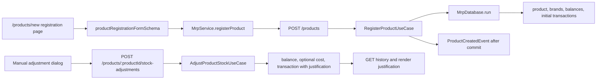

# 1. Context and scope

## Objective and source

Deliver GitHub Issue [#31](https://github.com/rafinel/scoops/issues/31) as a `complete` Spec: Managers register the full product and initial stock configuration on a dedicated page, manual stock adjustments retain an optional justification, every By-brand product has one explicitly selectable main brand, and recipe lines can use an explicitly selected ingredient brand. The implementation spans Core, Validation, Server persistence/REST, Web routing/UI, and browser validation.

## Current behavior and product gap

The product registration workflow is currently a modal rendered by `ProductsPage`. Core already creates products, balances, brands, initial ledger rows, and assigns the first submitted brand as primary atomically, but the transport does not accept an explicit primary brand. Manual stock adjustment is already Manager-only and atomic, but `AdjustProductStockInput`, `StockTransaction`, persistence, DTOs, dialogs, and history omit justification. Existing main-brand replacement after registration is atomic, but registration cannot express the mutually exclusive selection shown by the approved design. Recipe lines currently store only the ingredient product, so By-brand recipe views, costing, capacity, and production always resolve the current primary brand and the ingredient editor cannot change that source.

## Scope and product alignment

| Area | In scope | Out of scope |
| --- | --- | --- |
| Registration | Dedicated `/products/new` page; Name, Unit, Categories, Stock Control, Allow negative stock, Initial stock, Ideal stock, applicable current unit cost, and inline brands; Cancel/back returns to `/products`; success opens the created product | Image upload/storage and product Settings-tab work from Issue #18 |
| Categories and stock | Existing compatibility rules, Single/By-brand mode, initial balances, active status, establishment isolation, and current-cost eligibility | New units, weighted-average costing, or changing stock-control mode after registration |
| Brands | One or more inline brands for By-brand registration; exactly one selected main brand; first draft selected by default; atomic persistence of the chosen main brand; recipe-line selection of an active ingredient brand with primary default | Production-time ad hoc brand selection, or changing historical automatic operations |
| Manual adjustments | Optional trimmed justification on Manager Entry and Write-off; immutable display in history | Production/PDV transaction behavior and unrelated history redesign |
| Authorization | Server-enforced Manager mutation; existing authorized stock-history visibility | Identity permission-model changes |

| Source requirement | Delivery | Notes |
| --- | --- | --- |
| `REQ-01` Product Registration and Categories | partial | Delivers registration and initial operational settings; later Settings-tab and broader lifecycle capabilities remain outside this issue. |
| `REQ-02` Brand Management and Main Brand | partial | Delivers registration-time primary selection and preserves existing post-registration replacement; broader brand deletion/editing remains existing behavior. |
| `REQ-03` Inventory Control and Stock History | partial | Adds manual-adjustment justification and preserves authorization, atomic balance/ledger writes, history visibility, and tenant isolation. |

## Product decisions and assumptions

- The issue's registration field list is a minimum: the dedicated page preserves Initial stock, Ideal stock, Allow negative stock, and inline By-brand setup already supported by the current form and use case.
- Cancel creates nothing and navigates to `/products` without a confirmation dialog; browser Back follows normal history.
- Justification is trimmed at the authoritative boundary; an empty or whitespace-only value becomes absent. No arbitrary character limit is introduced.
- A By-brand registration must submit exactly one `isPrimary: true` brand. The first draft starts selected, selecting another brand clears the previous selection, and removing the selected draft selects the first remaining draft. The UI presents a mutually exclusive selector even though the approved visual uses switch styling.
- Registration uses a registration-only brand input and schema for `isPrimary`; the existing post-registration `RegisterProductBrandUseCase` add-brand input and `productBrandSchema` remain backward-compatible and do not accept or require `isPrimary`.
- Brand cards are numbered by order. Reordering brands is not part of this scope.
- The approved Pencil references are authoritative for registration layout. Runtime loading, validation, failure, focus, and success states follow repository components and this Contract; they do not require additional static frames before implementation.
- A By-brand recipe line persists an optional selected brand. New lines default to the ingredient's current primary brand; legacy lines without a selected brand continue to fall back to the current primary brand. The recipe editor lists active brands owned by the ingredient product and rejects an unavailable selected brand at the server boundary.

# 2. Implementation Contract

## Functional requirements

| ID | REQ/source coverage | Required behavior |
| --- | --- | --- |
| `RF-01` | `REQ-01`, Issue registration scope | A Manager can open `/products/new`, complete the preserved product/stock fields on a full page, cancel to `/products`, and on success open the new product's dedicated page. |
| `RF-02` | `REQ-01` | Registration validates mandatory/unique name, supported unit, at least one compatible category, Manufacturable/Single coupling, stock values, negative-stock policy, and current-cost eligibility while preserving entered values on validation or server failure. |
| `RF-03` | `REQ-01`, `REQ-02` | Single stock initializes one product balance; By-brand requires at least one valid product-owned brand, initializes each brand balance, and records non-zero initial quantities atomically with product creation. |
| `RF-04` | `REQ-02`, Issue main-brand scope | Every submitted By-brand product has exactly one main brand. The first draft defaults to main; choosing another is mutually exclusive; the chosen brand alone persists as primary. |
| `RF-05` | `REQ-02` | Existing post-registration main-brand replacement remains atomic, tenant-scoped, idempotent, and affects only future automatic selection; history and productions are not rewritten. |
| `RF-06` | `REQ-03`, Issue justification scope | Manual Entry and Write-off accept an optional justification. The server trims it, stores remaining text with the immutable transaction in the same transaction as the balance mutation, and returns/displays it in history. |
| `RF-07` | `REQ-03` | Empty justification remains valid; adjustment quantity, destination brand, current-cost eligibility, and negative-balance rules retain their existing behavior and error feedback. |
| `RF-08` | `REQ-01`, `REQ-02`, `REQ-03` | Only Managers may register products or mutate manual stock/main-brand state; authorized users retain existing stock-history access; every read/write is establishment-scoped and foreign resources are hidden or rejected. |
| `RF-09` | `REQ-01` Experience, Issue accessibility | Desktop and narrow registration layouts do not clip content; labels, validation, selectors, Back/Cancel/Create actions, focus order, and keyboard interaction are accessible and use established Scoops tokens/components. |
| `RF-10` | `REQ-06`, direct request | A Manager can edit a recipe ingredient's brand when the ingredient uses By-brand stock. The editor defaults to the persisted brand or current primary brand, presents active product-owned brands, updates the selected source on save, and recalculates recipe cost, capacity, preview, and future production consumption. |

## Acceptance criteria

| ID | RF coverage | Requirement | Given | When | Then | Expected evidence |
| --- | --- | --- | --- | --- | --- | --- |
| `CA-01` | `RF-01`, `RF-09` | Dedicated registration navigation | An authenticated Manager is on `/products` | They activate `Novo produto`, Back, Cancel, and browser Back | Registration opens at `/products/new`; Back/Cancel return to `/products` without mutation; keyboard focus follows the visible order | Widget tests, route test, `MV-01` |
| `CA-02` | `RF-02` | Validation and recovery | Registration contains invalid or conflicting values | The Manager submits | Field-level feedback identifies the failure, entered values remain, and no product/balance/brand/transaction persists | Validation, Core, controller, widget, and route tests |
| `CA-03` | `RF-01`, `RF-02`, `RF-03` | Single-stock success | A Manager supplies a valid Single-stock product | They create the product | One active tenant-owned product and balance persist; a non-zero initial quantity creates one matching initial transaction; success opens `/products/:productId` | Core/controller tests and `MV-01` |
| `CA-04` | `RF-03`, `RF-04` | By-brand success | A Manager supplies valid numbered brand drafts | They select one main brand and submit | Product, brands, balances, and non-zero initial transactions commit atomically; exactly the selected brand is primary | Validation/Core/controller/widget tests and `MV-02` |
| `CA-05` | `RF-04` | Mutually exclusive selector | Two or more brand drafts exist | The Manager selects a different main brand or removes the selected draft | One and only one remaining control is selected and the payload contains exactly one primary brand | Widget tests and `MV-02` |
| `CA-06` | `RF-05`, `RF-08` | Existing main-brand replacement | A By-brand product has a main brand | Its Manager selects another, retries the same choice, or targets a foreign brand | Replacement is atomic and idempotent; foreign access is hidden/rejected; historical facts remain unchanged | Existing Core/controller tests plus `MV-03` |
| `CA-07` | `RF-06`, `RF-07` | Optional justification | A Manager opens Entry or Write-off | They submit absent, whitespace-only, or surrounding-whitespace text | Empty text stores no value; remaining text is trimmed, persisted atomically, serialized, and displayed in the resulting history row | Validation/Core/controller/widget tests and `MV-04` |
| `CA-08` | `RF-07` | Adjustment rejection | An adjustment is malformed, targets the wrong stock mode/brand, uses invalid cost, or exceeds a protected balance | It is submitted | The balance, current cost, and history remain unchanged and actionable feedback is shown without losing dialog input | Core/controller/widget tests and `MV-04` |
| `CA-09` | `RF-08` | Authorization and tenant isolation | An Operator or foreign-establishment actor targets mutation routes | They submit registration, adjustment, or main-brand mutation | The server rejects the action and no cross-tenant data or mutation is observable; permitted history access remains unchanged | Core/controller/route tests and `MV-03` |
| `CA-10` | `RF-09` | Responsive and accessible UI | Registration is rendered at 1440 × 900 and 390 × 844 | The Manager traverses and submits by keyboard | Cards stack as designed, content scrolls without horizontal clipping, selected/disabled/error states are perceivable, focus is visible, and console/network inspection is clean | `MV-01`, `MV-02`, visual artifacts |
| `CA-11` | `RF-10` | Recipe ingredient brand selection | A recipe contains an Ingredient controlled By brand with an available primary and alternate brand | The Manager opens Edit ingredient, changes the brand, and saves | The selector defaults to the persisted brand or primary fallback, saves the chosen brand to the recipe line, refreshes source/cost/stock/capacity, and production preview/consumption use the selected brand; Single-stock ingredients do not show a brand selector | Core, controller, widget, route tests and `MV-05` |

## Cross-cutting restrictions

| Concern | Contract |
| --- | --- |
| Atomicity | Product, brands, balances, initial ledger rows, and chosen primary brand commit in one `MrpDatabase.run`; manual balance/cost/transaction changes commit in one run. External event publication remains after product commit. |
| History | Justification and captured names are immutable snapshots; changing names or main brand never rewrites past transactions or productions. |
| Tenant boundary | Server derives establishment and profile from the authenticated account; client-supplied tenant/actor fields are not trusted. |
| Numeric behavior | Existing quantity precision, base-unit semantics, compatible conversions, and current-cost precision remain authoritative. |
| UI scope | No image control, settings form, production-time ad hoc brand picker, or POS control may be inferred from the design. Recipe-line brand selection is explicitly included by `RF-10` and `CA-11`. |

## Design Contract

The implementation must follow [the design manifest](./design/manifest.md). Required references cover 1440 px-wide desktop states and 390 × 844 narrow states; the content-driven By-brand desktop frame exports at 1440 × 972 and must scroll correctly in the required 1440 × 900 runtime viewport. The desktop Stock Control card remains below the Product card. Both modes use the shared BackLink appearance; By-brand shows numbered cards and one selected `Marca principal` control.

Allowed deviations are limited to browser font rasterization, content-driven vertical growth, native focus rings consistent with `documentation/design.md`, and validation/loading/error copy required by this Contract. Narrow registration may vertically scroll; it must not horizontally clip. Runtime evidence uses transient Playwright artifacts, not additional durable screenshots.

# 3. Technical Contract

## Current technical state

| Evidence | Current responsibility | Gap |
| --- | --- | --- |
| `RegisterProductUseCase`, `RegisterProductInput`, and `RegisterProductBrandInput` | Registration and post-registration add-brand currently share the brand input; registration creates brands atomically and post-registration add-brand makes the first brand primary | Registration needs an explicit primary selection without changing the existing add-brand contract |
| `ProductRegistrationDialog` and its hook | Own all registration fields and submit through `useRegisterProductAction` | Modal composition and dialog state conflict with the dedicated-page outcome |
| `AdjustProductStockUseCase` and `AdjustProductStockInput` | Authorize Manager and atomically change balance/current cost plus ledger row | No justification normalization or ledger field |
| `StockTransaction`, Drizzle model/mapper, DTO, and history widget | Preserve and display attributable stock history | Justification absent from domain, persistence, serialization, and UI |
| `RecipeIngredient`, `RecipeIngredientUpdate`, recipe source resolution, and recipe ingredient dialog | Store only the ingredient product and quantity; By-brand source resolution always uses the current primary brand | Persist an optional selected brand, expose active brand choices in the editor, and use the selected brand for recipe details, pricing, preview, and production |
| `SetPrimaryProductBrandUseCase` and repository `setPrimary` | Atomically exchange the primary brand after registration | Must remain compatible and covered; no new endpoint is needed |

## Solution and runtime flow



The authenticated server account supplies actor, profile, and establishment context. Shared Zod schemas reject malformed payloads before use-case execution; Core reasserts business invariants. Registration uses `ProductRegistrationBrandInput` and `productRegistrationBrandSchema` to validate exactly one primary brand before starting the transaction, while `RegisterProductBrandInput` and `productBrandSchema` remain unchanged for post-registration add-brand. Adjustment trims justification before the database transaction and writes the normalized optional value alongside the balance change. Expected business failures retain current REST translation; no broker/outbox operation is added for stock justification.

## Boundary contracts

| Boundary | Producer | Consumer | Canonical contract | Mapping/guarantees | Failure ownership |
| --- | --- | --- | --- | --- | --- |
| Registration HTTP | Web `MrpService.registerProduct` | `RegisterProductController` | `RegisterProductInput`, `ProductRegistrationBrandInput`, and `registerProductSchema` | Exactly one primary brand for By-brand; no brands for Single; actor omitted from body | Registration schema/Core own primary cardinality; actor/tenant remain server-derived |
| Post-registration add-brand HTTP | Existing brand service/controller | `RegisterProductBrandUseCase` | `RegisterProductBrandInput` and `productBrandSchema` | Existing request shape and first-brand-primary behavior remain unchanged | Existing validation/Core error ownership |
| Adjustment HTTP | Web adjustment action | `AdjustProductStockController` | `AdjustProductStockInput` and `adjustProductStockSchema` | `justification?: string`; whitespace normalizes to absence | Zod pipe and Core named application errors |
| Stock persistence | `AdjustProductStockUseCase`/registration | Drizzle repositories | `StockTransaction` | Optional justification round-trips without mutability | Transaction owner rolls back balance/cost/ledger together |
| History response | `ListStockTransactionsUseCase` | Web history widget | `StockTransactionPage`/DTO | Optional justification preserved; date mapping unchanged | REST serializer/service preserve errors |

## packages/core — Domain

| Path | Change | Declaration | Domain role/schema | Invariants/transitions | Errors/events | Exports/consumers |
| --- | --- | --- | --- | --- | --- | --- |
| `packages/core/src/mrp/domain/structures/product-registration-brand-input.ts` | Create | `ProductRegistrationBrandInput` Structure | Registration-only brand payload with required `isPrimary` intent | Exactly one true is enforced for By-brand by use case; identity-free input | `BadRequestError` through use case | MRP structure barrel, registration schema, registration use case, Web |
| `packages/core/src/mrp/domain/structures/register-product-input.ts` | Modify | `RegisterProductInput` Structure | Use `ProductRegistrationBrandInput[]` for registration brands | Registration brand selection is explicit; existing post-registration input remains separate | `BadRequestError` through use case | Existing MRP structure barrel, registration validation/controller/Web |
| `packages/core/src/mrp/domain/structures/adjust-product-stock-input.ts` | Modify | `AdjustProductStockInput` Structure | Add optional normalized justification input | Absence and whitespace-only are equivalent | `BadRequestError` through use case | Existing MRP structure barrel, Validation, REST, Web |
| `packages/core/src/mrp/domain/entities/stock-transaction.ts` | Modify | `StockTransaction` Entity | Add immutable optional justification snapshot | Historical value is never rewritten | — | Existing MRP entity barrel, DTO, mapper, Web |
| `packages/core/src/mrp/domain/structures/index.ts` | Modify | MRP structure barrel | Re-export `ProductRegistrationBrandInput` alongside existing structures | Canonical Core package import remains available | — | Core consumers and package exports |

```ts
// packages/core/src/mrp/domain/structures/product-registration-brand-input.ts
export type ProductRegistrationBrandInput = {
  readonly name: string
  readonly unit?: ProductUnit
  readonly packageQuantity: number
  readonly packageValue: number
  readonly initialQuantity: number
  readonly isPrimary: boolean
}

// packages/core/src/mrp/domain/structures/register-product-input.ts
export type RegisterProductInput = {
  readonly name: string
  readonly unit: ProductUnit
  readonly categories: readonly ProductCategory[]
  readonly stockControl: ProductStockControl
  readonly allowNegativeStock?: boolean
  readonly idealStock: number
  readonly currentUnitCost?: number
  readonly initialStock?: number
  readonly brands?: readonly ProductRegistrationBrandInput[]
}

// packages/core/src/mrp/domain/structures/adjust-product-stock-input.ts
export type AdjustProductStockInput = {
  readonly brandId?: string
  readonly type: StockAdjustmentType
  readonly quantity: number
  readonly currentUnitCost?: number
  readonly justification?: string
}

// packages/core/src/mrp/domain/entities/stock-transaction.ts
export type StockTransaction = Entity & {
  readonly establishmentId: string
  readonly productId: string
  readonly brandId?: string
  readonly productionId?: string
  readonly orderId?: string
  readonly productName: string
  readonly brandName?: string
  readonly unit: ProductUnit
  readonly type: StockTransactionType
  readonly quantity: number
  readonly balanceAfter: number
  readonly justification?: string
  readonly performedBy: string
  readonly performedByName: string
  readonly occurredAt: Date
}
```

**Schema — `ProductRegistrationBrandInput`**

| Field | Type | Required | Validation | Description |
| --- | --- | --- | --- | --- |
| `name` | `string` | Yes | Trimmed, non-empty, ≤120 at boundary; unique within product | Brand display name |
| `unit` | `ProductUnit` | No | Supported unit; defaults from product | Brand package unit |
| `packageQuantity` | `number` | Yes | Finite, greater than zero | Base quantity per package |
| `packageValue` | `number` | Yes | Finite, at least zero | Current package acquisition value |
| `initialQuantity` | `number` | Yes | Finite; negative only when product allows | Initial base-unit balance |
| `isPrimary` | `boolean` | Yes | Exactly one true across By-brand registration input | Future automatic-write-off selection |

**Schema — `RegisterProductInput`**

| Field | Type | Required | Validation | Description |
| --- | --- | --- | --- | --- |
| `name` | `string` | Yes | Trimmed, non-empty, ≤120 at boundary; unique within establishment | Product display name |
| `unit` | `ProductUnit` | Yes | Supported unit | Product base unit |
| `categories` | `readonly ProductCategory[]` | Yes | At least one compatible category | Product categories |
| `stockControl` | `ProductStockControl` | Yes | Supported mode | Single or By-brand stock model |
| `allowNegativeStock` | `boolean` | No | Defaults false at transport boundary | Negative balance policy |
| `idealStock` | `number` | Yes | Finite and non-negative | Target stock level |
| `currentUnitCost` | `number` | No | Finite, non-negative, ≤6 decimals when eligible | Initial current unit cost |
| `initialStock` | `number` | No | Finite; negative only when allowed | Single-stock initial quantity |
| `brands` | `readonly ProductRegistrationBrandInput[]` | No | Required for By-brand, absent for Single; exactly one primary | Registration brand configuration |

**Schema — `AdjustProductStockInput`**

| Field | Type | Required | Validation | Description |
| --- | --- | --- | --- | --- |
| `brandId` | `string` | Conditional | UUID at REST; required only for By-brand | Adjustment destination |
| `type` | `StockAdjustmentType` | Yes | Entry or Write-off | Arithmetic intent |
| `quantity` | `number` | Yes | Finite and greater than zero | Product-base-unit quantity |
| `currentUnitCost` | `number` | No | Non-negative, ≤6 decimals; eligible positive Single Ingredient entry only | Future unit cost |
| `justification` | `string` | No | Trim; empty becomes absent | Optional manual context |

**Schema — `StockTransaction`**

| Field | Type | Required | Validation | Description |
| --- | --- | --- | --- | --- |
| `id` | `string` | Yes | Entity identifier | Transaction identity |
| `establishmentId` | `string` | Yes | Tenant-scoped | Owning establishment |
| `productId` | `string` | Yes | Existing owned product | Product reference |
| `brandId` | `string` | No | Present for brand-specific movements | Brand reference |
| `productionId` | `string` | No | Existing correlation rule | Production reference |
| `orderId` | `string` | No | Existing correlation rule | PDV order reference |
| `productName` | `string` | Yes | Captured snapshot | Historical product label |
| `brandName` | `string` | No | Captured snapshot | Historical brand label |
| `unit` | `ProductUnit` | Yes | Supported unit | Captured unit |
| `type` | `StockTransactionType` | Yes | Existing type set | Movement classification |
| `quantity` | `number` | Yes | Positive | Absolute movement quantity |
| `balanceAfter` | `number` | Yes | Existing precision | Resulting balance |
| `justification` | `string` | No | Normalized manual text | Immutable manual context |
| `performedBy` | `string` | Yes | Authenticated actor ID | Responsible user |
| `performedByName` | `string` | Yes | Captured snapshot | Responsible-user label |
| `occurredAt` | `Date` | Yes | Authoritative clock | Occurrence time |

## packages/core — Use cases

| Use case | Actor/trigger | Input/output | Direct collaborators | Consistency boundary | Failures/side effects |
| --- | --- | --- | --- | --- | --- |
| `RegisterProductUseCase` | Manager | Registration plus actor → `Product` | `MrpDatabase`, `Broker`, `DatetimeProvider` | Tenant-scoped single database transaction | Validation/conflict/auth errors; publish `ProductCreatedEvent` after commit |
| `AdjustProductStockUseCase` | Manager | Product ID, adjustment, actor → `StockBalance` | `MrpDatabase`, `DatetimeProvider` | Balance, cost, and transaction in one transaction | Validation/auth/not-found/conflict; no event |

| Path | Change | Declaration/signature | Input/output/errors | Authorization/consistency | Side effects/dependencies | Consumers/tests |
| --- | --- | --- | --- | --- | --- | --- |
| `packages/core/src/mrp/use-cases/register-product-use-case.ts` | Modify | `RegisterProductUseCase.execute(Request)` | Accept `ProductRegistrationBrandInput`; reject zero/multiple selected brands | Manager, establishment, one `MrpDatabase.run` | Persist submitted primary flags; event after commit | Controller; `register-product-use-case.test.ts` |
| `packages/core/src/mrp/use-cases/adjust-product-stock-use-case.ts` | Modify | `AdjustProductStockUseCase.execute(Request)` | Normalize optional justification and include it only on manual ledger row | Manager, establishment, atomic balance/cost/ledger | No new event or outbox effect | Controller; `adjust-product-stock-use-case.test.ts` |
| `packages/core/src/mrp/domain/entities/recipe-ingredient.ts` | Modify | `RecipeIngredient` | Add optional selected `ingredientBrandId` | Nullable legacy fallback; product/brand relationship validated by use cases | Recipe repository and source resolution |
| `packages/core/src/mrp/domain/structures/add-recipe-ingredient-input.ts` | Modify | `AddRecipeIngredientInput` | Accept optional `ingredientBrandId` | By-brand source defaults to primary when omitted | Add use case and Web dialog |
| `packages/core/src/mrp/domain/structures/update-recipe-ingredient-input.ts` | Modify | `UpdateRecipeIngredientInput` | Accept optional `ingredientBrandId` with quantity | By-brand source selection remains recipe-line scoped | Update use case and Web dialog |
| `packages/core/src/mrp/domain/structures/recipe-ingredient-update.ts` | Modify | `RecipeIngredientUpdate` | Accept optional `ingredientBrandId` with quantity | Recipe-line scoped update | Update use case and repository |
| `packages/core/src/mrp/use-cases/add-recipe-ingredient-use-case.ts` | Modify | `AddRecipeIngredientUseCase.execute` | Validate and persist requested or primary brand | Manager, tenant, active product-owned brand | Recipe response |
| `packages/core/src/mrp/use-cases/update-recipe-ingredient-use-case.ts` | Modify | `UpdateRecipeIngredientUseCase.execute` | Validate and persist selected active brand | Invalid or foreign brand leaves line unchanged | Recipe response |
| `packages/core/src/mrp/use-cases/get-product-recipe-use-case.ts` | Modify | `GetProductRecipeUseCase` | Resolve selected brand or primary fallback for source metrics | Missing source is rejected visibly | Recipe table/dialog |
| `packages/core/src/mrp/use-cases/preview-production-use-case.ts` | Modify | `PreviewProductionUseCase` | Project the selected brand or primary fallback | Read-only projection reports unavailable source | Production dialog |
| `packages/core/src/mrp/use-cases/register-production-use-case.ts` | Modify | `RegisterProductionUseCase` | Consume the selected brand or primary fallback | Atomic stock/ledger behavior remains | Production records |
| `packages/core/src/mrp/use-cases/get-product-pricing-use-case.ts` | Modify | Dependent recipe cost resolution | Use selected brand or primary fallback | Existing pricing boundary remains | Pricing consumers |
| `packages/core/src/mrp/use-cases/tests/register-product-use-case.test.ts` | Modify | `RegisterProductUseCase` unit suite | Cover exactly-one primary, selected non-first brand, invalid rollback, and existing initial behavior | Mocked Core ports; no infrastructure | Assert resulting repository inputs and event timing | Test-integrity `required` source |
| `packages/core/src/mrp/use-cases/tests/adjust-product-stock-use-case.test.ts` | Modify | `AdjustProductStockUseCase` unit suite | Cover absent/whitespace/trimmed justification and rollback branches | Mocked Core ports | Assert normalized ledger value and no partial writes | Test-integrity `required` source |

## packages/validation — Validation

| Schema | Concern/owner | Shape responsibility | Composes/derives from | Boundary consumers | Error/type contract |
| --- | --- | --- | --- | --- | --- |
| `productBrandSchema` | MRP transport | Existing post-registration add-brand shape without `isPrimary` | Product-unit schema | `RegisterProductBrandController` | Existing Zod issues and inferred type remain compatible |
| `productRegistrationBrandSchema` | MRP transport | Registration brand shape including required `isPrimary` | `productBrandSchema` plus primary flag | `registerProductSchema` | Zod issues and inferred type |
| `registerProductSchema` | MRP REST | Product registration cross-field shape | Brand/category/unit/stock-control schemas | Server controller | Reject invalid primary cardinality and mode fields |
| `adjustProductStockSchema` | MRP REST | Manual adjustment shape | Core adjustment enum | Server controller | Normalize optional justification |
| `productRegistrationFormSchema` | Web form | String-form values and mutually exclusive brand draft state | Core enums | Registration page hook | Portuguese field errors; preserve inputs |

| Path | Change | Schema/declaration | Fields/refinements | Composition/ownership | Consumers | Export/tests |
| --- | --- | --- | --- | --- | --- | --- |
| `packages/validation/src/mrp/product-registration-brand-schema.ts` | Create | `productRegistrationBrandSchema` | Extend the existing brand shape with required boolean `isPrimary` | Registration-only syntactic shape; no authorization/business ownership | `registerProductSchema` | Root export; schema tests through registration consumer |
| `packages/validation/src/mrp/register-product-schema.ts` | Modify | `registerProductSchema` | Compose `productRegistrationBrandSchema`; By-brand requires brands and exactly one primary; Single rejects brand payload; retain numeric/category checks | Transport cross-field validation, not authorization | Server registration | Existing root export; consumer tests |
| `packages/validation/src/index.ts` | Modify | Validation root exports | Export `productRegistrationBrandSchema` without changing `productBrandSchema` | One schema owner per boundary | Core/server/web importers | Root package consumers |
| `packages/validation/src/mrp/adjust-product-stock-schema.ts` | Modify | `adjustProductStockSchema` | Optional string transformed by trim to `undefined` when empty | Transport normalization | Adjustment controller | Existing root export; consumer tests |
| `packages/validation/src/web/product-registration-form-schema.ts` | Modify | `productRegistrationFormSchema` | Require one selected draft in By-brand mode and retain localized numeric/category validation | Browser form only | Registration page hook | Existing root export; widget tests |
| `packages/validation/src/web/stock-adjustment-form-schema.ts` | Modify | `stockAdjustmentFormSchema` | Add optional justification string and preserve quantity/cost/package validation | Browser form only; no business/authorization rules | `useStockAdjustmentDialog` | Existing root export; dialog route coverage |
| `packages/validation/src/mrp/recipe-ingredient-schema.ts` | Modify | Add/update recipe ingredient schemas | Accept optional UUID `ingredientBrandId` | Syntactic validation only; server owns product/brand relationship | Recipe controllers and Web dialog | Existing root export; consumer tests |

## apps/server — REST

| Operation | Server entry | Core action/contract | Web consumer | Security/tenant source | Compatibility/error owner |
| --- | --- | --- | --- | --- | --- |
| `POST /products` | `RegisterProductController.handle` | `RegisterProductUseCase` | `MrpService.registerProduct` | Current account + Manager profile | Zod pipe and global error filter |
| `POST /products/:productId/stock-adjustments` | `AdjustProductStockController.handle` | `AdjustProductStockUseCase` | `MrpService.adjustProductStock` | Current account + Manager profile | Zod pipe and global error filter |
| `GET /products/:productId/stock-transactions` | Existing list controller | Existing list use case | History query/widget | Current account and establishment | DTO/date mapper/global error filter |

| Path | Change | Declaration/operation | Boundary/security | Request/response/errors | Effects/consumers | Registration/examples |
| --- | --- | --- | --- | --- | --- | --- |
| `apps/server/src/mrp/rest/controllers/register-product.controller.ts` | Modify | `RegisterProductController` | Retain `RequiredProfiles(Manager)` and current account; derive `RequestBody` from `RegisterProductUseCase.execute` rather than `unknown`/cast | Consume revised schema/input; assemble server-derived actor with typed body; response unchanged | Execute atomic registration | Existing module/decorator |
| `apps/server/src/mrp/rest/controllers/tests/register-product.controller.test.ts` | Create | `Register Product Controller [POST /products]` | Real Nest/Drizzle tenant/auth boundary | Success, invalid primary cardinality, authorization, duplicate, foreign isolation | Assert HTTP plus persisted product/brands/balances/transactions | Test-integrity `required` controller |
| `apps/server/src/mrp/rest/controllers/tests/adjust-product-stock.controller.test.ts` | Modify | Adjustment controller integration suite | Real Nest/Drizzle boundary | Absent/trimmed justification, rejection, tenant/auth | Assert response and persistence | Test-integrity `required` controller |
| `apps/server/src/mrp/rest/controllers/tests/update-recipe-ingredient.controller.test.ts` | Modify | Update recipe integration suite | Alternate/default/invalid brand cases | Real tenant/auth/persistence boundary | HTTP and persisted line source | Test-integrity `required` controller |
| `apps/server/src/mrp/rest/dtos/stock-transaction-response.dto.ts` | Modify | `StockTransactionResponseDto` | Output-only | Add optional justification property | History consumer | Existing DTO barrel |
| `apps/server/rest-client/mrp/products.rest` | Modify | MRP products route-group examples | Local authenticated headers/variables | Cover every existing products operation once; revise registration/adjustment bodies and history response usage | Manual parity | Base URL and secrets remain environment-local |

## apps/server — Database

| Persistence capability | Domain owner | Core contract | Models/types | Mapper | Repository/transaction owner |
| --- | --- | --- | --- | --- | --- |
| Stock transaction justification | MRP `StockTransaction` | `StockTransactionsRepository` unchanged method shape with revised entity creation type | `stockTransactionModel`, inferred `DrizzleStockTransaction` | `DrizzleStockTransactionMapper` | Existing Drizzle repository inside `MrpDatabase.run` |

| Path | Change | Declaration/operation | Schema/mapping | Integrity/query contract | Migration/transaction | Registration/consumers |
| --- | --- | --- | --- | --- | --- | --- |
| `apps/server/src/mrp/database/drizzle/models/stock-transaction-model.ts` | Modify | `stockTransactionModel.justification` | Nullable `text` column | Existing tenant/product indexes and correlation checks unchanged | Additive nullable migration | Shared schema barrel already exports model |
| `apps/server/src/mrp/database/drizzle/models/recipe-ingredient-model.ts` | Modify | `recipeIngredientModel.ingredientBrandId` | Nullable UUID FK to `mrp_product_brands`, `ON DELETE SET NULL` | Legacy/deleted selection falls back to primary | Additive migration | Recipe repository |
| `apps/server/src/mrp/database/drizzle/mappers/drizzle-recipe-ingredient-mapper.ts` | Modify | `DrizzleRecipeIngredientMapper.toDomain` | Map nullable brand ID to optional domain field | Preserve existing fields | Repository reads | Core recipe use cases |
| `apps/server/src/shared/database/drizzle/migrations/0020_recipe-ingredient-brand.sql` | Generate | Add recipe-line brand selection | Add nullable `ingredient_brand_id` and FK | No backfill; existing rows remain primary-fallback | Additive migration | Drizzle Kit |
| `apps/server/src/shared/database/drizzle/migrations/meta/0020_snapshot.json` | Generate | Updated schema snapshot | Include recipe-line brand column | Must match model and migration | Generated | Drizzle Kit |
| `apps/server/src/shared/database/drizzle/migrations/meta/_journal.json` | Generate | Migration journal entry | Append migration 0020 | Generated | Drizzle Kit |
| `apps/server/src/mrp/database/drizzle/mappers/drizzle-stock-transaction-mapper.ts` | Modify | `DrizzleStockTransactionMapper.toDomain` | Map database null to domain undefined | Preserve all existing snapshots | Runs inside existing reads | Repository/list use case |
| `apps/server/src/shared/database/drizzle/migrations/0019_product-stock-justification.sql` | Generate | Drizzle migration from model with `--name product-stock-justification` | Add nullable `justification text` to `mrp_stock_transactions` | No backfill; existing rows remain null | Additive, transaction-safe, backward-compatible; generated after existing `0018` | Drizzle Kit; verify emitted name before ledger reconciliation |
| `apps/server/src/shared/database/drizzle/migrations/meta/0019_snapshot.json` | Generate | Drizzle schema snapshot | Include nullable column | Must match model/migration and follow `0018` | Generated, never hand-edited | Drizzle Kit; verify emitted path |

### Data model — `mrp_stock_transactions`

Only the additive column changes; every existing column, index, and constraint remains unchanged.

| Column | Type | Nullable | Default | Description |
| --- | --- | --- | --- | --- |
| `justification` | `text` | Yes | `NULL` | Trimmed optional context for manual Entry/Write-off; legacy and automatic rows remain null |

### Data model — `mrp_recipe_ingredients`

The recipe line keeps an optional selected brand. A null value preserves legacy behavior and resolves to the ingredient product's current primary brand at read/production time.

| Column | Type | Nullable | Default | Description |
| --- | --- | --- | --- | --- |
| `ingredient_brand_id` | `uuid` | Yes | `NULL` | Product-owned brand selected for a By-brand recipe ingredient; foreign-key deletion restores primary-brand fallback |

| Index name | Columns | Type | Purpose |
| --- | --- | --- | --- |
| Existing indexes | Unchanged | Existing | No new access path is required for a displayed, non-filtered field |

| Constraint | Type | Definition | Purpose |
| --- | --- | --- | --- |
| Existing constraints | Unchanged | Existing quantity/unit/type/correlation checks | Justification does not alter movement validity |

PostgreSQL nullable `text` is portable to the repository's current database target. Generate with `pnpm --filter server db:migration:generate -- --name product-stock-justification`; do not hand-edit the migration, journal, or snapshot. The expected generated migration body is:

```sql
ALTER TABLE "mrp_stock_transactions" ADD COLUMN "justification" text;
```

Apply in normal numeric order with no backfill or destructive rollback step.

## apps/web — UI

| Widget | Kind | Parent/entry | Direct children | Public contract | Behavior owner |
| --- | --- | --- | --- | --- | --- |
| `ProductRegistrationPage` | Page | `/products/new` route | `ProductRegistrationForm`, `ProductStockControlCard` | No props; complete route workflow | `useProductRegistrationPage` |
| `ProductRegistrationForm` | Component | `ProductRegistrationPage` | `ProductStockControlCard` through composition props | Values, field errors, category/unit callbacks | Pure renderer |
| `ProductStockControlCard` | Component | `ProductRegistrationPage` | `ProductBrandEditor` list | Stock mode/settings and brand callbacks | Parent-owned form state |
| `ProductBrandEditor` | Component | `ProductStockControlCard` | — | Number, values, primary selection, remove/change callbacks | Pure renderer |
| `StockAdjustmentDialog` | Component | `ProductStockSlot` | — | Add justification field to existing submit contract | Existing colocated hook |
| `StockTransactionHistoryCard` | Component | `ProductStockSlot` | Existing state components | Display optional justification without hiding attribution | Existing colocated hook |
| `RecipeIngredientDialog` | Component | `ProductRecipeSlot` | Product, quantity, source fields | Show active brand selector for By-brand ingredients and default primary/persisted selection | `useRecipeIngredientDialog` |

### Expected widget file tree

```text
apps/web/src/ui/mrp/widgets/pages/product-registration-page/
├── index.tsx
├── use-product-registration-page.ts
├── tests/
│   ├── product-registration-page.test.tsx
│   └── use-product-registration-page.test.ts
├── product-registration-form/
│   ├── index.tsx
│   └── tests/product-registration-form.test.tsx
└── product-stock-control-card/
    ├── index.tsx
    ├── tests/product-stock-control-card.test.tsx
    └── product-brand-editor/
        ├── index.tsx
        └── tests/product-brand-editor.test.tsx

apps/web/src/ui/mrp/widgets/slots/product-stock-slot/
├── stock-adjustment-dialog/
│   ├── index.tsx
│   ├── use-stock-adjustment-dialog.ts
│   └── tests/
│       ├── stock-adjustment-dialog.test.tsx
│       └── use-stock-adjustment-dialog.test.ts
└── stock-transaction-history-card/
    ├── index.tsx
    ├── use-stock-transaction-history-card.ts
    └── tests/stock-transaction-history-card.test.tsx
```

| Path | Change | Declaration/surface | Widget/role | State/actions contract | Async/failure contract | Design/responsive/accessibility | Dependencies/tests |
| --- | --- | --- | --- | --- | --- | --- | --- |
| `apps/web/src/routes/_authenticated/products/new.tsx` | Create | `/products/new` route | Thin route | Render page only | Auth layout owns session | Route URL and SSR-safe composition | Page widget; route integration test |
| `apps/web/src/constants/routes.ts` | Modify | `ROUTES.newProduct` | Route constant | Add `/products/new` | — | Used by links/navigation | Route and widgets |
| `apps/web/src/routeTree.gen.ts` | Generate | TanStack route tree | Generated composition | Include new route | Generated from route file | Never hand-edit | Web route generation/build |
| `apps/web/src/ui/mrp/widgets/pages/products-page/index.tsx` | Modify | `ProductsPage` | Page | Remove dialog ownership/open state; provide navigation callback | Product-list states unchanged | `Novo produto` becomes link/navigation | Existing tests |
| `apps/web/src/ui/mrp/widgets/pages/products-page/use-products-page.ts` | Modify | `useProductsPage` | Behavior hook | Remove registration-dialog state if owned here | Query behavior unchanged | — | Existing hook/page tests |
| `apps/web/src/ui/mrp/widgets/pages/products-page/products-list-card/index.tsx` | Modify | `ProductsListCard` | Component | `Novo produto` navigates to route | — | Accessible link/button name preserved | Existing component test |
| `apps/web/src/ui/mrp/widgets/pages/products-page/products-list-card/tests/products-list-card.test.tsx` | Modify | Products list-card suite | Component test | Assert `Novo produto` navigates to the dedicated route | Mocked navigation boundary | Accessible link/button name | Test-integrity allowed |
| `apps/web/src/ui/mrp/widgets/pages/products-page/tests/products-page.test.tsx` | Modify | Products page suite | Component test | Preserve list states while rendering the new navigation entry | Owning page hook seam | Accessible navigation and existing states | Test-integrity allowed |
| `apps/web/src/ui/mrp/widgets/pages/products-page/tests/use-products-page.test.ts` | Modify | `useProductsPage` suite | Behavior-owner hook test | Preserve query/list state while registration-dialog state is removed | Existing query/error behavior | — | Test-integrity allowed |
| `apps/web/src/ui/mrp/widgets/pages/products-page/product-registration-dialog/index.tsx` | Remove | `ProductRegistrationDialog` | Superseded component | Replaced by page composition | — | Modal no longer rendered | Existing tests removed/migrated |
| `apps/web/src/ui/mrp/widgets/pages/products-page/product-registration-dialog/use-product-registration-dialog.ts` | Remove | `useProductRegistrationDialog` | Superseded behavior hook | Logic migrates to page hook | — | — | Tests migrated |
| `apps/web/src/ui/mrp/widgets/pages/products-page/product-registration-dialog/brand-section/index.tsx` | Remove | `BrandSection` | Superseded component | Logic migrates to stock card | — | — | Tests migrated |
| `apps/web/src/ui/mrp/widgets/pages/products-page/product-registration-dialog/brand-editor/index.tsx` | Remove | `BrandEditor` | Superseded component | Logic migrates to `ProductBrandEditor` | — | — | Tests migrated |
| `apps/web/src/ui/mrp/widgets/pages/products-page/product-registration-dialog/tests/product-registration-dialog.test.tsx` | Remove | Superseded test | — | Coverage migrates to new widgets | — | — | Test-integrity remains widget-owned |
| `apps/web/src/ui/mrp/widgets/pages/products-page/product-registration-dialog/tests/use-product-registration-dialog.test.ts` | Remove | Superseded hook test | — | Coverage migrates | — | — | Test-integrity remains widget-owned |
| `apps/web/src/ui/mrp/widgets/pages/products-page/product-registration-dialog/brand-section/tests/brand-section.test.tsx` | Remove | Superseded test | — | Coverage migrates | — | — | — |
| `apps/web/src/ui/mrp/widgets/pages/products-page/product-registration-dialog/brand-editor/tests/brand-editor.test.tsx` | Remove | Superseded test | — | Coverage migrates | — | — | — |
| `apps/web/src/ui/mrp/widgets/pages/product-registration-page/index.tsx` | Create | `ProductRegistrationPage` | Page | Compose BackLink, title, form/cards/actions | Pending disables submit; server failure remains inline; success navigates to product | Manifest viewports; visible focus and semantic form | Colocated page tests |
| `apps/web/src/ui/mrp/widgets/pages/product-registration-page/use-product-registration-page.ts` | Create | `useProductRegistrationPage` | Behavior hook | Own RHF values, brand IDs/order/primary selection, mode/category coupling, cancel/success handlers | Preserve values on failure; invalidate via action | No browser-only initialization mismatch | Hook test |
| `apps/web/src/ui/mrp/widgets/pages/product-registration-page/tests/product-registration-page.test.tsx` | Create | Page component suite | Direct widget test | Composition, submit, cancel/back, pending/error | Mock typed `useProductRegistrationPage`; render real child composition | Roles/names/focusable actions | Test-integrity allowed |
| `apps/web/src/ui/mrp/widgets/pages/product-registration-page/tests/use-product-registration-page.test.ts` | Create | Page-hook suite | Direct behavior-owner test | Categories, mode lock, brand primary cardinality/removal, payload, recovery | Mutation success/failure | — | Test-integrity allowed |
| `apps/web/src/ui/mrp/widgets/pages/product-registration-page/product-registration-form/index.tsx` | Create | `ProductRegistrationForm` | Component | Render product fields/categories and field errors | No async ownership | Desktop/narrow grid and labels | Component test |
| `apps/web/src/ui/mrp/widgets/pages/product-registration-page/product-registration-form/tests/product-registration-form.test.tsx` | Create | Form renderer suite | Direct widget test | Field interactions/disabled guidance | — | Accessible names/errors | Test-integrity allowed |
| `apps/web/src/ui/mrp/widgets/pages/product-registration-page/product-stock-control-card/index.tsx` | Create | `ProductStockControlCard` | Component | Render mode, negative policy, stocks/cost, brand list/add | No async ownership | Card below product card; narrow stack | Component test |
| `apps/web/src/ui/mrp/widgets/pages/product-registration-page/product-stock-control-card/tests/product-stock-control-card.test.tsx` | Create | Stock-card suite | Direct widget test | Mode, conditional cost, add brand | — | Mutual exclusion semantics | Test-integrity allowed |
| `apps/web/src/ui/mrp/widgets/pages/product-registration-page/product-stock-control-card/product-brand-editor/index.tsx` | Create | `ProductBrandEditor` | Component | Numbered fields and main selector callbacks | No async ownership | One selected control announced; narrow fields stack | Component test |
| `apps/web/src/ui/mrp/widgets/pages/product-registration-page/product-stock-control-card/product-brand-editor/tests/product-brand-editor.test.tsx` | Create | Brand-editor suite | Direct widget test | Values, selection, remove | — | Accessible switch/radio semantics | Test-integrity allowed |
| `apps/web/src/ui/mrp/widgets/slots/product-stock-slot/stock-adjustment-dialog/index.tsx` | Modify | `StockAdjustmentDialog` | Component | Render optional Justification textarea for Entry/Write-off | Preserve input/errors while pending/failure | Labelled control and focus | Existing test |
| `apps/web/src/ui/mrp/widgets/slots/product-stock-slot/stock-adjustment-dialog/use-stock-adjustment-dialog.ts` | Modify | `useStockAdjustmentDialog` | Behavior hook | Own justification; reset only on success/close | Pass normalized-compatible value; preserve on failure | — | Existing test through widget/file |
| `apps/web/src/ui/mrp/widgets/slots/product-stock-slot/stock-adjustment-dialog/stock-adjustment-dialog.test.tsx` | Remove | Legacy-located dialog suite | Superseded test path | Cases move under required `tests/` directory | — | — | Rule-alignment move |
| `apps/web/src/ui/mrp/widgets/slots/product-stock-slot/stock-adjustment-dialog/tests/stock-adjustment-dialog.test.tsx` | Create | Dialog suite | Direct widget test | Empty/provided text, pending/error/retry | Observable submit payload/result | Keyboard labels/focus | Test-integrity allowed |
| `apps/web/src/ui/mrp/widgets/slots/product-stock-slot/stock-adjustment-dialog/tests/use-stock-adjustment-dialog.test.ts` | Create | `useStockAdjustmentDialog` suite | Behavior-owner hook test | Absent/entered justification, failure preservation, success/close reset, pending and submit payload | Mock action at widget boundary | — | Test-integrity allowed |
| `apps/web/src/ui/mrp/widgets/slots/product-stock-slot/stock-transaction-history-card/index.tsx` | Modify | `StockTransactionHistoryCard` | Component | Render justification when present and keep author/type/quantity/time | Existing loading/empty/error/retry unchanged | Wrapping without clipping | Existing test |
| `apps/web/src/ui/mrp/widgets/slots/product-stock-slot/stock-transaction-history-card/stock-transaction-history-card.test.tsx` | Remove | Legacy-located history-card suite | Superseded test path | Cases move under required `tests/` directory | — | — | Rule-alignment move |
| `apps/web/src/ui/mrp/widgets/slots/product-stock-slot/stock-transaction-history-card/tests/stock-transaction-history-card.test.tsx` | Create | History-card suite | Direct widget test | Present/absent justification and existing states | Mock typed `useStockTransactionHistoryCard`; render the real widget | Accessible readable row | Test-integrity allowed |
| `apps/web/tests/routes/mrp/products.index.test.ts` | Remove | Legacy-extension products route suite | Superseded test path | Cases move to Rule-compliant `.test.tsx` path | — | — | Routing Rule alignment |
| `apps/web/tests/routes/mrp/products.index.test.tsx` | Create | Products route browser suite | Route boundary | Preserve existing cases and assert `Novo produto` navigation instead of modal | Mocked transport only | Keyboard-visible route transition | Playwright route suite |
| `apps/web/tests/routes/mrp/products.new.test.tsx` | Create | Registration route browser suite | Route boundary | Single/By-brand form, validation, main selection, cancel/success | Mock success/failure/retry; not persistence evidence | 1440 × 900 and 390 × 844, no clipping | Permitted route test |

## Technical decisions

| Decision | Chosen approach | Alternative considered | Reason | Accepted trade-off |
| --- | --- | --- | --- | --- |
| Registration primary brand contract | Registration-only `ProductRegistrationBrandInput` and `productRegistrationBrandSchema` carry required `isPrimary`; existing add-brand input/schema remain unchanged | Reuse `RegisterProductBrandInput` and make `isPrimary` required for both operations | Preserves the existing add-brand API while giving registration an explicit atomic selection | Two closely related brand payloads require clear naming and separate schema coverage |
| Registration UI migration | New page-owned widgets; remove modal widget after coverage migration | Reuse dialog shell on a route | Avoids constrained scrolling and modal lifecycle while preserving proven field logic | Structural test migration is required |
| Justification storage | Nullable text on immutable transaction | Separate notes table or length-limited varchar | Field is transaction-owned, optional, non-filtered, and has no requested arbitrary limit | Large input remains bounded only by platform/database practical limits |
| Recipe ingredient source | Persist nullable `ingredientBrandId` on the recipe line; resolve it when present and use current primary only when absent | Resolve the primary brand dynamically for every recipe operation | A Manager's explicit recipe choice must survive refreshes and must affect costing, capacity, preview, and production; nullable storage preserves existing lines | Deleting a selected brand clears the selection and safely restores primary fallback |

# 4. Validation Contract

## Testing strategy

Every `MV-*` scenario is executed through the Playwright CLI only. The scenario
must drive the user-visible browser flow and assert the resulting URL, requests,
responses, persisted state, console messages, failed requests, keyboard path and
required viewport state. Direct manual clicking, ad-hoc HTTP calls or database
queries are not valid substitutes for executing an `MV-*`; server/database
read-back may supplement the Playwright result when persistence is part of the
scenario. Mocked route suites remain automated browser coverage, but they do not
replace the authenticated server-backed Playwright execution required by `MV-*`.

| Test file | Test type | Target | Coverage goal |
| --- | --- | --- | --- |
| `packages/core/src/mrp/use-cases/tests/register-product-use-case.test.ts` | unit | `RegisterProductUseCase` | Registration invariants, selected primary, atomic inputs, event timing |
| `packages/core/src/mrp/use-cases/tests/adjust-product-stock-use-case.test.ts` | unit | `AdjustProductStockUseCase` | Justification normalization, authorization, validation, atomic ledger behavior |
| `apps/server/src/mrp/rest/controllers/tests/register-product.controller.test.ts` | integration | `POST /products` | Real validation/auth/tenant/persistence contract |
| `apps/server/src/mrp/rest/controllers/tests/adjust-product-stock.controller.test.ts` | integration | Adjustment route | Real normalization/auth/tenant/persistence contract |
| `apps/web/src/ui/mrp/widgets/pages/product-registration-page/**/*.test.{ts,tsx}` | unit/component | New page widgets/hook | Field behavior, main selection, navigation, recovery, accessibility |
| `apps/web/src/ui/mrp/widgets/slots/product-stock-slot/**/tests/*.test.{ts,tsx}` | unit/component | Adjustment/history widgets and behavior hook | Justification lifecycle, retry, and display |
| `apps/web/src/ui/mrp/widgets/slots/product-recipe-slot/recipe-ingredient-dialog/**/*.test.{ts,tsx}` | unit/component | Recipe ingredient dialog/hook | Brand selector defaults, selection, save payload, and recovery |
| `apps/web/tests/routes/mrp/products.index.test.tsx` | browser route | Product list | Request mapping, loading/error/recovery, empty states, search/filter/sort/pagination URL synchronization, accessible navigation and role visibility |
| `apps/web/tests/routes/mrp/products.new.test.tsx` | browser route | Registration route | Responsive mocked success/validation/failure/cancel flow |
| `apps/web/tests/routes/mrp/products.$productId.recipe.test.ts` | browser route | Recipe route | By-brand source default, alternate selection, exact PATCH body, and responsive dialog flow |

## Test cases by file

| Test file | Test case | Description | Assertions |
| --- | --- | --- | --- |
| Core registration suite | selected main brand | Select a non-first brand | Exactly that repository input is primary; transaction commits and event follows |
| Core registration suite | invalid primary cardinality | Submit zero or multiple primary brands | `BadRequestError`; no persistence/event |
| Core adjustment suite | optional justification | Submit absent, blank, and padded text | Stored value is undefined, undefined, and trimmed text respectively |
| Core adjustment suite | rejected adjustment | Exercise actor, balance, mode/brand, quantity, and cost failures | No partial balance/cost/ledger result |
| Registration controller suite | HTTP registration boundaries | Valid Single/By-brand, duplicate, invalid selector, Operator, foreign tenant | Status/body and persisted tenant-owned graph agree |
| Adjustment controller suite | HTTP justification boundaries | Empty/provided text plus authorization/tenant failures | Response and queried transaction agree; forbidden writes absent |
| Registration widget suites | complete page interaction | Categories, locked mode, conditional cost, brands, main selection, submit/cancel | Accessible state and exact mutation/navigation payload |
| Adjustment hook suite | justification lifecycle | Enter, submit, fail, succeed, close, and pending transitions | Input preserved on failure, reset on success/close, payload normalized-compatible |
| Adjustment/history component suites | rendered justification | Type, retry, reopen, and history display | Labelled control, observable errors, and history text conditional |
| Route suites | registration routing | Open, cancel, submit, error at both viewports | URL, visible state, mocked request, keyboard path, no clipping |
| Recipe ingredient suites | recipe source selection | Add/edit By-brand line and persist alternate source | Selector state, exact request body, visible source metrics, Single-stock omission |

## Acceptance coverage

| Acceptance | Automated boundary | Playwright CLI scenario | Evidence target |
| --- | --- | --- | --- |
| `CA-01` | Page/widget and products route tests | `MV-01` | `evaluation.md` navigation/keyboard record |
| `CA-02` | Validation, Core, controller, widget, route tests | `MV-01` | `evaluation.md` invalid-submit record |
| `CA-03` | Core and registration controller tests | `MV-01` | Server-backed product/balance/transaction record |
| `CA-04` | Validation, Core, controller, widget tests | `MV-02` | Server-backed brand graph record |
| `CA-05` | Hook/brand widget and route tests | `MV-02` | Selector DOM/payload record |
| `CA-06` | Existing primary-brand Core/controller tests | `MV-03` | Server-backed replacement/history record |
| `CA-07` | Validation/Core/controller/dialog/history tests | `MV-04` | Server-backed transaction/history record |
| `CA-08` | Core/controller/dialog tests | `MV-04` | Rejection/recovery record |
| `CA-09` | Core/controller and route guard coverage | `MV-03` | Manager/Operator/tenant record |
| `CA-10` | Widget and route tests | `MV-01`, `MV-02` | Desktop/narrow screenshots and accessibility checks |
| `CA-11` | Recipe Core/controller/widget/route tests | `MV-05` | Persisted source, recalculated metrics and production/preview consumption |

## Playwright CLI scenarios

Run these scenarios with the Playwright CLI against the required local services,
for example `pnpm --filter web exec playwright test <mv-suite> --workers=1`.
Use committed route suites for deterministic mocked transport and an ephemeral
Playwright CLI suite when the scenario requires authenticated server persistence.
Record the exact command, browser state, URL/request assertions, persistence
read-back, diagnostics and fresh screenshots in `evaluation.md`.

### `MV-01` — Single-stock registration and cancellation

Requires healthy PostgreSQL (`localhost:54322`), Server (`localhost:3336`), and Web (`localhost:4000`), seeded Manager account, authenticated Playwright storage state, and `k4tYU.png`/`g9l12m.png` references. Execute every step with Playwright CLI.

1. At 1440 × 900, open `/products`, activate `Novo produto` by keyboard, and verify `/products/new`, BackLink, title, Product card, Stock Control card below it, and actions.
2. Submit missing/conflicting fields; verify adjacent errors, retained values, no successful POST/persistence, visible focus, and no console or failed-request anomaly beyond the expected 4xx.
3. Cancel and verify `/products` with no created product; repeat browser Back behavior.
4. Reopen, register a valid Single-stock Ingredient with positive initial stock/current unit cost, and verify the POST, `/products/:productId`, persisted active product/balance/cost, and exactly one initial Entry transaction.
5. Repeat layout/keyboard inspection at 390 × 844; verify vertical scrolling, no horizontal clipping, and compare with both references.

### `MV-02` — By-brand registration and mutually exclusive primary selection

Uses the same services/account plus `lZGJu.png`/`z41Sbx.png`. Execute every step with Playwright CLI.

1. Open `/products/new`, choose By brand, add a second brand, and verify numbered cards and only brand 1 selected initially.
2. Select brand 2 as main using keyboard; verify brand 1 clears, exactly one control is selected in the accessibility tree, and removing the selected draft restores one selected remaining brand.
3. Submit valid brands with distinguishable balances and verify the request contains exactly one primary, the persisted product graph contains exactly that primary, and initial transaction counts/amounts match non-zero inputs.
4. Inspect 1440 × 900 and 390 × 844 layout, focus, scroll, console, and failed network requests against the two saved references.

### `MV-03` — Authorization, tenant isolation, and future-only primary replacement

Execute the Manager and Operator browser flows with Playwright CLI; HTTP status
and persistence assertions are collected by the same scenario and are not a
separate execution path.

1. With the Manager state, change an existing By-brand product's main brand and verify one primary persists; repeat the same action and verify idempotent visible state.
2. Verify existing transactions retain captured brand data and are not rewritten.
3. With the Operator state, attempt registration, adjustment, and main-brand mutation through the visible route/API; verify rejection while authorized stock history remains readable.
4. Attempt a known foreign-establishment product/brand identifier and verify no data disclosure or mutation. Inspect URL, HTTP status, persistence, console, and failed requests.

### `MV-04` — Manual adjustment justification and recovery

Execute the dialog, retry, reload and history flows with Playwright CLI; direct
API calls may only be used as supporting assertions from the Playwright scenario.

1. As Manager, open Entry and submit without justification; verify success and a history row without justification.
2. Submit another Entry with padded text; verify the request/result, persisted trimmed value, and visible history text.
3. Submit a Write-off with whitespace-only text; verify success with no stored justification.
4. Attempt a protected overdraw and another invalid adjustment; verify visible actionable error, retained dialog values, unchanged balance/cost/history, keyboard recovery, and expected 4xx only.
5. Reload the route and verify justification survives server round-trip, attribution remains visible, and console/network inspection is clean.

### `MV-05` — Recipe ingredient brand selection

Requires healthy PostgreSQL (`localhost:54322`), Server (`localhost:3336`), Web (`localhost:4000`),
and a Manager recipe containing a By-brand Ingredient with a primary and alternate active brand.
Execute the complete scenario with Playwright CLI; PostgreSQL read-back is
supplemental persistence evidence, not a replacement for browser execution.

1. Open the recipe and edit the By-brand ingredient; verify the selector defaults to its persisted brand, or the current primary for a legacy line.
2. Choose the alternate brand and verify the source, unit cost, stock, line COGS and capacity preview update before saving.
3. Save and verify the request contains the selected `ingredientBrandId`, the refreshed recipe retains the selection, and a reload preserves it.
4. Open production preview and verify the selected brand's balance, cost and projected consumption are used; register production and verify the selected brand balance/transaction changes atomically.
5. Verify Single-stock ingredients do not render a brand selector and invalid/foreign brand IDs are rejected without changing the recipe line.

## Commands

| Command | Purpose/coverage |
| --- | --- |
| `pnpm check:architecture` | Cross-workspace dependency and module boundaries |
| `pnpm check:test-integrity` | Direct/indirect test ownership and permitted paths |
| `pnpm --filter @scoops/core check:types && pnpm --filter @scoops/core check:code && pnpm --filter @scoops/core test:coverage` | Core contracts/use cases |
| `pnpm --filter @scoops/validation check:types && pnpm --filter @scoops/validation check:code && pnpm --filter @scoops/validation test:coverage` | Shared schemas |
| `pnpm --filter server check:types && pnpm --filter server check:code && pnpm --filter server test:coverage` | Server REST/database integration |
| `pnpm --filter web check:types && pnpm --filter web check:code && pnpm --filter web test:coverage` | Web widgets/routes |
| `pnpm --filter web test:integration` | Committed mocked Playwright route suite; not a substitute for `MV-*` server-backed execution |
| `pnpm --filter web exec playwright test <mv-suite> --workers=1` | Playwright CLI execution of each `MV-*` scenario against the required local services |
| `pnpm --filter server db:migration:generate -- --name product-stock-justification` | Generate migration, journal, and snapshot from the model |
| `pnpm --filter server db:migration:generate --name recipe-ingredient-brand` | Generate the nullable recipe-line brand migration, journal, and snapshot |
| `pnpm --filter server db:migration:apply` | Apply migration to the configured validation database |

Actual results, screenshot artifact identifiers, console/network findings, and cleanup belong in [evaluation.md](./evaluation.md). REST parity must confirm `apps/server/rest-client/mrp/products.rest` represents every operation in the `@MrpController()` route group exactly once and matches revised registration/adjustment payloads.

# 5. Documentation alignment and revision history

| Document | Authority for | State | Required change/confirmation |
| --- | --- | --- | --- |
| `documentation/prds/mrp.md` | `REQ-01`, `REQ-02`, `REQ-03`, `REQ-06` outcomes/actors/capabilities/experience | amended | REQ-06 defines optional recipe-line By-brand selection with primary default, persisted source, and production/preview consumption; its complete current outcome is implemented and the requirement is checked during conclusion preflight. |
| `documentation/architecture.md` | Backend authority, tenancy, atomic writes, immutable history, dependency direction | confirmed | Contract keeps decisions in MRP Core and atomic writes in Server persistence. |
| `documentation/modules.md` | MRP ownership of product, brand, balance, transaction history | confirmed | No ownership transfer or cross-module database import. |
| `documentation/design.md` | Tokens, cards, forms, responsive/accessibility patterns | confirmed | Saved Pencil references reuse established visual language. |
| `documentation/tooling.md` | pnpm, Drizzle, test, Playwright, and environment commands | confirmed | Contract uses repository commands and transient runtime evidence. |
| `documentation/features/mrp/product-registration-and-stock-brand-controls/design/manifest.md` | Feature-specific visual states | changed | Created with four verified Pencil exports. |

| Rule | Applies to | Evaluated revision |
| --- | --- | --- |
| `documentation/sdd.md` | Feature artifact lifecycle and ownership | working tree at 2026-09-04 |
| `documentation/rules/code-conventions-rules.md` | All changed TypeScript declarations | working tree at 2026-09-04 |
| `documentation/rules/core-package-rules.md` | MRP structures/entities/use cases/interfaces | working tree at 2026-09-04 |
| `documentation/rules/use-case-testing-rules.md` | Core use-case tests and mocks | working tree at 2026-09-04 |
| `documentation/rules/validation-package-rules.md` | Reusable MRP/Web schemas | working tree at 2026-09-04 |
| `documentation/rules/rest-layer-rules.md` | Controllers, DTO, web service, REST examples | working tree at 2026-09-04 |
| `documentation/rules/controllers-testing-rules.md` | Database-backed controller integration tests | working tree at 2026-09-04 |
| `documentation/rules/database-layer-rules.md` | Model, mapper, migration generation, transaction boundary | working tree at 2026-09-04 |
| `documentation/rules/ui-layer-rules.md` | Routes, widgets, hooks, service consumers | working tree at 2026-09-04 |
| `documentation/rules/web-app-routing-rules.md` | `/products/new`, constants, generated route tree | working tree at 2026-09-04 |
| `documentation/rules/widget-testing-rules.md` | Widget and route-test ownership | working tree at 2026-09-04 |

| Revision | Date | Material change | Reason |
| --- | --- | --- | --- |
| `1` | 2026-09-04 | Initial complete Contract for dedicated registration, explicit primary brand, and stock justification | GitHub Issue #31 plus confirmed user decisions and approved Pencil design |
| `2` | 2026-09-04 | Registration primary-brand payload split from the existing post-registration add-brand payload | User selected a registration-only input/schema to preserve the existing add-brand contract after F1 typecheck exposed the collision |
| `3` | 2026-09-04 | Removed unchanged consumer paths from the affected-path ledger | Integrated Spec-path sensor verified those paths remain baseline consumers; only actual source deltas remain contracted |
| `4` | 2026-09-04 | Added recipe-line By-brand ingredient selection with nullable persistence and primary fallback | User requested changing an ingredient brand in the recipe editor; PRD REQ-06 and this Spec were amended before implementation |
