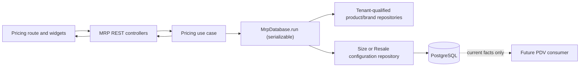

---

## title: Product details pricing tab
status: in_progress
revision: 1
source:
  type: issue
  ref: [https://github.com/rafinel/scoops/issues/17](https://github.com/rafinel/scoops/issues/17)
scope:
  - documentation/prds/mrp.md
  - documentation/features/mrp/products-details-page-pricing-tab
  - packages/core/src/mrp
  - packages/validation/src
  - apps/server/src/mrp
  - apps/server/src/shared/database/drizzle/migrations
  - apps/server/rest-client/mrp/products.rest
  - apps/web/src
  - apps/web/tests
last_updated_at: 2026-08-23

# 1. Context and scope

## Objective and source

Deliver GitHub Issue [#17](https://github.com/rafinel/scoops/issues/17) as a `complete`
full-stack feature: a Manager can configure the current Portion-size or Resale commercial facts
for one establishment-owned product from `/products/$productId/prices`, and PDV can consume only
active current configuration without MRP rewriting historical orders.

The current route is a Manager-protected, category-gated `Em breve` placeholder. Core already
declares latent `ProductSize` and `ResaleConfiguration` entities and repository ports, but no use
case consumes them; Server supplies both transaction-scope repositories as `undefined as never`
and has no models or REST operations; Web has no pricing query, mutations, widgets, or route suite.

## Scope and product alignment


| Area                  | In scope                                                                                                                          | Out of scope                                                                                       |
| --------------------- | --------------------------------------------------------------------------------------------------------------------------------- | -------------------------------------------------------------------------------------------------- |
| Portion sizes         | Read, add active-by-default, edit, activate/deactivate, remove after confirmation, current optional cost/profit/margin projection | PDV cart assembly, channel modifiers, reporting                                                    |
| Resale — Single stock | One current price and availability configuration; each sale represents one product stock unit                                     | Independently editable packaging quantity                                                          |
| Resale — By brand     | One current row per existing brand; inherited read-only packaging, editable price and availability, no unbranded fallback         | Brand registration/editing and stock balance changes                                               |
| Product page          | Replace the Pricing placeholder, retain the shared header/tabs, category-gate the route                                           | Missing shared-header Edit/Remove actions, Settings, Stock, Recipe and Accompaniments redesign     |
| Commercial boundary   | Publish current active configuration for later PDV consumption and preserve future-only semantics                                 | Product + size + accompaniment prices, cart/order/write-off behavior, order-history implementation |


| Source requirement | Delivery | Notes                                                                                                                   |
| ------------------ | -------- | ----------------------------------------------------------------------------------------------------------------------- |
| `REQ-01`           | partial  | Consumes product category, unit, status, stock-control and establishment facts; product registration remains unchanged. |
| `REQ-02`           | partial  | Consumes current brand name and packaging; brand management remains unchanged.                                          |
| `REQ-05`           | partial  | Completes the existing Pricing product-page surface only.                                                               |
| `REQ-09`           | partial  | Completes Portion sizes and Single/By-brand Resale settings; product + size + accompaniment pricing is deferred.        |
| `REQ-10`           | partial  | Delivers pricing loading/error/empty states and confirmed size removal; other high-impact changes remain outside scope. |
| Issue #17          | full     | Delivers its Portion/Resale, authorization, tenancy, accessibility and validation acceptance.                           |


## Product decisions and assumptions

- `Portion` and `Resale` remain mutually exclusive. The composite Pencil screen `X1avQ` is an
inventory reference for both possible sections, not permission to persist both categories.
- Size names are trimmed, mandatory, at most 120 characters and unique per product without case
sensitivity. Quantity is positive with no more than three decimals. Price is non-negative with
no more than two decimals. New sizes are active.
- The final active size cannot be deactivated. It may be removed after a named destructive
confirmation; the product then remains registered but unavailable to future PDV operations
until another active size exists.
- Single-stock Resale follows Pencil `JwtuK`: price plus availability only; one sale consumes one
product stock unit. By-brand packaging is inherited from the current brand and cannot be edited
in Pricing.
- By-brand Resale may configure a subset of existing brands. An unconfigured or unavailable brand
is excluded from future PDV selection. With no brands, Pricing guides the Manager to Stock; it
does not create a fallback configuration.
- Operating cost is a current optional projection. When no authoritative current unit cost can be
resolved, cost, profit and margin render as `—` with accessible `Indisponível`; the feature does
not invent a financial value. Margin is unavailable when sale price is zero.


# 2. Implementation Contract


## Functional requirements


| ID      | REQ/source coverage           | Required behavior                                                                                                                                                                                                          |
| ------- | ----------------------------- | -------------------------------------------------------------------------------------------------------------------------------------------------------------------------------------------------------------------------- |
| `RF-01` | `REQ-01`, `REQ-05`, Issue #17 | Only an authenticated Manager may read or mutate Pricing, and every read/write is qualified by the actor's establishment, product, category and child ownership.                                                           |
| `RF-02` | `REQ-05`, `REQ-09`            | A Portion Pricing read returns the product and all sizes with unit, current status and optional current operating cost/profit/margin; no write occurs on read.                                                             |
| `RF-03` | `REQ-09`, Issue #17           | A Manager may add an active size or edit its trimmed unique name, positive three-decimal quantity, non-negative two-decimal price and status; invalid input and duplicate names preserve form context.                     |
| `RF-04` | `REQ-09`, `REQ-10`            | Concurrent attempts cannot deactivate the final active size. Confirmed removal may remove any owned size, including the final active size, without changing historical orders.                                             |
| `RF-05` | `REQ-01`, `REQ-09`            | A Single-stock Resale read/save exposes one price and availability configuration, fixed to one product stock unit per future sale and without an editable package field.                                                   |
| `RF-06` | `REQ-02`, `REQ-09`            | A By-brand Resale read exposes every current brand with inherited packaging and optional configuration; saving changes only that owned brand's price/availability and never creates an unbranded fallback.                 |
| `RF-07` | `REQ-10`, Issue #17           | Pricing distinguishes loading, Portion empty, By-brand no-brands, success, read error/retry, validation, pending, mutation error/recovery and disabled/unavailable states without clipping at desktop or narrow viewports. |
| `RF-08` | `REQ-09`, Issue #17           | Mutations refresh authoritative current Pricing and affect future PDV eligibility only; MRP does not update orders, order lines, cart state, sales stock write-offs or historical snapshots.                               |


## Acceptance criteria


| ID      | RF coverage      | Requirement               | Given                                                                                     | When                                                                              | Then                                                                                                                                              | Expected evidence                                                            |
| ------- | ---------------- | ------------------------- | ----------------------------------------------------------------------------------------- | --------------------------------------------------------------------------------- | ------------------------------------------------------------------------------------------------------------------------------------------------- | ---------------------------------------------------------------------------- |
| `CA-01` | `RF-01`          | Authorization and tenancy | Anonymous, Operator, foreign Manager and owning Manager fixtures                          | Pricing is read or mutated                                                        | Anonymous is `401`, Operator is `403`, foreign resources are tenant-safe `404`, and only the owning Manager succeeds                              | Core use-case tests, Server controller tests, `MV-01`                        |
| `CA-02` | `RF-02`, `RF-07` | Portion projection states | An owned Portion with zero or several sizes                                               | Pricing loads                                                                     | Empty offers `Adicionar primeiro tamanho`; populated rows show name, unit quantity, optional metrics, price, status and actions                   | Get use-case/controller tests, widget/route tests, `MV-01`                   |
| `CA-03` | `RF-03`          | Add size                  | Valid active Portion and valid form values                                                | Manager confirms Add                                                              | One active size persists, dialog closes, success feedback appears and refreshed values render                                                     | Register use-case/controller tests, dialog and route tests, `MV-01`          |
| `CA-04` | `RF-03`, `RF-07` | Validation retention      | Blank/duplicate/overlong name, invalid precision, non-positive quantity or negative price | Manager submits                                                                   | Field-level accessible errors render, entered values remain, dialog stays open and no record changes                                              | Validation boundary, use-case/controller tests, dialog/route tests           |
| `CA-05` | `RF-03`, `RF-04` | Edit and status           | An owned size and at least two active sizes                                               | Manager edits fields or status                                                    | Persisted row and refreshed view match the request; pending prevents duplicate submit                                                             | Update use-case/controller tests, widget/route tests, `MV-01`                |
| `CA-06` | `RF-04`          | Final-active protection   | Exactly one active size                                                                   | Manager deactivates it, including concurrently                                    | The operation returns `409`, the size remains active and retry does not create partial state                                                      | Update use-case concurrency tests and Server integration test                |
| `CA-07` | `RF-04`, `RF-08` | Confirmed removal         | Any owned size, including the final active size                                           | Manager opens, cancels, then confirms removal                                     | Cancel changes nothing; confirm removes only that size, refreshes Pricing and may make the Portion unavailable for future PDV                     | Remove use-case/controller tests, removal widget/route tests, `MV-01`        |
| `CA-08` | `RF-05`, `RF-07` | Single-stock Resale       | An owned Single-stock Resale                                                              | Manager saves price/availability                                                  | One configuration is upserted; UI has no package field and explains one stock unit per sale                                                       | Save/read Core and controller tests, JwtuK comparison, route tests, `MV-02`  |
| `CA-09` | `RF-06`, `RF-07` | By-brand Resale           | Owned By-brand Resale with zero or several brands                                         | Pricing loads or a row is saved                                                   | No-brands guidance is distinct; each brand shows inherited package facts; price/availability persist only for that brand                          | Save/read Core and controller tests, widget/route tests, `MV-02`             |
| `CA-10` | `RF-07`          | Failure and recovery      | Pricing read or mutation fails                                                            | Manager retries                                                                   | Read recovery replaces the error state; mutation error preserves fields/row state and enables safe retry                                          | Widget and route stateful-mock tests, `MV-01`, `MV-02`                       |
| `CA-11` | `RF-07`          | Responsive accessibility  | Desktop and 390×844 viewport                                                              | Manager uses keyboard through tab, dialogs, switches and destructive confirmation | Controls have roles/names, focus enters and returns from dialogs, errors are announced, tables/cards do not clip, and reduced motion is respected | Widget/route tests and `MV-01`/`MV-02` screenshots                           |
| `CA-12` | `RF-08`          | Future-only boundary      | Existing historical PDV order fixtures plus current Pricing                               | Prices/statuses change                                                            | No MRP operation writes PDV tables or events; current projection changes while historical fixture values remain unchanged                         | Dependency audit, Server integration assertion and `MV-02` persistence check |


## Cross-cutting restrictions


| Concern        | Contract                                                                                                                                                                |
| -------------- | ----------------------------------------------------------------------------------------------------------------------------------------------------------------------- |
| Authorization  | Web visibility is usability only; Core repeats Manager authorization and tenant-qualified ownership checks.                                                             |
| Consistency    | Size status checks and writes run in one serializable `MrpDatabase.run`; Server retries one serialization/deadlock conflict and translates a remaining conflict safely. |
| Money/quantity | Runtime and database precision agree: quantity `numeric(18,3)`, price `numeric(18,2)`; JSON uses finite JavaScript numbers at the REST boundary.                        |
| History        | No Pricing use case imports PDV repositories, models or use cases and no pricing mutation publishes an order-history-changing event.                                    |
| Secrets        | All operations use the current session; no database/provider credential enters Web or payloads.                                                                         |


## Design Contract

The implementation uses [design/manifest.md](./design/manifest.md). Required comparisons are
Pencil `X1avQ`, `yX4RY`, corrected edit node `hqaUm`, removal node `uQYUR`, and Single-stock
Resale node `JwtuK`. Desktop is the saved reference size; `390×844` is the required responsive
implementation viewport. On narrow screens, the shared shell remains usable, pricing sections
stack, tables use intentional horizontal overflow where cards cannot replace them, dialogs fit
the viewport with internal scrolling, and primary/destructive actions retain readable labels.

The supplied composite screen is visually authoritative for hierarchy, tokens, rows and controls,
but the category contract is authoritative over its impossible simultaneous Portion+Resale chips.
Loading, read error, Portion empty, By-brand no-brands, validation, pending and mutation-error
screenshots are recommended supplemental coverage and are deferred to transient Playwright
artifacts because their layout follows established repository state components; each is still
mandatory behavioral evidence under `CA-02`, `CA-04`, `CA-06`, `CA-09` and `CA-10`.

# 3. Technical Contract


## Current technical state


| Evidence                                                                           | Current responsibility                           | Gap                                                                                                                         |
| ---------------------------------------------------------------------------------- | ------------------------------------------------ | --------------------------------------------------------------------------------------------------------------------------- |
| `packages/core/src/mrp/domain/entities/product-size.ts`, `resale-configuration.ts` | Latent entity/write shapes                       | Multiple exported types violate current Core Rules; Resale duplicates packaging rather than deriving current brand context. |
| `ProductSizesRepository`, `ResaleConfigurationsRepository`, `MrpDatabaseScope`     | Latent CRUD/transaction contracts                | ID-only methods are not tenant-qualified; no business action or concurrency guarantee consumes them.                        |
| `DrizzleMrpDatabase.run`                                                           | Serializable transaction with one conflict retry | Both pricing repositories are `undefined as never`.                                                                         |
| `apps/web/src/routes/_authenticated/products/$productId/prices.tsx`                | Manager-protected Pricing leaf route             | Renders the generic `Em breve` placeholder through an unrelated Stock read.                                                 |
| `ProductDetailsTabs` and `ProductDetailsPage`                                      | Shared conditional shell                         | Reusable; no pricing slot or commercial state exists.                                                                       |


## Solution and runtime flow

The canonical read is `GET /products/:productId/pricing`. `GetProductPricingUseCase` authorizes
the Manager, resolves the establishment-owned product and selects exactly one mode from category
and stock-control facts. Portion mode projects sizes and optional current cost metrics. Single
Resale projects one optional configuration with package quantity `1`. By-brand Resale left-joins
current product brands to optional configuration so unconfigured brands remain visible to the
Manager but unavailable to PDV.

All writes validate the boundary schema, rebuild the current `ProductActor`, verify the tenant-owned
parent/category and child/brand relationship, and execute the business decision inside
`MrpDatabase.run`. Size deactivation reads the active count and replaces the row within the same
serializable transaction; zero-after-update raises `ConflictError`. Size removal intentionally
does not apply that guard. Resale save is an atomic upsert on `(establishmentId, productId, brandId-or-single)`.




| Boundary      | Producer                      | Consumer                                | Canonical contract                                   | Mapping/guarantees                                                                   | Failure ownership                                                               |
| ------------- | ----------------------------- | --------------------------------------- | ---------------------------------------------------- | ------------------------------------------------------------------------------------ | ------------------------------------------------------------------------------- |
| REST read     | `GetProductPricingController` | Web `MrpService.getProductPricing`      | `ProductPricingDetails`                              | ISO timestamps become `Date`; exactly one mode; nullable projections preserved       | Shared REST translator: `400/401/403/404`                                       |
| Size writes   | Size controllers              | Size use cases/repository               | `RegisterProductSizeInput`, `UpdateProductSizeInput` | Shared Zod precision, tenant/product qualification and refreshed aggregate           | Validation `422`; Core `400/404/409`                                            |
| Resale writes | Save controllers              | `SaveProductResaleConfigurationUseCase` | `SaveProductResaleConfigurationInput`                | PUT upsert; route chooses Single or owned brand, payload cannot choose tenant/brand  | Validation `422`; Core `400/404/409`                                            |
| Persistence   | Core repositories             | Drizzle adapters                        | Domain entities                                      | `numeric` maps to finite numbers; timestamps are UTC `Date`; constraints mirror Core | Adapter translates `23505/23503/23514`; transaction owns serialization conflict |


## packages/core — Domain


| Declaration             | Kind      | Ownership/identity                                 | Contract summary                                                  | Related declarations                         | Consumers                         |
| ----------------------- | --------- | -------------------------------------------------- | ----------------------------------------------------------------- | -------------------------------------------- | --------------------------------- |
| `ProductSize`           | Entity    | MRP, UUID, tenant/product owned                    | Current Portion size configuration                                | `Product`, `ProductSizePricing`              | Size use cases, REST, persistence |
| `ResaleConfiguration`   | Entity    | MRP, UUID, tenant/product and optional brand owned | Current price/availability only                                   | `Product`, optional `Brand`, `ResalePricing` | Resale save/read, persistence     |
| `ProductPricingDetails` | Structure | Identity-free projection                           | Product plus exactly one category/stock-control mode and its rows | `ProductSizePricing`, `ResalePricing`        | REST and Web                      |
| `ProductSizePricing`    | Structure | Identity-free projection                           | Size plus optional current metrics                                | `ProductSize`                                | Pricing table                     |
| `ResalePricing`         | Structure | Identity-free projection                           | Optional saved configuration plus current brand/package context   | `Brand`, `ResaleConfiguration`               | Resale card                       |


| Path                                                                                 | Change | Declaration                                     | Domain role/schema                                        | Invariants/transitions                                                  | Errors/events | Exports/consumers                        |
| ------------------------------------------------------------------------------------ | ------ | ----------------------------------------------- | --------------------------------------------------------- | ----------------------------------------------------------------------- | ------------- | ---------------------------------------- |
| `packages/core/src/mrp/domain/entities/product-size.ts`                              | Modify | `ProductSize` Entity                            | Add `establishmentId`; retain size facts                  | Tenant/product identity immutable; status changes only through use case | No event      | Entity barrel, repositories, projections |
| `packages/core/src/mrp/domain/entities/resale-configuration.ts`                      | Modify | `ResaleConfiguration` Entity                    | Add `establishmentId`; remove persisted `packageQuantity` | `brandId` absent only for Single; price/status are current facts        | No event      | Entity barrel, repositories, projections |
| `packages/core/src/mrp/domain/entities/fakers/product-size-faker.ts`                 | Create | `ProductSizeFaker`                              | Valid `fake`/`fakeMany`                                   | Active default, override last                                           | —             | Faker barrel/tests                       |
| `packages/core/src/mrp/domain/entities/fakers/resale-configuration-faker.ts`         | Create | `ResaleConfigurationFaker`                      | Valid `fake`/`fakeMany`                                   | Available default, override last                                        | —             | Faker barrel/tests                       |
| `packages/core/src/mrp/domain/entities/fakers/index.ts`                              | Modify | Faker exports                                   | Export both fakers                                        | Barrel only                                                             | —             | Core tests                               |
| `packages/core/src/mrp/domain/structures/product-size-create.ts`                     | Create | `ProductSizeCreate` Structure                   | Creation facts including tenant/product                   | Active default assigned by use case                                     | —             | Repository/use case                      |
| `packages/core/src/mrp/domain/structures/product-size-update.ts`                     | Create | `ProductSizeUpdate` Structure                   | Partial editable facts                                    | No identity/ownership fields                                            | —             | Repository/use case                      |
| `packages/core/src/mrp/domain/structures/resale-configuration-create.ts`             | Create | `ResaleConfigurationCreate` Structure           | Upsert creation facts                                     | Optional brand follows stock control                                    | —             | Repository/use case                      |
| `packages/core/src/mrp/domain/structures/resale-configuration-update.ts`             | Create | `ResaleConfigurationUpdate` Structure           | Price/status changes                                      | No ownership fields                                                     | —             | Repository/use case                      |
| `packages/core/src/mrp/domain/structures/register-product-size-input.ts`             | Create | `RegisterProductSizeInput` Structure            | Name/quantity/price                                       | Boundary-valid values; use case normalizes name                         | —             | REST/Web service                         |
| `packages/core/src/mrp/domain/structures/update-product-size-input.ts`               | Create | `UpdateProductSizeInput` Structure              | Name/quantity/price/status                                | Complete edit form input                                                | —             | REST/Web service                         |
| `packages/core/src/mrp/domain/structures/save-product-resale-configuration-input.ts` | Create | `SaveProductResaleConfigurationInput` Structure | Price/status                                              | Route owns Single/brand target                                          | —             | REST/Web service                         |
| `packages/core/src/mrp/domain/structures/product-size-pricing.ts`                    | Create | `ProductSizePricing` Structure                  | Current row projection                                    | Optional metrics share availability                                     | —             | Aggregate/Web                            |
| `packages/core/src/mrp/domain/structures/resale-pricing.ts`                          | Create | `ResalePricing` Structure                       | Current Single/brand row                                  | Package is `1` or current brand package; absent config is unavailable   | —             | Aggregate/Web                            |
| `packages/core/src/mrp/domain/structures/product-pricing-details.ts`                 | Create | `ProductPricingDetails` Structure               | Category-discriminated aggregate                          | Exactly one mode; unrelated row collection empty                        | —             | REST/Web                                 |
| `packages/core/src/mrp/domain/structures/index.ts`                                   | Modify | Structure exports                               | Export all pricing structures                             | Barrel only                                                             | —             | Core/public consumers                    |


```ts
// packages/core/src/mrp/domain/entities/product-size.ts
export type ProductSize = Entity & {
  establishmentId: string
  productId: string
  name: string
  quantity: number
  price: number
  isActive: boolean
  createdAt: Date
  updatedAt: Date
}
```

**Schema —** `ProductSize`


| Field             | Type      | Required | Validation                                        | Description           |
| ----------------- | --------- | -------- | ------------------------------------------------- | --------------------- |
| `id`              | `string`  | Yes      | UUID                                              | Size identity         |
| `establishmentId` | `string`  | Yes      | UUID                                              | Tenant owner          |
| `productId`       | `string`  | Yes      | UUID                                              | Portion owner         |
| `name`            | `string`  | Yes      | trimmed, 1–120, product-unique case-insensitively | Display name          |
| `quantity`        | `number`  | Yes      | finite, positive, ≤3 decimals                     | Product-unit quantity |
| `price`           | `number`  | Yes      | finite, non-negative, ≤2 decimals                 | Current sale price    |
| `isActive`        | `boolean` | Yes      | default `true` at creation                        | Future availability   |
| `createdAt`       | `Date`    | Yes      | valid instant                                     | Creation time         |
| `updatedAt`       | `Date`    | Yes      | valid instant                                     | Last change time      |


```ts
// packages/core/src/mrp/domain/entities/resale-configuration.ts
export type ResaleConfiguration = Entity & {
  establishmentId: string
  productId: string
  brandId?: string
  price: number
  isActive: boolean
  createdAt: Date
  updatedAt: Date
}
```

**Schema —** `ResaleConfiguration`


| Field             | Type      | Required    | Validation                        | Description            |
| ----------------- | --------- | ----------- | --------------------------------- | ---------------------- |
| `id`              | `string`  | Yes         | UUID                              | Configuration identity |
| `establishmentId` | `string`  | Yes         | UUID                              | Tenant owner           |
| `productId`       | `string`  | Yes         | UUID                              | Resale owner           |
| `brandId`         | `string`  | Conditional | UUID; absent only for Single      | Current brand target   |
| `price`           | `number`  | Yes         | finite, non-negative, ≤2 decimals | Current sale price     |
| `isActive`        | `boolean` | Yes         | explicit                          | Future availability    |
| `createdAt`       | `Date`    | Yes         | valid instant                     | Creation time          |
| `updatedAt`       | `Date`    | Yes         | valid instant                     | Last change time       |


```ts
// packages/core/src/mrp/domain/structures/product-size-create.ts
export type ProductSizeCreate = Omit<ProductSize, 'id' | 'createdAt' | 'updatedAt'>
```

**Schema —** `ProductSizeCreate`


| Field             | Type      | Required | Validation                                        | Description           |
| ----------------- | --------- | -------- | ------------------------------------------------- | --------------------- |
| `establishmentId` | `string`  | Yes      | UUID                                              | Tenant owner          |
| `productId`       | `string`  | Yes      | UUID                                              | Portion owner         |
| `name`            | `string`  | Yes      | trimmed, 1–120, product-unique case-insensitively | Display name          |
| `quantity`        | `number`  | Yes      | finite, positive, ≤3 decimals                     | Product-unit quantity |
| `price`           | `number`  | Yes      | finite, non-negative, ≤2 decimals                 | Current sale price    |
| `isActive`        | `boolean` | Yes      | use case supplies `true`                          | Initial availability  |


```ts
// packages/core/src/mrp/domain/structures/product-size-update.ts
export type ProductSizeUpdate = Partial<
  Pick<ProductSize, 'name' | 'quantity' | 'price' | 'isActive'>
>
```

**Schema —** `ProductSizeUpdate`


| Field      | Type      | Required | Validation                                        | Description              |
| ---------- | --------- | -------- | ------------------------------------------------- | ------------------------ |
| `name`     | `string`  | No       | trimmed, 1–120, product-unique case-insensitively | Replacement name         |
| `quantity` | `number`  | No       | finite, positive, ≤3 decimals                     | Replacement quantity     |
| `price`    | `number`  | No       | finite, non-negative, ≤2 decimals                 | Replacement price        |
| `isActive` | `boolean` | No       | final-active guard belongs to use case            | Replacement availability |


```ts
// packages/core/src/mrp/domain/structures/resale-configuration-create.ts
export type ResaleConfigurationCreate = Omit<
  ResaleConfiguration,
  'id' | 'createdAt' | 'updatedAt'
>
```


**Schema —** `ResaleConfigurationCreate`


| Field             | Type      | Required    | Validation                        | Description           |
| ----------------- | --------- | ----------- | --------------------------------- | --------------------- |
| `establishmentId` | `string`  | Yes         | UUID                              | Tenant owner          |
| `productId`       | `string`  | Yes         | UUID                              | Resale owner          |
| `brandId`         | `string`  | Conditional | UUID; absent only for Single      | Optional brand target |
| `price`           | `number`  | Yes         | finite, non-negative, ≤2 decimals | Current sale price    |
| `isActive`        | `boolean` | Yes         | explicit                          | Future availability   |


```ts
// packages/core/src/mrp/domain/structures/resale-configuration-update.ts
export type ResaleConfigurationUpdate = Pick<
  ResaleConfiguration,
  'price' | 'isActive'
>
```

**Schema —** `ResaleConfigurationUpdate`


| Field      | Type      | Required | Validation                        | Description              |
| ---------- | --------- | -------- | --------------------------------- | ------------------------ |
| `price`    | `number`  | Yes      | finite, non-negative, ≤2 decimals | Replacement price        |
| `isActive` | `boolean` | Yes      | explicit                          | Replacement availability |


```ts
// packages/core/src/mrp/domain/structures/register-product-size-input.ts
export type RegisterProductSizeInput = {
  name: string
  quantity: number
  price: number
}
```

**Schema —** `RegisterProductSizeInput`


| Field      | Type     | Required | Validation                        | Description        |
| ---------- | -------- | -------- | --------------------------------- | ------------------ |
| `name`     | `string` | Yes      | trimmed, 1–120                    | Requested name     |
| `quantity` | `number` | Yes      | finite, positive, ≤3 decimals     | Requested quantity |
| `price`    | `number` | Yes      | finite, non-negative, ≤2 decimals | Requested price    |


```ts
// packages/core/src/mrp/domain/structures/update-product-size-input.ts
export type UpdateProductSizeInput = RegisterProductSizeInput & {
  isActive: boolean
}
```

**Schema —** `UpdateProductSizeInput`


| Field      | Type      | Required | Validation                             | Description     |
| ---------- | --------- | -------- | -------------------------------------- | --------------- |
| `name`     | `string`  | Yes      | `RegisterProductSizeInput.name`        | Edited name     |
| `quantity` | `number`  | Yes      | `RegisterProductSizeInput.quantity`    | Edited quantity |
| `price`    | `number`  | Yes      | `RegisterProductSizeInput.price`       | Edited price    |
| `isActive` | `boolean` | Yes      | final-active guard belongs to use case | Edited status   |


```ts
// packages/core/src/mrp/domain/structures/save-product-resale-configuration-input.ts
export type SaveProductResaleConfigurationInput = {
  price: number
  isActive: boolean
}
```

**Schema —** `SaveProductResaleConfigurationInput`


| Field      | Type      | Required | Validation                        | Description               |
| ---------- | --------- | -------- | --------------------------------- | ------------------------- |
| `price`    | `number`  | Yes      | finite, non-negative, ≤2 decimals | Current future-sale price |
| `isActive` | `boolean` | Yes      | explicit                          | Future availability       |


```ts
// packages/core/src/mrp/domain/structures/product-size-pricing.ts
export type ProductSizePricing = {
  size: ProductSize
  operatingCost?: number
  profit?: number
  marginPercentage?: number
}
```

**Schema —** `ProductSizePricing`


| Field              | Type          | Required | Validation                    | Description             |
| ------------------ | ------------- | -------- | ----------------------------- | ----------------------- |
| `size`             | `ProductSize` | Yes      | `ProductSize` schema          | Current configuration   |
| `operatingCost`    | `number`      | No       | finite, non-negative          | Current optional cost   |
| `profit`           | `number`      | No       | finite                        | `price - operatingCost` |
| `marginPercentage` | `number`      | No       | finite; absent for zero price | `profit / price × 100`  |


```ts
// packages/core/src/mrp/domain/structures/resale-pricing.ts
export type ResalePricing = {
  configuration?: ResaleConfiguration
  brand?: Brand
  packageQuantity: number
  price?: number
  isActive: boolean
}
```

**Schema —** `ResalePricing`


| Field             | Type                  | Required    | Validation                                                | Description                    |
| ----------------- | --------------------- | ----------- | --------------------------------------------------------- | ------------------------------ |
| `configuration`   | `ResaleConfiguration` | No          | owned configuration                                       | Absent before first save       |
| `brand`           | `Brand`               | Conditional | required for By-brand                                     | Current brand facts            |
| `packageQuantity` | `number`              | Yes         | `1` for Single; current positive brand quantity otherwise | Read-only sale package context |
| `price`           | `number`              | No          | non-negative, ≤2 decimals                                 | Absent before configuration    |
| `isActive`        | `boolean`             | Yes         | false when unconfigured                                   | Future availability            |


```ts
// packages/core/src/mrp/domain/structures/product-pricing-details.ts
export type ProductPricingDetails = {
  product: Product
  mode: 'portion' | 'resale-single' | 'resale-by-brand'
  sizes: readonly ProductSizePricing[]
  resale: readonly ResalePricing[]
}
```

**Schema —** `ProductPricingDetails`


| Field     | Type                            | Required | Validation                     | Description               |
| --------- | ------------------------------- | -------- | ------------------------------ | ------------------------- |
| `product` | `Product`                       | Yes      | Tenant-owned                   | Header/category authority |
| `mode`    | union                           | Yes      | matches category/stock control | UI mode                   |
| `sizes`   | `readonly ProductSizePricing[]` | Yes      | populated only for Portion     | Size rows                 |
| `resale`  | `readonly ResalePricing[]`      | Yes      | populated only for Resale      | Single/brand rows         |


## packages/core — Use cases


| Use case                                | Actor/trigger | Input/output                                   | Direct collaborators                                   | Consistency boundary              | Failures/side effects                           |
| --------------------------------------- | ------------- | ---------------------------------------------- | ------------------------------------------------------ | --------------------------------- | ----------------------------------------------- |
| `GetProductPricingUseCase`              | Manager       | actor/product → `ProductPricingDetails`        | database scope, product/size/brand/resale/recipe facts | Tenant read in `MrpDatabase.run`  | authorization/category/not-found; no writes     |
| `RegisterProductSizeUseCase`            | Manager       | actor/product/input → `ProductPricingDetails`  | product and size repositories, datetime                | Serial transaction; unique name   | `400/403/404/409`; add only                     |
| `UpdateProductSizeUseCase`              | Manager       | actor/product/size/input → aggregate           | product and size repositories, datetime                | Active count + replace atomically | final-active/duplicate conflict                 |
| `RemoveProductSizeUseCase`              | Manager       | actor/product/size → void                      | product and size repositories                          | Owned remove atomically           | no active-count guard                           |
| `SaveProductResaleConfigurationUseCase` | Manager       | actor/product/optional brand/input → aggregate | product/brand/resale repositories, datetime            | Atomic unique upsert              | category/stock-control/brand/not-found/conflict |


| Path                                                                                       | Change | Declaration/signature                           | Input/output/errors                                  | Authorization/consistency                                       | Side effects/dependencies | Consumers/tests        |
| ------------------------------------------------------------------------------------------ | ------ | ----------------------------------------------- | ---------------------------------------------------- | --------------------------------------------------------------- | ------------------------- | ---------------------- |
| `packages/core/src/mrp/use-cases/get-product-pricing-use-case.ts`                          | Create | `GetProductPricingUseCase.execute`              | actor/product → aggregate; shared expected errors    | Manager, tenant/category, transaction read                      | Current projection only   | GET controller/test    |
| `packages/core/src/mrp/use-cases/register-product-size-use-case.ts`                        | Create | `RegisterProductSizeUseCase.execute`            | actor/product/input → aggregate                      | Manager, Portion, serial unique add                             | datetime + repository add | POST controller/test   |
| `packages/core/src/mrp/use-cases/update-product-size-use-case.ts`                          | Create | `UpdateProductSizeUseCase.execute`              | actor/product/size/input → aggregate                 | Manager, owned child, serial last-active check                  | datetime + replace        | PATCH controller/test  |
| `packages/core/src/mrp/use-cases/remove-product-size-use-case.ts`                          | Create | `RemoveProductSizeUseCase.execute`              | actor/product/size → void                            | Manager, owned child; removal allowed for final active          | remove only               | DELETE controller/test |
| `packages/core/src/mrp/use-cases/save-product-resale-configuration-use-case.ts`            | Create | `SaveProductResaleConfigurationUseCase.execute` | actor/product/brand?/input → aggregate               | Manager, Resale, stock-control/brand consistency, serial upsert | datetime + add/replace    | PUT controllers/test   |
| `packages/core/src/mrp/use-cases/index.ts`                                                 | Modify | Use-case exports                                | Export five declarations                             | Barrel only                                                     | —                         | Server                 |
| `packages/core/src/mrp/use-cases/tests/get-product-pricing-use-case.test.ts`               | Create | Get tests                                       | Modes, costs, authorization, tenant/category         | Mocked scope                                                    | No write                  | Core test command      |
| `packages/core/src/mrp/use-cases/tests/register-product-size-use-case.test.ts`             | Create | Register tests                                  | success/validation/duplicate                         | Mocked scope                                                    | add assertion             | Core test command      |
| `packages/core/src/mrp/use-cases/tests/update-product-size-use-case.test.ts`               | Create | Update tests                                    | edits/status/final-active/concurrency                | Mocked scope                                                    | replace/no-write          | Core test command      |
| `packages/core/src/mrp/use-cases/tests/remove-product-size-use-case.test.ts`               | Create | Remove tests                                    | cancellation is UI; owned removal incl. final active | Mocked scope                                                    | remove                    | Core test command      |
| `packages/core/src/mrp/use-cases/tests/save-product-resale-configuration-use-case.test.ts` | Create | Save tests                                      | Single/brand/upsert/no-brand/wrong mode              | Mocked scope                                                    | add/replace               | Core test command      |


## packages/core — Interfaces


| Contract                         | Kind/owner     | Capability                                                         | Implementers                            | Consumers           | Guarantees/failures                                  |
| -------------------------------- | -------------- | ------------------------------------------------------------------ | --------------------------------------- | ------------------- | ---------------------------------------------------- |
| `ProductSizesRepository`         | repository/MRP | Tenant/product-qualified add/find/list/count-active/replace/remove | `DrizzleProductSizesRepository`         | Size use cases      | Atomic adapter operations; missing returns undefined |
| `ResaleConfigurationsRepository` | repository/MRP | Tenant/product/optional-brand find/list/upsert primitives          | `DrizzleResaleConfigurationsRepository` | Read/save use cases | One configuration per resolved target                |
| `MrpService`                     | service/MRP    | Browser-facing Pricing REST operations                             | Web `MrpService` factory                | Pricing hooks       | Preserve `RestResponse` status/body/errors           |


| Path                                                                   | Change | Contract/signature                                                                                                                                    | Capability semantics                        | Guarantees/failures                             | Implementers/consumers             | Exports         |
| ---------------------------------------------------------------------- | ------ | ----------------------------------------------------------------------------------------------------------------------------------------------------- | ------------------------------------------- | ----------------------------------------------- | ---------------------------------- | --------------- |
| `packages/core/src/mrp/interfaces/product-sizes-repository.ts`         | Modify | Tenant-qualified methods plus `countActive(establishmentId, productId)`                                                                               | Persistence capability, not business policy | Exact tenant/product filters                    | Drizzle adapter/all size use cases | Existing barrel |
| `packages/core/src/mrp/interfaces/resale-configurations-repository.ts` | Modify | Tenant-qualified find/list/add/replace                                                                                                                | Single/brand target persistence             | No duplicate target                             | Drizzle adapter/read/save          | Existing barrel |
| `packages/core/src/mrp/interfaces/mrp-service.ts`                      | Modify | `getProductPricing`, `registerProductSize`, `updateProductSize`, `removeProductSize`, `saveSingleResaleConfiguration`, `saveBrandResaleConfiguration` | Typed Web REST service                      | Exact result/error preservation                 | Web factory/hooks                  | Existing barrel |
| `packages/core/src/mrp/interfaces/mrp-database.ts`                     | Modify | Existing pricing repositories                                                                                                                         | Retain scope members with real adapters     | Serial transaction semantics supplied by Server | Use cases/Drizzle database         | Existing barrel |


## packages/validation — Validation


| Schema                                 | Concern/owner | Shape responsibility                    | Composes/derives from         | Boundary consumers | Error/type contract     |
| -------------------------------------- | ------------- | --------------------------------------- | ----------------------------- | ------------------ | ----------------------- |
| `registerProductSizeSchema`            | MRP           | Trimmed name, quantity/price precision  | Zod finite-number refinements | POST controller    | inferred register input |
| `updateProductSizeSchema`              | MRP           | Complete edit plus status               | register constraints          | PATCH controller   | inferred update input   |
| `saveProductResaleConfigurationSchema` | MRP           | Price plus availability                 | currency refinement           | PUT controllers    | inferred save input     |
| `productSizeFormSchema`                | Web           | Numeric strings and Portuguese feedback | same limits                   | Add/edit dialog    | RHF values/errors       |
| `resaleConfigurationFormSchema`        | Web           | Currency string and availability        | same limits                   | Resale card        | RHF values/errors       |


| Path | Change | Schema/declaration | Fields/refinements | Composition/ownership | Consumers | Export/tests |
| --- | --- | --- | --- | --- | --- | --- | --- |
| `packages/validation/src/mrp/register-product-size-schema.ts` | Create | `registerProductSizeSchema` | name 1–120; quantity positive ≤3 decimals; price non-negative ≤2 | Syntactic only | Server | Root export; consumer tests |
| `packages/validation/src/mrp/update-product-size-schema.ts` | Create | `updateProductSizeSchema` | register fields + boolean `isActive` | Syntactic only | Server | Root export; consumer tests |
| `packages/validation/src/mrp/save-product-resale-configuration-schema.ts` | Create | `saveProductResaleConfigurationSchema` | price non-negative ≤2; boolean `isActive` | No category/tenant rules | Server | Root export; consumer tests |
| `packages/validation/src/web/product-size-form-schema.ts` | Create | `productSizeFormSchema` | add/edit discriminant; localized numeric-string errors | Web form only | Size dialog | Root export; widget tests |
| `packages/validation/src/web/resale-configuration-form-schema.ts` | Create | `resaleConfigurationFormSchema` | localized price string/status | Web form only | Resale card | Root export; widget tests |
| `packages/validation/src/index.ts` | Modify | Public exports | Export five schemas | Root barrel only | Web/Server | Package checks |

## apps/server — Database


| Persistence capability | Domain owner            | Core contract                    | Models/types                                             | Mapper                             | Repository/transaction owner                                  |
| ---------------------- | ----------------------- | -------------------------------- | -------------------------------------------------------- | ---------------------------------- | ------------------------------------------------------------- |
| Portion sizes          | MRP/ProductSize         | `ProductSizesRepository`         | `productSizeModel`, `DrizzleProductSize`                 | `DrizzleProductSizeMapper`         | `DrizzleProductSizesRepository`, `DrizzleMrpDatabase`         |
| Resale settings        | MRP/ResaleConfiguration | `ResaleConfigurationsRepository` | `resaleConfigurationModel`, `DrizzleResaleConfiguration` | `DrizzleResaleConfigurationMapper` | `DrizzleResaleConfigurationsRepository`, `DrizzleMrpDatabase` |


| Path | Change | Declaration/operation | Schema/mapping | Integrity/query contract | Migration/transaction | Registration/consumers |
| --- | --- | --- | --- | --- | --- | --- | --- |
| `apps/server/src/mrp/database/drizzle/models/product-size-model.ts` | Create | `productSizeModel` | Tenant/product/name/numeric/status/timestamps | Tenant-product index, lower-name unique, quantity/price checks | Migration 0010 | Schema barrel/repository |
| `apps/server/src/mrp/database/drizzle/models/resale-configuration-model.ts` | Create | `resaleConfigurationModel` | Tenant/product/optional brand/price/status/timestamps | Partial Single unique + brand unique; price check | Migration 0010 | Schema barrel/repository |
| `apps/server/src/mrp/database/drizzle/models/index.ts` | Modify | Model exports | Export both models | Shared schema input | Generates migration | Drizzle tooling |
| `apps/server/src/mrp/database/drizzle/types/entities/product-size.ts` | Create | `DrizzleProductSize` | Infer select model | Persistence-only | — | Mapper |
| `apps/server/src/mrp/database/drizzle/types/entities/resale-configuration.ts` | Create | `DrizzleResaleConfiguration` | Infer select model | Persistence-only | — | Mapper |
| `apps/server/src/mrp/database/drizzle/types/entities/index.ts` | Modify | Type exports | Export both | Barrel only | — | Mappers |
| `apps/server/src/mrp/database/drizzle/types/index.ts` | Modify | Type exports | Re-export entity types | Barrel only | — | Database layer |
| `apps/server/src/mrp/database/drizzle/mappers/drizzle-product-size-mapper.ts` | Create | `DrizzleProductSizeMapper.toDomain` | numeric strings → numbers | No business rules | — | Repository |
| `apps/server/src/mrp/database/drizzle/mappers/drizzle-resale-configuration-mapper.ts` | Create | `DrizzleResaleConfigurationMapper.toDomain` | null brand → undefined; numeric → number | No business rules | — | Repository |
| `apps/server/src/mrp/database/drizzle/repositories/drizzle-product-sizes-repository.ts` | Create | `DrizzleProductSizesRepository` | Core port mapping | Every query tenant/product-qualified; active count | Uses injected transaction | Database module/use cases |
| `apps/server/src/mrp/database/drizzle/repositories/drizzle-resale-configurations-repository.ts` | Create | `DrizzleResaleConfigurationsRepository` | Core port mapping | Exact Single/brand target; translate constraints | Uses injected transaction | Database module/use cases |
| `apps/server/src/mrp/database/drizzle/repositories/index.ts` | Modify | Adapter exports | Export both repositories | Barrel only | — | Modules/database |
| `apps/server/src/mrp/database/drizzle/repositories/drizzle-mrp-database.ts` | Modify | Transaction scope | Replace both `undefined as never` values | Serial transaction and one retry retained | Atomic use-case scope | Core use cases |
| `apps/server/src/mrp/database/mrp-database.module.ts` | Modify | Providers/tokens | Register adapters and `useExisting` tokens; export tokens | Singleton module wiring | — | Controllers/database scope |
| `apps/server/src/mrp/fixtures/mrp-module-fixture.ts` | Modify | Pricing helpers/repos | Seed/read current sizes/configs | Real tenant fixtures | Testcontainer transaction | Controller tests |
| `apps/server/src/shared/database/drizzle/migrations/0010_product_pricing.sql` | Generate | Tables/indexes/constraints | Generated from model barrel | Must match tables below | `db:migration:generate -- --name product_pricing` | Apply before dependent code |
| `apps/server/src/shared/database/drizzle/migrations/meta/0010_snapshot.json` | Generate | Drizzle snapshot | Generated from model inputs | Do not hand-edit | Same command | Drizzle journal |
| `apps/server/src/shared/database/drizzle/migrations/meta/_journal.json` | Generate | Journal entry 10 | `0010_product_pricing` | Ordered after 0009 | Same command | Migration runner |

### Table — `mrp_product_sizes`

**Columns**


| Column             | Type            | Nullable | Default | Description                                 |
| ------------------ | --------------- | -------- | ------- | ------------------------------------------- |
| `id`               | `uuid`          | No       | —       | Primary identity                            |
| `establishment_id` | `uuid`          | No       | —       | Tenant qualifier                            |
| `product_id`       | `uuid`          | No       | —       | Owning product, cascade on product deletion |
| `name`             | `text`          | No       | —       | Trimmed display name                        |
| `quantity`         | `numeric(18,3)` | No       | —       | Product-unit quantity                       |
| `price`            | `numeric(18,2)` | No       | —       | Current sale price                          |
| `is_active`        | `boolean`       | No       | `true`  | Future availability                         |
| `created_at`       | `timestamptz`   | No       | —       | Creation instant                            |
| `updated_at`       | `timestamptz`   | No       | —       | Last change instant                         |


**Indexes**


| Index name                                    | Columns                                     | Type   | Purpose                             |
| --------------------------------------------- | ------------------------------------------- | ------ | ----------------------------------- |
| `mrp_product_sizes_establishment_product_idx` | `establishment_id, product_id`              | index  | Tenant-qualified list/count         |
| `mrp_product_sizes_product_name_unique`       | `establishment_id, product_id, lower(name)` | unique | Case-insensitive product-local name |


**Constraints**


| Constraint                             | Type        | Definition                                       | Purpose                 |
| -------------------------------------- | ----------- | ------------------------------------------------ | ----------------------- |
| Product FK                             | foreign key | `product_id → mrp_products.id ON DELETE CASCADE` | Product-owned lifecycle |
| `mrp_product_sizes_quantity_positive`  | check       | `quantity > 0`                                   | Valid quantity          |
| `mrp_product_sizes_price_non_negative` | check       | `price >= 0`                                     | Valid price             |


### Table — `mrp_resale_configurations`

**Columns**


| Column             | Type            | Nullable | Default | Description                                                      |
| ------------------ | --------------- | -------- | ------- | ---------------------------------------------------------------- |
| `id`               | `uuid`          | No       | —       | Configuration identity                                           |
| `establishment_id` | `uuid`          | No       | —       | Tenant qualifier                                                 |
| `product_id`       | `uuid`          | No       | —       | Resale owner, cascade on product deletion                        |
| `brand_id`         | `uuid`          | Yes      | —       | By-brand target; null only for Single, cascade on brand deletion |
| `price`            | `numeric(18,2)` | No       | —       | Current sale price                                               |
| `is_active`        | `boolean`       | No       | `false` | Future availability                                              |
| `created_at`       | `timestamptz`   | No       | —       | Creation instant                                                 |
| `updated_at`       | `timestamptz`   | No       | —       | Last change instant                                              |


**Indexes**


| Index name                                            | Columns                                                             | Type           | Purpose                         |
| ----------------------------------------------------- | ------------------------------------------------------------------- | -------------- | ------------------------------- |
| `mrp_resale_configurations_establishment_product_idx` | `establishment_id, product_id`                                      | index          | Tenant-qualified aggregate read |
| `mrp_resale_configurations_single_unique`             | `establishment_id, product_id WHERE brand_id IS NULL`               | partial unique | One Single configuration        |
| `mrp_resale_configurations_brand_unique`              | `establishment_id, product_id, brand_id WHERE brand_id IS NOT NULL` | partial unique | One configuration per brand     |


**Constraints**


| Constraint                                     | Type        | Definition                                           | Purpose                                        |
| ---------------------------------------------- | ----------- | ---------------------------------------------------- | ---------------------------------------------- |
| Product FK                                     | foreign key | `product_id → mrp_products.id ON DELETE CASCADE`     | Product-owned lifecycle                        |
| Brand FK                                       | foreign key | `brand_id → mrp_product_brands.id ON DELETE CASCADE` | Remove disclosed brand-dependent configuration |
| `mrp_resale_configurations_price_non_negative` | check       | `price >= 0`                                         | Valid price                                    |


**Cross-database notes:** PostgreSQL partial/expression indexes are intentional and already match
the repository's PostgreSQL/Drizzle architecture. No cross-database fallback is required.

**Migration delivery:** Generate exactly migration 0010 after both models are exported, review the
generated SQL/snapshot/journal together, apply before Server code, and verify empty-table rollout.
No backfill is required because current production paths have no persisted pricing rows. The
migration may run transactionally and must not alter product, brand or PDV tables.

## apps/server — REST and Composition


| Operation                                                       | Server entry                                     | Core action/contract         | Web consumer                    | Security/tenant source                | Compatibility/error owner        |
| --------------------------------------------------------------- | ------------------------------------------------ | ---------------------------- | ------------------------------- | ------------------------------------- | -------------------------------- |
| `GET /products/:productId/pricing`                              | `GetProductPricingController.handle`             | `GetProductPricingUseCase`   | `getProductPricing`             | session Manager + actor establishment | Controller/DTO/shared translator |
| `POST /products/:productId/sizes`                               | `RegisterProductSizeController.handle`           | `RegisterProductSizeUseCase` | `registerProductSize`           | same                                  | shared schema/translator         |
| `PATCH /products/:productId/sizes/:sizeId`                      | `UpdateProductSizeController.handle`             | `UpdateProductSizeUseCase`   | `updateProductSize`             | same + owned size                     | shared schema/translator         |
| `DELETE /products/:productId/sizes/:sizeId`                     | `RemoveProductSizeController.handle`             | `RemoveProductSizeUseCase`   | `removeProductSize`             | same + owned size                     | shared translator                |
| `PUT /products/:productId/resale-configuration`                 | `SaveSingleResaleConfigurationController.handle` | save resale use case         | `saveSingleResaleConfiguration` | same + Single mode                    | shared schema/translator         |
| `PUT /products/:productId/brands/:brandId/resale-configuration` | `SaveBrandResaleConfigurationController.handle`  | save resale use case         | `saveBrandResaleConfiguration`  | same + owned brand                    | shared schema/translator         |


| Path | Change | Declaration/operation | Boundary/security | Request/response/errors | Effects/consumers | Registration/examples |
| --- | --- | --- | --- | --- | --- | --- | --- |
| `apps/server/src/mrp/rest/dtos/product-pricing-response.dto.ts` | Create | `ProductPricingResponseDto` | Swagger-only response metadata | Aggregate with ISO dates/optional metrics | GET/write responses | DTO barrel |
| `apps/server/src/mrp/rest/dtos/index.ts` | Modify | DTO export | Barrel only | — | Controllers | Existing barrel |
| `apps/server/src/mrp/rest/schemas/product-schemas.ts` | Modify | Compatibility exports | Re-export three MRP schemas | `422` parsing | Controllers | Existing path |
| `apps/server/src/mrp/rest/controllers/get-product-pricing.controller.ts` | Create | `GetProductPricingController` | Manager/current actor/product UUID | `200`, `400/401/403/404` | Read use case | Controller barrel/module |
| `apps/server/src/mrp/rest/controllers/register-product-size.controller.ts` | Create | `RegisterProductSizeController` | Manager/current actor/product UUID/schema | `201`, `400/401/403/404/409/422` | Register use case | Barrel/module |
| `apps/server/src/mrp/rest/controllers/update-product-size.controller.ts` | Create | `UpdateProductSizeController` | Manager/current actor/semantic UUIDs/schema | `200`, expected errors | Update use case | Barrel/module |
| `apps/server/src/mrp/rest/controllers/remove-product-size.controller.ts` | Create | `RemoveProductSizeController` | Manager/current actor/semantic UUIDs | `204`, expected errors | Remove use case | Barrel/module |
| `apps/server/src/mrp/rest/controllers/save-single-resale-configuration.controller.ts` | Create | Single PUT controller | Manager/current actor/product/schema | `200`, expected errors | Save use case without brand | Barrel/module |
| `apps/server/src/mrp/rest/controllers/save-brand-resale-configuration.controller.ts` | Create | Brand PUT controller | Manager/current actor/product+brand/schema | `200`, expected errors | Save use case with brand | Barrel/module |
| `apps/server/src/mrp/rest/controllers/index.ts` | Modify | Controller exports | Export six controllers | — | Module | Existing barrel |
| `apps/server/src/mrp/mrp.module.ts` | Modify | `MrpModule` | Register six controllers | Bootstrap deterministic | REST runtime | App module already imports MRP |
| `apps/server/rest-client/mrp/products.rest` | Modify | Pricing examples | Current bearer/session variables | All six operations and error examples | Manual inspection | REST client |

Each controller has an exact mirrored test under
`apps/server/src/mrp/rest/controllers/tests/`: `get-product-pricing.controller.test.ts`,
`register-product-size.controller.test.ts`, `update-product-size.controller.test.ts`,
`remove-product-size.controller.test.ts`, `save-single-resale-configuration.controller.test.ts`,
and `save-brand-resale-configuration.controller.test.ts`.

## apps/web — UI and REST


| Widget                      | Kind      | Parent/entry         | Direct children                                                          | Public contract                          | Behavior owner                 |
| --------------------------- | --------- | -------------------- | ------------------------------------------------------------------------ | ---------------------------------------- | ------------------------------ |
| `ProductPricingSlot`        | Page      | Pricing route        | loading, error, `ProductSizesCard`, `ProductResaleSettingsCard`, dialogs | `productId`                              | `useProductPricingSlot`        |
| `ProductSizesCard`          | Component | `ProductPricingSlot` | `ProductSizesTable`, `ProductSizesEmptyState`                            | aggregate rows and actions               | pure renderer                  |
| `ProductSizesTable`         | Component | `ProductSizesCard`   | —                                                                        | rows/edit/remove callbacks               | pure renderer                  |
| `ProductSizeDialog`         | Component | `ProductPricingSlot` | —                                                                        | add/edit mode, initial values, callbacks | `useProductSizeDialog`         |
| `RemoveProductSizeDialog`   | Component | `ProductPricingSlot` | —                                                                        | named size, confirm/cancel               | `useRemoveProductSizeDialog`   |
| `ProductResaleSettingsCard` | Component | `ProductPricingSlot` | —                                                                        | Single or brand rows                     | `useProductResaleSettingsCard` |


### Allowed UI tree

```text
apps/web/src/ui/mrp/widgets/slots/product-pricing-slot/
├── index.tsx
├── use-product-pricing-slot.ts
├── use-product-pricing-slot.test.ts
├── product-pricing-slot.test.tsx
├── product-pricing-loading/index.tsx
├── product-pricing-error/index.tsx
├── product-sizes-card/index.tsx
├── product-sizes-card/product-sizes-table/index.tsx
├── product-sizes-card/product-sizes-empty-state/index.tsx
├── product-size-dialog/index.tsx
├── product-size-dialog/use-product-size-dialog.ts
├── product-size-dialog/product-size-dialog.test.tsx
├── remove-product-size-dialog/index.tsx
├── remove-product-size-dialog/use-remove-product-size-dialog.ts
├── remove-product-size-dialog/remove-product-size-dialog.test.tsx
├── product-resale-settings-card/index.tsx
├── product-resale-settings-card/use-product-resale-settings-card.ts
└── product-resale-settings-card/product-resale-settings-card.test.tsx
```


| Path                                                                                                                      | Change | Declaration/surface         | Widget/role         | State/actions contract                           | Async/failure contract                    | Design/responsive/accessibility             | Dependencies/tests                  |
| ------------------------------------------------------------------------------------------------------------------------- | ------ | --------------------------- | ------------------- | ------------------------------------------------ | ----------------------------------------- | ------------------------------------------- | ----------------------------------- |
| `apps/web/src/routes/_authenticated/products/$productId/prices.tsx`                                                       | Modify | `ProductPricesRoute`        | Thin route          | Pass product ID only                             | Slot owns data                            | Existing protected route                    | Route suite                         |
| `apps/web/src/rest/services/mrp-service.ts`                                                                               | Modify | Six pricing methods/mappers | REST adapter        | Exact operations above                           | Preserve failed `RestResponse`; map dates | No UI                                       | Route coverage; no new service test |
| `apps/web/src/ui/mrp/hooks/mrp-query-keys.ts`                                                                             | Modify | Pricing key                 | cache declaration   | Product-specific key                             | —                                         | —                                           | Query/actions                       |
| `apps/web/src/ui/mrp/hooks/use-product-pricing-query.ts`                                                                  | Create | query hook                  | non-widget          | Calls get method                                 | loading/error/no retry                    | SSR-safe                                    | Slot/route tests                    |
| `apps/web/src/ui/mrp/hooks/use-register-product-size-action.ts`                                                           | Create | action hook                 | non-widget          | POST + invalidate pricing                        | pending/error/success                     | —                                           | Slot/dialog/route                   |
| `apps/web/src/ui/mrp/hooks/use-update-product-size-action.ts`                                                             | Create | action hook                 | non-widget          | PATCH + invalidate                               | pending/error/success                     | —                                           | Slot/dialog/route                   |
| `apps/web/src/ui/mrp/hooks/use-remove-product-size-action.ts`                                                             | Create | action hook                 | non-widget          | DELETE + invalidate                              | pending/error/success                     | —                                           | Slot/removal/route                  |
| `apps/web/src/ui/mrp/hooks/use-save-product-resale-configuration-action.ts`                                               | Create | action hook                 | non-widget          | Selects Single/brand service method + invalidate | per-row pending/error/success             | —                                           | Resale/route                        |
| `apps/web/src/ui/mrp/widgets/slots/product-pricing-slot/index.tsx`                                                        | Create | `ProductPricingSlot`        | Page                | Render one mode and dialogs                      | Explicit load/error/recovery              | Manifest/tokens/narrow layout               | Slot tests                          |
| `apps/web/src/ui/mrp/widgets/slots/product-pricing-slot/use-product-pricing-slot.ts`                                      | Create | owning hook                 | non-widget          | Dialog selection, action handlers, feedback      | Preserve mutation context                 | Focus-return targets                        | Hook/route tests                    |
| `apps/web/src/ui/mrp/widgets/slots/product-pricing-slot/product-pricing-loading/index.tsx`                                | Create | loading component           | Component           | `aria-busy` skeleton                             | read pending                              | reduced motion                              | Slot tests                          |
| `apps/web/src/ui/mrp/widgets/slots/product-pricing-slot/product-pricing-error/index.tsx`                                  | Create | error component             | Component           | visible retry                                    | read failure/recovery                     | `role=alert`                                | Slot tests                          |
| `apps/web/src/ui/mrp/widgets/slots/product-pricing-slot/product-sizes-card/index.tsx`                                     | Create | `ProductSizesCard`          | Component           | heading/count/add/table/empty                    | callbacks only                            | X1avQ, responsive card                      | Slot tests                          |
| `apps/web/src/ui/mrp/widgets/slots/product-pricing-slot/product-sizes-card/product-sizes-table/index.tsx`                 | Create | `ProductSizesTable`         | Component           | rows/status/actions/metric unavailable           | pure                                      | semantic table; narrow overflow             | Slot tests                          |
| `apps/web/src/ui/mrp/widgets/slots/product-pricing-slot/product-sizes-card/product-sizes-empty-state/index.tsx`           | Create | `ProductSizesEmptyState`    | Component           | first-size CTA                                   | pure                                      | accessible guidance                         | Slot tests                          |
| `apps/web/src/ui/mrp/widgets/slots/product-pricing-slot/product-size-dialog/index.tsx`                                    | Create | `ProductSizeDialog`         | Component           | Add/edit form and Active switch in edit          | pending/error/retention                   | yX4RY/hqaUm; focus trap/return              | Dialog test                         |
| `apps/web/src/ui/mrp/widgets/slots/product-pricing-slot/product-size-dialog/use-product-size-dialog.ts`                   | Create | owning form hook            | non-widget          | RHF/Zod/default/reset/submit                     | prevents duplicate submit                 | error descriptions                          | Dialog test                         |
| `apps/web/src/ui/mrp/widgets/slots/product-pricing-slot/remove-product-size-dialog/index.tsx`                             | Create | `RemoveProductSizeDialog`   | Component           | named warning/cancel/remove                      | pending/error/retention                   | uQYUR; focus return                         | Removal test                        |
| `apps/web/src/ui/mrp/widgets/slots/product-pricing-slot/remove-product-size-dialog/use-remove-product-size-dialog.ts`     | Create | behavior hook               | non-widget          | confirm/cancel                                   | failed confirm stays open                 | focus ownership                             | Removal test                        |
| `apps/web/src/ui/mrp/widgets/slots/product-pricing-slot/product-resale-settings-card/index.tsx`                           | Create | `ProductResaleSettingsCard` | Component           | Single or brand rows; package read-only          | row save feedback                         | X1avQ/JwtuK; labeled switches               | Resale test                         |
| `apps/web/src/ui/mrp/widgets/slots/product-pricing-slot/product-resale-settings-card/use-product-resale-settings-card.ts` | Create | form/action hook            | non-widget          | per-target RHF forms and blur/save coordination  | per-row pending/error; no lost edits      | keyboard and error announcements            | Resale test                         |
| `apps/web/tests/fixtures/mrp-module-fixture.ts`                                                                           | Modify | Stateful pricing handlers   | test fixture        | Exact request capture and refreshed GET          | configurable failures/deferred responses  | —                                           | Route suite                         |
| `apps/web/tests/routes/mrp/products.$productId.prices.test.ts`                                                            | Create | Pricing route suite         | browser integration | Full category/state/action matrix                | Stateful mocked transport                 | desktop/narrow/keyboard/screenshots/console | Playwright CLI                      |
| `apps/web/tests/routes/mrp/products.$productId.placeholders.test.ts`                                                      | Modify | Placeholder suite           | route test          | Remove Pricing placeholder case                  | Retain other placeholders                 | —                                           | Playwright                          |


### Prohibited implementation paths

- Do not create pricing widgets under a generic `components/` directory or move behavior into the
route, shared layout, `ProductDetailsPage`, `ProductDetailsTabs` or REST adapter.
- Do not manually edit `apps/web/src/routeTree.gen.ts`; regenerate it and expect no semantic route
change.
- Do not add a dedicated pricing service test or dedicated query/action-hook tests; prove transport
through the consuming widgets and route suite.
- Do not import Server/Drizzle/PDV implementation types into Core or Web, and do not add PDV writes,
events or current-configuration reads to historical order rendering.


## Composition


| Composition boundary | Kind/scope         | Imports/dependencies                   | Provides/exports           | Consumers                  | Lifecycle/order        |
| -------------------- | ------------------ | -------------------------------------- | -------------------------- | -------------------------- | ---------------------- |
| Core barrels         | public exports     | New entities/structures/use cases      | Existing package subpaths  | Server/Web/Validation      | Source-backed compile  |
| `MrpDatabaseModule`  | feature module     | Pricing adapters and tokens            | Core repository tokens     | Controllers/database scope | Singleton bootstrap    |
| `MrpModule`          | feature module     | Six controllers                        | Product pricing REST       | App root                   | After database module  |
| Web REST context     | application root   | Extended existing `MrpService` factory | Same `mrpService` instance | Pricing hooks              | No new provider        |
| Route tree           | generated artifact | Existing prices route                  | Existing URL               | Router                     | `generate-routes` only |


| Path | Change | Declaration | Wiring/configuration | Lifecycle/order | Connected contracts | Generation/consumers |
| --- | --- | --- | --- | --- | --- | --- | --- |
| `packages/core/src/mrp/domain/entities/index.ts` | Modify | Entity exports | Export corrected entities | Compile-time | Domain/REST/Web | Existing subpath |
| `packages/core/src/mrp/domain/structures/index.ts` | Modify | Structure exports | Export pricing inputs/projections | Compile-time | Core/REST/Web | Existing subpath |
| `packages/core/src/mrp/use-cases/index.ts` | Modify | Use-case exports | Export five use cases | Compile-time | Server controllers | Existing subpath |
| `apps/server/src/mrp/database/mrp-database.module.ts` | Modify | Database module | Bind both tokens to adapters | Before controllers | Interfaces/Database | Server module |
| `apps/server/src/mrp/mrp.module.ts` | Modify | Feature module | Register controllers | Bootstrap | REST/Core | App module |
| `apps/web/src/routeTree.gen.ts` | Generate | Route metadata | Derived from unchanged route input | Build-time | Router | `pnpm --filter web generate-routes` |

## Technical Decisions


| Decision           | Chosen approach                                                     | Alternative considered                          | Reason                                                       | Accepted trade-off                                               |
| ------------------ | ------------------------------------------------------------------- | ----------------------------------------------- | ------------------------------------------------------------ | ---------------------------------------------------------------- |
| Pricing read       | One category-discriminated aggregate                                | Separate size/resale reads plus Stock read      | One tenant/category check and one coherent page snapshot     | Aggregate grows when accompaniment pricing is added later        |
| Final-size removal | Allow confirmed removal; block only final-active deactivation       | Block both operations                           | Matches approved PRD/design and permits configuration reset  | Active product can temporarily be unavailable to PDV             |
| Resale packaging   | Single fixed at one stock unit; By-brand derives live package facts | Persist editable packaging in configuration     | Avoids duplicate/stale brand packaging and matches Pencil    | Brand package edits immediately change future commercial context |
| Resale save        | Idempotent PUT upsert per target                                    | Create/update endpoints                         | UI edits one current configuration and safely retries        | Created vs updated is not a separate user action                 |
| Concurrency        | Existing serializable MRP transaction + one retry                   | Optimistic version field or bespoke lock method | Established repository boundary proves last-active invariant | A second serialization conflict surfaces as retryable `409`      |


# 4. Validation Contract


## Testing strategy


### Test file structure


| Test file                                                                                                                   | Test type           | Target                          | Coverage goal                                                                |
| --------------------------------------------------------------------------------------------------------------------------- | ------------------- | ------------------------------- | ---------------------------------------------------------------------------- |
| Five `packages/core/src/mrp/use-cases/tests/*pricing/size/resale*.test.ts` files named above                                | unit                | Five Core actions               | Business branches, authorization, tenant/category, concurrency, calculations |
| Six `apps/server/src/mrp/rest/controllers/tests/*pricing/size/resale*.controller.test.ts` files named above                 | integration         | Six HTTP operations             | Real Nest/Drizzle persistence, security, validation, constraints             |
| `apps/web/src/ui/mrp/widgets/slots/product-pricing-slot/product-pricing-slot.test.tsx`                                      | component           | Page composition                | Loading/error/empty/modes and child wiring                                   |
| `apps/web/src/ui/mrp/widgets/slots/product-pricing-slot/use-product-pricing-slot.test.ts`                                   | hook                | Page controller                 | dialog transitions, success/error recovery, refresh                          |
| `apps/web/src/ui/mrp/widgets/slots/product-pricing-slot/product-size-dialog/product-size-dialog.test.tsx`                   | component           | Add/edit form                   | validation, Active switch, pending, retention                                |
| `apps/web/src/ui/mrp/widgets/slots/product-pricing-slot/remove-product-size-dialog/remove-product-size-dialog.test.tsx`     | component           | Destructive dialog              | open/cancel/confirm/pending/error/focus                                      |
| `apps/web/src/ui/mrp/widgets/slots/product-pricing-slot/product-resale-settings-card/product-resale-settings-card.test.tsx` | component           | Single/brand settings           | packaging ownership, per-row state, no-brands                                |
| `apps/web/tests/routes/mrp/products.$productId.prices.test.ts`                                                              | browser integration | Protected route and mocked HTTP | Full visible/URL/request/response/accessibility matrix                       |


### Test cases by file


| Test file                                            | Test case                                            | Description                                                                 | Assertions                                                                          |
| ---------------------------------------------------- | ---------------------------------------------------- | --------------------------------------------------------------------------- | ----------------------------------------------------------------------------------- |
| `get-product-pricing-use-case.test.ts`               | projects each mode                                   | Portion, Single and By-brand aggregates                                     | Exact mode/rows, unconfigured unavailable, optional metrics, no write               |
| `register-product-size-use-case.test.ts`             | adds valid active size and rejects invalid/duplicate | Register behavior                                                           | Normalized name, active default, tenant/category errors, no write on rejection      |
| `update-product-size-use-case.test.ts`               | edits and guards final active                        | Update plus concurrency                                                     | Exact replace; `ConflictError`; active row retained                                 |
| `remove-product-size-use-case.test.ts`               | removes owned final active size                      | Approved reset                                                              | Exact tenant/product filter; only target removed                                    |
| `save-product-resale-configuration-use-case.test.ts` | upserts Single and brand targets                     | Resale modes                                                                | Fixed Single package projection, live brand package, no fallback, ownership errors  |
| Six controller tests                                 | maps HTTP and persistence                            | Success plus malformed/auth/tenant/category/conflict                        | Method/path/status/body and subsequent repository/GET state                         |
| `product-pricing-slot.test.tsx`                      | renders state matrix                                 | Structural page coverage                                                    | Accessible headings/alerts/CTAs and one mode only                                   |
| `use-product-pricing-slot.test.ts`                   | coordinates actions                                  | Dialog/refresh/toast/recovery                                               | State transitions and no duplicate action                                           |
| `product-size-dialog.test.tsx`                       | validates add/edit                                   | Approved fields and switch                                                  | Values retained, field errors linked, pending disabled, submit payload              |
| `remove-product-size-dialog.test.tsx`                | confirms named removal                               | Cancellation/failure/success                                                | Dialog focus, exact name/warning, stays open on failure                             |
| `product-resale-settings-card.test.tsx`              | edits Single/brand                                   | Mode-specific controls                                                      | No Single package input, brand package read-only, target-specific save/error        |
| `products.$productId.prices.test.ts`                 | exercises route matrix                               | Protected, Portion, Single/brand Resale, errors, mutations, narrow/keyboard | Final URL, exact HTTP, refreshed visible values, screenshots, clean console/network |


## Acceptance coverage


| Acceptance | Automated boundary                                      | Manual scenario  | Evidence target                           |
| ---------- | ------------------------------------------------------- | ---------------- | ----------------------------------------- |
| `CA-01`    | Core + six Server controller tests + route access cases | `MV-01`, `MV-02` | `evaluation.md` authorization/tenancy     |
| `CA-02`    | Get tests + slot/route tests                            | `MV-01`          | Portion desktop/narrow artifacts          |
| `CA-03`    | Register/controller/dialog/route tests                  | `MV-01`          | Add request and persisted row             |
| `CA-04`    | Validation consumers + dialog/controller/route cases    | `MV-01`          | Field-error/retention artifact            |
| `CA-05`    | Update/controller/hook/route tests                      | `MV-01`          | Edit/deactivate artifacts                 |
| `CA-06`    | Core concurrency + Server integration                   | `MV-01`          | `409` and retained active row             |
| `CA-07`    | Remove/controller/dialog/route tests                    | `MV-01`          | Cancel/confirm/persisted absence          |
| `CA-08`    | Save/read/controller/resale/route tests                 | `MV-02`          | JwtuK comparison and persisted Single row |
| `CA-09`    | Save/read/controller/resale/route tests                 | `MV-02`          | By-brand/no-brands artifacts              |
| `CA-10`    | Slot/dialog/resale/stateful route tests                 | `MV-01`, `MV-02` | Recovery artifacts                        |
| `CA-11`    | Widget semantics + narrow/keyboard route cases          | `MV-01`, `MV-02` | Focus/DOM/layout/screenshots              |
| `CA-12`    | Dependency audit + Server persistence assertion         | `MV-02`          | Historical fixture unchanged              |


## Manual scenarios


### `MV-01` — Portion sizes

- **Covers:** `CA-01`–`CA-07`, `CA-10`, `CA-11`.
- **Services:** `docker compose ps`; Supabase `http://127.0.0.1:54321`; Server health at
`http://127.0.0.1:3336`; Web `http://127.0.0.1:4000`. Start Server/Web only when not running.
- **Fixture:** owning Manager, Operator, foreign Manager; active Portion with two active sizes and
one inactive size; second Portion with no sizes.
- **Start:** `/products/<portionId>/prices`, 1560×1178 against `X1avQ.png`, then 390×844.

1. Verify the selected Pricing tab, product identity and populated rows; inspect DOM roles and
  absence of console errors/failed requests.
2. Open Add by keyboard, submit each invalid boundary, verify announced errors and preserved
  values, then submit valid data once while pending.
3. Verify `POST /products/:productId/sizes`, persisted row and refreshed visible values.
4. Open Edit, verify focus and prefilled values/Active switch against `hqaUm.png`; save fields and
  status, then verify PATCH and refreshed state.
5. Attempt to deactivate the final active size and verify visible `409` recovery with persisted
  active state.
6. Open Remove against `uQYUR.png`; cancel and verify unchanged state, reopen/confirm, verify DELETE
  and persisted absence, including final-active removal on the isolated fixture.
7. Load the zero-size product and verify the first-size empty CTA. Repeat the main path at 390×844,
  inspect focus return, clipping/overflow, reduced-motion behavior and fresh screenshots.


### `MV-02` — Resale modes and future-only history

- **Covers:** `CA-01`, `CA-08`–`CA-12`.
- **Services/accounts:** same as `MV-01`.
- **Fixture:** Single-stock Resale; By-brand Resale with configured, unconfigured and unavailable
brands; By-brand Resale without brands; historical PDV order snapshot fixture if the current PDV
implementation exposes one, otherwise the Server table/dependency audit records the boundary.
- **Start:** `/products/<resaleId>/prices`, 1560×1178 against `JwtuK.png` and the Resale section of
`X1avQ.png`, then 390×844.

1. Verify Single mode has price/availability and explanatory one-unit copy but no package input.
2. Change price/availability by keyboard; verify exact Single PUT, persisted result and refreshed UI.
3. Open By-brand mode; verify each current brand/package, no fallback row, disabled styling and
  target-specific price/availability PUT.
4. Force validation and Server failure, verify row context remains, retry, and inspect console and
  failed-request classification.
5. Verify no-brands guidance links to the existing Stock/brand surface.
6. Confirm current availability changes while the historical order fixture/snapshot is unchanged.
7. Repeat at 390×844 and capture fresh desktop/narrow screenshots plus DOM/focus evidence.


## Commands


| Command                                                                                                                                                   | Purpose/coverage                                   |
| --------------------------------------------------------------------------------------------------------------------------------------------------------- | -------------------------------------------------- |
| `pnpm --filter @scoops/core check:code && pnpm --filter @scoops/core check:types && pnpm --filter @scoops/core test`                                      | Core static and use-case contract                  |
| `pnpm --filter @scoops/validation check:code && pnpm --filter @scoops/validation check:types`                                                             | Shared schema contract                             |
| `pnpm --filter server db:migration:generate -- --name product_pricing`                                                                                    | Generate exact migration 0010 inputs/metadata      |
| `pnpm --filter server check:code && pnpm --filter server check:types && pnpm --filter server test && pnpm --filter server build`                          | Server persistence/REST/build                      |
| `pnpm --filter web generate-routes && pnpm --filter web check:code && pnpm --filter web check:types && pnpm --filter web test && pnpm --filter web build` | Web generated/static/widget/build                  |
| `pnpm --filter web exec playwright test 'tests/routes/mrp/products.$productId.prices.test.ts' --workers=1`                                                | Focused mocked route matrix through Playwright CLI |
| `pnpm --filter web test:integration`                                                                                                                      | Repository browser suite                           |


Actual evidence, findings and artifact identifiers are recorded in [evaluation.md](./evaluation.md)
at implementation kickoff.

# 5. Documentation alignment and revision history


| Document                                                                          | Authority for                                     | State     | Required change/confirmation                                                                                          |
| --------------------------------------------------------------------------------- | ------------------------------------------------- | --------- | --------------------------------------------------------------------------------------------------------------------- |
| `AGENTS.md`                                                                       | Tool, Pencil, Playwright and safety workflow      | confirmed | Pencil-only design access and CLI browser validation retained.                                                        |
| `documentation/prds/mrp.md`                                                       | REQ-09 commercial behavior                        | changed   | Approved Single/By-brand packaging, validation/defaults and final-size removal clarified; checkbox remains unchecked. |
| `documentation/prds/pdv.md`                                                       | PDV eligibility/history consumer                  | confirmed | MRP publishes current facts only; PDV cart/order/history behavior remains excluded.                                   |
| `documentation/architecture.md`                                                   | Backend authority, tenancy, transactions, history | confirmed | Tenant-qualified Core actions and serial transaction preserve invariants.                                             |
| `documentation/modules.md`                                                        | MRP/PDV ownership                                 | confirmed | MRP owns current configuration; PDV owns sale operations/history.                                                     |
| `documentation/design.md`                                                         | Tokens, tables, forms, switches, dialogs, states  | confirmed | Saved Pencil nodes use existing Manrope/token/component language.                                                     |
| `documentation/tooling.md`                                                        | Real commands and generated artifacts             | confirmed | pnpm workspace, Drizzle and Playwright CLI commands used.                                                             |
| `documentation/features/mrp/products-details-page-pricing-tab/design/manifest.md` | Saved implementation references                   | changed   | Five valid, visually inspected screenshots map current Pencil nodes.                                                  |


| Rule                                               | Applies to                                         | Evaluated revision |
| -------------------------------------------------- | -------------------------------------------------- | ------------------ |
| `documentation/sdd-rules.md`                       | SDD authority, artifacts and lifecycle             | `395777b`          |
| `documentation/rules/code-conventions-rules.md`    | TypeScript declarations/imports                    | `395777b`          |
| `documentation/rules/core-package-rules.md`        | Entities, structures, interfaces and fakers        | `395777b`          |
| `documentation/rules/use-case-testing-rules.md`    | Five Core action suites                            | `395777b`          |
| `documentation/rules/validation-package-rules.md`  | Shared Zod schemas                                 | `395777b`          |
| `documentation/rules/database-layer-rules.md`      | Models, adapters, migration and transaction wiring | `395777b`          |
| `documentation/rules/rest-layer-rules.md`          | Six REST operation chains                          | `395777b`          |
| `documentation/rules/controllers-testing-rules.md` | Real Server integration tests                      | `395777b`          |
| `documentation/rules/ui-layer-rules.md`            | Pricing Page/widgets/hooks/services                | `395777b`          |
| `documentation/rules/web-app-routing-rules.md`     | Existing Pricing leaf and route suite              | `395777b`          |
| `documentation/rules/widget-testing-rules.md`      | Component/hook/browser boundaries                  | `395777b`          |

| Revision | Date       | Material change                                                            | Reason                                                    |
| -------- | ---------- | -------------------------------------------------------------------------- | --------------------------------------------------------- |
| `1`      | 2026-08-23 | Created complete implementation, design, technical and validation Contract | Issue #17, PRD REQ-09/10 and approved annotated decisions |
