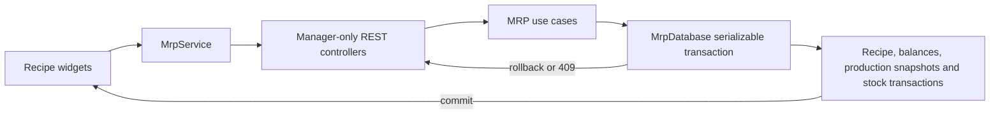

## 1. Context and scope

### Objective and source

This complete Spec implements Issue #13: a Manager can define the single recipe for a
Manufacturable product, understand its current ingredient cost and production capacity, and
record production atomically from the product-details Recipe tab. It depends on the completed
Stock-tab contract in `documentation/features/mrp/products-details-page-stock-tab/spec.md`.

### Current behavior and product gap

`/products/$productId` is Manager-only and renders `ProductStockSlot`; its tab strip contains
only a static Stock label. Core contains unwired Recipe declarations and an incomplete
`RegisterProductionUseCase`, while Server has no Recipe/Production adapters, tables or REST
operations and Web has no Recipe contracts. Single-stock products have no current unit cost,
so COGS cannot currently be computed for every eligible Ingredient.

### Scope and product alignment

| Area | In scope | Out of scope |
| --- | --- | --- |
| Recipe | One recipe per Manufacturable; explicit positive yield; add/edit/remove Ingredient lines; current-source cost, COGS and capacity; empty/loading/error/recovery states | Multiple recipes, fixed recipe brands, Accompaniments as ingredients, automatic unit conversion |
| Production | Manager-only server-authoritative preview and atomic commit; Ingredient consumption; Manufacturable output; immutable production and stock-movement facts | Operator access, production history UI, batches/expiry/waste, notifications or downstream events |
| Single-stock costing | Optional current unit cost at registration and positive entry; required before use as a recipe ingredient; future calculations use the latest explicit value | Weighted-average costing, financial valuation, Product Settings UI in this feature |
| Product details | Recipe tab for Manufacturable products, URL-persisted selected tab, Products navigation active on nested route | Adjacent Accompaniments, Prices and Settings tab implementation; changing completed Stock behavior except shared tabs, cost input and post-production refresh |

| Source requirement | Delivery | Notes |
| --- | --- | --- |
| MRP PRD REQ-01/REQ-03 | partial | Delivers registration and positive-entry cost maintenance; Product Settings cost editing remains for the Settings feature. |
| MRP PRD REQ-05 | partial | Delivers Stock/Recipe tab composition only. |
| MRP PRD REQ-06 | full | Includes the approved empty-recipe lifecycle and Single-stock cost authority. |
| MRP PRD REQ-07 | full | Production is Manager-only by approved amendment. |
| MRP PRD REQ-10 | partial | Covers Recipe/production states, responsive behavior and confirmations. |

### Product decisions and assumptions

- Only `UserProfile.Manager` may read or mutate Recipe and Production operations. Operators
  remain denied by the existing product-details route and Server authorization.
- Opening Recipe never writes. A Manager explicitly saves a positive yield to create the empty
  recipe; ingredient creation stays disabled until save succeeds. Removing the last line keeps
  the Recipe and yield.
- A Single-stock Ingredient uses `Product.currentUnitCost`. Undefined cost blocks selection;
  zero is a valid explicitly supplied cost. The latest value changes future projections only.
- A By-brand Ingredient always resolves the current primary brand at read, preview and commit.
  The design's brand control is source context, not a persisted choice.
- Quantities use each product's base unit and three-decimal precision. Batch mode accepts whole
  positive batches; Quantity mode accepts a positive base-unit quantity to three decimals.

## 2. Implementation Contract

### Functional requirements

| ID | REQ/source coverage | Required behavior |
| --- | --- | --- |
| `RF-01` | REQ-05, Issue #13 | A Manager can select Stock or Recipe on `/products/:productId`; `tab=recipe` is reload/deep-link stable, defaults to Stock, and Recipe appears only for Manufacturable products. |
| `RF-02` | REQ-06 | Recipe read distinguishes absent recipe, saved empty recipe and failure without causing a write; the product shell remains usable during Recipe errors. |
| `RF-03` | REQ-06 | A Manager creates/updates the Recipe through an explicit finite positive yield in the Manufacturable product unit; invalid input remains inline and unsaved. |
| `RF-04` | REQ-01, REQ-03, REQ-06 | Ingredient candidates are active, same-establishment Ingredient products, exclude the Manufacturable itself and existing lines, and require either current Single-stock unit cost or a current primary brand. |
| `RF-05` | REQ-06 | A Manager adds one positive-quantity line, edits only its quantity, and removes it after named confirmation; duplicate/self/foreign/inactive/ineligible lines are rejected server-side. |
| `RF-06` | REQ-06 | Recipe projection returns authoritative product/source identity, quantity/unit, current balance, unit and line cost, COGS share, line capacity, limiting state, total COGS, unit cost and maximum producible quantity. |
| `RF-07` | REQ-01, REQ-03 | Registration and positive stock entry may set a finite non-negative current unit cost for a Single-stock Ingredient; changing it refreshes dependent Recipe projections without rewriting history. |
| `RF-08` | REQ-07 | Produce is enabled only for a saved non-empty Recipe whose sources are resolvable; Batch and Quantity inputs stay synchronized where quantity is an exact yield multiple. |
| `RF-09` | REQ-07 | Production preview is server-authoritative and shows per-line consumption, current/projected balance and shortage plus output current/projected balance and production cost. |
| `RF-10` | REQ-03, REQ-07 | Confirmation re-resolves current brands/costs/balances and atomically persists ingredient debits, output credit, production snapshots and stock-movement facts; any failure leaves no change. |
| `RF-11` | REQ-07 | Insufficient stock blocks only when the affected Ingredient disallows negative stock; no primary brand, missing/inactive source or concurrently changed invalid state blocks commit with retained retry context. |
| `RF-12` | REQ-10, Issue #13 | All states are keyboard operable, focus-visible, responsive at 320 px, use Scoops tokens/primitives, expose table/dialog semantics and announce async outcomes without relying on color alone. |

### Acceptance criteria

| ID | RF coverage | Given | When | Then | Expected evidence |
| --- | --- | --- | --- | --- | --- |
| `CA-01` | RF-01, RF-02 | Manager and products with/without Manufacturable | Route/tab navigation and reload | Recipe visibility, selected semantics, URL and independent read states are correct; foreign/missing product is not disclosed | route/component tests, `MV-01` |
| `CA-02` | RF-02, RF-03 | Manufacturable without Recipe | Recipe opens and invalid/valid yield is saved | GET writes nothing; invalid yield is inline; valid save creates an empty Recipe and refreshes the card | use-case/controller/widget tests, `MV-01` |
| `CA-03` | RF-03, RF-05 | Saved empty Recipe | Add is attempted before/after yield persistence | Add is disabled until save success; zero-line state retains editable yield and Produce stays disabled | widget/route tests, `MV-01` |
| `CA-04` | RF-04 | Candidate catalog contains eligible and ineligible products | Manager searches/selects | Only eligible same-tenant sources are selectable; excluded choices explain cost/main-brand/duplicate rules | use-case/widget tests |
| `CA-05` | RF-05, RF-06 | Saved Recipe | Valid/invalid ingredient is added | Valid line persists once and projection recalculates; invalid, duplicate, self and foreign inputs change nothing | use-case/repository/controller tests, `MV-01` |
| `CA-06` | RF-05, RF-06 | Existing line | Quantity is edited | Identity is immutable, positive quantity persists and metrics recalculate | use-case/widget tests, `MV-01` |
| `CA-07` | RF-05 | Existing/last line | Removal is cancelled/confirmed/fails | Cancel changes nothing; success removes only line and retains Recipe/yield; failure retains dialog context | use-case/widget tests, `MV-01` |
| `CA-08` | RF-06, RF-07 | Single and By-brand lines | cost, primary brand or balance changes | Next read uses current source/cost/balance and limiting capacity; historical production remains unchanged | use-case/repository tests |
| `CA-09` | RF-08, RF-09 | Producible Recipe | Batch/Quantity values change | Positive values synchronize where equivalent and debounced/current preview renders authoritative projections | schema/widget tests, `MV-02` |
| `CA-10` | RF-09, RF-11 | One insufficient Ingredient | Preview runs | Line shows needed/available/missing; Confirm is blocked unless that Ingredient allows negative stock | use-case/widget tests, `MV-02` |
| `CA-11` | RF-10 | Valid current preview | Manager confirms once | One Production, snapshot lines, balance changes and correlated movement facts commit atomically; UI closes and refreshes Recipe and Stock caches | use-case/database/controller/route tests, `MV-02` |
| `CA-12` | RF-10, RF-11 | Stale/concurrent/provider-free commit | Commit conflicts or state changed | Serializable retry revalidates once; unresolved conflict returns 409; business failure leaves all balances and records unchanged and dialog supports retry | use-case/database/controller tests, `MV-02` |
| `CA-13` | RF-07 | Single-stock Ingredient | Manager registers or records positive entry with/without cost | Non-negative cost persists when supplied; negative/non-finite rejects; write-off cannot change cost | schema/use-case/widget tests, `MV-04` |
| `CA-14` | RF-01, RF-10 | Operator or foreign establishment | Any Recipe/Production operation is attempted | Server returns forbidden/not-found without data or mutation; Web route remains access denied | controller/use-case/route tests |
| `CA-15` | RF-12 | Desktop and 320 px, keyboard-only | Recipe/add/edit/remove/produce flows run | Focus order/restoration, accessible names, selected/disabled/error semantics, no page overflow and clean console/network hold | widget tests, `MV-01`–`MV-04` |

### Cross-cutting restrictions

| Concern | Contract |
| --- | --- |
| Tenant/security | Establishment and actor come only from the authenticated account. Every lookup begins with tenant-qualified Product ownership; nested IDs cannot cross tenants. All actions validate Manager in Core and REST. |
| Precision | Persist quantities as `numeric(18,3)` and monetary/unit-cost snapshots as `numeric(18,6)`. Reject values requiring more precision rather than silently exceeding the contract; format currency to two decimals and percentages to two for display. |
| Transactions | Preview is read-only. Commit runs inside `MrpDatabase.run` serializable transaction, re-resolves sources and writes all facts before commit. No broker event is published in this feature. |
| Caching | Recipe mutations invalidate the product Recipe key. Production success invalidates Recipe, product Stock and Stock transactions; failure invalidates nothing. |
| Errors | Boundary syntax is 422; business validation 400; unauthenticated 401; unauthorized 403; hidden/missing tenant resource 404; exhausted serialization conflict 409. |

### Design Contract

The six saved references and implementation-facing inventory are authoritative in
[design/manifest.md](./design/manifest.md). Allowed deviations are limited to runtime units,
read-only main-brand context, authority-driven disabled/validation states and omitted adjacent
tabs. Supplemental loading/error/shortage/narrow/cost-field captures are recommended and are
owned by the `MV-*` evidence rather than prerequisites to implementation.

## 3. Technical Contract

### Current technical state

| Evidence | Current responsibility | Gap |
| --- | --- | --- |
| `packages/core/src/mrp/domain/entities/recipe*.ts` and repository interfaces | Skeleton Recipe vocabulary | No establishment field, projections, actions, adapters or tests; files also contain multiple exported types. |
| `RegisterProductionUseCase` | Calculates and mutates balances, then publishes an event | Trusts caller fields, lacks Manager/time/snapshot/ledger guarantees, cannot preview shortages and publishes after commit with no consumer/outbox. |
| `DrizzleMrpDatabase` | Serializable MRP transaction with one retry | Recipe repositories are `undefined as never`; no Production repositories. |
| `Product` / `Brand` | Product configuration and By-brand package price | No Single-stock cost source. |
| `apps/web/.../product-stock-slot` | Manager-only product Stock screen | Static Stock label, no selected-tab owner or Recipe flow. |

### Solution and runtime flow

The Manager-only route validates `tab`, renders the existing Stock page or new Recipe page,
and uses the existing REST context. Recipe read composes Product, Recipe, eligible current
source, costs and balances. Mutations execute tenant-qualified Core actions. Preview performs
the same source/quantity calculation without writes. Commit repeats the calculation inside a
serializable transaction, updates balances, and stores Production, ProductionIngredient and
correlated StockTransaction snapshots. No external side effect follows commit.



### Boundary contracts

| Boundary | Producer | Consumer | Canonical contract | Guarantees | Failure owner |
| --- | --- | --- | --- | --- | --- |
| Recipe REST | Controllers | Web `MrpService` | `ProductRecipeDetails` and shared input schemas | ISO dates, null Recipe for absence, authoritative projection | Zod pipe/controller translator |
| Preview REST | `PreviewProductionUseCase` | Produce dialog | `ProductionRequest` → `ProductionPreview` | No writes; current sources/balances/costs | Use case |
| Commit REST | `RegisterProductionUseCase` | Produce action | `ProductionRequest` → `Production` | Atomic, tenant-bound, Manager-only, revalidated | Use case/database |
| Persistence | Core repositories | Drizzle adapters | Entities below | numeric conversion, snapshots, constraints, serializable retry | Drizzle adapters/database |

### packages/core — Domain

| Path | Change | Declaration | Contract |
| --- | --- | --- | --- |
| `packages/core/src/mrp/domain/entities/product.ts` | Modify | `Product` | Add optional `currentUnitCost`; include it in create/update types moved to dedicated structure files. |
| `packages/core/src/mrp/domain/entities/recipe.ts` | Modify | `Recipe` | Tenant-owned one-per-product Recipe; entity file exports only `Recipe`. |
| `packages/core/src/mrp/domain/entities/recipe-ingredient.ts` | Modify | `RecipeIngredient` | Tenant-owned unique product line; entity file exports only entity. |
| `packages/core/src/mrp/domain/entities/production.ts` | Create | `Production` | Immutable production header with product/actor/yield/cost snapshots. |
| `packages/core/src/mrp/domain/entities/production-ingredient.ts` | Create | `ProductionIngredient` | Immutable consumed-source snapshot and resulting balance. |
| `packages/core/src/mrp/domain/entities/stock-transaction.ts` | Modify | `StockTransaction` | Add production movement variants and optional `productionId`. |
| `packages/core/src/mrp/domain/events/production-registered-event.ts` | Remove | `ProductionRegisteredEvent` | No consumer exists and the transaction record is authoritative; avoid non-atomic direct publication. |
| `packages/core/src/mrp/domain/structures/product-create.ts` | Create | `ProductCreate` | Product creation vocabulary including optional cost. |
| `packages/core/src/mrp/domain/structures/product-update.ts` | Create | `ProductUpdate` | Product mutable fields including optional cost. |
| `packages/core/src/mrp/domain/structures/recipe-create.ts` | Create | `RecipeCreate` | Tenant/product/yield creation fields. |
| `packages/core/src/mrp/domain/structures/recipe-update.ts` | Create | `RecipeUpdate` | Yield-only changes. |
| `packages/core/src/mrp/domain/structures/recipe-ingredient-create.ts` | Create | `RecipeIngredientCreate` | Tenant/recipe/ingredient/quantity creation fields. |
| `packages/core/src/mrp/domain/structures/recipe-ingredient-update.ts` | Create | `RecipeIngredientUpdate` | Quantity-only changes. |
| `packages/core/src/mrp/domain/structures/product-recipe-details.ts` | Create | `ProductRecipeDetails` | Browser projection with nullable Recipe. |
| `packages/core/src/mrp/domain/structures/recipe-details.ts` | Create | `RecipeDetails` | Recipe aggregate projection. |
| `packages/core/src/mrp/domain/structures/recipe-ingredient-details.ts` | Create | `RecipeIngredientDetails` | Current calculated line projection. |
| `packages/core/src/mrp/domain/structures/save-recipe-yield-input.ts` | Create | `SaveRecipeYieldInput` | Positive yield mutation vocabulary. |
| `packages/core/src/mrp/domain/structures/add-recipe-ingredient-input.ts` | Create | `AddRecipeIngredientInput` | Ingredient identity and positive quantity vocabulary. |
| `packages/core/src/mrp/domain/structures/update-recipe-ingredient-input.ts` | Create | `UpdateRecipeIngredientInput` | Positive quantity-only vocabulary. |
| `packages/core/src/mrp/domain/structures/production-request.ts` | Modify | `ProductionRequest` | Contains only positive `quantity`; actor/product are use-case request context. |
| `packages/core/src/mrp/domain/structures/production-consumption.ts` | Modify | `ProductionConsumption` | Add source snapshots, costs, shortage and negative-stock policy. |
| `packages/core/src/mrp/domain/structures/production-preview.ts` | Modify | `ProductionPreview` | Add output projection, total cost and block reasons. |
| `packages/core/src/mrp/domain/structures/register-product-input.ts` | Modify | `RegisterProductInput` | Add optional current unit cost. |
| `packages/core/src/mrp/domain/structures/adjust-product-stock-input.ts` | Modify | `AdjustProductStockInput` | Add Entry-only optional current unit cost. |
| `packages/core/src/mrp/domain/structures/stock-transaction-type.ts` | Create | `StockTransactionType` | `entry`, `write-off`, `production-consumption`, `production-output`. |
| `packages/core/src/mrp/domain/events/index.ts` | Modify | event barrel | Remove `ProductionRegisteredEvent` export. |
| `packages/core/src/mrp/domain/entities/index.ts` | Modify | entity barrel | Export canonical entities. |
| `packages/core/src/mrp/domain/structures/index.ts` | Modify | structure barrel | Export canonical structures. |

Canonical resulting declarations:

```ts
export type Product = Entity & {
  establishmentId: string; name: string; unit: ProductUnit
  categories: readonly ProductCategory[]; stockControl: ProductStockControl
  status: ProductStatus; allowNegativeStock?: boolean; idealStock?: number
  currentUnitCost?: number; internalNotes?: string; createdAt: Date; updatedAt: Date
}
export type Recipe = Entity & {
  establishmentId: string; productId: string; yieldQuantity: number
  createdAt: Date; updatedAt: Date
}
export type RecipeIngredient = Entity & {
  establishmentId: string; recipeId: string; ingredientProductId: string
  quantity: number; createdAt: Date; updatedAt: Date
}
export type Production = Entity & {
  establishmentId: string; productId: string; productName: string; unit: ProductUnit
  recipeId: string; recipeYield: number; quantity: number; totalCost: number
  performedBy: string; performedByName: string; occurredAt: Date
}
export type ProductionIngredient = Entity & {
  establishmentId: string; productionId: string; ingredientProductId: string
  ingredientProductName: string; ingredientBrandId?: string; ingredientBrandName?: string
  unit: ProductUnit; quantity: number; unitCost: number; lineCost: number
  balanceAfter: number
}
export type ProductionRequest = { readonly quantity: number }
export type ProductionConsumption = {
  readonly ingredientProductId: string; readonly ingredientProductName: string
  readonly ingredientBrandId?: string; readonly ingredientBrandName?: string
  readonly unit: ProductUnit; readonly quantity: number; readonly unitCost: number
  readonly lineCost: number; readonly currentBalance: number
  readonly projectedBalance: number; readonly missingQuantity: number
  readonly allowsNegativeStock: boolean
}
export type ProductionPreview = {
  readonly productId: string; readonly unit: ProductUnit; readonly quantity: number
  readonly recipeYield: number; readonly batches?: number
  readonly consumptions: readonly ProductionConsumption[]; readonly totalCost: number
  readonly currentOutputStock: number; readonly projectedOutputStock: number
  readonly canProduce: boolean; readonly blockReasons: readonly string[]
}
export type ProductRecipeDetails = {
  readonly product: Product; readonly recipe: RecipeDetails | null
}
export type RecipeDetails = {
  readonly id: string; readonly yieldQuantity: number; readonly totalCost: number
  readonly unitCost: number; readonly maximumProducibleQuantity: number
  readonly ingredients: readonly RecipeIngredientDetails[]
}
export type RecipeIngredientDetails = {
  readonly id: string; readonly ingredientProductId: string
  readonly ingredientProductName: string; readonly ingredientBrandId?: string
  readonly ingredientBrandName?: string; readonly unit: ProductUnit
  readonly quantity: number; readonly unitCost: number; readonly lineCost: number
  readonly cogsPercentage: number; readonly currentBalance: number
  readonly capacity: number; readonly isLimiting: boolean
}
export type SaveRecipeYieldInput = { readonly yieldQuantity: number }
export type AddRecipeIngredientInput = {
  readonly ingredientProductId: string; readonly quantity: number
}
export type UpdateRecipeIngredientInput = { readonly quantity: number }
export const StockTransactionType = {
  Entry: 'entry', WriteOff: 'write-off', ProductionConsumption: 'production-consumption',
  ProductionOutput: 'production-output',
} as const
export type StockTransactionType =
  (typeof StockTransactionType)[keyof typeof StockTransactionType]
export type RegisterProductInput = {
  readonly name: string; readonly unit: ProductUnit
  readonly categories: readonly ProductCategory[]; readonly stockControl: ProductStockControl
  readonly allowNegativeStock?: boolean; readonly idealStock: number
  readonly currentUnitCost?: number; readonly initialStock?: number
  readonly brands?: readonly RegisterProductBrandInput[]
}
export type AdjustProductStockInput = {
  readonly type: StockAdjustmentType; readonly quantity: number
  readonly brandId?: string; readonly currentUnitCost?: number
}
export type ProductCreate = Omit<Product, 'id' | 'createdAt' | 'updatedAt'>
export type ProductUpdate = Partial<Pick<Product,
  'name' | 'unit' | 'categories' | 'stockControl' | 'status' |
  'allowNegativeStock' | 'idealStock' | 'currentUnitCost' | 'internalNotes'>>
export type RecipeCreate = Omit<Recipe, 'id' | 'createdAt' | 'updatedAt'>
export type RecipeUpdate = Partial<Pick<Recipe, 'yieldQuantity'>>
export type RecipeIngredientCreate =
  Omit<RecipeIngredient, 'id' | 'createdAt' | 'updatedAt'>
export type RecipeIngredientUpdate = Partial<Pick<RecipeIngredient, 'quantity'>>
export type StockTransaction = Entity & {
  readonly establishmentId: string; readonly productId: string
  readonly brandId?: string; readonly productionId?: string
  readonly productName: string; readonly brandName?: string; readonly unit: ProductUnit
  readonly type: StockTransactionType; readonly quantity: number
  readonly balanceAfter: number; readonly performedBy: string
  readonly performedByName: string; readonly occurredAt: Date
}
```

#### Schema — `Product`

| Fields | Type/presence | Validation/meaning |
| --- | --- | --- |
| `id`, `establishmentId`, `name`, `unit`, `categories`, `stockControl`, `status`, `createdAt`, `updatedAt` | Existing required types | Existing Product contract. |
| `allowNegativeStock`, `idealStock`, `internalNotes` | Existing optional types | Existing Product contract. |
| `currentUnitCost` | `number`, optional | Finite, ≥ 0, ≤ 6 decimals; current acquisition cost per base unit for Single-stock Ingredient costing. |

#### Schema — `Recipe`

| Field | Type | Required | Validation/meaning |
| --- | --- | --- | --- |
| `id`, `establishmentId`, `productId` | `string` | Yes | UUID identities; product is same-tenant Manufacturable. |
| `yieldQuantity` | `number` | Yes | Finite, > 0, ≤ 3 decimals. |
| `createdAt`, `updatedAt` | `Date` | Yes | Persistence-managed timestamps. |

#### Schema — `RecipeIngredient`

| Field | Type | Required | Validation/meaning |
| --- | --- | --- | --- |
| `id`, `establishmentId`, `recipeId`, `ingredientProductId` | `string` | Yes | UUID identities; unique product per Recipe and never self. |
| `quantity` | `number` | Yes | Finite, > 0, ≤ 3 decimals in Ingredient unit. |
| `createdAt`, `updatedAt` | `Date` | Yes | Persistence-managed timestamps. |

#### Schema — `Production`

| Field group | Type | Required | Validation/meaning |
| --- | --- | --- | --- |
| `id`, `establishmentId`, `productId`, `recipeId`, `performedBy` | `string` | Yes | UUID identities captured at commit. |
| `productName`, `performedByName` | `string` | Yes | Immutable display snapshots. |
| `unit` | `ProductUnit` | Yes | Output unit snapshot. |
| `recipeYield`, `quantity` | `number` | Yes | Finite, > 0, ≤ 3 decimals. |
| `totalCost` | `number` | Yes | Finite, ≥ 0, ≤ 6 decimals. |
| `occurredAt` | `Date` | Yes | `DatetimeProvider.now()` inside commit. |

#### Schema — `ProductionIngredient`

| Field group | Type | Required | Validation/meaning |
| --- | --- | --- | --- |
| `id`, `establishmentId`, `productionId`, `ingredientProductId` | `string` | Yes | UUID identities. |
| `ingredientProductName`, `unit` | `string`, `ProductUnit` | Yes | Immutable source snapshots. |
| `ingredientBrandId`, `ingredientBrandName` | `string` | No | Both present for By-brand source, both absent for Single. |
| `quantity`, `balanceAfter` | `number` | Yes | Quantity > 0; balance uses 3 decimals and may be negative only by policy. |
| `unitCost`, `lineCost` | `number` | Yes | Finite, ≥ 0, ≤ 6 decimals. |

#### Schema — Recipe projections and inputs

| Declaration | Complete fields | Invariants |
| --- | --- | --- |
| `ProductRecipeDetails` | `product: Product`, nullable `recipe: RecipeDetails` | Null means absent Recipe, not failure. |
| `RecipeDetails` | `id`, `yieldQuantity`, `totalCost`, `unitCost`, `maximumProducibleQuantity`, `ingredients` | Costs ≥ 0; capacity uses 3 decimals; empty ingredients allowed. |
| `RecipeIngredientDetails` | `id`, product/source names and IDs, `unit`, `quantity`, `unitCost`, `lineCost`, `cogsPercentage`, `currentBalance`, `capacity`, `isLimiting` | Optional brand fields move together; current facts are recalculated. |
| `SaveRecipeYieldInput` | `yieldQuantity` | Finite, > 0, ≤ 3 decimals. |
| `AddRecipeIngredientInput` | `ingredientProductId`, `quantity` | UUID plus finite positive 3-decimal quantity. |
| `UpdateRecipeIngredientInput` | `quantity` | Finite positive 3-decimal quantity; identity cannot change. |

#### Schema — Production request and projection

| Declaration | Complete fields | Invariants |
| --- | --- | --- |
| `ProductionRequest` | `quantity` | Finite, > 0, ≤ 3 decimals. |
| `ProductionConsumption` | product/source IDs and names, unit, quantity, unit/line cost, current/projected/missing balances, negative-stock flag | `missingQuantity=max(0,-projectedBalance)`; optional brand fields move together. |
| `ProductionPreview` | product/unit/quantity/yield, optional batches, consumptions, total cost, output balances, `canProduce`, block reasons | `canProduce` iff reasons empty; batches only for exact positive multiple. |

#### Schema — Product and stock inputs

| Declaration | Complete resulting fields | Invariants |
| --- | --- | --- |
| `ProductCreate` | Product fields except identity and timestamps | Includes optional current cost. |
| `ProductUpdate` | partial `name`, `unit`, `categories`, `stockControl`, `status`, `allowNegativeStock`, `idealStock`, `currentUnitCost`, `internalNotes` | Cost follows Product rules. |
| `RecipeCreate` / `RecipeUpdate` | Recipe without identity/timestamps; partial yield update | Creation tenant/product/yield required; update yield only. |
| `RecipeIngredientCreate` / `RecipeIngredientUpdate` | line without identity/timestamps; partial quantity update | Creation relationship fields required; update quantity only. |
| `RegisterProductInput` | fields in canonical code above | Cost optional and governed by product categories/control. |
| `AdjustProductStockInput` | fields in canonical code above | Cost permitted only for Entry on Single-stock Ingredient. |

#### Schema — `StockTransaction`

The complete declaration is in the canonical code above. `productionId` is required exactly
for the two production types and forbidden for manual types; other optional brand fields retain
their existing semantics.

### packages/core — Use cases and Interfaces

| Path | Change | Declaration/contract |
| --- | --- | --- |
| `packages/core/src/mrp/use-cases/get-product-recipe-use-case.ts` | Create | Manager-only tenant-qualified projection composition. |
| `packages/core/src/mrp/use-cases/save-recipe-yield-use-case.ts` | Create | Explicit idempotent yield upsert. |
| `packages/core/src/mrp/use-cases/add-recipe-ingredient-use-case.ts` | Create | Eligibility/duplicate/self/source-cost validation and add. |
| `packages/core/src/mrp/use-cases/update-recipe-ingredient-use-case.ts` | Create | Tenant-bound quantity-only update. |
| `packages/core/src/mrp/use-cases/remove-recipe-ingredient-use-case.ts` | Create | Line-only removal retaining Recipe/yield. |
| `packages/core/src/mrp/use-cases/preview-production-use-case.ts` | Create | Read-only authoritative projection using the same calculation policy as commit. |
| `packages/core/src/mrp/use-cases/register-production-use-case.ts` | Modify | Accept actor/product/input, require Manager, use `DatetimeProvider`, revalidate and persist all balance/production/movement facts inside `MrpDatabase.run`; remove Broker. |
| `packages/core/src/mrp/use-cases/register-product-use-case.ts` | Modify | Validate/persist registration cost. |
| `packages/core/src/mrp/use-cases/update-product-use-case.ts` | Modify | Validate/persist explicit future settings cost. |
| `packages/core/src/mrp/use-cases/adjust-product-stock-use-case.ts` | Modify | Entry-only cost replacement. |
| `packages/core/src/mrp/use-cases/tests/get-product-recipe-use-case.test.ts` | Create | Projection and read authorization branches. |
| `packages/core/src/mrp/use-cases/tests/save-recipe-yield-use-case.test.ts` | Create | Yield upsert/validation branches. |
| `packages/core/src/mrp/use-cases/tests/add-recipe-ingredient-use-case.test.ts` | Create | Eligibility and duplicate branches. |
| `packages/core/src/mrp/use-cases/tests/update-recipe-ingredient-use-case.test.ts` | Create | Quantity update branches. |
| `packages/core/src/mrp/use-cases/tests/remove-recipe-ingredient-use-case.test.ts` | Create | Removal/retention branches. |
| `packages/core/src/mrp/use-cases/tests/preview-production-use-case.test.ts` | Create | Projection/shortage/source branches. |
| `packages/core/src/mrp/use-cases/tests/register-production-use-case.test.ts` | Create | Authorization, atomic effects and conflict branches. |
| `packages/core/src/mrp/use-cases/tests/register-product-use-case.test.ts` | Modify | Registration cost cases. |
| `packages/core/src/mrp/use-cases/tests/adjust-product-stock-use-case.test.ts` | Modify | Entry cost cases. |
| `packages/core/src/mrp/use-cases/index.ts` | Modify | Export actions. |
| `packages/core/src/mrp/interfaces/recipes-repository.ts` | Modify | Every find/write is tenant-qualified. |
| `packages/core/src/mrp/interfaces/recipe-ingredients-repository.ts` | Modify | Methods bind tenant and Recipe ownership. |
| `packages/core/src/mrp/interfaces/productions-repository.ts` | Create | Add immutable production headers. |
| `packages/core/src/mrp/interfaces/production-ingredients-repository.ts` | Create | Add immutable production source snapshots. |
| `packages/core/src/mrp/interfaces/stock-transactions-repository.ts` | Modify | Accept production movement facts. |
| `packages/core/src/mrp/interfaces/mrp-database.ts` | Modify | Add production repositories to transaction scope. |
| `packages/core/src/mrp/interfaces/mrp-service.ts` | Modify | Add explicit `getProductRecipe`, `saveRecipeYield`, `add/update/removeRecipeIngredient`, `previewProduction`, `registerProduction`; extend product/stock inputs for cost. |
| `packages/core/src/mrp/interfaces/index.ts` | Modify | Export ports. |

```ts
export interface RecipesRepository {
  add(input: RecipeCreate): Promise<Recipe>
  findById(establishmentId: string, recipeId: string): Promise<Recipe | undefined>
  findByProductId(establishmentId: string, productId: string): Promise<Recipe | undefined>
  replace(establishmentId: string, recipeId: string, changes: RecipeUpdate): Promise<Recipe>
  remove(establishmentId: string, recipeId: string): Promise<void>
}
export interface RecipeIngredientsRepository {
  add(input: RecipeIngredientCreate): Promise<RecipeIngredient>
  findById(establishmentId: string, recipeId: string, lineId: string): Promise<RecipeIngredient | undefined>
  findByRecipeId(establishmentId: string, recipeId: string): Promise<readonly RecipeIngredient[]>
  findByRecipeAndProduct(establishmentId: string, recipeId: string, productId: string): Promise<RecipeIngredient | undefined>
  replace(establishmentId: string, recipeId: string, lineId: string, changes: RecipeIngredientUpdate): Promise<RecipeIngredient>
  remove(establishmentId: string, recipeId: string, lineId: string): Promise<void>
}
export interface ProductionsRepository { add(input: Omit<Production, 'id'>): Promise<Production> }
export interface ProductionIngredientsRepository {
  addMany(input: readonly Omit<ProductionIngredient, 'id'>[]): Promise<readonly ProductionIngredient[]>
}
export interface MrpService {
  getProductRecipe(productId: string): Promise<RestResponse<ProductRecipeDetails>>
  saveRecipeYield(productId: string, input: SaveRecipeYieldInput): Promise<RestResponse<ProductRecipeDetails>>
  addRecipeIngredient(productId: string, input: AddRecipeIngredientInput): Promise<RestResponse<ProductRecipeDetails>>
  updateRecipeIngredient(productId: string, lineId: string, input: UpdateRecipeIngredientInput): Promise<RestResponse<ProductRecipeDetails>>
  removeRecipeIngredient(productId: string, lineId: string): Promise<RestResponse<void>>
  previewProduction(productId: string, input: ProductionRequest): Promise<RestResponse<ProductionPreview>>
  registerProduction(productId: string, input: ProductionRequest): Promise<RestResponse<Production>>
}
```

### packages/validation — Validation

| Path | Change | Schema/consumers |
| --- | --- | --- |
| `packages/validation/src/mrp/recipe-yield-schema.ts` | Create | `recipeYieldSchema`: `{ yieldQuantity }`, finite positive, max 3 decimals; Web form and Server PUT. |
| `packages/validation/src/mrp/recipe-ingredient-schema.ts` | Create | add `{ ingredientProductId, quantity }`; update `{ quantity }`; UUID and positive 3-decimal quantity. |
| `packages/validation/src/mrp/production-schema.ts` | Create | `{ quantity }`, positive 3-decimal quantity; preview/commit and Produce form. |
| `packages/validation/src/mrp/register-product-schema.ts` | Modify | Optional finite non-negative `currentUnitCost`. |
| `packages/validation/src/mrp/adjust-product-stock-schema.ts` | Modify | Optional cost permitted only for Entry; Core owns eligibility. |
| `packages/validation/src/web/product-registration-form-schema.ts` | Modify | Conditional cost input parsing and inline messages. |
| `packages/validation/src/web/stock-adjustment-form-schema.ts` | Modify | Entry-only cost parsing and messages. |
| `packages/validation/src/web/product-details-search-schema.ts` | Create | `tab: z.enum(['stock','recipe']).catch('stock')`; route search owner. |
| `packages/validation/src/index.ts` and affected internal barrels | Modify | Root exports with explicit `.ts` internal imports. |

### apps/server — REST, Database and Composition

| Path | Change | Declaration/contract |
| --- | --- | --- |
| `apps/server/src/mrp/rest/controllers/get-product-recipe.controller.ts` | Create | Manager-only GET projection operation. |
| `apps/server/src/mrp/rest/controllers/save-recipe-yield.controller.ts` | Create | Manager-only PUT yield operation. |
| `apps/server/src/mrp/rest/controllers/add-recipe-ingredient.controller.ts` | Create | Manager-only POST line operation. |
| `apps/server/src/mrp/rest/controllers/update-recipe-ingredient.controller.ts` | Create | Manager-only PATCH line operation. |
| `apps/server/src/mrp/rest/controllers/remove-recipe-ingredient.controller.ts` | Create | Manager-only DELETE line operation. |
| `apps/server/src/mrp/rest/controllers/preview-production.controller.ts` | Create | Manager-only read-only preview operation. |
| `apps/server/src/mrp/rest/controllers/register-production.controller.ts` | Create | Manager-only atomic commit operation. |
| `apps/server/src/mrp/rest/controllers/tests/get-product-recipe.controller.test.ts` | Create | GET transport/profile/tenant/serialization coverage. |
| `apps/server/src/mrp/rest/controllers/tests/save-recipe-yield.controller.test.ts` | Create | PUT validation/status coverage. |
| `apps/server/src/mrp/rest/controllers/tests/add-recipe-ingredient.controller.test.ts` | Create | POST validation/status coverage. |
| `apps/server/src/mrp/rest/controllers/tests/update-recipe-ingredient.controller.test.ts` | Create | PATCH validation/status coverage. |
| `apps/server/src/mrp/rest/controllers/tests/remove-recipe-ingredient.controller.test.ts` | Create | DELETE status coverage. |
| `apps/server/src/mrp/rest/controllers/tests/preview-production.controller.test.ts` | Create | Preview transport and authorization coverage. |
| `apps/server/src/mrp/rest/controllers/tests/register-production.controller.test.ts` | Create | Commit transport/conflict coverage. |
| `apps/server/src/mrp/rest/controllers/register-product.controller.ts` | Modify | Accept current unit cost through shared schema. |
| `apps/server/src/mrp/rest/controllers/tests/register-product.controller.test.ts` | Create | Registration transport coverage including cost cases. |
| `apps/server/src/mrp/rest/controllers/adjust-product-stock.controller.ts` | Modify | Accept current unit cost through shared schema. |
| `apps/server/src/mrp/rest/controllers/tests/adjust-product-stock.controller.test.ts` | Modify | Entry cost transport cases. |
| `apps/server/src/mrp/rest/dtos/recipe-response.dto.ts` | Create | Swagger/serialization parity for Recipe projection. |
| `apps/server/src/mrp/rest/dtos/production-response.dto.ts` | Create | Swagger/serialization parity for preview and Production. |
| `apps/server/src/mrp/rest/dtos/product-stock-response.dto.ts` | Modify | Expose optional `currentUnitCost` on Product. |
| `apps/server/src/mrp/rest/controllers/index.ts`, `apps/server/src/mrp/rest/dtos/index.ts` | Modify | Export declarations. |
| `apps/server/src/mrp/database/drizzle/models/recipe-model.ts` | Create | Recipe table below. |
| `apps/server/src/mrp/database/drizzle/models/recipe-ingredient-model.ts` | Create | Recipe ingredient table below. |
| `apps/server/src/mrp/database/drizzle/models/production-model.ts` | Create | Production table below. |
| `apps/server/src/mrp/database/drizzle/models/production-ingredient-model.ts` | Create | Production ingredient table below. |
| `apps/server/src/mrp/database/drizzle/models/product-model.ts` | Modify | Cost column/check. |
| `apps/server/src/mrp/database/drizzle/models/stock-transaction-model.ts` | Modify | Production movement type/correlation constraints. |
| `apps/server/src/mrp/database/drizzle/models/index.ts` | Modify | Schema exports. |
| `apps/server/src/mrp/database/drizzle/types/entities/recipe.ts` | Create | Selected/insert row types. |
| `apps/server/src/mrp/database/drizzle/types/entities/recipe-ingredient.ts` | Create | Selected/insert row types. |
| `apps/server/src/mrp/database/drizzle/types/entities/production.ts` | Create | Selected/insert row types. |
| `apps/server/src/mrp/database/drizzle/types/entities/production-ingredient.ts` | Create | Selected/insert row types. |
| `apps/server/src/mrp/database/drizzle/mappers/drizzle-recipe-mapper.ts` | Create | Recipe numeric/date/domain mapping. |
| `apps/server/src/mrp/database/drizzle/mappers/drizzle-recipe-ingredient-mapper.ts` | Create | Line numeric/date/domain mapping. |
| `apps/server/src/mrp/database/drizzle/mappers/drizzle-production-mapper.ts` | Create | Production snapshot mapping. |
| `apps/server/src/mrp/database/drizzle/mappers/drizzle-production-ingredient-mapper.ts` | Create | Consumption snapshot mapping. |
| `apps/server/src/mrp/database/drizzle/mappers/drizzle-product-mapper.ts` | Modify | Map current unit cost. |
| `apps/server/src/mrp/database/drizzle/repositories/drizzle-recipes-repository.ts` | Create | Tenant-qualified Recipe port with transaction-client support. |
| `apps/server/src/mrp/database/drizzle/repositories/drizzle-recipe-ingredients-repository.ts` | Create | Tenant-qualified line port with transaction-client support. |
| `apps/server/src/mrp/database/drizzle/repositories/drizzle-productions-repository.ts` | Create | Immutable Production persistence. |
| `apps/server/src/mrp/database/drizzle/repositories/drizzle-production-ingredients-repository.ts` | Create | Immutable source snapshot persistence. |
| `apps/server/src/mrp/database/drizzle/repositories/drizzle-products-repository.ts` | Modify | Cost persistence. |
| `apps/server/src/mrp/database/drizzle/repositories/drizzle-stock-transactions-repository.ts` | Modify | Production movement facts. |
| `apps/server/src/mrp/database/drizzle/repositories/drizzle-mrp-database.ts` | Modify | Complete transaction scope. |
| `apps/server/src/mrp/database/drizzle/repositories/tests/drizzle-recipes-repository.test.ts` | Create | Tenant reads, unique Recipe and numeric mapping. |
| `apps/server/src/mrp/database/drizzle/repositories/tests/drizzle-recipe-ingredients-repository.test.ts` | Create | Tenant ownership, duplicate constraint and removal semantics. |
| `apps/server/src/mrp/database/drizzle/repositories/tests/drizzle-productions-repository.test.ts` | Create | Immutable header/line snapshots and correlation. |
| `apps/server/src/mrp/database/drizzle/repositories/tests/drizzle-mrp-database.test.ts` | Create | Atomic rollback, transaction scope and one serialization retry. |
| `apps/server/src/mrp/database/drizzle/repositories/index.ts`, `apps/server/src/mrp/database/mrp-repositories.ts`, `apps/server/src/mrp/constants/mrp-repositories.ts` | Modify | Export/register adapters/tokens. |
| `apps/server/src/mrp/mrp.module.ts` | Modify | Register new controllers and database providers. |
| `apps/server/src/shared/database/drizzle/migrations/0008_product_recipe_production.sql` | Generate | Generated from models with the contracted schema; no hand-authored drift. |
| `apps/server/src/shared/database/drizzle/migrations/meta/0008_snapshot.json` | Generate | Drizzle snapshot generated with migration 0008. |
| `apps/server/src/shared/database/drizzle/migrations/meta/_journal.json` | Generate | Drizzle journal updated with migration 0008. |

REST operations:

| Method/path | Success | Core action |
| --- | --- | --- |
| `GET /mrp/products/:productId/recipe` | 200, nullable Recipe projection | `GetProductRecipeUseCase` |
| `PUT /mrp/products/:productId/recipe` | 200, projection | `SaveRecipeYieldUseCase` |
| `POST /mrp/products/:productId/recipe/ingredients` | 201, projection | `AddRecipeIngredientUseCase` |
| `PATCH /mrp/products/:productId/recipe/ingredients/:ingredientId` | 200, projection | `UpdateRecipeIngredientUseCase` |
| `DELETE /mrp/products/:productId/recipe/ingredients/:ingredientId` | 204 | `RemoveRecipeIngredientUseCase` |
| `POST /mrp/products/:productId/production-preview` | 200, preview | `PreviewProductionUseCase` |
| `POST /mrp/products/:productId/productions` | 201, Production | `RegisterProductionUseCase` |

Database model contract:

| Table | Key columns | Indexes/constraints |
| --- | --- | --- |
| `mrp_products` modify | `current_unit_cost numeric(18,6) null` | check null or ≥ 0; existing rows backfill null. |
| `mrp_recipes` | UUID id, establishment/product FKs, `yield_quantity numeric(18,3)`, timestamps | unique establishment+product; positive yield; tenant/product index; cascade with product. |
| `mrp_recipe_ingredients` | UUID id, establishment/recipe/ingredient-product FKs, `quantity numeric(18,3)`, timestamps | unique recipe+ingredient; positive quantity; tenant/recipe index; cascade with recipe, restrict ingredient deletion until dependency resolution. |
| `mrp_productions` | UUID id, establishment/product/recipe IDs, product name/unit, quantity/yield `numeric(18,3)`, total cost `numeric(18,6)`, actor snapshots, occurredAt | establishment+product+occurredAt index; positive quantity/yield and non-negative cost; immutable adapter. |
| `mrp_production_ingredients` | UUID id, establishment/production/source IDs and names, unit, quantity/balance `numeric(18,3)`, unit/line cost `numeric(18,6)` | production index; non-negative quantity/cost; cascade only with Production. |
| `mrp_stock_transactions` modify | nullable `production_id`; expanded type values | production correlation index; production types require productionId, manual types forbid it; quantity remains positive. |

#### Table — `mrp_products` modification

| Column | Type | Nullable | Default | Description |
| --- | --- | --- | --- | --- |
| `current_unit_cost` | `numeric(18,6)` | Yes | null | Current Single-stock acquisition cost per base unit. |

| Index | Columns | Type | Purpose |
| --- | --- | --- | --- |
| Existing indexes | unchanged | unchanged | Existing Product access paths remain. |

| Constraint | Type | Definition | Purpose |
| --- | --- | --- | --- |
| `mrp_products_current_unit_cost_non_negative` | check | cost is null or cost ≥ 0 | Reject invalid persisted cost. |

#### Table — `mrp_recipes`

| Column | Type | Nullable | Default | Description |
| --- | --- | --- | --- | --- |
| `id` | uuid | No | — | Primary key. |
| `establishment_id` | uuid | No | — | Tenant identity. |
| `product_id` | uuid FK | No | — | Manufacturable product, cascade on delete. |
| `yield_quantity` | numeric(18,3) | No | — | Positive reference yield. |
| `created_at`, `updated_at` | timestamptz | No | — | Audit timestamps. |

| Index | Columns | Type | Purpose |
| --- | --- | --- | --- |
| `mrp_recipes_establishment_product_unique` | establishment, product | unique | One Recipe per tenant Product. |
| `mrp_recipes_establishment_product_idx` | establishment, product | btree | Tenant-qualified read. |

| Constraint | Type | Definition | Purpose |
| --- | --- | --- | --- |
| `mrp_recipes_yield_positive` | check | yield > 0 | Enforce persisted lifecycle. |

#### Table — `mrp_recipe_ingredients`

| Column | Type | Nullable | Default | Description |
| --- | --- | --- | --- | --- |
| `id` | uuid | No | — | Primary key. |
| `establishment_id` | uuid | No | — | Tenant identity. |
| `recipe_id` | uuid FK | No | — | Recipe, cascade on delete. |
| `ingredient_product_id` | uuid FK | No | — | Ingredient Product, restrict deletion. |
| `quantity` | numeric(18,3) | No | — | Quantity per reference yield. |
| `created_at`, `updated_at` | timestamptz | No | — | Audit timestamps. |

| Index | Columns | Type | Purpose |
| --- | --- | --- | --- |
| `mrp_recipe_ingredients_recipe_product_unique` | recipe, ingredient product | unique | No duplicate line. |
| `mrp_recipe_ingredients_establishment_recipe_idx` | establishment, recipe | btree | Tenant Recipe read. |

| Constraint | Type | Definition | Purpose |
| --- | --- | --- | --- |
| `mrp_recipe_ingredients_quantity_positive` | check | quantity > 0 | Persist positive consumption. |

#### Table — `mrp_productions`

| Column | Type | Nullable | Default | Description |
| --- | --- | --- | --- | --- |
| `id`, `establishment_id`, `product_id`, `recipe_id`, `performed_by` | uuid | No | — | Production/tenant/source/actor identities. |
| `product_name`, `unit`, `performed_by_name` | text | No | — | Immutable display snapshots. |
| `recipe_yield`, `quantity` | numeric(18,3) | No | — | Yield/output snapshots. |
| `total_cost` | numeric(18,6) | No | — | Production cost snapshot. |
| `occurred_at` | timestamptz | No | — | Commit time. |

| Index | Columns | Type | Purpose |
| --- | --- | --- | --- |
| `mrp_productions_establishment_product_time_idx` | establishment, product, occurredAt desc, id desc | btree | Audit/read ordering. |

| Constraint | Type | Definition | Purpose |
| --- | --- | --- | --- |
| `mrp_productions_positive_values` | check | yield > 0 and quantity > 0 and total cost ≥ 0 | Valid immutable fact. |

#### Table — `mrp_production_ingredients`

| Column | Type | Nullable | Default | Description |
| --- | --- | --- | --- | --- |
| `id`, `establishment_id`, `production_id`, `ingredient_product_id` | uuid | No | — | Identity and ownership. |
| `ingredient_product_name`, `unit` | text | No | — | Source snapshots. |
| `ingredient_brand_id`, `ingredient_brand_name` | uuid, text | Yes | null | By-brand source snapshots. |
| `quantity`, `balance_after` | numeric(18,3) | No | — | Consumption and resulting balance. |
| `unit_cost`, `line_cost` | numeric(18,6) | No | — | Cost snapshots. |

| Index | Columns | Type | Purpose |
| --- | --- | --- | --- |
| `mrp_production_ingredients_production_idx` | establishment, production | btree | Load immutable lines. |

| Constraint | Type | Definition | Purpose |
| --- | --- | --- | --- |
| `mrp_production_ingredients_values_valid` | check | quantity > 0 and costs ≥ 0 | Valid snapshot values. |
| `mrp_production_ingredients_brand_pair` | check | brand ID/name are both null or both non-null | Consistent source snapshot. |

#### Table — `mrp_stock_transactions` modification

| Column | Type | Nullable | Default | Description |
| --- | --- | --- | --- | --- |
| `production_id` | uuid FK | Yes | null | Correlates production consumption/output facts. |
| `type` | text | No | — | Expanded to all `StockTransactionType` values. |

| Index | Columns | Type | Purpose |
| --- | --- | --- | --- |
| `mrp_stock_transactions_production_idx` | establishment, production | btree partial | Verify/load correlated movement facts. |

| Constraint | Type | Definition | Purpose |
| --- | --- | --- | --- |
| `mrp_stock_transactions_type_allowed` | check | type is one of four canonical values | Closed movement vocabulary. |
| `mrp_stock_transactions_production_correlation` | check | production types require ID; manual types forbid ID | Prevent orphan/misclassified facts. |

PostgreSQL numeric values are mapped to domain numbers only after finite/scale checks. Foreign
keys preserve tenant-safe application lookups; cross-table establishment equality remains an
adapter/use-case invariant because current Product tables do not expose composite tenant keys.

Migration delivery uses `pnpm --filter server db:migration:generate`, producing migration 0008,
snapshot and journal together. It is forward-only and non-destructive: existing products gain a
nullable cost, existing transaction rows remain valid, and new tables start empty. Apply through
the normal migration command; do not reset volumes or edit prior migrations.

### apps/web — UI, REST and Composition

| Widget | Kind | Parent/entry | Direct children | Behavior owner |
| --- | --- | --- | --- | --- |
| `ProductRecipeSlot` | Page | product detail route when `tab=recipe` | `ProductDetailsTabs`, `ProductRecipeCard`, dialogs | `useProductRecipeSlot` |
| `ProductDetailsTabs` | Component | Stock and Recipe pages | — | route search callbacks |
| `ProductRecipeCard` | Component | `ProductRecipeSlot` | `RecipeEmptyState`, `RecipeIngredientsTable` | `useProductRecipeCard` |
| `RecipeIngredientDialog` | Component | `ProductRecipeSlot` | form fields/preview | `useRecipeIngredientDialog` |
| `RemoveRecipeIngredientDialog` | Component | `ProductRecipeSlot` | — | colocated hook |
| `ProduceProductDialog` | Component | `ProductRecipeSlot` | mode/input/projection | `useProduceProductDialog` |

| Path | Change | Declaration/contract |
| --- | --- | --- |
| `apps/web/src/routes/_authenticated/products/$productId.tsx` | Modify | Keep Manager middleware; validate `productDetailsSearchSchema`; select Stock/Recipe page; reject Recipe selection for non-Manufacturable after data resolves. |
| `apps/web/src/routeTree.gen.ts` | Generate | TanStack route generation from route source. |
| `apps/web/src/constants/routes.ts` | Modify | Add Recipe search helper while retaining canonical product path. |
| `apps/web/src/ui/mrp/widgets/components/product-details-tabs/index.tsx` | Create | Accessible tablist/tab links with URL state and category gating. |
| `apps/web/src/ui/mrp/widgets/components/product-details-tabs/product-details-tabs.test.tsx` | Create | Visibility, selected semantics, URL callbacks and keyboard coverage. |
| `apps/web/src/ui/mrp/widgets/slots/product-stock-slot/index.tsx` | Modify | Render shared tabs selected Stock; otherwise preserve Issue #11 behavior. |
| `apps/web/src/ui/mrp/widgets/slots/product-stock-slot/product-stock-slot.test.tsx` | Modify | Shared-tab rendering and expanded service-double compatibility. |
| `apps/web/src/ui/mrp/widgets/slots/product-stock-slot/stock-transaction-history-card/stock-transaction-history-card.test.tsx` | Modify | Expanded service-double compatibility and production labels when returned. |
| `apps/web/src/ui/mrp/widgets/slots/product-recipe-slot/index.tsx` | Create | Page rendering/composition. |
| `apps/web/src/ui/mrp/widgets/slots/product-recipe-slot/use-product-recipe-slot.ts` | Create | Active action, independent query/retry and cache refresh. |
| `apps/web/src/ui/mrp/widgets/slots/product-recipe-slot/product-recipe-slot.test.tsx` | Create | Loading, absent, empty, populated, error/retry and action composition. |
| `apps/web/src/ui/mrp/widgets/slots/product-recipe-slot/product-recipe-card/index.tsx` | Create | Yield/metrics/empty/table rendering. |
| `apps/web/src/ui/mrp/widgets/slots/product-recipe-slot/product-recipe-card/use-product-recipe-card.ts` | Create | Yield form and derived action state. |
| `apps/web/src/ui/mrp/widgets/slots/product-recipe-slot/product-recipe-card/product-recipe-card.test.tsx` | Create | Yield, metrics, empty/table and disabled states. |
| `apps/web/src/ui/mrp/widgets/slots/product-recipe-slot/recipe-ingredients-table/index.tsx` | Create | Desktop table and narrow contained presentation; limiting/source/cost/capacity semantics. |
| `apps/web/src/ui/mrp/widgets/slots/product-recipe-slot/recipe-empty-state/index.tsx` | Create | Yield-visible guidance and disabled-until-saved Add behavior. |
| `apps/web/src/ui/mrp/widgets/slots/product-recipe-slot/recipe-ingredient-dialog/index.tsx` | Create | Add/edit form rendering. |
| `apps/web/src/ui/mrp/widgets/slots/product-recipe-slot/recipe-ingredient-dialog/use-recipe-ingredient-dialog.ts` | Create | RHF, candidate search, source preview and pending/error retention. |
| `apps/web/src/ui/mrp/widgets/slots/product-recipe-slot/recipe-ingredient-dialog/recipe-ingredient-dialog.test.tsx` | Create | Add/edit validation, candidates, preview, pending and retry. |
| `apps/web/src/ui/mrp/widgets/slots/product-recipe-slot/remove-recipe-ingredient-dialog/index.tsx` | Create | Destructive confirmation rendering. |
| `apps/web/src/ui/mrp/widgets/slots/product-recipe-slot/remove-recipe-ingredient-dialog/use-remove-recipe-ingredient-dialog.ts` | Create | Pending/error/cancel/confirm ownership. |
| `apps/web/src/ui/mrp/widgets/slots/product-recipe-slot/remove-recipe-ingredient-dialog/remove-recipe-ingredient-dialog.test.tsx` | Create | Named confirmation, cancel, pending and retry. |
| `apps/web/src/ui/mrp/widgets/slots/product-recipe-slot/produce-product-dialog/index.tsx` | Create | Mode/input/projection rendering. |
| `apps/web/src/ui/mrp/widgets/slots/product-recipe-slot/produce-product-dialog/use-produce-product-dialog.ts` | Create | Synchronization, preview lifecycle, shortage, failure and focus restoration. |
| `apps/web/src/ui/mrp/widgets/slots/product-recipe-slot/produce-product-dialog/produce-product-dialog.test.tsx` | Create | Modes, projection, shortage, confirm, failure and focus coverage. |
| `apps/web/src/ui/mrp/hooks/use-product-recipe-query.ts` | Create | Recipe read query. |
| `apps/web/src/ui/mrp/hooks/use-save-recipe-yield-action.ts` | Create | Yield mutation and Recipe invalidation. |
| `apps/web/src/ui/mrp/hooks/use-add-recipe-ingredient-action.ts` | Create | Add mutation and invalidation. |
| `apps/web/src/ui/mrp/hooks/use-update-recipe-ingredient-action.ts` | Create | Update mutation and invalidation. |
| `apps/web/src/ui/mrp/hooks/use-remove-recipe-ingredient-action.ts` | Create | Remove mutation and invalidation. |
| `apps/web/src/ui/mrp/hooks/use-production-preview-query.ts` | Create | Server-authoritative preview state. |
| `apps/web/src/ui/mrp/hooks/use-register-production-action.ts` | Create | Commit and Recipe/Stock/history invalidation. |
| `apps/web/src/ui/mrp/hooks/mrp-query-keys.ts` | Modify | Add product-scoped Recipe and preview keys. |
| `apps/web/src/rest/services/mrp-service.ts` | Modify | Implement every new Core service method; map ISO dates and preserve failed `RestResponse`s. |
| `apps/web/src/ui/shared/widgets/components/icon/types/icon-name.ts` | Modify | Add `chef-hat`, `play`, `calculator` names. |
| `apps/web/src/ui/shared/widgets/components/icon/lucide-icon/icons.ts` | Modify | Map the new names to Lucide declarations. |
| `apps/web/src/ui/shared/widgets/layouts/app-layout/index.tsx` | Modify | Products navigation is active for `/products` and nested product routes. |
| `apps/web/src/ui/shared/widgets/layouts/app-layout/app-layout.test.tsx` | Create | Nested Products navigation active-state coverage. |
| `apps/web/src/ui/mrp/widgets/pages/products-page/product-registration-dialog/index.tsx` | Modify | Render conditional current-unit-cost field. |
| `apps/web/src/ui/mrp/widgets/pages/products-page/product-registration-dialog/use-product-registration-dialog.ts` | Modify | Cost form state and submit mapping. |
| `apps/web/src/ui/mrp/widgets/pages/products-page/product-registration-dialog/product-registration-dialog.test.tsx` | Create | Conditional cost validation and submit coverage. |
| `apps/web/src/ui/mrp/widgets/slots/product-stock-slot/stock-adjustment-dialog/index.tsx` | Modify | Render Entry-only cost field. |
| `apps/web/src/ui/mrp/widgets/slots/product-stock-slot/stock-adjustment-dialog/use-stock-adjustment-dialog.ts` | Modify | Cost form state and submit mapping. |
| `apps/web/src/ui/mrp/widgets/slots/product-stock-slot/stock-adjustment-dialog/stock-adjustment-dialog.test.tsx` | Modify | Entry-only cost validation and submit coverage. |
| `apps/web/tests/fixtures/mrp-module-fixture.ts` | Modify | General product-detail Recipe/Production mocked transport and request recorder. |
| `apps/web/tests/routes/mrp/products.$productId.test.ts` | Modify | Manager Recipe lifecycle, transport, keyboard, 320 px, production and refresh scenarios. |

Implementers must create one file per listed declaration and may not place business rules in
routes, service adapters or widgets. Existing dedicated `mrp-service.test.ts`
is not extended; new transport behavior is proven through its consuming widget/route boundaries.

### Technical decisions

| Decision | Chosen approach | Alternative considered | Reason | Accepted trade-off |
| --- | --- | --- | --- | --- |
| Tab state | `?tab=stock` or `?tab=recipe`, default Stock | local-only state or child routes | Deep links/reload without duplicating route shell; preserves dependency route | Search validation and generated tree update |
| Source brand | Resolve current primary brand at projection and commit | persist brand on Recipe line | PRD explicitly rejects permanent brand pinning | Projection may change after primary-brand change |
| Preview/commit | Separate read-only preview; commit recalculates | trust client preview | Prevents stale balances/source/cost from authorizing writes | Duplicate calculation policy, covered by shared Core helper/use-case tests |
| Production fact | Immutable header/line snapshots plus correlated stock transactions | balances only or direct event | Auditability and PRD atomic/history contract | Additional tables and migration |
| Messaging | Remove unused direct event publication | add outbox/consumer | No source consumer or side effect exists; prevents committed stock being reported as failed | Future integrations must introduce an explicit reliable event contract |
| Quantity precision | 3 decimals; costs 6 decimals; display rounding only | unrestricted JS floats | Matches existing stock schema and deterministic persistence | Inputs beyond precision reject |

## 4. Validation Contract

### Testing strategy

| Test file | Type | Coverage goal |
| --- | --- | --- |
| New/modified Core use-case tests named above | unit | Rules, authorization, tenant, cost/source projection, precision and atomic orchestration |
| New Drizzle repository tests under `apps/server/src/mrp/database/drizzle/repositories/tests/` | database integration | mappings, constraints, tenant queries and rollback/correlation |
| New/modified Server controller tests named above | controller | status, account derivation, Zod, Swagger-compatible serialization |
| `apps/web/src/ui/mrp/widgets/slots/product-recipe-slot/product-recipe-slot.test.tsx` | component | loading/absent/empty/populated/error/retry and action composition |
| Dialog/card tests colocated with each new widget | component | forms, preview, pending/failure, focus and callbacks |
| `apps/web/tests/routes/mrp/products.$productId.test.ts` | Playwright route | Manager-only end-to-end UI with mocked transport, URL, network, keyboard and narrow layout |

| Acceptance | Automated boundary | Manual scenario | Evidence target |
| --- | --- | --- | --- |
| `CA-01`–`CA-08`, `CA-14` | Core, controller, widget and route tests | `MV-01` | `evaluation.md` Recipe evidence + screenshots |
| `CA-09`–`CA-12`, `CA-14` | preview/commit, database, controller, dialog and route tests | `MV-02` | `evaluation.md` Production evidence + screenshots |
| `CA-13` | schema, product/adjustment use-case and dialog tests | `MV-04` | `evaluation.md` cost-field evidence |
| `CA-15` | widget accessibility and route tests | `MV-01`–`MV-04` | keyboard/narrow/console evidence |

### Manual scenarios

`MV-01` — Start healthy Supabase, Server and Web; sign in as Manager; at 1560 × 1200 open a
Manufacturable product, select Recipe, reload URL, exercise no-recipe invalid/valid yield,
add/edit/remove and retryable read/mutation failure, and compare the populated/empty/dialog
states with the saved references. Verify visible result, request bodies, persisted Recipe/line,
focus restoration, tab semantics, console and failed requests.

`MV-02` — With Single and By-brand ingredients and known balances, open Produce; exercise
Batch and Quantity by keyboard, sufficient, shortage, negative-stock-allowed and missing-main-
brand previews, then confirm. Verify final URL, one Production and snapshot lines, ingredient
and output balances, correlated movement facts, Recipe/Stock refresh, no partial writes after a
forced failure, and no unexpected console/network errors.

`MV-03` — Repeat Recipe and Produce critical paths at 320 × 900 using keyboard-only navigation.
Verify no page-level horizontal overflow, contained table access, reachable dialog footer,
visible focus, selected/disabled semantics, readable errors and fresh screenshots.

`MV-04` — Register a Single-stock Ingredient with cost, update cost during positive Entry, and
attempt negative cost/write-off cost. Verify suffix, inline errors, persisted latest value,
Recipe recalculation and unchanged historical Production snapshots at desktop and 320 × 900.

All scenarios follow the repository Playwright CLI workflow, inspect console and failed network
requests, verify persistence for server-backed flows, save evidence in `evaluation.md`, and stop
dev processes started for validation.

| Command | Purpose |
| --- | --- |
| `pnpm --filter core check:types && pnpm --filter core test` | Core declarations/use cases |
| `pnpm --filter validation check:types && pnpm --filter validation check:code` | Shared schemas |
| `pnpm --filter server check:types && pnpm --filter server test` | REST/composition/database tests |
| `pnpm --filter web check:types && pnpm --filter web test` | Web unit/component tests |
| `pnpm --filter web test:integration` | Committed Playwright route suite |
| `pnpm lint && pnpm check-types` | Workspace quality gate |

## 5. Documentation alignment and revision history

| Document | Authority for | State | Required change/confirmation |
| --- | --- | --- | --- |
| `documentation/prds/mrp.md` | Single-stock cost, Recipe lifecycle and Production actor | changed | Approved current-unit-cost expansion, explicit positive-yield creation and Manager-only Production. |
| `documentation/architecture.md` | Layering, transaction and event reliability | confirmed | Core owns business authority; Server persistence is atomic; no unreliable post-commit event. |
| `documentation/modules.md` | MRP/Identity ownership | confirmed | MRP owns Recipe/Production; existing Manager profile is consumed without changing Identity. |
| `documentation/design.md` | Tokens, accessibility and responsive UI | confirmed | Saved Pencil references map to existing Scoops variables/primitives. |
| `documentation/tooling.md` | pnpm, Drizzle and validation commands | confirmed | Migration and workspace commands use repository scripts. |

| Rule | Applies to | Evaluated revision |
| --- | --- | --- |
| `documentation/sdd-rules.md` | SDD artifact lifecycle | `2f11e4f` |
| `documentation/rules/code-conventions-rules.md` | all changed code | `2f11e4f` |
| `documentation/rules/core-package-rules.md` | Core declarations/interfaces | `2f11e4f` |
| `documentation/rules/use-case-testing-rules.md` | Core actions | `2f11e4f` |
| `documentation/rules/validation-package-rules.md` | Zod schemas | `2f11e4f` |
| `documentation/rules/rest-layer-rules.md` | HTTP contracts | `2f11e4f` |
| `documentation/rules/controllers-testing-rules.md` | Controller tests | `2f11e4f` |
| `documentation/rules/database-layer-rules.md` | Drizzle/migration/transactions | `2f11e4f` |
| `documentation/rules/provision-layer-rules.md` | Datetime provider composition | `2f11e4f` |
| `documentation/rules/ui-layer-rules.md` | widgets/hooks/services | `2f11e4f` |
| `documentation/rules/web-app-routing-rules.md` | route search and generated tree | `2f11e4f` |
| `documentation/rules/widget-testing-rules.md` | component/route evidence | `2f11e4f` |

| Revision | Date | Material change | Reason |
| --- | --- | --- | --- |
| 1 | 2026-08-21 | Initial complete Contract; six-reference design bundle; Single-stock cost and Manager-only Recipe/Production authority aligned | Issue #13 and approved clarification decisions |
