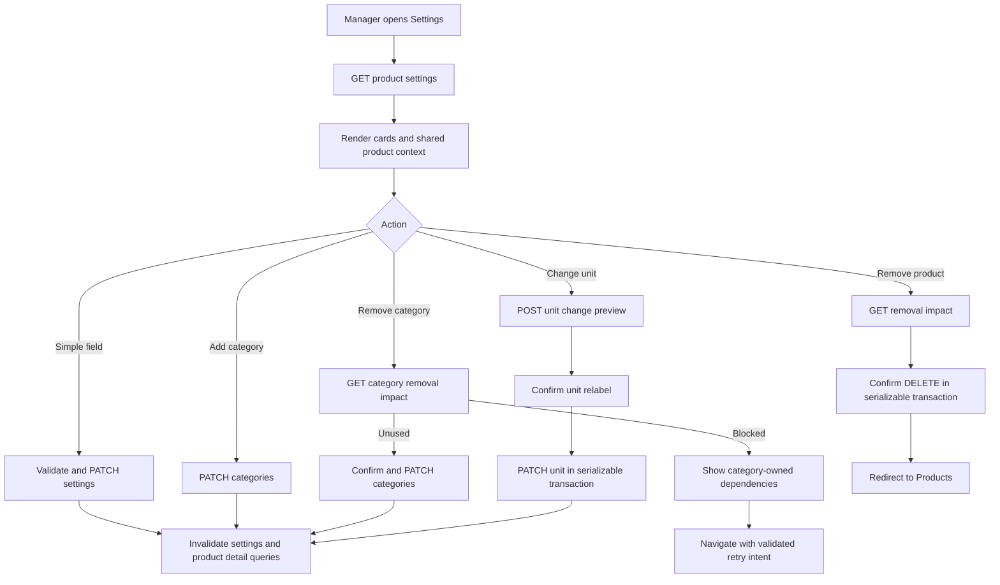

# 1. Context and scope

## Objective and outcome

Deliver the Manager-only Settings tab on an establishment-scoped product details page so a
Manager can read and maintain the product's basic information, unit, status, ideal stock,
negative-stock policy, categories and internal notes, and can remove the product after reviewing
the impact. Simple saves, category changes, unit changes and product removal must be
recoverable, tenant-safe and atomic where they affect dependent MRP state.

The product's stock-control mode is immutable after registration. Settings displays the selected
mode as read-only and allows only the negative-stock policy to change in that section. A brand
copies the product unit when it is created, then owns its persisted unit independently; changing
the product unit never rewrites existing brand units.

This Spec implements partial scope of MRP PRD `REQ-01`, `REQ-02`, `REQ-03`, `REQ-05`, `REQ-06`,
`REQ-08`, `REQ-09` and `REQ-10`. Those requirements remain unchecked because registration,
complete brand/stock/recipe/accompaniment/pricing capabilities and other product-page work extend
beyond this delivery.

## Source and authority

- GitHub Issue [#18](https://github.com/rafinel/scoops/issues/18) is the delivery source.
- [`documentation/prds/mrp.md`](../../../prds/mrp.md) is authoritative for product behavior.
- [`documentation/design.md`](../../../design.md) and the saved references in
  [`design/manifest.md`](./design/manifest.md) are authoritative for UI treatment, subject to the
  approved deviations recorded below.
- Repository behavior was researched at revision
  `459054461a4cc910e9637448228205b4746d768e`.

## In scope

- Read the persisted product settings for the current establishment.
- Save name and internal notes on blur; save ideal stock, status and negative-stock policy
  immediately after a valid selection or switch change.
- Permit clearing ideal stock and internal notes.
- Display stock-control mode as immutable/read-only.
- Add categories immediately when the resulting set is valid.
- Preview category-removal dependencies, confirm unused removal, block only invalidating
  dependencies, and provide direct recovery destinations while preserving the attempted change
  in validated URL state.
- Preview and atomically apply product-unit changes to product-owned current configuration and
  balances while preserving every existing numeric value exactly. Product-owned quantities, ideal
  stock, costs, recipe quantities, sizes and accompaniment quantities adopt the new unit; existing
  brand units and package quantities remain independent. No conversion factor is collected or
  applied, and no unit pair is blocked as incompatible.
- Preview and atomically remove the product and removable current configuration while preserving
  retained historical facts.
- Loading, pending, inline-validation, recoverable failure, access-denied, not-found, responsive,
  keyboard and focus behavior.
- Core contracts/use cases, shared schemas, transactional persistence, REST controllers,
  composition, Web service/query/action adapters, widgets, route integration and automated tests.

## Explicit exclusions

- Editing current single-stock Ingredient unit cost. The field remains a later part of PRD
  `REQ-01`; Issue #18 does not include it.
- Changing `Single stock` to `By brand` or the reverse after registration.
- Editing recipes, sizes, prices, brands, resale settings or accompaniment links inside Settings.
  Direct actions navigate to their owning surfaces.
- Header-level Edit or Remove actions; removal exists only in Settings Danger Zone.
- Rewriting historical stock transactions, productions, orders or audit snapshots during unit
  relabeling or deletion.
- PDV cart/order behavior, price modifiers, Identity administration, Billing and notifications.
- A new domain event, broker message or outbox entry for settings persistence; these actions are
  local MRP state changes.

## Product decisions and approved design deviations

| Decision | Contract |
| --- | --- |
| Stock control | Immutable after registration; render `Single stock` or `By brand` read-only. |
| Category blockers | Ingredient: consuming recipes. Manufacturable: owned recipe. Portion: sizes/size prices and accompaniment links. Accompaniment: Portion products using it. Resale: resale configurations. No other configuration blocks removal. |
| Unit changes | The selected unit is adopted by product-owned current balances, ideal stock, current unit cost, recipe yield and ingredient quantities, Portion sizes and accompaniment consumption while every existing numeric value remains unchanged. Existing brand units and package quantities are unchanged. No conversion factor is requested, persisted or applied. |
| Brand unit | The registration brand editor includes Unit, defaulting to the product unit. The selected unit is persisted on the brand and remains independent from later product-unit changes. |
| History | Current configuration changes; historical transactions, productions, orders and audit snapshots keep captured unit, quantity, cost and labels. |
| Saving | Text fields save on blur; selects and switches save immediately. Disable only the field currently pending, expose progress, keep the attempted value on failure and provide retry/revert. |
| URL recovery | Category, dependency kind and retry intent are validated search state so direct navigation and browser history preserve a retryable attempted change. |
| Pencil `Fa5wO` | Add the missing Stock Control section and Portion card. Do not render Portion and Resale selected together. Treat simultaneous chips as an inventory fixture. Derive narrow layout from repository responsive rules. |
| Pencil dialogs | Narrow Manufacturable blockers to its recipe and add retained-history copy to removal. Missing mobile/error frames are runtime validation targets, not implementation blockers. |

## Requirement-to-acceptance map

| Requirement | Product requirement | Acceptance criteria |
| --- | --- | --- |
| `RF-01` | A Manager reads complete persisted settings for a product in the active establishment, including immutable stock-control context. | `CA-01`, `CA-12`, `CA-14` |
| `RF-02` | A Manager updates simple settings with field-appropriate save timing, clearing semantics, validation and recoverable failures. | `CA-02`, `CA-03`, `CA-13`, `CA-14` |
| `RF-03` | Category sets remain valid; removal is confirmed or blocked only by category-owned dependencies, with recovery navigation and retry intent. | `CA-04`, `CA-05`, `CA-06`, `CA-13` |
| `RF-04` | Unit changes preview impact and atomically update the product unit while product-owned numeric values remain unchanged, existing brands retain their own units and history remains unchanged. | `CA-07`, `CA-08`, `CA-11`, `CA-13` |
| `RF-05` | Product removal discloses impact, atomically removes current configuration and inverse links, and retains history. | `CA-09`, `CA-10`, `CA-11`, `CA-13` |
| `RF-06` | Every operation is Manager-only, establishment-scoped and safe against stale previews or partial writes. | `CA-11`, `CA-12`, `CA-13` |
| `RF-07` | The Settings experience is accessible, responsive and explicit in loading, pending, empty/error and destructive states. | `CA-14`, `CA-15` |

## Acceptance criteria

- `CA-01` — Given an authenticated Manager and an owned product, opening Settings renders the
  persisted name, unit, optional ideal stock, status, categories, optional internal notes,
  read-only stock-control mode and editable negative-stock policy. A refresh reproduces the same
  facts; current unit cost is not rendered.
- `CA-02` — Name and notes save on blur; ideal stock, status and negative-stock policy save
  immediately. A successful response updates the shared product header/tabs and survives refresh.
  Clearing ideal stock persists `null`; clearing notes persists `null`.
- `CA-03` — Blank/duplicate name, negative or over-precision ideal stock, overlong notes and
  malformed values are rejected next to the field without losing the attempted value. Only the
  affected field is pending; a failed save offers retry or revert and never reports success.
- `CA-04` — Adding a category saves immediately when at least one category remains and all
  compatibility rules hold. Portion disables Resale and Resale disables Portion with an
  explanation. Stock-control mode cannot be changed from Settings.
- `CA-05` — Removing an unused category opens a named confirmation; cancel changes nothing and
  confirm rechecks and persists the category set. Removing the last category is invalid.
- `CA-06` — A used category is not removed. The dialog lists only its owning blockers and direct
  actions: Ingredient→recipes, Manufacturable→Recipe, Portion→Prices and Accompaniments,
  Accompaniment→Products filtered to its Portion users, Resale→Prices focused on resale.
  Navigation stores the product/category/dependency retry intent in validated URL state; returning
  can retry after resolution.
- `CA-07` — A unit change previews the affected product-owned records and states that the new unit
  will be adopted without changing numeric values. Cancel changes nothing. Confirm updates the
  product unit in one transaction; stock quantities, ideal stock, costs, recipe quantities, sizes
  and accompaniment quantities retain their existing numeric values while adopting the new unit.
  Existing brand units and package quantities remain unchanged.
- `CA-08` — Any valid target unit may be selected without an incompatible-unit branch. The unit
  flow never renders or accepts product or brand conversion factors, and confirmation cannot
  partially change product or brand data.
- `CA-09` — Danger Zone is the only removal entry point. Impact loading names the product and
  consolidates removable brands, balances, owned recipe, sizes, resale configuration,
  accompaniment links and inverse recipe/accompaniment links, and identifies retained history.
  Cancel returns focus to Remove and changes nothing.
- `CA-10` — Confirmed removal re-evaluates impact and atomically removes the product and current
  removable configuration, redirects to `/products`, and leaves other products plus historical
  transactions, productions, orders and audit snapshots unchanged.
- `CA-11` — A database, stale-impact or dependency failure rolls back the whole unit,
  category or removal transaction. The UI retains context and shows an actionable retry/recovery
  state; no partial product, dependent quantity or link change is observable.
- `CA-12` — Anonymous requests are unauthorized, Operators are forbidden, cross-establishment
  identifiers are not found, and no response, dependency preview, mutation or direct action leaks
  another establishment's data.
- `CA-13` — Every mutation re-reads the product and dependencies inside a serializable MRP
  transaction. Simple updates use `expectedUpdatedAt`; stale requests return conflict. Preview
  responses are advisory and confirmation always rechecks current state.
- `CA-14` — Initial load has a stable skeleton; read failure has retry; not-found/access behavior
  follows the protected product route; pending and error states remain visible without hydration,
  console or failed-network errors.
- `CA-15` — At desktop and 390×844, cards/dialogs do not overlap or clip; dialogs fit with internal
  scrolling where necessary. Labels, descriptions, alert text and focus are programmatically
  associated; all actions work by keyboard; destructive focus is not initial; focus returns on
  close; contrast and reduced-motion behavior follow Design rules.

## Cross-cutting restrictions

| Concern | Required behavior | Prohibited behavior |
| --- | --- | --- |
| Authorization | Manager guard plus current-account establishment passed into every use case. | Trusting establishment, actor or permission from request body/query. |
| Tenancy | Scope reads, reverse-dependency queries, replacements and removals by establishment and product identifiers. | Unscoped `replace(productId)` or `remove(productId)` in settings flows. |
| Transactions | Category, unit and deletion confirmations execute through `MrpDatabase.run` at serializable isolation and recheck their previews. | Multi-repository mutation outside the database scope or using a preview as authority. |
| Precision | Preserve existing numeric values exactly during unit relabeling; retain the existing field precision limits for newly entered values. | Arithmetic conversion, silent rounding or float drift during a unit change. |
| History | Detach retained product references and keep captured snapshots. | Cascading product deletion into stock transactions, productions or orders. |
| Errors | Use domain errors and semantic preview DTOs; map not-found/conflict/bad-request consistently. | Returning raw repository/SQL errors or encoding structured dependencies in a generic error string. |
| UI state | URL validation owns retry navigation; server state comes from query hooks; mutation state stays local to action hooks. | Duplicated product truth, unvalidated search strings or optimistic success before response. |
| Design | Reuse existing product shell, cards, dialogs, inputs, switches, semantic tokens and Lucide icon contract. | New arbitrary colors, spacing, shadows, radii, fonts or a parallel form system. |
| Testing | Use fakes in Core, Testcontainers controller fixtures on Server and route/widget tests plus real Playwright CLI scenarios on Web. | Mocked transport presented as persistence/auth evidence; dedicated Web service unit tests. |

# 2. Implementation Contract

## End-to-end behavior



## HTTP boundary

| Method and path | Input | Success | Failure contract |
| --- | --- | --- | --- |
| `GET /products/:productId/settings` | Path UUID | `200 ProductSettingsDetails` | `401`, `403`, tenant-safe `404` |
| `PATCH /products/:productId/settings` | `UpdateProductSettingsInput` | `200 ProductSettingsDetails` | `400` validation, `401`, `403`, `404`, `409` stale/name conflict |
| `GET /products/:productId/category-removal-impact?category=...` | Path UUID + category query | `200 ProductCategoryRemovalImpact` | `400`, `401`, `403`, `404` |
| `PATCH /products/:productId/categories` | `ChangeProductCategoriesInput` | `200 ProductSettingsDetails` | `400` rules, `401`, `403`, `404`, `409` stale/dependency |
| `POST /products/:productId/unit-change-preview` | `PreviewProductUnitChangeInput` | `200 ProductUnitChangePreview` | `400`, `401`, `403`, `404` |
| `PATCH /products/:productId/unit` | `ChangeProductUnitInput` | `200 ProductSettingsDetails` | `400` invalid/same-unit, `401`, `403`, `404`, `409` stale |
| `GET /products/:productId/removal-impact` | Path UUID | `200 ProductRemovalImpact` | `401`, `403`, `404` |
| `DELETE /products/:productId` | Path UUID | `204` | `401`, `403`, `404`, `409` changed/unsafe impact; rollback on any failure |

Preview endpoints are read-only advisory operations. The category, unit and removal mutation use
cases independently re-read every relevant row inside the serializable transaction.

## UI behavior and navigation

- Route `/products/$productId/settings` replaces the placeholder slot and retains the protected
  parent route and shared `ProductDetailsPage` shell.
- Basic Information contains Name, Unit, Ideal stock and Status. Unit opens an impact flow before
  saving, and confirmation changes only the product unit while preserving product-owned numeric
  values. Name saves on blur; ideal stock/status save immediately.
- The product-registration brand editor contains Unit for each brand, initialized from the
  product unit and submitted with the brand. Existing brand units are not derived from the
  product after creation.
- Stock Control displays the immutable mode and an editable `Allow negative stock` switch.
- Categories renders all five category cards, mutually excludes Portion/Resale and distinguishes
  confirmation from dependency-blocked dialogs.
- Internal Notes saves on blur and accepts an empty value as `null`.
- Danger Zone contains the sole Remove action.
- Validated search state extends the settings route with optional
  `retryCategory`, `retryDependency` and `retryProductId`. The route ignores/clears invalid or
  mismatched values and offers retry only when `retryProductId === productId`.
- Direct destinations use existing owning routes: recipe
  `/products/$productId/recipe`, prices `/products/$productId/prices`, accompaniments
  `/products/$productId/accompaniments`, and products `/products` with the new
  `usedAsAccompanimentId` filter. Prices accepts a validated `focus=resale|sizes`; the owning
  route scrolls/focuses the matching card without changing its product contract.
- Field-level mutations serialize per field. A newer edit is never overwritten by an older
  response; whole-page query invalidation follows success.

## Delivery strategy

Use a Plan-backed implementation because this delivery spans Core, Validation, Server schema and
transactional persistence, eight REST operations, protected Web routing, nine design references
and real authenticated browser evidence. Recommended sequence: historical-FK/index migration and
repository support; Core structures/use cases; shared validation and Server REST; Web service and
widgets; integrated correction/evidence. Parallel Builders may own non-overlapping Core/Server
and Web phases only after the shared structures and HTTP boundary are fixed.

# 3. Technical Contract

## Rule Pack

| Rule source | Why selected | Binding implications |
| --- | --- | --- |
| `documentation/rules.md` | Root router for every changed path. | Re-run routing if scope expands. |
| `documentation/rules/sdd-rules.md` | Open Spec and later Plan/evaluation lifecycle. | Spec is the contract; acceptance and exact paths remain traceable. |
| `documentation/rules/code-conventions-rules.md` | All TypeScript changes. | One exported type/class per file, aliases, import grouping, no barrel bypass. |
| `documentation/rules/core-package-rules.md` | New MRP structures, interfaces and use cases. | Framework-free domain; semantic use cases; actor and tenant facts explicit. |
| `documentation/rules/use-case-testing-rules.md` | Core behavior and transaction branches. | Fakes, arranged contexts and success/error/rollback coverage. |
| `documentation/rules/validation-package-rules.md` | REST and Web form/search schemas. | Shared Zod schemas at boundaries, inferred input types, exact refinement messages. |
| `documentation/rules/rest-layer-rules.md` | Server controllers and Web REST service. | Thin controllers, shared schemas, `RestResponse`, date mapping, no service tests. |
| `documentation/rules/controllers-testing-rules.md` | Eight new Server controllers. | Testcontainers-backed fixture, auth/tenant/status/body/persistence assertions. |
| `documentation/rules/database-layer-rules.md` | FK/index migration and transactional queries. | Drizzle models are authoritative; migration generated by command; scoped repositories. |
| `documentation/rules/ui-layer-rules.md` | Settings route, hooks, widgets and dialogs. | Route/widget/hook boundaries, semantic components/tokens and explicit states. |
| `documentation/rules/web-app-routing-rules.md` | Settings search state and direct-action destinations. | Validated search, route-safe navigation and generated route tree. |
| `documentation/rules/widget-testing-rules.md` | New slots/cards/dialogs/hooks. | Test public behavior, keyboard/state branches and avoid implementation details. |

## Structures and schemas

All new files below export exactly one public structure. Dates cross REST as ISO strings and are
mapped back to `Date` by the Web REST adapter.

### `ProductSettingsDetails`

```ts
export type ProductSettingsDetails = {
  product: Product
}
```

| Field | Type | Required | Meaning and validation |
| --- | --- | --- | --- |
| `product` | `Product` | yes | Complete owned product including current `updatedAt`; never another establishment's product. |

### `UpdateProductSettingsInput`

```ts
export type UpdateProductSettingsInput = {
  name?: string
  idealStock?: number | null
  status?: ProductStatus
  allowNegativeStock?: boolean
  internalNotes?: string | null
  expectedUpdatedAt: Date
}
```

| Field | Type | Required | Meaning and validation |
| --- | --- | --- | --- |
| `name` | `string` | no | Trimmed, non-empty, max 120, establishment-unique. |
| `idealStock` | `number \| null` | no | `null` clears; otherwise finite, `>= 0`, max 3 decimals. |
| `status` | `ProductStatus` | no | Existing enum only. |
| `allowNegativeStock` | `boolean` | no | Future write-off policy. |
| `internalNotes` | `string \| null` | no | `null` clears; otherwise trimmed, max 2000. |
| `expectedUpdatedAt` | `Date` | yes | Must equal current product version or conflict. |

At least one mutable field is required. Unit, categories, stock control and current unit cost are
forbidden in this input.

### `ProductCategoryDependency`

```ts
export type ProductCategoryDependency =
  | { kind: 'consuming-recipe'; productId: string; productName: string }
  | { kind: 'owned-recipe'; productId: string; productName: string }
  | { kind: 'portion-size'; productId: string; productName: string; sizeCount: number }
  | { kind: 'portion-accompaniment'; productId: string; productName: string; linkCount: number }
  | { kind: 'accompaniment-user'; productId: string; productName: string }
  | { kind: 'resale-configuration'; productId: string; productName: string; configurationCount: number }
```

| Variant | Fields | Meaning |
| --- | --- | --- |
| `consuming-recipe` | `productId`, `productName` | A Manufacturable product recipe consumes the Ingredient. |
| `owned-recipe` | `productId`, `productName` | The product owns a recipe enabled by Manufacturable. |
| `portion-size` | `productId`, `productName`, positive `sizeCount` | Current sizes/size pricing depend on Portion. |
| `portion-accompaniment` | `productId`, `productName`, positive `linkCount` | Owned accompaniment links depend on Portion. |
| `accompaniment-user` | `productId`, `productName` | A Portion uses this product as an accompaniment. |
| `resale-configuration` | `productId`, `productName`, positive `configurationCount` | Single/by-brand resale configuration depends on Resale. |

Identifiers and names are safe display/navigation facts already scoped to the establishment.

### `ProductCategoryRemovalImpact`

```ts
export type ProductCategoryRemovalImpact = {
  category: ProductCategory
  canRemove: boolean
  dependencies: readonly ProductCategoryDependency[]
}
```

| Field | Type | Required | Meaning and validation |
| --- | --- | --- | --- |
| `category` | `ProductCategory` | yes | Existing category requested for removal. |
| `canRemove` | `boolean` | yes | True only when `dependencies` is empty and another category remains. |
| `dependencies` | `readonly ProductCategoryDependency[]` | yes | Stable, name-sorted blockers owned by the category. |

### `ChangeProductCategoriesInput`

```ts
export type ChangeProductCategoriesInput = {
  categories: readonly ProductCategory[]
  expectedUpdatedAt: Date
}
```

| Field | Type | Required | Meaning and validation |
| --- | --- | --- | --- |
| `categories` | unique non-empty `ProductCategory[]` | yes | Complete target set; cannot contain both Portion and Resale. |
| `expectedUpdatedAt` | `Date` | yes | Optimistic concurrency version; transaction still rechecks blockers. |

### `PreviewProductUnitChangeInput`

```ts
export type PreviewProductUnitChangeInput = {
  targetUnit: ProductUnit
}
```

| Field | Type | Required | Meaning and validation |
| --- | --- | --- | --- |
| `targetUnit` | `ProductUnit` | yes | Must differ from current unit. |

### `ProductUnitChangePreview`

```ts
export type ProductUnitChangePreview = {
  currentUnit: ProductUnit
  targetUnit: ProductUnit
  affected: {
    balances: number
    brands: readonly { brandId: string; brandName: string }[]
    recipeYields: number
    recipeIngredients: number
    sizes: number
    accompanimentLinks: number
    hasIdealStock: boolean
    hasCurrentUnitCost: boolean
  }
}
```

| Field | Type | Required | Meaning and validation |
| --- | --- | --- | --- |
| `currentUnit` / `targetUnit` | `ProductUnit` | yes | Previewed unit pair. |
| `affected.balances` | non-negative integer | yes | Single and brand balance rows that adopt the new unit without numeric changes. |
| `affected.brands` | unique `{brandId, brandName}[]` | yes | All related brands, name-sorted, shown as preserved brand configuration context. |
| `affected.recipeYields` | non-negative integer | yes | The owned recipe whose yield uses the changed Manufacturable product unit. |
| `affected.recipeIngredients` | non-negative integer | yes | Consuming recipe lines where the changed product is the Ingredient. |
| `affected.sizes` | non-negative integer | yes | Portion sizes using the product unit. |
| `affected.accompanimentLinks` | non-negative integer | yes | Inverse links where the changed product is the consumed accompaniment. |
| `affected.hasIdealStock` / `hasCurrentUnitCost` | boolean | yes | Signals optional current values that adopt the new unit unchanged. |

### `ChangeProductUnitInput`

```ts
export type ChangeProductUnitInput = {
  targetUnit: ProductUnit
  expectedUpdatedAt: Date
}
```

| Field | Type | Required | Meaning and validation |
| --- | --- | --- | --- |
| `targetUnit` | `ProductUnit` | yes | Must differ from current. |
| `expectedUpdatedAt` | `Date` | yes | Must match the product at transaction start. |
Every valid target unit is accepted when it differs from the current unit. The preview contains
impact counts only; no conversion factor is accepted, calculated, persisted or applied.

### `ProductRemovalImpact`

```ts
export type ProductRemovalImpact = {
  productName: string
  removable: {
    brands: number
    balances: number
    ownedRecipe: number
    sizes: number
    resaleConfigurations: number
    ownedAccompanimentLinks: number
    consumingRecipeLinks: number
    inverseAccompanimentLinks: number
  }
  retainedHistory: {
    stockTransactions: number
    productions: number
    orders: number
  }
}
```

| Field | Type | Required | Meaning and validation |
| --- | --- | --- | --- |
| `productName` | `string` | yes | Named destructive target. |
| every `removable.*` | non-negative integer | yes | Current owned or inverse rows deleted in the same transaction. `ownedRecipe` is `0` or `1`. |
| every `retainedHistory.*` | non-negative integer | yes | Existing historical facts intentionally retained. `orders` is zero until PDV order persistence supplies a count, but the preservation boundary remains explicit. |

## Core — Domain and use cases

| Path | Change | Contract |
| --- | --- | --- |
| `packages/core/src/mrp/domain/structures/product-settings-details.ts` | Create | Export `ProductSettingsDetails`. |
| `packages/core/src/mrp/domain/structures/update-product-settings-input.ts` | Create | Export narrowed simple-settings input. |
| `packages/core/src/mrp/domain/structures/product-category-dependency.ts` | Create | Export dependency discriminated union. |
| `packages/core/src/mrp/domain/structures/product-category-removal-impact.ts` | Create | Export category preview. |
| `packages/core/src/mrp/domain/structures/change-product-categories-input.ts` | Create | Export complete category target/version input. |
| `packages/core/src/mrp/domain/structures/preview-product-unit-change-input.ts` | Create | Export target-unit preview input. |
| `packages/core/src/mrp/domain/structures/product-unit-change-preview.ts` | Create | Export affected facts and numeric-preservation semantics. |
| `packages/core/src/mrp/domain/structures/change-product-unit-input.ts` | Create | Export confirmed unit-update/version input. |
| `packages/core/src/mrp/domain/structures/product-removal-impact.ts` | Create | Export removal and retained-history counts. |
| `packages/core/src/mrp/domain/structures/product-update.ts` | Modify | Allow explicit `null` for ideal stock and internal notes so persistence distinguishes clearing from an omitted change; stock-control mode remains excluded from semantic settings input. |
| `packages/core/src/mrp/domain/structures/index.ts` | Modify | Export every new structure through the MRP public surface. |
| `packages/core/src/mrp/use-cases/get-product-settings-use-case.ts` | Create | Require `ProductActor`, find owned product, return settings details or not found. |
| `packages/core/src/mrp/use-cases/update-product-settings-use-case.ts` | Create | Validate Manager/version/name and atomically persist only simple settings; publish existing `ProductUpdatedEvent` after commit. |
| `packages/core/src/mrp/use-cases/preview-product-category-removal-use-case.ts` | Create | Validate Manager/category membership and query only the category-owned reverse dependencies. |
| `packages/core/src/mrp/use-cases/change-product-categories-use-case.ts` | Create | Validate target set/version and recheck removed-category blockers inside `MrpDatabase.run`; publish after commit. |
| `packages/core/src/mrp/use-cases/preview-product-unit-change-use-case.ts` | Create | Return affected facts for any valid target unit without mutation. |
| `packages/core/src/mrp/use-cases/change-product-unit-use-case.ts` | Create | Lock/re-read the product, update only its unit and publish after commit. |
| `packages/core/src/mrp/use-cases/get-product-removal-impact-use-case.ts` | Create | Return scoped current-removal and retained-history counts. |
| `packages/core/src/mrp/use-cases/remove-product-use-case.ts` | Create | Recheck impact and delete inverse links plus owned current configuration in one transaction; retain history. |
| `packages/core/src/mrp/use-cases/update-product-use-case.ts` | Remove | Replace the overly broad generic use case with semantic settings/category/unit actions. |
| `packages/core/src/mrp/use-cases/index.ts` | Modify | Export new semantic use cases; remove old generic export. |

All eight use cases accept `ProductActor` plus `productId`; mutation use cases accept the
corresponding input. They reject non-Manager actors with `ForbiddenError`, hide foreign products
as `NotFoundError`, use `ConflictError` for stale/dependency conflicts and `BadRequestError` for
invalid values or same-unit requests. The existing event is published only after successful commit; a failed
broker publish follows the repository's established post-commit policy and must not misreport a
database rollback.

## Core — Interfaces and repository relationships

| Path | Change | Contract |
| --- | --- | --- |
| `packages/core/src/mrp/interfaces/products-repository.ts` | Modify | Replace unscoped settings-flow mutation use with `replace(establishmentId, productId, changes)` and `remove(establishmentId, productId)`; add an optional row-lock read in transaction scope if required by the adapter. |
| `packages/core/src/mrp/interfaces/brands-repository.ts` | Modify | Add scoped list/count and persisted brand-unit support for a product. |
| `packages/core/src/mrp/interfaces/stock-balances-repository.ts` | Modify | Add scoped product balance count/list and exact quantity replacement. |
| `packages/core/src/mrp/interfaces/recipes-repository.ts` | Modify | Add scoped owned-recipe impact lookup/count. |
| `packages/core/src/mrp/interfaces/recipe-ingredients-repository.ts` | Modify | Add scoped reverse impact lookup/count by ingredient product. |
| `packages/core/src/mrp/interfaces/product-sizes-repository.ts` | Modify | Add scoped impact count by product. |
| `packages/core/src/mrp/interfaces/product-accompaniments-repository.ts` | Modify | Add scoped owned/inverse impact lookup/count/removal support. |
| `packages/core/src/mrp/interfaces/resale-configurations-repository.ts` | Modify | Add scoped count/removal support for impact and confirmation. |
| `packages/core/src/mrp/interfaces/stock-transactions-repository.ts` | Modify | Add scoped history count only; removal is prohibited. |
| `packages/core/src/mrp/interfaces/productions-repository.ts` | Modify | Add scoped history count only; removal is prohibited. |
| `packages/core/src/mrp/interfaces/mrp-database.ts` | Modify | Expose the extended repositories in the transactional scope; keep serializable execution. |
| `packages/core/src/mrp/interfaces/mrp-service.ts` | Modify | Add the eight HTTP-facing methods and inputs/results from the boundary table. |
| `packages/core/src/mrp/interfaces/index.ts` | Modify | Preserve public interface exports. |

Repository methods use establishment-scoped identifiers in their signatures. Product-unit changes
do not write dependent repositories; their impact queries are advisory counts only. Category/removal dependency queries
return semantic facts rather than raw joined persistence rows.

## Validation — Shared boundary schemas

| Path | Change | Contract |
| --- | --- | --- |
| `packages/validation/src/mrp/update-product-settings-schema.ts` | Create | Strict schema for simple optional fields plus ISO `expectedUpdatedAt`; require at least one mutable field and normalize cleared values. |
| `packages/validation/src/mrp/change-product-categories-schema.ts` | Create | Strict unique non-empty category array, mutual exclusion and ISO version. |
| `packages/validation/src/mrp/product-category-removal-query-schema.ts` | Create | Strict category query. |
| `packages/validation/src/mrp/product-unit-change-schema.ts` | Create | Export preview and confirmed strict schemas with target unit and ISO version only. |
| `packages/validation/src/web/product-settings-form-schema.ts` | Create | Field schemas for name, ideal stock and notes using the REST limits/precision; produce `null` for cleared optional fields. |
| `packages/validation/src/web/product-settings-search-schema.ts` | Create | Optional `retryCategory`, `retryDependency` and `retryProductId` validation; discard unknown values. |
| `packages/validation/src/web/product-pricing-search-schema.ts` | Create | Optional `focus=sizes|resale`; discard invalid/unknown values. |
| `packages/validation/src/index.ts` | Modify | Export new MRP and Web schemas from the package public surface. |

Server schemas transform ISO versions to `Date`; Web form schemas preserve display strings until
valid parsing. All object schemas are strict, UUIDs use the existing shared convention, and
client/server messages remain Portuguese user copy without embedding dependency data in strings.

## Server — REST controllers, DTOs and composition

Each controller owns one action, uses the existing MRP controller decorator plus Manager guard,
parses path/query/body with registered shared schemas, builds `ProductActor` from
`CurrentAccount`, and returns a dedicated DTO. Controllers contain no dependency, conversion or
deletion rules.

| Path | Change | Contract |
| --- | --- | --- |
| `apps/server/src/mrp/rest/controllers/get-product-settings.controller.ts` | Create | `GET /products/:productId/settings`; return settings DTO. |
| `apps/server/src/mrp/rest/controllers/update-product-settings.controller.ts` | Create | `PATCH /products/:productId/settings`; pass parsed simple input. |
| `apps/server/src/mrp/rest/controllers/get-product-category-removal-impact.controller.ts` | Create | `GET /products/:productId/category-removal-impact`; pass parsed category. |
| `apps/server/src/mrp/rest/controllers/change-product-categories.controller.ts` | Create | `PATCH /products/:productId/categories`; pass complete target set/version. |
| `apps/server/src/mrp/rest/controllers/preview-product-unit-change.controller.ts` | Create | `POST /products/:productId/unit-change-preview`; return affected facts. |
| `apps/server/src/mrp/rest/controllers/change-product-unit.controller.ts` | Create | `PATCH /products/:productId/unit`; pass validated target/version only. |
| `apps/server/src/mrp/rest/controllers/get-product-removal-impact.controller.ts` | Create | `GET /products/:productId/removal-impact`; return current/history counts. |
| `apps/server/src/mrp/rest/controllers/remove-product.controller.ts` | Create | `DELETE /products/:productId`; return `204` after atomic removal. |
| `apps/server/src/mrp/rest/controllers/index.ts` | Modify | Export all eight controllers. |
| `apps/server/src/mrp/rest/dtos/product-settings-response.dto.ts` | Create | Map `Product` dates and optional values for settings/category/unit responses. |
| `apps/server/src/mrp/rest/dtos/product-category-removal-impact-response.dto.ts` | Create | Serialize dependency union without persistence fields. |
| `apps/server/src/mrp/rest/dtos/product-unit-change-preview-response.dto.ts` | Create | Serialize units and affected facts. |
| `apps/server/src/mrp/rest/dtos/product-removal-impact-response.dto.ts` | Create | Serialize removable and retained counts. |
| `apps/server/src/mrp/rest/dtos/index.ts` | Modify | Export new DTOs. |
| `apps/server/src/mrp/rest/schemas/product-schemas.ts` | Modify | Register body/query schemas under stable names used by controllers. |
| `apps/server/src/mrp/mrp.module.ts` | Modify | Register controllers and use-case providers with existing repositories, broker and MRP database. |

Response DTOs expose only the fields declared by Core structures. `DELETE` has no body.
Dependency previews use `200` with `canRemove=false`; they are not exceptional errors. A
confirmation blocked by a newly-created dependency returns `409` and the UI re-fetches preview.

## Server — Database adapters

| Path | Change | Contract |
| --- | --- | --- |
| `apps/server/src/mrp/database/drizzle/repositories/drizzle-products-repository.ts` | Modify | Scope replace/remove by establishment; support transaction-safe current read. |
| `apps/server/src/mrp/database/drizzle/repositories/drizzle-brands-repository.ts` | Modify | Implement scoped list/count for impact context; brand configuration remains independent. |
| `apps/server/src/mrp/database/drizzle/repositories/drizzle-stock-balances-repository.ts` | Modify | Implement scoped product balance count/list/exact replacement. |
| `apps/server/src/mrp/database/drizzle/repositories/drizzle-recipes-repository.ts` | Modify | Implement owned-recipe impact. |
| `apps/server/src/mrp/database/drizzle/repositories/drizzle-recipe-ingredients-repository.ts` | Modify | Implement inverse Ingredient impact/removal support. |
| `apps/server/src/mrp/database/drizzle/repositories/drizzle-product-sizes-repository.ts` | Modify | Implement size impact. |
| `apps/server/src/mrp/database/drizzle/repositories/drizzle-product-accompaniments-repository.ts` | Modify | Implement owned/inverse impacts/removal. |
| `apps/server/src/mrp/database/drizzle/repositories/drizzle-resale-configurations-repository.ts` | Modify | Implement scoped impact/removal. |
| `apps/server/src/mrp/database/drizzle/repositories/drizzle-stock-transactions-repository.ts` | Modify | Count retained history only. |
| `apps/server/src/mrp/database/drizzle/repositories/drizzle-productions-repository.ts` | Modify | Count retained history only. |
| `apps/server/src/mrp/database/drizzle/repositories/drizzle-mrp-database.ts` | Modify | Bind all extended adapters into the existing serializable transaction and preserve retry policy. |
| `apps/server/src/mrp/database/drizzle/models/stock-transaction-model.ts` | Modify | Retain non-null snapshot `productId` without a cascading FK to current products. |
| `apps/server/src/mrp/database/drizzle/models/production-model.ts` | Modify | Retain non-null snapshot `productId` without a cascading FK to current products. |
| `apps/server/src/mrp/database/drizzle/models/recipe-ingredient-model.ts` | Modify | Add reverse-dependency index. |
| `apps/server/src/mrp/database/drizzle/models/product-accompaniment-model.ts` | Modify | Add inverse-accompaniment index. |
| `apps/server/src/mrp/database/drizzle/models/index.ts` | Modify | Preserve schema exports after model changes. |
| `apps/server/src/shared/database/drizzle/migrations/0011_<generated-tag>.sql` | Generate | Drop the two current-product history FKs and add reverse indexes; generator owns the tag. |
| `apps/server/src/shared/database/drizzle/migrations/meta/0011_snapshot.json` | Generate | Drizzle snapshot for the same schema change. |
| `apps/server/src/shared/database/drizzle/migrations/meta/_journal.json` | Generate | Append migration `0011` metadata. |

Migration filenames are generated by
`pnpm --filter server db:migration:generate`; implementation records the actual generated tag in
the Plan/evaluation and must not hand-name or hand-edit generator metadata.

### Modified `stock_transactions` data model

| Column | SQL type | Null/default | Contract |
| --- | --- | --- | --- |
| `id` | `uuid` | not null, generated UUID | Primary key. |
| `establishment_id` | `uuid` | not null | Captured tenant scope; the existing model has no database FK. |
| `product_id` | `uuid` | not null | Historical captured product identifier; no FK to current products. |
| `brand_id` | `uuid` | nullable | Existing brand snapshot/reference behavior is unchanged by this Spec. |
| `production_id` | `uuid` | nullable | Existing production relationship is unchanged. |
| `product_name` | `text` | not null | Captured historical product label. |
| `brand_name` | `text` | nullable | Captured historical brand label. |
| `unit` | `text` | not null | Captured historical unit under the existing five-unit check. |
| `type` | `text` | not null | Entry/write-off/production classification under the existing check. |
| `quantity` | `numeric(18,3)` | not null | Positive captured historical quantity; never unit-converted or deleted here. |
| `balance_after` | `numeric(18,3)` | not null | Captured post-transaction balance. |
| `performed_by` / `performed_by_name` | `uuid` / `text` | not null | Captured author identifier and label. |
| `occurred_at` | timestamp with time zone | not null | Existing occurrence instant. |

- Indexes: retain existing tenant/product/date access indexes. No new transaction-table index is
  required.
- Constraints: retain primary key, production FK and existing checks; drop only the FK from
  `product_id` to current `products` that currently cascades.
- Cross-database behavior: PostgreSQL UUID/numeric/timestamptz semantics remain authoritative;
  Testcontainers PostgreSQL validates deletion retention.
- Delivery: migration generation, application against a fresh database and upgrade from the
  previous schema are required. No backfill is needed because identifiers already exist.

### Modified `productions` data model

| Column | SQL type | Null/default | Contract |
| --- | --- | --- | --- |
| `id` | `uuid` | not null, generated UUID | Primary key. |
| `establishment_id` | `uuid` | not null | Captured tenant scope; the existing model has no database FK. |
| `product_id` | `uuid` | not null | Historical captured product identifier; no FK to current products. |
| `recipe_id` | `uuid` | not null | Captured recipe identifier; existing no-current-recipe-FK behavior remains. |
| `product_name` | `text` | not null | Captured historical product label. |
| `unit` | `text` | not null | Captured historical unit. |
| `recipe_yield` / `quantity` | `numeric(18,3)` | not null | Positive captured yield and produced quantity, never converted here. |
| `total_cost` | `numeric(18,6)` | not null | Non-negative captured production cost. |
| `performed_by` / `performed_by_name` | `uuid` / `text` | not null | Captured author identifier and label. |
| `occurred_at` | timestamp with time zone | not null | Existing occurrence instant. |

- Indexes: retain existing tenant/product/date indexes.
- Constraints: retain primary key and positive-values check; drop only the product FK that
  currently cascades.
- Cross-database behavior: PostgreSQL integration tests prove current-product deletion leaves the
  production and its production-ingredient snapshots readable.
- Delivery: no data rewrite/backfill; generated DDL must preserve all rows.

### Modified `recipe_ingredients` data model

| Column | SQL type | Null/default | Contract |
| --- | --- | --- | --- |
| existing columns | existing definitions | unchanged | No column or existing constraint change. |

- Indexes: add `(establishment_id, ingredient_product_id)` for scoped consuming-recipe impact and
  removal; retain existing indexes.
- Constraints: existing owned recipe and ingredient product relationships remain current-state
  constraints.
- Cross-database behavior: PostgreSQL query plan and Testcontainers behavior are authoritative.
- Delivery: index-only, no backfill or row rewrite.

### Modified `product_accompaniments` data model

| Column | SQL type | Null/default | Contract |
| --- | --- | --- | --- |
| existing columns | existing definitions | unchanged | No column or existing constraint change. |

- Indexes: add `(establishment_id, accompaniment_product_id)` for scoped inverse usage impact and
  removal; retain owned-product indexes.
- Constraints: current-state product/link FKs remain; the removal use case explicitly deletes
  inverse links before the product row.
- Cross-database behavior: PostgreSQL query plan and Testcontainers behavior are authoritative.
- Delivery: index-only, no backfill or row rewrite.

## Web — REST adapter and data hooks

| Path | Change | Contract |
| --- | --- | --- |
| `apps/web/src/rest/services/mrp-service.ts` | Modify | Implement eight `MrpService` methods, ISO-date request/response mapping, typed query strings and `RestResponse` propagation. |
| `apps/web/src/rest/services/tests/mrp-service.test.ts` | Remove | Current REST rule prohibits dedicated Web service tests; route tests own transport mapping coverage. |
| `apps/web/src/ui/mrp/hooks/use-product-settings-query.ts` | Create | Stable settings query key by product; expose loading/error/retry and mapped details. |
| `apps/web/src/ui/mrp/hooks/use-update-product-settings-action.ts` | Create | Simple field mutation with field key, expected version, ordered response handling and invalidation. |
| `apps/web/src/ui/mrp/hooks/use-product-category-removal-impact-query.ts` | Create | Enabled on a selected removal; no request for add/cancel. |
| `apps/web/src/ui/mrp/hooks/use-change-product-categories-action.ts` | Create | Add/confirmed-remove action, conflict re-preview and query invalidation. |
| `apps/web/src/ui/mrp/hooks/use-product-unit-change-preview-action.ts` | Create | On-demand preview preserving selected target unit. |
| `apps/web/src/ui/mrp/hooks/use-change-product-unit-action.ts` | Create | Submit target/version, retain failed state and invalidate product surfaces. |
| `apps/web/src/ui/mrp/hooks/use-product-removal-impact-query.ts` | Create | Enabled only while removal dialog is open. |
| `apps/web/src/ui/mrp/hooks/use-remove-product-action.ts` | Create | Confirm deletion, redirect only after `204`, retain failure for retry. |

The settings query is the route's server-state source. Action hooks do not duplicate field
validation or business rules, do not report success before `RestResponse.isSuccessful`, and
invalidate the settings, stock, recipe, pricing, accompaniments, product catalog and shared
product-details queries when their current facts may have changed.

## Web — Route, widgets and design composition

| Path | Change | Contract |
| --- | --- | --- |
| `apps/web/src/routes/_authenticated/products/$productId/settings.tsx` | Modify | Validate Settings retry search, render `ProductSettingsSlot`, preserve parent Manager guard. |
| `apps/web/src/routes/_authenticated/products/$productId/prices.tsx` | Modify | Accept validated `focus=sizes|resale` and focus/scroll the owning card. |
| `apps/web/src/routes/_authenticated/products/index.tsx` | Modify | Accept `usedAsAccompanimentId` filter and pass it to product search. |
| `packages/validation/src/web/products-search-schema.ts` | Modify | Add optional UUID `usedAsAccompanimentId`; retain all existing search defaults. |
| `apps/web/src/ui/mrp/hooks/use-products-query.ts` | Modify | Forward the inverse-accompaniment filter through `MrpService.listProducts`. |
| `packages/core/src/mrp/domain/structures/product-list-params.ts` | Modify | Add optional `usedAsAccompanimentId` for the direct recovery view. |
| `packages/core/src/mrp/use-cases/list-products-use-case.ts` | Modify | Preserve Manager/Operator catalog behavior and scope the new inverse filter. |
| `packages/core/src/mrp/interfaces/products-repository.ts` | Modify | Extend list contract for inverse-accompaniment filtering. |
| `apps/server/src/mrp/database/drizzle/repositories/drizzle-products-repository.ts` | Modify | Join/filter inverse accompaniment use without duplicating products or changing KPIs. |
| `packages/validation/src/mrp/list-products-query-schema.ts` | Modify | Parse optional UUID inverse filter. |
| `apps/server/src/mrp/rest/controllers/list-products.controller.ts` | Modify | Forward validated inverse filter. |
| `apps/web/src/ui/mrp/widgets/slots/product-details-placeholder-slot/index.tsx` | Remove | Settings was the final consumer; no placeholder remains. |
| `apps/web/src/ui/mrp/widgets/slots/product-details-placeholder-slot/use-product-details-placeholder-slot.ts` | Remove | Remove unused placeholder orchestration. |
| `apps/web/src/ui/mrp/widgets/slots/product-details-placeholder-slot/tests/product-details-placeholder-slot.test.tsx` | Remove | Remove obsolete placeholder view coverage. |
| `apps/web/src/ui/mrp/widgets/slots/product-details-placeholder-slot/tests/use-product-details-placeholder-slot.test.ts` | Remove | Remove obsolete placeholder hook coverage. |
| `apps/web/src/ui/mrp/widgets/slots/product-settings-slot/index.tsx` | Create | Compose query states, cards and dialogs inside shared product details page. |
| `apps/web/src/ui/mrp/widgets/slots/product-settings-slot/use-product-settings-slot.ts` | Create | Own selected field/category/unit/removal state, retry URL handshake and action orchestration. |
| `apps/web/src/ui/mrp/widgets/slots/product-settings-slot/product-settings-loading/index.tsx` | Create | Stable card skeleton matching final geometry. |
| `apps/web/src/ui/mrp/widgets/slots/product-settings-slot/product-settings-error/index.tsx` | Create | Read failure with accessible retry. |
| `apps/web/src/ui/mrp/widgets/slots/product-settings-slot/basic-information-card/index.tsx` | Create | Render name/unit/ideal/status fields and per-field pending/error state. |
| `apps/web/src/ui/mrp/widgets/slots/product-settings-slot/basic-information-card/use-basic-information-card.ts` | Create | Blur/immediate save timing, parsing, stale-response protection and unit-dialog trigger. |
| `apps/web/src/ui/mrp/widgets/slots/product-settings-slot/stock-control-card/index.tsx` | Create | Read-only stock-control mode plus negative-stock switch. |
| `apps/web/src/ui/mrp/widgets/slots/product-settings-slot/stock-control-card/use-stock-control-card.ts` | Create | Immediate negative-policy action and recovery state. |
| `apps/web/src/ui/mrp/widgets/slots/product-settings-slot/product-categories-card/index.tsx` | Create | Five category cards, mutual-exclusion explanation and add/remove entry points. |
| `apps/web/src/ui/mrp/widgets/slots/product-settings-slot/product-categories-card/use-product-categories-card.ts` | Create | Target-set derivation, add action and removal preview/confirmation orchestration. |
| `apps/web/src/ui/mrp/widgets/slots/product-settings-slot/internal-notes-card/index.tsx` | Create | Notes textarea with null-clear, blur save and inline status. |
| `apps/web/src/ui/mrp/widgets/slots/product-settings-slot/internal-notes-card/use-internal-notes-card.ts` | Create | Draft/committed value, blur action and retry/revert. |
| `apps/web/src/ui/mrp/widgets/slots/product-settings-slot/category-dependency-dialog/index.tsx` | Create | Shared confirmation/blocked presentation for all five categories and direct actions. |
| `apps/web/src/ui/mrp/widgets/slots/product-settings-slot/category-dependency-dialog/use-category-dependency-dialog.ts` | Create | Focus, cancel, confirm and validated retry-navigation behavior. |
| `apps/web/src/ui/mrp/widgets/slots/product-settings-slot/unit-change-dialog/index.tsx` | Create | Impact and numeric-preservation preview. |
| `apps/web/src/ui/mrp/widgets/slots/product-settings-slot/unit-change-dialog/use-unit-change-dialog.ts` | Create | Preview lifecycle, cancel and confirmation. |
| `apps/web/src/ui/mrp/widgets/slots/product-settings-slot/product-danger-zone/index.tsx` | Create | Pure danger card and sole Remove trigger. |
| `apps/web/src/ui/mrp/widgets/slots/product-settings-slot/remove-product-dialog/index.tsx` | Create | Impact/loading/failure/confirmation states and retained-history copy. |
| `apps/web/src/ui/mrp/widgets/slots/product-settings-slot/remove-product-dialog/use-remove-product-dialog.ts` | Create | Lazy impact, cancel/focus return, confirm/redirect/retry. |
| `apps/web/src/ui/shared/widgets/components/icon/types/icon-name.ts` | Modify | Add any missing Lucide icon name used by dependency links through the existing icon contract. |
| `apps/web/src/ui/shared/widgets/components/icon/lucide-icon/icons.ts` | Modify | Map the same icon; do not render the third-party icon directly in MRP widgets. |

Card components are view-oriented; their hooks own interaction state. Dialogs use existing modal,
field, alert and button primitives. The root slot owns cross-card orchestration only. Shared
product header state updates through query invalidation, not a second local product object.

## Technical decisions

| Decision | Chosen approach | Rejected alternative and reason |
| --- | --- | --- |
| Stock-control edits | Read-only after registration. | A mode-transition workflow lacks a product contract and would require balance/brand/cost migration rules. |
| Category dependency response | Read-only semantic impact DTO; confirm mutation rechecks. | Generic error strings cannot support lists/direct actions and become stale. |
| Unit relabeling | Server-owned impact preview followed by a transaction that updates only the product unit; all affected numeric values remain unchanged. | Arithmetic conversion or manual factors would change facts the user explicitly asked to preserve. |
| Concurrency | `expectedUpdatedAt` for settings/category/unit plus serializable dependency recheck. | Last-write-wins can overwrite field edits or apply a stale preview. |
| Product history | Physically remove current product/configuration, detach only historical product FKs and retain snapshot IDs. | Soft deletion would leak inactive current configuration throughout existing catalog queries; current cascades destroy required history. |
| Direct recovery state | Validated route search state. | Component/session-only state is lost across dependency navigation and refresh. |
| Product removal error | Transactional exception mapped to actionable conflict/error; UI re-fetches impact. | Partial cleanup or best-effort deletion violates the product outcome. |
| Web organization | Query/action hooks plus card/dialog widget hooks; no service test. | One monolithic route hook becomes untestable and dedicated REST service tests violate current rules. |

## Allowed and prohibited paths

| Classification | Paths |
| --- | --- |
| Allowed | The frontmatter `scope` paths and every exact path listed in this Technical Contract; generated `apps/web/src/routeTree.gen.ts` when route generation changes it; generated migration tag/snapshot/journal. |
| Conditional | `documentation/prds/mrp.md` and `documentation/tooling.md` were amended before this Spec under explicit approval. Later behavior changes require a Spec amendment and PRD reread first. |
| Prohibited | `design/onoreo.pen`; PDV order/cart source; Identity/Billing/Communication modules; unrelated product tabs except the two direct-action search/focus integrations; `.env*`; deployment/CI configuration; arbitrary shared design tokens. |

## Contractual file tree

```text
packages/core/src/mrp/
├── domain/structures/                   # new settings/category/unit/removal structures
├── interfaces/                          # extended scoped repositories, database, service
└── use-cases/                           # eight semantic actions; remove generic update action
packages/validation/src/
├── mrp/                                 # REST mutation/query schemas
└── web/                                 # settings form/search and catalog filter schemas
apps/server/src/mrp/
├── database/drizzle/
│   ├── models/                          # history FK and reverse-index definitions
│   └── repositories/                     # scoped impact/removal operations
└── rest/
    ├── controllers/                         # eight settings HTTP actions and tests
    └── dtos/                                # four response DTO families
apps/server/src/shared/database/drizzle/migrations/
├── 0011_<generated-tag>.sql
└── meta/                                # generated snapshot and journal
apps/web/src/
├── rest/services/mrp-service.ts
├── routes/_authenticated/products/      # settings plus direct recovery search integration
└── ui/mrp/
    ├── hooks/                               # query/action adapters
    └── widgets/slots/product-settings-slot/ # slot, cards, dialogs and colocated tests
apps/web/tests/routes/mrp/
└── products.$productId.settings.test.ts
```

# 4. Validation Contract

## Automated test inventory

### Core use-case tests

| Path | Required coverage |
| --- | --- |
| `packages/core/src/mrp/use-cases/tests/get-product-settings-use-case.test.ts` | Manager success, Operator forbidden, tenant-safe not found. |
| `packages/core/src/mrp/use-cases/tests/update-product-settings-use-case.test.ts` | Each field/clear, duplicate/invalid/stale, scoped replace, event after success. |
| `packages/core/src/mrp/use-cases/tests/preview-product-category-removal-use-case.test.ts` | Exact blocker mapping for all five categories, unused, last-category, tenant/auth. |
| `packages/core/src/mrp/use-cases/tests/change-product-categories-use-case.test.ts` | Add, mutually exclusive/empty, confirmed unused remove, changed dependency rollback, stale. |
| `packages/core/src/mrp/use-cases/tests/preview-product-unit-change-use-case.test.ts` | All valid target dimensions, same-unit rejection and affected counts/brands. |
| `packages/core/src/mrp/use-cases/tests/change-product-unit-use-case.test.ts` | Numeric preservation across all affected rows, preserved brand units/package quantities, cross-dimension success, stale and rollback behavior. |
| `packages/core/src/mrp/use-cases/tests/get-product-removal-impact-use-case.test.ts` | Complete current/inverse counts, retained history counts, tenant/auth. |
| `packages/core/src/mrp/use-cases/tests/remove-product-use-case.test.ts` | Ordered complete removal, retained history, other products, changed impact/error rollback. |
| `packages/core/src/mrp/use-cases/tests/list-products-use-case.test.ts` | New inverse-accompaniment filter without changing KPIs/pagination/tenant scope. |

Use existing entity fakers; extend
`packages/core/src/mrp/domain/entities/fakers/product-faker.ts` and the relevant recipe,
accompaniment, brand, balance, production and transaction fakes only when a missing builder value is
required. Do not add a settings-specific fake for a Structure.

### Server controller and persistence tests

| Path | Required coverage |
| --- | --- |
| `apps/server/src/mrp/rest/controllers/tests/get-product-settings.controller.test.ts` | `200` DTO/dates/nulls, `401`, `403`, own `404`, foreign `404`. |
| `apps/server/src/mrp/rest/controllers/tests/update-product-settings.controller.test.ts` | Persist/clear/refresh, strict body, duplicate, stale, auth/tenant. |
| `apps/server/src/mrp/rest/controllers/tests/get-product-category-removal-impact.controller.test.ts` | Every semantic blocker and no cross-tenant dependencies. |
| `apps/server/src/mrp/rest/controllers/tests/change-product-categories.controller.test.ts` | Add/remove, invalid sets, dependency race conflict and transaction rollback. |
| `apps/server/src/mrp/rest/controllers/tests/preview-product-unit-change.controller.test.ts` | Affected facts for same- and cross-dimension targets without conversion fields. |
| `apps/server/src/mrp/rest/controllers/tests/change-product-unit.controller.test.ts` | Persisted unit relabel with all numeric values unchanged, preserved brand units/package quantities, stale/auth failures. |
| `apps/server/src/mrp/rest/controllers/tests/get-product-removal-impact.controller.test.ts` | Current/inverse and historical counts with tenant isolation. |
| `apps/server/src/mrp/rest/controllers/tests/remove-product.controller.test.ts` | `204`, all current rows removed, history retained/readable, other product intact, injected failure rollback, auth/tenant. |
| `apps/server/src/mrp/rest/controllers/tests/list-products.controller.test.ts` | Inverse accompaniment filter request/result/tenant coverage. |

All controller tests use `apps/server/src/mrp/fixtures/mrp-module-fixture.ts` and
`apps/server/src/mrp/rest/controllers/tests/mrp-controller-test-helpers.ts` with Testcontainers
PostgreSQL. Extend the fixture to seed/query the new dependency and retained-history scenarios;
do not mock the repositories for persistence evidence.

### Web widget/hook tests

| Path | Required coverage |
| --- | --- |
| `apps/web/src/ui/mrp/widgets/slots/product-settings-slot/tests/product-settings-slot.test.tsx` | Success inventory, loading, retry error, allowed Pencil deviations, narrow semantics. |
| `apps/web/src/ui/mrp/widgets/slots/product-settings-slot/tests/use-product-settings-slot.test.ts` | Dialog orchestration, retry URL handshake, invalid search clearing, invalidation/redirect. |
| `apps/web/src/ui/mrp/widgets/slots/product-settings-slot/basic-information-card/tests/basic-information-card.test.tsx` | Labels/values, blur vs immediate saves, clear, pending, validation/retry/revert, unit trigger. |
| `apps/web/src/ui/mrp/widgets/slots/product-settings-slot/stock-control-card/tests/stock-control-card.test.tsx` | Mode cannot edit; negative switch pending/success/failure. |
| `apps/web/src/ui/mrp/widgets/slots/product-settings-slot/product-categories-card/tests/product-categories-card.test.tsx` | Five cards, Portion/Resale exclusion, add/removal entry, last-category behavior. |
| `apps/web/src/ui/mrp/widgets/slots/product-settings-slot/internal-notes-card/tests/internal-notes-card.test.tsx` | Blur/null clear/overlong/pending/failure retention. |
| `apps/web/src/ui/mrp/widgets/slots/product-settings-slot/category-dependency-dialog/tests/category-dependency-dialog.test.tsx` | Five exact blocker inventories/actions, confirmation, keyboard, cancel/focus return. |
| `apps/web/src/ui/mrp/widgets/slots/product-settings-slot/unit-change-dialog/tests/unit-change-dialog.test.tsx` | Unit preview, cross-dimension confirmation, pending/error/cancel. |
| `apps/web/src/ui/mrp/widgets/slots/product-settings-slot/remove-product-dialog/tests/remove-product-dialog.test.tsx` | Lazy impact, retained copy, cancel/focus, pending/failure/success callback. |

Hook behavior may be tested through its owning widget when that is the stable public contract;
do not duplicate the same assertion across hook and view suites.

### Web route tests

| Path | Required coverage |
| --- | --- |
| `apps/web/tests/routes/mrp/products.$productId.settings.test.ts` | Mocked read/update/category/unit/removal transports, URL/redirects, auth route shell, loading/failure and narrow screenshot checkpoints. |
| `apps/web/tests/routes/mrp/products.index.test.ts` | `usedAsAccompanimentId` validated/forwarded/cleared and existing filters unchanged. |
| `apps/web/tests/routes/mrp/products.$productId.prices.test.ts` | Valid/invalid focus search and correct target card focus. |
| `apps/web/tests/routes/mrp/products.$productId.placeholders.test.ts` | Remove the obsolete final placeholder route suite. |

Mocked route tests prove route composition and transport shape only. They are not evidence for
authorization, transactionality or persistence.

## Validation commands

Run from the repository root after generating the migration and routes:

```bash
pnpm --filter @scoops/core check:code
pnpm --filter @scoops/core check:types
pnpm --filter @scoops/core test

pnpm --filter @scoops/validation check:code
pnpm --filter @scoops/validation check:types

pnpm --filter server db:migration:generate
pnpm --filter server db:migration:apply
pnpm --filter server check:code
pnpm --filter server check:types
pnpm --filter server test
pnpm --filter server build

pnpm --filter web generate-routes
pnpm --filter web check:code
pnpm --filter web check:types
pnpm --filter web test
pnpm --filter web exec playwright test tests/routes/mrp/products.\$productId.settings.test.ts tests/routes/mrp/products.index.test.ts tests/routes/mrp/products.\$productId.prices.test.ts --workers=1
pnpm --filter web test:integration
pnpm --filter web build
```

Migration validation must include a clean database and an upgrade from migration `0010` with
seeded stock transaction and production history before applying `0011`, followed by product
removal and retained-row assertions.

## Manual and real-service evidence

Follow the repository Playwright CLI workflow: inspect `docker compose ps`; verify Supabase at
`http://127.0.0.1:54321`, Server at `http://127.0.0.1:3336` and Web at
`http://127.0.0.1:4000`; seed explicitly only if Manager/Operator accounts are missing; generate
auth storage with `pnpm --filter web test:auth:setup`; start Server/Web in persistent sessions;
run the scenarios; inspect URL, requests, persisted state, console and failed network calls; then
stop processes started for validation. Store screenshots only in Playwright `test-results/` or CI
artifacts.

| Evidence | Scenario | Required assertions/artifacts |
| --- | --- | --- |
| `MV-01` | Manager desktop settings, simple saves and unit paths | Read persisted fields; blur/immediate timing; clear ideal/notes; cross-dimension unit relabel with unchanged numeric values; cancel; refresh; database current values, independently stored brand units and unchanged history; screenshots of populated, pending and preservation states compared to the approved references; no console/network failure. |
| `MV-02` | 390×844 keyboard category recovery | Five categories and immutable stock control; Portion/Resale explanation; each blocker inventory/direct destination; URL retry survives navigation/back; resolved retry succeeds; tab/focus/escape behavior; narrow screenshot compared to manifest rules; no clipping/hydration error. |
| `MV-03` | Real product removal, failure rollback and access isolation | Impact counts; cancel; injected/reproducible database failure preserves all state; success redirects and removes current configuration while retained transaction/production remain queryable; Operator forbidden and foreign product hidden; desktop/narrow failure/success screenshots compared to `O11tq`; no unexpected console/network failure. |

## Evidence acceptance

- Every `CA` has at least one automated assertion and every `RF` is represented in `MV-01`,
  `MV-02` or `MV-03` where real persistence/interaction matters.
- Visual evaluation records screenshot paths, target Pencil node, viewport and a concise
  match/deviation result. The approved deviations are not findings.
- Any HTTP `4xx/5xx`, console error, hydration warning or failed request is classified as fixed,
  pre-existing or blocking.
- A unit or removal result is not accepted without direct database assertions for dependent
  current rows and retained history.
- Cross-tenant and role behavior requires real Server controller coverage; mocked browser routes
  alone are insufficient.

# 5. Documentation alignment and revision history

## Authority alignment

| Document | Alignment |
| --- | --- |
| `documentation/prds/mrp.md` | Amended before Spec revision 3 with explicit approval: immutable stock control, independently stored brand units, numeric-preserving unit relabeling without conversion, exact category blockers, Settings-only removal and history preservation. Reread after amendment. |
| `documentation/architecture.md` | Confirmed MRP owns product/current configuration, Identity owns authorization and Server persistence remains PostgreSQL/Drizzle with Core orchestration. No new integration or runtime technology. |
| `documentation/modules.md` | Confirmed Settings remains inside MRP; PDV order/sales ownership is not absorbed. |
| `documentation/design.md` | Confirmed shared shell/components/tokens, responsive/accessibility/focus rules and transient Playwright screenshot policy. |
| `documentation/tooling.md` | Corrected the stale Core-test statement and recommended validation to include `pnpm --filter @scoops/core test`. |
| `design/onoreo.pen` | Nine issue nodes inspected through Pencil only; no design file edit. Durable exports and approved deviations are in `design/manifest.md`. |

## Risk and dependency register

| Risk/dependency | Control |
| --- | --- |
| Current product FKs cascade into required history. | Migration `0011` detaches only historical product references; upgrade and deletion integration tests are mandatory. |
| Unit changes affect many readers while numeric facts must remain unchanged. | Keep the mutation to the product unit, retain impact counts, use a serializable transaction and assert unchanged dependent values in Core/Server tests. |
| Category/delete previews can become stale. | Advisory previews, `expectedUpdatedAt` where applicable and mutation-time dependency recheck/rollback. |
| Reverse dependency queries lack indexes. | Add tenant-scoped reverse indexes and assert scoped adapters. |
| Direct recovery destinations did not support focus/filter search. | Add narrowly validated `focus` and `usedAsAccompanimentId` search contracts with route tests. |
| Pencil examples conflict with approved product behavior. | Manifest records explicit deviations; product contract wins and Playwright comparisons classify them as approved. |
| PDV orders are not yet persisted in this repository. | Preserve the boundary and return zero current count; do not invent PDV persistence or rewrite future order snapshots. |

## Integrity preflight for implementation

- Re-read this Spec, the Rule Pack, MRP PRD and design manifest before implementation.
- Create a Plan and assign every path/criterion/evidence item; amend the Spec first if a contract
  must change.
- Confirm the generated migration number/tag after `db:migration:generate` and replace the
  generator placeholder in the Plan, not by hand-editing generated files.
- Re-run rule discovery if implementation expands beyond the listed paths.
- Preserve unrelated user changes and do not edit `design/onoreo.pen` for this implementation.
- Do not mark any PRD checkbox Implemented before `conclude-spec` closure.

## Revision history

| Revision | Date | Status | Change |
| --- | --- | --- | --- |
| 1 | 2026-08-24 | Open | Created implementation-ready complete-mode Spec from Issue #18, approved PRD clarifications, repository research and nine saved Pencil references. |
