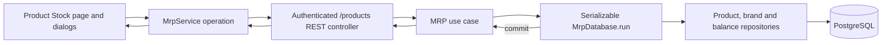

# MRP product details Stock tab

## 1. Context and scope

### Objective and source

Implement the dedicated product page opened from the Products list and deliver its Stock tab for authenticated establishment managers. The page must expose product identity and stock state, support Single and By brand balances, and provide tenant-safe brand and stock operations.

The source is [GitHub Issue #11](https://github.com/rafinel/scoops/issues/11). The selected mode is `complete` because delivery crosses Core, Validation, server REST/persistence, web routing/UI, a schema migration, concurrent stock writes, manager authorization, tenant isolation, and five design-backed states.

### Current behavior and product gap

The completed product-catalog feature renders a non-navigating `Detalhes →` control and exposes only `GET /products` and `POST /products`. Core already defines `Product`, `Brand`, `StockBalance`, `StockAdjustment`, repository skeletons, and `StockAdjustedEvent`, while the server persists products, brands, and balances. It has no product-stock query, post-registration brand actions, stock-adjustment use case or endpoints. `DrizzleMrpDatabase.run` currently executes without a transaction, brand constraints do not enforce unique names or one primary brand, and the balance repository overwrites quantities instead of applying a concurrency-safe adjustment. The web has no product-details route, page, product-stock query/actions, or detail fixture.

### Scope and product alignment

| Area | In scope | Out of scope |
| --- | --- | --- |
| Navigation and page | `Detalhes` navigation, canonical product route, `Voltar`, breadcrumb, product identity/unit/status/categories/stock-control context, and active Stock tab | Product-level Edit and Remove controls; the user confirmed these controls do not exist |
| Stock summary and history | Current total, optional ideal target, Normal/Low situation, zero balance, no-target behavior, and a paginated/filterable ledger of committed stock transactions | Stock value, financial KPIs, physical inventory, or administrative audit/export/reconciliation workflows |
| Single stock | Product-level Entry and Write-off in the base unit | Brands or package mode for Single stock |
| By brand | Brand list, Main chip, package quantity/value, unit-price preview, balance, add/edit, set main, delete confirmation, and brand Entry/Write-off | Recipe, production, accompaniments, sizes, resale pricing, settings, POS, or dependency editors |
| Safety | Manager authorization, establishment isolation, atomic writes, positive quantity validation, insufficient-balance protection, and retryable conflict handling | Employee production permissions or cross-module automatic stock operations |
| UI states | Loading, error/retry, empty brands, pending/disabled, confirmation, focus, keyboard, narrow viewport, and responsive adaptation | Functional content for Recipe, Accompaniments, Prices, or Settings tabs |

| Source requirement | Delivery | Notes |
| --- | --- | --- |
| REQ-01 — product identity, unit, categories, status, ideal and negative-stock configuration | `partial` | Reads existing configuration; editing product configuration is excluded. |
| REQ-02 — brand management and main brand | `full` | Covers the Issue #11 brand slice, including first/main transitions and deletion rules. |
| REQ-03 — inventory summary, manual adjustment and stock transactions | `full` | Covers Single and By brand Entry/Write-off, atomic transaction recording and visible history without event publication. |
| REQ-04 — open product from list | `partial` | Adds `Detalhes` navigation; catalog behavior otherwise remains unchanged. |
| REQ-05 — dedicated product page | `partial` | Delivers page header and Stock tab only. |
| REQ-10 — navigation, states, confirmations and responsiveness | `partial` | Covers the Stock page and its dialogs; adjacent MRP surfaces remain separate. |

### Product decisions and assumptions

- The existing `UserProfile.Manager` is the only actor for this slice. Employees remain limited to future authorized production behavior.
- Product-level Edit and Remove controls are absent and must not be rendered or implemented. This is an explicit user clarification overriding the issue phrase that mentioned those actions.
- Brand stock can change only through Entry/Write-off. The `Estoque inicial` field is available when registering a brand, but is omitted from Edit brand despite its appearance in Pencil node `Jo3va`; this is an explicit user clarification.
- The first brand registered for a By brand product becomes Main automatically. Clients cannot choose an arbitrary first-main flag. Setting another brand Main affects future automatic operations only and never rewrites previous facts.
- A Main brand with siblings cannot be deleted until another brand is made Main. The last brand may be deleted after warning, leaving the product with no main brand and no available brand balance until a new brand is registered.
- Brand deletion removes that brand and its current balance. Future dependency implementations must surface their counts and remove their links/configuration in the same transaction. Existing stock transactions remain readable through immutable product/brand/unit snapshots and nullable source references, so deletion never rewrites historical facts.
- The product details route is `/products/$productId`. Only the Stock tab is rendered. Recipe, Accompaniments, Prices and Settings labels, controls, routes and content are excluded despite their appearance in the desktop reference.
- REST stock-adjustment quantities are expressed in the product base unit. For a By brand balance, the UI may accept Packages or Base unit: package count is converted using the current brand package quantity, previewed before confirmation, and the resulting base-unit quantity is sent to the server. Single stock accepts Base unit only.
- Package quantity must be greater than zero; package value and initial stock may be zero. Unit price is `packageValue / packageQuantity` and is a derived projection, not persisted separately.
- Every successful manual Entry/Write-off records exactly one immutable stock transaction in the same serializable database transaction as its balance delta. A positive initial stock during product or brand registration is recorded as Entry in that registration transaction; zero creates no ledger row. Recording is database persistence, not domain-event publication: this slice emits no `StockAdjustedEvent`, broker message or outbox row.
- History is newest first and paginated. Managers may filter by manual Entry/Write-off type, captured brand identity, and inclusive occurrence date range. Production and Sale remain owned by their future flows; this slice neither creates nor simulates them.

## 2. Implementation Contract

### Functional requirements

| ID | REQ/source coverage | Required behavior |
| --- | --- | --- |
| `RF-01` | REQ-04, REQ-05, REQ-10; Issue navigation acceptance | Selecting `Detalhes` navigates to `/products/$productId`; `Voltar` returns to `/products`; the page shows the product name, unit, status, categories and stock-control context with Stock active. Product Edit/Remove controls are absent. |
| `RF-02` | REQ-01, REQ-03; Issue stock-state acceptance | The Stock summary shows the authoritative total balance, optional ideal target, and situation. Zero is a valid balance. Situation is Low only when an ideal target exists and total is below it; otherwise it is Normal. |
| `RF-03` | REQ-03; Issue Single-stock acceptance | A Single product exposes product-level Entry and Write-off. Quantity is required, finite, greater than zero and expressed in the base unit. Entry adds; Write-off subtracts and cannot cross zero unless `allowNegativeStock` is true. |
| `RF-04` | REQ-02, REQ-03; Issue By-brand presentation acceptance | A By brand product lists each brand's name, Main state, package quantity, package value, derived unit price and current balance. Total stock is the sum of brand balances and all amounts use the product unit. |
| `RF-05` | REQ-02; Issue add/edit and preview acceptance | Managers can register a brand with unique trimmed name, package quantity greater than zero, non-negative package value and non-negative initial stock; the first brand becomes Main. Managers can edit name/package configuration, but Edit brand cannot change stock. Both forms preview unit price. |
| `RF-06` | REQ-02; Issue main-brand acceptance | Managers can make a non-main brand Main atomically. Exactly one Main exists whenever brands exist, except the documented post-deletion empty state. The previous Main is demoted in the same transaction and historical/previous operations remain unchanged. |
| `RF-07` | REQ-02, REQ-10; Issue deletion acceptance | Brand deletion requires a destructive confirmation naming the brand and known impacts. A Main brand with siblings is rejected until another Main is selected; the last brand may be removed. The removed brand cannot receive future adjustments. |
| `RF-08` | REQ-01, REQ-02, REQ-03; Issue authorization/tenant acceptance | Every query and mutation requires an authenticated manager. Core and persistence use the actor's establishment; a foreign or missing product/brand returns the same not-found outcome and no foreign data or existence detail. |
| `RF-09` | REQ-10; Issue state/accessibility acceptance | Page and dialogs expose loading, error/retry, empty brands, pending/disabled and successful refreshed states. Controls have accessible names, visible focus, keyboard operation, focus restoration and no clipped content at 320px. |
| `RF-10` | Architecture atomic-write invariant; Issue persisted/server-backed acceptance | Brand registration, main-brand exchange, deletion and stock adjustment are serializable transactions. Concurrent write-offs cannot both spend the same balance; a retryable serialization/deadlock conflict is retried once, then becomes a safe conflict. |
| `RF-11` | Amended REQ-03; Pencil `bi8Au`/`LHrAy`; user clarification | Every committed Entry/Write-off creates exactly one immutable, tenant-scoped stock transaction atomically with the balance change; positive registration-time initial stock is an Entry and zero creates no row. The Stock tab lists transactions newest first with type, brand, author and inclusive date filters plus pagination. Product, brand and author labels, unit and resulting balance remain stable after later edits/deletion. No domain event, broker message or outbox row is created. |

### Acceptance criteria

| ID | RF coverage | Requirement | Given | When | Then | Expected evidence |
| --- | --- | --- | --- | --- | --- | --- |
| `CA-01` | `RF-01` | Details navigation and return | A manager views a populated catalog | `Detalhes` is activated, then `Voltar` | The exact product URL and then `/products` are reached with the expected visible pages | Route test and `MV-01` |
| `CA-02` | `RF-01, RF-02` | Product header and normal summary | A product has stock at/above ideal | Its page loads | Identity, unit, status, categories, total, ideal and Normal state are visible; no product Edit/Remove exists | Core/controller/widget tests and `MV-01` |
| `CA-03` | `RF-02` | Zero and no-target semantics | A product has zero balance with or without a target | Its page loads | Zero is rendered; target-present zero is Low, target-absent zero is Normal and no fake target is shown | Use-case and page tests |
| `CA-04` | `RF-03, RF-10, RF-11` | Single-stock Entry/Write-off | A Single product belongs to the manager's establishment | Positive Entry and valid Write-off are confirmed | The balance changes by the exact base-unit quantity and each commit creates one matching transaction; response/UI refresh to the committed balance and history | Core/controller tests and `MV-02` |
| `CA-05` | `RF-03, RF-10` | Insufficient-balance protection | Negative stock is disabled and two write-offs contend | Both are submitted against one balance | No committed result crosses zero; the rejected request reports available/requested context and causes no event/side effect | Core/controller concurrency test and `MV-02` |
| `CA-06` | `RF-03` | Negative-stock exception | The product explicitly allows negative stock | A write-off exceeds balance | The resulting negative balance commits and is returned/refreshed | Core/controller test |
| `CA-07` | `RF-04` | By-brand projection | A product has several brands | Its Stock tab loads | Brand rows, Main chip, package/value/unit-price/balance and summed total are correct | Query/controller/page tests and `MV-03` |
| `CA-08` | `RF-05, RF-06` | First brand and later Main exchange | A By brand product has no brands, then two brands | Brands are registered and the second is made Main | First is initially Main; exchange leaves exactly the second Main and changes no prior facts | Use-case/controller tests and `MV-03` |
| `CA-09` | `RF-05` | Brand validation and edit boundary | Add/Edit dialogs are used | Invalid/duplicate inputs and an attempted stock edit are exercised | Inline/server errors appear; valid config saves; Edit exposes no stock field and balance is unchanged | Validation/Core/widget/controller tests and `MV-03` |
| `CA-10` | `RF-07` | Protected deletion | A Main brand has siblings, then another is Main | Delete is confirmed before and after exchange | First attempt is rejected; second removes the named brand/balance after confirmation and refreshes the page | Use-case/controller/page tests and `MV-03` |
| `CA-11` | `RF-08` | Authentication/authorization | Requests are anonymous or use a non-manager | Read/mutations are attempted | Existing guards return 401/403 and no MRP operation executes | Controller tests and `MV-04` |
| `CA-12` | `RF-08` | Tenant isolation | A manager knows a foreign product/brand UUID | Read/mutations are attempted | Each returns the same 404 as missing, no data changes, and no foreign detail leaks | Core/controller tests and `MV-04` |
| `CA-13` | `RF-09` | Loading/error/empty/recovery | Responses are delayed, fail, or contain no brands | Page/actions run | Loading and disabled states are visible; error can retry; brand empty state guides Add first brand; failed mutation retains dialog context | Widget/route tests and `MV-05` |
| `CA-14` | `RF-09` | Keyboard and narrow viewport | Page is 320 × 900 | Manager tabs through, opens/closes dialogs and confirms an action | Focus is visible/restored, Escape/cancel work, no page-level horizontal overflow or clipped primary action | Route test and `MV-05` |
| `CA-15` | `RF-04, RF-05` | Package/base-unit input | A By brand row has known package quantity | Manager switches adjustment input mode | Preview and submitted base quantity equal package count × package quantity; Base unit sends direct quantity | Widget/route tests and `MV-03` |
| `CA-16` | `RF-08, RF-11` | Transaction history query | Own and foreign products have transactions across types, brands and dates | The manager loads, filters and pages history | Only own-establishment matching rows appear newest first; empty/error states are distinct; foreign/missing products are uniform 404 | Core/controller/page tests and `MV-03`, `MV-04` |
| `CA-17` | `RF-10, RF-11` | Atomic ledger without publication | An adjustment succeeds, fails validation, conflicts or rolls back | Each case completes | Success persists one balance delta and one transaction; every failure persists neither; no event publisher/outbox is invoked | Core/database/controller tests and `MV-02` |
| `CA-18` | `RF-11` | Stable historical facts and author | A recorded brand or responsible user is renamed and the brand is later deleted | History is queried afterward | The transaction retains captured product, brand, author and unit labels, actor identity and resulting balance; each row shows the captured name with deterministic initials/avatar color regardless of later changes | Persistence/controller/widget tests and `MV-03` |

### Cross-cutting restrictions

| Concern | Contract |
| --- | --- |
| Exclusions | Do not infer product Edit/Remove, administrative audit/export/reconciliation, financial metrics, physical inventory, other tab content, product settings or POS behavior from code or screenshots. The stock-transaction history in `bi8Au` is included. |
| Authorization | Hiding controls is presentation only; REST guards and Core actor validation remain authoritative. |
| Tenancy | Product ID or brand ID alone never grants access. Foreign and missing resources share the same not-found response. |
| Quantities | No automatic `g↔kg` or `ml↔l` conversion. Decimal base quantities retain `numeric(18,3)` precision; UI formatting must not alter submitted values. |
| Author avatar | Derive up to two initials from the captured display name. Normalize with Unicode NFC and lowercase, compute the shared stable string hash, and select `hash mod 5` from the existing accessible semantic soft/foreground pairs: primary, info, success, danger, or neutral. The visible name remains mandatory; do not persist a color. |
| Events | Persisting `StockTransaction` is required and completes inside the MRP database transaction. Do not publish `StockAdjustedEvent`, call a broker, create an outbox row or add a messaging job; the ledger has no event-delivery dependency. |
| Generated files | `apps/web/src/routeTree.gen.ts` is generated from the new route with `pnpm --filter web generate-routes`; never edit it manually. Drizzle SQL/journal output is generated from models with `pnpm --filter server db:migration:generate`. |

### Design Contract

The saved reference bundle and detailed visual inventory are in [`design/manifest.md`](./design/manifest.md). Five Pencil nodes were exported and visually inspected at 1×: one desktop page, Add/Edit brand dialogs, brand action menu and delete dialog.

- `bi8Au` governs desktop hierarchy, product header, active Stock tab, summary metrics, brand table, inline actions and movement-history panel with filters and pagination. Adjacent tab labels/content remain excluded.
- `p72QC` governs Add brand. `Jo3va` governs shared Edit-brand composition except its initial-stock control is intentionally omitted.
- `yUkPJ` governs action order and destructive separation. `K48XWv` governs confirmation hierarchy, but its preservation copy must be replaced with accurate deletion impacts.
- Desktop comparison uses each exported artboard's exact dimensions. Narrow validation uses 320 × 900: cards stack, header/chips wrap, brand rows become stacked accessible cards or a horizontally contained table that does not create page-level overflow, dialogs use viewport-safe width/height, and fixed actions remain reachable.
- Loading, request error, empty brands, disabled/pending, insufficient stock, Single-stock adjustment, package/base-unit adjustment and narrow states have no authoritative Pencil frame. Their behavior is fully specified by RF/CA and `documentation/design.md`; supplemental captures are recommended, not required before implementation, and are deferred to `evaluation.md` at the exact validation viewports.

## 3. Technical Contract

### Current technical state

| Evidence | Current responsibility | Gap |
| --- | --- | --- |
| `packages/core/src/mrp/domain/entities/{product,brand}.ts` and structures | Product/brand vocabulary and stock inputs/balances exist | No product-stock details projection or post-registration input contracts |
| `packages/core/src/mrp/interfaces/*.ts` | Repository and two-method web service contracts exist | Product lookup is not establishment-qualified; no detail/brand/adjustment service operations |
| `apps/server/src/mrp/database/drizzle/models/*` | Product, brand and balance tables exist | Brand name/Main/package constraints are incomplete |
| `DrizzleMrpDatabase.run` | Supplies three MRP repositories | It does not open a transaction or retry conflicts |
| `DrizzleStockBalancesRepository.adjust` | Writes a balance | It currently overwrites an absolute quantity; replace it with concurrency-safe signed-delta `add` semantics |
| `apps/server/src/mrp/rest/controllers` | List/register endpoints under `/products` | No detail or mutation controllers, Swagger DTOs, or controller integration fixture |
| `apps/web/src/ui/mrp` and `/products` route | Catalog/list/registration | `Detalhes` is a button without navigation; no product page/query/actions |

Documentation is authoritative where code differs. REQ-02/REQ-03 and this Spec replace the unsafe repository semantics; the previous completed catalog behavior remains compatible.

### Solution and runtime flow

The authenticated manager enters `/products/$productId`. The page query calls `GET /products/:productId/stock`; the controller derives the actor, Core validates manager authority, and the query loads only a product belonging to the actor's establishment, then maps Single or By brand balances into one `ProductStockDetails` projection.

Mutations travel through one operation-specific web action and REST controller into one Core use case. Core validates actor/resource ownership and business rules. `MrpDatabase.run` opens a serializable transaction and constructs transaction-bound repositories. Brand creation writes the brand and initial balance atomically; main exchange demotes/promotes atomically; deletion validates replacement requirements before cascading the owned balance; Entry/Write-off converts its positive magnitude into a signed delta and calls `StockBalancesRepository.add`, then inserts its immutable stock transaction before commit. A serialization or deadlock conflict is retried once. No stock event, broker call or outbox write occurs; synchronous REST success means both the balance and ledger row committed.

History loads independently through `GET /products/:productId/stock-transactions`, preserving the stock summary if history is delayed or fails. Core qualifies the product by establishment before querying the ledger, applies validated filters/cursor-free page parameters, and returns newest-first rows plus pagination metadata.



### Boundary contracts

| Boundary | Producer | Consumer | Canonical contract | Mapping/guarantees | Failure ownership |
| --- | --- | --- | --- | --- | --- |
| HTTP detail | `GetProductStockController` | `MrpService.getProductStock` | `ProductStockDetails` | Dates in nested entities serialize ISO and map back to `Date`; quantities remain numbers | Controller/shared error handler maps 401/403/404; service preserves failed `RestResponse` |
| HTTP brand writes | Brand controllers | Brand action hooks | `RegisterProductBrandInput`, `UpdateProductBrandInput`, `Brand` | Path IDs are semantic; initial quantity is base-unit; edit has no stock field | Validation owns malformed 400; Core owns conflict/not-found |
| HTTP adjustment | `AdjustProductStockController` | `useAdjustProductStockAction` | `AdjustProductStockInput`, `StockBalance` | Optional `brandId` is required only for By brand; request quantity is a positive magnitude | Core maps Entry to positive delta and Write-off to negative delta; repository `add` owns atomic addition/minimum guard |
| HTTP history | `ListStockTransactionsController` | `useStockTransactionsQuery` | `StockTransactionPage` | Query filters map type/brand/date/page; dates serialize ISO; order is `occurredAt DESC, id DESC` | Validation owns malformed 400; Core owns tenant-safe 404 |
| Repository transaction | Core use cases | Drizzle adapters | `MrpDatabaseScope` and repository interfaces | All mutation collaborators share one serializable transaction | `DrizzleMrpDatabase` retries `40001`/`40P01` once, then `ConflictError` |

### packages/core — Domain

| Declaration | Kind | Ownership/identity | Contract summary | Related declarations | Consumers |
| --- | --- | --- | --- | --- | --- |
| `ProductBrandStock` | Structure | MRP, identity-free projection | Brand configuration plus current base-unit balance and derived unit price | `Brand` | Detail use case, REST, web |
| `ProductStockDetails` | Structure | MRP, identity-free projection | Product, total/ideal/situation and optional brand rows | `Product`, `ProductBrandStock`, `StockSituation` | Detail use case, REST, web |
| `RegisterProductBrandInput` | Structure | MRP, identity-free request | Normalized add-brand configuration and initial base-unit balance | — | Product registration and brand registration use cases |
| `UpdateProductBrandInput` | Structure | MRP, identity-free request | Editable brand configuration only | — | Update brand use case/REST/form |
| `AdjustProductStockInput` | Structure | MRP, identity-free request | Entry/write-off delta with optional brand target | `StockAdjustmentType` | Adjustment use case/REST/form |
| `StockTransaction` | Entity | MRP identity-bearing immutable ledger row | Tenant/product/source IDs, snapshots, type, magnitude, resulting balance, actor and time | `StockAdjustmentType`, `ProductUnit` | Adjustment/list use cases, REST, web |
| `StockTransactionListParams` | Structure | MRP query input | Optional type/brand/date filters plus page/limit | — | List use case/REST/query hook |
| `StockTransactionPage` | Structure | MRP paginated result | Transaction items and pagination metadata | `StockTransaction` | REST/web history card |

| Path | Change | Declaration | Domain role/schema | Invariants/transitions | Errors/events | Exports/consumers |
| --- | --- | --- | --- | --- | --- | --- |
| `packages/core/src/mrp/domain/structures/product-brand-stock.ts` | Create | `ProductBrandStock` Structure | See schema below | `unitPrice = packageValue / packageQuantity`; stock is base-unit | — | Structures barrel; detail consumers |
| `packages/core/src/mrp/domain/structures/product-stock-details.ts` | Create | `ProductStockDetails` Structure | See schema below | Total is Single balance or brand sum; no target implies Normal | — | Structures barrel; service/result consumers |
| `packages/core/src/mrp/domain/structures/register-product-brand-input.ts` | Modify | `RegisterProductBrandInput` Structure | See schema below | Remove client-owned `isPrimary`; first-main is a use-case decision | Validation errors in owning use case | Product/brand registration |
| `packages/core/src/mrp/domain/structures/update-product-brand-input.ts` | Create | `UpdateProductBrandInput` Structure | See schema below | Contains no stock quantity | Validation errors in update use case | REST/service/UI |
| `packages/core/src/mrp/domain/structures/adjust-product-stock-input.ts` | Create | `AdjustProductStockInput` Structure | See schema below | Positive base-unit delta; target matches control mode | Named validation/stock failures; no event | REST/service/UI |
| `packages/core/src/mrp/domain/entities/stock-transaction.ts` | Create | `StockTransaction` Entity | Immutable ledger and historical snapshots | Positive magnitude; resulting balance may be negative only under product policy; no mutation methods | No event declaration/publication | Entity barrel; repository/list/REST |
| `packages/core/src/mrp/domain/structures/stock-transaction-list-params.ts` | Create | `StockTransactionListParams` Structure | Type/brand/date/page/limit query | Start `<=` end; page `>=1`; limit `1..100` | Validation errors at boundary | Structures barrel; list use case |
| `packages/core/src/mrp/domain/structures/stock-transaction-page.ts` | Create | `StockTransactionPage` Structure | `items`, `page`, `limit`, `total` | Deterministic newest-first items | — | Structures barrel; REST/web |
| `packages/core/src/mrp/domain/structures/index.ts` | Modify | MRP structures barrel | Export all new/modified structures | Barrel only | — | Package subpath consumers |

```ts
// packages/core/src/mrp/domain/structures/product-brand-stock.ts
import type { Brand } from '#mrp/domain/entities/brand.ts'

export type ProductBrandStock = {
  readonly brand: Brand
  readonly stockQuantity: number
  readonly unitPrice: number
}
```

**Schema — `ProductBrandStock`**

| Field | Type | Required | Validation | Description |
| --- | --- | --- | --- | --- |
| `brand` | `Brand` | Yes | Existing entity contract | Brand identity/configuration |
| `stockQuantity` | `number` | Yes | Finite `numeric(18,3)` representation | Current base-unit balance |
| `unitPrice` | `number` | Yes | Derived from positive package quantity | Price per product base unit |

```ts
// packages/core/src/mrp/domain/structures/product-stock-details.ts
import type { Product } from '#mrp/domain/entities/product.ts'
import type { ProductBrandStock } from '#mrp/domain/structures/product-brand-stock.ts'
import type { StockSituation } from '#mrp/domain/structures/stock-situation.ts'

export type ProductStockDetails = {
  readonly product: Product
  readonly stockQuantity: number
  readonly idealStock?: number
  readonly stockSituation: StockSituation
  readonly brands: readonly ProductBrandStock[]
}
```

**Schema — `ProductStockDetails`**

| Field | Type | Required | Validation | Description |
| --- | --- | --- | --- | --- |
| `product` | `Product` | Yes | Establishment-owned product | Header/configuration source |
| `stockQuantity` | `number` | Yes | Finite; may be negative only when enabled | Effective total in base unit |
| `idealStock` | `number` | No | Non-negative when present | Optional comparison target |
| `stockSituation` | `StockSituation` | Yes | `normal` or `low` | Derived effective situation |
| `brands` | `readonly ProductBrandStock[]` | Yes | Empty for Single or no-brand By brand | Sorted brand projections |

```ts
// packages/core/src/mrp/domain/structures/register-product-brand-input.ts
export type RegisterProductBrandInput = {
  readonly name: string
  readonly packageQuantity: number
  readonly packageValue: number
  readonly initialQuantity: number
}
```

**Schema — `RegisterProductBrandInput`**

| Field | Type | Required | Validation | Description |
| --- | --- | --- | --- | --- |
| `name` | `string` | Yes | Trimmed, 1–120, unique per product case-insensitively | Brand name |
| `packageQuantity` | `number` | Yes | Finite and `> 0` | Base units per package |
| `packageValue` | `number` | Yes | Finite and `>= 0` | Value per package |
| `initialQuantity` | `number` | Yes | Finite and `>= 0` | Initial balance in base units |

```ts
// packages/core/src/mrp/domain/structures/update-product-brand-input.ts
export type UpdateProductBrandInput = {
  readonly name: string
  readonly packageQuantity: number
  readonly packageValue: number
}
```

**Schema — `UpdateProductBrandInput`**

| Field | Type | Required | Validation | Description |
| --- | --- | --- | --- | --- |
| `name` | `string` | Yes | Same normalized uniqueness as registration | Resulting name |
| `packageQuantity` | `number` | Yes | Finite and `> 0` | Resulting package size |
| `packageValue` | `number` | Yes | Finite and `>= 0` | Resulting package value |

```ts
// packages/core/src/mrp/domain/structures/adjust-product-stock-input.ts
import type { StockAdjustmentType } from '#mrp/domain/structures/stock-adjustment-type.ts'

export type AdjustProductStockInput = {
  readonly brandId?: string
  readonly type: StockAdjustmentType
  readonly quantity: number
}
```

**Schema — `AdjustProductStockInput`**

| Field | Type | Required | Validation | Description |
| --- | --- | --- | --- | --- |
| `brandId` | `string` | Conditional | UUID; required for By brand, forbidden for Single | Target brand |
| `type` | `StockAdjustmentType` | Yes | `entry` or `write-off` | Adjustment direction |
| `quantity` | `number` | Yes | Finite and `> 0`; base unit | Positive adjustment magnitude |

**Schema — `StockTransaction`**

| Field | Type | Required | Validation | Description |
| --- | --- | --- | --- | --- |
| `id`, `establishmentId` | `string` | Yes | UUID | Ledger identity and tenant owner |
| `productId` | `string` | Yes | UUID | Owning product used for tenant-scoped history reads |
| `brandId` | `string` | No | Captured UUID without a deleting FK | Stable optional brand identity even after brand deletion |
| `productName`, `brandName` | `string` | Product yes; brand conditional | Captured at commit | Stable historical labels |
| `unit` | `ProductUnit` | Yes | Existing runtime vocabulary | Unit snapshot at commit |
| `type` | `StockAdjustmentType` | Yes | `entry` or `write-off` | Manual transaction direction |
| `quantity` | `number` | Yes | Finite and `> 0` | Positive magnitude in snapshotted unit |
| `balanceAfter` | `number` | Yes | Finite `numeric(18,3)` | Target balance after committed delta |
| `performedBy` | `string` | Yes | Actor UUID; no cross-module FK | Responsible authenticated user identity |
| `performedByName` | `string` | Yes | Non-empty display-name snapshot | Author label captured at commit |
| `occurredAt` | `Date` | Yes | Deterministic server time | Commit-order display time |

**Schema — `StockTransactionListParams` / `StockTransactionPage`**

| Field | Type | Required | Validation | Description |
| --- | --- | --- | --- | --- |
| `type` | `StockAdjustmentType` | No | Runtime enum | Exact type filter |
| `brandId` | `string` | No | UUID | Source/snapshot brand filter, including deleted source IDs |
| `from`, `to` | `Date` | No | Inclusive; `from <= to` | Occurrence range |
| `page`, `limit` | `number` | Yes | Integers; page `>=1`, limit `1..100` | Offset pagination inputs |
| `items` | `readonly StockTransaction[]` | Result | Newest first, ID tie-break | Current page |
| `total` | `number` | Result | Non-negative integer | Matching row count |

### packages/core — Use cases

| Use case | Actor/trigger | Input/output | Direct collaborators | Consistency boundary | Failures/side effects |
| --- | --- | --- | --- | --- | --- |
| `GetProductStockUseCase` | Manager query | actor + productId → `ProductStockDetails` | Products, Brands, StockBalances | Establishment-scoped read | Authorization/not-found |
| `RegisterProductBrandUseCase` | Manager | actor + productId + input → `ProductBrandStock` | `MrpDatabase`, datetime | Serializable brand/balance creation | Invalid mode, duplicate, validation |
| `UpdateProductBrandUseCase` | Manager | actor + productId + brandId + input → `ProductBrandStock` | `MrpDatabase` | Serializable ownership/unique-name update | No stock mutation |
| `SetPrimaryProductBrandUseCase` | Manager | actor + productId + brandId → `ProductBrandStock` | `MrpDatabase` | Atomic demote/promote | Not-found/conflict |
| `RemoveProductBrandUseCase` | Manager | actor + productId + brandId → void | `MrpDatabase` | Atomic dependency/main check/delete | Main-with-siblings conflict |
| `AdjustProductStockUseCase` | Manager | actor + productId + input → `StockBalance` | `MrpDatabase`, datetime | Serializable atomic delta + ledger insert | Insufficient balance; no external publication |
| `ListStockTransactionsUseCase` | Manager query | actor + productId + params → `StockTransactionPage` | Products, StockTransactions | Establishment-scoped read | Validation/authorization/not-found |

| Path | Change | Declaration/signature | Input/output/errors | Authorization/consistency | Side effects/dependencies | Consumers/tests |
| --- | --- | --- | --- | --- | --- | --- |
| `packages/core/src/mrp/use-cases/get-product-stock-use-case.ts` | Create | `GetProductStockUseCase.execute` | Returns details; not-found hides foreign resource | Manager + establishment qualification | Read-only repositories | GET controller/unit test |
| `packages/core/src/mrp/use-cases/register-product-brand-use-case.ts` | Create | `RegisterProductBrandUseCase.execute` | Validates By brand, unique name and input | Manager; serializable; first brand Main | Creates balance and, when positive, Entry ledger row | POST controller/unit test |
| `packages/core/src/mrp/use-cases/update-product-brand-use-case.ts` | Create | `UpdateProductBrandUseCase.execute` | Validates ownership/name/config; returns refreshed projection | Manager; serializable | Never writes balance | PATCH controller/unit test |
| `packages/core/src/mrp/use-cases/set-primary-product-brand-use-case.ts` | Create | `SetPrimaryProductBrandUseCase.execute` | Idempotently returns current Main or exchanges | Manager; one transaction and DB unique backstop | Future automatic target only | PATCH controller/unit test |
| `packages/core/src/mrp/use-cases/remove-product-brand-use-case.ts` | Create | `RemoveProductBrandUseCase.execute` | Void; conflict for Main with siblings | Manager; serializable dependency check | Cascade current owned balance | DELETE controller/unit test |
| `packages/core/src/mrp/use-cases/adjust-product-stock-use-case.ts` | Create | `AdjustProductStockUseCase.execute` | Returns balance; bad request/conflict/not-found | Manager; target/control validation; serializable delta + ledger insert | Exactly one ledger row; no broker/event/outbox; REST result follows commit | POST controller/unit test |
| `packages/core/src/mrp/use-cases/list-stock-transactions-use-case.ts` | Create | `ListStockTransactionsUseCase.execute` | Returns filtered page; not-found hides foreign product | Manager + establishment qualification | Read-only; no publication | GET controller/unit test |
| `packages/core/src/mrp/use-cases/register-product-use-case.ts` | Modify | `RegisterProductUseCase` | Derives first Main; package quantity positive; positive initial balances create Entry snapshots | Existing manager/transaction contract expanded to ledger repository | Preserves product-creation event behavior but publishes no stock-adjustment event | Existing test updated |
| `packages/core/src/mrp/use-cases/update-product-use-case.ts` | Modify | `UpdateProductUseCase` | Uses establishment-qualified product lookup | Preserves tenant isolation | Existing product event behavior | Existing callers/test |
| `packages/core/src/mrp/use-cases/index.ts` | Modify | Use-case barrel | Export seven new use cases | Barrel only | — | Server imports |
| `packages/core/src/mrp/use-cases/tests/get-product-stock-use-case.test.ts` | Create | Unit suite | Single/by-brand/zero/no-target/tenant/role branches | Typed repository mocks | Observable projection | `CA-02, CA-03, CA-07, CA-12` |
| `packages/core/src/mrp/use-cases/tests/register-product-brand-use-case.test.ts` | Create | Unit suite | First/subsequent/duplicate/invalid/mode branches | Typed DB/datetime mocks | Brand + balance atomically | `CA-08, CA-09` |
| `packages/core/src/mrp/use-cases/tests/update-product-brand-use-case.test.ts` | Create | Unit suite | Valid config, duplicate, foreign, unchanged stock | Typed DB mocks | No balance write | `CA-09, CA-12` |
| `packages/core/src/mrp/use-cases/tests/set-primary-product-brand-use-case.test.ts` | Create | Unit suite | Exchange/idempotent/foreign/missing | Typed DB mocks | One setPrimary call | `CA-08, CA-12` |
| `packages/core/src/mrp/use-cases/tests/remove-product-brand-use-case.test.ts` | Create | Unit suite | Non-main, last, blocked main, foreign | Typed DB mocks | Exact removal/no partial write | `CA-10, CA-12` |
| `packages/core/src/mrp/use-cases/tests/adjust-product-stock-use-case.test.ts` | Create | Unit suite | Entry/write-off/negative permission/target/positive/transaction result | Typed DB/datetime mocks | No broker dependency or external side effect | `CA-04, CA-05, CA-06, CA-12` |
| `packages/core/src/mrp/use-cases/tests/register-product-use-case.test.ts` | Modify | Existing suite | First Main; zero package rejected; positive/zero initial stock ledger branches | Typed DB/datetime mocks | Existing product event unchanged; no stock event | `CA-08, CA-09, CA-17` |

### packages/core — Interfaces

| Contract | Kind/owner | Capability | Implementers | Consumers | Guarantees/failures |
| --- | --- | --- | --- | --- | --- |
| `ProductsRepository` | Repository/MRP | Establishment-qualified product lookup | `DrizzleProductsRepository` | Product use cases | Foreign and missing are indistinguishable |
| `BrandsRepository` | Repository/MRP | List/add/update/main/delete | `DrizzleBrandsRepository` | Brand/detail use cases | Unique name and one Main backed by DB |
| `StockBalancesRepository` | Repository/MRP | Single/brand reads, list, initialize, atomic delta | `DrizzleStockBalancesRepository` | Detail/register/adjust use cases | Atomic result cannot violate supplied minimum |
| `MrpDatabase` | Database transaction/MRP | Transaction-bound repository scope | `DrizzleMrpDatabase` | Mutation use cases | Serializable and one retry |
| `MrpService` | Browser REST/MRP | Detail and six mutations plus existing list/register | `apps/web` factory | Query/action hooks | Typed `RestResponse`, no business decisions |

| Path | Change | Contract/signature | Capability semantics | Guarantees/failures | Implementers/consumers | Exports |
| --- | --- | --- | --- | --- | --- | --- |
| `packages/core/src/mrp/interfaces/products-repository.ts` | Modify | `findById(establishmentId, productId)` | Product lookup is tenant-qualified | No foreign existence leak | Drizzle + all callers | Existing barrel |
| `packages/core/src/mrp/interfaces/brands-repository.ts` | Modify | Add count/list/replace/setPrimary/remove semantics needed by use cases | Brand operations remain product-owned | Transaction and constraints backstop decisions | Drizzle + brand/detail use cases | Existing barrel |
| `packages/core/src/mrp/interfaces/stock-balances-repository.ts` | Modify | Add `findManyByProductId`; define persistence-oriented `add(target, signedQuantity, minimumQuantity?)` | Atomically adds a signed numeric delta and has no knowledge of Entry, Write-off or `StockAdjustmentType`; the use case performs that mapping | Returns committed balance; guarded result below minimum produces insufficient failure | Drizzle + detail/adjust/register | Existing barrel |
| `packages/core/src/mrp/interfaces/mrp-database.ts` | Modify | Add `stockTransactions` to scope; clarify serializable semantics | Balance and ledger repositories share one transaction-bound scope per `run` | Retryable conflicts safe; rollback covers both | Drizzle + mutations | Existing barrel |
| `packages/core/src/mrp/interfaces/stock-transactions-repository.ts` | Create | `add` and tenant/product-filtered `findPage` | Immutable insert and deterministic paging | Transaction-bound write; read never leaks tenant data | Drizzle + adjust/list use cases | Existing barrel |
| `packages/core/src/mrp/interfaces/mrp-service.ts` | Modify | Add detail, history and six mutation methods | Exact REST operations and domain mappings | Failed responses preserved | Web factory/hooks | Existing barrel |

### packages/validation — Validation

| Schema | Concern/owner | Shape responsibility | Composes/derives from | Boundary consumers | Error/type contract |
| --- | --- | --- | --- | --- | --- |
| `productBrandSchema` | MRP | Add-brand transport shape | Zod primitives | Register product/brand controllers | No client `isPrimary`; positive package quantity |
| `updateProductBrandSchema` | MRP | Edit-brand transport shape | Brand fields | PATCH controller/form | No stock field |
| `adjustProductStockSchema` | MRP | Positive base-unit delta | `StockAdjustmentType` runtime object | POST controller/form | Optional UUID brand target |
| `stockTransactionListSchema` | MRP | History query parsing | Type enum, UUID, ISO dates, pagination | GET history controller | Coerced page/limit and ordered date refinement |
| `productBrandFormSchema` | Web | Portuguese Add/Edit form feedback | MRP field constraints | Brand dialog | RHF inferred values |
| `stockAdjustmentFormSchema` | Web | Mode/count/base input feedback | Adjustment schema concepts | Adjustment dialog | Preview-safe positive numeric strings |

| Path | Change | Schema/declaration | Fields/refinements | Composition/ownership | Consumers | Export/tests |
| --- | --- | --- | --- | --- | --- | --- |
| `packages/validation/src/mrp/product-brand-schema.ts` | Modify | `productBrandSchema` | name 1–120, packageQuantity `>0`, packageValue/initialQuantity `>=0`; remove `isPrimary` | Syntactic only | Existing registration + new POST | Root export; consumer tests |
| `packages/validation/src/mrp/update-product-brand-schema.ts` | Create | `updateProductBrandSchema` | Same config without initial quantity | Syntactic only | PATCH + form | Root export |
| `packages/validation/src/mrp/adjust-product-stock-schema.ts` | Create | `adjustProductStockSchema` | optional UUID brandId, enum type, positive finite quantity | Enum from Core; no balance rule | POST + form mapping | Root export |
| `packages/validation/src/mrp/stock-transaction-list-schema.ts` | Create | `stockTransactionListSchema` | optional type/brandId/from/to; page default 1, limit default 20/max 100; ordered inclusive range | Syntactic query boundary | GET history | Root export |
| `packages/validation/src/web/product-brand-form-schema.ts` | Create | `productBrandFormSchema` | localized numeric/string refinements for Add/Edit variant | Form feedback only | Brand dialog | Root export |
| `packages/validation/src/web/stock-adjustment-form-schema.ts` | Create | `stockAdjustmentFormSchema` | input mode, positive quantity and package preview prerequisites | Form feedback only | Adjustment dialog | Root export |
| `packages/validation/src/index.ts` | Modify | Root barrel | Export new schemas with explicit `.ts` paths | Stable package API | Web/server | Type/code checks |

### apps/server — REST

| Operation | Server entry | Core action/contract | Web consumer | Security/tenant source | Compatibility/error owner |
| --- | --- | --- | --- | --- | --- |
| `GET /products/:productId/stock` | `GetProductStockController.handle` | `GetProductStockUseCase` | `getProductStock` | Current account + Manager guard | Core not-found; response DTO |
| `POST /products/:productId/brands` | `RegisterProductBrandController.handle` | `RegisterProductBrandUseCase` | `registerProductBrand` | Same | Zod + Core conflict |
| `PATCH /products/:productId/brands/:brandId` | `UpdateProductBrandController.handle` | `UpdateProductBrandUseCase` | `updateProductBrand` | Same | Zod + Core conflict/not-found |
| `PATCH /products/:productId/brands/:brandId/primary` | `SetPrimaryProductBrandController.handle` | `SetPrimaryProductBrandUseCase` | `setPrimaryProductBrand` | Same | Core conflict/not-found |
| `DELETE /products/:productId/brands/:brandId` | `RemoveProductBrandController.handle` | `RemoveProductBrandUseCase` | `removeProductBrand` | Same | Core conflict/not-found; 204 |
| `POST /products/:productId/stock-adjustments` | `AdjustProductStockController.handle` | `AdjustProductStockUseCase` | `adjustProductStock` | Same | Zod + Core insufficient/conflict |
| `GET /products/:productId/stock-transactions` | `ListStockTransactionsController.handle` | `ListStockTransactionsUseCase` | `listStockTransactions` | Same | Zod query + Core not-found |

| Path | Change | Declaration/operation | Boundary/security | Request/response/errors | Effects/consumers | Registration/examples |
| --- | --- | --- | --- | --- | --- | --- |
| `apps/server/src/mrp/rest/controllers/get-product-stock.controller.ts` | Create | GET detail controller | Manager guard/current actor; semantic param | 200 details; 401/403/404 DTOs | Read use case | MRP controller group; Swagger |
| `apps/server/src/mrp/rest/controllers/register-product-brand.controller.ts` | Create | POST brand controller | Same | 201 brand projection; 400/401/403/404/409 | Register use case | Swagger/REST example |
| `apps/server/src/mrp/rest/controllers/update-product-brand.controller.ts` | Create | PATCH brand controller | Same | 200; 400/401/403/404/409 | Update use case | Swagger/REST example |
| `apps/server/src/mrp/rest/controllers/set-primary-product-brand.controller.ts` | Create | PATCH primary controller | Same | 200; 401/403/404/409 | Set-primary use case | Swagger/REST example |
| `apps/server/src/mrp/rest/controllers/remove-product-brand.controller.ts` | Create | DELETE brand controller | Same | 204; 401/403/404/409 | Remove use case | Swagger/REST example |
| `apps/server/src/mrp/rest/controllers/adjust-product-stock.controller.ts` | Create | POST adjustment controller | Same | 200 balance; 400/401/403/404/409 | Adjust use case; no external publication | Swagger/REST example |
| `apps/server/src/mrp/rest/controllers/list-stock-transactions.controller.ts` | Create | GET history controller | Same; validated query | 200 page; 400/401/403/404 | List use case; read only | Swagger/REST example |
| `apps/server/src/mrp/rest/dtos/stock-transaction-response.dto.ts` | Create | Transaction/page Swagger DTOs | ISO occurrence time and nullable source IDs | Mirrors immutable snapshots and pagination | GET history | DTO barrel |
| `apps/server/src/mrp/rest/controllers/index.ts` | Modify | Controller barrel | Exports new controllers only | — | Module | Composition import |
| `apps/server/src/mrp/rest/dtos/product-stock-response.dto.ts` | Create | `ProductStockResponseDto` and nested Swagger classes | Response documentation only | Mirrors details/brand/balance projection and ISO dates | GET/brand controllers | DTO barrel |
| `apps/server/src/mrp/rest/dtos/index.ts` | Create | DTO barrel | Exports response classes | — | Controllers | Public server boundary |
| `apps/server/src/mrp/rest/schemas/product-schemas.ts` | Modify | Compatibility exports | Re-export shared schemas only | No duplicate owner | New controllers | Validation package |
| `apps/server/src/mrp/fixtures/mrp-module-fixture.ts` | Create | `MrpModuleFixture.register` | Composes `RestFixture`, real MRP module and deterministic two-tenant seed helpers | No duplicated container/app lifecycle; persistence assertions use Core repository tokens or subsequent HTTP | Six controller suites | Test-only fixture |
| `apps/server/src/mrp/rest/controllers/tests/get-product-stock.controller.test.ts` | Create | GET integration suite | Real Manager guard/current account and transaction-bound repositories | Own/foreign/missing reads and serialized projection | Detail endpoint | `CA-02, CA-03, CA-07, CA-11, CA-12` |
| `apps/server/src/mrp/rest/controllers/tests/register-product-brand.controller.test.ts` | Create | POST brand integration suite | Same real wiring | Brand/balance persistence, constraints and errors | Add endpoint | `CA-08, CA-09, CA-11, CA-12` |
| `apps/server/src/mrp/rest/controllers/tests/update-product-brand.controller.test.ts` | Create | PATCH brand integration suite | Same real wiring | Configuration changes with unchanged balance | Edit endpoint | `CA-09, CA-11, CA-12` |
| `apps/server/src/mrp/rest/controllers/tests/set-primary-product-brand.controller.test.ts` | Create | PATCH Main integration suite | Same real wiring | One Main under normal/concurrent requests | Main endpoint | `CA-08, CA-11, CA-12` |
| `apps/server/src/mrp/rest/controllers/tests/remove-product-brand.controller.test.ts` | Create | DELETE integration suite | Same real wiring | Main rule, cascade, foreign/missing behavior | Delete endpoint | `CA-10–CA-12` |
| `apps/server/src/mrp/rest/controllers/tests/adjust-product-stock.controller.test.ts` | Create | POST adjustment integration suite | Same real wiring | Delta, negative policy, contention and persisted result | Adjustment endpoint | `CA-04–CA-06, CA-11, CA-12` |
| `apps/server/src/mrp/rest/controllers/tests/list-stock-transactions.controller.test.ts` | Create | GET history integration suite | Real wiring/two tenants | Filters, order, paging, snapshots, foreign/missing | History endpoint | `CA-16–CA-18` |
| `apps/server/rest-client/mrp/products.rest` | Modify | Detail/history and mutation examples | Bearer token and semantic IDs | Exact method/path/query/body | Manual API use | Covers every route in group |
| `apps/web/src/rest/services/mrp-service.ts` | Modify | Detail/history and mutation methods/mappers | Existing RestClient injects current session | Maps transaction dates; preserves failed responses and 204 | Query/action hooks | Covered through consuming widget/page and route tests; no dedicated service test |

### apps/server — Database

| Persistence capability | Domain owner | Core contract | Models/types | Mapper | Repository/transaction owner |
| --- | --- | --- | --- | --- | --- |
| Product stock details | MRP/Product | Products, Brands, StockBalances repositories | Existing product/brand/balance models | Existing product/brand mappers plus balance mapping | Drizzle repositories |
| Brand lifecycle | MRP/Brand | BrandsRepository | `productBrandModel` | `DrizzleBrandMapper` | `DrizzleBrandsRepository` inside `MrpDatabase` |
| Atomic balance delta | MRP/Product or Brand balance | StockBalancesRepository | `stockBalanceModel` | Inline structure mapping | `DrizzleStockBalancesRepository` inside serializable transaction |
| Stock transaction ledger | MRP/Stock | StockTransactionsRepository | `stockTransactionModel` | `DrizzleStockTransactionMapper` | Transaction-bound insert and tenant-scoped paged read |

| Path | Change | Declaration/operation | Schema/mapping | Integrity/query contract | Migration/transaction | Registration/consumers |
| --- | --- | --- | --- | --- | --- | --- |
| `apps/server/src/mrp/database/drizzle/models/product-brand-model.ts` | Modify | `productBrandModel` | Non-null positive package quantity, non-null non-negative value | Unique case-insensitive name per product; one partial Main per product | Source for generated migration | Shared schema already exports models |
| `apps/server/src/mrp/database/drizzle/repositories/drizzle-products-repository.ts` | Modify | `findById(establishmentId, productId)` | Existing mapper | Both predicates in query | Transaction executor compatible | Product use cases |
| `apps/server/src/mrp/database/drizzle/repositories/drizzle-brands-repository.ts` | Modify | List/count/add/replace/setPrimary/remove | Existing mapper; ordered Main then name or stable name order | Product-qualified operations; database constraints translated to conflicts | Transaction-bound operations | Brand/detail use cases |
| `apps/server/src/mrp/database/drizzle/repositories/drizzle-stock-balances-repository.ts` | Modify | List and signed-delta `add` | Maps numeric to number | Atomic `quantity = quantity + signedQuantity` under the Single/brand target predicate; optional minimum guard prevents invalid result | Uses transaction executor and requested deterministic time | Detail/register/adjust use cases |
| `apps/server/src/mrp/database/drizzle/models/stock-transaction-model.ts` | Create | `stockTransactionModel` | Ledger columns/indexes below | Immutable append-only rows; nullable source FKs with snapshots | Source for generated migration | Shared schema barrel |
| `apps/server/src/mrp/database/drizzle/mappers/drizzle-stock-transaction-mapper.ts` | Create | `DrizzleStockTransactionMapper` | Numeric/date/null mapping | Preserves snapshots exactly | — | Repository |
| `apps/server/src/mrp/database/drizzle/repositories/drizzle-stock-transactions-repository.ts` | Create | `add`, `findPage` | Maps entity/query filters | Tenant + product predicate; newest stable order; count/page share filters | Uses supplied executor | Adjust/list use cases |
| `apps/server/src/mrp/database/drizzle/repositories/index.ts` | Modify | Repository barrel | Export ledger repository | Barrel only | — | Database module |
| `apps/server/src/mrp/database/drizzle/repositories/drizzle-mrp-database.ts` | Modify | `DrizzleMrpDatabase.run` | Constructs balance and ledger repos with the same transaction executor | One scope per transaction | Serializable read-write; retry `40001`/`40P01` once, then conflict | Mutation controllers via token |
| `apps/server/src/mrp/database/mrp-repositories.ts` | Modify | `MRP_STOCK_TRANSACTIONS_REPOSITORY` | Injection token for read use case | One implementation | — | Database module/controller |
| `apps/server/src/mrp/database/mrp-database.module.ts` | Modify | MRP persistence composition | Register/export ledger repository/token | Uses existing Drizzle client lifecycle | — | MRP module |
| `apps/server/src/mrp/database/mrp-seeder.ts` | Modify | `MrpSeeder` | Seed products, brands and balances through contracts | Deterministic multi-tenant fixtures | No raw SQL | Controller/manual setup |
| `apps/server/src/shared/database/drizzle/migrations/0007_product_stock_history.sql` | Generate | Drizzle migration SQL | Brand constraints plus ledger table/indexes below | Safe existing-row validation; additive ledger | Generate with the named migration command; review, do not hand-author | DatabaseFixture/application startup |
| `apps/server/src/shared/database/drizzle/migrations/meta/0007_snapshot.json` | Generate | Drizzle schema snapshot | Derived from modified brand and ledger schemas | Must represent all constraints/indexes/FKs below | Generated with SQL; never hand-edit | Drizzle Kit |
| `apps/server/src/shared/database/drizzle/migrations/meta/_journal.json` | Generate | Drizzle migration journal update | Append ordered `0007_product_stock_history` entry | Preserve all prior entries/order | Generated with SQL; never hand-edit | Drizzle migrator |

#### Data model — `mrp_product_brands`

**Columns**

| Column | Type | Nullable | Default | Description |
| --- | --- | --- | --- | --- |
| `id` | `uuid` | No | — | Brand identity/primary key |
| `product_id` | `uuid` | No | — | Owning product, cascading delete |
| `name` | `text` | No | — | Display name, unique case-insensitively per product |
| `package_quantity` | `numeric(18,3)` | No | — | Positive base-unit content per package |
| `package_value` | `numeric(18,3)` | No | — | Non-negative package value |
| `is_primary` | `boolean` | No | `false` | Whether this is the product's Main brand |
| `created_at` | `timestamptz` | No | — | Deterministic creation time |
| `updated_at` | `timestamptz` | No | — | Deterministic last configuration/main change time |

**Indexes**

| Index name | Columns | Type | Purpose |
| --- | --- | --- | --- |
| `mrp_product_brands_product_idx` | `product_id` | B-tree | Brand list/ownership lookup |
| `mrp_product_brands_product_name_unique` | `product_id`, `lower(name)` | Unique expression | Case-insensitive per-product name invariant |
| `mrp_product_brands_one_primary_unique` | `product_id` where `is_primary = true` | Unique partial | At most one Main brand per product |

**Constraints**

| Constraint | Type | Definition | Purpose |
| --- | --- | --- | --- |
| `mrp_product_brands_pkey` | Primary key | `id` | Brand identity |
| Product foreign key | Foreign key | `product_id → mrp_products.id ON DELETE CASCADE` | Product ownership and cleanup |
| `mrp_product_brands_package_quantity_positive` | Check | `package_quantity > 0` | Valid unit-price denominator |
| `mrp_product_brands_package_value_non_negative` | Check | `package_value >= 0` | Valid package value |

**Cross-database notes:** this repository targets PostgreSQL; the expression and partial unique indexes are PostgreSQL-backed Drizzle declarations. Existing invalid/null package rows or multiple Main rows have no safe synthetic correction. Migration application must preflight and stop with an actionable failure until data is corrected rather than inventing package values or silently choosing a Main brand.

#### Data model — `mrp_stock_transactions`

| Column | Type | Nullable | Default | Description |
| --- | --- | --- | --- | --- |
| `id`, `establishment_id` | `uuid` | No | — | Primary identity and tenant owner |
| `product_id` | `uuid` | No | — | Owning product FK; product deletion follows the existing product cascade policy |
| `brand_id` | `uuid` | Yes | — | Captured brand UUID without a foreign key, preserved after brand deletion |
| `product_name`, `brand_name` | `text` | Product no; brand yes | — | Immutable product/brand labels captured at commit |
| `unit`, `type` | `text` | No | — | Checked runtime vocabularies |
| `quantity`, `balance_after` | `numeric(18,3)` | No | — | Positive magnitude and resulting target balance |
| `performed_by` | `uuid` | No | — | Identity UUID without cross-module database FK |
| `performed_by_name` | `text` | No | — | Immutable responsible-user display name captured at commit |
| `occurred_at` | `timestamptz` | No | — | Deterministic occurrence time |

Indexes are `(establishment_id, product_id, occurred_at DESC, id DESC)` for the primary page query and `(establishment_id, product_id, brand_id, occurred_at DESC)` for brand filtering. Checks enforce `quantity > 0` and allowed unit/type values. Application repositories expose insert only—no update/delete—to keep the ledger immutable.

**Migration delivery:** generate the next ordered migration and journal from the brand and stock-transaction models with `pnpm --filter server db:migration:generate -- --name product_stock_history`. The exact outputs are `0007_product_stock_history.sql`, `meta/0007_snapshot.json` and the modified `meta/_journal.json`. Review the brand preflight/constraints, ledger FKs/checks/indexes and transaction safety before applying. Do not hand-edit journal metadata or delete earlier migrations.

### apps/server — Composition

| Composition boundary | Kind/scope | Imports/dependencies | Provides/exports | Consumers | Lifecycle/order |
| --- | --- | --- | --- | --- | --- |
| `MrpModule` | Feature module/server | MRP database and shared provision | Nine product controllers | `AppModule` | Controllers available after provider modules |

| Path | Change | Declaration | Wiring/configuration | Lifecycle/order | Connected contracts | Generation/consumers |
| --- | --- | --- | --- | --- | --- | --- |
| `apps/server/src/mrp/mrp.module.ts` | Modify | `MrpModule` | Register seven controllers alongside list/register; reuse database and datetime providers | No duplicate provider registration | Core use cases, repository tokens, datetime | Existing AppModule consumer |

### apps/web — UI

| Widget | Kind | Parent/entry | Direct children | Public contract | Behavior owner |
| --- | --- | --- | --- | --- | --- |
| `ProductStockSlot` | Page | `/products/$productId` | Header, summary, brands, `StockTransactionHistoryCard` and dialogs | `productId` | `useProductStockSlot` |
| `ProductStockHeader` | Component | `ProductStockSlot` | — | product + back callback and Stock-only tab context | Pure renderer |
| `ProductStockSummary` | Component | `ProductStockSlot` | — | total/ideal/situation/unit and Single actions | Pure renderer |
| `ProductBrandsCard` | Component | `ProductStockSlot` | `ProductBrandActionsMenu` | brand rows and callbacks | `useProductBrandsCard` |
| `ProductBrandActionsMenu` | Component | `ProductBrandsCard` | — | brand and edit/main/delete callbacks | Pure renderer using menu primitive |
| `ProductBrandDialog` | Component | `ProductStockSlot` | — | Add/Edit discriminated props | `useProductBrandDialog` |
| `StockAdjustmentDialog` | Component | `ProductStockSlot` | — | target/type/unit/package config | `useStockAdjustmentDialog` |
| `RemoveProductBrandDialog` | Component | `ProductStockSlot` | — | named brand, impacts, confirm/cancel | `useRemoveProductBrandDialog` |
| `StockTransactionHistoryCard` | Component | `ProductStockSlot` | filters, table/list, pagination | page plus type/brand/date filters; each row shows captured author | `useStockTransactionsQuery` |

| Path | Change | Declaration/surface | Widget/role | State/actions contract | Async/failure contract | Design/responsive/accessibility | Dependencies/tests |
| --- | --- | --- | --- | --- | --- | --- | --- |
| `apps/web/src/constants/routes.ts` | Modify | `productDetails` typed pattern/builder support | Non-widget route constant | Canonical `/products/$productId` use | — | No ad hoc path concatenation | List/route tests |
| `apps/web/src/routes/_authenticated/products/$productId.tsx` | Create | Thin TanStack route | Route entry | Reads semantic param and renders page | Page owns data states | Existing authenticated parent/middleware | Route generation/test |
| `apps/web/src/routeTree.gen.ts` | Generate | TanStack route metadata | Generated composition | Derived only | — | Never manual | `generate-routes` |
| `apps/web/src/ui/mrp/hooks/use-product-stock-query.ts` | Create | `useProductStockQuery` | Query hook, not widget | Key `['mrp','products',productId,'stock']` | Calls get; exposes loading/error/refetch | Hydration-stable | Covered through page/route tests; no dedicated hook/service tests |
| `apps/web/src/ui/mrp/hooks/use-stock-transactions-query.ts` | Create | `useStockTransactionsQuery` | Query hook, not widget | Key includes product and normalized filters/page | Independent loading/error/refetch; maps history dates | Hydration-stable/keep prior page | Covered through history-card/route tests; no dedicated hook/service tests |
| `apps/web/src/ui/mrp/hooks/use-register-product-brand-action.ts` | Create | Register action hook | Non-widget | Calls service and invalidates detail/catalog | Pending/error preserved | — | Covered through page/dialog/route tests; no dedicated hook/service tests |
| `apps/web/src/ui/mrp/hooks/use-update-product-brand-action.ts` | Create | Update action hook | Non-widget | Calls service and invalidates detail/catalog | Pending/error preserved | — | Covered through page/dialog/route tests; no dedicated hook/service tests |
| `apps/web/src/ui/mrp/hooks/use-set-primary-product-brand-action.ts` | Create | Main action hook | Non-widget | Calls service and invalidates detail/catalog | Pending/error preserved | — | Covered through page/route tests; no dedicated hook/service tests |
| `apps/web/src/ui/mrp/hooks/use-remove-product-brand-action.ts` | Create | Remove action hook | Non-widget | Calls service and invalidates detail/catalog | Pending/error preserved | — | Covered through page/dialog/route tests; no dedicated hook/service tests |
| `apps/web/src/ui/mrp/hooks/use-adjust-product-stock-action.ts` | Create | Adjustment action hook | Non-widget | Calls service and invalidates detail/catalog/history | Pending/error preserved | — | Covered through adjustment/page/route tests; no dedicated hook/service tests |
| `apps/web/src/ui/mrp/widgets/pages/products-page/products-list-card/index.tsx` | Modify | `Detalhes` internal Anchor | Existing Component | Typed navigation with row product ID | — | Keyboard link semantics | Existing page/route tests |
| `apps/web/src/ui/mrp/widgets/pages/products-page/product-registration-dialog/use-product-registration-dialog.ts` | Modify | Existing registration dialog hook | Existing behavior owner | Stop emitting client-owned `isPrimary`; preserve local row display and let Core derive first Main | Existing registration pending/error behavior unchanged | Existing catalog dialog design | Existing route tests |
| `apps/web/src/ui/mrp/widgets/slots/product-stock-slot/index.tsx` | Create | `ProductStockSlot` | Page | Composes state and dialogs; no product edit/remove | Loading/error/empty/success selection | Desktop design; 320px no overflow | Page tests/query/service |
| `apps/web/src/ui/mrp/widgets/slots/product-stock-slot/use-product-stock-slot.ts` | Create | Page hook | Page behavior owner | Selected brand/dialog/adjustment state, back and refresh orchestration | Retains context on errors; closes/restores focus on success | Keyboard/focus ownership | Colocated page-hook/page tests |
| `apps/web/src/ui/mrp/widgets/slots/product-stock-slot/product-stock-header/index.tsx` | Create | `ProductStockHeader` | Pure Component | Breadcrumb/back/identity/status/chips and Stock-only tab | — | `bi8Au`; wraps chips; adjacent tabs absent | Page test |
| `apps/web/src/ui/mrp/widgets/slots/product-stock-slot/product-stock-summary/index.tsx` | Create | `ProductStockSummary` | Pure Component | Metrics and Single actions | Pending passed by parent | `bi8Au`; cards stack narrow | Page test |
| `apps/web/src/ui/mrp/widgets/slots/product-stock-slot/product-brands-card/index.tsx` | Create | `ProductBrandsCard` | Component | Table/cards, add, adjustments, action menu | Pending rows disabled | `bi8Au`; empty guidance; responsive rows | Page/card test |
| `apps/web/src/ui/mrp/widgets/slots/product-stock-slot/product-brands-card/use-product-brands-card.ts` | Create | Card hook | Behavior owner | Derived formatting/menu callbacks only | No network ownership | Stable accessible row labels | Owning page composition test |
| `apps/web/src/ui/mrp/widgets/slots/product-stock-slot/product-brands-card/product-brand-actions-menu/index.tsx` | Create | `ProductBrandActionsMenu` | Pure Component | Edit/Main/Delete; Main action disabled/omitted when already Main | Parent owns mutations | `yUkPJ`; arrow-key menu and focus return | Page test |
| `apps/web/src/ui/mrp/widgets/slots/product-stock-slot/product-brand-dialog/index.tsx` | Create | `ProductBrandDialog` | Component | Add/Edit fields and price preview; Edit omits stock | Submit pending/error inline/toast recovery | `p72QC`/`Jo3va`; viewport-safe modal | Dialog test |
| `apps/web/src/ui/mrp/widgets/slots/product-stock-slot/product-brand-dialog/use-product-brand-dialog.ts` | Create | Dialog hook | Behavior owner | RHF/Zod defaults, numeric mapping, preview, submit/reset | Retains values on failure; closes on success | Focus first invalid, restore trigger | Colocated dialog test |
| `apps/web/src/ui/mrp/widgets/slots/product-stock-slot/stock-adjustment-dialog/index.tsx` | Create | `StockAdjustmentDialog` | Component | Entry/Write-off, package/base toggle where brand target, preview, available/requested message | Confirm disabled for client-known insufficiency; server error remains authoritative/retryable | Modal tokens; accessible segmented controls | Dialog test |
| `apps/web/src/ui/mrp/widgets/slots/product-stock-slot/stock-adjustment-dialog/use-stock-adjustment-dialog.ts` | Create | Dialog hook | Behavior owner | RHF/Zod, conversion, derived prospective balance and submit payload | No optimistic balance; retains failed context | Focus/keyboard | Colocated dialog test |
| `apps/web/src/ui/mrp/widgets/slots/product-stock-slot/remove-product-brand-dialog/index.tsx` | Create | `RemoveProductBrandDialog` | Component | Brand name and accurate impacts | Pending confirm disabled; error recovery | `K48XWv` with corrected copy | Dialog/page test |
| `apps/web/src/ui/mrp/widgets/slots/product-stock-slot/remove-product-brand-dialog/use-remove-product-brand-dialog.ts` | Create | Dialog hook | Behavior owner | Confirm/cancel and focus restoration | Retains dialog on rejection | Destructive semantics | Colocated dialog/page tests |
| `apps/web/src/ui/mrp/widgets/slots/product-stock-slot/stock-transaction-history-card/index.tsx` | Create | `StockTransactionHistoryCard` | Component | Type/brand/date filters, clear, rows, captured author with deterministic initials avatar, and pagination | Independent loading/empty/error/retry; refreshes after adjustment | `bi8Au`/`LHrAy`; table becomes labeled cards narrow; name remains visible | Page/history test |
| `apps/web/src/ui/mrp/widgets/slots/product-stock-slot/stock-transaction-history-card/stock-transaction-history-card.test.tsx` | Create | History component suite | Component behavior test | Filters, signs/labels, snapshots and paging | Loading/empty/error/retry | Keyboard and narrow behavior | `CA-16, CA-18` |
| `apps/web/src/ui/mrp/widgets/slots/product-stock-slot/product-stock-slot.test.tsx` | Create | Page component suite | Owning Page composition test | Real hook/internal widgets with REST context boundary | Complete loading/error/empty/pending/success/action matrix | Accessible state and desktop/narrow DOM | `CA-01–CA-10, CA-13–CA-17` |
| `apps/web/src/ui/mrp/widgets/slots/product-stock-slot/use-product-stock-slot.test.ts` | Create | Page-hook suite | Page behavior test | Selection, dialog and refresh transitions | Failure retention/success cleanup | Focus restoration state | `CA-04, CA-08–CA-10, CA-13, CA-14` |
| `apps/web/src/ui/mrp/widgets/slots/product-stock-slot/product-brand-dialog/product-brand-dialog.test.tsx` | Create | Add/Edit component suite | Dialog behavior test | Variant fields, validation, preview and payload | Pending/failure/retry | Focus and supplied dialog comparison | `CA-08, CA-09, CA-13` |
| `apps/web/src/ui/mrp/widgets/slots/product-stock-slot/stock-adjustment-dialog/stock-adjustment-dialog.test.tsx` | Create | Adjustment component suite | Dialog behavior test | Base/package conversion, balance preview and submit | Pending/insufficient/retry | Focus and narrow modal behavior | `CA-04–CA-06, CA-13–CA-15, CA-17` |
| `apps/web/src/ui/mrp/widgets/slots/product-stock-slot/remove-product-brand-dialog/remove-product-brand-dialog.test.tsx` | Create | Delete component suite | Dialog behavior test | Accurate impacts/cancel/confirm | Pending/rejection/retry | Focus and supplied dialog comparison | `CA-10, CA-13, CA-14` |
| `apps/web/tests/fixtures/mrp-module-fixture.ts` | Modify | Product-detail mock operations | Playwright fixture | Captures exact GET/PATCH/POST/DELETE bodies/paths and queued responses | Supports delay/error/retry | — | Route suite |
| `apps/web/tests/routes/mrp/products.index.test.ts` | Modify | Existing catalog route suite | Route integration | `Detalhes` navigation and registration payload without `isPrimary` | Existing catalog states remain covered | Keyboard navigation | `CA-01, CA-08` |
| `apps/web/tests/routes/mrp/products.$productId.test.ts` | Create | Mocked-transport Playwright route suite | Route integration | Detail/history requests, filters, actions and state matrix | Delay/error/retry and duplicate-submit coverage | Keyboard, focus, 320 × 900 and design screenshots | `CA-01–CA-18` |
| `apps/web/tests/routes/mrp/products.real.integration.test.ts` | Modify | Real server-backed MRP suite | Full-stack route integration | Authenticated adjustment persists matching balance and ledger row | Real server failure classification; assert no messaging request | Fresh screenshots and console/network inspection | `CA-04, CA-07, CA-08, CA-12, CA-16–CA-18` |

Exact UI tree:

```text
apps/web/src/ui/mrp/
  hooks/
    use-product-stock-query.ts
    use-stock-transactions-query.ts
    use-register-product-brand-action.ts
    use-update-product-brand-action.ts
    use-set-primary-product-brand-action.ts
    use-remove-product-brand-action.ts
    use-adjust-product-stock-action.ts
  widgets/pages/
    products-page/products-list-card/index.tsx
    products-page/product-registration-dialog/use-product-registration-dialog.ts
    product-stock-slot/
      index.tsx
      use-product-stock-slot.ts
      product-stock-slot.test.tsx
      use-product-stock-slot.test.ts
      product-stock-header/index.tsx
      product-stock-summary/index.tsx
      product-brands-card/
        index.tsx
        use-product-brands-card.ts
        product-brand-actions-menu/index.tsx
      product-brand-dialog/
        index.tsx
        use-product-brand-dialog.ts
        product-brand-dialog.test.tsx
      stock-adjustment-dialog/
        index.tsx
        use-stock-adjustment-dialog.ts
        stock-adjustment-dialog.test.tsx
      remove-product-brand-dialog/
        index.tsx
        use-remove-product-brand-dialog.ts
        remove-product-brand-dialog.test.tsx
      stock-transaction-history-card/
        index.tsx
        stock-transaction-history-card.test.tsx
```

Allowed implementation paths are the metadata scope and exact layer rows above. Prohibited paths include `apps/web/src/ui/shared` for MRP business widgets, any new `packages/core/providers` or domain rules/services directory, another REST client or database transaction owner, hand-edited generated routes/migrations, administrative audit/export/other-tab/product-edit/product-remove implementation, and any stock-event/outbox/messaging implementation.

### Technical decisions

| Decision | Chosen approach | Alternative considered | Reason | Accepted trade-off |
| --- | --- | --- | --- | --- |
| Stock mutation concurrency | Serializable MRP transaction plus atomic/locked delta and one retry | Read balance then absolute overwrite | Prevents lost updates and overspending under concurrent write-off | Higher contention can return 409 after retry |
| Package input boundary | Convert to base units in UI and send base-unit quantity | Send package mode/count to Core | REST/business operation stays unit-invariant and product base unit is authoritative | Server cannot reproduce package preview; it still validates balance/positive quantity |
| Brand stock editing | Only Entry/Write-off mutates balance | Edit dialog overwrites stock | Explicit user decision and preserves one authoritative adjustment path | Corrects a supplied Pencil field |
| Main-brand deletion | Require replacement before deleting a Main with siblings | Automatically choose an arbitrary replacement | Matches REQ-02 and avoids implicit future-operation routing | One additional manager action |
| Stock transaction recording | Insert immutable ledger row in the same DB transaction as the balance delta | Event publication/outbox or post-commit broker call | Guarantees balance/history atomicity without coupling local history to message delivery | No external consumer notification |
| Repository mutation vocabulary | `StockBalancesRepository.add` accepts a signed quantity and optional minimum | Repository method named after Entry/Write-off/Adjustment | Repository contracts describe persistence capabilities; the use case retains domain language and maps Entry to positive and Write-off to negative | Callers must perform the domain-to-signed-delta mapping before persistence |

### Dependency graph audit

Every new web action/query has a named `MrpService` producer and server operation; every controller has a Core use case and registered repository/provider implementation; new structures and schemas are exported through their existing public barrels; balance and ledger writes share one transaction and tenant predicate; stock adjustment has no external publication side effect; generated artifacts name their source commands; Core gains no framework/persistence dependency.

## 4. Validation Contract

Expected implementation evidence belongs in [`evaluation.md`](./evaluation.md), created when implementation starts.

### Test file structure

| Test file | Test type | Target | Coverage goal |
| --- | --- | --- | --- |
| `packages/core/src/mrp/use-cases/tests/get-product-stock-use-case.test.ts` | Unit | Detail use case | Projection, situation, role and tenant branches |
| `packages/core/src/mrp/use-cases/tests/register-product-brand-use-case.test.ts` | Unit | Add brand | Validation, uniqueness, first Main and atomic balance |
| `packages/core/src/mrp/use-cases/tests/update-product-brand-use-case.test.ts` | Unit | Edit brand | Config-only update and ownership |
| `packages/core/src/mrp/use-cases/tests/set-primary-product-brand-use-case.test.ts` | Unit | Main exchange | Atomic/idempotent transitions |
| `packages/core/src/mrp/use-cases/tests/remove-product-brand-use-case.test.ts` | Unit | Delete brand | Confirmation-domain outcomes and Main rule |
| `packages/core/src/mrp/use-cases/tests/adjust-product-stock-use-case.test.ts` | Unit | Adjustment | Delta, negative rule, target and transaction result |
| `packages/core/src/mrp/use-cases/tests/list-stock-transactions-use-case.test.ts` | Unit | History query | Tenant qualification, filters, paging and order |
| `apps/server/src/mrp/rest/controllers/tests/get-product-stock.controller.test.ts` | Integration | GET detail | Real DB mapping, auth, tenant isolation |
| `apps/server/src/mrp/rest/controllers/tests/register-product-brand.controller.test.ts` | Integration | POST brand | Persistence/constraints/first Main |
| `apps/server/src/mrp/rest/controllers/tests/update-product-brand.controller.test.ts` | Integration | PATCH brand | Config persistence and unchanged balance |
| `apps/server/src/mrp/rest/controllers/tests/set-primary-product-brand.controller.test.ts` | Integration | PATCH Main | One committed Main under contention |
| `apps/server/src/mrp/rest/controllers/tests/remove-product-brand.controller.test.ts` | Integration | DELETE brand | Blocked Main, cascade, tenant behavior |
| `apps/server/src/mrp/rest/controllers/tests/adjust-product-stock.controller.test.ts` | Integration | POST adjustment | Real concurrent writes and persisted balance |
| `apps/server/src/mrp/rest/controllers/tests/list-stock-transactions.controller.test.ts` | Integration | GET history | Real persistence, filters, snapshots and tenant isolation |
| `apps/web/src/ui/mrp/widgets/slots/product-stock-slot/use-product-stock-slot.test.ts` | Hook | Page orchestration | Dialog selection, success/error refresh/focus; query/action hooks mocked as application boundaries |
| `apps/web/src/ui/mrp/widgets/slots/product-stock-slot/product-stock-slot.test.tsx` | Component | Real page composition | Query/action lifecycle, invalidation effects, state/action matrix and accessible rendering |
| `apps/web/src/ui/mrp/widgets/slots/product-stock-slot/product-brand-dialog/product-brand-dialog.test.tsx` | Component | Add/Edit dialog | Form variants, preview, validation, pending/error/success and no edit-stock field |
| `apps/web/src/ui/mrp/widgets/slots/product-stock-slot/stock-adjustment-dialog/stock-adjustment-dialog.test.tsx` | Component | Adjustment dialog | Conversion, request input, insufficiency, pending/recovery and refresh |
| `apps/web/src/ui/mrp/widgets/slots/product-stock-slot/remove-product-brand-dialog/remove-product-brand-dialog.test.tsx` | Component | Delete dialog | Exact target, pending/error/success, confirmation and focus |
| `apps/web/src/ui/mrp/widgets/slots/product-stock-slot/stock-transaction-history-card/stock-transaction-history-card.test.tsx` | Component | History card | Query inputs, rows, filters, paging and independent lifecycle states |
| `apps/web/tests/routes/mrp/products.$productId.test.ts` | Browser integration, mocked transport | Product route | Navigation, all visible states/actions, keyboard/narrow viewport |
| `apps/web/tests/routes/mrp/products.index.test.ts` | Browser integration, mocked transport | Existing Products route | Details navigation and registration payload regression |
| `apps/web/tests/routes/mrp/products.real.integration.test.ts` | Real browser/server integration | Product stock flow | Authenticated persisted read/adjust/brand operation proof |

### Test cases by file

| Test file | Test case | Description | Assertions |
| --- | --- | --- | --- |
| `get-product-stock-use-case.test.ts` | `returns single and by-brand stock details` | Builds both control modes, zero and absent target | Correct totals, rows, unit prices and situation |
| `get-product-stock-use-case.test.ts` | `hides foreign and missing products` | Uses foreign/missing IDs and non-manager | Same not-found for resources; authorization failure before queries as applicable |
| `register-product-brand-use-case.test.ts` | `registers first brand as main with initial balance` | Adds first valid brand | Brand, balance and positive initial Entry share transaction; zero initial balance creates no row; Main derived |
| `register-product-brand-use-case.test.ts` | `rejects invalid or duplicate brand` | Empty/duplicate/zero package/negative values | No persistence; named bad-request/conflict |
| `update-product-brand-use-case.test.ts` | `updates configuration without changing stock` | Edits name/package/value | Balance repository `add` is never called; returned unit price updates |
| `set-primary-product-brand-use-case.test.ts` | `exchanges one main brand atomically` | Promotes secondary | Old demoted/new promoted, exactly one result, prior values untouched |
| `remove-product-brand-use-case.test.ts` | `requires replacement before removing main brand` | Main has siblings | Conflict and no delete; non-main/last branches delete correctly |
| `adjust-product-stock-use-case.test.ts` | `atomically applies entry/write-off and records transaction` | Uses Single and brand targets | Exact committed delta/result plus one snapshot row; repository transaction scope shared; no publisher/outbox collaborator |
| `adjust-product-stock-use-case.test.ts` | `protects balance and negative-stock policy` | Invalid, insufficient and allowed-negative requests | Invalid/no-target rejected; insufficient leaves balance untouched; opt-in commits negative |
| `get-product-stock.controller.test.ts` | `returns tenant-owned stock details` | Seeds two establishments | 200 only for own resource; foreign/missing 404; quantities serialize correctly |
| `register-product-brand.controller.test.ts` | `persists unique brand and balance` | Posts valid/duplicate/invalid bodies | 201 projection and DB state; 400/409 envelope/constraints |
| `update-product-brand.controller.test.ts` | `updates brand configuration only` | PATCH valid config | Brand changes, stock unchanged, foreign 404 |
| `set-primary-product-brand.controller.test.ts` | `preserves one main under concurrent requests` | Competing promotions | One final Main; no invalid intermediate committed state |
| `remove-product-brand.controller.test.ts` | `blocks or removes brand according to main rule` | Deletes Main/non-main/last/foreign | Correct 204/404/409 and persisted cascade/no change |
| `adjust-product-stock.controller.test.ts` | `prevents concurrent overspend` | Two real requests spend one balance | At most the valid write-off commits; resulting balance and conflict response are correct |
| `adjust-product-stock.controller.test.ts` | `rolls balance and transaction back together` | Forces ledger insert failure and validation/conflict branches | Neither balance delta nor ledger row remains; success has exactly one of each |
| `list-stock-transactions.controller.test.ts` | `lists tenant history with filters and stable pagination` | Seeds two tenants, dates/types/brands and deleted-brand snapshot | Own matching rows only, newest stable order, totals/page metadata and preserved labels; foreign/missing 404 |
| `use-product-stock-slot.test.ts` | `owns dialog and refresh transitions` | Opens/cancels/fails/succeeds each action | Selected target/state, retained errors, invalidations and focus restoration |
| `product-stock-slot.test.tsx` | `renders complete data and action lifecycle matrix` | Runs detail loading/error/retry and successful/failed brand actions with real composition | Exact service inputs, visible lifecycle states, success-only invalidation/refreshed content and no forbidden product controls |
| `stock-transaction-history-card.test.tsx` | `filters and pages committed transactions` | Exercises delayed/failed/successful type/brand/date/clear/pagination queries and repeated author names | Accessible controls, exact query inputs, signed presentation, snapshots, stable initials/color, visible author name and loading/empty/error/retry states |
| `product-brand-dialog.test.tsx` | `separates add and edit contracts` | Exercises successful/failed Add/Edit variants | Add has initial stock; Edit does not; exact payload, preview, pending/error and success behavior pass |
| `stock-adjustment-dialog.test.tsx` | `converts package input and protects write-off` | Switches modes and exercises successful/failed adjustment | Correct base payload, pending state, client-known invalid confirm, authoritative error and success refresh |
| `remove-product-brand-dialog.test.tsx` | `confirms accurate destructive impact` | Cancels and exercises successful/failed removal | Exact target, copy, focus restoration, pending guard, retained retry state and success close/refresh |
| `products.$productId.test.ts` | `navigates and operates product stock route` | Uses mocked route contract | URL, requests, states, dialogs, keyboard, 320px overflow and screenshot assertions |
| `products.index.test.ts` | `opens product details and preserves registration contract` | Activates Details and registers a By brand product | Canonical detail URL; registration body omits client-owned `isPrimary`; existing catalog behavior remains green |
| `products.real.integration.test.ts` | `persists an authenticated stock operation` | Runs local manager/server/database | Visible refreshed balance, exact network status and persisted server result |

### Coverage mapping

| Acceptance | Automated boundary | Manual scenario | Evidence target |
| --- | --- | --- | --- |
| `CA-01` | Catalog/detail Playwright routes | `MV-01` | `evaluation.md` navigation evidence |
| `CA-02` | Detail Core/controller/page tests | `MV-01` | Desktop header/summary screenshot + DOM |
| `CA-03` | Detail Core/page tests | `MV-01` | Zero/no-target assertions |
| `CA-04` | Adjust Core/controller/real integration | `MV-02` | Request, response and persisted balance result |
| `CA-05` | Concurrency controller test | `MV-02` | Rejected response and unchanged/valid balance |
| `CA-06` | Core/controller test | `MV-02` | Negative opt-in result |
| `CA-07` | Detail Core/controller/page | `MV-03` | Brand table screenshot/DOM/data |
| `CA-08` | Brand/Main Core/controller tests | `MV-03` | Main transition and persisted state |
| `CA-09` | Validation/Core/dialog/controller | `MV-03` | Add/Edit screenshots and unchanged balance |
| `CA-10` | Remove Core/controller/page | `MV-03` | Confirmation/rejection/removal evidence |
| `CA-11` | Controller guards + route | `MV-04` | 401/403 responses |
| `CA-12` | Core/controller two-tenant fixtures | `MV-04` | Uniform 404/no mutation |
| `CA-13` | Page/dialog/route state tests | `MV-05` | Loading/error/empty/retry artifacts |
| `CA-14` | Playwright route | `MV-05` | 320 × 900 screenshot, focus/overflow checks |
| `CA-15` | Adjustment dialog/route | `MV-03` | Preview and exact request payload |
| `CA-16` | History Core/controller/card/route | `MV-03`, `MV-04` | Filtered page response, table screenshot and tenant evidence |
| `CA-17` | Adjust Core/database/controller/real integration | `MV-02` | Atomic balance/ledger state and absence of publisher/outbox calls |
| `CA-18` | Database/controller/history card | `MV-03` | Post-rename/delete snapshot labels and captured brand ID |

### Manual scenarios

#### MV-01 — Navigation and product summary

- **Coverage:** `CA-01–CA-03`.
- **Services:** verify `docker compose ps`, Supabase `http://127.0.0.1:54321`, server health at `http://127.0.0.1:3333`, and web at `http://127.0.0.1:4000`; start server/web dev sessions if absent.
- **Fixture:** authenticated Manager with own Single normal product, own zero/no-target product, and a foreign product.
- **Viewport/reference:** start `/products` at 1560 × 1320; compare detail page with `design/bi8Au.png` under documented exclusions.

1. Activate `Detalhes` by keyboard and assert `/products/<own-product-id>` plus product Stock content.
2. Verify breadcrumb, name, unit, status, category chips, stock control, active Stock, total/ideal/situation, history panel and absence of product Edit/Remove.
3. Open zero/no-target fixture and verify `0 <unit>`, no target placeholder, and Normal.
4. Activate `Voltar` and assert `/products` and restored accessible catalog context.
5. Inspect DOM roles/names, focus, console, failed requests and GET response.

Save screenshots/trace findings and cleanup navigation only; do not delete fixture data.

#### MV-02 — Single stock adjustment and concurrency safety

- **Coverage:** `CA-04–CA-06`.
- **Fixture:** Manager-owned Single products with negative stock disabled/enabled.
- **Viewport:** 1280 × 900; no dedicated Pencil modal reference.

1. Open Entry, verify base-unit-only input, submit positive quantity, assert POST body, refreshed/persisted balance and exactly one matching history row.
2. Open Write-off, submit valid quantity and assert subtraction plus its matching history row.
3. Enter zero/negative/non-number and verify inline rejection; enter more than available and verify disabled/authoritative rejection with requested/available context.
4. Submit two competing write-offs through controlled parallel requests; verify no overspend, safe conflict response and a ledger row only for each committed delta.
5. Repeat excess write-off on the opt-in product and verify the negative balance commits.
6. Inspect focus restoration, pending duplicate-submit guard, console/network and persisted database/API result; verify no event/outbox/message side effect.

#### MV-03 — By-brand lifecycle and package input

- **Coverage:** `CA-07–CA-10, CA-15`.
- **Fixture:** Manager-owned By brand product initially without brands, plus a product with Main and secondary brands.
- **References:** page 1560 × 1320; Add/Edit 676 × 771; menu 293 × 188; delete 596 × 353.

1. Verify empty guidance, add the first brand and confirm automatic Main, initial balance, package/value/unit-price projection and total refresh.
2. Add a second brand; Edit its configuration and verify no stock field and unchanged balance.
3. Open the actions menu by keyboard, make the second Main and verify exactly one Main.
4. Exercise Entry/Write-off in Packages and Base unit, verify preview conversion, exact base-unit POST, refreshed row/total and matching newest-first history records.
5. Attempt deleting a Main with siblings before replacement and verify rejection; after replacement, confirm the destructive dialog names impacts and delete succeeds.
6. Filter history by type, brand and inclusive dates; clear filters and page results. Rename then delete a recorded brand and verify captured history identity/name/unit remain stable.
7. Compare each supplied design reference with intentional deviations recorded; inspect DOM/focus, console, failed requests and persisted state.

#### MV-04 — Authorization and tenant isolation

- **Coverage:** `CA-11, CA-12`.
- **Fixture:** anonymous browser, non-manager account, manager A, manager B, product/brands in both establishments.

1. Request the route/API anonymously and as non-manager; verify redirect or 401/403 without protected content.
2. As manager A, request manager B's product and each brand/adjustment operation using known UUIDs.
3. Verify uniform 404, no body existence detail and no mutation.
4. Verify manager A's own resource still works, then inspect console/network and persisted state.

#### MV-05 — Loading, recovery, keyboard and narrow layout

- **Coverage:** `CA-13, CA-14`.
- **Fixture:** mocked transport for deterministic delayed/failed/empty states; separately retain real-flow evidence from MV-01–MV-04.
- **Viewport:** 320 × 900, then relevant supplied artboard sizes.

1. Delay GET and mutations; verify visible loading/pending state and duplicate-submit prevention.
2. Fail GET, retry successfully; fail each dialog mutation and verify values/context remain for retry.
3. Render no brands and verify Add first brand guidance.
4. Use Tab/Shift+Tab/Enter/Space/Arrow keys/Escape across back link, actions, menu and dialogs; verify focus visibility, trap and restoration.
5. Assert `document.documentElement.scrollWidth <= document.documentElement.clientWidth`, no clipped actions/overlap, readable stacked content and reduced-motion-safe behavior.
6. Capture fresh narrow and desktop screenshots; inspect console and failed requests, classifying expected mocked failures separately.

### Commands

| Command | Purpose/coverage |
| --- | --- |
| `pnpm --filter @scoops/core check:code && pnpm --filter @scoops/core check:types && pnpm --filter @scoops/core test` | Core contracts/use cases and all RF business branches |
| `pnpm --filter @scoops/validation check:code && pnpm --filter @scoops/validation check:types` | Shared MRP/web schema integrity |
| `pnpm --filter server db:migration:generate -- --name product_stock_history` | Generate exact `0007_product_stock_history` SQL/snapshot/journal outputs from the reviewed brand/ledger model delta |
| `pnpm --filter server check:code && pnpm --filter server check:types && pnpm --filter server test && pnpm --filter server build` | Server REST, real persistence, concurrency and composition |
| `pnpm --filter web generate-routes` | Generate route tree from `$productId.tsx` |
| `pnpm --filter web check:code && pnpm --filter web check:types && pnpm --filter web test` | Web adapter/hooks/widgets and existing regression suite |
| `pnpm --filter web test:integration -- tests/routes/mrp/products.\$productId.test.ts` | Focused mocked-transport route state/interaction matrix |
| `pnpm --filter web test:integration -- tests/routes/mrp/products.real.integration.test.ts` | Real authenticated server-backed persistence flow |

Builder exits require every command applicable to its layer to pass, generated artifacts reviewed, controller concurrency evidence passing with Docker, and fresh Playwright screenshots/DOM/network/console evidence recorded in `evaluation.md`. Mocked transport must not be reported as proof of server authorization or persistence.

## 5. Documentation alignment and revision history

### Documentation alignment

| Document | Authority for | State | Required change/confirmation |
| --- | --- | --- | --- |
| `documentation/prds/mrp.md` | REQ-01/02/03/04/05/10 product behavior | `changed` | REQ-03 now requires atomic stock-transaction recording and visible filtered history without event publication. |
| `documentation/architecture.md` | Server authority, tenancy, transactions and event delivery | `confirmed` | Balance and ledger share the MRP database transaction; no cross-process delivery is requested, so no outbox is needed. |
| `documentation/modules.md` | MRP ownership | `confirmed` | Product, brand and stock remain entirely MRP-owned. |
| `documentation/design.md` | Tokens, components, responsive/accessibility rules | `confirmed` | Existing system governs implementation and missing responsive states. |
| `documentation/tooling.md` | pnpm, tests, migrations and route generation | `confirmed` | Commands use real workspace scripts. |
| `documentation/features/mrp/products-details-page-stock-tab/design/manifest.md` | Saved implementation/visual references | `changed` | Created with five verified Pencil exports and supplemental-state decision. |

### Rule Pack

| Rule | Applies to | Evaluated revision |
| --- | --- | --- |
| `documentation/sdd-rules.md` | Spec lifecycle/artifact authority | `1ff582e99731171cf5c1af703fa149f5612b0c36` plus user-owned working-tree edits inspected 2026-08-18 |
| `documentation/rules/code-conventions-rules.md` | All planned TypeScript paths | `1ff582e99731171cf5c1af703fa149f5612b0c36` |
| `documentation/rules/core-package-rules.md` | Core structures/interfaces/use cases | `1ff582e99731171cf5c1af703fa149f5612b0c36` |
| `documentation/rules/use-case-testing-rules.md` | Core use-case tests/fakers | `1ff582e99731171cf5c1af703fa149f5612b0c36` |
| `documentation/rules/validation-package-rules.md` | Shared MRP/web Zod schemas | `1ff582e99731171cf5c1af703fa149f5612b0c36` |
| `documentation/rules/rest-layer-rules.md` | Controllers, REST examples and web adapter | `1ff582e99731171cf5c1af703fa149f5612b0c36` plus 2026-08-18 working-tree no-service-test amendment |
| `documentation/rules/controllers-testing-rules.md` | Server controller integration | `1ff582e99731171cf5c1af703fa149f5612b0c36` |
| `documentation/rules/database-layer-rules.md` | Models, repositories, tokens and migration | `1ff582e99731171cf5c1af703fa149f5612b0c36` plus 2026-08-18 working-tree persistence-oriented repository naming amendment |
| `documentation/rules/ui-layer-rules.md` | MRP widgets/hooks/context | `1ff582e99731171cf5c1af703fa149f5612b0c36` plus 2026-08-18 working-tree test-placement amendment |
| `documentation/rules/web-app-routing-rules.md` | Dynamic product route/navigation/generated tree | `1ff582e99731171cf5c1af703fa149f5612b0c36` plus 2026-08-18 working-tree test-placement amendment |
| `documentation/rules/widget-testing-rules.md` | Widget/page/Playwright state matrix | `1ff582e99731171cf5c1af703fa149f5612b0c36` plus 2026-08-18 working-tree query/action and colocation amendment |

### Revision history

| Revision | Date | Material change | Reason |
| --- | --- | --- | --- |
| `1` | 2026-08-18 | Created the open implementation Contract, five-reference design bundle, Core/server/web/database contracts and complete validation mapping | Issue #11 plus user clarification that product Edit/Remove do not exist and brand stock changes only through Entry/Write-off |
| `2` | 2026-08-18 | Added an immutable, tenant-scoped stock-transaction ledger, history API/UI/filters/pagination, snapshot preservation and atomic validation; explicitly retained zero event/outbox publication | User clarified that stock transactions must be recorded but do not need to trigger event publication; MRP PRD amended first |
| `3` | 2026-08-18 | Added captured transaction-author identity/name and deterministic initials avatars to the history contract and Pencil node `LHrAy` | User requested recording and visibly identifying each transaction author |
| `4` | 2026-08-18 | Removed dedicated query/action-hook tests, reassigned their observable coverage to consuming widgets/routes, and colocated each widget test directly in its widget directory | User-established repository testing convention and amended UI/widget/routing rules |
| `5` | 2026-08-18 | Removed the dedicated web service test and reassigned method/path/query/body, mapping and failure coverage to consuming widget/page and Playwright route suites | User-established convention that services do not need dedicated tests; REST/UI/widget rules amended |
| `6` | 2026-08-18 | Renamed the balance repository mutation from `adjust` to persistence-oriented `add` and specified atomic signed-delta/minimum-guard semantics | Repository method names must remain less domain-specific; Entry/Write-off vocabulary and mapping stay in the use case |
