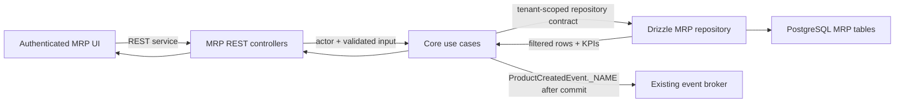

# MRP product catalog and registration

## 1. Context and scope

### Objective

Implement the first usable MRP product catalog for an authenticated establishment manager. A manager must be able to inspect the products belonging to the current establishment, narrow the catalog with operational filters, and register a product with the stock configuration needed by future MRP workflows.

This Spec is grounded in [GitHub Issue #8](https://github.com/rafinel/scoops/issues/8), MRP PRD requirements REQ-01, REQ-04 and REQ-05, the existing MRP core skeleton, and the supplied Pencil references in [`design/onoreo.pen`](../../../../design/onoreo.pen). It covers a cross-layer implementation in `packages/core`, `apps/server`, and `apps/web`.

### Current gap

The repository currently contains the beginnings of the MRP product domain: `Product`, product category/unit/status/stock-control structures, a products repository contract, and create/update use cases. The server MRP module only composes its empty database module; it has no MRP models, repository implementation, migration, REST controller, fixture, or seeder. The shared Drizzle schema exports Identity models only. The web `/products` route renders a placeholder and the REST context exposes Identity only. There is no list use case, filtered catalog response, or registration UI.

The current core create-product validation is useful baseline behavior but is not yet the complete Issue #8 contract: it does not provide manager actor handling, list/filter/KPI behavior, atomic initial-stock initialization, or the server/web transport boundary required by the issue.

### Product and PRD alignment

| Product requirement | Contract in this Spec | Alignment |
| --- | --- | --- |
| REQ-01 — product registration and product rules | Registration accepts name, unit, categories, stock control, initial stock, ideal stock, optional negative-stock permission, and registration-time by-brand inputs. Products start active with the requested initial balance. Portion/Resale, Manufacturable/By-brand, duplicate-name, missing-field, and non-negative stock rules are authoritative in Core and enforced again by the database. | Registration slice of REQ-01; later brand editing, recipe, pricing, and operational configuration remain outside this Spec. |
| REQ-04 — product list and filters | Search, category/status/stock filters, sorting, pagination, filter-aware KPIs, low-stock signaling, and distinct empty states are included. Multiple categories use OR; filter groups and search use AND. | Full Issue #8 list scope. |
| REQ-05 — dedicated product page | Not implemented by this Spec. Product detail navigation and operational detail surfaces are deferred to a follow-up feature. | Deliberately excluded from Issue #8 implementation scope. |

### Scope boundary

Included:

- A tenant-safe manager catalog with name search, category/status/stock filters, sorting, pagination, current-filter KPIs, loading/error/recovery states, and separate “no products” versus “no results for these filters” empty states.
- Manager-only product registration with name, unit, one or more categories, stock-control mode, and required ideal stock subject to the decision below.
- Active product creation with a client-provided initial stock. For by-brand products, the initial stock is the sum of the initial quantity entered for each registration-time brand. The response returns the created product identifier; no detail route is implemented here.
- Core use cases, repository contracts, server persistence/REST wiring, web service/context wiring, responsive accessible UI, automated tests, and visual references.

Explicitly excluded:

- Post-registration brand editing and any standalone brand-management workflow. Registration-time brand rows, package configuration, and their initial quantities are included when stock control is By brand; the catalog may read existing brand rows only to calculate the KPI and row count.
- Stock adjustments, movement history, inventory mutations, and automatic unit conversion.
- Recipes, production, accompaniments, sizes, resale configuration, POS, financial reporting, pricing, and operational product tabs.
- Bulk import/export, deletion, status editing, category management, and an employee-facing catalog.

### Product decisions and assumptions

The following decisions make the issue executable while preserving repository authority:

- “Manager” means the existing authenticated `UserProfile.Manager`. The REST layer applies the existing manager profile guard; each Core operation also receives the authenticated actor and scopes all reads/writes to the actor's `establishmentId`.
- The code value `accompaniment` is the existing MRP representation of the PRD/UI “Side dish”/“Acompanhamento” category. It must not introduce a second category value.
- Search is case-insensitive name matching. Within category filters, categories are OR. Search, status, and stock-situation groups are AND. An omitted group imposes no constraint.
- The initial catalog page is 1-indexed with a default page size of 10, matching the supplied desktop reference; the server caps requested page size at 100. The default sort is product creation datetime descending, with product ID as a deterministic tie-breaker so the most recently created products appear first.
- The visible KPI set is Products, Brands, and Low stock, matching `AXNGh`. “Brands” counts distinct existing brand records attached to the filtered product set. “Low stock” uses the same filtered product set and the product's effective ideal-stock comparison. The PRD's limited-production KPI is deferred because recipe/production behavior is out of scope.
- A product is created with `status=active`. Single-stock products initialize their balance from `initialStock`; by-brand products create registration-time brands and initialize each brand balance from its `initialQuantity`. The product's effective initial stock is the sum of those brand quantities.
- Product detail navigation and page rendering are deferred. A future feature may reuse the existing `bi8Au` Pencil reference, but it is not part of this implementation contract.
- Product-facing copy follows the existing Portuguese UI. Domain/API names remain English and use the existing enum values and REST error envelope.

### Resolved product decision

Ideal stock and initial stock are required non-negative quantities during product registration. For Single stock, `initialStock` is entered directly. For By brand, each brand has an initial quantity and the product-level initial stock is calculated as their sum. The supplied Pencil frames do not show these fields, so the implementation adds them as intentional contract extensions while preserving the surrounding modal composition and existing design tokens.

The design frame `XzPz2` also shows “Permitir estoque negativo” and inline brand rows. The negative-stock permission and registration-time brand rows are included; post-registration brand management remains outside this Spec.

### Design contract

The supplied Pencil states are saved beside this Spec and indexed by [`design/manifest.md`](./design/manifest.md):

| State | Reference | Use | Viewport/artboard |
| --- | --- | --- | --- |
| Products catalog | [`AXNGh.png`](./design/AXNGh.png) | Normative desktop list composition, KPI hierarchy, table, pagination, and Portuguese copy direction. | 1481 × 1450 |
| Product filters | [`DsR63.png`](./design/DsR63.png) | Normative filter groups, selected states, clear/apply actions, and dialog hierarchy. | 677 × 601 |
| New product — by brand | [`XzPz2.png`](./design/XzPz2.png) | Normative registration shell and stock-control variant; include the negative-stock toggle, brand rows, package fields, and per-brand initial quantities. | 727 × 1240 |
| New product — single stock | [`LPdBK.png`](./design/LPdBK.png) | Normative single-stock registration shell with initial-stock entry. | 708 × 826 |

No mobile Pencil frame was supplied. The responsive contract is therefore an implementation responsibility: at 320px wide the catalog must avoid horizontal scrolling, table content must collapse or become an accessible alternative, and dialogs must fit the viewport with keyboard-reachable actions. Existing Scoops tokens and components in `documentation/design.md` are authoritative over any literal value visible in a reference.

## 2. Implementation Contract

### Functional requirements

#### RF-01 — Authorized, tenant-scoped catalog access `[REQ-01]`

The catalog list and registration endpoints are available only to authenticated managers. The server must reject unauthenticated and unauthorized requests through the existing guards. Core receives the authenticated actor and every repository query includes the actor's establishment scope; a product belonging to another establishment is never returned, updated, or used to satisfy a duplicate-name check.

#### RF-02 — Product catalog query behavior `[REQ-04]`

The list supports case-insensitive name search, category filters, product status, stock situation, sort field/direction, and 1-indexed pagination. Category selection is OR within the category group. Search, status, and stock situation are AND with the category result. Supported sort fields are Creation datetime, Name, Stock quantity, Number of brands, Categories, and Unit. Unknown sort fields, directions, page values, and page sizes are rejected with the shared validation envelope.

#### RF-03 — Filter-aware result and KPI semantics `[REQ-04]`

The list response returns rows, pagination metadata, and KPIs from the same establishment-scoped filtered relation. Each row includes product identity, name, categories, unit, brand count, effective stock quantity, ideal quantity when configured, and stock situation. KPI values must not be calculated from the unfiltered catalog or from client-hidden rows.

#### RF-04 — Catalog states and recovery `[REQ-04, REQ-10]`

The web catalog exposes pending/loading, transport failure with retry, successful populated, no products, and no results for the active filters states. The no-products state offers “Register first product”; the filtered-empty state offers “Clear filters”. Clearing filters resets URL state and returns to the first page. Pending actions disable duplicate submission without trapping focus.

#### RF-05 — Registration form `[REQ-01]`

The New Product action opens an accessible modal with name, unit, categories, stock-control mode, initial stock, required ideal stock, and a disabled-by-default “Permitir estoque negativo” toggle. Name and unit are required; at least one category is required; categories are selected from the existing five values. The stock-control selection is Single or By brand, and Manufacturable forces Single. Single stock exposes an editable initial-stock input. By-brand stock exposes registration-time brand rows with name, package quantity, package value, package count, primary-brand state, and initial quantity; the product initial stock is read-only and calculated from those rows.

#### RF-06 — Authoritative product validation `[REQ-01]`

Core validates trimmed non-empty name, valid unit, at least one unique valid category, mutually exclusive Portion and Resale, Manufacturable requiring Single stock, required non-negative ideal and initial stock, required by-brand rows, non-negative brand quantities/values, and an initial-stock value equal to the sum of by-brand initial quantities. Negative-stock permission defaults to false. The server maps duplicate names to a conflict response and all other invalid input to the shared validation envelope. Database constraints backstop uniqueness and non-negative quantity/ideal-stock values against concurrent or non-REST callers; balance quantities may be negative only when the product-level permission allows the operation.

#### RF-07 — Registration result and stock initialization `[REQ-01]`

Successful registration creates an active product and its initial stock atomically. A Single product receives a single-stock balance initialized from `initialStock`; a By brand product creates the submitted brands and initializes each brand balance from `initialQuantity`, with the effective product initial stock equal to their sum. The response returns the created product identifier; no detail route or post-registration page is implemented by this Spec. Existing `ProductCreatedEvent._NAME` is published after the product transaction commits; no new asynchronous job is introduced by this Spec.

#### RF-08 — Responsive and accessible interaction `[REQ-10]`

The catalog, filter dialog, and registration dialog use semantic controls, accessible names, visible focus, keyboard traversal, escape/close behavior, inline field errors, and reduced-motion-safe transitions. At 320px wide there is no page-level horizontal scroll or clipped primary action. The desktop composition uses existing Scoops layout, typography, color, spacing, radius, and icon tokens.

### RF-to-REQ traceability

| RF | PRD requirement | Additional authority | Traceability |
| --- | --- | --- | --- |
| RF-01 | REQ-01 — tenant isolation and manager-owned product operations | Issue #8 authorization/establishment-isolation acceptance; server auth rules | Manager access and establishment scoping are product behavior, not client filtering. |
| RF-02 | REQ-04 — search and combined product filters | Issue #8 list/filter acceptance | Category OR and other-group/search AND semantics are made explicit here. |
| RF-03 | REQ-04 — sorting, pagination, and operational KPIs | Issue #8 filter-aware KPI acceptance | KPI aggregation uses the same filtered product relation. |
| RF-04 | REQ-04 — empty states and filter recovery; REQ-10 — loading/error states | Web UI and widget rules | Distinguishes an empty catalog from a filtered-empty result and preserves recovery behavior. |
| RF-05 | REQ-01 — product registration fields and stock-control configuration | Issue #8 registration acceptance; supplied Pencil registration states | Ideal and initial stock are explicit contract fields; by-brand registration includes brand rows and per-brand initial quantities. |
| RF-06 | REQ-01 — product validation and category dependencies | Issue #8 duplicate/category/stock/ideal-stock acceptance | Core and database enforce the same business invariants, including by-brand sum consistency. |
| RF-07 | REQ-01 — active product and stock configuration | Issue #8 stock initialization acceptance | Persistence, event timing, and requested initial-stock initialization are one observable registration outcome. |
| RF-08 | REQ-10 — responsive, accessible, loading, and interaction states | `documentation/design.md`; web UI rules | Responsive and accessibility details are implementation constraints supporting the catalog/registration state contract. |

### Acceptance criteria and evidence mapping

| ID | RF coverage | Acceptance criterion | Required evidence |
| --- | --- | --- | --- |
| CA-01 | RF-01 | An authenticated manager sees only products from the current establishment. | Core use-case tests, real server controller integration, and MV-04 tenant scenario. |
| CA-02 | RF-01 | Unauthenticated and non-manager callers cannot list or register products. | REST guard/controller tests and MV-04. |
| CA-03 | RF-02 | Search, category, status, and stock filters compose with category OR and other groups/search AND. | Core query tests, repository-backed controller tests, and MV-02 URL/request assertions. |
| CA-04 | RF-03 | Sorting and pagination are deterministic and the response's Products/Brands/Low stock KPIs reflect the active filtered set. | Repository/controller integration assertions and MV-01/MV-02. |
| CA-05 | RF-04 | The UI distinguishes an empty catalog from a filtered-empty catalog and provides the correct CTA. | Web route tests and MV-02. |
| CA-06 | RF-05 | Registration requires name, unit, and category and gives inline feedback for invalid fields. | Core use-case tests, web component tests, and MV-03. |
| CA-07 | RF-06 | Duplicate names, Portion/Resale, Manufacturable/By-brand, and negative ideal stock are rejected authoritatively. | Core validation tests, database-backed 409/422 tests, and MV-03. |
| CA-08 | RF-07 | Successful registration creates an active product with the requested initial stock (or the sum of by-brand initial quantities) and returns the created product identifier without implementing a detail page. | Server persistence/event assertions, web route test for POST, and MV-03. |
| CA-09 | RF-01 | Cross-establishment products do not appear in the manager's catalog. | Real server integration with two establishments and MV-04. |
| CA-10 | RF-08 | Catalog and dialogs are keyboard usable, visible at narrow width, and free of page-level horizontal overflow. | Playwright CLI keyboard/viewport run and MV-05; visual comparison to every manifest state. |
| CA-11 | RF-04 | A catalog transport error exposes recovery and does not leave stale pending controls. | Web route tests and MV-02/MV-04 failure paths. |

### Planned manual scenarios

These scenarios are validation procedures, not evidence that has already been run.

- **MV-01 — Populated catalog:** with a manager account and seeded products, open `/products` at the desktop reference viewport and confirm breadcrumb/title/KPIs/table/category chips/low-stock treatment/pagination.
- **MV-02 — Query states:** exercise name search, repeated category selection, status and stock filters, sort and page changes; inspect the resulting URL and request; verify KPI changes, no-results/clear-filters behavior, empty-catalog/register-first behavior, retry after a failed request, and filter-dialog focus order.
- **MV-03 — Registration variants:** register a valid Single product with an initial stock and a valid By brand product with brand rows, verify the product initial stock equals the sum of brand initial quantities, exercise the disabled-by-default negative-stock toggle, confirm the server response creates an active product identifier, and exercise missing fields, duplicate name, Portion/Resale, Manufacturable/By-brand, negative ideal-stock, and inconsistent brand-sum errors.
- **MV-04 — Authorization and tenant isolation:** verify manager success, unauthenticated 401, non-manager 403, and that a foreign product is not present in list results. Server/Core integration suites own real authorization and tenant persistence; the web route suite covers the mocked browser contract only.
- **MV-05 — Responsive and keyboard path:** at 320px width open the catalog, filter dialog, and registration dialog; tab through controls, submit through the keyboard, inspect focus restoration and inline errors, close with Escape, and verify no page-level horizontal overflow or clipped primary action. Repeat visual comparisons at the supplied desktop/artboard sizes.

### Implementation surface and ownership

The implementation must preserve the following boundaries. Names are target contracts; existing files are modified only where listed.

| Surface | Owner | Required outcome |
| --- | --- | --- |
| Core domain and structures | `packages/core/src/mrp` | Product catalog row/KPI/result types, normalized list parameters, actor-aware registration/list contracts, and validation errors without framework or persistence imports. |
| Core use cases | `packages/core/src/mrp/use-cases` | `RegisterProductUseCase` and `ListProductsUseCase`; replace or retire the unconsumed create-product path so there is one authoritative registration behavior. |
| Core interfaces | `packages/core/src/mrp/interfaces` | Products repository query/registration contract, optional read contract for brand-count aggregation, and MRP service contract consumed by the web REST adapter. |
| Server database | `apps/server/src/mrp/database` plus shared schema/migration | MRP product, brand-read, and stock-balance persistence; tenant-scoped repository; mapper; module provider; migration; seeder/fixture. No imports of Identity database models. |
| Server REST | `apps/server/src/mrp/rest` and `apps/server/rest-client/mrp/products.rest` | Manager-guarded list and registration controllers with request types derived from Core inputs, Swagger responses, shared errors, and executable REST examples. |
| Server composition | `apps/server/src/mrp/mrp.module.ts` and MRP tokens | Register the repository, controllers, and use-case dependencies through the MRP module while keeping `AppModule` as the existing root composition point. |
| Web transport | `apps/web/src/rest/services/mrp-service.ts`, REST context/types, and route constants | Map JSON dates/errors to the Core MRP service contract and expose the service through the existing context; keep session headers in the shared transport. |
| Web catalog | `apps/web/src/ui/mrp`, authenticated product route, generated route tree | Shared query/action hooks own server state and mutations; page and child widgets render accessible catalog, dialogs, empty/error states. The feature does not add a product detail route. |
| Web validation | `apps/web/tests/routes/mrp` and colocated MRP widget tests | Route tests cover protected access, request/URL contracts, visible success/error/loading/empty states, narrow viewport, and keyboard behavior. |

## 3. Technical Contract

### Runtime flow



The request path is synchronous through the authenticated server. Client-side filters are URL state and presentation; they are never a security boundary. The server extracts the current account from the existing authentication guard, applies the manager profile guard, maps it to the Core actor contract, and passes establishment scope into every use case.

### Core domain contract

Modify the existing MRP types rather than creating a parallel product model:

- Preserve `Product`, `ProductCategory`, `ProductStatus`, `ProductStockControl`, `ProductUnit`, `StockBalance`, and the existing category value `accompaniment`.
- Extend `ProductListParams` with `categories`, `sortBy`, and `sortDirection`; normalize page/pageSize and search in `ListProductsUseCase` before calling the repository. Keep `establishmentId` mandatory.
- Add explicit catalog result structures for a row (`product`, `brandCount`, `stockQuantity`, `idealStock`, `stockSituation`) and response KPIs (`products`, `brands`, `lowStock`). Do not overload `Product` with list-only aggregates.
- Add a registration input structure containing `name`, `unit`, `categories`, `stockControl`, and required `idealStock`; status and stock balance are outputs, not caller-controlled fields.
- Use the existing domain error taxonomy/translation boundary. Duplicate names must be distinguishable from malformed input so REST can return conflict versus validation status.
- Keep `ProductCreatedEvent` and its `_NAME` as the event contract. The registration use case publishes it only after repository persistence succeeds.

The following TypeScript shapes are the canonical Core contract. Each exported type is stored in its own file according to the Core one-export-per-file rule; the paths shown are implementation targets, not a request to duplicate types in one module.

```ts
// packages/core/src/mrp/structures/product-actor.ts
export type ProductActor = {
  id: string
  establishmentId: string
  profile: UserProfile
}

// packages/core/src/mrp/structures/register-product-input.ts
export type RegisterProductInput = {
  name: string
  unit: ProductUnit
  categories: readonly ProductCategory[]
  stockControl: ProductStockControl
  idealStock: number
}

// packages/core/src/mrp/structures/product-catalog-row.ts
export type ProductCatalogRow = {
  product: Product
  brandCount: number
  stockQuantity: number
  idealStock?: number
  stockSituation: ProductStockSituation
}

// packages/core/src/mrp/structures/product-catalog-kpis.ts
export type ProductCatalogKpis = {
  products: number
  brands: number
  lowStock: number
}

// packages/core/src/mrp/structures/product-catalog-page.ts
export type ProductCatalogPage = PaginationResponse<ProductCatalogRow> & {
  kpis: ProductCatalogKpis
}

```

`Product`, `ProductCategory`, `ProductUnit`, `ProductStockControl`, `ProductStatus`, `ProductStockSituation`, and `PaginationResponse` remain the existing Core contracts. The server maps the authenticated Identity `Account` to `ProductActor`; MRP does not import Identity persistence models. `ProductCatalogRow`, `ProductCatalogKpis`, and `ProductCatalogPage` are read structures, not new database entities. `Product` remains the aggregate entity; existing `Brand` and `StockBalance` contracts are reused, and no new brand-management, recipe, production, movement, or detail-page entity is introduced.

### Core use-case contract

The target use cases are:

| Use case | Input | Output and rules |
| --- | --- | --- |
| `ListProductsUseCase` | `{ actor, search?, categories?, status?, stockSituation?, sortBy?, sortDirection?, page?, pageSize? }` | Filtered `ProductCatalogPage`; actor must be a manager and all query parameters are normalized/validated. |
| `RegisterProductUseCase` | `{ actor, name, unit, categories, stockControl, idealStock, initialStock?, brands? }` | Active `Product` plus requested initial stock; validates all RF-06 rules, checks duplicate name within actor establishment, persists product/brands/balances atomically, then publishes the existing event. |

The existing `UpdateProductUseCase` remains outside this feature unless its shared validation must be extracted to avoid two incompatible rule implementations. If it is touched, its tests and contract must be updated in the same change; do not silently widen update behavior.

### Repository and persistence contract

`ProductsRepository` must provide establishment-aware operations sufficient for the two use cases. The list operation returns the catalog page and KPIs from one consistent filtered query boundary; registration must be atomic with the zero-balance initialization.

### Data model

The MRP database owns three tables. The model documentation below is the canonical migration contract; generated Drizzle names and statement ordering may differ while preserving these columns, indexes, constraints, and relationships.

#### Table: `mrp_products`

| Column | Type | Nullable | Default | Description |
| --- | --- | --- | --- | --- |
| `id` | `uuid` | No | `-` | Primary key; generated by the application/domain adapter. |
| `establishment_id` | `uuid` | No | `-` | Tenant scope; opaque to MRP and included in every product predicate. |
| `name` | `text` | No | `-` | Trimmed product name, unique case-insensitively within the establishment. |
| `unit` | `mrp_product_unit` | No | `-` | One of `g`, `ml`, `kg`, `l`, `un`. |
| `categories` | `mrp_product_category[]` | No | `-` | One or more MRP categories. |
| `stock_control` | `mrp_product_stock_control` | No | `-` | `single` or `by_brand`. |
| `status` | `mrp_product_status` | No | `active` | Product lifecycle status. |
| `allow_negative_stock` | `boolean` | No | `false` | Allows product write-offs to project this product's balance below zero. |
| `ideal_stock` | `numeric(18,3)` | Yes | `-` | Optional non-negative ideal quantity used for low-stock classification. |
| `internal_notes` | `text` | Yes | `-` | Reserved product notes; not edited by this feature. |
| `created_at` | `timestamptz` | No | `-` | Creation timestamp. |
| `updated_at` | `timestamptz` | No | `-` | Last update timestamp. |

Indexes:

| Index name | Columns | Type | Purpose |
| --- | --- | --- | --- |
| `mrp_products_establishment_name_unique` | `establishment_id`, `lower(name)` | unique btree | Case-insensitive duplicate-name protection per tenant. |
| `mrp_products_establishment_status_idx` | `establishment_id`, `status` | btree | Status-filtered catalog queries. |
| `mrp_products_establishment_name_idx` | `establishment_id`, `name` | btree | Tenant-scoped name ordering and lookup support. |

Constraints:

| Constraint | Type | Definition | Purpose |
| --- | --- | --- | --- |
| `mrp_products_pkey` | PRIMARY KEY | `id` | Unique product identifier. |
| `mrp_products_categories_not_empty` | CHECK | `cardinality(categories) > 0` | Requires at least one category. |
| `mrp_products_categories_compatible` | CHECK | Portion and Resale cannot coexist. | Enforces category dependency. |
| `mrp_products_manufacturable_single` | CHECK | Manufacturable requires `stock_control = 'single'`. | Prevents invalid stock configuration. |
| `mrp_products_ideal_stock_non_negative` | CHECK | `ideal_stock IS NULL OR ideal_stock >= 0` | Prevents invalid low-stock thresholds. |

#### Table: `mrp_product_brands`

This table is read-only for Issue #8. It supports brand counts and future by-brand workflows; no brand-management endpoint or UI is included.

| Column | Type | Nullable | Default | Description |
| --- | --- | --- | --- | --- |
| `id` | `uuid` | No | `-` | Primary key for a product-brand record. |
| `product_id` | `uuid` | No | `-` | Product owner. |
| `name` | `text` | No | `-` | Brand name. |
| `package_quantity` | `numeric(18,3)` | Yes | `-` | Package quantity reserved for future brand configuration. |
| `package_value` | `numeric(18,3)` | Yes | `-` | Package value reserved for future brand configuration. |
| `is_primary` | `boolean` | No | `false` | Primary-brand marker for future workflows. |
| `created_at` | `timestamptz` | No | `-` | Creation timestamp. |
| `updated_at` | `timestamptz` | No | `-` | Last update timestamp. |

Indexes:

| Index name | Columns | Type | Purpose |
| --- | --- | --- | --- |
| `mrp_product_brands_product_idx` | `product_id` | btree | Product row counts and brand KPI aggregation. |

Constraints:

| Constraint | Type | Definition | Purpose |
| --- | --- | --- | --- |
| `mrp_product_brands_pkey` | PRIMARY KEY | `id` | Unique brand record identifier. |
| `mrp_product_brands_product_fk` | FOREIGN KEY | `product_id REFERENCES mrp_products(id) ON DELETE CASCADE` | Keeps brand rows attached to an existing product. |

#### Table: `mrp_stock_balances`

The nullable `brand_id` distinguishes the single-stock row from a by-brand balance. A single-stock product has one null-brand row initialized to zero; a by-brand product aggregates brand rows and is effectively zero when no brands exist.

| Column | Type | Nullable | Default | Description |
| --- | --- | --- | --- | --- |
| `product_id` | `uuid` | No | `-` | Product owner. |
| `brand_id` | `uuid` | Yes | `-` | Optional brand owner; null means the single-stock balance. |
| `quantity` | `numeric(18,3)` | No | `0` | Current stock quantity; it may be negative when the owning product allows negative stock. |
| `ideal_quantity` | `numeric(18,3)` | Yes | `-` | Optional non-negative balance-level ideal quantity. |
| `updated_at` | `timestamptz` | No | `-` | Last balance timestamp. |

Indexes:

| Index name | Columns | Type | Purpose |
| --- | --- | --- | --- |
| `mrp_stock_balances_single_product_unique` | `product_id` where `brand_id IS NULL` | unique btree | One single-stock balance per product. |
| `mrp_stock_balances_brand_unique` | `product_id`, `brand_id` where `brand_id IS NOT NULL` | unique btree | One balance per product/brand pair. |

Constraints:

| Constraint | Type | Definition | Purpose |
| --- | --- | --- | --- |
| `mrp_stock_balances_product_fk` | FOREIGN KEY | `product_id REFERENCES mrp_products(id) ON DELETE CASCADE` | Removes balances with their product. |
| `mrp_stock_balances_brand_fk` | FOREIGN KEY | `brand_id REFERENCES mrp_product_brands(id) ON DELETE CASCADE` | Removes brand balances with their brand. |
| `mrp_stock_balances_ideal_non_negative` | CHECK | `ideal_quantity IS NULL OR ideal_quantity >= 0` | Prevents invalid balance thresholds. |

Cross-database notes:

- This repository targets PostgreSQL; native enums and enum arrays are intentional and must remain aligned with the Core enum values.
- Use `numeric(18,3)` for quantities so grams, milliliters, and future fractional units do not lose precision.
- Use `timestamptz` for `created_at`, `updated_at`, and balance timestamps; map them to JavaScript `Date` values at the Core boundary.
- UUIDs are supplied by the application/domain adapter, matching existing Scoops migration conventions; do not add database-specific ID behavior to Core.
- Partial unique indexes on nullable `brand_id` are PostgreSQL-specific and are required to distinguish the single-stock row from by-brand rows.
- `establishment_id` is intentionally not a foreign key to Identity tables. MRP enforces tenant isolation through actor scope and repository predicates without importing Identity ORM models.

Migration delivery: create the next migration at `apps/server/src/shared/database/drizzle/migrations/0004_mrp_products.sql` (or the repository-generated equivalent tag) through the repository's migration generator and journal update. Do not manually edit generated metadata. Generated identifiers and statement ordering may differ from the model names above, but the documented columns, indexes, constraints, relationships, and PostgreSQL types are mandatory.

### Server REST contract

All routes are grouped under the MRP owning module and use the existing authentication/profile guards and shared error envelope.

| Method/path | Request | Success response | Error behavior |
| --- | --- | --- | --- |
| `GET /products` | Query: repeated `category` values, `search`, `status`, `stockSituation`, `sortBy`, `sortDirection`, `page`, `pageSize`. | `200` with `{ items, page, pageSize, totalItems, totalPages, kpis }`; items contain catalog row aggregates. | `401`, `403`, `422` using the shared envelope. |
| `POST /products` | JSON derived from `RegisterProductInput`: `name`, `unit`, `categories`, `stockControl`, required `idealStock`, optional `allowNegativeStock`. | `201` with the created product identifier and registration result. | `401`, `403`, `409` duplicate name, `422` malformed or conflicting rules. |

Controllers must construct Core use cases from token-injected MRP contracts, not contain business rules or direct Drizzle calls. Request schemas must accept only the contract fields, including the optional negative-stock flag, and reject unsupported brand rows while using the existing response/status Swagger conventions. Add the corresponding executable examples to `apps/server/rest-client/mrp/products.rest`.

### Web transport and route contract

Add an MRP service factory under `apps/web/src/rest/services/mrp-service.ts` implementing the Core MRP service contract. It maps ISO date strings and the server error envelope, while the shared REST client remains responsible for session headers. Extend the existing REST context/provider types with `mrpService`; do not create a second client or bypass the context from widgets.

The Core service interface has exactly these browser-facing methods:

```ts
// packages/core/src/mrp/interfaces/mrp-service.ts
export interface MrpService {
  listProducts(
    input: Omit<ProductListParams, 'establishmentId'>,
  ): Promise<RestResponse<ProductCatalogPage>>
  registerProduct(
    input: RegisterProductInput,
  ): Promise<RestResponse<Product>>
}
```

The web adapter in `apps/web/src/rest/services/mrp-service.ts` implements the same two methods:

- `listProducts(input)` sends `GET /products`, serializes repeated `category` query parameters plus search/filter/sort/page state, and maps the JSON page rows/KPIs into `ProductCatalogPage` and `Date` values.
- `registerProduct(input)` sends `POST /products` with exactly the `RegisterProductInput` fields and maps the successful JSON product into `Product`. It preserves the shared `RestResponse` error/status envelope.

There is intentionally no `getProduct`, `getProductDetails`, or detail-navigation service method in this feature. The service factory must be covered by `apps/web/src/rest/services/tests/mrp-service.test.ts` for query serialization, registration payloads, successful response mapping, and failed-response preservation.

The list URL owns serializable search state: search text, repeated category values, status, stock situation, sort, direction, and page. A filter or search change resets page to 1. Query keys include the complete normalized request. Registration success invalidates the catalog query and keeps the manager on the catalog route; it does not navigate to an unimplemented detail page.

`useProductsQuery` owns the TanStack Query key, normalized list request, loading/error/retry state, and `mrpService.listProducts` call. `useRegisterProductAction` owns the mutation, pending/error state, `mrpService.registerProduct` call, and successful catalog-query invalidation; it does not perform navigation. `use-products-page.ts` composes these hooks with URL state and passes their typed results/actions to child widgets. Query/action hooks must remain independently testable and must not be recreated inside presentational children.

The authenticated route files are:

- Modify `apps/web/src/routes/_authenticated/products/index.tsx` to use the existing `requireAuthMiddleware`, parse search state, and render the MRP page.
- Keep the existing `routes.products` constant for the catalog. Do not add a product detail route or manually edit the generated route tree.

### Web widget contract

Use the existing MRP UI boundary and the widget convention of `index.tsx` plus colocated `use-*.ts` for stateful widgets:

```text
apps/web/src/ui/mrp/
  hooks/
    use-products-query.ts
    use-register-product-action.ts
  widgets/
    pages/
      products-page/
        index.tsx
        use-products-page.ts
        products-kpi-cards/
          index.tsx
          use-products-kpi-cards.ts
        products-list-card/
          index.tsx
          use-products-list-card.ts
        products-empty-state/
          index.tsx
          use-products-empty-state.ts
        product-filters-dialog/
          index.tsx
          use-product-filters-dialog.ts
        product-registration-dialog/
          index.tsx
          use-product-registration-dialog.ts
```

Every page and child widget directory owns an `index.tsx` renderer and a colocated `use-*.ts` hook. Page hooks own cross-widget orchestration: React Query state, URL state, form state, validation, mutation, retry, and catalog-state effects. Child hooks own only their widget's local state, derived values, effects, and event handlers; child renderers receive typed data/actions and use the shared design-system primitives, `Anchor`, `Icon`, `Pagination`, and semantic Tailwind tokens. The registration dialog must render the Single and By-brand states from one contract; brand rows are registration-time inputs, not a post-registration brand-management surface.

### Tests and fixtures

#### Test file structure

| Test file | Test type | Target | Coverage goal |
| --- | --- | --- | --- |
| `packages/core/src/mrp/use-cases/tests/register-product-use-case.test.ts` | Unit | `RegisterProductUseCase` | Every registration rule, manager actor, duplicate conflict, single/by-brand initial-stock output, and event timing. |
| `packages/core/src/mrp/use-cases/tests/list-products-use-case.test.ts` | Unit | `ListProductsUseCase` | Tenant scope, parameter normalization, filter composition, deterministic pagination/sort, and filtered KPIs. |
| `apps/server/src/mrp/rest/controllers/tests/list-products.controller.test.ts` | Integration | `GET /products` | Real Nest wiring, auth, filtered rows/KPIs, query validation, and HTTP envelope. |
| `apps/server/src/mrp/rest/controllers/tests/register-product.controller.test.ts` | Integration | `POST /products` | Real persistence, duplicate/validation statuses, active status, initial stock, and event publication. |
| `apps/web/src/rest/services/tests/mrp-service.test.ts` | Unit | `MrpService` | Query serialization, registration payload, response mapping, and shared error preservation. |
| `apps/web/src/ui/mrp/hooks/tests/use-products-query.test.ts` | Unit | `useProductsQuery` | Query key/request mapping, loading/error/retry state, and service response ownership. |
| `apps/web/src/ui/mrp/hooks/tests/use-register-product-action.test.ts` | Unit | `useRegisterProductAction` | Mutation payload, pending/error state, success invalidation, and no-navigation behavior. |
| `apps/web/src/ui/mrp/widgets/pages/products-page/tests/use-products-page.test.ts` | Unit | Products page hook | URL/query state, filters, pagination reset, retry, mutation invalidation, and catalog-state recovery. |
| `apps/web/src/ui/mrp/widgets/pages/products-page/tests/products-page.test.tsx` | Component | Products page renderer | KPI/list/empty/error/loading states, accessible actions, and child wiring. |
| `apps/web/src/ui/mrp/widgets/pages/products-page/tests/product-filters-dialog.test.tsx` | Component | Filter dialog child | Draft selections, category OR state, clear/apply/cancel, focus, and keyboard close. |
| `apps/web/src/ui/mrp/widgets/pages/products-page/tests/product-registration-dialog.test.tsx` | Component | Registration dialog child | Single/By-brand variants, ideal/initial-stock fields, brand-row calculations, inline errors, and pending submit. |
| `apps/web/tests/routes/mrp/products.index.test.ts` | Playwright route | `/products` | Protected route, request/URL contract, populated/empty/error states, keyboard path, and 320px layout. |

#### Test cases by file

For each test file, implement the following named scenarios or equivalent descriptive test names. Assertions must verify observable outcomes, not only that a method was called.

| Test file | Test case | Description | Assertions |
| --- | --- | --- | --- |
| `register-product-use-case.test.ts` | `registers_valid_single_stock_product` | Registers a manager product with required ideal and initial stock. | Product is active, effective stock equals the requested initial stock, normalized name is persisted, and `ProductCreatedEvent._NAME` is published after persistence. |
| `register-product-use-case.test.ts` | `rejects_registration_rules` | Exercises missing name/unit/category, invalid category, Portion+Resale, Manufacturable+By-brand, and negative ideal stock. | Each branch returns the named Core validation error and repository add is not called. |
| `register-product-use-case.test.ts` | `rejects_duplicate_name_in_establishment` | Attempts a case-insensitive duplicate in the current tenant. | Conflict error is returned; a same-named product in another tenant does not conflict. |
| `list-products-use-case.test.ts` | `applies_category_or_and_group_and_semantics` | Combines repeated categories with search/status/stock filters. | Repository receives normalized category OR plus AND groups and trimmed search. |
| `list-products-use-case.test.ts` | `returns_filtered_rows_and_kpis` | Lists a populated filtered catalog. | Rows, page metadata, Products/Brands/Low stock KPIs, and low-stock values match the same filtered set. |
| `list-products-use-case.test.ts` | `normalizes_pagination_and_sort` | Sends omitted, invalid, oversized, and tie-valued pagination/sort inputs. | Defaults are applied, invalid values are rejected, page size is capped, and ordering is deterministic. |
| `use-products-query.test.ts` | `requests_normalized_products_query` | Runs the catalog query with URL-derived parameters. | The stable query key contains normalized params, the service receives the exact request, and loading/error/retry states are exposed. |
| `use-register-product-action.test.ts` | `registers_and_invalidates_catalog` | Submits a valid registration through the mutation hook. | Exact input reaches the service, pending/error state is exposed, the catalog query is invalidated on success, and navigation is not called. |
| `list-products.controller.test.ts` | `returns_filtered_catalog_for_manager` | Calls the real endpoint with search, repeated categories, status, stock, sort, and pagination. | HTTP 200 body contains expected rows/KPIs and repository persistence is respected. |
| `list-products.controller.test.ts` | `rejects_unauthorized_catalog_requests` | Calls list without authentication and with a non-manager account. | HTTP 401/403 uses the shared error envelope and no product data is returned. |
| `register-product.controller.test.ts` | `creates_product_and_initial_balances` | Posts a valid Single and By-brand registration. | HTTP 201 returns ID/location, product is active, single stock uses `initialStock`, and by-brand stock equals the sum of persisted brand initial quantities. |
| `register-product.controller.test.ts` | `maps_duplicate_and_rule_errors` | Posts duplicate and invalid category/stock/ideal-stock combinations. | HTTP 409/422 statuses and error fields match the REST contract. |
| `mrp-service.test.ts` | `serializes_list_and_registration_requests` | Calls both web service methods with representative inputs and failed responses. | Repeated categories/query values and exact POST fields are sent; successful JSON is mapped and failed `RestResponse` is preserved. |
| `use-products-page.test.ts` | `updates_url_and_query_for_filters` | Changes search, filters, sorting, and page. | URL/search state and service request stay synchronized; filter changes reset page to 1. |
| `products-page.test.tsx` | `renders_catalog_and_empty_states` | Renders populated, loading, error, no-products, and filtered-empty responses. | Correct KPIs, rows, retry/clear/register CTAs, accessible names, and pending states are visible. |
| `product-filters-dialog.test.tsx` | `applies_or_categories_and_restores_focus` | Selects categories/status/stock, clears, cancels, and applies with keyboard. | Draft state is isolated until Apply; category selections are preserved; focus returns to trigger. |
| `product-registration-dialog.test.tsx` | `validates_and_submits_registration` | Exercises both stock-control variants and ideal stock. | Inline errors are visible; invalid submission does not call service; valid submission sends the exact contract, invalidates the catalog, and remains on the catalog route. |
| `products.index.test.ts` | `protects_and_filters_products_route` | Runs the real browser route with controlled transport and keyboard/320px checks. | Protected access, URL/request parameters, visible states, no horizontal overflow, and focus behavior pass. |

#### Fixtures and test data

Add MRP fixture/seeder support under `apps/server/src/mrp/database` with deterministic data for two establishments: products across all categories, active/inactive statuses, normal/low stock, single/by-brand control, existing brands, and zero/non-zero balances. Use the real Nest module, `RestFixture`, `DatabaseFixture`, and Testcontainers/Postgres for server integration. Do not add isolated model/mapper tests; exercise those through controller integration. Web route tests may mock transport for isolated UI behavior but must not be presented as proof of real server persistence.

## 4. Validation Contract

### Automated validation

Run these commands after implementation, with the generated route tree and migration included in the working tree:

| Boundary | Commands | Required result |
| --- | --- | --- |
| Core | `pnpm --filter @scoops/core check:code`, `pnpm --filter @scoops/core check:types`, `pnpm --filter @scoops/core test` | Core lint/type checks pass; registration, list, and event behavior are covered. |
| Server | `pnpm --filter server check:code`, `pnpm --filter server check:types`, `pnpm --filter server test`, `pnpm --filter server build` | MRP migration, module wiring, REST controllers, repository queries, and persistence integration pass. |
| Web | `pnpm --filter web generate-routes`, `pnpm --filter web check:code`, `pnpm --filter web check:types`, `pnpm --filter web test` | Generated routes and unit/component tests pass without bypassing UI ownership rules. |
| Browser | `pnpm --filter web test:integration -- tests/routes/mrp/products.index.test.ts` | Focused Playwright catalog route scenarios pass with current route/request/visible-state assertions. |

Before real browser validation, inspect `docker compose ps` and verify the required Supabase/server/web health endpoints. Start `pnpm --filter server dev` and `pnpm --filter web dev` in persistent sessions when full-stack evidence is required; stop processes started for this validation afterward. Do not claim mocked route tests prove authenticated server-backed behavior.

### Coverage matrix

| Requirement | Core unit | Server integration | Web route/component | Manual/visual |
| --- | --- | --- | --- | --- |
| CA-01/CA-09 tenant scope | Actor and establishment predicates | Two-establishment database fixture | Protected catalog route | MV-04 |
| CA-02 authorization | Actor rejection | Guard + 401/403 | Protected route behavior | MV-04 |
| CA-03 filtering | Normalization/query contract | SQL result/KPI assertions | URL/query request assertions | MV-02 |
| CA-04 sort/pagination/KPIs | Result semantics | Filtered aggregate query | Table/pagination rendering | MV-01/MV-02 |
| CA-05 empty states | — | Empty response | Empty/clear CTA tests | MV-02 |
| CA-06/CA-07 registration validation | All rule branches | 409/422 and DB backstop | Inline errors/form pending | MV-03 |
| CA-08 active initial-stock success | Use-case output/event | Persisted product/brand balances | POST result and catalog invalidation | MV-03 |
| CA-10 responsive/accessibility | — | — | Keyboard/viewport assertions | MV-05 and manifest comparisons |
| CA-11 recovery | — | Transport/error envelope | Retry/pending recovery | MV-02/MV-04 |

### Visual evidence requirements

For each supplied state in [`design/manifest.md`](./design/manifest.md), capture an implementation screenshot at the manifest viewport/artboard size and record the comparison in the future `evaluation.md`. Required comparisons are catalog, filter dialog, and both registration variants. Record any intentional deviation, especially omitted inline-brand management and responsive adaptation where no mobile reference exists. Screenshots are supporting evidence; DOM, URL/request, console, network, keyboard, and persisted-state assertions remain required.

### Completion gate

This Spec is `open` following confirmation that ideal stock is entered during registration. Implementation handoff requires all RF/CA rows mapped to tests or manual evidence, migration/journal reviewed, generated route tree regenerated, real manager/tenant fixtures available, every MV scenario executable, every design reference compared, and no active blocking finding. After implementation, route the completed Spec through `conclude-spec`.

## 5. Documentation alignment and revision history

### Repository authority consulted

| Source | Revision/evidence | Role in this Spec |
| --- | --- | --- |
| [GitHub Issue #8](https://github.com/rafinel/scoops/issues/8) | Retrieved 2026-08-17 | Authoritative requested outcome, scope, acceptance, and Pencil references. |
| [`documentation/prds/mrp.md`](../../../../documentation/prds/mrp.md) | Working tree, 2026-08-17 | Product rules, users, list semantics, empty states, and dedicated-page intent. |
| [`documentation/architecture.md`](../../../../documentation/architecture.md) | Working tree, 2026-08-17 | Modular-monolith boundaries, server authority, tenant isolation, and event/persistence direction. |
| [`documentation/modules.md`](../../../../documentation/modules.md) | Working tree, 2026-08-17 | MRP ownership and explicit cross-module contracts. |
| [`documentation/design.md`](../../../../documentation/design.md) | Working tree, 2026-08-17 | Tokens, layout, component, accessibility, and visual authority. |
| [`documentation/tooling.md`](../../../../documentation/tooling.md) | Working tree, 2026-08-17 | pnpm commands, migrations, route generation, and validation expectations. |
| `feat/products-page @ 3ad2ff9389683dbe535499e499b68c68e50a67a2` | Repository baseline inspected 2026-08-17 | Current code paths, MRP skeleton, Identity wiring patterns, and web placeholder route. |
| [`design/manifest.md`](./design/manifest.md) | Created with this revision | Saved Pencil screenshots, node IDs, viewport dimensions, and visual inventory. |

### Rule Pack

The dynamic rule router selected and the implementation must continue to apply:

- `documentation/rules/code-conventions-rules.md`
- `documentation/rules/core-package-rules.md`
- `documentation/rules/use-case-testing-rules.md`
- `documentation/rules/rest-layer-rules.md`
- `documentation/rules/controllers-testing-rules.md`
- `documentation/rules/ui-layer-rules.md`
- `documentation/rules/web-app-routing-rules.md`
- `documentation/rules/widget-testing-rules.md`
- `documentation/rules/database-layer-rules.md`
- `documentation/rules/server-app-layer-rules.md`

The selected rules cover Core boundaries/use-case testing, REST/controller contracts, database ownership and integration testing, server composition, and web routing/widgets/testing. Provisioning/messaging-specific rules were not expanded because this feature reuses the existing `ProductCreatedEvent` and adds no new job or provider behavior.

### Revision history

| Revision | Date | Status | Change |
| --- | --- | --- | --- |
| 1 | 2026-08-17 | `draft` | Created from Issue #8; documented the current implementation gap, complete Core/server/web contract, saved Pencil references, validation matrix, and the ideal-stock UI decision blocker. |
| 2 | 2026-08-17 | `open` | User confirmed that ideal stock is entered during product registration; resolved the only implementation blocker. |
| 3 | 2026-08-17 | `open` | Simplified the web widget tree: child widgets now live directly under each page widget without an intermediate `components/` directory. |
| 4 | 2026-08-17 | `open` | Specified `index.tsx` and colocated `use-*.ts` hooks for every page child widget. |
| 5 | 2026-08-17 | `open` | Restructured the persistence contract into per-table columns, indexes, constraints, database notes, and a migration example. |
| 6 | 2026-08-17 | `open` | Restructured Tests and fixtures into a test-file matrix, per-file test cases/assertions, and deterministic fixture requirements. |
| 7 | 2026-08-17 | `open` | Added direct RF coverage to every acceptance criterion and verified all RFs have CA coverage. |
| 8 | 2026-08-17 | `open` | Added direct RF-to-REQ traceability, including Issue #8 and repository-authority references where the PRD is not the sole source. |
| 9 | 2026-08-17 | `open` | Added REQ references directly to every RF heading so requirement traceability is visible at the point of definition. |
| 10 | 2026-08-17 | `open` | Removed the inline SQL migration example; retained the structured data model and concise migration-delivery requirement. |
| 11 | 2026-08-17 | `open` | Added canonical TypeScript definitions and file targets for every new Core domain structure. |
| 12 | 2026-08-17 | `open` | Removed product-detail implementation, route, REST operation, Core projection/use case, widgets, tests, and detail screenshot coverage from this feature. |
| 13 | 2026-08-17 | `open` | Added explicit `useProductsQuery` and `useRegisterProductAction` contracts, paths, responsibilities, and tests. |
| 14 | 2026-08-17 | `open` | Specified the exact `MrpService.listProducts` and `MrpService.registerProduct` methods, web adapter behavior, and transport tests. |
| 15 | 2026-08-17 | `open` | Removed explicit code signatures for action/query hooks while retaining their ownership, paths, and test coverage. |
| 16 | 2026-08-18 | `completed` | Incorporated the user-authorized initial-stock contract: Single stock accepts an initial quantity, By-brand registration accepts brand rows and derives product initial stock from their quantity sum; aligned persistence, validation, UI, tests, and evidence requirements. Final implementation, visual evidence, and PR CI completed. |

### Handoff

Handoff: completed through `conclude-spec`. The implementation spans Core, server persistence/REST, web routing/UI, migrations, generated routes, real tenant fixtures, and manual/visual validation. Detailed evidence is recorded in [`evaluation.md`](./evaluation.md); delivery is available in [PR #10](https://github.com/rafinel/scoops/pull/10).
