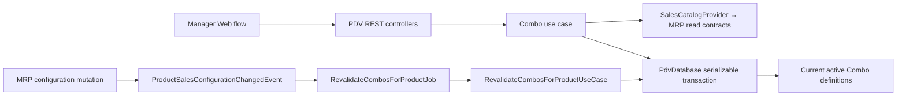

## 1. Context and scope

### Objective and source

Deliver the Manager-facing Combo discount capability defined by GitHub Issue #22 and PDV PRD `REQ-13`: replace the Discounts placeholder with tenant-isolated list, creation, detail/edit, lifecycle and deletion flows backed by current MRP sales configuration. This is a **complete** Spec because it spans Core, validation, persistence and migration, REST, Inngest integration, and multiple design-backed Web surfaces with security and concurrency risk.

### Current behavior and product gap

`/discounts` renders a placeholder and is visible to Operators. Core contains permissive `Discount`, `Combo` and `DiscountComponent` types plus repository/provider skeletons, but has no Combo use cases or tests. Server composition binds only sales-channel persistence and controllers; there is no discount schema, repository, MRP catalog adapter, REST operation or invalidation job. The Web `PdvService` and PDV widgets only implement sales channels. MRP emits `ProductUpdatedEvent` for only a subset of mutations and does not publish a complete sales-configuration fact, so PDV cannot reliably inactivate a Combo after a referenced configuration changes.

### Scope and product alignment

| Area | In scope | Out of scope |
| --- | --- | --- |
| Discount type | Combo as the only selectable MVP type; other visible types remain unavailable and marked “Em breve” | Buy-X-pay-Y, payment-method discounts, coupons, percentage discounts, schedules or validity windows |
| Management | Manager list/search/filter/page, create, details/edit, activate, inactivate, reactivate and delete | Operator management or a generic discount-builder framework |
| Components | At least two different Portion/Resale products; exact size/accompaniment or resale configuration; positive integer quantities | Duplicate product components, Portion/Resale hybrid products, free-form components or accompaniment selection for Resale |
| Pricing | Positive fixed price, live current normal total and savings, activation only with positive savings | Automatic Combo choice/application, cart optimization, taxes, sales-channel adjustments or stock reservation |
| Consistency | Current MRP configuration validation and event-driven inactivation after relevant product/configuration changes | Inactivation for temporary stock shortage; automatic reactivation; transactional outbox |
| History | Delete current Combo definition without cross-module cascades; active-definition contract excludes deleted/inactive Combos and remains compatible with future order snapshots | Order registration or persisted open-cart implementation from `REQ-14` |
| UI | Five saved Pencil list/create/product-selection references | New Pencil frames or unrelated PDV navigation redesign |

| Source requirement | Delivery | Notes |
| --- | --- | --- |
| PDV `REQ-13` | full | Delivers its Outcome, Manager actor, MRP configuration consumption, active Combo definitions, management capabilities and required experience states. |
| PDV `REQ-11` | partial | Applies the established Manager-only navigation and route/API authorization contract to Discounts; unrelated PDV permissions remain unchanged. |
| PDV `REQ-12` | partial | Applies its responsive, feedback, accessibility and performance expectations to the affected surfaces only. |
| PDV `REQ-07` and `REQ-14` | deferred consumer behavior | Active definitions and immutable component IDs are provided for later sale/cart consumption; automatic application, cart persistence and order snapshots are not implemented here. |
| Issue #22 | full within stated exclusions | Includes list, Combo configuration, lifecycle, automatic invalidation, security, tests and design-backed Web behavior. |

### Product decisions and accepted assumptions

- Names are trimmed for storage/display and unique by `lower(trim(name))` within one establishment; length is 1–120 characters, following the established PDV naming boundary.
- A product may occur only once in a Combo even when another size/brand would be selected; “two different products” is the authoritative rule.
- Quantity is a positive integer. Currency values are finite, positive and have at most two decimal places.
- Creating or editing an inactive Combo still requires valid current product configurations, but its fixed price may be greater than or equal to the current normal total. Creating active, editing active, or reactivating requires `fixedPrice < normalPrice` at validation time.
- The creation status switch is functional and defaults to Active. Lifecycle transitions after creation use explicit confirmation actions.
- Temporary stock unavailability never invalidates a Combo; product/configuration active state, deletion, kind compatibility and current price are the relevant MRP facts.
- Automatic invalidation is eventual through direct post-commit event publication. It never automatically reactivates a Combo.
- The list's “Detalhes” action opens `/discounts/$discountId`, which reuses the create-page form hierarchy in edit mode and owns lifecycle/delete actions.
- A Portion accompaniment ID is the MRP product-accompaniment link ID, not the accompaniment product ID.

## 2. Implementation Contract

### Functional requirements

| ID | REQ/source coverage | Required behavior |
| --- | --- | --- |
| `RF-01` | `REQ-11`, `REQ-13`; Issue authorization | Only an authenticated Manager can see or access Combo management. Every read/write is scoped by the current account's establishment; client IDs never choose tenant context. |
| `RF-02` | `REQ-13`; Issue list | The Manager can page Combos and search case-insensitively by discount or current product name, filter by Combo type/status, clear filters, and distinguish first-use empty, filtered-empty, loading, error and populated states. |
| `RF-03` | `REQ-13`; Issue type selection | “Create discount” opens the type chooser. Combo is actionable; future types are visible but disabled and marked “Em breve”. |
| `RF-04` | `REQ-13`; Issue composition | A Combo contains at least two different products. Each component has a positive integer quantity and a valid discriminated Portion or Resale configuration. Duplicate product IDs are rejected server-side. |
| `RF-05` | `REQ-13`; Issue Portion/Resale rules | Portion requires one active size and an exact set of active linked accompaniments; it never has a brand. Resale uses the active single-stock configuration or an active applicable brand configuration and never has size/accompaniments. |
| `RF-06` | `REQ-13`; Issue naming/pricing | Name, components and fixed price receive inline feedback. Current normal total includes every configured unit price × quantity plus selected accompaniment price contribution. The UI shows normal total, Combo price and savings without trusting the browser for the server decision. |
| `RF-07` | `REQ-13`; Issue create | A Manager can create active or inactive Combo definitions. Active creation requires positive savings; success returns the persisted definition and list/detail queries converge without duplicate submission. |
| `RF-08` | `REQ-13`; Issue edit | Details loads the current definition and MRP pricing. A Manager can update name, components and price using an expected version; stale edits are rejected and can be recovered by reloading current data. |
| `RF-09` | `REQ-13`; Issue lifecycle | Inactivation is idempotent. Reactivation fully revalidates current MRP configuration and positive savings. Invalid dependencies or non-saving price block activation with actionable feedback. |
| `RF-10` | `REQ-13`; Issue automatic inactivation | After MRP changes/removes a referenced product, size, resale configuration, brand or accompaniment link, every affected active Combo is revalidated and atomically inactivated when invalid or no longer saving. Stock-only changes do not trigger this behavior and no Combo is auto-reactivated. |
| `RF-11` | `REQ-13`, partial `REQ-14`; Issue deletion/history | Delete requires destructive confirmation, removes the current definition from management/active-definition reads, and does not cascade into MRP or future immutable order snapshots. Missing/already-deleted definitions resolve idempotently at the UI recovery boundary. |
| `RF-12` | `REQ-12`, `REQ-13`; Issue experience/performance | All surfaces preserve semantic labels, visible focus, pending/disabled feedback and error recovery. The populated list response meets the Issue's 1-second target under the seeded validation dataset. |

### Acceptance criteria

| ID | RF coverage | Requirement | Given | When | Then | Expected evidence |
| --- | --- | --- | --- | --- | --- | --- |
| `CA-01` | `RF-01` | Authorization and tenant isolation | Manager and Operator fixtures | They navigate or call every operation | Operator receives access denied/403; missing IDs produce 404-equivalent tenant-safe results; no unauthorized data is returned or changed | Core use-case tests, controller integration tests, `MV-01`–`MV-05` |
| `CA-02` | `RF-02`, `RF-12` | Populated list/search/filter/page | At least five mixed-status Combos and current MRP products | Manager searches by Combo/product name and changes Type/Status/page | URL search state and server query agree; rows/count/page/status are correct; response completes within the seeded 1-second target | List use-case, real controller-integration and widget tests, `MV-01` |
| `CA-03` | `RF-02`, `RF-12` | List recovery states | Empty, no-match and failed-request fixtures | List resolves, filters exclude all, or request fails then retry succeeds | First-use CTA, filtered reset action, error/retry and populated recovery are distinct without losing valid URL filters | Widget tests, `MV-01` |
| `CA-04` | `RF-03` | MVP type chooser | Discounts list is open | Manager opens Create discount | Combo navigates to `/discounts/new`; future rows remain disabled | Dialog/page tests, `MV-02` |
| `CA-05` | `RF-04`, `RF-05` | Valid mixed Combo | Active Portion/size/accompaniment and Resale configuration fixtures | Manager selects exact configurations and quantities | Each selection renders the correct kind/configuration/subtotal and can be added once | Component/provider tests, `MV-03`, `MV-04` |
| `CA-06` | `RF-04`–`RF-06` | Invalid composition rejection | Form/API requests with one product, duplicate product, invalid kind fields, missing/inactive config, non-integer quantity or Resale accompaniments | Manager submits | Shared schema and use case reject with field/summary feedback; no partial persistence occurs | Validation-consumer, use-case and controller tests |
| `CA-07` | `RF-06`, `RF-07` | Active creation and pricing | Valid components with normal total above fixed price | Manager creates an Active Combo | Server recalculates positive savings from current MRP facts, persists one aggregate, returns success and list/detail show it | Use-case and real controller-integration tests, `MV-02` |
| `CA-08` | `RF-06`, `RF-07` | Inactive creation/non-saving price | Valid current components and positive fixed price not below normal total | Manager saves Inactive or attempts Active | Inactive persists; Active is rejected with current total/savings feedback | Use-case/controller/form tests, `MV-02` |
| `CA-09` | `RF-08` | Edit and concurrency | Existing Combo and two clients with the same `updatedAt` | First update commits, then stale update submits | First result persists atomically; stale request returns conflict and UI offers reload without silently overwriting | Use-case, real controller-integration and widget tests, `MV-05` |
| `CA-10` | `RF-09` | Idempotent inactivation | Active or already inactive Combo | Manager confirms inactivation | Persisted result is Inactive, duplicate confirmation does not corrupt state, and active definitions exclude it | Use-case/controller/dialog tests, `MV-05` |
| `CA-11` | `RF-09` | Safe reactivation | Inactive Combo with valid or invalid current dependencies/price | Manager confirms reactivation | Only the valid saving Combo becomes Active; invalid cases remain Inactive with precise feedback | Use-case/controller/dialog tests, `MV-05` |
| `CA-12` | `RF-10` | MRP-driven invalidation | Active Combos reference changed configuration; another references only a stock-short product | MRP publishes authoritative post-commit configuration events and the PDV job runs/retries | Invalid/no-saving dependent Combos become Inactive once; unaffected and stock-only cases retain status; no Combo reactivates | MRP publisher tests, event-schema/job/use-case tests, server integration evidence |
| `CA-13` | `RF-06`–`RF-09` | Provider failure/recovery | MRP catalog adapter fails or returns missing/stale facts | Manager lists products, saves, edits or reactivates | No activation/write based on unknown facts; safe error is shown; retry/reload can recover; secrets/internal failures are not exposed | Provider/use-case/controller and consuming widget/route tests, `MV-02`, `MV-05` |
| `CA-14` | `RF-12` | Accessible operation | Desktop viewport | Manager completes list/create/edit/dialog flows | Controls have accessible names and visible focus; pending/error feedback remains actionable; console/network show no unclassified feature errors | Widget tests, route tests and `MV-01`–`MV-05` screenshots/DOM checks |
| `CA-15` | `RF-11` | Destructive deletion | Persisted Combo and no persisted order implementation | Manager cancels then confirms delete | Cancel preserves it; confirm removes only current PDV definition/config rows, active reads exclude it, MRP rows remain, and future snapshots have no FK cascade | Repository/controller/dialog tests, `MV-05` |

### Cross-cutting restrictions

| Concern | Contract |
| --- | --- |
| Tenant and authorization | Controller guards and use cases independently enforce Manager profile and current-account establishment. Repository methods require establishment ID for every aggregate query/mutation. |
| Money | Numbers have at most two decimals at boundaries; database uses the established MRP-compatible `numeric(18,2)` price precision; calculations round once to cents at each component subtotal and final sum, never with binary-float equality. |
| MRP ownership | PDV stores opaque MRP IDs without cross-module foreign keys. Synchronous reads use `SalesCatalogProvider`; asynchronous invalidation consumes an MRP-owned complete fact and never reads MRP repositories in the job. |
| Availability | Commercial configuration validity is separate from stock availability. Stock shortage may affect sale application later but never definition lifecycle here. |
| Consistency | Combo aggregate writes are transactional. Expected `updatedAt` prevents lost edit/status/delete actions. Cross-module MRP reads are point-in-time and corrected by event-driven revalidation. |
| Reliability | Direct post-commit broker publication is the MVP boundary. Event/job IDs and PDV conditional status updates make retries idempotent; no outbox is added. |
| Information safety | API errors expose stable user-safe Portuguese messages, never SQL, tokens, provider internals or foreign-tenant existence. |

### Design Contract

The implementation must use the five inspected screenshots in [design/manifest.md](./design/manifest.md), plus any later user-supplied visual reference explicitly added by a Spec revision. Comparisons use the saved dimensions. The route/widget mapping, visual inventory, token/component mapping, layout inspection result and allowed deviations in the manifest are mandatory. Runtime screenshots are recorded in [evaluation.md](./evaluation.md) during implementation.

For the Discounts list, the search field and Type/Status filters must stack at full available width on narrow mobile viewports; the existing inline/compact desktop arrangement remains unchanged. This is a responsive layout refinement only and does not change filter labels, URL values, callbacks or REST behavior.

## 3. Technical Contract

### Current technical state

| Evidence | Current responsibility | Gap |
| --- | --- | --- |
| `packages/core/src/pdv/domain/entities/combo.ts` and `discount-component.ts` | Skeleton Combo vocabulary | Creation/update types share the entity file and the optional-field component permits impossible Portion/Resale combinations. |
| `packages/core/src/pdv/interfaces/discounts-repository.ts` and `sales-catalog-provider.ts` | CRUD/catalog ports | No normalized-name/page/dependency/concurrency methods, no batch catalog lookup, implementers or callers. |
| `packages/core/src/pdv/interfaces/pdv-database.ts` | PDV transaction scope | Declares discounts/provider placeholders; server scope currently constructs only sales channels using an unsafe cast. Provider reads must not live in a retryable database transaction. |
| `apps/server/src/pdv/database` | Sales-channel persistence | No discount models/types/mapper/repository/migration/seeding or token binding. |
| MRP product/configuration use cases and `ProductUpdatedEvent` | Own product facts and some post-commit events | Size, resale, brand, accompaniment and removal changes do not emit a complete sales-configuration fact. |
| `apps/server/src/pdv/pdv.module.ts` and `apps/server/src/app.module.ts` | PDV controllers and root Inngest registry | Only sales-channel controllers are registered; no catalog provider or PDV job. |
| `apps/web/src/routes/_authenticated/discounts/index.tsx` | Placeholder route | No Manager middleware, page widgets, detail/create routes, URL search, services or tests; sidebar item is visible to Operators. |

### Implementation boundary

| Boundary | Contract |
| --- | --- |
| Allowed paths | Exactly the `Create`, `Modify` and `Generate` paths in the affected-layer tables below. A Builder may add only imports/exports colocated in those declared barrels and exact test fixtures required by the named suites. |
| Prohibited paths | Do not modify `documentation/prds/pdv.md`, Architecture, Modules, Design, repository Rules, `.env*`, package/dependency configuration, MRP database models/migrations, order/cart persistence, stock logic, shared Inngest infrastructure or unrelated PDV sales-channel behavior. Do not place module-level query/action hooks inside page or widget directories, create `apps/web/src/rest/services/tests/pdv-service.test.ts`, add any dedicated query/action-hook test, add dedicated tests for the internal `discounts-loading`, `discounts-empty-state` or `discounts-error` widgets, or create a real-service committed suite under `apps/web/tests/integration/`; those boundaries are consumer-tested as declared below. |
| Ownership | PDV owns Combo behavior/persistence/REST/UI; MRP owns the complete product-sales configuration fact and its originating publishers; shared messaging only transports/registers; validation owns reusable runtime shapes. |
| Generated files | Only `0014_combo_discount_management.sql`, its Drizzle snapshot/journal entry, and `apps/web/src/routeTree.gen.ts` are generated. Their declared schema/route sources and commands are authoritative; never hand-edit generated output. |
| Builder exits | Core, validation, server and Web code/type/test commands, named migration generation/application, focused mocked-transport route suites, and real server-backed Playwright CLI execution of all applicable `MV-01`–`MV-05` scenarios must pass before conclusion. |

### Solution and runtime flow

Manager HTTP operations validate shared schemas, derive actor/establishment from the authenticated account and invoke one Combo use case. Synchronous composition reads current MRP sales facts through `SalesCatalogProvider`; aggregate writes run in `PdvDatabase.run` at serializable isolation and persist discount/components/accompaniments together. List search obtains matching current MRP product IDs in one provider query and enriches each page with one batch provider read, avoiding per-row MRP calls.

Relevant MRP mutation use cases determine the changed product and inverse Portion-owner IDs before destructive link/product removal, then build complete post-mutation sales configurations for every remaining affected owner inside the same transaction. After commit they publish one `ProductSalesConfigurationChangedEvent` per affected owner and a tombstone for a deleted product. The event carries either an available full configuration or a deleted tombstone. `RevalidateCombosForProductJob` validates the serialized payload and calls `RevalidateCombosForProductUseCase`, which uses only the payload plus PDV persistence, conditionally inactivates invalid active Combos, and is safe to repeat. Publication failure occurs after the MRP commit and remains visible/retryable under the repository's direct-publication boundary; it cannot roll back the committed MRP mutation.



### Boundary contracts

| Boundary | Producer | Consumer | Canonical contract | Mapping/guarantees | Failure ownership |
| --- | --- | --- | --- | --- | --- |
| HTTP Combo management | Web `PdvService` | PDV controllers | `saveComboSchema`, update/list/lifecycle schemas and `ComboResponseDto` | ISO dates map to `Date`; current account supplies tenant; standard REST status/error mapping | Zod pipe/controller/filter; Web preserves safe error body |
| PDV aggregate persistence | Combo use cases | `DrizzleDiscountsRepository` | `DiscountsRepository`, `Combo`, discriminated `DiscountComponent` | One transaction; establishment-qualified queries; expected-version conditional mutation | Repository maps unique/version conflicts to named Core errors |
| Synchronous MRP catalog | Combo use cases | `MrpSalesCatalogProvider` | `SalesCatalogProvider` and `SalesCatalogProduct` | Batch reads; only commercial active/configuration facts decide validity; stock availability remains informational | Adapter translates missing/provider failure; use case blocks unsafe write/activation |
| MRP configuration event | MRP mutation use cases | PDV Inngest job | `ProductSalesConfigurationChangedEvent` plus validation schema | Complete MRP-owned snapshot/tombstone, ISO date transport, stable event name, one owner product per event | Origin publishes after commit; Inngest retries; PDV conditional update is idempotent |
| Query cache | Web action/query hooks | Page widgets | `discountQueryKeys` and `PdvService` methods | URL owns list filters; successful writes invalidate list/detail/catalog as applicable | Hook exposes pending/error/retry; widget owns user feedback |

### `packages/core` — Domain

| Declaration | Kind | Ownership/identity | Contract summary | Related declarations | Consumers |
| --- | --- | --- | --- | --- | --- |
| `Combo` | Entity | PDV discount ID and lifecycle | Persisted Combo definition | `Discount`, `DiscountComponent` | Repositories, use cases, REST, Web |
| `PortionDiscountComponent` | Structure | Identity-free component value | Exact Portion configuration | `DiscountComponent` | Combo use cases/persistence |
| `ResaleDiscountComponent` | Structure | Identity-free component value | Exact Resale configuration | `DiscountComponent` | Combo use cases/persistence |
| `ComboDetails` | Structure | Identity-free current projection | Definition plus current display/pricing validity | `ComboComponentDetails` | list/detail REST/Web |
| `SalesCatalogProduct` | Structure | MRP-backed PDV projection | Current selectable product/configuration | sizes/brands/accompaniments | provider/use cases |
| `ProductSalesConfiguration` | Structure | MRP-owned event snapshot | Complete commercial configuration for one affected owner product | MRP entities/structures | event publisher and PDV job mapping |
| `ProductSalesConfigurationChangedEvent` | Event | MRP fact | Available configuration or deletion occurred | `ProductSalesConfiguration` | Inngest trigger/PDV revalidation |

| Path | Change | Declaration | Domain role/schema | Invariants/transitions | Errors/events | Exports/consumers |
| --- | --- | --- | --- | --- | --- | --- |
| `packages/core/src/pdv/domain/entities/combo.ts` | Modify | `Combo` Entity | Resulting schema below; remove request types | `type='combo'`, positive two-decimal fixed price, at least two distinct components | Lifecycle errors remain use-case owned | PDV entities barrel |
| `packages/core/src/pdv/domain/structures/combo-create.ts` | Create | `ComboCreate` Structure | Resulting schema below | Validated before persistence | — | structures barrel/repository |
| `packages/core/src/pdv/domain/structures/combo-update.ts` | Create | `ComboUpdate` Structure | Resulting schema below | Excludes status; carries optimistic version | `ConflictError` at use case/repository | structures barrel |
| `packages/core/src/pdv/domain/structures/discount-component.ts` | Modify | `DiscountComponent` Structure | Discriminated union below | Impossible mixed-kind fields are unrepresentable | `BadRequestError` for boundary/business violations | existing consumers compile against union |
| `packages/core/src/pdv/domain/structures/portion-discount-component.ts` | Create | `PortionDiscountComponent` Structure | Resulting schema below | Required size; exact accompaniment set; no brand | — | union/barrel |
| `packages/core/src/pdv/domain/structures/resale-discount-component.ts` | Create | `ResaleDiscountComponent` Structure | Resulting schema below | Optional brand for single-stock; no size/accompaniments | — | union/barrel |
| `packages/core/src/pdv/domain/structures/combo-actor.ts` | Create | `ComboActor` Structure | `establishmentId`, `profile` | Manager authorization in use cases | `AuthorizationError` | use cases |
| `packages/core/src/pdv/domain/structures/combo-list-params.ts` | Create | `ComboListParams` Structure | Search/type/status/page/pageSize plus tenant | page ≥1; pageSize 1–50; normalized optional search | — | repository/use case/schema |
| `packages/core/src/pdv/domain/structures/combo-component-details.ts` | Create | `ComboComponentDetails` Structure | Resulting schema below | Derived, never persisted as authority | — | `ComboDetails`/DTO |
| `packages/core/src/pdv/domain/structures/combo-details.ts` | Create | `ComboDetails` Structure | Resulting schema below | `normalPrice=sum(subtotal)`; `savings=normalPrice-fixedPrice` | — | list/detail/PdvService |
| `packages/core/src/pdv/domain/structures/sales-catalog-product.ts` | Modify | `SalesCatalogProduct` Structure | Add explicit `kind`; retain stock availability as informational | Kind/config combinations match Portion or Resale | Provider failure/missing handled by use cases | provider/UI catalog |
| `packages/core/src/pdv/domain/structures/sales-catalog-brand.ts` | Modify | `SalesCatalogBrand` Structure | Add commercial `isActive` separate from `isAvailable` | Only active brand config is selectable | — | provider/use cases |
| `packages/core/src/mrp/domain/structures/product-sales-configuration.ts` | Create | `ProductSalesConfiguration` Structure | Complete snapshot below | Excludes stock balance/availability; includes all affected owner configuration | — | event payload |
| `packages/core/src/mrp/domain/events/product-sales-configuration-changed-event.ts` | Create | `ProductSalesConfigurationChangedEvent` Event | `_NAME='mrp/product.sales-configuration-changed'`; payload `{ establishmentId, productId, state, configuration }` | `available` requires matching configuration/version; `deleted` requires `configuration:null`; serializable | Published after MRP commit | events barrel/job schema |
| `packages/core/src/pdv/domain/events/discount-deleted-event.ts` | Create | `DiscountDeletedEvent` Event | Current definition deletion fact with tenant/discount/type | Describes completed delete; no consumer in this scope | Published after PDV commit | future `REQ-14` consumers |
| `packages/core/src/pdv/domain/entities/fakers/combo-faker.ts` | Create | `ComboFaker` | Deterministic valid aggregate fixtures | `static fake`/`fakeMany`; explicit overrides; no hidden current time | — | Core/server/Web tests via faker barrel |
| `packages/core/src/pdv/domain/entities/fakers/index.ts` | Modify | PDV entity-faker exports | Export `ComboFaker` from the canonical local faker barrel | No faker export from the production entity barrel | — | Core/server/Web tests |
| `packages/core/src/pdv/domain/entities/index.ts` | Modify | PDV entity exports | Export `Combo`; `ComboCreate`/`ComboUpdate` move exclusively to the structures barrel | One primary export owner; no `ComboFaker` or compatibility re-export from the entity file | — | workspaces |
| `packages/core/src/pdv/domain/structures/index.ts` | Modify | PDV structure exports | Export new/changed structures | No duplicate compatibility owner | — | workspaces |
| `packages/core/src/mrp/domain/structures/index.ts` | Modify | MRP structure exports | Export sales configuration | — | — | server/validation |
| `packages/core/src/mrp/domain/events/index.ts` | Modify | MRP event exports | Export changed event | — | — | server job |
| `packages/core/src/pdv/domain/events/index.ts` | Modify | PDV event exports | Export delete event | — | — | future consumers |

```ts
// packages/core/src/pdv/domain/entities/combo.ts
export type Combo = Discount & {
  type: Extract<DiscountType, 'combo'>
  fixedPrice: number
  components: readonly DiscountComponent[]
}
```

**Schema — `Combo`**

| Field | Type | Required | Validation | Description |
| --- | --- | --- | --- | --- |
| `id` | `string` | Yes | UUID | Discount identity |
| `establishmentId` | `string` | Yes | UUID; tenant owner | Establishment identity |
| `name` | `string` | Yes | Trimmed 1–120; tenant-normalized unique | Manager-facing name |
| `type` | `'combo'` | Yes | Fixed discriminator | Discount type |
| `status` | `DiscountStatus` | Yes | `active` or `inactive` | Current lifecycle state |
| `fixedPrice` | `number` | Yes | Positive; ≤2 decimals | Final Combo price |
| `components` | `readonly DiscountComponent[]` | Yes | ≥2; unique `productId` | Exact required products/configurations |
| `createdAt` | `Date` | Yes | Valid date | Creation time |
| `updatedAt` | `Date` | Yes | Valid date/version | Last mutation/version |

```ts
// packages/core/src/pdv/domain/structures/combo-create.ts
export type ComboCreate = {
  readonly establishmentId: string
  readonly name: string
  readonly status: DiscountStatus
  readonly fixedPrice: number
  readonly components: readonly DiscountComponent[]
}
```

**Schema — `ComboCreate`**

| Field | Type | Required | Validation | Description |
| --- | --- | --- | --- | --- |
| `establishmentId` | `string` | Yes | UUID; server-derived | Tenant owner |
| `name` | `string` | Yes | Trimmed 1–120 | Display name |
| `status` | `DiscountStatus` | Yes | Active/Inactive | Initial state |
| `fixedPrice` | `number` | Yes | Positive; ≤2 decimals | Fixed Combo price |
| `components` | `readonly DiscountComponent[]` | Yes | ≥2 distinct products | Required configuration |

```ts
// packages/core/src/pdv/domain/structures/combo-update.ts
export type ComboUpdate = {
  readonly name: string
  readonly fixedPrice: number
  readonly components: readonly DiscountComponent[]
  readonly expectedUpdatedAt: Date
}
```

**Schema — `ComboUpdate`**

| Field | Type | Required | Validation | Description |
| --- | --- | --- | --- | --- |
| `name` | `string` | Yes | Trimmed 1–120 | Replacement name |
| `fixedPrice` | `number` | Yes | Positive; ≤2 decimals | Replacement price |
| `components` | `readonly DiscountComponent[]` | Yes | ≥2 distinct products | Complete replacement configuration |
| `expectedUpdatedAt` | `Date` | Yes | Valid current version | Lost-update guard |

```ts
// packages/core/src/pdv/domain/structures/combo-actor.ts
export type ComboActor = {
  readonly establishmentId: string
  readonly profile: UserProfile
}

// packages/core/src/pdv/domain/structures/combo-list-params.ts
export type ComboListParams = {
  readonly establishmentId: string
  readonly search?: string
  readonly type?: DiscountType
  readonly status?: DiscountStatus
  readonly page: number
  readonly pageSize: number
}
```

**Schema — `ComboActor`**

| Field | Type | Required | Validation | Description |
| --- | --- | --- | --- | --- |
| `establishmentId` | `string` | Yes | UUID; current-account value | Tenant context |
| `profile` | `UserProfile` | Yes | Manager required by each action | Authorization context |

**Schema — `ComboListParams`**

| Field | Type | Required | Validation | Description |
| --- | --- | --- | --- | --- |
| `establishmentId` | `string` | Yes | UUID; server-derived | Tenant query owner |
| `search` | `string` | No | Trimmed; empty omitted; maximum 120 | Discount/current product name search |
| `type` | `DiscountType` | No | Current enum (`combo`) | Type filter |
| `status` | `DiscountStatus` | No | Active/Inactive | Status filter |
| `page` | `number` | Yes | Integer ≥1; default 1 | Requested page |
| `pageSize` | `number` | Yes | Integer 1–50; default 10 | Page size |

```ts
// packages/core/src/pdv/domain/structures/portion-discount-component.ts
export type PortionDiscountComponent = {
  readonly kind: 'portion'
  readonly productId: string
  readonly quantity: number
  readonly sizeId: string
  readonly accompanimentIds: readonly string[]
}

// packages/core/src/pdv/domain/structures/resale-discount-component.ts
export type ResaleDiscountComponent = {
  readonly kind: 'resale'
  readonly productId: string
  readonly quantity: number
  readonly brandId?: string
}

// packages/core/src/pdv/domain/structures/discount-component.ts
export type DiscountComponent =
  | PortionDiscountComponent
  | ResaleDiscountComponent
```

**Schema — `PortionDiscountComponent`**

| Field | Type | Required | Validation | Description |
| --- | --- | --- | --- | --- |
| `kind` | `'portion'` | Yes | Discriminator | Portion configuration |
| `productId` | `string` | Yes | UUID; unique in Combo | MRP product |
| `quantity` | `number` | Yes | Positive integer | Required units |
| `sizeId` | `string` | Yes | UUID; active size of product | Exact size |
| `accompanimentIds` | `readonly string[]` | Yes | Unique active link IDs; may be empty | Exact accompaniment set |

**Schema — `ResaleDiscountComponent`**

| Field | Type | Required | Validation | Description |
| --- | --- | --- | --- | --- |
| `kind` | `'resale'` | Yes | Discriminator | Resale configuration |
| `productId` | `string` | Yes | UUID; unique in Combo | MRP product |
| `quantity` | `number` | Yes | Positive integer | Required units |
| `brandId` | `string` | Conditional | Required for by-brand; absent for single-stock | Applicable brand |

```ts
// packages/core/src/pdv/domain/structures/combo-component-details.ts
export type ComboComponentDetails = {
  readonly component: DiscountComponent
  readonly productName: string
  readonly configurationName: string
  readonly accompanimentNames: readonly string[]
  readonly unitPrice: number
  readonly subtotal: number
  readonly validity: 'valid' | 'invalid'
}

// packages/core/src/pdv/domain/structures/combo-details.ts
export type ComboDetails = {
  readonly combo: Combo
  readonly components: readonly ComboComponentDetails[]
  readonly normalPrice: number
  readonly savings: number
}
```

**Schema — `ComboComponentDetails`**

| Field | Type | Required | Validation | Description |
| --- | --- | --- | --- | --- |
| `component` | `DiscountComponent` | Yes | Reference schema | Persisted IDs/quantity |
| `productName` | `string` | Yes | Current name or safe unavailable label | Display name |
| `configurationName` | `string` | Yes | Current size/brand/single-stock label | Selected configuration |
| `accompanimentNames` | `readonly string[]` | Yes | Current selected link names | Portion summary |
| `unitPrice` | `number` | Yes | Currency ≥0 | Current unit total |
| `subtotal` | `number` | Yes | `unitPrice × quantity`, cents | Current line total |
| `validity` | `'valid' \| 'invalid'` | Yes | Derived from commercial facts | Current configuration validity |

**Schema — `ComboDetails`**

| Field | Type | Required | Validation | Description |
| --- | --- | --- | --- | --- |
| `combo` | `Combo` | Yes | Persisted entity | Definition |
| `components` | `readonly ComboComponentDetails[]` | Yes | Same order/product IDs as entity | Enriched lines |
| `normalPrice` | `number` | Yes | Sum of subtotals, cents | Current non-discounted total |
| `savings` | `number` | Yes | `normalPrice - fixedPrice`, cents | Positive only when activating |

```ts
// packages/core/src/pdv/domain/structures/sales-catalog-product.ts
export type SalesCatalogProduct = {
  readonly productId: string
  readonly name: string
  readonly kind: SaleItemKind
  readonly stockControl: ProductStockControl
  readonly isActive: boolean
  readonly isAvailable: boolean
  readonly sizes: readonly SalesCatalogSize[]
  readonly resalePrice?: number
  readonly resaleBrands: readonly SalesCatalogBrand[]
}
```

**Schema — `SalesCatalogProduct`**

| Field | Type | Required | Validation | Description |
| --- | --- | --- | --- | --- |
| `productId` | `string` | Yes | UUID | MRP product |
| `name` | `string` | Yes | Current name | Display/search |
| `kind` | `SaleItemKind` | Yes | Portion or Resale | Component discriminator |
| `stockControl` | `ProductStockControl` | Yes | MRP enum | Resale brand applicability |
| `isActive` | `boolean` | Yes | Commercial status | Definition validity |
| `isAvailable` | `boolean` | Yes | Stock/sale availability only | Informational; ignored for definition validity |
| `sizes` | `readonly SalesCatalogSize[]` | Yes | Portion-only configurations | Size/accompaniment choices |
| `resalePrice` | `number` | Conditional | Single-stock current price | Resale configuration |
| `resaleBrands` | `readonly SalesCatalogBrand[]` | Yes | By-brand configurations | Brand choices |

```ts
// packages/core/src/pdv/domain/structures/sales-catalog-brand.ts
export type SalesCatalogBrand = {
  readonly brandId: string
  readonly name: string
  readonly basePrice: number
  readonly isActive: boolean
  readonly isAvailable: boolean
}
```

**Schema — `SalesCatalogBrand`**

| Field | Type | Required | Validation | Description |
| --- | --- | --- | --- | --- |
| `brandId` | `string` | Yes | UUID | MRP brand/configuration reference |
| `name` | `string` | Yes | Current MRP name | Display label |
| `basePrice` | `number` | Yes | Non-negative; ≤2 decimals | Current Resale unit price |
| `isActive` | `boolean` | Yes | Commercial configuration status | Definition validity/selectability |
| `isAvailable` | `boolean` | Yes | Current stock/sale availability | Informational only for management |

```ts
// packages/core/src/mrp/domain/structures/product-sales-configuration.ts
export type ProductSalesConfiguration = {
  readonly establishmentId: string
  readonly productId: string
  readonly name: string
  readonly categories: readonly ProductCategory[]
  readonly status: ProductStatus
  readonly stockControl: ProductStockControl
  readonly sizes: readonly {
    sizeId: string
    name: string
    price: number
    isActive: boolean
    accompaniments: readonly {
      accompanimentId: string
      productId: string
      name: string
      type: string
      basePrice: number
      isActive: boolean
    }[]
  }[]
  readonly resaleConfigurations: readonly {
    brandId?: string
    brandName?: string
    price: number
    isActive: boolean
  }[]
  readonly updatedAt: Date
}
```

**Schema — `ProductSalesConfiguration`**

| Field | Type | Required | Validation | Description |
| --- | --- | --- | --- | --- |
| `establishmentId` | `string` | Yes | UUID | Authoritative tenant |
| `productId` | `string` | Yes | UUID | Affected owner product |
| `name` | `string` | Yes | Current name | Display/search fact |
| `categories` | `readonly ProductCategory[]` | Yes | Current MRP categories | Kind compatibility |
| `status` | `ProductStatus` | Yes | Current product status | Commercial validity |
| `stockControl` | `ProductStockControl` | Yes | Current control | Brand applicability |
| `sizes` | `readonly object[]` | Yes | Complete current size/link IDs, names, prices and active states | Portion configuration snapshot |
| `resaleConfigurations` | `readonly object[]` | Yes | Complete current single/by-brand IDs, names, prices and active states | Resale configuration snapshot |
| `updatedAt` | `Date` | Yes | Maximum post-mutation `updatedAt` across the product and included commercial configuration rows | Snapshot version; deterministic event fact time |

### `packages/core` — Use cases

| Use case | Actor/trigger | Input/output | Direct collaborators | Consistency boundary | Failures/side effects |
| --- | --- | --- | --- | --- | --- |
| `ListCombosUseCase` / `GetComboUseCase` | Manager | actor + filters/ID → page/detail | database, catalog provider | Tenant; batch enrichment | Authorization/provider safe errors |
| `ListComboProductsUseCase` | Manager | actor + catalog query → product page | catalog provider | Tenant/current MRP read | Provider error |
| `RegisterComboUseCase` / `ReviseComboUseCase` | Manager | definition/version → details | database, provider, broker | Validate MRP then atomic aggregate write; expected version on revision | BadRequest/Conflict/NotFound; created/updated event after commit |
| `InactivateComboUseCase` / `ReactivateComboUseCase` | Manager | ID/version → details | database, provider, broker | Idempotent inactive; reactivation revalidates current facts | NotFound/Conflict/BadRequest; updated event |
| `RemoveComboUseCase` | Manager | ID/version → void | database, broker | Tenant/version conditional removal | Deleted event after commit |
| `RevalidateCombosForProductUseCase` | MRP event | authoritative snapshot/tombstone → changed IDs | database only | One serializable conditional batch; idempotent | Inactivates only active invalid/no-saving Combos |
| `GetAffectedProductSalesConfigurationsUseCase` | MRP mutation internals | tenant/product → owner snapshots | `MrpDatabaseScope` repositories | Runs inside originating transaction | Builds complete event facts; no publication itself |

| Path | Change | Declaration/signature | Input/output/errors | Authorization/consistency | Side effects/dependencies | Consumers/tests |
| --- | --- | --- | --- | --- | --- | --- |
| `packages/core/src/pdv/use-cases/list-combos-use-case.ts` | Create | `ListCombosUseCase.execute(request): Promise<PaginationResponse<ComboDetails>>` | actor + `ComboListParams` sans tenant | Manager/tenant; one search lookup + one batch enrichment | read only | list controller/unit test |
| `packages/core/src/pdv/use-cases/get-combo-use-case.ts` | Create | `GetComboUseCase.execute(request): Promise<ComboDetails>` | actor + ID; NotFound/provider errors | Manager/tenant | read only | detail controller/unit test |
| `packages/core/src/pdv/use-cases/list-combo-products-use-case.ts` | Create | `ListComboProductsUseCase.execute(request)` | actor + catalog filters → `PaginationResponse<SalesCatalogProduct>` | Manager/tenant | provider read | catalog controller/unit test |
| `packages/core/src/pdv/use-cases/register-combo-use-case.ts` | Create | `RegisterComboUseCase.execute(request): Promise<ComboDetails>` | actor + create fields; named auth/bad request/conflict/provider failures | Recalculate current prices before serializable add | publish `DiscountCreatedEvent` after commit | controller/unit test |
| `packages/core/src/pdv/use-cases/revise-combo-use-case.ts` | Create | `ReviseComboUseCase.execute(request): Promise<ComboDetails>` | actor + ID + `ComboUpdate` | Tenant/version; active result must save | publish `DiscountUpdatedEvent` after commit | controller/unit test |
| `packages/core/src/pdv/use-cases/inactivate-combo-use-case.ts` | Create | `InactivateComboUseCase.execute(request): Promise<ComboDetails>` | actor + ID/version | Idempotent tenant mutation | updated event only on transition | controller/unit test |
| `packages/core/src/pdv/use-cases/reactivate-combo-use-case.ts` | Create | `ReactivateComboUseCase.execute(request): Promise<ComboDetails>` | actor + ID/version | Full current revalidation; positive savings | updated event on transition | controller/unit test |
| `packages/core/src/pdv/use-cases/remove-combo-use-case.ts` | Create | `RemoveComboUseCase.execute(request): Promise<void>` | actor + ID/version | Tenant/version removal | `DiscountDeletedEvent` after commit | controller/unit test |
| `packages/core/src/pdv/use-cases/revalidate-combos-for-product-use-case.ts` | Create | `RevalidateCombosForProductUseCase.execute(change): Promise<readonly string[]>` | event payload → inactivated IDs | No user actor; payload tenant; serializable/idempotent | no provider or child event | Inngest job/unit test |
| `packages/core/src/mrp/use-cases/get-affected-product-sales-configurations-use-case.ts` | Create | `GetAffectedProductSalesConfigurationsUseCase.execute(request): Promise<readonly ProductSalesConfiguration[]>` | request carries `MrpDatabaseScope`, establishment ID and changed product ID; returns complete changed and inverse-owner snapshots | MRP-owned reads inside the caller's mutation transaction; no independent transaction | none | mutation publishers/dedicated unit test |
| `packages/core/src/pdv/use-cases/index.ts` | Modify | use-case exports | Export nine PDV actions | — | — | server |
| `packages/core/src/mrp/use-cases/index.ts` | Modify | MRP use-case export | Export `GetAffectedProductSalesConfigurationsUseCase` | — | — | MRP mutations |
| `packages/core/src/mrp/use-cases/update-product-settings-use-case.ts`<br>`packages/core/src/mrp/use-cases/change-product-categories-use-case.ts`<br>`packages/core/src/mrp/use-cases/change-product-unit-use-case.ts`<br>`packages/core/src/mrp/use-cases/register-product-size-use-case.ts`<br>`packages/core/src/mrp/use-cases/update-product-size-use-case.ts`<br>`packages/core/src/mrp/use-cases/remove-product-size-use-case.ts`<br>`packages/core/src/mrp/use-cases/save-product-resale-configuration-use-case.ts`<br>`packages/core/src/mrp/use-cases/register-product-brand-use-case.ts`<br>`packages/core/src/mrp/use-cases/update-product-brand-use-case.ts`<br>`packages/core/src/mrp/use-cases/set-primary-product-brand-use-case.ts`<br>`packages/core/src/mrp/use-cases/remove-product-brand-use-case.ts`<br>`packages/core/src/mrp/use-cases/link-product-accompaniment-use-case.ts`<br>`packages/core/src/mrp/use-cases/update-product-accompaniment-use-case.ts`<br>`packages/core/src/mrp/use-cases/remove-product-accompaniment-use-case.ts`<br>`packages/core/src/mrp/use-cases/remove-product-use-case.ts` | Modify | Existing mutation actions | Existing outputs/errors unchanged | Build affected snapshots/tombstone in transaction | Inject `Broker`; publish one complete change event per affected owner after commit; stock adjustment remains untouched | Existing focused tests add event assertions |
| `packages/core/src/pdv/use-cases/tests/list-combos-use-case.test.ts`<br>`packages/core/src/pdv/use-cases/tests/get-combo-use-case.test.ts`<br>`packages/core/src/pdv/use-cases/tests/list-combo-products-use-case.test.ts`<br>`packages/core/src/pdv/use-cases/tests/register-combo-use-case.test.ts`<br>`packages/core/src/pdv/use-cases/tests/revise-combo-use-case.test.ts`<br>`packages/core/src/pdv/use-cases/tests/inactivate-combo-use-case.test.ts`<br>`packages/core/src/pdv/use-cases/tests/reactivate-combo-use-case.test.ts`<br>`packages/core/src/pdv/use-cases/tests/remove-combo-use-case.test.ts`<br>`packages/core/src/pdv/use-cases/tests/revalidate-combos-for-product-use-case.test.ts` | Create | Focused PDV use-case suites | Cover declared requests/results/errors | Fakers and typed mocked ports preserve tenant/version boundaries | Assert observable state/events, not only calls | Core validation exit |
| `packages/core/src/mrp/use-cases/tests/get-affected-product-sales-configurations-use-case.test.ts` | Create | `GetAffectedProductSalesConfigurationsUseCase` suite | Complete changed-product, inverse Portion-owner, deleted/missing and tenant-scoped snapshot branches | Typed `MrpDatabaseScope` repository mocks; no infrastructure | Assert resulting authoritative configurations and repository interactions | Core validation exit |
| `packages/core/src/mrp/use-cases/tests/update-product-settings-use-case.test.ts`<br>`packages/core/src/mrp/use-cases/tests/change-product-categories-use-case.test.ts`<br>`packages/core/src/mrp/use-cases/tests/change-product-unit-use-case.test.ts`<br>`packages/core/src/mrp/use-cases/tests/register-product-size-use-case.test.ts`<br>`packages/core/src/mrp/use-cases/tests/update-product-size-use-case.test.ts`<br>`packages/core/src/mrp/use-cases/tests/remove-product-size-use-case.test.ts`<br>`packages/core/src/mrp/use-cases/tests/save-product-resale-configuration-use-case.test.ts`<br>`packages/core/src/mrp/use-cases/tests/register-product-brand-use-case.test.ts`<br>`packages/core/src/mrp/use-cases/tests/update-product-brand-use-case.test.ts`<br>`packages/core/src/mrp/use-cases/tests/set-primary-product-brand-use-case.test.ts`<br>`packages/core/src/mrp/use-cases/tests/remove-product-brand-use-case.test.ts`<br>`packages/core/src/mrp/use-cases/tests/link-product-accompaniment-use-case.test.ts`<br>`packages/core/src/mrp/use-cases/tests/update-product-accompaniment-use-case.test.ts`<br>`packages/core/src/mrp/use-cases/tests/remove-product-accompaniment-use-case.test.ts`<br>`packages/core/src/mrp/use-cases/tests/remove-product-use-case.test.ts` | Modify | Existing MRP unit suites | Retain current behavior assertions and add affected snapshot/event proof | No event before failed transaction; complete fact after commit | Broker assertions include inverse owner configurations/tombstone | MRP validation exit |

### `packages/core` — Interfaces

| Contract | Kind/owner | Capability | Implementers | Consumers | Guarantees/failures |
| --- | --- | --- | --- | --- | --- |
| `DiscountsRepository` | Repository/PDV | Aggregate page, lookup, dependency lookup, add/replace/status/delete | `DrizzleDiscountsRepository` | Combo use cases/database | Tenant-qualified; atomic aggregate mapping; normalized name; expected-version conditions |
| `SalesCatalogProvider` | Provider/PDV | Current product-ID name search plus paged/batch/single sales facts | `MrpSalesCatalogProvider` | Combo read/write use cases | No framework types; separates commercial active from stock available; provider failures propagate safely |
| `PdvDatabase` | Database/PDV | Serializable PDV operation scope | `DrizzlePdvDatabase` | mutating Combo use cases | Scope supplies discounts plus existing repositories; provider is removed from transaction scope |
| `PdvService` | Service/PDV | Browser-facing Combo operations | Web `PdvService` factory | hooks/widgets | Preserves REST result/error and maps dates |

| Path | Change | Contract/signature | Capability semantics | Guarantees/failures | Implementers/consumers | Exports |
| --- | --- | --- | --- | --- | --- | --- |
| `packages/core/src/pdv/interfaces/discounts-repository.ts` | Modify | Add `findPage(input, matchingProductIds?)`, `findByNormalizedName`, `findManyByProductId`, versioned `replace/setStatus/remove`, aggregate `add` | Current Combo definitions; page matches normalized discount name OR supplied current product IDs | Every method takes tenant; empty product-ID match cannot widen the query; page stable by normalized name/ID; atomic child replacement | Drizzle/use cases | interfaces barrel |
| `packages/core/src/pdv/interfaces/sales-catalog-provider.ts` | Modify | Add `findProductIdsByName(establishmentId, search)`, `findByProductIds`, and kind-aware `findMany` | ID-only unbounded name match for Combo-list filtering plus batch/current catalog projection | Tenant required; deduplicated IDs; result order/key stability; no stock-based invalidity | MRP adapter/use cases | interfaces barrel |
| `packages/core/src/pdv/interfaces/pdv-database.ts` | Modify | Remove provider from `PdvDatabaseScope`; require discounts implementation | Transaction composition only | Serializability/retry remains server-owned | Drizzle/use cases | interfaces barrel |
| `packages/core/src/pdv/interfaces/pdv-service.ts` | Modify | Add list/get/catalog/create/update/inactivate/reactivate/delete Combo methods | Browser REST contract | Dates and query serialization defined | Web adapter/hooks | interfaces barrel |

### `packages/validation` — Validation

| Schema | Concern/owner | Shape responsibility | Composes/derives from | Boundary consumers | Error/type contract |
| --- | --- | --- | --- | --- | --- |
| `saveComboSchema` / `updateComboSchema` | PDV | Transport definition/component/version shapes | UUID, status/type discriminators | server controllers | Zod issues; inferred inputs |
| `comboListQuerySchema` / `comboCatalogQuerySchema` | PDV/Web | Search/filter/page URL shapes | Core enums and pagination limits | route and controllers | Defaults page/pageSize; empty search omitted |
| `comboLifecycleSchema` | PDV | Expected version | ISO date-time | lifecycle/delete controllers | inferred input |
| `comboDiscountFormSchema` | Web | Currency text/form presentation | save schema semantics | React Hook Form | field/summary messages |
| `productSalesConfigurationChangedEventSchema` | MRP messaging | Serialized complete event payload | MRP categories/status/control | Inngest `eventType` | ISO date-time parity with event |

| Path | Change | Schema/declaration | Fields/refinements | Composition/ownership | Consumers | Export/tests |
| --- | --- | --- | --- | --- | --- | --- |
| `packages/validation/src/pdv/save-combo-schema.ts` | Create | `saveComboSchema` | name/status/fixedPrice/discriminated components; syntactic limits | Core enums; business/current MRP rules excluded | create controller | root export; controller/use-case tests |
| `packages/validation/src/pdv/update-combo-schema.ts` | Create | `updateComboSchema` | save fields without status + ISO expected version | composes component primitives | update controller | root export |
| `packages/validation/src/pdv/combo-list-query-schema.ts` | Create | `comboListQuerySchema` | search/type/status/page/pageSize | Core enums | route/list controller | root export |
| `packages/validation/src/pdv/combo-catalog-query-schema.ts` | Create | `comboCatalogQuerySchema` | search/kind/page/pageSize | `SaleItemKind` | dialog/catalog controller | root export |
| `packages/validation/src/pdv/combo-lifecycle-schema.ts` | Create | `comboLifecycleSchema` | `expectedUpdatedAt` ISO string → Date | Boundary version only | status/delete controllers | root export |
| `packages/validation/src/web/combo-discount-form-schema.ts` | Create | `comboDiscountFormSchema` | localized currency input and field feedback | transport semantics | Combo form | root export/widget tests |
| `packages/validation/src/mrp/product-sales-configuration-changed-event-schema.ts` | Create | `productSalesConfigurationChangedEventSchema` | discriminated available/deleted payload; nested configuration; ISO configuration `updatedAt` | Event transport only | PDV job | root export/job tests |
| `packages/validation/src/index.ts` | Modify | root exports | Export all new schemas | Single public owner | server/Web | typecheck |

### `apps/server` — Provision

| Capability | Core contract | Adapter | Runtime/provider | Registration | Consumers |
| --- | --- | --- | --- | --- | --- |
| Current sales catalog | `SalesCatalogProvider` | `MrpSalesCatalogProvider` | Exported MRP database contracts | `PDV_PROVIDERS.salesCatalog` in `PdvProvisionModule` | Combo use cases/controllers |

| Path | Change | Adapter/signature | Contract mapping/config | Failure/retry/secret boundary | Lifecycle/registration | Consumers/tests |
| --- | --- | --- | --- | --- | --- | --- |
| `apps/server/src/pdv/provision/mrp/mrp-sales-catalog-provider.ts` | Create | `MrpSalesCatalogProvider implements SalesCatalogProvider` | Batch-maps products, size pricing, resale configurations, brands and accompaniment links into PDV projection | No secrets; no internal error leakage; no retry inside adapter | Singleton provider using exported MRP database token | Combo controllers; focused provider test |
| `apps/server/src/pdv/provision/mrp/tests/mrp-sales-catalog-provider.test.ts` | Create | adapter integration test | Real repository fixtures, no HTTP | Proves mapping/batch/tenant/availability split | Test module lifecycle | `CA-05`, `CA-13` |
| `apps/server/src/pdv/provision/pdv-provision.module.ts` | Create | `PdvProvisionModule` | Imports `MrpDatabaseModule`; binds/exports provider token | Startup fails on missing binding | Nest singleton | `PdvModule` |

### `apps/server` — Database

| Persistence capability | Domain owner | Core contract | Models/types | Mapper | Repository/transaction owner |
| --- | --- | --- | --- | --- | --- |
| Combo aggregate | PDV/`Combo` | `DiscountsRepository`/`PdvDatabase` | discount, component and accompaniment tables/types | `DrizzleComboMapper` | `DrizzleDiscountsRepository` inside `DrizzlePdvDatabase` |

| Path | Change | Declaration/operation | Schema/mapping | Integrity/query contract | Migration/transaction | Registration/consumers |
| --- | --- | --- | --- | --- | --- | --- |
| `apps/server/src/pdv/database/drizzle/models/discount-status-model.ts` | Create | `discountStatusModel` | `pdv_discount_status` enum | active/inactive | Migration 0014 | models barrel |
| `apps/server/src/pdv/database/drizzle/models/discount-type-model.ts` | Create | `discountTypeModel` | `pdv_discount_type` enum | combo | Migration 0014 | models barrel |
| `apps/server/src/pdv/database/drizzle/models/discount-component-kind-model.ts` | Create | `discountComponentKindModel` | `pdv_discount_component_kind` enum | portion/resale | Migration 0014 | models barrel |
| `apps/server/src/pdv/database/drizzle/models/discount-model.ts` | Create | `discountModel` | `pdv_discounts` | tenant unique normalized name; list indexes/checks | Generated migration | mapper/repository/schema barrel |
| `apps/server/src/pdv/database/drizzle/models/discount-component-model.ts` | Create | `discountComponentModel` | `pdv_discount_components` | tenant aggregate FK; distinct product; kind-field check | Generated migration | mapper/repository/schema barrel |
| `apps/server/src/pdv/database/drizzle/models/discount-component-accompaniment-model.ts` | Create | `discountComponentAccompanimentModel` | link table | unique component/link; no MRP FK | Generated migration | mapper/repository/schema barrel |
| `apps/server/src/pdv/database/drizzle/models/index.ts` | Modify | model exports | Export Combo tables/enums | — | — | shared schema |
| `apps/server/src/pdv/database/drizzle/types/entities/discount.ts` | Create | `DrizzleDiscount` | select row type | model-derived | — | mapper |
| `apps/server/src/pdv/database/drizzle/types/entities/discount-component.ts` | Create | `DrizzleDiscountComponent` | select row type | model-derived | — | mapper |
| `apps/server/src/pdv/database/drizzle/types/entities/discount-component-accompaniment.ts` | Create | row type | select row type | model-derived | — | mapper |
| `apps/server/src/pdv/database/drizzle/types/entities/index.ts` | Modify | entity type exports | Export new types | — | — | mapper/repository |
| `apps/server/src/pdv/database/drizzle/types/index.ts` | Modify | type exports | Export entity barrel | — | — | database |
| `apps/server/src/pdv/database/drizzle/mappers/drizzle-combo-mapper.ts` | Create | `DrizzleComboMapper` | Aggregate rows ↔ `Combo`/writes | Discriminated reconstruction; cents as number at boundary | No I/O | repository/test |
| `apps/server/src/pdv/database/drizzle/mappers/index.ts` | Modify | mapper export | Export Combo mapper | — | — | repository |
| `apps/server/src/pdv/database/drizzle/repositories/drizzle-discounts-repository.ts` | Create | `DrizzleDiscountsRepository` | Implements page/aggregate/dependency/write methods | Tenant on every query; stable page; child replace/delete; expected version; unique error mapping | Uses supplied transaction; no nested transaction | database module/use cases/tests |
| `apps/server/src/pdv/database/drizzle/repositories/drizzle-pdv-database.ts` | Modify | transaction scope | Construct discounts repository with current transaction; provider removed | Existing one retry for `40001/40P01` | Serializable read/write | Combo use cases |
| `apps/server/src/pdv/database/drizzle/repositories/index.ts` | Modify | repository exports | Export discounts/database | — | — | module |
| `apps/server/src/pdv/database/pdv-database.module.ts` | Modify | provider/token wiring | Bind/export discounts and database | No missing scope producer | Singleton repositories; transaction creates scoped adapter | PDV module/controllers |
| `apps/server/src/pdv/database/pdv-seeder.ts` | Modify | `PdvSeed.combos`, `addMany`, `clear` | Seed deterministic aggregate rows | Clear children before parents; no implicit identity/MRP reset | Existing seed lifecycle | fixture/manual validation |
| `apps/server/src/shared/database/seed.ts` | Modify | production seed composition | Resolve the seeded MRP products, sizes and accompaniment links by name, then pass valid Combo aggregates to `PdvSeeder` | Same establishment; no hardcoded generated MRP IDs; active components reference seeded active configurations; no credentials or implicit reset beyond the existing seed lifecycle | Local database seed and manual validation | `PdvSeeder`, Combo REST/list flows |
| `apps/server/src/shared/database/drizzle/schema.ts` | Modify | schema barrel | Re-export Combo models | Authoritative Drizzle input | Generates 0014 | Drizzle Kit |
| `apps/server/src/shared/database/drizzle/migrations/0014_combo_discount_management.sql` | Generate | migration | Three tables + three enums + indexes/constraints | No backfill; empty new schema; no MRP FKs | Generate with named command; apply atomically | PostgreSQL environments |
| `apps/server/src/shared/database/drizzle/migrations/meta/0014_snapshot.json` | Generate | Drizzle snapshot | Derived from schema | Never hand-edited | Same generator | Drizzle Kit |
| `apps/server/src/shared/database/drizzle/migrations/meta/_journal.json` | Generate | journal entry | Append migration 0014 | Never hand-edited | Same generator | Drizzle Kit |

#### Data model — `pdv_discounts`

| Column | Type | Nullable | Default | Description |
| --- | --- | --- | --- | --- |
| `id` | `uuid` | No | — | Primary key |
| `establishment_id` | `uuid` | No | — | Tenant owner; no cross-module FK |
| `name` | `text` | No | — | Trimmed display name |
| `type` | `pdv_discount_type` | No | — | `combo` |
| `status` | `pdv_discount_status` | No | — | Active/inactive |
| `fixed_price` | `numeric(18,2)` | No | — | Positive Combo price |
| `created_at` | `timestamptz` | No | — | Creation time |
| `updated_at` | `timestamptz` | No | — | Mutation/version time |

| Index name | Columns | Type | Purpose |
| --- | --- | --- | --- |
| `pdv_discounts_establishment_name_unique` | `establishment_id`, `lower(btrim(name))` | Unique btree | Tenant/case-insensitive uniqueness |
| `pdv_discounts_establishment_status_type_name_idx` | `establishment_id`, `status`, `type`, `lower(btrim(name))`, `id` | Btree | Filtered stable page |

| Constraint | Type | Definition | Purpose |
| --- | --- | --- | --- |
| `pdv_discounts_pkey` | Primary key | `id` | Identity |
| `pdv_discounts_name_valid` | Check | trimmed length 1–120 | Storage invariant |
| `pdv_discounts_fixed_price_valid` | Check | `fixed_price > 0` | Storage invariant |

#### Data model — `pdv_discount_components`

| Column | Type | Nullable | Default | Description |
| --- | --- | --- | --- | --- |
| `id` | `uuid` | No | — | Persistence identity for child/link ownership; not domain identity |
| `discount_id` | `uuid` | No | — | FK to PDV discount |
| `product_id` | `uuid` | No | — | Opaque MRP product ID; no MRP FK |
| `kind` | `pdv_discount_component_kind` | No | — | Portion/Resale discriminator |
| `quantity` | `integer` | No | — | Positive required units |
| `size_id` | `uuid` | Yes | `null` | Required only for Portion; opaque MRP ID |
| `brand_id` | `uuid` | Yes | `null` | Optional only for Resale; opaque MRP ID |
| `position` | `integer` | No | — | Stable display/component order |

| Index name | Columns | Type | Purpose |
| --- | --- | --- | --- |
| `pdv_discount_components_discount_position_idx` | `discount_id`, `position` | Btree | Aggregate load order |
| `pdv_discount_components_product_discount_idx` | `product_id`, `discount_id` | Btree | Dependency invalidation |
| `pdv_discount_components_discount_product_unique` | `discount_id`, `product_id` | Unique btree | Different-products invariant |

| Constraint | Type | Definition | Purpose |
| --- | --- | --- | --- |
| `pdv_discount_components_pkey` | Primary key | `id` | Child persistence identity |
| `pdv_discount_components_discount_fk` | Foreign key | `discount_id → pdv_discounts.id ON DELETE CASCADE` | Delete current aggregate only |
| `pdv_discount_components_quantity_valid` | Check | `quantity > 0` | Positive integer |
| `pdv_discount_components_kind_fields_valid` | Check | Portion has `size_id` and no `brand_id`; Resale has no `size_id` | Variant integrity |
| `pdv_discount_components_position_valid` | Check | `position >= 0` | Stable ordering |

#### Data model — `pdv_discount_component_accompaniments`

| Column | Type | Nullable | Default | Description |
| --- | --- | --- | --- | --- |
| `component_id` | `uuid` | No | — | Owning Portion component |
| `accompaniment_id` | `uuid` | No | — | Opaque MRP product-accompaniment link ID |
| `position` | `integer` | No | — | Stable selected order |

| Index name | Columns | Type | Purpose |
| --- | --- | --- | --- |
| `pdv_discount_component_accompaniments_link_idx` | `accompaniment_id`, `component_id` | Btree | Dependency lookup |
| `pdv_discount_component_accompaniments_component_position_unique` | `component_id`, `position` | Unique btree | Stable non-duplicate order |

| Constraint | Type | Definition | Purpose |
| --- | --- | --- | --- |
| `pdv_discount_component_accompaniments_pkey` | Primary key | `component_id`, `accompaniment_id` | Unique selected link |
| `pdv_discount_component_accompaniments_component_fk` | Foreign key | `component_id → pdv_discount_components.id ON DELETE CASCADE` | Aggregate lifecycle |
| `pdv_discount_component_accompaniments_position_valid` | Check | `position >= 0` | Ordering |

**Cross-database notes:** PostgreSQL functional unique/index expressions and enums are authoritative. MRP identifiers intentionally have no foreign keys, preventing cross-module deletion cascades. Domain validation prevents accompaniment rows on Resale components; real controller integration proves the stored result because repository-focused tests are prohibited.

**Migration delivery:** generate the schema and journal artifacts with `pnpm --filter server db:migration:generate -- --name combo_discount_management`, verify the generated path is `0014_combo_discount_management.sql`, inspect it without hand-authoring a competing migration, then apply with `pnpm --filter server db:migration:apply`. New empty tables require no backfill and must be created transactionally after migration 0013.

### `apps/server` — Messaging

| Event | Publisher | Trigger/consumer | Payload authority | Durable steps/side effects | Registration/reliability |
| --- | --- | --- | --- | --- | --- |
| `ProductSalesConfigurationChangedEvent` | Relevant MRP mutation use cases | `RevalidateCombosForProductJob` | MRP full configuration/tombstone | `revalidate-combos` step invokes Core use case; conditional inactivation only | `_NAME` trigger; stable job/step IDs; Inngest retry; establishment/product concurrency key |

| Path | Change | Declaration | Event/trigger/payload | Reliability/steps | Lifecycle/registration | Producers/consumers |
| --- | --- | --- | --- | --- | --- | --- |
| `apps/server/src/pdv/messaging/inngest/jobs/revalidate-combos-for-product-job.ts` | Create | `RevalidateCombosForProductJob` | `eventType(ProductSalesConfigurationChangedEvent._NAME, schema)` | function ID `pdv/revalidate-combos-for-product`; concurrency key by establishment/product; stable `revalidate-combos` `step.run`; retries default 3 | Injectable job exported from feature messaging module | MRP events/Core revalidation |
| `apps/server/src/pdv/messaging/inngest/jobs/tests/revalidate-combos-for-product-job.test.ts` | Create | job test | Available/deleted/malformed/retry payloads | Proves use-case result and idempotent retry boundary | Test Inngest client | `CA-12` |
| `apps/server/src/pdv/messaging/inngest/jobs/index.ts` | Create | jobs export | Export job | — | — | module/root registry |
| `apps/server/src/pdv/messaging/pdv-messaging.module.ts` | Create | `PdvMessagingModule` | Provides/exports job and re-exports `SharedMessagingModule` for PDV controller broker injection | Uses one shared Inngest client/broker; no feature endpoint | Imported by `PdvModule` | App registry and Combo controllers |

### `apps/server` — REST

| Operation | Server entry | Core action/contract | Web consumer | Security/tenant source | Compatibility/error owner |
| --- | --- | --- | --- | --- | --- |
| `GET /discounts` | `ListCombosController.handle` | `ListCombosUseCase` | `listCombos` | Manager/current account | query schema/page DTO |
| `GET /discounts/catalog` | `ListComboProductsController.handle` | `ListComboProductsUseCase` | `listComboProducts` | Manager/current account | catalog schema/DTO |
| `GET /discounts/:discountId` | `GetComboController.handle` | `GetComboUseCase` | `getCombo` | Manager/current account | UUID/404/detail DTO |
| `POST /discounts` | `CreateComboController.handle` | `RegisterComboUseCase` | `createCombo` | Manager/current account | save schema/201/error filter |
| `PATCH /discounts/:discountId` | `UpdateComboController.handle` | `ReviseComboUseCase` | `updateCombo` | Manager/current account | update schema/409 |
| `PATCH /discounts/:discountId/inactivate` | `InactivateComboController.handle` | lifecycle use case | `inactivateCombo(id, expectedUpdatedAt)` | Manager/current account | JSON lifecycle-version body/status DTO |
| `PATCH /discounts/:discountId/reactivate` | `ReactivateComboController.handle` | lifecycle use case | `reactivateCombo(id, expectedUpdatedAt)` | Manager/current account | JSON lifecycle-version body/current MRP errors |
| `DELETE /discounts/:discountId?expectedUpdatedAt=…` | `DeleteComboController.handle` | `RemoveComboUseCase` | `removeCombo(id, expectedUpdatedAt)` | Manager/current account | lifecycle-version query schema, 204/409 |

| Path | Change | Declaration/operation | Boundary/security | Request/response/errors | Effects/consumers | Registration/examples |
| --- | --- | --- | --- | --- | --- | --- |
| `apps/server/src/pdv/decorators/discounts-controller.ts` | Create | `DiscountsController()` | Controller prefix/tags | — | — | decorators barrel |
| `apps/server/src/pdv/decorators/index.ts` | Modify | decorator export | Export Discounts decorator | — | — | controllers |
| `apps/server/src/mrp/rest/controllers/register-product-size.controller.ts`<br>`apps/server/src/mrp/rest/controllers/update-product-size.controller.ts`<br>`apps/server/src/mrp/rest/controllers/remove-product-size.controller.ts`<br>`apps/server/src/mrp/rest/controllers/save-single-resale-configuration.controller.ts`<br>`apps/server/src/mrp/rest/controllers/save-brand-resale-configuration.controller.ts`<br>`apps/server/src/mrp/rest/controllers/register-product-brand.controller.ts`<br>`apps/server/src/mrp/rest/controllers/update-product-brand.controller.ts`<br>`apps/server/src/mrp/rest/controllers/set-primary-product-brand.controller.ts`<br>`apps/server/src/mrp/rest/controllers/remove-product-brand.controller.ts`<br>`apps/server/src/mrp/rest/controllers/link-product-accompaniment.controller.ts`<br>`apps/server/src/mrp/rest/controllers/update-product-accompaniment.controller.ts`<br>`apps/server/src/mrp/rest/controllers/remove-product-accompaniment.controller.ts`<br>`apps/server/src/mrp/rest/controllers/remove-product.controller.ts` | Modify | Existing MRP controllers | Existing Manager/current-account boundary unchanged | Responses/statuses unchanged; inject shared `Broker` for revised use-case constructors | Configuration event publishes only after successful use-case transaction | Existing controller registration/tests |
| `apps/server/src/pdv/rest/controllers/list-combos.controller.ts`<br>`apps/server/src/pdv/rest/controllers/list-combo-products.controller.ts`<br>`apps/server/src/pdv/rest/controllers/get-combo.controller.ts`<br>`apps/server/src/pdv/rest/controllers/create-combo.controller.ts`<br>`apps/server/src/pdv/rest/controllers/update-combo.controller.ts`<br>`apps/server/src/pdv/rest/controllers/inactivate-combo.controller.ts`<br>`apps/server/src/pdv/rest/controllers/reactivate-combo.controller.ts`<br>`apps/server/src/pdv/rest/controllers/delete-combo.controller.ts` | Create | Eight thin controllers above | Auth guard + `@RequiredProfiles(Manager)` + `@CurrentAccount`; never accepts tenant | Zod/UUID validation; documented 200/201/204/400/401/403/404/409/422/503 as applicable | Construct/invoke one use case; no business rules | controller barrel/PDV module/REST example |
| `apps/server/src/pdv/rest/controllers/tests/list-combos.controller.test.ts`<br>`apps/server/src/pdv/rest/controllers/tests/list-combo-products.controller.test.ts`<br>`apps/server/src/pdv/rest/controllers/tests/get-combo.controller.test.ts`<br>`apps/server/src/pdv/rest/controllers/tests/create-combo.controller.test.ts`<br>`apps/server/src/pdv/rest/controllers/tests/update-combo.controller.test.ts`<br>`apps/server/src/pdv/rest/controllers/tests/inactivate-combo.controller.test.ts`<br>`apps/server/src/pdv/rest/controllers/tests/reactivate-combo.controller.test.ts`<br>`apps/server/src/pdv/rest/controllers/tests/delete-combo.controller.test.ts` | Create | Real Nest/DB/controller suites | Manager/operator/tenant-safe not-found boundary | Assert response and persisted/provider effects | Pdv fixture | `CA-01`–`CA-15` |
| `apps/server/src/pdv/rest/controllers/index.ts` | Modify | `DiscountControllers` | Export/register exact controller array with static `GET /discounts/catalog` before dynamic `/:discountId` matching | Deterministic Nest route registration | — | `PdvModule` |
| `apps/server/src/pdv/rest/dtos/combo-response.dto.ts` | Create | `ComboResponseDto` | Serialize entity/detail/components | ISO dates; exact discriminator | Web service | DTO barrel/Swagger |
| `apps/server/src/pdv/rest/dtos/combo-page-response.dto.ts` | Create | `ComboPageResponseDto` | Serialize `PaginationResponse<ComboDetails>` | page/count metadata | Web list | DTO barrel/Swagger |
| `apps/server/src/pdv/rest/dtos/sales-catalog-product-response.dto.ts` | Create | catalog DTO | Serialize current product configuration | stock availability distinct from active | Web dialog | DTO barrel/Swagger |
| `apps/server/src/pdv/rest/dtos/index.ts` | Modify | DTO exports | Export new DTOs | — | — | controllers |
| `apps/server/src/pdv/fixtures/pdv-module-fixture.ts` | Modify | Combo/MRP fixture helpers | Real Manager/Operator fixtures plus products/configs/Combos | No implicit seed reset; exposes repositories/provider | Controller tests | test suites |
| `apps/server/rest-client/pdv/discounts.rest` | Create | manual HTTP examples | Manager auth variable; no secrets committed | List/catalog/create/detail/edit/lifecycle/delete | developer checks | REST Client |
| `apps/server/rest-client/mrp/products.rest` | Modify | MRP configuration examples consumed by Combo workflows | Manager auth variable; no secrets committed | Product settings/category/unit, size, brand, accompaniment, resale-configuration and removal examples remain synchronized with affected routes | developer checks and invalidation setup | REST Client |

### `apps/web` — UI

| Widget | Kind | Parent/entry | Direct children | Public contract | Behavior owner |
| --- | --- | --- | --- | --- | --- |
| `DiscountsPage` | Page | `/discounts` route | `DiscountsList`, `DiscountTypeDialog`, loading/empty/error components | No props; list management screen | `useDiscountsPage` |
| `DiscountsList` | Component | `DiscountsPage` | — | page data, filters/page callbacks, Details callback | `useDiscountsList` |
| `DiscountTypeDialog` | Component | `DiscountsPage` | — | open/change; close/choose callbacks | `useDiscountTypeDialog` |
| `ComboDiscountPage` | Page | `/discounts/new` or `/$discountId` | `ComboDiscountForm`, lifecycle/delete dialogs | `mode` and optional ID from route | `useComboDiscountPage` |
| `ComboDiscountForm` | Component | `ComboDiscountPage` | `ComboProductDialog`, `RemoveComboProductDialog` | definition/defaults, submit/cancel, removal confirmation | `useComboDiscountForm` |
| `RemoveComboProductDialog` | Component | `ComboDiscountForm` | — | product name/open/cancel/confirm callbacks | `useRemoveComboProductDialog` |
| `ComboProductDialog` | Component | `ComboDiscountForm` | — | existing product IDs, open/change, add callback | `useComboProductDialog` |
| `ChangeComboStatusDialog` | Component | `ComboDiscountPage` | — | combo/target status/open callbacks | `useChangeComboStatusDialog` |
| `DeleteComboDialog` | Component | `ComboDiscountPage` | — | combo/open/cancel/deleted callbacks | `useDeleteComboDialog` |

| Path | Change | Declaration/surface | Widget/role | State/actions contract | Async/failure contract | Design/responsive/accessibility | Dependencies/tests |
| --- | --- | --- | --- | --- | --- | --- | --- |
| `apps/web/src/constants/routes.ts` | Modify | `ROUTES.newDiscount` and `ROUTES.discountDetails` | Canonical route constants | Declare `/discounts/new` and `/discounts/$discountId`; all navigation/tests reuse the keys and typed `$discountId` params | — | Public paths remain kebab-case and trailing-slash free | Routes, page hooks, sidebar/navigation and route tests |
| `apps/web/src/routes/_authenticated/discounts/index.tsx` | Modify | `/discounts` route | Thin route | URL search schema; renders page | Router pending handled by page | Manager middleware | page/route test |
| `apps/web/src/routes/_authenticated/discounts/new.tsx` | Create | `/discounts/new` route | Thin route | create mode | route error boundary | Manager middleware | Combo page |
| `apps/web/src/routes/_authenticated/discounts/$discountId.tsx` | Create | detail/edit route | Thin route | validates ID; edit mode | not-found/error recovery | Manager middleware | Combo page |
| `apps/web/src/routeTree.gen.ts` | Generate | TanStack route tree | Generated composition | Derived only from route files | — | `pnpm --filter web generate-routes`; never hand-edit | app router |
| `apps/web/src/constants/sidebar-items.ts` | Modify | Discounts navigation | Navigation constant | Manager profile and active `/discounts/` prefixes | — | Matches access boundary | app layout test |
| `apps/web/src/rest/services/pdv-service.ts` | Modify | `PdvService` Combo methods | REST adapter | Serialize filters/input; map dates recursively | Preserve `RestResponse` errors | — | Consuming page/widget tests and mocked-transport route suites prove observable method/path/query/body, response mapping and failures; no dedicated service test |
| `apps/web/src/ui/pdv/hooks/discount-query-keys.ts` | Create | `discountQueryKeys` | Cross-page cache-key owner | Stable list/detail/catalog keys shared by the list page, Combo page and product dialog | — | — | Only feature-level declaration because it has consumers in multiple widget boundaries |
| `apps/web/src/ui/pdv/hooks/use-discounts-query.ts` | Create | `useDiscountsQuery` | Module-level query declaration | List request and stable list key | Semantic list loading/error/retry | — | Consumed by `useDiscountsPage`; covered through page-owning hook/widget and list-route tests |
| `apps/web/src/ui/pdv/hooks/use-combo-query.ts`<br>`apps/web/src/ui/pdv/hooks/use-create-combo-action.ts`<br>`apps/web/src/ui/pdv/hooks/use-update-combo-action.ts`<br>`apps/web/src/ui/pdv/hooks/use-inactivate-combo-action.ts`<br>`apps/web/src/ui/pdv/hooks/use-reactivate-combo-action.ts`<br>`apps/web/src/ui/pdv/hooks/use-delete-combo-action.ts` | Create | Combo detail query and command actions | Module-level query/action declarations | Detail request plus create/update/lifecycle/delete actions; invalidate exact affected list/detail keys | Semantic loading/pending/error/reload with no unhandled promises | — | Consumed by `useComboDiscountPage` and lifecycle widgets; covered through owning page/widget and create/detail route tests |
| `apps/web/src/ui/pdv/hooks/use-combo-products-query.ts` | Create | `useComboProductsQuery` | Module-level query declaration | Catalog search/type request and stable catalog key | Semantic loading/empty/error/retry | — | Consumed by `useComboProductDialog`; covered through the dialog-owning hook/widget and create/detail route tests |
| `apps/web/src/ui/pdv/widgets/pages/discounts-page/index.tsx` | Create | `DiscountsPage` | Page renderer | Compose list/dialog/states | Query recovery and toast wiring | `XkdtM`; desktop semantics | colocated hook/tests |
| `apps/web/src/ui/pdv/widgets/pages/discounts-page/use-discounts-page.ts` | Create | page hook | Behavior owner | URL filters, create dialog, details navigation | Query state/retry | focus return from dialog | hook test |
| `apps/web/src/ui/pdv/widgets/pages/discounts-page/discounts-list/index.tsx`<br>`apps/web/src/ui/pdv/widgets/pages/discounts-page/discounts-list/use-discounts-list.ts` | Create | `DiscountsList` | Component/hook | Render responsive table/cards; filters/page/details | No hidden fetch; stale rows remain only while fetching with progress | `XkdtM`; accessible table/card actions; narrow mobile filters stack at full available width while desktop stays inline | component tests |
| `apps/web/src/ui/pdv/widgets/pages/discounts-page/discount-type-dialog/index.tsx`<br>`apps/web/src/ui/pdv/widgets/pages/discounts-page/discount-type-dialog/use-discount-type-dialog.ts` | Create | `DiscountTypeDialog` | Component/hook | Open/close/choose Combo; future types disabled | Duplicate action guarded | `OjX10` with Rule-authorized header deviation; focus trap/return | dialog tests |
| `apps/web/src/ui/pdv/widgets/pages/discounts-page/discounts-loading/index.tsx`<br>`apps/web/src/ui/pdv/widgets/pages/discounts-page/discounts-empty-state/index.tsx`<br>`apps/web/src/ui/pdv/widgets/pages/discounts-page/discounts-error/index.tsx` | Create | Internal state widgets | Pure Components owned by `DiscountsPage` | Loading/first/filtered/error/reset/retry copy/actions | Retry callback explicit | Manifest assumptions; live region where applicable | No dedicated tests: render the real internal composition through `discounts-page.test.tsx` |
| `apps/web/src/ui/pdv/widgets/pages/combo-discount-page/index.tsx` | Create | `ComboDiscountPage` | Page renderer | create/edit heading, form and lifecycle actions | Detail/action states, not-found/reload | `B2aXS` + assumptions | page/hook tests |
| `apps/web/src/ui/pdv/widgets/pages/combo-discount-page/use-combo-discount-page.ts` | Create | page hook | Behavior owner | mode, query, submit, status/delete dialog state/navigation | conflict reload; action feedback; invalidations | focus/action ownership | hook test |
| `apps/web/src/ui/pdv/widgets/pages/combo-discount-page/combo-discount-form/index.tsx`<br>`apps/web/src/ui/pdv/widgets/pages/combo-discount-page/combo-discount-form/use-combo-discount-form.ts` | Create | `ComboDiscountForm` | Component/hook | RHF schema; ordered components; live cents totals; add/remove/quantity; removal opens confirmation before mutating the component list; editable initial status only in create mode and read-only status in edit mode; create/edit submit | pending disables submit; preserves recoverable edits; server summary errors; cancel leaves the component unchanged | `B2aXS`; labels/focus | form tests |
| `apps/web/src/ui/pdv/widgets/pages/combo-discount-page/combo-discount-form/remove-combo-product-dialog/index.tsx`<br>`apps/web/src/ui/pdv/widgets/pages/combo-discount-page/combo-discount-form/remove-combo-product-dialog/use-remove-combo-product-dialog.ts` | Create | `RemoveComboProductDialog` | Stateful confirmation dialog/hook | Shows the selected product name; cancel closes without mutation; confirm removes only that component and closes | No async action; focus returns to the originating remove control through the AlertDialog primitive | Existing AlertDialog, destructive semantic, responsive footer and accessible title/description | dialog/form tests; create-route test |
| `apps/web/src/ui/pdv/widgets/pages/combo-discount-page/combo-product-dialog/index.tsx`<br>`apps/web/src/ui/pdv/widgets/pages/combo-discount-page/combo-product-dialog/use-combo-product-dialog.ts` | Create | `ComboProductDialog` | Component/hook | debounced search/type filters with the selected filter button using the existing primary-colored default variant; selected product/config/accompaniments/quantity; exclude existing product IDs | catalog loading/empty/error/retry; reset on close/add | `zBoAn`, `t86j5`; selected filter uses primary surface/foreground contrast and preserves `aria-pressed` | dialog tests |
| `apps/web/src/ui/pdv/widgets/pages/combo-discount-page/change-combo-status-dialog/index.tsx`<br>`apps/web/src/ui/pdv/widgets/pages/combo-discount-page/change-combo-status-dialog/use-change-combo-status-dialog.ts` | Create | Status dialog | Component/hook | target-specific confirmation/cancel | pending/error stays open; success closes/returns focus | accepted assumption/shared dialog | dialog tests |
| `apps/web/src/ui/pdv/widgets/pages/combo-discount-page/delete-combo-dialog/index.tsx`<br>`apps/web/src/ui/pdv/widgets/pages/combo-discount-page/delete-combo-dialog/use-delete-combo-dialog.ts` | Create | Delete dialog | Component/hook | destructive cancel/confirm | pending/error/success navigation | accepted assumption/danger semantics | dialog tests |
| `apps/web/src/ui/pdv/widgets/pages/discounts-page/tests/discounts-page.test.tsx`<br>`apps/web/src/ui/pdv/widgets/pages/discounts-page/tests/use-discounts-page.test.ts`<br>`apps/web/src/ui/pdv/widgets/pages/discounts-page/discounts-list/tests/discounts-list.test.tsx`<br>`apps/web/src/ui/pdv/widgets/pages/discounts-page/discounts-list/tests/use-discounts-list.test.ts`<br>`apps/web/src/ui/pdv/widgets/pages/discounts-page/discount-type-dialog/tests/discount-type-dialog.test.tsx`<br>`apps/web/src/ui/pdv/widgets/pages/discounts-page/discount-type-dialog/tests/use-discount-type-dialog.test.ts` | Create | List page/widget suites | Page composition, owned hooks, list and dialog | Page test renders internal loading/empty/error widgets and proves URL/data/dialog/focus/recovery boundaries | Reference inventory | Web unit validation exit |
| `apps/web/src/ui/pdv/widgets/pages/combo-discount-page/tests/combo-discount-page.test.tsx`<br>`apps/web/src/ui/pdv/widgets/pages/combo-discount-page/tests/use-combo-discount-page.test.ts`<br>`apps/web/src/ui/pdv/widgets/pages/combo-discount-page/combo-discount-form/tests/combo-discount-form.test.tsx`<br>`apps/web/src/ui/pdv/widgets/pages/combo-discount-page/combo-discount-form/tests/use-combo-discount-form.test.ts`<br>`apps/web/src/ui/pdv/widgets/pages/combo-discount-page/combo-discount-form/remove-combo-product-dialog/tests/remove-combo-product-dialog.test.tsx`<br>`apps/web/src/ui/pdv/widgets/pages/combo-discount-page/combo-discount-form/remove-combo-product-dialog/tests/use-remove-combo-product-dialog.test.ts`<br>`apps/web/src/ui/pdv/widgets/pages/combo-discount-page/combo-product-dialog/tests/combo-product-dialog.test.tsx`<br>`apps/web/src/ui/pdv/widgets/pages/combo-discount-page/combo-product-dialog/tests/use-combo-product-dialog.test.ts`<br>`apps/web/src/ui/pdv/widgets/pages/combo-discount-page/change-combo-status-dialog/tests/change-combo-status-dialog.test.tsx`<br>`apps/web/src/ui/pdv/widgets/pages/combo-discount-page/change-combo-status-dialog/tests/use-change-combo-status-dialog.test.ts`<br>`apps/web/src/ui/pdv/widgets/pages/combo-discount-page/delete-combo-dialog/tests/delete-combo-dialog.test.tsx`<br>`apps/web/src/ui/pdv/widgets/pages/combo-discount-page/delete-combo-dialog/tests/use-delete-combo-dialog.test.ts` | Create | Combo page/widget suites | Page/form/product/status/delete/removal-confirmation rendering and hooks | Prove calculations, interactions, pending/error/conflict/focus outcomes and cancel/confirm removal behavior | Saved references and accepted assumptions | Web unit validation exit |
| `apps/web/tests/routes/pdv/discounts.index.test.tsx`<br>`apps/web/tests/routes/pdv/discounts.new.test.tsx`<br>`apps/web/tests/routes/pdv/discounts.$discountId.test.tsx` | Create | Mocked-transport route suites | Actual route middleware, route components and owning page composition for list, create and detail/edit | Assert canonical URL, access, query/action lifecycle and visible outcomes together with exact HTTP method/path/query/body and stateful responses | Focus, console and failed-request checks | Route integration validation exit; never presented as server authorization, persistence or provider evidence |

The exact UI tree above is authoritative. Do not add feature behavior to route files, combine all form/dialog/widget state into one page hook, place module-level query/action hooks inside page or widget directories, or create a generic `components/` dumping ground. Module-level React Query query/action hooks live under `apps/web/src/ui/pdv/hooks/`; page and widget behavior hooks remain colocated with the owning page or widget. Existing shared shadcn widgets and tokens are reused; new shared primitives are prohibited unless the declared surfaces cannot be composed from current primitives and the Rule Pack is amended first.

### Composition

| Composition boundary | Kind/scope | Imports/dependencies | Provides/exports | Consumers | Lifecycle/order |
| --- | --- | --- | --- | --- | --- |
| `PdvDatabaseModule` | Infrastructure module | shared DB/models | repository/database tokens, seeder | PDV module/controllers | Singleton adapters; scoped transaction repositories |
| `PdvProvisionModule` | Feature provision module | exported MRP database contract | sales-catalog token | PDV controllers/use cases | Singleton read adapter |
| `PdvMessagingModule` | Feature messaging module | shared Inngest client and PDV database | revalidation job | root registry | Construct before Inngest endpoint resolves functions |
| `PdvModule` | Feature module | database/provision/messaging | controllers/modules | App/fixtures | Nest bootstrap |
| `AppModule` Inngest registry | Application root | all feature jobs | one shared endpoint function list | Inngest controller | Deterministic function registration |
| Web route tree | Generated composition | file routes | `/discounts`, `/new`, `/$discountId` | Router | Generated from authoritative route files |

| Path | Change | Declaration | Wiring/configuration | Lifecycle/order | Connected contracts | Generation/consumers |
| --- | --- | --- | --- | --- | --- | --- |
| `apps/server/src/pdv/pdv.module.ts` | Modify | `PdvModule` | Import database/provision/messaging; register `DiscountControllers` with existing controllers | Standard Nest bootstrap | All PDV layers | App/fixture |
| `apps/server/src/app.module.ts` | Modify | `AppModule` | Add `RevalidateCombosForProductJob` to existing `InngestModule.forRoot.functions` | One root endpoint, no duplicate registration | MRP event → PDV job | shared Inngest controller |

### Technical decisions

| Decision | Chosen approach | Alternative considered | Reason | Accepted trade-off |
| --- | --- | --- | --- | --- |
| Component persistence | Normalized discount/component/accompaniment tables | JSON components column | Supports dependency lookups, constraints, stable ordering and targeted invalidation without cross-module FKs | More mapper/repository code and joins |
| MRP invalidation | Complete MRP-owned configuration event consumed by PDV job | PDV job reading MRP repositories from product-ID signal | Messaging Rule requires the origin to build authoritative event data and prevents consumer reconstruction | Larger event and more MRP publisher changes |
| Synchronous configuration | Explicit batch `SalesCatalogProvider` | Web coordinating existing fragmented MRP REST calls | Keeps product rules/tenant checks server-side, prevents N+1 UI orchestration and gives one PDV contract | Point-in-time cross-module read is eventually corrected by events |
| Stock semantics | Preserve `isAvailable` as informational and add/use commercial `isActive` | Treat stock shortage as invalid configuration | Product requires invalidation for configuration, not transient inventory | Active Combo may reference temporarily unavailable stock until sale-time logic in `REQ-14` |
| Concurrency | Expected `updatedAt` plus conditional writes and serializable retry | Last-write-wins | Prevents silent edit/status/delete overwrite and makes conflict recoverable | Clients must reload after conflict |

## 4. Validation Contract

Actual evidence, findings, screenshots and classifications are recorded in [evaluation.md](./evaluation.md) when implementation begins.

### Test file structure

| Test file | Test type | Target | Coverage goal |
| --- | --- | --- | --- |
| `packages/core/src/pdv/use-cases/tests/list-combos-use-case.test.ts`<br>`get-combo-use-case.test.ts`<br>`list-combo-products-use-case.test.ts`<br>`register-combo-use-case.test.ts`<br>`revise-combo-use-case.test.ts`<br>`inactivate-combo-use-case.test.ts`<br>`reactivate-combo-use-case.test.ts`<br>`remove-combo-use-case.test.ts`<br>`revalidate-combos-for-product-use-case.test.ts` (same directory) | Unit | Nine Combo use cases | Business rules, authorization, tenant, pricing, lifecycle, concurrency, provider failures and idempotent invalidation |
| `packages/core/src/mrp/use-cases/tests/get-affected-product-sales-configurations-use-case.test.ts` | Unit | `GetAffectedProductSalesConfigurationsUseCase` | Changed-product and inverse-owner discovery, complete current snapshots, missing/deleted handling, tenant qualification and infrastructure-free dependency interactions |
| `packages/core/src/mrp/use-cases/tests/update-product-settings-use-case.test.ts`<br>`change-product-categories-use-case.test.ts`<br>`change-product-unit-use-case.test.ts`<br>`register-product-size-use-case.test.ts`<br>`update-product-size-use-case.test.ts`<br>`remove-product-size-use-case.test.ts`<br>`save-product-resale-configuration-use-case.test.ts`<br>`register-product-brand-use-case.test.ts`<br>`update-product-brand-use-case.test.ts`<br>`set-primary-product-brand-use-case.test.ts`<br>`remove-product-brand-use-case.test.ts`<br>`link-product-accompaniment-use-case.test.ts`<br>`update-product-accompaniment-use-case.test.ts`<br>`remove-product-accompaniment-use-case.test.ts`<br>`remove-product-use-case.test.ts` (same directory) | Unit | Fifteen configuration mutation publishers | Complete available/deleted event facts, inverse owner impact and post-commit publication; stock-only path emits none |
| `apps/server/src/pdv/provision/mrp/tests/mrp-sales-catalog-provider.test.ts` | Provision integration | Catalog adapter | Portion/Resale/current prices, batch/search, active-vs-stock semantics, tenant and failures |
| `apps/server/src/pdv/messaging/inngest/jobs/tests/revalidate-combos-for-product-job.test.ts` | Job | Inngest trigger | Schema, stable step, retry/idempotent use-case handoff |
| `apps/server/src/pdv/rest/controllers/tests/list-combos.controller.test.ts`<br>`list-combo-products.controller.test.ts`<br>`get-combo.controller.test.ts`<br>`create-combo.controller.test.ts`<br>`update-combo.controller.test.ts`<br>`inactivate-combo.controller.test.ts`<br>`reactivate-combo.controller.test.ts`<br>`delete-combo.controller.test.ts` (same directory) | REST integration | Eight HTTP operations | Real Nest/DB/auth, schemas/statuses, tenant isolation and persisted/provider effects |
| `apps/web/src/ui/pdv/widgets/pages/discounts-page/tests/discounts-page.test.tsx`<br>`apps/web/src/ui/pdv/widgets/pages/discounts-page/tests/use-discounts-page.test.ts`<br>`apps/web/src/ui/pdv/widgets/pages/discounts-page/discounts-list/tests/discounts-list.test.tsx`<br>`apps/web/src/ui/pdv/widgets/pages/discounts-page/discounts-list/tests/use-discounts-list.test.ts`<br>`apps/web/src/ui/pdv/widgets/pages/discounts-page/discount-type-dialog/tests/discount-type-dialog.test.tsx`<br>`apps/web/src/ui/pdv/widgets/pages/discounts-page/discount-type-dialog/tests/use-discount-type-dialog.test.ts` | Widget/hook | List page, its real internal state widgets, list and type dialog | URL state, loading/empty/error/populated rendering, actions, focus and recovery |
| `apps/web/src/ui/pdv/widgets/pages/combo-discount-page/tests/combo-discount-page.test.tsx`<br>`apps/web/src/ui/pdv/widgets/pages/combo-discount-page/tests/use-combo-discount-page.test.ts`<br>`apps/web/src/ui/pdv/widgets/pages/combo-discount-page/combo-discount-form/tests/combo-discount-form.test.tsx`<br>`apps/web/src/ui/pdv/widgets/pages/combo-discount-page/combo-discount-form/tests/use-combo-discount-form.test.ts`<br>`apps/web/src/ui/pdv/widgets/pages/combo-discount-page/combo-product-dialog/tests/combo-product-dialog.test.tsx`<br>`apps/web/src/ui/pdv/widgets/pages/combo-discount-page/combo-product-dialog/tests/use-combo-product-dialog.test.ts`<br>`apps/web/src/ui/pdv/widgets/pages/combo-discount-page/change-combo-status-dialog/tests/change-combo-status-dialog.test.tsx`<br>`apps/web/src/ui/pdv/widgets/pages/combo-discount-page/change-combo-status-dialog/tests/use-change-combo-status-dialog.test.ts`<br>`apps/web/src/ui/pdv/widgets/pages/combo-discount-page/delete-combo-dialog/tests/delete-combo-dialog.test.tsx`<br>`apps/web/src/ui/pdv/widgets/pages/combo-discount-page/delete-combo-dialog/tests/use-delete-combo-dialog.test.ts` | Widget/hook | Form/product/lifecycle/delete flows | Field/component state, calculations, async states, conflict and accessibility |
| `apps/web/tests/routes/pdv/discounts.index.test.tsx` | Route integration with mocked transport | `/discounts` middleware, route and page composition | Access redirects, list request query/date mapping, loading/empty/error/retry, filters/URL and details navigation with visible outcomes |
| `apps/web/tests/routes/pdv/discounts.new.test.tsx` | Route integration with mocked transport | `/discounts/new` middleware, route and create composition | Catalog/create method/path/query/body, mapped responses, pending/error/success, stateful refresh and navigation |
| `apps/web/tests/routes/pdv/discounts.$discountId.test.tsx` | Route integration with mocked transport | `/discounts/$discountId` middleware, route and detail/edit composition | Detail/update/lifecycle/delete method/path/query/body, date mapping, conflict/failure recovery, stateful refresh and visible outcomes |

### Test cases by file

| Test file | Test case | Description | Assertions |
| --- | --- | --- | --- |
| Core register/revise tests | valid active/inactive; each invalid component/pricing/name; duplicate; stale version; provider failure | Exercise every branch without transport | Exact result/error, no partial write/event, normalized uniqueness, server price decision |
| Core lifecycle/remove tests | inactive idempotency; valid/invalid reactivation; stale/removal | Exercise transitions | Status/removal persistence, active reads, event timing, unchanged invalid state |
| Core revalidation test | available price/config change; tombstone; stock-only/unrelated; repeat | Event reaction | Only affected active invalid/no-saving IDs inactivate; repeat is no-op; inactive never reactivates |
| Affected MRP use-case tests | current product change and inverse accompaniment owner | Publish complete fact after mutation | Payload parity, affected owner IDs, deleted tombstone, no publish before failed/rolled-back mutation |
| `packages/core/src/mrp/use-cases/tests/get-affected-product-sales-configurations-use-case.test.ts` | changed, inverse-owner, missing/deleted and tenant-qualified inputs | Execute the snapshot-building action directly with typed repository mocks | Complete deterministic configurations, correct owner set and tenant-qualified calls; no publication or infrastructure |
| Controller persistence cases | aggregate CRUD/page/search/dependency/version through HTTP | Real PostgreSQL constraints/transactions via the owning use cases | Stable ordering/counts, tenant isolation, child round trip, conflict and cascade limited to PDV current rows |
| Catalog provider test | Portion/Resale/single/by-brand/accompaniments | Map seeded MRP facts | Exact IDs/prices/active flags, batch order, search and no stock-based invalidity |
| Controller suites | auth/schema/success/not-found/conflict/provider failure | Call each HTTP operation | Status/body/headers and real persistence/provider side effects; tenant-scoped data remains indistinguishable |
| Discounts widget suites | loading/empty/filtered/error/populated; type dialog; consuming query states | Render page states and exercise the page-owned behavior hook while mocking the nearest domain query/action boundary | Visible inventory, URL callbacks, retry/reset, disabled future types, focus return and observable request lifecycle; no dedicated query-hook test |
| Combo widget suites | create/edit form, both product modes, lifecycle/delete; consuming action states | Exercise user-visible interactions and page/widget-owned hooks while mocking the nearest domain query/action boundary | Totals/fields/buttons, no duplicate products, accessible names, pending/error recovery and visible refreshed/closed/navigated outcomes; no dedicated action-hook test |
| `apps/web/tests/routes/pdv/discounts.index.test.tsx` | access, list lifecycle, filters and navigation | Exercise actual list middleware, route component, page, query hook and `PdvService` through deterministic stateful HTTP mocks | Redirects and visible loading/empty/error/retry/populated outcomes plus canonical URL and exact GET path/query/response/date mapping; no server persistence claim |
| `apps/web/tests/routes/pdv/discounts.new.test.tsx` | access, catalog and create lifecycle | Exercise actual create route/page, catalog query, create action and `PdvService` through stateful HTTP mocks | Visible validation/pending/error/success outcomes plus exact catalog/POST method/path/query/body/response mapping and resulting URL/refetch; no provider or persistence claim |
| `apps/web/tests/routes/pdv/discounts.$discountId.test.tsx` | access, detail/edit/lifecycle/delete | Exercise actual dynamic route/page, detail query, mutation actions and `PdvService` through stateful HTTP mocks | Visible not-found/conflict/failure/recovery/success outcomes plus exact GET/PATCH/DELETE path/query/body/date mapping and refreshed/navigation state; no server persistence claim |

### Acceptance coverage

| Acceptance | Automated boundary | Manual scenario | Evidence target |
| --- | --- | --- | --- |
| `CA-01` | Core/controller/route tests | `MV-01`–`MV-05` | Evaluation authorization section |
| `CA-02`, `CA-03` | list use-case/controller-integration plus consuming widget/list-route tests | `MV-01` | List screenshots, URL/network timing |
| `CA-04` | type-dialog/page/create-route tests | `MV-02` | Type chooser screenshot/focus trace |
| `CA-05`, `CA-06` | use-case/provider/form/dialog/controller tests | `MV-03`, `MV-04` | Portion/Resale dialog and rejection evidence |
| `CA-07`, `CA-08` | create use-case/controller-integration plus consuming form/create-route tests | `MV-02` | Created row, POST and DB result |
| `CA-09` | update/version use-case/controller-integration plus consuming widget/detail-route tests | `MV-05` | Edit/conflict/reload evidence |
| `CA-10`, `CA-11` | lifecycle use-case/controller plus consuming dialog/detail-route tests | `MV-05` | Status requests/DB/list/detail evidence |
| `CA-12` | MRP publisher/schema/job/revalidation/server tests | `MV-05` | Event/job trace and resulting status |
| `CA-13` | provider/use-case/controller plus consuming widget/route tests | `MV-02`, `MV-05` | Safe error/retry evidence |
| `CA-14` | widget and route accessibility assertions | `MV-01`–`MV-05` | Desktop screenshots and DOM/console record |
| `CA-15` | use-case/controller-integration plus consuming delete-dialog/detail-route tests | `MV-05` | Cancel/delete/DB and MRP preservation evidence |

### Manual scenarios

**Shared environment:** verify `docker compose ps`, `http://127.0.0.1:54321`, server `http://127.0.0.1:3336` and Web `http://127.0.0.1:4000`; seed explicitly with `pnpm --filter server db:seed` only when Manager/Operator/MRP fixtures are absent, then run `pnpm --filter web test:auth:setup`. Start server/Web in persistent sessions, wait for Nest bootstrap/Vite readiness, and stop only processes started for validation. Save fresh screenshots and results under transient evaluation artifact paths.

#### `MV-01` — List, URL state and recovery

Mapped CAs: `CA-02`, `CA-03`, `CA-14`. Manager, populated/empty/no-match fixtures; start `/discounts` at `1440 × 900`, compare `design/XkdtM.png`.

1. Open the list, verify populated rows/count/pagination and time the real GET response.
2. Search by discount name, then current product name; select Type and Status; verify URL, request query and rows after each action.
3. Produce filtered-empty, reset, first-use empty and recoverable server-error fixtures without route mocks; activate Retry.
4. Navigate Details and verify final URL.
5. Inspect semantics/focus, console, hydration messages and failed requests; save desktop screenshot and restore fixtures.

#### `MV-02` — Type chooser and create

Mapped CAs: `CA-04`, `CA-07`, `CA-08`, `CA-13`, `CA-14`. Manager and mixed product fixtures; start `/discounts` at `1440 × 900`, compare `OjX10.png` and `B2aXS.png`.

1. Open Create discount; verify disabled future types and Escape/close behavior.
2. Choose Combo; verify `/discounts/new`, default Active status and required accessible labels.
3. Add valid components, enter a saving price, verify live totals, submit once and inspect POST/body/response.
4. Verify success URL/list/detail and persisted aggregate; repeat as Inactive with a non-saving positive price.
5. Exercise a provider failure/retry and duplicate submit guard; inspect console/failed requests and save screenshots.

#### `MV-03` — Portion configuration

Mapped CAs: `CA-05`, `CA-06`, `CA-14`. Start create/edit page at `1440 × 900`, compare `zBoAn.png`.

1. Open Add product; filter/search Portion, select a product, active size and exact accompaniment set.
2. Change quantity and verify unit/subtotal calculation.
3. Add the component, reopen and verify the same product cannot be added twice.
4. Attempt missing/inactive size/link fixture; verify rejection and no partial form/persistence mutation.
5. Inspect dialog semantics/focus/console/network and save screenshot.

#### `MV-04` — Resale configuration

Mapped CAs: `CA-05`, `CA-06`, `CA-14`. Start create/edit page at `1440 × 900`, compare `t86j5.png`.

1. Select a by-brand Resale, choose an active brand and quantity; verify price/subtotal and absence of accompaniments.
2. Select a single-stock Resale; verify no brand is required.
3. Exercise inactive/missing brand and malformed Resale accompaniment request; verify safe rejection.
4. Inspect focus/console/network and save screenshot.

#### `MV-05` — Edit, lifecycle, MRP invalidation and delete

Mapped CAs: `CA-09`–`CA-13`, `CA-15`. Existing active Combo; start `/discounts/$discountId` at `1440 × 900`.

1. Edit name/components/price, verify PATCH, version change, totals and list convergence.
2. Submit a stale version from a second context; verify 409, preserved UI values and reload recovery.
3. Cancel then confirm inactivation; verify dialog focus, PATCH, DB/list/detail status. Reactivate valid Combo.
4. Change/remove one referenced MRP configuration through the real server boundary; observe emitted event/job and resulting automatic Inactive state. Adjust stock only and verify no lifecycle change.
5. Attempt reactivation while invalid/no-saving; verify rejection. Repair configuration and confirm it remains Inactive until explicit reactivation.
6. Cancel then confirm delete; verify DELETE, final `/discounts`, absent current definition, retained MRP rows and no 4xx/5xx beyond intentional cases.
7. Save edit/lifecycle/delete screenshots and classify console/network output.

### Commands

| Command | Purpose/coverage |
| --- | --- |
| `pnpm --filter core check:code && pnpm --filter core check:types && pnpm --filter core test` | Core Domain/Interfaces/Use-case contract and MRP publisher tests |
| `pnpm --filter validation check:code && pnpm --filter validation check:types` | Shared schema shape/export integrity |
| `pnpm --filter server db:migration:generate -- --name combo_discount_management` | Generate migration 0014 and metadata from schema |
| `pnpm --filter server db:migration:apply` | Apply ordered migration to validation database |
| `pnpm --filter server check:code && pnpm --filter server check:types && pnpm --filter server test` | Server provision/database/messaging/REST tests |
| `pnpm --filter server db:seed` | Explicit local/disposable database seed; verifies Manager/Operator, MRP catalog and Combo discount records are recreated from the shared seed |
| `pnpm --filter web generate-routes` | Regenerate `apps/web/src/routeTree.gen.ts` from the three authoritative route files before Web checks |
| `pnpm --filter web check:code && pnpm --filter web check:types && pnpm --filter web test` | Web widget and widget-hook tests after route generation; query/action hooks and REST services remain consumer-covered |
| `pnpm --filter web check:playwright` | Verify repository Playwright CLI prerequisites |
| `pnpm --filter web test:integration -- tests/routes/pdv/discounts.index.test.tsx tests/routes/pdv/discounts.new.test.tsx 'tests/routes/pdv/discounts.$discountId.test.tsx'` | Focused committed route suites with mocked transport; proves route/UI-to-REST behavior only |

## 5. Documentation alignment and revision history

### Governing documents

| Document | Authority for | State | Required change/confirmation |
| --- | --- | --- | --- |
| `documentation/prds/pdv.md` | `REQ-11`–`REQ-14`, actors, capabilities, experience and journeys | confirmed | `REQ-13` remains unchecked; no product amendment required. Automatic application/order behavior remains deferred without weakening it. |
| `documentation/architecture.md` | module/layer direction, events and infrastructure | confirmed | PDV owns discounts; MRP owns product sales facts; shared infrastructure transports only. |
| `documentation/modules.md` | PDV/MRP ownership and cross-module contracts | confirmed | Opaque IDs, explicit provider and originating MRP event preserve ownership. |
| `documentation/design.md` | tokens, page/table/dialog patterns and accessibility | confirmed | Saved references map to existing tokens/components; non-reference states follow current patterns. |
| `documentation/tooling.md` | pnpm, Drizzle, Vitest and Playwright commands | confirmed | No dependency/configuration change required. |
| `documentation/features/pdv/combo-discount-management/design/manifest.md` | Design references and visual inventory | changed | Five verified PNGs and their visual inventories are the only visual comparison targets. |

### Rule Pack

| Rule | Applies to | Evaluated revision |
| --- | --- | --- |
| `documentation/sdd.md` | Spec/artifact lifecycle and traceability | `76fbf8a` |
| `documentation/rules/code-conventions-rules.md` | naming, exports and TypeScript organization | `76fbf8a` |
| `documentation/rules/core-package-rules.md` | Domain, interfaces and use cases | `76fbf8a` |
| `documentation/rules/use-case-testing-rules.md` | Core unit-test boundaries | `76fbf8a` |
| `documentation/rules/validation-package-rules.md` | reusable Zod schemas | `76fbf8a` |
| `documentation/rules/server-app-layer-rules.md` | Nest module ownership/composition | `76fbf8a` |
| `documentation/rules/rest-layer-rules.md` | thin controllers, DTOs and HTTP contracts | `76fbf8a` |
| `documentation/rules/controllers-testing-rules.md` | real controller/DB/auth integration tests | `76fbf8a` |
| `documentation/rules/provision-layer-rules.md` | MRP catalog adapter/token boundary | `76fbf8a` |
| `documentation/rules/database-layer-rules.md` | Drizzle models, migrations, tenancy and transactions | `76fbf8a` |
| `documentation/rules/messaging-layer-rules.md` | authoritative event, Inngest job and direct publication | `76fbf8a` |
| `documentation/rules/ui-layer-rules.md` | widget/hook boundaries, tokens, focus and dialogs | `76fbf8a` |
| `documentation/rules/web-app-routing-rules.md` | routes, Manager middleware, URL state and browser validation | `76fbf8a` |
| `documentation/rules/widget-testing-rules.md` | component/hook interaction tests | `76fbf8a` |

### Revision history

| Revision | Date | Material change | Reason |
| --- | --- | --- | --- |
| `3` | 2026-08-26 | Added canonical route constants and route-generation validation; colocated page/widget-exclusive data hooks by verified consumer; converted the MRP snapshot builder to an `execute` use case with a dedicated test; added the faker barrel; adopted business-verb Combo command names; folded internal state-widget coverage into the owning page suite | Resolve remaining Core/UI/route contract risks before planning |
| `4` | 2026-08-26 | Removed supplemental visual-state assumptions, narrow/keyboard/foreign-establishment manual evidence and the Implementation Reviewer handoff from the execution scope; retained implemented authorization and accessible behavior | User-requested scope amendment after implementation validation |
| `5` | 2026-08-26 | Added all affected REST-client artifacts to the implementation Contract, including the existing MRP products route-group examples used by Combo configuration/invalidation flows | User-requested SDD workflow alignment |
| `6` | 2026-08-26 | Added the shared production database seed as an affected path and required it to resolve seeded MRP references before inserting valid Combo discounts | User-requested Combo database seed coverage |
| `7` | 2026-08-26 | Moved all module-level Combo/Discount query and action hooks into `apps/web/src/ui/pdv/hooks/`; retained page/widget behavior hooks beside their owning widgets and documented pure state widgets as hookless | User-requested module hook boundary and widget hook audit |
| `8` | 2026-08-26 | Updated the Combo product filter contract so the selected `Todos`, `Porções` or `Revendas` button uses the existing primary-colored default button variant while inactive filters remain outlined | User-requested active-filter visual treatment |
| `9` | 2026-08-26 | Added a stateful `RemoveComboProductDialog` under the Combo form so removing a component requires explicit confirmation; cancellation preserves the component and confirmation updates the form collection | User-requested Combo product removal confirmation |
| `10` | 2026-08-26 | Refined the Discounts list filter layout so search, Type and Status controls stack at full available width on narrow mobile viewports while preserving the desktop arrangement and filter transport semantics | User-requested mobile full-width layout |
| `2` | 2026-08-26 | Removed dedicated Web REST service and query/action-hook test files; reassigned their observable transport and lifecycle coverage to consuming widget/page tests and three mocked-transport route suites; retained real server-backed validation in `MV-01`–`MV-07` | Reconcile revision 1 with UI, Widget Testing and Web App Routing Rules before planning |
| `1` | 2026-08-25 | Created open complete Contract for Combo management, MRP-driven invalidation, persistence/REST/Web implementation, five saved design references and accepted missing-state assumptions | GitHub Issue #22 and PDV `REQ-13`; user accepted proposed design interpretation |
