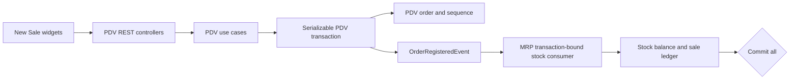

# 1. Context and scope

## Outcome

Replace the authenticated New Sale placeholder at /sales/new with the complete
PDV order-registration workflow from issue #23. A Manager or Operator assembles
an in-memory cart of eligible Portion and Resale products, sees authoritative
prices, channel adjustment, and automatic Combo savings, confirms the current
result, and receives either one registered order with one atomic stock
consumption or corrective feedback. Payment, cash closing, fiscal, cancellation,
refund, offline, and order-list/detail delivery are excluded.

The registered order is the immutable PDV record. MRP owns stock balances and
stock history. The cross-module boundary is a synchronous OrderRegisteredEvent
handled by an MRP-owned, transaction-bound handler in the one PDV registration
transaction. It is not an Inngest job and is not eventually consistent.

## Scope and invariants

- Build catalog search/filter, Portion/Resale configuration, local cart, optional
  active channel, pricing, Combo allocation, revalidation, idempotency,
  server-issued optimistic-concurrency preview token, confirmation, correction, technical-failure, and success states from the
  supplied design.
- Make the existing Core Order, Cart, repository, sequence, and stock-consumer
  vocabulary executable. Persist immutable PDV snapshots and MRP sale-ledger
  records through a generated migration.
- Both Manager and Operator are authorized; every read/write is tenant-scoped
  from the authenticated account.
- Do not repurpose Manager-only GET /discounts/catalog. The New Sale catalog is
  a separately authorized resource.
- One cart line represents one product. Adding an already-present product edits
  its line rather than creating a duplicate.
- Never write product, configuration, channel, or Combo data during a sale.
- No module imports another module's Drizzle model, mapper, or repository.

# 2. Implementation Contract

## Functional requirements

| ID | REQ/source coverage | Required behavior |
| --- | --- | --- |
| RF-01 | PDV REQ-11, REQ-12; issue #23 | An authenticated Manager or Operator can use the workflow only inside the establishment from the current account; unauthorized roles and foreign-tenant data are rejected. |
| RF-02 | PDV REQ-02, REQ-03, REQ-04; MRP REQ-01, REQ-03 | The catalog searches and filters commercially complete Portion and Resale products before pagination, while retaining valid but unavailable products as disabled choices. |
| RF-03 | PDV REQ-02, REQ-03 | A Portion line requires an available size, accepts zero or more available accompaniments and a quantity, and exposes the resulting current price before it enters the cart. |
| RF-04 | PDV REQ-02, REQ-04 | A Resale line requires an available brand only for by-brand stock, uses the product price for single-stock resale, and exposes the resulting current price before it enters the cart. |
| RF-05 | PDV REQ-06, REQ-07 | The browser owns one editable line per product, supports edit, remove and confirmed clear, and creates no server draft before registration. |
| RF-06 | PDV REQ-05, REQ-06 | The preview and registration rebuild prices from current product configuration and an optional active sales channel using two-decimal money semantics. |
| RF-07 | PDV REQ-07, REQ-14 | Active Combos are allocated for maximum total saving without reusing units and with at most one application per Combo definition; equal allocations are deterministic. |
| RF-08 | PDV REQ-08 | Registration revalidates current catalog, configuration, channel, Combo and stock facts and returns registered, repriced, review-required or correction-required without silently accepting changed inputs. |
| RF-09 | PDV REQ-09; MRP REQ-08, REQ-09 | One registration transaction persists the immutable PDV order and synchronously delivers OrderRegisteredEvent to the MRP-owned transaction-bound stock consumer; any failure rolls back sequence, order, stock and ledger together. |
| RF-10 | PDV REQ-09 | Replaying the same tenant-qualified idempotency key returns the original immutable order without another sequence reservation, order or stock consumption. |
| RF-11 | PDV REQ-12; issue #23 | The supplied catalog, configurator, reprice, conflict, correction, confirmed-rollback and success states are distinct, accessible and responsive; the narrow layout keeps totals and the primary action reachable. |
| RF-12 | PDV REQ-08, REQ-09; approved clarification | An unknown transport result enters neutral verification and replays the unchanged body and key; only a trustworthy server error may claim that registration rolled back. |

## Catalog, configuration, and local cart

GET /orders/catalog accepts normalized search, page, pageSize, and optional kind
values portion or resale. It returns the existing SalesCatalogProduct page shape.
The MRP-backed provider, rather than an after-page Core filter, owns commercial
eligibility and corrected pagination:

- Include only active Portion products with at least one active, commercially
  priced size, and active Resale products with a valid single-stock resale price
  or at least one active commercially priced brand.
- Retain commercially valid products when product/configuration stock is
  unavailable. They remain visible but unavailable. Omit incomplete commercial
  configurations altogether.
- Search is by product name and combines with the All, Porções, and Revendas
  filter. The browser returns to page one after search/kind changes.

The provider loads the name-sorted MRP source pages for the scoped query, maps and
filters every candidate in that stable order, then slices the eligible sequence
for requested page/pageSize. It returns eligible total and totalPages from that
same sequence, so it cannot report sparse pages or raw totals. ListOrderCatalogUseCase
validates actor/query and delegates to this authoritative result. Registration
uses a separate transaction-bound provider instance with the same mapping and
eligibility logic.

Preview tokens use HMAC-SHA-256 with a ten-minute expiry. Signed claims contain
version, establishmentId, a canonical digest of preview input (channelId and
normalized lines, never idempotencyKey), a canonical digest of rebuilt current
cart/channel/Combo facts, issuedAt and expiresAt. Canonicalization sorts line
and accompaniment identifiers and serializes all monetary values to two
decimals. Verification returns `invalid` for a bad signature, expiry, tenant or
input mismatch, and `stale` only when the signature/tenant/input are valid but
the current-facts digest differs. Invalid maps to 400 without cart disclosure;
stale maps to repriced with a new cart/token. Valid configuration or stock
corrections retain correction/review precedence before token staleness is
evaluated.

A Portion needs an active available size, zero or more available active
accompaniments, and a positive integer quantity. A by-brand Resale needs an
available active brand; a single-stock Resale uses its product price and has no
brand. Edit reopens the correct configurator with local selections. Remove
deletes one line. Clear-cart requests confirmation if non-empty. No server draft
is created by cart actions or navigation.

The local cart stores CartLineInput selections rather than trusted totals. It
creates a UUID idempotency key on first mutation and after any cart/channel
mutation. The browser requests a server preview for the current selections and
stores its opaque previewToken with the rebuilt cart. It sends that token with
registration; a valid-token current-facts staleness means current
channel/Combo/catalog facts changed and must refresh the preview before any
write. It preserves both key and
token while registering and through a retry after an unknown network result. A
registered result clears the cart/key/token; a rejection or reprice keeps
selections and refreshes the preview before the next explicit confirmation.

## Pricing and Combo allocation

Use ListCombosUseCase.money semantics: two-decimal Brazilian-real rounding after
every unit calculation, line subtotal, Combo saving, and final total. A selected
channel changes each rebuilt unit price by money(baseUnitPrice times
(1 + percentage / 100)); no channel uses the base price. Persist the channel id,
name, and percentage snapshot.

For every local preview and every registration revalidation:

1. Rebuild each line from current product, size, accompaniment, and brand
   configuration. Portion base price is selected size plus selected
   accompaniment per-portion prices. Resale price is selected brand or valid
   single-stock price.
2. Apply the active current channel to rebuilt unit prices.
3. Expand every line quantity into distinguishable product-unit tokens. A Combo
   candidate matches exact product/kind/size/accompaniment set and, where
   configured, brand.
4. Enumerate active candidates and choose the non-overlapping allocation with
   maximum total saving using memoized branch-and-bound set packing. No unit
   token can be reused and no discountId can be selected more than once. Equal
   savings choose the earliest Combo createdAt, then Combo id, then candidate
   token sequence. The repository returns active Combos in that createdAt/id
   order.
5. Produce at most one CartDiscount and one persisted order-discount application
   per Combo definition, with snapshot, saving, and source lineProductIds. Total
   is subtotal less discount savings and cannot be negative.

This replaces a greedy first-match algorithm. Channel or Combo changes may
reprice, but never silently register a sale.

## Registration API, event, and outcomes

POST /orders/preview receives a strict body with optional channelId and one to
fifty distinct product lines and returns the rebuilt cart plus an opaque,
server-issued previewToken bound to the authenticated tenant and those current
facts. POST /orders receives a strict body with idempotencyKey, previewToken,
optional channelId, and one to fifty distinct product lines. A line has productId, kind, quantity from
one to 999, required sizeId for Portion, required brandId only for by-brand
Resale, and accompanimentIds only for Portion. All IDs and the idempotency key
are UUIDs.

| HTTP/result | Meaning | Browser response |
| --- | --- | --- |
| 200 preview | Preview contains the rebuilt cart and server-issued previewToken; it has no write side effect. | Store the cart/token locally and enable confirmation. |
| 201 registered | Envelope kind is registered; order contains the immutable success projection. | Replace cart with immutable success projection. |
| 200 repriced | Envelope kind is repriced; recalculatedCart, a fresh previewToken and non-empty channel/combo/catalog changes are present; no write occurred. | Replace the local cart/token with the fresh preview and show olIiS; require confirmation again. |
| 400 invalid-preview-token | The previewToken is malformed, expired, signed for another tenant, or bound to different submitted lines/channel. No rebuilt cart or current facts are disclosed. | Show a corrective transport error and request a fresh preview; do not claim repricing or rollback. |
| 409 review-required | Envelope kind is review-required; it has shortages and optional channel/combo/catalog changes, with no invalid configuration. | Show BWsuP and preserve selections. |
| 409 correction-required | Envelope kind is correction-required; invalidConfigurations are non-empty and shortages may accompany them. | Show e6D4f and preserve selections. |
| 200 registered replay | Envelope kind is registered with the original immutable order. | Render it; do not create sequence or consume stock again. |
| Confirmed 5xx/503 | The server confirms its transaction was rolled back before an HTTP error response. | Show o81IK; its no-write assurance is truthful. |
| Transport unknown | Browser received no trustworthy HTTP result. | Show neutral Verificando registro state, replay the same body/key, and make no no-write claim until a result arrives. |

The envelope discriminator is kind. A reprice payload has
recalculatedCart, a fresh previewToken plus changes, where each change is
channel, combo or catalog and carries
previous and current labels/amounts. A shortage has productId, productName,
optional brandId/brandName, unit, requiredQuantity, and availableQuantity. An
invalid configuration has productId/productName, selected kind and id, reason,
and corrective message. If any invalid configuration exists, the response is
correction-required even when shortages or price changes coexist. Otherwise any
shortage is review-required, retaining any detected changes. Only a non-empty
change list with neither invalid configuration nor shortage is repriced.

The controllers use a passthrough HTTP response to assign 200 for preview,
201, 200, or 409 from
that discriminated result. Its Swagger declarations name all four envelopes and
the server REST example file includes a request/response example for each.

Inside one serializable DrizzlePdvDatabase transaction, RegisterOrderUseCase:

1. Looks up the tenant-qualified idempotency record.
2. Obtains current selected catalog facts through the transaction-bound catalog
   provider in PdvDatabaseScope, plus active channel and active Combos; rebuilds
   the full cart. It verifies the token signature, expiry, tenant and normalized
   input binding without disclosing the rebuilt cart. An `invalid` verification
   returns 400 before any cart/result body is exposed.
3. If the token is valid, current configuration/stock corrections return
   correction-required or review-required first. Otherwise a current-facts
   difference returns repriced with a fresh cart/token and no write; an equal
   projection proceeds to registration.
4. Reserves the next establishment sequence and writes the immutable PDV order
   aggregate.
5. Creates OrderRegisteredEvent with order identity/sequence, actor id/name,
   occurrence time, and consolidated consumption entries.
6. Delivers that event synchronously to StockConsumer.consume(event), then
   commits.

The MRP event handler is bound to the active transaction executor. It validates
and conditionally decrements each consolidated product/brand balance and writes
one MRP sale stock transaction with a non-FK orderId correlation. Any stock
conflict, handler failure, database error, or serialization failure rolls back
orders, sequence, balances, and ledger rows. The existing one-retry serializable
mechanism retries the whole command; exhausted contention never produces a
partial sale.

This handler is the accepted domain-event approach. Existing InngestBroker
publication is post-commit asynchronous infrastructure and must not implement
the critical stock decrement.

## Design contract

The authoritative Pencil source is design/onoreo.pen. See
documentation/features/pdv/new-order-workflow/design/manifest.md for inspected
nodes and exports.

- jKmSB defines New Sale desktop: catalog search/tabs/cards, optional channel,
  editable cart, breakdown, total, and register action.
- QavkX and YKYIX define distinct Portion and Resale dialogs, including required
  selectors, unavailable choices, quantity, live price, and add/cancel actions.
- BWsuP, olIiS, e6D4f, and o81IK are separate conflict, reprice, correction,
  and confirmed-rollback technical-failure states; do not replace them with a
  generic toast.
- The user-approved transport-unknown extension is a neutral
  Verificando registro state. It has no rollback assurance and automatically
  replays the unchanged idempotency request before showing registered, reprice,
  review, correction, or confirmed rollback.
- QuVaH defines the immutable registered-order confirmation and new-sale action.

On narrow viewports, catalog and cart stack while total/action remain reachable.
Use project dialogs/tokens, accessible names, visible focus, keyboard operation,
escape/close behavior, loading/empty/error states, and reduced-motion rules.

## Acceptance criteria

| ID | RF coverage | Requirement | Given | When | Then | Expected evidence |
| --- | --- | --- | --- | --- | --- | --- |
| CA-01 | RF-01 | Role and tenant isolation | Manager, Operator, unauthorized and foreign-tenant fixtures exist | catalog or registration is requested | Manager and Operator receive only their establishment data; other access is rejected without disclosure or writes | Core/server authorization tests and MV-02 |
| CA-02 | RF-02 | Eligible catalog pagination | active, incomplete and unavailable Portion/Resale fixtures span source pages | search, kind or page changes | eligibility is applied before slicing, totals/pages are stable, valid unavailable entries remain disabled and incomplete entries are absent | provider/use-case tests and MV-01 |
| CA-03 | RF-03 | Portion configuration | an eligible Portion has priced sizes and accompaniments | the user configures and edits its line | required/disabled choices, quantity and price behave consistently and one product line is retained | widget tests and MV-01/MV-06 |
| CA-04 | RF-04 | Resale configuration | by-brand and single-stock Resale fixtures exist | the user configures and edits a line | only the applicable brand control appears, unavailable brands cannot be selected and price/quantity remain correct | widget tests and MV-01/MV-06 |
| CA-05 | RF-05 | Local cart lifecycle | a cart is empty or contains lines | the user adds, edits, removes or clears | one line per product is maintained, clear requires confirmation and no server draft exists | page-hook/widget tests and MV-01 |
| CA-06 | RF-06, RF-07 | Authoritative pricing and Combo allocation | channel and overlapping Combo fixtures exist | preview or registration rebuilds the cart | money rounds at each specified boundary and the deterministic maximum saving uses no unit or Combo definition twice | pricing tests and MV-01 |
| CA-07 | RF-08 | Reprice before registration | the submitted previewToken was issued for an earlier channel, Combo or catalog state | registration is attempted | token mismatch returns repriced with a fresh cart/token and changes, writes nothing and requires confirmation again | preview/registration use-case/controller/web tests and MV-03 |
| CA-08 | RF-08 | Corrective responses | a selected configuration is invalid or stock is short | registration is attempted | correction-required dominates invalid configurations; otherwise review-required reports shortages; selections remain and no partial rows exist | use-case/controller/web tests and MV-04 |
| CA-09 | RF-09 | Atomic success and rollback | valid current inputs or an injected event/database failure exist | registration executes | success creates exactly one sequence/order/stock decrement/sale ledger; any failure leaves all four unchanged | transaction integration tests and MV-01/MV-05 |
| CA-10 | RF-10 | Idempotent replay | a registration key already has a committed order | the identical request is replayed | the immutable original is returned with no new sequence or consumption | use-case/server tests and MV-05 |
| CA-11 | RF-12 | Unknown versus confirmed failure | the client loses transport or receives a confirmed rollback response | registration cannot immediately resolve | transport loss shows neutral verification and replays the same key; rollback assurance appears only for the confirmed response | action/page tests and MV-05 |
| CA-12 | RF-11 | Design, responsive and accessibility parity | saved references and desktop/narrow viewports are available | every workflow state is exercised by pointer and keyboard | hierarchy/state matches the mapped reference, focus and accessible names work, and stacked narrow content keeps total/action reachable without blocking console/network errors | widget/route tests and MV-01/MV-03/MV-04/MV-05/MV-06 |

# 3. Technical Contract

## Current technical state

| Evidence | Current responsibility | Gap |
| --- | --- | --- |
| packages/core/src/pdv contains Order, Cart, repositories, PdvDatabase and OrderRegisteredEvent contracts | Core owns PDV order vocabulary and action boundaries | No executable registration action, complete result union or current-state pricing orchestration exists. |
| apps/server/src/pdv owns PDV REST/database composition and apps/server/src/mrp owns stock adapters | Each module owns its persistence internals | The current transaction scopes do not yet bind PDV writes and MRP event consumption to one executor. |
| apps/web/src/routes/_authenticated/sales/new.tsx | Authenticated New Sale route entry | The route is a placeholder and has no workflow widgets, query/action hooks or outcome states. |
| apps/server/rest-client/pdv/orders.rest is absent | One REST-client artifact must cover the future orders route group | The REST Technical Contract below declares this exact path as Create and Validation requires route/example parity before handoff. |
| No preview/version contract exists in the current order request | Registration currently has no prior server-observable preview state | Revision 3 adds a stateless server-issued previewToken and a `/orders/preview` operation so optimistic concurrency can detect changed current facts without creating a server draft. |

## Solution and runtime flow

The authenticated route composes the NewSalePage widget. Feature hooks call the
PDV web service, which maps GET /orders/catalog, POST /orders/preview and POST /orders without making
business decisions. Controllers derive actor and establishment from the current
account, validate shared schemas and invoke Core use cases. RegisterOrderUseCase
starts the serializable PdvDatabase transaction, rebuilds current pricing, writes
the immutable PDV aggregate, and synchronously delivers OrderRegisteredEvent to
the MRP-owned StockConsumer bound to that same executor. Commit occurs only after
MRP stock and sale-ledger writes succeed; async Inngest publication is outside
the critical decrement and cannot substitute for it.



| Boundary | Producer | Consumer | Canonical contract | Mapping/guarantees | Failure ownership |
| --- | --- | --- | --- | --- | --- |
| HTTP catalog | ListOrderCatalogController | PdvService.listOrderCatalog | SalesCatalogProduct page plus orderCatalogQuerySchema | Current-account tenant and normalized query are preserved | Controller/schema translate invalid requests; provider owns eligibility |
| HTTP preview | PreviewOrderController | PdvService.previewOrder | OrderPreview and orderPreviewSchema | Current-account tenant and normalized input produce a stateless previewToken bound to current facts | Controller/schema translate invalid requests; preview token service owns token encoding |
| HTTP registration | RegisterOrderController | PdvService.registerOrder | RegisterOrderInput and OrderRegistrationResult discriminator | 201/200/409 status maps without losing typed outcomes | Controller maps expected results; confirmed 5xx means transaction rollback |
| Transaction scope | RegisterOrderUseCase | PdvDatabaseScope collaborators | PdvDatabase.transaction callback | One executor, tenant and serializable retry surround all critical writes | DrizzlePdvDatabase owns retry and rollback |
| Domain event | RegisterOrderUseCase | StockConsumer | OrderRegisteredEvent | Stable typed fact, consolidated consumption and actor/order correlation; synchronous in active transaction | MRP consumer owns stock conflict and ledger failure |

## Allowed and prohibited paths

Only paths classified Create, Modify or Generate in the layer contracts below
are allowed. The Builder must not modify design/onoreo.pen, Manager-only
GET /discounts/catalog behavior, unrelated order list/detail/payment routes, or
introduce MRP database models/mappers/repositories into PDV. Generated migration
SQL and journal/snapshot files are changed only by the declared generator.

## packages/core — Domain, Interfaces and Use cases; packages/validation — Validation

Classification legend: C = create, M = modify, G = generated. Each listed path
is classified before its name; paths not listed are prohibited from this Spec
unless an amendment records them.

| Paths | Required implementation |
| --- | --- |
| M: packages/core/src/pdv/domain/events/order-registered-event.ts, domain/events/index.ts | Add consolidated consumptions, actor identity/name, and occurredAt to the typed synchronous event payload. It contains no Nest or Drizzle type. |
| M: packages/core/src/pdv/interfaces/stock-consumer.ts, pdv-database.ts, interfaces/index.ts | Change StockConsumer.consume to accept OrderRegisteredEvent and add transaction-bound salesCatalogProvider, order/sequence repositories, and consumer to PdvDatabaseScope. |
| C: packages/core/src/pdv/domain/structures/order-registration-input.ts, order-registration-change.ts, order-registration-shortage.ts, order-registration-invalid-configuration.ts, order-registration-result.ts, order-details.ts, order-preview.ts; M: structures/index.ts | Add strict preview/registration inputs, `OrderPreviewFacts`, immutable preview projection with opaque previewToken, explicit discriminated registered/repriced/review-required/correction-required result, and change kinds `channel`, `combo` and `catalog`; shortage, invalid configuration and immutable response projection declarations. The repriced variant always carries a fresh previewToken. |
| C: packages/core/src/pdv/interfaces/order-preview-token-service.ts; M: interfaces/index.ts | Add the framework-free token port with `issue(input, establishmentId, facts): string` and `verify(token, input, establishmentId, facts): 'valid' | 'stale' | 'invalid'`, used by PreviewOrderUseCase and RegisterOrderUseCase. The declared `OrderPreviewFacts` projection is the canonical cart, active channel snapshot and Combo snapshots used for HMAC claims; signature/binding validity is distinguishable from current-fact staleness, and verification never replaces current revalidation. |
| C: packages/core/src/pdv/use-cases/list-order-catalog-use-case.ts, preview-order-use-case.ts, register-order-use-case.ts, order-pricing.ts; M: use-cases/index.ts | Add role guard, catalog delegation, pure configuration/pricing/Combo optimizer, server-issued preview token flow, transaction-bound current-state revalidation, idempotency, event dispatch, and typed result. Reuse current provider port, repositories, and money helper. |
| M: packages/core/src/pdv/interfaces/pdv-service.ts | Add listOrderCatalog, previewOrder and registerOrder RestResponse contracts without changing current Combo/channel behavior. |
| C: packages/core/src/pdv/domain/entities/fakers/order-faker.ts, use-cases/tests/{list-order-catalog-use-case,preview-order-use-case,register-order-use-case,order-pricing}.test.ts; M: fakers/index.ts | Provide deterministic fixtures and cover authorization, eligibility, exact configurations, preview token issue/verification, rounding, maximum savings, one application per Combo, ties, no reused tokens, envelope dominance, replay, and event rollback. |
| C: packages/validation/src/pdv/order-catalog-query-schema.ts, preview-order-schema.ts, register-order-schema.ts; M: packages/validation/src/index.ts | Add/root-export one strict schema per HTTP body: preview body is lines/channel without idempotencyKey or previewToken, registration requires idempotencyKey and previewToken. |
| M: packages/core/src/mrp/domain/entities/stock-transaction.ts, domain/structures/stock-transaction-type.ts, stock-transaction-list-params.ts, packages/core/src/mrp/domain/entities/fakers/stock-transaction-faker.ts, packages/core/src/mrp/use-cases/tests/list-stock-transactions-use-case.test.ts | Add StockTransactionType.Sale and optional orderId correlation and permit sale history filtering, with exact Core faker/use-case coverage. |
| M: packages/validation/src/mrp/stock-transaction-list-schema.ts, packages/validation/src/index.ts | Accept the expanded MRP transaction type while retaining date/brand/pagination guards. |
| M: packages/validation/src/environment/server-env-schema.ts; M: apps/server/.env.example | Add the server-only `SCOOPS_PDV_PREVIEW_TOKEN_SECRET` configuration, minimum 32 characters, with a non-secret placeholder in `.env.example`; production/test startup must provide it. |

The pure pricing module must expose testable functions for exact configuration
matching, channel adjustment, candidate expansion, allocation comparison, and
cart rebuild. It rejects duplicate lines, invalid kind/configuration, invalid
channel, and non-positive quantity before persistence.

The Core preview projection is:

```ts
export type OrderPreviewFacts = {
  readonly cart: Cart
  readonly channel?: SalesChannelSnapshot
}
```

The token service canonicalizes `OrderPreviewInput` plus `OrderPreviewFacts`;
the cart contains line configurations, two-decimal prices, consumptions, Combo
snapshots and totals, while the optional channel snapshot contains id, name and
percentage. A valid token with a different current projection is `stale`.
Changes caused by channel or Combo differences use their existing kinds;
catalog/configuration or other price differences use `kind: 'catalog'` with
previous/current total labels and amounts. A valid token with current
configuration or stock issues returns correction/review before stale repricing.

## apps/server — Provision, Database, REST and Composition

| Paths | Required implementation |
| --- | --- |
| C: apps/server/src/mrp/constants/mrp-providers.ts, apps/server/src/mrp/provision/pdv/transaction-bound-sales-catalog-provider.ts, transaction-bound-order-registration-dependencies-factory.ts, apps/server/src/mrp/provision/mrp-provision.module.ts; M: apps/server/src/mrp/constants/index.ts, apps/server/src/mrp/mrp.module.ts | Export an MRP-owned factory. Its forExecutor(DrizzleExecutor) returns one transaction-bound SalesCatalogProvider and one Core StockConsumer event handler. Both use only MRP repositories against that executor, so revalidation reads and stock writes share registration isolation. |
| C: apps/server/src/pdv/provision/preview-token/node-preview-token-service.ts; M: apps/server/src/pdv/constants/pdv-providers.ts, apps/server/src/pdv/provision/pdv-provision.module.ts | Implement the Core OrderPreviewTokenService with Node HMAC-SHA-256, constant-time signature verification, canonical payload serialization, ten-minute expiry and the `SCOOPS_PDV_PREVIEW_TOKEN_SECRET` EnvProvider value. No token claims or secret are exposed to the browser beyond the opaque token; no preview state is persisted. |
| M: apps/server/src/pdv/provision/mrp/mrp-sales-catalog-provider.ts, provision/mrp/tests/mrp-sales-catalog-provider.test.ts, provision/pdv-provision.module.ts | Implement eligibility-before-pagination for the normal catalog provider and wire the exported MRP provider. Test raw-to-eligible totals/pages and parity with the transaction-bound revalidation mapper. |
| M: apps/server/src/mrp/database/drizzle/models/stock-transaction-model.ts, types/entities/stock-transaction.ts, mappers/drizzle-stock-transaction-mapper.ts, rest/dtos/stock-transaction-response.dto.ts, apps/server/src/mrp/rest/controllers/tests/list-stock-transactions.controller.test.ts | Add nullable order_id, sale check values/correlation rule, mapper/DTO handling, and read coverage. Do not add an MRP-to-PDV foreign key. |
| C: apps/server/src/pdv/database/drizzle/models/order-sequence-model.ts, order-model.ts, order-line-model.ts, order-line-accompaniment-model.ts, order-line-consumption-model.ts, order-discount-model.ts, order-discount-component-model.ts, order-discount-component-accompaniment-model.ts, order-discount-line-model.ts; M: models/index.ts | Define tenant-qualified idempotency/sequence constraints and normalized immutable order snapshots. One order-discount row per discountId/order has fixedPrice, preDiscountTotal, savings; component rows retain kind/product/size/brand/quantity/unit-price/subtotal and accompaniment snapshot rows; link rows join its exact component application to order-line rows. |
| C: apps/server/src/pdv/database/drizzle/types/entities/order.ts, order-line.ts, order-discount.ts, order-discount-component.ts, order-discount-line.ts, mappers/drizzle-order-mapper.ts; M: types/entities/index.ts, types/index.ts, mappers/index.ts | Add persistence types and one lossless aggregate mapper that round-trips every order, discount component, accompaniment, link, numeric, and null snapshot. |
| C: apps/server/src/pdv/database/drizzle/repositories/drizzle-orders-repository.ts, drizzle-order-sequences-repository.ts; M: drizzle-pdv-database.ts, repositories/index.ts | Implement declared repositories. DrizzlePdvDatabase owns retry/transaction, binds both dependencies through the exported MRP factory, and removes the unsafe unknown scope cast. |
| M: apps/server/src/pdv/database/pdv-database.module.ts, pdv-seeder.ts | Wire repositories/factory and clear new child rows before parents. PDV never constructs/imports MRP model/mapper/repository internals. |
| M: apps/server/src/shared/database/drizzle/schema.ts; G: the next migration SQL and journal/snapshot outputs under apps/server/src/shared/database/drizzle/migrations | Export models and run pnpm --filter server db:migration:generate. Inspect/retain generated outputs; never hand-author migration SQL or filename. |
| M: apps/server/src/pdv/database/drizzle/repositories/drizzle-discounts-repository.ts | Change only findActive ordering to createdAt then id for deterministic Combo ties. Existing list/search ordering stays unchanged. |
| C: apps/server/src/pdv/decorators/orders-controller.ts, rest/controllers/{list-order-catalog,preview-order,register-order}.controller.ts, rest/dtos/{order-preview-response,order-response,order-registration-response}.dto.ts, rest/controllers/tests/{list-order-catalog,preview-order,register-order}.controller.test.ts, apps/server/rest-client/pdv/orders.rest; M: decorators/index.ts, rest/controllers/index.ts, rest/dtos/index.ts, apps/server/src/pdv/fixtures/pdv-module-fixture.ts, apps/server/src/pdv/pdv.module.ts | Add GET /orders/catalog, POST /orders/preview and POST /orders, Manager/Operator guard, CurrentAccount, root Zod schemas, preview token serialization, 400 invalid-preview-token handling without cart disclosure, passthrough dynamic status, all envelope Swagger mappings, fixture coverage, and REST examples for preview, 201, reprice, review, correction, replay, confirmed rollback and invalid token. PdvModule registers all order controllers. Registration integration coverage uses the module fixture and persisted-state sensors for one atomic success, idempotent replay, injected consumer/database rollback, concurrent oversell rollback, stale token reprice and invalid-token no-disclosure. |
| M: apps/web/src/ui/mrp/widgets/slots/product-stock-slot/stock-transaction-history-card/index.tsx, stock-transaction-history-card.test.tsx | Render/filter sale as Venda to remain compatible with the MRP-owned ledger type. |

## apps/web — UI and REST adapter

| Paths | Required implementation |
| --- | --- |
| M: apps/web/src/rest/services/pdv-service.ts | Implement listOrderCatalog, previewOrder and registerOrder with preview-token and all HTTP/envelope cases, preserving current rest-client error normalization and never calculating authoritative totals. |
| C: apps/web/src/ui/pdv/hooks/sale-query-keys.ts, use-order-catalog-query.ts, use-preview-order-action.ts, use-register-order-action.ts | Add query keys, catalog retrieval, preview mutation and registration mutation/request lifecycles. The actions preserve submitted body/key/token in their result/error context but do not decide or schedule replay; use-new-sale-page.ts alone owns unknown-transport replay and state transition. Keep local cart outside query cache. |
| C: apps/web/src/ui/pdv/widgets/pages/new-sale-page/index.tsx, use-new-sale-page.ts | Add the NewSalePage Page widget. The index owns rendering/composition and DOM wiring; its colocated hook is the sole owner of cart, idempotency key, previewToken, selected dialog, result-state mapping, preview refresh, unknown-transport same-key replay, neutral verification and re-confirmation. |
| C: apps/web/src/ui/pdv/widgets/pages/new-sale-page/new-sale-catalog/index.tsx, use-new-sale-catalog.ts | Add the NewSaleCatalog Component widget and optional local behavior hook for search, kind, pagination, loading, empty, error and product-selection behavior. |
| C: apps/web/src/ui/pdv/widgets/pages/new-sale-page/new-sale-cart/index.tsx, use-new-sale-cart.ts | Add the NewSaleCart Component widget and hook for editable lines, channel selection, totals, Combo breakdown, clear confirmation and registration entry. |
| C: apps/web/src/ui/pdv/widgets/pages/new-sale-page/portion-configuration-dialog/index.tsx, use-portion-configuration-dialog.ts | Add the PortionConfigurationDialog Component widget and hook for form state, disabled choices, quantity, live preview, add and edit callbacks. |
| C: apps/web/src/ui/pdv/widgets/pages/new-sale-page/resale-configuration-dialog/index.tsx, use-resale-configuration-dialog.ts | Add the ResaleConfigurationDialog Component widget and hook for by-brand/single-stock form state, disabled choices, quantity, live preview, add and edit callbacks. |
| C: apps/web/src/ui/pdv/widgets/pages/new-sale-page/order-registration-dialog/index.tsx | Add the pure OrderRegistrationDialog Component widget that confirms the current rebuilt cart and exposes confirm/cancel callbacks. |
| C: apps/web/src/ui/pdv/widgets/pages/new-sale-page/order-confirmation/index.tsx | Add the pure OrderConfirmation Component widget for the immutable registered projection and new-sale action. |
| C: apps/web/src/ui/pdv/widgets/pages/new-sale-page/order-verification-state/index.tsx | Add the pure OrderVerificationState Component widget. It renders neutral progress from explicit Page props and owns no request, replay, timer or result transition. |
| M: apps/web/src/routes/_authenticated/sales/new.tsx | Replace only the placeholder leaf. Keep authenticated parent and ROUTES.newSale; route-tree topology is unchanged. |
| C: apps/web/src/ui/pdv/widgets/pages/new-sale-page/tests/new-sale-page.test.tsx, use-new-sale-page.test.ts; new-sale-catalog/tests/new-sale-catalog.test.tsx, use-new-sale-catalog.test.ts; new-sale-cart/tests/new-sale-cart.test.tsx, use-new-sale-cart.test.ts; portion-configuration-dialog/tests/portion-configuration-dialog.test.tsx, use-portion-configuration-dialog.test.ts; resale-configuration-dialog/tests/resale-configuration-dialog.test.tsx, use-resale-configuration-dialog.test.ts; order-registration-dialog/tests/order-registration-dialog.test.tsx; order-confirmation/tests/order-confirmation.test.tsx; order-verification-state/tests/order-verification-state.test.tsx; apps/web/tests/routes/pdv/new-sale.test.ts | Add tests beside each owning widget/hook plus accessible Playwright route coverage. Mocks prove client interaction only; real server validation proves persistence. Preview-token issue, refresh, mismatch and same-key replay are required cases. |

Do not copy Pencil colors, fonts, radii, spacing, or shadows into new CSS.
Map source hierarchy to existing Scoops design tokens and reusable components.

### Widget composition

| Widget | Kind | Parent/entry | Direct children | Public contract | Behavior owner |
| --- | --- | --- | --- | --- | --- |
| NewSalePage | Page | routes/_authenticated/sales/new.tsx | NewSaleCatalog, NewSaleCart, PortionConfigurationDialog, ResaleConfigurationDialog, OrderRegistrationDialog, OrderConfirmation, OrderVerificationState | No public props; owns the route workflow | use-new-sale-page.ts |
| NewSaleCatalog | Component | NewSalePage | — | catalog state and select-product callback | use-new-sale-catalog.ts |
| NewSaleCart | Component | NewSalePage | — | lines, channel, pricing and edit/remove/clear/register callbacks | use-new-sale-cart.ts |
| PortionConfigurationDialog | Component | NewSalePage | — | open state, initial Portion selection and save/cancel callbacks | use-portion-configuration-dialog.ts |
| ResaleConfigurationDialog | Component | NewSalePage | — | open state, initial Resale selection and save/cancel callbacks | use-resale-configuration-dialog.ts |
| OrderRegistrationDialog | Component | NewSalePage | — | current cart summary and confirm/cancel callbacks | pure renderer |
| OrderConfirmation | Component | NewSalePage | — | immutable registered-order projection and new-sale callback | pure renderer |
| OrderVerificationState | Component | NewSalePage | — | neutral message and progress state supplied by NewSalePage | pure renderer; use-new-sale-page.ts owns replay and resolution |

### Exact widget and test tree

```text
apps/web/src/ui/pdv/widgets/pages/new-sale-page/
├── index.tsx
├── use-new-sale-page.ts
├── tests/
│   ├── new-sale-page.test.tsx
│   └── use-new-sale-page.test.ts
├── new-sale-catalog/
│   ├── index.tsx
│   ├── use-new-sale-catalog.ts
│   └── tests/
│       ├── new-sale-catalog.test.tsx
│       └── use-new-sale-catalog.test.ts
├── new-sale-cart/
│   ├── index.tsx
│   ├── use-new-sale-cart.ts
│   └── tests/
│       ├── new-sale-cart.test.tsx
│       └── use-new-sale-cart.test.ts
├── portion-configuration-dialog/
│   ├── index.tsx
│   ├── use-portion-configuration-dialog.ts
│   └── tests/
│       ├── portion-configuration-dialog.test.tsx
│       └── use-portion-configuration-dialog.test.ts
├── resale-configuration-dialog/
│   ├── index.tsx
│   ├── use-resale-configuration-dialog.ts
│   └── tests/
│       ├── resale-configuration-dialog.test.tsx
│       └── use-resale-configuration-dialog.test.ts
├── order-registration-dialog/
│   ├── index.tsx
│   └── tests/order-registration-dialog.test.tsx
├── order-confirmation/
│   ├── index.tsx
│   └── tests/order-confirmation.test.tsx
└── order-verification-state/
    ├── index.tsx
    └── tests/order-verification-state.test.tsx
```

## Technical decisions

| Decision | Chosen approach | Alternative considered | Reason | Accepted trade-off |
| --- | --- | --- | --- | --- |
| Critical cross-module consistency | Synchronous OrderRegisteredEvent consumed by an MRP-owned handler bound to the active PDV transaction | Post-commit Inngest stock decrement | Preserves the approved domain-event boundary while meeting all-or-nothing order/stock behavior | The event dispatcher needs a transaction-aware synchronous consumer in addition to async messaging infrastructure. |
| Combo selection | Exact maximum-saving set packing with deterministic ties and one application per definition | Greedy first match | RF-07 requires global maximum saving and stable replay | More compute than greedy; bounded by at most 50 lines and covered by focused tests. |
| Unknown transport | Neutral verification with same-key replay | Immediate rollback error or new key | The browser cannot truthfully infer rollback from lost transport | The user may briefly wait while the outcome is resolved. |

# 4. Validation Contract

## Automated checks

| Layer | Command/test target | Required evidence |
| --- | --- | --- |
| Core | pnpm --filter @scoops/core check:code; pnpm --filter @scoops/core check:types; pnpm --filter @scoops/core test | Eligibility, exact configuration, rounding, single Combo application, deterministic ties, no reused units, envelope dominance, event failure rollback, and replay. |
| Validation | pnpm --filter @scoops/validation check:code; pnpm --filter @scoops/validation check:types | Shared schemas are strict/root-exported; runtime request behavior is exercised by server and web tests because this package has no test script. |
| Server | pnpm --filter server check:code; pnpm --filter server check:types; pnpm --filter server test; pnpm --filter server build | Roles/tenancy, provider pagination, transaction-bound read/write parity, snapshots, sale ledger, no-write envelopes, idempotency, one atomic success, and concurrent oversell rollback. |
| Web units | pnpm --filter web check:code; pnpm --filter web check:types; pnpm --filter web test | Search/filter/paging, dialogs, unavailable choice, edit/remove/clear, loading/empty/error, focus/keyboard, response dominance, neutral verification, and retry key reuse. |
| Web Playwright | pnpm --filter web test:integration tests/routes/pdv/new-sale.test.ts | Manager/Operator browser flows, narrow viewport, keyboard path, and client-only mocked transport behavior. |

## Test file structure

| Test file | Test type | Target | Coverage goal |
| --- | --- | --- | --- |
| packages/core/src/pdv/use-cases/tests/list-order-catalog-use-case.test.ts | unit | ListOrderCatalogUseCase | roles, normalized query and provider result delegation |
| packages/core/src/pdv/use-cases/tests/order-pricing.test.ts | unit | order-pricing functions | configurations, money, maximum Combo saving, tie order and non-reuse |
| packages/core/src/pdv/use-cases/tests/preview-order-use-case.test.ts | unit | PreviewOrderUseCase | current cart rebuild and tenant-bound preview-token issue |
| packages/core/src/pdv/use-cases/tests/register-order-use-case.test.ts | unit/integration contract | RegisterOrderUseCase | preview-token mismatch, outcome precedence, idempotency and synchronous event rollback |
| apps/server/src/pdv/provision/mrp/tests/mrp-sales-catalog-provider.test.ts | unit | MRP catalog adapters | eligibility before pagination and transaction-bound parity |
| apps/server/src/pdv/rest/controllers/tests/list-order-catalog.controller.test.ts | controller | GET /orders/catalog | schemas, roles, tenant source, response and errors |
| apps/server/src/pdv/rest/controllers/tests/preview-order.controller.test.ts | controller | POST /orders/preview | schema, roles, tenant source, token response and no-write behavior |
| apps/server/src/pdv/rest/controllers/tests/register-order.controller.test.ts | controller/integration | POST /orders through PdvModule fixture | token mismatch, request mapping, all envelopes/statuses, persisted atomic success, replay, injected rollback and concurrent oversell |
| apps/web/src/ui/pdv/widgets/pages/new-sale-page/**/tests/* | component/hook | each widget and its optional hook in the exact tree above | smallest-owner interaction, state, accessibility and recovery behavior |
| apps/web/tests/routes/pdv/new-sale.test.ts | route integration | /sales/new | authenticated desktop/narrow workflow, keyboard and transport states |

## Test cases by file

| Test file | Test case | Description | Assertions |
| --- | --- | --- | --- |
| list-order-catalog-use-case.test.ts | authorized eligible catalog | Manager/Operator list a mixed catalog | tenant reaches provider; stable eligible page/totals return; forbidden actor fails |
| order-pricing.test.ts | deterministic maximum saving | overlapping candidates and equal-saving ties exist | maximum saving wins, no token or discountId repeats, tie order is stable and totals round correctly |
| preview-order-use-case.test.ts | issue current preview | current catalog/channel/Combo facts are rebuilt | preview contains current cart and opaque token; no repository write occurs |
| register-order-use-case.test.ts | no-write outcomes and atomic event | token/facts change, stock conflicts or consumer fails | mismatch returns repriced; typed dominance is correct; repriced/review/correction write nothing; failure rolls all critical state back |
| register-order-use-case.test.ts | idempotent replay | the same key is committed then repeated | original projection returns and sequence/order/consumption counts do not increase |
| mrp-sales-catalog-provider.test.ts | eligible pagination parity | invalid and unavailable configurations span raw pages | invalid entries are omitted before slicing; valid unavailable entries remain; normal and transaction-bound mappers agree |
| list-order-catalog.controller.test.ts | catalog transport contract | valid and invalid actor/query requests arrive | schema, role, tenant and page response/error mapping are preserved |
| register-order.controller.test.ts | registration envelope statuses | each use-case discriminator returns | registered is 201 or replay 200, repriced is 200, review/correction are 409 and confirmed failure is safely translated |
| register-order.controller.test.ts | atomic persistence and contention | valid, repeated, injected consumer/database failure and concurrent oversell requests execute through the module fixture | success changes order/sequence/stock/sale-ledger counts exactly once; replay changes none; injected failure and losing concurrent request leave no order, sequence increment, stock decrement or ledger row |
| new-sale-page widget/hook tests | local workflow and outcomes | the user searches, configures, edits, clears and submits | child props/callbacks, idempotency lifecycle, outcome dominance, focus and preserved selections match the contract |
| new-sale-catalog and configurator tests | catalog/configuration states | loading, empty, error, unavailable and edit fixtures render | accessible controls, disabled choices, recovery and live prices are observable |
| new-sale-cart and registration tests | cart/confirmation states | channel, Combo, edit/remove/clear and confirmation are exercised | totals/actions and confirmation behavior are correct; no client authority is invented |
| use-new-sale-page and order-verification-state tests | unknown transport replay | the first request has no trustworthy result | the Page hook replays the identical request/key and resolves the final typed outcome; the pure widget renders only neutral progress and no rollback claim |
| new-sale.test.ts | authenticated route workflow | Manager and Operator use desktop/narrow pointer and keyboard paths | visible states, URL, requests and console are checked; mocked transport is labeled client-only evidence |

## Acceptance coverage

| Acceptance | Automated boundary | Manual scenario | Evidence target |
| --- | --- | --- | --- |
| CA-01 | Core role and controller tests | MV-02 | ./evaluation.md |
| CA-02 | catalog use-case/provider/controller tests | MV-01 | ./evaluation.md |
| CA-03 | Portion widget/hook and route tests | MV-01, MV-06 | ./evaluation.md and design/QavkX.png comparison |
| CA-04 | Resale widget/hook and route tests | MV-01, MV-06 | ./evaluation.md and design/YKYIX.png comparison |
| CA-05 | page/cart hook and widget tests | MV-01 | ./evaluation.md |
| CA-06 | order-pricing and page/cart tests | MV-01 | ./evaluation.md |
| CA-07 | preview/registration use-case, controller and page tests | MV-03 | ./evaluation.md and design/olIiS.png comparison |
| CA-08 | use-case/controller/page tests | MV-04 | ./evaluation.md and design/BWsuP.png/design/e6D4f.png comparisons |
| CA-09 | server transaction integration plus use-case tests | MV-01, MV-05 | ./evaluation.md with database counts |
| CA-10 | use-case/server idempotency tests | MV-05 | ./evaluation.md |
| CA-11 | register action/page/verification tests | MV-05 | ./evaluation.md and design/o81IK.png comparison only for confirmed rollback |
| CA-12 | all widget tests and new-sale route test | MV-01, MV-03, MV-04, MV-05, MV-06 | ./evaluation.md, all supplied references and deferred narrow capture |

## Commands and artifact parity

| Command | Purpose/coverage |
| --- | --- |
| pnpm --filter @scoops/core check:code && pnpm --filter @scoops/core check:types && pnpm --filter @scoops/core test | Core formatting, types and RF-01 through RF-10 behavior |
| pnpm --filter @scoops/validation check:code && pnpm --filter @scoops/validation check:types | Shared query/body schema quality |
| pnpm --filter server check:code && pnpm --filter server check:types && pnpm --filter server test && pnpm --filter server build | Server adapters, persistence, REST and composition |
| pnpm --filter web check:code && pnpm --filter web check:types && pnpm --filter web test | Web service, hook and widget behavior |
| pnpm --filter web test:integration tests/routes/pdv/new-sale.test.ts | Playwright CLI route behavior; mocked transport is not server persistence evidence |
| pnpm --filter server db:migration:generate | Generate the declared migration and journal/snapshot outputs from Drizzle models |
| test -s apps/server/rest-client/pdv/orders.rest && rg --count '^### ' apps/server/rest-client/pdv/orders.rest | Confirm the declared Create artifact exists and contains labeled requests; implementation review must compare GET /orders/catalog, POST /orders/preview and POST /orders method/path/header/body with controllers and schemas and record parity in ./evaluation.md |

## Manual validation

Before real browser work, inspect docker compose ps and health endpoints for
Supabase at http://127.0.0.1:54321, server at http://127.0.0.1:3336, and web at
http://127.0.0.1:4000. Seed explicitly with pnpm --filter server db:seed before
pnpm --filter web test:auth:setup only when accounts are absent. Stop only
development processes started for validation.

| ID | Scenario | Required retained evidence |
| --- | --- | --- |
| MV-01 | Manager configures Portion and by-brand Resale, applies channel/Combo, confirms success. | Fresh desktop success screenshot, network result, and fixture/database proof of one order, stock decrement, sequence, and sale ledger. |
| MV-02 | Operator performs the flow and foreign tenant attempts access. | Role/tenant HTTP evidence and final URL. |
| MV-03 | Preview is issued, then channel or Combo changes before registration. | Fresh reprice screenshot, changed total and token mismatch proof of no write before re-confirmation. |
| MV-04 | Selected size/brand is deactivated or consolidated accompaniment/brand stock is depleted. | Fresh correction screenshot with required/available details and proof cart is preserved/no partial rows. |
| MV-05 | Request is interrupted then replayed. Also exercise a server-confirmed rollback. | Neutral verification screenshot without a no-write claim, same key on replay, exactly one outcome; separate o81IK screenshot only for confirmed rollback. |
| MV-06 | Narrow viewport, keyboard-only search/configure/remove/submit path. | Fresh narrow screenshot, focus order, console/network inspection, no hydration/a11y errors. |

Use the Playwright CLI, not browser-use/CDP, for DOM, URL, network, console,
keyboard, and fresh screenshots. Compare desktop screenshots with jKmSB,
QavkX/YKYIX, outcome dialogs, and QuVaH. Record screenshot paths/comparison and
classify every console or transport error as fixed, pre-existing, or blocking.

# 5. Documentation alignment and revision history

## Requirement mapping

| RF | Source REQ | Acceptance |
| --- | --- | --- |
| RF-01 | PDV REQ-11, REQ-12 | CA-01 |
| RF-02 | PDV REQ-02, REQ-03, REQ-04; MRP REQ-01, REQ-03 | CA-02 |
| RF-03 | PDV REQ-02, REQ-03 | CA-03 |
| RF-04 | PDV REQ-02, REQ-04 | CA-04 |
| RF-05 | PDV REQ-06, REQ-07 | CA-05 |
| RF-06 | PDV REQ-05, REQ-06 | CA-06 |
| RF-07 | PDV REQ-07, REQ-14 | CA-06 |
| RF-08 | PDV REQ-08 | CA-07, CA-08 |
| RF-09 | PDV REQ-09; MRP REQ-08, REQ-09 | CA-09 |
| RF-10 | PDV REQ-09 | CA-10 |
| RF-11 | PDV REQ-12; issue #23 | CA-12 |
| RF-12 | PDV REQ-08, REQ-09; approved clarification | CA-11 |

| Source | Coverage |
| --- | --- |
| PDV PRD REQ-02, REQ-03, REQ-04 | Eligible catalog, Portion/Resale configuration, quantities/pricing, and MRP-owned product/accompaniment/resale consumption/ledger. |
| PDV PRD REQ-05 | Optional current active channel and authoritative recalculation. |
| PDV PRD REQ-06, REQ-07, REQ-14 | One-product-line cart, immutable inputs, exact maximum-savings non-reuse deterministic Combo allocation with one application per Combo definition. |
| PDV PRD REQ-08, REQ-09 | Current-state revalidation, itemized corrections, serializable atomic event-driven order/stock transaction, retry-safe idempotency. |
| PDV PRD REQ-11, REQ-12 | Manager/Operator authorization, establishment isolation, validation, feedback, responsive accessibility. |
| MRP PRD REQ-01, REQ-03, REQ-08, REQ-09 | MRP remains authoritative for facts/stock and exposes PDV sale movement in history. |
| Issue #23 | Placeholder replacement, supplied design states, exclusions, and all success/reprice/correction/failure outcomes. |

## Rules, design evidence, and next step

| Document | Authority for | State | Required change/confirmation |
| --- | --- | --- | --- |
| documentation/prds/pdv.md | PDV outcomes, actors, capabilities and experience | confirmed | REQ-02 through REQ-09, REQ-11, REQ-12 and REQ-14 remain authoritative; no checkbox changes in this workflow. |
| documentation/prds/mrp.md | catalog facts, stock ownership and history | confirmed | MRP REQ-01, REQ-03, REQ-08 and REQ-09 remain authoritative. |
| documentation/architecture.md | layers, transactions and integrations | confirmed | Synchronous transaction-bound event consumption preserves the approved modular boundary. |
| documentation/modules.md | PDV/MRP ownership | confirmed | PDV owns order registration and immutable order data; MRP owns catalog/stock facts and the sale ledger. |
| documentation/design.md | UI tokens, responsive and accessibility rules | confirmed | Production maps Pencil hierarchy to existing tokens/components and validates desktop/narrow states. |
| documentation/tooling.md | workspace, tests, migrations and Playwright commands | confirmed | Declared commands use existing pnpm filters and generated migration workflow. |

| Rule | Applies to | Evaluated revision |
| --- | --- | --- |
| documentation/rules/code-conventions-rules.md | all changed TypeScript and tests | repository state at Spec revision 3 |
| documentation/rules/core-package-rules.md | Core Domain, Interfaces and Use cases | repository state at Spec revision 3 |
| documentation/rules/validation-package-rules.md | shared Zod schemas | repository state at Spec revision 3 |
| documentation/rules/use-case-testing-rules.md | Core action tests | repository state at Spec revision 3 |
| documentation/rules/database-layer-rules.md | PDV/MRP Drizzle persistence and migration | repository state at Spec revision 3 |
| documentation/rules/provision-layer-rules.md | transaction-bound MRP adapters and preview-token provider | repository state at Spec revision 3 |
| documentation/rules/rest-layer-rules.md | controllers, DTOs, web adapter and orders.rest | repository state at Spec revision 3 |
| documentation/rules/controllers-testing-rules.md | PDV controller tests | repository state at Spec revision 3 |
| documentation/rules/ui-layer-rules.md | widgets and hooks | repository state at Spec revision 3 |
| documentation/rules/web-app-routing-rules.md | authenticated /sales/new leaf | repository state at Spec revision 3 |
| documentation/rules/widget-testing-rules.md | colocated widget/hook tests | repository state at Spec revision 3 |

Follow documentation/rules.md and the selected full rule documents:
code-conventions-rules.md, core-package-rules.md,
validation-package-rules.md, use-case-testing-rules.md,
database-layer-rules.md, provision-layer-rules.md, rest-layer-rules.md,
controllers-testing-rules.md, ui-layer-rules.md, web-app-routing-rules.md, and
widget-testing-rules.md. This Spec also relies on documentation/sdd.md,
architecture.md, modules.md, prds/pdv.md, prds/mrp.md, design.md, and tooling.md.

No PRD checkbox changes occur here; only conclude-spec may mark a delivered
requirement complete. The event-driven transaction composition preserves existing
module boundaries and does not change product intent.

This is high-risk multi-layer work. After this amended Spec passes review, continue
the existing revision-3 Plan through Core/validation, MRP event/ledger, PDV
persistence/migration, REST, web, then integrated validation. Builders modify only
their assigned paths and record any new contract, migration, cross-module, or design
deviation as a Spec amendment first. The required design evidence is the manifest
and PNG exports in documentation/features/pdv/new-order-workflow/design.

## Revision history

| Revision | Date | Material change | Reason |
| --- | --- | --- | --- |
| 1 | 2026-08-26 | Created the complete event-driven New Sale Contract and saved eight Pencil references. | Issue #23 and accepted product/technical clarifications. |
| 2 | 2026-08-27 | Recast the document into canonical Implementation, Technical and Validation Contracts; added RF/CA traceability, exact widget/hook/test tree, REST artifact parity and supplemental narrow-reference decision. | Resolve create-plan precondition failures without changing approved product behavior or the synchronous domain-event approach. |
| 3 | 2026-08-27 | Added a stateless server-issued previewToken through POST /orders/preview and required token verification during POST /orders using optimistic concurrency control. | Resolve FND-002 with the user-approved preview-token approach so changed current facts return repriced without creating server drafts. |
