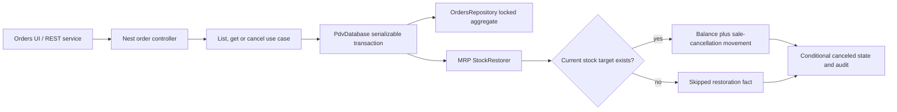

# 1. Context and scope

## Objective and source

Implement the remaining PDV order-management lifecycle from GitHub issue
[#24](https://github.com/rafinel/scoops/issues/24) in `complete` mode: immutable order
snapshots, tenant-wide history, URL-backed discovery, snapshot-only details, and Manager-only
one-way cancellation with atomic stock restoration. The existing new-sale flow remains the
registration entry point.

## Current behavior and product gap

Order registration already creates tenant-sequenced immutable line, channel, pricing, Combo and
consumption records inside a serializable PDV/MRP transaction. The Core repository can read
orders, but persisted orders do not contain an Operator-name snapshot or lifecycle/cancellation
facts; list query capability is not exposed through use cases or REST; `/orders` is a placeholder;
and no detail, cancellation or restoration adapter exists. MRP stock history records sales but
has no cancellation-restoration movement.

## Scope and product alignment

| Area | In scope | Out of scope |
| --- | --- | --- |
| History | Last-30-days default, search by sequence or snapshotted product name, period/channel/no-channel/status filters, most-recent-first pagination, Operator-visible establishment-wide results | Reports, metrics, dashboards and exports |
| Snapshot/details | Operator name snapshot, registered/canceled lifecycle, complete immutable product/configuration/channel/Combo/price/consumption details | Reconstructing current catalog facts or rewriting historical snapshots |
| Cancellation | Manager-only confirmation, optional bounded reason, atomic status/restoration/audit, deleted target skip, retry-safe concurrent transition | Edit, reverse, delete, reactivate, payment refund or payment reversal |
| UI | Desktop references, distinct loading/empty/filtered-empty/error states, responsive list/detail/dialog, keyboard and assistive-technology paths | Redesigning the app shell or adjacent PDV management screens |

| Source requirement | Delivery | Notes |
| --- | --- | --- |
| PDV `REQ-09` — Order Snapshot | `full` | Completes Operator and cancellation snapshots plus restored/skipped audit facts. |
| PDV `REQ-10` — Order History | `full` | Adds list/search/filter/pagination/detail behavior for both authorized roles. |
| PDV `REQ-11` — Permissions, Navigation and Isolation | `partial` | Delivers order-specific navigation, authorization and isolation; unrelated PDV permissions remain outside this feature. |
| PDV `REQ-12` — Responsive and Accessible Experience | `partial` | Delivers order-list, detail and cancellation surfaces; unrelated PDV surfaces remain outside this feature. |
| PDV `REQ-15` — Order Cancellation | `full` | Cancels without an age limit, restoring current targets and auditing deleted targets as skipped. |
| Issue #24 cart/pricing/registration acceptance | `deferred` | `REQ-05`–`REQ-08` and `REQ-14` are already implemented and are regression dependencies, not rewritten here. |

## Product decisions and accepted assumptions

- Orders remain immutable and cannot be edited, reactivated or deleted.
- `/orders` initializes with URL period `last-30-days`, meaning today plus the preceding 29
  browser-local calendar days. Custom URL bounds are paired `YYYY-MM-DD` values. The browser
  converts their inclusive local `00:00:00.000`/`23:59:59.999` bounds to ISO instants for REST;
  clearing or any malformed/one-sided interval returns to the preset and page 1. This uses the
  authenticated browser timezone because the product has no establishment-timezone fact.
- Search accepts `#<sequence>` or digits as an exact sequence lookup and otherwise performs a
  case-insensitive contains match against snapshotted product names.
- Desktop rows add the PRD-required responsible Operator even though Pencil node `UltbT` omits
  it; number, date and total remain visible at 1024 px and narrow viewports.
- A missing current product, or missing original brand for brand-controlled consumption, does
  not block cancellation. That target is not restored and its snapshotted identity, quantity and
  skipped outcome remain auditable. Failures restoring any existing target roll back the entire
  cancellation.
- Cancellation reason input is trimmed; blank becomes absent; preserved text is at most 500
  characters.
- Dialog semantic icons are always left of the title/description block. Cancellation copy must
  not promise restoration for deleted targets.

# 2. Implementation Contract

## Functional requirements

| ID | REQ/source coverage | Required behavior |
| --- | --- | --- |
| `RF-01` | `REQ-09`, issue snapshot acceptance | Every new and migrated order exposes a stable Operator display-name snapshot, `Registered` or `Canceled` status, original snapshots, and any cancellation/restoration facts without reading mutable catalog or identity names. |
| `RF-02` | `REQ-10`, Journey P | Operator and Manager list current-establishment orders newest first with page loading; default last 30 days; URL-backed search, period, channel including no-channel, and status filters combine with AND and reset pagination when changed. |
| `RF-03` | `REQ-09`, `REQ-10` | Both roles open a tenant-scoped order by internal ID and see sequence, dates, Operator, status, channel/no-channel, items, configurations, accompaniments, Combos, consumption, prices, subtotals, discount and total exclusively from snapshots. |
| `RF-04` | `REQ-11`, `REQ-15` | Only a Manager can see or invoke cancellation for a Registered order; Operators can read both statuses; direct REST/URL access cannot bypass role or tenant boundaries. |
| `RF-05` | `REQ-15`, Journey Q | Manager cancellation is a one-way, no-time-limit transition confirmed with an optional trimmed 500-character reason. Status, actor/time/reason, restorations and MRP movements commit atomically. |
| `RF-06` | `REQ-09`, `REQ-15` | Every consolidated original product/brand consumption produces one `restored` or `skipped` cancellation fact. Missing current targets are skipped; existing targets receive the exact positive quantity and a `sale-cancellation` stock transaction. |
| `RF-07` | `REQ-10`, `REQ-12`, design manifest | List/detail/dialog provide loading, initial-empty, filtered-empty, retryable error, success and disabled/pending states; responsive hierarchy, visible focus, focus management, labels and keyboard operation use Scoops primitives/tokens. |
| `RF-08` | `REQ-10`, `REQ-15` | Concurrent or repeated cancellation cannot restore twice: one transaction may transition Registered to Canceled; later attempts return conflict with the already-canceled order unchanged. |
| `RF-09` | `REQ-09`, `REQ-10`, `REQ-11` | Repository, REST and UI responses never leak another establishment's order, and absent or cross-tenant IDs are indistinguishable as not found. |
| `RF-10` | `REQ-10`, `REQ-15`, issue exclusions | No order surface or endpoint offers edit, reverse, delete, reactivate, refund, payment, report or export behavior. |

## Acceptance criteria and traceability

| ID | RF coverage | Requirement | Given | When | Then | Expected evidence |
| --- | --- | --- | --- | --- | --- | --- |
| `CA-01` | `RF-01`, `RF-03` | Complete snapshot contract | Existing and newly registered orders | They are read after source users/catalog/channel/Combo data changes or deletion | Details preserve captured names, values, configuration and lifecycle facts with no missing-item failure | Core mapping/use-case tests; server controller/fixture tests |
| `CA-02` | `RF-02`, `RF-09` | Tenant-scoped discovery | Multiple tenants and more than one page of registered/canceled orders | An authorized user combines search, last-30-days/custom period, channel/no-channel and status filters | Only matching current-tenant rows return newest first; a changed filter restarts page 1; exhausted pages stop | Core list tests; server list controller tests; Web component and `MV-01` |
| `CA-03` | `RF-03`, `RF-09` | Immutable order details | A known current-tenant order | Operator or Manager opens its row | Complete snapshot detail renders and URL is `/orders/<id>`; unknown/cross-tenant ID is a retry-safe not-found state | Core get tests; server get tests; Web detail tests; `MV-02` |
| `CA-04` | `RF-04`, `RF-10` | Role boundary | The same Registered order and Manager/Operator sessions | Each opens details or calls cancellation directly | Manager alone receives the cancellation action/success; Operator receives forbidden; neither sees edit/delete/refund actions | Core cancellation tests; server auth tests; Web tests; `MV-02` |
| `CA-05` | `RF-05`, `RF-07` | Valid confirmation | A Manager views a Registered order | They submit a blank or valid reason | Blank is absent; valid trimmed text is preserved; pending prevents duplicate action; success changes visible state | Validation tests; Core/server tests; dialog tests; `MV-03` |
| `CA-06` | `RF-05`, `RF-06` | Atomic restoration | Original consumption contains surviving product and brand targets | Manager cancels | Exact balances increase, `sale-cancellation` transactions and restored facts are written, original snapshots remain unchanged, and canceled details show actor/time/reason | Core cancellation and MRP adapter tests; server integration fixture; `MV-03` |
| `CA-07` | `RF-05`, `RF-06` | Deleted target exception and rollback | Consumption includes a deleted product/brand target and optionally a failing surviving target | Manager cancels | Deleted targets are skipped and audited; if any surviving restoration fails, status, all balance changes, movements and audit facts roll back | Core use-case and MRP adapter tests; server integration fixture; `MV-03` |
| `CA-08` | `RF-02`, `RF-07` | List state recovery | Empty, filtered-empty, loading and failed list fixtures | User loads, clears filters or retries | Each state is distinct; URL/filter state is preserved on error; clear returns to last 30 days/page 1; initial empty offers new sale | Page/widget tests; `MV-01` |
| `CA-09` | `RF-06`, `RF-08` | Idempotent lifecycle | Two cancellations race or a canceled order is submitted again | Requests complete | Exactly one commits restoration; the other conflicts; no duplicate movement or balance increment exists | Core concurrency contract tests; server database integration evidence |
| `CA-10` | `RF-07` | Responsive and accessible operation | 1481×1050, 1024×768 and 390×844 viewports | User completes list/detail/dialog paths by pointer and keyboard | Required facts/actions remain reachable without page overflow; focus/dialog semantics and labels are correct; no blocking console/network errors | Widget tests; `MV-01`–`MV-04`; fresh screenshots |
| `CA-11` | `RF-05`, `RF-07` | Validation and failure feedback | An over-500-character reason or server failure | Manager submits | Inline validation blocks the request; server failure retains Registered state, reason and retry action without claiming partial restoration | Validation/dialog/controller tests; `MV-03` |
| `CA-12` | `RF-10` | Exclusion integrity | Any order status or role | User inspects list/detail/API examples | Only list, get, register-related existing operations and Manager cancellation exist; no prohibited operation is exposed | REST parity check; route/widget inspection |

## Cross-cutting restrictions

| Concern | Contract |
| --- | --- |
| Tenancy | Establishment ID always comes from the authenticated account; client input never selects it. Repository reads/writes qualify by establishment and order ID. |
| History | Snapshotted names and commercial facts are canonical for display and cancellation audit. No mutable Identity/MRP/PDV lookup is required to render history. |
| Transactions | Cancellation owns one serializable PDV transaction; row locking/conditional update prevents duplicate transition, and every eligible MRP restoration is transaction-bound. |
| Time | Registration/cancellation timestamps come from `DatetimeProvider`; HTTP uses ISO date-time and UI renders pt-BR. |
| Security | Manager enforcement exists in Core and controller decorators. Error messages do not disclose cross-tenant existence. No secrets or credentials are added. |
| Performance | Initial last-30-days/page query is bounded; indexes support tenant/status/date ordering and product-name search; aggregate loading remains batched. |

## Design Contract

The saved [design manifest](./design/manifest.md) is the offline implementation and visual
validation authority. Required desktop comparisons use `UltbT`, `I2Kra`, `c52HsC`, `dPHci`,
`Uhw53` and `pSlGt`. Production adds the Operator column, accurate deleted-target restoration
copy and skipped facts. At 390×844 the filter bar stacks, list rows compact without hiding
number/date/total, detail cards form one reading column, and dialog actions remain reachable.

# 3. Technical Contract

## Current technical state

| Evidence | Current responsibility | Gap |
| --- | --- | --- |
| `packages/core/src/pdv/domain/entities/order.ts` and `order-details.ts` | Immutable commercial aggregate/projection | No Operator name, lifecycle or cancellation/restoration facts. |
| `orders-repository.ts` and `drizzle-orders-repository.ts` | Add/find/list order aggregates with tenant/date/channel filters | No search, no-channel/status filter, locking or cancellation write. |
| `register-order-use-case.ts` and `drizzle-pdv-database.ts` | Serializable registration plus transaction-bound MRP consumption | Registration does not persist actor name; database scope has no restorer. |
| `order-model.ts` and aggregate tables | Persist sequence, actor ID, channel, lines, discounts and consumption | No lifecycle columns/audit table or search/status indexes. |
| `stock-transaction-type.ts` and transaction-bound registration factory | Attribute MRP sale write-offs | No positive cancellation movement or missing-target skip result. |
| `apps/web/src/routes/_authenticated/orders/index.tsx` | Protected route placeholder | No list, search, details, cancellation or state UI. |

## Solution and runtime flow

List and detail are read-only Core use cases over `OrdersRepository`, with actor authorization
and tenant scope applied before the repository maps complete persisted snapshots. The browser
normalizes URL search through shared validation and calls `GET /orders` or `GET
/orders/:orderId` through `PdvService`.

Cancellation enters `PATCH /orders/:orderId/cancel`. The Core use case validates Manager,
opens `PdvDatabase.run`, locks the tenant-qualified order, rejects non-Registered status,
consolidates original consumption by product/brand, and calls transaction-bound `StockRestorer`.
The MRP adapter skips a missing product or required brand; otherwise it adds the exact quantity
and creates one `sale-cancellation` stock transaction. The PDV repository persists restored and
skipped facts and performs a Registered-to-Canceled conditional update. Any eligible restoration
or write failure aborts the serializable transaction; retryable database conflicts follow the
existing one-retry policy. No asynchronous message or external side effect participates.



| Boundary | Producer | Consumer | Canonical contract | Mapping/guarantees | Failure ownership |
| --- | --- | --- | --- | --- | --- |
| HTTP list/detail/cancel | Server controllers | Web `PdvService` | Core `Order`, `OrderListParams`; validation schemas | Dates serialize ISO; pages retain `PaginationResponse`; transport errors remain `RestResponse` | Zod pipe/controller and shared error translator |
| Repository aggregate | `DrizzleOrdersRepository` | Core use cases | `Order` including `OrderCancellation` | Tenant-qualified complete aggregate, positional snapshots, restored/skipped facts | Repository maps persistence conflicts to named Core errors |
| Restoration port | `CancelOrderUseCase` | transaction-bound MRP adapter | `StockRestorer.restore` request/result | One consolidated fact per product/brand; exact positive quantity; deterministic order | Adapter skips only absent targets; other failures abort transaction |
| Stock movement | MRP adapter | stock repository/history UI | `StockTransactionType.SaleCancellation` | Positive quantity, resulting balance, order/actor/snapshot labels and timestamp | Transaction owner rolls back persistence failure |

## packages/core — Domain

| Declaration | Kind | Ownership/identity | Contract summary | Related declarations | Consumers |
| --- | --- | --- | --- | --- | --- |
| `Order` | Entity | PDV aggregate identity | Immutable sale plus lifecycle/audit state | `OrderStatus`, `OrderCancellation`, existing snapshots | use cases, repository, REST/UI |
| `OrderStatus` | Structure | Identity-free enum | `registered` or `canceled` | `Order` | validation, persistence, UI |
| `OrderCancellation` | Structure | Embedded lifecycle fact | Actor/time/reason and restoration results | `OrderStockRestoration` | detail/cancel contracts |
| `OrderStockRestoration` | Structure | Identity-free audit fact | Target snapshot, quantity and restored/skipped outcome | `StockConsumption` | MRP port, persistence, UI |
| `StockRestorationTarget` | Structure | Identity-free restoration input | Original snapshotted target and exact consolidated quantity | `StockRestorationRequest` | cancel use case, MRP port |
| `StockRestorationRequest` | Structure | Identity-free provider request | Tenant/order/actor/time plus restoration targets | `StockRestorationTarget` | `StockRestorer` |
| `OrderListParams` | Structure | Identity-free query | Tenant paging/search/filter contract | `OrderStatus` | list use case/repository |

| Path | Change | Declaration | Domain role/schema | Invariants/transitions | Errors/events | Exports/consumers |
| --- | --- | --- | --- | --- | --- | --- |
| `packages/core/src/pdv/domain/entities/order.ts` | Modify | `Order`, `OrderCreate` Entity types | Resulting schema below | Original fields never rewrite; cancellation present iff canceled; `OrderCreate` starts registered without cancellation | — | PDV entity barrel, repository/DTO/UI |
| `packages/core/src/pdv/domain/structures/order-status.ts` | Create | `OrderStatus` Structure | Runtime constant/type below | Only registered/canceled | — | structures barrel, validation/database/UI |
| `packages/core/src/pdv/domain/structures/order-cancellation.ts` | Create | `OrderCancellation` Structure | Resulting schema below | Reason absent or trimmed ≤500; restoration facts non-empty when original consumption exists | — | structures barrel, `Order` |
| `packages/core/src/pdv/domain/structures/order-stock-restoration.ts` | Create | `OrderStockRestoration` Structure | Resulting schema below | Positive quantity; optional brand snapshot complete; outcome restored/skipped | — | structures barrel, MRP/rest repository |
| `packages/core/src/pdv/domain/structures/stock-restoration-target.ts` | Create | `StockRestorationTarget` Structure | Resulting schema below | Positive quantity; optional brand snapshot complete; labels come from the order snapshot | — | structures barrel, cancel/restorer |
| `packages/core/src/pdv/domain/structures/stock-restoration-request.ts` | Create | `StockRestorationRequest` Structure | Resulting schema below | Non-empty targets when original consumption exists; actor/time are cancellation facts | — | structures barrel, `StockRestorer` |
| `packages/core/src/pdv/domain/structures/order-list-params.ts` | Modify | `OrderListParams` Structure | Resulting schema below | Page/pageSize positive; undefined channel means all, null means no channel | — | repository/list/schema |
| `packages/core/src/mrp/domain/structures/stock-transaction-type.ts` | Modify | `StockTransactionType.SaleCancellation` Structure member | Add `sale-cancellation` | Restoration movement is positive and references order | — | MRP mapping/filter/UI |
| `packages/core/src/pdv/domain/entities/fakers/order-faker.ts` | Modify | `OrderFaker` | Valid Registered default and coherent canceled overrides | Default includes `createdByName`, Registered and no cancellation; canceled helper/override includes complete audit facts | — | Core/server/Web tests |

```ts
// packages/core/src/pdv/domain/entities/order.ts
export type Order = Entity & {
  establishmentId: string
  idempotencyKey: string
  sequenceNumber: number
  createdBy: string
  createdByName: string
  status: OrderStatus
  channel?: SalesChannelSnapshot
  lines: readonly OrderLine[]
  discounts: readonly OrderDiscount[]
  subtotal: number
  totalDiscount: number
  total: number
  cancellation?: OrderCancellation
  createdAt: Date
}

export type OrderCreate = Omit<
  Order,
  'id' | 'sequenceNumber' | 'status' | 'cancellation' | 'createdAt'
>
```

**Schema — `Order`**

| Field | Type | Required | Validation | Description |
| --- | --- | --- | --- | --- |
| `id` | `string` | Yes | UUID | Internal order identity. |
| `establishmentId` | `string` | Yes | UUID | Tenant owner. |
| `idempotencyKey` | `string` | Yes | UUID; tenant-unique | Registration replay identity. |
| `sequenceNumber` | `number` | Yes | Positive integer; tenant-unique | User-visible order number. |
| `createdBy` | `string` | Yes | UUID | Registering user identity. |
| `createdByName` | `string` | Yes | Nonblank snapshot | Registering Operator/Manager name at sale time. |
| `status` | `OrderStatus` | Yes | Registered or Canceled | Lifecycle state. |
| `channel` | `SalesChannelSnapshot` | No | Complete snapshot when present | Selected channel; absence is explicit no-channel. |
| `lines` | `readonly OrderLine[]` | Yes | Non-empty registered snapshot | Products, configuration, price and consumption. |
| `discounts` | `readonly OrderDiscount[]` | Yes | May be empty | Applied Combo facts. |
| `subtotal` | `number` | Yes | Non-negative currency | Pre-discount total. |
| `totalDiscount` | `number` | Yes | Non-negative currency | Preserved discount. |
| `total` | `number` | Yes | Non-negative currency | Final total. |
| `cancellation` | `OrderCancellation` | No | Required iff status canceled | One-way transition facts. |
| `createdAt` | `Date` | Yes | Valid instant | Registration time. |

```ts
// packages/core/src/pdv/domain/structures/order-status.ts
export const OrderStatus = {
  Registered: 'registered',
  Canceled: 'canceled',
} as const
export type OrderStatus = (typeof OrderStatus)[keyof typeof OrderStatus]

// packages/core/src/pdv/domain/structures/order-stock-restoration.ts
export type OrderStockRestoration = {
  readonly productId: string
  readonly productName: string
  readonly brandId?: string
  readonly brandName?: string
  readonly quantity: number
  readonly outcome: 'restored' | 'skipped'
}

// packages/core/src/pdv/domain/structures/order-cancellation.ts
export type OrderCancellation = {
  readonly canceledAt: Date
  readonly canceledBy: string
  readonly canceledByName: string
  readonly reason?: string
  readonly restorations: readonly OrderStockRestoration[]
}

// packages/core/src/pdv/domain/structures/stock-restoration-target.ts
export type StockRestorationTarget = {
  readonly productId: string
  readonly productName: string
  readonly brandId?: string
  readonly brandName?: string
  readonly quantity: number
}

// packages/core/src/pdv/domain/structures/stock-restoration-request.ts
export type StockRestorationRequest = {
  readonly establishmentId: string
  readonly orderId: string
  readonly performedBy: string
  readonly performedByName: string
  readonly occurredAt: Date
  readonly targets: readonly StockRestorationTarget[]
}

// packages/core/src/pdv/domain/structures/order-list-params.ts
export type OrderListParams = {
  readonly establishmentId: string
  readonly search?: string
  readonly createdFrom?: Date
  readonly createdTo?: Date
  readonly channelId?: string | null
  readonly status?: OrderStatus
  readonly page: number
  readonly pageSize: number
}

// packages/core/src/mrp/domain/structures/stock-transaction-type.ts
export const StockTransactionType = {
  Entry: 'entry',
  WriteOff: 'write-off',
  ProductionConsumption: 'production-consumption',
  ProductionOutput: 'production-output',
  Sale: 'sale',
  SaleCancellation: 'sale-cancellation',
} as const
export type StockTransactionType =
  (typeof StockTransactionType)[keyof typeof StockTransactionType]
```

**Schema — `OrderStatus`**

| Field | Type | Required | Validation | Description |
| --- | --- | --- | --- | --- |
| value | `'registered' \| 'canceled'` | Yes | Runtime constant member | Order lifecycle discriminator. |

**Schema — `OrderStockRestoration`**

| Field | Type | Required | Validation | Description |
| --- | --- | --- | --- | --- |
| `productId` | `string` | Yes | UUID snapshot | Original target product. |
| `productName` | `string` | Yes | Nonblank snapshot | Historical display name. |
| `brandId` | `string` | Conditional | UUID; paired with brandName | Original brand target. |
| `brandName` | `string` | Conditional | Paired with brandId | Historical brand display name. |
| `quantity` | `number` | Yes | Positive finite | Consolidated quantity. |
| `outcome` | `'restored' \| 'skipped'` | Yes | Closed union | Current target restored or absent target skipped. |

**Schema — `OrderCancellation`**

| Field | Type | Required | Validation | Description |
| --- | --- | --- | --- | --- |
| `canceledAt` | `Date` | Yes | Valid instant | Transition time. |
| `canceledBy` | `string` | Yes | UUID | Manager identity. |
| `canceledByName` | `string` | Yes | Nonblank snapshot | Manager name at cancellation. |
| `reason` | `string` | No | Trimmed, 1–500 chars | Optional preserved explanation. |
| `restorations` | `readonly OrderStockRestoration[]` | Yes | One per consolidated target | Auditable restoration result. |

**Schema — `StockRestorationTarget`**

| Field | Type | Required | Validation | Description |
| --- | --- | --- | --- | --- |
| `productId` | `string` | Yes | UUID snapshot | Original product identity. |
| `productName` | `string` | Yes | Nonblank snapshot | Original display name. |
| `brandId` | `string` | Conditional | UUID; paired with brandName | Original brand target. |
| `brandName` | `string` | Conditional | Paired with brandId | Original brand display name. |
| `quantity` | `number` | Yes | Positive finite | Consolidated base-unit quantity. |

**Schema — `StockRestorationRequest`**

| Field | Type | Required | Validation | Description |
| --- | --- | --- | --- | --- |
| `establishmentId` | `string` | Yes | UUID from actor/order | Tenant scope. |
| `orderId` | `string` | Yes | UUID | Canceled order correlation. |
| `performedBy` | `string` | Yes | UUID | Canceling Manager. |
| `performedByName` | `string` | Yes | Nonblank snapshot | Manager name for movement/audit. |
| `occurredAt` | `Date` | Yes | Valid instant | Shared cancellation/movement time. |
| `targets` | `readonly StockRestorationTarget[]` | Yes | Consolidated by product/brand | Exact restoration attempts. |

**Schema — `OrderListParams`**

| Field | Type | Required | Validation | Description |
| --- | --- | --- | --- | --- |
| `establishmentId` | `string` | Yes | UUID from actor | Tenant scope. |
| `search` | `string` | No | Trimmed, 1–100 | Sequence or product-name search. |
| `createdFrom` | `Date` | No | Valid instant, ≤ createdTo | Inclusive period start. |
| `createdTo` | `Date` | No | Valid instant, ≥ createdFrom | Inclusive period end. |
| `channelId` | `string \| null` | No | UUID, null=no-channel | Channel filter; undefined means all. |
| `status` | `OrderStatus` | No | Runtime member | Lifecycle filter. |
| `page` | `number` | Yes | Positive integer | Current page. |
| `pageSize` | `number` | Yes | Positive integer, max 100 | Bounded page size. |

## packages/core — Use cases and Interfaces

| Use case | Actor/trigger | Input/output | Direct collaborators | Consistency boundary | Failures/side effects |
| --- | --- | --- | --- | --- | --- |
| `ListOrdersUseCase` | Manager/Operator | actor + public list filters → page of `Order` | `OrdersRepository` | role and tenant read | authorization only; no writes |
| `GetOrderUseCase` | Manager/Operator | actor + orderId → `Order` | `OrdersRepository` | tenant-qualified read | authorization/not found |
| `CancelOrderUseCase` | Manager | actor + orderId + optional reason → canceled `Order` | `PdvDatabase`, `OrdersRepository`, `StockRestorer`, `DatetimeProvider` | serializable lock and conditional transition | restoration movements/audit; authorization/not found/conflict |

| Path | Change | Declaration/signature | Input/output/errors | Authorization/consistency | Side effects/dependencies | Consumers/tests |
| --- | --- | --- | --- | --- | --- | --- |
| `packages/core/src/pdv/use-cases/list-orders-use-case.ts` | Create | `ListOrdersUseCase.execute(request)` | actor + filters → `PaginationResponse<Order>`; authorization | Manager/Operator; establishment overwritten from actor | repository read | list controller/unit test |
| `packages/core/src/pdv/use-cases/get-order-use-case.ts` | Create | `GetOrderUseCase.execute(request)` | actor/orderId → `Order`; authorization/not found | Manager/Operator; cross-tenant not found | repository read | get controller/unit test |
| `packages/core/src/pdv/use-cases/cancel-order-use-case.ts` | Create | `CancelOrderUseCase.execute(request)` | actor/orderId/reason → `Order`; authorization/not found/conflict | Manager; serializable locked transition; retry safe | MRP restoration then audit/status in same transaction | cancel controller/unit test |
| `packages/core/src/pdv/use-cases/register-order-use-case.ts` | Modify | `RegisterOrderUseCase.toOrderCreate` | Existing registration result | Preserve existing idempotency/transaction behavior | Persist `actor.name` snapshot and Registered default | existing tests plus snapshot case |
| `packages/core/src/pdv/use-cases/tests/list-orders-use-case.test.ts` | Create | list unit suite | Filters/page/role/tenant outcomes | Proves actor tenant and Operator whole-shop scope | No side effects | Core coverage |
| `packages/core/src/pdv/use-cases/tests/get-order-use-case.test.ts` | Create | get unit suite | Success/not-found/forbidden | Cross-tenant hidden | No side effects | Core coverage |
| `packages/core/src/pdv/use-cases/tests/cancel-order-use-case.test.ts` | Create | cancellation unit suite | Success/skip/rollback/repeat/race/role | One transition and one target result | Assert port calls and final aggregate | Core coverage |
| `packages/core/src/pdv/use-cases/tests/register-order-use-case.test.ts` | Modify | registration suite | Operator name/status snapshot | Existing tenancy/idempotency | Existing consumption unchanged | Core coverage |

| Contract | Kind/owner | Capability | Implementers | Consumers | Guarantees/failures |
| --- | --- | --- | --- | --- | --- |
| `OrdersRepository` | repository/PDV | Complete add/read/list/lock/cancel aggregate | `DrizzleOrdersRepository` | four order use cases | Tenant-qualified, complete snapshots, conditional lifecycle write |
| `StockRestorer` | provider/PDV consumer port | Restore current MRP targets and classify missing targets | transaction-bound MRP adapter | `CancelOrderUseCase` | Exact quantity; skip only missing target; other failure propagates |
| `PdvDatabase` | database/PDV | Serializable transactional scope | `DrizzlePdvDatabase` | register/cancel use cases | Provides transaction-bound consumer/restorer/repositories |
| `PdvService` | service/PDV | Browser-facing list/get/cancel operations | Web `PdvService` factory | query/action hooks | Preserves typed REST success/failure |

| Path | Change | Contract/signature | Capability semantics | Guarantees/failures | Implementers/consumers | Exports |
| --- | --- | --- | --- | --- | --- | --- |
| `packages/core/src/pdv/interfaces/orders-repository.ts` | Modify | Add `findByIdForUpdate(establishmentId: string, orderId: string): Promise<Order \| undefined>` and `cancel(establishmentId: string, orderId: string, cancellation: OrderCancellation): Promise<Order>`; extend `findMany` | Locked tenant aggregate read and conditional lifecycle persistence | `cancel` updates only `status = registered`, inserts the supplied restoration facts in the same executor, and throws `ConflictError` when no row transitions | Drizzle/use cases | interfaces barrel |
| `packages/core/src/pdv/interfaces/stock-restorer.ts` | Create | `restore(request: StockRestorationRequest): Promise<readonly OrderStockRestoration[]>` | Transaction-bound MRP restoration port | Returns one ordered result for every request target; skips only missing product/required brand; any other failure aborts | MRP adapter/cancel use case | interfaces barrel |
| `packages/core/src/pdv/interfaces/pdv-database.ts` | Modify | Add `stockRestorer` to `PdvDatabaseScope` | Cancellation transaction composition | Same serializable/retry contract | Drizzle/use cases | interfaces barrel |
| `packages/core/src/pdv/interfaces/pdv-service.ts` | Modify | `listOrders(input: Omit<OrderListParams, 'establishmentId'>): Promise<RestResponse<PaginationResponse<Order>>>`; `getOrder(orderId: string): Promise<RestResponse<OrderDetails>>`; `cancelOrder(orderId: string, input: { readonly reason?: string }): Promise<RestResponse<OrderDetails>>` | Browser service contract; Core owns the optional-reason shape without depending on Validation | ISO/page mapping and unsuccessful `RestResponse` preservation | Web factory/query/action hooks | interfaces barrel |

`CancelOrderUseCase` obtains one `occurredAt` value, builds `StockRestorationRequest` from the
locked order's original line/brand snapshots and consolidated consumptions, passes the current
Manager ID/name and order/tenant IDs to `StockRestorer`, then supplies the returned facts in
`OrderCancellation` to `OrdersRepository.cancel`. Neither adapter performs a mutable lookup to
replace snapshotted labels.

## packages/validation — Validation

| Schema | Concern/owner | Shape responsibility | Composes/derives from | Boundary consumers | Error/type contract |
| --- | --- | --- | --- | --- | --- |
| `orderListQuerySchema` | PDV REST query | Search/instant/channel/status/page defaults | Core `OrderStatus`, Zod primitives | server list controller | inferred normalized query; cross-instant issue |
| `cancelOrderSchema` | PDV action | Optional reason normalization/bound | Zod string | server controller, dialog form | `{reason?: string}` and localized field issue |
| `ordersSearchSchema` | Web route search | Stable preset/custom date-only URL state | Core `OrderStatus`, date-only primitives | `/orders` route | normalized URL state; invalid/partial custom dates fall back to preset |

| Path | Change | Schema/declaration | Fields/refinements | Composition/ownership | Consumers | Export/tests |
| --- | --- | --- | --- | --- | --- | --- |
| `packages/validation/src/pdv/order-list-query-schema.ts` | Create | `orderListQuerySchema`, `OrderListQuery` | search trim/max100; ISO instant createdFrom/createdTo with from≤to; channel UUID/`none`; status; page default1; pageSize default6/max100 | Server query normalization only; actor owns tenant; server converts `none` to null | list controller | root barrel; controller tests |
| `packages/validation/src/pdv/cancel-order-schema.ts` | Create | `cancelOrderSchema`, `CancelOrderInput` | optional reason trim; empty→undefined; max500 | No authorization/lifecycle decision | dialog/controller | root barrel; controller/dialog consumer tests |
| `packages/validation/src/web/orders-search-schema.ts` | Create | `ordersSearchSchema`, `OrdersSearch` | search; channel/no-channel; status; `last-30-days` or `custom`; paired `YYYY-MM-DD` from/to; page default1 | URL state only; malformed/partial/reversed custom interval catches to preset and page1 | `/orders`, `OrdersPage` | root barrel; route/page tests |

## apps/server — REST

| Operation | Server entry | Core action/contract | Web consumer | Security/tenant source | Compatibility/error owner |
| --- | --- | --- | --- | --- | --- |
| `GET /orders` | `ListOrdersController.handle` | `ListOrdersUseCase` | `PdvService.listOrders` | current account, Manager/Operator | query schema/page DTO/error translator |
| `GET /orders/:orderId` | `GetOrderController.handle` | `GetOrderUseCase` | `PdvService.getOrder` | current account, Manager/Operator | UUID pipe/order DTO/error translator |
| `PATCH /orders/:orderId/cancel` | `CancelOrderController.handle` | `CancelOrderUseCase` | `PdvService.cancelOrder` | current account, Manager | UUID pipe/body schema/order DTO/error translator |

| Path | Change | Declaration/operation | Boundary/security | Request/response/errors | Effects/consumers | Registration/examples |
| --- | --- | --- | --- | --- | --- | --- |
| `apps/server/src/pdv/rest/controllers/list-orders.controller.ts` | Create | `ListOrdersController`, GET `/orders` | authenticated Manager/Operator; actor tenant | validated query → page DTO; 200/401/403/422 | list use case/Web | order decorator/controller registry/Swagger |
| `apps/server/src/pdv/rest/controllers/get-order.controller.ts` | Create | `GetOrderController`, GET `/:orderId` | authenticated Manager/Operator | UUID → order DTO; 200/401/403/404 | get use case/Web | registry/Swagger |
| `apps/server/src/pdv/rest/controllers/cancel-order.controller.ts` | Create | `CancelOrderController`, PATCH `/:orderId/cancel` | authenticated Manager | UUID + validated reason → order DTO; 200/401/403/404/409/422/500/503 | atomic cancel/Web | registry/Swagger |
| `apps/server/src/pdv/rest/controllers/tests/list-orders.controller.test.ts` | Create | Nest/Supertest controller integration suite | profile/tenant/query | Real use case, Drizzle repository and PostgreSQL page/query effects | `PdvModuleFixture` database data; no mocked repository/use case | Server coverage |
| `apps/server/src/pdv/rest/controllers/tests/get-order.controller.test.ts` | Create | Nest/Supertest controller integration suite | profile/tenant/UUID | Real aggregate hydration, DTO and hidden not-found | `PdvModuleFixture` database data; no mocked repository/use case | Server coverage |
| `apps/server/src/pdv/rest/controllers/tests/cancel-order.controller.test.ts` | Create | Nest/Supertest controller integration suite | Manager/Operator/body/concurrency | Real use case, serializable PDV/MRP adapters, balances, transactions, audit and error statuses | `PdvModuleFixture` mixed/deleted/failure seams | Server coverage |
| `apps/server/src/pdv/rest/controllers/tests/register-order.controller.test.ts` | Modify | registration controller suite | existing request | new DTO fields | existing flow | Server coverage |
| `apps/server/src/pdv/rest/dtos/order-response.dto.ts` | Modify | `OrderResponseDto.from` | Snapshot response owner | ISO registration/cancellation dates, nested restoration facts | all order operations | DTO barrel |
| `apps/server/src/pdv/rest/dtos/order-page-response.dto.ts` | Create | `OrderPageResponseDto.from` | Page serializer | `OrderResponseDto[]` plus pagination | list controller/Web | DTO barrel |
| `apps/server/src/pdv/fixtures/pdv-module-fixture.ts` | Modify | `PdvModuleFixture` | Real database helpers for dated tenant orders, current/deleted product/brand targets, balances, restoration facts and concurrent requests; injectable stock-restorer/database failure after partial work | Fixture owns deterministic cleanup and exposes repository reads needed for assertions; it does not replace Core use cases or Drizzle repositories | order controller integration suites | Server test support |
| `apps/server/rest-client/pdv/orders.rest` | Modify | Complete `orders` route group examples | Reusable base URL/session/order ID | Existing catalog/preview/register plus list/get/cancel, representative queries/body; no credentials | Manual parity | One labeled request per operation |

## apps/server — Database and Provision

| Persistence capability | Domain owner | Core contract | Models/types | Mapper | Repository/transaction owner |
| --- | --- | --- | --- | --- | --- |
| Order lifecycle aggregate | PDV `Order` | `OrdersRepository` | order/status/restoration models and Drizzle types | `DrizzleOrderMapper` | `DrizzleOrdersRepository`, `DrizzlePdvDatabase` |
| Cancellation stock restoration | MRP stock | `StockRestorer` | balances and stock transactions | existing MRP mappers plus new type member | transaction-bound MRP adapter |

| Path | Change | Declaration/operation | Schema/mapping | Integrity/query contract | Migration/transaction | Registration/consumers |
| --- | --- | --- | --- | --- | --- | --- |
| `apps/server/src/pdv/database/drizzle/models/order-model.ts` | Modify | `orderModel` | Operator name, status, cancellation actor/name/reason/time | lifecycle completeness checks; tenant/status/date index | migration/backfill; conditional update | schema barrel/repository |
| `apps/server/src/pdv/database/drizzle/models/order-status-model.ts` | Create | `orderStatusModel` | PostgreSQL enum registered/canceled | Closed domain values | migration | order model/schema barrel |
| `apps/server/src/pdv/database/drizzle/models/order-stock-restoration-model.ts` | Create | `orderStockRestorationModel` | Ordered target snapshot, quantity, outcome | FK cascade from order; unique order+position; positive quantity | inserted in cancellation transaction | schema barrel/repository |
| `apps/server/src/pdv/database/drizzle/models/order-stock-restoration-outcome-model.ts` | Create | outcome enum | restored/skipped | Closed values | migration | restoration model |
| `apps/server/src/pdv/database/drizzle/models/order-line-model.ts` | Modify | product-name search index source | Existing product snapshot unchanged | trigram index over lower product name | migration only | list query |
| `apps/server/src/pdv/database/drizzle/types/entities/order.ts` | Modify | `DrizzleOrder` | New inferred lifecycle columns | Mapper parity | — | mapper/repository |
| `apps/server/src/pdv/database/drizzle/types/entities/order-stock-restoration.ts` | Create | `DrizzleOrderStockRestoration` | Inferred row type | Mapper parity | — | mapper/repository |
| `apps/server/src/pdv/database/drizzle/mappers/drizzle-order-mapper.ts` | Modify | `DrizzleOrderMapper` | Map complete lifecycle/restoration/actor snapshot | Sort restoration facts by position; reject inconsistent persisted metadata | — | repository/DTO |
| `apps/server/src/pdv/database/drizzle/repositories/drizzle-orders-repository.ts` | Modify | add/list/get-lock/cancel aggregate operations | Persist actor name/default Registered; hydrate restorations | Tenant filters; exact sequence or product-name EXISTS; null channel; status; batched aggregates; conditional cancel | Runs on supplied executor; no nested transaction | use cases/database scope |
| `apps/server/src/pdv/database/drizzle/repositories/drizzle-pdv-database.ts` | Modify | cancellation scope wiring | Supply transaction-bound `StockRestorer` | Existing serializable one-retry behavior | Single commit/rollback owner | register/cancel use cases |
| `apps/server/src/mrp/provision/pdv/transaction-bound-order-registration-dependencies-factory.ts` | Modify | add `TransactionBoundStockRestorer` and expose it from transaction dependencies | Map original target to current product/brand/balance; return restored/skipped snapshots | Skip absent product/brand only; exact positive balance; add one movement | Same PDV executor and transaction; no independent retry | `DrizzlePdvDatabase`; adapter tests |
| `apps/server/src/mrp/provision/pdv/tests/transaction-bound-order-cancellation-dependencies.test.ts` | Create | restorer integration suite | Surviving/missing/failing targets | Assert balances, movement labels/outcomes and rollback-compatible failure | transaction fixture | Server coverage |
| `apps/server/src/mrp/database/drizzle/models/stock-transaction-model.ts` | Modify | extend type/correlation checks for `sale-cancellation` | Text persistence parity with Core; order ID required | Existing rows unchanged; positive quantity remains enforced | generated check replacement | mapper/filter |
| `apps/server/src/mrp/database/drizzle/mappers/drizzle-stock-transaction-mapper.ts` | Modify | type mapping compatibility | New Core value round trip | Positive restoration movement retained | — | repository/DTO/UI |
| `apps/server/src/shared/database/drizzle/migrations/0016_pdv-order-management.sql` | Generate | Drizzle migration | Data model and expected SQL below | Backfill and indexes/checks | Generate, then review/customize statements Drizzle cannot infer | journal/meta/schema |
| `apps/server/src/shared/database/drizzle/migrations/meta/_journal.json` | Generate | Drizzle journal entry | Migration ordering | Next index only | Generator-owned | migration runner |
| `apps/server/src/shared/database/drizzle/migrations/meta/0016_snapshot.json` | Generate | Drizzle schema snapshot | Resulting schema | Must match models | Generator-owned | future migrations |

### Table `pdv_orders` changes

| Column | Type | Nullable | Default | Description |
| --- | --- | --- | --- | --- |
| `created_by_name` | text | No | none after backfill | Registration-time actor name snapshot. |
| `status` | order status enum | No | `registered` | Lifecycle state. |
| `canceled_at` | timestamptz | Yes | null | Cancellation time. |
| `canceled_by` | uuid | Yes | null | Canceling Manager ID snapshot reference. |
| `canceled_by_name` | text | Yes | null | Canceling Manager name snapshot. |
| `cancellation_reason` | text | Yes | null | Trimmed optional reason up to 500 characters. |

| Index name | Columns | Type | Purpose |
| --- | --- | --- | --- |
| `pdv_orders_establishment_status_created_page_idx` | establishment_id, status, created_at DESC, id DESC | btree | Tenant status/page reads. |
| existing tenant/date and uniqueness indexes | unchanged | btree | Preserve registration/idempotency access. |

| Constraint | Type | Definition | Purpose |
| --- | --- | --- | --- |
| `pdv_orders_cancellation_complete` | check | Registered has all cancellation columns null; Canceled has time/actor/name populated | Prevent partial lifecycle metadata. |
| `pdv_orders_cancellation_reason_length` | check | reason null or length 1–500 | Persistence parity after trimming. |

### Table `pdv_order_stock_restorations`

| Column | Type | Nullable | Default | Description |
| --- | --- | --- | --- | --- |
| `id` | uuid | No | application UUID | Audit row identity. |
| `order_id` | uuid | No | none | Owning canceled order, cascade delete only for fixture teardown. |
| `position` | integer | No | none | Stable consolidated-target order. |
| `product_id` | uuid | No | none | Original product identity snapshot. |
| `product_name` | text | No | none | Original product display-name snapshot. |
| `brand_id` | uuid | Yes | null | Original brand identity when applicable. |
| `brand_name` | text | Yes | null | Original brand display-name snapshot. |
| `quantity` | numeric(18,3) | No | none | Exact restored or skipped base-unit quantity. |
| `outcome` | restoration outcome enum | No | none | `restored` or `skipped`. |

| Index name | Columns | Type | Purpose |
| --- | --- | --- | --- |
| `pdv_order_stock_restorations_order_position_unique` | order_id, position | unique btree | One stable fact at each consolidated position. |
| `pdv_order_stock_restorations_order_idx` | order_id | btree | Aggregate hydration. |

| Constraint | Type | Definition | Purpose |
| --- | --- | --- | --- |
| order foreign key | foreign key | order_id → pdv_orders.id ON DELETE CASCADE | Aggregate ownership/fixture cleanup. |
| `pdv_order_stock_restorations_quantity_positive` | check | quantity > 0 | Valid restoration fact. |
| `pdv_order_stock_restorations_brand_snapshot_complete` | check | brand ID/name both null or both non-null | Snapshot completeness. |

### Table `pdv_order_lines` index change

| Index name | Columns | Type | Purpose |
| --- | --- | --- | --- |
| `pdv_order_lines_product_name_search_idx` | `lower(product_name) gin_trgm_ops` | PostgreSQL GIN | Case-insensitive contains search over immutable product-name snapshots. |

Cross-database notes: product-name contains search uses PostgreSQL `pg_trgm` and a GIN index on
`lower(product_name)`. Migration enables the extension if absent; tests and deployment remain
PostgreSQL-backed.

Migration delivery: generate only after model changes with
`pnpm --filter server db:migration:generate -- --name pdv-order-management`. The migration first
adds nullable snapshot/lifecycle columns and enums, backfills existing `created_by_name` from
tenant-qualified `users` with `Usuário removido` fallback and status `registered`, then applies
NOT NULL/checks/indexes and creates restoration storage. It preserves every existing order and
stock transaction; no database reset or volume deletion is permitted.

### Expected SQL — `0016_pdv-order-management.sql`

The generated migration is reviewed and, where Drizzle cannot infer data movement or extension
operations, customized to the following complete ordered body. Equivalent quoting or
statement-breakpoint markers are acceptable; statement semantics and ordering are not.

```sql
CREATE EXTENSION IF NOT EXISTS pg_trgm;

CREATE TYPE "pdv_order_status" AS ENUM ('registered', 'canceled');
CREATE TYPE "pdv_order_stock_restoration_outcome" AS ENUM ('restored', 'skipped');

ALTER TABLE "pdv_orders" ADD COLUMN "created_by_name" text;
ALTER TABLE "pdv_orders" ADD COLUMN "status" "pdv_order_status";
ALTER TABLE "pdv_orders" ADD COLUMN "canceled_at" timestamp with time zone;
ALTER TABLE "pdv_orders" ADD COLUMN "canceled_by" uuid;
ALTER TABLE "pdv_orders" ADD COLUMN "canceled_by_name" text;
ALTER TABLE "pdv_orders" ADD COLUMN "cancellation_reason" text;

UPDATE "pdv_orders" AS "orders"
SET
  "created_by_name" = COALESCE(
    (
      SELECT "users"."name"
      FROM "users"
      WHERE "users"."id" = "orders"."created_by"
        AND "users"."establishment_id" = "orders"."establishment_id"
      LIMIT 1
    ),
    'Usuário removido'
  ),
  "status" = 'registered';

ALTER TABLE "pdv_orders" ALTER COLUMN "created_by_name" SET NOT NULL;
ALTER TABLE "pdv_orders" ALTER COLUMN "status" SET DEFAULT 'registered';
ALTER TABLE "pdv_orders" ALTER COLUMN "status" SET NOT NULL;

ALTER TABLE "pdv_orders" ADD CONSTRAINT "pdv_orders_created_by_name_non_blank"
  CHECK (char_length(btrim("created_by_name")) > 0);
ALTER TABLE "pdv_orders" ADD CONSTRAINT "pdv_orders_cancellation_complete"
  CHECK (
    (
      "status" = 'registered'
      AND "canceled_at" IS NULL
      AND "canceled_by" IS NULL
      AND "canceled_by_name" IS NULL
      AND "cancellation_reason" IS NULL
    )
    OR
    (
      "status" = 'canceled'
      AND "canceled_at" IS NOT NULL
      AND "canceled_by" IS NOT NULL
      AND "canceled_by_name" IS NOT NULL
      AND char_length(btrim("canceled_by_name")) > 0
    )
  );
ALTER TABLE "pdv_orders" ADD CONSTRAINT "pdv_orders_cancellation_reason_length"
  CHECK (
    "cancellation_reason" IS NULL
    OR (
      "cancellation_reason" = btrim("cancellation_reason")
      AND char_length("cancellation_reason") BETWEEN 1 AND 500
    )
  );

CREATE TABLE "pdv_order_stock_restorations" (
  "id" uuid PRIMARY KEY NOT NULL,
  "order_id" uuid NOT NULL,
  "position" integer NOT NULL,
  "product_id" uuid NOT NULL,
  "product_name" text NOT NULL,
  "brand_id" uuid,
  "brand_name" text,
  "quantity" numeric(18, 3) NOT NULL,
  "outcome" "pdv_order_stock_restoration_outcome" NOT NULL,
  CONSTRAINT "pdv_order_stock_restorations_order_fk"
    FOREIGN KEY ("order_id") REFERENCES "pdv_orders"("id") ON DELETE CASCADE,
  CONSTRAINT "pdv_order_stock_restorations_position_non_negative"
    CHECK ("position" >= 0),
  CONSTRAINT "pdv_order_stock_restorations_quantity_positive"
    CHECK ("quantity" > 0),
  CONSTRAINT "pdv_order_stock_restorations_product_name_non_blank"
    CHECK (char_length(btrim("product_name")) > 0),
  CONSTRAINT "pdv_order_stock_restorations_brand_snapshot_complete"
    CHECK (
      ("brand_id" IS NULL AND "brand_name" IS NULL)
      OR
      ("brand_id" IS NOT NULL AND "brand_name" IS NOT NULL
        AND char_length(btrim("brand_name")) > 0)
    )
);

CREATE UNIQUE INDEX "pdv_order_stock_restorations_order_position_unique"
  ON "pdv_order_stock_restorations" ("order_id", "position");
CREATE INDEX "pdv_order_stock_restorations_order_idx"
  ON "pdv_order_stock_restorations" ("order_id");
CREATE INDEX "pdv_orders_establishment_status_created_page_idx"
  ON "pdv_orders" ("establishment_id", "status", "created_at" DESC, "id" DESC);
CREATE INDEX "pdv_order_lines_product_name_search_idx"
  ON "pdv_order_lines" USING gin (lower("product_name") gin_trgm_ops);

ALTER TABLE "mrp_stock_transactions"
  DROP CONSTRAINT "mrp_stock_transactions_type_allowed";
ALTER TABLE "mrp_stock_transactions"
  DROP CONSTRAINT "mrp_stock_transactions_correlation";
ALTER TABLE "mrp_stock_transactions"
  ADD CONSTRAINT "mrp_stock_transactions_type_allowed"
  CHECK (
    "type" IN (
      'entry', 'write-off', 'production-consumption', 'production-output',
      'sale', 'sale-cancellation'
    )
  );
ALTER TABLE "mrp_stock_transactions"
  ADD CONSTRAINT "mrp_stock_transactions_correlation"
  CHECK (
    (
      "type" IN ('production-consumption', 'production-output')
      AND "production_id" IS NOT NULL AND "order_id" IS NULL
    )
    OR
    (
      "type" IN ('entry', 'write-off')
      AND "production_id" IS NULL AND "order_id" IS NULL
    )
    OR
    (
      "type" IN ('sale', 'sale-cancellation')
      AND "production_id" IS NULL AND "order_id" IS NOT NULL
    )
  );
```

## apps/server and packages — Composition

| Path | Change | Declaration | Wiring/configuration | Lifecycle/order | Connected contracts | Generation/consumers |
| --- | --- | --- | --- | --- | --- | --- |
| `packages/core/src/pdv/domain/structures/index.ts` | Modify | public structures barrel | Export new lifecycle/restoration types | Static | Domain consumers | package imports |
| `packages/core/src/pdv/interfaces/index.ts` | Modify | interfaces barrel | Export `StockRestorer` and extended services | Static | Core/server/web | package imports |
| `packages/core/src/pdv/use-cases/index.ts` | Modify | use-case barrel | Export list/get/cancel classes | Static | server controllers | package imports |
| `packages/validation/src/index.ts` | Modify | validation barrel | Export order query/cancel schemas/types | Static | server/web | package imports |
| `apps/server/src/pdv/rest/controllers/index.ts` | Modify | `OrderControllers` registry | Export/register three controllers | Nest module bootstrap | REST/use cases | `PdvModule` |
| `apps/server/src/pdv/rest/dtos/index.ts` | Modify | DTO barrel | Export page/new order DTO contracts | Static | controllers | server imports |
| `apps/server/src/pdv/database/drizzle/models/index.ts` | Modify | schema barrel | Export new/modified models | Drizzle schema load | migration/repository | database root |
| `apps/server/src/pdv/database/drizzle/types/entities/index.ts` | Modify | type barrel | Export restoration row | Static | mapper/repository | server imports |
| `apps/server/src/pdv/database/drizzle/repositories/index.ts` | Modify | repository barrel | Preserve extended repository exports | Nest bootstrap | database module | `PdvDatabaseModule` |

## apps/web — REST and UI

| Widget | Kind | Parent/entry | Direct children | Public contract | Behavior owner |
| --- | --- | --- | --- | --- | --- |
| `OrdersPage` | Page | `/orders` route | `OrdersFilters`, `OrdersList`, `OrdersLoading`, `OrdersEmptyState`, `OrdersFilteredEmptyState`, `OrdersError` | No props; history workflow | `useOrdersPage` |
| `OrdersFilters` | Component | `OrdersPage` | — | normalized filter values/callbacks | `useOrdersFilters` |
| `OrdersList` | Component | `OrdersPage` | — | page rows/open/page callbacks | `useOrdersList` |
| `OrderDetailsPage` | Page | `/orders/$orderId` route | `OrderItems`, `OrderSummary`, `OrderDetailsLoading`, `OrderDetailsError`, `CancelOrderDialog` | `orderId` prop | `useOrderDetailsPage` |
| `CancelOrderDialog` | Component | `OrderDetailsPage` | — | open/order/onClose | `useCancelOrderDialog` |
| `OrdersLoading`, `OrdersEmptyState`, `OrdersFilteredEmptyState`, `OrdersError`, `OrderDetailsLoading`, `OrderDetailsError` | Component | owning page | — | focused state props/actions | Pure renderer; parent owns retry/navigation callbacks |
| `StockTransactionHistoryCard` | Component | `ProductStockSlot` | — | `StockTransactionHistoryCardProps` (`brands`, `productId`); stock movement history and filters | `useStockTransactionHistoryCard` |

### Expected widget file tree

This tree is the navigational representation of the canonical widget hierarchy and affected
UI path map. Every entry below has the same ownership and change classification as its path-table
row; the tree does not create a second Contract.

```text
apps/web/src/ui/pdv/widgets/pages/
├── orders-page/
│   ├── index.tsx
│   ├── use-orders-page.ts
│   ├── tests/
│   │   ├── orders-page.test.tsx
│   │   └── use-orders-page.test.ts
│   ├── orders-filters/
│   │   ├── index.tsx
│   │   ├── use-orders-filters.ts
│   │   └── tests/
│   │       ├── orders-filters.test.tsx
│   │       └── use-orders-filters.test.ts
│   ├── orders-list/
│   │   ├── index.tsx
│   │   ├── use-orders-list.ts
│   │   └── tests/
│   │       ├── orders-list.test.tsx
│   │       └── use-orders-list.test.ts
│   ├── orders-loading/
│   │   └── index.tsx
│   ├── orders-empty-state/
│   │   └── index.tsx
│   ├── orders-filtered-empty-state/
│   │   └── index.tsx
│   └── orders-error/
│       └── index.tsx
└── order-details-page/
    ├── index.tsx
    ├── use-order-details-page.ts
    ├── tests/
    │   ├── order-details-page.test.tsx
    │   └── use-order-details-page.test.ts
    ├── order-items/
    │   └── index.tsx
    ├── order-summary/
    │   └── index.tsx
    ├── order-details-loading/
    │   └── index.tsx
    ├── order-details-error/
    │   └── index.tsx
    └── cancel-order-dialog/
        ├── index.tsx
        ├── use-cancel-order-dialog.ts
        └── tests/
            ├── cancel-order-dialog.test.tsx
            └── use-cancel-order-dialog.test.ts
```

The affected MRP widget belongs to a disjoint module root and is represented separately:

```text
apps/web/src/ui/mrp/widgets/slots/product-stock-slot/
└── stock-transaction-history-card/
    ├── index.tsx
    ├── use-stock-transaction-history-card.ts
    ├── stock-transaction-history-card.test.tsx
    └── use-stock-transaction-history-card.test.ts
```

| Path | Change | Declaration/surface | Widget/role | State/actions contract | Async/failure contract | Design/responsive/accessibility | Dependencies/tests |
| --- | --- | --- | --- | --- | --- | --- | --- |
| `apps/web/src/rest/services/pdv-service.ts` | Modify | `PdvService.listOrders/getOrder/cancelOrder`; complete date mapper | non-widget REST adapter | Build canonical query and map ISO dates recursively | Preserve unsuccessful `RestResponse` | No UI | Core service/consumer widgets |
| `apps/web/src/constants/routes.ts` | Modify | `ROUTES.orderDetails`, `orderDetailsRoute` | canonical route | Typed order detail path | — | — | route/list/detail tests |
| `apps/web/src/routes/_authenticated/orders/index.tsx` | Modify | thin `/orders` route with `validateSearch` | route entry | Consume `ordersSearchSchema`; render page with normalized URL state/change callback | Invalid/partial custom dates deterministically catch to `last-30-days`, page 1 | Protected route; SSR-stable date-only/preset values | `OrdersPage` |
| `apps/web/src/routes/_authenticated/orders/$orderId.tsx` | Create | thin detail route | route entry | Pass path ID | Widget owns data states | Protected route | `OrderDetailsPage` |
| `apps/web/src/ui/pdv/hooks/order-query-keys.ts` | Create | order query keys | non-widget hook support | Include normalized list/search/order ID | Prevent tenant-session stale reuse through context lifecycle | — | query/action hooks |
| `apps/web/src/ui/pdv/hooks/use-orders-query.ts` | Create | `useOrdersQuery` | non-widget query hook | Semantic page/loading/error/refetch values plus `isPeriodReady` input | `enabled` remains false until browser-local inclusive bounds exist; never sends an unbounded preset request; keeps prior page only without hiding active load/error | Stable SSR/hydration loading state | `OrdersPage` and hook/route tests |
| `apps/web/src/ui/pdv/hooks/use-order-query.ts` | Create | `useOrderQuery` | non-widget query hook | ID-keyed order/loading/error/refetch | Disabled without ID; calls get service | — | detail tests |
| `apps/web/src/ui/pdv/hooks/use-cancel-order-action.ts` | Create | `useCancelOrderAction` | non-widget action hook | cancel/error/pending | Invalidates detail/list after success; preserves failure | — | dialog/detail tests |
| `apps/web/src/ui/pdv/widgets/pages/orders-page/index.tsx` | Create | `OrdersPage` | Page renderer | Compose header and state widgets | Query state delegation | `UltbT/Uhw53/pSlGt`; responsive landmarks | page test/hook |
| `apps/web/src/ui/pdv/widgets/pages/orders-page/use-orders-page.ts` | Create | `useOrdersPage` | Page behavior | URL filters, page, open/new-sale handlers; after client readiness resolve preset to today/prior 29 local days and custom dates to inclusive local-day ISO instants | Before readiness render the same list loading state on server and first hydration render; then issue exactly one bounded query; no unbounded SSR request or differing pre-hydration result | Keyboard navigation semantics | page/hook/route tests |
| `apps/web/src/ui/pdv/widgets/pages/orders-page/orders-filters/index.tsx` | Create | `OrdersFilters` | Component renderer | Search/channel/status/period/clear controls | Delegates state | Labels/focus/stacking | filter test/hook |
| `apps/web/src/ui/pdv/widgets/pages/orders-page/orders-filters/use-orders-filters.ts` | Create | `useOrdersFilters` | Component behavior | Debounced search and explicit select/date handlers | URL update only; page resets | Avoid hydration mismatch; no browser default date parsing | filter tests |
| `apps/web/src/ui/pdv/widgets/pages/orders-page/orders-list/index.tsx` | Create | `OrdersList` | Component renderer | Complete desktop rows/compact narrow rows/pagination | — | Operator column, accessible detail buttons | list test/hook |
| `apps/web/src/ui/pdv/widgets/pages/orders-page/orders-list/use-orders-list.ts` | Create | `useOrdersList` | Component behavior | Format/open/page handlers | No requests | Shared currency/date formatters | list tests |
| `apps/web/src/ui/pdv/widgets/pages/orders-page/orders-loading/index.tsx` | Create | `OrdersLoading` | Pure component | Skeleton state | — | Stable dimensions/aria status | page test |
| `apps/web/src/ui/pdv/widgets/pages/orders-page/orders-empty-state/index.tsx` | Create | `OrdersEmptyState` | Pure component | First-sale action | — | `Uhw53` | page test |
| `apps/web/src/ui/pdv/widgets/pages/orders-page/orders-filtered-empty-state/index.tsx` | Create | `OrdersFilteredEmptyState` | Pure component | Clear action | — | `pSlGt` | page test |
| `apps/web/src/ui/pdv/widgets/pages/orders-page/orders-error/index.tsx` | Create | `OrdersError` | Pure component | Retry action | Preserve filters | Alert/focus | page test |
| `apps/web/src/ui/pdv/widgets/pages/orders-page/tests/orders-page.test.tsx` | Create | page/component test | Test boundary | Populated/states/filters/roles/navigation | Request/retry mapping | Responsive DOM/accessibility | Vitest |
| `apps/web/src/ui/pdv/widgets/pages/orders-page/tests/use-orders-page.test.ts` | Create | page hook test | Test boundary | SSR/client readiness, preset/custom local-calendar bounds, URL page reset, navigation and retry orchestration | Assert no request before readiness, no unbounded request, then exactly one bounded semantic query | Deterministic fake clock/timezone and stable loading state | Vitest |
| `apps/web/src/ui/pdv/widgets/pages/orders-page/orders-filters/tests/orders-filters.test.tsx` | Create | filter component test | Test boundary | Labels, values, clear and field changes | Parent callbacks observable | Keyboard/focus/stacked semantics | Vitest |
| `apps/web/src/ui/pdv/widgets/pages/orders-page/orders-filters/tests/use-orders-filters.test.ts` | Create | filter hook test | Test boundary | Debounce and handler normalization | No request ownership | Timer cleanup/no hydration side effect | Vitest |
| `apps/web/src/ui/pdv/widgets/pages/orders-page/orders-list/tests/orders-list.test.tsx` | Create | list component test | Test boundary | Complete rows, compact facts, status, detail and pagination | Parent callbacks observable | Table/compact accessible names | Vitest |
| `apps/web/src/ui/pdv/widgets/pages/orders-page/orders-list/tests/use-orders-list.test.ts` | Create | list hook test | Test boundary | Formatting/open/page handlers | No request ownership | pt-BR/shared formatter use | Vitest |
| `apps/web/src/ui/pdv/widgets/pages/order-details-page/index.tsx` | Create | `OrderDetailsPage` | Page renderer | Compose registered/canceled details | Query state delegation | `I2Kra/dPHci`; responsive reading order | page test/hook |
| `apps/web/src/ui/pdv/widgets/pages/order-details-page/use-order-details-page.ts` | Create | `useOrderDetailsPage` | Page behavior | Role/action/dialog/back handlers | Query/retry and post-cancel state | Focus/action reachability | page tests |
| `apps/web/src/ui/pdv/widgets/pages/order-details-page/order-items/index.tsx` | Create | `OrderItems` | Pure component | Complete snapshot groups | — | Table/cards accessible headings | detail test |
| `apps/web/src/ui/pdv/widgets/pages/order-details-page/order-summary/index.tsx` | Create | `OrderSummary` | Pure component | Status, actors, dates, channel, cancellation/restoration | — | Semantic restored/skipped notice | detail test |
| `apps/web/src/ui/pdv/widgets/pages/order-details-page/order-details-loading/index.tsx` | Create | `OrderDetailsLoading` | Pure component | Stable snapshot-detail skeleton | — | Stable dimensions and accessible loading status | detail page test |
| `apps/web/src/ui/pdv/widgets/pages/order-details-page/order-details-error/index.tsx` | Create | `OrderDetailsError` | Pure component | Retry callback and safe not-found/load copy | Preserve order ID and return navigation | Alert/focus and narrow containment | detail page test |
| `apps/web/src/ui/pdv/widgets/pages/order-details-page/cancel-order-dialog/index.tsx` | Create | `CancelOrderDialog` | Component renderer | Form/summary/actions/errors | pending/failure/retry | `c52HsC`, left icon, trap/return focus | dialog test/hook |
| `apps/web/src/ui/pdv/widgets/pages/order-details-page/cancel-order-dialog/use-cancel-order-dialog.ts` | Create | `useCancelOrderDialog` | Component behavior | RHF/Zod reason, submit/close | action hook; preserve input on failure | prevent close/duplicate while pending | dialog tests |
| `apps/web/src/ui/pdv/widgets/pages/order-details-page/tests/order-details-page.test.tsx` | Create | detail page test | Test boundary | Roles/status/snapshot/not-found/retry | get/cancel mapping | responsive DOM/accessibility | Vitest |
| `apps/web/src/ui/pdv/widgets/pages/order-details-page/tests/use-order-details-page.test.ts` | Create | detail page hook test | Test boundary | Role/action/dialog/back and post-cancel orchestration | Query/retry/action state | Focus/action reachability | Vitest |
| `apps/web/src/ui/pdv/widgets/pages/order-details-page/cancel-order-dialog/tests/cancel-order-dialog.test.tsx` | Create | dialog test | Test boundary | reason boundaries/focus/pending/success/failure | mutation and invalidation observable | keyboard/dialog semantics | Vitest |
| `apps/web/src/ui/pdv/widgets/pages/order-details-page/cancel-order-dialog/tests/use-cancel-order-dialog.test.ts` | Create | dialog hook test | Test boundary | RHF normalization, submit/close and retry state | Action lifecycle and single submit | Focus-return contract surfaced to renderer | Vitest |
| `apps/web/src/ui/mrp/widgets/slots/product-stock-slot/stock-transaction-history-card/index.tsx` | Modify | stock history labels/sign | Existing component | Localize `sale-cancellation` as positive restoration | Existing query state | Visible non-color movement identity | existing test |
| `apps/web/src/ui/mrp/widgets/slots/product-stock-slot/stock-transaction-history-card/use-stock-transaction-history-card.ts` | Modify | stock history filter behavior | Existing component hook | Widen canonical filter state from manual adjustment types to `StockTransactionType \| ''`; map `sale-cancellation` without unsafe manual-only cast | Existing query/retry/page reset behavior | pt-BR selection remains renderer-owned | component/hook tests |
| `apps/web/src/ui/mrp/widgets/slots/product-stock-slot/stock-transaction-history-card/stock-transaction-history-card.test.tsx` | Modify | movement display suite | Test boundary | New filter/label/sign/order reference | Existing fetch mapping | pt-BR label | Vitest |
| `apps/web/src/ui/mrp/widgets/slots/product-stock-slot/stock-transaction-history-card/use-stock-transaction-history-card.test.ts` | Create | stock history hook suite | Test boundary | Select/clear `sale-cancellation`, query mapping and page reset | Existing query mocked at hook boundary | Canonical Core value retained | Vitest |
| `apps/web/src/routeTree.gen.ts` | Generate | TanStack route tree | generated composition | Add detail route | Generator-owned | — | `pnpm --filter web generate-routes` |
| `apps/web/tests/fixtures/pdv-module-fixture.ts` | Modify | mocked browser transport fixture | route-suite support | Provide list/detail/cancel responses and request capture for UI states only | `page.route` remains explicitly mocked and makes no persistence claim | Names/roles/states for route UI | mocked route suites |
| `apps/web/tests/routes/pdv/orders.index.test.tsx` | Create | mocked Playwright route suite | `/orders` route | URL/search/filter/page/state and responsive/keyboard behavior | Assert intercepted GET mapping only; no server/database claim | desktop/narrow screenshots | focused route command/CI |
| `apps/web/tests/routes/pdv/orders.$orderId.test.tsx` | Create | mocked Playwright route suite | `/orders/$orderId` route/dialog | registered/canceled roles, details, validation and request/recovery UI | Assert intercepted GET/PATCH mapping only; no persistence claim | desktop/narrow/dialog screenshots | focused route command/CI |
| `apps/web/tests/integration/pdv/order-management.real.integration.test.ts` | Create | real-service Playwright suite | authenticated Manager/Operator order flow | Create/read/cancel via real API/UI and verify REST reads for balances, movements and audit | Requires Supabase/server/web and seeded accounts; no `page.route` for app REST/auth | persistence/network/desktop/narrow/keyboard evidence | explicit real-service command, excluded from mocked CI route command |

## Technical decisions

| Decision | Chosen approach | Alternative considered | Reason | Accepted trade-off |
| --- | --- | --- | --- | --- |
| Deleted stock target | Skip and persist an audit outcome | Block cancellation or retain deleted balance tombstones | Explicit product decision preserves immutable-order cancellation without changing MRP deletion semantics | Historical canceled order may have less stock restored than originally consumed. |
| Cancellation concurrency | Serializable transaction plus tenant-qualified locked read and conditional status update | Optimistic timestamp supplied by browser | Server-owned transition cannot be bypassed and existing database retry policy is reusable | Cancellation holds database locks while restoring all targets. |
| Search | Exact normalized sequence or case-insensitive product-snapshot contains with trigram index | Current catalog search or unindexed scan | Historical names are authoritative and search remains useful after deletion | PostgreSQL-specific `pg_trgm` extension/index. |
| Restoration audit | Separate order-owned restoration table | Mutate original line-consumption rows | Preserves original consumption and records consolidated restored/skipped outcomes independently | Additional aggregate table and mapper work. |

# 4. Validation Contract

## Testing strategy

| Test file | Test type | Target | Coverage goal |
| --- | --- | --- | --- |
| Core list/get/cancel/register tests named in Section 3 | unit | PDV application actions | Role, tenant, query, immutable snapshot, transition, skip, rollback and race branches |
| Server controller and Web form/route tests named in Section 3 | consuming-boundary unit/component | shared Zod schemas | Defaults, transforms, date relationship and reason bounds without inventing a Validation-package test runner |
| Server order controller tests named in Section 3 | controller | HTTP mapping/security | Query/body/UUID parsing, DTO/date mapping and error statuses |
| `transaction-bound-order-cancellation-dependencies.test.ts` | integration-style adapter | MRP restorer | Balance/movement/skip semantics on supplied transaction executor |
| Web page/dialog/stock-history tests named in Section 3 | component | UI/service observables | URL filters, all visual states, role actions, cancellation recovery and accessibility |
| `apps/web/tests/routes/pdv/orders.index.test.tsx` and `orders.$orderId.test.tsx` | mocked route | browser UI and REST mapping | Deterministic route states, URL, responsive and keyboard behavior without persistence claims |
| `apps/web/tests/integration/pdv/order-management.real.integration.test.ts` | real integration | authenticated browser/server/database flow | Real list/detail/cancel persistence at desktop/narrow viewports |

| Test file | Test case | Description | Assertions |
| --- | --- | --- | --- |
| `list-orders-use-case.test.ts` | combined discovery | Applies sequence/name/date/channel/no-channel/status/page as current actor | Forwarded tenant is actor tenant; result ordering/page and authorization are observable |
| `get-order-use-case.test.ts` | snapshot or hidden absence | Reads current order and rejects foreign/missing | Complete result returned; foreign ID maps to same NotFound failure |
| `cancel-order-use-case.test.ts` | restore, skip, rollback and duplicate | Exercises all lifecycle branches | Exact consolidated requests; one status change; facts preserved; error leaves Registered |
| `list-orders.controller.test.ts`, `orders-page.test.tsx` and `use-orders-page.test.ts` | normalized URL query/readiness | Parses defaults and rejects invalid combinations; resolves local dates only after hydration | Last-30-days route initialization, parsed page/pageSize, date relation, localized issues, zero pre-ready/unbounded requests and one bounded request afterward |
| `cancel-order.controller.test.ts` and `cancel-order-dialog.test.tsx` | reason boundary | Blank, 500 and 501 character inputs at both schema consumers | Blank omitted, trimmed 500 accepted, 501 rejected |
| order controller tests | REST/database contract | Exercises role/query/body/ID against real use cases, Drizzle and PostgreSQL | HTTP status, DTO ISO fields, tenant filtering, balances/movements/audit, error safety and current actor propagation |
| MRP restorer test | mixed targets | One current product, deleted product and deleted brand | Current balance/movement only; two skipped results; any repository failure rolls back in database fixture |
| `orders-page.test.tsx` | list states and URL | Populated/loading/empty/filtered/error plus filters/page | Visible Operator/core columns, query arguments, retry, clear defaults, accessible controls |
| `order-details-page.test.tsx` | role/status details | Registered/canceled as both roles | Complete snapshots; Manager-only action; restoration notice; prohibited actions absent |
| `cancel-order-dialog.test.tsx` | form lifecycle | Focus, validation, pending, failure and success | Left-icon header, field error, single request, preserved retry input, close/invalidation on success |
| mocked order route suites | deterministic browser surfaces | Lists, filters, opens and submits against intercepted responses | Final URL, request query/body, all visible states, keyboard/responsive behavior; no persistence assertion |
| `order-management.real.integration.test.ts` | real Manager/Operator flow | Lists, filters, opens and cancels against running services | Final URL, real PATCH, changed status, balance/movement/audit REST reads, no console/failed request blockers |

## Acceptance coverage

| Acceptance | Automated boundary | Manual scenario | Evidence target |
| --- | --- | --- | --- |
| `CA-01` | Core mapper/register/get and server DTO tests | `MV-02` | `evaluation.md` snapshot evidence |
| `CA-02` | Core list, validation, controller and OrdersPage tests | `MV-01` | query/URL/page evidence |
| `CA-03` | Core/server get and detail page tests | `MV-02` | detail screenshot/network evidence |
| `CA-04` | Core/controller/page role tests | `MV-02` | Manager/Operator comparison |
| `CA-05` | cancellation schema/use-case/controller/dialog tests | `MV-03` | dialog/request/persistence evidence |
| `CA-06` | cancellation use-case/MRP adapter/server fixture tests | `MV-03` | balance/movement/audit evidence |
| `CA-07` | cancellation/MRP database-backed skip and rollback tests | `MV-03` for deleted-target success; rollback is automated fixture evidence | deleted-target and rollback evidence |
| `CA-08` | OrdersPage state tests | `MV-01` | state/retry screenshots |
| `CA-09` | Core race contract and server integration fixture | `MV-03` | duplicate-request persistence count |
| `CA-10` | widget accessibility/responsive assertions | `MV-01`–`MV-04` | fresh desktop/narrow screenshots, keyboard/console record |
| `CA-11` | schema/dialog/controller failure tests and mocked detail route suite | `MV-03` for client-side bound only | inline/server failure recovery without a fake persistence claim |
| `CA-12` | REST parity and route/widget tests | `MV-02` | absence inspection |

## Manual scenarios

### Real-runtime scenario setup

`apps/web/tests/integration/pdv/order-management.real.integration.test.ts` owns the safe setup
for `MV-01`–`MV-03`; `db:seed` supplies accounts/catalog foundations only and is never described
as seeding orders. After the required account preflight, the suite signs in through real Supabase
and uses public REST/UI operations with a unique run suffix to create one active channel, current
stock-controlled products and seven current-day orders alternating channel/no-channel and
Operator/Manager registration. It cancels one order, changes a source label after another order,
and registers a mixed-target order before deleting one referenced product/brand through the real
MRP endpoint. A foreign account creates one foreign-tenant order for isolation. The suite records
created IDs and reads balances, stock movements and order details through REST; it does not write
timestamps directly, reset the database or claim that seed creates history. Period validation
uses a date range containing today and a past range excluding today. Deterministic initial-empty
and recoverable-server-error UI remain owned by the mocked route suite, while atomic injected
rollback remains owned by the server Testcontainers fixture.

### `MV-01` — History discovery and states

CA: `CA-02`, `CA-08`, `CA-10`. Verify Supabase `http://127.0.0.1:54321`, server
`http://127.0.0.1:3336` and web `http://127.0.0.1:4000`; use the real-runtime setup's current-day,
channeled/no-channel, registered/canceled orders. Start `/orders` at 1481×1050.

1. Confirm the initial URL/query and visible results represent the last 30 days.
2. Search by `#<sequence>` and a snapshotted product substring; combine channel, no-channel,
   status and custom period; change page and then change a filter.
3. Confirm page resets, newest-first results, Operator column and final query request.
4. Exercise a past custom range as filtered-empty and clear filters. Use the mocked route suite's
   separately labeled evidence for initial-empty/new-sale and deliberate server failure/retry.
5. Repeat filter/detail-button operation by keyboard and at 390×844.

Expected: URL, visible rows and GET query agree; no foreign data or extra exhausted-page request;
focus remains visible; no horizontal page overflow, console errors or failed requests other than
the deliberate recovered failure. Save desktop/narrow screenshots and network/console evidence.

### `MV-02` — Snapshot details and role boundary

CA: `CA-01`, `CA-03`, `CA-04`, `CA-10`, `CA-12`. Use Manager and Operator accounts and a
registered order whose source catalog/channel data has changed.

1. Open the order from `/orders` and verify `/orders/<id>`, complete historical names,
   configurations, consumption, Combo/pricing totals, Operator and Registered status.
2. Verify Manager sees `Cancelar pedido`; sign in as Operator and verify the same detail without
   that action or any edit/delete/refund control.
3. Navigate directly to a foreign/unknown order ID and verify a non-disclosing not-found/retry
   surface.
4. Repeat detail reading/navigation by keyboard at 390×844.

Expected: GET results and visible snapshots agree, role enforcement exists in UI and direct REST,
and fresh desktop/narrow screenshots match the manifest hierarchy. Inspect console/network.

### `MV-03` — Real atomic cancellation, deleted-target skip and duplicate

CA: `CA-05`–`CA-07`, `CA-09`–`CA-11`. Use a Manager, a Registered order containing one current
target and one product/brand target deleted after registration, and record pre-action balances.

1. Open cancellation by keyboard, confirm focus trap/left icon/summary and reject a 501-character
   reason without a request.
2. Submit a valid padded reason once while inspecting the PATCH and disabled pending controls.
3. Verify Canceled detail, trimmed reason, Manager/time, restored and skipped facts; confirm only
   the current balance increased and one positive `sale-cancellation` history row exists.
4. Replay cancellation directly and submit two concurrent requests against another real seeded
   order; verify conflict and one restoration/movement.

Expected: visible state, PATCH response and database facts agree atomically. Save dialog/canceled
screenshots plus request, balance, movement, audit, focus, console and failed-request evidence;
the database-backed server controller suite separately proves injected eligible-restoration
failure rollback, while the mocked detail route suite proves retry UI without claiming real
persistence behavior.

### `MV-04` — Responsive visual and accessibility sweep

CA: `CA-10`. At 1024×768 and 390×844, inspect populated/loading/error list, registered/canceled
detail and cancellation dialog using the saved references.

1. Traverse every control with keyboard, open/close the dialog with Escape where allowed, and
   verify focus return and visible focus.
2. Inspect roles/names, status text, heading order, alert/live feedback, page overflow and dialog
   containment.
3. Capture fresh screenshots after each rendered state and compare required hierarchy, tokens,
   columns/facts and deviations with `design/manifest.md`.

Expected: number/date/total and primary actions remain visible; remaining row facts are accessible;
cards stack in coherent order; no clipped content, hydration warning, console error or failed
network request blocks the flow.

## Commands and evidence

| Command | Purpose/coverage |
| --- | --- |
| `pnpm --filter server db:migration:generate -- --name pdv-order-management` | Generate `0016_pdv-order-management.sql`, journal and snapshot from models before validation; customize/review the generated SQL to the expected body below. |
| `pnpm --filter server db:migration:apply` | Apply the reviewed migration to the prepared local PostgreSQL service. |
| `pnpm --filter web generate-routes` | Generate `src/routeTree.gen.ts` from route inputs before Web checks. |
| `pnpm --filter @scoops/core check:code && pnpm --filter @scoops/core check:architecture && pnpm --filter @scoops/core check:types && pnpm --filter @scoops/core test:coverage` | Core code, dependency, type and coverage gate. |
| `pnpm --filter @scoops/validation check:code && pnpm --filter @scoops/validation check:architecture && pnpm --filter @scoops/validation check:types` | Validation code, dependency and type gate; schemas are tested at consuming boundaries. |
| `pnpm --filter server check:code && pnpm --filter server check:architecture && pnpm --filter server check:types && pnpm --filter server test:coverage && pnpm --filter server build` | Server code, dependency, type, database-backed controller/adapter coverage and build gate. |
| `pnpm --filter web check:code && pnpm --filter web check:architecture && pnpm --filter web check:types && pnpm --filter web test:coverage && pnpm --filter web build` | Web code, dependency, type, component coverage and build gate after route generation. |
| `pnpm --filter web exec playwright test tests/routes/pdv/orders.index.test.tsx tests/routes/pdv/orders.\$orderId.test.tsx --workers=1` | Focused mocked route suites; safe for CI and explicitly not persistence evidence. |
| `pnpm --filter web exec playwright test tests/integration/pdv/order-management.real.integration.test.ts --workers=1` | Explicit real-service authenticated/persistence scenario after Supabase, Server, Web and seed preflight. |
| `pnpm test:coverage` | Ordered repository Core/Server/Web coverage aggregate after focused fixes pass. |
| `pnpm --filter server dev` and `pnpm --filter web dev` | Persistent runtime for Playwright CLI manual scenarios; stop afterward. |

Before runtime validation, inspect `docker compose ps` and health endpoints. If persisted Manager
or Operator accounts are absent, run `pnpm --filter server db:seed` explicitly before
`pnpm --filter web test:auth:setup`; never seed implicitly from Playwright. Verify
`apps/server/rest-client/pdv/orders.rest` exists, represents every `orders` controller operation
exactly once, and matches query/body paths. Record actual automated, REST, runtime, persistence,
accessibility, screenshot and console evidence in [evaluation.md](./evaluation.md).

# 5. Documentation alignment and revision history

## Governing documents

| Document | Authority for | State | Required change/confirmation |
| --- | --- | --- | --- |
| `documentation/prds/pdv.md` | REQ-09/10/11/12/15 product behavior and Journeys P/Q | changed | Added approved search and deleted-target skip/audit semantics; applicable requirements remain unchecked. |
| `documentation/rules/ui-layer-rules.md` | Shared dialog hierarchy | changed | Dialog semantic icon is always left of title/description, aligned with Design/Pencil. |
| `documentation/architecture.md` | Layering, transactions, modular monolith | confirmed | PDV owns order lifecycle; MRP implements the stock-restoration port in the same PostgreSQL transaction. |
| `documentation/modules.md` | PDV/MRP ownership | confirmed | PDV owns cancellation/audit; MRP owns balances and stock movements. |
| `documentation/design.md` | Tokens, responsive/accessibility and dialog design | confirmed | Existing Scoops tokens/primitives govern implementation. |
| `documentation/tooling.md` | pnpm, Drizzle and validation commands | confirmed | Commands and ordering use repository scripts. |
| `documentation/features/pdv/pdv-order-management/design/manifest.md` | Saved design handoff | changed | Six inspected/exported frames plus responsive/missing-state and deviation contracts. |
| `documentation/prompts/create-spec-prompt.md` | Reusable Spec authoring contract | changed | UI Specs now include an expected widget file tree synchronized with hierarchy/path ownership. |

## Rule Pack

| Rule | Applies to | Evaluated revision |
| --- | --- | --- |
| `documentation/rules/code-conventions-rules.md` | All declarations, naming and tests | Worktree on 2026-08-28 |
| `documentation/rules/core-package-rules.md` | PDV/MRP entities, structures, ports and use cases | Worktree on 2026-08-28 |
| `documentation/rules/use-case-testing-rules.md` | Core action tests | Worktree on 2026-08-28 |
| `documentation/rules/validation-package-rules.md` | Shared query/form schemas | Worktree on 2026-08-28 |
| `documentation/rules/rest-layer-rules.md` | Controllers, DTOs and `.rest` parity | Worktree on 2026-08-28 |
| `documentation/rules/controllers-testing-rules.md` | Server controller suites | Worktree on 2026-08-28 |
| `documentation/rules/database-layer-rules.md` | Models, mapper, repository, transaction and migration | Worktree on 2026-08-28 |
| `documentation/rules/provision-layer-rules.md` | Transaction-bound MRP adapter | Worktree on 2026-08-28 |
| `documentation/rules/ui-layer-rules.md` | Routes, hooks, widgets, REST factory and dialog | Amended worktree on 2026-08-28 |
| `documentation/rules/web-app-routing-rules.md` | URL search and generated route tree | Worktree on 2026-08-28 |
| `documentation/rules/widget-testing-rules.md` | Page, list, details and dialog tests | Worktree on 2026-08-28 |
| `documentation/sdd.md` | SDD Spec metadata, status, migration body and evidence lifecycle | Worktree on 2026-08-28 |

## Revision history

| Revision | Date | Material change | Reason |
| --- | --- | --- | --- |
| `1` | 2026-08-28 | Created complete order-history, snapshot, cancellation, restoration, UI and validation contract; aligned PDV PRD and dialog Rule | Issue #24 plus confirmed product/design decisions |
| `2` | 2026-08-28 | Added the canonical expected widget file tree and explicit detail loading/error widget paths | User-requested implementation-handoff clarification |
