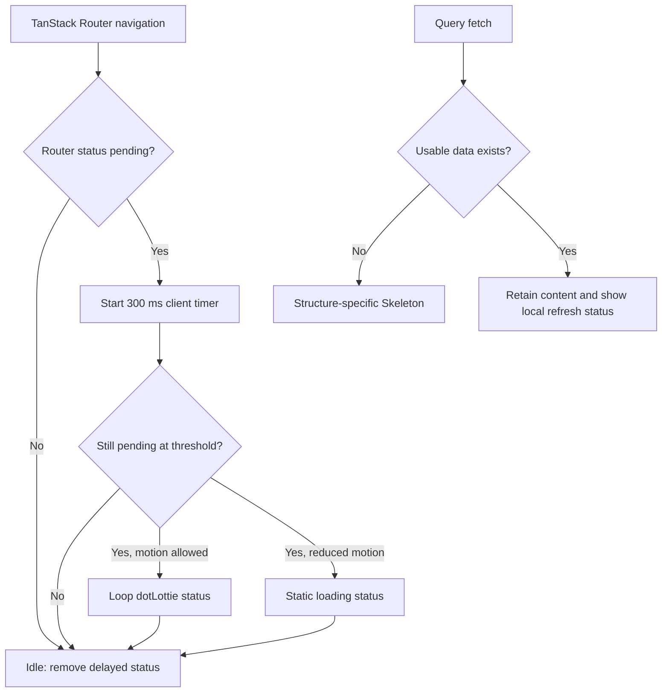

# 1. Context and scope

## Objective and source

This complete-mode Spec implements GitHub issue #36 so navigation and query-backed
surfaces provide stable, accessible feedback without replacing content that is already
usable. The delivery standardizes initial skeletons, distinguishes initial pending state
from background fetching, applies one main-content route fade, and shows the supplied
dotLottie status only for navigation that remains pending for 300 ms.

## Current behavior and product gap

The Web app currently has no router-level pending feedback or View Transition
configuration. Query-backed screens use a mixture of text, locally duplicated pulse
blocks, partial skeletons, and no refresh announcement. Several queries preserve prior
data, but most owning widgets do not expose a distinct fetching-with-data state. The
result is inconsistent structure preservation, ambiguous background updates, and no
common navigation signal while asynchronous route middleware resolves.

## Scope and product alignment

| Area | In scope | Out of scope |
| --- | --- | --- |
| Shared Web UI | One Skeleton primitive, reusable refresh status, route-transition status, and main-content fade | New design system, non-Web consumers, or a generic loading state store |
| Identity | Initial and refresh feedback for Users, User Details, and Shop Settings | Static/auth forms, Account actions, onboarding actions, or mutation-only pending controls |
| MRP | Products, Accompaniment Types, all product detail slots, stock history, and query-backed dialogs | Product behavior, filtering semantics, destructive-action semantics, or REST changes |
| PDV | Sales Channels, Discounts, combo details/product chooser, New Sale catalog/channel bootstrap, Orders, and Order Details | Cart/mutation pending states or treating same-route filters as route transitions |
| Communication | Notification dropdown, notification history, initial history and incremental loading | Realtime toast behavior, notification retention, or server delivery |
| Billing | Route fade only | Subscription loading UI while the route remains a placeholder |
| Validation | Widget, route, responsive, reduced-motion, keyboard, console, and network evidence | Backend, persistence, provider, or real-service assertions |

| Source requirement | Delivery | Notes |
| --- | --- | --- |
| GitHub issue #36 outcome and scope | full | All currently implemented query-backed surfaces are covered; explicit issue exclusions remain excluded. |
| Identity PRQ-13 | partial | Delivers coherent loading, responsive, and accessible feedback without changing Identity behavior or its concluded checkbox. |
| MRP PRQ-10 | partial | Delivers loading and recovery presentation for implemented MRP surfaces; destructive workflows remain unchanged. |
| PDV PRQ-02 | partial | Standardizes New Sale catalog loading while preserving catalog eligibility and interaction rules. |
| PDV PRQ-10 | partial | Standardizes Order History and detail loading without changing search, pagination, or immutable history. |
| Communication PRQ-06 | partial | Standardizes implemented notification history/dropdown loading without changing privacy or realtime behavior. |
| Billing PRQ-10 and PRQ-17 | deferred | The current Subscription route is a placeholder, so only the global route transition applies. |

## Product decisions and assumptions

- Every existing query-backed initial-load surface is included, including persistent
  nested sections and dialogs that fetch only after opening.
- Initial pending means that the current query has no usable data. Only that state may
  replace the affected content region with a structure-specific skeleton.
- Fetching with usable data is a refresh: the current content remains rendered and the
  owning region shows localized, non-blocking `Atualizando…` feedback.
- Native View Transitions are progressive enhancement. Unsupported browsers and users
  requesting reduced motion receive an instantaneous route swap.
- Route animation is opacity-only for 180 ms with `ease-out`; it never translates or
  scales the page.
- The supplied `apps/web/public/assets/lotties/ice-cream-loading.lottie` is the canonical
  navigation-status artwork. It autoplays and loops while shown.
- No design screenshots or Pencil frames were supplied. This Contract is governed by the
  existing design system and uses fresh implementation screenshots as evaluation evidence;
  no feature-local design manifest is required.

# 2. Implementation Contract

## Functional requirements

| ID | PRQ/source coverage | Required behavior |
| --- | --- | --- |
| `FR-01` | Issue #36; Identity PRQ-13; MRP PRQ-10; PDV PRQ-02; PDV PRQ-10; Communication PRQ-06 | Each included query-backed surface renders a structure-appropriate skeleton only when its initial request is pending and no usable data exists. |
| `FR-02` | Issue #36; all mapped PRQs | Every skeleton composition uses the shared primitive, design tokens, Portuguese accessible labeling, appropriate status/busy semantics, and motion-safe behavior. |
| `FR-03` | Issue #36; Identity PRQ-13; MRP PRQ-10; Billing PRQ-10 and PRQ-17 | When an included query fetches while usable data exists, the owning region preserves that content and exposes localized `Atualizando…` feedback without blocking interaction or changing focus. |
| `FR-04` | Issue #36; Identity PRQ-13; Billing PRQ-17 | Every public, authentication, and authenticated route navigation participates in one opacity-only main-content fade where the native View Transitions API is available. |
| `FR-05` | Issue #36 | Navigation still pending after 300 ms shows the supplied 96×96 dotLottie animation in a centered, pointer-transparent, non-modal status layer labeled `Carregando página…`; it has no entrance fade and is removed as soon as the router becomes idle. |
| `FR-06` | Issue #36; Identity PRQ-13; Billing PRQ-17 | Reduced-motion users receive no route fade and no animated artwork; delayed navigation instead shows the same static status copy. Unsupported View Transition environments swap routes instantly. |
| `FR-07` | Issue #36; all mapped PRQs | Loading and transition feedback preserves keyboard operation, visible focus, final route/error/empty behavior, and layouts from 320 px without horizontal scrolling or obscured controls. |

## Acceptance criteria

| ID | FR coverage | Requirement | Given | When | Then | Expected evidence |
| --- | --- | --- | --- | --- | --- | --- |
| `AC-01` | `FR-01`, `FR-02` | Initial loading is structural and shared | An included surface has no cached or resolved data | Its request remains pending | A surface-specific skeleton built from the shared primitive occupies the expected structure, is announced once through its owning status region, and uses no duplicated pulse implementation | Owning widget suites and `MV-01` |
| `AC-02` | `FR-01`, `FR-03` | Refresh preserves usable content | An included surface is displaying success, empty, or retained paginated data | The same owning query fetches again | Existing content remains visible and operable while localized `Atualizando…` feedback is exposed; the initial skeleton does not return | Owning widget/hook suites and `MV-02` |
| `AC-03` | `FR-01`, `FR-07` | Terminal states remain coherent | An initial or refresh request fails or resolves empty | The owning query settles | The existing error/retry or empty-state Contract remains visible and usable without stale busy semantics | Owning widget and route suites |
| `AC-04` | `FR-04`, `FR-06` | Route fade applies consistently | A supported browser has rendered any public, auth, or authenticated route | Navigation commits another route | Only the named main-content snapshot fades with 180 ms `ease-out`; layout chrome is not translated or scaled | Shared route suite and `MV-03` |
| `AC-05` | `FR-05` | Fast navigation avoids status flicker | A route navigation begins | The router becomes idle before 300 ms | No dotLottie or delayed status is rendered | Route-status hook suite and shared route suite |
| `AC-06` | `FR-05`, `FR-07` | Slow navigation gets non-blocking feedback | A route navigation remains pending for at least 300 ms | The delay elapses and later the destination becomes ready | The 96×96 looping animation and `Carregando página…` status appear without an entrance fade, do not intercept input or focus, and disappear immediately at idle | Route-status widget/hook suites and `MV-03` |
| `AC-07` | `FR-06`, `FR-07` | Reduced motion is static | Reduced motion is enabled | Navigation remains pending beyond 300 ms and then commits | No route animation or dotLottie playback occurs; static `Carregando página…` feedback is announced and removed at idle | Shared route suite and `MV-04` |
| `AC-08` | `FR-02`, `FR-07` | Responsive and accessible behavior is stable | An included surface is rendered at 1440×900 or 320×800 | Initial load, refresh, keyboard traversal, and route navigation are exercised | No horizontal page overflow, hidden primary control, focus theft, inaccessible status, new console error, or unclassified failed request occurs | `MV-01` through `MV-04` |

## Cross-cutting restrictions

| Concern | Contract |
| --- | --- |
| Content retention | `isPending`/no-data controls initial skeletons; `isFetching`/usable-data controls refresh feedback. A refetch must never blank resolved content. |
| Status ownership | Each query-backed page, nested section, or dialog owns its refresh label. There is no application-global query refresh pill. |
| Pagination | Incremental `See more` or page-fetch feedback remains local and distinct from initial loading and background refresh. |
| Route scope | Same-route search, filter, sort, and pagination updates are query refreshes, not route transitions. |
| Focus and input | Status layers use `pointer-events: none`, are not dialogs, contain no focusable control, and never move focus. Existing recovery controls remain interactive. |
| Motion | Skeleton pulse uses `motion-reduce:animate-none`; route fade is disabled by media query; the dotLottie component is not mounted for reduced-motion users. |
| SSR/hydration | Server and first client render do not infer pending timers or media-query state differently; browser-only router/media observation begins after hydration. |
| Assets and secrets | The public dotLottie contains no runtime configuration or secret. No browser environment value is added. |

# 3. Technical Contract

## Current technical state

| Evidence | Current responsibility | Gap |
| --- | --- | --- |
| `apps/web/src/router.tsx` `getRouter` | Creates the TanStack Router with preload and scroll restoration | No path-change-gated `defaultViewTransition` configuration and no shared pending observer |
| `apps/web/src/ui/shared/widgets/layouts/root-layout/index.tsx` `RootLayout` | Composes Query, Auth, REST, document shell, toaster, and route children | Does not compose navigation status feedback |
| `apps/web/src/ui/shared/styles/global.css` | Owns tokens, global focus, and reduced-motion overrides | No named main-content View Transition or route-fade pseudo-element rules |
| Existing `*Loading`, page, slot, and dialog widgets | Render local initial states | Mix text and duplicated `animate-pulse` blocks; several omit structure or motion reduction |
| Existing semantic query hooks and owning widget hooks | Expose query data, pending state, and retry operations | Most do not expose fetching-with-usable-data as a named refresh state |
| `apps/web/public/assets/lotties/ice-cream-loading.lottie` | User-supplied dotLottie archive with one 1200×1200, four-second animation | Valid untracked asset; no React player dependency or UI consumer |

## Solution and runtime flow

`getRouter` enables a path-change-gated `defaultViewTransition` configuration, returning the
`scoops-route` transition type only when the route path changes. Global CSS assigns the single
`main-content` View Transition name to the active `main` element and defines only the old/new
opacity animations. The existing reduced-motion media query disables those animations; when
the browser does not support View Transitions, TanStack Router performs its normal immediate
commit.

`RootLayout` mounts `RouteTransitionStatus` inside the existing client-only boundary. Its
colocated hook selects only the Router foreground `status`, starts one 300 ms timer on a
transition to `pending`, cancels the timer on cleanup or `idle`, and observes reduced motion.
After the threshold, the widget renders a non-modal fixed status. Motion-capable clients mount
`DotLottieReact` with the public asset URL, `autoplay`, and `loop`; reduced-motion clients render
static copy only. The router becoming idle synchronously removes the visible status state.

Each included semantic query hook exposes an owning-domain `isRefreshing*` value defined as
fetching while usable data exists, excluding independent incremental-page fetches where those
already have their own state. The consuming page/slot/dialog hook passes that state to its
widget. Initial `isPending` without data selects a structure-specific Skeleton composition;
refresh state leaves success/empty content mounted and composes `QueryRefreshStatus` next to
the affected region. Existing errors, retries, empty states, query keys, cache retention,
requests, and mutations do not change.



## Widget composition

| Widget | Kind | Parent/entry | Direct children | Public contract | Behavior owner |
| --- | --- | --- | --- | --- | --- |
| `RootLayout` | Layout | `routes/__root.tsx` shell | `RouteTransitionStatus` plus existing providers/content | `RootLayoutProps` | Existing composition only |
| `RouteTransitionStatus` | Component | `RootLayout` client-only boundary | `DotLottieReact` | No props; visible delayed navigation status | `useRouteTransitionStatus` |
| `QueryRefreshStatus` | Component | Included query-backed widgets | — | `QueryRefreshStatusProps` with localized label and refreshing state | Pure renderer |
| `ShopSettingsPage` | Page | Shop Settings route | `QueryRefreshStatus` | Existing page contract | `useShopSettingsPage` |
| `UserDetailsPage` | Page | User Details route | `QueryRefreshStatus` plus existing dialogs | Existing page contract | `useUserDetailsPage` |
| `UsersPage` | Page | Users route | `QueryRefreshStatus`, `UserCard`, `UserActionsMenu`, `UserInviteDialog`, existing action dialog | Existing page contract | `useUsersPage` |
| `ProductsPage` | Page | Products route | `ProductsKpiCards`, `ProductsListCard`, `ProductFiltersDialog` | `ProductsPageProps` | `useProductsPage` |
| `ProductsKpiCards` | Component | `ProductsPage` | — | Existing KPI props plus refresh-safe values | Existing colocated hook |
| `ProductsListCard` | Component | `ProductsPage` | `QueryRefreshStatus`, `ProductTable`, `Pagination` | Existing list-card props plus refresh state | `useProductsListCard` |
| `AccompanimentTypesPage` | Page | Accompaniment Types route | `AccompanimentTypesLoading`, `QueryRefreshStatus`, existing terminal/content/dialog widgets | Existing page contract | `useAccompanimentTypesPage` |
| `AccompanimentTypesLoading` | Component | `AccompanimentTypesPage` | — | No props; initial structure | Pure renderer |
| `ProductStockSlot` | Component | Product Stock route | `ProductDetailsPage`, `ProductStockLoading`, `QueryRefreshStatus`, `StockTransactionHistoryCard`, existing stock widgets | Existing slot props | `useProductStockSlot` |
| `ProductStockLoading` | Component | `ProductStockSlot` | — | No props; initial structure | Pure renderer |
| `StockTransactionHistoryCard` | Component | `ProductStockSlot` | `QueryRefreshStatus` plus existing history rows/pagination | Existing card contract | `useStockTransactionHistoryCard` |
| `ProductRecipeSlot` | Component | Product Recipe route | `ProductDetailsPage`, `RecipeLoading`, `QueryRefreshStatus`, `RecipeIngredientDialog`, `ProduceProductDialog`, existing terminal/content widgets | Existing slot props | `useProductRecipeSlot` |
| `RecipeLoading` | Component | `ProductRecipeSlot` | — | No props; initial structure | Pure renderer |
| `RecipeIngredientDialog` | Component | `ProductRecipeSlot` | `QueryRefreshStatus` plus existing form controls | Existing dialog props | `useRecipeIngredientDialog` |
| `ProduceProductDialog` | Component | `ProductRecipeSlot` | `QueryRefreshStatus` plus existing preview/form controls | Existing dialog props | `useProduceProductDialog` |
| `ProductAccompanimentsSlot` | Component | Product Accompaniments route | `ProductDetailsPage`, `ProductAccompanimentsLoading`, `QueryRefreshStatus`, `ProductAccompanimentDialog`, existing terminal/content widgets | Existing slot props | `useProductAccompanimentsSlot` |
| `ProductAccompanimentsLoading` | Component | `ProductAccompanimentsSlot` | — | No props; initial structure | Pure renderer |
| `ProductAccompanimentDialog` | Component | `ProductAccompanimentsSlot` | `QueryRefreshStatus` plus existing form controls | Existing dialog props | `useProductAccompanimentDialog` |
| `ProductPricingSlot` | Component | Product Prices route | `ProductDetailsPage`, `ProductPricingLoading`, `QueryRefreshStatus`, existing pricing widgets | Existing slot props | `useProductPricingSlot` |
| `ProductPricingLoading` | Component | `ProductPricingSlot` | — | No props; initial structure | Pure renderer |
| `ProductSettingsSlot` | Component | Product Settings route | `ProductDetailsPage`, `ProductSettingsLoading`, `QueryRefreshStatus`, `ProductCategoriesCard`, `RemoveProductDialog`, `UnitChangeDialog`, existing settings widgets | Existing slot props | `useProductSettingsSlot` |
| `ProductSettingsLoading` | Component | `ProductSettingsSlot` | — | No props; initial structure | Pure renderer |
| `ProductCategoriesCard` | Component | `ProductSettingsSlot` | `CategoryDependencyDialog`, `QueryRefreshStatus` | Existing card props | `useProductCategoriesCard` |
| `CategoryDependencyDialog` | Component | `ProductCategoriesCard` | `QueryRefreshStatus` plus existing dependency actions | Existing dialog props extended with refresh state | `useCategoryDependencyDialog`; `useProductCategoriesCard` supplies query-derived state |
| `RemoveProductDialog` | Component | `ProductSettingsSlot` | `QueryRefreshStatus` plus existing impact/confirmation content | Existing dialog props | `useRemoveProductDialog` |
| `UnitChangeDialog` | Component | `ProductSettingsSlot` | `QueryRefreshStatus` plus existing preview/confirmation content | Existing dialog props | `useUnitChangeDialog` |
| `SalesChannelsPage` | Page | Sales Channels route | `SalesChannelsLoading`, `QueryRefreshStatus`, existing terminal/content/dialog widgets | Existing page contract | `useSalesChannelsPage` |
| `SalesChannelsLoading` | Component | `SalesChannelsPage` | — | No props; initial structure | Pure renderer |
| `DiscountsPage` | Page | Discounts route | `DiscountsLoading`, `QueryRefreshStatus`, existing terminal/content/dialog widgets | Existing page contract | `useDiscountsPage` |
| `DiscountsLoading` | Component | `DiscountsPage` | — | No props; initial structure | Pure renderer |
| `ComboDiscountPage` | Page | New/Edit Discount routes | `QueryRefreshStatus`, `ComboDiscountForm`, `ComboProductDialog`, existing action dialogs | Existing page props | `useComboDiscountPage` |
| `ComboProductDialog` | Component | `ComboDiscountPage` | `QueryRefreshStatus` plus existing catalog controls | Existing dialog props | `useComboProductDialog` |
| `NewSalePage` | Page | New Sale route | `QueryRefreshStatus`, `NewSaleCatalog`, `NewSaleCart`, and existing sale dialogs/states | Existing page contract | `useNewSalePage` |
| `NewSaleCatalog` | Component | `NewSalePage` | `QueryRefreshStatus` plus existing product cards | Existing catalog props | `useNewSaleCatalog` |
| `OrdersPage` | Page | Orders route | `OrdersLoading`, `QueryRefreshStatus`, existing filters/list/terminal widgets | Existing page props | `useOrdersPage` |
| `OrdersLoading` | Component | `OrdersPage` | — | No props; initial structure | Pure renderer |
| `OrderDetailsPage` | Page | Order Details route | `OrderDetailsLoading`, `QueryRefreshStatus`, existing summary/item/cancel widgets | Existing page props | `useOrderDetailsPage` |
| `OrderDetailsLoading` | Component | `OrderDetailsPage` | — | No props; initial structure | Pure renderer |
| `NotificationDropdown` | Component | `AppLayout` header | `NotificationListState`, `NotificationList`, `QueryRefreshStatus` | Existing dropdown contract | `useNotificationDropdown` |
| `NotificationListState` | Component | `NotificationDropdown` and `NotificationsPage` | — | Existing loading/error/empty/incremental props | Pure renderer |
| `NotificationsPage` | Page | Notifications route | `NotificationListState`, `NotificationList`, `QueryRefreshStatus` | Existing page contract | `useNotificationsPage` |

### Expected widget file trees

Existing widget directories retain their ownership boundaries. The only new or split widget
boundaries are shown below; all other rows above modify rendering/state contracts in place.

```text
apps/web/src/ui/shared/widgets/components/
├── query-refresh-status/
│   ├── index.tsx
│   └── tests/
│       └── query-refresh-status.test.tsx
└── route-transition-status/
    ├── index.tsx
    ├── use-route-transition-status.ts
    └── tests/
        ├── route-transition-status.test.tsx
        └── use-route-transition-status.test.ts
```

```text
apps/web/src/ui/mrp/widgets/slots/product-stock-slot/
├── index.tsx
├── product-stock-controls/
│   └── index.tsx
├── product-stock-dialogs/
│   └── index.tsx
├── product-stock-error/
│   └── index.tsx
├── product-stock-loading/
│   └── index.tsx
└── product-stock-status/
    └── index.tsx
```

```text
apps/web/src/ui/shared/widgets/layouts/root-layout/
└── index.tsx
```

## apps/web — UI

### Shared UI and composition

| Path | Change | Declaration/surface | Widget/role | State/actions contract | Async/failure contract | Design/responsive/accessibility | Dependencies/tests |
| --- | --- | --- | --- | --- | --- | --- | --- |
| `apps/web/public/assets/lotties/ice-cream-loading.lottie` | Create | Navigation loading artwork | Public static asset | Immutable dotLottie source | Browser may cache it; player failure must not suppress accessible copy | Rendered at 96×96 only; artwork is decorative to assistive technology | `RouteTransitionStatus` |
| `apps/web/src/ui/shadcn/skeleton.tsx` | Create | `Skeleton`, `SkeletonProps` | Shared shadcn primitive | Pure class/props composition | No async ownership | Token-based muted fill, shared pulse, reduced-motion stop, `aria-hidden` delegated to consumer | All loading compositions; indirect through owners |
| `apps/web/src/ui/shared/widgets/components/query-refresh-status/index.tsx` | Create | `QueryRefreshStatus`, `QueryRefreshStatusProps` | Component | Renders localized label only while refreshing | Does not own or aggregate queries | Polite status, no focus/input, no layout-obscuring fixed position | Consuming widget suites |
| `apps/web/src/ui/shared/widgets/components/query-refresh-status/tests/query-refresh-status.test.tsx` | Create | `QueryRefreshStatus` suite | Component test | Proves hidden and refreshing render contracts for localized labels | No async ownership | Polite status and no focusable content | Allowed widget test path |
| `apps/web/src/ui/shared/widgets/components/route-transition-status/index.tsx` | Create | `RouteTransitionStatus` | Component | Destructures hook state and renders static or animated delayed status | Keeps accessible copy if animation asset/player fails to paint | Fixed centered non-modal layer, 96×96 artwork, no entrance fade, pointer transparent | `useRouteTransitionStatus`; component test |
| `apps/web/src/ui/shared/widgets/components/route-transition-status/use-route-transition-status.ts` | Create | `useRouteTransitionStatus` | Colocated behavior hook | Owns router selection, 300 ms timer, reduced-motion observation, and cleanup | Cancels stale timers and hides immediately on idle/unmount | Hydration-safe media observation; returns values before handlers | Hook test |
| `apps/web/src/ui/shared/widgets/components/route-transition-status/tests/route-transition-status.test.tsx` | Create | `RouteTransitionStatus` suite | Component test | Mocks owning hook and proves hidden, animated, and static render contracts | Proves accessible copy survives artwork mode | Accessible role/name, 96×96 visual boundary, no interactive element | Allowed widget test path |
| `apps/web/src/ui/shared/widgets/components/route-transition-status/tests/use-route-transition-status.test.ts` | Create | `useRouteTransitionStatus` suite | Hook test | Proves threshold, fast idle, prolonged pending, repeated navigation, reduced motion, and cleanup | Fake timers; no Router internals beyond application-observed status | No post-unmount update | Allowed widget hook test path |
| `apps/web/src/ui/shared/widgets/layouts/root-layout/index.tsx` | Modify | `RootLayout` | Layout | Mounts one `RouteTransitionStatus` in the existing client-only application scope | Does not acquire query or route business behavior | Document semantics and provider order remain stable | Route-status widget and route suite |
| `apps/web/src/ui/shared/styles/global.css` | Modify | `main-content` View Transition rules | Shared stylesheet | Names the active `main` snapshot and defines old/new 180 ms opacity animations | Unsupported API requires no fallback script | `ease-out`, no transform, disabled under reduced motion | `router.tsx`; route suite/manual screenshots |
| `apps/web/tests/shared/route-transition-feedback.test.tsx` | Create | Global route-transition Playwright suite | Browser route boundary | Exercises fast and delayed navigation across public, auth, and authenticated surfaces | Uses deterministic mocked middleware/transport delay; no real backend | Final URL, status semantics, focus, reduced motion, 1440×900 and 320×800 | Allowed browser test path |

### Identity surfaces

| Path | Change | Declaration/surface | Widget/role | State/actions contract | Async/failure contract | Design/responsive/accessibility | Dependencies/tests |
| --- | --- | --- | --- | --- | --- | --- | --- |
| `apps/web/src/ui/identity/hooks/use-establishment-settings-query.ts` | Modify | `useEstablishmentSettingsQuery` | Query declaration | Adds semantic initial/refresh state without changing settings/retry contract | Refresh requires existing settings | No rendering | Shop Settings page hook; indirect test boundary |
| `apps/web/src/ui/identity/hooks/use-user-details-query.ts` | Modify | `useUserDetailsQuery` | Query declaration | Adds semantic initial/refresh state while preserving detail result | Refresh requires existing user details | No rendering | User Details page hook; indirect test boundary |
| `apps/web/src/ui/identity/hooks/use-users-query.ts` | Modify | `useUsersQuery` | Query declaration | Adds semantic initial/refresh state while preserving page/summary | Retained page stays visible during background fetch | No rendering | Users page hook; indirect test boundary |
| `apps/web/src/ui/identity/widgets/pages/shop-settings-page/use-shop-settings-page.ts` | Modify | `useShopSettingsPage` | Page hook | Returns initial loading and refreshing separately | Existing retry/edit behavior unchanged | Status label is page-local | Hook suite |
| `apps/web/src/ui/identity/widgets/pages/shop-settings-page/index.tsx` | Modify | `ShopSettingsPage` | Page | Replaces text-only initial state with settings-card skeleton; preserves settings on refresh | Existing error and retry remain terminal owners | Uses Skeleton and `QueryRefreshStatus`; 320 px stable | Page suite |
| `apps/web/src/ui/identity/widgets/pages/shop-settings-page/tests/shop-settings-page.test.tsx` | Create | `ShopSettingsPage` suite | Component test | Covers initial skeleton, retained-content refresh, success, and error/recovery | Mocks the owning hook and renders the real page | Status semantics asserted | Allowed widget test path |
| `apps/web/src/ui/identity/widgets/pages/shop-settings-page/tests/use-shop-settings-page.test.ts` | Modify | `useShopSettingsPage` suite | Hook test | Covers semantic query-state mapping | Existing actions unchanged | — | — |
| `apps/web/src/ui/identity/widgets/pages/user-details-page/use-user-details-page.ts` | Modify | `useUserDetailsPage` | Page hook | Returns initial loading and refreshing separately | Existing action/error/refetch flow unchanged | Status label is page-local | Hook suite |
| `apps/web/src/ui/identity/widgets/pages/user-details-page/index.tsx` | Modify | `UserDetailsPage` | Page | Replaces text loading with detail-header/card skeleton; retains user details on refresh | Existing not-found/error/retry remains authoritative | Shared Skeleton and local refresh status | Page suite |
| `apps/web/src/ui/identity/widgets/pages/user-details-page/user-details-intro/index.tsx` | Create | `UserDetailsIntro`, `UserDetailsIntroProps` | Internal child component | Renders the user-detail heading and refresh status | No query ownership | Preserves page heading and non-blocking status semantics | Through page suite |
| `apps/web/src/ui/identity/widgets/pages/user-details-page/invitation-correction-dialog/index.tsx` | Create | `InvitationCorrectionDialog`, `InvitationCorrectionDialogProps` | Internal child component | Owns the invitation-correction dialog form composition | Submission remains delegated to `UserDetailsPage` | Preserves dialog hierarchy, validation feedback and keyboard actions | Through page suite |
| `apps/web/src/ui/identity/widgets/pages/user-details-page/invitation-correction-dialog/use-invitation-correction-dialog.ts` | Create | `useInvitationCorrectionDialog` | Child behavior hook | Owns form validation, reset-on-input-change and normalized submit mapping | Does not own the invitation mutation | Existing validation and pending behavior remain | Through page suite |
| `apps/web/src/ui/identity/widgets/pages/user-details-page/tests/user-details-page.test.tsx` | Create | `UserDetailsPage` suite | Component test | Covers structural initial loading, retained refresh, terminal states, and action rendering | Mocks the owning hook and renders the real page | Status semantics asserted | Allowed widget test path |
| `apps/web/src/ui/identity/widgets/pages/user-details-page/tests/use-user-details-page.test.ts` | Modify | `useUserDetailsPage` suite | Hook test | Covers semantic initial/refresh mapping | Existing authorization/action cases preserved | — | — |
| `apps/web/src/ui/identity/widgets/pages/users-page/use-users-page.ts` | Modify | `useUsersPage` | Page hook | Returns initial loading and refreshing separately | Filter/page fetching retains prior usable list | No route-transition semantics | Hook suite |
| `apps/web/src/ui/identity/widgets/pages/users-page/index.tsx` | Modify | `UsersPage` | Page | Replaces text loading with responsive table/card skeleton; retains list on refresh | Existing empty/error/retry and action availability remain | Desktop table and narrow cards avoid overflow | Page suite |
| `apps/web/src/ui/identity/widgets/pages/users-page/users-page-intro/index.tsx` | Create | `UsersPageIntro`, `UsersPageIntroProps` | Internal child component | Renders the users heading, total and refresh status | No query ownership | Preserves responsive heading and non-blocking status semantics | Through page suite |
| `apps/web/src/ui/identity/widgets/pages/users-page/tests/users-page.test.tsx` | Modify | `UsersPage` suite | Component test | Adds desktop/narrow initial skeleton and retained refresh cases | Existing error/empty/actions remain | Accessible status asserted | — |
| `apps/web/src/ui/identity/widgets/pages/users-page/tests/use-users-page.test.ts` | Modify | `useUsersPage` suite | Hook test | Covers semantic initial/refresh mapping across retained pages | Existing filter and action behavior preserved | — | — |

### MRP surfaces

| Path | Change | Declaration/surface | Widget/role | State/actions contract | Async/failure contract | Design/responsive/accessibility | Dependencies/tests |
| --- | --- | --- | --- | --- | --- | --- | --- |
| `apps/web/src/ui/mrp/hooks/use-products-query.ts` | Modify | `useProductsQuery` | Query declaration | Exposes domain-named initial/refresh state | Retained products distinguish refresh | No rendering | Products page; indirect |
| `apps/web/src/ui/mrp/hooks/use-accompaniment-types-query.ts` | Modify | `useAccompanimentTypesQuery` | Query declaration | Exposes initial/refresh state | Existing page/retry behavior unchanged | No rendering | Accompaniment Types; indirect |
| `apps/web/src/ui/mrp/hooks/use-product-stock-query.ts` | Modify | `useProductStockQuery` | Query declaration | Exposes initial/refresh state | Existing product enablement unchanged | No rendering | Stock/Recipe/Accompaniments/dialog owners; indirect |
| `apps/web/src/ui/mrp/hooks/use-stock-transactions-query.ts` | Modify | `useStockTransactionsQuery` | Query declaration | Distinguishes first history load, retained-page fetch, and refresh | Existing placeholder pagination remains content-retaining | No rendering | Stock history; indirect |
| `apps/web/src/ui/mrp/hooks/use-product-recipe-query.ts` | Modify | `useProductRecipeQuery` | Query declaration | Exposes initial/refresh state | Disabled unsupported recipe remains non-loading | No rendering | Recipe slot; indirect |
| `apps/web/src/ui/mrp/hooks/use-product-accompaniments-query.ts` | Modify | `useProductAccompanimentsQuery` | Query declaration | Exposes initial/refresh state | Existing enablement/retry unchanged | No rendering | Accompaniments slot; indirect |
| `apps/web/src/ui/mrp/hooks/use-product-pricing-query.ts` | Modify | `useProductPricingQuery` | Query declaration | Adds semantic refresh state beside existing pricing names | Resolved pricing remains visible during fetch | No rendering | Pricing slot; indirect |
| `apps/web/src/ui/mrp/hooks/use-product-settings-query.ts` | Modify | `useProductSettingsQuery` | Query declaration | Adds semantic initial/refresh state | Resolved settings remain visible during fetch | No rendering | Settings slot; indirect |
| `apps/web/src/ui/mrp/hooks/use-accompaniment-candidates-query.ts` | Modify | `useAccompanimentCandidatesQuery` | Query declaration | Exposes initial/refresh candidates state | Applies only while chooser enabled | No rendering | Product Accompaniment dialog; indirect |
| `apps/web/src/ui/mrp/hooks/use-preview-product-unit-change-query.ts` | Modify | `usePreviewProductUnitChangeQuery` | Query declaration | Exposes initial/refresh preview state | Existing open/enabled semantics unchanged | No rendering | Unit Change dialog; indirect |
| `apps/web/src/ui/mrp/hooks/use-product-category-removal-impact-query.ts` | Modify | `useProductCategoryRemovalImpactQuery` | Query declaration | Exposes initial/refresh impact state | Existing dependency decision unchanged | No rendering | Product Categories card/dialog; indirect |
| `apps/web/src/ui/mrp/hooks/use-product-removal-impact-query.ts` | Modify | `useProductRemovalImpactQuery` | Query declaration | Exposes initial/refresh impact state | Existing open/enabled semantics unchanged | No rendering | Remove Product dialog; indirect |
| `apps/web/src/ui/mrp/hooks/use-production-preview-query.ts` | Modify | `useProductionPreviewQuery` | Query declaration | Exposes initial/refresh preview state | Existing debounce/enablement unchanged | No rendering | Produce Product dialog; indirect |
| `apps/web/src/ui/mrp/widgets/pages/products-page/use-products-page.ts` | Modify | `useProductsPage` | Page hook | Maps initial/refresh state separately | Existing filter/refetch behavior unchanged | Page-local update label | Hook suite |
| `apps/web/src/ui/mrp/widgets/pages/products-page/index.tsx` | Modify | `ProductsPage` | Page | Passes initial/refresh states to KPI/list regions | Existing error/empty/filter dialog remains | Refresh does not blank KPI/list | Page suite |
| `apps/web/src/ui/mrp/widgets/pages/products-page/products-kpi-cards/index.tsx` | Modify | `ProductsKpiCards` | Component | Skeleton values on initial load; retained metrics on refresh | No request ownership | Shared Skeleton in metric shapes | Existing component suite |
| `apps/web/src/ui/mrp/widgets/pages/products-page/products-kpi-cards/tests/products-kpi-cards.test.tsx` | Modify | `ProductsKpiCards` suite | Component test | Proves metric-shaped initial skeletons and retained values during refresh | No query mocking beyond public props | Accessible decorative skeleton treatment | Allowed nested-widget test path |
| `apps/web/src/ui/mrp/widgets/pages/products-page/products-list-card/index.tsx` | Modify | `ProductsListCard` | Component | Structural rows on initial load and local refresh status over retained table | Existing error/empty/pagination retained | Shared Skeleton; table width stable | Existing component suite |
| `apps/web/src/ui/mrp/widgets/pages/products-page/products-list-card/products-list-loading/index.tsx` | Create | `ProductsListLoading` | Internal child component | Renders structure-specific initial product rows | No async ownership | Shared Skeleton, busy semantics and reduced-motion support | Through card suite |
| `apps/web/src/ui/mrp/widgets/pages/products-page/products-list-card/tests/products-list-card.test.tsx` | Modify | `ProductsListCard` suite | Component test | Proves initial row skeletons and retained table/controls during refresh | Existing error, empty, and pagination states remain covered | Local status semantics and stable table width | Allowed nested-widget test path |
| `apps/web/src/ui/mrp/widgets/pages/products-page/tests/products-page.test.tsx` | Modify | `ProductsPage` suite | Component test | Adds composed initial/refresh cases | Existing success/empty/error cases remain | Status semantics | — |
| `apps/web/src/ui/mrp/widgets/pages/products-page/tests/use-products-page.test.ts` | Modify | `useProductsPage` suite | Hook test | Covers semantic state mapping | Existing search/refetch paths remain | — | — |
| `apps/web/src/ui/mrp/widgets/pages/accompaniment-types-page/use-accompaniment-types-page.ts` | Modify | `useAccompanimentTypesPage` | Page hook | Separates initial loading and refresh | Existing dialog/pagination/retry unchanged | Page-local label | Hook suite |
| `apps/web/src/ui/mrp/widgets/pages/accompaniment-types-page/index.tsx` | Modify | `AccompanimentTypesPage` | Page | Retains card/table during refresh | Existing loading/error/empty terminals remain | Uses shared refresh status | Page suite |
| `apps/web/src/ui/mrp/widgets/pages/accompaniment-types-page/accompaniment-types-dialogs/index.tsx` | Create | `AccompanimentTypesDialogs`, `AccompanimentTypesDialogsProps` | Internal child component | Composes the page's dialogs and selected action state | No query ownership | Preserves dialog visibility and callback wiring | Through page suite |
| `apps/web/src/ui/mrp/widgets/pages/accompaniment-types-page/accompaniment-types-loading/index.tsx` | Modify | `AccompanimentTypesLoading` | Component | Rebuilds page structure with Skeleton | No failure ownership | Portuguese status, busy semantics, reduced motion | Through page plus existing suite |
| `apps/web/src/ui/mrp/widgets/pages/accompaniment-types-page/tests/accompaniment-types-page.test.tsx` | Modify | `AccompanimentTypesPage` suite | Component test | Adds retained refresh case | Existing matrix remains | Status semantics | — |
| `apps/web/src/ui/mrp/widgets/pages/accompaniment-types-page/tests/use-accompaniment-types-page.test.ts` | Modify | `useAccompanimentTypesPage` suite | Hook test | Covers initial/refresh mapping | Existing behavior remains | — | — |
| `apps/web/src/ui/mrp/widgets/slots/product-stock-slot/use-product-stock-slot.ts` | Modify | `useProductStockSlot` | Widget hook | Separates initial and refresh stock states | Existing mutation/refetch behavior unchanged | Slot-local label | Hook suite |
| `apps/web/src/ui/mrp/widgets/slots/product-stock-slot/index.tsx` | Modify | `ProductStockSlot` | Component | Uses extracted loading widget and retains stock details during refresh | Existing error/recovery remains | Shared refresh status | Slot suite |
| `apps/web/src/ui/mrp/widgets/slots/product-stock-slot/product-stock-controls/index.tsx` | Create | `ProductStockControls`, `ProductStockControlsProps` | Internal child component | Owns single-control and brand-control rendering plus callbacks | No async ownership | Preserves responsive stock controls and accessible actions | Through slot suite |
| `apps/web/src/ui/mrp/widgets/slots/product-stock-slot/product-stock-dialogs/index.tsx` | Create | `ProductStockDialogs`, `ProductStockDialogsProps` | Internal child component | Composes history and stock action dialogs from the selected action | No query/action ownership | Preserves dialog visibility, focus and callback wiring | Through slot suite |
| `apps/web/src/ui/mrp/widgets/slots/product-stock-slot/product-stock-error/index.tsx` | Create | `ProductStockError`, `ProductStockErrorProps` | Internal child component | Renders recoverable stock-load failure | Retry callback remains owned by `ProductStockSlot` | Alert semantics and existing recovery copy | Through slot suite |
| `apps/web/src/ui/mrp/widgets/slots/product-stock-slot/product-stock-loading/index.tsx` | Create | `ProductStockLoading` | Component | Extracts current local loading renderer and composes Skeleton | No async ownership | Structure, status, busy, reduced motion | Through slot suite |
| `apps/web/src/ui/mrp/widgets/slots/product-stock-slot/product-stock-status/index.tsx` | Create | `ProductStockStatus`, `ProductStockStatusProps` | Internal child component | Composes refresh, initial loading and terminal error feedback | Does not own query state | Keeps status localized and non-blocking | Through slot suite |
| `apps/web/src/ui/mrp/widgets/slots/product-stock-slot/tests/product-stock-slot.test.tsx` | Modify | `ProductStockSlot` suite | Component test | Adds structure and retained refresh cases | Existing success/error/action coverage remains | Status semantics | — |
| `apps/web/src/ui/mrp/widgets/slots/product-stock-slot/tests/use-product-stock-slot.test.ts` | Modify | `useProductStockSlot` suite | Hook test | Covers initial/refresh mapping | Existing operations remain | — | — |
| `apps/web/src/ui/mrp/widgets/slots/product-stock-slot/stock-transaction-history-card/use-stock-transaction-history-card.ts` | Modify | `useStockTransactionHistoryCard` | Widget hook | Distinguishes initial, retained pagination fetch, and refresh | Existing filters/page/refetch remain | History-local labels | Hook suite |
| `apps/web/src/ui/mrp/widgets/slots/product-stock-slot/stock-transaction-history-card/index.tsx` | Modify | `StockTransactionHistoryCard` | Component | Uses Skeleton rows initially and preserves history on fetch | Existing empty/error/pagination remain | Status does not obscure controls | Component suite |
| `apps/web/src/ui/mrp/widgets/slots/product-stock-slot/stock-transaction-history-card/tests/stock-transaction-history-card.test.tsx` | Modify | `StockTransactionHistoryCard` suite | Component test | Adds initial/refresh distinction | Existing complete public contract remains | Status semantics | — |
| `apps/web/src/ui/mrp/widgets/slots/product-stock-slot/stock-transaction-history-card/tests/use-stock-transaction-history-card.test.ts` | Modify | `useStockTransactionHistoryCard` suite | Hook test | Covers initial/refresh/incremental states | Existing filters and retry remain | — | — |
| `apps/web/src/ui/mrp/widgets/slots/product-recipe-slot/use-product-recipe-slot.ts` | Modify | `useProductRecipeSlot` | Widget hook | Separates combined initial and refresh states | Unsupported/error behavior unchanged | Slot-local status | Hook suite |
| `apps/web/src/ui/mrp/widgets/slots/product-recipe-slot/index.tsx` | Modify | `ProductRecipeSlot` | Component | Retains recipe during refresh | Existing unsupported/error/empty behavior remains | Shared refresh status | Slot suite |
| `apps/web/src/ui/mrp/widgets/slots/product-recipe-slot/recipe-loading/index.tsx` | Modify | `RecipeLoading` | Component | Uses shared Skeleton | No async ownership | Adds reduced-motion-safe status contract | Through slot suite |
| `apps/web/src/ui/mrp/widgets/slots/product-recipe-slot/tests/product-recipe-slot.test.tsx` | Modify | `ProductRecipeSlot` suite | Component test | Adds initial structure and retained refresh | Existing outcomes remain | Status semantics | — |
| `apps/web/src/ui/mrp/widgets/slots/product-recipe-slot/tests/use-product-recipe-slot.test.ts` | Modify | `useProductRecipeSlot` suite | Hook test | Covers combined semantic state mapping | Existing recipe paths remain | — | — |
| `apps/web/src/ui/mrp/widgets/slots/product-accompaniments-slot/use-product-accompaniments-slot.ts` | Modify | `useProductAccompanimentsSlot` | Widget hook | Separates combined initial and refresh states | Existing error/retry behavior unchanged | Slot-local status | Hook suite |
| `apps/web/src/ui/mrp/widgets/slots/product-accompaniments-slot/index.tsx` | Modify | `ProductAccompanimentsSlot` | Component | Retains details/table during refresh | Existing terminal states remain | Shared refresh status | Slot suite |
| `apps/web/src/ui/mrp/widgets/slots/product-accompaniments-slot/product-accompaniments-loading/index.tsx` | Modify | `ProductAccompanimentsLoading` | Component | Uses shared Skeleton | No async ownership | Status/busy/reduced motion | Through slot suite |
| `apps/web/src/ui/mrp/widgets/slots/product-accompaniments-slot/tests/product-accompaniments-slot.test.tsx` | Modify | `ProductAccompanimentsSlot` suite | Component test | Adds initial/refresh cases | Existing states/actions remain | Status semantics | — |
| `apps/web/src/ui/mrp/widgets/slots/product-accompaniments-slot/tests/use-product-accompaniments-slot.test.ts` | Modify | `useProductAccompanimentsSlot` suite | Hook test | Covers combined query mapping | Existing behavior remains | — | — |
| `apps/web/src/ui/mrp/widgets/slots/product-pricing-slot/use-product-pricing-slot.ts` | Modify | `useProductPricingSlot` | Widget hook | Returns initial and refresh pricing state | Existing mutations/retry unchanged | Slot-local status | Hook suite |
| `apps/web/src/ui/mrp/widgets/slots/product-pricing-slot/index.tsx` | Modify | `ProductPricingSlot` | Component | Retains pricing sections during refresh | Existing error/empty behavior unchanged | Shared refresh status | Slot suite |
| `apps/web/src/ui/mrp/widgets/slots/product-pricing-slot/product-pricing-loading/index.tsx` | Modify | `ProductPricingLoading` | Component | Uses shared Skeleton | No async ownership | Status/busy/reduced motion | Through slot suite |
| `apps/web/src/ui/mrp/widgets/slots/product-pricing-slot/tests/product-pricing-slot.test.tsx` | Modify | `ProductPricingSlot` suite | Component test | Adds initial/refresh cases | Existing pricing states remain | Status semantics | — |
| `apps/web/src/ui/mrp/widgets/slots/product-pricing-slot/tests/use-product-pricing-slot.test.ts` | Modify | `useProductPricingSlot` suite | Hook test | Covers semantic mapping | Existing behavior remains | — | — |
| `apps/web/src/ui/mrp/widgets/slots/product-settings-slot/use-product-settings-slot.ts` | Modify | `useProductSettingsSlot` | Widget hook | Separates initial and refresh settings state | Existing retry/update semantics unchanged | Slot-local label | Hook suite |
| `apps/web/src/ui/mrp/widgets/slots/product-settings-slot/index.tsx` | Modify | `ProductSettingsSlot` | Component | Retains settings during refresh | Existing error/retry remains | Shared refresh status | Slot suite |
| `apps/web/src/ui/mrp/widgets/slots/product-settings-slot/product-settings-loading/index.tsx` | Modify | `ProductSettingsLoading` | Component | Uses shared Skeleton | No async ownership | Status/busy/reduced motion | Through slot suite |
| `apps/web/src/ui/mrp/widgets/slots/product-settings-slot/tests/product-settings-slot.test.tsx` | Modify | `ProductSettingsSlot` suite | Component test | Adds initial/refresh cases | Existing states remain | Status semantics | — |
| `apps/web/src/ui/mrp/widgets/slots/product-settings-slot/tests/use-product-settings-slot.test.ts` | Modify | `useProductSettingsSlot` suite | Hook test | Covers semantic mapping | Existing behavior remains | — | — |
| `apps/web/src/ui/mrp/widgets/slots/product-accompaniments-slot/product-accompaniment-dialog/use-product-accompaniment-dialog.ts` | Modify | `useProductAccompanimentDialog` | Dialog hook | Distinguishes initial/refresh states for candidates, types, and selected stock | Existing form/mutation/error logic unchanged | Dialog-local labels | Hook suite |
| `apps/web/src/ui/mrp/widgets/slots/product-accompaniments-slot/product-accompaniment-dialog/index.tsx` | Modify | `ProductAccompanimentDialog` | Component | Replaces text/pulse loaders and preserves loaded choices during refresh | Existing disabled/error/form behavior unchanged | Skeleton and refresh status remain inside dialog body | Dialog suite |
| `apps/web/src/ui/mrp/widgets/slots/product-accompaniments-slot/product-accompaniment-dialog/product-accompaniment-dialog-header/index.tsx` | Create | `ProductAccompanimentDialogHeader`, `ProductAccompanimentDialogHeaderProps` | Internal child component | Renders dialog heading and refresh status | No query ownership | Preserves dialog hierarchy and non-blocking status | Through dialog suite |
| `apps/web/src/ui/mrp/widgets/slots/product-accompaniments-slot/product-accompaniment-dialog/tests/product-accompaniment-dialog.test.tsx` | Modify | `ProductAccompanimentDialog` suite | Component test | Adds query-state matrix | Existing form behavior remains | Status semantics | — |
| `apps/web/src/ui/mrp/widgets/slots/product-accompaniments-slot/product-accompaniment-dialog/tests/use-product-accompaniment-dialog.test.ts` | Modify | `useProductAccompanimentDialog` suite | Hook test | Covers three query state mappings | Existing handlers remain | — | — |
| `apps/web/src/ui/mrp/widgets/slots/product-settings-slot/product-categories-card/use-product-categories-card.ts` | Modify | `useProductCategoriesCard` | Widget hook | Distinguishes impact initial/refresh states | Existing dependency decisions unchanged | Local status | Hook suite |
| `apps/web/src/ui/mrp/widgets/slots/product-settings-slot/product-categories-card/index.tsx` | Modify | `ProductCategoriesCard` | Component | Passes impact states without blanking retained impact | Existing pending mutation remains distinct | Refresh status is non-blocking | Component suite |
| `apps/web/src/ui/mrp/widgets/slots/product-settings-slot/category-dependency-dialog/index.tsx` | Modify | `CategoryDependencyDialog` | Component | Rebuilds impact loading blocks with Skeleton and preserves resolved dependencies on refresh | Existing blocked/recovery actions unchanged | Dialog status semantics | Existing dialog suite |
| `apps/web/src/ui/mrp/widgets/slots/product-settings-slot/category-dependency-dialog/category-dependency-dialog-header/index.tsx` | Create | `CategoryDependencyDialogHeader`, `CategoryDependencyDialogHeaderProps` | Internal child component | Renders dependency-check heading and refresh status | No query ownership | Preserves dialog hierarchy and status semantics | Through dialog suite |
| `apps/web/src/ui/mrp/widgets/slots/product-settings-slot/category-dependency-dialog/use-category-dependency-dialog.ts` | Modify | `useCategoryDependencyDialog` | Dialog hook | Accepts query-derived initial/refresh props from the parent and preserves dialog-owned derived state/handlers | Does not acquire query ownership or mutation behavior | Returns values before handlers | Hook suite |
| `apps/web/src/ui/mrp/widgets/slots/product-settings-slot/category-dependency-dialog/tests/category-dependency-dialog.test.tsx` | Modify | `CategoryDependencyDialog` suite | Component test | Adds initial Skeleton and retained-impact refresh cases through the dialog's public contract | Existing blocked, removable, error, and action cases remain | Status semantics and focus preserved | Allowed nested-widget test path |
| `apps/web/src/ui/mrp/widgets/slots/product-settings-slot/category-dependency-dialog/tests/use-category-dependency-dialog.test.ts` | Modify | `useCategoryDependencyDialog` suite | Hook test | Covers initial/refresh prop mapping together with the complete returned hook contract | Existing derived actions remain unchanged | — | Allowed nested-widget hook test path |
| `apps/web/src/ui/mrp/widgets/slots/product-settings-slot/product-categories-card/tests/product-categories-card.test.tsx` | Modify | `ProductCategoriesCard` suite | Component test | Adds retained impact refresh case | Existing category behavior remains | — | — |
| `apps/web/src/ui/mrp/widgets/slots/product-settings-slot/product-categories-card/tests/use-product-categories-card.test.ts` | Modify | `useProductCategoriesCard` suite | Hook test | Covers semantic impact states | Existing behavior remains | — | — |
| `apps/web/src/ui/mrp/widgets/slots/product-settings-slot/remove-product-dialog/use-remove-product-dialog.ts` | Modify | `useRemoveProductDialog` | Dialog hook | Distinguishes impact initial/refresh state | Destructive mutation pending remains separate | Dialog-local label | Hook suite |
| `apps/web/src/ui/mrp/widgets/slots/product-settings-slot/remove-product-dialog/index.tsx` | Modify | `RemoveProductDialog` | Component | Uses Skeleton initially and retains impact during refresh | Existing confirm/error behavior unchanged | Non-blocking refresh feedback | Dialog suite |
| `apps/web/src/ui/mrp/widgets/slots/product-settings-slot/remove-product-dialog/remove-product-dialog-header/index.tsx` | Create | `RemoveProductDialogHeader`, `RemoveProductDialogHeaderProps` | Internal child component | Renders removal heading and refresh status | No query ownership | Preserves destructive dialog hierarchy and status semantics | Through dialog suite |
| `apps/web/src/ui/mrp/widgets/slots/product-settings-slot/remove-product-dialog/tests/remove-product-dialog.test.tsx` | Modify | `RemoveProductDialog` suite | Component test | Adds impact initial/refresh cases | Existing destructive matrix remains | — | — |
| `apps/web/src/ui/mrp/widgets/slots/product-settings-slot/remove-product-dialog/tests/use-remove-product-dialog.test.ts` | Modify | `useRemoveProductDialog` suite | Hook test | Covers semantic query states | Existing mutation behavior remains | — | — |
| `apps/web/src/ui/mrp/widgets/slots/product-settings-slot/unit-change-dialog/use-unit-change-dialog.ts` | Modify | `useUnitChangeDialog` | Dialog hook | Distinguishes preview initial/refresh state | Mutation pending remains separate | Dialog-local label | Hook suite |
| `apps/web/src/ui/mrp/widgets/slots/product-settings-slot/unit-change-dialog/index.tsx` | Modify | `UnitChangeDialog` | Component | Uses Skeleton initially and retains preview during refresh | Existing cancel/confirm/error unchanged | Non-blocking refresh feedback | Dialog suite |
| `apps/web/src/ui/mrp/widgets/slots/product-settings-slot/unit-change-dialog/unit-change-dialog-header/index.tsx` | Create | `UnitChangeDialogHeader`, `UnitChangeDialogHeaderProps` | Internal child component | Renders unit-change heading and refresh status | No query ownership | Preserves dialog hierarchy and status semantics | Through dialog suite |
| `apps/web/src/ui/mrp/widgets/slots/product-settings-slot/unit-change-dialog/tests/unit-change-dialog.test.tsx` | Modify | `UnitChangeDialog` suite | Component test | Adds preview initial/refresh cases | Existing confirmation matrix remains | — | — |
| `apps/web/src/ui/mrp/widgets/slots/product-settings-slot/unit-change-dialog/tests/use-unit-change-dialog.test.ts` | Modify | `useUnitChangeDialog` suite | Hook test | Covers semantic query states | Existing behavior remains | — | — |
| `apps/web/src/ui/mrp/widgets/slots/product-recipe-slot/produce-product-dialog/use-produce-product-dialog.ts` | Modify | `useProduceProductDialog` | Dialog hook | Distinguishes preview initial/refresh state | Mutation pending remains separate | Dialog-local label | Hook suite |
| `apps/web/src/ui/mrp/widgets/slots/product-recipe-slot/produce-product-dialog/index.tsx` | Modify | `ProduceProductDialog` | Component | Uses Skeleton for initial preview and preserves resolved projection on refresh | Existing insufficient/error/confirm behavior unchanged | Status and focus remain stable | Dialog suite |
| `apps/web/src/ui/mrp/widgets/slots/product-recipe-slot/produce-product-dialog/produce-product-dialog-header/index.tsx` | Create | `ProduceProductDialogHeader`, `ProduceProductDialogHeaderProps` | Internal child component | Renders production heading and refresh status | No query ownership | Preserves dialog hierarchy and stable focus | Through dialog suite |
| `apps/web/src/ui/mrp/widgets/slots/product-recipe-slot/produce-product-dialog/tests/produce-product-dialog.test.tsx` | Modify | `ProduceProductDialog` suite | Component test | Adds preview initial/refresh cases | Existing production matrix remains | — | — |
| `apps/web/src/ui/mrp/widgets/slots/product-recipe-slot/produce-product-dialog/tests/use-produce-product-dialog.test.ts` | Modify | `useProduceProductDialog` suite | Hook test | Covers semantic preview mapping | Existing behavior remains | — | — |
| `apps/web/src/ui/mrp/widgets/slots/product-recipe-slot/recipe-ingredient-dialog/use-recipe-ingredient-dialog.ts` | Modify | `useRecipeIngredientDialog` | Dialog hook | Distinguishes initial/refresh states for ingredient candidates and selected stock | Existing form, brand selection, and mutation behavior unchanged | Dialog-local labels | Hook suite |
| `apps/web/src/ui/mrp/widgets/slots/product-recipe-slot/recipe-ingredient-dialog/index.tsx` | Modify | `RecipeIngredientDialog` | Component | Uses Skeleton for unresolved candidates/stock and preserves resolved choices during refresh | Existing validation, empty, error, and submit behavior remain | Non-blocking dialog status and stable focus | Dialog suite |
| `apps/web/src/ui/mrp/widgets/slots/product-recipe-slot/recipe-ingredient-dialog/recipe-ingredient-dialog-header/index.tsx` | Create | `RecipeIngredientDialogHeader`, `RecipeIngredientDialogHeaderProps` | Internal child component | Renders ingredient heading and refresh status | No query ownership | Preserves dialog hierarchy and stable focus | Through dialog suite |
| `apps/web/src/ui/mrp/widgets/slots/product-recipe-slot/recipe-ingredient-dialog/tests/recipe-ingredient-dialog.test.tsx` | Modify | `RecipeIngredientDialog` suite | Component test | Adds initial/refresh candidate and stock cases | Existing form matrix remains | Status semantics | — |
| `apps/web/src/ui/mrp/widgets/slots/product-recipe-slot/recipe-ingredient-dialog/tests/use-recipe-ingredient-dialog.test.ts` | Modify | `useRecipeIngredientDialog` suite | Hook test | Covers both query state mappings | Existing returned values and handlers remain | — | — |

### PDV surfaces

| Path | Change | Declaration/surface | Widget/role | State/actions contract | Async/failure contract | Design/responsive/accessibility | Dependencies/tests |
| --- | --- | --- | --- | --- | --- | --- | --- |
| `apps/web/src/ui/pdv/hooks/use-sales-channels-query.ts` | Modify | `useSalesChannelsQuery` | Query declaration | Adds semantic initial/refresh state | Existing list/refetch unchanged | No rendering | Sales Channels and Orders; indirect |
| `apps/web/src/ui/pdv/hooks/use-active-sales-channels-query.ts` | Modify | `useActiveSalesChannelsQuery` | Query declaration | Adds semantic initial/refresh state | Existing New Sale enablement unchanged | No rendering | New Sale; indirect |
| `apps/web/src/ui/pdv/hooks/use-discounts-query.ts` | Modify | `useDiscountsQuery` | Query declaration | Normalizes initial/refresh names around retained data | Placeholder data remains visible | No rendering | Discounts; indirect |
| `apps/web/src/ui/pdv/hooks/use-combo-query.ts` | Modify | `useComboQuery` | Query declaration | Adds semantic refresh details state | Create mode remains non-loading | No rendering | Combo Discount; indirect |
| `apps/web/src/ui/pdv/hooks/use-combo-products-query.ts` | Modify | `useComboProductsQuery` | Query declaration | Adds semantic initial/refresh catalog state | Existing open/search behavior unchanged | No rendering | Combo Product dialog; indirect |
| `apps/web/src/ui/pdv/hooks/use-order-catalog-query.ts` | Modify | `useOrderCatalogQuery` | Query declaration | Adds semantic refresh catalog state | Placeholder page remains visible | No rendering | New Sale Catalog; indirect |
| `apps/web/src/ui/pdv/hooks/use-orders-query.ts` | Modify | `useOrdersQuery` | Query declaration | Adds semantic initial/refresh orders state | Date readiness and placeholder data unchanged | No rendering | Orders; indirect |
| `apps/web/src/ui/pdv/hooks/use-order-query.ts` | Modify | `useOrderQuery` | Query declaration | Adds semantic initial/refresh order state | Existing enabled/error/refetch unchanged | No rendering | Order Details; indirect |
| `apps/web/src/ui/pdv/widgets/pages/sales-channels-page/use-sales-channels-page.ts` | Modify | `useSalesChannelsPage` | Page hook | Returns initial and refresh states separately | Existing actions/error/retry unchanged | Page-local label | Hook suite |
| `apps/web/src/ui/pdv/widgets/pages/sales-channels-page/index.tsx` | Modify | `SalesChannelsPage` | Page | Retains list during refresh | Existing error/empty/actions remain | Shared refresh status | Page suite |
| `apps/web/src/ui/pdv/widgets/pages/sales-channels-page/sales-channels-loading/index.tsx` | Modify | `SalesChannelsLoading` | Component | Uses shared Skeleton | No async ownership | Status/busy/reduced motion | Through page suite |
| `apps/web/src/ui/pdv/widgets/pages/sales-channels-page/tests/sales-channels-page.test.tsx` | Modify | `SalesChannelsPage` suite | Component test | Adds retained refresh case | Existing complete action matrix remains | Status semantics | — |
| `apps/web/src/ui/pdv/widgets/pages/sales-channels-page/tests/use-sales-channels-page.test.ts` | Modify | `useSalesChannelsPage` suite | Hook test | Covers semantic state mapping | Existing actions remain | — | — |
| `apps/web/src/ui/pdv/widgets/pages/discounts-page/use-discounts-page.ts` | Modify | `useDiscountsPage` | Page hook | Exposes initial vs refresh state consistently | Existing search/page/refetch unchanged | Page-local label | Hook suite |
| `apps/web/src/ui/pdv/widgets/pages/discounts-page/index.tsx` | Modify | `DiscountsPage` | Page | Preserves existing visible refresh behavior through shared status | Existing error/empty/list remain | No duplicate announcements | Page suite |
| `apps/web/src/ui/pdv/widgets/pages/discounts-page/discounts-loading/index.tsx` | Modify | `DiscountsLoading` | Component | Uses shared Skeleton | No async ownership | Status/busy/reduced motion | Through page suite |
| `apps/web/src/ui/pdv/widgets/pages/discounts-page/tests/discounts-page.test.tsx` | Modify | `DiscountsPage` suite | Component test | Proves initial/refresh distinction | Existing outcomes remain | Status semantics | — |
| `apps/web/src/ui/pdv/widgets/pages/discounts-page/tests/use-discounts-page.test.ts` | Create | `useDiscountsPage` suite | Hook test | Covers semantic initial/refresh mapping and complete returned hook contract | Existing search/filter behavior remains | — | Allowed widget hook test path |
| `apps/web/src/ui/pdv/widgets/pages/combo-discount-page/use-combo-discount-page.ts` | Modify | `useComboDiscountPage` | Page hook | Adds resolved-detail refresh state | Mutation pending remains separate | Page-local label | Hook suite |
| `apps/web/src/ui/pdv/widgets/pages/combo-discount-page/index.tsx` | Modify | `ComboDiscountPage` | Page | Replaces text initial detail loading with Skeleton and retains form on refresh | Existing create/edit/error actions remain | Shared refresh status | Page suite |
| `apps/web/src/ui/pdv/widgets/pages/combo-discount-page/tests/combo-discount-page.test.tsx` | Modify | `ComboDiscountPage` suite | Component test | Adds initial/refresh detail cases | Existing form/action states remain | Status semantics | — |
| `apps/web/src/ui/pdv/widgets/pages/combo-discount-page/tests/use-combo-discount-page.test.ts` | Modify | `useComboDiscountPage` suite | Hook test | Covers semantic detail mapping | Existing mode/mutation behavior remains | — | — |
| `apps/web/src/ui/pdv/widgets/pages/combo-discount-page/combo-product-dialog/use-combo-product-dialog.ts` | Modify | `useComboProductDialog` | Dialog hook | Distinguishes initial and refresh catalog states | Existing search/select error behavior unchanged | Dialog-local label | Hook suite |
| `apps/web/src/ui/pdv/widgets/pages/combo-discount-page/combo-product-dialog/index.tsx` | Modify | `ComboProductDialog` | Component | Uses Skeleton initially and preserves loaded products during refresh | Existing empty/error/selection remains | Non-blocking status | Dialog suite |
| `apps/web/src/ui/pdv/widgets/pages/combo-discount-page/combo-product-dialog/tests/combo-product-dialog.test.tsx` | Modify | `ComboProductDialog` suite | Component test | Adds initial/refresh cases | Existing selection matrix remains | — | — |
| `apps/web/src/ui/pdv/widgets/pages/combo-discount-page/combo-product-dialog/tests/use-combo-product-dialog.test.ts` | Modify | `useComboProductDialog` suite | Hook test | Covers semantic query mapping | Existing handlers remain | — | — |
| `apps/web/src/ui/pdv/widgets/pages/new-sale-page/use-new-sale-page.ts` | Modify | `useNewSalePage` | Page hook | Distinguishes active-channel initial/refresh state | Preview/registration mutation pending remains separate | Page-local channel label | Hook suite |
| `apps/web/src/ui/pdv/widgets/pages/new-sale-page/index.tsx` | Modify | `NewSalePage` | Page | Retains resolved channel/cart context during channel refresh | Existing cart and mutation flows unchanged | Refresh does not block catalog/cart | Page suite |
| `apps/web/src/ui/pdv/widgets/pages/new-sale-page/tests/new-sale-page.test.tsx` | Modify | `NewSalePage` suite | Component test | Adds channel initial/refresh mapping | Existing workflow remains | Status semantics | — |
| `apps/web/src/ui/pdv/widgets/pages/new-sale-page/tests/use-new-sale-page.test.ts` | Modify | `useNewSalePage` suite | Hook test | Covers semantic channel mapping | Existing state machine remains | — | — |
| `apps/web/src/ui/pdv/widgets/pages/new-sale-page/new-sale-catalog/use-new-sale-catalog.ts` | Modify | `useNewSaleCatalog` | Widget hook | Separates initial and retained catalog refresh | Existing search/filter/page/retry unchanged | Catalog-local label | Hook suite |
| `apps/web/src/ui/pdv/widgets/pages/new-sale-page/new-sale-catalog/index.tsx` | Modify | `NewSaleCatalog` | Component | Rebuilds initial cards with Skeleton and retains cards on refresh | Existing error/empty/added/unavailable states remain | Responsive cards, status semantics | Component suite |
| `apps/web/src/ui/pdv/widgets/pages/new-sale-page/new-sale-catalog/tests/new-sale-catalog.test.tsx` | Modify | `NewSaleCatalog` suite | Component test | Adds initial structure and retained refresh | Existing card matrix remains | — | — |
| `apps/web/src/ui/pdv/widgets/pages/new-sale-page/new-sale-catalog/tests/use-new-sale-catalog.test.ts` | Modify | `useNewSaleCatalog` suite | Hook test | Covers initial/refresh mapping | Existing search/page behavior remains | — | — |
| `apps/web/src/ui/pdv/widgets/pages/orders-page/use-orders-page.ts` | Modify | `useOrdersPage` | Page hook | Distinguishes orders and channels initial/refresh states | Period readiness and errors remain separate | Region-local labels | Hook suite |
| `apps/web/src/ui/pdv/widgets/pages/orders-page/index.tsx` | Modify | `OrdersPage` | Page | Retains filters/list during refresh | Existing empty/error/retry/pagination remain | No control blockage | Page suite |
| `apps/web/src/ui/pdv/widgets/pages/orders-page/orders-loading/index.tsx` | Modify | `OrdersLoading` | Component | Replaces text with structural Skeleton | No async ownership | Status/busy/reduced motion | Through page suite |
| `apps/web/src/ui/pdv/widgets/pages/orders-page/tests/orders-page.test.tsx` | Modify | `OrdersPage` suite | Component test | Adds initial/refresh states for both queries | Existing outcomes remain | Status semantics | — |
| `apps/web/src/ui/pdv/widgets/pages/orders-page/tests/use-orders-page.test.ts` | Modify | `useOrdersPage` suite | Hook test | Covers combined query-state mapping | Existing period/filter behavior remains | — | — |
| `apps/web/src/ui/pdv/widgets/pages/order-details-page/use-order-details-page.ts` | Modify | `useOrderDetailsPage` | Page hook | Separates initial order and refresh state | Existing retry/navigation/cancel behavior unchanged | Page-local label | Hook suite |
| `apps/web/src/ui/pdv/widgets/pages/order-details-page/index.tsx` | Modify | `OrderDetailsPage` | Page | Retains immutable detail during refresh | Existing not-found/error/cancel remains | Shared refresh status | Page suite |
| `apps/web/src/ui/pdv/widgets/pages/order-details-page/order-details-loading/index.tsx` | Modify | `OrderDetailsLoading` | Component | Replaces text with detail-shaped Skeleton | No async ownership | Status/busy/reduced motion | Through page suite |
| `apps/web/src/ui/pdv/widgets/pages/order-details-page/tests/order-details-page.test.tsx` | Modify | `OrderDetailsPage` suite | Component test | Adds initial/refresh states | Existing immutable detail/error cases remain | Status semantics | — |
| `apps/web/src/ui/pdv/widgets/pages/order-details-page/tests/use-order-details-page.test.ts` | Modify | `useOrderDetailsPage` suite | Hook test | Covers semantic state mapping | Existing handlers remain | — | — |

### Communication surfaces

| Path | Change | Declaration/surface | Widget/role | State/actions contract | Async/failure contract | Design/responsive/accessibility | Dependencies/tests |
| --- | --- | --- | --- | --- | --- | --- | --- |
| `apps/web/src/ui/communication/hooks/use-notifications-query.ts` | Modify | `useNotificationsQuery` | Infinite-query declaration | Adds semantic first-load and background-refresh state distinct from `isFetchingNextPage` | Existing dedupe, cursor, unread count, and retry remain | No rendering | Notification page; indirect |
| `apps/web/src/ui/communication/hooks/use-recent-notifications-query.ts` | Modify | `useRecentNotificationsQuery` | Query declaration | Adds semantic initial/refresh state | Existing recent/unread/refetch contract remains | No rendering | Dropdown; indirect |
| `apps/web/src/ui/communication/widgets/components/notification-list-state/index.tsx` | Modify | `NotificationListState` | Component | Rebuilds initial rows with Skeleton; preserves separate incremental-loading copy | No query ownership | Status/busy/reduced motion | Dropdown/page suites |
| `apps/web/src/ui/communication/widgets/components/notification-dropdown/use-notification-dropdown.ts` | Modify | `useNotificationDropdown` | Widget hook | Returns initial and refresh states separately | Existing open/read/retry behavior unchanged | Dropdown-local label | Hook suite |
| `apps/web/src/ui/communication/widgets/components/notification-dropdown/index.tsx` | Modify | `NotificationDropdown` | Component | Retains recent rows during refresh | Existing unread/error/empty/action behavior remains | Non-blocking header status | Component suite |
| `apps/web/src/ui/communication/widgets/components/notification-dropdown/tests/notification-dropdown.test.tsx` | Modify | `NotificationDropdown` suite | Component test | Adds initial/refresh distinction | Existing dropdown behavior remains | Status semantics | — |
| `apps/web/src/ui/communication/widgets/components/notification-dropdown/tests/use-notification-dropdown.test.ts` | Modify | `useNotificationDropdown` suite | Hook test | Covers semantic state mapping | Existing read/open behavior remains | — | — |
| `apps/web/src/ui/communication/widgets/pages/notifications-page/use-notifications-page.ts` | Modify | `useNotificationsPage` | Page hook | Separates first load, retained refresh, and fetch-next state | Existing period/history coordination remains | Page-local labels | Hook suite |
| `apps/web/src/ui/communication/widgets/pages/notifications-page/index.tsx` | Modify | `NotificationsPage` | Page | Retains grouped history during refresh and preserves `See more` feedback | Existing empty/error/incremental behavior remains | Responsive, keyboard, status semantics | Page suite |
| `apps/web/src/ui/communication/widgets/pages/notifications-page/notifications-page-header/index.tsx` | Create | `NotificationsPageHeader`, `NotificationsPageHeaderProps` | Internal child component | Owns page heading, back link and period filter composition | No query ownership | Preserves keyboard navigation and responsive header layout | Through page suite |
| `apps/web/src/ui/communication/widgets/pages/notifications-page/tests/notifications-page.test.tsx` | Modify | `NotificationsPage` suite | Component test | Adds initial/refresh/incremental distinction | Existing filters/history cases remain | Status semantics | — |
| `apps/web/src/ui/communication/widgets/pages/notifications-page/tests/use-notifications-page.test.ts` | Modify | `useNotificationsPage` suite | Hook test | Covers dual-query initial/refresh/fetch-next mapping | Existing period behavior remains | — | — |

## apps/web — Composition

| Path | Change | Declaration | Wiring/configuration | Lifecycle/order | Connected contracts | Generation/consumers |
| --- | --- | --- | --- | --- | --- | --- |
| `apps/web/src/router.tsx` | Modify | `getRouter` | Adds path-change-gated `defaultViewTransition` with the `scoops-route` type; does not add a pending component that would replace visible content | Router remains application singleton factory | TanStack Router and global CSS | Path-changing navigations only; no route-tree generation required |
| `apps/web/package.json` | Modify | Web dependency manifest | Adds `@lottiefiles/dotlottie-react` compatible with React 19, pinned through the workspace range convention | Browser-only declarative player | `RouteTransitionStatus` | Installed with `pnpm --filter web add @lottiefiles/dotlottie-react@^0.19.16` |
| `pnpm-lock.yaml` | Generate | pnpm resolution graph | Records dotLottie React 0.19.16 and its web runtime dependency from `apps/web/package.json` | Standard pnpm lock lifecycle | Web dependency manifest | Generate with `pnpm --filter web add @lottiefiles/dotlottie-react@^0.19.16`; never edit manually |

## Technical decisions

### Supplemental contracted paths

The following implementation paths were split out while completing the contracted widget
boundaries and route evidence. They remain within the same feature scope and preserve the
public behavior described above.

| Path | Change | Purpose |
| --- | --- | --- |
| `.code-multivitals-baseline.json` | Generate | Refreshes the tracked complexity baseline for the completed Web implementation. |
| `apps/web/src/ui/communication/widgets/components/notification-dropdown/notification-badge/index.tsx` | Create | Extracted notification unread-count child. |
| `apps/web/src/ui/communication/widgets/components/notification-dropdown/notification-dropdown-content/index.tsx` | Create | Extracted notification panel content child. |
| `apps/web/src/ui/communication/widgets/components/notification-dropdown/notification-dropdown-footer/index.tsx` | Create | Extracted notification panel footer child. |
| `apps/web/src/ui/communication/widgets/components/notification-dropdown/notification-dropdown-header/index.tsx` | Create | Extracted notification panel header child. |
| `apps/web/src/ui/communication/widgets/components/notification-dropdown/notification-dropdown-list/index.tsx` | Create | Extracted notification list child. |
| `apps/web/src/ui/communication/widgets/components/notification-dropdown/notification-dropdown-panel/index.tsx` | Create | Extracted notification panel child. |
| `apps/web/src/ui/communication/widgets/components/notification-dropdown/notification-dropdown-trigger/index.tsx` | Create | Extracted notification trigger child. |
| `apps/web/src/ui/shared/widgets/components/pagination/index.tsx` | Modify | Adds distinct local page-fetch status and disables pagination controls while a retained page request is pending. |
| `apps/web/src/ui/shared/widgets/components/pagination/tests/pagination.test.tsx` | Modify | Covers accessible page-fetch status and disabled pagination controls. |
| `apps/web/src/ui/mrp/widgets/pages/accompaniment-types-page/accompaniment-types-card/index.tsx` | Modify | Keeps the extracted accompaniment-type card aligned with the shared loading and refresh ownership contract. |
| `apps/web/src/ui/pdv/widgets/pages/discounts-page/discounts-list/index.tsx` | Modify | Keeps the extracted discounts list aligned with retained-content refresh feedback. |
| `apps/web/src/ui/pdv/widgets/pages/orders-page/orders-list/index.tsx` | Modify | Keeps the extracted orders list aligned with retained-content refresh feedback. |
| `apps/web/src/ui/identity/widgets/pages/user-details-page/invitation-correction-dialog/tests/invitation-correction-dialog.test.tsx` | Create | Covers dialog validation, errors, pending state, close, and keyboard behavior. |
| `apps/web/src/ui/identity/widgets/pages/user-details-page/invitation-correction-dialog/tests/use-invitation-correction-dialog.test.ts` | Create | Covers correction-hook validation, reset, trimming, and submit mapping. |
| `apps/web/src/ui/mrp/widgets/slots/product-stock-slot/stock-transaction-history-card/history-desktop-transactions/index.tsx` | Create | Extracted desktop transaction table child. |
| `apps/web/src/ui/mrp/widgets/slots/product-stock-slot/stock-transaction-history-card/history-detail/index.tsx` | Create | Extracted transaction detail child. |
| `apps/web/src/ui/mrp/widgets/slots/product-stock-slot/stock-transaction-history-card/history-filters/index.tsx` | Create | Extracted history filter controls child. |
| `apps/web/src/ui/mrp/widgets/slots/product-stock-slot/stock-transaction-history-card/history-header/index.tsx` | Create | Extracted history header child. |
| `apps/web/src/ui/mrp/widgets/slots/product-stock-slot/stock-transaction-history-card/history-justification-dialog/index.tsx` | Create | Extracted justification dialog child. |
| `apps/web/src/ui/mrp/widgets/slots/product-stock-slot/stock-transaction-history-card/history-loading/index.tsx` | Create | Extracted history loading child. |
| `apps/web/src/ui/mrp/widgets/slots/product-stock-slot/stock-transaction-history-card/history-mobile-transactions/index.tsx` | Create | Extracted narrow transaction-card child. |
| `apps/web/src/ui/mrp/widgets/slots/product-stock-slot/stock-transaction-history-card/history-results/index.tsx` | Create | Extracted history loading, terminal, and result composition child. |
| `apps/web/src/ui/mrp/widgets/slots/product-stock-slot/stock-transaction-history-card/history-status/index.tsx` | Create | Extracted history terminal-state child. |
| `apps/web/src/ui/mrp/widgets/slots/product-stock-slot/stock-transaction-history-card/justification-button/index.tsx` | Create | Extracted justification action child. |
| `apps/web/src/ui/mrp/widgets/slots/product-stock-slot/stock-transaction-history-card/signed-quantity/index.tsx` | Create | Extracted signed quantity child. |
| `apps/web/src/ui/mrp/widgets/slots/product-stock-slot/stock-transaction-history-card/signed-quantity/use-signed-quantity.ts` | Create | Extracted signed quantity presentation hook. |
| `apps/web/src/ui/mrp/widgets/slots/product-stock-slot/stock-transaction-history-card/transaction-type/index.tsx` | Create | Extracted transaction type child and labels. |
| `apps/web/src/ui/pdv/widgets/pages/combo-discount-page/combo-discount-header/index.tsx` | Create | Extracted combo-discount header child. |
| `apps/web/src/ui/pdv/widgets/pages/combo-discount-page/combo-discount-loading/index.tsx` | Create | Extracted combo-discount loading child. |
| `apps/web/src/ui/pdv/widgets/pages/combo-discount-page/combo-product-dialog/combo-product-query-status/index.tsx` | Create | Extracted combo-product query status child. |
| `apps/web/src/ui/pdv/widgets/pages/combo-discount-page/combo-product-dialog/combo-product-search/index.tsx` | Create | Extracted combo-product search child. |
| `apps/web/src/ui/pdv/widgets/pages/new-sale-page/new-sale-catalog/new-sale-catalog-loading/index.tsx` | Create | Extracted New Sale catalog loading child. |
| `apps/web/src/ui/pdv/widgets/pages/new-sale-page/new-sale-feedback/index.tsx` | Create | Extracted New Sale feedback child. |
| `apps/web/src/ui/pdv/widgets/pages/order-details-page/order-details-header/index.tsx` | Create | Extracted order-detail header child. |
| `apps/web/src/ui/pdv/widgets/pages/orders-page/orders-header/index.tsx` | Create | Extracted orders header child. |
| `apps/web/src/ui/pdv/widgets/pages/orders-page/orders-refresh-status/index.tsx` | Create | Extracted orders refresh status child. |
| `apps/web/src/ui/pdv/widgets/pages/orders-page/orders-toolbar/index.tsx` | Create | Extracted orders toolbar child. |
| `apps/web/src/ui/pdv/widgets/pages/query-refresh-status/index.tsx` | Create | Extracted PDV query refresh status child. |
| `apps/web/src/ui/pdv/widgets/pages/sales-channels-page/sales-channels-feedback/index.tsx` | Create | Extracted sales-channel feedback child. |
| `apps/web/tests/mrp/products.$productId.stock.test.ts` | Modify | Aligns stock-route browser evidence with the semantic loading status. |
| `apps/web/tests/mrp/products.index.test.tsx` | Modify | Aligns products-route browser evidence with the semantic loading status. |

| Decision | Chosen approach | Alternative considered | Reason | Accepted trade-off |
| --- | --- | --- | --- | --- |
| Route animation | TanStack Router `defaultViewTransition` plus named `main` CSS snapshots | Application-managed opacity state around every layout | Uses the router commit boundary and preserves focus/content without duplicate rendering | Unsupported browsers swap instantly |
| Slow-navigation signal | Independent router-status observer with a 300 ms timer | `defaultPendingComponent` | A default pending component can replace route content; an observer keeps existing content and shell visible | One small client-only global widget is added |
| dotLottie playback | `@lottiefiles/dotlottie-react` 0.19.x | Manual canvas lifecycle with `dotlottie-web`, JSON extraction, or `lottie-react` | Declarative React lifecycle directly supports the supplied `.lottie` archive and React 19 | Adds the dotLottie web runtime to the client bundle |
| Query refresh feedback | Semantic state per query owner and local status per affected region | One application-global `useIsFetching` pill | Identifies the region being updated and distinguishes independent nested queries/incremental fetching | More existing hooks/widgets receive small explicit state additions |

## Allowed and prohibited paths

Only paths classified above may change for implementation. In particular:

- do not change `packages/core/**`, `packages/validation/**`, `apps/server/**`, REST
  services, route paths, or `apps/web/src/routeTree.gen.ts`;
- do not change `apps/web/package-lock.json`; pnpm and `pnpm-lock.yaml` are authoritative;
- do not create direct tests for query hooks under `apps/web/src/ui/**/hooks` or for Web
  REST/provision adapters; query behavior is tested through owning widget hooks/widgets and
  route suites;
- do not create a global query-loading context, second Router instance, second application
  shell, or feature-specific Skeleton primitive;
- do not add route loaders solely to prolong navigation or make the dotLottie observable.

# 4. Validation Contract

## Testing strategy

### Test file structure

| Test file | Test type | Target | Coverage goal |
| --- | --- | --- | --- |
| `apps/web/src/ui/shared/widgets/components/route-transition-status/tests/route-transition-status.test.tsx` | component | `RouteTransitionStatus` | Hidden, animated, and reduced-motion static render contracts |
| `apps/web/src/ui/shared/widgets/components/route-transition-status/tests/use-route-transition-status.test.ts` | hook | `useRouteTransitionStatus` | Router pending threshold, idle cleanup, repeated navigation, reduced motion |
| `apps/web/src/ui/shared/widgets/components/query-refresh-status/tests/query-refresh-status.test.tsx` | component | `QueryRefreshStatus` | Hidden and localized refreshing status contracts |
| Contracted Identity page tests | component/hook | Users, User Details, Shop Settings | Initial skeleton versus retained-content refresh and existing terminal states |
| Contracted MRP page/slot/dialog tests | component/hook | Products, types, product slots, history, and query dialogs | Structural initial loading, local refresh, and existing recovery/actions |
| Contracted PDV page/dialog tests | component/hook | Channels, discounts, combos, sale catalog, orders | Structural initial loading, retained refresh, and existing recovery/actions |
| Contracted Communication dropdown/page tests | component/hook | Recent and historical notifications | Initial, refresh, incremental loading, empty, and error distinctions |
| `apps/web/tests/shared/route-transition-feedback.test.tsx` | route | Global navigation feedback | Fast/slow public, auth, and authenticated navigation; reduced motion and accessibility |

### Test cases by file

| Test file | Test case | Description | Assertions |
| --- | --- | --- | --- |
| Route-transition component suite | `renders no status before the threshold` | Owning hook reports hidden state | No status or animation is present |
| Route-transition component suite | `renders animated pending status` | Motion is allowed after threshold | Status name is Portuguese, dotLottie receives public URL/autoplay/loop, and surface has no interactive control |
| Route-transition component suite | `renders static reduced-motion status` | Reduced motion is active after threshold | Accessible copy is visible and no player is mounted |
| Route-transition hook suite | `suppresses fast navigation feedback` | Pending returns idle before 300 ms | Timer is cancelled and state never becomes visible |
| Route-transition hook suite | `shows and clears delayed feedback` | Pending crosses 300 ms then becomes idle | State becomes visible once and clears immediately |
| Route-transition hook suite | `cleans repeated and unmounted timers` | Navigation restarts or widget unmounts | Only the active timer can update state; no stale update occurs |
| Each contracted owning widget suite | `renders the initial skeleton without usable data` | Semantic initial state is true | Expected structure and one localized busy/status boundary are visible; success content is absent |
| Each contracted owning widget suite | `retains usable content while refreshing` | Semantic refresh is true with data | Existing content/actions remain visible and enabled as before; local `Atualizando…` status is present; initial skeleton is absent |
| Each contracted owning hook suite | `maps pending and fetching states semantically` | Query mock cycles through no-data pending, data refresh, idle, and error | Returned initial and refresh flags are mutually correct without changing handlers/data/errors |
| Communication suites | `keeps incremental loading distinct` | `fetchNextPage` is pending with existing history | Existing history and `See more` semantics remain; state is not mislabeled as background refresh |
| Shared route suite | `does not flash status for fast navigation` | Mocked middleware/destination resolves under 300 ms | Final URL/content change without loading status |
| Shared route suite | `shows delayed status without blocking navigation` | A route boundary is held beyond 300 ms | Accessible status appears, focus remains on the initiating control, pointer interaction is not intercepted, then status disappears at final URL |
| Shared route suite | `uses static feedback for reduced motion` | Browser emulates reduced motion | No View Transition animation/player appears; static status appears only after threshold |

## Acceptance coverage

| Acceptance | Automated boundary | Manual scenario | Evidence target |
| --- | --- | --- | --- |
| `AC-01` | Contracted owning widget and hook suites | `MV-01` | `evaluation.md` automated and visual evidence |
| `AC-02` | Contracted owning widget and hook suites | `MV-02` | `evaluation.md` automated/runtime evidence |
| `AC-03` | Existing owning widget and route recovery suites, updated where contracted | `MV-01`, `MV-02` | `evaluation.md` automated/manual evidence |
| `AC-04` | `apps/web/tests/shared/route-transition-feedback.test.tsx` | `MV-03` | `evaluation.md` route and visual evidence |
| `AC-05` | Route-status hook and shared route suites | `MV-03` | `evaluation.md` timer/route evidence |
| `AC-06` | Route-status component/hook and shared route suites | `MV-03` | `evaluation.md` DOM, focus, and visual evidence |
| `AC-07` | Route-status component/hook and shared route suites | `MV-04` | `evaluation.md` reduced-motion evidence |
| `AC-08` | Contracted widget/route suites | `MV-01` through `MV-04` | `evaluation.md` screenshots, overflow, keyboard, console, and request checks |

## Manual validation scenarios

### MV-01 — Initial loading, terminal states, and responsive structure

- **Acceptance:** `AC-01`, `AC-03`, `AC-08`.
- **Services/fixtures:** isolated Web Playwright server with existing mocked route fixtures;
  Manager and Operator fixtures as required by each route. No real Server or database.
- **Start:** representative `/users`, `/products`, `/sales/new`, `/orders`, and
  `/notifications` routes at 1440×900, then 320×800.

1. Hold each representative initial GET response unresolved.
2. Verify the page-specific skeleton mirrors the heading/cards/list or table structure,
   exposes one Portuguese status, and does not show terminal content prematurely.
3. Resolve success, empty, and error fixtures in turn; use the existing retry action for
   the error fixture.
4. Traverse interactive controls by keyboard after resolution.
5. Capture fresh desktop and narrow screenshots under Web `test-results/`.

Expected: stable replacement without avoidable layout shift, correct terminal state and URL,
no page-level horizontal overflow at 320 px, no focus theft, no new console error, and no
unclassified failed request. Record screenshot paths and comparison notes in `evaluation.md`.

### MV-02 — Retained-content background refresh

- **Acceptance:** `AC-02`, `AC-03`, `AC-08`.
- **Services/fixtures:** isolated Web Playwright server with stateful mocked responses.
- **Start:** the same representative routes with success content already visible at
  1440×900 and 320×800.

1. Trigger a refetch through an existing retry, invalidation, filter, pagination, or window
   focus path appropriate to the surface while holding the response.
2. Verify existing content and valid controls remain visible and usable.
3. Verify localized `Atualizando…` feedback belongs to the affected region and the initial
   Skeleton is absent.
4. Resolve success and failure variants and verify stale busy semantics are cleared while
   the established recovery behavior remains.

Expected: no blanking, layout jump, focus change, duplicate status announcement, unexpected
URL change, console error, or unclassified failed request.

### MV-03 — Fast and delayed route navigation

- **Acceptance:** `AC-04`, `AC-05`, `AC-06`, `AC-08`.
- **Services/fixtures:** isolated Web Playwright server; mocked async auth middleware for
  authenticated navigation; normal-motion Chromium.
- **Start:** public `/login`, authenticated `/products`, and an authenticated-to-public exit
  path at 1440×900 and 320×800.

1. Navigate with middleware resolving before 300 ms; assert the final URL and destination
   content and confirm no delayed status appeared.
2. Repeat while holding route resolution past 300 ms.
3. Verify `Carregando página…`, the 96×96 animation, unchanged focus, and continued keyboard
   operation; then resolve navigation.
4. Verify the status disappears, the final URL/content is correct, and only main content
   receives the opacity transition without translation or scale.
5. Capture fresh delayed-status and committed-destination screenshots in both viewports.

Expected: exactly one delayed status, no entrance fade on the player, no blocked pointer or
keyboard path, no horizontal overflow, no new console error, and no unclassified failed request.

### MV-04 — Reduced-motion navigation

- **Acceptance:** `AC-07`, `AC-08`.
- **Services/fixtures:** isolated Web Playwright server with reduced motion emulated and a
  route held beyond 300 ms.
- **Start:** `/login` at 1440×900 and 320×800.

1. Navigate to another public route using the keyboard.
2. Hold the route pending past 300 ms.
3. Verify static `Carregando página…` feedback, no dotLottie canvas/player, and no effective
   View Transition animation.
4. Resolve navigation and verify final URL/content, focus behavior, console, and requests.

Expected: accessible static feedback only, removed immediately at idle, with no motion,
overflow, focus theft, or interaction blockage.

## Commands

| Command | Purpose/coverage |
| --- | --- |
| `pnpm --filter web test` | Complete Web component/hook suite, including feedback coverage for `AC-01` through `AC-03`, `AC-05` through `AC-08` |
| `pnpm --filter web test:integration tests/shared/route-transition-feedback.test.tsx` | Focused mocked route-transition suite |
| `pnpm check:test-integrity` | Confirms every direct and browser test path is permitted and query hooks remain indirect |
| `pnpm --filter web check:code` | Web Biome conformance |
| `pnpm --filter web check:architecture` | Web dependency direction and boundary conformance |
| `pnpm --filter web check:types` | Web TypeScript and dotLottie component contract |
| `pnpm --filter web check:complexity` | No new or worsened Web complexity violation |
| `pnpm --filter web test:coverage` | Required Web no-regression coverage gate |
| `pnpm --filter web test:integration` | Complete mocked Web route suite |
| `pnpm --filter web build` | Client, SSR, asset, and production bundle validation |

Server and Core are unaffected, so their coverage commands are intentionally omitted. Actual
results, screenshot paths, console/request classifications, and findings belong in
[`evaluation.md`](./evaluation.md), created when implementation begins.

# 5. Documentation alignment and revision history

## Governing documentation

| Document | Authority for | State | Required change/confirmation |
| --- | --- | --- | --- |
| `documentation/architecture.md` | Web presentation ownership, TanStack Router, SSR/hydration, dependency direction | confirmed | Web-only presentation/composition change; backend remains authoritative and untouched |
| `documentation/modules.md` | Identity, MRP, PDV, Communication, and Billing ownership | confirmed | Shared loading infrastructure does not absorb module behavior |
| `documentation/prds/identity.md` | Identity PRQ-13 loading/accessibility outcomes | confirmed | No product amendment or checkbox change |
| `documentation/prds/mrp.md` | MRP PRQ-10 loading/recovery experience | confirmed | No product amendment or checkbox change |
| `documentation/prds/pdv.md` | PDV PRQ-02 and PRQ-10 loading/list experience | confirmed | No product amendment or checkbox change |
| `documentation/prds/communication.md` | Communication PRQ-06 notification history experience | confirmed | No product amendment or checkbox change |
| `documentation/prds/billing.md` | Billing PRQ-10 and PRQ-17 future loading/accessibility outcomes | confirmed | Placeholder remains excluded; no product amendment or checkbox change |
| `documentation/design.md` | Tokens, skeleton surfaces, typography, responsive behavior, focus, and reduced motion | confirmed | Existing tokens and global reduced-motion policy are reused |
| `documentation/tooling.md` | pnpm, Web validation, Playwright CLI, generated files, and screenshot storage | confirmed | pnpm lock only; no route-tree generation or durable evidence directory |

## Rule Pack

| Rule | Applies to | Evaluated revision |
| --- | --- | --- |
| `AGENTS.md` | Repository workflow, required documents, CodeGraph, Context7, and Playwright CLI | `24d07412a8880cb50cc6da101e2adebc0b7b23d5` |
| `documentation/sdd.md` | Spec lifecycle, artifact ownership, statuses, review, and evidence | `24d07412a8880cb50cc6da101e2adebc0b7b23d5` |
| `documentation/rules/code-conventions-rules.md` | TypeScript/React declarations, naming, hooks, and generated dependency files | `24d07412a8880cb50cc6da101e2adebc0b7b23d5` |
| `documentation/rules/ui-layer-rules.md` | Shared UI placement, widget/hook ownership, query semantics, tokens, SSR, accessibility | `24d07412a8880cb50cc6da101e2adebc0b7b23d5` |
| `documentation/rules/web-app-routing-rules.md` | Router configuration, route behavior, generated route tree, and Playwright route tests | `24d07412a8880cb50cc6da101e2adebc0b7b23d5` |
| `documentation/rules/widget-testing-rules.md` | Widget/hook test ownership, placement, mocks, and behavioral coverage | `24d07412a8880cb50cc6da101e2adebc0b7b23d5` |

## Revision history

| Revision | Date | Material change | Reason |
| --- | --- | --- | --- |
| `1` | 2026-09-11 | Initial complete Contract for shared skeletons, local refetch feedback, route fade, and delayed dotLottie status | GitHub issue #36 and confirmed product/technical decisions |
