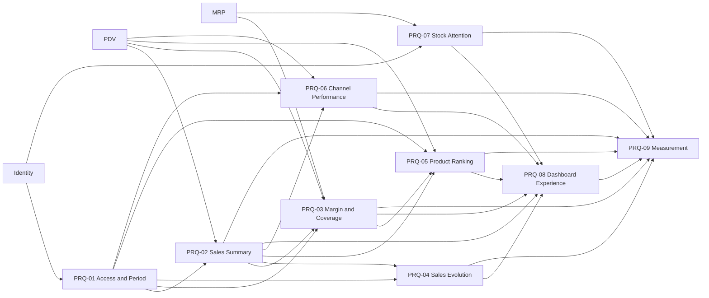

# Analytics Product Requirements Document

## 1. Executive Summary

Analytics gives an establishment Manager a concise operational dashboard that connects sales
performance from PDV with current cost, stock, and production facts from MRP. Its first version is
designed to let a Manager identify sales direction, the strongest product and channel, estimated
gross margin, and the most urgent stock issue within 30 seconds.

Analytics owns indicator definitions, period comparison, aggregation, and dashboard presentation.
It does not own orders, prices, costs, stock, production, authentication, or subscription billing.
Every indicator remains scoped to one establishment and traces back to immutable PDV snapshots or
current authoritative MRP facts.

The dashboard is an operational sales view, not an accounting, cash-flow, or payment-reconciliation
surface. Profitability is presented only as estimated gross margin with explicit cost coverage.

## 2. Problem and Opportunity

Scoops already records detailed product, cost, inventory, production, channel, discount, order, and
cancellation facts, but Managers must inspect separate operational pages to understand how the
establishment is performing. The current navigation includes a Dashboard destination without a
defined management outcome, while MRP and PDV deliberately avoid owning cross-module reporting.

Without a consolidated view, a Manager cannot quickly answer whether sales improved, which products
or channels contributed most, whether current cost coverage makes a margin estimate trustworthy, or
which stock constraint needs immediate action. This weakens the commercial value of the integrated
MRP and PDV data already captured by Scoops.

The opportunity is to turn those authoritative facts into a small decision surface rather than a
generic collection of charts. Scoops can differentiate by placing sales, cost confidence, and current
production or stock constraints in one establishment-scoped view while preserving the boundary
between operational estimates and accounting results.

Market research is not required for this version because the capability extends the confirmed Scoops
operational model and does not introduce a new audience, commercial offer, or competitive claim.

## 3. Target Audience

### Primary audience

- **Manager:** owns day-to-day commercial and operational decisions for one establishment and needs
  a fast summary before opening detailed product, order, or configuration pages.

### Secondary audiences

- No secondary user audience is included in this version. Analytics may produce product-usage and
  data-quality measurements for authorized Scoops operations, but those measurements are not exposed
  as a customer-facing backoffice.

### Non-audience

- Operators, who continue to use `New sale` and `Orders` without access to establishment-wide
  management indicators.
- Accountants or financial controllers requiring cash flow, expense accounting, fiscal
  reconciliation, or statutory reports.
- Scoops subscription administrators; subscription billing belongs to Billing.

### Context of use

- A Manager opens Scoops on a computer, tablet, or mobile phone to review the last 30 days before
  deciding where to investigate.
- The Manager may switch to today, 7 days, or 90 days and compare the selected period with the
  immediately preceding equivalent period.
- Sales indicators describe registered Scoops orders rather than confirmed customer payments.
- Stock attention describes the current operational state and does not change with the sales period.

### Pains and needs

- Understand sales direction without manually totaling order history.
- Distinguish valid sales from canceled orders.
- Recognize whether estimated margin is trustworthy when some product costs are missing.
- Find the products and channels contributing most to sales.
- Move directly from an indicator to the existing operational page where action can be taken.
- See urgent stock and production constraints without searching the complete product catalog.

### Jobs to Be Done

- When I start a management review, I want to understand recent sales and their change, so that I
  know whether performance needs investigation.
- When I assess product profitability, I want estimated gross margin and cost coverage together, so
  that missing costs are never mistaken for high profit.
- When I compare commercial activity, I want products and channels ranked by reconciled sales value,
  so that I can identify where the establishment's sales are concentrated.
- When stock or production is constrained, I want the most urgent current items prioritized, so that
  I can open the right product and act.

## 4. Objectives and Success Metrics

### Objectives

- Let a Manager identify sales performance, the leading product, the leading channel, and the most
  urgent stock issue within 30 seconds.
- Preserve reconciliation between dashboard totals and immutable PDV order facts after discounts and
  cancellations.
- Present profitability only with an explicit measure of cost completeness.
- Connect every actionable summary to an existing owning product surface.
- Keep the dashboard usable and understandable from 320 px through desktop widths.

### Success metrics

- Median time for a Manager to identify the selected period's sales direction, leading product,
  leading channel, and most urgent stock issue is at most 30 seconds in usability validation.
- Dashboard net sales reconcile with eligible PDV order snapshots for the same establishment and
  period, with no unexplained difference.
- The proportion of net sales with complete immutable cost snapshots is measurable as cost coverage.
- Dashboard visits and drill-down selections are measurable without adding steps to the Manager's
  workflow.
- Indicator reconciliation failures, unavailable source sections, and stale-data presentations are
  measurable and distinguishable.

## 5. Requirements

### PRQ-01 — Manager Access, Period, and Business Time

- [ ] **Implemented**

**Outcome:** A Manager can open one establishment-scoped dashboard with predictable period boundaries
and comparisons, while an Operator cannot access its navigation or data.

**Actors:** Manager

**Consumes:** Manager authorization, establishment isolation, and establishment timezone from
Identity.

**Provides:** Selected and comparison period boundaries consumed by PRQ-02, PRQ-03, PRQ-04, PRQ-05,
and PRQ-06.

#### Capabilities

- Analytics is available only to an active Manager with commercial access to the current
  establishment.
- Server authorization and establishment scoping are mandatory; hidden navigation is not an access
  boundary.
- Period presets are `Today`, `Last 7 days`, `Last 30 days`, and `Last 90 days`.
- `Last 30 days` is selected by default.
- `Today` begins at the establishment's current local-day boundary. Every multi-day preset includes
  the current local day and the applicable preceding local days.
- Identity's establishment timezone defines every period boundary. Device timezone does not redefine
  business dates.
- Every selected period has an immediately preceding comparison period of equal local-day duration.
- Custom dates are not supported in this version.

#### Experience

- The page title is `Dashboard` and identifies the selected period without technical date syntax.
- The Dashboard explicitly displays the selected local-date interval and the immediately preceding
  comparison interval using readable localized dates, and updates both whenever the period changes.
- The period control remains keyboard-operable and understandable at narrow widths.
- The dashboard displays the last successful update time in the establishment timezone.
- An Operator does not see the Dashboard navigation item and receives no dashboard data through a
  direct request.

---

### PRQ-02 — Sales and Order Summary

- [ ] **Implemented**

**Outcome:** A Manager can understand reconciled net operational sales, valid order volume, average
ticket, and cancellations for the selected period and compare them with the preceding period.

**Actors:** Manager

**Consumes:** Selected and comparison periods from PRQ-01; immutable order, total, status,
cancellation, and occurrence facts from PDV.

**Provides:** Reconciled net-sales, order, average-ticket, cancellation, and variation facts consumed
by PRQ-03, PRQ-04, PRQ-05, PRQ-06, PRQ-08, and PRQ-09.

#### Capabilities

- `Net operational sales` is the sum of final order totals for orders registered in the selected
  period that are not currently canceled.
- `Valid orders` counts those same non-canceled orders.
- `Average ticket` is net operational sales divided by valid orders. It has no value when no valid
  order exists.
- Canceled orders are excluded from net operational sales, valid orders, average ticket, product
  ranking, channel analysis, and estimated margin.
- A later cancellation restates the original registration period because the order no longer
  represents a valid sale.
- Cancellation activity is also counted by cancellation occurrence time in the selected period and
  retains canceled order count and value as supporting information.
- Sales values describe registered orders and must not be named received revenue, cash received, or
  settled payments.
- Every primary value includes an absolute comparison difference and, when the comparison value is
  nonzero, a percentage difference.
- A zero comparison value produces `No comparison basis` instead of an infinite percentage.
- Currency calculations use integer minor units or an equivalent exact decimal representation and
  display Brazilian Real with two decimal places.

#### Experience

- The first summary row presents `Net sales`, `Valid orders`, `Average ticket`, and `Estimated gross
  margin` as four visually prioritized indicators; PRQ-03 supplies the margin content.
- Supporting content discloses registered and canceled values without competing with the primary
  metrics.
- Positive and negative variations include text or icon meaning and never depend on color alone.
- Values unavailable because no valid order exists are presented as unavailable, not as misleading
  zero performance.

---

### PRQ-03 — Estimated Gross Margin and Cost Coverage

- [ ] **Implemented**

**Outcome:** A Manager can evaluate estimated gross margin without treating incomplete product costs
as zero or as confirmed accounting profit.

**Actors:** Manager

**Consumes:** Net operational sales from PRQ-02; immutable component-level cost, net-sale allocation,
and cost-completeness snapshots from PDV; authoritative current operating-cost facts from MRP only
for future order capture, not for rewriting historical indicators.

**Provides:** Estimated gross margin, margin percentage, snapshotted COGS, and cost-coverage facts
consumed by PRQ-05, PRQ-08, and PRQ-09.

#### Capabilities

- An order component is cost-covered only when every operating-cost component required for that sold
  configuration was known and snapshotted when the order was registered.
- Eligible net sales is the reconciled net-sale value of non-canceled components with complete cost
  snapshots.
- Snapshotted COGS is the sum of immutable component costs for those eligible sold configurations and
  quantities.
- Estimated gross margin amount equals eligible net sales minus snapshotted COGS.
- Estimated gross margin percentage equals estimated gross margin divided by eligible net sales.
- Cost coverage equals eligible net sales divided by all net operational sales.
- Missing cost is never interpreted as zero and never contributes to estimated gross margin.
- Zero eligible net sales produces no margin amount or percentage and zero cost coverage.
- Cost coverage below 100% is visibly disclosed with the margin estimate.
- Later product, brand, ingredient, recipe, or acquisition-cost changes do not rewrite historical
  cost snapshots or margin.
- Analytics must call the result `Estimated gross margin`; it must not call it net profit,
  accounting profit, or cash margin.

#### Experience

- The margin card displays amount, percentage, and cost coverage together.
- Incomplete coverage includes concise guidance and a path to the affected product cost
  configuration.
- No cost coverage presents an unavailable margin state while the remaining sales indicators remain
  usable.
- Supporting language explains that the estimate uses operating costs captured at sale time.

---

### PRQ-04 — Sales Evolution

- [ ] **Implemented**

**Outcome:** A Manager can recognize the selected period's sales and order pattern without manually
reading order history.

**Actors:** Manager

**Consumes:** Period boundaries from PRQ-01 and reconciled sales and valid-order facts from PRQ-02.

**Provides:** Time-grouped net-sales and valid-order series consumed by PRQ-08 and PRQ-09.

#### Capabilities

- `Today` is grouped into hourly intervals in establishment time.
- `Last 7 days` and `Last 30 days` are grouped into local calendar days.
- `Last 90 days` is grouped into consecutive calendar-week intervals.
- Empty intervals remain present with zero values so the trend is not visually compressed.
- Net sales and valid-order counts use the same eligibility rules as PRQ-02.
- Group totals reconcile exactly with the selected-period summary.

#### Experience

- The primary visualization uses bars for net sales and a line for valid-order count.
- Axis labels and tooltips use Brazilian currency, concise dates, and establishment-local time.
- The chart has an accessible textual or tabular alternative containing the same values.
- Dense labels reduce predictably at narrow widths without hiding the selected period or totals.

---

### PRQ-05 — Product Performance Ranking

- [ ] **Implemented**

**Outcome:** A Manager can identify which products contribute most to valid sales and inspect quantity
and estimated-margin context without fragmenting the primary ranking by configuration.

**Actors:** Manager

**Consumes:** Period boundaries from PRQ-01; reconciled sales from PRQ-02; estimated-margin and
coverage facts from PRQ-03; immutable product, size, brand, accompaniment, quantity, price, Combo,
and cost snapshots from PDV.

**Provides:** Establishment-scoped product performance facts consumed by PRQ-08 and PRQ-09.

#### Capabilities

- The primary ranking aggregates by snapshotted product identity and remains readable after current
  product configuration changes or deletion.
- Default ordering is descending allocated net sales value.
- The Manager may reorder the same ranking by sold quantity without opening another chart.
- Quantity represents sold order-item quantity, not physical stock-unit consumption.
- Paid accompaniment revenue and cost are attributed to the parent Portion.
- Size and brand do not become separate top-level product rows. The leading size or brand may appear
  as secondary context when applicable.
- Channel-adjusted prices are included in product sales value.
- Combo savings are allocated proportionally across participating sold configurations using their
  pre-Combo sales values. Cent rounding is deterministic, and the allocated values reconcile exactly
  with the order total.
- Canceled orders contribute nothing to the ranking.
- Estimated margin for a product follows PRQ-03 and discloses product-level cost coverage.

#### Experience

- Each row shows product name, allocated net sales, sold quantity, and available estimated-margin
  context.
- The ordering control clearly identifies `Sales value` or `Quantity` and works by keyboard.
- Selecting a row opens the existing product surface. If the product no longer exists, the row
  remains readable from its snapshot without offering a broken destination.
- The ranking does not introduce separate size, brand, or accompaniment reports in this version.

---

### PRQ-06 — Sales Channel Performance

- [ ] **Implemented**

**Outcome:** A Manager can understand how valid sales are distributed across configured sales
channels and orders registered without a channel.

**Actors:** Manager

**Consumes:** Period boundaries from PRQ-01; reconciled order totals from PRQ-02; immutable channel
snapshots from PDV.

**Provides:** Establishment-scoped channel performance facts consumed by PRQ-08 and PRQ-09.

#### Capabilities

- Every valid order contributes to exactly one snapshotted channel or `No channel` group.
- Each group contains net sales, share of selected-period net sales, valid-order count, and average
  ticket.
- Groups are ordered by net sales descending.
- Channel editing, inactivation, or deletion does not rewrite historical grouping or names.
- Canceled orders contribute nothing to channel sales, share, order count, or average ticket.
- Group values reconcile with PRQ-02.

#### Experience

- `No channel` is always named explicitly when present.
- The distribution remains understandable without relying on color alone.
- Selecting an existing channel opens the sales-channel page. A deleted channel remains readable
  from its snapshot without offering a broken destination.
- The selected-period context remains visible when following a supported destination filter.

---

### PRQ-07 — Current Stock Attention

- [ ] **Implemented**

**Outcome:** A Manager can see the five most urgent current stock or production constraints and open
the owning product surface without confusing current state with period analytics.

**Actors:** Manager

**Consumes:** Current product status, product-total stock classification, ideal-stock facts, recipe
capacity, and limiting-ingredient facts from MRP; establishment isolation and Manager authorization
from Identity.

**Provides:** Prioritized current stock-attention facts consumed by PRQ-08 and PRQ-09.

#### Capabilities

- Stock attention always describes the latest successfully retrieved MRP state and is not filtered by
  the selected sales period.
- At most five products are shown.
- Zero-stock products have the highest priority, followed by below-ideal products, followed by
  products with limited production capacity.
- Products within one priority are ordered by severity using authoritative available and target or
  capacity facts, with a deterministic fallback order.
- Each item identifies its state and the facts needed to understand why it needs attention.
- Zero and below-ideal classification remains owned by MRP. Analytics does not reconstruct it from
  raw balances.
- When an affected product exists, zero or low stock links to its Stock page and limited production
  links to its Recipe page.

#### Experience

- The section is titled `Stock now` and visibly separated from period-dependent sales analytics.
- Zero, low, and production-limiting states use text and icons in addition to semantic color.
- An empty state confirms that no current item requires attention.
- A missing or deleted destination preserves readable context without presenting an invalid action.

---

### PRQ-08 — Dashboard Navigation, States, and Quality

- [ ] **Implemented**

**Outcome:** A Manager can understand, navigate, refresh, and recover each dashboard area across
supported viewport and assistive-technology contexts.

**Actors:** Manager

**Consumes:** Access and period state from PRQ-01; summary facts from PRQ-02 and PRQ-03; chart series
from PRQ-04; product and channel rankings from PRQ-05 and PRQ-06; stock attention from PRQ-07.

#### Capabilities

- The dashboard refreshes when opened, when browser focus returns after the data becomes stale, and
  when the Manager activates manual refresh.
- Realtime streaming is not required in this version.
- Sales summary, chart, and rankings share one successful sales-data boundary. Failure of that
  boundary affects those sections together.
- Stock attention has an independent retrieval and recovery boundary.
- Previously successful content remains visible after a refresh failure and is labeled `Outdated
  data` with the last successful update time.
- Sales and stock provide targeted retries; one source failure does not erase the other source's
  successful content.
- Selecting a KPI, chart context, ranking, or stock item navigates to its existing owning page with
  period and applicable filters when the destination already supports them. Otherwise it opens the
  unfiltered destination rather than creating a second report.
- An establishment with no orders presents no calculated sales or margin values as if they were real
  performance.
- Products with missing costs do not block sales indicators.

#### Experience

- With no orders, the page explains that indicators will appear after the first sale and links to
  `New sale`.
- Missing costs retain sales content and link affected products to cost configuration.
- Initial loading uses stable placeholders that preserve the page hierarchy.
- First-load failure, stale-data refresh failure, no orders, no stock attention, and missing costs are
  distinct states with specific recovery guidance.
- Desktop may use a disciplined two-column analysis layout; narrow widths use one content column in
  decision priority order without mandatory horizontal scrolling.
- Tables or rankings adapt to compact rows rather than clipping required values.
- The page works from 320 px, maintains suitable touch targets, and meets WCAG 2.2 Level AA for
  contrast, keyboard access, visible focus, semantic headings, status announcements, and non-color
  meaning.
- Motion is limited to user-triggered feedback and honors reduced-motion preferences.

---

### PRQ-09 — Analytics Outcome Measurement

- [ ] **Implemented**

**Outcome:** Scoops can evaluate whether the dashboard helps Managers reach the approved decisions
quickly and whether its data remains complete and reconciled.

**Actors:** System

**Consumes:** Dashboard access and period facts from PRQ-01; summary and reconciliation facts from
PRQ-02; margin and cost-coverage facts from PRQ-03; chart, ranking, channel, and stock outcomes from
PRQ-04 through PRQ-07; navigation and source-state facts from PRQ-08.

#### Capabilities

- Measurement supports every success metric defined in Objectives and Success Metrics.
- Usage measurement distinguishes dashboard visits, period changes, manual refresh, and drill-down
  destinations.
- Data-quality measurement distinguishes missing cost coverage, source unavailability, stale-data
  presentation, and reconciliation failure.
- Measurement must not expose another establishment's facts or add steps to the Manager's workflow.
- Usability timing is evaluated through explicit validation rather than inferred solely from page
  duration analytics.

## 6. Product Dependency Graph

An edge points from the provider of a product capability or authoritative fact to the requirement
or module that consumes it.

## 7. User Journeys

### Journey A — Review establishment performance

1. The Manager opens Dashboard.
2. The system selects the last 30 days in establishment time and loads sales and stock independently.
3. The Manager reads net sales, valid orders, average ticket, estimated gross margin, and comparison
   context.
4. The system validates:
   - Success: every summary value reconciles with eligible immutable order facts.
   - No orders: the system explains when indicators will appear and offers `New sale`.
   - Failure: the affected boundary preserves stale content when available and offers retry.
5. The Manager can identify overall direction without opening order history.

### Journey B — Change and compare a period

1. The Manager selects Today, 7 days, 30 days, or 90 days.
2. The system applies establishment-time boundaries and an equal preceding comparison period.
3. Summary, chart, products, and channels update together; Stock now does not change.
4. The system validates:
   - Success: totals, group series, and rankings reconcile for the new period.
   - No comparison basis: absolute context remains and no infinite percentage is shown.
   - Failure: the previous successful state remains labeled outdated with a targeted retry.
5. The selected period remains visible throughout the review.

### Journey C — Evaluate estimated margin

1. The Manager reads estimated gross margin and cost coverage.
2. The system separates covered from missing-cost sales without assigning zero cost.
3. The Manager opens the missing-cost guidance when coverage is below 100%.
4. The system validates:
   - Success: the affected existing product cost configuration opens when available.
   - Deleted or unavailable product: its snapshot remains explained without a broken destination.
5. Later cost changes affect future orders only.

### Journey D — Investigate a leading product or channel

1. The Manager reviews product and channel rankings for the selected period.
2. The Manager may reorder products by quantity and selects one product or channel.
3. The system opens the existing owning page with supported period or context filters.
4. If the destination cannot accept a dashboard filter, it opens unfiltered and does not create a
   duplicate reporting surface.
5. Deleted snapshotted items remain readable but are not presented as actionable links.

### Journey E — Resolve current stock attention

1. The Manager reviews Stock now independently of the selected sales period.
2. The system presents up to five products prioritized by zero stock, below-ideal stock, and limited
   production capacity.
3. The Manager selects an item.
4. The system opens the product Stock or Recipe page appropriate to the alert.
5. If no item requires attention, the system confirms the healthy current state.

### Journey F — Recover unavailable data

1. A sales or stock source fails during initial load or refresh.
2. The system isolates the failure to its owning dashboard boundary.
3. Previously successful content remains visible with its update time when available.
4. The Manager retries only the affected boundary.
5. Successful recovery replaces stale content and removes the warning without changing the selected
   period.

## 8. Out of Scope

- Operator access to Dashboard or establishment-wide management indicators.
- Accounting profit, net profit, expenses, cash flow, accounts payable, or accounts receivable.
- Customer payment methods, tender, cash drawer, change, payment settlement, or reconciliation.
- Purchasing, supplier invoices, payroll, rent, utilities, taxes, or other operating expenses.
- Realtime dashboard streaming.
- Custom date ranges or periods longer than 90 days.
- CSV, spreadsheet, PDF, printable, or fiscal report export.
- Dedicated reports separate from the Dashboard page.
- Separate top-level rankings for size, brand, or accompaniment.
- Inventory valuation, stock turnover, forecasting, purchase planning, waste, physical counts,
  batches, or expiration.
- Forecasts, goals, budgets, benchmarks, recommendations, or anomaly detection.
- Scoops subscription metrics or internal Billing backoffice.
- Customer identity, segmentation, loyalty, or cohort analysis.
- Multi-establishment consolidation or franchise comparison.

### Discarded during definition

- **Complete financial dashboard:** rejected because Scoops does not own the payment, expense, or
  accounting facts required to claim cash flow or net profit.
- **Current-cost reconstruction of historical margin:** rejected because later cost changes would
  silently rewrite historical performance.
- **Missing cost treated as zero:** rejected because it would overstate margin.
- **Operator dashboard access:** rejected to preserve the approved Identity role boundary.
- **Realtime updates:** deferred because opening, focus refresh, and manual refresh are sufficient for
  the first management workflow.
- **Dashboard exports:** deferred until Managers validate and trust the indicator definitions.
- **Device-local period boundaries:** rejected because establishment reporting must remain consistent
  across Managers and devices.
- **Period-filtered stock attention:** rejected because stock attention represents current action,
  not historical sales analysis.
