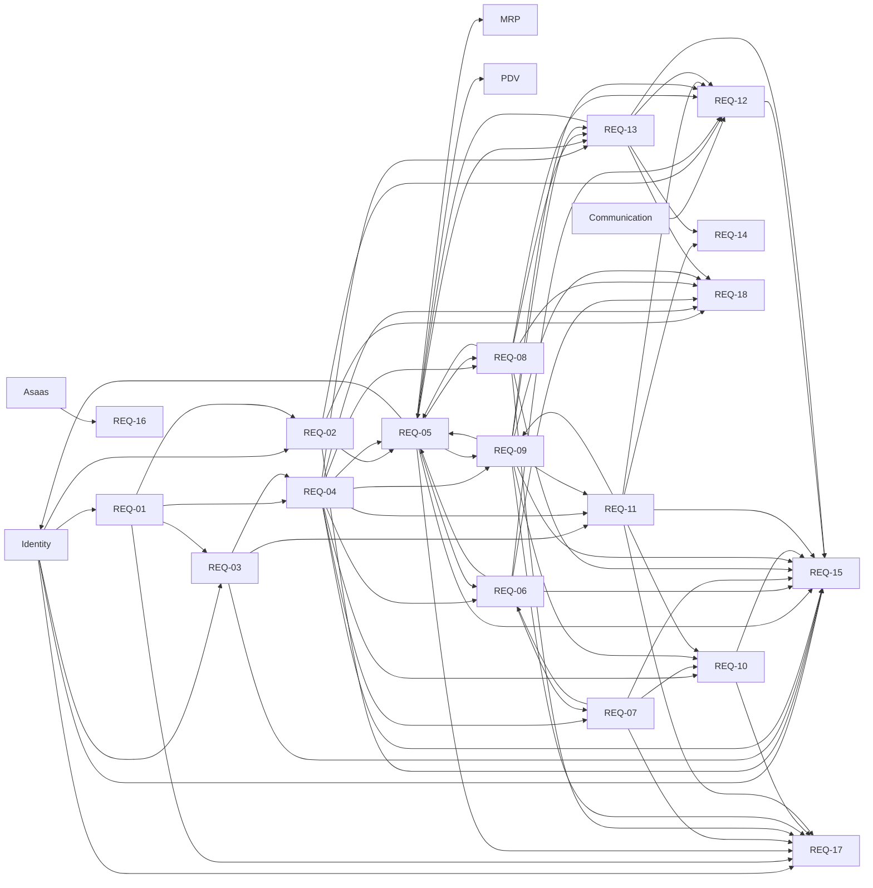

# Billing Product Requirements Document

## 1. Executive Summary

Billing gives Managers of independent ice cream and açaí shops a transparent,
self-service way to try, subscribe to and manage Scoops. It owns the
establishment's commercial lifecycle, integrates recurring charges with Asaas,
issues tax documents, and applies commercial blocking or reactivation from the
confirmed subscription state.

Billing covers only the monthly fee for using Scoops. Payments made by an
establishment's customers, POS payment methods, cash operations, sales
reconciliation and tax documents for customer orders remain outside this
module.

### Confirmed commercial offer

- **Plan:** `Complete Scoops`.
- **Price:** R$59.90 per month, taxes included.
- **Frequency:** exclusively monthly.
- **Scope:** all Scoops features.
- **Limits:** unlimited users, products, orders and movements.
- **Additional fees:** no implementation, membership, cancellation fees,
  user, volume or payment method.
- **Trial:** 14 days free, without advance payment and with access
  integral.
- **Payment methods:** credit card and Pix Automatic.
- **Provider:** Asaas.

---

## 2. Problem and Opportunity

Without an authoritative subscription capability, Scoops cannot reliably
determine whether an establishment may use operational modules. Managers also
lack a clear way to subscribe, update payment details, review charges, obtain
tax documents, cancel or recover access after a payment failure.

The opportunity is to convert establishments that try Scoops into paying
subscribers through one predictable, self-service offer: a full trial without a
payment method, one unlimited monthly plan, recurring card or Automatic Pix
payments, a seven-day recovery period after payment failure, and reactivation
without immediate loss of operational data.

The Brazilian market combines limited free versions, temporary trials,
feature-tiered plans and assisted contracting. Scoops is differentiated by a
simple subscription to a vertical product rather than the breadth and pricing
complexity of a general-purpose ERP.

### Market evidence and positioning

| Solution | Audience | Value proposition | Features | Public price | Limitations |
|---|---|---|---|---|---|
| [Consumer](https://www.consumer.com.br/) | Restaurants, bars, snack bars, coffee shops and ice cream shops | Restaurant operations with a free entry point | POS, orders, stock, tables, reports, tax, delivery and integrations | The official page reports a free version up to 200 orders/month; the [official store](https://loja.consumer.com.br/) reports the Essential plan at R$59.90/month | Free access ends based on order volume; modules and features vary between plans |
| [Kyte](https://www.kyte.com.br/planos) | Small merchants and sales teams | Simple management by phone and computer | POS, inventory, catalog, orders, reports, users and plan-dependent AI | The official page reports a free plan and paid plans at R$49.90, R$69.90 and R$99.90 per month | Users, platforms and features vary by tier |
| [Saipos](https://saipos.com/sistema/sorveteria) | Ice cream shops and food establishments | Centralized operations, inventory, finance, tax and delivery | POS, scales, stock, recipes, reports, tax and integrations | The official ice-cream-shop page reports plans starting at R$219.90/month and a seven-day free trial | Demo-driven contracting and a broader operating scope than Scoops' initial scope |
| [Bling](https://www.bling.com.br/planos-e-precos) | Micro, small and medium multichannel companies | ERP integrating sales, inventory, tax, finance and logistics | ERP, POS, invoices, integrations, finance, reports and tiered limits | The [official communication](https://ajuda.bling.com.br/hc/pt-br/articles/30224184866583-Altera%C3%A7%C3%A3o-nos-planos-e-pre%C3%A7os-do-Bling-em-abril-de-2025) reports monthly plans starting at R$55 and an initial free trial | Plans vary by features, users, storage and imported orders |
| Spreadsheets, reminders and manual billing | Small operations and software under validation | Low initial technical effort | Manual recording of due dates, payments and access | Variable | No reliable renewal, automatic reconciliation, auditing or consistent blocking |

The [Asaas Checkout documentation](https://docs.asaas.com/docs/checkout-asaas)
reports hosted checkout, cards, Pix, subscriptions, callbacks, webhooks and a
Sandbox. Asaas also documents a dedicated
[AutoPix API](https://docs.asaas.com/reference/criar-uma-autorizacao-pix-automatico).
[AbacatePay](https://www.abacatepay.com/para/saas) reports card and Pix
subscriptions, public fees and webhooks, with an expanded API v2 subscription
cycle in its [April and May 2026 changelog](https://docs.abacatepay.com/pages/changelog).
No unequivocal public documentation of Automatic Pix was identified for Appmax
in the sources consulted.

Source-based inference: the R$59.90 price places Scoops near the entry price of
general-purpose solutions, while vertical specialization in production, stock
and sale of ice cream and açaí supports its value. A single unlimited offer also
reduces comparison effort and avoids incentives to share accounts or interrupt
operations because of user or volume limits.

---

## 3. Target Audience

### Primary audience

Managers of independent ice cream and açaí shops who need to experiment,
contract and maintain the organization's access to Scoops without depending on customer service
commercial.

### Secondary audiences

- Financial or accounting managers who receive receipts and NFS-e in one
  billing email, without necessarily having access to Scoops.
- Individual or legal entity subscribers responsible for payment.
- Scoops administrative team, which monitors charges and exceptions for
  Asaas dashboard and technical alerts.

### Non-audience

- Ice cream shop operators, who cannot view prices, subscriptions,
  charges or tax data.
- Chains that need to hire several ice cream shops under a single contract.
- Customers requiring an annual plan, negotiated price, add-ons, or per-month billing
  consumption.
- Customers looking to process payments for POS sales in Billing.

### Context of use

- Start of the test after activating the ice cream shop and the first Manager.
- Subscription during or after the test.
- Monthly renewal by card or Automatic Pix.
- Update tax data or payment method.
- Recovery of declined card, insufficient balance, revoked authorization or
  chargeback.
- Consultation of charges, receipts and NFS-e.
- Cancellation, withdrawal from cancellation, refund or reactivation.
- Future operational retention and disposal after the retention period; no
  customer-facing deletion action is available in the current product.

### Pains and needs

- Know the total cost before subscribing.
- Test all features without registering a card.
- Avoid immediate interruption due to a temporary charging failure.
- Regularize your subscription without losing registrations or histories.
- Obtain financial and tax documents in one place.
- Cancel without commercial contact or artificial obstacles.
- Know when access will be blocked and what future retention lifecycle applies.
- Preserve the authorship of changes made by different Managers.

### Jobs to Be Done

- When I create my ice cream shop, I want to test all the features without informing
  a payment method, to evaluate Scoops without the risk of collection.
- When I see value during trial, I want to subscribe immediately, so
  turn the ice cream shop into a paying customer.
- When a charge fails, I want to know the reason and regularize the payment,
  to avoid interruption of operation.
- When my card or account changes, I want to change the payment method, to
  maintain automatic renewals.
- When I need to provide accounts, I want to consult receipts and NFS-e, to
  organize accounting.
- When I decide to leave, I want to cancel the renewal without losing the period already
  paid, to close the contract in a predictable manner.
- When I change my mind after a blockage, I want to pay and recover all
  data, to resume operation without re-registration.

---

## 4. Objectives and Success Metrics

- Convert establishments that start the trial into paying subscribers through
  a transparent, self-service subscription flow.
- Maintain predictable access through successful renewals, payment recovery,
  cancellation, blocking and reactivation.
- Give Managers reliable access to charge history, receipts and NFS-e without
  requiring the Asaas dashboard.
- Keep commercial actions auditable while protecting financial and personal
  data.

Success is measured by:

- the percentage of establishments that start a trial and become paying
  subscribers within 30 days after the trial ends, with an initial hypothesis
  of at least 20% until sufficient history exists;
- conversion during trial and median time to subscribe;
- monthly recurring revenue and voluntary and involuntary churn;
- renewal-failure rate and recovery rate during the seven-day tolerance period;
- reactivation rate and use of card compared with Automatic Pix;
- reconciliation of financial metrics with confirmed charges rather than only
  interface events.

---

## 5. Requirements

### REQ-01 — Commercial Plan and Offer

- [ ] **Implemented**

**Outcome:** Establishments can subscribe to one transparent monthly offer
with a uniform price and complete product scope.

**Actors:** Manager

**Consumes:** Identity — Manager profile and functional permissions

**Provides:** Authoritative commercial offer to REQ-02, REQ-03, REQ-04 and
REQ-17

#### Capabilities

- **Plan:** the only plan must be called `Complete Scoops`.
- **Price:** the monthly fee must be R$59.90, taxes included.
- **Frequency:** the charge must be monthly and there must be no contracting
  annual at MVP.
- **Scope:** the plan must release all Scoops modules and functionalities.
- **Commercial limits:** users, products, orders and movements must not
  have commercial limits.
- **Uniform price:** CPF and CNPJ must pay the same amount.
- **Fees:** there should be no additional fees for implementation, membership,
  cancellation, user, volume or payment method.
- **Adjustment:** a new price must be communicated at least 30 days after
  in advance and only applied to a renewal after that period.
- **Dependency:** functional permissions of each module continue to be
  determined by Identity profiles.

#### Experience

- **Interface:** display plan name, monthly price, included features and
  absence of additional fees in a single presentation, without level table.
- **Feedback:** any adjustment must show current value, new value and date of
  validity.
- **Empty state:** not applicable, as there is always a commercial offer.
- **Action blocked:** does not present annual selection, add-ons or customization of
  limits.
- **Responsiveness:** the offer must remain readable from 320 px.
- **Accessibility:** price, frequency and conditions must be exposed as
  text, not just by position or color.

---

### REQ-02 — Free Trial

- [ ] **Implemented**

**Outcome:** A newly activated establishment can experience all of Scoops for
14 days without providing a payment method.

**Actors:** Manager, System

**Consumes:** Identity — activation of the establishment and first Manager;
REQ-01 — commercial offer

**Provides:** Authoritative trial eligibility, period and status to REQ-05,
REQ-12 and REQ-18

#### Capabilities

- **Start:** the test must begin when the confirmation jointly activates the
  ice cream shop and its first Manager.
- **Duration:** the test must last 14 calendar days.
- **Access:** all modules, features and limits of the paid plan must
  be available.
- **No payment:** card and Pix should not be required to start the test.
- **Eligibility:** each ice cream shop and first Manager email must receive
  just a test.
- **Normalized email:** differences between upper and lower case letters should not be
  generate new eligibility.
- **Recreation:** deleting and recreating an account with the same email should not grant
  new test.
- **Subscription during trial:** payment confirmed during the test must close
  immediately the remaining days and start a monthly cycle.
- **Initial failure:** pending or rejected subscription attempt must not
  end the test while it is still valid.
- **Dependency:** the hash or identifier required to prevent retrial
  must be preserved without retaining the deleted account for operational use.

#### Experience

- **Interface:** indicate `In trial` status and end date on the
  Subscription.
- **Feedback:** show persistent banner only to Managers for the last seven
  days, with days remaining and `Subscribe Now` action.
- **Empty state:** not applicable during trial.
- **Action blocked:** Operators must not view the banner or the
  Subscription.
- **Responsiveness:** the banner must not cover navigation or operational actions.
- **Accessibility:** the deadline must have a textual date and not depend solely on
  countdown icon.

---

### REQ-03 — Holder, Billing Data and Acceptance

- [ ] **Implemented**

**Outcome:** The subscription identifies its holder, has valid billing data and
preserves explicit acceptance of the commercial and privacy conditions.

**Actors:** Manager

**Consumes:** Identity — authenticated Manager; REQ-01 — commercial offer

**Provides:** Authoritative billing profile and acceptance evidence to REQ-04
and REQ-11

#### Capabilities

- **Types of holder:** accept natural person with CPF and legal entity with
  CNPJ.
- **Mandatory data:** name or company name, CPF or CNPJ, email address
  billing, telephone number and full address.
- **Financial email:** may be different from Managers' emails and should not be
  create access to Scoops.
- **Validation:** CPF or CNPJ, email, telephone and address must follow the
  formats accepted by Asaas and tax issuance.
- **Synchronization:** Scoops must save a synchronized copy of the data
  required for display, reconciliation and NFS-e.
- **Change:** any Manager can update the data; changes must be valid
  only for future charges and invoices.
- **Tax history:** documents already issued must not be rewritten by a
  registration change.
- **Accept:** before checkout, the Manager must accept the Terms of Use and the
  Privacy Policy with price, recurrence, cancellation and retention.
- **Evidence:** record version of documents, user, date, time and IP address
  accept.

#### Experience

- **Interface:** group holder data and address in a section
  billing, visually distinguishing CPF from CNPJ.
- **Feedback:** validate fields before redirection and preserve data not
  sensitive when there is an error.
- **Empty state:** while there is no contract, inform that the data will be
  requested at checkout.
- **Action blocked:** prevent subscription without valid data and explicit acceptance.
- **Responsiveness:** forms must use an appropriate keyboard and not require
  horizontal scrolling.
- **Accessibility:** fields must have labels, instructions, association of
  errors and visible focus.

---

### REQ-04 — Checkout and Payment Methods

- [ ] **Implemented**

**Outcome:** A Manager can purchase the plan securely by credit card or
Automatic Pix through an Asaas-hosted checkout.

**Actors:** Manager, System, Asaas

**Consumes:** REQ-01 — commercial offer; REQ-03 — billing profile and acceptance

**Provides:** Authoritative payment, payment-method and provider-reference facts
to REQ-05, REQ-06, REQ-07, REQ-09, REQ-10, REQ-11 and REQ-13

#### Capabilities

- **Provider:** Asaas must be the sole provider of the MVP.
- **Checkout:** Scoops must create a hosted session and redirect the
  manager to complete the payment.
- **Card:** renewal must automatically charge the tokenized card for
  Asaas.
- **Pix:** the recurrence must use Automatic Pix with unique authorization from the
  payer; Monthly manual Pix does not meet the confirmed rule.
- **First charge:** contracting during the test must immediately charge R$
  59.90.
- **Activation:** only received and validated financial confirmation should activate
  the plan; the return URL is not proof of payment.
- **Security:** Scoops must not receive or store complete numbers,
  security code or banking credentials.
- **Reference:** checkout, customer, subscription and billing on Asaas must use
  references correlatable to the ice cream shop.
- **Dependency:** Automatic Pix must be approved in the Asaas account before
  launch.

#### Experience

- **Interface:** present final summary and action `Go to payment`; the Asaas
  collects sensitive data.
- **Feedback:** after return, show `Payment confirmed`, `Processing
  payment`, `Payment declined`, `Checkout cancelled` or `Checkout expired`.
- **Empty state:** without checkout initiated, display the available forms and the
  full price.
- **Action blocked:** prevent duplicate sessions while there is already an attempt
  valid in processing.
- **Responsiveness:** the checkout return must preserve the context on mobile
  and computer.
- **Accessibility:** return messages must be focused and announced
  by assistive technology.

---

### REQ-05 — Subscription and Access Control States

- [ ] **Implemented**

**Outcome:** Every establishment has an auditable commercial-access state that
is enforced consistently across protected routes and actions.

**Actors:** Manager, Operator, System

**Consumes:** REQ-02 — trial state; REQ-04 — confirmed financial facts; REQ-06
— renewal and tolerance state; REQ-08 — cancellation state; REQ-09 — refund
and chargeback state; REQ-13 — retention and disposal state

**Provides:** Authoritative commercial-access state to Identity and the MRP and
PDV operational modules, and to REQ-17

#### Capabilities

| Status | Meaning | Operational access |
|---|---|---|
| `In trial` | 14-day trial current | Full |
| `Pending initial payment` | Checkout completed without final confirmation | Full if the test is still valid; blocked otherwise |
| `Active` | Paid period confirmed | Full |
| `In tolerance` | Renewal failed or chargeback occurred no more than seven days ago | Full |
| `Scheduled cancellation` | Renewal cancelled, paid period still valid | Full until the end date |
| `Blocked` | Trial ended, tolerance expired, canceled period ended, or refund was issued | Subscription Only and My Account |
| `Scheduled disposal` | Block achieved 90-day retention and an operational disposal job is scheduled | Subscription only and My account until operational completion |
| `Disposed` | Operational data removed by the future operational lifecycle | None |

- **Source of financial truth:** events and queries authenticated to Asaas
  determine payments; Scoops determines access from the state
  reconciled.
- **Authorization:** every protected route and operation must validate the state, without
  depend only on the interface.
- **Scope blocked:** a blocked ice cream shop can only access Subscription,
  My Account and Sign Out. The current product exposes no customer-facing
  deletion danger zone.
- **Preservation:** blocking should not change or delete operational data.
- **Application time:** the new state must affect access within 60 seconds
  upon receipt of a valid webhook.
- **Sessions:** changing to blocked should remove operational access including
  of sessions already open.
- **Reactivation:** payment confirmed during the 90 days must restore
  automatically full access without changing data.

#### Experience

- **Interface:** the Subscription screen must display status, period, next action
  and relevant dates.
- **Feedback:** during the 60 seconds, show `Processing payment` and
  allow updating the query without duplicating charges.
- **Empty state:** if there is no subscription after trial, present the offer and
  subscription action.
- **Action blocked:** when trying to open operational module, explain the reason and
  direct Managers to Subscription; Operators receive guidance to
  look for a Manager.
- **Responsiveness:** the lock must keep egress and recovery accessible in
  small screens.
- **Accessibility:** state, cause and solution must be textual and not depend
  just in color.

---

### REQ-06 — Renewal, Billing Failure and Tolerance

- [ ] **Implemented**

**Outcome:** The subscription renews monthly and gives the establishment seven
days to recover a failed charge before operational access is blocked.

**Actors:** Manager, System, Asaas

**Consumes:** REQ-04 — recurring payment and payment method; REQ-05 —
commercial-access state

**Provides:** Authoritative renewal, failure and tolerance facts to REQ-05,
REQ-07, REQ-12 and REQ-18

#### Capabilities

- **Renewal:** the starting date of the first confirmed payment must define the
  monthly cycle according to Asaas calendar rules.
- **Success:** a paid renewal should extend the active period and generate new
  charge history.
- **Failure:** card declined, insufficient balance, invalid Pix authorization or
  Unpaid charges must begin `In Tolerance`.
- **Deadline:** tolerance must last seven calendar days from the date of failure.
- **Access:** all modules remain available during the tolerance.
- **Retries:** the system must use the retries supported by Asaas and
  allow safe manual action for payment recovery.
- **Discharge:** confirmed payment ends the tolerance and restores `Active`.
- **Expiration:** without payment, the status must change to `Blocked` at the end of the
  deadline.
- **Idempotence:** repeated events cannot extend period, duplicate
  charge or switch states incorrectly.

#### Experience

- **Interface:** display alert with presentable reason, remaining time and actions
  `Pay now` and `Change payment method`.
- **Feedback:** confirm each attempt without asserting success before the webhook.
- **Empty state:** not applicable to tolerance.
- **Action blocked:** if the provider is unavailable, keep last state and
  inform that the payment recovery is temporarily unavailable.
- **Responsiveness:** alerts must prioritize deadline and action on small screens.
- **Accessibility:** the alert must be announced and focus on the action
  main without blocking operational navigation.

---

### REQ-07 — Change of Payment Method

- [ ] **Implemented**

**Outcome:** Any Manager can switch securely between card and Automatic Pix
without exposing sensitive financial data.

**Actors:** Manager, System, Asaas

**Consumes:** REQ-04 — current payment method and provider references; REQ-06 —
renewal and tolerance state

**Provides:** Authoritative current payment-method facts to REQ-06 and REQ-10

#### Capabilities

- **Authorization:** only Managers can initiate the change.
- **Modes:** allow card to card, card to Pix Automatic, Pix
  for card and new Pix authorization.
- **Regular subscription:** the new payment method must be valid for the next renewal.
- **Default:** during tolerance or blocking, the new payment method must
  try to pay off the outstanding monthly payment.
- **Confirmation:** do not replace the active mode before confirming the
  Asaas.
- **Revocation:** canceling a Pix authorization at the bank must be reflected in the
  next sync.
- **Card displayed:** store and display flag only, last four digits
  and validity when provided by the provider.
- **Failure:** a rejected change must preserve the previous payment method when
  it is still valid.

#### Experience

- **Interface:** show current masked payment method and action `Change payment
  method`, with secure redirection to Asaas.
- **Feedback:** differentiate pending, completed, refused, canceled authorization
  and expired.
- **Empty status:** without active payment method, guide subscription or payment recovery.
- **Action blocked:** prevent parallel changes while there is an attempt
  pending.
- **Responsiveness:** cards and actions must stack without truncating information
  essential.
- **Accessibility:** the masked payment method must have an accessible and
  Never rely solely on the flag icon.

---

### REQ-08 — Cancellation and Resumption of Renewal

- [ ] **Implemented**

**Outcome:** Any Manager can cancel the next renewal without losing the paid
period and can resume renewal before that period ends.

**Actors:** Manager, System, Asaas

**Consumes:** REQ-04 — provider subscription; REQ-05 — current
commercial-access state

**Provides:** Authoritative scheduled-cancellation state to REQ-05, REQ-12,
REQ-13 and REQ-18

#### Capabilities

- **Authorization:** any Manager can cancel; Operators do not see the
  action.
- **Effect:** cancellation must prevent future charges and maintain access until
  the end of the current cycle.
- **Proportional refund:** should not exist in common cancellation.
- **Confirmation:** require a single confirmation with consequences and end date.
- **Reason:** can be optionally collected and should never prevent the action.
- **Resumption:** `Keep subscription` before the end date must remove the
  scheduled cancellation without immediate charge.
- **Expiration:** at the end of the canceled cycle, change to `Blocked` and start
  90 day retention.
- **Exclusion of the ice cream shop:** a customer-facing manual deletion action
  is not available in the current product. Any future operational deletion
  lifecycle must cancel the subscription before removing operational data.
- **Asaas failure:** does not show cancellation as completed until confirmed
  from the provider.

#### Experience

- **Interface:** keep subscription cancellation distinct from any future
  operational retention or deletion lifecycle; the current product has no
  customer-facing deletion danger zone.
- **Feedback:** after canceling, show end date and `Keep subscription` action.
- **Empty state:** do not show cancellation when there is no active subscription.
- **Action blocked:** Provider failure must maintain previous state and offer
  new attempt.
- **Responsiveness:** confirmation and consequences must remain legible in
  320px.
- **Accessibility:** focus must remain within the confirmation and return to
  original action when canceling the dialogue.

---

### REQ-09 — Refund and Chargeback

- [ ] **Implemented**

**Outcome:** A Manager can request the eligible first-payment refund, and the
establishment receives predictable access treatment for refunds and chargebacks.

**Actors:** Manager, System, Asaas

**Consumes:** REQ-04 — confirmed charge; REQ-05 — commercial-access state;
REQ-11 — issued NFS-e

**Provides:** Authoritative refund and chargeback facts to REQ-05, REQ-10,
REQ-11, REQ-12, REQ-13 and REQ-18

#### Capabilities

- **Eligibility:** only the first monthly payment can receive a refund
  in full for withdrawal within seven days after payment.
- **Channel:** any Manager must be able to request a refund through the payment screen
  Subscription.
- **Processing:** refund must use the means and rules supported by the
  Asaas.
- **Access:** confirmation of refund must immediately block modules
  operational and initiate 90-day retention.
- **New test:** resubscribing after reimbursement should not grant a new test.
- **Renewals:** do not have a proportional refund, except for undue charges or
  legal obligation.
- **Undue charging:** must follow the applicable legal and operational treatment,
  without being limited by the first monthly payment rule.
- **Chargeback:** a confirmed dispute must initiate seven days of grace
  for new payment.
- **Regularization:** payment on time maintains or restores `Active`.
- **Failure:** without payment recovery, the chargeback should result in `Blocked`.
- **Tax:** refund must trigger cancellation or adjustment of NFS-e according to
  applicable tax rule.

#### Experience

- **Interface:** during eligibility, display `Cancel and request
  refund`, with value, deadline and immediate effect on access.
- **Feedback:** differentiate request sent, refund processing,
  confirmed and rejected.
- **Empty state:** after seven days, remove the repentance action and keep the
  common cancellation.
- **Action blocked:** prevent duplicate orders while there is a refund in
  processing.
- **Responsiveness:** consequences must appear before final confirmation.
- **Accessibility:** the severity of the blockage should not be communicated only by
  color.

---

### REQ-10 — Charges, Receipts and History

- [ ] **Implemented**

**Outcome:** Managers can consult the establishment's complete financial
history, receipts and tax-document links without accessing the provider panel.

**Actors:** Manager, System

**Consumes:** REQ-04 — charge facts; REQ-07 — payment-method facts; REQ-09 —
refund and chargeback facts; REQ-11 — NFS-e facts

#### Capabilities

- **Fields:** each charge must preserve billing period, due date, payment,
  value, payment method, status, internal identifier and Asaas identifier.
- **Status:** support at least pending, paid, failed, past due, refunded and
  contested.
- **Proof:** provide receipt or proof provided by Asaas
  when existing.
- **NFS-e:** link the corresponding invoice to the charge paid.
- **Immutability:** completed records should not be overwritten by states
  futures; changes must produce auditable events or transitions.
- **Order:** display charges from most recent to oldest.
- **Access:** any Manager can consult; Operators cannot access.
- **Masking:** never show full card or bank details.

#### Experience

- **Interface:** use table on desktop and lines or compact cards on cell phone,
  with expandable detail.
- **Feedback:** indicate loading, query failure and recent update.
- **Empty state:** before the first charge, explain that the history will be
  displayed after subscribing.
- **Action blocked:** unavailable receipt or invoice must show the reason and
  state, not a broken link.
- **Responsiveness:** preserve value, date and status as information
  priorities.
- **Accessibility:** headers, lines and actions must maintain table semantics or
  accessible list and names.

---

### REQ-11 — Issuance and Delivery of NFS-e

- [ ] **Implemented**

**Outcome:** Every paid monthly fee produces an NFS-e with the applicable
billing and jurisdictional tax data.

**Actors:** System

**Consumes:** REQ-03 — billing profile; REQ-04 — confirmed payment; REQ-09 —
refund facts

**Provides:** Authoritative NFS-e facts and documents to REQ-09, REQ-10, REQ-12
and REQ-14

#### Capabilities

- **Trigger:** issue only after payment confirmation.
- **Owner:** use the billing data in force at the time of billing.
- **Delivery:** send to billing email and make available in history.
- **Failure:** a fiscal unavailability should not block or suspend a
  paid subscription.
- **Pending status:** log failure, automatically retry and alert
  administrative operation of Scoops.
- **Idempotence:** a charge cannot generate duplicate invoices due to repetition of
  event.
- **Correction:** new registration data is only valid for future invoices;
  Retroactive corrections follow an exceptional process and fiscal rule.
- **Refund:** cancel or adjust the invoice as permitted by the authority
  municipal.
- **Dependency:** municipality, certificate, service code, rate and regime
  Scoops tax must be configured and approved outside the Scoops interface.
  customer.

#### Experience

- **Interface:** display number, billing period, status and action `Download NFS-e`.
- **Feedback:** use states `Issuing`, `Emitted`, `Temporary failure`,
  `Cancelled` or equivalent.
- **Empty state:** unpaid charge should not suggest that a invoice already exists.
- **Action blocked:** if failed, replace download with explanation and inform
  that access remains active.
- **Responsiveness:** number and action can stack, without losing association with the
  billing.
- **Accessibility:** invoice links must include competency or number in the name
  accessible.

---

### REQ-12 — Billing Notifications

- [ ] **Implemented**

**Outcome:** Managers and the financial contact receive timely notice of
billing events that require knowledge or action.

**Actors:** System

**Consumes:** Communication — transactional email and in-product notification
delivery; REQ-02 — trial milestones; REQ-06 — failure and tolerance milestones;
REQ-08 — cancellation state; REQ-09 — refund and chargeback state; REQ-11 —
NFS-e state; REQ-13 — retention and disposal milestones

#### Capabilities

- **Channels:** use email and notice within the product; SMS and WhatsApp do not belong
  to MVP.
- **Managers:** end of test, billing failure, blocking, cancellation,
  reactivation, readjustment and deletion must be sent to all active Managers.
- **Financial email:** receipts, NFS-e and billing communications must be
  sent to the billing address.
- **End of test:** notify 7, 3 and 1 day in advance.
- **Default:** notify immediately and on days 3 and 6 of tolerance.
- **Blocking:** notify when it occurs.
- **Automatic exclusion:** notify 30, 7 and 1 day in advance.
- **Adjustment:** notify at least 30 days before it comes into effect.
- **Duplicate messages:** the same occurrence and milestone should not generate messages
  repeated by duplicate webhooks.
- **Audit:** record sending attempt and result.

#### Experience

- **Interface:** warnings within the product must show cause, deadline and action
  recommended.
- **Feedback:** email links must open the correct context after authentication.
- **Empty state:** absence of alerts does not require a notification center in the
  MVP.
- **Action blocked:** invalid recipient must generate operational alert without
  expose data to other clients.
- **Responsiveness:** banners must allow reading and closing without covering
  essential content.
- **Accessibility:** critical alerts must use icon, text and semantics
  appropriate, not just color.

---

### REQ-13 — Retention, Reactivation and Future Operational Disposal

- [ ] **Implemented**

**Outcome:** A blocked establishment's operational data remains recoverable for
90 days and can later be disposed of only through an authorized operational
lifecycle, never through a customer-facing Identity action.

**Actors:** Manager, System, Asaas

**Consumes:** REQ-04 — confirmed reactivation payment; REQ-05 — blocked access
state; REQ-08 — ended cancellation period; REQ-09 — confirmed refund

**Provides:** Authoritative retention, reactivation and disposal facts to
REQ-05, REQ-12 and REQ-14

#### Capabilities

- **Start:** test expired, tolerance expired, end of period canceled or
  Confirmed refunds must initiate 90-day retention.
- **Preservation:** users, products, inventory, orders, configurations and
  History must not be changed during retention.
- **Reactivation:** confirmed payment must cancel the scheduled operational
  disposal and restore full access.
- **Exclusion:** after 90 days, cancel any remaining recurrence in the
  Asaas before removing operational data.
- **Provider failure:** if the cancellation is not confirmed, maintain the
  blocked ice cream shop, preserve the data, alert the operation and repeat the action.
- **No free access:** Asaas failure cannot reactivate operational modules.
- **Backups:** Disposed data can only persist in encrypted backups
  for up to 30 days.
- **Restore:** restoring a backup must reapply previously recorded operational
  disposals to return the environment to operation.
- **Customer action:** Identity does not expose a customer-facing deletion
  action. Any future operational disposal remains conditional on successful
  subscription cancellation and the applicable retention policy.
- **Export:** there must be no operational export during the blockade in
  MVP.

#### Experience

- **Interface:** when this future lifecycle is implemented, display the
  scheduled operational-disposal date and reactivation action during the 90
  days; this Spec does not add that UI.
- **Feedback:** payment must remove the count only after confirmation.
- **Empty state:** not applicable while data is retained.
- **Action blocked:** if the provider prevents operational disposal, do not
  offer operational access and do not state that data has been removed.
- **Responsiveness:** deadline, consequences and contracting must be visible in
  cell phone.
- **Accessibility:** count must include the exact date and not depend solely on
  a visual indicator.

---

### REQ-14 — Tax Archive and Privacy

- [ ] **Implemented**

**Outcome:** Future operational disposal removes eligible operational data
while preserving only the segregated tax minimum required by legal obligation.

**Actors:** System, authorized Scoops accounting or legal staff

**Consumes:** REQ-11 — NFS-e and fiscal facts; REQ-13 — completed operational
disposal

**Provides:** Authoritative segregated tax archive

#### Capabilities

- **Term:** maintain minimum tax records for five years after issuance or
  according to the higher legal period that may be applicable.
- **Content:** NFS-e and its identifiers, holder and CPF/CNPJ, value,
  billing period, dates, billing and transaction identifiers, payment method and
  cancellation, refund or chargeback records.
- **Exclusions:** products, inventory, orders, team users, passwords, sessions
  and operational audits do not belong in the fiscal archive.
- **Segregation:** the file must remain separate from the operational bank and not
  can reactivate the ice cream shop.
- **Purpose:** use only for tax, accounting, legal and
  defense of rights; commercial or marketing use is prohibited.
- **Access:** limit to authorized Scoops accounting or legal operation and
  register queries.
- **Disposal:** delete safely at the end of the applicable period, unless new
  legal obligation or documented dispute.
- **Dependency:** the Identity product does not expose manual deletion, and any
  future operational-disposal contract must preserve this fiscal exception.

#### Experience

- **Interface:** before any future operational disposal, inform that minimum tax
  records will be preserved for the legal period and remain unavailable in the
  product.
- **Feedback:** the conclusion must distinguish operational data deleted from
  retained tax records.
- **Empty state:** not applicable.
- **Action blocked:** no excluded user can access the tax file via
  Scoops.
- **Responsiveness:** the legal explanation must remain legible on screens
  small.
- **Accessibility:** any future legal-retention notice must use direct language
  and be announced before an operational disposal state change.

---

### REQ-15 — Permissions and Audit

- [ ] **Implemented**

**Outcome:** Billing respects Identity's fixed profiles and preserves the
authorship and history of administrative and autonomous commercial actions.

**Actors:** Manager, System

**Consumes:** Identity — authenticated establishment, Manager and Operator
profiles; authoritative actions and state transitions from REQ-02 through
REQ-13

**Provides:** Authoritative Billing audit history

#### Capabilities

- **Managers:** any Manager can view, hire, change data and
  payment, cancel, resume, refund and reactivate.
- **Operators:** cannot view the `Subscription` navigation, prices,
  charges, documents or actions.
- **Audit:** register subscription, acceptance, registration change, change of
  payment, cancellation, resumption, reactivation and refund request.
- **Details:** preserve action, responsible, moment, previous state, new
  status and relevant technical identifiers.
- **Automatic events:** also record renewal, failure, blocking, deletion
  scheduled and reconciliation as system actions.
- **Sensitive data:** logs and audits cannot contain complete card, code
  security, credentials or banking details.
- **Isolation:** all query and mutation must be limited to the ice cream shop in the
  authenticated user.

#### Experience

- **Interface:** relevant events must appear in the administrative audit
  existing with actor `System` or Manager name.
- **Feedback:** Manager's actions must confirm results and inform when
  still waiting for the provider.
- **Empty state:** show the subscription or test start event as
  first registration.
- **Action blocked:** Operators should not see links or financial status.
- **Responsiveness:** the timeline must prioritize action, person responsible and date.
- **Accessibility:** events must have understandable textual descriptions,
  not just status codes.

---

### REQ-16 — Integration, Reliability and Security

- [ ] **Implemented**

**Outcome:** Billing tolerates repeated Asaas events, delays and unavailability
without duplicate effects, duplicate charges or unjustified blocking.

**Actors:** System, Asaas

**Consumes:** Asaas — authenticated checkout, subscription, charge, webhook and
reconciliation capabilities

#### Capabilities

- **Webhooks:** validate authenticity, origin and structure before processing.
- **Idempotence:** use event and operation identifiers to prevent
  duplicate effects.
- **Processing:** respond quickly to the provider and execute changes
  internally in an asynchronous and observable way.
- **Reconciliation:** periodically consult pending subscriptions and charges
  to recover lost or deviating events.
- **Unavailability:** preserve the last confirmed state; an ice cream shop
  active cannot be blocked just because Asaas is unavailable.
- **Pending operations:** checkout, change, cancellation or refund without
  confirmation must remain pending, never assumed to be completed.
- **Alerts:** persistent failures, discrepancies, pending tax issuance and
  prevented deletion should alert Scoops operation.
- **Secrets:** Asaas credentials must remain outside the client, with
  rotation and minimal access.
- **Environments:** use separate accounts and keys for Sandbox and production.
- **Data:** encrypt billing data in transit and at rest.
- **Backoffice:** do not build an internal financial panel; use the dashboard
  Asaas and correlated technical logs.

#### Experience

- **Interface:** pending states must inform that confirmation may take
  a few moments and allow a new consultation.
- **Feedback:** technical errors must have a secure message, identifier
  possible support and action.
- **Empty state:** unavailability should not delete information already
  synchronized.
- **Action blocked:** prevent repeating operation while a request
  idempotent is in progress.
- **Responsiveness:** contingency states must work in all
  supported devices.
- **Accessibility:** asynchronous updates must be announced without moving the
  focus unexpectedly.

---

### REQ-17 — Navigation, Responsiveness and Accessibility

- [ ] **Implemented**

**Outcome:** Managers can use offer, status, payment, billing, history and
cancellation capabilities through one coherent, responsive and accessible
Subscription experience.

**Actors:** Manager, Operator

**Consumes:** Identity — profile and navigation permissions; REQ-01 —
commercial offer; REQ-05 — commercial-access state; REQ-07 — payment-method
state; REQ-08 — cancellation actions; REQ-09 — refund actions; REQ-10 —
financial history; REQ-11 — NFS-e state

#### Capabilities

- **Navigation:** `Signature` must remain in the administrative footer of the
  sidebar and be available only to Managers.
- **Sections:** present summary of the plan, current status, next charge, form
  payment details, billing data, history and cancellation as per the
  state.
- **Contextual actions:** only display actions valid for the current state.
- **Block:** Subscription and My Account must remain accessible when
  other modules are blocked.
- **Accessibility:** comply with WCAG 2.2 level AA.
- **Responsiveness:** all flows must work from 320 px.
- **Internationalization:** currency and dates must use Brazilian format; rules
  financial calendar follow the provider.

#### Experience

- **Interface:** follow the Scoops design system, with protagonist numbers,
  neutral surfaces, purple in primary actions and semantic colors for states.
- **Feedback:** offer loading status, success, error, processing,
  void and blocking in each async section.
- **Empty state:** guide the next action without showing tables or cards
  empty without explanation.
- **Blocked action:** explain reason, consequence and correction; don't use buttons
  disabled without supporting text.
- **Responsiveness:** tables must adapt to lists or cards; actions
  Primaries remain visible without horizontal scrolling.
- **Accessibility:** guarantee keyboard, visible focus, labels, announced errors,
  AA contrast and states that do not depend solely on color.

---

### REQ-18 — Metrics and Instrumentation

- [ ] **Implemented**

**Outcome:** Scoops can evaluate trial conversion, subscription revenue,
payment recovery and retention from privacy-safe, financially reconciled
Billing metrics.

**Actors:** System

**Consumes:** Authoritative lifecycle events from REQ-02, REQ-04, REQ-06,
REQ-08, REQ-09 and REQ-13

#### Capabilities

- **Main metric:** rate of ice cream shops that start the test and become
  payers up to 30 days after its end.
- **Initial target:** minimum conversion of 20%, treated as a hypothesis until it exists
  sufficient historical basis.
- **Minimum events:** test started, warning displayed, checkout started,
  abandoned checkout, payment confirmed, payment failed, subscription
  canceled, undone cancellation, blocking, reactivation, refund and deletion.
- **Secondary metrics:** MRR, conversion during trial, time to subscribe,
  renewal failure, recovery on tolerance, voluntary churn, churn
  involuntary and use of card versus Pix.
- **Privacy:** analytical events must not contain full CPF/CNPJ, email,
  card or bank details.
- **Consistency:** financial metrics must reconcile with charges
  confirmed, not just interface events.
- **Non-interference:** instrumentation failures must not prevent or delay subscription,
  payment, focus, reading, or assistive navigation.

---

## 6. Product Dependency Graph

An edge from A to B means B consumes a product capability or authoritative
fact provided by A. The graph expresses product dependencies only.

---

## 7. User Journeys

### Journey A — Start Free Trial

1. The first Manager confirms the account created during onboarding.
2. The system activates the ice cream shop and starts 14 days of full trial.
3. Billing records the eligibility used for the ice cream shop and email.
4. The Manager accesses all modules without providing a payment method.
5. In the last seven days, the system displays the deadline banner.
6. The journey ends with current trial, subscription, or expiration.

### Journey B — Subscribe during trial

1. The Manager selects `Subscribe Now`.
2. The system presents `Complete Scoops`, R$59.90/month and the conditions.
3. The Manager provides billing data and accepts current documents.
4. The system creates the Asaas checkout and redirects the Manager.
5. The Manager chooses a card or authorizes Automatic Pix.
6. Asaas processes the first payment:
   - Success: the webhook confirms the payment, ends the test and starts the cycle
     monthly on the date of confirmation.
   - Pending: Scoops keeps the test valid and shows `Processing payment`.
   - Failure or cancellation: the test remains until its original date.
7. The system issues NFS-e and records the charge.

### Journey C — Subscribe after trial expiration

1. The Manager enters Scoops blocked.
2. The system only allows Subscription, My Account and Logout; no deletion action
   is shown to the customer.
3. The Manager selects the plan and completes the checkout.
4. While payment is pending, the block remains.
5. After confirmation, the system reactivates all modules within 60 seconds.
6. All previous data remains intact.

### Journey D — Renew successfully

1. Asaas carries out the monthly billing on the scheduled date.
2. Card or Automatic Pix confirms payment.
3. The webhook reports the charge to Scoops.
4. The system processes the event once, extends the active period and records
   the history.
5. The system issues NFS-e and sends the documents to the financial email.

### Journey E — Recover renewal failure

1. Renewal fails.
2. The system changes the signature to `In Tolerance` for seven days.
3. All Managers receive immediate notice; new warnings occur on the 3rd and
   6.
4. The Manager pays again or changes the payment method:
   - Success: the subscription returns to `Active`.
   - Pending: full access remains until the end of the tolerance period.
   - Failed: the original deadline continues, without being restarted.
5. Without payment after seven days, operational modules are blocked.

### Journey F — Change payment method

1. The Manager opens Subscription and selects `Change payment method`.
2. Scoops starts Asaas secure flow.
3. The Manager registers another card or authorizes Pix Automatic.
4. Asaas confirms the change:
   - Regular subscription: the new payment method is valid on the next renewal.
   - Defaulting: the system attempts to settle the pending charge.
   - Failure: the previous valid mode is preserved.
5. Billing records the change in the audit.

### Journey G — Cancel and undo cancellation

1. The Manager selects `Cancel subscription`.
2. The system shows the final access date, 90-day retention and difference to
   exclusion from the ice cream shop.
3. Manager can enter a reason and confirm once.
4. After confirmation from Asaas, the status changes to `Scheduled cancellation`.
5. Until the end date, the Manager can select `Keep subscription`:
   - Success: the original renewal is restored without immediate billing.
   - No resumption: the period ends, the ice cream shop is blocked and starts
     retention.

### Journey H — Request refund of the first monthly payment

1. During the seven days following the first payment, the Manager selects
   `Cancel and request refund`.
2. The system shows the full value and immediate blocking after confirmation.
3. The Manager confirms.
4. Asaas processes the refund:
   - Success: access is blocked, 90-day retention begins and NFS-e is
     canceled or adjusted.
   - Pending: the status and action are being processed.
   - Failed: Previous access and subscription are preserved.
5. A future hire does not grant a new test.

### Journey I — Handle chargeback

1. Asaas informs you that a paid charge has been disputed and reversed.
2. The system initiates a seven-day grace period and notifies all Managers.
3. The Manager informs a new payment method or pays again.
4. The system validates:
   - Success: returns to `Active`.
   - Failure or lack of action: blocked at the end of the deadline.
5. The history preserves original payment, dispute and payment recovery.

### Journey J — Consult history and NFS-e

1. The Manager opens Subscription.
2. The system displays the most recent charges.
3. The Manager opens a record and consults billing period, value, payment method and
   status.
4. If the receipt and NFS-e are available, you can download them.
5. If the invoice is pending, the system explains the failure without blocking access.

### Journey K — Reactivate on hold

1. The Manager enters an ice cream shop that has been locked for less than 90 days.
2. The system shows the preserved data, the future operational-disposal date and
   the offer.
3. The Manager completes a new payment.
4. After confirmation, the system cancels the scheduled operational disposal and reactivates all
   modules in up to 60 seconds.
5. Users, products, inventory, orders and settings reappear unchanged.

### Journey L — Operationally dispose after 90 days

1. The system notifies Managers 30, 7 and 1 day before the operational-disposal date.
2. After completing 90 days, try to cancel any remaining recurrence in the
   Asaas.
3. Asaas responds:
   - Success: the authorized operational lifecycle removes eligible operational and access data.
   - Failure: keeps the ice cream shop blocked, preserves data, alerts the operation and
     try again.
4. Minimum tax records are moved or maintained in the segregated file by
   five years.
5. Operational backups age and expire within 30 days.

### Journey M — Asaas unavailability

1. A query or financial operation fails due to external unavailability.
2. Scoops preserves the last committed state of the subscription.
3. An active ice cream shop remains active; a blocked one remains blocked.
4. The requested action remains pending or fails safely without assuming
   success.
5. The system reconciles the state when the provider comes back and applies the transition to
   up to 60 seconds after confirmation.

---

## 8. Out of Scope

- Payments made by ice cream shop customers at the POS.
- Cash, change, bleeding, supply and sales reconciliation.
- Tax issuance of orders or sales from the ice cream shop.
- Permanent free plan.
- More than one paid plan.
- Annual, semi-annual or loyalty subscription.
- Charge per user, product, order, movement or storage.
- Coupons, promotional discounts, referrals, credits and personalized prices.
- Add-ons and modules sold separately.
- Subscription pause.
- Monthly bill, debit, cash or manual Pix.
- Payment in installments.
- Export of operational data during lockdown.
- Own financial backoffice at Scoops.
- Billing recovery via WhatsApp, SMS or call.
- Multiple ice cream shops in a single subscription.
- Corporate contracts, consolidated billing and commercial negotiation.
- Proportional refund for renewals or partially used periods.
- Restoration of ice cream parlor after operational deletion completed.

### Discarded during definition

- **Freemium:** discarded; there will only be temporary trial and paid subscription.
- **Price of R$49.90:** replaced by R$59.90 due to positioning
  vertical and the impact of subscription revenue.
- **Multiple plans:** dropped to reduce comparison, permissions and
  migrations in MVP.
- **Annual plan:** postponed until retention and price data is available.
- **Require payment method in test:** discarded to reduce the barrier to
  entry and prevent unexpected charges.
- **Preserve remaining days when subscription:** discarded; confirmed payment
  ends the test and immediately starts the monthly cycle.
- **Card only:** replaced by card and Automatic Pix.
- **Monthly manual Pix:** replaced by Automatic Pix to maintain renewal
  appellant.
- **AvocadoPay:** maintained as a future alternative; Asaas was chosen by
  maturity, Sandbox and documented coverage of the required flow.
- **Appmax:** discarded in MVP because documentation was not identified
  unequivocal public statement of Pix Automatic in the sources consulted.
- **Immediate cancellation:** replaced by cancellation at the end of the period already
  paid.
- **Signature pause:** discarded; cancellation and resubscribing cover the
  initial need.
- **Immediate blocking due to default:** replaced by tolerance of seven
  days.
- **Immediate blocking due to chargeback:** replaced by a period of seven days to
  payment recovery.
- **Reactivate access when cancellation in Asaas fails:** discarded; to
  ice cream shop remains locked and data is preserved.
- **Keep the complete bank for five years:** discarded; just the file
  minimum tax remains a legal obligation.
- **Backups for 35 days:** replaced by maximum retention of 30 days.
- **Delete absolutely all records:** replaced by preservation
  segregated from the fiscal and financial minimum required by law.
