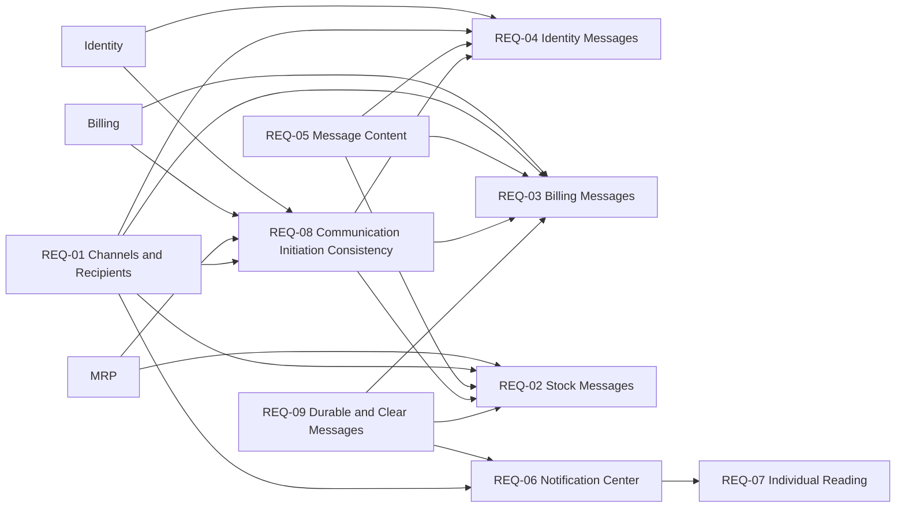

# Communication Product Requirements Document

## 1. Executive Summary

The Communication module centralizes important Scoops messages for ice cream parlor managers,
financially responsible users, invited or access-affected users, and users who follow operational
alerts. It reacts to relevant facts from Identity, Billing, and MRP, selects the defined recipients
and channels, and delivers Brazilian Portuguese email, in-product notifications, or both. Its core
value is timely, recipient-specific communication and a permanent in-product notification history
without moving the originating business rules into Communication.

## 2. Problem and Opportunity

Relevant events occur across Scoops modules, but users need a consistent way to learn what
happened, when it happened, who was affected, and whether they must act. Without centralized
communication, messages can vary by module, reach the wrong recipient or channel, or become hard
to consult after the event.

The opportunity is to coordinate email and in-product notifications as one product capability
while preserving Identity, Billing, and MRP as the authorities for the facts that trigger each
message. Restaurant and retail products already use inventory alerts and centralized
communications to reduce stockouts and support operational decisions, as illustrated by
[Consumer](https://consumer.com.br/reduzir-desperdicio-restaurante) and
[Saipos](https://saipos.com/sistema/sorveteria). Scoops differentiates through recipient-specific
messages from multiple modules and permanent history inside the product.

## 3. Target Audience

**Primary audience:** ice cream parlor Managers who need to follow business, access, billing, and
operational events.

**Secondary audiences:** users invited or affected by access changes, financial Managers and other
financially responsible users, and users who need to follow operational stock alerts.

**Non-audience:** no additional non-audience was formally defined for the MVP beyond the channels,
customization, monitoring, language, and email-format exclusions recorded in Out of Scope.

**Context, pains, and needs:** recipients may need to react to events that originate outside their
current screen or session. They need the relevant situation, deadline, affected party, and required
action to be clear, and they need in-product notifications to remain available for later
consultation.

**Jobs to Be Done:**

- When an access, billing, or stock event affects me or my responsibilities, I want to receive the
  appropriate message through the defined channel, so that I understand what happened and can act
  in time.
- When I need to revisit an operational message, I want to consult my notification history, so that
  I can recover its context without depending on the original moment of delivery.

## 4. Objectives and Success Metrics

### Objectives

- Deliver every defined mandatory communication to the appropriate recipients through email,
  in-product notification, or both.
- Give authenticated users a private, permanent, and navigable history of their in-product
  notifications.
- Keep message content clear, direct, recipient-appropriate, channel-appropriate, and written in
  Brazilian Portuguese for the MVP.
- Preserve consistency between an originating action and the initiation of its mandatory
  communication while allowing initiated delivery to continue without the user remaining on the
  screen.

### Success Metrics

- Mandatory communication initiation rate for relevant originating events.
- Successful email delivery and in-product notification availability rates, measured separately by
  channel and message type.
- Proportion of messages containing the required situation, time, affected party, deadline, and
  action information when each item applies.
- Proportion of in-product notifications that remain available to the intended authenticated user
  and preserve that user's individual read state.

Numeric targets for these metrics have not been approved in the existing product definition.

## 5. Requirements

### REQ-01 — Communication Channels and Recipients

- [ ] **Implemented**

**Outcome:** relevant Scoops messages reach the recipients defined by their context through email,
in-product notification, or both.

**Actors:** System.

**Provides:** supported communication channels and context-defined recipient selection for REQ-02,
REQ-03, REQ-04, REQ-06, and REQ-08.

#### Capabilities

- The module must support sending email and displaying in-product notifications.
- Each message type must use email, in-product notification, or both according to its definition.
- Each message type must identify recipients according to the context of the originating fact.
- The MVP must not use SMS, WhatsApp, or push notifications.

#### Experience

- A recipient must receive each message only through its defined channel or channels.
- Channel choice must not be exposed as a user preference in the MVP.

---

### REQ-02 — Stock Messages

- [ ] **Implemented**

**Outcome:** users responsible for operational stock follow-up receive enough information to
recognize low or depleted stock.

**Actors:** System.

**Consumes:** authoritative stock status and quantities from MRP; supported channels and recipient
selection from REQ-01; channel-appropriate content from REQ-05; mandatory initiation behavior from
REQ-08; durable and clear in-product messaging from REQ-09.

#### Capabilities

- A stock-below-ideal fact must generate an in-product notification identifying the product, its
  available quantity, and its ideal quantity.
- A zero-stock fact must generate an in-product notification identifying the product with no
  available quantity.
- MRP remains authoritative for stock status and quantities; Communication must not reproduce the
  rules that determine those facts.

#### Experience

- The recipient must be able to distinguish stock below ideal from zero stock from the notification
  content.
- The notification must provide the product and quantities required by the applicable stock state
  without requiring the recipient to infer which item triggered the alert.

---

### REQ-03 — Billing Messages

- [ ] **Implemented**

**Outcome:** Managers and financially responsible users receive the billing and subscription
information they need to understand the current situation, applicable deadline, and required action.

**Actors:** System.

**Consumes:** authoritative billing, subscription, tax-document, and commercial-access facts from
Billing; supported channels and recipient selection from REQ-01; channel-appropriate content from
REQ-05; mandatory initiation behavior from REQ-08; durable and clear in-product messaging from
REQ-09 when the defined channel includes an in-product notification.

#### Capabilities

- The module must send or display messages for trial end 7, 3, and 1 day in advance.
- The module must send or display messages for payment in processing, billing failure, the
  delinquency tolerance period, establishment blocking, subscription cancellation, and subscription
  reactivation.
- The module must send or display a price-adjustment message at least 30 days in advance.
- The module must send or display automatic-exclusion notices 30, 7, and 1 day in advance.
- The module must send or display billing receipts, NFS-e, billing communications for the financially
  responsible user, chargeback messages for Managers, and relevant fiscal and operational failure
  messages.
- Billing remains authoritative for the states, deadlines, documents, and recipients supplied by its
  business facts; Communication must not reproduce Billing rules.

#### Experience

- Each billing message must state the situation and applicable deadline.
- When action is required, the message must state what the recipient needs to do.
- Attached billing or tax documents must be available when the applicable email definition requires
  them.

---

### REQ-04 — Identity Messages

- [ ] **Implemented**

**Outcome:** invited users, access-affected users, and Managers receive email confirmation or
instructions for relevant identity and establishment-access events.

**Actors:** System.

**Consumes:** authoritative onboarding, email, invitation, password, access, user-status, and
establishment-exclusion facts from Identity; supported channels and recipient selection from REQ-01;
channel-appropriate content from REQ-05; mandatory initiation behavior from REQ-08.

#### Capabilities

- The module must send email for onboarding confirmation and confirmation after an email change.
- The module must send email for a user invitation, invitation resend, and password recovery.
- The module must send email for user promotion or demotion and user inactivation or reactivation.
- The module must send establishment-exclusion email to Managers.
- Identity remains authoritative for access, profile, status, invitation, and establishment facts;
  Communication must not reproduce Identity rules.

#### Experience

- The recipient must receive an email appropriate to the specific identity event and their role in
  it.
- Invitation and password-recovery messages must provide the information needed for the recipient to
  continue the applicable identity journey.

---

### REQ-05 — Channel-Appropriate Message Content

- [ ] **Implemented**

**Outcome:** every recipient receives content that is appropriate to the message channel, event, and
recipient.

**Actors:** System.

**Provides:** channel-appropriate Brazilian Portuguese message content for REQ-02, REQ-03, and
REQ-04.

#### Capabilities

- Every message must have content appropriate to its channel and recipient.
- An in-product notification must include an objective title, the necessary context, and its receipt
  date and time.
- An email must include a subject and HTML content.
- An email must include attached documents when the message definition requires them.
- MVP messages must be written in Brazilian Portuguese.

#### Experience

- Titles and subjects must make the message purpose identifiable.
- Message content must present the context needed by the recipient without exposing delivery-attempt
  or technical-failure monitoring details.

---

### REQ-06 — Notification Center

- [ ] **Implemented**

**Outcome:** an authenticated user can privately consult and navigate their complete in-product
notification history from the Header.

**Actors:** Manager, Operator.

**Consumes:** in-product notifications from REQ-01; durable notification history and clarity from
REQ-09.

**Provides:** authenticated notification visibility for REQ-07.

#### Capabilities

- The product must provide a notification center accessible through the Header.
- The center must display only notifications belonging to the authenticated user.
- The center must organize notifications by date and allow filtering by period.
- The center must load older notifications through a “See more” action.
- The center must preserve notification history without a retention limit.
- The center must not provide a separate read/unread filter.

#### Experience

- The Header dropdown must surface in-product notifications and provide access to the notification
  center.
- Notifications must appear in date organization appropriate for history consultation.
- The period filter and “See more” action must let the user narrow the history and progressively
  reveal older notifications.
- The center must display an empty state when the authenticated user has no notifications.

---

### REQ-07 — Individual Notification Reading

- [ ] **Implemented**

**Outcome:** each authenticated user's read state reflects only the notifications that have become
visible to that user.

**Actors:** Manager, Operator.

**Consumes:** authenticated notification visibility from REQ-06.

#### Capabilities

- A notification must be considered read when it is visible to the authenticated user.
- Read state must be individual to the user.
- Marking a notification as read for one user must not change its state for another user.

#### Experience

- The user must not need a separate action to mark a visible notification as read.
- Visibility of one user's notification must not create a read-state change that another user can
  observe on their own notification.

---

### REQ-08 — Communication Initiation Consistency

- [ ] **Implemented**

**Outcome:** an action that requires communication is completed only after its mandatory
communication has been initiated, while subsequent processing can continue independently of the
user's screen.

**Actors:** System.

**Consumes:** relevant business facts from Identity, Billing, or MRP and their defined communication
obligations; supported channels and recipient selection from REQ-01.

**Provides:** mandatory initiation behavior for REQ-02, REQ-03, and REQ-04.

#### Capabilities

- Every relevant event must generate the mandatory communication defined for that event.
- If the communication cannot be initiated, the action that originated it must not be completed.
- After initiation, communication processing must continue without requiring the user to remain on
  the screen.

#### Experience

- The originating interaction must not require the user to keep its screen open while an initiated
  communication is processed.
- The product must not expose an administrative shipping-status panel or communication attempts and
  technical failures to the user in the MVP.

---

### REQ-09 — Durable and Clear In-Product Messages

- [ ] **Implemented**

**Outcome:** users can revisit in-product messages and understand the event and any required action
from their content.

**Actors:** Manager, Operator.

**Provides:** durable notification history and clarity for REQ-02, REQ-03, and REQ-06.

#### Capabilities

- Messages displayed in the product must remain available for consultation without a retention
  limit.
- In-product message content must be clear, direct, and sufficient to identify what happened, when
  it happened, who was affected, and what must be done when action is applicable.

#### Experience

- A user revisiting a message must be able to recover its event context from the stored content.
- When no action is applicable, the message must remain sufficient to explain what happened and who
  was affected.

## 6. Product Dependency Graph

Each edge means the destination consumes the product capability or authoritative fact provided by
the source. It does not express implementation order.

## 7. User Journeys

### Journey A — Receive a Communication from a Relevant Event

1. A relevant Identity, Billing, or MRP event occurs.
2. The System identifies the recipients and channel or channels defined for that event.
3. The System attempts to initiate the mandatory communication:
   - Success: the originating action can complete, and communication processing continues without
     requiring the user to remain on the screen.
   - Failure: the originating action is not completed because its mandatory communication could not
     be initiated.
4. The recipient receives an email, an in-product notification, or both according to the message
   definition.
5. When the communication includes an in-product notification, it appears in the Header dropdown
   and remains available in the recipient's notification-center history.

### Journey B — Consult In-Product Notification History

1. The authenticated user opens the notification center from the Header.
2. The product displays only that user's notifications, organized by date:
   - Empty state: the product explains that the user has no notifications.
   - History state: the product presents the user's available notifications.
3. When a notification becomes visible, the product marks it as read only for that user.
4. The user may filter the history by period.
5. The user may select “See more” to load older notifications.
6. The user can revisit the stored content to understand what happened, when it happened, who was
   affected, and what action is required when applicable.

## 8. Out of Scope

- SMS, WhatsApp, and push notifications.
- A separate read/unread notification filter.
- A notification-history retention limit.
- User customization of message content.
- User choice of communication channels.
- An administrative panel for monitoring delivery status.
- User-visible delivery attempts or technical failures.
- Multiple message languages in the MVP.
- Plain-text email in the MVP.

### Discarded during definition

- **User-selected channels:** the product definition assigns channels by message type and context;
  user channel choice is excluded from the MVP.
- **Separate read/unread filtering:** the notification center uses period filtering and does not
  provide a separate read-state filter.
- **Finite notification retention:** in-product notification history must remain available without a
  retention limit.
- **Plain-text MVP email:** MVP email content uses HTML; plain-text email is excluded.
