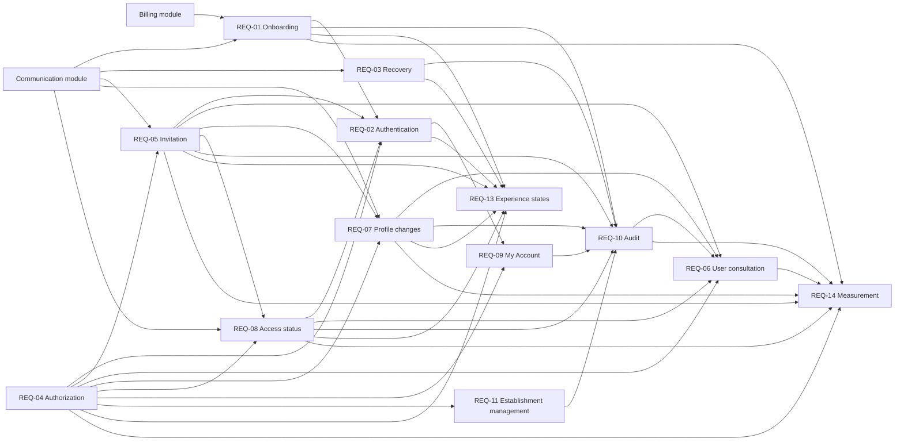

# Identity Product Requirements Document

## 1. Executive Summary

Identity enables an independent ice cream or açaí shop to create its Scoops
establishment, activate its first Manager, authenticate its team, and manage each
user's access lifecycle. Each user belongs to one establishment, and the MVP uses
only the fixed `Manager` and `Operator` profiles. Managers administer Scoops and the
team; Operators access only `New Sale` and `Orders`.

The module provides direct onboarding, predictable authorization, establishment
isolation, individual authorship, and access revocation without erasing identity or
history. It does not expose customer-initiated establishment deletion.

## 2. Problem and Opportunity

Small teams need to grant, change, and revoke access quickly without sharing
passwords or configuring granular permissions. Without centralized identity rules,
former team members may retain access, Operators may reach administrative functions,
and administrative actions may lose reliable authorship.

The opportunity is to give small establishments an access model that is easier to
understand than configurable role and permission systems: two fixed profiles,
individual credentials, explicit lifecycle safeguards, and an administrative audit.
This prioritizes predictable operation and immediate revocation over permission
granularity.

Public product materials illustrate the more configurable alternatives that informed
this positioning: [Saipos](https://saipos.com/sistema/sorveteria) documents individual
users, types, and permissions; [Toast](https://support.toasttab.com/en/article/Access-Permissions-Reference)
documents role-based permissions; and [Square](https://my.squareup.com/help/us/en/article/8357-require-passcodes-at-point-of-sale)
documents personal and shared point-of-sale codes. Source-based inference: Scoops can
differentiate for small teams by reducing configuration choices while preserving
individual attribution and reliable revocation.

## 3. Target Audience

### Primary audience

Managers of independent ice cream and açaí shops who need to create their
establishment, invite staff, and control administrative and operational access.

### Secondary audiences

- Operators who need individual Scoops access limited to authorized sales flows.
- New Managers who create an establishment and become its first Manager.

### Non-audience

- Users who need one account to belong to multiple establishments.
- Networks that require branch, franchise, or centralized multi-store hierarchy.
- Organizations that require custom profiles or individual permissions.
- Internal Scoops staff seeking impersonation or global establishment access.

### Context, pains, and needs

- First access to Scoops from a computer, tablet, mobile phone, or shared device.
- Entry, promotion, demotion, inactivation, or reactivation of team members.
- Immediate access revocation without deleting identity or historical authorship.
- Clear identification of who performed an administrative change and when.
- Protection against leaving an establishment without an active Manager.

### Jobs to Be Done

- When I start using Scoops, I want to create my establishment and confirm my
  account, so that I can take over administration safely.
- When a person joins the team, I want to invite them with the correct profile, so
  that they create their own password and access only what they need.
- When a person's role changes, I want to promote or demote them, so that access
  reflects their current responsibility.
- When a person leaves the team, I want to revoke access immediately, so that I
  protect the operation without erasing history.
- When an administrative change raises a question, I want to see who performed it
  and when, so that I can reconstruct what happened.

## 4. Objectives and Success Metrics

### Objectives

- Enable an establishment and its first Manager to begin using Scoops through one
  direct onboarding flow.
- Let Managers administer team access without granular permission configuration or
  shared credentials.
- Prevent cross-establishment access, incompatible profile actions, self-directed
  administrative changes, and loss of the final active Manager.
- Preserve immutable, attributable identity history while allowing immediate access
  revocation.

### Success metrics

- At least 90% of completed onboardings confirm the account within 24 hours.
- At least 90% of accepted invitations are completed without support intervention.
- A Manager familiar with the flow can register or change a user in less than two
  minutes.
- 100% of the defined administrative actions produce the corresponding audit record.
- No validation scenario permits cross-establishment access or an action incompatible
  with the actor's profile.
- The metrics are evaluated after launch to guide corrections and prioritization.

## 5. Requirements

### REQ-01 — Establishment Onboarding

- [x] **Implemented**

**Outcome:** A new customer can create an establishment and activate its first
Manager through a public, confirmed onboarding flow.

**Actors:** Prospective Manager

**Consumes:** Commercial onboarding and subscription lifecycle from the Billing
module; transactional confirmation delivery from the Communication module.

**Provides:** Pending and active establishment and first-Manager states consumed by
REQ-02, REQ-10, REQ-13, and REQ-14.

#### Capabilities

- The public flow must require the establishment name, Manager name, email, and
  password.
- The establishment name is mandatory and may be duplicated by another
  establishment.
- The first user must receive the `Manager` profile and must not access Scoops before
  confirming the account.
- Confirmation must activate the establishment and first Manager together. The
  verified confirmation session must become an authenticated local session and open
  the main Scoops page without a second login.
- Before activation, the Prospective Manager may return to the initial step and
  correct only the first Manager's email. The establishment and Manager names must
  remain populated, and saving the new email must require the registered password.
- A corrected email must be valid and available. Failure must preserve the previous
  address and pending onboarding; cancellation must return to pending confirmation
  without changing the registration.
- Saving a corrected email must invalidate the previous confirmation link and send a
  new link without restarting the original seven-day deadline.
- Unconfirmed onboarding must expire after seven days. Expiration must remove the
  pending establishment and corresponding Billing record and release the email for a
  new attempt.
- Public user creation must not exist outside a new-establishment onboarding or valid
  invitation.
- Billing may accompany onboarding, but Billing owns commercial subscription rules.

#### Experience

- Present a short form with clear progress and language for the person responsible
  for the establishment.
- After submission, identify the address used and explain that confirmation is still
  required. While confirmation is pending, block access to protected modules.
- In pending confirmation, expose `Go back and correct`. Editing must preserve the
  establishment and Manager names and focus the email field.
- After a successful correction, return to pending confirmation, display the updated
  address, and explain that a new message was sent.
- Valid confirmation must open the authenticated main page. Invalid, expired, or used
  links must guide the person to the valid next action.
- The complete flow must work from 320 px. Fields must have labels, instructions,
  visible focus, and errors announced by assistive technology.

---

### REQ-02 — Authentication and Session

- [x] **Implemented**

**Outcome:** Active Managers and Operators can enter Scoops with individual
credentials and remain authenticated only while their session is valid.

**Actors:** Manager, Operator

**Consumes:** Active establishment and first-Manager state from REQ-01; active invited
user state from REQ-05; fixed authorization facts from REQ-04; active or inactive user
state from REQ-08.

**Provides:** Current-session and session-expiration states consumed by REQ-09 and
REQ-13.

#### Capabilities

- The MVP must accept only email and password.
- Only active users of active establishments may enter Scoops.
- Authentication failures must not reveal whether an email is registered.
- Five consecutive failed attempts must block new attempts for 15 minutes.
- A session must expire after 30 minutes without interaction and require
  re-authentication after seven days even if continuously used.
- The same user may maintain sessions on multiple devices.
- `Exit this device` must terminate only the current session.
- When possible, unfinished work must be preserved for resumption after a new login.

#### Experience

- Present the Scoops brand, email and password fields, the primary entry action, and
  access to recovery.
- Distinguish loading, invalid credentials, temporary blocking, and expired session.
  Pending, inactive, or otherwise unavailable accounts must receive guidance without
  exposing internal data.
- The form must remain readable and operable on mobile phones, tablets, and computers
  and support keyboard use, screen readers, and password managers.

---

### REQ-03 — Password and Access Recovery

- [x] **Implemented**

**Outcome:** A user can create or reset their own password without a Manager viewing
or setting it.

**Actors:** Manager, Operator, Invited User

**Consumes:** Transactional recovery delivery from the Communication module.

**Provides:** Recovery request and password-change facts consumed by REQ-10, and link
states consumed by REQ-13.

#### Capabilities

- Passwords must contain between 8 and 64 characters.
- Managers must never view or set another user's password.
- Password changes must use the recovery flow sent to the registered email.
- A recovery link must be single-use and expire after one hour.
- A successful reset must terminate all of the user's sessions.
- Requests for registered and unregistered emails must produce the same response.
- An address may receive at most three authentication messages in 24 hours, and
  resubmissions must be at least two minutes apart.

#### Experience

- Request only the email when recovery begins and the new password after link
  validation.
- Confirm the request without revealing whether the account exists.
- Expired or used links must guide the user to request another link.
- The flow must avoid horizontal scrolling on small screens. Password requirements
  and errors must be textual and must not rely only on color.

---

### REQ-04 — Profiles and Authorization

- [x] **Implemented**

**Outcome:** Every protected area and action applies a predictable, fixed access model
within the user's own establishment.

**Actors:** Manager, Operator

**Provides:** Fixed profile, authorization, establishment-isolation, self-change, and
last-active-Manager facts consumed by REQ-02, REQ-05, REQ-06, REQ-07, REQ-08, REQ-09,
REQ-11, REQ-13, and REQ-14.

#### Capabilities

- The only profiles are `Manager` and `Operator`; profiles cannot be created, renamed,
  edited, duplicated, or deleted.
- Individual permission grants or removals must not exist.
- Managers have full access to all modules and configurations. Operators may access
  only `New Sale` and `Orders`.
- Direct addresses and shortcuts must not bypass authorization.
- Every user and action must remain isolated to the user's establishment.
- No user may promote or demote themselves, and no action may leave an establishment
  without at least one active Manager.

#### Experience

- Display the profile as a fixed user attribute without granular permission controls.
- Profile changes must present confirmation and their result.
- Hide profile-incompatible actions and explain relevant administrative blocks.
- Authorized navigation must remain accessible on narrow screens without covering
  content. Active states and restrictions must not rely only on color.

---

### REQ-05 — User Registration and Invitation

- [x] **Implemented**

**Outcome:** A Manager can invite a person to the same establishment with an approved
profile while the invited person retains control of their password.

**Actors:** Manager, Invited User

**Consumes:** Fixed profile and authorization facts from REQ-04; transactional
invitation delivery from the Communication module.

**Provides:** Pending and active invited-user lifecycle facts consumed by REQ-02,
REQ-06, REQ-07, REQ-08, REQ-10, REQ-13, and REQ-14.

#### Capabilities

- Only Managers may register users, and name, email, and profile are mandatory.
- An email, compared without case differences, may belong to only one Scoops account.
- An invited user must remain `Pending` until accepting the invitation and setting a
  password, then become `Active` with the invited profile.
- Invitations must expire after seven days. Resending must invalidate the previous
  link and restart the deadline.
- Before activation, a Manager may correct invitation data.
- A pending invitation may be cancelled and permanently removed, invalidating its
  link and releasing its email.
- A Manager may invite another Manager directly.

#### Experience

- Present name, email, and the two profile choices with a short explanation of each.
- Report sending, resending, activation, expiration, and cancellation states.
- When the establishment contains only its first Manager, invite the Manager to add
  the team.
- Duplicate email and temporary sending limits must explain the blocked action.
- Forms and confirmations must fit on small screens. Profile selection and messages
  must work with keyboard and screen readers.

---

### REQ-06 — User Listing and Consultation

- [ ] **Implemented**

**Outcome:** A Manager can locate manageable users and understand each user's profile,
status, recent activity, available actions, and administrative history.

**Actors:** Manager

**Consumes:** Authorization facts from REQ-04; user lifecycle facts from REQ-05,
REQ-07, and REQ-08; administrative history from REQ-10.

**Provides:** Team-management outcome facts consumed by REQ-14.

#### Capabilities

- Only Managers may consult team management.
- The listing must show name, email, profile, status, and last access and support
  search by name or email and filters by profile and status.
- The listing must distinguish `Pending`, `Active`, and `Inactive` users.
- Each manageable user must have a detail view with data, available actions, and
  administrative history.
- The authenticated user must not appear in the management list or be available
  through its detail route; personal data belongs in `My Account`.
- Results must never include users from another establishment.
- Total team, Manager, and Operator counts must cover all manageable users in the
  current establishment, exclude the authenticated Manager, and remain unchanged by
  search, filters, or pagination.

#### Experience

- Use a responsive table or list with contextual actions and explicit search, filter,
  and loading states.
- Distinguish an establishment with no additional team from search or filter results
  with no matches.
- Hide unavailable actions or explain why they are blocked.
- On narrow screens, prioritize name, profile, and status and move other information
  to the detail view. Filters, rows, and action menus must be keyboard navigable.

---

### REQ-07 — Promotion and Demotion

- [ ] **Implemented**

**Outcome:** A Manager can align another active user's fixed profile with their current
responsibility without losing historical authorship or the final active Manager.

**Actors:** Manager

**Consumes:** Fixed profile and last-active-Manager facts from REQ-04; active user facts
from REQ-05; notification delivery from the Communication module.

**Provides:** Profile-change facts consumed by REQ-06, REQ-10, REQ-13, and REQ-14.

#### Capabilities

- Only Managers may change another user's profile, and a user may not change their own
  profile.
- Promoting an Operator must immediately grant the full `Manager` profile.
- Demoting a Manager must immediately remove administrative access while preserving
  access to `New Sale` and `Orders`.
- Demotion must be blocked when it would leave the establishment without an active
  Manager.
- A profile change must not alter authorship of previous actions.
- The affected user must be notified of the change.

#### Experience

- Expose profile changes in user detail and describe the access to be gained or lost.
- Require confirmation and report success or failure.
- Explain self-change and final-Manager blocks.
- Confirmation must remain readable and actionable on small screens, and focus must
  return to the trigger after it closes.

---

### REQ-08 — Inactivation and Reactivation

- [x] **Implemented**

**Outcome:** A Manager can revoke or restore another user's access without deleting
their identity, profile, reserved email, or history.

**Actors:** Manager

**Consumes:** Authorization and last-active-Manager facts from REQ-04; user lifecycle
facts from REQ-05; notification delivery from the Communication module.

**Provides:** Active and inactive user states consumed by REQ-02, REQ-06, REQ-10,
REQ-13, and REQ-14.

#### Capabilities

- Inactivation must immediately terminate all of the user's sessions and prevent new
  logins.
- A user may not inactivate themselves, and the final active Manager may not be
  inactivated.
- Active users must be inactivated rather than individually deleted.
- An inactive user's email remains reserved.
- Reactivation must restore the same account with its current profile and must not let
  the Manager set a password.
- The user must be notified of inactivation and reactivation.

#### Experience

- Display status and its corresponding action in user detail.
- Inactivation confirmation must warn that open sessions will close and report
  success or failure without changing state on failure.
- Explain self-inactivation and final-Manager blocks.
- Actions must remain available without hover. Status must use explicit text in
  addition to color.

---

### REQ-09 — Personal Data and My Account

- [x] **Implemented**

**Outcome:** A Manager or Operator can inspect their identity, change their own name,
and end the current session without changing immutable access attributes.

**Actors:** Manager, Operator

**Consumes:** Current-session facts from REQ-02; fixed profile facts from REQ-04.

**Provides:** Name-change facts consumed by REQ-10.

#### Capabilities

- Any user may change their own name, and Managers may correct another user's name.
- Email cannot change after activation.
- Name changes must not rewrite names preserved in historical records.
- The profile must be read-only in `My Account`.
- The only session-ending action is `Exit this device`.
- Direct password change must not exist within an authenticated session; users must
  use email recovery.

#### Experience

- Display editable name, immutable email, read-only profile, and the current-device
  exit action.
- Name changes must expose saving, loading, success, and error states and preserve the
  previous value on failure.
- Immutable fields must explain why they cannot be changed.
- The page must work completely on mobile phones, and read-only fields must remain
  visually distinguishable and readable.

---

### REQ-10 — Administrative Audit

- [ ] **Implemented**

**Outcome:** Managers can reconstruct identity and access changes from an immutable,
establishment-scoped administrative history that excludes secrets.

**Actors:** Manager

**Consumes:** Onboarding facts from REQ-01; recovery facts from REQ-03; invitation and
activation facts from REQ-05; profile-change facts from REQ-07; inactivation and
reactivation facts from REQ-08; name-change facts from REQ-09; establishment-name facts
from REQ-11.

**Provides:** Administrative history consumed by REQ-06 and audit-completeness facts
consumed by REQ-14.

#### Capabilities

- The audit must cover registration, invitation resend, invitation cancellation,
  activation, promotion, demotion, inactivation, reactivation, recovery initiation,
  and user or establishment name changes.
- Each record must identify the action, affected user or establishment, responsible
  actor, and date and time; when applicable, it must preserve the previous and new
  values.
- Passwords, activation links, and recovery content must never appear in the audit.
- Records must not be individually edited or removed and must remain for the lifetime
  of the establishment.
- Only Managers may consult the audit.
- Dates must be displayed in São Paulo time.

#### Experience

- Display the user's administrative history as a chronological timeline with action,
  responsible actor, and moment.
- Report loading and query failure. When no change exists beyond creation, explain
  that only the initial record is available.
- Operators must not see audit entries or shortcuts.
- Events must reorganize on narrow screens without truncating the action, and their
  chronology and relationships must remain understandable outside the visual layout.

---

### REQ-11 — Establishment Management

- [ ] **Implemented**

**Outcome:** A Manager can inspect and change the name of their own establishment
without changing its identity, membership, data ownership, or historical snapshots.

**Actors:** Manager

**Consumes:** Manager authorization and establishment-isolation facts from REQ-04.

**Provides:** Establishment-name change facts consumed by REQ-10.

#### Capabilities

- The MVP establishment record contains only the establishment name.
- Any Manager may change the name, and the name may duplicate another establishment's
  name.
- A name change must not move users or data to another establishment.
- The change must preserve the previous name, new name, responsible actor, and moment
  for audit.
- Operators may not consult or change this configuration.

#### Experience

- Display the current name and a clear edit action with loading, success, and error
  feedback.
- The name has no empty state because onboarding requires it.
- Operators must not see `Ice Cream Parlor` in navigation.
- Editing and feedback must work on mobile phones and preserve labels, instructions,
  and visible focus.

---

### REQ-12 — Customer-Initiated Establishment Deletion Removed

- [ ] **Implemented**

**Outcome:** Customers cannot initiate establishment deletion through Identity, while
historical and policy-governed data lifecycles remain outside this product surface.

**Actors:** Manager, Operator

#### Capabilities

- Neither Managers nor Operators may initiate establishment deletion from the product.
- Identity must not expose a customer-facing deletion endpoint.
- Any future operational deletion or retention lifecycle belongs to applicable Billing
  and operational policies outside this Identity feature.
- Removing the customer-facing action must not authorize rewriting historical records
  or bypassing applicable fiscal retention requirements.

#### Experience

- Establishment settings and navigation must not display a deletion danger zone,
  deletion action, deletion dialog, password confirmation, name confirmation, or
  deletion-progress state.
- Direct attempts to call an unexposed deletion operation must not be accepted as a
  supported Identity workflow.

---

### REQ-13 — Navigation, States, and Quality of Experience

- [x] **Implemented**

**Outcome:** Managers and Operators can understand and recover from Identity states
through coherent, authorized, responsive, and accessible navigation and feedback.

**Actors:** Manager, Operator, Prospective Manager, Invited User

**Consumes:** Onboarding states from REQ-01; session states from REQ-02; recovery states
from REQ-03; authorization facts from REQ-04; invitation states from REQ-05; profile
change facts from REQ-07; active and inactive states from REQ-08.

#### Capabilities

- `Users` and `Ice Cream Parlor` are available only to Managers. `My Account` is
  available to Managers and Operators from the user menu.
- Identity must cover pending confirmation, pending invitation, expired link, used
  link, inactive account, access denied, communication failure, and expired session.
- Hidden navigation must not replace authorization of protected actions.
- Relevant actions must remain associated with the user who performed them.

#### Experience

- Follow the Scoops design system with Manrope, neutral surfaces, purple brand color,
  and Lucide icons.
- Every action awaiting a response must expose loading, success, and error states.
- Every empty list must explain the situation and offer the next valid action.
- Blocked-action messages must explain why and, when possible, how to recover.
- All flows must work from 320 px without mandatory horizontal scrolling.
- Meet WCAG 2.2 Level AA with sufficient contrast, visible focus, keyboard navigation,
  labels, announced messages, and appropriate touch targets.

---

### REQ-14 — Outcome Measurement

- [ ] **Implemented**

**Outcome:** Identity performance can be evaluated against the approved activation,
administrative-autonomy, audit, and authorization success metrics.

**Actors:** System

**Consumes:** Onboarding outcome facts from REQ-01; authorization facts from REQ-04;
invitation outcome facts from REQ-05; team-management outcome facts from REQ-06;
profile-change facts from REQ-07; access-status facts from REQ-08; audit-completeness
facts from REQ-10.

#### Capabilities

- Measurement must support every metric defined in Objectives and Success Metrics.
- Required measurement events must not add steps to a user's flow.
- Failures that prevent completion must be distinguishable from voluntary abandonment.
- Metrics must be evaluated after launch to guide corrections and prioritization.

## 6. Product Dependency Graph

An edge points from the provider of a product capability or authoritative fact to the
requirement that consumes it.

## 7. User Journeys

### Journey A — Create an establishment and first Manager

1. The Prospective Manager starts public onboarding.
2. The system requests the establishment name, Manager name, email, and password.
3. The Prospective Manager submits the registration.
4. The system keeps the establishment and Billing record pending and requests
   confirmation.
5. From pending confirmation, the Prospective Manager may select `Go back and
   correct`:
   - The system returns to the initial step in edit mode, preserves both names, and
     focuses the email.
   - The Prospective Manager changes the email, re-enters the password, and saves.
   - Success: the system invalidates the previous link, sends another confirmation,
     returns to pending confirmation, and preserves the original seven-day deadline.
   - Invalid or unavailable email: the system preserves the previous address and
     explains the required correction.
   - Cancellation: the system returns to pending confirmation without changing the
     registration.
6. The Prospective Manager opens the confirmation link:
   - Success: the establishment and first Manager become active, and the verified
     session opens the authenticated Scoops main page without another login.
   - Invalid, used, or expired link: the system guides confirmation resend, new
     registration, or login when the account is already active.

### Journey B — Enter Scoops

1. The Manager or Operator enters email and password.
2. The system validates credentials, account and establishment state, authorization,
   and previous attempts.
3. The system resolves the attempt:
   - Success: it opens the first authorized area for the profile.
   - Invalid credentials: it presents a neutral message and preserves the email.
   - Temporary blocking: it explains when another attempt is allowed.
   - Pending or inactive account: it guides the user without revealing internal data.
4. After inactivity or maximum session duration, the system requests a new login and,
   when possible, preserves unfinished work for resumption.

### Journey C — Regain access

1. The user selects `I forgot my password` and enters an email.
2. The system presents the same confirmation whether or not the account exists.
3. The user opens a valid link and enters a new password.
4. The system validates the link and password:
   - Success: it changes the password and closes all previous sessions.
   - Expired or used link: it guides the user to request another link.
5. The user logs in again.

### Journey D — Invite a user

1. A Manager opens `Users`, selects `Invite user`, and provides name, email, and
   profile.
2. The system validates required fields and global email uniqueness.
3. The Manager confirms sending.
4. The invited user appears as `Pending` and opens the invitation to set a password:
   - Success: the user becomes `Active` with the invited profile.
   - Expired link: the Manager may resend a new invitation, invalidating the old link.

### Journey E — Cancel a pending invitation

1. The Manager opens a `Pending` user and selects `Cancel invitation`.
2. The system explains that the link will become invalid and the pending registration
   will be removed.
3. The Manager confirms:
   - Success: the invitation is invalidated, the registration removed, and the email
     released.
   - Failure: the registration remains pending.

### Journey F — Promote an Operator

1. The Manager opens an active Operator and selects `Promote to Manager`.
2. The system lists the access that will be granted.
3. The Manager confirms.
4. The user receives full Manager access, an audit record is created, and the user is
   notified.

### Journey G — Demote a Manager

1. The Manager opens another active Manager and selects `Demote to Operator`.
2. The system validates the final-active-Manager rule:
   - Another active Manager exists: the action may continue.
   - Demotion would leave no active Manager: the system blocks and explains the rule.
3. The Manager confirms.
4. The affected user retains only `New Sale` and `Orders`, an audit record is created,
   and the user is notified.

### Journey H — Inactivate a user

1. The Manager opens another active user and selects `Inactivate`.
2. The system validates self-inactivation and final-active-Manager protection and warns
   that existing sessions will close.
3. The Manager confirms:
   - Success: the user becomes `Inactive`, loses access, and is notified.
   - Failure: no state changes.

### Journey I — Reactivate a user

1. The Manager filters for inactive users, opens the desired account, and selects
   `Reactivate`.
2. The system displays and preserves the current profile.
3. The Manager confirms.
4. The user becomes active with the same profile and receives a notification.

### Journey J — Consult administrative history

1. The Manager opens a user's detail.
2. The system displays the administrative timeline.
3. The Manager identifies each action, responsible actor, moment, and applicable value
   changes.
4. If no event exists beyond creation, the system explains that only the initial
   registration is available.

### Journey K — Change the establishment name

1. The Manager opens `Ice Cream Parlor`, changes the name, and confirms.
2. The system validates that the name is not empty.
3. The system saves the change and records the previous name, new name, responsible
   Manager, and moment.
4. The new name appears in future product surfaces without rewriting history.

### Journey L — Change your own name and exit

1. The Manager or Operator opens `My Account` and changes their name:
   - Success: the new name appears in future uses without rewriting historical names.
   - Failure: the previous value is preserved.
2. When desired, the user selects `Exit this device`.
3. Only the current session closes, and the user returns to login.

## 8. Out of Scope

- Multiple establishments linked to one account.
- Group, branch, or franchise hierarchy.
- Profiles beyond `Manager` and `Operator`.
- Custom profiles and individual permissions.
- Personal or shared codes for quick point-of-sale access.
- Two-factor authentication.
- Social, corporate, or passwordless login.
- Email changes after activation.
- Direct password change within `My Account`.
- A manual action to terminate all sessions.
- Individual deletion of users with history.
- Establishment information beyond its name.
- Super administrator, impersonation, or global establishment access.
- Customer-initiated establishment deletion.
- The operational deletion and retention lifecycle, including a future automatic
  deletion policy.
- Data export before deletion.
- Stock, sales, printing, or menu settings within Identity.

### Discarded during definition

- **Custom profiles:** discarded in favor of only `Manager` and `Operator`, reducing
  configuration and unexpected combinations.
- **Individual permissions:** replaced by fixed permission sets for each profile.
- **Point-of-sale PIN:** discarded; access uses email and password.
- **Multiple establishments per user:** discarded to preserve a single establishment
  relationship in the MVP.
- **Additional institutional data:** corporate name, documents, contacts, and address
  were considered and removed; the establishment contains only a name.
- **Authenticated password change:** replaced exclusively by email recovery.
- **Single session:** discarded; multiple devices may remain active.
- **Manual termination of all sessions:** discarded; the interface offers only
  `Exit this device`.
- **Customer-initiated deletion:** removed from the product; Identity settings expose
  no deletion action or confirmation flow.
- **Super Administrator:** discarded to prevent global establishment access.
