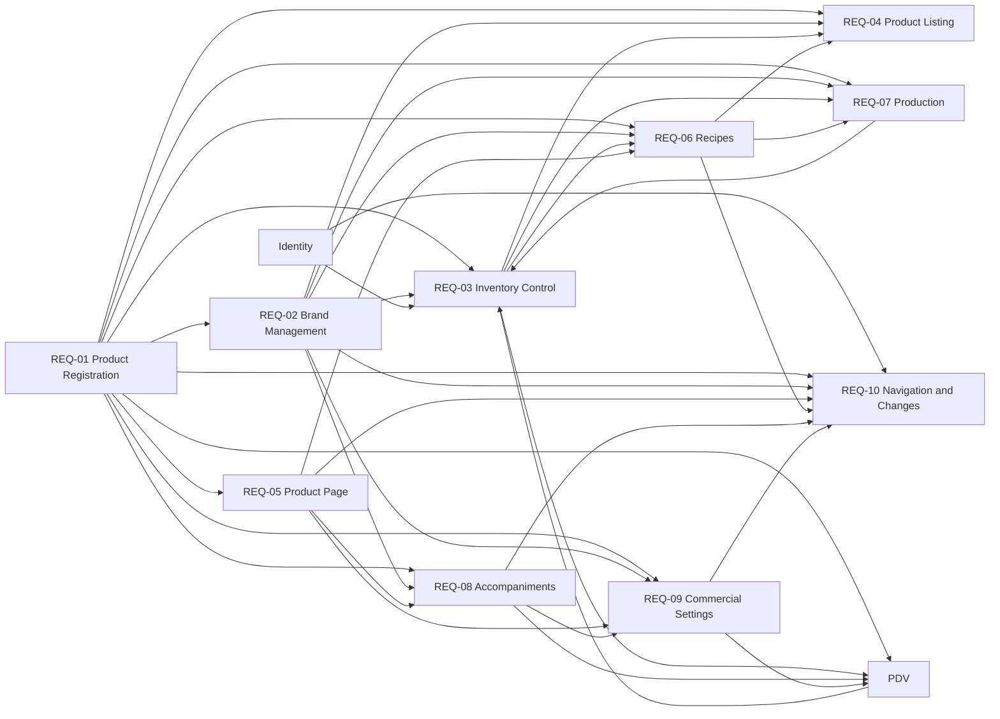

# MRP Product Requirements Document

## 1. Executive Summary

MRP, presented as Scoops Stock, is the operational module for products, categories, brands,
inventory, recipes, production, and accompaniments. It gives Managers a unified view of the
`product → brand → recipe → production → stock` cycle so they can identify constraints before
production, understand current recipe cost, maintain reliable balances, and expose products and
availability to PDV without transferring ownership of MRP rules.

Products, brands, recipes, productions, balances, and stock transactions are isolated by
establishment. Product-dependent quantities inherit the product stock unit; the current approved
experience presents weight quantities in grams.

## 2. Problem and Opportunity

Without an integrated product, recipe, and stock view, ingredient shortages are often discovered
only when production begins. Managers cannot reliably predict how much can be produced, which
ingredient limits output, or the current operating cost of a recipe. Fragmented brand, packaging,
and balance controls also make automatic stock consumption difficult to explain.

The opportunity is to make MRP the authoritative operational source for catalog, stock, recipes,
production, and accompaniments. By recalculating cost and capacity from current product and brand
facts, preserving an immutable movement history, and applying production stock changes atomically,
Scoops can surface constraints before they cause delays or lost sales and provide PDV with stable
product and availability boundaries.

## 3. Target Audience

### Primary audience

- **Manager:** manages products, categories, brands, balances, recipes, production,
  accompaniments, and product-dependent commercial configuration for one establishment.

### Secondary audience

- **Authorized operational user:** consults products, balances, statuses, and stock-movement
  history within the access granted by Identity.
- **Operator:** may use MRP information exposed to permitted operational surfaces, but cannot
  read, preview, or register production in this version.

### Non-audience

- Establishment customers and sales operators performing cart, order, payment, or reconciliation
  work; those experiences belong to PDV.
- Users managing authentication, profiles, plans, subscriptions, financial reporting, or BI;
  those outcomes belong to their owning modules.

### Context, pains, needs, and Jobs to Be Done

- When planning production, I want to see recipe cost, available stock, and the limiting
  ingredient, so that I can decide how much can be produced before work begins.
- When stock changes, I want balances and movement history to remain consistent and attributable,
  so that I can explain the operation later.
- When configuring a product, I want categories, brands, recipes, accompaniments, and commercial
  settings to respect their dependencies, so that the product remains valid for production and
  sale.
- When recording production, I want ingredient consumption and finished-product input to commit
  together, so that a partial failure cannot corrupt inventory.

## 4. Objectives and Success Metrics

- Give Managers pre-production visibility into current recipe cost, producible capacity, and the
  ingredient or brand that limits production.
- Keep product and brand balances synchronized with every committed manual stock transaction and
  production operation.
- Preserve establishment isolation across catalog, inventory, recipes, production, and history.
- Provide PDV with current product, availability, accompaniment, and commercial-configuration
  facts while keeping sales rules in PDV.

Success is measured by:

- every committed manual stock change having one immutable transaction record created atomically
  with its balance change;
- every confirmed production either applying all ingredient write-offs and finished-product input
  or applying none of them;
- no catalog, balance, recipe, production, or transaction fact from another establishment being
  visible or usable;
- every recipe view being able to identify current COGS, maximum producible quantity, and the
  limiting ingredient when ingredients are configured;
- every salable Portion having at least one active size, and products without an active commercial
  configuration remaining unavailable to PDV.

## 5. Requirements

### REQ-01 — Product Registration and Categories

- [ ] **Implemented**

**Outcome:** Managers can register an establishment-scoped product with valid categories, unit,
stock control, status, and optional operational settings that determine its later MRP behavior.

**Actors:** Manager

**Provides:** Establishment product catalog, category assignments, product stock unit, stock
control, status, ideal-stock target, negative-stock policy, and current single-stock ingredient
unit cost for REQ-02, REQ-03, REQ-04, REQ-05, REQ-06, REQ-07, REQ-08, REQ-09, REQ-10, and PDV.

#### Capabilities

- A product name is mandatory and unique within its establishment.
- A product owns its stock unit for product-dependent operations. Brands copy that unit when they
  are created, but each brand stores and may configure its own unit independently. Changing the
  product unit never rewrites an existing brand's unit. The model supports `g`, `ml`, `kg`, `l`,
  and `un`; current approved examples and weight experiences use grams.
- Stock control is either `Single stock` or `By brand`; new products default to `Single stock`.
  The selected mode cannot be changed after registration.
- Supported categories are `Ingredient`, `Manufacturable`, `Portion`, `Accompaniment`, and
  `Resale`. `Portion` and `Resale` are mutually exclusive.
- `Manufacturable` enables recipe and production but does not make a product salable by itself.
  `Manufacturable + Portion` is allowed, and a Manufacturable without Portion may be produced
  without appearing in PDV.
- A Portion represents fractional sale of bulk stock and requires at least one active size to
  appear in PDV. An Accompaniment can be linked to a Portion. A Resale represents sale of an
  entire package. `Accompaniment + Portion` and `Accompaniment + Resale` are allowed.
- An inactive product remains registered but is unavailable to new operations.
- Ideal stock is optional and enables Normal or Low stock classification.
- Internal notes are free text visible only to users authorized by Identity.
- A Single-stock Ingredient may hold a current acquisition cost per base unit. It is optional at
  registration but must exist before the product can be added to a recipe.
- A Manager may define or replace that cost during registration, in product settings, or during
  a positive stock entry. The latest explicit value applies to future recipe and production
  calculations without rewriting historical transactions or productions, and must be at least
  zero. Weighted-average costing is not used in this version.
- Products disallow negative stock by default. A Manager may enable `Allow negative stock`, after
  which an initial balance or a write-off may take that product below zero.
- Products and their facts cannot be displayed or used across establishments.

#### Experience

- The registration modal contains Name, Unit, Categories, and Stock Control; for a Single-stock
  Ingredient, it may also capture current unit cost.
- Categories appear as selectable cards with checkboxes and dependency guidance. Selecting
  Portion disables Resale with an explanation, and selecting Resale disables Portion.
- When Manufacturable requires Single stock under the current operating model, selecting it locks
  that control with an explanation.
- Validation appears beside the corresponding field. Successful registration creates an active
  product with zero balance and opens its dedicated page.
- Weight-product quantities are displayed in grams without visually switching between grams and
  kilograms.

---

### REQ-02 — Brand Management and Main Brand

- [ ] **Implemented**

**Outcome:** Managers can maintain product-specific brands, packaging economics, brand balances,
and exactly one main brand for future automatic write-offs.

**Actors:** Manager

**Consumes:** Product stock control and the product unit default from REQ-01.

**Provides:** Brand balances, packaging conversion, current unit price, and main-brand selection
for REQ-03, REQ-06, REQ-07, REQ-08, REQ-09, and REQ-10.

#### Capabilities

- Brands exist only for products controlled `By brand` and are not shared between products.
- A brand has Name, Unit, Package quantity, Value per package, and Current stock. Its unit is
  initialized from the parent product when the brand is created, then persists independently.
  Later product-unit changes never rewrite an existing brand unit.
- Package quantity is greater than zero and is expressed in the brand's configured unit. Stock is
  stored in the product stock unit; package entry uses only canonical compatible conversions and
  rejects an incompatible product/brand-unit pair because no user-entered conversion factor is
  supported.
- Managers may enter stock by package or directly by base unit. Unit price equals package value
  divided by package quantity.
- While brands exist, the product has one main brand for automatic write-offs without explicit
  selection. The first brand becomes main automatically, and changing the main brand affects only
  future operations.
- A main brand cannot be deleted while another brand exists until a replacement is selected. The
  final brand may be deleted after warning, leaving the product unavailable until a new main brand
  is added.
- Brand names are unique within the product.
- Deletion requires confirmation and discloses recipes, links, and configurations removed with
  the brand.
- Changes to a main brand's value recalculate COGS for dependent recipes.

#### Experience

- The brand table displays Brand, Packaging, Value per package, Unit price, Stock, and Movements.
- The main brand has a `Main` chip. Each row provides a main-brand switch and actions to edit,
  select as main, or delete.
- Deletion identifies the brand and known impacts. An empty state offers `Add first brand`.
- The stock-entry modal switches between Packaging and Base Unit and previews package input as
  the converted total in grams for the approved weight experience.

---

### REQ-03 — Inventory Control and Stock History

- [ ] **Implemented**

**Outcome:** Authorized users can understand current stock and its attributable history, while
Managers can apply valid entries and write-offs without leaving balances and transactions
inconsistent.

**Actors:** Manager, Operator

**Consumes:** Product stock control, unit, ideal-stock target, negative-stock policy, and current
single-stock cost from REQ-01; brand balances and main-brand facts from REQ-02; responsible-user
identity and establishment authorization from Identity; production stock changes from REQ-07;
sales-consumption facts from PDV.

**Provides:** Current product and brand balances, stock status, and immutable stock-transaction
history for REQ-04, REQ-06, REQ-07, and PDV.

#### Capabilities

- A Single-stock balance belongs to the product; a By-brand total is the sum of brand balances.
- Entry adds a positive quantity and Write-off removes a positive quantity from the selected
  product or brand. Every manual adjustment is classified as one of those operations.
- Quantity is mandatory, greater than zero, and expressed in the product base unit.
- A positive entry for a Single-stock Ingredient may define the current unit cost from that
  operation onward. A cost change recalculates dependent recipe COGS without rewriting history.
- A write-off cannot produce a negative balance unless `Allow negative stock` is enabled for the
  product.
- Production adds Manufacturable stock after ingredient write-off. PDV owns product,
  accompaniment, and Resale consumption caused by sales.
- Production and other automatic write-offs without explicit brand selection use the main brand.
- Entries and write-offs recalculate total stock, stock status, recipe cost, production status,
  and capacity where applicable.
- Every committed manual stock change creates an immutable stock-transaction record in the same
  database transaction as the balance change. This version records manual `Entry` and manual
  `Write-off`; production and PDV own their respective transaction records when implemented.
- Positive initial stock registered with a product or brand creates an Entry; zero creates no
  transaction.
- A transaction retains product, optional brand, unit, quantity, resulting balance,
  responsible-user identity, captured display labels, and occurrence time. Product, brand, and
  author labels are snapshots and are not rewritten by later changes or deletion.
- Stock-transaction persistence is local and does not require a domain event, broker message, or
  outbox entry.
- Transactions are isolated by establishment and require the same authorization as their product.

#### Experience

- The Stock tab displays Current stock, Ideal stock, and Situation. Situation is Normal when
  balance is at least ideal stock, Low when below it, and Normal without target comparison when no
  ideal stock exists. Zero is shown as a valid balance.
- Entry and Write-off actions remain near the relevant balance. A Single-stock Ingredient entry
  may capture current unit cost with its base-unit suffix.
- A write-off above the permitted balance blocks confirmation and reports available and requested
  quantities.
- History is newest first, paginated, and filterable by type, brand, and date period. Each row
  identifies the captured author name and initials.
- Author-avatar colors are selected deterministically from the normalized captured name, use an
  accessible semantic color pair, and never replace the visible name.
- Loading, empty, no-filter-results, and error/retry states are distinct and do not hide current
  balance.

---

### REQ-04 — Product Listing

- [ ] **Implemented**

**Outcome:** Authorized users can find, compare, and open products using establishment-wide
operational context and predictable filters, sorting, and pagination.

**Actors:** Manager, Operator

**Consumes:** Product catalog and classification from REQ-01; brand totals from REQ-02; current
balances and stock status from REQ-03; production capacity from REQ-06.

#### Capabilities

- Products can be filtered by category, stock status, and product status and searched by name.
- Different filter groups combine with AND; multiple selected categories combine with OR.
- Sorting supports Name, Stock quantity, Number of brands, Categories, and Unit.
- The product list is paginated.
- Operational cards may show Products, Brands, Low Stock, and Products with limited production.
  Their establishment-wide totals do not change with search, filters, sorting, or pagination.
- Low Stock is based on comparison with ideal stock.
- Stock value is not an MRP KPI and belongs to a financial view of costs, profits, and movements.
- Empty results distinguish an establishment with no products from filters with no matches.

#### Experience

- The table occupies the available space below the filters. Filters remain in the approved layout
  position without competing horizontally with the table.
- Columns show Name, Stock quantity, Number of brands, Categories, Unit, and necessary actions.
- A Low row may use an alert background, red indicator, and explanatory text without relying on
  color alone.
- Search has an icon and contextual placeholder. `Clear filters` removes every active filter.
- No products presents `Register first product`; no filtered matches presents `No products found`
  and `Clear filters`.

---

### REQ-05 — Dedicated Product Page and Settings

- [ ] **Implemented**

**Outcome:** Managers can inspect and maintain each product through one category-aware page while
understanding the impact of category, unit, and deletion changes.

**Actors:** Manager

**Consumes:** Product catalog, categories, unit, status, and stock-control facts from REQ-01.

**Provides:** Product-page context and recoverable settings-change state for REQ-06, REQ-08,
REQ-09, and REQ-10.

#### Capabilities

- Stock and Settings tabs are always available. Recipe is available for Manufacturable,
  Accompaniments for Portion, Prices—Sizes for Portion, and Prices—Resale for Resale.
- PDV consumes size and Resale commercial facts without transferring sales-rule ownership to MRP.
- A category in use cannot be removed until its dependencies are resolved.
- Unit changes affect product-owned balances, ideal stock, costs, recipes, sizes, consumption,
  and product-dependent operations and require impact review before confirmation. Existing brand
  units and brand package quantities are not rewritten.
- Every confirmed unit change updates the product unit and causes product-owned quantities and
  costs to adopt the new unit while preserving their existing numeric values exactly. No
  multiplication, division, rounding, density assumption, or conversion factor is applied.
- Unit changes are not blocked because the source and target units belong to different dimensions;
  the product's numeric facts remain unchanged and simply inherit the selected unit.
- Unit relabeling updates only current configuration and balances used by future operations.
  Historical stock transactions, productions, orders, and other retained audit facts keep their
  captured unit, quantity, cost, and labels unchanged.
- Product deletion removes the product and its removable dependent brands, recipe, sizes, links,
  and sales settings after warning and confirmation. Other products remain intact; links to the
  deleted product are removed.

#### Experience

- The header displays Name, Unit, Status, category chips, and stock-control context. The breadcrumb
  is `Stock > Products > [Product name]`, and only category-enabled tabs appear.
- Settings contains Basic Information, read-only Stock Control with editable negative-stock
  policy, Categories, Internal Notes, and Danger Zone. Product removal is available from the
  Danger Zone rather than from the header.
- Unit-change and deletion dialogs explain affected records before confirmation.
- Simple fields may save on blur according to the module design standard.

---

### REQ-06 — Manufacturable Product Recipes

- [ ] **Implemented**

**Outcome:** Managers can define one recipe for a Manufacturable product and see its current cost,
stock constraints, and maximum producible quantity before recording production.

**Actors:** Manager

**Consumes:** Product categories, units, and single-stock ingredient costs from REQ-01; main-brand
and brand-price facts from REQ-02; current balances from REQ-03; product-page context from REQ-05.

**Provides:** Persisted recipe, reference yield, current COGS, unit cost, ingredient projections,
and maximum producible quantity for REQ-04, REQ-07, and REQ-10.

#### Capabilities

- Each Manufacturable has at most one recipe in this version. Its reference yield is a positive
  quantity in the Manufacturable product unit.
- A Manufacturable begins without a persisted recipe. Explicitly saving a positive reference
  yield creates the empty recipe; merely opening Recipe writes no data.
- Ingredients cannot be added until the yield is saved. Removing the last ingredient retains the
  recipe and yield.
- Only Ingredient products are eligible recipe lines; an Accompaniment is not a recipe ingredient.
- Each line stores ingredient product, positive quantity, and the ingredient's inherited unit.
  Duplicate ingredient combinations are not allowed.
- A By-brand ingredient uses the main brand in force at production time, and the recipe identifies
  that brand. Production is blocked when no main brand exists.
- Ingredient cost uses current unit price. A Single-stock Ingredient uses its current product unit
  cost and cannot be added while that cost is undefined.
- Total COGS is the sum of line costs for the reference yield. Manufacturable unit cost is
  `Total COGS ÷ Reference Yield`.
- Maximum producible quantity is the lowest ingredient-derived limit.
- Recipe, main-brand, price, cost, or stock changes recalculate COGS and production capacity.
- Removing an ingredient removes only that recipe line.

#### Experience

- The header keeps the editable positive reference yield and Produce action visible.
- The table displays Ingredient, Source/Brand, Quantity, Cost, percentage of COGS, Stock, and
  Movements. Weight quantities and projections use grams in the approved experience.
- A By-brand source shows the main-brand chip. Sufficient stock shows balance and estimated
  capacity; the limiting ingredient is highlighted with an alert icon and background.
- An insufficient line reports needed, available, and missing quantities inline.
- `Add ingredient` opens or inserts line configuration. Deletion requires confirmation and
  explains that COGS and capacity will be recalculated.
- The empty state keeps yield controls visible, guides the Manager to save a positive yield and
  add the first ingredient, and disables ingredient creation until the yield persists.

---

### REQ-07 — Production Record

- [ ] **Implemented**

**Outcome:** Managers can record a Manufacturable production quantity with projected ingredient
consumption and atomic stock updates, while invalid or failed production leaves stock unchanged.

**Actors:** Manager

**Consumes:** Product units and negative-stock policies from REQ-01; main-brand selection from
REQ-02; current balances from REQ-03; recipe, yield, COGS, and ingredient requirements from REQ-06.

**Provides:** Atomic ingredient write-offs, finished-product input, and retained production facts
for REQ-03.

#### Capabilities

- Produce is available to a Manager from the recipe or Manufacturable product. Operators cannot
  read, preview, or register production in this version.
- Production can be entered by Batch or Quantity. One batch equals the recipe reference yield;
  quantity uses the product unit, with grams in the approved weight experience.
- Changing batches updates quantity, and changing quantity updates batches when an equivalence
  exists.
- Ingredient consumption is
  `ingredient quantity × (produced quantity ÷ reference yield)`.
- The projection calculates Consumption, Current stock, and After-production stock for each main
  ingredient or brand.
- Insufficient stock blocks confirmation unless the affected ingredient product allows negative
  stock. Consumption applies to the product or main brand according to stock control.
- Produced quantity is added to the Manufacturable balance. Accompaniments are not consumed by
  production.
- Production cost may be calculated from COGS multiplied by batch count; stock value and profit
  remain outside MRP.
- Ingredient write-offs and finished-product input commit in one transaction. Any failure leaves
  all balances unchanged.

#### Experience

- The production modal displays Product, Yield, and a Batch/Quantity switch, with mode and input
  side by side when space allows.
- Batch mode previews the equivalent quantity, such as `Equivalent to 2,000 g`; Quantity mode uses
  the product-unit suffix. Optional shortcuts may include `1 batch`, `2 batches`, and `Maximum`.
- The projection table displays Ingredient/Brand, Consumption, Current, and After.
- An insufficient line is visually distinct and shows needed, available, and missing quantities.
  `Confirm production` is disabled when the applicable negative-stock policy does not permit the
  projected result.
- Success closes the modal, refreshes balances, and confirms production. Failure preserves context,
  states that no changes were applied, and allows retry.

---

### REQ-08 — Accompaniments and Accompaniment Types

- [ ] **Implemented**

**Outcome:** Managers can maintain establishment-scoped accompaniment types and link eligible
Accompaniment products to Portions with the quantity and brand context needed for sale.

**Actors:** Manager

**Consumes:** Product categories and units from REQ-01; main-brand facts from REQ-02; product-page
context from REQ-05.

**Provides:** Accompaniment types, Portion-accompaniment links, per-portion consumption, and brand
context for REQ-09, REQ-10, and PDV.

#### Capabilities

- A Portion may have zero or more accompaniments, and an Accompaniment may link to multiple
  Portions. Only products in the Accompaniment category are eligible.
- Each link has a contextual type, such as Coverage, Extra, or Free; the same Accompaniment may
  have different types for different Portions.
- Accompaniment types are managed on a dedicated MRP page and are available only within the same
  establishment. Managers can list, create, and rename types.
- An unused type may be removed. A type in use remains protected until its links are resolved;
  renaming updates its existing links.
- Quantity per portion defines consumption for each unit sold.
- Price is specific to product + size + accompaniment and belongs to the PDV commercial flow.
- When accompaniment stock is By brand, consumption uses its current main brand.
- Removing a link does not change current balances and requires confirmation.

#### Experience

- The link table displays Accompaniment, Type, Brand, Quantity per portion, and Actions.
  `Link accompaniment` opens a modal for Accompaniment, Type, Quantity per portion, applicable
  Brand, and cost preview.
- The current main brand is visible. Price may be displayed by size while remaining consistent
  with the PDV PRD.
- The type selector offers `Manage types`, which opens the dedicated `Accompaniment types` page.
- The types page displays registered types, usage status, and removal only for unused types, with
  `New type` opening creation. Pagination shows visible range, total count, previous, next, and
  numbered-page controls when records exceed one page.
- Editing opens a modal prefilled with the current name. Successful save renames the type across
  links; invalid or duplicate names retain entered context and show validation without closing.
- Creation includes the type name, supporting guidance, `Cancel`, and `Add type`. Success closes
  and refreshes; validation failure preserves entered context.
- `Accompaniment types` is a Manager-only direct page but not a global sidebar destination. The
  Products page links to it contextually, and the link modal retains `Manage types`.
- A shared outlined, accessible `Voltar` link with a left-arrow icon is used on Type and Product
  Details pages. From Types it returns to the previously visited canonical URL state; direct entry
  falls back to Products.
- Unused-type removal uses readable destructive red outline/text styling; in-use removal is
  disabled with readable neutral styling.
- No component requires a Portion to have an accompaniment.

---

### REQ-09 — Integrated Commercial Settings

- [ ] **Implemented**

**Outcome:** Managers can maintain the Portion and Resale settings that determine future PDV
availability without duplicating cart, sale, or historical-order rules in MRP.

**Actors:** Manager

**Consumes:** Product categories, units, and status from REQ-01; brand facts from REQ-02;
product-page context from REQ-05; accompaniment links from REQ-08.

**Provides:** Active Portion sizes, Resale packaging and brand availability, and
product-size-accompaniment prices for REQ-10 and PDV.

#### Capabilities

- Each Portion size has a Name, quantity in the product stock unit, sale price, and status. Every
  salable Portion has at least one active size.
- Resale configuration has sale price and availability. A Single-stock Resale sells and writes
  off one product stock unit per sale. A By-brand Resale defines price and availability per
  existing brand while inheriting that brand's packaging quantity as read-only commercial
  context; it has no unbranded fallback configuration.
- Accompaniment price is specific to product + size + accompaniment.
- Configuration changes affect future PDV behavior and do not rewrite previous orders.
- A size name is trimmed, mandatory, and unique within its product without case sensitivity.
  Quantity is positive with at most three decimal places, and sale price is non-negative with at
  most two decimal places. New sizes are active by default.
- A Manager can edit a size's name, quantity, sale price, and active status from the pricing table.
  Invalid values are rejected, and the final active size cannot be deactivated.
- Size removal requires confirmation. Removing the final active size is allowed and makes the
  Portion unavailable to future PDV operations until another active size is added; removal does
  not rewrite previous orders.
- Operating cost, profit, and margin remain calculated read-only values when their owning
  financial capability is available. Total stock value, profit, margin reporting, cart behavior,
  sales write-off, and order history are not owned by MRP.

#### Experience

- Prices—Sizes appears only for Portion; Prices—Resale appears only for Resale.
- The size table displays Name, Quantity, Operating Cost, Price, available Profit/Margin values,
  and Movements.
- Sizes and Resale brand configurations can be activated or deactivated without automatically
  deleting configuration. By-brand packaging is displayed from the current brand and is not
  edited in the pricing surface.
- Products without active commercial configuration do not appear in PDV.
- Invalid size edits preserve the editing context and show validation; successful edits refresh
  future commercial availability without changing historical orders.

---

### REQ-10 — Navigation, States, and High-Impact Changes

- [ ] **Implemented**

**Outcome:** Managers can navigate MRP and complete or recover from destructive and high-impact
product changes with clear dependency, loading, success, and error feedback.

**Actors:** Manager

**Consumes:** Establishment authorization from Identity; product and dependency facts from
REQ-01, REQ-02, REQ-05, REQ-06, REQ-08, and REQ-09.

#### Capabilities

- MRP navigation provides Products context without unnecessary sub-navigation. Dashboard, PDV,
  Order History, and Price Modifiers remain destinations of their owning product areas;
  Accompaniment Types is reached contextually rather than from the global sidebar.
- Opening a product row or Details action opens its dedicated page.
- Category removal is blocked only by configuration whose validity depends on that category:
  recipes consuming an Ingredient, the owned recipe of a Manufacturable, sizes and accompaniment
  links of a Portion, Portion products using an Accompaniment, and resale configurations of a
  Resale product.
- Products, brands, recipe ingredients, accompaniment links, and sizes require warning and
  confirmation before destructive removal. Danger Zone lists affected records.
- Identity owns authentication, profiles, permissions, and users.
- Unit changes require warning before save. The confirmed product unit changes while product-owned
  current values keep their numeric values unchanged and adopt the new unit; existing brand units
  and package quantities remain independent. No conversion factor is requested or applied.
- Product removal and removable dependent configuration complete atomically. If any dependency
  cannot be removed safely, nothing is deleted and the error identifies a recovery action.
- Product removal does not alter historical orders or retained operational and audit records.

#### Experience

- Breadcrumbs preserve `Stock > Products > Product` context.
- Search, retrieval, calculation, and production show loading feedback. Every table has an empty
  state that guides the next action.
- A unit dialog explains that the product unit affects product-dependent operations while each
  brand keeps its own configured unit.
- Dependency dialogs provide direct actions to the configuration that blocks the category
  removal. Ingredient dependencies open affected recipes; Manufacturable dependencies open its
  Recipe; Accompaniment dependencies open Products filtered to Portions using that accompaniment;
  Resale dependencies open Prices focused on resale settings; Portion dependencies offer separate
  Prices and Accompaniments actions.
- Closing a dependency dialog changes nothing. Following an action preserves the attempted
  category change so it can be retried after dependencies are resolved.
- Cancelling a unit-change dialog leaves product and dependent quantities unchanged.
- A deletion dialog uses clear destructive language, `Cancel`, and `Remove`, and consolidates all
  dependent records to be removed. Failure preserves all data and provides an actionable error.
- Tables, cards, and modals do not overlap or clip content on smaller screens. Components, tokens,
  icons, focus behavior, and readable state styling follow the design system.

## 6. Product Dependency Graph

An edge points from the provider to the requirement or module that consumes its capability or
authoritative fact.

## 7. User Journeys

### Journey A — Authorized user consults products

1. The user opens `Products`.
2. The system shows establishment-wide operational cards, search, filters, and the paginated
   table.
3. The user filters by category, stock, or status and may sort by Name, Stock quantity, Number of
   brands, Categories, or Unit.
4. The system combines filter groups with AND, selected categories with OR, and leaves KPI totals
   unchanged.
5. The user opens a product's `Details` action.
6. The system opens the dedicated product page on Stock.

### Journey B — Manager registers a product

1. The Manager selects `New Product`.
2. The system presents Name, Unit, Categories, and Stock Control; a Single-stock Ingredient may
   also receive current unit cost.
3. The Manager completes the fields.
4. The system validates:
   - **Success:** creates an active product with zero balance and opens its page.
   - **Duplicate name:** reports that the name already exists in the establishment.
   - **Missing unit:** requests a unit without discarding entered context.
   - **Missing category:** requests at least one category without discarding entered context.
5. The Manager can then configure brands, recipe, accompaniments, or prices according to category.

### Journey C — Manager manages brands

1. The Manager opens a product controlled By brand and selects `Link brand`.
2. The Manager enters name, package quantity, package value, and initial stock.
3. The system calculates unit price and total stock; the first brand becomes Main.
4. The Manager may switch the main brand for future operations.
5. When deletion is requested, the system shows impacts and requires confirmation.
6. On success, the system recalculates dependent cost and capacity facts.

### Journey D — Manager adjusts stock

1. The Manager opens Stock and chooses Entry or Write-off.
2. For By-brand stock, the Manager selects the relevant brand balance.
3. The Manager selects Packaging or Base Unit, enters a positive quantity, and may replace current
   unit cost for a Single-stock Ingredient entry.
4. The system previews the base-unit total and validates:
   - **Valid Entry:** adds the balance and records the transaction atomically.
   - **Valid Write-off:** subtracts the balance and records the transaction atomically.
   - **Disallowed negative result:** blocks confirmation and reports requested and available
     quantities.
5. The system refreshes balance, history, stock status, recipe cost, and production capacity.

### Journey E — Manager assembles a recipe

1. The Manager opens a Manufacturable product and selects Recipe.
2. The Manager explicitly saves a positive reference yield, creating an empty persisted recipe;
   opening the tab alone writes nothing.
3. After save succeeds, the Manager adds an eligible Ingredient and positive quantity.
4. The system inherits the unit and shows the current main brand when applicable.
5. The system calculates line cost, COGS share, balance, limiting ingredient, and capacity.
6. Saving the line updates total COGS and maximum producible quantity.

### Journey F — Manager records production

1. The Manager selects `Produce`.
2. The system opens Batch/Quantity entry with an equivalent-quantity preview and ingredient
   projection.
3. The Manager enters batches or produced quantity.
4. The system validates each projected balance:
   - **Insufficient and negative stock disallowed:** shows needed, available, and missing inline
     and blocks confirmation.
   - **Sufficient or negative stock allowed:** enables confirmation.
5. On confirmation, the system writes off ingredients and adds produced stock atomically.
6. Success closes the modal and refreshes stock. Failure applies no change, preserves context, and
   allows retry.

### Journey G — Manager configures accompaniments

1. The Manager opens a Portion and selects Accompaniments, then `Link accompaniment`.
2. The Manager selects an eligible product, type, quantity per portion, and applicable main brand.
3. The Manager configures product + size + accompaniment price in the commercial section.
4. The system shows expected cost and saves the link.
5. PDV can offer the accompaniment only with configured active sizes.

### Journey H — Manager changes a product unit

1. The Manager changes Unit in Settings.
2. The system lists dependent product-owned records, recipes, sizes, balances, and operations and
   makes clear that existing brands keep their configured units.
3. The system previews the affected product-owned records and explains that the new unit will be
   adopted without changing any existing numeric values. No conversion factor is requested.
4. The Manager cancels or confirms:
   - **Cancel:** leaves product and dependent quantities unchanged.
   - **Confirm:** atomically updates the product unit and makes product-owned current
     configuration and balances adopt that unit without changing their numeric values, leaves
     brand units and package quantities unchanged, and leaves retained historical facts unchanged.

### Journey I — Manager resolves a blocked category change

1. The Manager attempts to remove a category that has dependencies.
2. The system blocks the change and lists direct actions for the relevant recipes, prices,
   accompaniments, brands, or Resale settings.
3. The Manager may cancel with no change or follow a dependency action.
4. After resolving dependencies, the preserved attempt can be retried.
5. The system applies the category change only when all dependencies are valid.

### Journey J — Manager removes a product

1. The Manager selects `Remove`.
2. The system consolidates the removable brands, recipe, sizes, accompaniment links, and settings,
   while identifying retained historical records.
3. The Manager cancels or confirms.
4. On confirmation, the system removes the product and removable dependencies atomically.
5. If safe removal fails, nothing is deleted and the system presents a recovery action.
6. Products from other registrations and retained operational, audit, and order history remain
   unchanged.

## 8. Out of Scope

- PDV cart, sale processing, sales write-off rules, and order history.
- Price modifiers.
- Payment methods, cash, change, and reconciliation.
- Total stock value, profit, margin reporting, and financial reports.
- Physical inventory.
- Batches and expiration dates.
- Losses and waste.
- Administrative stock-audit export, reconciliation, and correction workflows.
- Automatic minimum-stock notifications by email, SMS, or push.
- Purchase orders and estimated arrival.
- Brands shared between products.
- Multiple recipes for one Manufacturable product.
- Multi-store and multiple operational units.
- Authentication, users, profiles, and permissions.
- Billing, plans, and subscriptions.
- Management dashboard and BI.
- Automatic composition of cups, lids, spoons, and disposables.
- Monitoring of Resale products.
- Accompaniment type `Base`; the Portion is already the order base.

### Discarded during definition

- **Stock value in MRP:** rejected because stock valuation, profit, and financial movements belong
  to a financial view.
- **Physical stock, batches, and expiration dates:** removed from this version.
- **Administrative stock audit:** export, reconciliation, and correction remain outside this
  version; MRP retains only the operational facts needed to produce and explain committed changes.
- **Portion without sizes:** rejected because every salable Portion requires at least one active
  size.
- **Mandatory accompaniment:** rejected because a Portion may be sold without an accompaniment.
- **Permanent recipe brand:** replaced by the current main brand for automatic By-brand write-off.
- **Global accompaniment price:** replaced by price per product + size + accompaniment.
- **Mixed visual weight units:** replaced by grams throughout the current approved experience.
