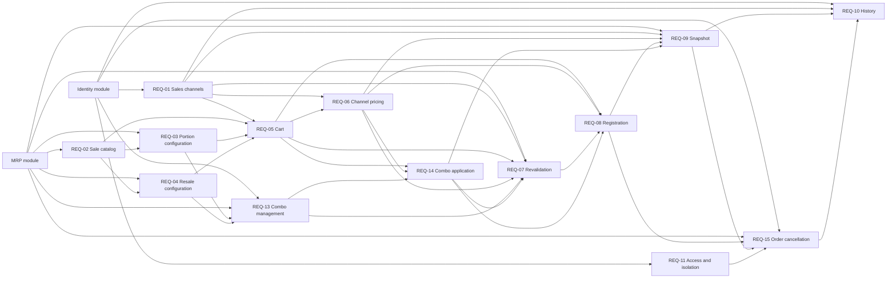

# PDV Product Requirements Document

## 1. Executive Summary

The Scoops PDV module enables operators of ice cream and açaí shops to assemble and
register orders containing products sold as Portions or Resales. It provides four independent
navigation entries: `New sale`, `Orders`, `Sales channels` and `Discounts`.

Operators find eligible products, configure size, brand, accompaniments and quantity, review
the cart and register a definitive sale. Managers configure optional sales-channel percentage
adjustments and fixed-price Combos. The system calculates prices and discounts, atomically
records the order and stock consumption, and preserves commercial snapshots for later history.

Managers can also cancel any registered order through an explicit, one-way action. Cancellation
preserves the original commercial history, atomically restores the stock consumed by the sale,
records the cancellation facts and keeps the order available in history with a `Canceled` status.

## 2. Problem and Opportunity

Ice cream shops need to combine sizes, quantities, accompaniments and packaging while keeping
pricing, discounts, inventory consumption and sales history consistent. Without a centralized
flow, service is exposed to incorrect calculations, divergent inventory, inconsistent discounts
and incomplete history.

The opportunity is to let a trained operator assemble and record an ordinary order in up to 60
seconds without manual price calculation, partial stock write-off or duplicate sales. Scoops can
differentiate through ice-cream-shop-specific Portion consumption, Resale by product and brand,
atomic stock validation, automatic application of the greatest-savings Combo combination,
optional channel pricing and snapshots that survive later registration changes or deletion.

According to their official pages, Brazilian food-service and point-of-sale competitors commonly
combine POS, inventory, cash, finance, delivery and tax issuance. Scoops does not seek to
replicate that breadth in the MVP:

| Solution | Audience | Value proposition and features | Public price | Relevant limitation or inference |
| --- | --- | --- | --- | --- |
| [Consumer](https://consumer.com.br/recursos) | Restaurants, bars, snack bars, coffee shops, ice cream shops and other food businesses | A single platform with POS, stock, technical data sheets, cashier, delivery, tax, digital menu and integrations | The official plan page lists options starting at [R$ 59.90/month](https://loja.consumer.com.br/) | No limitation was publicly identified. |
| [Saipos](https://saipos.com/sistema/sorveteria) | Ice cream shops and other food establishments | Centralized management, operations, inventory, delivery, scale integration and sales analysis | The official page lists plans starting at R$ 219.90/month. | No limitation was publicly identified. |
| [Kyte](https://www.kyte.com.br/vender/site-de-pedidos) | Small retail and service businesses | POS, catalog, stock, receipts, credit and cash flow on mobile and computer | PRO at R$49.90/month, GROW at R$69.90/month and PRIME at R$99.90/month | Source-based inference: the official coverage is generalist and does not identify specialization in consumption by size and accompaniment. |
| [MarketUP](https://suporte.marketup.com/hc/pt-br/articles/360000798983-Aplicativos-MarketUP) | Small businesses, including bars and restaurants | Product registration, sales, cashier, offline mode, ERP and NFC-e | Free according to the official page. | Source-based inference: the official coverage is generalist and does not identify specialized Portion assembly. |
| [iFood](https://developer.ifood.com.br/pt-BR/docs/guides/modules/catalog/definitions) | Establishments selling through a marketplace and digital menu | Catalogs, products, add-ons, availability and prices by context | Not publicly identified in this source. | It does not replace Scoops' internal operational control; integration is outside the MVP. |
| Spreadsheet, calculator and manual recording | Small operations without an integrated system | Flexible manual calculation and recording | Variable | Exposes the operation to pricing errors, divergent inventory, duplication and incomplete history. |

The official Consumer page states that its platform combines more than one hundred features and
serves ice cream shops. The official Saipos page for ice cream shops highlights scale integration,
stock and analysis by channel. Official iFood documentation permits different prices for the same
item in `Delivery` and `Digital Menu` contexts and describes
[Combos as structured items](https://developer.ifood.com.br/pt-BR/docs/guides/modules/catalog/guides/combo).
Scoops instead keeps products as ordinary order lines and applies a Combo as an automatic order
discount. Although source-based inference suggests product-specific channel pricing is the more
flexible model used by mature solutions, the confirmed MVP decision is one global percentage per
channel without product exceptions.

## 3. Target Audience

### Primary audience

Operators of independent, small or medium-sized ice cream and açaí shops,
who need to assemble and record orders during service.

### Secondary audiences

- Managers responsible for configuring sales channels and discounts.
- Managers and operators who need to check orders registered by the team.

### Non-audience

- Chains and franchises that depend on advanced multi-store management.
- Restaurants that need tables, controls, kitchen or bill division.
- Operations that require cash, payment, tax issuance or operation
  offline on first launch.

### Context of use

- Service on computer or tablet in landscape mode.
- Simultaneous use by more than one operator in the same ice cream shop.
- Orders received in person or externally and entered manually.
- Operation connected to the server, with real-time stock validation.

### Pains and needs

- Quickly find an available product.
- Assemble portions with size, accompaniments and quantity.
- Register Resale products and the correct brand, when applicable.
- Automatically apply the best combination of eligible Combos.
- Apply different prices per commercial context without duplicating products.
- Avoid negative stock and partial write-offs.
- Consult who registered a sale, when and for what amount.

### Jobs to Be Done

- When serving a customer, I want to find and configure products
  quickly to register the order without interrupting service.
- When a sale belongs to a channel with a different price, I want to select
  this channel, so that all values are automatically recalculated.
- When there are two operators selling simultaneously, I want the stock
  be revalidated in the registry, to avoid negative balance or sales
  inconsistent.
- When I need to check a previous sale, I want to open its details,
  to view the data applied at the time of the order.
- When a channel ceases to exist, I want to be able to delete it without losing context
  of previous orders.
- When I configure an offer with different products, I want to define a
  fixed price for the Combo, to promote it without changing the product registration.
- When an order meets more than one offer, I want the system to choose
  automatically the greatest savings, so as not to depend on operator calculations.

## 4. Objectives and Success Metrics

### Objectives

- Centralize selection of configured products, cart review, channel pricing, Combo application
  and order registration in a fast service flow specialized for ice cream shops.
- Prevent negative stock, partial stock write-offs and duplicate sales during concurrent or
  retried registration.
- Preserve readable commercial and operational history after products, brands, sizes,
  accompaniments, channels or discounts change or are deleted.

### Success metrics

- A trained Operator can assemble and register an ordinary order in up to 60 seconds.
- Search results and price or Combo recalculation are presented within 1 second under normal
  conditions.
- Order registration completes within 3 seconds under normal conditions.
- No registered order produces negative stock, a partial stock write-off or a duplicate order or
  stock write-off from a retry.
- Displayed and persisted prices, discounts, subtotals and totals use the same calculation and
  rounding rules.

## 5. Requirements

### REQ-01 — Sales Channel Management

- [x] **Implemented**

**Outcome:** The Manager can create and manage optional channels that
apply a global percentage to the paid items of an order.

**Actors:** Manager

**Consumes:** establishment access and profile authorization from the Identity module.

**Provides:** active sales-channel configuration and immutable channel facts consumed by
REQ-05, REQ-06, REQ-07, REQ-09 and REQ-10.

#### Capabilities

- **Fields:** each channel has a name, percentage and status.
- **Mandatory name:** the name cannot be empty or composed only of
  spaces.
- **Unique name:** there cannot be channels with the same name in the ice cream shop,
  ignoring uppercase, lowercase and spaces at the ends.
- **Percentage:** accepts values ​​between `−99.99%` and `+100%`, inclusive.
- **Addition:** positive percentage increases prices.
- **Discount:** negative percentage reduces prices.
- **Neutral:** zero percentage identifies the channel without changing prices.
- **Optional channel:** orders can be registered without a channel.
- **No default channel:** no channel is selected automatically.
- **Active status:** only active channels can be selected in new
  sales.
- **Inactivation:** prevents new selections, but does not change previous orders.
- **Deletion:** any channel can be deleted after confirmation, even when
  already used.
- **Snapshot:** editing, inactivating or deleting does not modify the copied data
  for previous orders.
- **Multi-tenancy:** channels are exclusive to the current ice cream shop.
- **Authorization:** management permissions depend on the Identity module.

#### Experience

- **List:** must display name, percentage, type of adjustment, status and actions.
- **New channel:** must request name, percentage and status.
- **Representation:** additions use a `+` sign, discounts use `−` and percentages
  neutrals use `0%`.
- **Inline validation:** duplicate names and percentages out of range must
  be informed in the field.
- **Empty state:** must explain which channels are optional and offer
  `Create first channel`.
- **Exclusion:** must present confirmation stating that previous orders
  will continue to be preserved.
- **Feedback:** creation, editing, inactivation and deletion must be successful,
  error and loading.
- **Action blocked:** an Operator without permission must not see management actions.
- **Responsiveness:** table and form cannot cut names, percentages or
  actions on smaller screens.
- **Accessibility:** fields must have associated labels and errors announced
  by assistive technology.

---

### REQ-02 — New Sale Product Catalog

- [x] **Implemented**

**Outcome:** The Operator can find only active products with valid commercial configuration on
the `New Sale` screen while still seeing unavailable stock states and the product's sale
category.

**Actors:** Operator, Manager

**Consumes:** product, category, size, brand, accompaniment, base-price and availability facts
from the MRP module.

**Provides:** eligible product catalog and product availability consumed by REQ-03, REQ-04 and
REQ-05.

#### Capabilities

- **Eligibility:** the `New Sale` screen must only display active products
with valid commercial configuration, differentiating availability and category
of sale.

- **Data source:** products, sizes, brands, accompaniments, base prices and
  consumed quantities are configured in the MRP module.
- **Without commercial editing:** the `New Sale` screen does not allow changing registration,
  price or stock.
- **Portion Category:** appears when it has at least one active size and
  valid.
- **Resale Category:** appears when it has a valid price and availability.
- **Manufacturable Category:** does not make a product salable without Portion or Resale.
- **Ingredient Category:** does not make a product salable.
- **Portion and Resale:** remain mutually exclusive.
- **Inactive product:** does not appear in new operations.
- **Incomplete product:** does not appear in the catalog and must be corrected in the module
  of Products.
- **Product out of stock:** remains visible as unavailable.
- **Partial portion:** remains selectable when at least one size can
  be sold.
- **Configuration unavailable:** size, brand or accompaniment is unfeasible
  disabled.
- **Stock not reserved:** viewing or adding a product to the cart is not
  reserve balance.
- **One-time inclusion:** a product that is already in the cart cannot be
  added again, even if the operator intends to choose another size,
  brand or set of accompaniments.
- **Multi-tenancy:** only products from the current ice cream shop can be displayed.

#### Experience

- **Grid:** products must be presented on quick selection cards.
- **Search:** must filter by name.
- **Filters:** must offer `All`, `Portions` and `Resales`.
- **Identification:** the card must display name, commercial category and
  availability.
- **Out of stock:** the card must remain visible, disabled and identified
  with `Out of stock`.
- **Product added:** the card of a product present in the cart must display
  the `Added` badge, remains visually distinct and cannot open a new
  configuration.
- **Partial unavailability:** unavailable options must inform the reason.
- **Initial empty state:** should guide product registration when not
  there are no eligible products.
- **Empty search status:** should display `No products found` and allow
  Clear search and filters.
- **Loading:** the grid must use skeletons or equivalent indicator.
- **Action blocked:** unavailable or already added cards cannot open the
  item configuration; for an added product, the interface must guide the
  adjustment of configuration or quantity directly in the cart.
- **Responsiveness:** the number of columns must adapt to the width
  available.
- **Accessibility:** cards must be keyboard operable and communicate
  available, unavailable or added states.

---

### REQ-03 — Portion Item Configuration

- [x] **Implemented**

**Outcome:** The Operator can select size, accompaniments and
quantity before adding a Portion to the cart.

**Actors:** Operator, Manager

**Consumes:** eligible product catalog from REQ-02 and Portion size, accompaniment, price,
consumption and availability facts from the MRP module.

**Provides:** valid configured Portion items and their calculated consumption consumed by
REQ-05 and REQ-13.

#### Capabilities

- **Required size:** every Portion requires an active size.
- **Mandatory quantity:** must be an integer greater than zero.
- **Side dishes:** are optional and can be multiple.
- **Contextual pricing:** the base price for accompaniment depends on the configuration
  `product + size + accompaniment`.
- **Free monitoring:** keeps the price equal to zero on any channel.
- **Portion Consumption:** corresponds to
  `size_quantity × sold_quantity`.
- **Accompaniment consumption:** corresponds to
  `quantity_per_portion × quantity_sold`.
- **Single stock:** the write-off uses the product balance.
- **Stock by brand:** automatic write-off uses the current main brand.
- **Invalid main brand:** the configuration is unavailable.
- **Size change:** must update price, consumption and accompaniments
  available.
- **Ownership:** size and accompaniment rules belong to the MRP module.

#### Experience

- **Single flow:** size, accompaniments and quantity must stay the same
  configuration area.
- **Sizes:** must display name, quantity consumed and base price.
- **Side dishes:** must display name, type and base price or `Free`.
- **Quantity:** must have adequate controls for touch and direct input.
- **Summary:** must show final unit price, quantity and subtotal before
  inclusion.
- **Unavailability:** options without sufficient balance must be disabled
  with explanation.
- **Error:** attempt to include invalid configuration must preserve the choices
  already carried out.
- **Action blocked:** `Add to cart` is disabled without size or
  valid quantities.
- **Responsiveness:** the configuration cannot hide the main action.
- **Accessibility:** selectable options must communicate name, status and price.

---

### REQ-04 — Resale Item Configuration

- [x] **Implemented**

**Outcome:** The Operator can select the brand, when applicable,
and the quantity of units from a Resale product before adding it to the cart.

**Actors:** Operator, Manager

**Consumes:** eligible product catalog from REQ-02 and Resale brand, price and availability
facts from the MRP module.

**Provides:** valid configured Resale items and their calculated consumption consumed by REQ-05
and REQ-13.

#### Capabilities

- **No size:** Resale does not use portion sizes.
- **No accompaniment:** Resale does not accept accompaniments.
- **Quantity:** must be an integer greater than zero.
- **Single stock:** when the product does not control stock by brand, the write-off
  corresponds to `1 unit × quantity_sold`.
- **Stock by brand:** the operator selects an available Resale brand.
- **Explicit brand:** the write-off occurs in the selected brand, regardless of the
  main brand.
- **Price:** uses the base price of the Resale product or brand configuration.
- **Unavailability:** inactive configurations or without sufficient balance will not
  can be selected.
- **Ownership:** product, brand, price and availability are configured in the MRP module.

#### Experience

- **Selection:** must display product, brand when applicable, base price and
  availability.
- **Quantity:** must have adequate controls for touch and direct input.
- **Summary:** must show final unit price, quantity and subtotal.
- **Out of stock:** unavailable brand or configuration must be disabled.
- **Error:** validations must preserve the informed quantity.
- **Action blocked:** `Add to cart` is disabled without branding
  mandatory or valid quantity.
- **Responsiveness:** options and summary cannot overlap on smaller screens.
- **Accessibility:** each option must communicate product, brand, price and condition.

---

### REQ-05 — Cart Assembly and Editing

- [x] **Implemented**

**Outcome:** The Operator can review, edit and remove items before registering the order.

**Actors:** Operator, Manager

**Consumes:** active channel configuration from REQ-01, eligible product catalog from REQ-02,
configured Portion items from REQ-03 and configured Resale items from REQ-04.

**Provides:** the current unpersisted cart, selected channel and configured line items consumed
by REQ-06, REQ-07, REQ-08 and REQ-14.

#### Capabilities

- **Temporary cart:** the cart is not a persisted order.
- **No drafts:** exiting or reloading the screen may discard the cart after
  warning.
- **Optional channel:** the cart can be assembled with or without a channel.
- **Initial price:** without channel selected, uses base prices.
- **Direct editing:** size, brand, accompaniments and quantity can be
  changed from the item.
- **Revalidation in editing:** any change recalculates price and consumption.
- **Uniqueness per product:** each product can occupy a maximum of one line in the
  cart, regardless of size, brand or accompaniments.
- **New inclusion blocked:** try to add a product already present in the
  cart does not create a line, does not add quantity and does not change the configuration
  existing.
- **Quantity in cart:** new units of a product already added must
  be informed by the quantity controls of the existing line.
- **Product immutable in editing:** editing a line can change size,
  brand, accompaniments and quantity, but you cannot replace the product with
  another.
- **Removal:** removing an item recalculates the total immediately.
- **Empty cart:** cannot be registered.
- **Unreserved stock:** items in the cart do not block balance.
- **Movement:** no write-off occurs before definitive registration.

#### Experience

- **Desktop structure:** catalog and cart must remain visible side by side
  side.
- **Item:** must display product, size, brand, accompaniments, quantity,
  unit price and subtotal as applicable.
- **Actions:** each item must offer edit and remove.
- **Quantity:** each line must allow increasing, reducing or informing
  directly the quantity of the product.
- **Correspondence with the catalog:** while a line exists, the card of the
  corresponding product must remain identified with `Added` and
  blocked for new selection; removing it should re-enable the card.
- **Total:** must remain highlighted.
- **Channel:** optional selection must remain visible during assembly.
- **Empty state:** should display `Add products to start sale`.
- **Output:** must warn that unregistered items will be lost.
- **Feedback:** edits, removals and recalculations should update the interface
  immediately.
- **Duplicate attempt:** if an add is requested from a view
  outdated, it should display `Product already added. Adjust it in the cart` without
  modify the cart.
- **Action blocked:** `Register order` is disabled when the cart
  is empty or has an invalid configuration.
- **Narrow screens:** the cart can take on a dedicated panel, preserving
  access to total and main action.
- **Accessibility:** quantity, editing and removal controls must have
  accessible names; the card's change to `Added` must be announced by
  assistive technology.

---

### REQ-06 — Pricing by Channel

- [x] **Implemented**

**Outcome:** The Operator sees consistent prices, subtotals and totals calculated from the
optional sales channel selected for the order.

**Actors:** Operator, Manager

**Consumes:** active channel configuration from REQ-01 and the current cart from REQ-05.

**Provides:** channel-adjusted line prices, subtotals and totals consumed by REQ-07, REQ-08,
REQ-09 and REQ-14.

#### Capabilities

- **Without channel:** the final price is the same as the base price.
- **With channel:** applies the same percentage to all paid components.
- **Scope:** Portions, Resales and paid accompaniments receive the adjustment.
- **Free item:** base price equal to zero remains equal to zero.
- **Formula:** `adjusted_price = base_price × (1 + percentage ÷ 100)`.
- **Rounding:** each adjusted unit price is rounded to two places
  decimals before the subtotal.
- **Subtotal:** corresponds to `rounded_unit_price × quantity`.
- **Total:** corresponds to the sum of the rounded subtotals.
- **Change channel:** recalculates all items not yet registered.
- **Single Channel:** A maximum of one channel can be applied to the order.
- **No exception per product:** MVP does not accept specific percentage per
  product and channel.
- **Invalid price:** no combination allowed can make the price negative
  of a paid item.
- **Non-retroactive update:** channel changes do not change orders
  registered.

#### Experience

- **Selector:** must offer active channels and the `No channel` option.
- **Optionality:** the absence of a channel does not block the registration.
- **Immediate feedback:** selection or exchange recalculates prices, subtotals and total.
- **Transparency:** must display the name and percentage of the selected channel.
- **No channel:** must identify that base prices are being used.
- **Loading:** the recalculation must have a visual state when it is not instantaneous.
- **Error:** recalculation failure must maintain the previous selection and preserve the
  cart.
- **Accessibility:** price adjustment cannot be communicated by color alone.

---

### REQ-07 — Channel, Combo and Stock Revalidation

- [x] **Implemented**

**Outcome:** The Operator can register an order only after its channel, Combos, configurations
and consolidated stock consumption have been revalidated against current authoritative facts.

**Actors:** Operator, Manager

**Consumes:** current channel configuration from REQ-01, the cart from REQ-05, calculated prices
from REQ-06, active Combo definitions from REQ-13, applied Combo facts from REQ-14 and current
product, brand and stock availability from the MRP module.

**Provides:** a current, all-or-nothing registration decision and reviewed order values consumed
by REQ-08.

#### Capabilities

- **Competition:** multiple operators can register orders simultaneously.
- **Updated channel:** registration uses the current channel configuration.
- **Channel changed:** if name or percentage changed, the cart is recalculated and
  requires new confirmation.
- **Inactive or deleted channel:** the selection is removed; the operator can proceed
  without channel or choose another one.
- **Current combos:** eligibility, composition, price, status and best
  combination must be recalculated with the current settings.
- **Combo changed:** if the discount or best combination changes, the cart is
  recalculated and requires new confirmation.
- **Invalid combo:** the discount is removed without removing the products from the
  cart.
- **Updated stock:** validation uses the most recent balances.
- **Consolidation:** consumptions that reach the same product or brand are added together
  before validation.
- **Negative stock:** is not allowed.
- **No exception:** there is no configuration to allow sales below zero.
- **Total blocking:** insufficiency in any component blocks the entire order.
- **No partial write-off:** no movement is maintained after failure.
- **Cart preserved:** channel, Combo or stock failures do not discard cart items.
- **Retry:** the operator must confirm again after the correction.

#### Experience

- **Channel changed:** must inform the previous and current percentage.
- **Channel removed:** must explain that the order is using base prices until another channel is
  selected.
- **Combo changed:** must inform that the discounts have been recalculated and
  request a review of the values.
- **Insufficient item:** must be highlighted in the cart.
- **Details:** must inform product or brand, quantity required,
  available and missing.
- **Example message:** `Insufficient stock of Granola Frooty: required
  300 g, 200 g available, 100 g missing`.
- **Fix:** operator should be able to edit or remove the affected item.
- **Action blocked:** the record remains blocked as long as there is
  known insufficiency.
- **Accessibility:** messages must be associated with affected items and
  announced by assistive technology.

---

### REQ-08 — Order Confirmation and Registration

- [x] **Implemented**

**Outcome:** The Operator explicitly confirms a definitive order that is created exactly once
with all stock consumption in one atomic transaction.

**Actors:** Operator, Manager

**Consumes:** the current cart from REQ-05, channel-adjusted prices from REQ-06, the current
registration decision from REQ-07 and applied Combo facts from REQ-14.

**Provides:** completed, numbered order facts and atomic stock-consumption facts consumed by
REQ-09.

#### Capabilities

- **Mandatory confirmation:** the order cannot be registered by an action
  implicit.
- **Summary:** must contain channel or `No channel`, number of items, Combos
  applied, economy and total.
- **Final registration:** confirmation creates a completed order.
- **No payment:** there is no payment step, cashier or change.
- **Atomic transaction:** order creation and stock issues occur at the same time
  transaction.
- **Idempotence:** repeated clicks, resends or delayed responses cannot
  duplicate order or stock.
- **Numbering:** each ice cream shop has its own increasing sequence.
- **Visible identification:** the user sees `Order #<number>`.
- **Internal identifier:** may exist separately and should not be displayed
  as the main reference.
- **Immutability:** the order cannot be edited, reversed or deleted in MVP;
  cancellation follows REQ-15 and does not alter preserved snapshots.
- **Success:** clears the cart only after confirmation from the server.
- **Failure:** does not create order or maintain any write-off.

#### Experience

- **Final dialog:** must allow `Return to cart` or `Register order`.
- **Prevention of double sending:** during processing, the action must be
  blocked and indicate charging.
- **Success:** should display `Order #<number> registered successfully` and initiate a
  empty cart.
- **Transactional failure:** should display `Unable to register order.
  No stocks were changed. Please try again`.
- **Connection lost:** must preserve the cart on the screen and allow new
  attempt.
- **Irreversible action:** the dialog must inform that payment refunds and
  payment reversals are not available in the MVP; order cancellation is a
  separate Manager-only lifecycle action.
- **Accessibility:** focus must be moved to the dialog and returned to the element
  source when it is closed.

---

### REQ-09 — Order Snapshot

- [ ] **Implemented**

**Outcome:** Authorized users can rely on immutable commercial and operational facts preserved
at the time an order is registered.

**Actors:** Operator, Manager

**Consumes:** channel facts from REQ-01, calculated prices from REQ-06, completed order and stock
consumption facts from REQ-08, applied Combo facts from REQ-14 and product configuration facts
from the MRP module.

**Provides:** immutable order snapshots consumed by REQ-10.

#### Capabilities

- **General data:** identifier, sequence number, ice cream shop, date, time,
  operator, quantity of items and total.
- **Channel snapshot:** original identifier, name and percentage, when
  selected.
- **No channel:** must be explicitly persisted as no channel.
- **Product snapshot:** original identifier, name and commercial category.
- **Brand snapshot:** original identifier and name, when applicable.
- **Size snapshot:** original identifier, name and quantity consumed,
  when applicable.
- **Snapshot of accompaniment:** original identifier, name, type, quantity
  consumed, base price and final price.
- **Combo Snapshot:** original identifier, name, fixed price, economy,
  participating configurations and quantities, pre-discount prices and
  links to order lines.
- **Prices:** each line preserves base price, final unit price, quantity and
  subtotal.
- **Consumptions:** the quantities of stock calculated for the
  sale.
- **Cancellation snapshot:** when canceled, the order preserves status,
  cancellation date and time, canceling Manager and optional cancellation
  reason without changing any original order snapshot.
- **Restoration facts:** exact product and brand consumptions restored by
  cancellation remain auditable alongside original sale consumptions.
- **Registration exclusions:** deletion of any registration cannot make the
  invalid order.
- **Non-retroactive update:** no registration changes modify snapshots.
- **Cancellation preservation:** cancellation changes lifecycle and stock
  balance only; it does not rewrite products, configurations, channel,
  Combos, prices, totals or original sale consumptions.
- **Multi-tenancy:** snapshots belong exclusively to the ice cream shop of the order.

#### Experience

- **Readability:** history should show copied names, not identifiers
  technical identifiers.
- **Missing channel:** should display `No channel`.
- **Values:** must display the actual values.
- **Registration deleted:** should not generate missing item messages in the history.
- **Error state:** failed to load details should allow retry without
  lose the listing filters.
- **Responsiveness:** extensive details must break lines without cutting content.
- **Accessibility:** groupings must have titles and reading order
  coherent.

---

### REQ-10 — Order History

- [ ] **Implemented**

**Outcome:** Operators and Managers can consult all orders from the current ice cream shop and
open their immutable details.

**Actors:** Operator, Manager

**Consumes:** active and historical channel identity from REQ-01, immutable order snapshots from
REQ-09 and establishment access from the Identity module.

#### Capabilities

- **Sort:** most recent orders appear first.
- **Period filter:** accepts start and end date.
- **Channel filter:** accepts a specific channel or `No channel`.
- **Combined filters:** period and channel can be used simultaneously.
- **Scope of the Operator:** the Operator consults orders from the entire ice cream shop, not
  just their own.
- **Loading:** must use pagination or incremental loading.
- **Restart:** changing filters restarts the results navigation.
- **Details:** exclusively use registered snapshots.
- **Status:** each order displays `Registered` or `Canceled`, and users can
  filter by status.
- **No edit/reversal/deletion:** there are no edit, reverse or delete actions;
  a Manager can cancel a registered order according to REQ-15.
- **No reports:** metrics, dashboards and exports do not belong to MVP.
- **Multi-tenancy:** orders from other ice cream shops can never be returned.

#### Experience

- **Filters:** period and channel must appear above the listing.
- **Line:** must display number, date, time, operator, channel, number of items
  and total.
- **Detail:** must present items, configurations, quantities, prices,
  subtotals, consumption and total.
- **No channel:** must be filterable and displayed as `No channel`.
- **Loading:** must use skeletons or equivalent indicator.
- **General empty status:** should inform you that there are no orders yet.
- **Filtered empty state:** should inform that no orders match the
  filters and offer `Clear filters`.
- **End of listing:** you should not request new lots when there are no more
  data.
- **Error:** must preserve filters and allow retrying.
- **Responsiveness:** listing can adapt columns, but number, date and total
  must remain visible.
- **Accessibility:** filters, actionable lines and details must be navigable
  by keyboard.

---

### REQ-11 — Permissions, Navigation and Isolation

- [ ] **Implemented**

**Outcome:** Operators and Managers see only the PDV navigation and actions authorized for their
profiles, with all data isolated to the current establishment.

**Actors:** Operator, Manager

**Consumes:** establishment, authentication and profile authorization facts from the Identity
module.

#### Capabilities

- **Independent navigation:** must contain `New sale`, `Orders`,
  `Sales channels` and `Discounts`, without parent group.
- **Operator:** can assemble, register and consult orders.
- **Manager:** has Operator permissions and manages channels and discounts.
- **Cancellation authorization:** only Managers can cancel registered orders;
  Operators can view cancellation status and details but cannot initiate it.
- **Product Configuration:** remains outside the Sales module.
- **Authorization:** profile rules depend on the Identity module.
- **Isolation:** products, channels, sequences, orders and histories are always
  filtered by the current ice cream shop.
- **Direct access:** a URL cannot bypass permissions.
- **Minimum audit:** each order must preserve the responsible Operator.

#### Experience

- **Menus:** items without permission should not be displayed.
- **Access denied:** must present clear guidance without revealing data.
- **Consistency:** page titles must match the page names
  navigation.
- **No product shortcuts:** `New sale` does not offer registration editing.
- **Session feedback:** loss of authentication should preserve cart on screen
  when technically possible and request new authentication.
- **Responsiveness:** navigation cannot block main content on screens
  minors.
- **Accessibility:** active navigation status must be communicated in addition to color.

---

### REQ-12 — Performance, Responsiveness and Accessibility

- [ ] **Implemented**

**Outcome:** Operators and Managers can use all four PDV areas quickly and accessibly on priority
devices while receiving consistent server-backed results.

**Actors:** Operator, Manager

#### Capabilities

- **Priority devices:** computer and tablet in landscape mode.
- **Search:** should present results within 1 second under normal conditions.
- **Recalculation:** must update values ​​within 1 second under normal conditions.
- **Registration:** must complete within 3 seconds under normal conditions.
- **Operational Goal:** a trained operator must record a common order in
  up to 60 seconds.
- **Online operation:** connection to the server is mandatory.
- **No offline queue:** orders are not registered locally for synchronization
  later.
- **Security:** protected actions must also be validated on the server.
- **Consistency:** displayed and persisted values must use the same
  calculation and rounding.

#### Experience

- **Main layout:** catalog and cart are side by side when available
  space.
- **Narrow screens:** the cart can open in a separate panel.
- **Touch targets:** main controls must have a minimum contact area
  `44×44px`.
- **Contrast:** texts and controls must meet level AA.
- **Semantics:** success, alert, error and unavailability cannot depend on
  just in color.
- **Keyboard:** search, catalog, settings, cart, dialogs and filters must
  be keyboard operable.
- **Focus:** must remain visible and follow logical order.
- **Screen readers:** labels, states, errors and critical updates must be
  communicated.
- **Loading:** asynchronous actions must present feedback without offsets
  unnecessary abruptness.
- **Connection failure:** must inform that the sale was not registered and preserve
  the current cart for retry.

---

### REQ-13 — Combo Discount Management

- [x] **Implemented**

**Outcome:** The Manager can create and manage discounts of the type
Combo, made up of different products and sold for a fixed final price.

**Actors:** Manager

**Consumes:** establishment access and profile authorization from the Identity module; product,
size, accompaniment, brand, price and availability facts from the MRP module; configured Portion
and Resale facts from REQ-03 and REQ-04.

**Provides:** active, validated Combo definitions consumed by REQ-07 and REQ-14.

#### Capabilities

- **Type in MVP:** `Combo` is the only type of discount available.
- **Fields:** each Combo has a name, type, components, fixed final price and
  status `Active` or `Inactive`.
- **Required name:** cannot be empty or contain only spaces.
- **Unique name:** Combos with the same name cannot exist in the ice cream shop,
  ignoring uppercase, lowercase and spaces at the ends.
- **Minimum composition:** requires at least two different products.
- **Quantity per component:** must be an integer greater than zero.
- **Exact portion:** the component must register product, size and set of
  side dishes included.
- **Unsized portion:** cannot be added to the Combo.
- **Exact resale:** the component must register the product and brand, when
  applicable; Resale does not have packaging.
- **Fixed price:** must be greater than zero and represents the final value of a
  application of the Combo, regardless of the sales channel.
- **Mandatory savings:** the Combo can only be activated when its fixed price
  is less than the current sum of the components at the base prices.
- **No validity:** the MVP has no start date, end date or schedule.
- **Active status:** only active Combos participate in new sales.
- **Automatic inactivation:** if a product, size, accompaniment, brand or
  required configuration becomes invalid, inactive or is deleted, the Combo must
  be automatically deactivated.
- **Reactivation:** requires correction of components and new validation of the economy.
- **Edition:** changes only affect unregistered carts and orders
  futures.
- **Exclusion:** any Combo can be deleted after confirmation, even when
  already used.
- **History:** editing, inactivating or deleting does not change registered orders.
- **Multi-tenancy:** discounts belong exclusively to the current ice cream shop.
- **Permission:** only Managers can create, edit, activate, inactivate or
  delete Combos.

#### Experience

- **Navigation:** `Discounts` must be an independent entry of the module.
- **List:** must display name, type, price of the Combo, quantity of products,
  status and actions.
- **Search:** the placeholder must be
  `Search by discount or product name…`.
- **Filters:** must only offer `Type` and `Status`.
- **Creation:** the screen must request name, components, final price and status.
- **Add product:** should open a dialog that differentiates Resale Portion
  and requires the exact applicable configuration.
- **Economy:** the form must compare the current sum of the components with the
  Combo price and display the calculated savings.
- **Inline validation:** duplicate name, insufficient composition, component
  repeated or invalid and price without savings must be informed next to the field
  corresponding.
- **Empty state:** must explain the purpose of the discounts and offer
  `Create first discount`.
- **Filtered empty state:** should offer `Clear filters`.
- **Exclusion:** must present confirmation stating that the history will be
  preserved and opened carts will be revalidated.
- **Feedback:** creation, editing, activation, inactivation and deletion must present
  success, error and loading.
- **Action blocked:** Operators do not see management actions.
- **Responsiveness:** table, form and dialog cannot hide fields or
  main actions on smaller screens.
- **Accessibility:** fields, selectors, errors, statuses and confirmations must be
  keyboard operable and announced by assistive technology.

---

### REQ-14 — Automatic Combo Application

- [x] **Implemented**

**Outcome:** The Operator automatically receives the eligible combination of Combos that
produces the greatest total savings without reusing product units.

**Actors:** Operator, Manager

**Consumes:** the current cart from REQ-05, channel-adjusted prices from REQ-06 and active Combo
definitions from REQ-13.

**Provides:** applied Combo discounts, savings and participating-unit facts consumed by REQ-07,
REQ-08 and REQ-09.

#### Capabilities

- **Automatic detection:** add, edit or remove a line, change its
  quantity or changing the channel must recalculate the eligible Combos.
- **Exact match:** a unit only meets a component when
  product, size, accompaniments and brand fully correspond to the
  Combo configuration, as applicable.
- **Participating units:** the required quantities must exist in the cart.
- **Single application:** each Combo can be applied at most once per
  request.
- **Different Combos:** more than one Combo can be applied to the same order.
- **No reuse:** a product unit cannot participate in two
  Combos.
- **Greater savings:** if there is a dispute over units, the system must choose the
  set of Combos with the highest total savings.
- **Tiebreaker:** combinations with the same total savings must prioritize,
  deterministically, the Combos created first.
- **Positive savings:** a Combo is only applied when it reduces the order total.
- **Mandatory application:** the Operator cannot manually remove a Combo
  eligible.
- **Lines preserved:** the products remain in their original lines and
  they retain base price, channel-adjusted price, quantity and subtotal.
- **Discount on order:** Combo savings must be recorded as a discount
  at the order level, linked to participating units and lines, without changing
  the original unit price.
- **Formula:** `savings = sum of final prices of participating units − fixed price of the Combo`.
- **Independent fixed price:** the final price of the Combo is not adjusted by the
  channel; products and units not consumed by Combo remain subject to the
  selected channel.
- **Total:** corresponds to the sum of the subtotals of the lines minus the sum of the
  Combo discounts applied.
- **Revalidation:** immediately before registration, the system must revalidate
  channel, stock, components, status and price of all Combos.
- **Cart updated:** if the best combination changes, the system recalculates the
  total, preserves the items and requires a new review by the Operator.
- **Invalid Combo:** If you are no longer eligible, your discount will be removed and the
  Operator must review the order.
- **Atomic registration:** snapshots of Combos and links with lines must be
  recorded in the same transaction as the order and stock issues.
- **Combo Snapshot:** must preserve original identifier, name, price
  fixed, economy, components, configurations, quantities, prices prior to
  discount and links between components and order lines.
- **Immutability:** subsequent changes or deletions do not modify the order.
- **Performance:** Combo recalculation must finish within 1 second
  normal conditions, including with competing Combos.

#### Experience

- **Automatic summary:** the cart must display each Combo applied, a
  application, its participating products and the savings generated.
- **Transparent prices:** lines maintain the original values and the discount
  Combo appears separately before the total.
- **No manual control:** there must be no action to remove or select a
  Combo.
- **Update:** changes to the cart must update Combos and total without
  require page reloading.
- **Reusable conflict:** conflicts identified in revalidation must use
  a common order conflict dialog, with title, reason, affected items and
  review action.
- **Alert:** channel or Combo changes that only recalculate values use
  alert handling and the `Review values` action.
- **Blocking error:** product, configuration or stock unavailable uses
  error handling and the `Review items` action.
- **Technical failure:** connection or processing failure must ensure that the
  order was not partially registered and offer `Try again`.
- **Cart preserved:** all conflict dialogs keep the items and
  valid choices.
- **History:** order detail must display name, fixed price, economy and
  products participating in each Combo applied.
- **No Combo:** when no Combo is eligible, the cart continues normally
  no error message.
- **Accessibility:** application, automatic removal and total changes must
  be advertised without relying solely on color.

---

### REQ-15 — Order Cancellation

- [ ] **Implemented**

**Outcome:** A Manager can cancel any registered order as a one-way lifecycle transition while
restoring its consumed stock atomically and preserving the original commercial and operational
history.

**Actors:** Manager

**Consumes:** registered order and immutable stock-consumption facts from REQ-08 and REQ-09;
establishment access and Manager authorization from Identity; current stock facts from MRP.

**Provides:** canceled order facts and restored stock facts consumed by REQ-10 and future
operational history.

#### Capabilities

- **Eligibility:** only orders with status `Registered` can be canceled.
- **Authorization:** only Managers can initiate cancellation; Operators can view canceled
  status and details but cannot cancel.
- **No time limit:** a Manager may cancel any registered order regardless of age.
- **Mandatory confirmation:** cancellation requires explicit confirmation.
- **Reason:** cancellation reason is optional; when supplied, it is preserved.
- **Atomic restoration:** cancellation changes order status and metadata and restores every
  product and brand stock consumption from the original sale in one atomic transaction.
- **Failure:** if restoration or cancellation cannot complete, the order remains `Registered`,
  no partial stock restoration is kept, and retry is allowed.
- **One-way transition:** `Registered` -> `Canceled` only. Canceled orders cannot be edited,
  reactivated, canceled again or deleted.
- **History preservation:** cancellation does not change original products, configurations,
  quantities, channel, Combo facts, prices, totals or original consumption snapshots.
- **No refunds:** cancellation does not refund or reverse payments in the MVP because payment
  is not part of PDV.
- **Multi-tenancy:** cancellation is limited to orders in the current establishment.

#### Experience

- **Detail action:** registered order details show `Cancel order` only to Managers.
- **Confirmation:** dialog shows order number, date/time, item count, total, optional reason,
  and warns that the order remains in history with status `Canceled` while products, channel
  and values remain preserved.
- **Success:** details show `Canceled`, cancellation timestamp, canceling Manager and optional
  reason.
- **Failure:** display a retryable error, keep the order `Registered`, and explain that no
  partial stock restoration occurred.
- **History:** order list displays status and supports `Registered` and `Canceled` filters;
  canceled details remain readable using preserved snapshots.
- **Accessibility:** confirmation focus, labels, reason field, status, errors and cancellation
  updates are keyboard and assistive-technology accessible.

---

## 6. Product Dependency Graph

An edge `A --> B` means B consumes a product capability or authoritative fact provided by A.

## 7. User Journeys

### Journey A — Manager creates a sales channel

1. The Manager accesses `Sales channels`.
2. The system displays the ice cream shop channels.
3. The Manager selects `New channel`.
4. The Manager enters the name, percentage and status.
5. The system validates:
   - Success: creates the channel and updates the listing.
   - Fail: keeps the data and reports the invalid field.
6. The journey ends.

### Journey B — Manager edits, inactivates or deletes a channel

1. The Manager opens the actions of a channel.
2. To edit, change the data and confirm.
3. To inactivate, change the status and confirm.
4. To delete, review the warning and confirm the destructive action.
5. The system preserves snapshots of previous orders.
6. The system validates:
   - Success: Updates or removes the channel from future operations.
   - Failure: maintains the previous state and reports the error.
7. The journey ends.

### Journey C — Manager creates a Combo

1. The Manager accesses `Discounts`.
2. The system displays the search, the `Type` and `Status` filters and the discounts of the
   ice cream shop.
3. The Manager selects `Create discount` and chooses the `Combo` type.
4. The Manager enters a unique name and adds at least two products
   distinct.
5. For each Portion, inform the size, included accompaniments and quantity;
   for each Resale, inform brand when applicable and quantity.
6. The Manager enters the final fixed price and status.
7. The system calculates and displays the savings.
8. The system validates:
   - Success: creates the Combo and updates the listing.
   - Failure: preserves data and reports duplicate name, invalid composition,
     unavailable component or lack of savings.
9. The journey ends.

### Journey D — Manager edits, inactivates or deletes a Combo

1. The Manager opens the actions of a Combo.
2. To edit, change your data and confirm.
3. To deactivate or reactivate, change the status; reactivation revalidates all
   components and the economy.
4. To delete, review the notice about history and open carts and confirm.
5. The system preserves snapshots of registered orders.
6. Open carts are recalculated on the next interaction or checkout attempt
   registration.
7. The system validates:
   - Success: updates or removes the Combo from future operations.
   - Failure: maintains the previous state and reports the error.
8. The journey ends.

### Journey E — Operator starts a new sale

1. The Operator accesses `New sale`.
2. The system presents the grid, search, filters, optional channel selector
   and the cart is empty.
3. The system uses base prices while no channels are selected.
4. The Operator searches or filters products.
5. Out-of-stock products remain visible as unavailable.
6. Products already present in the cart remain visible with the seal
   `Added` and locked for reselection.
7. The journey continues to Portion or Resale configuration.

### Journey F — Operator adds a Portion

1. The Operator selects an available Portion.
2. The system presents sizes, accompaniments and quantity.
3. Operator configures the item.
4. The system calculates price, consumption and subtotal.
5. Operator selects `Add to Cart`.
6. The system validates:
   - Product missing from cart: creates a single line and marks your card as
     `Added`.
   - Product already present: blocks inclusion, preserves the existing line and
     guides the adjustment of the cart.
   - Failure: preserves the choices and explains the necessary correction.
7. The journey returns to the assembly.

### Journey G — Operator adds a Resale product

1. The Operator selects an available Resale product.
2. The system displays the product, brand when applicable and quantity.
3. Operator configures the item.
4. The system calculates price, consumption and subtotal.
5. Operator selects `Add to Cart`.
6. The system validates:
   - Product missing from cart: creates a single line and marks your card as
     `Added`.
   - Product already present: blocks inclusion, preserves the existing line and
     guides the adjustment of the cart.
   - Failure: preserves the data and explains the necessary correction.
7. The journey returns to the assembly.

### Journey H — Operator edits the cart

1. The Operator opens an item from the cart.
2. The system displays the current configuration.
3. The Operator changes size, brand, toppings or quantity.
4. The system recalculates price, consumption and subtotal.
5. The Operator confirms:
   - Success: Updates the only existing line for the product.
   - Failure: preserves the edit and reports the problem.
6. The journey returns to the cart.

### Journey I — System applies Combos automatically

1. The Operator adds, edits or removes products or changes quantities.
2. The system identifies all active Combos with exact matches.
3. The system resolves disputes without reusing units and chooses the combination of
   greater total savings; in a tie, prioritizes the Combos created first.
4. Each Combo can appear once, but different Combos can coexist.
5. The system keeps products on separate lines and displays discounts in the
   order summary.
6. The Operator cannot manually remove eligible Combos.
7. If no Combo generates savings, the order remains without discount.
8. The journey returns to the assembly.

### Journey J — Operator selects or changes the channel

1. Operator opens the channel selector.
2. The system displays active channels and `No channel`.
3. The Operator chooses an option.
4. The system recalculates all paid components.
5. The system updates prices, subtotals and total.
6. In case of failure, keep the previous selection and preserve the cart.
7. The journey returns to the assembly.

### Journey K — Operator records an order

1. The Operator selects `Register order`.
2. The system revalidates channel, Combos, settings and stock.
3. The system displays number of items, channel or `No channel`, Combos applied,
   economy and total.
4. Operator confirms `Register order`.
5. The system executes in one transaction:
   - creation of the order;
   - generation of the sequential number;
   - recording of snapshots;
   - recording of discounts and Combo links;
   - write-off of all stocks.
6. The system displays `Order #<number> registered successfully`.
7. The system cleans the cart.
8. The journey ends.

### Journey L — Channel changes during assembly

1. The Operator tries to register an order with the selected channel.
2. The system identifies that the channel has been changed.
3. The system recalculates the cart with the current percentage.
4. The system notifies you of the change.
5. Operator reviews and confirms again.
6. If the channel has been inactivated or deleted, the system removes the selection and allows
   continue without a channel or choose another one.
7. The journey returns to confirmation.

### Journey M — Stock is insufficient

1. The Operator attempts to register an order.
2. The system consolidates and revalidates all consumption.
3. A product or brand does not have sufficient balance.
4. The system blocks the entire order.
5. No order or stock write-off is persisted.
6. The cart is preserved and insufficient items are highlighted.
7. The Operator edits or removes the items and tries again.

### Journey N — Connection or processing failure

1. The Operator attempts to register an order.
2. The connection or transaction fails.
3. The system confirms that no partial write-offs were maintained.
4. The cart remains on the screen.
5. The system offers `Try again`.
6. The journey returns to confirmation.

### Journey O — Combo changes during assembly

1. The Operator attempts to register an order with Combo applied.
2. The system identifies changes, inactivation, exclusion or loss of eligibility
   of the Combo.
3. The system recalculates the best combination and the total.
4. The system opens the reusable order conflict dialog and informs the
   discounts changed or removed.
5. The products remain in the cart.
6. The Operator selects `Review values` or `Review items`, depending on the type of
   conflict.
7. After review, the Operator confirms again.

### Journey P — User queries orders

1. The user accesses `Orders`.
2. The system displays the ice cream shop's most recent orders.
3. The user filters by period and channel, including `No channel`.
4. The system restarts and updates the listing.
5. The user opens an order.
6. The system presents complete snapshots of the sale, including Combos,
   economy and participating products.
7. Operators can view cancellation status and details; only Managers see the
   cancellation action for registered orders.
8. No editing, reversal or deletion actions are offered.
9. The journey ends.

### Journey Q — Manager cancels a registered order

1. The Manager opens the details of a `Registered` order.
2. The system displays the cancellation action and preserved order number,
   date, item count and total.
3. The Manager selects `Cancel order`.
4. The system opens a confirmation dialog with an optional reason and explains
   that the order remains in history with status `Canceled`, while products,
   channel and values remain preserved.
5. The Manager confirms the cancellation.
6. The system atomically restores all product and brand stock consumptions,
   records canceled status, timestamp, Manager and optional reason.
7. Success: details show `Canceled` and cancellation metadata.
8. Failure: order remains `Registered`, no partial stock restoration is
   maintained, and the Manager can retry.
9. A canceled order cannot be edited, reactivated, canceled again or deleted.

---

## 8. Out of Scope

- Methods of payment, cash, change, bleeding, supply and reconciliation.
- Payment refunds or payment reversals for canceled orders.
- Editing or deleting registered orders.
- Reactivation of canceled orders.
- Identification, registration or customer history.
- Loyalty, cashback, coupons or customer credit.
- Types of discounts other than Combo.
- `Pay X, get Y` mechanics.
- Combo consisting of just one product or less than two different products.
- More than one application of the same Combo in the order.
- Validity, start date, end date or discount scheduling.
- Manual selection, application or removal of Combo by the Operator.
- Free observations per item or order.
- Printing of receipt, coupon or tax document.
- NFC-e, SAT, NF-e or other tax integrations.
- Integration with iFood, Rappi, WhatsApp, machines or other systems.
- Automatic import of external orders.
- Offline operation and later synchronization.
- Specific price or percentage per `product + channel`.
- More than one channel or modifier in the same order.
- Separate manual channel changer.
- Reports, dashboards, indicators and exports.
- Persistent order drafts.
- Stock reservation when adding to cart.
- Configuration of products, sizes, brands, accompaniments or stock within
  of the Sales module.
- Tables, controls, kitchen, bill division and delivery.
- Advanced multi-store management for chains and franchises.
- Physical inventory, batches, validity, losses and waste.

### Discarded during definition

- **Multiple lines or grouping of the same product:** discarded; each product
  can only occupy one line, and new units or configurations must be
  adjusted to the existing item in the cart.
- **Name `POS`:** replaced by `New sale`.
- **Navigation group `Sales`:** discarded; `New Sale`, `Orders` and
  `Sales channels` are independent inputs.
- **Generic price modifier:** replaced by `Sales channel`.
- **Default channel:** discarded; no channels are selected automatically.
- **Mandatory channel:** discarded; channelless orders use base prices.
- **Price per product and channel:** postponed; MVP uses a global percentage.
- **Hide out-of-stock products:** replaced by unavailable display.
- **Remove and re-add to edit:** replaced by direct edit.
- **Block deletion of used channel:** replaced by snapshot in the order.
- **Combo as catalog product:** discarded; the products remain in
  separate lines and the Combo is recorded as an order discount.
- **Combo with a single product:** discarded; Combo requires at least two
  distinct products and `Pay X, get Y` remains a separate mechanic.
- **Multiple applications of the same Combo:** discarded; each Combo can be
  applied no more than once per order.
- **Manual choice between competing Combos:** replaced by the application
  automatic combination with greater total savings.
- **Manual removal of eligible Combo:** discarded to ensure consistency of
  offer during the service.
- **Manufacturable as a sales category:** a Manufacturable only appears when it also
  is Portion or Resale.
- **Separate price table:** base prices remain in the MRP module.
- **Negative stock:** discarded; no sale can produce a negative balance.
- **Partial write-off:** discarded; any insufficiency blocks the entire sale.
- **Persistent draft:** discarded; the cart exists only during the
  current assembly.
