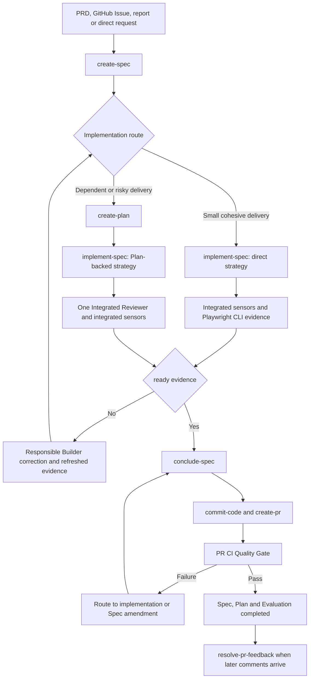

# Specification-Driven Development Rules

Specification-Driven Development (SDD) is the delivery workflow used for Scoops features
and feature-scoped changes. It keeps product intent, implementation contracts, execution
state, evidence, review and pull-request closure in durable repository artifacts.

SDD is not required for maintenance that does not need a feature Contract. The Orchestrator
classifies the request and uses a direct maintenance workflow when a Spec would add no useful
authority or traceability.

## Mandatory reading

Before starting or resuming any SDD workflow, read these repository authorities in full,
regardless of the initially expected paths or layers:

1. [`modules.md`](./modules.md) for business ownership and cross-module boundaries;
2. [`architecture.md`](./architecture.md) for system invariants and dependency direction;
3. [`rules.md`](./rules.md) for dynamic Rule selection, followed by every selected Rule;
4. [`tooling.md`](./tooling.md) for actual workspace, generation, validation and environment
   commands.

Read root and applicable nested `AGENTS.md` files before these documents. Re-run Rule
discovery and reread affected authority whenever the task expands or an authority changes.
Do not postpone Architecture, Modules or Tooling until implementation happens to cross a
boundary; they are mandatory SDD preflight inputs.

## Sources of authority

SDD does not replace repository documentation. A feature Spec is written from the applicable
sources of truth:

| Authority | Governs |
| --- | --- |
| Root and nested `AGENTS.md` | Agent behavior, repository safety and tool usage. |
| [`rules.md`](./rules.md) and selected Rules | Reusable implementation conventions for affected paths and behavior. |
| [`architecture.md`](./architecture.md) | System boundaries, dependency direction, consistency and integrations. |
| [`modules.md`](./modules.md) | Business-module ownership. |
| Module PRD | Product behavior, permissions, workflows and outcomes. |
| [`design.md`](./design.md) and saved design references | UI system and feature-specific visual intent. |
| [`tooling.md`](./tooling.md) | Real generation, validation, build and environment commands. |
| GitHub Issue, report or direct request | Delivery source and external traceability when present. |

When a requested feature requires a PRD, Rule, architecture, module, design or tooling
change, that authority is updated first. Product behavior, global Rules, architecture and
module ownership require explicit user approval. The Spec is then written against the
updated authority.

## Roles

SDD uses four roles. Prompt names such as `create-spec` or `conclude-spec` are workflows,
not additional agents.

| Role | Responsibility | Restrictions |
| --- | --- | --- |
| Orchestrator | The main agent selects workflows, owns artifact state, creates subagents, integrates Builder diffs, runs deterministic sensors, records evidence, publishes the PR and routes failures or changes. | Does not delegate integration or the official evidence verdict, skip required sensors or claim evidence that was not executed. |
| [Builder](./agents/builder-agent.md) | Implements one bounded direct, phase, task or fix scope against the current Spec revision and Rules. | Does not edit Spec, Plan, Evaluation, PRD or Rules; does not review its own work or publish delivery artifacts. |
| [Searcher](./agents/searcher-agent.md) | Researches one bounded codebase boundary and returns exact read-only evidence for Spec authoring. | Does not edit files, decide the Contract or create subagents. |
| [Integrated Reviewer](./agents/reviewer-agent.md) | Independently reviews one integrated Plan-backed candidate against the Spec, Rules, design references and current evidence. | Does not edit files, implement fixes, create subagents or decide the official evidence verdict. |

Builders are scoped subagents created by the Orchestrator in the current task. No subagent
creates another subagent, fork or user-owned task. Spec quality is enforced by clarification,
authoring-integrity checks, deterministic sensors and Playwright CLI evidence.

## Durable artifacts

Feature artifacts live under:

```text
documentation/features/<domain>/<feature>/
├── spec.md
├── plan.md                         # optional
├── evaluation.md                   # created at implementation kickoff
├── design/
│   ├── manifest.md                 # for design-backed UI
│   └── <reference screenshots>.png
```

Implementation screenshots are validation artifacts, not durable feature files. Capture
them in Playwright's ignored `test-results/` output or retain them as CI artifacts when a
review needs the pixels; record the state, viewport, comparison result and artifact
identifier in `evaluation.md`. Do not create or extend
`documentation/features/**/evidence/` for new features. Legacy evidence directories from
older revisions may remain in Git history, but they are not part of the current artifact tree.

New behavior for an already concluded feature uses:

```text
documentation/features/<domain>/<feature>/changes/<change-name>/
```

| Artifact | Owns | Does not own |
| --- | --- | --- |
| `spec.md` | Product, design, technical and validation Contracts. | Execution attempts or test results. |
| `plan.md` | Execution waves, dependencies, task ownership, status and next action. | Duplicate product or technical contracts. |
| `evaluation.md` | Actual commands, runtime/manual/visual evidence, findings, history and PR CI evidence. | Product or architecture authority. |
| `design/manifest.md` | Reference-frame inventory, source node, state, viewport, screenshot, implementation surface and comparison requirement. | Implementation-generated visual proof. |

## Artifact statuses

### Spec

| Status | Meaning |
| --- | --- |
| `draft` | The Contract is being created or materially amended. |
| `open` | The Contract passed authoring integrity and is implementation-ready. |
| `in_progress` | Implementation or conclusion is active. |
| `completed` | Final pull-request CI passed and delivery closure was recorded. |

### Plan and execution ledger

| Artifact | Statuses |
| --- | --- |
| Plan | `pending`, `in_progress`, `completed`, `superseded` |
| Phase, task or coverage row | `pending`, `in_progress`, `completed` |

Failures do not create extra status values. The affected item remains `in_progress`, with
the finding and next action recorded in the Plan and Evaluation. `superseded` is reserved
for a revised Spec that replaces the Plan or switches to direct implementation.

### Evaluation

| Item | Values | Meaning |
| --- | --- | --- |
| Evaluation status | `in_progress`, `ready`, `completed` | Evidence is being gathered, accepted and ready for conclusion, or closed after PR CI. |
| Validation result | `passed`, `failed`, `blocked` | Sensor-backed result stored in Evaluation history, not Evaluation metadata. |

## End-to-end lifecycle



Within an active SDD task, transitions are owned by the Orchestrator. “Return to
`create-spec`” means temporarily invoking its clarification and amendment workflow against
the same Spec; it does not require the user to rerun a prompt manually or create another
task. The same rule applies to every route between conclusion, implementation and amendment:
the Orchestrator invokes the destination immediately and resumes the caller automatically.

## 1. Optional issue creation

When the product outcome itself is undefined, the Orchestrator routes through
[`create-prd`](./prompts/create-prd-prompt.md) before feature SDD begins. Once an
authoritative request or PRD exists, GitHub Issue creation is optional traceability.

[`create-feat-issue`](./prompts/create-feat-issue.md) turns a product request into a concise
GitHub Issue containing outcome, scope, acceptance criteria and references. Detailed
layer contracts belong in the Spec, not the Issue.

Before writing to GitHub, the workflow presents the exact title, body, labels and milestone.
It submits only after the user explicitly approves that draft. Issue approval does not
authorize implementation, commits or a pull request.

## 2. Spec creation

[`create-spec`](./prompts/create-spec-prompt.md) researches the repository and writes the
implementation Contract. Before authoring it must resolve every material product,
technical, design and validation ambiguity. Questions include repository evidence, a
recommendation, alternatives and impact. Facts already fixed by authoritative documents
are not delegated back to the user.

The Spec has five top-level sections:

| Section | Content |
| --- | --- |
| Context and scope | Objective, source, current product gap, boundaries, product alignment and accepted assumptions. |
| Implementation Contract | Observable `RF-*` requirements, `CA-*` Given/When/Then acceptance, cross-cutting restrictions and conditional Design Contract. |
| Technical Contract | Current technical state, runtime flow, application/layer contracts and consequential technical decisions. |
| Validation Contract | Automated boundaries, executable `MV-*` manual scenarios, commands and evidence targets. |
| Documentation alignment and revision history | Governing documents, exact Rule Pack and material Spec revisions. |

The Technical Contract maps exact paths and declarations under the affected project layers:
Domain, Use cases, Interfaces, Validation, REST, Provision, Database, Messaging and UI.
Composition wiring is recorded where needed without moving business responsibility out of
its owning layer. Reusable Zod schemas belong to Validation; their application consumers
remain in their respective boundary layers. Migration paths include the complete expected
SQL body.

The Spec remains `draft` until its metadata, RF/CA traceability, technical map, design
bundle, manual scenarios, commands, links and Rule Pack pass integrity checks. There is no
separate Spec review stage. A valid Spec moves directly to `open` and its author summary recommends:

- direct `implement-spec` for a small cohesive change with stable dependencies;
- `create-plan` followed by Plan-backed `implement-spec` for dependent phases, shared
  ownership, meaningful parallelism or migration, provider, concurrency, security, visual
  or recovery risk.

## 3. Design-backed Specs

For UI backed by Pencil or supplied screenshots, the Spec creator:

1. visually inspects every relevant reference and records its visible inventory;
2. asks about behavior implied by a screenshot but not established by the request or PRD;
3. identifies missing states or viewports and classifies supplemental screenshots as
   required or recommended;
4. saves one reference image per required frame/state in the feature-local `design/` folder;
5. creates `design/manifest.md` with exact node, state, viewport, implementation surface and
   validation mapping;
6. verifies every image exists, is valid and non-empty, has the declared dimensions or
   export scale, and was opened for visual inspection.

The Spec stays `draft` when a required reference cannot be saved or a screenshot-derived
product ambiguity remains unresolved.

Builders and the Orchestrator use the saved bundle. They do not use live Pencil during normal
implementation. Pencil is reopened only when the Design Contract changes or the user requests
a reference refresh.

## 4. Optional Plan creation

[`create-plan`](./prompts/create-plan-prompt.md) creates `plan.md` only when the open Spec
recommends Plan-backed execution. The Plan cannot redefine the Contract; an ambiguity routes back
to Spec amendment.

The Plan contains:

| Section | Purpose |
| --- | --- |
| Execution status | Current Spec revision, phase, active Builders, next action, blockers and shared ownership. |
| Execution ledger | Waves, stable ownership Builders, phases, tasks, dependencies, non-overlapping paths and sensor-backed exits. |
| Validation and handoff | Scheduled automated, runtime, manual and visual evidence. |
| Execution log | Conditional record of findings, failed attempts or material execution events. |

Builders never edit the Plan. The Orchestrator keeps it current throughout implementation.

## 5. Implementation and living evidence

Implementation always starts through [`implement-spec`](./prompts/implement-spec-prompt.md).
It selects direct execution when no current Plan exists and Plan-backed execution when a
current Plan references the Spec revision. The common workflow:

1. freeze the current Spec revision;
2. set the Spec to `in_progress`, and the Plan when present;
3. create or reconcile `evaluation.md` from the canonical
   [`evaluation.md` template](./templates/evaluation.md) with `status: in_progress`;
4. activate bounded direct or stable ownership Builders with RF/CA coverage, allowed paths,
   assigned phases, Rules, Architecture and design references;
5. inspect and integrate Builder diffs, then run repository-approved integrated sensors; for
   Plan-backed execution, activate one read-only Integrated Reviewer in parallel;
6. verify applicable review findings and record exact results, findings and validation-artifact
   freshness in Evaluation;
7. resume the responsible Builder for corrections when possible and rerun only invalidated
   evidence until the Evaluation is ready.

The direct route activates `Builder Direct` in the current agent context. The Plan route derives
stable ownership Builders from affected application, package and module boundaries, reuses each
Builder across related phases and defaults to at most three concurrent implementation Builders.
It does not create agents linearly with phases, tasks or package count. Builders run in parallel
only when their contracts are stable and paths do not overlap. After integration, exactly one
Integrated Reviewer checks the complete candidate, including UI and server-backed surfaces when
affected; no per-Builder, per-phase, per-application, per-package or specialist Reviewers are
created. The Orchestrator coordinates root configuration, lockfiles, shared files, generated
artifacts, integration and the official evidence verdict.

Builder reports are not official evidence. The Orchestrator must verify the diff and sensor
results. Validation artifacts tied to an earlier affected diff are marked historical or stale
rather than silently reused; transient screenshots are regenerated under `test-results/` or
as CI artifacts instead of being committed under feature documentation.

The canonical [`evaluation.md` template](./templates/evaluation.md) fixes the table structure
and stable evidence IDs. An Evaluation records:

- Spec and Plan references, revision and status;
- acceptance matrix;
- automated and runtime command evidence;
- manual and visual evidence;
- Rule and documentation compliance;
- findings and their resolution;
- implementation and validation history;
- PR candidate and CI evidence during conclusion;
- chronological evaluation history.

## 6. Integrated validation

After the integrated implementation is current, Plan-backed execution activates one read-only
Integrated Reviewer while the Orchestrator runs the required Core, Validation, Server, Web,
database, build and Playwright CLI sensors. Direct execution does not require a separate Reviewer
unless the Spec or another repository authority requires one. The Reviewer covers cross-Builder
contracts and, when UI is affected, inspects every final visual comparison and independently
replays high-risk Playwright CLI interactions. The Orchestrator compares every transient
implementation capture with its original saved reference at the exact viewport and state, records
each CA and MV result, and inspects console, network and persisted-state evidence.

On a failed sensor or material discrepancy, findings are recorded, the responsible Builder is
resumed when possible, affected evidence is invalidated and the sensors are rerun on the updated
implementation. A scoped Builder Fix is activated only when the responsible Builder cannot be
resumed or the correction is genuinely independent. Reviewer reports are not evidence; the
Orchestrator verifies and records accepted findings, and the same Integrated Reviewer rechecks any
corrected candidate. When all required evidence and applicable review results are current and no
verified blocking finding remains, Evaluation becomes `ready`; the Plan route also completes its
integrated phase and Plan before routing to conclusion.

## 7. Changes before conclusion

Every user-requested change after implementation starts is classified before code or
artifacts are changed:

| Classification | Meaning | SDD action |
| --- | --- | --- |
| Implementation correction | Existing implementation does not satisfy the current Spec, Design Contract or Rule. | Keep the Spec revision, record a finding, reopen affected work/evidence, resume the responsible Builder when possible and rerun the affected validation. |
| Contract change | Requested product behavior, design intent or technical boundary differs from the current Spec. | Set the Spec to `draft`, route through `create-spec`, update higher authority first when required, increment revision, refresh affected design/validation, reopen and reroute implementation. |

Earlier evidence and verdicts affected by a new Spec revision remain as historical records.
If the route changes from Plan to direct implementation, the Plan becomes `superseded`.

## 8. PR publication, CI and closure

[`conclude-spec`](./prompts/conclude-spec-prompt.md) starts only when the Spec is
`in_progress`, Evaluation is `ready`, the integrated implementation is validated and no blocking
finding remains. Conclusion does not edit code directly; when it finds an in-Contract
correction, it invokes the applicable implementation workflow, which creates the Builder and
refreshes validation before returning control to conclusion.

With user authorization to commit, push and publish, conclusion:

1. runs the required local preflight;
2. verifies generated artifacts, migrations, design evidence and documentation;
3. uses `commit-code` for scoped commits;
4. invokes [`create-pr`](./prompts/create-pr-prompt.md) mandatorily whenever the delivery PR
   is missing, points at an earlier candidate SHA, or has stale/incomplete publication details;
   `conclude-spec` does not bypass this workflow with ad hoc PR edits;
5. records the branch and PR URL;
6. waits for every applicable checked-in GitHub Actions workflow on the current PR head SHA;
7. records workflow name, result, run URL and tested SHA in Evaluation.

SDD artifacts do not track a repository base, current or candidate commit. The SHA in the PR CI
table is limited to identifying the exact PR revision checked by GitHub and is not SDD status
metadata.

Local checks, a branch-push run, an earlier SHA or a missing expected workflow do not satisfy
the final PR CI gate. A CI implementation or Contract failure routes back to the appropriate
workflow; only a demonstrated transient infrastructure failure may rerun the same SHA.
Routing is not a terminal result: the Orchestrator immediately runs the correction or
amendment workflow, updates the same PR and resumes the CI gate. It must not report the
workflow as a next action or ask whether to fix an in-Contract failure. It pauses only for
missing authority, a required product or technical decision, an external blocker, or the
documented repeated-failure limit.

After applicable CI passes, conclusion sets Evaluation, Plan when present, and Spec to
`completed`. It does not create a closure-only commit solely for SDD ledger status changes;
any required implementation or product-documentation commit updates the same PR and its
resulting checks must pass. Conclusion does not merge or deploy unless the user explicitly
asks.

## 9. Pull-request feedback and reopening

[`resolve-pr-feedback`](./prompts/resolve-pr-feedback-prompt.md) may run later while the PR is
open. It classifies each actionable conversation:

| Feedback | Action |
| --- | --- |
| Explanation only | Reply with evidence; do not reopen SDD artifacts. |
| PR metadata correction | Update title, body, labels or traceability; do not reopen the Spec. |
| Implementation correction | Move the same completed Spec back to `open` without a revision increment, set Evaluation and affected Plan work to `in_progress`, implement/validate, then invoke conclusion again. |
| Contract change | Move the Spec to `draft`, route through `create-spec`, increment the revision, reconcile Plan/Evaluation, implement/validate, then invoke conclusion again. |

The feedback workflow owns comment inspection, classification, replies and reopening. It
does not implement changes or own final CI. After merge, defects use the
bug-fix workflow and changed behavior uses a new change Spec.

## Workflow registry

| Workflow | Source |
| --- | --- |
| Define an unresolved product outcome | [`create-prd-prompt.md`](./prompts/create-prd-prompt.md) |
| Create an approved feature Issue | [`create-feat-issue.md`](./prompts/create-feat-issue.md) |
| Create or amend a Spec | [`create-spec-prompt.md`](./prompts/create-spec-prompt.md) |
| Create an optional Plan | [`create-plan-prompt.md`](./prompts/create-plan-prompt.md) |
| Implement directly or through a Plan | [`implement-spec-prompt.md`](./prompts/implement-spec-prompt.md) |
| Publish, run PR CI and close | [`conclude-spec-prompt.md`](./prompts/conclude-spec-prompt.md) |
| Create or update the delivery PR | [`create-pr-prompt.md`](./prompts/create-pr-prompt.md) |
| Resolve later PR comments | [`resolve-pr-feedback-prompt.md`](./prompts/resolve-pr-feedback-prompt.md) |

The files under `documentation/prompts/` are canonical. `scripts/sync-commands.sh`
synchronizes their generated command and skill representations.
